# 第六章：滑块和进度条小部件

滑块组件允许我们实现一个引人入胜且易于使用的小部件，我们的访问者应该会发现它吸引人且直观易用。它的基本功能很简单。滑块轨道表示一系列由沿着轨道拖动的手柄选择的值。

进度条部件用于显示任意过程的完成百分比。这是一个简单易用的组件，具有极其紧凑的 API，为访问者提供了出色的视觉反馈。

在本章中，我们将涵盖以下主题：

+   默认的滑块实现

+   滑块的自定义样式

+   更改配置选项

+   创建垂直滑块

+   设置最小值、最大值和默认值

+   启用多个手柄和范围

+   滑块的内置事件回调

+   滑块方法

+   进度条的默认实现

+   可配置的选项

+   小部件公开的事件 API

+   进度条公开的唯一方法

+   进度条的一些真实世界示例

在我们卷起袖子开始创建滑块之前，让我们看一下它由哪些不同的元素组成。以下图示显示了一个典型的滑块小部件：

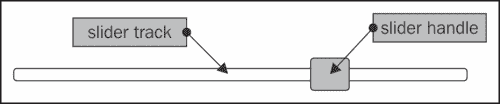

正如您所见，这是一个简单的小部件，只由两个主要元素组成——**滑块手柄**（有时称为拇指）和**滑块轨道**。

# 引入滑块部件

创建默认的基本滑块所需的代码与我们迄今为止看过的任何其他小部件一样少。所需的基本 HTML 标记也很少。现在让我们创建一个基本的滑块。在文本编辑器的新页面中，添加以下代码：

```js
<!DOCTYPE html>
<html>
<head>
  <meta charset="utf-8">
  <title>Slider</title>
  <link rel="stylesheet" href="development-bundle/themes/redmond/jquery.ui.all.css">
  <script src="img/jquery-2.0.3.js"></script>
  <script src="img/jquery.ui.core.js"></script>
  <script src="img/jquery.ui.widget.js"></script>
  <script src="img/jquery.ui.mouse.js"></script>
  <script src="img/jquery.ui.slider.js"></script>
  <script>
    $(document).ready(function($){
      $("#mySlider").slider();
    });
  </script>
</head>
<body>
  <div id="mySlider"></div>
</body>
</html>
```

将此文件保存为`slider1.html`并在浏览器中查看。页面上有一个简单的容器元素；该元素将由小部件转换为滑块轨道。在代码的`<head>`部分中的`<script>`内，我们选择此元素并在其上调用`slider`方法。用于滑块手柄的`<a>`元素将由小部件自动创建。

当我们在浏览器中运行`slider1.html`文件时，我们应该会看到类似于上一个图示的东西。我们为默认实现使用了几个库资源，包括以下文件：

+   `jquery.ui.all.css`

+   `jquery-2.0.3.js`

+   `jquery.ui.core.js`

+   `jquery.ui.widget.js`

+   `jquery.ui.mouse.js`

+   `jquery.ui.slider.js`

基本滑块的默认行为简单而有效。可以通过用鼠标指针拖动拇指或使用键盘上的左/下或右/上箭头键，在 x 轴上沿轨道的任何像素移动拇指。使用鼠标左键单击轨道上的任何位置将立即将手柄移动到该位置。

# 自定义样式

由于其简单性，很容易为滑块小部件创建自定义主题。使用 ThemeRoller 是其中一种主题化的方法：我们只需下载一个新主题，然后将其放入主题文件夹，并在代码中更改对新主题的引用名称。与所有其他小部件一样，滑块将被重新设计为使用新主题。

要完全改变小部件的外观和感觉，我们可以轻松创建自己的主题文件。在您的文本编辑器中创建以下样式表：

```js
.background-div {
  height: 50px; width: 217px; padding: 36px 0 0 24px;
  background:  url(../img/slider_outerbg.gif) no-repeat;
}
#mySlider {
  background: url(../img/slider_bg.gif) no-repeat; height: 23px;
  width: 184px; border: none; top: 4px; position: relative; 
  left: 4px;
 }
#mySlider .ui-slider-handle {
  width: 14px; height: 30px; top: -4px;
  background: url(../img/slider_handle.gif) no-repeat;
}
```

将此文件保存为`sliderTheme.css`，放在`css`目录中。在`slider1.html`中，在页面的`<head>`标签中添加一个链接到样式表（在 jQuery UI 样式表之后），并将底层滑块元素包裹在一个新容器中：

```js
<div class="background-div">
  <div id="mySlider"></div>
</div>

```

将此文件保存为`slider2.html`。只需最少量的 CSS 和几张图片（这些可以在代码下载中找到），我们就可以轻松但显著地修改小部件的外观，如下面的屏幕截图所示：

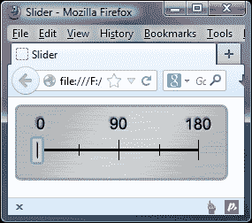

让我们转向如何配置滑块小部件，使用一些选项。

# 配置基本滑块

还可以使用对象文字配置额外的功能，例如垂直滑块、多个手柄和步进，这些功能在初始化滑块时传递到小部件方法中。可以与滑块小部件一起使用的选项列在以下表格中：

| 选项 | 默认值 | 用法 |
| --- | --- | --- |
| `animate` | `false` | 当单击轨道时启用滑块手柄的平滑动画。 |
| `disabled` | `false` | 当初始化小部件时禁用小部件。 |
| `max` | `100` | 设置滑块的最大值。 |
| `min` | `0` | 设置滑块的最小值。 |
| `orientation` | `auto` | 设置滑块手柄移动的轴。这可以接受字符串垂直或水平。 |
| `range` | `false` | 在它们之间创建一个可定制样式的元素范围。 |
| `step` | `1` | 设置手柄沿轨道移动的步距。最大值必须能够被提供的数字整除。 |
| `value` | `0` | 在初始化小部件时设置滑块手柄的值。 |
| `values` | `null` | 接受一个值数组。每个提供的整数将成为滑块手柄的值。 |

## 创建一个垂直滑块

要创建一个垂直滑块，我们只需将`orientation`选项设置为`vertical`；小部件将为我们完成其余工作。

在`slider1.html`中，更改最后的`<script>`元素，使其如下所示：

```js
<script>
  $(document).ready(function($){
 $("#mySlider").slider({
 orientation: "vertical"
 });
  });
</script>
```

将此文件保存为`slider3.html`。我们只需要设置这个单一选项就可以将滑块放入`vertical`模式。当我们启动页面时，我们会看到滑块的操作与以前完全相同，只是现在它沿着 y 轴移动，如下图所示：

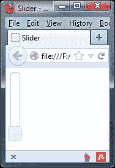

小部件默认高度为`100px`，除非我们在样式表中为`.ui-slider-vertical`提供自己的 CSS 规则。

## 设置最大值和最小值

默认情况下，滑块的最小值为`0`，最大值为`100`，但是我们可以使用`min`和`max`选项轻松更改这些值。将`slider3.html`中的配置对象更改为以下代码：

```js
$("#mySlider").slider({
 min: -50,
 max: 50
});
```

将此文件保存为`slider4.html`。我们只需指定我们希望设置为起始和结束值的整数。`value`和`values`方法是滑块专有的，并且用于获取或设置单个或多个手柄的值。由于`value`选项默认设置为`0`，当我们运行`slider4.html`文件时，滑块拇指将从轨道中间开始，在`-50`和`50`之间。

在此示例中，当滑块手柄位于最小值时，`value`方法将返回`-50`，正如我们所期望的那样。为了证明这一点，我们可以修改`slider4.html`以在警报中显示此值。在滑块配置对象的下方立即添加以下代码：

```js
$("#getValue").click(function(){
  var value = $("#mySlider").slider("value");
  alert("Value of slider is " + value);
});
```

在`<body>`标记中，将其更改如下：

```js
  <div id="mySlider"></div>
<p>
<button id="getValue">Get value of slider</button>

```

如果我们现在尝试在浏览器中预览更改，当您将手柄移动到滑块的最左端时，将会弹出一个警报。我们将在本章的*使用滑块方法*部分中探讨`value`选项。

## 使用滑块小部件进行步进

`step`选项是指滑块手柄在从轨道的最小位置移动到最大位置时跳跃的步数和位置。了解此选项如何工作的最佳方法是将其实际操作，因此将`slider4.html`中的配置对象更改为以下代码：

```js
$("#mySlider").slider({
 step: 25
});
```

将此文件保存为`slider5.html`。在此示例中，我们将`step`选项设置为`25`。我们尚未设置`min`或`max`选项，因此它们将采用默认值`0`和`100`。因此，通过将`step`设置为`25`，我们的意思是沿着轨道的每一步应该是轨道长度的四分之一，因为`100`（最大值）除以`25`（步长值）等于`4`。因此，手柄将沿着轨道从头到尾走四步。

滑块的`max`值应该被设置为`step`选项设置的任何值的整数倍；除此之外，我们可以自由选择任何值。`step`选项对于将访问者选择的值限制在一组预定义值中非常有用。

如果我们在这个例子中将`step`选项的值设置为`27`而不是`25`，滑块仍然可以工作，但手柄跳转到的轨道上的点将不相等。

## 对滑块小部件进行动画处理

滑块小部件配有内置动画，每当单击滑块轨道时，该动画会将滑块手柄平滑地移动到新位置。此动画默认情况下是禁用的，但我们可以通过将`animate`选项设置为`true`来轻松启用它。更改`slider5.html`中的配置对象，使其如下所示：

```js
$("#mySlider").slider({
 animate: true
});
```

将此文件保存为`slider6.html`。这个简单的改变可以让滑块感觉更加精致；当点击轨道时，滑块手柄不再立即移动到新位置，而是平滑地滑动到那里。

如果将`step`选项配置为`1`之外的值，并启用`animate`选项，则拇指将滑动到轨道上最近的步骤标记处。这可能意味着滑块拇指移动超过了被点击的点。

## 设置滑块的值

`value`选项，当在配置对象中设置为`true`时，确定滑块拇指的起始值。根据我们想要滑块表示的内容，手柄的起始值可能不是`0`。如果我们想要在轨道的中间开始而不是在开头，我们可以使用以下配置对象：

```js
$("#mySlider").slider({
 value: 50
});
```

将此文件保存为`slider7.html`。当在浏览器中加载文件时，我们可以看到手柄从轨道中间开始，而不是从开头开始，就像我们之前设置`min`和`max`选项时一样。我们也可以在初始化后设置此选项，以编程方式设置新值。

## 使用多个手柄

我之前提到过滑块可能有多个手柄；可以使用`values`选项添加额外的手柄。它接受一个数组，数组中的每个项都是一个手柄的起始点。我们可以指定尽可能多的项，直到`max`值（考虑到步骤）：

```js
$("#mySlider").slider({
 values: [25, 75]
});
```

将此文件保存为`slider8.html`。这是我们需要做的一切；我们不需要提供任何额外的底层标记。小部件已为我们创建了两个新手柄，正如您将看到的，它们的功能都与标准单手柄完全相同。

下面的截图显示了我们的双手柄滑块：

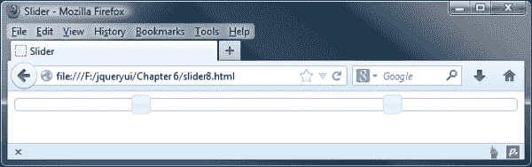

我们可以利用双手柄滑块创建时间窗口以供日程安排使用。一个很好的例子是在旅行预订表格上。通常你需要手动输入日期，这可能有点笨拙。

相反，您可以使用双手柄滑块选择日期；用户只需将每个手柄向左或向右滑动以更改日期窗口。然后，我们可以使用本章前面描述的*设置最小值和最大值*部分中描述的方法来获取每个滑块手柄的位置值。

### 提示

当滑块有两个或更多手柄时，每个手柄都可以无障碍地移动到其他手柄之后；如果需要阻止此情况发生，可能需要考虑设置一个`range`。

## 使用范围选项

当使用多个手柄时，我们可以将`range`选项设置为`true`。这将在两个手柄之间添加一个样式化的范围元素。在`slider8.html`中，更改配置对象如下：

```js
$("#mySlider").slider({
  values: [25, 75],
 range: true
});
```

将此文件保存为`slider9.html`。当页面加载时，我们应该看到一个样式化的`<div>`元素现在连接了我们的两个手柄，如下面的截图所示：

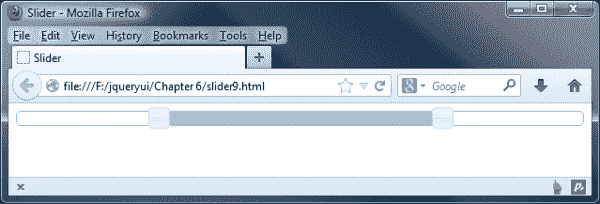

当使用两个手柄和一个范围时，两个手柄将无法在轨道上交叉。

最多可以使用两个手柄与`range`选项一起使用，但我们也可以仅启用一个手柄将上一个示例中的配置对象更改为以下内容：

```js
$("#mySlider").slider({
 range: "min"
});
```

将此文件保存为`slider10.html`。除了布尔值`true`，我们还可以提供字符串值`min`或`max`中的一个，但仅当仅使用一个手柄时。

在这个例子中，我们将其设置为`min`，所以当我们沿着轨道移动滑块手柄时，范围元素将从轨道的起点延伸到滑块手柄。如果我们将选项设置为`max`，范围将从手柄延伸到轨道的末端。

如果您想要捕获手柄在刻度上的位置，我们可以通过使用`slide`事件处理程序来实现。在这种情况下，我们只需要获取一个值（因为我们只有一个手柄），但是如果配置了第二个手柄，同样的原则也适用。

在`slider4.html`中，将以下函数添加到我们滑块的配置对象的上方：

```js
function slideValues(event, ui){
  var val0 = $("#mySlider").slider("values", 0),
    endValue = parseInt(val0, 10);

  $("#rangeValues").text("Range: 0 - " + endValue);
}:
```

然后，我们需要修改配置对象，以在适当的时候调用我们的`slideValues`事件处理程序：

```js
$("#mySlider").slider({
  range: "min",
 slide: slideValues
});
```

因此，我们可以在现有标记的`<body>`部分下方添加以下内容以在屏幕上显示结果：

```js
<div id="rangeValues"></div>
```

然后，我们可以按照我们的意愿操作该值；如果你预览结果，你将看到右侧的值发生变化；左侧的值将始终保持为`0`，因为这是我们代码中`min`选项的默认值。

# 使用滑块的事件 API

除了我们之前看到的选项外，还有另外五个选项用于定义在滑块交互期间不同时间执行的函数。我们使用的任何回调函数都会自动传递标准事件对象和表示滑块的对象。以下表格列出了我们可以使用的事件选项：

| 事件 | 触发时… |
| --- | --- |
| `change` | 滑块的手柄停止移动并且其值已更改。 |
| `create` | 滑块已创建 |
| `slide` | 滑块的手柄移动。 |
| `start` | 滑块的手柄开始移动。 |
| `stop` | 滑块的手柄停止移动。 |

连接到这些内置的回调函数很容易。让我们组合一个基本示例来看看。将`slider10.html`中的配置对象更改为如下所示：

```js
$("#mySlider").slider({
 start: function() {
 $("#tip").fadeOut(function() {
 $(this).remove();
 });
 },
 change: function(e, ui) {
 $("<div></div>", {
 "class": "ui-widget-header ui-corner-all",
 id: "tip",
 text: ui.value + "%",
 css: { left: e.pageX-35 }
 }).appendTo("#mySlider");
 }
});
```

将此文件保存为`slider11.html`。在这个例子中，我们使用了两个回调选项——`start`和`change`。在`start`函数中，如果存在，我们选择提示工具元素，并使用 jQuery 的`fadeOut()`方法将其淡出。一旦从视图中隐藏，它将从页面中移除。

每次滑块手柄的值更改时都将执行`change`函数；当调用该函数时，我们创建工具提示并将其附加到滑块上。我们将其定位，使其出现在滑块手柄的中心上方，并给它一些框架类名称，以便根据使用的主题对其进行样式化。

在几个地方，我们使用传递给回调函数的第二个对象，即包含滑块有用信息的准备好的`ui`对象。在这个例子中，我们使用对象的`value`选项来获取滑块手柄的新值。

对于这个例子，我们还需要一个非常小的自定义样式表。在文本编辑器中，添加以下代码：

```js
#mySlider { margin: 60px auto 0; }
#tip { position: absolute; display: inline; padding: 5px 0; width: 50px; text-align: center; font: bold 11px Verdana; top: -40px }
```

将此文件保存为`css`文件夹中的`sliderTheme2.css`，并从`slider11.html`的`<head>`中添加一个链接。当显示时，我们的工具提示应该如下图所示：

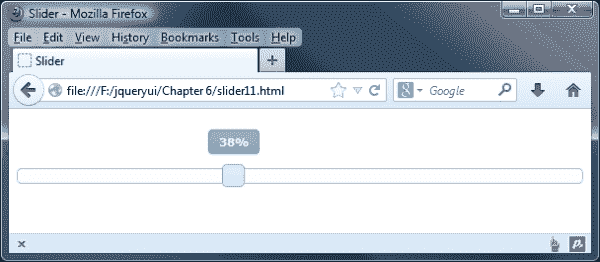

当所有事件选项一起使用时，事件将按以下顺序触发：

+   `create`

+   `start`

+   `slide`

+   `stop`

+   `change`

`slide`回调可能是一个相当密集的事件，因为它在每次选择手柄时都会触发鼠标移动，但它也可以通过从回调函数返回`false`来防止在某些情况下滑动。当同时使用`stop`和`change`回调时，`change`回调可能会覆盖`stop`回调。

与库中的所有组件一样，每个事件也可以在 jQuery 的`on()`方法中使用，只需在事件名前加上`slider`一词即可，例如，`sliderstart`。

## 使用滑块方法

滑块很直观，与库中的其他组件一样，它还配备了一系列方法，用于在初始化后以编程方式控制小部件。滑块特有的方法显示在下表中：

| 方法 | 用法 |
| --- | --- |
| `value` | 将单个滑块手柄设置为新值。这将自动将手柄移动到轨道上的新位置。此方法接受一个参数，即表示新值的整数。 |
| `values` | 当使用多个手柄时，设置指定手柄移动到新值。此方法与`value`方法相同，只是它接受两个参数——手柄的索引号，后跟新值。 |

`destroy`、`disable`、`enable`、`option`和`widget`方法对所有组件都是通用的，并且与我们期望的滑块的方式相同地工作。

正如我们在本章早些时候看到的，`value`和`values`方法是专门针对滑块的，并且可以用于获取或设置单个或多个手柄的值。当然，我们也可以使用`option`方法来实现这一点，所以这两种方法只是为了满足常见的实现需求而设置的快捷方式。让我们看看它们的作用。首先让我们看看`value`方法如何使用。

在`slider11.html`中，删除对`sliderTheme2.css`的`<link>`并在页面上的滑块容器后直接添加一个新的`<button>`元素：

```js
<p><button type="button" id="setMax">Set to max value</button></p>
```

现在，更改最终的`<script>`元素，使其如下所示：

```js
<script>
  $(document).ready(function($){
 $("#mySlider").slider();
 $("#setMax").click(function() {
 var maxVal = $("#mySlider").slider("option", "max");
 $("#mySlider").slider("value", maxVal);
 });
  });
</script>
```

将此文件保存为`slider12.html`。我们为新的`<button>`添加了一个点击处理程序；每当它被点击时，此方法将首先确定滑块的最大值，方法是通过将一个变量设置为`option`方法的结果来指定我们想要获取的选项为`max`。一旦我们有了最大值，然后我们调用`value`方法，传入包含最大值的变量作为第二个参数；我们的变量将被用作新值。每当按钮被点击时，滑块手柄将立即移动到轨道的末端。

### 提示

**将值作为选项或方法使用**

在本章的许多示例中，我们提到了`value`（或`values`）作为选项或方法。这可能有点令人困惑；把`value`方法看作是在代码中使用值选项作为 getter 的快捷方式。

使用多个手柄同样简单，但涉及略有不同的方法。

在`slider12.html`中删除`setMax`按钮，并直接在滑块元素后添加以下两个按钮：

```js
<p>
<button type="button" class="preset" id="low">Preset 1 (low) </button>
<button type="button" class="preset" id="high">Preset 2 (high) </button>
```

现在将`<head>`末尾的最后一个`<script>`元素更改为以下代码：

```js
<script>
  $(document).ready(function($){
 $("#mySlider").slider({ 
 values: [25, 75] 
 });

 $(".preset").click(function() {
 if (this.id === "low") {
 $("#mySlider").slider("values", 0, 0).slider("values", 1, 25);
 } else {
 $("#mySlider").slider("values", 0, 75).slider("values" , 
 1, 100);
 }
 });
  });
</script>
```

将此文件保存为`slider13.html`。要触发多个手柄，我们在配置对象中指定了两个手柄的值。当页面上的两个`<button>`元素中的任何一个被点击时，我们会确定是单击了**预设 1**还是**预设 2**，然后根据点击的按钮设置手柄为低值或高值。

### 提示

你也可以使用数组表示法来设置滑块中的值；这将为所有手柄设置相同的值，而不管存在多少手柄。

`values`方法接受两个参数。第一个参数是我们想要更改的手柄的索引号，第二个参数是我们希望手柄设置的值。以下截图显示了在单击第二个按钮后页面应该显示的样子：

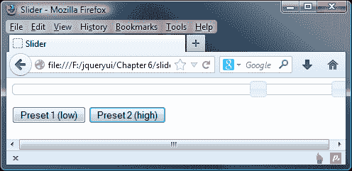

# 实际用途

HTML5 元素可能特别适合滑块小部件的实现是`<audio>`元素。此元素将自动添加控件，使访问者可以播放、暂停和调整正在播放的媒体的音量。

但是，默认控件无法进行样式化；如果我们希望改变它们的外观，就需要创建我们自己的控件。当然，滑块小部件是默认音量控制的绝佳替代品。让我们看看如何添加一个，作为你自己项目的基础，你可以在其中进一步发展。

在文本编辑器中创建以下新代码：

```js
<!DOCTYPE html>
<html>
<head>
  <meta charset="utf-8">
  <title>Slider</title>
  <link rel="stylesheet" href="development-bundle/themes/redmond/jquery.ui.all.css">
  <link rel="stylesheet" href="css/sliderTheme3.css">
  <script src="img/jquery-2.0.3.js"></script>
  <script src="img/jquery.ui.core.js"></script>
  <script src="img/jquery.ui.widget.js"></script>
  <script src="img/jquery.ui.mouse.js"></script>
  <script src="img/jquery.ui.slider.js"></script>
  <script>
    $(document).ready(function($){
      var audio = $("audio")[0];
      audio.volume = 0.5;
      audio.play();
      $("#volume").slider({
        value: 5,
        min: 0,
        max: 10,
        change: function() {
          var vol = $(this).slider("value") / 10;
          audio.volume = vol;
        }
      });
    });
  </script>
</head>
<body>
  <audio id="audio" controls="controls" src="img/prelude.mp3">
    Your browser does not support the <code>audio</code> element.
  </audio>
  <div id="volume"></div>
</body>
</html>
```

将此文件保存为`slider14.html`。我们还需要添加一些样式来调整显示。在文本编辑器中的新页面中添加以下内容，并将其保存为`sliderTheme3.css`：

```js
#volume { padding-top: 5px; }
#volume.ui-slider { width: 300px; }
.ui-slider-horizontal .ui-slider-handle { margin-left: -0.6em; top: -0.1em; }
```

不要忘记从主页添加到`sliderTheme3.css`的链接：

```js
<link rel="stylesheet" href="css/sliderTheme3.css">
```

在`slider14.html`页面上，我们有一个`<audio>`标记，其`src`属性设置为来自互联网档案馆的音频剪辑。我们还有一个空的容器元素用于我们的音量控制。

### 注意

这个示例使用了 Jan Morgenstern 为大兔子电影创建的音乐配乐文件之一；你可以在 [`archive.org/details/JanMorgenstern-BigBuckBunny`](https://archive.org/details/JanMorgenstern-BigBuckBunny) 下载它以及收藏中的其他文件。

在脚本中，我们首先使用标准的 jQuery 语法选择`<audio>`元素，并从 jQuery 对象中检索实际的 DOM 元素，以便我们可以从`<audio>`API 中调用方法。

接下来，我们为我们的滑块定义配置对象并设置初始最小和最大值。然后，我们添加一个用于更改当前播放音轨音量的`change`事件处理程序，使用`volume`属性方法。每当滑块被更改时，我们都会得到一个新的滑块值，并将其转换为所需的`volume`属性格式，方法是将滑块值除以`10`。一旦我们的变量被定义，我们就设置音频剪辑的音量，并立即使用`play()`方法播放音频剪辑。

当我们在支持的浏览器中运行此示例时，我们可以暂停或播放音频剪辑；如果移动滑块手柄，则剪辑的音量应该增加或减少，如下图所示：

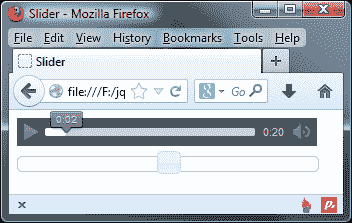

# 创建一个颜色滑块

在某些应用程序中非常有用的滑块小部件的有趣实现是颜色滑块。让我们将学到的关于此小部件的知识付诸实践，制作一个基本的颜色选择工具。以下屏幕截图显示了我们将要制作的页面：

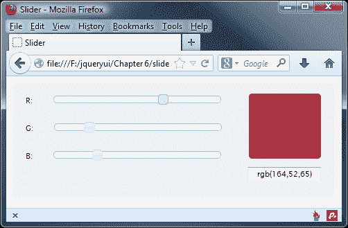

在你的文本编辑器中，将`slider1.html`中的`<body>`标记更改为以下代码：

```js
<div id="container" class="ui-widget ui-corner-all ui-widget-content ui-helper-clearfix">
  <label>R:</label>
  <div id="rSlider"></div><br>
  <label>G:</label>
  <div id="gSlider"></div><br>
  <label>B:</label>
  <div id="bSlider"></div>
  <div id="colorBox" class="ui-corner-all ui-widget-content"></div>
  <label for="output" id="outputLabel">Color value:</label>
  <input id="output" type="text" value="rgb(255,255,255)">
</div>
```

现在让我们为我们的演示添加`script`功能，所以请继续移除最后一个`<script>`元素的内容，并添加以下代码：

```js
<script>
  $(document).ready(function($){
    $("#rSlider, #gSlider, #bSlider").slider({
      min:0,
      max: 255,
      value: 255,
      slide: function() {
        var r = $("#rSlider").slider("value"),
        g = $("#gSlider").slider("value"),
        b = $("#bSlider").slider("value");
        var rgbString = ["rgb(", r, ",", g, ",", b, ")"].join("");
        $("#colorBox").css({
          backgroundColor: rgbString
        });
        $("#output").val(rgbString);
      }
    });
  });
</script>
```

将此文件保存为`slider15.html`。页面本身非常简单。我们有一些主要用于显示颜色滑块的不同组件的元素，以及将被转换为滑块小部件的各个容器元素。我们为我们的颜色选择器使用了三个滑块，每个滑块对应一个 RGB 通道。

我们还需要一些 CSS 来完善我们小部件的整体外观。在你的文本编辑器中新建一个页面，创建以下样式表：

```js
#container { width: 426px; height: 146px; padding: 20px 20px 0; position: relative; font-size: 11px; background: #eee; }
#container label { float: left; text-align: right; margin: 0 30px 26px 0; clear: left; }
.ui-slider { width: 240px; float: left; }
.ui-slider-handle { width: 15px; height: 27px; }
#colorBox { width: 104px; height: 94px; float: right; margin: -83px 0 0 0; background: #fff; }
#container #outputLabel { float: right; margin: -14px 34px 0 0; }
#output { width: 100px; text-align: center; float: right; clear: both; margin-top: -17px; }
```

将此文件保存为`colorSliderTheme.css`在`css`文件夹中；别忘了在主文件中调用 jQuery UI 样式表后立即添加对此文件的链接：

```js
<link rel="stylesheet" href="css/colorSliderTheme.css">
```

在我们的代码中，我们给容器和颜色框元素分配了来自 CSS 框架的类名，这样我们就可以利用诸如圆角之类的效果，以减少我们自己编写的 CSS 量。

关注 JavaScript 代码，我们首先设置配置对象。由于 RGB 颜色值范围从`0`到`255`，我们将`max`选项设置为`255`，将`value`选项也设置为`255`，这样小部件手柄就会在正确的位置开始（页面加载时，颜色框将具有白色背景）。

`slide`回调是行动发生的地方。每当移动一个手柄时，我们都会使用`value`方法更新`r`、`g`和`b`变量的值，然后从我们的变量值构造一个新的 RGB 字符串。这是必要的，因为我们不能直接将变量传递给 jQuery 的`css()`方法。我们还会更新`<input>`字段中的值。

运行示例时，我们应该发现一切都按预期工作。一旦我们开始移动任何一个滑块手柄，颜色框就开始变色，而`<input>`也会更新。

### 注意

`slide`事件在选定手柄后的每次鼠标移动时触发；这是一个潜在的密集型事件，在旧浏览器或慢速计算机上可能会引起问题。因此，在生产环境中使用时应谨慎，以使事件处理程序中的不必要操作最小化。

# 引入进度条小部件

小部件只由两个嵌套的`<div>`元素组成——一个外部`<div>`容器和一个内部`<div>`容器，用于突出显示当前进度。下图显示了一个完成 50%的进度条：

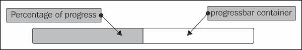

让我们来看看最基本的进度条实现。在文本编辑器中的新文件中，创建以下代码：

```js
<!DOCTYPE html>
<html>
<head>
  <meta charset="utf-8">
  <title>Progressbar</title>
  <link rel="stylesheet" href="development-bundle/themes/redmond/jquery.ui.all.css">
  <script src="img/jquery-2.0.3.js"></script>
  <script src="img/jquery.ui.core.js"></script>
  <script src="img/jquery.ui.widget.js"></script>
  <script src="img/jquery.ui.progressbar.js"></script>
  <script>
    $(document).ready(function($){
      $("#myProgressbar").progressbar();
    });
  </script>
</head>
<body>
  <div id="myProgressbar"></div>
</body>
</html>
```

将此文件保存为`jqueryui`项目文件夹中的`progressbar1.html`。没有配置时，进度条当然是空的。我们的示例应该看起来像第一张截图，但没有显示任何进度（容器为空）。

进度条依赖以下组件：

+   `jquery.ui.all.css`

+   `jquery-2.0.3.js`

+   `jquery-ui.core.js`

+   `jquery-ui.progressbar.js`

页面上所需的全部就是一个简单的容器元素。在这种情况下，我们使用了一个`<div>`元素，但是其他块级元素，比如`<p>`，也可以使用。小部件会在初始化时向指定的容器元素添加一个表示进度条值的嵌套`<div>`元素。

此小部件与其他一些小部件（如手风琴）一样，会自然填满其容器的宽度。其他也以类似方式工作的小部件包括标签页、手风琴、滑块和菜单——每个都需要某种形式的容器来限制其在屏幕上的大小。组件会给容器和内部`<div>`元素分别添加一系列属性和类名。类名从正在使用的`theme`文件中获取样式，并且组件完全支持 ThemeRoller。支持 ThemeRoller 意味着你选择的主题可以轻松地更改为另一个 jQuery ThemeRoller 主题，并且小部件将继续正常工作，无需对样式进行任何更改。

添加到小部件的其他属性符合 ARIA 规范，使小部件对使用辅助技术的访问者完全可访问。**ARIA**（**Accessible Rich Internet Applications**）定义了使 Web 内容对使用辅助技术（如屏幕阅读器）的人更具可访问性的方法。所有 jQuery 小部件都对 ARIA 有不同程度的支持，包括进度条；这是通过在代码中出现其他标签来提供的，例如以下代码中突出显示的标签：

```js
<div id="myProgressbar" class="ui-progressbar ui-widget ui-widget-content ui-corner-all" role="progressbar" aria-valuemin="0" aria-valuemax="100" aria-valuenow="20">

```

这些帮助将代码转换为辅助技术将理解的内容；没有它们，代码实际上是隐藏的，这会影响最终用户将看到或听到的内容。

## 列出进度条的选项

写作时，进度条有三个配置选项：

| 选项 | 默认值 | 用法 |
| --- | --- | --- |
| `disabled` | `false` | 禁用小部件 |
| `Max` | `100` | 进度条的最大值 |
| `Value` | `0` | 设置小部件的值（以百分比表示） |

## 设置进度条的值

更改`progressbar1.html`中的最终`<script>`元素，使其显示如下：

```js
<script>
  $(document).ready(function($){
     $("#myProgressbar").progressbar({
       value: 50
    });
  });
</script>
```

将此文件保存为`progressbar2.html`。`value`选项接受一个整数，并将小部件的内部`<div>`的宽度设置为相应的百分比。此更改将使小部件显示为本章第一个屏幕截图中的样子，进度条填充了一半。

## 进度条的事件 API

进度条公开了三个自定义事件，如下表所示：

| 事件 | 当...时触发 |
| --- | --- |
| `create` | 初始化小部件 |
| `change` | 小部件的值更改 |
| `complete` | 小部件的值达到 100％ |

与其他小部件一样，我们可以在配置对象中以匿名回调函数的形式提供这些事件的值，组件将自动为我们调用该函数，每次事件发生时。

要在`progressbar2.html`页面中看到此事件的实际效果，请添加以下`<button>`：

```js
<p><button id="increase">Increase by 10%</button>
```

接下来，将最终的`<script>`块更改为以下内容：

```js
<script>
  $(document).ready(function($){
    var progress = $("#myProgressbar"),
      progressOpts = {
        change: function() {
          var val = $(this).progressbar("option", "value");
          if (!$("#value").length) {
          $("<span />", { text: val + "%", id: "value"}).appendTo(progress);
      } else {
        $("#value").text(val + "%");
      }
    }
  };
    progress.progressbar(progressOpts);
    $("#increase").click(function() {
      var currentVal = progress.progressbar("option", "value"),
    newVal = currentVal + 10;
    progress.progressbar("option", "value", newVal);
    });
  });
</script>
```

将此文件保存为`progressbar3.html`。我们还需要为我们的进度条添加一些样式，因此请添加以下内容到一个新文件，并将其保存为`progressIncrease.css`：

```js
#value { margin-top: -28px; margin-right: 10px; float: right; }
```

不要忘记从页面的`<head>`中添加链接到新样式表（在标准 jQuery UI 样式表之后）：

```js
<link rel="stylesheet" href="css/progressIncrease.css">
```

在我们的示例中，我们首先缓存了进度条的选择器，然后为`change`事件定义了一个事件处理程序。在这个回调函数中，我们首先获取进度条的当前值，这个值将对应于其上次更新后的值。当在事件处理程序内部时，我们可以使用`$(this)`选择进度条。

假设值小于或等于 100（百分比），我们检查页面上是否已经存在具有`id`为`value`的元素。如果元素不存在（即其值没有长度），我们创建一个新的`<span>`元素，并将其文本设置为当前值。我们还给它一个`id`属性并将其定位，以便它出现在进度条内。如果元素已经存在，我们只需将其文本更新为新值。

### 提示

**使用自关闭快捷标签选择器**

您可能已经在代码中看到了`$("<span />")`的使用；这是 jQuery 用于生成标签的完整版本的快捷方式；在这种情况下，它会将其传递的任何内容封装在`<span>`…`</span>`标签中。

我们还为页面上添加的按钮添加了点击处理程序。每当按钮被点击时，我们首先使用`getter`模式中的`option`方法获取进度条的当前值。然后，在将值增加`10`之后，我们使用`setter`模式中的`option`方法将内部`<div>`的值增加`10`个百分点。将该值添加到`<span>`元素中以指示进度。

点击按钮的结果如下所示：

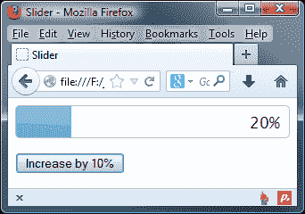

在本例中，每当**增加 10%**按钮被点击时，我们都手动设置进度条的值；我们使用标准的`option`方法，该方法适用于所有 UI 库组件，以检索有关进度条当前状态的信息。

不要忘记，像其他库组件一样，此事件也可以通过在事件名称上添加小部件名称前缀来使用 jQuery 的`on()`方法，例如，`progressbarchange`。

## 使用进度条方法

除了所有库组件都公开的常见 API 方法（如`destroy`、`disable`、`enable`、`widget`和`option`）之外，滑块 API 还公开了`value`方法，该方法是使用`option`方法设置进度条值的快捷方式。

我们可以完全像上一个示例中所做的那样，但代码更少，使用`value`方法。更改`progressbar3.html`中的最后一个`<script>`元素，使其如下所示：

```js
<script>
  $(document).ready(function($){
    var progress = $("#myProgressbar");
 progress.progressbar();
    $("#increase").click(function() {
      var currentVal = progress.progressbar("option", "value"), newVal = currentVal + 10;
 progress.progressbar("value", newVal);
 if (!$("#value").length) {
 $("<span />", { text: newVal + "%", id: "value" 
 }).appendTo(progress);
 } else {
 $("#value").text(newVal + "%");
 }
    });
  });
</script>
```

将此文件保存为`progressbar4.html`。在这个例子中，我们丢失了配置对象，因为它不是必需的。

使用`value`方法增加值的逻辑已经移到了`<button>`元素的点击处理程序中。在事件处理程序中，我们获取`currentVal`的值，然后加上`10`，并将其赋值给`newVal`。进度条小部件的`value`属性被更新为新值；进行检查以查看百分比计数文本是否存在。如果不存在（即`#value`的长度为零），则我们添加一个新的实例，其中包含更新后的数字，并在屏幕上显示此数字。

但随着更新代码移动到事件处理程序中，我们看到这使我们能够以更简洁的格式执行与上一个示例相同的操作。

## 添加不定支持

到目前为止，我们已经看到了在更新其结果时如何控制进度条应该使用的百分比值。但是，在某些情况下可能无法始终这样做 - 为了解决这个问题，可以使用一个不定选项。在 jQuery UI 1.10 中添加了这个选项，它允许在不能更新值的情况下使用。这是一个示例，如下图所示：

让我们看一些例子来比较设置已知值和不确定值之间的差异。在`progressbar4.html`中，将`<script>`元素更改为以下代码：

```js
<script>
  $(document).ready(function($){
 $("#myprogressbar").progressbar({ value: false });
 $("button").on("click", function(event) {
 var target = $(event.target), progressbar = $("#myprogressbar"), progressbarValue = progressbar.find(".ui-progressbar-value");
 if (target.is("#numButton")) { 
 progressbar.progressbar("option", { value: Math.floor(Math.random() * 100) });
 } else if (target.is("#falseButton")) {
 progressbar.progressbar("option", "value", false);
 }
 });
});
</script>
```

在代码的`<body>`元素中，将 HTML 更改为以下代码：

```js
<div id="myprogressbar"></div>
<p>
<button id="numButton">Random Value - Determinate</button>
<button id="falseButton">Indeterminate</button>
```

将此文件另存为`progressbar5.html`。点击**不定**按钮的结果如下截图所示：

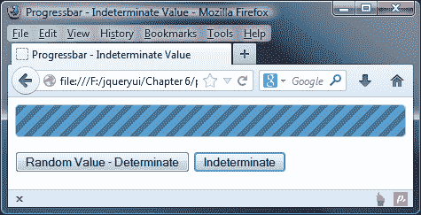

虽然在纸质版本中很难看到它的实际效果，但上一个例子显示了一个持续移动的进度条达到 100%，点击**不定**按钮会将`value`属性设置为`false`，告诉进度条假定值为 100%。在这种情况下，自动设置为 100%，表示我们正在取得进展。由于我们无法准确地得出在每个点上取得了多少进展，进度条小部件会自动假定该值为 100%。

相比之下，如果我们知道进度条应该使用的值，我们可以设置该值。点击**随机值 - 确定**按钮，在本章的示例中以类似的方式显示设置这样一个值的效果，如下截图所示：

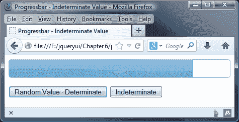

# 响应用户交互

在其最基本的层面上，我们可以在响应用户交互时手动更新进度条。例如，我们可以指定一种向导式表单，其中有几个步骤要完成。在这个示例中，我们将创建一个如下截图所示的表单：

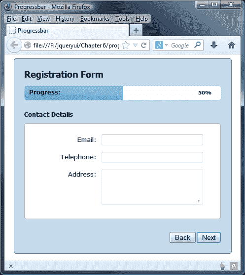

在每个步骤期间，我们可以手动递增进度条，以让用户知道他们进行到了多远的进程。在 `progressbar5.html` 中，用以下代码替换进度条容器和按钮：

```js
<div class="form-container ui-helper-clearfix ui-corner-all">
  <h1>Registration Form</h1>
  <p>Progress:</p>
  <div id="myProgressbar"></div>
  <label id="amount">0%</label>
  <form action="serverScript.php">>
    <div class="form-panel">
      <h2>Personal Details</h2>
      <fieldset class="ui-corner-all">
        <label for="name">Name:</label>
        <input id="name" type="text">
        <label for="dob">D.O.B:</label>
        <input id="dob" type="text">
        <label for="passwrd1">Choose password:</label>
        <input id="passwrd1" type="password">
        <label for="passwrd2">Confirm password:</label>
        <input id="passwrd2" type="password">
      </fieldset>
    </div>
    <div class="form-panel ui-helper-hidden">
      <h2>Contact Details</h2>
      <fieldset class="ui-corner-all">
        <label for="email">Email:</label>
        <input id="email" type="text">
        <label for="tel">Telephone:</label>
        <input id="tel" type="text">
        <label for="address">Address:</label>
        <textarea id="address" rows="3" cols="25"></textarea>
    </fieldset>
  </div>
  <div class="form-panel ui-helper-hidden">
    <h2>Registration Complete</h2>
    <fieldset class="ui-corner-all">
      <p>Thanks for registering!</p>
    </fieldset>
  </div>
  </form>	
  <button id="next">Next</button>
  <button id="back" disabled="disabled">Back</button>
</div>
```

将此文件保存为 `progressbar6.html`。在 `<head>` 部分，我们添加了一个链接到框架主题文件，就像我们在本章的其他示例中所做的那样，并且将需要添加一个链接到稍后添加的自定义样式表：

```js
<link rel="stylesheet" href="css/progressTheme.css">
```

页面的 `<body>` 元素包含一些布局元素和一些文本节点，但主要元素是进度条的容器和 `<form>`。`<form>` 部分使用 `<div>` 和 `<fieldset>` 元素分隔为几个不同的部分。这样做的原因是我们可以隐藏表单的部分，使其看起来好像跨越了几个页面。

我们在进度条旁边添加了一个段落和一个 `<label>` 参数。我们将对它们进行定位，使它们出现在小部件内部。段落包含一个简单的文本字符串。标签将用于显示当前进度值。

外部容器被赋予几个类名；第一个是我们可以对元素应用一些自定义样式，但下一个两个是为了针对 jQuery UI CSS 框架的不同特性。`ui-helper-clearfix` 类用于自动清除浮动元素，并且是减少 `<div>` 元素的额外和不必要的清除混乱的好方法。在创建自己的小部件时，请不要忘记显式使用此类和其他框架类。

### 提示

我们在第二章中介绍了一些核心 CSS 类；CSS 框架 API 的更多详细信息可在[`learn.jquery.com/jquery-ui/theming/api/`](http://learn.jquery.com/jquery-ui/theming/api/)上找到。

`ui-corner-all` 类用于给容器元素（以及进度条本身，它们自动具有这些特性，以及我们的 `<fieldset>` 元素）添加圆角，使用了几个专有的样式规则。这些现在被大多数现代浏览器支持。我们还有一个**下一个**按钮来在每个面板之间前进，并且一个默认情况下被禁用的**返回**按钮。

我们在表单中使用 CSS 框架的另一个类。页面首次加载时需要隐藏多个面板；因此，我们可以使用 `ui-helper-hidden` 类来确保它们设置为 `display: none`。当我们想要显示它们时，我们只需删除此类名。

现在让我们添加 JavaScript。更改页面底部的最后一个 `<script>` 元素，使其显示如下：

```js
$(document).ready(function($){
  var prog = $("#myProgressbar"), progressOpts = {
    change: function() {
      prog.next().text(prog.progressbar("value") + "%");
    }
  };
  prog.progressbar(progressOpts);
  $("#next, #back").click(function() {
    $("button").attr("disabled", true);
    if (this.id == "next") {
      prog.progressbar("option", "value",
      prog.progressbar("option", "value") + 50);
      $("form").find("div:visible").fadeOut().next()
        .fadeIn(function(){
        $("#back").attr("disabled", false);
        if (!$("form").find("div:last").is(":visible")) {
          $("#next").attr("disabled", false);
        }
      });
    } else {
      prog.progressbar("option", "value", prog.progressbar("option", "value") - 50);
      $("form").find("div:visible").not(".buttons").fadeOut() .prev().fadeIn(function() {
        $("#next").attr("disabled", false);
        if (!$("form").find("div:first").is(":visible")) {
          $("#back").attr("disabled", false);
        }
      });
    }
  });
});
```

我们首先缓存进度条的选择器，并定义我们的配置对象，利用`change`事件来指定一个匿名回调函数。每次事件被触发时，我们将使用`value`方法获取进度条的当前值，并将其设置为直接在进度条元素之后的`<label>`参数的文本。事件在更改发生后触发，因此我们获得的值将始终是新值。

一旦进度条被初始化，我们为表单后的按钮添加一个点击处理程序。在此处理程序函数内，我们首先禁用两个按钮，以防止重复点击`<button>`导致表单破坏。然后，我们使用`if`语句运行稍微不同的代码分支，具体取决于所点击的按钮。

如果点击了**下一步**按钮，则通过将`value`选项设置为当前值加上`50`％来将进度条的值增加`50`％。然后，我们淡出当前可见的面板，并淡入下一个面板。我们使用回调函数作为`fadeIn()`方法的参数，该函数将在动画结束时执行。

在此功能内，我们重新启用**返回**按钮（因为点击了**下一步**，所以第一个面板不可见，因此应该启用此按钮），并确定是否启用**下一步**按钮，只要最后一个面板不可见，就可以完成此操作。

外部`if`语句的第二个分支处理了点击**返回**按钮的情况。在这种情况下，我们将进度条减少`50`％，启用**下一步**按钮，并检查是否应启用**返回**按钮。

这现在是我们所需的所有 JavaScript 代码。现在我们所要做的就是添加一些基本的 CSS 来布置示例；在文本编辑器中的新文件中添加以下代码：

```js
h1, h2 { font-family: Tahoma; font-size: 140%; margin-top: 0;}
h2 { margin: 20px 0 10px; font-size: 100%; text-align: left; }
p { margin: 0; font-size: 95%; position: absolute; left: 30px; top: 60px; font-weight: bold; }
#amount { position: absolute; right: 30px; top: 60px; font-	size: 80%; font-weight: bold; }
#thanks { text-align: center; }
#thanks p { margin-top: 48px; font-size: 160%; position: relative; left: 0; top: 0; }
form { height: 265px; position: relative; }
.form-container { width: 400px; margin: 0 auto; position: relative; font-family: Verdana; font-size: 80%; padding: 20px; background-color: #C5DBEC; border: 1px solid #2E6E9E; }
.form-panel { width: 400px; height: 241px; position: absolute; top: 0; left: 0; } 
fieldset { width: 397px; height: 170px; margin: 0 auto; 	padding: 22px 0 0; border: 1px solid #abadac; background-color: #ffffff; }
label { width: 146px; display: block; float: left; text-align: right; padding-top: 2px; margin-right: 10px; }input, textarea { float: left; width: 200px; margin-bottom: 13px; }
button { float: right; }
```

将此保存为 `progressTheme.css` 在 `css` 目录中。现在，我们应该有一个带有已连接的进度条的工作页面。当我们运行页面时，我们应该发现我们可以浏览表单的每个面板，并且进度条将相应地更新自身。

我们仍然依赖用户交互来设置进度条的值，在这个示例中，这是由访问者通过每个面板进行导航驱动的。

# 使用带有进度条的丰富上传

不再依赖用户交互来增加进度条的值，从而完成指定的任务，我们可以依赖系统来更新它，只要有可用的东西可以准确地更新它。

在我们最终的进度条示例中，我们可以整合 HTML5 文件 API，以便异步上传文件，并可以使用`onprogress`事件来在文件上传时更新进度条。

### 提示

此时，您可能想获取伴随本书的代码下载副本，以便您可以在学习示例的同时查看代码。

这个示例只有在安装了并配置了 PHP 的完整 Web 服务器时才能正常工作。在这个示例中，我们不会查看上传过程的服务器端部分；我们只对一旦上传完成，根据从系统收到的反馈来更新进度条感兴趣。

修改`progressbar6.html`中的`<body>`，使其包含以下元素：

```js
<div id="container">
  <h1>HTML5 File Reader API</h1>
  <form id="upload" action="upload.php" method="POST" enctype="multipart/form-data">
    <fieldset>
      <legend>Image Upload</legend>
      <input type="hidden" id="MAX_FILE_SIZE" name="MAX_FILE_SIZE"value="300000" />
      <div>
        <label for="fileselect">Image to upload:</label>
        <input type="file" id="fileselect" name="fileselect[]"multiple="multiple" />
      </div>
      <div id="progress"></div>
    </fieldset>
  </form>
  <div id="messages"></div>
</div>
```

在页面上，我们有一个`file`类型的`<input>`元素，后面跟着进度条的容器，就像往常一样。接下来，让我们添加脚本；将`<head>`末尾的最后一个`<script>`元素更改为以下代码：

```js
$("document").ready(function($) {
  if (window.File && window.FileList && window.FileReader) {
    $("#fileselect").on("change", function(e) {
      var files = e.target.files || e.dataTransfer.files;
      for (var i = 0, f; f = files[i]; i++) {
        ParseFile(f);
        UploadFile(f);
      }
    });
  }
});
```

将此文件保存为`progressbar7.html`。将以下代码添加到一个新文档中，并保存为`uploads.js`：

```js
function ParseFile(file) {
  $("#messages").html(
    "<p>File information: <strong><br>" +
    "</strong> type: <strong>" + file.type + "<br>" +
    "</strong> size: <strong>" + file.size + 
    "</strong> bytes</p>"
  );

  if (file.type.indexOf("image") === 0) {
    var reader = new FileReader();
    reader.onload = function(e) {
      $("#messages").prepend(
        "<br>Image:<br><strong>" + file.name + "</strong><br />" +
        '</p>'
      );
    };
    reader.readAsDataURL(file);
  }
}

function UploadFile(file) {
  $("#progress").progressbar();
  var xhr = new XMLHttpRequest();
  xhr.upload.onprogress = function updateProgress(e) {
    var fileloaded = (e.loaded / e.total);
    $("#progress").progressbar("value", Math.round(fileloaded * 100));
  };

  xhr.upload.onload = function() {
    $("#progress").progressbar("value", 100);
  };

  xhr.open("POST", $("#upload").action, true);
  xhr.setRequestHeader("X_FILENAME", file.name);
  xhr.send(file);
}
```

最后，在文档的`<head>`元素下方立即添加以下内容：

```js
<script type="text/javascript" src="img/uploads.js"></script>
```

首先，在`progressbar7.html`中，我们进行检查以确认浏览器是否支持 File API；如果可以，我们就会启动一个事件处理程序，该处理程序会在点击`fileselect`按钮时立即触发。

在更改处理程序中，我们获取所选文件的详细信息并将其保存到数组中；然后，我们调用`ParseFile()`函数（在`uploads.js`中）来首先启动输出消息，然后使用`FileReader()`加载和读取图像的副本，并将图像的副本输出到屏幕。同时，我们显示图像名称的详细信息。

继续到`uploads.js`，然后我们调用`UploadFile`函数，这就是真正的魔法发生的地方。我们首先初始化一个进度条的实例，给它一个`progress` ID，并使用一个`<div>`元素作为其容器。然后，代码设置了一个`XMLHttpRequest()`的实例，并打开了一个`POST`连接以上传文件。在这种情况下，文件实际上只上传到服务器上的一个测试文件夹（或在这种情况下，您的个人电脑上），称为 uploads；在这一点上，您将创建一个上传脚本，该脚本将把文件重定向到远程服务器上的适当位置。

每当`XMLHttpRequest`参数更新时，它都会触发`onprogress`事件处理程序来更新进度条；我们计算总文件大小与已上传内容之间的差异，然后将其转换为百分比，并用此百分比来更新进度条。一旦上传完成，我们就会触发`onload()`事件处理程序，以确保它显示 100% 完成。

对于这个示例，我们还需要一些 CSS；在一个新的文本文件中添加以下代码：

```js
body { font-family: "Segoe UI", Tahoma, Helvetica, Freesans, sans-serif; font-size: 90%; margin: 10px; color: #333; background-color: #fff; }
#container { margin-left: auto; margin-right: auto; width: 430px;  }
#messages { padding: 0 10px; margin: 1em 0; border: 1px solid #999; width: 400px; clear: both; height: 275px; }
#messages p { position: absolute; float: left; margin-left: 275px; width: 150px; }
#progress { margin-top: 3px; width: 390px; left: -2px; }
h1 { font-size: 1.5em; font-weight: normal; }
legend { font-weight: bold; color: #333; }
.preview { height: 60%; width: 60%; float: left; }
fieldset { width: 400px; }
```

此文件可以保存在`css`文件夹中，命名为`uploads.css`。大部分样式只是定位各个元素并设置进度条的宽度。我们也不需要链接到`progressTheme.css`，因此也可以将其删除。

当我们运行这个文件时，我们应该看到一旦选择了文件，它就会自动开始上传，并且进度条将开始填充。如果在本地进行测试，速度会相当快，所以最好使用相当大的文件进行测试。

以下屏幕截图显示了上传完成后的页面：

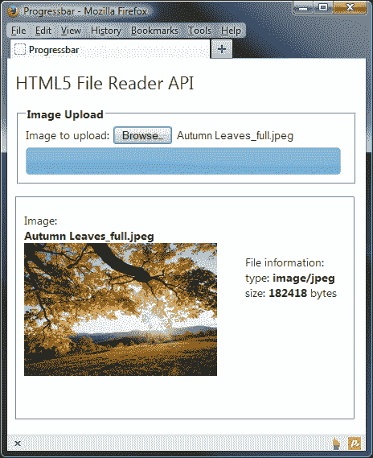

# 总结

在本章中，我们看了两个界面小部件，它们都可以提供某种形式的视觉反馈，无论是作为操作的结果还是设置特定的值。我们看到了如何快速、简单地将滑块小部件放在页面上，并且它需要最少的底层标记和仅一行代码来初始化。

我们探讨了可以设置的不同选项，以控制滑块的行为以及在初始化后如何配置它，同时提供可以在交互期间的重要时间执行代码的回调。我们还介绍了可以用于以编程方式与滑块进行交互的方法，包括用于设置手柄值的方法，或在初始化后获取和设置配置选项的方法。

我们还查看了具有紧凑 API 的进度条小部件，它在进程进行时提供了必要的访问者反馈。然后我们研究了在初始化之前或小部件正在使用时可以用来配置小部件的各种选项。我们还研究了可用于与进度条小部件一起工作的方法，看看我们如何可以轻松地对进度更改做出反应，或者在小部件完成后做出反应。

我们还看了进度条如何包含对不确定进度指示器的支持，用于在当前进程状态无法精确确定时使用。

在下一章中，我们将看到日期选择器小部件，它拥有库中所有小部件中最大、功能最丰富的 API，并包含完整的国际化支持。
