# 第七章：日期选择器小部件

jQuery UI 日期选择器小部件可能是 jQuery 库中最精细和文档化的小部件。它具有最大的**应用程序编程接口**（**API**），可能提供了所有小部件中最多的功能。它不仅可以立即使用，而且还可以高度配置和健壮。

简单地说，日期选择器小部件提供了一个界面，让您网站或应用的访问者选择日期。无论何处需要填写日期的表单字段，都可以添加日期选择器小部件。这意味着您的访问者可以使用一个吸引人并且交互性强的小部件，而您可以得到您期望的日期格式。

在本节中，我们将讨论以下主题：

+   默认日期选择器的实现

+   探索可配置选项

+   实现触发按钮

+   配置替代动画

+   `dateFormat`选项

+   简单的本地化

+   多月日期选择器

+   数据范围选择

+   日期选择器小部件的方法

+   使用 AJAX 与日期选择器

内置到日期选择器中的其他功能包括自动打开和关闭动画以及使用键盘导航小部件界面的能力。在按住*Ctrl*键（或 Mac 上的命令键）时，键盘上的箭头可以用来选择新的日期单元格，然后可以使用返回键进行选择。

尽管易于创建和配置，但日期选择器是一个由各种底层元素组成的复杂小部件，如下图所示：

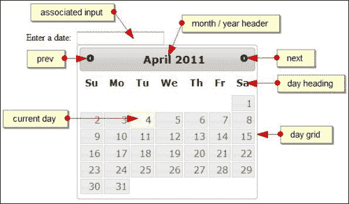

### 注意

尽管存在这种复杂性，但我们可以只用一行代码来实现默认日期选择器，就像我们迄今为止介绍的库中的其他小部件一样简单。

# 实现日期选择器小部件

要创建默认日期选择器，请在文本编辑器中的新页面中添加以下代码：

```js
<!DOCTYPE html>
<html>
<head>
  <meta charset = "utf-8">
  <title>Datepicker</title>
  <link rel="stylesheet" href="development-bundle/themes/redmond/jquery.ui.all.css">
  <script src="img/jquery-2.0.3.js"></script>
  <script src="img/jquery.ui.core.js"></script>
  <script src="img/jquery.ui.widget.js"></script>  
<script src="img/jquery.ui.datepicker.js"> </script>
  <script>  
    $(document).ready(function($){
      $("#date").datepicker();
    });
  </script>
</head> 
<body>
  <label for="date">Enter a date:</label>
  <input id="date" />
</body>
</html>
```

将此保存为`jqueryui`项目文件夹中的`datePicker1.html`。我们页面上只有一个`<label>`和一个标准文本`<input>`元素。我们不需要为了渲染日期选择器小部件而指定任何空容器元素，因为创建小部件所需的标记会被库自动添加。

### 提示

尽管在您的`<input>`语句中使用 HTML5 的`type="date"`属性可能很诱人，但不建议这样做——这可能会导致冲突，即同时显示 jQuery UI 日期选择器和本机 HTML5 版本。

当您在浏览器中运行页面并聚焦于`<input>`元素时，默认日期选择器应该出现在输入框下方。除了一个`<input>`元素外，日期选择器也可以附加到一个`<div>`元素上。

除了外观漂亮之外，默认日期选择器还带有许多内置功能。当日期选择器打开时，它会平滑地从零到全尺寸进行动画，并且将自动设置为当前日期。选择日期将自动将日期添加到 `<input>` 并关闭日历（再次使用漂亮的动画）。

如果没有额外的配置并且只有一行代码，我们现在已经拥有了一个完全可用且具有吸引力的小部件，使日期选择变得容易。如果您只想让人们选择一个日期，这就是您所需要的全部。默认日期选择器所需的源文件如下：

+   `jquery-2.0.3.js`

+   `jquery.ui.core.js`

+   `jquery.ui.widget.js`

+   `jquery.ui.datepicker.js`

## 使用内联日历选择日期

我们创建了一个基本的日期选择器小部件，将其链接到一个普通的文本 `<input>` 框中。虽然这样做完全没问题，但有时您可能不想使用普通输入框，而只需在页面中显示已打开的日历。

幸运的是，使用日期选择器小部件很容易实现。更改 HTML 代码以使用 `<div>` 元素，如下代码所示：

```js
<body>
 Enter a date: <div id="date"></div>
</body>
```

如果在浏览器中预览结果，您会注意到输入文本框已经消失，并且日历已经完全显示出来：

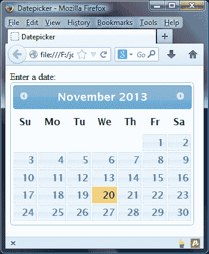

# 日期选择器的可配置选项

日期选择器具有大量可配置的选项（目前确切为 50 个）。以下表格列出了基本选项、它们的默认值，并简要描述了它们的用法：

| 选项 | 默认值 | 用法 |
| --- | --- | --- |
| `altField` | `""` | 指定替代 `<input>` 字段的 CSS 选择器，其中还添加了所选日期。 |
| `altFormat` | `""` | 指定要添加到替代 `<input>` 中的日期的替代格式。有关此选项接受的值的澄清，请参见后面部分中的 `dateFormat` 选项。 |
| `appendText` | `""` | 在日期选择器 `<input>` 后添加文本以显示所选日期的格式。 |
| `autoSize` | `false` | 自动设置 `<input>` 元素的宽度，以便根据指定的 `dateFormat` 容纳日期。 |
| `beforeShow` | `null` | 允许日期选择器配置对象在调用之前更新日期选择器。 |
| `beforeShowDay` | `null` | 接受日期作为参数，并返回值以指示该日期是否可选择，要添加到日期单元格的类名，以及日期的（可选）弹出工具提示。该函数在日期选择器中的每一天显示之前调用。 |
| `buttonImage` | `""` | 指定用于触发 `<button>` 的图像的路径。 |
| `buttonImageOnly` | `false` | 设置为 `true` 以使用图像而不是触发按钮。 |
| `buttonText` | `"..."` | 提供要显示在触发 `<button>` 上的文本（如果存在）。 |
| `calculateWeek` | `$.datepicker. iso8601Week` | 接受一个函数，用于计算指定日期的一年中的周数。 |
| `changeMonth` | `false` | 显示月份更改下拉列表。 |
| `changeYear` | `false` | 显示年份更改下拉列表。 |
| `closeText` |   |  |
| `constrainInput` | `true` | 将 `<input>` 元素限制为小部件指定的日期格式。 |
| `currentText` | `"今天"` | 用于当前日期链接的显示文本。必须与 `showButtonPanel` 属性一起使用才能显示此按钮。 |
| `dateFormat` |   | 用于解析和显示日期的格式。在本章后面的 *更改日期格式* 部分显示了完整的格式列表。 |
| `dayNames` | `[ "星期日", "星期一", "星期二", "星期三", "星期四", "星期五", "星期六" ]` | 用于与 `dateFormat` 属性结合使用的长日期名称列表。 |
| `dayNamesMin` | `[ "日", "一", "二", "三", "四", "五", "六" ]` | 包含在日期选择器小部件中列标题上显示的最小化日期名称的数组。这可以是本地化的，我们将在本章后面看到。 |
| `dayNamesShort` | `[ "周日", "周一", "周二", "周三", "周四", "周五", "周六" ]` | 用于小部件的 `dateFormat` 属性的缩写日期名称列表。 |
| `defaultDate` | `null` | 设置日期选择器打开时将突出显示的日期，当 `<input>` 元素为空时。 |
| `duration` | `"normal"` | 设置日期选择器打开的速度。 |
| `firstDay` | `0` | 设置一周的第一天，从星期日的 `0` 开始，到星期六的 `6` 结束。 |
| `gotoCurrent` | `false` | 将当前日期链接设置为将日期选择器小部件移动到当前选择的日期，而不是今天。 |
| `hideIfNoPrevNext` | `false` | 当不需要时隐藏上一个/下一个链接，而不是禁用它们。 |
| `isRTL` | `false` | 控制所使用的语言是否从右到左绘制。 |
| `maxDate` | `null` | 设置可选择的最大日期。接受日期对象或相对数字。例如：`+7`，或 `+6m` 等字符串。 |
| `minDate` | `null` | 设置可选择的最小日期。接受数字、日期对象或字符串。 |
| `monthNames` | `月份名称数组，例如 [ "一月", "二月", "三月"…]` | 设置用于小部件中 `dateFormat` 属性的完整月份名称列表。 |
| `monthNamesShort` | `缩写月份名称数组，例如["一月", "二月", "三月"…]` | 设置日期选择器小部件中每个月头部使用的缩写月份名称列表，由 `dateFormat` 属性指定。 |
| `navigationAsDateFormat` | `false` | 允许我们使用前一个、下一个和当前链接来指定月份名称。 |
| `nextText` | `"下一个"` | 设置用于下一个月链接的显示文本。 |
| `numberOfMonths` | `1` | 设置在单个日期选择器小部件上显示的月份数。 |
| `onChangeMonthYear` | `Function` | 当日期选择器移到新的月份或年份时调用。 |
| `onClose` | `Function` | 当日期选择器小部件关闭时调用，无论是否选择了日期。 |
| `onSelect` | `Function` | 在选择日期选择器小部件后调用。 |
| `prevText` | `"Prev"` | 设置上一个月链接的显示文本。 |
| `selectOtherMonths` | `false` | 允许选择在当前月面板上显示的上一个月或下一个月的日期（参见`showOtherMonths`选项）。 |
| `shortYearCutoff` | `"+10"` | 在使用年份表示时确定当前世纪；小于此数的数字被视为当前世纪。 |
| `showAnim` | `"show"` | 设置日期选择器小部件显示时使用的动画。 |
| `showButtonPanel` | `false` | 显示一个日期选择器小部件的按钮面板，包括关闭和当前链接。 |
| `showCurrentAtPos` | `0` | 在多月份日期选择器中设置当前月的位置。 |
| `showOn` | `"focus"` | 设置触发显示日期选择器的事件。 |
| `showOptions` | `{}` | 包含控制配置动画的选项的对象文本。 |
| `showOtherMonths` | `false` | 显示前一个月和下一个月的最后一天和第一天。 |
| `showWeek` | `false` | 显示一个显示年周的列。使用`calculateWeek`选项确定周。 |
| `stepMonths` | `1` | 使用上一个和下一个链接导航的月份数。 |
| `weekHeader` | `"Wk"` | 设置要显示为年周列标题的文本。 |
| `yearRange` | `"-10:+10"` | 指定年份下拉菜单中的年份范围。 |

我们将在本章中详细探讨其中一些选项。

## 使用基本选项

将`datepicker1.html`中的最终`<script>`元素更改为以下内容：

```js
<script>  
  $(document).ready(function($){
 $("#date").datepicker({
 appendText: "  (mm/dd/yy)",
 defaultDate: "+5",
 showOtherMonths: true
 });
  });
</script>
```

将此保存为`datePicker2.html`。下面的屏幕截图显示了在配置了这些选项之后小部件的外观：

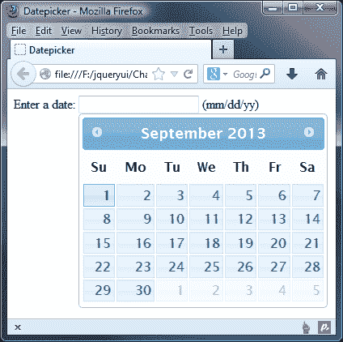

我们在这个示例中使用了许多选项，只因为有这么多的选项可供选择。在日期选择器甚至显示之前的初始页面的外观可以使用`appendText`选项进行更改。这将使用`<span>`元素直接在`<input>`字段后面添加指定的文本字符串，与选择器关联。这有助于访问者澄清将用于日期的格式。

为了样式的目的，我们可以使用`.ui-datepicker-append`类名来定位新的`<span>`元素。

`defaultDate`选项设置了在日期选择器初始打开时突出显示的日期，而`<input>`元素为空。在这个示例中，我们使用了相对的`+5`字符串，因此当日期选择器小部件初始打开时，选择了距当前日期五天的日期。按下键盘上的*Enter*键将选择突出显示的日期。

除了相对字符串，我们还可以将 `null` 作为 `defaultDate` 的值来供应，将其设置为当前日期（主观上的今天），或者使用标准的 JavaScript 日期对象。

正如我们在上一个截图中所看到的那样，日期选择器小部件中当前日期的样式与显示默认日期的样式不同。这将因主题而异，但供参考的是，当前日期以粗体显示，并用浅色（橙色）显示，而所选日期具有比正常日期更深的边框与默认主题。

一旦选择了日期，随后再次打开日期选择器小部件时，将显示所选日期作为默认日期，这再次具有不同的样式（在 redmond 主题下，预选日期将为浅蓝色）。

通过将 `showOtherMonths` 选项设置为 `true`，我们已经向日期表格的开始和结束的空方块中添加了来自上个月和下个月的灰色（不可选择）日期。这些在上一个截图中可见，并且呈现为比可选择日期要浅得多的颜色。

# 最小和最大日期

默认情况下，日期选择器将无限制地向前或向后，没有上限或下限。如果我们想要将可选择的日期限制在特定范围内，我们可以轻松地使用 `minDate` 和 `maxDate` 选项来实现。将 `datePicker2.html` 中的配置对象更改为以下内容：

```js
$("#date").datepicker({
 minDate: new Date(),
 maxDate: "+10"
});
```

将此保存为 `datePicker3.html`。在本例中，我们向 `minDate` 选项提供了一个标准的未修改的 JavaScript 日期对象，这将使过去的任何日期都无法选择。

对于 `maxDate` 选项，我们使用相对文本字符串 `+10`，这将使只有当前日期和接下来的 10 个日期可选择。您可以看到这些选项如何影响小部件的外观在以下截图中：

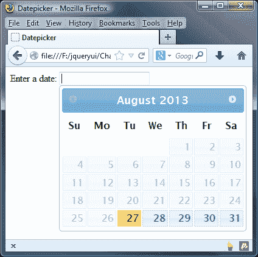

### 注意

`minDate` 和 `maxDate` 选项也可以采用诸如 `+6w`，`-10m` 或 `1y` 的字符串，分别代表周、月和年。您可以在 [`api.jqueryui.com/datepicker/#option-minDate`](http://api.jqueryui.com/datepicker/#option-minDate) 和 [`api.jqueryui.com/datepicker/#option-maxDate`](http://api.jqueryui.com/datepicker/#option-maxDate) 上找到有关如何设置这些选项的更多详细信息。

# 更改日期选择器界面中的元素

日期选择器 API 公开了许多与在日期选择器中添加或删除额外 UI 元素直接相关的选项。要显示 `<select>` 元素，让访客选择月份和年份，我们可以使用 `changeMonth` 和 `changeYear` 配置选项：

```js
$("#date").datepicker({
 changeMonth: true,
 changeYear: true
});
```

将此保存为 `datePicker4.html`。使用月份和年份的 `<select>` 元素，为用户提供了一个更快的方式来导航到可能遥远的日期。以下截图显示了启用这两个选项后小部件的外观：

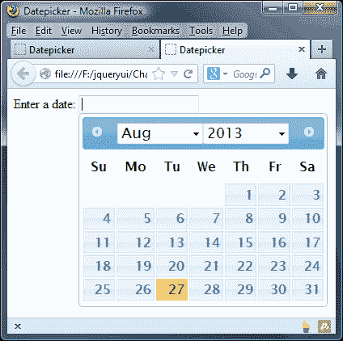

默认情况下，年份选择框将包括上一个和下一个 10 年，总共涵盖 20 年的范围。我们可以使用前/后箭头链接进一步导航，但如果我们事先知道访问者可能会选择非常久远或未来的日期，我们可以使用`yearRange`选项更改年份范围：

```js
$("#date").datepicker({
  changeMonth: true,
  changeYear: true,
 yearRange: "-25:+25"
});
```

将其保存为`datePicker5.html`。这次运行页面时，我们应该发现年份范围现在总共覆盖了 50 年。

我们还可以对日期选择器的 UI 进行另一个更改，以启用按钮面板，这将在小部件底部添加两个按钮。让我们看看它实际操作时的效果。

更改`datepicker5.html`中的配置对象，使其如下所示：

```js
$("#date").datepicker({ showButtonPanel: true })
```

将其保存为`datePicker6.html`。添加到小部件底部的按钮与对话框小部件中的按钮完全相同，您可以在下图中看到：

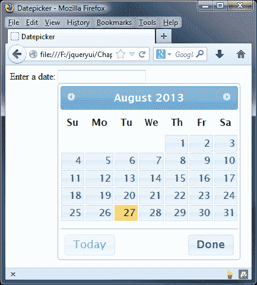

**今天**按钮将立即将日期选择器导航回显示当前日期的月份，而**完成**按钮将在不选择日期的情况下关闭小部件。

我们还可以更改**今天**按钮，使其转到所选日期而不是当前日期，方法是将其添加到小部件的配置对象中，如下所示：

```js
$("#date").datepicker({
  showButtonPanel: true,
 gotoCurrent: true 
});
```

如果您选择一个日期，然后滚动几个月，您可以通过点击**今天**按钮返回到所选日期。

## 添加一个触发按钮

默认情况下，当与其关联的`<input>`元素接收焦点时，日期选择器会打开。然而，我们可以非常轻松地更改这一点，使得日期选择器在按钮被点击时打开。最基本类型的`<button>`可以通过`showOn`选项仅启用。将`datePicker6.html`中的配置对象更改为以下内容：

```js
$("#date").datepicker({ 
 showOn: "button" 
});
```

将其保存为`datePicker7.html`。在我们的配置对象中将`showOn`选项设置为`true`将会在关联的`<input>`元素后自动添加一个简单的`<button>`元素。我们还可以将此选项设置为`both`，这样当`<input>`聚焦时以及当`<button>`被点击时都会打开。

现在，日期选择器仅在点击`<button>`时打开，而不是在`<input>`聚焦时。此选项还接受字符串值"both"，当`<input>`聚焦时和当`<button>`被点击时打开小部件。新的`<button>`如下图所示：

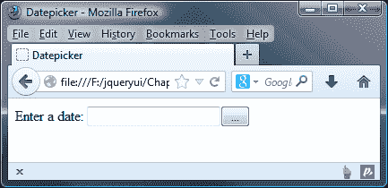

可以通过将新字符串提供为`buttonText`选项的值来轻松更改`<button>`上显示的默认文本（一个省略号）；将之前的配置对象更改为以下内容：

```js
$("#date").datepicker({
  showOn: "button",
  buttonText: "Open Calendar"
});
```

将其保存为`datePicker8.html`。现在，`<button>`上的文本应该与我们设置的`buttonText`选项的值匹配：

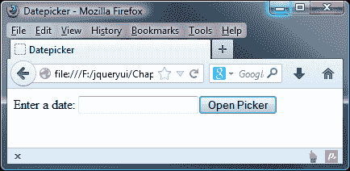

我们可以使用图像而不是文本作为`<button>`元素的标签。这是使用`buttonImage`选项配置的：

```js
$("#date").datepicker({
  showOn: "button",
  buttonText: "Open Calendar",
 buttonImage: "img/cal.png"
});
```

将此保存为`datePicker9.html`。`buttonImage`选项的值是一个字符串，由我们想要在按钮上使用的图像的路径组成。请注意，在此示例中，我们还设置了`buttonText`选项。之所以这样做的原因是，`buttonText`选项的值会自动用作``元素的`title`和`alt`属性，也就是添加到`<button>`中。

我们的触发按钮现在应该如下截图所示：

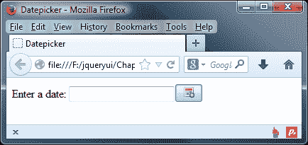

### 提示

在这个例子中，我们故意没有在这一点上为按钮设置样式，而是专注于添加一个标志。但是，您可以使用 jQuery UI 对其进行样式设置，正如我们将在第八章中看到的*按钮和自动完成小部件*。

如果我们不想使用按钮，我们根本不需要使用按钮；我们可以将`<button>`元素替换为``元素。因此，将`datePicker9.html`中的配置对象更改为以下内容：

```js
$("#date").datepicker({
  showOn: "button",
  buttonImage: "img/date-picker/cal.png",
  buttonText: "Open Calendar",
 buttonImageOnly: true
});
```

将此保存为`datePicker10.html`。这应该为您提供一个漂亮的仅图片按钮，如下截图所示：

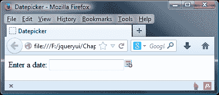

# 配置替代动画

日期选择器小部件带有一个吸引人的内置打开动画，使小部件看起来从无到完整大小。其灵活的 API 还公开了几个与动画相关的选项。这些是`duration`、`showAnim`和`showOptions`配置选项。

我们可以设置的最简单的动画配置是小部件打开和关闭的速度。要做到这一点，我们所要做的就是更改`duration`选项的值。此选项需要一个简单的字符串，可以采用字符串值`slow`、`normal`（默认值）或`fast`，或者表示以毫秒为单位的持续时间的数字。

将`datePicker10.html`中的配置对象更改为以下内容：

```js
$("#date").datepicker({
 duration: "fast"
});
```

将此变体保存为`datePicker11.html`。当我们在浏览器中运行此页面时，应该会发现打开动画明显更快。

除了更改动画的速度之外，我们还可以使用`showAnim`选项更改动画本身。默认使用的动画是简单的显示动画，但我们可以更改为使用库中包含的任何其他显示/隐藏效果之一（请参阅第十四章，*UI 效果*）。将前一个示例中的配置对象更改为以下内容：

```js
$("#date").datepicker({
 showAnim: "drop",
 showOptions: {direction: "up"}
});
```

将其保存为`datePicker12.html`。我们还需要使用两个新的`<script>`资源来使用替代效果。 这些是`jquery.ui.effect.js`和我们希望使用的效果源文件，在本例中为`jquery.ui.effect-drop.js`。 我们将在第十四章中更详细地讨论这两种效果，但它们对于此示例的工作至关重要。 确保将它们添加到文件中，在日期选择器的源文件之后：

```js
<script src="img/jquery.ui.datepicker.js">
</script>
<script src="img/jquery.ui.effect.js"></script>
<script src="img/jquery.ui.effect-drop.js"></script>

```

我们简单的配置对象通过`showAnim`选项配置了下落动画，并使用`showOptions`设置了效果的`direction`选项，由于日期选择器的绝对定位，这是必需的。 当您运行此示例时，日期选择器应该会下降到位，而不是打开。 其他效果可以以相同的方式实现。

## 显示多个月

到目前为止，我们所有的示例都只涵盖了单月日期选择器，一次只显示一个月。 但是，如果我们希望，我们可以很容易地通过一些配置选项来调整显示不同数量的月份。 在`datePicker12.html`中在配置对象之前删除效果源文件，并更改配置对象，以使其如下所示：

```js
$("#date").datepicker({
  numberOfMonths: 3
});
```

将其保存为`datePicker13.html`。 `numberOfMonths`选项接受一个整数，表示我们希望在任何时候在部件中显示的月份数。 我们的日期选择器现在应该看起来像这样：

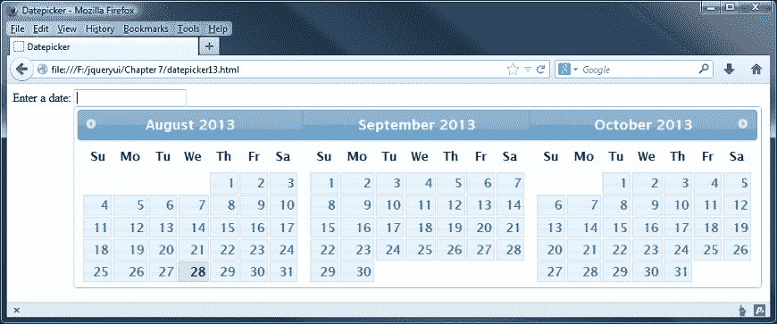

### 注

可显示的月份数量没有上限；然而，随着每个额外月份的显示，部件的性能会降低。 在将焦点放在`<input>`上并显示部件之间还有明显的延迟。

此外，各个月份面板是并排的，由于它们的大小，很快将超出视口，导致出现水平滚动条。 但是，一旦使用滚动条，日期选择器将关闭，使得超出屏幕边界的月份无法使用。 出于这些原因，最好将显示的月份数量保持在最低限度。

还有几个与多月份日期选择器相关的配置选项。 `stepMonths`选项控制在使用上一个或下一个链接时更改多少个月份。

`stepMonths`的默认值为`1`，因此在我们先前的示例中，部件以当前月份显示为开始，接着显示接下来的两个月份。 每次单击**上一个**或**下一个**图标时，面板向左或向右移动一个空间。

如果我们将`stepMonths`设置为`3`，与显示的月份数相同，每次单击上一个或下一个链接时，每个月将向左或向右移动三个空间，因此每次单击时都会显示全新的面板。

`showCurrentAtPos` 选项指定了在显示日期选择器时当前月份显示的位置。在我们之前的例子中，当前月份显示为第一个月面板。每个月面板都有一个从零开始的索引号，所以如果我们希望当前月份显示在小部件的中间，我们会将此选项设置为 `1`。

## 以垂直方式显示日期选择器

在前面的示例中，注意到应将使用多个月份的情况保持在最低限度，因为如果日历向右滚动太远，我们无法更改用于宽度的样式。

我们可以通过调整 `numberofMonths` 选项来在一定程度上缓解这个问题。它接受两个属性：第一个是控制我们显示的月份数量，第二个是要使用的列数。如果我们根据 `datepicker13.html` 中的示例设置，将其设置为在单列中显示两个月，它可能如下所示：

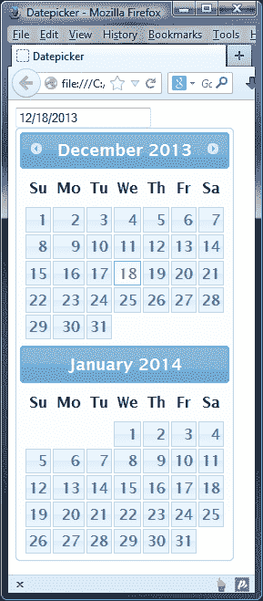

要实现此效果，我们只需更改 `datepicker13.html` 中的配置对象如下所示：

```js
$("#date").datepicker({
 numberOfMonths: [2, 1]
});
```

您会发现日期选择器现在仅显示两个日历月份，并且现在以垂直格式显示。然后，我们可以使用一点 jQuery 来获取窗口的大小，并根据返回的大小设置 `numberOfMonths` 属性：

```js
function responsive(){
  var winWidth = $(window).width();
   if((winWidth < 991)&&(winWidth >= 768)) { 
    // tablet
    $("#date").datepicker("option", "numberOfMonths", [ 2, 1 ]);
  } else {
    //desktop
    $("#date").datepicker("option", "numberOfMonths", 2 );
  }
}
```

### 注意

无法手动使用 CSS 实现相同的效果；虽然大多数样式可以更改，但容器宽度是硬编码到库中的，无法更改。

## 更改日期格式

`dateFormat` 选项是我们可以使用的高级日期选择器区域设置之一。设置此选项可以让您快速轻松地设置选定日期的格式（显示在 `<input>` 中）使用各种简写引用。日期格式可以是以下任何字符的组合（它们区分大小写）：

+   **d**: 这是月份中的日期（适用时为单个数字）

+   **dd**: 这是月份中的日期（两位数字）

+   **m**: 这是年份中的月份（适用时为单个数字）

+   **mm**: 这是年份中的月份（两位数字）

+   **y**: 这是年份（两位数字）

+   **yy**: 这是年份（四位数字）

+   **D**: 这是缩写的星期几名称

+   **DD**: 这是完整的星期几名称

+   **M**: 这是缩写的月份名称

+   **MM**: 这是完整的月份名称

+   **'...'**: 这是任何文本字符串

+   **@**: 这是 UNIX 时间戳（自 1970 年 1 月 1 日起的毫秒数）

我们可以使用这些简写代码快速配置我们喜欢的日期格式，如以下示例所示。将 `datePicker13.html` 中的配置对象更改为以下内容：

```js
$("#date").datepicker({
 dateFormat:"d MM yy"
});
```

将新文件保存为 `datePicker14.html`。我们使用 `dateFormat` 选项来指定一个包含我们首选日期格式的字符串。我们设置的格式是日期的月份（尽可能使用单个数字）为 `d`，月份的全名为 `MM`，四位数的年份为 `yy`。

当选择日期并将其添加到相关的 `<input>` 中时，它们将按照配置对象中指定的格式，如下面的屏幕截图所示：

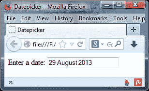

在将字符串用作配置日期的选项值时，我们还可以指定整个文本字符串。但是，如果我们这样做，而字符串中的任何字母都是用作简写的字母，则需要使用单引号对其进行转义。

例如，要将字符串 `Selected:` 添加到日期的开头，我们需要使用字符串 `Selecte'd':`，以避免将小写 `d` 作为月份格式的简写格式：

```js
$("#date").datepicker({
 dateFormat:"Selecte'd': d MM yy"
});
```

将此更改保存为 `datePicker15.html`。请注意，我们如何使用单引号将字符串 `Selected` 中的小写 `d` 转义起来。现在，当选择日期时，我们的文本字符串将被添加到格式化日期的前缀：

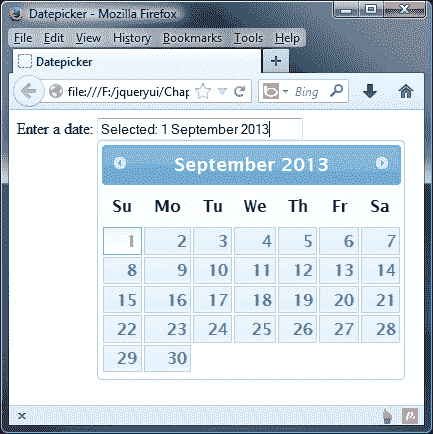

### 提示

**为 <input> 标签添加样式**

您可能希望将 `width: 15em` 添加为输入框的样式，以便您可以清楚地看到整个文本。我已经将这个添加到了附带本书的下载文件中。

还有一些内置的预配置日期格式，对应于常见的标准或 RFC 注释。这些格式作为常量添加到组件中，并可以通过 `$.datepicker` 对象访问。例如，让我们根据 ATOM 标准格式化日期：

```js
$("#date").datepicker({
 dateFormat: $.datepicker.ATOM
});
```

将此保存为 `datePicker16.html`。在此示例中选择日期时，输入到 `<input>` 中的值应该是如下屏幕截图所示的格式：

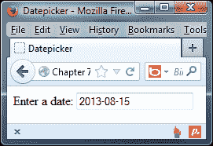

### 注意

ATOM 格式或技术上称为 RFC 3339/ISO 8601，是一个国际标准，旨在为日期和时间提供清晰的格式，以避免误解，特别是在数据在使用不同日期格式的国家之间传输时。

预定义日期格式的完整集合列在以下表中：

| 选项值 | 简写 | 格式为… |
| --- | --- | --- |
| `$.datepicker.ATOM` | `"yy-mm-dd"` | **2013-07-25** |
| `$.datepicker.COOKIE` | `"D, dd M y"` | **星期三, 25 七月 2013** |
| `$.datepicker.ISO_8601` | `"yy-mm-dd"` | **2013-07-25** |
| `$.datepicker.RFC_822` | `"D, d M y"` | **星期三, 25 七月 11** |
| `$.datepicker.RFC_850` | `"DD, dd-M-y"` | **星期三, 25-七月-11** |
| `$.datepicker.RFC_1036` | `"D, d M y"` | **星期三, 25 七月 11** |
| `$.datepicker.RFC_1123` | `"D, d M yy"` | **星期三, 25 七月 2013** |
| `$.datepicker.RFC_2822` | `"D, d M yy"` | **星期三, 25 七月 2013** |
| `$.datepicker.RSS` | `"D, d M y"` | **星期三, 25 七月 13** |
| `$.datepicker.TIMESTAMP` | `@ (UNIX 时间戳)` | **1302649200000** |
| `$.datepicker.W3C` | `"yy-mm-dd"` | **2013-07-25** |

# 更新额外的输入元素

有时我们可能想要使用所选日期更新两个 `<input>` 元素，也许以显示不同的日期格式。`altField` 和 `altFormat` 选项可用于满足此要求。在 `datepicker16.html` 页面中添加第二个 `<input>` 元素，其 `id` 属性为 `dateAltDisplay`，然后将配置对象更改为以下内容：

```js
$("#date").datepicker({
 altField: "#dateAltDisplay",
 altFormat: $.datepicker.TIMESTAMP
});
```

将此保存为 `datePicker17.html`。`altField` 选项接受标准的 jQuery 选择器作为其值，并允许我们选择在主 `<input>` 更新时更新的额外 `<input>` 元素。`altFormat` 选项可以接受与 `dateFormat` 选项相同的格式。下面的截图显示了使用日期选择器选择日期后页面应该显示的方式：

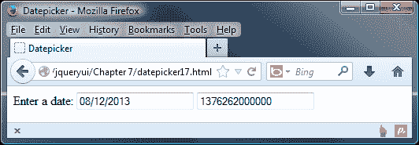

# 更改日期格式

当使用日期选择器部件时，您可能已经注意到通过 `getDate` 方法（请参阅 *日期选择方法* 部分）以编程方式返回的日期遵循默认的 GMT 日期和时间标准。为了更改 API 返回的日期格式，应使用 `$.datepicker.formatDate()` 实用程序方法。让我们看看如何使用此功能。

在 `datePicker17.html` 中，将日期配置对象更改如下：

```js
      $("#date").datepicker({
 dateFormat: 'yy-mm-dd',
 onSelect: function(dateText, inst) {
 var d = new Date(dateText);
 var fmt2 = $.datepicker.formatDate("DD, d MM, yy", d);
 $("#selecteddate").html("Selected date: " + fmt2);
 }
      });
```

将此保存为 `datePicker18.html`。我们需要添加一个额外的 CSS 样式规则，以便我们可以看到在部件中选择日期的结果。将以下内容添加到我们文件的 `<head>` 中：

```js
<style type="text/css"> 
  #selecteddate { margin-top: 250px; } 
</style>
```

如果我们在浏览器中预览结果，您会发现在配置对象中使用 `dateFormat` 属性设置初始 `<input>` 字段中使用的日期格式；这被设置为 `dd-mm-yy`。在 `onSelect` 事件处理程序中，我们使用 `$.datepicker.formatDate` 将所选日期更改为以下截图中显示的日期：

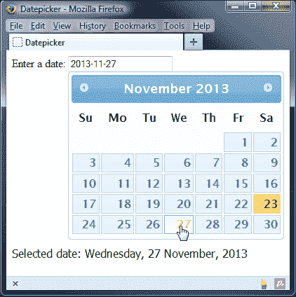

## 本地化日期选择器部件

除了已列出的选项外，还有一系列本地化选项。它们可用于提供自定义区域设置支持，以便以替代语言显示日期选择器，或更改英语单词的默认值。

针对特定本地化使用的选项列在下表中：

| 选项 | 默认值 | 用途 |
| --- | --- | --- |
| `closeText` | `"关闭"` | 关闭按钮上显示的文本。 |
| `currentText` | `"今天"` | 当天链接显示的文本。 |
| `dateFormat` | `"mm/dd/yy"` | 当添加到 `<input>` 中时所选日期应采用的格式。 |
| `dayNames` | `["星期日", "星期一","星期二",``"星期三", "星期四", "星期五","星期六"]` | 一周中每天的名称数组。 |
| `dayNamesMin` | `["Su", "Mo", "Tu","We", "Th", "Fr", "Sa"]` | 一周内两个字母的日名称数组。 |
| `dayNamesShort` | `["Sun", "Mon", "Tue", "Wed", "Thu", "Fri", "Sat"]` | 一周内缩写的星期几名称数组。 |
| `firstDay` | `0` | 指定日期选择器中的第一列天。 |
| `isRTL` | `false` | 将日历格式设置为从右到左。 |
| `monthNames` | `["January", "February",``"March", "April",``"May", "June", "July,``"August", "September",``"October", "November",``"December"]` | 月份名称数组。 |
| `monthNamesShort` | `["Jan", "Feb", "Mar",``"Apr", "May", "Jun",``"Jul", "Aug", "Sep",``"Oct", "Nov", "Dec"]` | 月份缩写名称数组。 |
| `nextText` | `"Next"` | 在下一个链接上显示的文本。 |
| `prevText` | `"Prev"` | 显示在上一个链接上的文本。 |
| `showMonthAfterYear` | `false` | 在小部件标题中将月份显示在年份后面。 |
| `yearSuffix` | `""` | 显示在月份标题中年份后面的附加文本字符串。 |

已经提供了大量不同的翻译，并存储在`development-bundle/ui`目录中的`i18n`文件夹中。每种语言翻译都有自己的源文件，要更改默认语言，我们只需包含替代语言的源文件即可。

在`datePicker17.html`中，在链接到`jquery.ui.datepicker.js`之后直接添加以下新的`<script>`元素：

```js
<script src="img/jquery.ui.datepicker-fr.js">
</script>
```

移除配置对象的`altField`和`altFormat`属性：

```js
$("#date").datepicker();
```

将此保存为`datePicker19.html`，并在浏览器中查看结果：

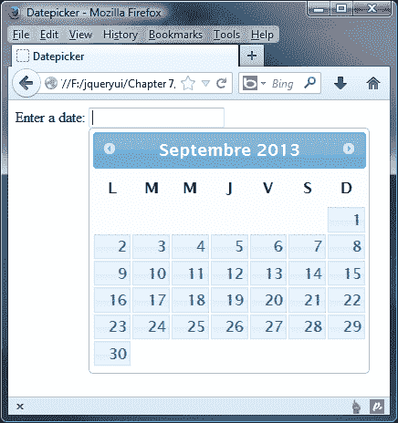

通过一个新资源的单个链接，我们已经将日期选择器中的所有可见文本更改为另一种语言，而且我们甚至不需要设置任何配置选项。如果我们想要真正国际化日期选择器，甚至有一个包含所有替代语言的汇总文件，我们可以使用它，而不需要包含多个语言文件。

在`datepicker19.html`中，将`<head>`中的`jquery.ui.datepicker-fr.js`的链接更改为以下代码：

```js
<script src="img/jquery-ui-i18n.js">
</script>
```

接下来，将 datepicker 的配置对象更改为以下内容：

```js
$(document).ready(function($){
  $("#date").datepicker();
  $("#date").datepicker("option", $.datepicker.regional["ar"]); 
});
```

将文件保存为`datepicker20.html`。如果我们在浏览器中预览结果，您将看到它以阿拉伯语显示小部件。我们使用了日期选择器的选项属性将`$.datepicker.regional`设置为`ar`，这是 jQuery UI 对阿拉伯语的代码：

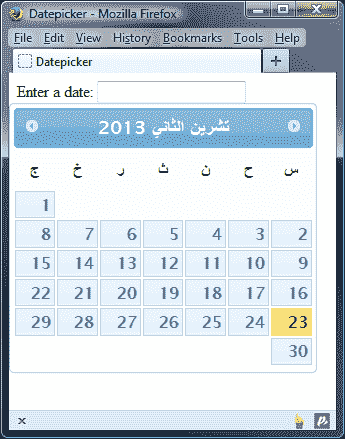

我们将在本章后面的*动态本地化日期选择器*示例中重新讨论本地化汇总文件。

## 实施自定义本地化

自定义本地化也非常容易实现。这可以使用包含配置的标准配置对象来完成，这些配置是上表选项的配置值。通过这种方式，可以实现未包含在汇总文件中的任何替代语言。

例如，要实现一个`Lolcat`日期选择器，删除`datePicker20.html`的现有配置对象，并添加以下代码：

```js
$("#date").datepicker({
  closeText: "Kthxbai",
  currentText: "Todai",
  nextText: "Fwd",
  prevText: "Bak",
  monthNames: ["January", "February", "March", "April", "Mai", "Jun", "July", "August", "Septembr", "Octobr", "Novembr", "Decembr"],
  monthNamesShort: ["Jan", "Feb", "Mar", "Apr", "Mai", "Jun", "Jul", "Aug", "Sep", "Oct", "Nov", "Dec"],
  dayNames: ["Sundai", "Mondai", "Tuesdai", "Wednesdai", "Thursdai", "Fridai", "Katurdai"],
  dayNamesShort: ["Sun", "Mon", "Tue", "Wed", "Thu", "Fri", "Kat"],
  dayNamesMin: ["Su", "Mo", "Tu", "We", "Th", "Fr", "Ka"],
  dateFormat: 'dd/mm/yy',
  firstDay: 1,
  isRTL: false,
  showButtonPanel: true
});
```

将此更改保存为`datePicker21.html`。大多数选项用于提供简单的字符串替换。但是，`monthNames`、`monthNamesShort`、`dayNames`、`dayNamesShort`和`dayNamesMin`选项需要数组。

请注意，`dayNamesMin`选项和其他与日期相关的数组应从`星期日`（或相应的本地化）开始；在这里，我们使用`firstDay`选项将`星期一`设置为首先出现的选项。我们的日期选择器现在应该看起来像这样：

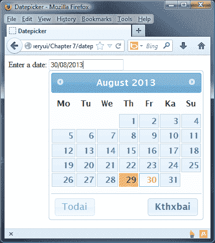

### 注意

对于那些好奇“Lolcat”一词的人，它是一个始于 2006 年的术语，但基于 20 世纪初创作的一系列图像。它用于表示一系列具有（尽管语法不正确或独特）短语的猫图片，旨在制造幽默。您可以在[`en.wikipedia.org/wiki/Lolcat`](http://en.wikipedia.org/wiki/Lolcat)了解更多关于这种独特幽默形式的信息。

## 实现回调

最终的配置选项集与小部件公开的事件模型相关。它由一系列回调函数组成，我们可以使用这些函数在与日期选择器的交互期间的不同时间点指定要执行的代码。

这些列在以下表格中列出：

| 事件 | 当...时触发 |
| --- | --- |
| `beforeShow` | 日期选择器即将打开。 |
| `beforeShowDay` | 在日期选择器中呈现每个单独的日期。可用于确定日期是否可选择。 |
| `onChangeMonthYear` | 当前月份或年份发生变化。 |
| `onClose` | 日期选择器已关闭。 |
| `onSelect` | 选择了一个日期。 |

为了突出这些回调属性有多有用，我们可以将前一个国际化示例扩展为创建一个页面，让访问者可以选择`i18n`捆绑文件中找到的任何可用语言。

## 通过捆绑动态本地化日期选择器

本书早期，我们简要介绍了如何使用捆绑文件更改日期选择器显示的语言。这样可以避免引用多个语言文件，从而有助于减少对服务器的 HTTP 请求；不过，缺点是日期选择器小部件将始终以硬编码到小部件属性中的语言显示。

不过我们可以改变这一点。让我们看看如何通过添加语言选择下拉菜单来使用`beforeShow`回调，以显示选择的语言中的日期选择器。

在`datePicker21.html`中，向页面添加以下新的`<select>`框，并使用以下`<option>`元素。出于简洁起见，我仅在此处包含了一部分；您可以在本书附带的代码下载中看到完整的列表：

```js
<select id="language">
<option id="en-GB">English</option>
<option id="ar">Arabic</option>
<option id="ar-DZ">Algerian Arabic</option>
<option id="az">Azerbaijani</option>
<option id="bg">Bulgarian</option>
<option id="bs">Bosnian</option>
<option id="ca">Catalan</option>
<option id="cs">Czech</option>
...
<option id="en-NZ">English/New Zealand</option>
<option id="en-US">English/United States</option>
<option id="eo">Esperanto</option>
<option id="es">Spanish</option>
<option id="et">Estonian</option>
<option id="zh-HK">Chinese</option>
<option id="zh-TW">Taiwanese</option>
</select>
```

接下来，如下链接到`i18n.js`捆绑文件：

```js
<script src="img/jquery-ui-i18n.js">
</script>
```

现在更改最后一个`<script>`元素，使其如下所示：

```js
<script>  
  $(document).ready(function($){
 $("#date").datepicker({
 beforeShow: function() {
 var lang = $(":selected", $("#language")).attr("id");
 $.datepicker.setDefaults($.datepicker.regional[lang]);
 }
 });
 $.datepicker.setDefaults($.datepicker.regional['']);
  });
</script>
```

将此文件保存为`datePicker22.html`。我们使用`beforeShow`回调来指定每次日期选择器显示在屏幕上时执行的函数。

在该函数内部，我们获取选定的`<option>`元素的`id`属性，然后将其传递给`$.datepicker.regional`选项。使用`$.datepicker.setDefaults()`实用方法来设置此选项。

当页面首次加载时，`<select>`元素不会有选定的`<option>`子元素，由于`i18n` roll-up 文件的顺序，日期选择器将设置为台湾语。为了将其设置为默认的英语，我们可以在日期选择器初始化后将`regional`实用程序设置为空字符串。

下图显示了在`<select>`元素中选择另一种语言之后的日期选择器：

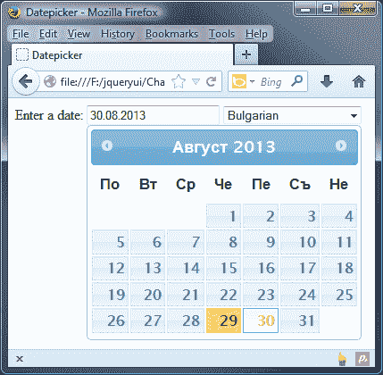

我们可以进一步发展这一点；您可能已经注意到，语言直到点击`<input>`字段内部显示小部件之前都不会改变。

代码可以运行，但感觉有点笨拙；相反，如果我们改变如何显示小部件，我们就可以消除需要点击`<input>`字段内部的必要性。我已经在代码下载中包含了如何做到这一点的示例，命名为`datepickerXX.html`。

# 引入实用方法

在前面例子中，我们使用了日期选择器中可用的实用方法之一，`setDefaults`用于在所有日期选择器实例上设置配置选项。除此之外，还有几种其他实用方法可供我们使用；这些显示在下表中：

| 实用 | 用于... |
| --- | --- |
| `formatDate` | 将`date`对象转换为指定格式的字符串。使用`dateFormat`选项时，使用`formatDate`方法以指定格式返回日期。此方法接受三个参数—转换日期的格式（见选择器的可配置选项中的`dateFormat`），要转换的`date`对象以及包含附加设置的可选配置对象。可以提供以下选项：`dayNamesShort`、`dayNames`、`monthNamesShort`和`monthNames`。 |
| `iso8601Week` | 根据 ISO 8601 日期和时间标准返回指定日期所在的周数。该方法接受一个参数—要显示周数的日期。 |
| `noWeekends` | 使周末日期不可选择。可以传递给`beforeShowDay`事件。 |
| `parseDate` | 对`formatDate`的反操作，将格式化的日期字符串转换为日期对象。它还接受三个参数—要解析的日期的预期格式，要解析的日期字符串以及包含以下选项的可选设置对象：`shortYearCutoff`、`dayNamesShort`、`dayNames`、`monthNamesShort`和`monthNames`。 |
| `regional` | 设置日期选择器的语言。 |
| `setDefaults` | 在所有日期选择器上设置配置选项。此方法接受包含新配置选项的对象文字。 |

所有这些方法都是在`$.datepicker`管理器对象的单例实例上调用的，该对象在初始化时自动创建并用于与日期选择器的实例进行交互。无论在页面上创建了多少个日期选择器作为 jQuery 对象，它们始终会引用在该页面上创建的日期选择器小部件的第一个实例的属性和方法。

# 列出日期选择器方法

除了我们可以使用的广泛的配置选项之外，还定义了许多有用的方法，使得与日期选择器一起工作变得轻松自如。

除了在第一章中讨论的共享 API 方法 *Introducing jQuery UI*，如`destroy`、`disable`、`enable`、`option`和`widget`之外。日期选择器 API 还公开了以下独特的方法：

| 方法 | 用于… |
| --- | --- |
| `dialog` | 在对话框小部件中打开日期选择器。 |
| `getDate` | 获取当前选择的日期。 |
| `hide` | 以编程方式关闭日期选择器。 |
| `isDisabled` | 确定日期选择器是否已禁用。 |
| `refresh` | 重绘日期选择器。 |
| `setDate` | 以编程方式选择日期。 |
| `show` | 以编程方式显示日期选择器。 |

让我们更详细地了解一些这些方法，首先是以编程方式选择日期。

## 以编程方式选择日期

有时（例如在动态、客户端 - 服务器网站上），我们希望能够在程序逻辑中设置特定日期，而无需访问者以通常的方式使用日期选择器小部件。让我们看一个基本示例。

在`datePicker22.html`中删除`<select>`元素，并直接在`<input>`元素之后添加以下`<button>`：

```js
<button id="select">Select +7 Days</button>
```

现在将最后一个`<script>`元素更改为如下所示：

```js
<script>  
  $(document).ready(function($){
 $("#date").datepicker();
 $("#select").click(function() {
 $("#date").datepicker("setDate", "+7");
 });
  });
</script>
```

将其保存为`datePicker23.html`。`setDate`函数接受一个参数，即要设置的日期。与`defaultDate`配置选项一样，我们可以提供一个相对字符串（就像在此示例中所做的那样）或一个日期对象。

### 提示

您可以在[`api.jqueryui.com/datepicker/#utility-formatDate`](http://api.jqueryui.com/datepicker/#utility-formatDate)中查看设置日期对象的一些选项。

如果我们被迫使用字符串作为我们日期选择器的源，我们可以轻松将它们转换为日期对象；为了实现这一点，我们可以使用众多的日期 JavaScript 库，如`Moment.js`。我在本书的附带代码下载中包含了如何使用此库生成我们的日期对象的简单示例。

## 在对话框中显示日期选择器

`dialog`方法产生相同易于使用且有效的日期选择器窗口部件，但它将其显示在一个浮动的对话框中。该方法易于使用，尽管它影响日期选择器对话框的放置；对话框将显示为与日期输入字段分离，我们将会看到。

从页面中删除`<button>`并将`datepicker23.html`中的最终`<script>`元素更改为以下代码：

```js
<script>  
  $(document).ready(function($){
    function updateDate(date) {
      $("#date").val(date);
    }
    $("#date").focus(function() {
      $(this).datepicker("dialog", null, updateDate);
    });
  });
</script>
```

将此保存为`datePicker24.html`。首先我们定义一个名为`updateDate`的函数。当在日期选择器中选择日期时，将自动将所选日期传递给我们页面上的`<input>`元素。

我们使用`focus`事件调用`dialog`方法，该方法接受两个参数。在本例中，我们将第一个参数设为`null`，因此日期选择器默认为当前日期。

第二个参数是一个在选择日期时执行的回调函数，它映射到我们的`updateDate`函数。

我们还可以提供额外的第三和第四个参数；第三个是日期选择器的配置对象，第四个用于控制包含日期选择器的对话框的位置。默认情况下，它将在屏幕中央渲染对话框。

### 提示

您可以在[`api.jqueryui.com/datepicker/#method-dialog`](http://api.jqueryui.com/datepicker/#method-dialog)了解更多关于如何配置这些选项的信息。

# 实现启用 AJAX 的日期选择器

对于我们最终的日期选择器示例，我们将在其中加入一些魔法，并创建一个与远程服务器通信的日期选择器，以查看是否有任何不能选择的日期。然后，这些日期将在日期选择器窗口部件中被标记为不可选择的日期。

更改`datepicker24.html`的`<body>`，使其包含以下标记：

```js
<div id="bookingForm" class="ui-widget ui-corner-all">
  <div class="ui-widget-header ui-corner-top">
    <h2>Booking Form</h2>
  </div>
  <div class="ui-widget-content ui-corner-bottom">
    <label for "date">Appointment date:</label>
    <input id="date">
  </div>
</div>
<script>  
  $(document).ready(function($){
    var months = [], days = [], x; 
    $.getJSON("http://www.danwellman.co.uk/bookedDates.php?
     jsoncallback=?", function(data) {
      for (x = 0; x < data.dates.length; x++) {
        months.push(data.dates[x].month);
        days.push(data.dates[x].day);
      }
    });

    function disableDates(date) { 
      for (x = 0; x < days.length; x++) {
        if (date.getMonth() == months[x] - 1 && date.getDate() == days[x]) {
          return [false, "preBooked"];
        }
      }
      return [true, ""];
    }

    function noWeekendsOrDates(date) {
      var noWeekend = jQuery.datepicker.noWeekends(date);
      return noWeekend[0] ? disableDates(date) : noWeekend;
    }

    $("#date").datepicker({
      beforeShowDay: noWeekendsOrDates,
      minDate: "+1"
    });
  });
</script>
```

我们脚本的第一部分最初声明了两个空数组，然后执行一个请求，从一个 PHP 文件获取 JSON 对象。JSON 对象包含一个名为 dates 的选项。该选项的值是一个数组，其中每个项也是一个对象。

每个子对象都包含月份和日期属性，表示应该使其不可选择的一个日期。月份或日期数组由 JSON 对象中的值填充，以供脚本稍后使用。

接下来，我们定义了在`beforeShowDay`事件上调用的`noWeekendsOrDates`回调函数。该事件对日期选择器中的 35 个单独日期方块中的每一个都会触发一次。甚至空白的方块也包括在内！

每个日期方块的日期都传递给此函数，该函数必须首先确定所选日期是否不是周末，使用 jQuery UI 的`$.datepicker.noWeekends()`函数。如果是，则它会自动传递给`disableDates`函数，否则将被标记为被禁用的。

如果将值传递给`disableDates`函数，则会将从`noWeekendsOrDates`函数发送到它的每个方块的日期传递给它，并且必须返回一个包含最多两个项的数组。

第一个是一个布尔值，指示该日期是否可选择，第二个是可选的日期给出的类名。我们的函数循环遍历我们的月份和日期数组中的每个项目，以查看传递给回调函数的任何日期是否与数组中的项目匹配。如果月份和日期项目都与日期匹配，数组将以`false`和自定义类名作为其项目返回。如果日期不匹配，则返回包含`true`以指示日期可选择的数组。这使我们能够指定日期选择器中无法选择的任意数量的日期。

最后，我们为日期选择器定义一个配置对象。对象的属性只是用于使 JSON 对象中指定的日期不可选择的回调函数，以及将设置为相对值`+1`的`minDate`选项，因为我们不希望人们选择过去的日期或当前日期。

除了 HTML 页面之外，我们还需要一些自定义样式。在您的编辑器中的一个新页面中，创建以下样式表：

```js
#date { width: 302px; }
#bookingForm { width: 503px; }
#bookingForm h2 { margin-left: 20px; }
#bookingForm .ui-widget-content { padding: 20px 0; border-top:  none; }
label { margin: 4px 20px 0; font-family: Verdana; font-size: 80%;
float: left; }
.ui-datepicker .preBooked span { color: #ffffff;
background: url(../img/red_horizon.gif) no-repeat; }
```

将其保存为`datepickerTheme.css`在`css`文件夹中。我们使用 PHP 来响应页面发出的请求并提供 JSON 对象。如果您不想在您的 Web 服务器上安装和配置 PHP，您可以使用我在示例中指定的 URL 放置的文件。对于任何有兴趣的人，使用的 PHP 如下所示：

```js
<?php
  header('Content-type: application/json');
  $dates = "({
    'dates':[
      {'month':12,'day':2},
      {'month':12,'day':3},
      etc...
    ] 
  })";
  $response = $_GET["jsoncallback"] . $dates;
  echo $response;
?>
```

这可以保存为主`jqueryui`项目文件夹中的`bookedDates.php`。

预订日期只是硬编码到 PHP 文件中。同样，在一个适当的实现中，您可能需要一种更健壮的方式来存储这些日期，比如在数据库中。

当我们在浏览器中运行页面并打开日期选择器时，PHP 文件指定的日期应该根据我们的`preBooked`类进行样式设置，并且还应完全不响应，如下面的截图所示：

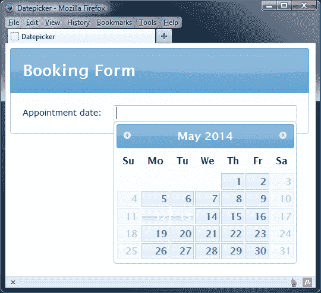

# 摘要

在本章中，我们看了一下由 jQuery UI 库中最大的 API 之一支持的日期选择器小部件。这为我们提供了大量可供使用的选项和从中接收数据的方法。我们首先看了默认实现以及小部件自动添加了多少行为。

我们看了日期选择器暴露的丰富 API，其中包括比任何其他组件更多的可配置选项。我们还看到了如何使用日期选择器管理器对象特有的实用函数。

我们看到了小部件是如何轻松实现国际化的。我们还看到，小部件已经被翻译成了其他**34 种语言**。每种语言都被打包成一个模块，可以与日期选择器轻松配合使用，以添加对其他语言的支持。我们还看到了如何创建自定义的语言配置。

我们介绍了在日期选择器交互过程中触发的一些事件，并查看了在代码中可用于处理和控制日期选择器的一系列方法。

在下一章中，我们将看到该库中两个较新的添加，即按钮小部件和自动完成小部件。
