# 第八章：按钮和自动完成小部件

按钮和自动完成小部件是库中较新的添加项之一，并随版本 1.8 发布。

传统上，在所有浏览器和平台上一致地为表单元素设置样式是棘手的，并且使情况更加复杂的是，大多数浏览器和平台都以独特的方式呈现表单控件。本章介绍的这两个小部件用于改进 Web 上使用的一些传统表单元素。

按钮小部件允许我们从元素创建外观引人注目且高度可配置的按钮，包括`<button>`、`<input>`和`<a>`元素，可以使用 ThemeRoller 生成的主题进行样式设置。支持的`<input>`元素类型包括`submit`、`radio`和`checkbox`。还可以使用附加功能，如图标、按钮集和分割按钮来进一步增强底层控件。

自动完成小部件附加到标准文本`<input>`上，并用于提供上下文选择菜单。当访客开始在`<input>`元素中输入时，将显示与输入控件中输入的字符匹配的建议。

通过键盘输入，自动完成可以完全访问，允许使用箭头键导航建议列表，使用**Enter**键进行选择，并使用*Esc*键关闭菜单。当使用箭头键导航建议列表时，每个建议都将添加到`<input>`元素中，然后才能进行选择。如果在导航列表后使用*Esc*键关闭菜单，则`<input>`元素的值将恢复为访客输入的文本。

在本章中，我们将介绍以下主题：

+   标准按钮实现

+   可配置选项

+   添加图标

+   按钮事件

+   按钮集

+   按钮方法

+   使用自动完成与本地数据源

+   自动完成的可配置选项

+   自动完成事件

+   自动完成的独特方法

+   使用远程数据源与自动完成

+   在自动完成建议菜单中使用 HTML

# 介绍按钮小部件

按钮小部件用于为一系列元素和输入类型提供一致的、完全主题化的样式。小部件可以从几种不同的元素创建，并且所得到的小部件的 DOM 以及可用的特性将根据使用的元素略有不同。

一个标准的按钮小部件，可以通过`<button>`、`<a>`或`<input>`元素构建，其类型为`button`、`submit`或`reset`，将显示如下：

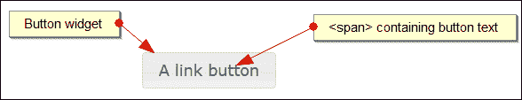

## 实现标准按钮

由于按钮可以从几种不同的元素构建，因此我们可以使用一些微小的底层代码变化。 当使用<a>、<button>或<span>元素创建按钮时，小部件将自动创建并嵌套在底层元素内。 这个新的<span>将包含按钮的文本标签。  

要创建链接按钮，请使用以下代码：  

```js
<!DOCTYPE html>
<html>
<head>
  <meta charset="utf-8">
  <title>Button</title>
  <link rel="stylesheet" href="development-bundle/themes/redmond/jquery.ui.all.css">
  <script src="img/jquery-2.0.3.js"></script>
  <script src="img/jquery.ui.core.js"></script>
  <script src="img/jquery.ui.widget.js"></script>
  <script src="img/jquery.ui.button.js"></script>
</head>
<body>
  <a href="some_other_page.html" id="myButton">A link button</a>
</body>
</html>
```

将此文件保存为`button1.html`。 使用<a>元素作为底层 HTML 时创建按钮所需的脚本可能像这样简单，应该在先前代码的最后一个<script>元素之后添加：  

```js
<script>  
  $(document).ready(function($){
    $("#myButton").button();
  });
</script>  
```

在这种情况下，生成的按钮没有添加任何特殊行为；<a>元素只会将访问者发送到锚点的新页面或指定的页面。 在这种情况下，小部件只是与页面或站点中可能使用的其他 jQuery UI 小部件一致地进行主题设置。 在浏览器中编译时，小部件会自动添加标记——如果您使用像 Firebug 这样的 DOM 检查器，您将看到`button1.html`的以下代码：  

```js
<a href="some_other_page.html" id="myButton" class="ui-button ui-widget ui-state-default ui-corner-all ui-button-text-only" role="button" aria-disabled="false"><span class="ui-button-text">A link button</span></a>
```

按钮小部件需要以下库资源：  

+   `jquery.ui.all.css`  

+   `jquery-2.0.3.js`  

+   `jquery.ui.core.js`  

+   `jquery.ui.widget.js`  

+   `jquery.ui.button.js`  

### 使用<input>或<button>标签创建按钮  

我们不仅限于使用超链接创建按钮；按钮小部件也可以与<input>或<button>标签一起使用。  

在使用`<input>`时，必须设置元素的`type`属性，以便按钮的外观与从其他底层元素创建的按钮的外观相匹配。 对于标准的单个按钮小部件，可以将`type`属性设置为`submit`、`reset`或`button`。  

从<button>元素创建按钮与在`button1.html`中使用的代码相同（只是我们不向<button>标签添加 href 属性）:  

```js
<button id="myButton">A &lt;button&gt; button</button>
```

使用<input>元素创建按钮也非常相似，只是我们使用`value`属性来设置按钮上的文本，而不是将文本内容添加到<input>标记中：  

```js
<input type="button" id="myButton" value="An &lt;input&gt; button">
```

## 主题化  

像所有小部件一样，按钮也有各种添加到它上面的类名，这些类名有助于其整体外观。 当然，如果希望提供自定义样式，我们可以在自己的样式表中使用主题的类名来覆盖正在使用的主题的默认外观。 对于主题按钮，ThemeRoller 通常仍然是最佳工具。  

## 探索可配置选项  

按钮小部件具有以下配置选项：  

| 选项 | 默认值 | 用途 |   |
| --- | --- | --- | --- |
| --- | --- | --- |   |
| `disabled` | `false` | 禁用按钮实例。   |
| `icons` | `{primary: null, secondary: null}` | 设置按钮实例的图标。   |
| `label` | `底层元素或值属性的内容` | 设置按钮实例的文本。   |
| `text` | `true` | 在仅使用图标的实例时隐藏按钮的文本。   |

在我们的第一个示例中，`<a>`元素的文本内容被用作按钮的标签。我们可以通过使用`label`选项轻松覆盖此内容。将`button1.html`中的最终`<script>`元素更改为以下内容：

```js
<script>  
  $(document).ready(function($){
    $("#myButton").button({
      label: "A configured label"
    });
  });
</script>
```

将此文件保存为`button2.html`。正如我们所预期的那样，当我们在浏览器中运行此文件时，我们看到按钮部件内的`<span>`采用配置的文本作为其标签，而不是`<a>`元素的文本内容。

## 添加按钮图标

我们可以轻松地配置我们的按钮，以便在大多数情况下具有最多两个图标。每当`<a>`或`<button>`元素被用作按钮的底层元素时，我们可以使用图标的配置选项来指定一个或两个图标。

要查看图标的效果，请修改`button2.html`中的配置对象，使其显示如下：

```js
$("#myButton").button({
 icons: {
 primary: "ui-icon-disk",
 secondary: "ui-icon-triangle-1-s"
 }
});
```

将此文件保存为`button3.html`。`icons`属性接受一个最多有两个键的对象；`primary`和`secondary`。这些选项的值可以是`jquery.ui.theme.css`文件中找到的任何`ui-icon-`类。我们设置的图标显示如下所示的屏幕截图：

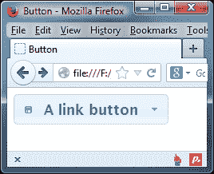

图标是通过额外的`<span>`元素添加到部件中的，这些元素是由部件自动创建并插入的。`primary`图标显示在按钮文本的左侧，而`secondary`图标显示在文本的右侧。

要生成一个只有图标而没有文本标签的按钮，将`button3.html`中的配置对象更改为以下代码：

```js
$("#myButton").button({
  icons: {
    primary: "ui-icon-disk",
    secondary: "ui-icon-triangle-1-s"
  },
 text: false
});
```

将此文件保存为`button4.html`。当我们在浏览器中查看此变体时，我们看到按钮只显示了两个图标，如下面的屏幕截图所示：

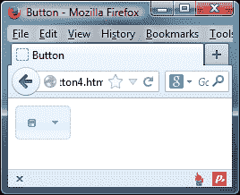

## 输入图标

由于子`<span>`元素用于显示指定的图标，所以当使用`<input>`元素作为按钮实例的底层标记时，我们无法使用图标。当使用`<input>`元素时，我们可以通过添加额外的容器、必需的`<span>`元素和一些自定义 CSS 来添加我们自己的图标。

将`button4.html`的`<body>`更改为包含以下元素：

```js
<div class="iconic-input ui-button-text-icons ui-state-default  uicorner-all">
  <span class="ui-button-icon-primary ui-icon ui-icon-disk"></span>
  <input id="myButton" type="button" value="Input icons"class="ui-button-text">
  <span class="ui-button-icon-secondary ui-icon ui-icon-triangle-1-s"></span>
</div>
```

将此文件保存为`button5.html`。我们还需要覆盖一些按钮的样式以供本示例使用。创建一个新的样式表，并将以下基本样式添加到其中：

```js
.iconic-input { display: inline-block; position: relative; }
.ui-icon { z-index: 2; }
.iconic-input input { border: none; margin: 0; }
```

### 注意

在较旧版本的 Internet Explorer 中，`display: inline-block`样式将不会被应用。为了防止按钮占用其容器的整个宽度，我们需要将其浮动，或者显式地设置宽度。

将此文件保存在`css`目录中，名称为`buttonTheme.css`。不要忘记从我们页面的`<head>`元素中链接到新样式表（在标准 jQuery UI 样式表之后）：

```js
<link rel="stylesheet" href="css/buttonTheme.css">
```

从视觉上看，我们基于自定义`<input>`的小部件已经完成，但实际上它还没有完全完成；图标没有正确地捕获悬停状态（这是因为小部件已经将所需的类名应用到了底层的`<input>`元素而不是我们的自定义容器）。我们可以使用 jQuery 添加所需的行为，就像我们已经添加了容器和`<span>`元素一样。更改最终的`<script>`元素中的代码，使其如下所示：

```js
$(document).ready(function($){
 $("#myButton").button().hover(function() {
 $(this).parent().addClass("ui-state-hover");
 }, function() {
 $(this).parent().removeClass("ui-state-hover");
 });
});
```

现在我们的按钮应该按预期工作了。正如上一个示例所示，虽然从技术上讲手动添加元素是可行的，但要将图标添加到从`<input>`元素构建的按钮所需的样式和行为，在大多数情况下，使用`<a>`或`<button>`元素会更容易且更有效。

## 添加按钮事件

由`<a>`元素构建的按钮将按预期方式工作，无需我们进一步干预——浏览器将简单地按照我们期望的方式跟随`href`——只要`<button>`或`<input>`元素位于`<form>`元素内，并设置了相关的类型属性。这些元素将以标准方式提交表单数据。

如果需要更现代的任何`<form>`数据的 AJAX 提交，或者按钮要触发某些其他操作或流程，我们可以使用标准的 jQuery 点击事件处理程序来对按钮的单击做出反应。

在下一个示例中，我们使用以下底层标记构建按钮小部件：

```js
<button type="button" id="myButton">A button</button>
```

按钮小部件公开了一个事件，即`create`事件，该事件在按钮实例最初创建时触发。我们可以使用此事件每次创建按钮实例时运行其他代码。例如，如果我们希望按钮最初被隐藏（以便稍后显示，之后发生其他事情），我们可以使用`.css()`将`display`属性设置为`none`。

将`button5.html`中的`document.ready()`代码替换为以下代码：

```js
$(document).ready(function($){
  $("#myButton").button({
    create: function() {
      $(this).css("display", "none")
    }
  });
});
```

将此文件保存为`button6.html`。在事件处理程序中，`$(this)`指的是按钮实例，使用 jQuery 的`css()`方法隐藏了它。

为了使按钮实现其主要目的，即在单击时执行某些操作，我们应该手动将处理程序附加到按钮上。例如，我们可能希望从访问者那里收集一些注册信息，并使用按钮将此信息发送到服务器。

将`button6.html`中的`<button>`替换为以下代码：

```js
<form method="post" action="serverscript.php">
  <label for="name">Name:
    <input type="text" id="name" name="name">
  </label>
  <label for="email">Email:
    <input type="text" id="email" name="email">
  </label>
  <p>
    <input type="submit" id="myButton" value="Register" />
  </p>
</form>
```

将最终的`<script>`元素更改为以下代码：

```js
<script>  
  $(document).ready(function($){
    var form = $("form"), formData = {
      name: form.find("#name").val(),
      email: form.find("#email").val()
    };

    $("#myButton").button();
    $("#myButton").click(function(e) {
      e.preventDefault();
      form.find("label").remove();
      $("#myButton").button("option", "disabled", true);

      $.post("register.php",$.post("register.php", formData, function() {
        $("<label />", { text: "Thanks for registering!"}).prependTo(form);
      });
    });
  });
</script>
```

将此文件保存为`button7.html`。底层的`<button>`元素现在是一个简单的`<form>`的一部分，该`<form>`只为访问者提供文本输入，他们的姓名和电子邮件地址。在脚本中，我们首先初始化按钮小部件，然后创建一个`click`事件处理程序。这样可以防止浏览器的默认操作，即以传统的非 AJAX 方式提交表单。

然后我们收集输入字段中输入的姓名和电子邮件地址，并使用 jQuery 的`post()`方法异步地将数据发送到服务器。在请求的成功处理程序中，我们使用小部件的`option`方法来禁用按钮，然后创建并显示感谢消息。

在这个例子中，我们不关心服务器端的事情，也不包括任何验证（尽管后者应该在生产中包含），但是你可以看到使用标准的 jQuery 功能来对按钮点击作出反应有多么容易。要看示例的工作方式，我们需要通过 Web 服务器运行该页面，并且应该在与页面相同目录中添加一个与请求中指定名称相同的 PHP 文件（这个文件不需要包含任何内容）。以下截图显示了点击按钮后页面应该显示的样子：

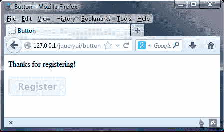

## 创建按钮组

按钮组件还可以与单选按钮和复选框一起使用。按钮组件在 jQuery UI 中是独一无二的，因为它不止有一个，而是有两个小部件方法。它有我们已经介绍过的`button()`方法，还有用于基于单选按钮和复选框创建按钮组的`buttonset()`方法。

### 复选框按钮组

更改`button7.html`的`<body>`元素，使其包含以下代码：

```js
<div id="buttons">
  <h2>Programming Languages</h2>
  <p>Select all languages you know:</p>
  <label for="js">JavaScript</label>
  <input id="js" type="checkbox">
  <label for="py">Python</label>
  <input id="py" type="checkbox">
  <label for="cSharp">C#</label>
  <input id="cSharp" type="checkbox">
  <label for="jv">Java</label>
  <input id="jv" type="checkbox">
</div>
```

现在更改最终的`<script>`元素，使其如下所示：

```js
$(document).ready(function($){
  $("#buttons").buttonset();
});
```

将此文件保存为`button8.html`。我们只需要在包含`<label>`和`<input>`元素的容器上调用`buttonset()`方法。

当我们在浏览器中运行此文件时，我们会看到复选框被隐藏，`<label>`元素被转换为按钮，并在水平的组中进行可视化分组，如下截图所示：

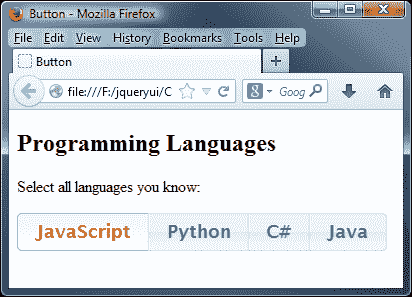

虽然实际的复选框本身被隐藏在按钮后面，但是每当选择按钮时，底层复选框的`checked`属性将被更新，所以我们仍然可以轻松地从脚本中获取状态。

当点击复选框按钮时，小部件会将选定状态应用于它，以便访问者可以轻松地看到它已被选择。正如我们所期望的那样，可以同时选择多个按钮。

在创建复选框按钮时，我们需要遵守一些规则。在 HTML5 中，通常在其关联的`<label>`元素内嵌表单控件（我们在之前的示例中这样做了），但是在使用按钮小部件时，这是不被允许的。需要使用`for`属性与`<label>`元素。

### 单选按钮组

基于单选按钮的按钮与基于复选框的按钮在外观上是相同的；它们的行为不同。同一时间只能选择一个按钮，而使用复选框时可以选择多个按钮。

让我们在`button8.html`中看到这种行为的效果；将`<body>`中的元素更改为以下代码：

```js
<div id="buttons">
  <h2>Programming Languages</h2>
  <p>Select your most proficient languages:</p>
  <label for="js">JavaScript</label>
  <input id="js" type="radio" name="lang">
  <label for="py">Python</label>
  <input id="py" type="radio" name="lang">
  <label for="cSharp">C#</label>
  <input id="cSharp" type="radio" name="lang">
  <label for="jv">Java</label>
  <input id="jv" type="radio" name="lang">
</div>
```

将此文件保存为`button9.html`。初始化单选按钮的脚本相同：我们只需在容器上调用`buttonset()`方法。除了将`type`指定为`radio`之外，底层标记的唯一区别是这些`<input>`元素必须设置`name`属性。

## 使用按钮方法

默认情况下，按钮小部件带有`destroy`、`disable`、`enable`、`widget`和`option`方法，这些方法对所有小部件都是通用的。除了这些方法之外，按钮小部件还公开了一个自定义方法，即`refresh`方法。如果以编程方式更改复选框和单选按钮的状态，可以使用此方法。通过结合前面的一些示例，我们可以看到此方法的作用。

更改`button8.html`的`<body>`，使其包含两个新的`<button>`元素，如下所示的代码：

```js
<div id="buttons">
  <h2>Programming Languages</h2>
  <p>Select all languages you know:</p>
  <label for="js1">JavaScript</label>
  <input id="js1" type="checkbox">
  <label for="py1">Python</label>
  <input id="py1" type="checkbox">
  <label for="cSharp1">C#</label>
  <input id="cSharp1" type="checkbox">
  <label for="jv1">Java</label>
  <input id="jv1" type="checkbox">
</div>
<p>
 <button type="button" id="select">Select All</button>
 <button type="button" id="deselect">Deselect All</button>
</p>

```

在这个示例中，我们已经恢复到复选框，以便我们可以以编程方式选择或取消选择它们作为一组。现在更改最终的`<script>`元素，使其如下所示：

```js
$("#buttons").buttonset();
function buttonSelected(buttonState){
 $("#buttons").find("input").prop("checked", buttonState);
 $("#buttons").buttonset("refresh"); 
}

$("#select").click(function() {
 buttonsSelected(true);
});

$("#deselect").button().click(function() {
 buttonsSelected(false);
});

```

将此文件保存为`button10.html`。如果我们在浏览器中预览结果，您可以通过单击下图所示的**全选**按钮来看到效果：

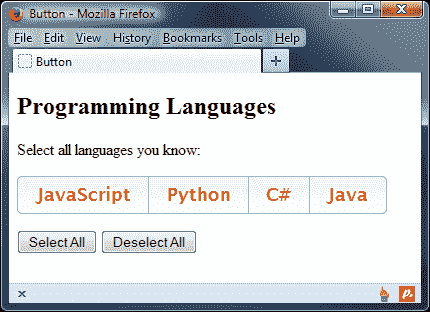

在这个示例中，我们有一个**全选**按钮和一个**取消全部**按钮。当单击**全选**按钮时，我们将复选框的`checked`属性设置为`true`。这将检查底层（以及隐藏的）复选框，但不会对被样式化为按钮的`<label>`元素执行任何操作。为了更新这些按钮的状态，使它们显示为选定状态，我们调用`refresh`方法。

**取消全部**按钮将`checked`属性设置为`false`，然后再次调用`refresh`方法以从每个按钮中移除所选状态。

# 介绍自动完成小部件

自 jQuery UI 1.8 重新引入的自动完成小部件比以往任何时候都要好。这是我在库中最喜欢的小部件之一，尽管它还没有第一次版本中拥有的全部行为集合，但它仍然提供了丰富的功能集，以增强期望来自预定义范围的简单文本输入的功能。

一个很好的例子是城市；您在页面上有一个标准的`<input type="text">`，询问访问者的城市。当他们在`<input>`元素中开始输入时，将显示包含访问者已键入字母的所有城市。访问者可以输入的城市范围是有限的，并且受限于访问者所在国家（这要么由开发人员假设，要么已被访问者先前选择）。

以下屏幕截图显示了此小部件的外观：

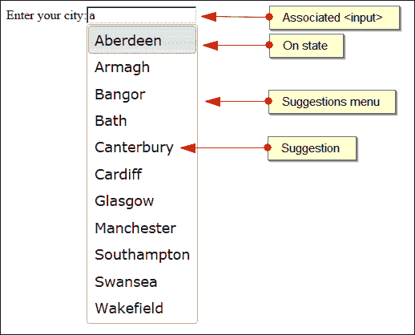

像其他小部件一样，在小部件初始化时会以编程方式添加一系列元素和类名。

## 使用本地数据源

要使用本地数组作为数据源实现基本的自动完成，请在新文件中创建以下代码：

```js
<html>
  <head>
  <meta charset="utf-8">
  <title>Autocomplete</title>
    <link rel="stylesheet" href="development-bundle/themes/redmond/jquery.ui.all.css">
    <script src="img/jquery-2.0.3.js"></script>
    <script src="img/jquery.ui.core.js"></script>
    <script src="img/jquery.ui.widget.js"></script>
    <script src="img/jquery.ui.position.js"></script>
    <script src="img/jquery.ui.menu.js"></script>
    <script src="img/jquery.ui.autocomplete.js"></script>
  </head>
  <body>
    <label>Enter your city:</label>
    <input id="city">
  </body>
</html>
```

在页面上我们所需的只是一个标准的`<input>`元素的`text`类型。自动完成所需的初始化略多于其他组件所需的初始化；在自动完成源文件之后添加以下`<script>`元素：

```js
<script>
  $(document).ready(function($){
    $("#city").autocomplete({ source: [ "Aberdeen", "Armagh", "Bangor", "Bath", "Canterbury", "Cardiff", "Derby", "Dundee", "Edinburgh", "Exeter", "Glasgow", "Gloucester", "Hereford", "Inverness", "Leeds", "London", "Manchester", "Norwich", "Newport", "Oxford", "Plymouth", "Preston", "Ripon", "Southampton", "Swansea", "Truro", "Wakefield", "Winchester", "York" ]});
  });
</script>
```

将此文件保存为`autocomplete1.html`。在我们的自动完成的配置对象中，我们使用`source`选项来指定一个本地字符串数组。`source`选项是强制的，并且必须被定义。然后将该对象传递给`autocomplete`方法，在提供了 autocomplete 关联的城市`<input>`上调用该方法。

当我们在浏览器中运行这个文件时，应该发现当我们开始在`<input>`元素中输入时，将会显示包含我们已输入的字母的源数组中定义的城市的下拉菜单。

为了使自动完成小部件正常工作，需要以下文件：

+   `jquery.ui.all.css`

+   `jquery-2.0.3.js`

+   `jquery.ui.core.js`

+   `jquery.ui.widget.js`

+   `jquery.ui.position.js`

+   `jquery.ui.menu.js`

+   `jquery.ui.autocomplete.js`

## 使用对象数组作为数据源

除了提供一个字符串数组外，我们还可以提供一个对象数组作为数据源，这样我们就可以更灵活地控制菜单中从列表中选择建议时添加到`<input>`的文本。修改`autocomplete1.html`中的配置对象，使其如下所示：

```js
$("#city").autocomplete({
  source: [
 { value: "AB", label: "Aberdeen" },
 { value: "AR", label: "Armagh" },
 { value: "BA", label: "Bangor" },
 { value: "BA", label: "Bath" },
 { value: "CA", label: "Canterbury" },
 { value: "CD", label: "Cardiff" },
 { value: "DE", label: "Derby" },
 { value: "DU", label: "Dundee" },
 { value: "ED", label: "Edinburgh" },
 { value: "EX", label: "Exeter" },
 { value: "GL", label: "Glasgow" },
 { value: "GO", label: "Gloucester" },
 { value: "HE", label: "Hereford" },
 { value: "IN", label: "Inverness" },
 { value: "LE", label: "Leeds" },
 { value: "LO", label: "London" },
 { value: "MA", label: "Manchester" },
 { value: "NO", label: "Norwich" },
 { value: "NE", label: "Newport" },
 { value: "OX", label: "Oxford" },
 { value: "PL", label: "Plymouth" },
 { value: "PR", label: "Preston" },
 { value: "RI", label: "Ripon" },
 { value: "SO", label: "Southampton" },
 { value: "SW", label: "Swansea" },
 { value: "TR", label: "Truro" },
 { value: "WA", label: "Wakefield" },
 { value: "WI", label: "Winchester" },
 { value: "YO", label: "York" }
  ]
});
```

将此文件保存为`autocomplete2.html`。我们现在正在使用作为数据源的数组中的每个项目都是一个对象，而不是一个简单的字符串。每个对象有两个键：`value`和`label`。`value`键的值是从建议列表中选择一个建议时添加到`<input>`元素中的文本。`label`的值是在建议列表中显示的内容。也可以使用其他键存储自定义数据。

如果数组中的每个对象只包含一个属性，则该属性将被用作`value`和`label`键。在这种情况下，我们可能会使用字符串数组而不是对象数组，但值得注意的是本地数据的另一种格式。

# 可配置的自动完成选项

可以设置以下选项来修改小部件的行为：

| 选项 | 默认值 | 用途 |
| --- | --- | --- |
| `appendTo` | `"body"` | 指定将小部件附加到哪个元素。 |
| `autofocus` | `false` | 在显示建议列表时，使列表中的第一个建议获得焦点。 |
| `delay` | `300` | 指定在访客开始在`<input>`中输入后，小部件应在显示建议列表之前等待的毫秒数。 |
| `disabled` | `false` | 禁用小部件。 |
| `minLength` | `1` | 指定访问者需要在`<input>`中输入的字符数，然后建议列表才会显示出来。可以设置为`0`以使部件在菜单中显示所有建议。 |
| `position` | `{ my: "left top", at: "left bottom", collision: "none" }` | 指定建议列表相对于`<input>`元素应该定位的方式。该选项使用方式与我们之前在本书中看到的`position`实用程序完全相同，接受相同的值。 |
| `source` | `Array, String or Function` | 指定用于填充建议列表的数据源。此选项是强制性的，必须进行配置。它将数组、字符串或函数作为其值。 |

## 配置最小长度

`minLength` 选项允许我们指定在建议列表显示之前必须在关联的`<input>`元素中键入的最小字符数。默认情况下，部件显示的建议只包含键入到`<input>`元素中的字母，而不仅仅是以输入字母开头的字母，这可能会导致显示比必要更多的建议。

将`minLength`选项设置为比默认值`1`更高的数字可以帮助缩小建议列表，当处理大型远程数据源时，这可能更加重要。

更改我们在`autocomplete1.html`中使用的配置对象（暂时回到使用字符串数组作为数据源），使其显示如下：

```js
$("#city").autocomplete({
  minLength: 2,
  source: [
    "Aberdeen", "Armagh", "Bangor", "Bath", "Canterbury",
    "Cardiff", "Derby", "Dundee", "Edinburgh", "Exeter","Glasgow", "Gloucester", "Hereford", "Inverness", "Leeds","London", "Manchester", "Norwich", "Newport", "Oxford", "Plymouth", "Preston", "Ripon", "Southampton", "Swansea", "Truro", "Wakefield", "Winchester", "York" 
  ]
});
```

将此文件保存为`autocomplete3.html`。当在浏览器中运行此文件时，我们应该发现需要在`<input>`中键入两个字符，只有包含连续顺序字符的城市才会显示出来，这大大减少了建议的数量。

尽管在这个基本示例中，好处并不明显，但这可以大大减少远程数据源返回的数据量。

## 将建议列表附加到另一个元素

默认情况下，使用自动补全部件时，建议列表会附加到页面的`<body>`中。我们可以更改这一点，并指定列表应添加到页面上的另一个元素。然后自动补全部件使用`position`实用程序来定位列表，使其看起来附加到与其关联的`<input>`元素。我们可以使用`appendTo`选项更改这一点，并指定列表应添加到页面上的另一个元素。

在`autocomplete3.html`中，将基础的`<label>`和`<input>`包装在容器`<div>`中：

```js
<div id="container">
  <label>Enter your city:</label>
  <input id="city">
</div>

```

然后将最终`<script>`元素中的配置对象更改为以下代码：

```js
$("#city").autocomplete({
 appendTo: "#container",
  source: [ "Aberdeen", "Armagh", "Bangor", "Bath", "Canterbury", "Cardiff", "Derby", "Dundee", "Edinburgh", "Exeter", "Glasgow", "Gloucester", "Hereford", "Inverness", "Leeds", "London", "Manchester", "Norwich", "Newport", "Oxford", "Plymouth", "Preston", "Ripon", "Southampton", "Swansea", "Truro", "Wakefield", "Winchester", "York" ]
});
```

将此文件保存为`autocomplete4.html`。通常，建议列表被添加到代码的`<body>`元素的最底部。`appendTo`选项接受一个 jQuery 选择器或实际的 DOM 元素作为其值。

在这个例子中，我们看到列表被附加到我们的`<div>`容器而不是`<body>`元素，我们可以使用 Firebug 或另一个 DOM 浏览器进行验证。

# 处理自动完成事件

自动完成小部件公开了一系列独特的事件，允许我们对与小部件的交互做出程序化反应。这些事件列在下面：

| 事件 | 在...时触发 |
| --- | --- |
| `change` | 从列表中选择了一个建议。此事件在列表关闭并且`<input>`失去焦点后触发。 |
| `close` | 关闭建议菜单。 |
| `create` | 小部件的一个实例已创建。 |
| `focus` | 键盘用于聚焦列表中的建议。 |
| `open` | 显示建议菜单。 |
| `search` | 即将发出建议请求。 |
| `select` | 从列表中选择了一个建议。 |

当我们使用对象数组作为数据源并且除了我们之前使用的`label`和`value`属性之外还有其他数据时，`select`事件非常有用。对于下一个示例，删除我们在上一个示例中使用的`<div>`容器，然后更改配置对象，使其如下所示：

```js
$("#city").autocomplete({
  source: [
    { value: "AB", label: "Aberdeen", population: 212125 },
    { value: "AR", label: "Armagh", population: 54263 }, 
    { value: "BA", label: "Bangor", population: 21735 },
    { value: "BA", label: "Bath", population: 83992 },
    { value: "CA", label: "Canterbury", population: 43432 },
    { value: "CD", label: "Cardiff", population: 336200 },
    { value: "DE", label: "Derby", population: 233700 },
    { value: "DU", label: "Dundee", population: 152320 },
    { value: "ED", label: "Edinburgh", population: 448624 },
    { value: "EX", label: "Exeter", population: 118800 },
    { value: "GL", label: "Glasgow", population: 580690 },
    { value: "GO", label: "Gloucester", population: 123205 },
    { value: "HE", label: "Hereford", population: 55700 },
    { value: "IN", label: "Inverness", population: 56660 },
    { value: "LE", label: "Leeds", population: 443247 },
    { value: "LO", label: "London", population: 7200000 },
    { value: "MA", label: "Manchester", population: 483800 },
    { value: "NO", label: "Norwich", population: 259100 },
    { value: "NE", label: "Newport", population: 137011 },
    { value: "OX", label: "Oxford", population: 149300 },
    { value: "PL", label: "Plymouth", population: 256700 },
    { value: "PR", label: "Preston", population: 114300 },
    { value: "RI", label: "Ripon", population: 15922 },
    { value: "SO", label: "Southampton", population: 236700 },
    { value: "SW", label: "Swansea", population: 223301 },
    { value: "TR", label: "Truro", population: 17431 },
    { value: "WA", label: "Wakefield", population: 76886 },
    { value: "WI", label: "Winchester", population: 41420 },
    { value: "YO", label: "York", population: 182000 }
  ],
  select: function(e, ui) {
    if ($("#pop").length) {
      $("#pop").text(ui.item.label + "'s population is: " + ui.item.population);
    } else {
      $("<p></p>", {
        id: "pop",
        text: ui.item.label + "'s population is: " + ui.item.
          population
      }).insertAfter("#city");
    }
  }
});
```

将此文件保存为`autocomplete5.html`。我们在数组数据源的每个对象中添加了一个额外的属性——每个城市的人口。当选择了一个城市时，我们使用`select`事件获取标签和我们的额外属性，并在页面上写入它们。

我们传递给`select`事件的事件处理程序接受`event`对象和所选数据源中的对象。`.length`测试用于确定页面上是否存在`pop`元素。如果存在，我们只需用更新后的语句替换其中的文本。如果没有，则创建一个具有`pop`的`id`的新`<p>`元素，并将其立即插入到`city`输入字段之后。我们可以以标准方式访问对象中定义的任何属性。

选择了一个城市后，页面应该如下截图所示：

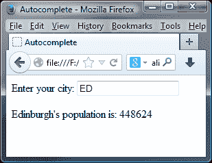

# 自动完成方法

除了所有小部件共享的标准方法之外，自动完成还为我们提供了两种允许我们启动某些操作的独特方法。这些独特的方法列在下面：

| 方法 | 用法 |
| --- | --- |
| `close` | 关闭建议菜单。 |
| `search` | 请求从数据源中获取建议列表，并将搜索词作为可选参数指定。 |

`close`方法非常容易使用，我们只需调用`autocomplete`小部件方法，并将`close`指定为参数：

```js
$("#associated_input").autocomplete("close");
```

这将导致关闭建议菜单，并触发`close`事件。关闭事件处理程序的一个可能用法是在用户选择的条目有问题时向用户发出警告；如果它与预定义列表中的条目不匹配，则可以向用户标记这一点。

`search`方法稍微复杂一些，因为它可以接受一个附加参数，尽管这不是强制的。如果调用搜索方法而没有传递参数（这可能是默认行为），则关联的`<input>`元素的值将用作搜索项。或者，术语可以作为参数提供给该方法。

## 处理远程数据源

到目前为止，在这个例子中，我们已经使用了一个相当小的本地数据数组。当处理远程数据源时，自动完成小部件真正发挥其作用，这也是当数据源很大时使用该小部件的推荐方式。

### 根据输入检索内容

在下一个例子中，我们将使用 Web 服务来检索国家列表，而不是使用我们的本地数组。将`autocomplete5.html`中的`<input>`元素更改为以下内容：

```js
<label>Enter your country:</label>
<input id="country">
```

然后改变最后的`<script>`元素，使得配置对象定义如下：

```js
$("#country").autocomplete({
 source: "http://danwellman.co.uk/countries.php?callback=?"
});
```

将此文件保存为`autocomplete6.html`。在这个例子中，我们改变了`<input>`元素，因为我们请求的是访客的国家，而不是城市。

在这个例子中，我们已经将一个字符串指定为源配置对象的值。当将字符串提供给此选项时，字符串应包含指向远程资源的 URL。小部件假定该资源将输出 JSON 数据，并且假定 JSON 数据将以我们之前使用对象数组作为源时看到的格式输出。

因此，当使用简单字符串作为`source`选项的值时，返回的数据应该是一个对象数组，其中每个对象至少包含一个名为`label`的键。对于跨域请求，数据可以是 JSON 或 JSONP 格式。小部件将自动添加查询字符串`term=`，后跟输入到`<input>`元素中的任何内容。

在这个例子中，我指定了自己网站的一个 URL。这个 URL 上的资源将以正确的格式输出数据，所以你可以从你的台式电脑上运行这个例子（甚至不需要一个 Web 服务器），并看到如下屏幕截图中所示的正确行为：

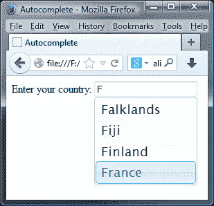

我应该指出的一个重要点是关于我使用的 PHP 文件。它只会返回以键入到`<input>`元素中的字母开头的条目，而不包含像小部件默认的字母。我想澄清的是，这是我在服务器级别实现的变化，而不是小部件表现出的行为。

因此，在我们控制返回数据的 Web 服务以及数据本身时，将字符串用作`source`选项的值是有用且方便的，因为这通常是当我们控制返回数据的 Web 服务以及数据本身时的情况。如果我们试图从我们无法控制的公共 Web 服务中提取数据，则可能不是这种情况。在这些情况下，我们将需要将函数作为`source`选项的值，并手动解析数据。

## 将函数作为源选项传递

将函数传递给`source`选项，而不是本地数组或字符串，是使用小部件的最强大方式。在这种情况下，我们完全控制请求以及在将数据传递给小部件显示在建议菜单中之前对数据进行处理的方式。

在此示例中，我们将使用返回不符合自动完成预期格式的不同数据的不同 PHP 文件。我们将使用函数来请求和处理数据，然后将其传递给小部件。示例的上下文将是类似于 Facebook 的消息系统的前端，在此自动完成建议可能的消息接收者，但在被选择并添加到`<input>`元素后也可以将其删除。我们将得到的页面将如下截图所示：

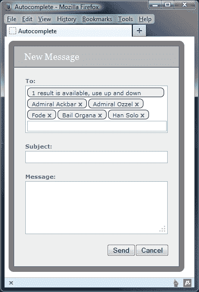

首先，更改`autocomplete6.html`的`<body>`，使其包含以下标记：

```js
<div id="formWrap">
  <form id="messageForm" action="#">
  <fieldset>
    <legend>New message form</legend>
    <span>New Message</span>
    <label id="toLabel" for="friends">To:</label>
    <div id="friends" class="ui-helper-clearfix">
    <input id="to" type="text">
    </div>
    <label>Subject:</label>
    <input id="subject" name="subject" type="text">
    <label>Message:</label>
    <textarea id="message" name="message" rows="5" cols="50"></textarea>
    <button type="button" id="cancel">Cancel</button>
    <button type="submit" id="send">Send</button>
    </fieldset>
  </form>
</div>
```

然后将最终的`<script>`元素更改为以下内容：

```js
$(document).ready(function($){
  var suggestions = [];

  var getData = function(req, resp){
    $.getJSON("http://danwellman.co.uk/contacts.php?callback=?", req, function(data) {
      var suggestions = [];
      $.each(data, function(i, val){
        suggestions.push(val.name);
      });
      resp(suggestions);
    });
  };

  var selectEmail = function(e, ui) {
    var removeLink = $("<a>").addClass("remove").attr({href: "javascript:", title: "Remove " + friend}); 
    var friend = ui.item.value,
    span = $("<span>").text(friend),
    a = removeLink.text("x").appendTo(span);
    span.insertBefore("#to");
  }

  $("#to").autocomplete({
    source: getData,
    select: selectEmail,
    change: function() {
      $("#to").val("").css("display", 2);
    }
  });

  $("#friends").click(function(){
    $("#to").focus();
  });

  $("#to").click(function(){
    if (this.length != 0) {
      $("#to").val('');
    }
  });

  $(".remove", document.getElementById("friends")).on("click", function(){
  $(this).parent().remove();
  if($("#friends span").length === 0) {
    $("#to").css("top", 0);
    }
  });
});
```

将此文件保存为`autocomplete7.html`。在页面上，我们有一些基本的表单标记和必要的元素，以重新创建类似 Facebook 样式的消息对话框。为了测试效果，尝试在文本框中输入 Admiral Ozzel、Fode 或 Han Solo，然后在自动完成显示其条目时选择其名称。

### 注

自动完成参数只会显示特定的名称；如果您想查看可能的选项，则建议浏览至[`danwellman.co.uk/contacts.php`](http://danwellman.co.uk/contacts.php)。

我们使用一个被样式化的`<div>`元素，看起来就像一个没有样式的实际`<input>`元素，内部包含一个完全没有样式的实际`<input>`。

实际的`<input>`是必需的，以便访问者可以在其中输入，并且可以与自动完成相关联。我们使用`<div>`元素，因为我们无法将构成每个联系人的`<span>`元素插入`<input>`元素中。我们还有一个隐藏的`<input>`元素，将用于存储实际的电子邮件地址。

在脚本中，我们使用`getData`函数作为我们`source`选项的值；每次更新`<input>`字段中的文本时都会调用此函数。我们首先向包含数据的 PHP 文件发出 JSON 请求，然后迭代请求返回的 JSON 对象中的每个项目。

每个新创建的对象都被添加到`suggestions`数组中，一旦返回数据的每个项目都被处理，`suggestions`数组就被传递给`resp`回调函数，该函数作为第二个参数传递给`source`函数。

然后，我们为自动完成的`select`事件定义了`selectEmail`处理程序；此函数将自动传递给两个参数，一个是`event`对象，另一个是包含所选建议的`ui`对象。我们使用这个函数创建一个`<span>`元素来格式化并保存文本，并且一个可以用来移除收件人的锚元素。格式化的`<span>`然后直接插入在伪装的`<input>`元素之前。

最后，我们为`#friends`字段添加了一个点击处理程序，以便在任何人点击它时获得焦点。还为`#to`字段添加了一个点击处理程序，以便如果您在其中单击，它将自动删除先前输入的内容。

我们还需要为这个示例添加一个样式表；在一个新文件中添加以下 CSS：

```js
#formWrap { padding: 10px; position: absolute; float: left; background-color: #000; background: rgba(0,0,0,.5); -moz-border-radius: 10px; -webkit-border-radius: 10px; border-radius: 10px; }
#messageForm { width: 326px; border: 1px solid #666; background-color: #eee; }
#messageForm fieldset { padding: 0; margin: 0; position: relative; border: none; background-color: #eee; }
#messageForm legend { visibility: hidden; height: 0; }
#messageForm span { display: block; width: 326px; padding: 10px 0; margin: 0 0 20px; text-indent: 20px; background-color: #bbb; border-bottom: 1px solid #333; font: 18px Georgia, Serif; color: #fff; }
#friends { width: 274px; padding: 3px 3px 0; margin: 0 auto; border: 1px solid #aaa; background-color: #fff; cursor: text; }
#messageForm #to { margin: 0 0 2px 0; padding: 0 0 3px; position: relative; top: 0; float: left; }
#messageForm input, #messageForm textarea { display: block; width: 274px; padding: 3px; margin: 0 auto 20px; border: 1px solid #aaa; }
#messageForm label { display: block; margin: 20px 0 3px; text-indent: 22px; font: bold 11px Verdana, Sans-serif; color: #666; }
#messageForm #toLabel { margin-top: 0; }
#messageForm button { float: right; margin: 0 0 20px 0; }
#messageForm #cancel { margin-right: 20px; }
#friends span { display: block; width: auto; height: 10px; margin: 0 3px 3px 0; padding: 3px 20px 4px 8px; position: relative; float: left; text-indent: 0; background-color: #eee; border: 1px solid #333; -moz-border-radius: 7px; -webkit-border-radius: 7px; border-radius: 7px; color: #333; font: normal 11px Verdana, Sans-serif; }
#friends span a { position: absolute; right: 8px; top: 2px; color: #666; font: bold 12px Verdana, Sans-serif; text-decoration: none; }
#friends span a: hover { color: #ff0000; }
.ui-menu .ui-menu-item { white-space: nowrap; padding: 0 10px 0 0; }
```

将此文件另存为`autocompleteTheme.css`，放在`css`文件夹中，并且在我们新页面的`<head>`中链接到新文件：

```js
<link rel="stylesheet" href="css/autocompleteTheme.css">
```

当我们在浏览器中运行页面时，我们应该发现我们可以在`<input>`元素中输入，从建议菜单中选择一个名字，并且得到一个格式化和样式良好的名字添加到假输入中。

# 在建议列表中显示 HTML

默认情况下，自动完成小部件将只显示建议列表中每个建议的纯文本。当然，这些纯文本在小部件创建的 HTML 元素内，但是如果我们尝试在数据源中使用 HTML，那么它将被剥离并被忽略。然而，jQuery UI 的当前项目领导者斯科特·冈萨雷斯编写了一个扩展，允许我们在需要时使用 HTML 代替纯文本来显示建议列表中每个建议。

如果我们想要突出显示与访问者在`<input>`元素中输入的内容匹配的建议部分，这可能很方便。我们需要扩展这个示例，可以在[`github.com/scottgonzalez/jquery-ui-extensions/blob/master/src/autocomplete/jquery.ui.autocomplete.html.js`](https://github.com/scottgonzalez/jquery-ui-extensions/blob/master/src/autocomplete/jquery.ui.autocomplete.html.js)找到。

文件可以保存在我们本地`js`目录中，并且在页面中添加对它的引用，放在自动完成源文件后：

```js
<script src="img/jquery.ui.autocomplete.html.js"></script>
```

在我们开始编码之前，让我们看一下在浏览器中预览时的效果：

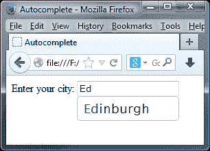

在我们的下一个示例中，我们将使用斯科特的插件与自动完成小部件，让用户搜索一些城市名称。如果匹配成功，选择下拉列表中的每个字母将开始改变颜色，只要该字母与文本框中输入的字符匹配。

更改`autocomplete5.html`中的最后一个`<script>`元素，使其如下所示：

```js
$(document).ready(function($){
  var data = [
    { value: "Aberdeen", label: "Aberdeen" },
    { value: "Armagh", label: "Armagh" },
    { value: "Bangor", label: "Bangor" },
    { value: "Bath", label: "Bath" },
    { value: "Canterbury", label: "Canterbury" },
    { value: "Cardif", label: "Cardif" },
    { value: "Derby", label: "Derby" },
    { value: "Dundee", label: "Dundee" },
    { value: "Edinburgh", label: "Edinburgh" },
    { value: "Exeter", label: "Exeter" },
    { value: "Glasgow", label: "Glasgow" },
    { value: "Gloucester", label: "Gloucester" },
    { value: "Hereford", label: "Hereford" },
    { value: "Inverness", label: "Inverness" },
    { value: "Leeds", label: "Leeds" },
    { value: "London", label: "London" },
    { value: "Manchester", label: "Manchester" },
    { value: "Norwich", label: "Norwich" },
    { value: "Newport", label: "Newport" },
    { value: "Oxford", label: "Oxford" },
    { value: "Plymouth", label: "Plymouth" },
    { value: "Preston", label: "Preston" },
    { value: "Ripon", label: "Ripon" },
    { value: "Southampton", label: "Southampton" },
    { value: "Swansea", label: "Swansea" },
    { value: "Truro", label: "Truro" },
    { value: "Wakefield", label: "Wakefield" },
    { value: "Winchester", label: "Winchester" },
    { value: "York", label: "York" }
  ];

  $("#city").autocomplete({
    html: true,
    source: function(req, resp) {
      var suggestions = [], 	
        chosenTerm = "<span>" + req.term + "</span>",
        regEx = new RegExp("^" + req.term, "i");

    $.each(cityList, function(i, val){
      if (val.label.match(regEx)) {
        var obj = {};
        obj.value = val.value;
        obj.label = val.label.replace(regEx, chosenTerm);
        suggestions.push(obj);
        }
      });
      resp(suggestions);
    }
  });
});
```

将此文件保存为`autocomplete8.html`。我们还需要在代码中添加一个样式规则；将其添加到您文件的`<head>`中：

```js
<style>
  span { color:green !important; }
</style>
```

虽然这个例子看起来很简短，但这里有一些关键点需要注意；让我们更详细地探讨我们在代码中使用的内容。

在这个例子中，我们又回到了使用本地对象数组`cityList`。每个对象中的`value`和`label`属性最初保存相同的数据。

在我们的配置对象中，我们指定了一个新的`html`选项，它与 HTML 扩展一起使用。我们将此选项的值设置为`true`，如以下代码所示：

```js
$("#city").autocomplete({
    html: true,
```

在此示例中，我们将一个函数作为`source`选项的值使用。在函数中，我们首先创建一个新的空数组，并定义一个新的正则表达式对象。这将在字符串的开头不区分大小写地匹配`<input>`中键入的任何内容：

```js
source: function(req, resp) {
  var suggestions = [], 
  chosenTerm = "<span>" + req.term + "</span>",
  regEx = new RegExp("^" + req.term, "i");
```

然后，我们遍历数据数组中的每个对象，并测试我们的正则表达式是否与数组中的对象的`label`值匹配。如果有任何项匹配，我们将创建一个新对象并给它`value`和`label`属性。`value`属性（在选择建议时添加到`<input>`元素中）只是来自我们数据数组的相应值，而`label`（显示在建议菜单中的内容）是一个新的字符串，其中包含一个将输入到`<input>`元素中的文本包装在`<span>`元素中的文本：

```js
    $.each(cityList, function(i, val){
      if (val.label.match(regEx)) {
        var obj = {};
        obj.value = val.value;
        obj.label = val.label.replace(regEx, chosenTerm);
        suggestions.push(obj);
      }
```

最后，我们调用`resp`回调，传入新构造的建议数组。我们应该始终确保调用此回调，因为这是小部件所必需的。建议数组为空并不重要，重要的是调用回调。

```js
resp(suggestions);
```

现在，建议菜单中的每个项目都将有一个`<span>`元素，将输入到`<input>`元素中的文本包装起来。我们可以使用它轻微不同地样式化这个文本，比如我们在示例中添加的绿色文本`<style>`。

# 总结

我们在本章中介绍了两个小部件；它们都是库中相对较新的，都与某种形式的`<form>`元素一起使用。按钮小部件可用于将`<a>`、`<button>`和`<input>`（类型为`button`、`submit`或`reset`）转换为具有吸引力和一致样式的丰富小部件。

自动完成小部件附加到一个`text`类型的`<input>`元素上，并在访客开始在`<input>`元素中输入时显示建议列表。该小部件预配置为与本地数据数组或以预期格式输出数据的 URL 一起工作。它还可以配置为处理不符合预期格式的数据。在将数据传递给小部件之前，我们必须先处理要显示的数据，使其成为一个非常灵活和强大的小部件。

我们已经快接近结束覆盖可见小部件的章节，接下来将专注于 jQuery UI 提供的交互助手；让我们在接下来的几章中一起看看库中的两个最新添加，从菜单小部件开始。
