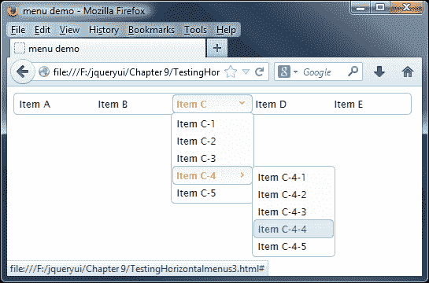

# 第九章：创建菜单

菜单小部件，以前是自动完成小部件的一部分，从库的 1.9 版本开始成为一个独立的插件，允许在其他组件中重新使用它。它可以单独使用，将超链接列表转换为可使用键盘或鼠标控制的可主题化菜单，尽管当与其他组件如按钮一起使用时，它真正发挥作用。

每个菜单都有许多与之关联的菜单项，当选择时将将访问者定向到站点的任何部分。当您点击顶级菜单时，一些子菜单项将滑入视图；这些可能具有额外的装饰，如图标，或者如果在访问菜单选项时要阻止访问，则会被禁用。

在本章中，我们将涵盖以下主题：

+   如何将列表转换为具有或不具有子菜单的菜单

+   配置菜单的可用选项

+   为菜单添加样式

+   用图标和分隔符操纵菜单项

+   使用方法

+   以编程方式启用和禁用菜单选项

+   响应事件

+   创建水平和上下文菜单

+   使用 jQuery UI 的菜单扩展`<select>`框

# 实现基本菜单小部件

导航是网页设计的关键元素；一个设计不佳的菜单将永远减少良好内容的吸引力。良好的导航必须既具有美学魅力又具有可用性。使用 jQuery UI 菜单小部件，我们可以为您的网站创建完美的导航。

虽然我们可以使用各种不同的元素来创建我们的菜单，但`<ul>`元素是迄今为止最常用的一个。菜单可以从任何有效的标记创建，只要元素具有严格的父子关系，每个菜单都有自己的锚点。在第一个例子中，我们将采用一系列欧洲城镇并将其转换为基本菜单，我们将进一步探讨结构。

在文本编辑器中新建一个文件，创建以下页面：

```js
<!DOCTYPE HTML>
<html>
  <head>
    <meta charset="utf-8">
    <title>Menu</title>
    <link rel="stylesheet" href="development-bundle/themes/redmond/jquery.ui.all.css">
    <style>
      .ui-menu { width: 150px; }
    </style>
    <script src="img/jquery-2.0.3.js"></script>
    <script src="img/jquery.ui.core.js"></script>
    <script src="img/jquery.ui.widget.js"></script>
    <script src="img/jquery.ui.position.js"></script>
    <script src="img/jquery.ui.menu.js"></script>
    <script>
     $(document).ready(function($){
       $("#myMenu").menu();
     });    
    </script>        
  </head>
  <body>
   <ul id="myMenu">
     <!-- Top level menu -->
     <li class="ui-state-disabled"><a href="#">London</a></li>
     <li><a href="#">Antwerp</a></li>
     <li><a href="#">Belgium</a>
       <ul>
         <!-- Second level menu -->         
         <li class="ui-state-disabled"><a href="#">Antwerp </a></li>
         <li><a href="#">Brussels</a></li>
         <li><a href="#">Bruges</a></li>
       </ul>
     </li>
     <!-- Top level menu -->
     <li><a href="#">Brussels</a></li>
     <li><a href="#">Bruges</a>
       <ul>
         <li><a href="#">Belgium</a>
           <ul>
             <li><a href="#">Antwerp</a></li>
             <li><a href="#">Brussels</a></li>
             <li><a href="#">Bruges</a></li>
           </ul>
         </li>
         <!-- Second level menu -->        
         <li><a href="#">Belgium</a>
         <ul>
           <!—Third level menu -->
           <li><a href="#">Antwerp</a></li>
           <li><a href="#">Brussels</a></li>
           <li><a href="#">Bruges</a></li>
         </ul>
       </li>
       <li><a href="#">Paris</a></li>
     </ul>
   </li>
   <li class="ui-state-disabled"><a href="#">Amsterdam</a> </li>
   </ul>
  </body>
</html>      
```

将代码保存为`menu1.html`在您的`jqueryui`工作文件夹中。让我们花点时间熟悉一下制作菜单所需的标记的代码。

我们需要从库中获取以下文件，以从我们选择的元素创建菜单：

+   `jquery-2.0.3.js`

+   `jquery.ui.core.js`

+   `jquery.ui.widget.js`

+   `jquery.ui.position.js`

+   `jquery.ui.menu.js`

当您在浏览器中查看页面时，您会发现我们已经将我们的无序列表转换为一个简单的菜单。在我们的示例中，我们添加了一个额外的样式，与其他库组件不同，菜单小部件需要一些额外的样式，否则它将默认占用其容器的 100%，这将是屏幕。您可以在以下截图中看到结果：


菜单小部件通常由几个按特定方式排列的标准 HTML 元素构成：

+   调用`menu()`方法的外部容器元素（可以是`<ul>`或`<ol>`元素）

+   每个菜单项中的`<li>`元素内的`<a>`元素

+   每个菜单项的标题元素

### 注：

这些元素可以是硬编码到页面中的，也可以是动态添加的，或者可以根据要求混合使用。

页面上我们所需要的只是一个列表，可以使用`<ul>`或`<ol>`标签。在我们的示例中，我们创建了一个更复杂的示例，jQuery UI 将其转换为具有两级子菜单的菜单。

在首先链接到 jQuery 核心库后，我们链接到所有基于 UI 的组件所需的`jquery.ui.core.js`和`jquery.ui.widget.js`文件，然后链接到文件，最后链接到`jquery.ui.position.js`。然后我们链接到组件的源文件，这在本例中是`jquery.ui.menu.js`。然后我们转到我们的自定义`<script>`元素，在其中添加创建菜单的代码。一旦文档对象模型（DOM）加载并准备就绪，就会立即执行此代码。

在此函数内部，我们只需在代表菜单容器元素的 jQuery 对象上调用`menu()`小部件方法（具有`myTabs` id 的`<ul>`元素）。当我们在浏览器中运行此文件时，应该会看到选项卡的外观与本章第一张截图中的外观相同（当然没有注释）。

# 探索菜单 CSS 框架类

使用 Firefox 的 Firebug（或另一个通用 DOM 浏览器），我们可以看到一系列类名被添加到构成菜单小部件的不同底层 HTML 元素中。

让我们简要回顾一下这些类名，并看看它们如何对小部件的整体外观产生影响。对于外部容器`<ul>`，添加了以下类名：

| 类名 | 应用/应用于 |
| --- | --- |
| `ui-menu` | 菜单的外部容器。 |
| `ui-widget` | 所有小部件的外部容器。它设置小部件的字体系列和字体大小。 |
| `ui-widget-content` | 将内容容器样式应用于元素及其子文本、链接和图标（适用于标题的父元素或同级元素）。 |
| `ui-corner-all` | 将元素的四个角的角半径应用于所有四个角。 |
| `ui-menu-icons` | 通过在初始化菜单时设置的`icons`选项设置的子菜单图标。 |

容器内的第一个元素是`<li>`元素。该元素接收以下类名：

| 类名 | 目的 |
| --- | --- |
| `ui-state-disabled` | 将已禁用的 UI 元素的不透明度变暗。这应该添加到已经有样式的元素中。 |
| `ui-menu-item` | 单个菜单项的容器。 |
| `ui-menu-divider` | 如果添加到`<li>`元素，则在菜单项之间应用分隔符。 |

最后，每个`<li>`元素中的`<a>`元素被赋予以下类名：

| 类名 | 目的 |
| --- | --- |
| `ui-state-focus` | 将可点击焦点容器样式应用于元素及其子文本、链接和图标。 |
| `ui-state-active` | 将可点击的活动容器样式应用于元素及其子文本、链接和图标。 |
| `ui-icon` | 将基础类应用于图标元素。将尺寸设置为 16px 的方块，隐藏内部文本，并将背景图像设置为内容状态精灵图像。此类的背景图像将受父容器的影响；例如，`ui-state-default`容器内的`ui-icon`元素将根据`ui-state-default`的图标颜色进行着色。 |
| `ui-icon-xxx-xxx` | 应用作第二个类来描述图标的类型。图标类的语法通常遵循`.ui-icon-{图标类型}-{图标子描述}-{方向}`的格式。对于指向右侧的单个三角形图标，格式将为`.ui-icon-triangle-1-e`。有关更多图标名称示例，请将鼠标悬停在[ThemeRoller](http://jqueryui.com/themeroller/)中的图标上。 |

大多数这些类名是自动添加到 HTML 元素中的基础库，但显示图标或菜单分隔符的类除外；后者应作为设计菜单结构的一部分添加。有关更多 CSS 类名示例，请查看[CSS 框架](http://api.jqueryui.com/theming/css-framework/)，其中详细介绍了框架中可用的所有 CSS 类，这些类可应用于 jQuery UI 库中的大多数（如果不是全部）小部件。

### 提示

您可能想要查看该链接，该链接详细介绍了构建菜单的一些良好实践：[`developer.apple.com/library/mac/documentation/UserExperience/Conceptual/AppleHIGuidelines/Menus/Menus.html#//apple_ref/doc/uid/TP30000356-TP6`](https://developer.apple.com/library/mac/documentation/UserExperience/Conceptual/AppleHIGuidelines/Menus/Menus.html#//apple_ref/doc/uid/TP30000356-TP6)

# 配置菜单选项

每个库中的不同组件都有一系列选项，这些选项控制了小部件的哪些特性默认启用。可以将对象字面量或对象引用传递给`menu()`小部件方法以配置这些选项。

可用于配置非默认行为的选项如下表所示：

| 选项 | 默认值 | 用途 |
| --- | --- | --- |
| `disabled` | `false` | 如果设置为`true`，则禁用菜单。 |
| `icons` | `{submenu: "ui-icon-carat-1-e"}` | 设置用于子菜单的图标，与 jQuery UI CSS 框架提供的图标匹配。 |
| `menus` | `"ul"` | 为作为菜单容器的元素（包括子菜单）分配选择器。 |
| `position` | `{ my: "left top", at: "right top" }` | 识别与关联的父菜单项相关的子菜单的位置。`of`选项默认为父菜单项，但您可以指定另一个元素来定位。有关如何使用定位小部件的更多详细信息，请参见第二章，*CSS 框架和其他实用工具*。 |
| `role` | `"menu"` | 自定义菜单和菜单项所使用的**可访问丰富互联网应用**（**ARIA**）角色。角色一旦初始化后就无法更改：任何现有的菜单、子菜单或菜单项在创建后将不会更新。 |

# 菜单样式

jQuery UI 库中所有基于 UI 的小部件——菜单小部件也不例外——都可以使用[`jqueryui.com/download/`](http://jqueryui.com/download/)上可用的预建主题之一或使用[`jqueryui.com/themeroller/`](http://jqueryui.com/themeroller/)上的 ThemeRoller 工具进行自定义。您只需要下载您的主题，然后修改代码中的以下行，以反映正在使用的新主题的名称即可：

```js
<link rel="stylesheet" href="development-bundle/themes/redmond/jquery.ui.all.css">
```

如果愿意，甚至可以切换到使用 CDN 连接托管的主题。关键是选择最适合您的开发工作流程和环境的那个。

## 使用图标显示所选菜单选项的状态

在我们的下一个示例中，我们将看到如何通过添加图标来增强所选菜单项的外观。

在你的文本编辑器中，删除`<body>`标签之间的现有标记，并用以下内容替换它：

```js
<body>
  <ul id="myMenu">
    <li><a href="#">File</a></li>
    <li><a href="#"><span class="ui-icon ui-icon-zoomin"></span>Read email</a></li>
    <li><a href="#"><span class="ui-icon ui-icon-zoomout"></span>Move to folder...</a></li>
    <li class="ui-state-disabled"><a href="#"><span class="ui-icon ui-icon-print"></span>Print...</a></li>      
    <li><a href="#"><span class="ui-icon ui-icon-contact"></span> Address Book</a></li>
    <li>
      <a href="#">Edit</a>
      <ul>
      <li><a href="#"><span class="ui-icon ui-icon-pencil"></span>Compose email</a></li>
      <li><a href="#"><span class="ui-icon ui-icon-bookmark"></span>Mark email</a></li>
      <li><a href="#"><span class="ui-icon ui-icon-trash"></span>Send to trash</a></li>
      </ul>
    </li>
  </ul>
</body>
```

我们需要稍微调整一下样式，所以在一个单独的文件中添加以下内容，并将其保存为`menuIcons.css`—不要忘记从你的页面中添加一个链接：

```js
.ui-menu { width: 150px; }
.ui-widget { font-size: 1em; }
```

在`menu1.html`的`<head>`标记中添加对这个新样式表的引用，并重新保存文件为`menu2.html`。我们也可以移除现有的样式，因为这不再需要。当页面在浏览器中加载时，我们现在可以看到已应用到所选菜单项的图标，就像下面的截图中显示的那样：


我们甚至可以更进一步，假设我们不喜欢用来指示子菜单存在的图标，并希望更改它。这很容易做到。如下所示，修改上一个示例中的`<script>`块：

```js
<script>
  $(document).ready(function($){
    $("#menu").menu({ 
      icons: { submenu: "ui-icon-circle-triangle-e" }
    });
  });
</script>
```

将此保存为`menu3.html`。如果你现在加载到浏览器中，你会发现图标已经变成了一个圆圈里面的箭头。虽然这已经完美运行了，但稍微调整一下位置会更好。将以下内容添加到`menuIcons.css`样式表中，并保存为`menuIconsOverrides.css`：

```js
.ui-menu-icon { margin-top: 5px; }
```

不要忘记在您的代码中更新 CSS 链接：

```js
<link rel="stylesheet" type="text/css" href="css/menuIconsOverrides.css">
```

让我们在浏览器中预览一下。你会发现图标现在位置更好了，就像这张截图中显示的那样：


## 向菜单添加分隔符

到目前为止，我们已经看到如何设置基本菜单并添加图标，您可能经常看到但目前还不具备的一个功能是使用分隔符。菜单分隔符有助于将相关项目分组在一起，或者可以用来将固定菜单项与可能更改的菜单项分开，比如最近的项目列表。

你有两种方法可以实现这个目标：

+   将`class="ui-menu-divider"`添加到`<li>`项。

+   在菜单项之间插入`<li>-</li>`。这些不应该被包含在任何其他标签中，比如`<a>`链接标签。

任何一个选项都可以完美地工作并产生相同的结果，但它们基于不同的原理并具有不同的优点。CSS 选项可能是最具描述性的，但需要更多的标记与您的代码主体。

在`menu2.html`的副本中，按以下方式更改标记：

```js
<ul id="menu">
  <li><a href="#">File</a></li>
 <li class="ui-menu-divider"></li>
  <li><a href="#"><span class="ui-icon ui-icon-zoomin"></span>Read email</a></li>
```

将此保存为`menu4.html`。当加载到您的浏览器中时，您会看到一个菜单分隔符出现，紧跟在**File**菜单选项后面：


你也可以通过使用`<li>-</li>`路线来实现这一点；这需要更少的标记，并且更类似于那些习惯于在代码中编程的人使用的方法，比如 C#。在`Address Book`选项后立即更改代码如下：

```js
<li><a href="#"><span class="ui-icon ui-icon-contact"></span>Address Book</a></li>
<li>-</li>
<li><a href="#">Edit</a>
```

样式将由 jQuery UI 自动应用以将其转换为分隔符。

# 使用菜单方法

菜单小部件包含许多不同的方法，除了核心方法如`destroy`、`disable`、`enable`、`option`和`widget`之外，这意味着它具有丰富的不同行为。它还支持实现高级功能，使我们能够以编程方式与之一起工作。让我们看看下表中列出的方法：

| 选项 | 使用 |
| --- | --- |
| `blur` | 从菜单中移除焦点，重置任何活动元素样式，并触发菜单的`blur`事件。 |
| `collapse` | 关闭当前活动的子菜单。 |
| `collapseAll` | 关闭所有打开的子菜单。 |
| `expand` | 打开当前活动项目下方的子菜单（如果存在）。 |
| `focus` | 激活特定菜单项，开始打开任何子菜单（如果存在），并触发菜单的`focus`事件。 |
| `isFirstItem` | 返回一个布尔值，指示当前活动项目是否是菜单中的第一个项目。 |
| `isLastItem` | 返回一个布尔值，指示当前活动项目是否是菜单中的最后一个项目。 |
| `next` | 将活动状态移至下一个菜单项。 |
| `nextPage` | 将活动状态移至滚动菜单底部下方的第一个菜单项，如果菜单不可滚动，则移至最后一个项目。 |
| `option` | 在小部件初始化后获取或设置任何属性。 |
| `previous` | 将活动状态移至前一个菜单项。 |
| `previousPage` | 将活动状态移至可滚动菜单顶部的第一个菜单项上方或如果不可滚动，则移至第一个菜单项。 |
| `refresh` | 初始化尚未初始化的子菜单和菜单项，一旦添加了新项或内容。 |
| `select` | 选择当前活动的菜单项，折叠所有子菜单，并触发菜单的`select`事件。 |

让我们在接下来的几节中看一下其中一些选项，从启用和禁用菜单选项开始。

# 以编程方式启用和禁用菜单选项

使用菜单时的常见需求是根据它是否符合特定条件来启用或禁用选项，例如，如果不可用打印功能，则可能禁用打印选项。

人们希望在菜单小部件内有一个可用的选项来执行此操作。可惜！没有。唯一可用的方法是禁用或启用整个菜单，而不是特定的菜单项。不过没关系，我们可以使用`ui-state-disabled`类和一点点 jQuery 魔法来达到相同的效果。

直接在`menu2.html`的菜单小部件的现有标记后添加以下新的`<button>`元素：

```js
<p>
  <form>
    <input type="button" id="disableprint" value="Disable printing" />
    <input type="button" id="enableprint" value="Enable printing" />
  </form>
<p>
```

接下来，将`<script>`元素更改为以下内容：

```js
<script>  
  $(document).ready(function($){
    $("#myMenu").menu();

 $("#disableprint").click(function() {
 $("ul li:nth-child(4)").addClass("ui-state-disabled ui-menu-item");
 });

 $("#enableprint").click(function() {
 $("ul li:nth-child(4)").removeClass("ui-state-disabled");
 });
  });
</script>
```

将更改后的文件保存为`menu5.html`。在 jQuery 中，我们使用了伪选择器来查找第四个元素（而不是第三个——计数从 0 开始，而不是 1），然后使用`removeClass`或`addClass`根据需要添加或删除`ui-state-disabled`类。

你会注意到在禁用菜单项时，我们删除了所有类，这纯粹是为了当我们添加 CSS 样式来标记项目为禁用时，它以正确的顺序添加 CSS 样式。你可以在两种情况下都使用`.removeClass()`选项，但是 CSS 标记顺序将不匹配已禁用的**打印...**选项！


# 添加和删除菜单项

除了以编程方式启用或禁用菜单项之外，我们还可以动态添加或删除菜单项。在`menu2.html`中，在现有标记后立即添加以下代码：

```js
<p>
  <form>
    <input type="button" id="additem" value="Add menu item" />
  </form>
</p>
```

然后将最后的`<script>`元素更改为以下内容：

```js
<script>
  $(document).ready(function($){
    $("#myMenu").menu();
 $("#additem").click(function() {
 $("<li><a href='#'>New item</a></li>").appendTo("#myMenu");
 $("#myMenu").menu("refresh");
 });
  });
</script>
```

将更改保存为`menu6.html`。在此页面上，我们添加了一个新的`<input>`元素，我们将使用它来添加一个新的菜单项。

在`<script>`元素中，我们的函数通过首先构建所需的标记来处理添加菜单项。然后我们将其附加到`myMenu`菜单中，然后调用菜单的`refresh()`方法来更新显示。添加几个菜单项后，页面应该看起来像这样：


为了不逊色，我们可以使用相同的 `refresh()` 方法来移除一个菜单项，尽管我们需要使用的过程来查找要移除的项目会发生变化。让我们来看看如何做到这一点，修改 `<form>` 标记的内容，如下所示：

```js
<form>
 <input type="button" id="removeitem" value="Remove menu item" />
</form>
```

接下来，按照以下方式更改 `menu6.html` 中的 `<script>` 元素：

```js
<script>
  $(document).ready(function($){
    $("#myMenu").menu();
    $("#removeitem").click(function() {
      $("#ui-id-3").remove();
      $("#myMenu li:nth-child(3)").remove();
      $("#myMenu").menu("refresh");
    });
  });
</script>
```

将更改保存为 `menu7.html`。如果我们在浏览器中加载页面，并点击 **Remove menu item** 按钮，您将发现 **Move to folder…** 菜单选项已被移除：


# 处理菜单事件

菜单小部件定义了一系列有用的选项，允许您在检测到小部件公开的某些事件时添加回调函数以执行不同的操作。以下表格列出了能够在事件上接受可执行函数的配置选项：

| 事件 | 触发时... |
| --- | --- |
| `blur` | 菜单失去焦点 |
| `create` | 菜单已创建 |
| `focus` | 当菜单获得焦点或任何菜单项被激活时 |
| `select` | 选择了一个菜单项 |

库的每个组件都有回调选项（例如前面表格中的选项），这些选项被调整为在任何访问者交互的关键时刻进行查找。我们在这些回调中使用的任何函数通常会在更改发生之前执行。因此，您可以从回调中返回 `false` 并阻止操作发生。

下面是我们的下一个示例，我们将看看使用标准的非绑定技术来对特定菜单项的选择做出反应是多么容易。在 `menu1.html` 中删除最后的 `<script>` 元素，并将其替换为以下内容：

```js
<script>
  $(document).ready(function($){
    var menuarray;    
    $("#myMenu").menu({
      select: function(event, ui) {
        $('.selected', this).removeClass('selected');
        ui.item.addClass('selected');
        menuarray = ui.item.text().split(" ");
        $("#menutext").").text("You clicked on: " + menuarray[0]);
      },
      focus: function(event, ui) {
        if ($("#menutext").text() != "") {
          $("#menutext").removeClass("normaltext").
addClass("hilitetext");
        }        
      },
      blur: function(event, ui) {
        $("#menutext").removeClass("hilitetext").
addClass("normaltext");
       }
    });
  });      
</script>
```

在最终的 `</ul>` 标记之后，添加以下内容：

```js
<div id="menutext"></div>
```

将此文件保存为 `menu8.html`。我们还需要一些 CSS 来完成此示例；在您的文本编辑器中的新页面中，添加以下代码：

```js
#menutext { width: 150px; font-family: Lucida Grande,Lucida
   Sans,Arial,sans-serif; text-align: center; }
.ui-menu { width: 150px; }
.hilitetext { background-color:  #a6c9e2; padding: 3px; border-radius: 4px; margin-top: 6px; }
.normaltext { background-color: #fff; padding: 3px; margin-
  top: 6px; }
.selected { background-color : #313c43;  border-radius: 4px; }
.selected a { color: #fff; }
```

将此文件保存为 `menuEvents.css`，并放入 `css` 文件夹中。在我们刚刚创建的页面的 `<head>` 元素中，添加以下 `<link>` 元素：

```js
<link rel="stylesheet" href="css/menuEvents.css">
```

如果我们预览结果，当在菜单中导航时，我们将看到以下屏幕截图中显示的内容。注意菜单下方显示的选定菜单项：


在我们的示例中，我们使用了三个回调函数— `select`、`focus` 和 `blur`；对于库中其他小部件触发的任何其他回调，原则上基本相同。

当小部件执行回调函数时，将自动传递两个参数。这些是原始事件对象和包含有用属性的自定义对象，该对象来自于所选菜单。

在我们的示例中，我们使用 `select` 回调来确定所选菜单项的标题，然后为其分配 `.selected` 类以指示已选中；`blur` 和 `focus` 回调用于在我们的菜单中导航时提供悬停功能。

# 绑定到事件

使用每个组件提供的事件回调是处理交互的标准方式。然而，除了前面表格中列出的回调之外，我们还可以在不同时间钩入到每个组件触发的另一组事件中。

我们可以使用标准的 jQuery `on()`方法将事件处理程序绑定到由菜单小部件触发的自定义事件，就像我们可以绑定到标准的 DOM 事件一样，比如点击事件。

以下表格列出了菜单的自定义绑定事件及其触发条件：

| 事件 | 触发条件 |
| --- | --- |
| `Menucreate` | 菜单被创建 |
| `Menuselect` | 选择了菜单项 |
| `Menufocus` | 菜单获得焦点或任何菜单项被激活时 |
| `Menublur` | 菜单失去焦点 |

第一个事件`menucreate`被触发，一旦菜单对象被初始化；接下来的三个事件将根据用户是否选择了菜单项而被触发。

让我们看看这种事件使用在实际中的情况；将`menu8.html`中最后一个`<script>`元素更改为以下内容：

```js
<script>
  $(document).ready(function($){
    var menuarray;  
    $("#myMenu").menu();

 $("#myMenu").on("menuselect", function( event, ui ) {
      $('.selected', this).removeClass('selected');
      ui.item.addClass('selected');  
      menuarray = ui.item.text().split(" ");
      $("#menutext").text("You clicked on: " + menuarray[0]);
 }); 

 $("#myMenu").on("menufocus", function( event, ui ) {
      if ($("#menutext").text() != "") {
        $("#menutext").removeClass("normaltext")       .addClass("hilitetext");
      }  
 });

 $("#myMenu").on("menublur", function( event, ui ) {
      $("#menutext").removeClass("hilitetext")
.addClass("normaltext");
 });
  });      
</script> 
```

将这个更改保存为`menu9.html`。以这种方式绑定到`menuselect`事件会产生与上一个示例相同的结果，使用`select`回调函数。与上次一样，选择菜单项时应该出现确认文本。

所有小部件暴露的事件都可以使用`on()`方法，只需将小部件的名称前缀添加到事件的名称即可。

# 创建水平菜单

你注意到了吗？在本章中，所有的菜单示例都是垂直的。这不是偶然，而是因为在写作时，菜单小部件还没有创建水平菜单的选项。

不过，这并不是问题，因为使用位置小部件的功能和一些额外的样式很容易创建水平菜单。在这个例子中，我们将看看如何实现这个效果，并将其更新为 jQuery 版本 2。

### 注意

许多人尝试过这样做，成功的程度不同——我个人最喜欢的是*Aurélien Hayet*制作的版本，我们将在本例中使用。如果你想看到*Aurélien Hayet*的原始文章（法语），可以在[`aurelienhayet.com/2012/11/03/ comment-realiser-un-menu-horizontal-a-laide-de-jquery-ui/`](http://aurelienhayet.com/2012/11/03/ comment-realiser-un-menu-horizontal-a-laide-de-jquery-ui/)中找到。

删除`menu2.html`中现有的菜单标记，并用以下内容替换，将其保存为`menu10.html`：

```js
<body> 
  <ul id="menu"> 
    <li><a href="#">Item A</a></li> 
    <li><a href="#">Item B</a></li> 
    <li><a href="#">Item C</a> 
      <ul> 
        <li><a href="#">Item C-1</a></li> 
        <li><a href="#">Item C-2</a></li> 
        <li><a href="#">Item C-3</a></li> 
        <li><a href="#">Item C-4</a> 
         <ul> 
           <li><a href="#">Item C-4-1</a></li> 
           <li><a href="#">Item C-4-2</a></li> 
           <li><a href="#">Item C-4-3</a></li> 
           <li><a href="#">Item C-4-4</a></li> 
           <li><a href="#">Item C-4-5</a></li> 
         </ul> 
       </li> 
       <li><a href="#">Item C-5</a></li> 
     </ul> 
    </li> 
    <li><a href="#">Item D</a></li> 
    <li><a href="#">Item E</a></li> 
  </ul> 
</body> 
```

将最后一个`<script>`元素修改如下：

```js
<script> 
  $(document).ready(function($){
    $("#menu").menu({ position: { using: setSubMenu} }); 
    $("#menu > li > a > span.ui-icon-carat-1-e").removeClass("ui-icon-carat-1-e").addClass("ui-icon-carat-1-s"); 
    function setSubMenuposition, elements) { 
      var options = { of: elements.target.element }; 
      if (elements.element.element.parent().parent().attr("id") === "menu") { 
        options.my = "center top"; 
        options.at = "center bottom"; 
      } else { 
        options.my = "left top"; 
        options.at = "right top"; 
      } 
     elements.element.element.position(options); 
    }; 
  });
</script> 
```

我们需要稍微调整样式才能将其转换为水平菜单，因此将以下内容添加到一个新文档中，并将其保存为`css`文件夹中的`menuHorizontal.css`。不要忘记从主文档中添加链接：

```js
.ui-menu { width: 100px; font-size: 12px; min-height: 22px; } 
 ul#menu { width: 500px; } 
 ul#menu > li { width: 100px; float: left; }
```

在加载到浏览器中时，页面应该看起来像这样：



在写作时应该注意，MenuBar 小部件正在制作中；您可以在[`view.jqueryui.com/menubar/demos/menubar/default.html`](http://view.jqueryui.com/menubar/demos/menubar/default.html)看到一个版本。在这个开发版本上仍然有一些需要解决的错误和要完成的功能，但它仍然是一个可用的小部件，您可以自行下载并尝试使用，但需自担风险。

# 与其他小部件结合

现在让我们换个方式，看一下您如何使用菜单小部件的更多深入示例，首先是将其与按钮一起使用。

你可能会说这是一个奇怪的组合，但实际上并非如此；我们可以使用这两者来构建一个带有下拉菜单的不错的分割按钮！

### 注意

幸运的是，*Mike Cantrell*已经创建了一个插件；我们将在我们的示例中使用这个插件。您可以从 Github（[`gist.github.com/mcantrell/1255491`](https://gist.github.com/mcantrell/1255491)）下载该插件的副本；我已经更新了代码下载中用于 jQuery 2.0 和 UI 1.10.3 的版本。

在`menu2.html`中的链接到`jquery.ui.menu.js`之后，添加以下内容：

```js
<script src="img/jquery.ui.button.js"></script>
<script src="img/jquery.ui.splitbutton.js"></script>
```

将最后一个`<script>`元素修改如下：

```js
<script>
  $(document).ready(function($){
 $("#split-button").splitButton();
  });     
</script>        
```

用以下内容替换`<body>`标签之间的现有标记：

```js
<div>
  <a href="http://www.packtpub.com" id="split-button">Edit</a>
  <a href="#">Menu</a>
</div>
<ul style="display:none;">
  <li><a href="#">Print</a></li>
  <li><a href="#">Copy</a></li>
  <li><a href="#">Delete</a></li>
</ul>  
```

将文档保存为`menu11.html`。我们需要添加一些魔法，将我们的菜单和文档组合在一起，所以在一个新文档中添加以下内容，并将其保存为`jquery.ui.splitbutton.js`，放在`js`文件夹中：

```js
(function($) {
  $.fn.splitButton = function(options) {
    var menu = null;
    var settings = {
      selected: function(event, ui) {
        document.location = ui.item.children()[0];
      },
      showMenu: function() {
        if (menu) menu.hide();
        menu = $(this).parent().next().show().position({
          my: "left top", at: "left bottom", of: $(this).prev()
        });
        $(document).one("click", function() { menu.hide(); });
        return false;
      }
    };
    if (options) { $.extend(settings, options); }
    var buttonConfig = { text: false, icons: { primary: "ui-icon-triangle-1-s" }};
    return this.button().next().button(buttonConfig).click(settings
     .showMenu).parent().buttonset().next().menu({select: settings.selected});
   };
})(jQuery);
```

为了完成效果，我们需要稍微调整 CSS 样式，所以将以下内容添加到一个新文档中，并将其保存为`menuSplit.css`，放在`css`文件夹中：

```js
#menutext { width: 150px; font-family: Lucida Grande,Lucida Sans,Arial,sans-serif; text-align: center; }
.ui-menu { width: 150px; }
```

不要忘记在您的代码中添加一个指向`menuSplit.css`的链接。如果我们将页面加载到浏览器中，您应该会看到类似于以下截图的内容：


虽然这个例子中的**Edit**文本不会改变，但您可以轻松地根据自己的需求进行调整，为下拉菜单列表中的每个选项添加有效链接。

# 设计上下文菜单

目前，jQuery UI 尚不支持的一个菜单格式是上下文菜单；越来越多的应用程序依赖于上下文菜单，以快速访问选项，例如格式化内容。

然而，在 jQuery 中复制这种相对简单的配置是相对容易的。在我们的下一个示例中，我们重用了主 UI 网站的一些标准 HTML 标记，并将其转换为上下文菜单。这表明，借助一点 jQuery 魔法，标记实际上并不需要改变 —— 一笔交易！

### 注意

对于这个练习和下一个练习，您将需要本书附带的代码下载副本。我们将使用代码下载中的一些文件。

创建好页面后，我们可以通过右键单击图像在浏览器中查看结果。它应该类似于以下截图：


### 注意

图片可以在[`upload.wikimedia.org/wikipedia/commons/2/25/Coffee_Roasting.jpg`](http://upload.wikimedia.org/wikipedia/commons/2/25/Coffee_Roasting.jpg)找到。

让我们从代码下载中提取`menu2.html`的副本，并将其保存到`jqueryui`文件夹中。接下来，将最后的`<script>`元素更改为如下所示：

```js
<script>
  $(document).ready(function($){
    $("#myMenu").menu({
      select: function (event, ui) {
        $("#myMenu").hide();
        alert("Menu element clicked!");
      }
    });
    $("#contextMenu").on("contextmenu", function (event) {
      $("#myMenu").show();
      $("#myMenu").position({ collision: "none", my: "left top",
        of: event });
      return false;
    });
    $("#contextMenu").click(function (event) {
      $("#myMenu").hide();
    });
    $("#myMenu").on("contextmenu", function (event) { return false; });
  });
</script>
```

将更改后的文件保存为`jqueryui`文件夹中的`menu12.html`。我们需要稍微调整样式，因此将以下内容添加到新文档中，并将其保存在`css`文件夹中为`menuContext.css`：

```js
body { color: #fff; font-family: 'Doppio One', sans-serif; text-shadow: 0 1px 0 rgba(0,0,0,.3); line-height: 1.5; -webkit-font-smoothing: antialiased; }
.ui-menu { width: 150px; }
#menu { position: absolute; display: none; }
#contextMenu { color: #000; }
```

将此文件保存为`css`文件夹中的`menuContext.css`，并在`menu12.html`的`<head>`部分的 jQuery UI 样式表之后链接到它：

```js
<link rel="stylesheet" type="text/css" href="menuContext.css"> 
```

通过使用菜单的位置属性和一点额外的 jQuery 魔法，我相信您会同意这产生了一个非常好的结果！

# 增强选择菜单

在我们最终的菜单示例中，让我们看看如何使用菜单小部件的功能来增强`<select>`菜单。本书的原始作者*丹·韦尔曼*提供了一个很好的示例，演示了如何使用一些额外的 jQuery 和我们在本书中早些时候已经介绍过的技术来实现这一点。我已经更新了它，使其适用于 jQuery 2.03 和 UI 1.10.3。

用以下内容替换`menu2.html`中的现有标记：

```js
<body>
 <select id="selectmenu">
 <option>Option 1</option>
 <option>Option 2</option>
 <option>Option 3</option>
 <option>Option 4</option>
 <option>Option 5</option>
 </select>
</body>
```

从本书附带的代码下载中提取`menuSelect.js`文件的副本，然后将其保存在`js`文件夹中，并在最后的 jQuery UI 库引用`jquery.ui.menu.js`之下立即链接到它。

在`menu2.html`中，将第二个`<link>`更改为指向一个新的样式表，如下所示：

```js
<link rel="stylesheet" href="css/menuSelect.css">
```

在`menuSelect.css`中添加以下内容：

```js
.ui-menu-container { width: 200px; height: 26px; padding: 4px 0 0
   4px; position: relative; cursor: pointer; }
.ui-menu { position: absolute; right: 0; top: 100%; }
.ui-menu .ui-menu-item a { padding: 2px 20px; }
.ui-menu-trigger { padding: 0 3px; margin: -1px 3px; float: right; text-decoration: none; }
```

将页面保存为`menu13.html`。如果我们将页面加载到浏览器中并进行预览，您将看到类似于此屏幕截图的内容：


在这个例子中，我们使用了相当多的 jQuery；这将使它适合成为一个插件，可以包含在页面中，并用于增强现有的`<select>`菜单。如果编写正确，它将使用渐进增强技术工作，同时保持原始基础代码在没有 jQuery 可用的情况下的可用性。

# 摘要

菜单小部件是一种极好的节省页面空间的方法，通过组织相关（甚至完全不相关）的内容部分，您的访问者可以通过简单的点击输入来显示或隐藏这些内容。

让我们回顾一下本章涵盖的内容。我们首先看了一下如何仅使用一点点基础 HTML 和一行 jQuery 风格的 JavaScript 就可以实现默认菜单小部件。然后，我们看了一下可供您使用的 CSS 类和菜单选项，以自定义菜单以满足您的需求，并且在样式化菜单时如何使用其中一些属性来产生良好的效果。我们还介绍了我们可以使用的方法和事件范围，以执行操作或对菜单小部件触发的事件做出反应。

我们以查看一些示例结束，展示了如何完全改变菜单的外观，同时仍保留原始标记。我们使用了三个示例来自定义一个`<select>`菜单，增强一个按钮，以及将菜单转换为上下文菜单。

在下一章中，我们将继续研究工具提示小部件，我们可以使用它来指出元素上的注释点，例如字段或图像，或设置为为您网站的访问者提供一些选项的迷你菜单。
