# 第十章：工作中的工具提示

作为 HTML 3 标准的一部分引入，并使用 title 属性作为其文本，工具提示是用于在页面中提供上下文的常见元素。您可能会在各种情况下找到它们的用法，尽管最有可能的情况是在提供帮助以纠正表单提交中的错误时发现它们（特别是涉及产品支付时！）。

jQuery 团队在库的版本 1.9 中引入了他们的**工具提示**的版本；它被设计为直接替换所有浏览器中使用的标准工具提示。然而，这里的区别在于，尽管无法样式化标准工具提示，但 jQuery UI 的替代品旨在具有可访问性、可主题化和完全可定制化。它被设置为不仅在控件获得焦点时显示，而且当你悬停在该控件上时也会显示，这使得它更容易用于键盘用户。

在本章中，我们将讨论以下主题：

+   默认的小部件实现

+   CSS 框架如何定位工具提示小部件

+   如何应用自定义样式

+   使用它们的选项配置工具提示

+   使用它们的方法控制工具提示

+   程序化地显示工具提示

+   在工具提示中显示不同类型的内容

+   工具提示的内置过渡效果

+   AJAX 工具提示

# 实现一个默认的工具提示

工具提示是为了直接替换浏览器的本机工具提示而构建的。它们将识别标签中 title 属性的默认标记，并使用它自动添加小部件所需的附加标记。但是，可以使用工具提示的 items 和 content 选项定制目标选择器；您将在本章后面看到一个例子。让我们首先看一下实现工具提示所需的基本结构。

在文本编辑器中的新文件中，创建以下页面：

```js
<!DOCTYPE HTML>
<html>
  <head>
    <meta charset="utf-8">
    <title>Tooltip</title>
    <link rel="stylesheet" href="development-bundle/themes/redmond/jquery.ui.all.css">
    <style>
    p { font-family: Verdana, sans-serif; }
    </style>
    <script src="img/jquery-2.0.3.js"></script>
    <script src="img/jquery.ui.core.js"></script>
    <script src="img/jquery.ui.widget.js"></script>
    <script src="img/jquery.ui.position.js"></script>
    <script src="img/jquery.ui.tooltip.js"></script>
    <script>
      $(document).ready(function($){
      $(document).tooltip();
      });  
    </script>        
  </head>
  <body>
 <p>Lorem ipsum dolor sit amet, consectetur adipiscing elit. Nulla blandit mi quis imperdiet semper. Fusce vulputate venenatis fringilla. Donec vitae facilisis tortor. Mauris dignissim nibh ac justo ultricies, nec vehicula ipsum ultricies. Mauris molestie felis ligula, id tincidunt urna consectetur at. Praesent <a href="http://www.ipsum.com" title="This was generated from www.ipsum.com">blandit</a> faucibus ante ut semper. Pellentesque non tristique nisi. Ut hendrerit tempus nulla, sit amet venenatis felis lobortis feugiat. Nam ac facilisis magna. Praesent consequat, risus in semper imperdiet, nulla lorem aliquet nisi, a laoreet nisl leo rutrum mauris.</p>
  </body>
</html>
```

将代码保存为`jqueryui`工作文件夹中的`tooltip1.html`。让我们回顾一下使用了什么。以下脚本和 CSS 资源是默认工具提示小部件配置所需的：

+   `jquery.ui.all.css`

+   `jquery-2.0.3.js`

+   `jquery.ui.core.js`

+   `jquery.ui.widget.js`

+   `jquery.ui.tooltip.js`

在底层 HTML 中使用 title 元素创建工具提示所需的脚本可以简单地如下所示，这应该添加在您的代码中的最后一个`<script>`元素之后，如前面的示例所示：

```js
<script>
  $(document).ready(function($){
    $(document).tooltip();
  });  
</script>        
```

在此示例中，当悬停在链接上时，库会将屏幕阅读器所述的必需 aria 添加到 HTML 链接中。然后，小部件动态生成工具提示的标记，并将其附加到文档中，就在结束的`</body>`标记之前。一旦目标元素失去焦点，这将自动删除。

### 注：

**ARIA**，或**可访问的丰富互联网应用程序**，提供了使内容对残障人士更加可访问的方式。你可以在 [`developer.mozilla.org/en-US/docs/Accessibility/ARIA`](https://developer.mozilla.org/en-US/docs/Accessibility/ARIA) 了解更多关于这个倡议的信息。

添加工具提示时并不必限制只使用 `$(document)` 元素。工具提示同样适用于类或选择器 ID；使用选择器 ID，将会给出更精细的控制能力，正如我们将在本章稍后所看到的。

# 探索工具提示 CSS 框架类

使用 Firefox 的 Firebug（或其他通用的 DOM 探查器），我们可以看到特定的类名被添加到创建工具提示小部件的底层 HTML 元素中。让我们简要地审查这些类名，看看它们如何为小部件的整体外观做出贡献。

| 类名 | 目的 |
| --- | --- |
| `ui-tooltip` | 工具提示的外部容器 |
| `ui-tooltip-content` | 工具提示的内容 |
| `ui-widget-content` | 将内容容器样式应用于元素及其子文本、链接和图标 |
| `ui-corner-all` | 应用圆角半径到元素的四个角 |

与其他小部件不同，工具提示几乎没有增加样式的方式——大多数样式是在创建工具提示时添加的，如下面的截图所示：

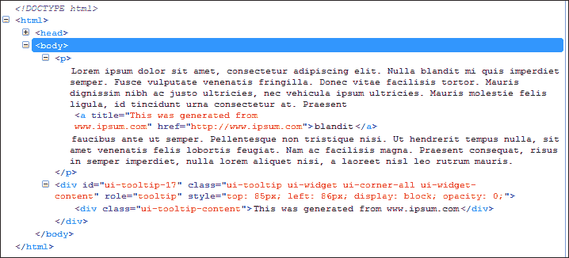

# 覆盖默认样式

在为工具提示小部件设置样式时，我们不仅限于仅使用提供的预构建主题（关于这一点，我们将在下一节进行讨论），我们始终可以选择用我们自己的样式覆盖现有样式。在下一个示例中，我们将看到如何通过对来自 `tooltip1.html` 的示例进行一些微小更改来轻松实现这一点。

在一个新文档中，添加以下样式，并将其保存为 `tooltipOverride.css`，放在 `css` 文件夹中：

```js
p { font-family: Verdana, sans-serif; }
.ui-tooltip { background: #637887; color: #fff; }
```

不要忘记从文档的 `<head>` 元素中链接到新的样式表：

```js
<link rel="stylesheet" href="css/tooltipOverride.css">
```

### 提示

在我们继续之前，值得说明一种在将结果提交到代码之前对工具提示进行样式设置的好技巧。

如果你使用的是 Firefox，你可以下载并安装 Firefox 的 **Toggle JS** 插件，该插件可以从 [`addons.mozilla.org/en-US/firefox/addon/toggle-js/`](https://addons.mozilla.org/en-US/firefox/addon/toggle-js/) 下载。这使我们可以按页面关闭 JavaScript；然后我们可以将鼠标悬停在链接上以创建工具提示，然后在 Firebug 中展开标记并随心所欲地进行样式设置。

将你的 HTML 文档保存为 `tooltip2.html`。当我们在浏览器中运行页面时，当鼠标悬停在文本中的链接上时，你应该看到修改后的工具提示出现：

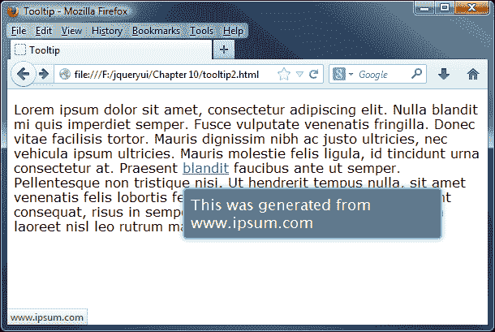

## 使用预构建主题

如果手工创建全新的样式对你的需求来说太过繁琐，你可以选择使用 jQuery UI 网站提供的预构建主题之一进行下载。

这是一个非常容易的变更。我们首先需要下载替换主题的副本；在我们的示例中，我们将使用一个称为**Excite Bike**的主题。让我们开始浏览[`jqueryui.com/download/`](http://jqueryui.com/download/)，然后取消选择**Toggle All**选项：

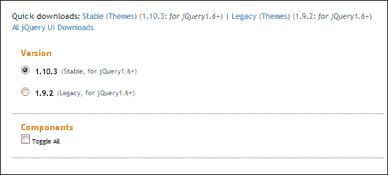

我们不需要下载整个库，只需要在底部更改主题选项以显示**Excite Bike**，然后单击**Download**：

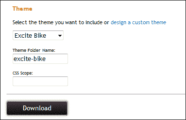

接下来，打开`tooltip2.html`的一个副本，然后找到这一行：

```js
<link rel="stylesheet" href="development-bundle/themes/redmond/jquery.ui.all.css">
```

您会注意到上述行中的突出显示的单词。这是现有主题的名称。将其更改为`excite-bike`，然后将文档保存为`tooltip3.html`，然后删除`tooltipOverride.css`链接，就可以了。以下是我们替换主题的示例：

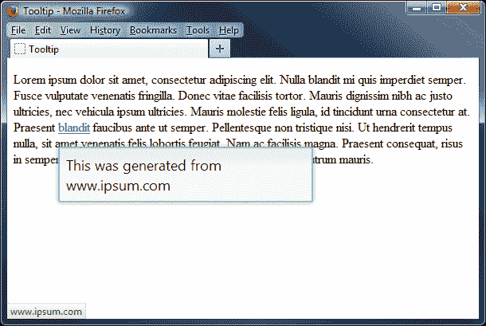

通过更改一个单词，我们可以在 jQuery UI 可用的任何预置主题之间切换（甚至其他人在网上提供的任何自定义主题），只要您已经下载并复制了主题到相应的文件夹中。

但是，可能会有一些情况，我们需要微调设置。这使我们既可以集中精力进行所需的更改，又可以兼顾两全其美。让我们看看如何使用 ThemeRoller 修改现有主题。

## 使用 ThemeRoller 创建自定义主题

如果我们浏览到[`jqueryui.com/themeroller/`](http://jqueryui.com/themeroller/)，我们可以修改用于样式化此页面上的**Tooltip**示例的一些设置。在**Content**下修改**Background color & texture**选项，然后将**Border**选项更改为**#580000**，如下截图所示：

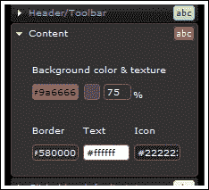

移动到**Clickable: active state**部分，然后将**Background color & texture**选项更改为**#ccb2b2**，**Border**选项更改为**#580000**。其余部分保持不变：

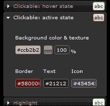

如果您滚动到页面底部的**Tooltip**示例，然后将鼠标悬停在任一图像上，您应该会看到我们更改的效果：

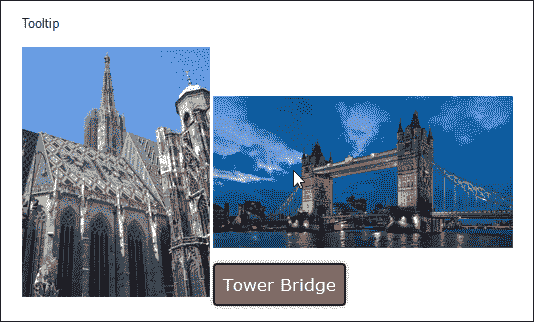

虽然我知道这些颜色可能不会赢得任何风格奖，但您可以看到改变颜色是多么容易。当您选择完颜色后，您可以从下载页面下载最终版本。本书附带的代码下载中也提供了自定义主题的副本；看看`jquery`文件夹中的`tooltip4.html`，以查看我们的新样式表的示例。

### 注意

我们甚至可以使用 HTML 进一步操作。不过，请注意，这将给您的页面引入安全风险，应谨慎使用！请查看本章后面标记为 *Working with HTML in tooltips* 的部分，以了解您如何真正改变工具提示样式的示例。

# 配置工具提示选项

库中的每个不同组件都有一系列选项，控制着小部件默认启用的功能。可以将对象文字或对象引用传递到 `tooltip()` 小部件方法中以配置这些选项。

在下表中显示了配置非默认行为的可用选项：

| 选项 | 默认值 | 用于… |
| --- | --- | --- |
| `content` | `function returning the title attribute` | 设置工具提示的内容 —— 如果设置了此选项，则很可能您还需要更改 items 选项。 |
| `disabled` | `false` | 禁用工具提示。 |
| `hide` | `null` | 确定是否以及如何动画隐藏工具提示。 |
| `items` | `[title]` | 设置指示应显示工具提示的项的选择器。如果您计划使用除了 title 属性以外的内容作为工具提示内容，或者需要为事件委托设置不同的选择器，则可以自定义此内容。 |
| `position` | `{ my: "left top+15", at: "left bottom", collision: "flipfit" }` | 确定工具提示相对于关联目标元素的位置。 |
| `show` | `null` | 确定是否以及如何动画显示工具提示。 |
| `tooltipClass` | `null` | 向可以显示不同工具提示类型的小部件添加类，例如错误或警告。 |
| `track` | `false` | 确定工具提示是否应跟踪（跟随）鼠标。 |

# 精确定位工具提示

jQuery UI 工具提示最有用的功能之一是能够精确调整它们在屏幕上的位置。可能会有需要它们出现的情况，但不能以隐藏网站或应用程序的重要功能为代价！让我们看一下 `position` 属性的工作原理，以一个具有自定义样式的带指针的工具提示为例。

在文本编辑器中，按照以下代码更改 `tooltip4.html` 的最后一个 `<script>` 块：

```js
<script>
  $(document).ready(function($){
    $('a').tooltip({
      position: { 
        my: 'center+30 bottom', 
        at: 'center top-8',
        of: '#tip'
      }
    });                  
    $('a').tooltip('option', 'tooltipClass', 'top');
  });  
</script>        
```

我们需要更改标记，以包括我们刚刚在工具提示调用中引用的选择器 ID：

```js
<p>Lorem ipsum dolor sit amet, consectetur adipiscing elit. Nulla blandit mi quis imperdiet semper. Fusce vulputate venenatis fringilla. Donec vitae facilisis tortor. Mauris dignissim nibh ac justo ultricies, nec vehicula ipsum ultricies. Mauris molestie felis ligula, id tincidunt urna consectetur at. Praesent <a href="http://www.ipsum.com" id="tip" title="This was generated from www.ipsum.com">blandit</a> faucibus ante ut semper. Pellentesque non tristique nisi. Ut hendrerit tempus nulla, sit amet venenatis felis lobortis feugiat. Nam ac facilisis magna. Praesent consequat, risus in semper imperdiet, nulla lorem aliquet nisi, a laoreet nisl leo rutrum mauris.</p>
```

在文本编辑器中新建一个文件，创建以下小样式表：

```js
body { margin-top: 75px; }
.ui-tooltip { background: #c99; color: white; border: none; padding: 0; opacity: 1; border-radius: 8px; border: 3px solid #fff; width: 245px; }
.ui-tooltip-content { position: relative; padding: 1em; }
.ui-tooltip-content::after { content: ''; position: absolute; border-style: solid; display: block; width: 0; }
.right .ui-tooltip-content::after { top: 18px; left: -10px; border-color: transparent #c99; border-width: 10px 10px 10px 0; }
.left .ui-tooltip-content::after { top: 18px; right: -10px; border-color: transparent #c99; border-width: 10px 0 10px 10px; }
.top .ui-tooltip-content::after { bottom: -10px; left: 72px; border-color: #c99 transparent; border-width: 10px 10px 0; }
.bottom .ui-tooltip-content::after { top: -10px; left: 72px; border-color: #c99 transparent; border-width: 0 10px 10px; }
```

将其保存为 `tooltipPointer.css`。从 `tooltip4.html` 中删除现有的样式，然后将以下引用添加到 <head> 中，并将其重新保存为 `tooltip5.html`：

```js
<link rel="stylesheet" href="development-bundle/themes/redmond/jquery.ui.all.css">
<link rel="stylesheet" href="css/tooltipPointer.css">
```

在此示例中，我们使用了许多伪选择器来设置工具提示的样式；这样做的额外好处是不需要任何图像来生成工具提示。如果在浏览器中查看新页面，它应该类似于以下截图：

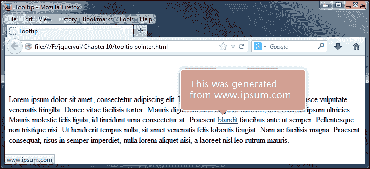

## 使用位置小部件

在我们的示例中，您可能已经注意到我们调整了窗口大小以实现前一个屏幕截图中显示的效果。如果将窗口扩展到全屏，工具提示很可能会移动；为了防止这种情况发生，重要的是要使用`of`属性，以便工具提示（在这种情况下）保持在我们标记中添加到的原始链接旁边。

使用位置属性（以及小部件）可能有点难以掌握，但值得努力确保您的小部件定位在您希望它们出现的位置。

### 注意

*Chris Coyier* 来自 CSS Tricks [(http://www.css-tricks.com](http://(http://www.css-tricks.com)) 展示了一个很好的示例，说明了位置实用程序的工作原理，您可以在 [`css-tricks.com/jquery-ui-position-function/`](http://css-tricks.com/jquery-ui-position-function/) 上查看。

简而言之，诸如以下代码的`position`小部件的示例用法：

```js
$("#move-me").position({
  "my": "right top",
  "at": "left bottom",
  "of":  $("#thing")
});
```

…将在以下插图中翻译：

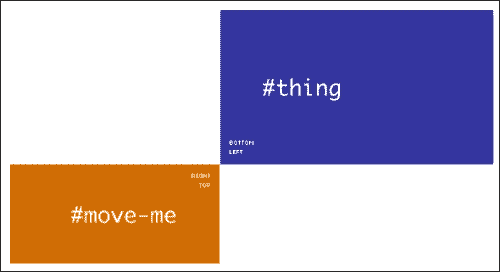

### 注意

来源：[`css-tricks.com/jquery-ui-position-function`](http://css-tricks.com/jquery-ui-position-function)/

# 使用工具提示跟踪鼠标移动

到目前为止，我们已经看过如何向页面添加工具提示，并涵盖了在屏幕上对其进行样式和定位的一些可能性。我们可以对我们的工具提示进行一个小的增强，使它们在激活时可以跟随您的鼠标光标移动。

这是一个简单的更改；更改`tooltip5.html`的主体，使其包含以下元素：

```js
<div id="content">
  <p>Lorem ipsum dolor sit amet, consectetur adipiscing elit. Nulla blandit mi quis imperdiet semper. Fusce vulputate venenatis fringilla. Donec vitae facilisis tortor. Mauris <a href="#" rel="tooltip1"title="This is a tooltip hovering over a link">dignissim</a> nibh ac justo ultricies, nec vehicula ipsum ultricies. Mauris molestie felis ligula, id tincidunt urna consectetur at. Praesent blandit faucibus ante ut semper. <a href="#" rel="tooltip2" title="Here is another tooltip">Pellentesque non tristique</a> nisi. Ut hendrerit tempus nulla, sit amet venenatis felis lobortis feugiat. Nam ac facilisis magna. Praesent consequat, risus in semper imperdiet, nulla lorem aliquet nisi, a laoreet nisl leo rutrum mauris.
  <p>Tooltips are also useful for form elements, to show some additional information in the context of each field.</p>
  <p>
    <label for="textinput">First text input:</label>
    <input id="test" title="Please enter text in this field." />
  </p>
</div>
<p>Hover over the input field or links to see the tooltips in action.</p>
```

我们需要添加跟踪功能，因此请将最终的`<script>`块更新如下：

```js
<script>
  $(document).ready(function($){
 $(document).tooltip({ track: true });
  });     
</script>        
```

将更新后的文档保存为`tooltip6.html`。现在让我们添加一些最终的调整，以便内容正确显示在屏幕上。将以下内容添加到新文档中，并将其保存为`tooltipTrack.css`，放在`css`文件夹中：

```js
p { font-family: Verdana, sans-serif; font-size: 0.8em; font-style: italic; }
label { display: inline-block; width: 8.5em; }
#content { border: 2px solid #42505a; padding: 5px; border-radius: 4px; }
#content p { font-style: normal; }
```

不要忘记从页面的`<head>`中链接到新样式表（通过替换对`tooltipPointer.css`的现有引用）：

```js
<link rel="stylesheet" href="css/tooltipTrack.css">
```

以下屏幕截图显示了预览结果时页面的外观：

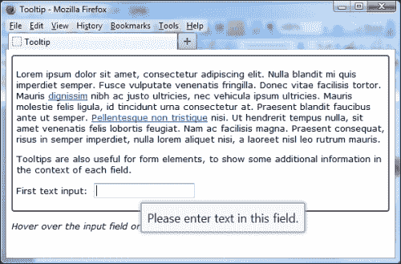

我们现在已将工具提示设置为在悬停在目标元素上时随光标移动。在我们的示例中，这包括两个链接或输入元素之一。在设置跟踪时，我们不限于这些元素；可以在任何有效的 HTML 元素上使用此功能，例如单选按钮、按钮，甚至标签。

虽然我们无法在印刷品中轻松显示它，但您应该发现，只要光标仍悬停在目标元素上，工具提示将跟随它移动。

# 显示特定的工具提示

到目前为止，我们已经将所有的工具提示都分配给了使用`$(document)`对象工作；虽然这样做完全没有问题，但这意味着我们的工具提示将始终遵循相同的格式，并以相同的方式工作，因为配置将应用于页面上的所有工具提示。

我们可以轻松地进行更改；然而，jQuery UI 的工具提示将与任何 jQuery 选择器一样良好地工作，就像与文档对象一样。为了证明这一点，让我们看看如何配置工具提示以与特定元素一起工作。

在`tooltip2.html`中，将最后一个`<script>`元素更改为以下内容：

```js
<script>
  $(document).ready(function($){
    $("#input").tooltip();
  });  
</script>        
```

我们不需要 CSS 重写样式，因此从文档的`<head>`中删除此行：

```js
<link rel="stylesheet" href="css/tooltipOverride.css">
```

我们还需要在现有标记下面添加以下代码：

```js
<p>Tooltips are also useful for form elements, to show some additional information in the context of each field.</p>
<label for="input">Please enter some text:</label>
<input type="text" id="input" title="I am a tooltip!">
```

将此文件保存为`jqueryui`文件夹中的`tooltip7.html`。在本示例中，我们已删除了对文档的引用，并将其替换为分配给文本框的`id`，如以下屏幕截图所示：

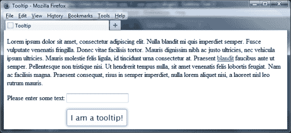

与我们之前看到的相同的样式类仍然会被应用，但这次它们只会在悬停在文本框上时出现，而不是在文本中的链接上出现。

# 在工具提示中显示 AJAX 内容

在本章的大部分内容中，我们都使用了在页面上可以找到的任何标签的 title 属性中存储的文本来显示内容的标准技术。

然而，jQuery UI 的工具提示能够使用 AJAX 引用内容；这允许您动态生成工具提示，而不仅仅是限于在您的标记中显示的内容。在我们的示例中，我们将使用内容属性将纯文本传递给小部件；您也可以将回调函数作为内容的值传递给工具提示。

在您的文本编辑器中，删除`tooltip7.html`中现有的最后一个`<script>`块，并将其替换为以下代码：

```js
$(document).ready(function($){
  var url = "ajax.html"; 
  $("#ajaxTip").load(url);
  $('a').tooltip({
    content: '... waiting on ajax ...',
    open: function(evt, ui) {
      var elem = $(this);
      var data = $("#ajaxTip").text();
      $.ajax().always(function(event, ui) {
        elem.tooltip('option', 'content', data);
      });
    }
  }); 
}); 
```

接下来，删除`<label>`和`<input>`代码，然后在`<body>`部分的标记中立即添加以下内容：

```js
<div id="ajaxTip" style="display:none;"></div>
```

我们还需要创建一些将使用 AJAX 导入到页面中的内容，因此在一个新文档中添加以下代码，并将其保存为`ajax.html`：

```js
Lorem ipsum dolor sit amet, consectetur adipiscing elit.
```

将文件保存为`tooltip8.html`。在这种情况下，您需要通过 web 服务器查看此文件，以便 AJAX 效果能够正常工作；如果您无法访问在线 Web 空间，则可以在本地使用 WAMP Server（适用于 PC，可从 [`www.wampserver.com/en/`](http://www.wampserver.com/en/) 下载）或 MAMP（适用于 Mac，可从 [`www.mamp.info/en/mamp/`](http://www.mamp.info/en/mamp/) 下载），它们同样有效。

当悬停在链接上时，将显示一个工具提示，但内容是导入的 HTML 文件的内容，如以下屏幕截图所示：

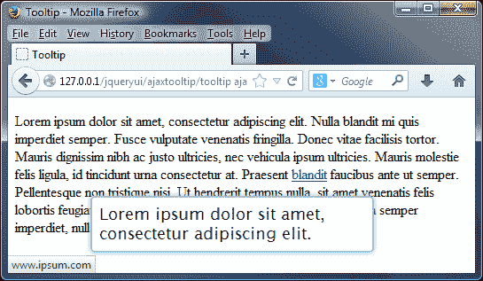

由于我们正在拉取基于 HTML 的内容，因此您应确保正确处理内容，以最大程度地减少对您网站的攻击风险。在本示例中，我们只是从我们的测试 HTML 文件中导入了纯文本，但是使用此方法确实允许您以很大的效果导入任何 HTML（在合理范围内）。

### 提示

本章后面，我们将更详细地讨论在工具提示中使用 HTML；您可能会考虑使用该方法的样式和内容，但是使用 AJAX 代替全部导入更好。

## 我们如何知道它是否起作用？

通过在 DOM 检查器的**控制台**选项卡中检查它，您可以最轻松地判断您的内容是否已成功导入，例如 Firebug。

### 注意

DOM 检查器可用于检查、浏览和编辑任何网页的**文档模型对象**（**DOM**），用于许多目的，例如确定加载缓慢的对象或源，或在提交到代码之前预览 CSS 样式的更改。

在这里，您可以清楚地看到来自`test.html`的调用（从 Firebug 中获取），该调用返回了一个值为`200`的值，表示成功：

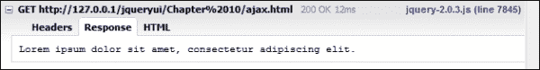

# 在工具提示中使用效果

您可能已经注意到，在本章的每个示例中，每个工具提示默认都会逐渐淡入和淡出。工具提示不仅限于仅使用此淡入或淡出效果；您可能更喜欢在屏幕上显示时显示更多影响的内容。

在我们的下一个示例中，我们将看看如何修改代码以使用不同的效果，以实现此效果。将以下代码行立即添加到`tooltip7.html`中最后一次调用 jQuery UI 库之后：

```js
<script src="img/jquery.ui.effect.js"></script>
<script src="img/jquery.ui.effect-bounce.js"></script>
<script src="img/jquery.ui.effect-explode.js"></script>
```

接下来，从现有标记中删除这两行：

```js
<label for="input">Please enter some text:</label>
<input type="text" id="input" title="I am a tooltip!">
```

更改最终的`<script>`元素以包含新的效果，如下所示：

```js
<script>
  $(document).ready(function($){
    $(document).tooltip({
      show: { effect: "bounce", duration: 800 },
      hide: { effect: "explode", duration: 800 }
    });
  });  
</script>        
```

将文档保存为`tooltip9.html`。如果我们将页面加载到浏览器中，并在文本中的链接上悬停，您将看到在移开时工具提示会爆炸，如以下屏幕截图所示：

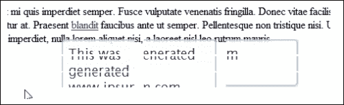

# 在工具提示中使用 HTML

到目前为止，我们已经介绍了如何在页面上设置工具提示以及对其进行样式设置。然而，后者给我们带来了一个小困境，因为我们必须依赖 jQuery 来以编程方式添加 CSS 样式，如果我们的目标是保持渐进式的增强样式，这可能会有所损害。有一个解决办法；虽然它涉及一定的 jQuery 元素，但它确实允许我们使用 HTML 来生成我们的工具提示，这对我们的需求更加灵活。

### 提示

**在您的工具提示中使用 HTML**

在我们继续之前，我应该指出，使用这种方法会给您的代码引入安全风险；因此，默认情况下，内容的使用方式已从允许 HTML 更改为仅允许纯文本。请自行承担风险！

删除`tooltip9.html`中标记的内容，并添加以下内容：

```js
<p>Lorem ipsum dolor sit amet, consectetur adipiscing elit. Nulla blandit mi quis imperdiet semper. Fusce vulputate venenatis fringilla. Donec vitae facilisis tortor. Mauris <a href="#" rel="tooltip1">dignissim</a> nibh ac justo ultricies, nec vehicula ipsum ultricies. Mauris molestie felis ligula, id tincidunt urna consectetur at. Praesent blandit faucibus ante ut semper. Pellentesque non tristique nisi. Ut hendrerit tempus nulla, sit amet venenatis felis lobortis feugiat. Nam ac facilisis magna. Praesent consequat, risus in semper imperdiet, nulla lorem aliquet nisi, a laoreet nisl leo rutrum mauris.
</p>
```

接下来，修改最终的`<script>`块，如以下代码所示：

```js
<script>
  $(document).ready(function($){
 var tooltiptext = "<div id='tooltip'><div id='title'>Test Tooltip </div><div id='content'>This is a random tooltip with some text</div></div>";
 $("a[rel=tooltip]").tooltip({
 items: "a",
 content: function() {
 return tooltiptext;
 }
 });
  });     
</script>   
```

将此另存为`tooltip10.html`。现在我们有一个工作的工具提示，但它看起来不太吸引人。创建一个新样式表，并添加以下基本样式：

```js
p { font-family: Verdana, sans-serif; }
#tooltip { width: 100px; border: 1px solid #F1D031; font-family: Verdana, sans-serif; font-size: 10px; }
#title { width: 94px; background-color: #FFEF93; font-weight: bold; padding: 3px; }
#content { width: 94px; background-color: #FFFFA3; height: 50px; padding: 3px; }
```

将此另存为`tooltipSelector.css`到您的`css`文件夹中。不要忘记从我们页面的`<head>`中链接到新样式表（在链接到标准 jQuery UI 样式表之后）：

```js
<link rel="stylesheet" href="css/tooltipSelector.css">
```

在此示例中，我们将不使用来自我们 redmond 主题的预构建样式，因此删除以下链接：

```js
<link rel="stylesheet" href="development-bundle/themes/redmond/jquery.ui.all.css">
```

我们还需要从先前的演示中删除效果调用，因此从您的文档的`<head>`中删除以下链接：

```js
<script src="img/jquery.ui.effect.js"></script>
<script src="img/jquery.ui.effect-bounce.js"></script>
<script src="img/jquery.ui.effect-explode.js"></script>
```

将我们更改后的文档保存为`tooltip10.html`。如果我们在浏览器中运行此页面，则会在悬停在链接上时看到工具提示**Test tooltip**出现，如下截图所示：

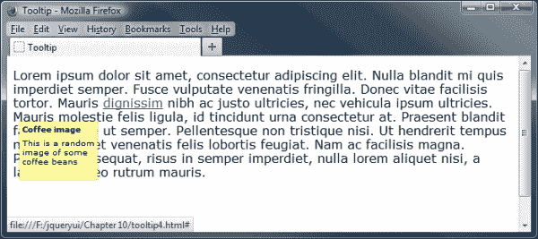

正如您所看到的，我们已完全改变了我们的工具提示所使用的样式；这种方法需要比设置工具提示的常规方法更多的工作，但只要做得正确，它就是值得的！

## 使用 HTML 工作的危险

在上一个示例中，我们看了一下如何将 HTML 整合到您的工具提示中，这在显示工具提示中可以显示令人满意的内容方面开启了一些强大的机会。然而，在使用 HTML 工具提示时存在固有的风险；在库的以前版本中，您可以在设置工具提示时在`<title>`标签中包含 HTML。但是，在 UI 1.10 中，这已经更改为修复跨站点脚本（XSS）漏洞的版本 1.9 中存在的版本，在该漏洞中，攻击者可以在页面上的工具提示小部件中插入（或注入）客户端脚本，通常是恶意的。您仍然可以使用 HTML，但需要像前面的示例中所述使用内容选项。您可以在[`en.wikipedia.org/wiki/Cross-site_scripting`](http://en.wikipedia.org/wiki/Cross-site_scripting)了解有关跨站点脚本的更多信息，以及如何减少威胁。

### 注意

由于内容选项覆盖了默认行为，因此您应始终确保正确转义（或清理）内容以最小化跨站点脚本的风险。

# 使用工具提示方法

Tooltip widget 包含一些方法，允许我们以编程方式使用它并更改其默认行为。让我们看一下这些方法，它们在以下表格中列出：

| 方法 | 用途 |
| --- | --- |
| `close` | 关闭工具提示；仅应用于非委托工具提示。 |
| `destroy` | 完全删除工具提示功能。 |
| `disable` | 禁用工具提示。 |
| `enable` | 启用工具提示。 |
| `open` | 以编程方式打开工具提示。这仅适用于非委托工具提示。 |
| `option` | 获取或设置与指定的`optionName`关联的值 |
| `widget` | 返回包含原始元素的 jQuery 对象。 |

# 启用和禁用工具提示

我们可以利用`enable`或`disable`方法以编程方式启用或禁用特定的工具提示。这将有效地打开任何最初被禁用的工具提示或关闭当前活动的工具提示。让我们利用`enable`和`disable`方法来打开或关闭一个工具提示，我们将配置它在页面加载到浏览器时处于禁用状态。

在`tooltip10.html`的工具提示部件的现有标记之后直接添加以下新的`<button>`元素：

```js
    <label for="input">Please enter some text:</label>
    <input type="text" id="tooltip2" title="I am a tooltip!">
    <p>
      <button id="turnon">Enable Tooltip 1</button>
      <button id="turnoff">Disable Tooltip 1</button>
    <p>
  </body>
```

接下来，更改最后的`<script>`元素，使其如下所示：

```js
<script>
  $(document).ready(function($){
    $("#tooltip").tooltip({ disabled: true });
    $("#turnon").click(function(){
      $("#tooltip").tooltip("enable");
    })

    $("#turnoff").click(function(){
      $("#tooltip").tooltip("disable");
    })
  });  
</script>
```

将更改的文件保存为`tooltip11.html`。在页面上，我们添加了两个新的`<button>`元素。一个用于启用已禁用的工具提示，另一个用于再次禁用它。如果我们将页面加载到浏览器中，我们将看到类似以下截图：

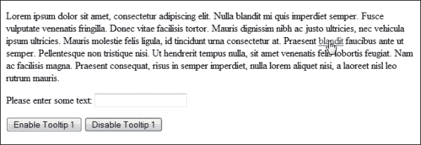

在 JavaScript 中，我们使用`启用工具提示`按钮的`click`事件来调用`tooltip()`小部件方法。为此，我们将字符串`enable`作为第一个参数传递给`tooltip()`方法。另外，我们将要启用的标签的索引号作为第二个参数传递。jQuery UI 中的所有方法都是以这种方式调用的。我们指定要调用的方法的名称作为小部件方法的第一个参数；`disable`方法也是以相同的方式使用的。

### 注意

不要忘记，如果将`$(document)`设置为工具提示所在的元素，则我们可以在不需要额外参数的情况下使用这两种方法，以启用或禁用该页面上的所有工具提示。

# 程序化显示工具提示

除了以编程方式启用或禁用工具提示之外，我们同样可以通过点击屏幕上的按钮或适当的链接随意显示或隐藏工具提示。让我们现在使用这两种方法之一，在下一个示例中随意显示或隐藏其中一个工具提示。

在`tooltip11.html`中，按指示修改现有标记的最后几行：

```js
<label for="input">Please enter some text:</label>
<input type="text" id="tooltip2" title="I am a tooltip!">
<p>
 <button id="showtip">Show (open) Tooltip</button>
 <button id="hidetip">Hide (close) Tooltip</button>
</p>
```

接下来，让我们更改最后的`<script>`元素，以包含新添加的按钮所分配的新事件处理程序：

```js
<script>
  $(document).ready(function($){
 $("#tooltip").tooltip();

 $("#showtip").click(function(){
 $("#tooltip").tooltip("open");
 })
 $("#hidetip").click(function(){
 $("#tooltip").tooltip("close");
 })
  });  
</script>        
```

将已更改的文件保存为`tooltip12.html`。在将页面加载到浏览器并单击**显示（打开）工具提示**按钮时，您将会看到工具提示的出现：

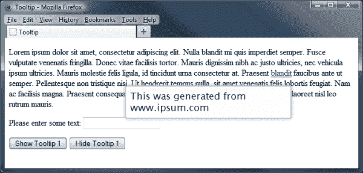

在 JavaScript 中，我们使用**显示（打开）工具提示**按钮的`click`事件来调用工具提示小部件并显示工具提示。为此，我们只需要将一个属性，即字符串`open`，传递给`tooltip()`方法。当我们需要隐藏（或关闭）工具提示时，我们可以以类似的方式通过调用工具提示小部件来传递字符串`close`。

# 处理工具提示事件

Tooltip 小部件定义了三个事件，允许您添加回调函数以执行不同的操作，当检测到小部件暴露的某些事件时。以下表格列出了能够在事件上接受可执行函数的配置选项：

| 事件 | 当...时触发 |
| --- | --- |
| `close` | 当焦点离开或鼠标移出时，提示关闭或触发 |
| `create` | 提示已创建 |
| `open` | 当焦点移入或鼠标悬停时，提示显示或触发 |

每个库组件都有回调选项（如前面表格中的选项），这些选项被调整为在任何访问者交互的关键时刻查找。我们在这些回调中使用的任何函数通常在更改发生之前执行。因此，您可以从回调中返回`false`，防止操作发生。

在我们的下一个示例中，我们将看看如何轻松地对显示的特定提示做出反应，使用标准的非绑定技术。将`tooltip12.html`中的最后一个 `<script>` 元素更改为以下内容：

```js
<script>
  $(document).ready(function($){
    $("#tooltip").tooltip({
      open: function(event, ui) {
        $("#console").append("Tooltip activated" + "<br>");
      },
      close: function(event, ui) {
        $("#console").append("Tooltip closed" + "<br>");
      }
    });
    $("#tooltip").tooltip();
  });  
</script>
```

保存为`tooltip13.html`。我们还需要更改我们的标记，所以删除现有标记底部的两个按钮，并插入一个新的 History `<div>` 如下所示：

```js
 <div id="history">
 <b>History:</b> 
 <div id="console"></div>
 </div>
</body>
```

最后，我们需要添加一些样式使显示看起来漂亮。在一个新文档中，添加以下内容：

```js
#history { border-radius: 4px; border: 1px solid #c4c4c4; width: 250px; padding: 3px; margin-top: 15px; }
```

将此保存在`css`文件夹中为`tooltipEvents.css`。不要忘记从页面的`<head>`中链接到新样式表（在链接到标准 jQuery UI 样式表之后）：

```js
<link rel="stylesheet" href="css/tooltipEvents.css">
```

如果我们在浏览器中预览结果，然后几次移动到提示链接上。我们可以开始看到历史记录的建立，如此屏幕截图所示：

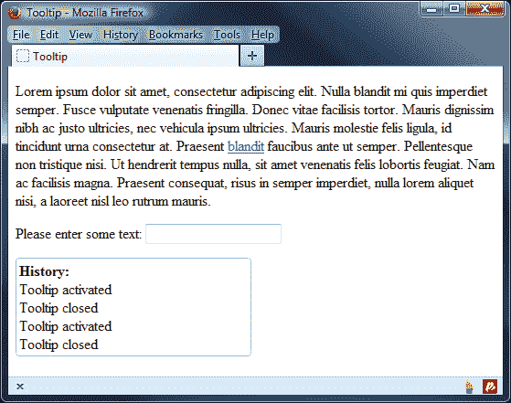

在这个示例中，我们同时使用了`open`和`close`回调，尽管对于也可以由提示触发的创建自定义事件，原理是相同的。回调函数的名称作为我们配置对象中`open`和`close`属性的值提供。

当我们定义的回调函数被执行时，小部件将自动传递两个参数给它们。这些是原始的`event`对象和包含有用的属性的自定义`ui`对象，来自显示的提示。

## 绑定到提示事件

使用每个组件公开的事件回调是处理交互的标准方式。但是，除了上一个表格中列出的回调之外，我们还可以研究另一组在不同时间由每个组件触发的事件。

我们可以使用标准的 jQuery `on()` 方法来将事件处理程序绑定到由 Tooltip 小部件触发的自定义事件上，方式与我们可以绑定到标准 DOM 事件（例如点击）相同。

以下表格列出了 Tooltip 小部件的自定义绑定事件及其触发器：

| 事件 | 当...时触发 |
| --- | --- |
| `tooltipcreate` | 提示已创建 |
| `tooltipopen` | 工具提示显示或在`focusin`或`mouseover`上触发 |
| `tooltipclose` | 工具提示关闭或在`focusout`或`mouseleave`上触发 |

第一个事件在工具提示创建后立即触发；剩下的两个事件取决于工具提示是否已获得焦点。

让我们看看此类事件如何运作；将`tooltip13.html`中的最后一个`<script>`元素更改为以下内容：

```js
<script>
  $(document).ready(function($){
    $("#tooltip").tooltip();
    $("#tooltip").on("tooltipopen", function(event, ui) {
      $("#console").append("Tooltip activated" + "<br>");
    })

    $("#tooltip").on("tooltipclose", function(event, ui) {
      $("#console").append("Tooltip closed" + "<br>");
    })
  });  
</script>
```

将此更改保存为`tooltip14.html`。以这种方式绑定到`tooltipopen`和`tooltipclose`事件处理程序，会产生与上一个示例中使用`open`和`close`回调函数相同的结果。与上次一样，每次将鼠标悬停在文本中的工具提示上时，控制台日志都应更新。

所有部件公开的所有事件都可以使用`on()`方法，只需在事件的名称前加上部件的名称即可。

# 播放视频

到目前为止，我们已经涵盖了大量关于使用 jQuery UI 的工具提示的理论；在这个例子和下一个例子中，我们将看看一些实用的工具提示的实际用法，您可以将其用作您自己项目的起点。在继续之前，请确保您可以获得代码下载的副本，因为我们将在本练习中使用其中的文件。

工具提示的一种可能用法是模仿您可能在社交媒体网站上找到的喜欢或不喜欢按钮，例如 YouTube，在那里您可以注册对您喜欢观看的视频的偏好。让我们看看您如何在自己的项目中复制此功能，但是使用我们在本书中到目前为止已经涵盖的一些其他 jQuery UI 部件和工具提示。

### 注意

此演示使用了来自开源项目*The Big Buck Bunny*的视频，该项目由*Blender Foundation*创建，并可从[`www.bigbuckbunny.org`](http://www.bigbuckbunny.org)获取。

从代码下载中提取`tooltipVideo.js`的副本；这将提供将按钮和工具提示添加到视频底部的功能。不要忘记从我们页面的`<head>`中链接到新的 JavaScript 文件（在链接到 jQuery UI 按钮部件之后）：

```js
<script src="img/tooltipVideo.js"></script>
```

我们还需要在我们页面的`<head>`中添加对 Button 部件的引用：

```js
<script src="img/jquery.ui.button.js"></script>
```

接下来，更改`<body>`，使其包含以下元素：

```js
<div class="player">
  <video controls="controls">
      <source src="img/big_buck_bunny.mp4" />
      <source src="img/big_buck_bunny.webm" />
    </video>
  </div>
  <p>
  <div class="tools">
    <span class="set">
      <button data-icon="ui-icon-circle-arrow-n" title="I like this">Like</button>
      <button data-icon="ui-icon-circle-arrow-s">I dislike this</button>
    </span>
    <div class="set">
      <button data-icon="ui-icon-circle-plus" title="Add to Watch Later">Add to</button>
      <button class="menu" data-icon="ui-icon-triangle-1-s">Add to favorites or playlist</button>
    </div
    <button title="Share this video">Share</button>
    <button data-icon="ui-icon-alert">Flag as inappropiate</button>
</div>

```

最后但同样重要的是，我们还需要添加一些样式，以确保工具提示正确显示。将以下内容添加到文本编辑器中的新文档中：

```js
.player { width: 642px; height: 362px; border: 2px groove gray; background: rgb(200, 200, 200); text-align: center; line-height: 300px; }
.ui-tooltip { border: 1px solid white; background: rgba(20, 20, 20, 1); color: white; }
.set { display: inline-block; }
.notification { position: absolute; display: inline-block; font-size: 2em; padding: .5em; box-shadow: 2px 2px 5px -2px rgba(0,0,0,0.5); }
```

将此文件保存为`tooltipVideo.css`，放入`css`文件夹中 - 不要忘记从主文档中添加一个链接，紧跟在链接到 jQuery UI 样式表之后：

```js
<link rel="stylesheet" href="css/tooltipVideo.css">
```

将您修改后的页面保存为`tooltip15.html`。以下截图显示了在浏览器中预览视频时页面的外观：

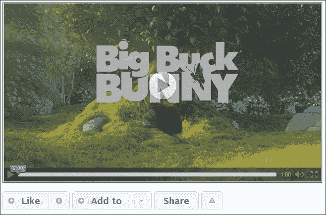

以这种方式使用按钮允许我们向我们的站点添加一些真正强大的功能。在我们的示例中，按钮实际上并不执行任何操作（除了显示工具提示），但在现实生活中，它们将用于维护观看视频并希望注册对其喜欢（或不喜欢）的人的运行总数。

# 填写和验证表单

本章中，我们已经涵盖了很多关于如何实现工具提示，并根据我们的需求配置它们在我们网站中的用法。然而，我们不能在没有对站点的最重要（或常见？）用途之一 - 表单验证进行检查的情况下结束本章。

我相信多年来，你很可能在网上填写过表格；也许是作为购买某物的一部分，并且在填写过程中犯过错误。工具提示的美妙之处在于我们可以利用它们向访问者提供反馈，以确保他们正确填写字段，并且不会向您的表单输入无效值。

在您的文本编辑器中，按照下面的代码更改`tooltip14.html`的最终`<script>`块：

```js
$(document).ready(function($){
  $("button").button();
  var $tooltips = $('#signup [title]').tooltip({
    position: { my: "left+15 center", at: "right center" }
  });
  $("#open").on('click', function() {
    $tooltips.tooltip('open');
  });
  $("#close").on('click', function() {
    $tooltips.tooltip('close');
  });
});
```

由于在本示例中我们使用了 JQuery UI 的 Button 小部件，所以我们需要在 jQuery UI 库中添加一个到该小部件的链接：

```js
<script src="img/jquery.ui.button.js"></script>
```

接下来，我们需要添加我们表单的标记 - 删除现有标记，并用以下标记替换它：

```js
<form id="signup">
  <fieldset>
    <legend>Sign Up Now</legend>   
    <div>        
      <label for="username">Username:</label>
      <input type="text" name="username" id="username" title="User name must be between 8 and 32 characters."><br>
    </div>
    <div>
      <label for="password">Password:</label>
      <input type="password" name="password" title="Password must contain at least one number.">
    </div>
    <div>
      <label for="password2">Confirm Password:</label>
      <input type="password" name="password2" title="Please re-type your password for confirmation.">
    </div>
  </fieldset>
</form>
  <button id="open">Open Help</button>
  <button id="close">Close Help</button>
```

将其保存为`tooltip16.html`。我们还需要一些 CSS 来完成这个示例。在我们刚创建的页面的`<head>`中，添加以下`<link>`元素：

```js
<link rel="stylesheet" href="css/tooltipForm.css">
```

然后在您的文本编辑器中添加一个新页面，加入以下代码：

```js
body { font-family: verdana, sans-serif; width: 430px; }
label { display: inline-block; width: 11em; }
button { float: right; margin: 2px; }
fieldset { width: 400px; border: 3px solid black; border-radius: 4px; margin: 3px; border-color: #7c96a9; font-size: 1.1em;}
fieldset div { margin-bottom: 1.2em; }
fieldset .help { display: inline-block; }
.ui-tooltip { width: 300px; font-size: 0.7em; }
```

将其保存为`tooltipForm.css`在`css`文件夹中。如果我们在浏览器中预览页面，您将看到在悬停在它们上方时每个工具提示都会出现，或者当点击**打开帮助**按钮时它们都会显示，如下面的截图所示：

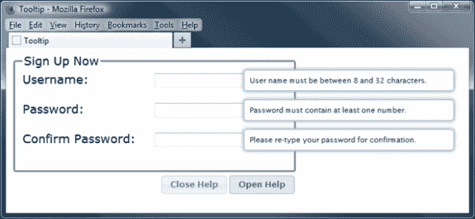

在本示例中，我们已将 jQuery UI 设置为显示每个字段的`[title]`属性上的工具提示。然而，由于我们将工具提示方法处理程序分配给了`$tooltips`变量，我们能够使用它来为每个按钮创建一个点击处理程序，根据按下的按钮是哪个来显示或隐藏所有工具提示。当发生错误时，我们还可以向用户显示消息；例如，如果密码输入错误，我们可以使用输入字段的`blur`事件处理程序在屏幕上打开一个工具提示。

# 总结

哎呀！对于这样一个小小的小部件，我们确实涵盖了很多内容！

工具提示小部件是传达短信息的绝佳方式，比如错误或警报，可以甚至用它作为迷你帮助系统；让我们回顾一下本章讨论的内容。

我们首先看了一下，只需一点基础的 HTML 和一行 jQuery 风格的 JavaScript，我们就可以实现默认的提示小部件。然后，我们看到了通过使用预设计的 ThemeRoller 主题或我们自己的主题，轻松地为提示小部件设置样式的方法；这样它的外观就会改变，但行为不会改变。

然后，我们继续，看了一下提示小部件 API 暴露的一系列可配置选项，以及如何使用这些选项来控制小部件提供的选项。在可配置选项之后，我们介绍了一些方法，我们可以使用这些方法来以编程方式使提示小部件执行不同的操作，比如启用或禁用特定的提示。

我们简要地看了一下提示小部件支持的一些更复杂的功能，比如基于 AJAX 的提示，以及为表单提供上下文。这两种技术都很容易使用，并且可以为任何实现增加价值。

我们现在已经完成了 UI 小部件的探索，所以让我们将注意力转向库中可用的一些交互，从拖动小部件开始。
