# 第十一章：拖拽功能

到目前为止，在本书中，我们已经涵盖了完全发布的完整范围的界面小部件，并在接下来的四章中，我们将把重点转向核心交互辅助工具。这些是为小部件提供基于鼠标的交互的小部件，我们可以在网站上执行选择、拖动或调整小部件等操作。一个完美的例子是可调整大小的小部件，我们将在第十二章中进行讨论，*可调整大小的组件*。这些库的交互组件与我们已经查看过的组件不同，因为它们不是页面上存在的物理对象或小部件。

这些是低级交互组件，与本书第一部分我们查看的高级小部件相对。它们帮助您页面上使用的元素更具吸引力和互动性，为您的访问者增添价值，可以帮助使您的 Web 应用程序看起来更专业。它们还有助于模糊浏览器和桌面之间的区别，提供更大的可用性，使 Web 应用程序更加高效、有效和自然。

在本章中，我们将讨论两个非常相关的组件—**可拖动**和**可放置物品**。可拖动的 API 将任何指定的元素转换为您的访问者可以用鼠标指针拾起并在页面上拖动的东西。公开的方法允许您限制拖动物品的移动，使其在放下后返回到起始点，以及更多功能。

在本章中，我们将介绍以下主题：

+   如何使元素可拖动

+   可配置可拖动对象的选项

+   如何使一个元素在拖动结束后返回到起始点

+   如何在交互的不同点使用事件回调

+   拖动助手的作用

+   包含可拖动物品

+   如何使用组件的方法控制可拖动性

+   将元素转换为放置目标

+   定义接受的可拖动物品

+   使用可放置类名

+   定义放置容忍度

+   对可拖动物品和可放置物品之间的交互做出反应

可放置的 API 允许您定义页面的区域或某种容器，使人们可以将可拖动物品拖放到其中以触发其他操作，例如，将产品添加到购物篮中。可放置小部件触发的一系列事件让我们对任何拖动交互的最有趣时刻做出反应。

# 处理可拖动和可放置物品的交易

拖放行为总是相辅相成。一个找到，另一个总是附近。在网页上拖曳元素是非常不错的，但如果没有地方可以将该元素拖拽到，那么整个操作通常是没有意义的。

您可以独立使用`draggable`类，而不使用`droppable`类，因为纯粹的拖动可能会有其用途，例如对话框组件。但是，您不能在没有`draggable`类的情况下使用`droppable`类。当然，您不需要使用任何可拖动的方法，但是没有任何东西可放置在其上的可拖放对象是毫无价值的。

与小部件一样，显然可以将一些交互帮助程序组合起来；拖动和放置显然是一起的。但是，拖动器还可以与可排序的一起使用，正如我们将在第十三章所见，*使用 jQuery UI 进行选择和排序*，以及可调整大小的内容。

# 使用可拖拽小部件入门

可拖拽组件用于使任何指定的元素或元素集合可拖动，以便访问者可以将它们拾取并在页面上移动。可拖拽性是一个很棒的效果，是一个可以以多种方式用于改进网页界面的功能。

使用 jQuery UI 意味着我们不必担心最初使网页上的可拖动元素实现和维护成为一场噩梦的各种棘手的浏览器之间的差异。

## 实现基本拖动

让我们通过首先使简单的`<div>`元素可拖动来查看默认实现。我们不会进行任何其他配置。因此，此代码将允许您使用鼠标指针拾取元素并在视口周围拖动它。

在文本编辑器中的新文件中添加以下代码：

```js
<!DOCTYPE HTML>
<html>
  <head>
    <meta charset="utf-8">
    <title>Draggable</title>
    <link rel="stylesheet" href="development-bundle/themes/redmond/jquery.ui.all.css">
    <link rel="stylesheet" href="css/autocompleteTheme.css">
    <script src="img/jquery-2.0.3.js"></script>
    <script src="img/jquery.ui.core.js"></script>
    <script src="img/jquery.ui.widget.js"></script>
    <script src="img/jquery.ui.mouse.js"></script>
    <script src="img/jquery.ui.draggable.js "></script>
    <script>
      $(document).ready(function($){
        $("#drag").draggable();
      });
    </script> 
  </head>
  <body>
    <div id="drag"></div>
  </body>
</html>
```

将此保存为`draggable1.html`文件到您的`jqueryui`文件夹中。与 jQuery UI 的基于小部件的组件一样，可以使用一行代码启用可拖拽组件。这会调用可拖拽的构造方法：`draggable`，并将指定的元素转换为拖动对象。

我们需要从库中获取以下文件，以在元素上启用可拖拽性：

+   `jquery-2.0.3.js`

+   `jquery.ui.core.js`

+   `jquery.ui.widget.js`

+   `jquery.ui.mouse.js`

+   `jquery.ui.draggable.js`

我们正在使用在页面的`<head>`标签中链接到的 CSS 文件中指定的带背景图像的普通`<div>`元素。使用以下样式表作为拖动元素：

```js
#drag { width: 114px; height: 114px; cursor: move; background: url(../img/draggable.png) no-repeat; }
```

将此保存为`draggable.css`文件到`css`文件夹中。当您在浏览器中查看页面时，您将看到图像可以在可拖动区域内移动，如以下屏幕截图所示：

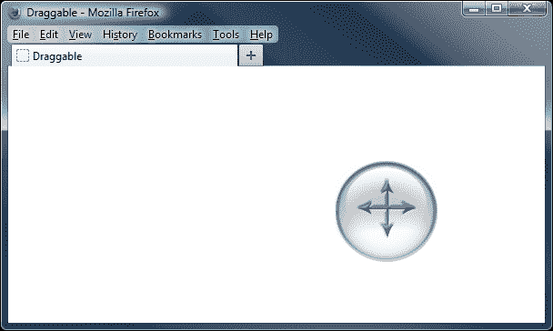

# 配置可拖拽选项

可拖拽组件具有广泛的可配置选项，使我们对其添加的行为具有非常细微的控制。以下表格列出了我们可以操作以配置和控制我们的拖动元素的选项：

| 选项 | 默认值 | 用途 |
| --- | --- | --- |
| `addClasses` | `true` | 向拖动对象添加`ui-draggable`类。将其设置为`false`以防止添加此类。 |
| `appendTo` | `"parent"` | 为带有附加辅助元素的拖动对象指定容器元素。 |
| `axis` | `false` | 将拖动对象约束于一个运动轴。接受字符串`x`和`y`作为值，或者布尔值`false`。 |
| `cancel` | `":input, option"` | 防止匹配指定元素选择器的某些元素被拖动。 |
| `connectToSortable` | `false` | 允许将拖动对象放置到可排序列表中并成为排序元素之一。 |
| `containment` | `false` | 防止拖动对象被拖出其父元素的边界。 |
| `cursor` | `"auto"` | 指定指针在拖动对象上时使用的 CSS 光标。 |
| `cursorAt` | `false` | 指定拖动对象在拖动时相对于拖动对象出现的默认位置。 |
| `delay` | `0` | 指定延迟拖动交互开始的时间（以毫秒为单位）。 |
| `disabled` | `false` | 禁用可拖动的拖动对象。 |
| `distance` | `1` | 指定在鼠标按钮按住拖动对象时指针应该移动的像素距离，以便开始拖动。 |
| `grid` | `false` | 使拖动对象吸附到页面上的虚拟网格。接受包含网格的`x`和`y`像素值的数组。 |
| `handle` | `false` | 定义用于保持指针以便拖动的拖动对象的特定区域。 |
| `helper` | `"original"` | 定义一个伪拖动元素，该元素代替拖动对象进行拖动。可以接受字符串值 original 或 clone，也可以接受返回辅助元素的函数。 |
| `iframeFix` | `false` | 在拖动进行时阻止页面上的所有`<iframe>`元素捕获鼠标事件。 |
| `opacity` | `false` | 设置辅助元素的不透明度。 |
| `refreshPositions` | `false` | 在拖动进行中计算所有放置对象的位置。 |
| `revert` | `false` | 将拖动对象设置为`true`时，拖动对象在拖动结束时返回其起始位置。还可以接受 valid 和 invalid 字符串，其中 revert 仅在拖动对象放置在有效的放置对象上，或者反之亦然时应用。 |
| `revertDuration` | `500` | 拖动对象返回到其起始位置所需的毫秒数。 |
| `scope` | `"default"` | 设置拖动对象相对于对其有效的放置对象的范围。 |
| `scroll` | `true` | 在拖动对象移动到视口边缘的阈值内时，使视口自动滚动。 |
| `scrollSensitivity` | `20` | 定义拖动对象在接近视口边缘多少像素之前开始滚动。 |
| `scrollSpeed` | `20` | 设置视口滚动的速度。 |
| `snap` | `false` | 导致拖动对象捕捉到指定元素的边缘。 |
| `snapMode` | `"both"` | 指定拖动对象将对元素的哪些边缘进行捕捉。可以设置为`inside`、`outside`或`both`。 |
| `snapTolerance` | `20` | 设置拖动对象应达到的与捕捉元素的距离，之后才会发生捕捉。 |
| `stack` | `false` | 确保当前拖动对象始终位于同一组中其他拖动对象的顶部。接受包含`group`和/或`min`属性的对象。 |
| `zIndex` | `false` | 设置助手元素的`zIndex`。 |

## 使用配置选项

让我们将其中一些选项投入使用。它们可以以与我们在之前章节中看到的小部件暴露的选项完全相同的方式进行配置，并且通常具有获取器和设置器模式。

在刚才的第一个示例中，我们使用 CSS 指定当指针悬停在可拖动的`<div>`上时应使用移动光标。让我们改变一下，改为使用拖动组件的`cursor`选项。

从 draggable.css 中删除`cursor: move`，并重新保存为`draggableNoCursor .css`。同时将`draggable1.html`中的`<link>`标签更改为引用新文件：

```js
<link rel="stylesheet" href="css/draggableNoCursor.css">
```

然后将最后一个`<script>`元素更改为以下内容：

```js
<script>
 $(document).ready(function($){
 $("#drag").draggable({
 cursor: "move"
 });
 });
</script>
```

将此保存为`draggable2.html`，在浏览器中尝试一下。关于此选项的一个重要注意事项是，我们指定的移动光标直到实际开始拖动才会应用。在使用此选项替代简单 CSS 时，也许应该提供一些其他的视觉提示，表明元素是可拖动的。

让我们看看可拖动组件的许多配置选项中的更多。将`draggable2.html`中的配置对象更改为以下内容：

```js
$("#drag").draggable({
 cursor: "move",
 axis: "y",
 distance: "30",
 cursorAt: { top: 0, left: 0 }
});
```

可以将此保存为`draggable3.html`。我们配置的第一个新选项是`axis`选项，这个选项限制了可拖动元素只能在页面上向上或向下移动，而不能横跨页面从一侧到另一侧。

接下来，我们已将`distance`选项的值指定为`30`。这意味着在按住鼠标按钮的情况下，光标必须横穿拖动对象`30`像素，拖动才会开始。

最终的选项`cursorAt`是使用对象文字配置的，其属性可以是`top`、`right`、`bottom`或`left`。我们选择使用的属性所提供的值是光标在进行拖动时在拖动对象相对于的数值。

然而，您会注意到在此示例中，`left`选项的值似乎被忽略了。这是因为我们已经配置了`axis`选项。当我们开始拖动时，拖动对象将自动移动，以使光标距元素顶部`0`像素，但它不会移动，以使光标距离左侧边缘`0`像素，因为我们已经指定了拖动对象不能向左移动。

让我们看看一些可拖动选项的更多实际操作。更改 `draggable3.html`，使配置对象如下所示：

```js
$("#drag").draggable({
 delay: 500,
 grid: [100,100]
});
```

将文件保存为 `draggable4.html`。`delay` 选项接受以毫秒为单位的值，指定必须将鼠标按钮保持在拖动对象上的时间长度，然后才能开始拖动。

`grid` 选项的用法类似于滑块小部件的 `steps` 选项。它使用一个表示拖动元素在每个 `axis` 上应跳跃的像素数的数组进行配置。此选项可以安全地与 `axis` 选项一起使用。

## 重置拖动的元素

非常容易配置拖动对象，使其在放置后返回到其原始起始位置，并且有几个选项可用于控制此行为。更改我们用于 `draggable4.html` 的配置对象，使其如下所示：

```js
$("#drag").draggable({
 revert: true
});
```

将此文件保存为 `draggable5.html`。通过将 `revert` 选项的值设置为 `true`，我们导致拖动对象在任何拖动交互结束时返回到其起始位置。但是，您会注意到拖动元素不会立即弹回其起始位置。相反，它会平滑地动画返回，无需额外的配置。

另一个与恢复相关的选项是 `revertDuration` 选项，我们可以使用它来控制恢复动画的速度。更改 `draggable5.html` 中的配置对象，使其如下所示：

```js
$("#drag").draggable({
 revert: true,
 revertDuration: 100
});
```

将此文件保存为 `draggable6.html`。`revertDuration` 选项的默认值是 `500` 毫秒，因此将其降低到 `100`，动画的相对速度大大增加。

动画的实际速度将根据从放置点到起点的距离实时确定。`revertDuration` 选项只是定义了动画长度的目标时间。

## 添加拖动句柄支持

`handle` 选项允许我们定义可以用于拖动对象的拖动区域。不能使用其他区域来拖动对象。一个简单的类比是 `dialog` 小部件。只有在标题栏上点击并按住时，才能拖动对话框。标题栏是拖动句柄。

在以下示例中，我们将为拖动对象添加一个简单的拖动句柄。在拖动元素内部放置一个新的空 `<div>` 元素：

```js
<div id="drag">
  <div id="handle"></div>
</div>
```

然后，将配置对象更改为以下内容：

```js
$("#drag").draggable({
 handle: "#handle"
});
```

将此文件保存为 `draggable7.html`。我们给新的 `<div>` 加了一个 `id` 属性，然后在配置对象中将此 `id` 指定为 `handle` 选项的值。

句柄使用几个简单的样式规则进行样式化。将以下新样式添加到 `draggableNoCursor.css`：

```js
#handle {
  width:30px; height:30px; border-bottom:2px solid #ff0000;
  border-left:2px solid #ff0000; position:absolute;
  right:10px; top:10px; cursor:move;
}
```

将此文件保存为 `dragHandle.css` 在 `css` 文件夹中。不要忘记从 `draggable7.html` 的 `<head>` 部分链接到新样式表：

```js
<link rel="stylesheet" href="css/dragHandle.css">
```

当我们在浏览器中预览页面时，我们看到原始拖动对象仍然可拖动，但仅当使用指针选择手柄时才可见，如下截图所示：

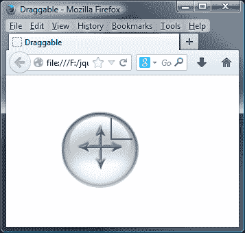

## 添加助手元素

几个配置选项与拖动助手直接相关。助手是一个替代元素，用于在拖动进行中显示对象在屏幕上的位置，而不是移动实际可拖动的元素。

助手可以是实际拖动对象的非常简单的对象。它可以帮助减少拖动操作的强度，减轻访问者处理器的负载。拖动完成后，实际元素可以移动到新位置。

让我们看看助手如何在以下示例中使用。删除我们用于`handle`的`<div>`元素，并恢复到`draggable7.html`中的`draggable.css`样式表，然后将配置对象更改为以下内容：

```js
$("#drag").draggable({
 helper: "clone"
});
```

将此文件保存为`draggable8.html`。我们还需要调整 CSS，以便在适当的时候更改光标以指示我们正在移动图像。如下更改`draggable.css`中的 CSS：

```js
#drag, .ui-draggable { width: 114px; height: 114px; background: url(../img/draggable.png) no-repeat; }
.ui-draggable-dragging { cursor: move; }
```

对于`helper`选项的值`clone`会创建原始拖动对象的精确副本，并将其用作可拖动对象。因此，原始对象始终保持在其起始位置。这也会导致`clone`对象恢复到其起始位置，即使通过提供`false`作为`revert`选项的值也无法更改此效果。以下截图显示了`clone`选项的效果：

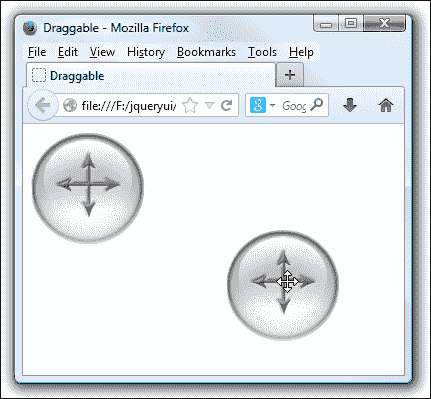

除了字符串`clone`和默认的`original`之外，我们还可以使用函数作为此选项的值。这使我们能够指定我们自己的自定义元素用作助手。

将`draggable8.html`中的最终`<script>`元素更改为以下内容：

```js
<script>
  $(document).ready(function($){
 function helperMaker() {
 return $("<div />", {
 css: {
 border: "4px solid #ccc",
 opacity: 0.5,
 height: 110,
 width: 120
 }
 });
 } 
 $("#drag").draggable({
 helper: helperMaker
 });
  });
</script>
```

将此文件保存为`draggable9.html`。我们的`helperMaker()`函数使用标准的 jQuery 功能创建一个新的`<div>`元素，然后在其上设置一些 CSS 属性以定义其外观。然后，重要的是返回新元素。在将函数作为`helper`选项的值时，该函数必须返回一个元素（可以是 jQuery 对象，如本例中，也可以是实际的 DOMNode）。

现在当拖动开始时，我们的自定义助手成为拖动对象。由于自定义元素比原始拖动对象简单得多，因此可以帮助改善所使用的应用程序的响应性和性能。

### 提示

确保在使用助手（克隆）元素时使用具有类而不是 ID 的元素，因为 ID 在 DOM 中必须是唯一的，并且克隆将其复制。

以下截图显示了我们的自定义助手：

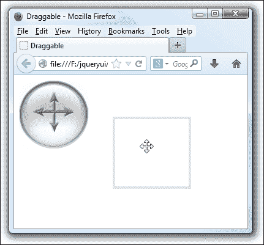

### 提示

**助手不透明度**

我们在创建自定义助手时在本示例中使用了 `css` jQuery 方法。但是，我们还可以使用拖动对象的 `opacity` 选项来设置助手元素的不透明度，作为跨平台解决方案。

## 限制拖动

拖动场景的另一个方面是 containment（包含性）。到目前为止，我们的示例中，页面的`<body>`元素一直是拖动对象的容器。我们还可以配置选项，以指定拖动对象在与另一个容器元素相关时的行为。

我们将在接下来的示例中查看这些内容，从`containment`选项开始，该选项允许我们为拖动对象指定一个容器元素。在`draggable9.html`的`<head>`标签中，添加以下链接到我们在本示例中将使用的样式表：

```js
<link rel="stylesheet" href="css/draggableContainer.css">
```

然后将拖动元素包装在一个容器 `<div>` 中，如下所示：

```js
<div id="container">
  <div id="drag"></div>
</div>
```

然后将配置对象更改为以下内容：

```js
$("#drag").draggable({
 containment: "parent"
});
```

将此变体保存为 `draggable10.html`。在页面上，我们添加了一个新的 `<div>` 元素作为现有拖动元素的父级。在代码中，我们使用了 `containment` 选项的值 `parent`，因此直接父级拖动对象的元素（在本示例中是具有 `id` 为 `container` 的 `<div>` 元素）将被用作容器。

父级 `<div>` 需要一些基本样式以给它尺寸，并且可以在页面上看到。将以下代码添加到 `draggable.css` 中，并将文件另存为 `draggableContainer.css`。记住，这个字符串不是元素的 `id` 或 jQuery 选择器（尽管选择器也受支持）。

```js
#container { height: 250px; width: 250px; border: 2px solid #ff0000; }
```

当你在浏览器中运行页面时，你会发现拖动对象不能超出其容器的边界。

除了我们在本示例中使用的字符串 `parent` 外，我们还可以指定一个选择器，例如：

```js
$("#drag").draggable({
 containment: "#container"
});
```

有三个与容器内拖动对象相关的额外选项，这些选项都与滚动相关。但是，你应该注意，这些选项仅适用于文档是容器时。

`scroll` 选项的默认值是 `true`，但是当我们将 `<div>` 元素拖动到容器的边缘时，它不会滚动。你可能已经注意到在以前的示例中，拖动对象没有在指定的容器内时，视口会自动滚动。如果需要，我们可以通过在样式表中设置 CSS `overflow` 样式为 `auto` 来解决这个问题。

## 吸附

通过配置吸附，可以赋予拖动元素几乎磁性的特性。此功能会导致拖动的元素在拖动过程中与指定的元素对齐。

在下一个示例中，我们将查看吸附对拖动对象行为的影响。删除我们在前一个示例中添加的容器，并直接在拖动元素之后添加一个新的空 `<div>` 元素，如下所示：

```js
<div id="drag"></div>
<div id="snapper"></div>

```

然后，将配置对象更改为以下内容：

```js
$("#drag").draggable({
 snap: "#snapper",
 snapMode: "inner",
 snapTolerance: 50
});
```

把这个保存为`draggable11.html`。我们还需要一些额外的样式；在`draggable.css`底部添加以下代码：

```js
#snapper {
  width: 300px; height: 300px; border: 1px solid #ff0000;
}
```

把这个文件保存为`draggableSnap.css`，放在`css`目录下。别忘了在页面的`<head>`元素中添加一个指向新样式表的链接：

```js
<link rel="stylesheet" href="css/draggableSnap.css">
```

我们在配置对象中将`snap`选项的值设为`#snapper`选择器，同时在页面中添加了一个匹配的`<div>`元素和一个相同的`id`。因此，在拖动对象时，我们的拖动对象将会吸附到页面上的这个元素。

我们还将`snapMode`选项设置为`inner`（其他可能的值为`outer`和`both`），因此吸附将发生在我们的`snapper`元素的内部边缘上。如果我们将元素拖向`snapper`元素的外边缘，并在容差范围内，元素将会吸附到内边缘。

最后，我们将`snapTolerance`设置为`50`，这是拖动对象在吸附到`snapper`元素之前的最大距离（以像素为单位）。一旦拖动对象位于此范围内，它就会吸附到该元素。

当我们将图像拖动到`snapper`元素边缘的`50`像素范围内时，拖动对象会自动对齐到该边缘，如下截图所示：

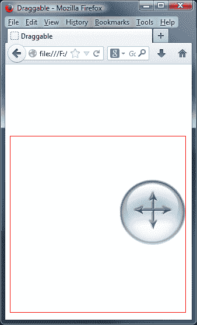

# 可拖动事件回调

除了我们已经看过的选项外，还有三个可以用作回调函数的选项，以在特定的自定义事件发生后执行代码。

这些事件列在下表中：

| 事件 | 当…时触发 |
| --- | --- |
| `drag` | 拖动时鼠标移动 |
| `start` | 拖动开始 |
| `stop` | 拖动停止 |

在定义回调函数以利用这些事件时，函数将始终自动接收两个参数：第一个参数是原始事件对象，第二个对象包含以下属性：

| 属性 | 用途 |
| --- | --- |
| `helper` | 一个代表助手元素的 jQuery 对象。 |
| `position` | 一个包含属性 `top` 和 `left` 的嵌套对象，表示助手元素相对于原始拖动元素的位置。 |
| `offset` | 一个包含属性 `top` 和 `left` 的嵌套对象，表示助手元素相对于页面的位置。 |

使用回调函数和传递的两个对象非常容易。我们可以看一个简单的示例来突出它们的用法。在`draggable11.html`中删除吸附器`<div>`，并将配置对象更改如下：

```js
$("#drag").draggable({
 start: function(e, ui) {
 ui.helper.addClass("up");
 },
 stop: function(e, ui) {
 ui.helper.removeClass("up");
 }
});
```

把这个保存为`draggable12.html`。我们还需要一个新的样式表作为示例；在`draggable.css`中添加以下代码：

```js
#drag.up {
  width: 120px; height: 121px;
  background: url(../img/draggable_on.png) no-repeat;
}
```

把这个版本的样式表保存为`draggableEvents.css`，放在`css`目录下，并且别忘了更新页面`<head>`元素中的链接指向新样式表。

在本示例中，我们的配置对象仅包含两个选项——`start` 和 `stop` 回调函数。我们将文字函数作为这些选项的值。在此示例中，所有函数的功能都是分别添加或删除类名。

类名添加了一个稍微不同的背景图片到可拖动元素，当应用时，效果如下所示的前后截图：

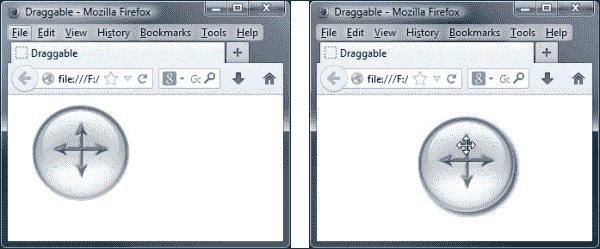

让我们继续进行稍微复杂一点的示例，其中我们可以利用传递给我们回调函数的第二个对象。我们需要页面上的一些新元素；更改页面的 `<body>` 元素，以使其包含以下元素：

```js
<div id="container">
  <div id="drag"></div>
</div>
<div id="results"></div>

```

然后更改最后的 `<script>` 元素，使其如下所示：

```js
<script>
  $(document).ready(function($){
    $("#drag").draggable({
      stop: function(e, ui) {
        var rel = $("<p />", {
          text: "The helper was moved " + ui.position.top +  
          "px down, and " + ui.position.left + "px to the 
          left of its original position."
        }),
        offset = $("<p />", {
          text: "The helper was moved " + ui.offset.top + "px 
          from the top, and " + ui.offset.left + "px to the 
          left relative to the viewport."
        });
        $("#results").empty().append(rel).append(offset);
      }
    });
  });
</script>
```

将此保存为 `draggable13.html`。我们已将回调函数定义为 `stop` 选项的值，因此每次拖动交互停止时都会执行它。我们的回调函数接收事件对象（我们不需要，但必须指定以便访问第二个对象）和包含有关可拖动助手的有用信息的 `ui` 对象。

我们的函数所需做的就是创建两个新的 `<p>` 元素，将 `ui` 对象中找到的值连接起来：`ui.position.top`、`ui.position.left`、`ui.offset.top` 和 `ui.offset.left`。然后，将新元素插入到结果 `<div>` 中。

在可拖动元素被拖动后，页面应该是这样的：

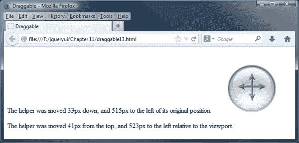

# 可拖动的方法

可拖动交互助手本身不公开任何独特的方法，只公开了常用的 API 方法，这些方法是 `destroy`、`disable`、`enable`、`option` 和 `widget`。

# 开始使用 droppable 小部件

简而言之，jQuery UI 的 droppables 组件给了我们一个放置拖动对象的地方。页面的一个区域被定义为可放置的区域，当一个拖动对象被放置到该区域时，会触发其他事件。您可以通过该组件提供的广泛事件模型非常容易地对有效目标的放置做出反应。

让我们从默认的 droppable 实现开始。在文本编辑器中的新文件中，添加以下页面：

```js
<!DOCTYPE HTML>
<html>
  <head>
    <meta charset="utf-8">
    <title>Droppable</title>
    <link rel="stylesheet" href="development-bundle/themes/redmond/jquery.ui.all.css">
    <link rel="stylesheet" href="css/droppable.css">
    <script src="img/jquery-2.0.3.js"></script>
    <script src="img/jquery.ui.core.js"></script>
    <script src="img/jquery.ui.widget.js"></script>
    <script src="img/jquery.ui.mouse.js"></script>
    <script src="img/jquery.ui.draggable.js"></script>
    <script src="img/jquery.ui.droppable.js"></script>
    <script>
       $(document).ready(function($){
       $("#drag").draggable();
       $("#target").droppable();
      });
    </script>
  </head>
  <body>
    <div id="drag"></div>
    <div id="target"></div>
  </body>
</html>
```

将此保存为 `droppable1.html`。在本示例中链接的极其基本的样式表只是 `draggable.css` 的更新版本，如下所示：

```js
#drag { width:114px; height:114px; margin-bottom:5px; z-index:2; cursor:move; background:url(../img/draggable.png) no-repeat; }
#target { width:200px; height:200px; border:3px solid #000;
position:absolute; right:20px; top:20px; z-index:1; }
```

将其保存为 `droppable.css` 在 `css` 文件夹中。当页面在浏览器中运行时，它应该看起来像以下的截图：

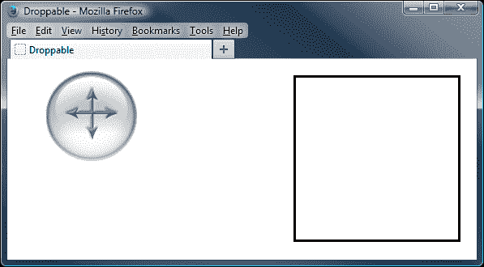

在本示例中，droppable 被创建；我们可以看到这一点，因为在页面加载时将类名 `ui-droppable` 添加到指定的元素中。

虽然我们尚未向脚本添加任何额外的逻辑，但在交互过程中，事件会在拖动对象和放置目标上触发。在本章稍后的部分，我们将更详细地查看这些事件，以了解如何钩入它们，以便对成功的放置做出反应。

我们用于这个基本可放置实现的文件如下：

+   `jquery-2.0.3.js`

+   `jquery.ui.core.js`

+   `jquery.ui.widget.js`

+   `jquery.ui.mouse.js`

+   `jquery.ui.draggable.js`

+   `jquery.ui.droppable.js`

如您所见，可放置组件是拖动组件的扩展，而不是完全独立的组件。因此，除了其自身的源文件外，它还需要`jquery.ui.draggable.js`文件。我们的可放置对象无所作为的原因是因为我们尚未配置它，所以让我们接下来做这件事。

# 配置可放置对象

`droppable`类比`draggable`类要小得多，并且我们可以玩耍的可配置选项较少。以下表格列出了我们可以使用的这些选项：

| 选项 | 默认值 | 用于… |
| --- | --- | --- |
| `accept` | `"*"` | 设置可放置对象将接受的可拖动元素。 |
| `activeClass` | `false` | 设置应用于可放置对象的类，当接受的拖动对象正在被拖动时。 |
| `addClasses` | `true` | 向可放置对象添加`ui-droppable`类。 |
| `disabled` | `false` | 禁用可放置对象。 |
| `greedy` | `false` | 当拖动对象被放置在嵌套的可放置对象上时，停止放置事件冒泡。 |
| `hoverClass` | `false` | 设置应用于可放置对象的类，当接受的拖动对象在可放置对象的边界内时。 |
| `scope` | `"default"` | 定义拖动对象和放置目标的集合。 |
| `tolerance` | `"intersect"` | 设置触发接受拖动对象被认为在可放置对象上的模式。 |

## 配置已接受的可拖动元素

为了从可放置对象中获得可见的结果，我们将在以下示例中一起使用一些可配置选项，当与接受的拖动对象交互时，它们将突出显示放置目标。修改页面中的元素`droppable1.html`，使其如下所示：

```js
<div class="drag" id="drag1"></div>
<div class="drag" id="drag2"></div>
<div id="target"></div>
```

接下来，将最后的`<script>`元素更改为以下内容：

```js
<script>
 $(document).ready(function($){
 $(".drag").draggable();
 $("#target").droppable({
 accept: "#drag1",
 activeClass: "activated"
 });
  });
</script> 
```

将此保存为`droppable2.html`。`accept`选项接受选择器。在本例中，我们指定只有具有`id`为`drag1`的拖动对象应被可放置对象接受。

我们还指定了激活的类名作为`activeClass`选项的值。当接受的拖动对象开始被拖动时，此类名将被应用到可放置对象上。`hoverClass`选项可以以完全相同的方式使用，当接受的拖动对象位于可放置对象上时，添加样式。

对于这个示例，我们需要一个新的样式表；修改`droppable.css`使其如下所示：

```js
.drag { width: 114px; height: 114px; margin-bottom: 5px; z-index:2; 
cursor: move; background: url(../img/draggable.png) no-repeat; }
#target { width: 200px; height: 200px; border: 3px solid #000;
position: absolute; right: 20px; top: 20px; z-index: 1; }
.activated { border: 3px solid #339900; background-color: #fe2e2e;}

```

将此文件保存为`droppableActive.css`在`css`文件夹中，并在页面的`<head>`元素中链接到它：

```js
<link rel="stylesheet" href="css/droppableActive.css">
```

当我们在浏览器中查看此页面时，应该发现当我们移动第一个被定义为接受的拖动对象时，可放置区域会接收到`activated`类并变红。然而，当移动第二个拖动对象时，放置目标不会响应。以下截图显示了页面在第一个拖动对象被拖动到方块上方时的外观：

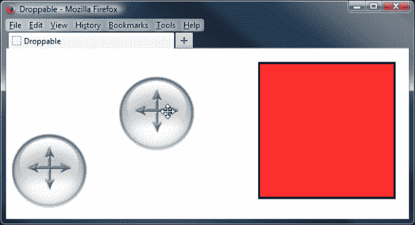

除了字符串值之外，`accept`选项还可以采用函数作为其值。该函数将针对页面上的每个拖动对象执行一次。函数必须返回`true`，表示接受拖动对象，或返回`false`表示不接受。

要查看`accept`选项的功能值，请将`droppable2.html`中的最终`<script>`元素更改为以下内容：

```js
<script>
  $(document).ready(function($){
    $(".drag").draggable();
 function dragEnrol(el) {
 return (el.attr("id") === "drag1") ? true : false;
 }
 $("#target").droppable({
 accept: dragEnrol,
 activeClass: "activated"
      });
    });
  });
</script>
```

将此变体保存为`droppable3.html`。从表面上看，该页面与上一个示例中的工作方式完全相同。但是这次，可接受性是由`dragEnrol`函数中的 JavaScript 三元语句确定的，而不是简单的选择器。

### 注意

请注意，我们与`accept`选项一起使用的函数已自动将表示拖动对象的 jQuery 对象作为参数传递，因此我们可以在此对象上调用 jQuery 方法。这使得很容易获取有关其的信息，例如其`id`，就像这个示例中一样。当需要超出选择器的高级过滤时，此回调非常有用。

# 配置放置容差

放置容差指的是可放置区域检测拖动对象是否位于其上的方式。默认值为`intersect`。以下表格列出了此选项可以配置的模式：

| 模式 | 实现 |
| --- | --- |
| `fit` | 拖动对象必须完全位于可放置区域的边界内才能被视为在其上方。 |
| `intersect` | 在至少有 25%的拖动对象位于可放置区域边界内之前，它被视为在其上方。 |
| `pointer` | 拖动对象被视为位于可放置区域之上之前，鼠标指针必须触及可放置边界。 |
| `touch` | 只要拖动对象的边缘触碰到可放置区域的边缘，拖动对象就位于可放置区域上方。 |

到目前为止，我们所有的可放置示例都使用了 intersect，这是`tolerance`选项的默认值。让我们看看该选项的其他值对组件实现的影响。从`droppable2.html`中的相应元素中恢复到`#drag`和`#target`的 ID，然后使用以下配置对象：

```js
$("#target").droppable({
 hoverClass: "activated",
 tolerance: "pointer"
});
```

将此保存为`droppable4.html`。这次我们使用`hoverClass`选项来指定添加到可放置区域的类名。然后，我们使用`tolerance`选项来指定使用哪种容差模式。

在这个例子中，拖动对象的一部分位于可放置对象上是不相关的；在拖动进行时，必须越过可放置对象的边界，才会触发我们的 `activated` 类：

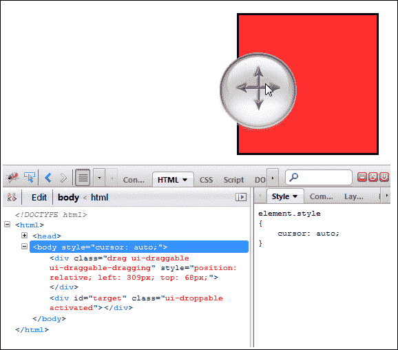

# 理解可放置回调选项

到目前为止，我们已经查看了配置可放置对象的各种操作特性的选项。除了这些选项之外，还有几乎同样多的回调选项，这样我们就可以定义对可放置对象及其被接受的拖动对象发生不同事情的反应的函数。这些选项列在以下表中：

| 回调选项 | 被调用时… |
| --- | --- |
| `activate` | 一个被接受的拖动对象开始拖动。 |
| `deactivate` | 一个被接受的拖动对象停止被拖动。 |
| `drop` | 一个被接受的拖动对象被放置到可放置对象上。 |
| `out` | 一个被接受的拖动对象移出可放置对象的边界（包括容忍度）。 |
| `over` | 一个被接受的拖动对象在可放置对象的边界内（包括容忍度）移动。 |

让我们组合一个基本的示例，利用这些回调选项。我们将在我们的可放置对象上添加一个状态栏，报告拖动对象和可放置对象之间不同交互的状态。在 `droppable4.html` 中，在 `target` 元素之后直接添加以下新元素：

```js
<div id="status"></div>
```

然后，将最终的 `<script>` 元素更改为以下内容：

```js
<script>
  $(document).ready(function($){
    $("#drag").draggable();
 $("#target").droppable({
 accept: "#drag",
 activate: eventCallback,
 deactivate: eventCallback,
 drop: eventCallback,
 out: eventCallback,
 over: eventCallback
 },
 eventMessages = {
 dropactivate: "A draggable is active",
 dropdeactivate: "A draggable is no longer active",
 drop: "An accepted draggable was dropped on the droppable",
 dropout: "An accepted draggable was moved off the droppable",
 dropover: "An accepted draggable is over the droppable"
 });
 function eventCallback(e) {
 var message = $("<p />", {
 id: "message",
 text: eventMessages[e.type]
 });
 $("#status").empty().append(message);
    }
  });
</script>
```

将此文件保存为 `droppable5.html`。我们还需要一些新的样式来进行这个示例。在文本编辑器中创建一个新的样式表，并添加以下选择器和规则：

```js
#drag { width: 114px; height: 114px; margin-bottom: 5px; z-index: 2; cursor: move; background: url(../img/draggable.png) no-repeat; }
#target { width: 250px; height: 200px; border: 3px solid #000; position: absolute; right: 20px; top: 20px; z-index: 1; }
#status { width: 230px; padding: 10px; border: 3px solid #000; position: absolute; top: 223px; right: 20px; color: #000; }
#message { margin: 0px; font-size: 80%; }
```

将此文件保存为 `droppableEvents.css`，放在 `css` 目录中。不要忘记更新页面 `<head>` 元素中的 `<link>`，指向新的样式表：

```js
<link rel="stylesheet" href="css/droppableEvents.css">
```

页面的 `<body>` 元素包含一个新的状态栏，以及可放置对象，在这种情况下是一个简单的 `<div>` 元素。在脚本中，我们定义了可配置的选项，指定了当检测到每个事件时应执行 `eventCallback` 函数。

接下来，我们定义一个对象字面量，在其中，每个属性的键设置为可能触发的事件类型之一。每个属性的值是我们希望为任何给定事件显示的消息。

然后，我们定义我们的回调函数。与其他组件一样，用于 droppables 组件的回调函数自动传递两个对象：`event` 对象和表示拖动元素的对象。

我们使用 `event` 对象的 `type` 属性从 `eventMessages` 对象中检索适当的消息。然后，我们使用标准的 jQuery 元素创建和操作方法将消息添加到状态栏中。

以下是交互后状态栏的外观：

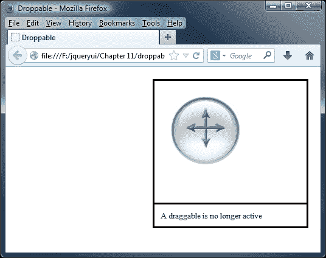

玩了一会儿页面后，可能会出现我们的一个消息没有显示的情况。当拖动对象放置在 droppable 上时，我们的 drop 消息不显示。

实际上，消息是显示出来的，但因为`drop`事件之后立即触发`deactivate`事件；`drop`消息立即被覆盖。我们可以想到许多解决方法；当然，最简单的方法就是不同时使用`drop`和`deactivate`选项。

尽管在此示例中我们仅使用事件对象（`e`），但第二个对象也会自动传递给我们在事件选项中使用的任何回调函数。

该对象包含与 droppable 相关的信息，例如以下内容：

| 属性 | 值 |
| --- | --- |
| `ui.draggable` | 当前拖动对象。 |
| `ui.helper` | 当前拖动助手。 |
| `ui.position` | 辅助程序的当前相对位置。 |
| `ui.offset` | 辅助程序的当前绝对位置。 |

## 设置 droppable 的范围选项

拖动对象和 droppables 都具有`scope`配置选项，允许我们轻松定义拖动对象和放置目标的组。在下一个示例中，我们可以看看如何配置这些选项以及配置它们的影响。在这个示例中，我们将链接到另一个新的样式表，所以在`droppable5.html`的`<head>`元素中，将`<link>`元素更改为以下方式：

```js
<link rel="stylesheet" href="css/droppableScope.css">
```

对于这个示例，我们需要一些新元素。将`droppable5.html`页面中的`<body>`元素更改为包含以下元素：

```js
<div id="target_a">A</div>
<div id="target_b">B</div>
<div id="group_a">
  <p>A</p>
  <div id="a1" class="group_a">a1</div>
  <div id="a2" class="group_a">a2</div>
  <div id="a3" class="group_a">a3</div>
</div>
<div id="group_b">
  <p>B</p>
  <div id="b1" class="group_b">b1</div>
  <div id="b2" class="group_b">b2</div>
  <div id="b3" class="group_b">b3</div>
</div>
```

要使这些元素正确工作，请将最后一个`<script>`元素更改为如下所示：

```js
<script>
  $(document).ready(function($){
 var dragOpts_a = { scope: "a" },
 dragOpts_b = { scope: "b" },
 dropOpts_a = { hoverClass: "over", scope: "a" },
 dropOpts_b = { hoverClass: "over", scope: "b" };
 $(".group_a").draggable(dragOpts_a);
 $(".group_b").draggable(dragOpts_b);
 $("#target_a").droppable(dropOpts_a);
 $("#target_b").droppable(dropOpts_b);
  });
</script> 
```

将此文件保存为`droppable6.html`。接下来，我们需要创建一个新的 CSS 文件；在文本编辑器中的新页面中添加以下代码：

```js
#target_a, #target_b, #group_a, #group_b { width: 150px; height: 
150px; padding: 50px; margin: 0 20px 20px 0; border: 2px solid black; 
float: left;
font-family: Georgia; font-size: 100px; color: red; text-align: 
center; }
#group_a, #group_b { width: 518px; height: 115px; padding: 5px 0 5px 5px; margin-bottom: 20px; clear: both; }
p { float: left; margin: 0 20px 0; }
.group_a, .group_b { width: 94px; height: 94px; padding: 20px 0 0 20px;
.group_a, .group_b { width: 94px; height: 94px; padding: 20px 0 0 
20px; margin-right: 20px; float: left; font-family: arial; font-size: 14px; color: red; text-align: left;
background: url(../img/draggable.png) no-repeat; }
.over { background-color: #fe2e2e; }
```

将此保存为`droppableScope.css`在`css`文件夹中。

页面有两个放置目标和两组三个拖动对象，它们都带有标签以显示它们所属的组。在脚本中，我们为两组 dragable 定义了两个配置对象，并为 drop 目标定义了两个配置对象。在每个配置对象中，我们设置了`scope`选项。

我们为每个放置目标的`scope`选项设置的值与每个拖动对象的`scope`匹配。因此，如果我们想使用`scope`选项，必须为拖动对象和放置目标都定义它。如果我们尝试设置 droppable 的`scope`，但没有至少为同一`scope`提供一个拖动对象，就会引发错误。

设置`scope`选项给了我们另一种定义哪些拖动对象被哪些放置目标接受的技术，但它是作为`accept`选项的一个替代提供的；这两个选项不应该一起使用。

以下屏幕截图显示了页面的外观：

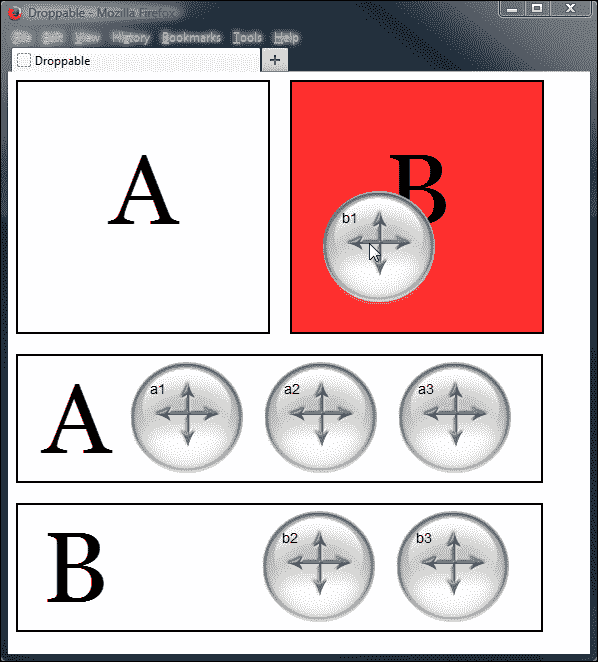

## 配置贪婪选项

我们将要与可拖放组件一起查看的最后一个选项是`greedy`选项。此选项在有一个可拖放区域嵌套在另一个可拖放区域中的情况下非常有用。如果我们不使用此选项，某些交互期间两个可拖放区域都会触发事件。

`greedy`选项是避免事件冒泡问题的一种简单方法，而且在效率和跨浏览器方面都很有效。让我们通过一个例子来更仔细地研究这个选项。

修改`droppable6.html`中的`<link>`元素，使其链接到一个新的样式表：

```js
<link rel="stylesheet" href="css/droppableNesting.css">
```

然后将`<body>`修改为包含以下元素：

```js
<div id="drag"></div>
  <div class="target" id="outer">
  <div class="target" id="inner"></div>
</div>
<div id="status"></div>
```

最后，修改最后一个`<script>`元素，使其如下所示：

```js
<script>
  $(document).ready(function($){
    $(".target").css({ opacity:"0.5" });
    $("#drag").draggable({ zIndex: 3 });
    $(".target").droppable({
      drop: dropCallback,
      greedy: true
    });
    function dropCallback(e) {
      var message = $("<p></p>", {
        id: "message",
        text: "The firing droppable was " + e.target.id
      });
      $("#status").append(message);
    }
  });
</script>
```

将此示例保存为`droppable7.html`。此示例的 CSS 简单，基于之前示例的 CSS 构建。

```js
#drag { width: 114px; height: 114px; margin-bottom: 5px; cursor: move; background: url(../img/draggable.png) no-repeat; float: left; }
#outer { width: 300px; height: 300px; border: 3px solid #000; float: right; background-color: #fe2e2e; }
#inner { width: 100px; height: 100px; border: 3px solid #000; position: relative; top: 100px; left: 100px; background-color: #FFFF99; }
#status {width: 280px; padding: 10px; border: 3px solid #000; float: right; clear: right; color: #000; } 
#message { margin: 0px; font-size: 80%; }
```

将此示例保存为`droppableNesting.css`在`css`文件夹中。

在这个例子中，我们有一个较小的可拖放区域嵌套在一个较大的可拖放区域中。它们的不透明度是使用标准的 jQuery 库的`css()`方法设置的。

在这个例子中，这是必要的，因为如果我们修改元素的`zIndex`选项，使得拖动对象出现在嵌套的可拖放区域上方，目标元素不会被正确报告。

在这个例子中，我们使用了拖动组件的`zIndex`选项来在拖动进行时将拖动对象显示在可拖放区域的上方。`dropCallback`函数用于向状态栏添加一个简单的消息，通知我们拖动对象被放置在哪个可拖放区域上。

我们的可拖放配置对象使用`drop`选项来连接我们的回调函数。然而，关键选项是`greedy`选项，它使得可拖动对象放置在其上时阻止事件逃逸到其他目标。

如果你运行页面并将拖动对象放置到可拖放区域之一，你应该会看到类似以下截图所示的情况：


将`greedy`选项设置为`true`的净效果是，内部可拖放区域阻止事件传播到外部可拖放区域并再次触发。

如果你注释掉`greedy`选项并将可拖动对象放置在内部可拖放区域上，状态消息将会被插入两次，一次是由内部可拖放区域，另一次是由外部可拖放区域。

# 可拖放方法

像可拖动组件一样，可拖放组件只有所有库组件共享的通用 API 方法。这是另一个主要由选项驱动的组件。可用于我们的方法与可拖动对象公开的方法相同，即所有库组件共享的标准方法，这些方法是`destroy`、`disable`、`enable`、`option`和`widget`。

# 使用小部件创建迷宫游戏

现在我们已经达到了可以通过将我们学到的关于这两个组件的知识放入一个完全工作的示例中来玩耍的地步。在我们最终的拖放示例中，我们将结合这两个组件来创建一个简单的迷宫游戏。

游戏将由一个可拖动的标记组成，需要通过一个简单的迷宫导航到迷宫的另一端指定的可拖放位置。我们可以使事情变得更具挑战性，以便如果标记触碰到任何迷宫墙壁，它将返回到起始位置。

以下屏幕截图显示我们将要构建的内容：

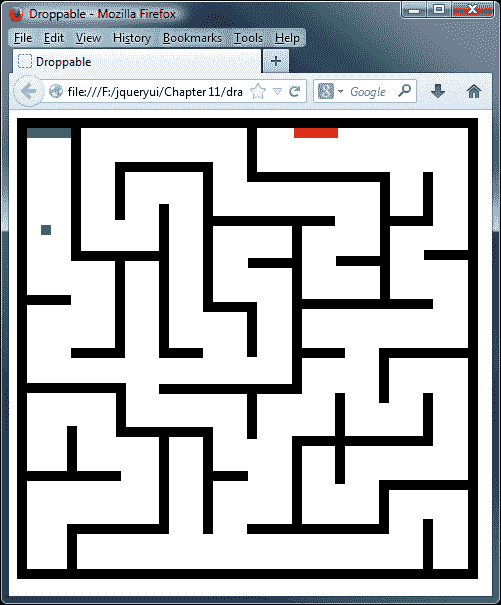

让我们从标记开始。在文本编辑器中的新页面中添加以下代码：

```js
<!DOCTYPE HTML>
<html>
  <head>
    <meta charset="utf-8">
    <title>Droppable</title>
    <link rel="stylesheet" href="development-bundle/themes/redmond/jquery.ui.all.css">
    <script src="img/jquery-2.0.3.js"></script>
    <script src="img/jquery.ui.core.js"></script>
    <script src="img/jquery.ui.widget.js"></script>
    <script src="img/jquery.ui.mouse.js"></script>
    <script src="img/jquery.ui.draggable.js" ></script>
    <script src="img/jquery.ui.droppable.js" ></script>
    <script>
    </script>
  </head>
  <body>
    <div id="maze">
      <div id="drag"></div>
      <div id="start"></div>
      <div id="end"></div>
    </div>
  </body>
</html>
```

将此文件保存为`dragMaze.html`。在页面上，我们有一个外部容器，我们给了一个名为迷宫的`id`。我们有用于起始和结束位置以及用于拖动标记的`<div>`元素。我们的地图将需要墙壁。与手工编写我们将使用的地图模式所需的 46 个墙壁不同，我想我们可以使用 jQuery 来为我们完成这项工作。

我们在页面底部留下了一个空的`<script>`元素。让我们用以下代码填充它：

```js
$(document).ready(function($){
  var dragOpts = {
    containment: "#maze"
  },
  dropOpts = {
    tolerance: "touch",
    over: function(e, ui) {
      $("#drag").draggable("destroy").remove();
      $("<div />", {
        id: "drag",
        css: {
          left: 0,
          top: 0
        }
      }).appendTo("#maze");
      $("#drag").draggable(dragOpts);
    }   
  },
  endOpts = {
    over: function(e, ui) {
      $("#drag").draggable("destroy").remove();
      alert("Woo! You did it!");
    }
  };
  for (var x = 1; x < 47; x++) {
    $("<div />", {
      id: "a" + x,
      class: "wall"
    }).appendTo("#maze");
  }
  $("#drag").draggable(dragOpts);
  $(".wall").droppable(dropOpts);
  $("#end").droppable(endOpts);
});
```

我们还需要为迷宫的墙壁进行样式处理，但我们不能使用任何简单的 JavaScript 模式。不幸的是，我们必须将它们硬编码。在文本编辑器中的另一个新文件中，添加以下选择器和规则：

```js
#maze { width: 441px; height: 441px; border: 10px solid #000000; position: relative; background-color: #ffffff; }
#drag { width: 10px; height: 10px; z-index: 1; background-color: #0000FF; } 
#start { width: 44px; height: 10px; background-color: #00CC00; position: absolute; top: 0; left: 0; z-index: 0; }
#end { width: 44px; height: 10px; background-color: #FF0000; position: absolute; top: 0; right: 130px; }
.wall { background-color: #000000; position: absolute; }
#a1 { width: 10px; height: 133px; left: 44px; top: 0; }
#a2 { width: 44px; height: 10px; left: 0; top: 167px; }
#a3 { width: 44px; height: 10px; left: 44px; top: 220px; }
#a4 { width: 89px; height: 10px; left: 0; bottom: 176px; }
#a5 { width: 94px; height: 10px; left: 0; bottom: 88px; }
#a6 { width: 10px; height: 41px; left: 40px; bottom: 0; }
#a7 { width: 10px; height: 48px; left: 88px; top: 44px; }
#a8 { width: 78px; height: 10px; left: 54px; top: 123px; }
#a9 { width: 10px; height: 97px; left: 88px; top: 133px }
#a10 { width: 10px; height: 45px; left: 40px; bottom: 98px; }
#a11 { width: 88px; height: 10px; left: 89px; bottom: 132px; }
#a12 { width: 10px; height: 97px; left: 132px; bottom: 35px; }
#a13 { width: 10px; height: 44px; left: 89px; bottom: 142px; }
#a14 { width: 92px; height: 10px; left: 40px; bottom: 35px; }
#a15 { width: 89px; height: 10px; left: 88px; top: 34px; }
#a16 { width: 10px; height: 145px; left: 132px; top: 76px; }
#a17 { width: 44px; height: 10px; left: 132px; top: 220px; }
#a18 { width: 133px; height: 10px; left: 132px; bottom: 175px; }
#a19 { width: 10px; height: 107px; left: 176px; bottom: 35px; }
#a20 { width: 10px; height: 150px; left: 176px; top: 34px; }
#a21 { width: 35px; height: 10px; left: 186px; top: 174px }
#a22 { width: 35px; height: 10px; left: 186px; bottom: 88px; }
#a23 { width: 122px; height: 10px; left: 186px; top: 88px; }
#a24 { width: 10px; height: 44px; left: 220px; top: 0px; }
#a25 { width: 10px; height: 55px; left: 220px; top: 174px; }
#a26 { width: 10px; height: 45px; left: 220px; bottom: 130px; }
#a27 { width: 133px; height: 10px; right: 88px; top: 44px; }
#a28 { width: 10px; height: 168px; right: 166px; top: 98px; }
#a29 { width: 44px; height: 10px; right: 176px; top: 130px; }
#a30 { width: 10px; height: 98px; right: 166px; bottom: 35px; }
#a31 { width: 133px; height: 10px; right: 88px; bottom: 35px; }
#a32 { width: 10px; height: 133px; right: 78px; top: 44px; }
#a33 { width: 44px; height: 10px; right: 88px; top: 128px; }
#a34 { width: 131px; height: 10px; right: 35px; top: 171px; }
#a35 { width: 43px; height: 10px; right: 123px; top: 220px; }
#a36 { width: 10px; height: 91px; right: 123px; bottom: 85px; }
#a37 { width: 131px; height: 10px; right: 35px; bottom: 123px; }
#a38 { width: 10px; height: 55px; right: 79px; top: 220px; }
#a39 { width: 44px; height: 10px; right: 0; top: 122px; }
#a40 { width: 10px; height: 54px; right: 79px; bottom: 35px; }
#a41 { width: 79px; height: 10px; right: 0; bottom: 79px; }
#a42 { width: 10px; height: 45px; right: 35px; top: 44px; }
#a43 { width: 43px; height: 10px; right: 35px; top: 88px; }
#a44 { width: 79px; height: 10px; right: 0; top: 220px; }
#a45 { width: 10px; height: 44px; right: 35px; bottom: 132px; }
#a46 { width: 10px; height: 50px; right: 35px; bottom: 0; }
```

将此文件保存为`dragMaze.css`，放在`css`文件夹中。

让我们回顾一下新代码的作用。首先，我们为拖动对象定义了一个简单的配置对象。我们唯一需要配置的选项是`containment`选项，它将可拖动的标记元素限制在迷宫内。

接下来，我们为墙壁定义配置对象。每堵墙都被视为一个可放置的物品。我们将`tolerance`选项的值指定为`touch`，并将回调函数添加到`over`选项中。因此，每当拖动对象触碰到墙壁时，函数将被执行。

在此函数中，我们所做的一切就是销毁当前拖动对象并将其从页面中移除。

然后，我们在起始位置创建一个新的拖动对象，并再次使其可拖动。没有`cancelDrag`方法会使拖动对象像已被放置并返回到起始位置一样操作，但我们可以很容易地自己复制这种行为。

现在，我们添加另一个可拖放配置对象，用于配置迷宫的结束点。我们为此可拖放配置的唯一配置是一个函数，当可拖放物品位于此可拖放位置时执行。在这个函数中，我们再次移除拖动对象，并向用户显示一个祝贺的警报。

然后，我们使用简单的`for`循环来将墙壁添加到我们的迷宫中。我们结合 jQuery 使用普通的`for`循环创建 46 个`<div>`元素，并在将它们附加到`maze`容器之前为每个元素添加`id`和`class`属性。最后，我们使拖动对象可拖动，而墙壁和结束目标可放置。

现在我们可以尝试通过将标记拖动穿过迷宫来从起点到终点进行导航。如果触碰到任何墙壁，标记将返回到起点。我们可以增加难度（增加额外障碍物来导航），但为了与 jQuery UI 的可拖动和可放置功能一起玩耍，我们在这里的工作已经完成。

# 总结

在本章中，我们看到了两个非常有用的库组件——可拖动组件和可放置组件。正如我们所见，可拖动和可放置是非常密切相关的，并且它们被设计为相互配合使用，让我们能够创建高级且高度交互的界面。

在本章中，我们涵盖了大量材料，让我们回顾一下我们所学到的内容。我们看到可拖动行为可以被添加到页面上的任何元素而不需要任何配置。也许有些实现情况下这是可以接受的，但通常我们会想使用该组件广泛的可配置选项中的一个或多个。

在本章的第二部分中，我们看到`droppables`类使我们能够轻松地在页面上定义可放置可拖动物品的区域，并且可以响应有物品放置在上面的情况。我们还可以利用一系列可配置的`droppable`选项来实现更高级的可放置行为。

这两个组件都具有一个有效的事件模型，用于钩取任何拖放交互的有趣时刻。我们的最终示例展示了如何将可拖动和可放置组件一起使用以创建一个有趣和交互的游戏。尽管这个游戏在现代游戏标准下非常基本，但它仍然提供了一个坚实的基础，我们可以轻易地构建以添加功能。

在下一章中，我们将看看可调整大小的组件，该组件允许用户使用熟悉的基于拖动的界面来调整所选元素的大小。
