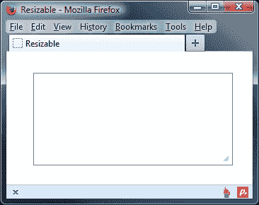
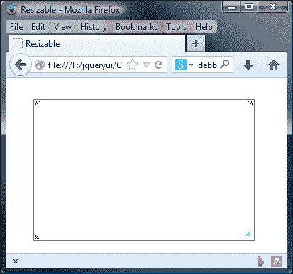
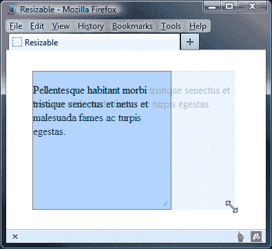
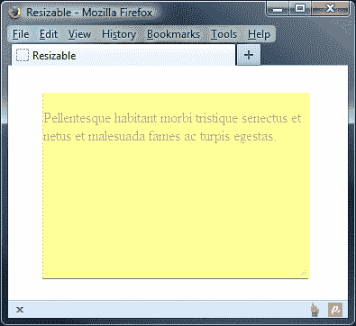
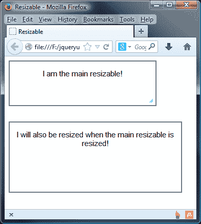
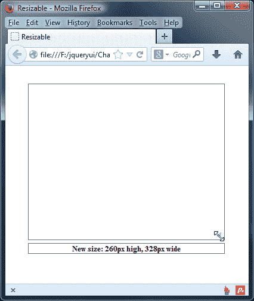
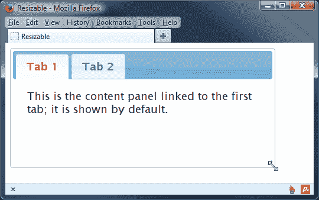

# 第十二章：可调整大小组件

当我们在本书前面查看对话框小部件时，我们已经简要地看到了可调整大小的效果。在本章中，我们将直接关注它。然而，对话框是一个很好的例子，说明了在实际应用中可调整大小的组件可以有多么有用。

可调整大小小部件添加了与在 WebKit 浏览器（如 Safari 或 Chrome）或较新版本的 Firefox 中自动添加到 `<textarea>` 元素中的相同功能。在这些浏览器中，会添加一个调整大小的手柄到右下角，允许调整元素的大小。使用 jQuery UI 可调整大小组件，我们可以将此行为添加到页面上几乎任何元素中。

在本章中，我们将关注该组件的以下方面：

+   实现基本的可调整大小

+   可用于使用的可配置选项

+   指定要添加的调整大小手柄

+   管理可调整大小的最小和最大尺寸

+   调整大小帮助器和幽灵的角色

+   查看内置的调整大小动画

+   如何响应调整大小事件

+   确定可调整大小的新尺寸

+   与其他库小部件一起使用可调整大小

可调整大小小部件是一个灵活的组件，可以与各种不同的元素一起使用。在本章的示例中，我们将主要使用简单的 `<div>` 元素，以便将重点放在组件上，而不是底层的 HTML 上。我们还将在本章末尾看一些简短的示例，使用 `` 和 `<textarea>` 元素。

可调整大小的组件与其他组件配合得很好，并且经常与可拖动的组件一起使用。然而，虽然你可以轻松地使可拖动的组件可调整大小（比如对话框），但是这两个类别并没有任何关联。

# 实现基本的可调整大小小部件

让我们实现基本的可调整大小，这样我们就可以看到当你使用 jQuery UI 作为页面的驱动力时，使元素可调整大小是多么容易的事情。在文本编辑器中的一个新文件中添加以下代码：

```js
<!DOCTYPE HTML>
<html>
  <head>
    <meta charset="utf-8">
    <title>Resizable</title>
    <link rel="stylesheet" href="development-bundle/themes/redmond/jquery.ui.all.css">
    <link rel="stylesheet" href="css/resize.css">
    <script src="img/jquery-2.0.3.js"></script>
    <script src="img/jquery.ui.core.js"></script>
    <script src="img/jquery.ui.widget.js"></script>
    <script src="img/jquery.ui.mouse.js"></script>
  <script src="img/jquery.ui.resizable.js"></script>
  </head>
  <script>
    $(document).ready(function($){
      $("#resize").resizable();
    });
  </script>
  <body>
    <div id="resize"></div>
  </body>
</html>
```

将此文件保存为`resizable1.html`。默认实现中使用的基本小部件方法没有参数，其使用与库的其余部分相同的简化语法。这只需要一行代码即可使示例工作。

除了我们需要用于任何可调整大小实现的 CSS 框架文件外，我们还使用自定义样式表为我们的可调整大小的 `<div>` 添加了基本的尺寸和边框。在文本编辑器中的一个新文件中使用以下 CSS：

```js
#resize { width: 200px; height: 200px; margin: 30px 0 0 30px;
border: 1px solid #7a7a7a; }
```

将此文件保存为`resize.css`，放在`css`文件夹中。我们在 CSS 中指定了调整大小的 `<div>` 的尺寸，因为如果没有这些尺寸，`<div>` 元素将拉伸到屏幕的宽度。我们还指定了一个边框来清晰地定义它，因为默认实现只会在目标元素的右下角添加一个调整大小的手柄。下面的截图显示了在 `<div>` 元素调整大小后我们的基本页面应该是什么样子的：



可调整大小组件所需的文件如下：

+   `jquery-2.0.3.js`

+   `jquery.ui.core.js`

+   `jquery.ui.widget.js`

+   `jquery.ui.mouse.js`

+   `jquery.ui.resizable.js`

该组件自动添加了三个必需的拖动手柄元素。尽管唯一可见的调整大小手柄是右下角的手柄，但底部和右侧边缘都可以用于调整大小小部件。

# 列出可调整大小选项

下表列出了我们在使用可调整大小组件时可以使用的可配置选项：

| 选项 | 默认值 | 用于… |
| --- | --- | --- |
| `alsoResize` | `false` | 自动调整指定的元素以与可调整大小元素同步。 |
| `animate` | `false` | 将可调整大小元素动画到其新大小。 |
| `animateDuration` | `slow` | 设置动画的速度。值可以是整数，指定毫秒数，或者是字符串值 `slow`，`normal` 或 `fast`。 |
| `animateEasing` | `swing` | 为调整大小动画添加缓动效果。 |
| `aspectRatio` | `false` | 保持调整大小元素的纵横比。除了布尔值之外，还接受数字自定义纵横比。 |
| `autoHide` | `false` | 隐藏调整大小手柄，直到鼠标指针悬停在可调整大小元素上。 |
| `cancel` | `':input, option'` | 阻止指定元素可调整大小。 |
| `containment` | `false` | 将可调整大小限制在指定容器元素的边界内。 |
| `delay` | `0` | 设置从单击可调整大小手柄到开始调整大小之间的延迟时间（以毫秒为单位）。 |
| `disabled` | `false` | 在页面加载时禁用组件。 |
| `distance` | `1` | 设置鼠标指针在按住鼠标按钮的情况下必须移动的像素数，然后调整大小开始。 |
| `ghost` | `false` | 在调整大小时显示半透明的辅助元素。 |
| `grid` | `false` | 在调整大小时将调整大小捕捉到虚拟网格线。 |
| `handles` | `'e, se, s'` | 定义用于调整大小的手柄。接受包含以下任意值的字符串：`n`，`ne`，`e`，`se`，`s`，`sw`，`w`，`nw`，或所有。该字符串也可以是一个对象，其属性是前述任何值，值是与用作手柄的元素匹配的 jQuery 选择器。 |
| `helper` | `false` | 在调整大小期间应用于辅助元素的类名。 |
| `maxHeight` | `null` | 设置可调整大小的最大高度。 |
| `maxWidth` | `null` | 设置可调整大小的最大宽度。 |
| `minHeight` | `null` | 设置可调整大小的最小高度。 |
| `minWidth` | `null` | 设置可调整大小的最小宽度。 |

## 配置调整大小手柄

感谢`handles`配置选项，指定我们希望添加到目标元素的 handles 非常容易。在`resizable1.html`中，将最后的`<script>`元素更改为以下内容：

```js
  <script>
    $(document).ready(function($){
      $("#resize").resizable({ handles: "all" });
    });
  </script>
```

将此文件保存为`resizable2.html`。当你在浏览器中运行示例时，你会发现尽管组件看起来和以前一样，但现在我们可以使用任何边缘或角来调整`<div>`元素的大小。

## 添加额外的 handle 图片

你会立即注意到的一件事是，尽管元素沿任何轴都是可调整大小的，但没有视觉提示来使这一点明显；该组件会自动将调整大小条添加到右下角，但我们需要自己添加其他三个角。

有几种不同的方法可以做到这一点。虽然这种方法不会在其他三个角添加图片，但它会插入具有 class 名称的 DOM 元素，因此我们可以轻松地用 CSS 来定位它们并提供我们自己的图片。这就是我们接下来要做的。

在文本编辑器中新建一个页面，并添加以下样式规则：

```js
#resize {width: 200px; height: 200px; margin: 30px 0 0 30px; border: 1px solid #7a7a7a;}
.ui-resizable-sw, .ui-resizable-nw, .ui-resizable-ne {width: 12px; height: 12px; background: url(../img/handles.png) no-repeat 0 0;}
.ui-resizable-sw {left: 0; bottom: 0;} 
.ui-resizable-nw {left: 0; top: 0; background-position: 0 -12px;}
.ui-resizable-ne {right: 0; top: 0; background-position: 0 -24px;}
```

将此文件保存在`css`文件夹中，文件名为`resizeHandles.css`。我们提供了一个示例图片，其中包含了标准右下角图片的翻转和镜像拷贝（可在代码下载中找到）。然后，我们可以通过在 CSS 样式规则中设置 background-position 属性来引用它们。使用单个图片或精灵图可以减少缓存多个图片的需求；我们所使用的所有单独图片实际上都是来自一个更大的文件的片段。

### 提示

Chris Coyier 撰写了一篇有用的文章，解释了如何实现精灵图，可以在[`css-tricks.com/css-sprites/`](http://css-tricks.com/css-sprites/)找到。

我们的选择器会目标自动添加到 handle 元素的 class 名称。在`resizable2.html`的`<head>`元素中链接到新样式表，并将其另存为`resizable3.html`：

```js
<link rel="stylesheet" href="css/resizeHandles.css">
```

新样式表应使我们的元素呈现如下外观：



与调整大小 handles 和它们的显示方式相关的另一个配置选项是`autoHide`。让我们下面快速看一下这个选项。将`resizable3.html`中的配置对象更改为以下内容：

```js
$("#resize").resizable({
  handles: "all",
 autoHide: true
});
```

将此版本保存为`resizable4.html`。在这个示例中，我们已添加了`autoHide`选项并将其值设置为`true`。配置此选项会隐藏所有的调整大小 handles，直到鼠标指针移动到可调整大小的元素上。当可调整大小的元素中有图片内容时，这对于最小干扰额外的 DOM 元素是非常有益的。

## 定义尺寸限制

通过四个可配置选项，限制目标元素可以调整的最小或最大尺寸变得非常容易。它们分别是`maxWidth`、`maxHeight`、`minWidth`和`minHeight`。我们将在下一个示例中看到它们的作用。为了这个示例最好在容器中添加一些内容，所以在我们的可调整大小的`<div>`中的`<p>`元素中添加一些布局文本在`resizable4.html`中：

```js
<p>Lorem ipsum etc, etc…</p>
```

将我们在`resizable4.html`中使用的配置对象更改为如下所示：

```js
$("#resize").resizable({
 maxWidth: 500,
 maxHeight: 500,
 minWidth: 100,
 minHeight: 100
});
```

将其保存为`resizable5.html`。这次，配置对象使用了与尺寸边界有关的选项，以指定可调整大小元素的最小和最大高度和宽度。这些选项的值是简单的整数。

当我们运行这个示例时，我们可以看到可调整大小的元素现在遵循我们指定的尺寸，而在以前的示例中，可调整大小元素的最小尺寸是其调整大小手柄的组合尺寸，而最大尺寸是没有限制的。

到目前为止，我们的可调整大小元素一直是一个空的`<div>`元素，你可能会想知道，当目标元素内有内容时，可调整大小如何处理最小和最大尺寸。约束条件是保持的，但我们需要在 CSS 中添加`overflow: hidden`。否则，如果内容太多，最小尺寸无法处理，内容可能会溢出可调整大小的区域。

当然，当内容太多时，我们还可以使用`overflow: auto`来添加滚动条，有时这可能是期望的行为。

## 调整大小的幽灵元素

幽灵元素是半透明的辅助元素，非常类似于我们在上一章中看到的拖动组件时使用的代理元素。通过配置一个选项就可以启用幽灵元素。让我们看看如何实现这一点。

将我们在`resizable5.html`中使用的配置对象更改为以下内容：

```js
$("#resize").resizable({ ghost: true });
```

将其保存为`resizable6.html`。启用调整大小幽灵元素所需的全部内容就是将`ghost`选项设置为`true`。可调整大小的幽灵元素的效果非常微妙。它基本上是现有可调整大小元素的克隆，但是只有四分之一的不透明度。这就是为什么在可调整大小元素中留下了上一个示例中的布局文本的原因。

在这个示例中，我们还链接到一个新的样式表，其与`resize.css`完全相同，只是指定了背景色：

```js
#resize { width: 200px; height: 200px; margin: 30px 0 0 30px;
border: 1px solid #7a7a7a; overflow: hidden; background-color: #999; }
```

将其保存为`resizeGhosts.css`在`css`文件夹中。下一张截图显示了可调整大小的幽灵元素在被拖动时的可见外观：



### 注意

在某些版本的 Internet Explorer 中，当透明 PNG 图像位于可调整大小元素中时，幽灵元素可能会导致问题。如果您发现情况是如此，那么可以在[`www.pixelthemestudio.ca/news-and-updates/156-fixing-that-png-image-optimization-for-ie`](http://www.pixelthemestudio.ca/news-and-updates/156-fixing-that-png-image-optimization-for-ie)上找到一篇有用的文章，详细介绍了如何使用 TweakPNG 解决这些问题。

ghost 元素只是一个已被制成半透明的辅助元素。如果这不合适，并且需要进一步控制助手元素的外观，则可以使用 `helper` 选项来指定要添加到助手元素的类名，然后我们可以使用该类名来为其设置样式。更改 `resizable6.html` 中的配置对象，使其如下所示：

```js
$("#resize").resizable({
  ghost: true,
 helper: "my-ui-helper"
});
```

将此修订保存为 `resizable7.html`。我们只是指定了我们希望添加为 `helper` 选项值的类名。我们可以从 CSS 文件中定位新的类名。打开 `resize.css` 并将以下代码添加到其中：

```js
.my-ui-helper { background-color:#FFFF99; }
```

将新样式表保存为 `resizeHelper.css`，并不要忘记在 `resizable7.html` 的顶部链接它：

```js
<link rel="stylesheet" href="css/resizeHelper.css">
```

在此示例中，我们唯一做的就是给助手添加了一个简单的背景颜色，这种情况下是黄色。当新页面运行并且调整大小动作正在进行时，它的外观如下所示：



`ghost` 和 `helper` 选项不必一起使用；我们可以分别使用其中一个，但如果我们使用 `helper` 选项而不使用 `ghost` 选项，则无法获得调整大小助手内的半透明内容。

## 包含调整大小

可调整大小组件使得确保调整大小的元素被包含在其父元素中变得容易。如果我们在页面上有其他内容，我们不希望在调整大小交互期间随意移动，这将非常有用。在 `resizable7.html` 中，更改页面上的元素，使其如下所示：

```js
<div class="container">
  
</div>
```

最后，将 `configuration` 对象更改为使用 `containment` 选项：

```js
$("#resize").resizable({
 containment: ".container"
});
```

将此文件保存为 `resizable8.html`。在页面上，我们为可调整大小添加了一个容器元素，并已从使用 `<div>` 元素更改为使用图像作为可调整大小的元素。

再次，对于此示例，我们需要一些略有不同的 CSS。在文本编辑器中的新文件中，添加以下代码：

```js
.container { width: 600px; height: 600px; border: 1px solid #7a7a7a; padding: 1px 0 0 1px; }
#resize { width: 300px; height: 300px; }
```

将此保存为 `resizeContainer.css` 在 `css` 文件夹中，并将页面的 `<head>` 元素中的 `<link>` 从 `resizeHelper.css` 更改为新样式表：

```js
<link rel="stylesheet" href="css/resizeContainer.css">
```

`containment` 选项允许我们指定可调整大小的容器，这将限制可调整大小的大小，强制它保持在其边界内。

我们将一个 jQuery 选择器指定为此选项的值。当我们查看页面时，应该看到图像无法调整大小以大于其容器的尺寸。

## 处理纵横比

除了保持可调整大小元素的纵横比之外，我们还可以手动定义它。让我们看看这种交互给我们调整大小带来了什么控制。将 `resizable8.html` 中使用的配置对象更改为以下内容：

```js
$("#resize").resizable({
  containment: ".container",
 aspectRatio: true
});
```

将此文件保存为 `resizable9.html`。将 `aspectRatio` 选项设置为 `true` 可确保我们的图像保持其原始纵横比。因此，在此示例中，图像将始终是一个完美的正方形。

为了更好地控制，我们可以指定可调整大小应保持的实际宽高比：

```js
$("#resize").resizable({
  containment: ".container",
 aspectRatio: 0.5
});
```

通过指定`0.5`的浮点值，我们要说的是当图像调整大小时，图像的 x 轴应该正好是 y 轴的一半。

### 注意

当偏离任何图像的宽高比时，应谨慎； 最好尝试保持元素和容器大小成比例，否则您可能会发现对象未调整到其容器的全部大小，就像我们的示例中发生的那样。 如果将`aspectRatio`更改为`1`，则会发现它会正确地调整为容器的全尺寸。

## 可调整大小的动画

可调整大小的 API 公开了与动画相关的三个配置选项：`animate`，`animateDuration`和`animateEasing`。 默认情况下，在可调整大小的实现中关闭了动画。 但是，我们可以轻松地启用它们以查看它们如何增强此组件。

在此示例中，将标记从前面的几个示例更改为可调整大小的元素返回到普通的`<div>`：

```js
<div id="resize"></div>
```

我们还应该切换回`resizeGhosts.css`样式表：

```js
<link rel="stylesheet" href="css/resizeGhost.css">
```

现在，将配置对象更改为使用以下选项：

```js
$("#resize").resizable({
  ghost: true,
 animate: true,
 animateDuration: "fast"
});
```

将此保存为`resizable10.html`。 我们在此示例中使用的配置对象以`ghost`选项开头。

### 注意

在使用动画时，可调整大小的元素在交互结束后才被调整大小，因此显示幽灵作为视觉提示是有用的，以表示元素将被调整大小。

要启用动画，我们只需将`animate`选项设置为`true`。 就是这样； 不需要进一步配置。 我们可以更改的另一个选项是动画的速度，在此示例中，我们通过设置`animateDuration`选项来完成。 这可以接受与 jQuery 的`animate()`方法一起使用的任何标准值。

当我们在浏览器中运行此页面时，我们应该发现`resize` div 将平滑地动画到其新大小，一旦我们松开鼠标按钮。

## 同时调整大小

我们可以通过将对它们的引用传递给可调整大小的小部件方法，轻松地使同一页上的几个元素单独可调整大小。 但是，除此之外，我们还可以使用`alsoResize`属性来指定额外的要作为组一起调整大小的元素，每当实际可调整大小的元素被调整大小时。 让我们看看如何做到这一点。

首先，我们需要再次引用新的样式表：

```js
<link rel="stylesheet" href="css/resizeSimultaneous.css">
```

接下来，我们需要将页面的`<body>`中的元素更改为如下所示：

```js
<div id="mainResize">
  <p>I am the main resizable!</p>
</div>
<div id="simultaneousResize">
  <p>I will also be resized when the main resizable is resized!</p>
</div>
```

然后将配置对象更改为以下内容：

```js
$("#resize").resizable({
 alsoResize: "#simultaneousResize"
});
```

将此文件保存为`resizable11.html`。 我们以第二个`<div>`元素的值作为`alsoResize`选项的值，以便目标第二个`<div>`元素。 次要元素将自动获取实际可调整大小的可调整大小属性。

因此，如果我们将可调整大小限制为仅具有`e`手柄，则次要元素也将仅在此方向上调整大小。

此示例中引用的新样式表应包含以下代码：

```js
#mainResize { width: 100px; height: 100px; margin: 0 0 30px;
border: 2px solid #7a7a7a; text-align: center; }
#simultaneousResize { width: 150px; height: 150px; border: 2px solid #7a7a7a; text-align: center; }
p { font-family: arial; font-size: 15px; }
```

将此文件另存为`css`文件夹中的`resizeSimultaneous.css`。运行文件时，我们应该看到第二个`<div>`元素与第一个同时调整大小：



## 防止不必要的调整大小

有时，我们可能希望使一个元素可以调整大小，但它还具有其他功能，或许它也监听点击事件。在这种情况下，除非绝对需要调整大小，否则最好防止调整大小，这样我们就可以轻松区分点击和真正的拖动。我们可以使用两个选项来实现这一点。

首先，在`resizable10.html`中，恢复原始样式表`resize.css`：

```js
<link rel="stylesheet" href="css/resize.css">
```

我们还可以返回到简单的空可调整大小的`<div>`：

```js
<div id="resize"></div>
```

然后将配置对象更改为以下内容：

```js
$("#resize").resizable({ 
 delay: 1000
});
```

将此版本另存为`resizable12.html`。`delay`选项接受一个整数，代表在点击调整大小手柄后保持鼠标按下状态的毫秒数。

在这个例子中，我们使用了`1000`作为值，相当于一秒。试一试，您会发现，如果您在点击调整大小手柄后太快放开鼠标按钮，调整大小就不会发生。

除了延迟调整大小，我们还可以使用`distance`选项来指定鼠标指针必须在单击调整大小手柄后保持按下的状态下移动一定数量的像素，然后调整大小才会发生。

更改`resizable12.html`中的配置对象，使其如下所示：

```js
$("#resize").resizable({
 distance: 30
});
```

将此保存为`resizable13.html`。现在当页面运行时，鼠标指针需要在鼠标按钮按下的状态下移动`30`个像素，然后调整大小才会发生。

这两个选项都会带来一定的可用性问题，特别是当设置为高值时，就像这些例子一样。它们都会使元素沿多个轴方向同时调整大小更加困难。应尽可能少地使用它们，并尽可能使用低值。

# 定义可调整大小事件

与库的其他组件一样，可调整大小定义了一系列自定义事件，并允许我们在这些事件发生时轻松执行功能。这充分利用了您的访问者和页面元素之间的交互。

可调整大小定义了以下回调选项：

| 选项 | 触发时… |
| --- | --- |
| `create` | 可调整大小已初始化 |
| `resize` | 可调整大小正在进行中 |
| `start` | 调整大小交互开始 |
| `stop` | 调整大小交互结束 |

对于可调整大小的自定义方法的钩子就像我们之前看过的库的其他组件一样容易。

让我们来探索一个基本的例子来突出这一事实，以下屏幕截图显示了在`<div>`消失之前我们的页面将如何展示：



在`resizable13.html`中，将第二个`<link>`更改为指向一个新样式表，如下所示：

```js
<link rel="stylesheet" href="css/resizeStop.css">
```

然后将最终的`<script>`元素更改为如下所示：

```js
<script>
  $(document).ready(function($){
    function reportNewSize(e, ui) {
      var width = Math.round(ui.size.width),
      height = Math.round(ui.size.height);
      $("<div />", {
        "class": "message",
        text: "New size: " + height + "px high, " + width + "px wide",
        width: width
      }).appendTo("body").fadeIn().delay(2000).fadeOut();
    }
    $("#resize").resizable({
      stop: reportNewSize
    });
  });
</script>
```

将此保存为`resizable14.html`。在`resize.css`中，添加以下选择器和规则：

```js
.message { display: none; border: 1px solid #7a7a7a; margin-top: 5px; position: absolute; left: 38px;fontSize: 80%; font-weight: bold; text-align: center; }
```

将此保存为`resizeStop.css`在`css`文件夹中。

我们定义了一个名为`reportNewSize`的函数；这个函数（以及所有其他事件处理程序）会自动传递两个对象。第一个是事件对象，第二个是一个包含有关可调整大小的有用信息的对象。

我们可以使用第二个对象的`size`属性来查找可调整大小已更改为的`width`和`height`。这些值被存储为函数内的变量。我们使用 JavaScript 的`Math.round()`函数确保我们得到一个整数。

然后，我们创建一个新的`<div>`元素并为其设置一个样式类名。我们还设置新元素的文本以显示`width`和`height`变量以及简短消息。我们还将新元素的宽度设置为与可调整大小相匹配。创建后，我们将消息附加到页面，然后使用 jQuery 的`fadeIn()`方法淡入它。然后，我们使用`delay()`方法暂停`2`秒，然后再次淡出消息。

# 查看可调整大小的方法

此组件与库中所有交互组件具有的四种基本方法一起提供，即`destroy`、`disable`、`enable`和`option`方法。与大多数其他组件不同，可调整大小组件没有其独有的自定义方法。有关这些基本 API 方法的澄清，请参阅第一章*介绍 jQuery UI*中的 API 介绍部分。

# 创建可调整大小的标签页

在我们最终的可调整大小示例中，让我们看看如何将此组件与我们之前查看的小部件之一结合起来。这将帮助我们了解它与库中其余部分的兼容性。我们将在以下示例中使用标签页组件。以下屏幕截图显示了我们最终会得到的页面：



在你的文本编辑器中，将以下`CSS`样式添加到一个新文件中，并将其保存为`resizeTabs.css`：

```js
#resize { width: 200px; height: 200px; margin: 30px 0 0 30px; border: 1px solid #7a7a7a; }
#myTabs { width: 400px; height: 170px; }
```

接下来，将以下代码添加到一个新文件中：

```js
<!DOCTYPE HTML>
<html>
  <head>
    <meta charset="utf-8">
    <title>Resizable</title>
    <link rel="stylesheet" href="development-bundle/themes/redmond/jquery.ui.all.css">
    <link rel="stylesheet" href="css/resizeTabs.css">
    <script src="img/jquery-2.0.3.js"></script>
    <script src="img/jquery.ui.core.js"></script>
    <script src="img/jquery.ui.widget.js"></script>
    <script src="img/jquery.ui.tabs.js"></script>
    <script src="img/jquery.ui.mouse.js"></script>
  <script src="img/jquery.ui.resizable.js"></script>
    <script>
      $(document).ready(function($){
        var tabs = $("#myTabs").tabs(), resizeOpts = {
          autoHide: true,
          minHeight: 170,
          minWidth: 400
        };
        tabs.resizable(resizeOpts);
      });
    </script>
  </head>
  <body>
    <div id="myTabs">
      <ul>
        <li><a href="#a">Tab 1</a></li>
        <li><a href="#b">Tab 2</a></li>
      </ul>
      <div id="a">
        This is the content panel linked to the first tab; it is shown by default.
      </div> 
      <div id="b">
        This content is linked to the second tab and will be shown when its tab is clicked.
      </div>
    </div>
  </body>
</html>
```

将此保存为`resizable15.html`。使标签页小部件可调整大小非常容易，只需在标签页的底层`<ul>`上调用可调整大小方法即可。

在本示例中，我们使用了单个配置对象。标签页组件可以初始化而无需任何配置。除了在我们的配置对象中将可调整大小的`autoHide`选项设置为`true`外，我们还为了可用性目的定义了`minWidth`和`minHeight`值。

# 摘要

在本章中，我们介绍了可调整大小的组件。这是一个组件，可以让我们轻松调整屏幕上的任何元素。它会动态地向目标元素的指定边添加调整大小手柄，并为我们处理所有棘手的 DHTML 调整，将行为整洁地封装到一个简洁易用的类中。

然后，我们看了一些可用于小部件的可配置选项，比如如何指定要添加到可调整大小的手柄，以及如何限制元素的最小和最大尺寸。

我们简要讨论了如何保持图像的宽高比，或者在调整大小时如何使用自定义比例。我们还探讨了如何使用幻影、助手和动画来改善可调整大小组件的可用性和外观。

我们还看了组件 API 公开的事件模型以及我们如何以简单有效的方式对元素的调整作出反应。我们的最终示例探讨了可调整大小组件与库中其他组件的兼容性。在下一章中，我们将学习如何使用可选择和可排序的小部件选择、过滤和排序对象。
