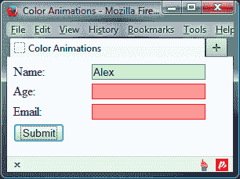
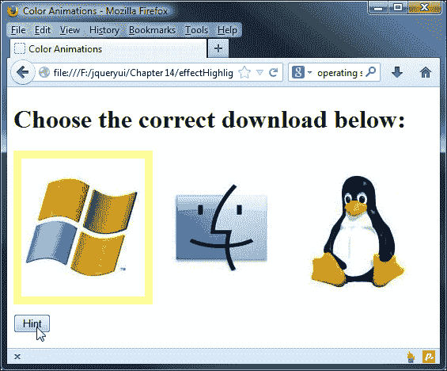
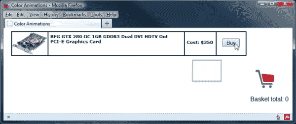
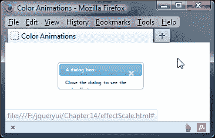
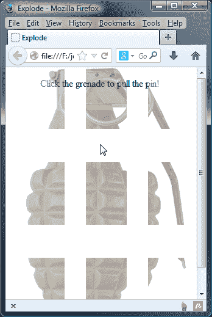
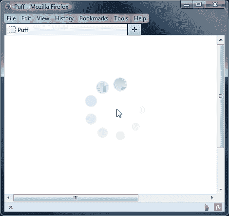
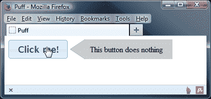
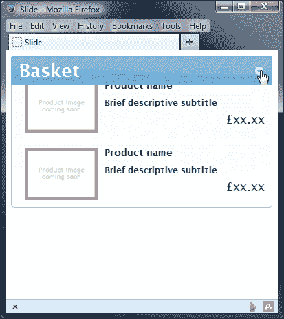
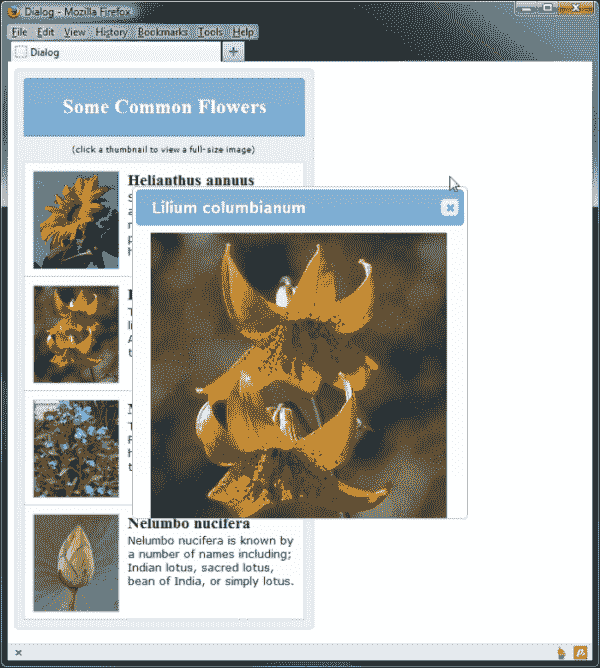
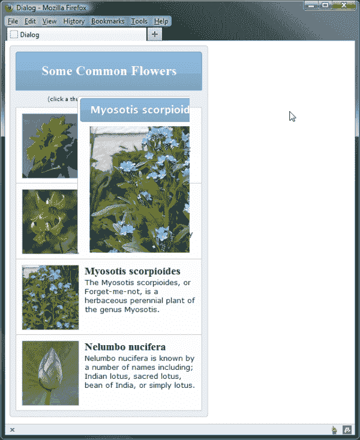

# 第十四章：UI 效果

到目前为止，我们已经看过一系列非常有用的小部件和交互式辅助工具。所有这些都易于使用，但同时功能强大，且高度可配置。一些细微的细节需要在实现过程中加以考虑和思考。

另外，库提供的效果大多非常紧凑，几乎没有学习的选项，也没有方法。我们可以快速、轻松地使用这些效果，最小化配置。

本章中我们将要看的效果如下：

+   强调

+   弹跳

+   摇晃

+   转移

+   比例

+   爆炸

+   膨胀

+   脉动

+   幻灯片

+   百叶窗

+   剪辑

+   折叠

# 使用核心效果文件

就像单独的组件本身一样，效果也需要一个单独的核心文件来提供必要的功能，如创建包装元素和控制动画。大多数效果都有自己的源文件，它们在核心基础上添加了特定于效果的功能。

要使用效果，我们只需在页面中包含核心文件（`jquery.ui.effect.js`），位于效果源文件之前。然而，与`jquery.ui.core.js`文件不同，`jquery.ui.effect.js`文件在设计上可以部分完全独立使用。

## 使用颜色动画

如果我们单独使用核心效果文件，我们可以利用颜色动画。这包括将元素的背景颜色更改为另一种颜色（不仅仅是突然变化，而是平滑地将一种颜色变成另一种颜色），类别转换和高级缓动动画。

### 注意

jQuery UI 1.10 使用 jQuery Color 库的 2.0.0 版本作为库中大部分颜色支持的基础。如果您想了解更多关于 jQuery Color 的信息，请访问[`github.com/jquery/jquery-color`](https://github.com/jquery/jquery-color)项目页面。

jQuery UI 中的核心效果插件添加了使用`rgb()`，`rgba()`，十六进制值甚至诸如水蓝色的颜色名称到 jQuery 核心的能力。我们所需要做的就是包含 jQuery UI 效果核心文件，jQuery 的`.animate()`将支持颜色。

让我们看看如何创建颜色动画。首先，创建以下新页面：

```js
<!DOCTYPE HTML>
<html>
  <head>
    <meta charset="utf-8">
    <title>Color Animations</title>
    <link rel="stylesheet" href="css/effectColor.css">
    <script src="img/jquery-2.0.3.js"></script>
    <script src="img/jquery.ui.effect.js"></script>
  </head>
  <script>
  <body>
    <form action="#">
      <div>
        <label for="name">Name: </label>
        <input id="name" type="text">
      </div>
      <div>
        <label for="age">Age: </label>
        <input id="age" type="text">
      </div>
      <div>
        <label for="email">Email: </label>
        <input id="email" type="text">
      </div>
      <button type="submit">Submit</button>
    </form>
  </body>
</html>
```

将页面保存为`effectColor.html`。在最后的`<script>`块中，添加以下代码，为每个字段提供视觉反馈：

```js
    $(document).ready(function($){
      function Validate(fieldname, response)   {
        var bgColor, brdrColor;

        switch(response) {
          case "invalid" : 
            bgColor = "#ff9999";
            brdrColor = "#ff0000";
            break;
          case "valid" : 
            bgColor = "#ccffcc";
            brdrColor = "#00ff00";
            break;
        }

        fieldname.animate({
          backgroundColor: bgColor,
          borderTopColor: brdrColor,
          borderRightColor: brdrColor,
          borderBottomColor: brdrColor,
          borderLeftColor: brdrColor
        });
      }

      $("form").submit(function() {
        ($("#name").val().length == 0) ? Validate($("#name"), "invalid") : Validate($("#name"), "valid");
        ($("#age").val().length == 0) ? Validate($("#age"), "invalid") : Validate($("#age"), "valid");
        ($("#email").val().length == 0) ? Validate($("#email"), "invalid") : Validate($("#email"), "valid"); 
      });
    });
```

如你所见，我们所需要的只是 jQuery 和`jquery.ui.effect.js`文件，就可以创建吸引人的颜色过渡效果。在页面上，我们有一个简单的`<form>`元素围绕着三个容器元素和三组`<label>`和`<input>`元素。`animate`方法是 jQuery 的一部分，而不是特别是 jQuery UI 的，但`jquery.ui.effect.js`文件通过允许它专门处理颜色和类别，扩展了 jQuery 的`animate`方法。

当单击**提交**按钮时，我们只需使用`animate`方法根据文本输入框是否已填写来将一系列新的 CSS 属性应用于目标元素。如果已经填写，我们将它们着色为绿色；如果没有填写，我们将其着色为红色。在此示例中，我们还使用了基本样式表。在文本编辑器中的另一页中，添加以下基本选择器和规则：

```js
div { margin-bottom: 5px; }
label { display: block; width: 100px; float: left; }
input { border: 1px solid #000000; }
```

将此保存为`effectColor.css`，并放在`css`文件夹中。当我们在浏览器中查看此页面时，我们应该看到任何留空的字段在单击**提交**按钮时平滑变为红色，而不为空的字段在单击时平滑变为绿色。但是，当一个字段从红色变为绿色时最具吸引力。

下图显示了在单击**提交**按钮后页面的情况：



### 注意

需要注意的关键点是我们在代码中使用了`backgroundColor`作为属性；这样做的原因是，jQuery 默认情况下不能动画显示`background-color` CSS 样式，除非我们使用 jQuery Color 插件。让我们更详细地看一下这些属性。

可以应用颜色动画的样式属性如下所示：

+   `backgroundColor`

+   `borderTopColor`

+   `borderRightColor`

+   `borderBottomColor`

+   `borderLeftColor`

+   `color`

+   `outlineColor`

颜色可以使用 RGB、十六进制（格式为`#xxx[xxx]`）甚至标准颜色名称来指定。建议在可能的情况下使用 RGB 或十六进制颜色，因为浏览器并不总是一致地识别颜色名称。

### 注意

Color 插件的默认构建仅包括对基本颜色名称的支持。如果您需要使用其他颜色名称，可以从 [`github.com/jquery/jquery-color#readme`](https://github.com/jquery/jquery-color#readme) 下载支持此功能的版本。

## 使用类过渡

除了对单个颜色属性进行动画处理外，`jquery.ui.effect.js` 还赋予了我们强大的能力，可以在整个类之间进行动画处理。这使我们能够在不出现突然刺耳变化的情况下平滑无缝地切换样式。让我们在以下示例中看一下文件使用的这个方面。

将`effectColor.html`的`<head>`元素中的`<link>`标签更改为指向一个新样式表：

```js
<link rel="stylesheet" href="css/effectClass.css">
```

然后更改最后一个 `<script>` 元素，使其显示如下：

```js
<script>
  $(document).ready(function($){
    var obj;

    function showValid(obj) {
      (obj.val().length == 0) ? null : obj.switchClass("error", "pass", 2000);
    }

    function showInvalid(obj) {
      (obj.val().length != 0) ? null : obj.switchClass("pass", "error", 2000);
    }

    function showEither(obj) {
      (obj.val().length == 0) ? obj.addClass("error", 2000) : obj.addClass("pass", 2000);
    }

    $("form").submit(function(e) {
      $("input").each(function() {
        var cssStyle = $(this).attr('class');
        if (cssStyle == "error") { showValid($(this)); }; 
        if (cssStyle == "pass") { showInvalid($(this)); } 
        if (cssStyle == null) { showEither($(this)); }           
      })
    });  
  });
</script>
```

将此保存为`effectClass.html`。`jquery.ui.effect.js` 文件通过允许我们指定应用新类名的持续时间来扩展了 jQuery 类 API，而不仅仅是立即切换它。我们还可以指定缓动效果。

当字段已经具有其中一个类名并且需要更改为不同的类名时，`jquery.ui.effect.js` 文件的 `switchClass` 方法被使用。`switchClass` 方法需要几个参数；我们指定要移除的类名，然后是要添加的类名。我们还将持续时间指定为第三个参数。

本质上，页面的功能与以前相同；但是，使用这种类型的类别转换还允许我们使用非基于颜色的样式规则，因此我们可以调整宽度、高度或许多其他样式属性。请注意，无法以这种方式过渡背景图像。

与上一个示例一样，我们附加了一个样式表。本质上与上一个示例相同，只是为我们的两个新类别添加了一些样式。

在`effectColor.css`的底部添加以下选择器和规则：

```js
.error { border: 1px solid #ff0000; background-color: #ff9999; }
.pass { border: 1px solid #00ff00; background-color: #ccffcc; }
```

将更新后的文件另存为`css`文件夹中的`effectClass.css`。

## 高级缓动

标准 jQuery 中的`animate`方法内置了一些基本的缓动功能，但是要使用更高级的缓动，您必须包含额外的缓动插件（由 GSGD 移植到 jQuery）。

### 注意

有关更多信息，请参阅缓动插件的项目页面[`gsgd.co.uk/sandbox/jquery/easing/`](http://gsgd.co.uk/sandbox/jquery/easing/)。

`jquery.ui.effect.js`文件中内置了所有这些高级缓动选项，因此无需包含其他插件。在本节中我们不会详细讨论它们；但是，我们将在本章后面的某些示例中使用它们，在“页面上缩放元素”部分。

# 高亮指定的元素

高亮效果会临时将被调用的任何元素变成浅黄色（该效果也被称为**黄色渐变技术**（**YFT**））。让我们一起来举个简单的例子，这样我们就能看到效果的实际作用：

```js
<link rel="stylesheet" href="css/effectHighlight.css">
```

`<script>`元素引用效果的源文件，以便使用`jquery.effects.highlight.js`文件：

```js
<script src="img/jquery.ui.effect-highlight.js"></script>
```

然后从页面的`<body>`元素中删除`<form>`元素，并用以下标记替换它：

```js
<h1>Choose the correct download below:</h1>
<a id="win" href="#"></a>
<a id="mac" href="#"></a>
<a id="linux" href="#"></a>
<button id="hint">Hint</button>
```

最后，将最终的`<script>`元素更改为以下内容：

```js
<script>
  $(document).ready(function($){
    var ua = navigator.userAgent.split(" ");
    $("#hint").click(function() {
      var el = ua[1].toLowerCase().substring(1);
      $("#" + el).effect("highlight");
    });    
  });
</script>
```

将此页面保存为`effectHighlight.html`。调用高亮效果的代码与其他库组件的形式相同。调用`effect`方法，并将实际效果指定为方法的字符串参数。

我们只需检查`userAgent`字符串，看是否搜索 Windows、Mac 或 Linux 返回了正整数。如果找到正整数，则`userAgent`字符串包含搜索词；如果返回了`-1`，则未找到搜索词。

我们还需要创建新的样式表，不是为了让效果起作用，而是为了稍微整理一下。在文本编辑器的新页面中，添加以下选择器和规则：

```js
a { padding: 10px; float: left; }
a img { display: block; border: none; }
button { display: block; position: relative; top: 10px; clear: both; }
```

将此文件另存为`css`文件夹中的`effectHighlight.css`。

查看示例，点击**提示**按钮。应该会短暂地突出显示你正在使用的操作系统的图标：



虽然我们的示例可能看起来有些刻意，但很容易看出这种效果作为前端辅助工具的潜力。每当有需要按特定顺序完成一系列操作时，高亮效果都可以立即向访问者提供关于下一步需要完成的步骤的视觉提示。

## 添加额外的效果参数

每个 `effect` 方法，以及指定实际应用的效果的参数，都可以使用三个额外的参数来控制效果的工作方式。所有这些参数都是可选的，包括以下内容（按列出的顺序）：

+   包含额外配置选项的对象

+   一个表示效果持续时间的毫秒数的整数，或指定 `slow`、`normal` 或 `fast` 中的一个的字符串

+   当效果结束时执行的回调函数

`highlight` 效果只有一个可配置选项，可以在作为第二个参数传递的对象中使用，那就是高亮颜色。

让我们将一些这些额外的参数添加到我们的高亮示例中，以澄清它们的用法。将 `effect` 方法在 `effectHighlight.html` 最后的 `<script>` 元素中的调用更改为以下内容：

```js
$(el).effect("highlight", {}, function() {
  $("<p />", {
    text: "That was the highlight"
  }).appendTo("body").delay(2000).fadeOut();
});
```

将此保存为 `effectHighlightCallback.html`。我们新代码最引人注目的特点也许是作为第二个参数传递的空对象。在这个示例中，我们不使用任何额外的可配置选项，但我们仍然需要传递空对象以便访问第三个和第四个参数。

作为第三个参数传递的回调函数，可能是 JavaScript 历史上最没用的回调函数之一，但它确实说明了在效果后如何轻松安排额外的代码执行。

# 弹跳

我们可以用很少的配置来使用另一个简单的效果，那就是弹跳效果。要看到这个效果的实际效果，请将 `effectHighlight.html` 中 `<body>` 元素的内容更改为以下内容：

```js
<div id="ball">
  
</div>
```

我们还需要使用弹跳效果的源文件；修改对 `jquery.ui.effect-highlight.js` 文件的引用，使其指向 `bounce.js` 源文件：

```js
<script src="img/jquery.ui.effect-bounce.js"></script>
```

将此保存为 `effectBounce.html`。我们需要添加一点样式才能真正看到效果，但可能不值得创建一个全新的样式表，所以只需将页面的 `<head>` 元素中的 `<link>` 元素替换为以下内容即可：

```js
<style>
  #ball { position: relative; top: 150px; }
</style>
```

最后，修改最终的 `<script>` 元素，使其如下所示：

```js
<script>
  $(document).ready(function($){
    $("#ball").click(function() {
      $(this).effect("bounce", { distance: 140 });
    });
  });
</script>
```

在此示例中使用弹跳效果显示了添加此简单但引人注目的效果有多容易。我们配置 `distance` 选项以设置元素移动的距离。可以配置的其他选项列在下表中：

| 选项 | 默认值 | 用途 |
| --- | --- | --- |
| `direction` | `"up"` | 设置弹跳方向 |
| `distance` | `20` | 设置第一次弹跳的像素距离 |
| `times` | `5` | 设置元素应该弹跳的次数 |

当你运行示例时，你会注意到弹跳效果中内置了一个缓出缓入的特性，因此随着动画的进行，弹跳的距离会自动减小。

### 注

这里使用的默认缓动效果是`swing`；这是库中可以使用的许多缓动特性之一。缓动函数控制动画在不同点处进行的速度；可以在[`api.jqueryui.com/easings/`](http://api.jqueryui.com/easings/)上看到可用的完整的缓动特性列表。

值得注意的是，对于大多数不同的效果，包括弹跳效果（但不是我们之前看到的亮点效果），实际上并未应用于指定的元素。相反，创建了一个包装元素，并且效果所针对的元素被附加到包装器的内部。实际效果然后应用于包装器。

这是一个要注意的重要细节，因为如果你需要在动画进行中操纵具有应用效果的元素，那么包装器将需要被定位，而不是原始元素。一旦效果的动画完成，包装器就从页面中移除。

# 抖动元素

抖动效果与弹跳效果非常相似，但关键区别是没有内置的缓动。因此，目标元素会在指定的次数内以相同的距离抖动，而不是每次减小（尽管在动画结束时会平稳停止）。

让我们修改前面的示例，使其使用抖动效果而不是弹跳效果。修改`effectBounce.html`以使用`shake.js`源文件而不是弹跳源文件：

```js
<script src="img/jquery.ui.effect-shake.js"></script>
```

然后修改最终`<body>`元素底部的最后一个`<script>`元素中的点击处理程序，使其如下所示：

```js
$("#ball").click(function() {
 $(this).effect("shake", { direction: "up" }, 100);
});
```

将此保存为`effectShake.html`。这次我们使用了`direction`配置选项和持续时间参数。配置选项控制了抖动的方向。我们将其设置为覆盖该选项的默认设置，即`left`。我们使用的持续时间加快了动画。

这种效果与弹跳效果共享相同的选项，尽管默认设置略有不同。选项列在下表中：

| 选项 | 默认值 | 用途 |
| --- | --- | --- |
| `direction` | `"left"` | 设置抖动的方向 |
| `distance` | `20` | 设置抖动的距离（像素） |
| `times` | `3` | 设置元素应该抖动的次数 |

## 转移元素的轮廓

转移效果与其他效果不同，因为它不直接影响目标元素。相反，它将指定元素的轮廓转移到另一个指定元素上。要看到此效果的实际操作，请将`effectShake.html`的`<body>`元素更改为包含以下元素：

```js
<div id="container">
  <div id="basketContainer">
    <div id="basket"></div>
    <p>Basket total: <span id="total">0</span></p>
  </div>      
  <div id="productContainer">
    </img>
    <p>BFG GTX 280 OC 1GB GDDR3 Dual DVI HDTV Out PCI-E Graphics Card</p>
    <p id="price">Cost: $350</p>

  </div>
  <div id="purchase"><button id="buy">Buy</button></div>
</div>
```

将此保存为`effectTransfer.html`。我们创建了一个基本的产品列表；当点击**购买**按钮时，转移效果会给人一种产品被移入篮子的印象。为了实现这一点，将最后的`<script>`元素更改为包含以下代码： 

```js
<script>
  $(document).ready(function($){
    $("#buy").click(function() {
      $("#productContainer img").effect("transfer", {
        to:"#basket"
      }, 750, function() {
        var currentTotal = $("#total").text(),
        numeric = parseInt(currentTotal, 10);
        $("#total").text(numeric + 1);
      });
    });
  });
</script>
```

当然，一个适当的购物车应用程序会比这复杂得多，但我们确实可以看到转移效果的全部荣耀。不要忘记更新效果的源文件：

```js
<script src="img/jquery.effects.transfer.js"></script>
```

对于这个示例，我们还需要一些 CSS，所以创建以下新样式表：

```js
body { font-family: "Lucida Grande",Arial,sans-serif; }
#container { width: 707px; margin: 0 auto; }
#productContainer img { width:  92px; height: 60px; border: 2px solid #000000; position: relative; float: left; }
#productContainer p { width: 340px; height: 50px; padding: 5px; border: 2px solid #000; border-left: none; margin: 0; font-family: Verdana; font-size: 11px; font-weight: bold; float: left; }
p#price { height: 35px; width: 70px; padding-top: 20px; float: left; }
#purchase { height: 44px; width: 75px; padding-top: 16px; border: 2px solid #000; border-left: none; float: left; text-align: center; }
#basketContainer { width: 90px; margin-top: 100px; float: right; }
#basketContainer p { width:  100px; }
#basket { width: 65px; height: 50px; position: relative; left: 13px; background: url(img/shopping.png) no-repeat; }
.ui-effects-transfer { border: 2px solid #66ff66; }
```

将此保存为`effectTransfer.css`在`css`文件夹中。我们新样式表中的关键规则是针对具有类`ui-effects-transfer`的元素的规则。

这个元素是由效果创建的，与我们的样式一起产生绿色轮廓，该轮廓从产品转移到篮子中。

在浏览器中运行文件。我想你会同意，这是一个很好的效果，无论在哪个页面使用都会增加价值。在转移发生时，它应该是这样的：



转移效果只有两个可配置选项，其中一个是必需的，我们已经看到了。供参考，两者均列在以下表中：

| 选项 | 默认值 | 用途 |
| --- | --- | --- |
| `className` | `"ui-effects-transfer"` | 将自定义类名应用于效果辅助元素。 |
| `to` | `"none"` | 设置效果将转移到的元素。此属性是必需的。 |

到目前为止，我们已经看过的四种效果都有一个共同点-它们只能与`effect`方法一起使用。其余的效果不仅可以与`effect`方法一起使用，还可以与 jQuery 的切换和`show`/`hide`方法一起使用。

让我们来看看。

# 在页面上缩放元素

缩放效果是高度可配置的，用于缩小元素。当用于隐藏元素时非常有效。在这个示例中，我们将使用`hide()`方法触发效果，而不是使用`effect`方法。

在这个示例中，我们将使用一些 CSS 框架类，以及一些自定义样式；所以将两个新的`<link>`元素添加到`effectTransfer.html`的`<head>`元素中：

```js
<link rel="stylesheet" href="development-bundle/themes/redmond/jquery.ui.all.css">
<link rel="stylesheet" href="css/effectScale.css">
```

然后，将`<body>`元素中的底层标记替换为以下内容：

```js
<div class="ui-widget ui-widget-content ui-corner-all">
  <div class="ui-widget-header ui-corner-all">
    A dialog box
    <a id="close" class="ui-icon ui-icon-closethick" href="#">
    Close
    </a>
  </div>
  <div class="content">Close the dialog to see the scale effect</div>
</div>
```

不要忘记将效果的`<script>`元素更改为缩放效果的源文件：

```js
<script src="img/jquery.ui.effect-scale.js"></script>
```

最后，替换最后一个`<script>`元素，使其显示如下：

```js
<script>
  $(document).ready(function($){
    $("#close").click(function(e) {
      $("#close").click(function(e) {
        e.preventDefault();
        $(this).closest(".ui-widget").hide("scale", {}, 900);
      });
    });
  });
</script>
```

将新页面保存为`effectScale.html`。我们使用的自定义样式表如下：

```js
.ui-widget { padding: 3px; width: 300px; }
.ui-widget-header, .content { padding: 5px 10px; }
.ui-widget-header a { margin-top: 2px; float: right; }
```

将此文件保存为`effectScale.css`，并将其放入`css`文件夹中。这些样式用于使示例具有模糊对话框样式的外观。

在脚本中，我们简单地为关闭图标添加了一个点击处理程序，并在对话框外容器上调用了`effect()`方法。空对象作为方法的第二个参数传递，并且相对较长的持续时间作为第三个参数传递，因为此效果进行得相当迅速。以下截图显示了效果正在进行的情况：



在本示例中，使用`hide()`方法而不是`effect()`方法对我们是有利的，因为我们希望对话框在效果完成后保持隐藏。当使用`effect()`方法时，动画结束时，部件仍然可见。

### 提示

**何时应配置百分比选项？**

当与缩放效果一起使用`effect()`方法时，必须配置`percent`配置选项。

有几个配置选项可用于缩放；这些如下表所列：

| 选项 | 默认值 | 用途 |
| --- | --- | --- |
| `direction` | `"both"` | 设置元素进行缩放的方向。可以是指定水平、垂直或两者的字符串。 |
| `from` | `{}` | 设置要缩放的元素的起始高度和宽度。 |
| `origin` | `["middle","center"]` | 设置消失点，与显示/隐藏动画一起使用。 |
| `percent` | `0` | 设置缩放元素的最终大小。 |

# 在页面上爆炸元素

爆炸效果真是令人惊叹。目标元素被真正地爆炸成指定数量的碎片，然后完全消失。这是一个简单的效果，几乎没有配置属性，但是这个效果的视觉冲击力很大，为很少的代码提供了很多效果。让我们看一个基本的例子。

创建以下新页面：

```js
<!DOCTYPE HTML>
<html>
  <head>
    <meta charset="utf-8">
    <title>Explode</title>
    <link rel="stylesheet" href="development-bundle/themes/redmond/jquery.ui.all.css">
    <style>
      body { width: 200px; margin-left: auto; margin-right: auto; }
    </style>
    <script src="img/jquery-2.0.3.js"></script>
    <script src="img/jquery.ui.effect.js"></script>
    <script src="img/jquery.ui.effect-explode.js"></script>
  </head>
  <script>
    $(document).ready(function($){
      $("#theBomb").click(function() {
        $(this).hide("explode");
      });
    });
  </script>
  <body>
    <p>Click the grenade to pull the pin!</p>
    
  </body>
</html>
```

将此保存为`effectExplode.html`。正如你所见，代码非常简单，可以完全开箱即用，无需额外配置。此效果仅有一个可配置属性，即`pieces`属性，它决定了元素爆炸成多少个碎片。默认值为九。该效果在使用`effect()`方法和`hide()`方法时同样有效。

一旦指定的元素被爆炸，它将通过将其`style`属性设置为`display: none`来隐藏。这是默认行为。但是，它仍然会保留在页面的 DOM 中。以下截图显示了爆炸正在进行的情况：



物理学家有时会推测为什么时间之箭似乎只指向前方。他们总是会问自己诸如“我们为什么不会看到手榴弹从一大团碎片中自发形成？”这样的哲学问题。（实际上，物体通常是一个鸡蛋，但我认为基于鸡蛋的例子可能没有产生同样的影响！）

jQuery UI 不能帮助我们理解熵，但它可以向我们展示手榴弹自发重新组装的样子。我们需要隐藏``标签以显示它。最简单的方法是使用内联`style`属性：

```js


```

然后，将最后一个`<script>`元素更改为以下内容：

```js
<script>
  $(document).ready(function($){
    $("#theBomb").show("explode");
  });
</script>
```

将此变体保存为`effectExplodeShow.html`。这次我们使用`show()`方法而不是`hide()`方法来触发动画，该动画在页面加载完成后发生。

动画是相同的，只是它是反向显示的，这次手榴弹在动画结束后不会被隐藏。与其他效果一样，爆炸也可以使用特定的持续时间和回调函数。

# 创建一个膨胀效果

类似于爆炸效果，但略微更加微妙的是“膨胀”效果，它会导致元素在淡出之前略微增长。与爆炸效果类似，我们只需关注少量配置选项。

考虑一个页面上正在发生 AJAX 操作的情况。提供一个显示访问者正在发生某些事情的加载图像是有用的。当操作完成时，我们不仅可以隐藏这样的图像，还可以使其消失。

删除先前示例中的`<p>`元素，并更改``元素，使其指向一个新的图像：

```js

```

然后将效果的源文件更改为缩放效果：

```js
<script src="img/jquery.ui.effect-scale.js">
</script>
```

最后，将最后一个`<script>`元素更改为以下内容：

```js
<script>
  $(document).ready(function($){
    $("#loader").click(function() {
      $(this).hide("puff");
    });
  });
</script>
```

将其保存为`effectPuff.html`。在这个示例中，我们实际上并没有检测给定过程是否已经加载完成。这将需要太多的工作，仅仅是为了看到我们正在关注的效果。相反，我们将效果的执行绑定到一个简单的点击处理程序中。

你会注意到我们为这个效果使用了`jquery.ui.effect-scale.js`源文件。

膨胀效果是唯一没有自己源文件的效果，而是作为非常密切相关的缩放效果的源文件的一部分。

与我们在上一节中查看的爆炸效果类似，此效果只有一个配置选项，可以将其作为第二个参数传递给`effect`方法的对象。这是`percent`选项，用于控制图像放大到的尺寸。默认值为 150%。与爆炸效果一样，动画结束后，目标元素被隐藏不再可见。无论是使用`effect()`还是`hide()`，都会发生这种情况。

该效果拉伸了目标元素（如果有的话，还有它的子元素），同时降低其不透明度。它适用于适当的图像、背景颜色和边框，但要注意，它与由 CSS 指定的背景图像不太适用。尽管如此，这个效果非常棒。

以下屏幕截图显示了它的具体操作：



# 使用脉动效果工作

脉动效果是另一个与指定元素的不透明度配合运作的效果。这个效果暂时降低不透明度，指定次数，使元素看起来有脉动。

在以下基本示例中，我们将创建一个简单的倒计时时间，从`15`开始倒数。当显示时间达到 10 秒时，它将开始变成红色。在`effectPuff.html`中，更改页面的`<head>`元素中的链接，指向一个新样式表：

```js
<link rel="stylesheet" href="css/effectPulsate.css">
```

然后从页面中删除加载的``元素，并用以下元素替换它：

```js
<div id="countdown">15</div>
```

接下来，更改效果的源文件，使用`jquery.ui.effect-pulsate.js`文件：

```js
<script src="img/jquery.ui.effect-pulsate.js"></script>
```

最后，删除现有的最后一个`<script>`元素，并将其替换为以下内容：

```js
<script>
  $(document).ready(function($){
    var age = 15, countdown = $("#countdown"),
      adjustAge = function() {
        countdown.text(age--);
        if (age === 0) {
          clearInterval(timer);
        } else if (age < 10) {
          countdown.css({
          backgroundColor: "#ff0000",
          color: "#fff"
        }).effect("pulsate", { times: 1 });
      }
    },
    timer = setInterval(function() { adjustAge() }, 1000);
  });
</script>
```

将此保存为`effectPulsate.html`。页面本身仅包含一个简单的`<div>`元素，其中包含文本`15`。代码首先设置一个计数器变量，然后缓存`<div>`元素的选择器。然后我们定义`adjustAge()`函数。

此函数首先减少倒计时元素的文本内容，并同时减少计数器变量的值。然后检查计数器变量是否已经达到零；如果是，则清除即将设置的间隔。

如果计数器变量大于 0 但小于 11，则函数将元素应用红色背景和白色文本内容，并运行脉动效果。

我们使用`times`配置选项来指定元素应该脉动多少次。因为我们将每秒执行一次该方法，所以可以将其设置为每次脉动一次。这是唯一的可配置选项。

在我们的`adjustAge`函数之后，我们使用 JavaScript 的`setInterval`函数启动间隔。这个函数将在指定的间隔之后重复执行指定的函数，在这个例子中是 1000 毫秒，或 1 秒。我们避免使用`window`对象，而是使用匿名函数调用我们的命名函数。

新样式表非常简单，包括以下代码：

```js
#countdown { width: 100px; border: 1px solid #000; margin: 10px auto 0; font-size: 60px; text-align: center; }
```

将此保存在`css`文件夹中，命名为`effectPulsate.css`。

# 向元素添加下降效果

下降效果很简单。元素看起来掉下（或掉入）页面，这是通过调整元素的`position`和`opacity`值来模拟的。

这个效果公开了以下可配置选项：

| 选项 | 默认值 | 用途 |
| --- | --- | --- |
| `direction` | `"left"` | 设置下降的方向 |
| `distance` | 元素的外宽度或高度（取决于方向）除以 2 | 设置元素下落的距离 |
| `easing n` | `one` | 设置动画期间使用的缓动函数 |
| `mode` | `"hide"` | 设置元素是隐藏还是显示 |

有许多情况下，投放效果会很有用，但我立即想到的是创建自定义工具提示时。我们可以很容易地创建一个在按钮被点击时出现的工具提示，但我们可以将其投放到页面上。在本示例中，我们将使用按钮小部件和`position`实用程序，以及效果。

在`effectPulsate.html`的`<head>`元素中添加一个链接到 CSS 框架文件，并更改样式表链接：

```js
<link rel="stylesheet" href="development-bundle/themes/redmond/jquery.ui.all.css">
<link rel="stylesheet" href="css/effectDrop.css">
```

从页面中删除倒计时`<div>`元素，并改为添加以下元素：

```js
<a id="button" href="#" title="This button does nothing">
  Click me!
</a>
```

现在我们需要更改效果的源文件并添加位置和按钮小部件的源文件：

```js
<script src="img/jquery.ui.effect-drop.js">
</script>
<script src="img/jquery.ui.core.js">
</script>
<script src="img/jquery.ui.widget.js">
</script>
<script src="img/jquery.ui.position.js">
</script>
<script src="img/jquery.ui.button.js">
</script>
```

最后，更改最后一个`<script>`元素，使其如下所示：

```js
<script>
  $(document).ready(function($){
    $("#button").button().click(function() {
      var button = this, tip = $("<span />", {
        id: "tip",
        text: button.title
      }),
      tri = $("<span />", {
        id: "tri"
      }).appendTo(tip);
      tip.appendTo("body").position({
        of: button,
        my: "right-35 center",
        at: "left center",
        offset: "-30 0"
      });
      tip.show("drop", { direction: "up" }, function() {
        $(this).delay(1000).fadeOut();
      });
    });
  });
</script>
```

将此文件保存为`effectDrop.html`。当单击按钮时，我们首先存储按钮的 DOM 节点的引用。然后，我们添加一个`position`实用程序的配置对象，以便将我们的工具提示定位在按钮的右侧。

然后我们创建一个新的`<span>`元素作为工具提示，其文本内容设置为按钮的标题文本。我们还创建另一个用于创建三角形 CSS 形状以给工具提示添加指针的元素。此元素附加到工具提示上。

创建后，工具提示附加到页面的`<body>`元素上，然后使用投放效果显示。`direction`配置选项用于使工具提示显示为下拉式；我们必须在此指定相反的方向，因为我们的工具提示是绝对定位的。

除了 CSS 框架提供的样式之外，此示例还需要一些最小的 CSS 来为工具提示设置样式。创建以下样式表：

```js
#tip { display: none; padding: 10px 20px 10px 10px;
position: absolute; background-color: #cecece; }
#tri { border-top: 20px solid transparent; border-right: 30px solid #cecece; border-bottom: 20px solid transparent; position: absolute; left:- 30px; top: 0; }
```

将其保存在`css`文件夹中，命名为`effectDrop.css`。这里的样式纯粹是为了美观。

在浏览器中运行文件时，您应该看到您的工具提示，如以下截图所示：



# 实现滑动效果

jQuery UI 库的剩余效果都通过以不同方式显示和隐藏元素来工作，而不是像我们已经看过的大多数效果那样使用不透明度。

滑动效果也不例外，并通过将元素滑动到（或滑出）视图中来显示（或隐藏）元素。它类似于我们刚刚看到的投放效果。主要区别在于它不使用不透明度。

滑动效果包含以下配置选项：

| 选项 | 默认值 | 用途 |
| --- | --- | --- |
| `direction` | `"left"` | 设置滑动的方向 |
| `distance` | 元素的外部宽度或高度（取决于方向） | 设置元素滑动的距离 |
| `easing` | `none` | 设置动画期间使用的缓动函数 |
| `mode` | `"show"` | 设置元素是隐藏还是显示 |

这些是我们在前面示例中看到的放置效果使用的相同配置选项，只是某些默认值不同。

对于我们的下一个示例，我们可以创建完全相同类型的功能。在`effectDrop.html`中，将页面`<head>`元素中的`<link>`元素从`effectDrop.css`更改为`effectSlide.css`：

```js
<link rel="stylesheet" href="css/effectSlide.css">
```

然后，从页面的`<body>`元素中删除`<a>`元素，并添加以下 HTML 代码：

```js
<aside id="basket" class="ui-widget">
  <h1 class="ui-widget-header ui-corner-all">
    Basket
    <a id="toggle" title="Show basket contents" class="ui-icon ui-icon-circle-triangle-s" href="#">
      Open
    </a>
  </h1>
  <div class="ui-widget-content ui-corner-bottom">
    <ul>
      <li>
        
        <h2>Product name</h2>
        <h3>Brief descriptive subtitle</h3>
        <span>£xx.xx</span>
      </li>
      <li>
        
        <h2>Product name</h2>
        <h3>Brief descriptive subtitle</h3>
        <span>£xx.xx</span>
      </li>
      <li>
        
        <h2>Product name</h2>
        <h3>Brief descriptive subtitle</h3>
        <span>£xx.xx</span>
      </li>
    </ul>
  </div>
</aside>
```

此集合中的外部元素是`<aside>`，这是一个完美的小购物篮小部件，位于站点右侧列中。在此元素中，我们有一个作为购物篮标题的`<h1>`元素。标题包含一个链接，该链接将用于显示或隐藏篮子的内容。篮子的内容将包括容器`<div>`内的产品无序列表。

不要忘记更改效果源文件的`<script>`元素，以使用`jquery.ui.effect-slide.js`，并删除`jquery.ui.core.js`、`jquery.ui.widget.js`、`jquery.ui.position.js`和`jquery.ui.button.js`的`<script>`文件：

```js
<script src="img/jquery.ui.effect-slide.js">
</script>
```

最终的`<script>`元素需要更改为以下代码：

```js
  <script>
    $(document).ready(function($){
      $("#toggle").on("click", function(e) {
        var slider = $("#basket").find("div"),
          header = slider.prev();
        if (!slider.is(":visible")) {
          header.addClass("ui-corner-top")
            .removeClass("ui-corner-all");
        }
        slider.toggle("slide", {
          direction: "up"
        }, "slow", function() {
          if (slider.is(":visible")) {
            header.find("a").switchClass("ui-icon-circle-triangle-s", "ui-icon-circle-triangle-n");
          } else {
            header.switchClass("ui-corner-all", "ui-corner-top");
            header.find("a").switchClass("ui-icon-circle-triangle-n", "ui-icon-circle-triangle-s");
          }
        });
      });
    });
  </script>
```

将此文件保存为`effectSlide.html`。所有功能都驻留在一个点击处理程序中，我们将其附加到篮子标题中的图标上。当单击此元素时，我们首先初始化`slider`和`header`变量，因为这些是我们将要操作的元素。

然后，我们检查`slider`（即篮子内容容器）是否隐藏；如果隐藏，我们知道它即将打开，因此从`header`底部移除圆角。这样，即使在滑动打开时，滑块元素也能与`header`底部齐平。

然后，我们使用 jQuery 的`toggle()`方法调用效果，我们使用方法的第一个参数指定效果。然后，我们将配置选项`direction`设置为作为第二个参数传递的对象中。使用字符串`slow`作为第三个参数延长动画的持续时间，并使用匿名回调函数作为第四个参数。此函数将在滑动动画结束时执行。

在此函数内部，我们检查`slider`的状态，以查看它是否隐藏或打开。如果在动画结束时它是打开的，我们将从`header`底部移除边框，然后更改`header`中的图标，以便它指向上方，表示可以通过再次单击图标关闭篮子。

如果`slider`现在关闭，我们再次为`header`添加底部边框和圆角，并将图标更改回指向下的箭头。

我们在这个例子中也使用了一点 CSS。 创建以下样式表：

```js
#basket { width: 380px; float: right; }
#basket h1 { padding: 5px 10px; margin: 0; }
#basket h1 a { float: right; margin-top: 8px; }
#basket div { display: none; }
#basket ul { margin: 0; padding: 0; list-style-type: none; }
#basket li { padding: 10px; border-bottom: 1px solid #aaa; }
#basket li:last-child { border-bottom: none; }
#basket li:after { content: ""; display: block; width: 100%; height: 0; visibility: hidden; clear: both; }
#basket img { float: left; height: 75px; margin: 2px 10px 0; width: 105px; }
#basket h2 { margin: 0 0 10px; font-size: 14px; }
#basket h3 { margin: 0; font-size: 12px; }
#basket span { margin-top: 6px; float: right; }
```

将此保存为`effectSlide.css`在`css`文件夹中。 在这个例子中，我们不需要太多的 CSS，因为我们使用 CSS 框架类。

进行中的效果应如以下屏幕截图所示：



在这个例子中，我们可以很容易地只使用 jQuery 的本机`slideToggle()`方法；使用 jQuery UI 的滑动效果的主要好处是我们还可以左右滑动。

## 使用缓动

如前所述，`jquery.ui.effect.js`文件具有与效果无缝使用缓动的内置功能。 让我们看看实现这个有多简单。 更改`effectSlide.html`中的最后一个`<script>`元素，使其如下所示：

```js
<script>
  $(document).ready(function($){
    $("#toggle").on("click", function(e) {
      var slider = $("#basket").find("div"),
 header = slider.prev(),
 easing = (slider.is(":visible")) ?
 "easeOutQuart" :
 "easeOutBounce";
        if (!slider.is(":visible")) {
          header.addClass("ui-corner-top")
            .removeClass("ui-corner-all");
        }
        slider.toggle("slide", {
 direction: "up",
 easing: easing
        }, "slow", function() {
        if (slider.is(":visible")) {
          header.find("a").switchClass("ui-icon-circle-triangle-s", "ui-icon-circle-triangle-n");
        } else {
          header.switchClass("ui-corner-all", "ui-corner-top")
          header.find("a").switchClass("ui-icon-circle-triangle-n", "ui-icon-circle-triangle-s");
        }
      });
    });
  });
</script>
```

将此保存为`effectsSlideEasing.html`。 看到有多简单吗？ 我们所需要做的就是在效果的配置对象中添加`easing`选项，并将一个或多个缓动方法定义为选项值。

在这个例子中，我们通过设置一个变量来为每个切换状态指定不同的缓动方法，该变量使用 JavaScript 三元条件来设置缓动函数，具体取决于滑块是否可见。

当篮子滑下时，它在动画结束时会稍微弹跳，使用`easeOutBounce`。 当它向上滑动时，它会在动画过程中逐渐减速，使用`easeOutQuart`。

### 注意

我们可以在 jQueryUI 网站上的一个很好的页面上看到所有缓动方法的完整范围，并且可以在[`jqueryui.com/demos/effect/easing.html`](http://jqueryui.com/demos/effect/easing.html)上查看。

# 了解盲效果

盲效果实际上与滑动效果几乎相同。 在视觉上，元素似乎做了相同的事情，两个效果的代码文件也非常相似。 我们需要担心的两个效果之间的主要区别是，使用此效果，我们只能指定效果的轴，而不能指定实际的方向。

盲效果具有以下配置选项：

| 选项 | 默认值 | 使用 |
| --- | --- | --- |
| `direction` | `"vertical"` | 设置运动的轴 |
| `easing` | `none` | 设置动画过程中使用的缓动函数 |
| `mode` | `"hide"` | 设置元素是隐藏还是显示 |

此效果使用的`direction`选项仅接受值`horizontal`或`vertical`进行配置。 我们将在最后一个示例的基础上构建，以查看盲效果的实际效果。 将`effectSlide.html`中盲效果的`<script>`资源更改，使其引用`jquery.ui.effect-blind.js`文件：

```js
<script src="img/jquery.ui.effect-blind.js"></script>
```

现在更改`toggle()`方法，使其使用盲效果，并更改`direction`配置选项的值：

```js
slider.toggle("blind", {
 direction: "vertical"
}, "slow", function() {
  if (slider.is(":visible")) {
    header.css("borderBottomWidth", 0).find("a")
      .addClass("ui-icon-circle-triangle-n")
      .removeClass("ui-icon-circle-triangle-s");
  } else {
    header.css("borderBottomWidth", 1)
      .addClass("ui-corner-all")
      .removeClass("ui-corner-top").find("a")
      .addClass("ui-icon-circle-triangle-s")
      .removeClass("ui-icon-circle-triangle-n");
  }
});
```

将此保存为 `effectBlind.html`。实际上，我们只改变了指定效果的字符串，本例中为 `blind`，以及 `direction` 属性的值，从 `up` 更改为 `vertical`。当我们在文件中查看时，注意在滑动元素和将其盲目地收起之间的细微差别。

当登录表单向上滑动时，元素的底部始终可见，就好像整个篮子正在向上或向下移动到标题栏中一样。然而，使用盲效果时，元素会从底部开始显示或隐藏，就像窗帘打开或关闭一样。

# 剪裁元素

剪裁效果与滑动效果非常相似。主要区别在于，剪裁效果不是将目标元素的一个边缘向另一个边缘移动，以给出元素滑出视野的效果，而是将目标元素的两个边缘都向中心移动。

剪裁效果具有与盲效果相同的配置选项，并且这些选项具有相同的默认值。

在第五章的最后，*对话框*中，我们创建了一个示例，当点击缩略图图像时，在对话框中显示了一个全尺寸图像。当按下对话框上的关闭按钮时，对话框会立即从页面中移除。

我们可以很容易地使用剪裁效果来关闭我们的对话框。

在 `dialog14.html` 中，在现有库文件之后添加剪裁效果的源文件：

```js
<script src="img/jquery.ui.effect.js"></script>
<script src="img/jquery.ui.effect-clip.js"></script>
```

然后，更改对话框配置对象，使其如下所示：

```js
dialogOpts = {
  modal: true,
  width: 388,
  height: 470,
  autoOpen: false,
  open: function(event, ui) {
  $("#dialog").empty();
    $("").attr("src", filename).appendTo("#dialog");
    $("#dialog").dialog("option", "title", titleText);
  },
  hide: {
    effect: "clip"
  }
};
```

将此保存为 `effectClip.html`。在现有文件的这个简单添加中，我们将剪裁效果与 `close` 事件回调结合使用，以隐藏对话框。对于 `direction` 选项，默认配置值 `vertical` 和正常速度都很好，所以我们只需调用 `hide` 方法，指定剪裁而没有额外的参数。

下面的截图显示了被剪裁的对话框：



# 折叠元素

折叠是一个很好的效果，它使应用于它的元素看起来像是被折叠起来，就像一张纸一样。它通过将指定元素的底边从顶部向上移动最多 15 像素，然后将右边缘完全移动到左边缘来实现这一点。

在这个效果的 API 中，第一部分元素被缩小到距离顶部的距离是作为一个可配置属性暴露出来的。因此，这是我们可以根据实现的需要调整的东西。该属性是一个整数。

我们可以通过再次修改对话框示例来看到这个效果。在 `effectClip.html` 中，将剪裁的效果源文件更改为折叠：

```js
<script src="img/jquery.ui.effect-fold.js"></script>
```

然后将 `hide` 事件回调更改为以下内容：

```js
hide: {
  effect: "fold",
  size: 200,
  duration: 1000
}
```

将此保存为`effectFold.html`。这次我们利用大小配置选项使效果停在第一个折叠处，距离对话框顶部 200 像素处。我们还稍微减慢了动画速度，将持续时间设置为 1000 毫秒。这是一个非常好的效果；以下截图显示了动画的第二部分：



# 摘要

在本章中，我们已经涵盖了 jQuery UI 库中可用的完整 UI 效果范围。我们看到了如何使用`jquery.ui.effect.js`基本组件构建引人注目的颜色动画和平滑的类转换是多么容易。

我们还看到以下效果可以与简单效果 API 一起使用：

+   弹跳

+   突出显示

+   摇动

+   转移

重要的一点是，大多数单独效果不仅可以与效果 API 一起使用，还可以利用`show`/`hide`和`toggle`逻辑，使它们非常灵活和健壮。以下效果可以与此高级 API 一起使用：

+   盲

+   剪辑

+   掉落

+   爆炸

+   折叠

+   膨胀

+   脉动

+   规模

+   滑动

我们还看到了 jQuery UI 效果核心文件还包括了在我们没有使用 jQuery UI 时必须使用的`jquery.easing.js`插件中使用的所有缓动函数。

现在我们来到了本章的结束。有一句话我相信你们几乎都听过。那就是“授人以鱼……”的说法。我希望在本书的过程中，我教会了你们如何捕鱼，而不只是给了你们一条鱼。
