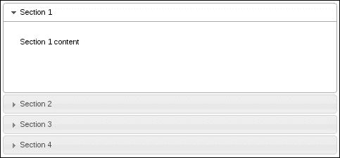
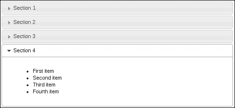
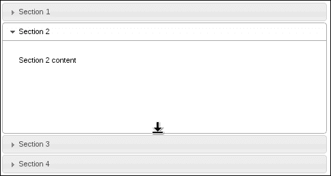
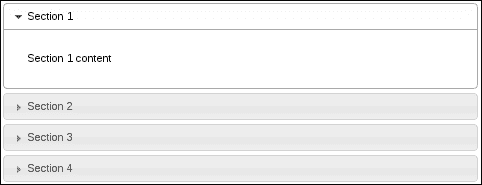
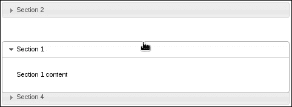
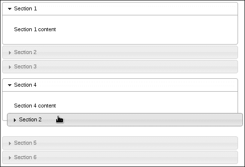

# 第一章：创建手风琴

在本章中，我们将涵盖以下配方：

+   使用 Tab 键进行部分导航

+   动态更改高度样式

+   可调整大小的内容部分

+   使用主题控制间距

+   排序手风琴部分

+   在手风琴之间进行拖放

# 介绍

在本章中，我们将探讨多种方法，以扩展**手风琴**小部件，以适应多种情况。手风琴小部件提供了很多开箱即用的功能。例如，没有任何配置，我们就得到了一个主题化的容器小部件，将内容分组到部分中。

我们将专注于揭示手风琴小部件内部工作原理的用例。键盘事件是导航页面的一种方式，我们可以增强手风琴对这些事件的支持。在展开时，每个部分的高度会发生一些神奇的变化。我们将看到我们如何处理这些配置，特别是当部分高度在飞行中改变时。

此外，在高度方面，我们可以让用户控制各个部分的高度，或者从主题的角度来看，我们可以控制手风琴组件之间的空间。最后，我们将看一些更高级的手风琴用法，其中我们让用户自由地对手风琴部分进行排序，并将部分从一个手风琴拖到另一个手风琴中。

# 使用 Tab 键进行部分导航

在大多数桌面环境中，*Tab* 键是导航中的秘密武器——许多用户习惯使用的一个工具。同样，我们可以使用 `tabindex` 属性在 HTML5 应用程序中利用 *Tab* 键。这告诉浏览器每次按下该键时焦点元素的顺序。

不幸的是，使用手风琴小部件并不像看起来那么简单。我们不能在每个部分标题中指定 `tabindex` 值，并期望 *Tab* 键事件按预期工作。相反，默认小部件实现提供了一种不同类型的键导航——*上* 和 *下* 箭头键。理想情况下，给用户使用他们熟悉的 *Tab* 键通过手风琴部分导航的能力是有用的，同时保留小部件提供的默认键导航。

## 准备工作

要开始，我们需要一个基本的手风琴；理想情况下，是一些简单的内容，每个部分都有基本的内容，这样我们就可以在实现自定义事件之前和之后直观地看到 *Tab* 键的行为如何工作。

作为指南，这是我的基本手风琴标记：

```js
<div id="accordion">
    <h3>Section 1</h3>
    <div>
        <p>Section 1 content</p>
    </div>
    <h3>Section 2</h3>
    <div>
        <p>Section 2 content</p>
    </div>
    <h3>Section 3</h3>
    <div>
        <p>Section 3 content</p>
    </div>
    <h3>Section 4</h3>
    <div>
        <p>Section 4 content</p>
    </div>
</div>
```

并且，这是用于实例化手风琴小部件的代码：

```js
$(function() {

    $( "#accordion" ).accordion({
        collapsible: true
    });

});
```

### 提示

**下载示例代码**

您可以从您在[`www.packtpub.com`](http://www.packtpub.com)的帐户中下载您购买的所有 Packt 图书的示例代码文件。如果您在其他地方购买了此书，您可以访问[`www.packtpub.com/support`](http://www.packtpub.com/support)并注册以直接将文件发送到您的电子邮件。

现在我们有一个基本的可折叠手风琴小部件，我们可以在浏览器中查看。我们在这里添加`collapsible`选项的原因是为了可以实验按键导航——当所有部分都折叠时，我们可以更好地看到哪个部分处于焦点状态。您可以看到*up*和*down*箭头键允许用户遍历手风琴部分，而*Tab*键没有任何效果。让我们改变一下。

## 如何做...

我们将扩展手风琴小部件以包括一个`keypress`事件的事件处理程序。默认的手风琴实现有处理*up*、*down*、*left*、*right*和*Enter*键的`keypress`事件。我们不需要改变这一点。相反，我们添加了一个理解当按下*Tab*键和*Shift* + *Tab*键时该做什么的自定义处理程序。

看一下以下代码：

```js
(function( $, undefined ) {

$.widget( "ab.accordion", $.ui.accordion, {

    _create: function () {

        this._super( "_create" );
        this._on( this.headers, { keydown: "_tabkeydown" } );

    },

    _tabkeydown: function ( event ) {

        if ( event.altKey || event.ctrlKey ) {
            return;
         }

        if ( event.keyCode !== $.ui.keyCode.TAB ) {
            return;
        }

        var headers = this.headers,
            headerLength = headers.length,
            headerIndex = headers.index( event.target ),
            toFocus = false;

        if ( event.shiftKey && headerIndex - 1 >= 0 ) {
            toFocus = headers[ headerIndex - 1 ];
        }

        if ( !event.shiftKey && headerIndex + 1 < headerLength ) {
            toFocus = headers[ headerIndex + 1 ];
        }

        if ( toFocus ) {

            $( event.target ).attr( "tabIndex", -1 );
            $( toFocus ).attr( "tabIndex", 0 );
            toFocus.focus();
            event.preventDefault();

        }

    }

});

})( jQuery );

$(function() {

    $( "#accordion" ).accordion({
        collapsible: true
    });

});
```

## 它是如何工作的...

我们在这里通过扩展默认的手风琴小部件来创建一个新的手风琴小部件。扩展手风琴小部件的优势在于我们不会去修改小部件的实例；所有手风琴实例都将获得这种新的行为。

`_create()`方法被我们的新实现所取代。在这个替代方法中，我们首先调用原始的`_create()`方法。我们不想阻止手风琴小部件的默认设置操作发生。因此，使用`_super()`我们能够做到这一点。接下来我们绑定了我们的新的`tabkeydown()`事件处理程序到`keydown`事件上。

`tabkeydown()`处理程序是原始手风琴实现中提供的`keydown`事件处理程序的简化版本。如果*Alt*或*Ctrl*键与其他键组合按下，则我们忽略事件。如果按下的键不是*Tab*，我们也会忽略事件，因为我们只对当手风琴标题处于焦点时改变*Tab*键行为感兴趣。

处理程序的要点在于确定*Tab*键按下时应该发生什么。我们应该将手风琴标题焦点移动到哪个方向？何时忽略事件并让默认浏览器行为接管？诀窍在于确定我们当前的索引位置。如果我们在第一个标题上，并且用户按下*Shift* + *Tab*，意味着他们想向后遍历，则我们不做任何操作。同样，如果我们在最后一个标题上，并且用户按下*Tab*，我们将控制权交给浏览器，以便不干扰预期功能。

# 动态改变高度样式

手风琴是用于组织和显示其他 UI 元素的容器。将每个手风琴部分视为静态内容是一个错误。手风琴部分的内容确实会发生变化。例如，用户触发的事件可能会导致在部分内创建新元素。很可能，部分内的组件会动态改变大小，这是我们需要注意的部分。为什么关注手风琴内容变化大小很重要？因为这是一个手风琴，我们可能会有几个部分（或至少有一些）。让它们都具有统一的高度有意义吗？在某个部分的高度增加到非常大的程度时，它就不再具有统一的高度了。当发生这种情况时，我们需要查看手风琴部分高度的变化，并在必要时动态调整一些高度设置。

## 准备就绪

让我们使用以下标记创建手风琴小部件：

```js
<div id="accordion">
    <h3>Section 1</h3>
    <div>
        <p>Section 1 content</p>
    </div>
    <h3>Section 2</h3>
    <div>
        <p>Section 2 content</p>
    </div>
    <h3>Section 3</h3>
    <div>
        <p>Section 3 content</p>
    </div>
    <h3>Section 4</h3>
     <div>
        <ul>
            <li>First item</li>
            <li>Second item</li>
            <li>Third item</li>
            <li>Fourth item</li>
        </ul>
     </div>
</div>
```

我们将使用所有默认选项值创建手风琴如下：

```js
$(function() {
    $("#accordion").accordion();
});
```

现在，我们会注意到一个关于高度的轻微不一致性。以下是第一部分的样子。它内容很少，但却使用了比所需更多的空间。



这是由于`heightStyle`选项的默认值造成的，该选项规定手风琴中每个部分的高度将等于最高部分的高度。因此，我们在第一部分浪费了空间。让我们看看以下屏幕截图中的第四部分，以了解为什么会发生这种情况：



我们可以看到，第一部分与第四部分一样高。这是由于`heightStyle`的`auto`值造成的。在这个特定的例子中，差异并不是那么大。也就是说，第一部分没有浪费太多的空白空间。因此，保持每个部分具有相同高度的手风琴配置可能是有意义的。

当我们处理动态向特定手风琴部分提供内容的应用程序时，挑战就出现了，在某个临界点达到时，保持自动`heightStyle`配置就不再有意义了。

## 如何做...

将`heightStyle`设置为`auto`可以为我们解决问题，因为每个部分只会使用必要的高度来显示内容。但是，如果能够在内容自身的高度发生变化时更改手风琴的此属性，那就更好了。

```js
(function( $, undefined ) {

$.widget( "ab.accordion", $.ui.accordion, {

    refresh: function() {

        this._super( "refresh" );

        if ( this.options.heightStyle !== "content" ) {
            return;
        }

        this.headers.next().each( function() {

            if ( $( this ).css( "height" ) ) {
                $( this ).css( "height", "" );
            }

        });

    }

});

})(jQuery);

$(function() {

    $( "#accordion" ).accordion();

    for ( var i=0; i<20; i++ ){
        $( "ul" ).append( "<li>nth item</li>" );
    }

    $( "#accordion" ).accordion( "option", "heightStyle", "content" )
                     .accordion( "refresh" );

});
```

## 它是如何工作的...

我们在这里所做的是扩展手风琴小部件的`refresh()`方法，以允许在运行时将`heightStyle`选项更改为内容。默认实现不允许此操作。为了说明这个想法，请考虑上面的代码，我们正在创建手风琴小部件，并向最后一个内容部分添加 20 个新项。我们在这里使用的是默认部分高度，即`auto`。因此，如果我们没有扩展`refresh()`方法来允许此行为在填充第四部分后，我们会看到一个滚动条。

# 可调整大小的内容部分

可调整大小的内容部分允许用户通过拖动部分底部来调整高度。这是一种很好的选择，而不是依赖于`heightStyle`属性。因此，如果手风琴的每个部分都可以由用户调整，则他们可以自由地定制手风琴布局。例如，如果手风琴有一个高的部分，在底部浪费了空间，用户可能会选择缩小该部分的高度，以更好地查看手风琴以及 UI 的其他组件。

## 如何操作...

我们将通过使用可调整大小的交互小部件使手风琴内的每个内容的`div`可调整大小来扩展默认手风琴的`_create()`方法。

```js
( function( $, undefined ) {

$.widget( "ab.accordion", $.ui.accordion, {

    _create: function () {

        this._super( "_create" );

        this.headers.next()
                    .resizable( { handles: "s" } )
                    .css( "overflow", "hidden" );

    },

    _destroy: function () {

        this._super( "_destroy" );

        this.headers.next()
                    .resizable( "destroy" )
                    .css( "overflow", "" );

    }

});

})( jQuery );

$( function() {

    $( "#accordion" ).accordion();

});
```

您将看到类似以下的内容。请注意，第二节已被向下拖动，并带有调整大小的鼠标光标。



## 工作原理...

我们的`_create()`方法的新版本首先调用默认手风琴的`_create()`方法。完成后，我们找到手风琴的所有内容部分，并应用`resizable()`小部件。您还会注意到，我们告诉可调整大小的小部件仅显示一个`south`手柄。这意味着用户只能使用部分底部的光标将手风琴的任何给定内容部分向上或向下拖动。

这个手风琴的特殊化还提供了一个新的`_delete()`方法的实现。再次，我们在调用原始手风琴的`_delete()`之后，清理我们添加的新可调整大小组件。这包括删除`overflow`CSS 属性。

## 还有更多...

我们可以通过提供关闭它的手段来扩展手风琴中的可调整大小行为。我们将在手风琴中添加一个简单的`resizable`选项，用于检查是否使手风琴部分可调整大小。

```js
(function( $, undefined ) {

$.widget( "ab.accordion", $.ui.accordion, {

    options: {
        resizable: true
    },

    _create: function () {

        this._super( "_create" );

        if ( !this.options.resizable ) {
            return;
        }

        this.headers.next()
                    .resizable( { handles: "s" } )
                    .css( "overflow", "hidden" );
    },

    _destroy: function () {

        this._super( "_destroy" );

        if ( !this.options.resizable ) {
            return;
        }

        this.headers.next()
                    .resizable( "destroy" )
                    .css( "overflow", "" );

    },

});

})( jQuery );

$(function() {

    $( "#accordion" ).accordion( { resizable: false } );

});
```

# 使用主题控制间距

手风琴部分之间的间距由 CSS 主题框架控制。特别是，手风琴的视觉结构由一组 CSS 规则定义，可以修改以控制手风琴部分之间的间距。我们可以覆盖手风琴主题 CSS 以调整部分之间的间距。

## 如何操作...

我们将为我们的 UI 提供一个额外的 CSS 模块，它将覆盖我们目前正在使用的主题中提供的手风琴结构。然而，无需担心，我们的更改很简单。我们将更新`margin-top`属性。在一个名为`theme.accordion.css`的新 CSS 文件中，让我们添加以下样式规则：

```js
.ui-accordion .ui-accordion-header {
    margin-top: 4px;
}
```

现在我们有了 CSS，我们需要将其包含在我们的 HTML 头部。它应该类似于这样：



## 工作原理...

我们复制了与任何 jQuery UI 主题中找到的相同的 CSS 选择器。我们刚刚更改的特定属性改变了手风琴部分之间的间距。由于我们覆盖了默认主题值，所以将我们的 CSS 文件包含在默认主题文件之后非常重要。这样我们就可以覆盖默认主题，而不是默认主题覆盖我们的修改。

# 对手风琴部分进行排序

使用可排序交互式小部件，我们能够将静态手风琴部分布局转换为用户指定的内容。也就是说，可排序交互式小部件接受一个容器元素，并允许对所有子元素进行就地排序。用户通过将元素拖动到所需顺序来执行此操作。

我们将看看如何扩展手风琴功能，以便在创建时可以通过配置选项打开可排序部分功能。

## 操作步骤...

当手风琴小部件创建时，以及销毁手风琴时，我们必须执行几个操作。以下是我们如何扩展小部件的方式：

```js
( function( $, undefined ) {

$.widget( "ab.accordion", $.ui.accordion, {

    options: {
        sortable: false
    },

    _create: function () {

        this._super( "_create" );

        if ( !this.options.sortable ) {
            return;
        }

        this.headers.each( function() {
            $( this ).next()
                     .addBack()
                     .wrapAll( "<div/>" );
        });

        this.element.sortable({
            axis: "y",
            handle: "h3",
            stop: function( event, ui ) {
                ui.item.children( "h3" )
                       .triggerHandler( "focusout" );
            }
        });        

    },

    _destroy: function () {

        if ( !this.options.sortable ) {
            this._super( "_destroy" );
            return;
        }

        this.element.sortable( "destroy" );

        this.headers.each( function () {
            $( this ).unwrap( "<div/>" );
        });

        this._super( "_destroy" );

    }

});

})( jQuery );

$( function() {

    $( "#accordion" ).accordion( { sortable: true } );

});
```

有了我们新的标记为`sortable`的手风琴小部件，用户现在可以在手风琴内拖动头部部分。例如，如果第一个手风琴部分属于底部，用户只需将其拖到底部。



## 工作原理...

借助`sortable()`交互式小部件的帮助，我们能够扩展默认手风琴小部件实现，以包括排序功能。与任何 jQuery UI 小部件增强一样，我们实际上不需要扩展所讨论的小部件；新功能始终可以在小部件实例化后附加。然而，正如您将在本书中看到的，最佳实践是封装自定义内容并将其作为一组选项呈现给小部件客户端。

我们在此扩展了可用的手风琴选项集，包括一个`sortable`选项。这是我们打开或关闭自定义的方式（它是一个布尔值）。我们实现的自定义`_create()`版本将调用手风琴的`_create()`方法的默认版本。之后，我们将查看可排序行为是否被关闭（在这种情况下我们无需做任何事情，所以返回）。同样，我们的自定义`_delete()`函数在调用原始删除功能后检查可排序行为是否已打开。

实现可排序手风琴部分的棘手部分在于我们必须在手风琴元素内进行轻微的 DOM 操作。这是为了使用可排序交互小部件所必需的。手风琴小部件的标记结构化，使得所有部分都相邻。也就是说，我们有一个 `h3` 元素，后面跟着一个 `div` 元素。这是一个部分，并且后面跟着另一个 `h3` 和另一个 `div`，依此类推。这是一个平面结构。有两种处理方式：修改创建小部件所需的标记，或者注入一些轻微的 DOM 修改，并且小部件客户端对此一无所知。我们选择后一种方式，不要求客户端更改其代码。这是另一个最佳实践，即在提供定制时保持现有小部件客户端代码的功能性。

在我们定制的 `_create()` 版本中，我们正在迭代每个手风琴标题，并将标题元素和相应的内容元素包装在一个 `div` 元素中，以便将它们捆绑在一起。这样，可排序小部件就知道如何移动这个捆绑包了。如果我们没有这样做，用户只能移动标题部分，从而将其与内容分开。最后，我们正在创建可排序小部件，将移动限制为*y*轴，并将可移动手柄设置为手风琴标题。

我们定制的 `_destroy()` 函数在调用原始的 `_destroy()` 方法之前撤消我们的修改。这意味着取消包装我们的新 `div` 元素并销毁可排序小部件。

# 在手风琴之间拖放

一些应用程序需要比其他更流畅的布局，不仅从屏幕分辨率的角度来看，而且从功能的角度来看也是如此。手风琴小部件是一个静态分组组件，用于将较小的组件组织成部分。我们只需展开感兴趣的部分，就可以隐藏所有不相关的材料。正如我们在*排序手风琴部分*的示例中看到的那样，我们可以提供一个手风琴，用户可以通过拖放来操作其结构。实际上，这已经成为用户大规模预期的事情——通过拖放进行 UI 配置。

可排序手风琴专注于单个手风琴。当然，在应用程序的范围内给予用户自由的精神下，我们为什么不试着看看我们是否能支持将手风琴部分移动到一个新的手风琴中呢？

## 准备就绪

对于这个实验，我们需要两个基本的手风琴。标记应该假设如下所示的形式：

```js
<div id="target-accordion" style="width: 30%">
    <h3>Section 1</h3>
    <div>
        <p>Section 1 content</p>
    </div>
    <h3>Section 2</h3>
    <div>
        <p>Section 2 content</p>
    </div>
    <h3>Section 3</h3>
    <div>
        <p>Section 3 content</p>
    </div>
</div>
<p></p>
<div id="accept-accordion" style="width: 30%">
    <h3>Section 4</h3>
    <div>
        <p>Section 4 content</p>
    </div>
    <h3>Section 5</h3>
    <div>
        <p>Section 5 content</p>
    </div>
    <h3>Section 6</h3>
    <div>
        <p>Section 6 content</p>
    </div>
</div>
```

## 如何做...

有了这个，让我们将这个标记转换为两个手风琴。我们首先将手风琴小部件扩展为带有一些花哨的拖放行为。意图是允许用户将第一个小部件的手风琴部分拖到第二个小部件中。下面是具体操作：

```js
(function( $, undefined ) {

$.widget( "ui.accordion", $.ui.accordion, {

    options: {
         target: false,
         accept: false,
         header: "> h3, > div > h3"
    },

    _teardownEvents: function( event ) {

        var self = this,
            events = {};

        if ( !event ) {
            return;
        }

        $.each( event.split(" "), function( index, eventName ) {
            self._off( self.headers, eventName );
        });

    },

    _createTarget: function() {

        var self = this,
            draggableOptions = {
                handle: "h3",
                helper: "clone",
                connectToSortable: this.options.target,
            };

        this.headers.each( function() {
            $( this ).next()
                     .addBack()
                     .wrapAll( "<div/>" )
                     .parent()
                     .draggable( draggableOptions );
        });
    },

    _createAccept: function() {

        var self = this,
            options = self.options,
            target = $( options.accept ).data( "uiAccordion" );

        var sortableOptions = {

            stop: function ( event, ui ) {

                var dropped       = $(ui.item),
                    droppedHeader = dropped.find("> h3"),
                    droppedClass  = "ui-draggable",
                    droppedId;

                if ( !dropped.hasClass( droppedClass ) ) {
                    return;
                }

                // Get the original section ID, reset the cloned ID.
                droppedId = droppedHeader.attr( "id" );
                droppedHeader.attr( "id", "" );

                // Include dropped item in headers
                self.headers = self.element.find( options.header )

                // Remove old event handlers
                self._off( self.headers, "keydown" );
                self._off( self.headers.next(), "keydown" );
                self._teardownEvents( options.event );

                // Setup new event handlers, including dropped item.
                self._hoverable( droppedHeader );
                self._focusable( droppedHeader );
                self._on( self.headers, { keydown: "_keydown" } );
                self._on( self.headers.next(), { keydown: "_panelKeyDown" } );
                self._setupEvents( options.event );
```

```js
                // Perform cleanup
                $( "#" + droppedId ).parent().fadeOut( "slow", function() {
                    $( this ).remove();
                    target.refresh();
                });

                dropped.removeClass( droppedClass );

            }

        };

        this.headers.each( function() {
            $(this).next()
                   .addBack()
                   .wrapAll( "<div/>" );
        });

        this.element.sortable( sortableOptions );

    },

    _create: function() {

        this._super( "_create" );

        if ( this.options.target ) {
            this._createTarget();
        }

        if ( this.options.accept ) {
            this._createAccept();
        }

    },

    _destroy: function() {

        this._super( "_destroy" );

        if ( this.options.target || this.options.accept ) {

            this.headers.each( function() {
                $( this ).next()
                         .addBack()
                         .unwrap( "<div/>" );
            });
        }
    }

});

})( jQuery );

$(function() {

    $( "#target-accordion" ).accordion({
        target: "#accept-accordion"
    });

    $( "#accept-accordion" ).accordion({
        accept: "#target-accordion" 
    });

});
```

现在我们有了两个看起来基本的手风琴小部件。然而，如果用户愿意，他们可以将第一个手风琴的部分拖到第二个手风琴中。



## 它是如何运作的......

乍一看，这可能看起来是很多的代码，但是只需要很少的工作（约 130 行左右），我们就能够将手风琴部分从一个手风琴拖放到另一个手风琴。让我们进一步解析一下。

我们通过这个小部件扩展添加了两个手风琴选项：`target` 和 `accept`。目标允许我们指定手风琴的部分目的地。在这个例子中，我们将第二个手风琴作为第一个手风琴的目标，这意味着我们可以从`target-accordion`拖放到`accept-accordion`。但是，为了实现这一点，必须告诉第二个手风琴从哪里接受部分；在这种情况下，它是`target-accordion`。我们基本上使用这两个选项在两个小部件之间建立拖放合同。

这个例子使用了两个交互式小部件：draggable 和 sortable。`target-accordion`使用了 draggable。如果指定了`target`选项，将调用`_createTarget()`方法。`_createTarget()`方法将浏览手风琴部分，将它们包装在`div`元素中，并创建一个`draggable()`小部件。这就是我们能够从第一个手风琴拖动部分的方法。

如果指定了`accept`选项，将调用`_createAccept()`方法。这遵循将每个手风琴标题与其内容包装在`div`元素中的相同模式。但在这里，我们使整个手风琴小部件`sortable()`。

这可能看起来反直觉。为什么我们要使希望接受新部分的第二个手风琴可排序？使用 droppable 不是更合理吗？我们可以选择这条路线，但这将涉及大量使用`connectToSortable`选项的工作。这是在`_createTarget()`中指定的`draggable`选项，我们在其中说我们想把这些可拖动的项放到一个可排序的小部件中。在这个例子中，可排序的是第二个手风琴。

这解决了关于相对于其他部分在哪里放置手风琴部分的问题（可排序小部件知道如何处理）。然而，在这种方法中的一个有趣的约束是，我们必须克隆拖动的项目。也就是说，最终被放置到新手风琴中的部分只是一个克隆，而不是原件。因此，我们必须在放置时处理这个问题。

在`_createAccept()`中定义的排序选项的一部分，我们提供了一个`stop`回调。当我们将新的手风琴部分放入手风琴时，将触发这个回调函数。实际上，这对于任何排序活动都会触发，包括新的部分被放置。因此，我们必须小心检查我们实际上正在处理什么。我们通过检查项目是否附有`draggable`类来做到这一点，如果是，我们可以假设我们正在处理一个新的手风琴部分。

请记住，这个新添加的折叠菜单部分只是原始部分的克隆，因此在我们开始将其插入折叠菜单之前，需要发生一些有趣的事情。首先，这个新部分具有与原始部分相同的 ID。最终，我们将从第一个折叠菜单中删除原始部分，因此我们存储了该 ID 以供以后使用。一旦我们获得了它，我们就可以摆脱被删除部分的 ID，以避免重复。

确保完成这一步之后，我们已经在适当的位置放置了新的 DOM 元素，但是折叠菜单部件对此一无所知。这就是我们重新加载标题的地方，包括新添加的标题。新的折叠菜单部分仍然不可用，因为它没有正确处理事件，所以，例如，展开新部分将不起作用。为了避免奇怪的行为，我们关闭所有事件处理程序并重新绑定它们。这样就将新的折叠菜单放在了新的上下文中，而事件则保持开启状态。

现在，我们在 `accept-accordion` 中有了一个新的部分。但是我们不能忘记原来的部分。它仍然需要被移除。回想一下，我们存储了原始部分的 DOM ID，现在我们可以安全地移除该部分并刷新折叠菜单以调整高度。
