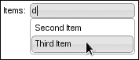
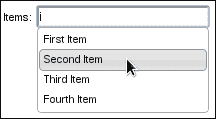
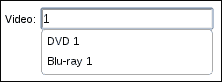
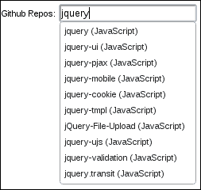
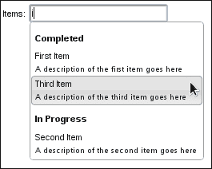

# 第二章：包括自动完成

在本章中，我们将涵盖:

+   用主题样式化默认输入

+   使用选择选项构建数据源

+   使用多个数据源

+   远程自动完成过滤

+   自定义数据和分类

+   将效果应用于下拉菜单

# 介绍

**自动完成**小部件的主要目的是增强标准 HTML 表单`input`元素的功能。用户不必每次输入字段的完整值，自动完成小部件会提供可能的值作为建议。例如，假设您正在添加一个新产品。产品字段可以是文本输入、选择输入等等。在这种情况下，一个人会使用系统中现有的产品作为自动完成小部件的来源。很有可能，输入产品的用户，或者其他用户，之前已经输入过该产品。通过自动完成，用户可以确保他们提供的是有效的输入。

# 用主题样式化默认输入

默认的自动完成实现不会改变输入元素的任何视觉效果。从功能上讲，我们不希望更改输入元素。我们只需要在用户开始输入时出现下拉组件。但让我们看看是否可以使用小部件框架和主题框架中的组件改变自动完成输入元素的虚拟外观。

## 准备工作

我们将使用以下标记作为我们的示例，一个简单的`label`元素和一个简单的`input`元素：

```js
<div>
    <label for="autocomplete">Items: </label>
    <input id="autocomplete"/>
</div>
```

## 如何做...

我们将使用以下代码使用主题框架中的 CSS 类来扩展自动完成小部件。我们正在引入一个关于焦点事件的微小行为调整。

```js
( function( $, undefined ) {

$.widget( "ab.autocomplete", $.ui.autocomplete, {

    inputClasses: "ui-widget ui-widget-content ui-corner-all",

    _create: function() {

        this._super( "_create" );
        this._focusable( this.element );
        this.element.addClass( this.inputClasses );

    },

    _destroy: function() {

        this._super( "_destroy" );
        this.element.removeClass( this.inputClasses );

    }

});

})( jQuery );

$( function() {

    var source = [
        'First Item',
        'Second Item',
        'Third Item',
        'Fourth Item'
    ];

    $( "#autocomplete" ).autocomplete( { source: source } );

});
```

完成我们自动完成`input`元素的样式要求的最后一件事是使用一些规则的新 CSS 样式表。样式表应该在定义输入标记的主 HTML 中包含。

```js
input.ui-autocomplete-input {
    padding: 2px;
}

input.ui-autocomplete-input:focus {
    outline: none;
}
```

这是我们新样式的自动完成小部件在没有焦点时的样子。


这是自动完成在有焦点时的样子，并且下拉菜单已展开。



## 它是如何工作的...

文档加载时，我们正在创建一个简单的自动完成使用`#autocomplete` 输入元素。

你会注意到的第一件事是`inputClasses`属性。这个字符串代表了我们想要应用到小部件的主题框架的三个类：`ui-widget`、`ui-widget-content` 和 `ui-corner-all`。`ui-widget`类除了处理字体外并没有太多作用，将这个类应用到主题化的元素是一个好的做法。 `ui-widget-content` 类为我们修复了输入的边框，而 `ui-corner-all` 类为我们应用了漂亮的圆角。我们将这个字符串定义为小部件的属性的原因是因为这些类在两个地方使用，这样易于维护。

我们在这里覆盖的`_create()`方法只是调用了自动完成的`_create()`方法的原始实现。一旦这完成，我们通过调用`_focusable()`使`input`元素可聚焦。这是小部件工厂定义的一个方便的实用方法，并且被所有小部件继承。它通过在元素聚焦时从主题框架中应用`ui-state-focus`CSS 类来处理使元素可聚焦。当元素失去焦点时，它也会移除类。也许，`_focusable()`最好的部分是小部件工厂机制将在小部件销毁时清理任何焦点事件处理程序。我们自定义的`_create()`实现的最后一个任务是将`inputClasses`的 CSS 类添加到输入元素中。

一如既往，当我们从自动完成小部件中借用完成后，我们需要确保清理干净。这意味着扩展`_delete()`以确保从输入元素中删除`inputClasses`属性。

我们使用的微小 CSS 规则有两个作用。第一个改变是给`input`元素添加一点填充——这纯粹是出于美观考虑，因为我们做的其他改变使得文本在输入框中显得有点紧凑。第二个改变是在焦点集中时删除围绕`input`元素的轮廓。这仅适用于某些浏览器，如 Chrome，在其中会自动应用轮廓。

### 注意

通常，不建议移除轮廓，因为这会影响可访问性。但是，我们的改动已经考虑到了焦点输入，所以这样做是可以的。

# 使用选择选项构建数据源

有时，将数组用作自动完成小部件的数据源并不是最佳选择。例如，如果我们的用户界面中已经有一个`select`元素，那么重用该元素中的选项来创建自动完成会是个明智的选择。否则，我们不仅需要设计一些新代码来构建数组数据源，还需要删除现有的`select`元素。

## 准备工作

让我们为这个例子编写一些基本的标记。通常，自动完成小部件期望一个`input`作为其元素。相反，我们将给它一个带有一些简单选项的`select`元素。

```js
<div>
    <label for="autocomplete">Items: </label>
    <select id="autocomplete">
        <option>First Item</option>
        <option>Second Item</option>
        <option>Third Item</option>
        <option>Fourth Item</option>
    </select>
</div>
```

## 操作步骤...

我们将扩展自动完成小部件的功能，使其知道如何处理`select`元素。之后，我们就能够使用自动完成小部件来定位我们的`select`元素了。

```js
( function( $, undefined ) {

$.widget( "ab.autocomplete", $.ui.autocomplete, {

    inputClasses: "ui-widget ui-widget-content ui-corner-all",

    _create: function() {

        if ( this.element.is( "select" ) ) {

            var self = this;
            this.original = this.element.hide();
            this.element = $( "<input/>" ).insertAfter( this.original );

            this.options.source = function( request, response ) {

                var filter = $.ui.autocomplete.filter,
                    options = self.original.find( "option" ),
                    result = options.map( function() {
                        return $( this ).val();
                    });

                response( filter( result, request.term ) );

            };

        }

        this._super( "_create" );

    },

    _destroy: function() {

        this._super( "_destroy" );
        this.element.remove();
        this.original.show();

    }

});

})( jQuery );

$( function() {
    $( "#autocomplete" ).autocomplete();
});
```

现在你应该看到的是一个看起来像是普通的自动完成——看不到`select`元素。此外，如果你尝试使用自动完成，你会发现呈现的选项与`select`元素的选项相同。



## 工作原理...

在这里，我们需要为 `select` 元素添加对自动完成小部件的支持；我们在自定义的 `_create()` 实现的开始时执行此操作。如果我们处理的是 `select` 元素，则我们要做的第一件事是隐藏它并将其引用存储在 `original` 属性中。记住，我们只对 `select` 元素通过其 `options` 提供的数据源感兴趣 - 我们不希望实际显示 `select`。相反，我们将 `select` 替换为一个 `input` 元素，因为这是用户键入的方式，而小部件则完成。

自动完成小部件的 `source` 选项是我们能够指定返回要使用的源数据的自定义函数的方式。在我们的例子中，我们提供了一个函数，该函数从每个选择 `option` 获取值。回想一下，`select` 元素先前存储在 `original` 属性中。我们在这里使用 jQuery `map()` 实用程序函数将 `select` 选项转换为自动完成可以使用的数组。`filter()` 函数被应用，并且 `response()` 函数被发送到下拉菜单。

当小部件被销毁时，我们希望恢复原始的 `select` 元素，因为这是我们替换的元素。在我们自定义的 `_delete()` 实现中，原始元素再次显示 - 这是在调用原始的 `_delete()` 方法执行常规清理任务后发生的。我们创建的 `input` 元素也在这里销毁。

# 使用多个数据源

有时，自动完成小部件不直接映射到一个数据源。以视频为例。想象一下用户需要选择一个视频，但是两个数据源是 DVD 和蓝光。如果我们要使用自动完成选择视频，我们需要一种方法来分配多个数据源。此外，该机制需要足够灵活，以支持添加更多数据源，特别是因为每隔一年就会诞生一种新的视频格式。

## 怎么做...

自动完成小部件的默认实现期望一个单一的数据源 - 一个数组或一个 API 端点字符串。我们将给小部件添加一个新的 `sources` 选项来允许这种行为。这就是我们将扩展自动完成并创建一个具有两个视频数据源的小部件实例 - 一个用于 DVD，一个用于蓝光光盘。

```js
( function( $, undefined ) {

$.widget( "ab.autocomplete", $.ui.autocomplete, {

    options: { 
        sources: []    
    },

    _create: function() {

        var sources = this.options.sources;

        if ( sources.length ) {

            this.options.source = function ( request, response ) {

                var merged = [],
                    filter = $.ui.autocomplete.filter;

                $.each( sources, function ( index, value ) {
                    $.merge( merged, value );
                });

                response( filter( merged, request.term ) );

            };

        }

        this._super( "_create" );

    },

    _destroy: function() {
        this._super( "_destroy" );
    }

});

})( jQuery );

$( function() {
    var s1 = [
            "DVD 1",
            "DVD 2",
            "DVD 3"
        ],
        s2 = [
            "Blu-ray 1",
            "Blu-ray 2",
            "Blu-ray 3"
        ];

    $( "#autocomplete" ).autocomplete({
        sources: [s1, s2]
    });
});
```



如您所见，如果您开始搜索视频 `1`，您将在下拉菜单中从每个数据源获得版本。

## 工作原理...

我们不是在将我们的两个数据源合并到传递给自动完成之前，而是扩展了小部件的功能来处理这项任务。特别是，我们添加了一个新的 `sources` 选项，该选项可以接受多个数组。在示例中，我们将 DVD 和蓝光源都传递给我们的小部件。

我们的定制版本的`_create()`通过检查`sources`选项的长度来看是否已经提供了多个数据源。如果有多个数据源，我们使用`merge()`jQuery 实用函数创建一个新数组，并对其应用`filter()`函数。这种方法的一个很好的特点是它不在乎有多少个数据源——我们以后可以传递更多数据源到我们的实现中。这些数据源的合并被封装在小部件后面。

# 远程自动完成过滤

自动完成过滤功能并不仅限于默认实现，它搜索数组数据源中的对象。我们可以指定一个自定义`source()`函数，该函数将仅检索用户正在寻找的数据。如果您希望在包含数千个项目的数据源上使用自动完成，这是理想的方法。否则，在浏览器上过滤要求会变得过于苛刻——下载大型数据集，然后对每次按键进行大型数组搜索。

## 如何做...

我们将使用 GitHub API 作为自动完成小部件的数据源。这是一个很好的例子，因为它太大了，无法在浏览器内存中使用。

```js
$( function() {
  $( "#autocomplete" ).autocomplete({
        minLength: 3,
        source: function( request, response ) {
            $.ajax({
                url: "https://api.github.com/legacy/repos/search/:" + request.term,
                dataType: "jsonp",
                success: function( resp ) {
                    var repositories = resp.data.repositories.splice( 0, 10 );
                    var items = $.map( repositories, function ( item ) {
                        return { 
                            label: item.name + " (" + 
                                      item.language + ")",
                            value: item.name
                        };
                    });
                    response( items );
                }
            });
        }
    });
});
```

现在，如果您在浏览器中查看结果小部件并开始输入，您将在下拉菜单中看到 Github 仓库数据。



## 它是如何工作的...

由于我们使用了一个大型数据源，我们告诉这个特定的自动完成小部件，只有在至少有三个字符时才应执行项目的搜索。这是使用`minLength`选项来实现的。否则，我们将要求服务器基于一个或两个字符进行查询，这不是我们想要的。

在我们的示例中，`source`选项指定了我们将要使用的数据源——Github API。我们传递给`source`的函数执行了一个对 Github API 的`$.ajax()`调用。我们使用`jsonp`作为格式，这意味着 API 的回调函数将被发送回来。我们还向 API 传递了一些查询数据。

一旦 API 响应了数据，我们的成功回调函数就会执行。然后,我们通过`$.map()`实用程序函数将这些数据传递，以便生成自动完成小部件可以理解的数组。我们的成功函数对数据进行简单的`$.map()`，将其转换为自动完成可以使用的对象数组。

## 还有更多内容...

我们可以通过在小部件中引入术语缓存来进一步减少网络通信开销。**术语缓存**，顾名思义，会在本地存储执行远程过滤操作的结果。这样，当用户不可避免地在他们的按键中执行完全相同的操作时，我们不会再次执行相同的任务，并发出远程 API 调用,因为我们已经在小部件中缓存了结果。

```js
( function( $, undefined ) {

$.widget( "ab.autocomplete", $.ui.autocomplete, {

    _cache: {},

    _search: function( value ) {

        var response = this._response(),
            cache = this._cache;

    this.pending++;
    this.element.addClass( "ui-autocomplete-loading" );
    this.cancelSearch = false;

        if ( value in cache ) {
            response( cache[value] );
        }
        else {
            this.source( { term: value }, response );
        }

    }

});

})( jQuery );

$( function() {
  $( "#autocomplete" ).autocomplete({
        minLength: 3,
        source: function( request, response ) {
            var self = this;
            $.ajax({
                url: "https://api.github.com/legacy/repos/search/:" + request.term,
                dataType: "jsonp",
                success: function( resp ) {
                    var repositories = resp.data.repositories.splice( 0, 10 );
                    var items = $.map( repositories, function ( item ) {
                        return { 
                            label: item.name + " (" + 
                                      item.language + ")",
                            value: item.name
                        };
                    });
                    self._cache[request.term] = items;
                    response( items );
                }
            });
        }
    });
});
```

您可以在前面的代码中看到我们所做的更改以支持缓存从 HTTP 请求返回的项目。现在我们正在扩展小部件以添加新的 `_cache` 属性。我们还扩展了 `_search()` 函数，该函数负责检查缓存值。如果找到一个，就使用缓存版本的数据调用渲染响应。`source()` 函数负责存储缓存结果，但这只是一个简单的一行代码。

# 自定义数据和类别

分离两个自动完成数据类别的一种方法可能是拥有两个不同的字段，每个字段都有自己的自动完成小部件。另一种方法是在小部件本身引入类别的概念。当下拉菜单出现为用户建议项目时，他们还将看到项目所属的类别。要在自动完成小部件中执行此操作，我们需要更改小部件如何理解源数据以及如何呈现菜单项。

## 如何做...

我们将扩展自动完成小部件，以改变菜单项的渲染方式。我们还需要考虑传递给小部件的数据作为源。

```js
( function( $, undefined ) {

$.widget( "ab.autocomplete", $.ui.autocomplete, {

    _renderMenu: function( ul, items ) {

        var that = this,
            currentCategory = "";

        items.sort(function( a, b ) {
            return a.cat > b.cat 
        });

        $.each( items, function( index, item ) {

            if ( item.cat != currentCategory ) {
                that._renderCategory( ul, item );
                currentCategory = item.cat;
            }

            that._renderItemData( ul, item );

        });

    },

    _renderCategory: function( ul, item ) {
        return $( "<li>" ).addClass( "ui-autocomplete-category" )
                          .html( item.cat )                          
                          .appendTo( ul );
    },

    _renderItem: function( ul, item ) {
        return $( "<li>" ).addClass( "ui-autocomplete-item" )
                          .append( $( "<a>" )
                          .append( $( "<span>" ).html( item.label ) )
                          .append( $( "<span>" ).html( item.desc ) ) )
                          .appendTo( ul );
    }

});

})( jQuery );

$( function() {

    var items = [
        {
            value: "First Item",
            label: "First Item",
            desc: "A description of the first item goes here",
            cat: "Completed"
        },
        {
            value: "Second Item",
            label: "Second Item",
            desc: "A description of the second item goes here",
            cat: "In Progress"
        },
        {
            value: "Third Item",
            label: "Third Item",
            desc: "A description of the third item goes here",
            cat: "Completed"
        }
    ];

    $( "#autocomplete" ).autocomplete( {source: items} );

});
```

我们差不多完成了。我们对菜单所做的更改不会神奇地起作用，我们需要应用一些样式。以下 CSS 代码应包含在页面中：

```js
.ui-autocomplete-category {
    font-weight: bold;
    padding: .2em .4em;
    margin: .8em 0 .2em;
    line-height: 1.5;
}

.ui-autocomplete-item > a > span {
    display: block;
}

.ui-autocomplete-item > a > span + span {
    font-size: .9em;
}
```

现在，如果您开始在自动完成中输入，您会注意到下拉菜单与我们所习惯的大不相同，因为它包含类别和描述信息。



## 如何工作...

此小部件扩展的目标是接受自定义源数据并在下拉菜单的显示中使用该数据。具体而言，我们正在处理的新数据是类别和描述。类别是一对多关系，因此我们传递给小部件的几个项目可能具有相同的类别字符串。我们的工作是弄清楚任何给定类别下的项目，并在下拉菜单中表示此结构。此外，项目的描述是一对一关系，因此此处需要的工作较少，但我们仍然希望在下拉菜单中包含描述。

我们覆盖的原始实现的第一种方法是 `_renderMenu()`。`_renderMenu()` 的工作是每次向用户提出建议时更改底层 HTML 结构。我们使用 `currentCategory` 跟踪当前类别。然后我们使用 `_renderItem()` 渲染每个项目。

`_renderCategory()` 函数将类别文本呈现为 `<li>`。它还添加了 `ui-autocomplete-category` 类。同样，我们的 `_renderItem()` 函数呈现项目文本，并在这里我们还使用 `desc` 属性。项目还具有 `ui-autocomplete-item` 类。

我们在用户界面中包含的新 CSS 样式是我们创建的新版本自动完成功能的必要组成部分。没有它们，描述将与项目标签具有相同的字体大小并显示在同一行上。同样，类别需要新添加的样式以突出显示为其他项目分组的类别，而不仅仅是另一个项目。

## 还有更多...

每当我们扩展自动完成小部件使用的数据时，我们都必须告诉小部件如何使用它。在这里，我们告诉自动完成如何在下拉菜单中显示新数据。或者，我们可以告诉小部件在用户实际上从未在下拉菜单中看到的一些数据字段上执行过滤。或者我们可以将两者结合起来。

这是我们在用户开始输入时如何同时使用类别和描述两个非标准字段进行过滤的方法。

```js
$.ui.autocomplete.filter = function( array, term ) {

    var matcher = new RegExp( $.ui.autocomplete.escapeRegex( term ), "i" );

    return $.grep( array, function( value ) {
        return matcher.test( value.cat ) || 
               matcher.test( value.desc ) ||
               matcher.test( value.label )
    });

};
```

在这里，我们正在用我们自己的实现替换自动完成使用的`filter()`函数。这两者很相似，我们只是将`RegExp.test()`调用适应于`desc`和`cat`字段。我们将这段代码放在自动完成的自定义小部件声明的下方。之所以在自定义规范之外执行这些操作，是因为`autocomplete.filter()`有点像一个静态方法。在其他方法中，我们是根据每个实例进行覆盖。

# 对下拉菜单应用效果

默认情况下，我们得到一个相当简单的下拉菜单的呈现，其中包含基于我们输入的内容的建议。菜单只是简单地显示，没有太多的麻烦。这样做是可以的，它可以可靠地完成工作。但另一方面，我们总是可以做一些事情来使界面看起来更加精致。它可能只是将您应用程序中的自动完成小部件更改为在转换为可见状态时使用一些微妙的效果。

## 准备工作

由于我们这里追求的实际上更多是小部件的视觉呈现方面，我们可能可以安全地使用小部件的任何现有实例。

## 如何操作...

让我们在自动完成小部件的默认实现基础上增加一些微妙的动画效果。

```js
( function( $, undefined ) {

$.widget( "ab.autocomplete", $.ui.autocomplete, {

    _suggest: function( items ) {

        this._resetMenu();
        this._renderMenu( this.menu.element, items );
        this.menu.refresh();

        this._resizeMenu();
        this._positionMenu();

    },

    _resetMenu: function() {

        this.menu.element
                 .empty()
                 .zIndex( this.element.zIndex() + 1 );

    },

    _positionMenu: function() {

        var pos = $.extend( { of: this.element }, this.options.position );
        this.menu.element.position( pos );

    },

    _resizeMenu: function() {

        var menu = this.menu,
            exclude = 0;
            target = Math.max(
                menu.element.width( "" ).outerWidth() + 1,
                this.element.outerWidth()
            ),
            excludeCSS = [
                'borderLeftWidth',
                'borderRightWidth',
                'paddingLeft',
                'paddingRight'
            ];

        if( menu.element.is( ":hidden" ) ) {
            menu.element.css( { display: "block", opacity: 0 } );
        }

        $.each( excludeCSS , function( index, item ) {
            exclude += parseFloat( menu.element.css( item ) );
        });

        if ( menu.element.css( "opacity" ) == 0 ) {
            menu.element.animate({
                width: target - exclude,
                opacity: 1
            }, 300);
        }
        else{
            menu.element.width( target - exclude );
        }

    },

    _close: function( event ) {

        var menu = this.menu;

        if ( menu.element.is( ":visible" ) ) {

            menu.element.fadeOut();
            menu.blur();
            this.isNewMenu = true;
            this._trigger( "close", event );

        }

    }

});

})( jQuery );

$(function() {
    var source = [
        "First Item",
        "Second Item",
        "Third Item",
        "Fourth Item"
    ];
    $( "#autocomplete" ).autocomplete({
        source: source,
    });
});
```

如果您开始在输入元素中使用此自动完成小部件，您会注意到下拉菜单会平滑地滑入视图，而不是突然弹出。此外，当不再需要菜单时，它会渐渐消失。

## 工作原理...

在这里扩展自动完成功能，以便我们可以注入我们自定义的动画功能。但是这一次，变化要复杂一些，我们不仅仅是用几行代码扩展`_create()`。在自动完成代码中有一些深藏的方法需要我们扩展。我们还在自动完成小部件中引入了一些我们自己的新方法。

我们要覆盖的第一个方法是`_suggest()`。当用户键入了最小长度的字符以执行搜索时，自动完成小部件会调用`_suggest()`方法。原始方法负责渲染和显示下拉菜单的各个操作。在我们的方法版本中，我们只是调用小部件的其他方法。`_suggest()`方法的工作是协调搜索发生时发生的所有操作。这里有两个逻辑步骤。首先，使用新内容渲染菜单。接下来，显示、调整大小和定位菜单。后者是动画发生的地方。

我们不会深入讨论`_resetMenu()`和`_positionMenu()`方法的细节，因为这些代码片段大部分是从原始实现中取出的。它们只是分别清空并定位菜单。

`_resizeMenu()`方法是菜单显示时实际动画发生的地方。这是一个较长的方法，因为我们必须执行一些计算以传递给`animate()`。`_resizeMenu()`的原始实现使用`outerWidth()` jQuery 函数来设置菜单的宽度。这是为了与`input`元素正确对齐。然而，我们想要动画改变`width`。因此，我们必须手动计算内部宽度。外部宽度值放在排除变量中。内部宽度为`目标 - 排除`。

在实际显示菜单之前，我们会检查菜单是否已经显示，并在动画显示之前进行检查。如果元素不可见，我们会更改`display` CSS 属性，但将`opacity`属性设置为`0`。我们这样做的原因是我们需要元素的框模型尺寸以便定位它。但是，我们仍未将动画效果应用于菜单。在这里，我们检查菜单的`opacity`属性是否为`0`。如果不是，则表示菜单已经显示，现在重新对其进行动画化是没有意义的。否则，我们执行宽度和不透明度动画。

最后，`_close()`方法替换了原始的自动完成`_close()`实现。代码几乎与原始代码相同，只是在关闭菜单时我们做了一个基本的`fadeOut()`，而不是简单地隐藏它。

### 注意

这个自动完成功能的扩展并没有实现关闭此行为的选项。这没关系，因为这个扩展只做一件事情——对下拉菜单应用效果。因此，要禁用这些效果，我们只需禁用扩展。小部件的扩展是在调用自身的函数内定义的。当脚本首次加载时，会调用该函数，并使用新的行为对小部件进行扩展。我们可以禁用调用自身的函数的行为部分。

```js
(function( $, undefined ) {
    // Code that extends a jQuery UI widget...
}); //( jQuery );
```
