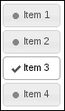
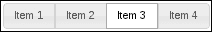
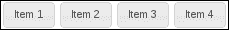
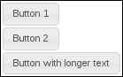
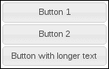
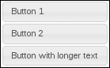
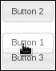
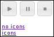
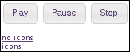
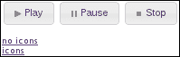

# 第三章：制作按钮

在本章中，我们将涵盖:

+   制作简单清单

+   控制按钮集内的间距

+   自动填充空间按钮

+   对组内按钮进行排序

+   使用按钮悬停状态的效果

+   按钮图标和隐藏文本

# 介绍

**按钮**小部件是装饰用户界面中的 HTML 按钮和链接元素的简便方法。通过对按钮小部件进行简单调用，我们能够使用 jQuery UI 中的主题框架装饰标准元素。此外，有两种类型的按钮。一种是单一的按钮概念，是更受欢迎的用例。但还有一个**按钮集**的概念——用于装饰典型 HTML 表单中的复选框和单选按钮的情况。

在本章中，我们将更仔细地查看按钮所包含的内容，通过示例涵盖一些使用场景。我们将从简单的用法开始，比如创建一个清单和排序按钮，到更高级的用法，比如应用效果和自动填充空间。沿途，你将了解到小部件框架如何支持开发人员在小部件不能完全满足他们需求时扩展按钮。

# 制作简单清单

在纯 HTML 中做清单非常简单，你真正需要的只是一些复选框和旁边的一些标签。然而，如果你使用诸如 jQuery UI 之类的小部件框架，我们可以轻松地增强该列表。按钮小部件知道在应用于`input`类型的`checkbox`元素时如何行为。因此，让我们从一个基本列表开始，看看我们如何将按钮小部件应用于`input`元素。我们还将看到我们是否可以通过一些状态和图标增强来进一步提高用户交互性。

## 准备工作

让我们从创建一个简单的 HTML `div` 开始来容纳我们的清单。在内部，每个项目由一个`input`元素表示，类型为`checkbox`，以及一个用于元素的`label`。

```js
<div>
    <input type="checkbox" id="first" />
    <label for="first">Item 1</label>
    <input type="checkbox" id="second" />
    <label for="second">Item 2</label>
    <input type="checkbox" id="third" />
    <label for="third">Item 3</label>
    <input type="checkbox" id="fourth" />
    <label for="fourth">Item 4</label>
</div>
```

有了这个标记，实际上我们已经拥有了一个可用的清单 UI，尽管不够可用。我们可以使用 jQuery UI 按钮小部件的切换功能将`label`和`checkbox`封装在一起作为清单项。

## 如何做...

我们将介绍以下 JavaScript 代码来收集我们的`checkbox`输入，并使用它们的`labels`来组装**切换按钮**小部件。

```js
$(function() {

    $( "input" ).button( { icons: { primary: "ui-icon-bullet" } } );

    $( "input" ).change( function( e ) {

        var button = $( this );

        if ( button.is( ":checked" ) ) {

            button.button( "option", {
                icons: { primary: "ui-icon-check" } 
            });

        }
        else {

            button.button( "option", {
                icons: { primary: "ui-icon-bullet" } 
            });

        }

    });

});
```

有了这个，你就有了一个切换按钮清单，完整的图标可辅助传达状态。当用户点击切换按钮时，它进入“开”状态，这通过背景颜色的变化和其他主题属性来表示。我们还添加了与按钮状态一起切换的图标。



## 工作原理...

我们的事件处理程序在 DOM 准备就绪时触发，只需要一行代码就可以将页面上的 `input` 元素转换为切换按钮。在按钮构造函数中，我们指定要使用的默认图标是主题框架中的 `ui-icon-bullet` 图标类。按钮小部件知道我们正在创建一个切换按钮，因为底层 HTML 元素。由于这些是复选框，所以当单击按钮时，小部件会更改其行为——在 `复选框` 的情况下，我们希望按钮看起来像切换打开和关闭一样。此外，按钮小部件根据 `for` 属性知道哪个 `label` 属于哪个按钮。例如，`for="first"` 的标签将分配给 `id="first"` 的按钮。

接下来，我们将 `change` 事件处理程序应用于所有按钮。此处理程序对于每个按钮都相同，因此我们可以一次绑定它们所有按钮。此处理程序的工作是更新按钮图标。我们不必更改按钮状态的任何其他内容，因为默认按钮实现将为我们完成。在我们的事件处理程序中，我们只需要检查 `复选框` 本身的状态。如果选中，则显示 `ui-icon-check` 图标。否则，我们显示 `ui-icon-bullet` 图标。

# 使用 buttonset 控制间距

jQuery UI 工具包为开发人员提供了一个用于处理按钮组的容器小部件，称为**buttonset**。您可以将 buttonset 用于诸如复选框组或单选按钮组之类的东西——形成一个协同集合的东西。

buttonset 的默认外观是统一整体的。也就是说，目标是将几个按钮形成一个看似单一的小部件。默认情况下，buttonset 小部件对于开发人员没有间距控制。默认情况下，集合中的按钮都紧靠在一起。这可能不是我们想要的，这取决于 buttonset 小部件在整个用户界面中的上下文。

## 准备就绪

为了更好地说明我们所面临的间距约束，让我们构建一个按钮集小部件，然后再尝试解决这个问题之前看一下结果。我们将使用以下一组单选按钮作为我们的标记：

```js
<div>
    <input type="radio" id="first" name="items" />
    <label for="first">Item 1</label>
    <input type="radio" id="second" name="items" />
    <label for="second">Item 2</label>
    <input type="radio" id="third" name="items" />
    <label for="third">Item 3</label>
    <input type="radio" id="fourth" name="items"/>
    <label for="fourth">Item 4</label>
</div>
```

我们将按如下方式创建 buttonset 小部件：

```js
$(function() {
    $( "div" ).buttonset();
});
```

这是我们的 buttonset 的外观。请注意，此小部件仍然具有单选按钮功能。这里选择了第三个项目，但如果我在小部件中点击其他位置，它将变为未选中状态。



## 如何做...

现在，buttonset 小部件的默认呈现方式没有任何问题。我们可能面临的唯一潜在挑战是，如果我们在应用程序的其他地方有一个间距主题——小部件的堆叠在一起的外观可能不适合从美学角度看。我们可以通过相对较少的努力通过使用选项来扩展小部件来解决此问题，该选项允许我们“爆破”按钮，使它们不再接触。

我们将通过扩展按钮集小部件并添加一个新选项来实现这种新的爆炸式`buttonset`功能，该选项将启用这种行为。HTML 与以前相同，但这是新的 JavaScript 代码。

```js
(function( $, undefined ) {

$.widget( "ab.buttonset", $.ui.buttonset, {

    options: {
        exploded: false
    },

    refresh: function() {

        this._super("refresh");

        if ( !this.options.exploded ) {
            return;
        }

        var buttons = this.buttons.map(function() {
            return $( this ).button( "widget" )[ 0 ];
        });

        this.element.addClass( "ui-buttonset-exploded" );

        buttons.removeClass( "ui-corner-left ui-corner-right" )
               .addClass( "ui-corner-all" );

    }

});

})( jQuery );

$(function() {
    $( "div" ).buttonset( { exploded: true } );
});
```

我们希望在页面中包括以下 CSS——通过新样式表的方式包含它是推荐的做法：

```js
.ui-buttonset-exploded .ui-button {
    margin: 1px;
}
```



## 它是如何工作的...

我们对按钮集小部件的扩展添加了`exploded`选项，允许使用该小部件的程序员指定他们是否希望将各个按钮分开还是不分开。我们还在这里重写了`refresh()`方法，以便在`exploded`选项为`true`时修改显示。

为此，我们创建代表按钮集中所有单独按钮的 jQuery 对象。这里我们使用`map()`的原因是因为`checkbox`和`radio`按钮需要一个解决方法。`ui-buttonset-exploded`类添加了我们在按钮之间寻找的`margin`，它将它们向外扩展。接下来，我们移除任何按钮的`ui-corner-left`和`ui-corner-right`类，并将`ui-corner-all`类添加到每个按钮上，使它们各自具有独立的边框。

# 自动填充空间的按钮

任何给定按钮小部件的宽度由其中的内容控制。这相当于主要或次要图标，或二者都没有，再加上文本。按钮本身的实际呈现宽度没有具体规定，而是由浏览器确定。当然，这是任何小部件的令人满意的特性——依赖浏览器计算尺寸。这种方法在需要考虑界面中有很多小部件，以及需要考虑有很多浏览器分辨率配置的情况下，很好地实现了比例缩放。

然而，有一些情况下，浏览器自动设置的宽度并不理想。想象一下在同一上下文中的几个按钮，也许是一个`div`元素。很可能，这些按钮不会呈现为具有相同宽度，而这实际上是一种期望的属性。仅仅因为组中有一个按钮具有稍多或稍少的文本，并不意味着我们不希望它们共享一致的宽度。

## 做好准备

这里的目标是将按钮组中最宽的按钮视为目标宽度。当添加新按钮时，按钮组的同级按钮会收到通知，如果它是最宽的话，可能会创建一个新的目标宽度。让我们通过查看默认按钮功能以及它在宽度方面的含义来更详细地说明问题。

以下是我们将使用来创建按钮小部件的 HTML。

```js
<div>
    <button style="display: block;">Button 1</button>
    <button style="display: block;">Button 2</button>
    <button style="display: block;">Button with longer text</button>
</div>
```

我们明确将每个按钮标记为块级元素，这样我们就可以轻松地对比宽度。同时请注意，按钮都是同级的。

以下 JavaScript 将每个按钮元素转换为按钮小部件。

```js
$(function() {
    $( "button" ).button();
});
```

您可以看到，前两个按钮的长度相同，而最后一个按钮使用更多文本且最宽。



## 如何做...

现在让我们通过一些新行为扩展按钮小部件，允许开发人员在组内同步每个按钮的宽度。扩展按钮小部件的修改后的 JavaScript 代码如下：

```js
(function( $, undefined ) {

$.widget( "ab.button", $.ui.button, {

    options: {
        matchWidth: false
    },

    _create: function() {

        this._super( "create" );

        if ( !this.options.matchWidth ) {
            return;
        }

        this.element.siblings( ":" + this.widgetFullName )
                    .addBack()
                    .button( "refresh" );

    },

    refresh: function() {

        this._super( "refresh" );

        if ( !this.options.matchWidth ) {
            return;
        }

        var widths = this.element
                         .siblings( ":" + this.widgetFullName )
                         .addBack()
                         .children( ".ui-button-text" )
                         .map(function() {
                            return $( this ).width();
                         }),
            maxWidth = Math.max.apply( Math, widths ),
            buttonText = this.element.children( ".ui-button-text" );

        if ( buttonText.width() < maxWidth ) {
            buttonText.width( maxWidth );
        }

    }

});

})( jQuery );

$(function() {
    $( "button" ).button( { matchWidth: true } );
});
```

在这里，您可以看到按钮彼此通信，以确定组内每个同级元素的正确宽度。换句话说，前两个按钮由于添加到组中的最后一个按钮而改变宽度。



## 工作原理...

我们刚刚添加的按钮小部件的扩展创建了一个新的 `matchWidth` 选项，如果为 `true`，将会根据需要将此按钮的宽度更改为该组中最宽的按钮的宽度。

我们的 `_create()` 方法的扩展调用了默认的 `_create()` 按钮实现，然后我们告诉所有的同级元素去 `refresh()`。我们通过使用 `addBack()` 将此按钮包含在同级元素列表中——原因是，如果已经有人比我们更大，我们可能必须调整自己的宽度。或者，如果我们现在是最宽的同级元素，我们必须通知每个人，以便他们可以调整自己的宽度。

`refresh()` 方法调用基本的 `refresh()` 实现，然后确定是否应更新此按钮的宽度。第一步是为组中的所有同级元素（包括自己）生成一个宽度数组。有了宽度数组，我们可以将其传递给 `Math.max()` 来获取最大宽度。如果此按钮的当前宽度小于组中最宽的按钮的宽度，则调整为新宽度。

请注意，我们实际上并没有收集或更改按钮元素本身的宽度，而是 `span` 元素内部。这个 `span` 具有 `ui-button-text` 类，并且是我们感兴趣的可变宽度元素。如果我们采取了简单地测量按钮宽度的方法，我们可能会遇到一些混乱的边距问题，使我们处于比起始状态更糟糕的状态。

## 还有更多...

在前面的示例中，您会注意到调整大小的按钮文本保持居中。如果愿意的话，我们可以在更改按钮宽度时引入一些小的 CSS 调整，以保持按钮文本对齐。

```js
(function( $, undefined ) {

$.widget( "ab.button", $.ui.button, {

    options: {
        matchWidth: false
    },

    _create: function() {

        this._super( "create" );

        if ( !this.options.matchWidth ) {
            return;
        }

        this.element.siblings( ":" + this.widgetFullName )
                    .addBack()
                    .button( "refresh" );

    },

    _destroy: function() {
        this._super();
        this.element.css( "text-align", "" );
    },

    refresh: function() {

        this._super( "refresh" );

        if ( !this.options.matchWidth ) {
            return;
        }

        var widths = this.element
                         .siblings( ":" + this.widgetFullName )
                         .addBack()
                         .children( ".ui-button-text" )
                         .map(function() {
                            return $( this ).width();
                         }),
            maxWidth = Math.max.apply( Math, widths ),
            buttonText = this.element.children( ".ui-button-text" );

        if ( buttonText.width() < maxWidth ) {
            buttonText.width( maxWidth );
            this.element.css( "text-align", "left" );
        }

    }

});

})( jQuery );

$(function() {
    $( "button" ).button( { matchWidth: true } );
});
```

在 `_refresh()` 方法中，请注意我们现在指定了 `text-align` CSS 属性为 `left`。此外，我们必须添加一个新的 `_destroy()` 方法，在销毁按钮时清除该属性。最终结果与我们之前的示例相同，只是现在按钮文本是对齐的。



# 对组内排序的按钮

我们可以使用 `sortable()` 交互小部件为用户提供一些灵活性。为什么不让用户移动按钮呢？尤其是考虑到它所需的代码量很少。

## 准备就绪

我们将使用列表来组织我们的按钮，如下所示：

```js
<ul>
    <li><a href="#">Button 1</a></li>
    <li><a href="#">Button 2</a></li>
    <li><a href="#">Button 3</a></li>
</ul>
```

我们将使用以下 CSS 来修复列表布局，以更好地显示按钮小部件。

```js
ul {
    list-style-type: none;
    padding: 0;
}

li {
    margin: 4px;
}
```

## 如何操作...

使此功能生效的 JavaScript 代码实际上非常小——我们创建按钮，然后应用可排序的交互小部件。

```js
$(function() {
    $( "a" ).button();
    $( "ul" ).sortable({
        opacity: 0.6
    });
});
```

到目前为止，我们能够拖放按钮——但只能在指定的容器元素内，此处为`ul`。



## 工作原理...

在这个示例中，一旦文档准备就绪，我们首先要做的事情是创建按钮小部件。我们使用锚点作为底层元素，它与`button`元素一样有效。您还会注意到，我们将按钮小部件结构化在无序列表中显示在页面上。页面添加的样式只是移除了列表的缩进和项目符号。但是我们的目标是`ul`元素，用于可排序的交互。默认情况下，可排序小部件查找所有子元素并将它们作为可排序项目，在我们的情况下，这些是`li`元素。示例中指定的`opacity`选项告诉`sortable`改变正在拖动的元素的视觉不透明度。

# 使用按钮悬停状态的效果

按钮小部件利用了 jQuery UI 主题框架中找到的各种状态。例如，当用户悬停在按钮小部件上时，此事件会触发按钮小部件内的处理程序，将`ui-state-hover`类应用于元素，从而更改其外观。同样，当鼠标离开小部件时，另一个处理程序会移除该类。

按钮小部件的默认功能很好用——它只是使用`addClass()`和`removeClass()` jQuery 函数来应用悬停类。当用户四处移动并考虑下一步要做什么时，鼠标可能会在按钮小部件上移进移出；这就是我们通过提供一些微妙的效果来调整体验的地方。

## 准备工作

在这个示例中，我们将创建三个简单的按钮元素，它们将作为按钮小部件。这样，我们就可以尝试将鼠标指针移动到几个按钮上。

```js
<div>
    <button>Button 1</button>
    <button>Button 2</button>
    <button>Button 3</button>
</div>
```

## 如何操作...

让我们扩展默认按钮小部件的功能，包括一个名为`animateHover`的新选项，当设置为`true`时，会对`ui-state-hover`类的添加和移除进行动画处理。

```js
(function( $, undefined ) {

$.widget( "ab.button", $.ui.button, {

    options: {
        animateHover: false 
    },

    _create: function() {

        this._super( "create" );

        if ( !this.options.animateHover ) {
            return;
        }

        this._off( this.element, "mouseenter mouseleave" );

        this._on({
            mouseenter: "_mouseenter",
            mouseleave: "_mouseleave"
        });

    },

    _mouseenter: function( e ) { 
        this.element.stop( true, true )
                    .addClass( "ui-state-hover", 200 );
    },

    _mouseleave: function( e ) {
        this.element.stop( true, true )
                    .removeClass( "ui-state-hover", 100 );
    }

});

})( jQuery );

$(function() {
    $( "button" ).button( { animateHover: true } );
});
```

## 工作原理...

我们为按钮小部件添加了一个名为`animateHover`的新选项。当设置为`true`时，按钮将对`ui-state-hover`类的添加或移除进行动画处理。这是通过覆盖首次实例化按钮小部件时调用的`_create()`方法来完成的。在这里，我们检查`animateHover`选项是否为`false`，然后在调用执行常规按钮初始化任务的原始`_create()`方法之后执行。

如果设置了该选项，首先要做的工作是解绑按钮上原始的`mouseenter`和`mouseleave`事件处理程序。这些处理程序默认情况下只是添加或删除悬停类。这正是我们想要改变的，因此一旦删除了原始处理程序，我们就可以自由地使用`_on()`注册我们自己的处理程序。这是我们使用`stop()`、`addClass()`和`removeClass()`函数的地方。如果在类名后给出了持续时间，jQuery UI 效果扩展将应用于`addClass()`和`removeClass()`函数，我们在这里已经这样做了。我们希望添加`ui-state-hover`类需要`200`毫秒，并且删除类需要`100`毫秒，因为用户更容易注意到初始悬停。最后，`stop( true, true )`调用是 jQuery 中确保动画不重叠并导致用户视角中出现抖动行为的常用技巧。

# 按钮图标和隐藏文本

开发人员可以选择仅呈现图标按钮。通过告诉按钮我们不希望显示文本，就可以实现这一点。这很容易做到，并且适用于许多用例——通常情况下，根据上下文，一个图标就足以解释它的操作。此外，我们随时可以通过简单的选项更改重新添加按钮标签。这是因为按钮文本是底层 HTML 组件的一部分。然而，对于图标，情况就变得有点棘手了，因为它们是按钮上的装饰。我们不能像处理文本那样打开和关闭图标——整个图标规范需要再次应用。

那么，一个值得考虑的方法是在按钮构造函数中指定图标，但在关闭后记住它们。这样，图标就会表现得好像它们是原始 DOM 元素的一部分。

## 准备工作

我们将从创建三个图标按钮所需的结构开始。我们还将介绍两个链接，用于改变每个按钮的状态。

```js
<div>
    <button class="play">Play</button>
    <button class="pause">Pause</button>
    <button class="stop">Stop</button>
</div>

<div>
    <br/>
    <a href="#" class="no-icons">no icons</a>
    <br/>
    <a href="#" class="icons">icons</a>
</div>
```

## 如何做...

通过添加一个新的`icon`选项，我们将为按钮小部件提供图标切换功能。记住，我们的想法是提供与`text`选项相同的功能，只是用于图标。

```js
(function( $, undefined ) {

$.widget( "ab.button", $.ui.button, {

    options: {
        icon: true
    },

    _hiddenIcons: {},

    _setOption: function( key, value ) {

        if ( key != "icon" ) {
            this._superApply( arguments );
            return;
        }

        if ( !value && !$.isEmptyObject( this.options.icons ) ) {
            this._hiddenIcons = this.options.icons;
            this._super( "text", true );
            this._super( "icons", {} );
        }
        else if ( value && $.isEmptyObject( this.options.icons ) ) {
            this._super( "icons", this._hiddenIcons );
        }

    },

    _create: function() {

        if ( !this.options.icon ) {
            this._hiddenIcons = this.options.icons;
            this.options.icons = {};
        }

        this._superApply( arguments );

    }

});

})( jQuery );

$(function() {

    $( "a.no-icons" ).click( function( e ) {
        e.preventDefault();
        $( "button" ).button( "option", "icon", false );
    });

    $( "a.icons" ).click( function( e ) {
        e.preventDefault();
        $( "button" ).button( "option", "icon", true );
    });

    $( "button" ).button( {text: false} );

    $( ".play" ).button( "option", {
        icons: { primary: "ui-icon-play" }
    });

    $( ".pause" ).button( "option", {
        icons: { primary: "ui-icon-pause" }
    });

    $( ".stop" ).button( "option", {
        icons: { primary: "ui-icon-stop" } 
    });

});
```

## 工作原理...

最初，尽管按钮文本仍然作为底层 DOM 元素的一部分存在，但三个按钮都已禁用`text`。接下来，我们为三个按钮设置`icon`选项。当页面首次加载时，你应该只看到图标按钮。



页面上的两个链接，**no icons**和**icons**分别删除和添加按钮小部件的图标。每个链接的功能回调是通过为我们添加到`button`小部件的自定义`icon`选项设置一个值来完成的。点击**no icons**链接将导致删除按钮图标，并用它们的文本替换。



通过点击**图标**链接，我们重新启用了先前为每个按钮设置的`icons`选项。这是通过更改我们的自定义`icon`按钮完成的，因此现在如果我们点击该链接，我们可以看到我们的图标已恢复，而无需指定使用了哪些图标。



您会注意到，通过将`icon`值设置为`true`，我们没有隐藏文本，这在按钮的原始状态下是这样的。我们仍然可以通过手动将`text`设置为`false`来做到这一点，但这应该是一个手动过程，而不是我们的按钮扩展修改。

我们的扩展添加了一个新的`_hiddenIcons`属性，用于在`icon`选项设置为`false`时存储`icons`选项的值。我们的大部分工作都在`_setOption()`中进行，这是在开发人员想要在小部件上设置选项时调用的。我们只关心我们添加的新`icon`选项。首先，我们检查是否禁用了图标，如果是，则将`icons`选项的副本存储在`_hiddenIcons`属性中，以便以后可以恢复它。我们还将`text`选项设置为`true`，这样如果隐藏了文本，文本就会显示。同时隐藏按钮图标和文本是一个坏主意。最后，我们通过取消设置`icons`选项来实际隐藏图标。

另一方面，如果我们启用了图标，我们需要在`_hiddenIcons`属性中查找它们，并将它们设置为`icons`按钮选项。我们在这里覆盖的`_create()`实现只是将图标设置存储在`_hiddenIcons`中，并在首次创建小部件时隐藏它们（如果已指定）。
