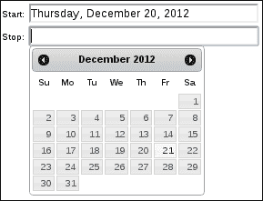
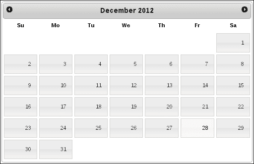
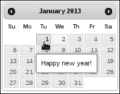
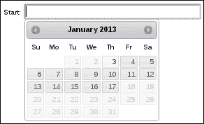
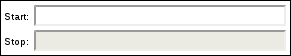
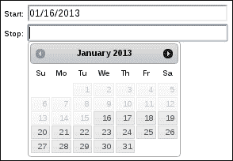
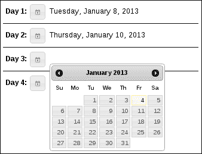
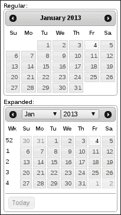

# 第四章：开发日期选择器

在本章中，我们将涵盖：

+   处理不同的日期格式

+   制作全尺寸的日历小部件

+   显示月度效果

+   预约提醒作为工具提示

+   限制日期范围

+   隐藏输入字段

+   附加数据和控件

# 介绍

**日期选择器**小部件通过提供日期选择实用工具来增强典型的文本输入表单元素。我们现在在 Web 上到处都可以看到这些类型的输入。日期选择器的图形化性质对大多数用户来说是直观的，因为它与物理日历非常相似。日期选择器小部件还解决了处理一致日期格式的挑战，这是用户无需担心的。

# 处理不同的日期格式

日期选择器小部件支持各种日期字符串格式。当用户进行选择时，日期字符串是填充在文本输入中的值。通常情况下，应用程序会尝试在整个用户界面中遵循相同的日期格式以保持一致性。因此，如果您不满意小部件提供的默认格式，我们可以在创建小部件时使用`dateFormat`选项进行更改。

## 如何做...

我们将从创建两个`input`字段开始，其中我们需要用户输入日期：

```js
<div>
    <label for="start">Start:</label>
    <input id="start" type="text" size="30"/>
</div>

<div>
    <label for="stop">Stop:</label>
    <input id="stop" type="text" size="30"/>
</div>
```

接下来，我们将使用前面的`input`字段并指定我们的自定义格式来创建两个日期选择器小部件。

```js
$(function() {

    $( "input" ).datepicker({
        dateFormat: "DD, MM d, yy"
    });

});
```

## 它是如何工作的...

当我们在日期选择器小部件中做出选择时，您会注意到文本`input`值会更改为所选日期，使用我们选择的格式。日期格式字符串本身，`"DD, MM d, yy"`，是根据大多数其他编程语言中找到的格式而建模的，也就是说，日期选择器没有本机 JavaScript 日期格式化工具可用。当用户在日期选择器的下拉日历中进行选择时，将创建一个`Date`对象。然后小部件使用`dateFormat`选项来格式化`Date`对象，并将文本输入填充为结果。



## 还有更多...

如果我们正在构建一个相当大的用户界面，我们可能会在几个不同的地方使用几个日期选择器小部件。为了保持日期格式的一致性，我们将不得不每次创建日期选择器小部件时指定`dateFormat`选项。我们可能会有几个调用创建小部件的调用使用不同的选择器，因此总是指定相同的`dateFormat`选项有点烦人，而它应该只是默认值。

在这种情况下，最好只是将默认的`dateFormat`值更改为我们的应用程序遍布的内容。这比一遍又一遍地指定相同的格式要好，同时保留了根据情况更改日期格式的能力。

我们将使用与之前相同的 HTML 结构-两个`input`字段是我们的日期选择器占位符。但让我们修改 JavaScript 如下：

```js
(function( $, undefined ) {

$.widget( "ui.datepicker", $.ui.datepicker, {
    options: $.extend(
        $.ui.datepicker.prototype.options,
        { dateFormat: "DD, MM d, yy" }
    ),
});

})( jQuery );

$(function() {

    $( "#start" ).datepicker();
    $( "#stop" ).datepicker();

});
```

现在，如果你运行这个修改过的 JavaScript，你会得到与之前相同的日期选择器行为。然而，你会注意到，我们现在要调用两次 `datepicker()` 构造函数。都没有指定 `dateFormat` 选项，因为我们通过定制 `datepicker` 小部件和扩展 `options` 来改变了默认值。我们仍然可以为每个单独的小部件提供自定义日期格式的选项，这样做可以为我们节省大量潜在的重复 `dateFormat` 选项。

# 制作一个全尺寸的日历小部件

`datepicker` 小部件的典型用法是增强标准表单输入字段。当字段获得焦点时，我们希望为用户显示实际的日期选择器。如果我们遵循小部件的标准使用模式——选择日期，那么这就是有道理的。毕竟，这就是为什么它被称为日期选择器的原因。

但是，我们可以利用主题框架提供的一些灵活性，并对日期选择器进行一些微小的调整，以显示一个更大的日历。不一定是为了作为输入选择日期的目的，而是作为一个大窗口来显示与日期/时间相关的信息。我们需要对小部件进行的更改仅仅是将内联显示的尺寸放大。

## 准备工作

日期选择器小部件已经知道如何在内联中显示自己。我们只需要在 `div` 元素上调用日期选择器构造函数，而不是在 `input` 元素上。所以我们将使用这个基本的标记：

```js
<div class="calendar"></div>
```

还有一个普通的 `datepicker()` 调用：

```js
$(function() {
    $( ".calendar" ).datepicker();
});
```

其余的工作是在主题调整中完成的。

## 如何操作...

调整日期选择器 CSS 的目标是使其尺寸放大。想法是使小部件看起来更像一个日历，而不像一个表单输入字段助手。日历已经以内联方式显示了，所以让我们在页面上包含这个新的 CSS。

```js
.ui-datepicker {
    width: 500px;
}

.ui-datepicker .ui-datepicker-title {
    font-size: 1.3em;
}

.ui-datepicker table {
    font-size: 1em;
}

.ui-datepicker td {
    padding: 2px;
}

.ui-datepicker td span, .ui-datepicker td a {
    padding: 1.1em 1em;
}
```

有了这个，我们就有了一个缩放的日历小部件，作为一个日期选择器仍然可以完美地运行，因为我们没有改变小部件的任何功能。



## 工作原理...

我们对这些新的样式声明所做的第一件事是增加日历显示的宽度为`500px`。这可以是我们选择的任何数字，最适合我们正在开发的用户界面。接下来，我们将增加标题部分——月份和年份的字体大小。我们还增加了所有星期几和月份数字的字体大小，并在月份日槽之间提供了更多的填充。我们现在有了空间，我们可能会用到它。最后，设置在 `td span` 和 `td a` 元素上的 `padding` 修复了整个日历的高度；否则，纵横比将会非常不协调。这是另一个我们希望根据每个应用程序进行微调的数字，以便正确设置。

# 显示月度效果

当日期选择器选择器显示时，我们通常为用户每次显示一个月。如果用户需要向后导航时间，则使用上个月按钮。同样，他们可以使用下个月按钮向前导航时间。当发生这种情况时，日期选择器小部件仅清空日期选择器`div`，然后重新生成一些 HTML 以用于日历，并插入其中。这一切都发生得非常快，对于用户来说，基本上是瞬间的。

让我们通过向日期选择器内部注入一些效果来使这个月份导航更加生动。

## 准备工作

这个实验可以使用任何日期选择器小部件，但直接使用内联日期选择器显示可能更简单，而不是使用文本`input`。这样，当页面加载时，日期选择器就在那里，我们不需要打开它。内联日期选择器是使用`div`元素创建的。

```js
<div class="calendar"></div>
```

## 如何做...

我们将扩展日期选择器小部件，以允许在我们调整当前月份时应用 jQuery 的`fadeIn()`和`fadeOut()`函数。

```js
(function( $, undefined ) {

$.extend( $.datepicker, {

    _updateDatepicker: function( inst ) {

        var self = this,
            _super = $.datepicker.constructor.prototype;

        inst.dpDiv.fadeOut( 500, function() {
            inst.dpDiv.fadeIn( 300 );
            _super._updateDatepicker.call( self, inst );
        });

    }

});

})( jQuery );

$(function() {
    $( ".calendar" ).datepicker();
});
```

现在，当用户单击日历顶部的下一个或上一个箭头按钮时，我们会看到小部件淡出，并淡入具有新日历月份布局的界面。

## 它的工作原理...

你会注意到这段代码的第一件事是它没有使用典型的小部件工厂机制扩展日期选择器小部件。这是因为日期选择器的默认实现尚未转移到新的小部件工厂方式进行操作。但这并不妨碍我们根据需要扩展小部件。

### 提示

日期选择器小部件很复杂——比框架内的大多数其他小部件都要复杂得多。在引入如此重大变化之前，核心 jQuery UI 团队必须考虑许多因素。截至撰写本文时的计划是，日期选择器小部件将在将来的版本中像其他小部件一样成为小部件工厂的产品。

我们在`$.datepicker`对象上使用了 jQuery `extend()`函数。该对象是`Datepicker`类的单例实例，这是我们为了简洁而感兴趣的内容。`_updateDatepicker()`方法是我们在此自定义中的目标。默认的日期选择器实现使用此方法来更新日期选择器`div`的内容。因此，我们想要重写它。在我们版本的方法中，我们使用`fadeOut()`隐藏了`inst.dpDiv`。一旦完成，我们调用`fadeIn()`。`_super`变量是对用于定义小部件的`Datepicker`类的引用。由于`$.datepicker`是一个实例，因此访问`Datepicker`原型的唯一方法是通过`$.datepicker.constructor.prototype`。我们需要`Datepicker`原型的原因是，这样我们才能在我们完成了效果后调用原始的`_updateDatepicker()`方法，因为它执行了与配置显示相关的其他几个任务。

# 将预约提醒显示为工具提示

日期选择器小部件帮助用户为`input`字段选择正确的日期，或者作为基本显示。在任何一种情况下，如果我们能为用户提供更多的上下文信息，那么这不是很有用吗？也就是说，如果我正在使用日期选择器来选择表单中的日期，那么当我将鼠标指针移到日历中的某一天时，知道那天有些事情要做会很有帮助。也许我应该选择其他日期。

在本节中，我们将研究扩展日期选择器小部件的能力，以允许指定作为工具提示出现的提醒。这些作为选项传递给日期选择器构造函数，并且可能在应用程序内部产生，可能是从数据库中的用户资料中获得的。

## 如何实现...

我们将使用一个简单的内联日期选择器作为示例，目标标记为`<div class="calendar"></div>`。

让我们通过接受提醒对象数组并为它们创建工具提示来扩展日期选择器的功能。提醒对象只是一个带有`date`和`text`字段的普通 JavaScript 对象。日期告诉日期选择器工具提示应该放在日历中的何处。

```js
(function( $, undefined ) {

$.extend( $.datepicker, {

    _updateDatepicker: function( inst ) {

        var settings = inst.settings,
            days = "td[data-handler='selectDay']",
            $target = inst.dpDiv,
            _super = $.datepicker.constructor.prototype;

        _super._updateDatepicker.call( this, inst )

        if ( !settings.hasOwnProperty( "reminders" ) ) {
            return;
        }

        $target.find( days ).each( function( i, v ) {

            var td = $( v ),
                currentDay = new Date(
                    td.data( "year" ),
                    td.data( "month" ),
                    td.find( "a" ).html()
                );

            $.each( settings.reminders, function( i, v ) {

                var reminderTime = v.date.getTime(),
                    reminderText = v.text,
                    currentTime = currentDay.getTime();

                if ( reminderTime == currentTime ) {
                    td.attr( "title", reminderText ).tooltip();
                }

            });

        });

    }

});

})( jQuery );

$(function() {
    $( ".calendar" ).datepicker({
        reminders: [
            {
                date: new Date(2013, 0, 1),
                text: "Happy new year!"
            },
            {
                date: new Date(2013, 0, 14),
                text: "Call in sick, case of the Mondays"
            },
            {
                date: new Date(2013, 1, 14),
                text: "Happy Valentine's Day!"
            }
        ]
    });
});
```

现在，当您将鼠标指针移到日期选择器小部件中提供的提醒日期上时，您应该会看到所提供的文本作为工具提示显示出来：



## 工作原理...

让我们退一步，思考传递给提醒参数的数据以及我们对其进行了什么处理。传递的值是一个对象数组，每个对象都有`date`和`text`属性。文本是我们想要显示在工具提示中的内容，而日期告诉日期选择器在何处放置工具提示。因此，我们取得这个值并将其与日期选择器日历中呈现的日期进行比较。

所有定制工作都在我们自己的`_updateDatepicker()`方法的实现中完成。每次渲染日历时都会调用此方法。这包括从一个月切换到另一个月。我们使用对原始日期选择器实现的引用`_super`来调用`_updateDatepicker()`方法。一旦完成了这一点，我们就可以执行我们的自定义。我们首先检查是否已提供提醒参数，否则我们的工作已经完成。

接下来，我们查找并迭代当前显示的月份中表示一天的每个`td`元素。对于每一天，我们构造一个代表表格单元格的 JavaScript`Date`对象——我们将需要这个对象来与每个提醒条目进行比较。最后，我们在`reminders`参数中迭代每个提醒对象。如果我们在应该显示此提醒的日期上，我们在设置`td`元素的`title`属性之后构造工具提示小部件。

# 限制日期范围

您的应用程序可能需要限制可选日期，限制日期范围。也许这是基于某些其他条件为真或事件被触发的。谢天谢地，我们有足够的灵活性来处理小部件的最常见的受限选择配置。

## 准备工作...

我们将使用基本输入元素标记来创建我们的日期选择器小部件：

```js
<div>
    <label for="start">Start:</label>
    <input id="start" type="text" size="30"/>
</div>
```

## 如何做...

我们将使用`minDate`和`maxDate`选项创建我们的日期选择器小部件。

```js
$(function() {

    $( "input" ).datepicker({
        minDate: new Date(),
        maxDate: 14
    });

});
```

当我们通过单击`input`字段激活日期选择器小部件时，您会注意到仅有特定范围的日期可选择。



## 工作原理...

`minDate`和`maxDate`选项都接受各种格式。 在我们的示例中，我们给`minDate`选项一个代表今天的`Date`对象。 这意味着用户不能选择今天之前的任何日期。 此外，我们不希望允许用户选择任何日期超过未来两周。 通过给`maxDate`选项提供`14`天的增量，这很容易指定。

## 还有更多...

给定日期选择器实例的受限日期范围不一定要静态定义。 实际范围可能取决于 UI 中的某些动态内容，例如另一个日期选择器的选择。

让我们看看我们如何限制日期范围，取决于选择另一个日期。 我们将创建两个日期选择器小部件。 当用户在第一个小部件中选择日期时，将使用更新的范围限制启用第二个小部件。 用户不能在第一个日期选择器之前选择日期。

这是我们将用于两个日期选择器的标记：

```js
<div>
    <label for="start">Start:</label>
    <input id="start" type="text" size="30"/>
</div>

<div>
    <label for="start">Stop:</label>
    <input id="stop" type="text" size="30"/>
</div>
```

这是创建两个日期选择器小部件的代码：

```js
$(function() {

    function change ( e ) {

        var minDate = $( this ).datepicker( "getDate" );

        $( "#stop" ).datepicker( "enable" );
        $( "#stop" ).datepicker( "option", "minDate", minDate );

    }

    $( "#start" ).datepicker()
                 .change( change );

    $( "#stop" ).datepicker( { disabled: true } );

});
```

默认情况下，`＃stop`日期选择器被禁用，因为我们需要知道`minDate`值应该是什么。



但是一旦用户在`＃start`日期选择器中做出选择，我们就可以在`＃stop`日期选择器中做出选择-我们只是不能在`＃start`日期选择器中的选择之前选择任何内容。



`#start`日期选择器在进行选择时启用并更新`#stop`日期选择器。 它启用小部件并将`getDate`的值作为`minDate`选项传递。 这基于先前选择进行单向强制用户。

# 隐藏输入字段

日期选择器小部件的目标是在用户进行选择后填充文本`input`元素。 因此，小部件对于`input`元素有两种用途。 首先，它监听`input`元素上的`focus`事件。 这是它知道何时显示日历选择器的方式。 其次，一旦做出选择，`input`元素的值会更新以反映所选格式的日期。

向用户呈现一个 `input` 元素在大多数情况下都可以正常工作。但也许由于某些原因，输入框并不适合您的 UI。也许我们需要一种不同的方法来显示日历并存储/显示选择。

在本节中，我们将探讨一种替代方法，而不仅仅使用日期选择器 `input` 元素。我们将使用一个 **button** 小部件来触发日历显示，并且我们将伪装 `input` 元素，使其看起来像是其他东西。

## 准备就绪

让我们使用以下 HTML 示例。我们将布置四个日期部分，用户需要按按钮才能与日期选择器小部件交互。

```js
<div>

    <div class="date-section">
        <label>Day 1:</label>
        <button>Day 1 date</button>
        <input type="text" readonly />
    </div>

    <div class="date-section">
        <label>Day 2:</label>
        <button>Day 2 date</button>
        <input type="text" readonly />
    </div>

    <div class="date-section">
        <label>Day 3:</label>
        <button>Day 3 date</button>
        <input type="text" readonly />
    </div>

    <div class="date-section">
        <label>Day 4:</label>
        <button>Day 4 date</button>
        <input type="text" readonly />
    </div>

</div>
```

## 如何做...

我们使日期部分按预期工作的第一件事是一些 CSS。这不仅对于布置我们正在构建的 UI 非常重要，还对于伪装 `input` 元素很重要，以便用户不知道它在那里。

```js
div.date-section {
    padding: 5px;
    border-bottom: 1px solid;
    width: 20%;
}

div.date-section:last-child {
    border-bottom: none;
}

div.date-section label {
    font-size: 1.2em;
    font-weight: bold;
    margin-right: 2px;
}

div.date-section input {
    border: none;
}
```

现在我们将编写 JavaScript 代码来实例化日期选择器和按钮小部件。

```js
$(function() {

    var input = $( "div.date-section input" ),
        button = $( "div.date-section button" );

    input.datepicker({
        dateFormat: "DD, MM d, yy"
    });

    button.button({
        icons: { primary: "ui-icon-calendar" }, 
        text: false
    });

    button.click( function( e ) {
        $( this ).next().datepicker( "show" )
    });

});
```

有了这些，现在我们有了四个日期部分，用户可以单击标签右侧的日期按钮来显示日历。他们选择一个日期，然后日历就会隐藏起来。您会注意到我们的 CSS 样式已经隐藏了 `input` 元素。



## 工作原理...

此示例中的大多数 CSS 样式规则用于布局 UI 组件、`label`、`buttons` 和 `input`。您会注意到，在选择日期之前，输入框是不可见的。这是因为它尚无文本值，而且因为我们已经在我们的 `div.date-section` 输入 CSS 选择器中删除了 `border`。

我们的 JavaScript 代码在页面加载时首先为每个输入元素创建日期选择器小部件。我们还将自定义字符串传递给 `dateFormat` 选项。对于每个日期部分，我们都有一个按钮。我们在此处使用按钮小部件来创建一个日历图标按钮，当单击时显示日历。我们通过调用 `datepicker( "show" )` 来实现这一点。

# 附加的日历数据和控件

日期选择器小部件有各种附加数据和控件选项，开发人员可以使用该小部件公开这些选项。这些都是简单的布尔配置选项，用于打开数据或控件。

## 入门指南

让我们准备两个 `div` 元素，用它们可以创建两个内联日期选择器实例。

```js
<div>
    <strong>Regular:</strong>
    <div id="regular"></div>
</div>

<div>
    <strong>Expanded:</strong>
    <div id="expanded"></div>
</div>
```

## 如何做...

让我们创建两个日期选择器小部件。我们创建两个小部件，以便我们可以对比普通日期选择器和具有扩展数据和控件的日期选择器之间的差异。

```js
$(function() {

    $( "#regular" ).datepicker();

    $( "#expanded" ).datepicker({
        changeYear: true,
        changeMonth: true,
        showButtonPanel: true,
        showOtherMonths: true,
        selectOtherMonths: true,
        showWeek: true
    });

});
```

现在您可以看到两个渲染的日期选择器之间的差异。后者已经通过附加的控件和数据进行了扩展。



## 工作原理...

我们对扩展的 `datepicker` 实例所做的所有工作都是打开一些默认关闭的功能。具体如下：

+   `changeYear`: 这样可以启用年份下拉菜单。

+   `changeMonth`: 这样可以启用月份下拉菜单。

+   `showButtonPanel`：这会在日历底部启用**今天**和**完成**按钮。

+   `showOtherMonths`：这会显示来自相邻月份的日期。

+   `showWeek`：这会在日历中启用一周中的列。
