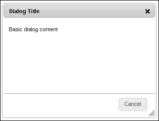
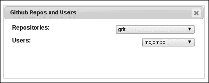
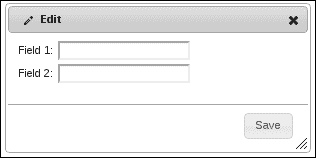
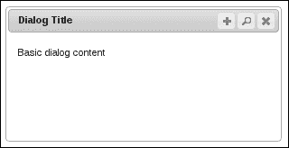
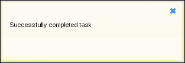
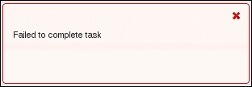

# 第五章：添加对话框

在本章中，我们将介绍以下示例：

+   对对话框组件应用效果

+   等待 API 数据加载

+   在对话标题中使用图标

+   向对话框标题添加操作

+   对对话框调整交互应用效果

+   用于消息的模态对话框

# 介绍

对话框小部件为 UI 开发人员提供了一个工具，他们可以在不中断当前页面内容的情况下向用户呈现表单或其他信息片段；对话框创建了一个新的上下文。开箱即用，开发人员可以使用对话框选项做很多事情，并且其中许多功能默认情况下是打开的。这包括调整对话框的大小并在页面上移动它的能力。

在本章中，我们将解决在任何 Web 应用程序中典型对话框使用中的一些常见问题。通常需要调整对话框的控件和整体外观；我们将涉及其中一些。我们还将看看如何与 API 数据交互使对话框使用变得复杂以及处理方法。最后，我们可以通过查看如何以各种方式将效果应用于它们来为对话框小部件添加一些亮点。

# 对对话框组件应用效果

在开箱即用的情况下，对话框小部件允许开发人员在打开对话框时显示动画，以及在关闭时隐藏动画。此动画应用于整个对话框。因此，例如，如果我们指定`show`选项是`fade`动画，则整个对话框将对用户淡入视图。同样，如果`hide`选项是`fade`，则对话框会淡出视图，而不是立即消失。为了活跃这种`show`和`hide`行为，我们可以对各个对话框组件进行操作。也就是说，我们可以将显示和隐藏效果应用于小部件内部的各个部分，如标题栏和按钮窗格，而不是将它们应用于整个对话框。

## 怎么做……

我们要创建的对话框在内容上非常简单。也就是说，在 HTML 中我们只会为对话框指定一些基本的`title`和内容字符串。

```js
<div title="Dialog Title">
    <p>Basic dialog content</p>
</div>
```

为了将对话框组件的逐个动画化的想法变为现实，我们需要在几个地方扩展对话框小部件。特别是，我们将动画化小部件顶部的标题栏以及底部的按钮窗格。下面是 JavaScript 代码的样子：

```js
(function( $, undefined ) {

$.widget( "ab.dialog", $.ui.dialog, {

    _create: function() {

        this._super();

        var dialog = this.uiDialog;

        dialog.find( ".ui-dialog-titlebar" ).hide();
        dialog.find( ".ui-dialog-buttonpane" ).hide();

    },

    open: function() {

        this._super();

        var dialog = this.uiDialog;

        dialog.find( ".ui-dialog-titlebar" ).toggle( "fold", 500 );
        dialog.find( ".ui-dialog-buttonpane" ).toggle( "fold", 500 );

    },

    close: function( event, isCallback ) {

        var self = this,
            dialog = this.uiDialog;

        if ( isCallback ) {
            this._super( event );
            return;
        }

        dialog.find( ".ui-dialog-titlebar" ).toggle( "fold", 500 );
        dialog.find( ".ui-dialog-buttonpane" ).toggle( "fold", 500, function(){
            self.element.dialog( "close", event, true );
        });

    }

});

})( jQuery );

$(function() {

    $( "div" ).dialog({
        show: "fade", 
        hide: "scale",
        buttons: {
            Cancel: function() {
                $( this ).dialog( "close" );
            }
        }
    });

});
```

当你打开页面时，你会看到独立于我们为对话指定的整体`fade`动画的各个对话框组件淡入视图。一旦可见，对话框应该看起来像这样：



你还会注意到，直到标题栏和按钮窗格应用`fade`效果之后，`scale`效果才会被应用。

## 它是如何工作的……

这段代码是规则的例外之一，我们没有提供关闭新扩展功能的机制。也就是说，我们在某些对话框方法的自定义实现中硬编码了更改，无法通过提供选项值来关闭。然而，这个例外是为了在复杂性和所需功能之间进行权衡。很可能这种自定义动画工作会作为特定项目需求的一部分进行，而不是对话框小部件功能的广泛扩展。

我们更改默认对话框实现的第一件事是在`_create()`方法中，我们隐藏了`.ui-dialog-titlebar`和`.ui-dialog-buttonpane`组件。这是在调用`_super()`方法之后完成的，该方法负责创建基本对话框组件。即使对话框设置为使用`autoOpen`选项自动打开，`_create()`方法也不会实际显示它。因此，我们可以在用户没有注意到的情况下隐藏标题栏和按钮面板。

我们隐藏这两个组件的原因是因为我们希望在对话框打开时应用显示效果。下一个我们重写的方法`open()`就是这样做的。它首先调用`_super()`方法，该方法启动显示对话框的效果（在我们的情况下，我们告诉它在显示时淡入）。然后我们在标题栏和按钮面板上使用`fold`效果。

您会注意到我们在开始下一个动画之前不等待任何动画完成。对话框显示动画开始，然后是标题栏和按钮面板。这三个动画可能同时执行。我们之所以这样做是为了保持对话框的正确布局。我们要重写的最后一个方法是`close()`方法。这引入了一个有趣的解决方法，我们必须使用它来使得 `_super()` 在回调中起作用。即使在封闭范围内有 `self` 变量，我们在回调中调用 `_super()` 方法时也会遇到问题。因此，我们使用小部件元素，并假装我们是从小部件外部调用`.dialog("close")`一样。`isCallback`参数告诉`close()`方法调用 `_super()`，然后返回。我们之所以需要回调是因为我们实际上不想在完成按钮面板动画之前执行对话框隐藏动画。

# 等待 API 数据加载

通常情况下，对话框小部件需要从 API 加载数据。也就是说，并非所有对话框都由静态 HTML 构成。它们需要从 API 获取数据以使用 API 数据构建某些元素，例如`select`元素选项。

从 API 加载数据并构建结果元素并不是问题；我们一直在做这件事。挑战出现在我们尝试在对话上下文中执行这些活动时。我们不一定希望在从 API 加载数据并且用于显示对话框组件内部的 UI 组件已构建之前显示对话框，并且理想情况下，我们应该阻止对话框显示，直到对话框显示的组件准备好。

这在远程 API 功能中尤其棘手，因为不可能预测延迟问题。此外，对话框可能依赖于多个 API 调用，每个调用在对话框中填充自己的 UI 组件。

## 准备...

要为 API 数据问题实现解决方案，我们将需要一些基本的 HTML 和 CSS 来定义对话框及其内容。我们将在对话框中有两个空的 `select` 元素。这是 HTML 的样子：

```js
<div id="dialog" title="Genres and Titles">
    <div class="dialog-field">
        <label for="genres">Genres:</label>
        <select id="genres"></select>
        <div class="ui-helper-clearfix"></div>
    </div>

    <div class="dialog-field">
        <label for="titles">Titles:</label>
        <select id="titles"></select>
        <div class="ui-helper-clearfix"></div>
    </div>
</div>
```

而且，这是上述代码的支持 CSS：

```js
.dialog-field {
    margin: 5px;
}

.dialog-field label {
    font-weight: bold;
    font-size: 1.1em;
    float: left;
}

.dialog-field select {
    float: right;
}
```

## 如何做...

我们将给对话框小部件增加一个新选项来阻止在等待 API 请求时阻塞。此选项将允许我们传递一个延迟承诺的数组。承诺是用于跟踪单个 Ajax 调用状态的对象。通过一组承诺，我们能够使用简单的代码实现复杂的阻塞行为，如下所示：

```js
(function( $, undefined ) {

$.widget( "ab.dialog", $.ui.dialog, {

    options: { 
        promises: []
    },

    open: function( isPromise ) {

        var $element = this.element,
            promises = this.options.promises;

        if ( promises.length > 0 && !isPromise ) {

            $.when.apply( $, promises ).then( function() {
                $element.dialog( "open", true );
            });

        }
        else {

            this._super();

        }

    },

});

})( jQuery );

$(function() {

    var repos = $.ajax({
        url: "https://api.github.com/repositories",
        dataType: "jsonp",
        success: function( resp ) {
            $.each( resp.data, function( i, v ) {
                $( "<option/>" ).html( v.name )
                                .appendTo( "#repos" );
            });
        },
    });

    var users = $.ajax({
        url: "https://api.github.com/users",
        dataType: "jsonp",
        success: function( resp ) {
            $.each( resp.data, function( i, v ) {
                $( "<option/>" ).html( v.login )
                                .appendTo( "#users" );
            });
        }
    });

    $( "#dialog" ).dialog({
        width: 400,
        promises: [
            repos.promise(),
            users.promise()
        ]
    });

});
```

一旦 API 数据返回，对于这两个调用，对话框将被显示，并且应该看起来像这样：



## 它是如何工作的...

让我们首先看一下文档准备好的处理程序，在这里我们实际上是在实例化对话框小部件。这里定义的前两个变量 `repos` 和 `users` 是 `$.Deferred` 对象。这代表了我们正在向 GitHub API 发送的两个 API 调用。这些调用的目的是分别填充 `#repos` 和 `#users` `select` 元素。这些 `select` 元素构成了我们的 `#dialog` 内容的一部分。在每个 Ajax 调用中指定的 `success` 选项是一个回调，它执行创建 `option` 元素并将它们放置在 `select` 元素中的工作。

如果不自定义对话框小部件，这两个 API 调用将正常工作。对话框将打开，最终，选项将出现在 `select` 元素中（在对话框已经打开之后）。但是，您会注意到，我们正在向对话框传递一个 `deferred.promise()` 对象数组。这是我们赋予对话框小部件的新功能。延迟对象简单来说允许开发人员推迟某些可能需要一段时间才能完成的操作的后果，例如 Ajax 调用。承诺是我们从延迟对象中得到的，它允许我们组合一些条件，说出一个复杂的序列，例如进行多个 Ajax 调用，何时完成。

我们已添加到对话框小部件的自定义`promises`选项是在我们的`open()`方法的实现中使用的。在这里，我们可以利用这些承诺。基本上，我们正在将一个或多个承诺对象传递给对话框，一旦它们全部完成或解析为使用 jQuery 术语，我们就可以打开对话框。我们通过将承诺对象数组传递给`$.when()`函数来实现这一点，该函数在对话框上调用`open()`方法。但是，这里出现了一个我们必须处理的复杂情况。我们无法在回调函数内部调用`_super()`，因为核心小部件机制不知道如何找到父小部件类。

所以，我们必须假装我们是从小部件外部调用`open()`。我们通过使用`self.element`和额外的`isPromise`参数来做到这一点，指示我们自定义的`open()`实现如何行为。

# 在对话框标题中使用图标

对于某些对话框，根据应用程序的性质和对话框本身的内容，可能有益于在对话框标题旁边放置一个图标。这可能有利于用户提供额外的上下文。例如，编辑对话框可能具有铅笔图标，而用户个人资料对话框可能包含人物图标。

## 准备好了...

为了说明在对话框小部件的标题栏中添加图标，我们将使用以下内容作为我们的基本 HTML：

```js
<div id="dialog" title="Edit">
    <div>
        <label>Field 1:</label>
        <input type="text"/>
    </div>
    <div>
        <label>Field 2:</label>
        <input type="text"/>
    </div>
</div>
```

## 如何操作...

我们需要定义的第一件事是一个自定义的 CSS 类，用于在将其放置在对话框标题栏中时正确对齐图标。CSS 如下所示：

```js
.ui-dialog-icon {
    float: left;
    margin-right: 5px;
}
```

接下来，我们有我们的 JavaScript 代码来通过添加新的`icon`选项来自定义对话框小部件，以及使用我们的 HTML 作为源代码创建小部件的实例：

```js
(function( $, undefined ) {

$.widget( "ab.dialog", $.ui.dialog, {

    options: {
        icon: false
    },

    _create: function() {

        this._super();

        if ( this.options.icon ) {

            var iconClass = "ui-dialog-icon ui-icon " + 
                            this.options.icon;

            this.uiDialog.find( ".ui-dialog-titlebar" )
                         .prepend( $( "<span/>" ).addClass( iconClass ));

        }

    },

});

})( jQuery );

$(function() {

    $( "#dialog" ).dialog({
        icon: "ui-icon-pencil",
        buttons: {
            Save: function() { $( this ).dialog( "close" ) }
        }
    });

});
```

打开时产生的对话框应该看起来像下面这样：



## 它是如何工作的...

对于这个特定的对话框实例，我们想显示铅笔图标。我们已添加到对话框小部件的`icon`选项允许开发人员从主题框架中指定图标类。在这种情况下，它是`ui-icon-pencil`。新的`icon`选项具有默认值`false`。

我们正在覆盖`_create()`方法的默认对话框实现，以便我们可以在对话框标题栏中插入一个新的`span`元素，如果提供了`icon`选项。这个新的`span`元素得到了作为新选项值传递的图标类，以及`ui-dialog-icon`类，该类用于定位我们之前定义的图标。

# 将操作添加到对话框标题

默认情况下，对话框小部件为用户提供了一个不需要开发者干预的操作——标题栏中的关闭按钮。这是一个几乎适用于任何对话框的通用操作，因为用户期望能够关闭它们。此外，关闭对话框操作按钮是一个位于对话框右上角的图标，这并不是偶然的。这是一个标准的位置和动作，在图形窗口环境中以及其他操作中也是如此。让我们看看如何扩展放置在对话框小部件标题栏中的操作。

## 如何操作...

对于这个演示，我们只需要以下基本的对话框 HTML：

```js
<div id="dialog" title="Dialog Title">
    <p>Basic dialog content</p>
</div>
```

接下来，我们将实现我们的对话框特化，添加一个新选项和一些创建使用该选项的新对话框实例的代码：

```js
(function( $, undefined ) {

$.widget( "ab.dialog", $.ui.dialog, {

    options: {
        iconButtons: false
    },

    _create: function() {

        this._super();

        var $titlebar = this.uiDialog.find( ".ui-dialog-titlebar" );

        $.each( this.options.iconButtons, function( i, v ) {

            var button = $( "<button/>" ).text( v.text ),
                right = $titlebar.find( "[role='button']:last" )
                                 .css( "right" );

            button.button( { icons: { primary: v.icon }, text: false } )
                  .addClass( "ui-dialog-titlebar-close" )
                  .css( "right", (parseInt(right) + 22) + "px" )
                  .click( v.click )
                  .appendTo( $titlebar );

        });

    }

});

})( jQuery );

$(function() {

    $( "#dialog" ).dialog({
        iconButtons: [
            {
                text: "Search",
                icon: "ui-icon-search",
                click: function( e ) {
                    $( "#dialog" ).html( "<p>Searching...</p>" );
                }
            },
            {
                text: "Add",
                icon: "ui-icon-plusthick",
                click: function( e ) {
                    $( "#dialog" ).html( "<p>Adding...</p>" );
                }
            }
        ]
    });

});
```

当打开此对话框时，我们将在右上角看到我们传递给对话框的新操作按钮，如下截图所示：



## 它是如何工作的...

我们为对话框创建了一个名为`iconButtons`的新选项。这个新选项期望一个对象数组，其中每个对象都有与操作按钮相关的属性。像文本、图标类以及在用户打开对话框并单击按钮时执行的点击事件等。

在这个定制中，大部分工作都是在我们版本的`_create()`方法中进行的。在这里，我们遍历`iconButtons`选项中提供的每个按钮。在将新按钮插入标题栏时，我们首先创建`button`元素。我们还使用`.ui-dialog-titlebar [role='button']:last`选择器获取最后一个添加的操作按钮的宽度（这是需要计算操作按钮的水平位置的）。

接下来，我们按照按钮配置绑定`click`事件。对于我们添加的数组中的每个按钮，我们希望它放置在前一个按钮的左侧。因此，当我们首次开始遍历`iconButtons`数组时，默认的关闭操作是标题栏中的最后一个按钮。由于 CSS 结构需要一个固定的右值，我们必须计算它。为了做到这一点，我们需要列表中最后一个按钮的值。

# 将效果应用到对话框调整大小交互

默认情况下，对话框小部件允许用户通过拖动调整大小。实际的调整大小功能是由对话框在`resizable`选项为`true`时内部设置的`resizable()`交互小部件提供的。让我们看看如何访问内部可调整大小组件，以便我们可以使用`animate`特性。当设置在可调整大小组件上时，此选项会延迟重新绘制调整大小的组件，直到用户停止拖动调整大小手柄。

## 准备工作...

对于这个演示，我们只需要简单的对话框 HTML，如下所示：

```js
<div id="dialog" title="Dialog Title">
    <p>Basic dialog content</p>
</div>
```

## 如何操作...

让我们为对话框小部件添加一个名为`animateResize`的新选项。当此选项为`true`时，我们将打开内部可调整大小交互小部件的`animate`选项。

```js
(function( $, undefined ) {

$.widget( "ab.dialog", $.ui.dialog, {

    options: { 
        animateResize: false 
    },

    _makeResizable: function( handles ) {
        handles = (handles === undefined ? this.options.resizable : handles);
        var that = this,
            options = this.options,
            position = this.uiDialog.css( "position" ),
            resizeHandles = typeof handles === 'string' ?
                handles:
                "n,e,s,w,se,sw,ne,nw";

        function filteredUi( ui ) {
            return {
                originalPosition: ui.originalPosition,
                originalSize: ui.originalSize,
                position: ui.position,
                size: ui.size
            };
        }

        this.uiDialog.resizable({
            animate: this.options.animateResize,
            cancel: ".ui-dialog-content",
            containment: "document",
            alsoResize: this.element,
            maxWidth: options.maxWidth,
            maxHeight: options.maxHeight,
            minWidth: options.minWidth,
            minHeight: this._minHeight(),
            handles: resizeHandles,
            start: function( event, ui ) {
                $( this ).addClass( "ui-dialog-resizing" );
                that._trigger( "resizeStart", event, filteredUi( ui ) );
            },
            resize: function( event, ui ) {
                that._trigger( "resize", event, filteredUi( ui ) );
            },
            stop: function( event, ui ) {
                $( this ).removeClass( "ui-dialog-resizing" );
                options.height = $( this ).height();
                options.width = $( this ).width();
                that._trigger( "resizeStop", event, filteredUi( ui ) );
                if ( that.options.modal ) {
                    that.overlay.resize();
                }
             }
        })
        .css( "position", position )
        .find( ".ui-resizable-se" )
        .addClass( "ui-icon ui-icon-grip-diagonal-se" );
    }

});

})( jQuery );

$(function() {

    $( "#dialog" ).dialog({
        animateResize: true
    });

});
```

当创建并显示此对话框时，您将能够调整对话框的大小，观察到实际的调整现在是动画的。

## 它是如何工作的...

我们已经向对话框添加了`animateResize`选项，并为其提供了默认值`false`。要实际执行此功能，我们已经完全重写了对话框小部件在对话框创建时内部使用的`_makeResizable()`方法。事实上，我们已经采取了`_makeResizable()`的内部代码，并仅更改了一件事情——`animate: this.options.animateResize`。

这有点多余，复制所有这些代码来打开一个简单的功能，比如动画化对话框调整交互。事实上，这不是理想的解决方案。一个更好的方法是调用`_makeResizable()`的`_super()`版本，然后只需通过调用`this.uiDialog.resizable( "option", "animate", true )`打开动画即可。但在撰写本文时，这不符合预期。尽管我们的替代路径涉及多余的代码，但它只是展示了小部件工厂的灵活性。如果这种动画质量是用户界面的真实要求，我们很快就找到了一个可以忽略的折衷方案。

# 使用模态对话框进行消息传递

对话框小部件有一个保留的`modal`选项，用于当我们需要将用户的注意力集中在一件事上时。此选项显示对话框，同时防止用户与其余用户界面进行交互。他们别无选择，只能注意到。不言而喻，模态对话框应该节俭使用，特别是如果您想要用它来向用户广播消息。

让我们看看如何简化对话框以构建一个通用的通知工具在我们的应用程序中。本质上是一个模态对话框，用于那些我们不能让用户继续正在做的事情而不确保他们已经看到我们的消息的情况。

## 准备就绪...

这是这个示例所需的 HTML 看起来像。请注意，`#notify` `div`，它将成为一个对话框小部件，没有内容，因为我们的新通知小部件将提供一些内容。

```js
<div id="notify"></div>

<button id="show-info">Show Info</button>
<button id="show-error">Show Error</button>
```

## 如何做...

让我们继续定义一个新的通知小部件，能够向用户显示错误和信息消息，就像这样：

```js
(function( $, undefined ) {

$.widget( "ab.notify", $.ui.dialog, {

    options: { 
        modal: true,
        resizable: false,
        draggable: false,
        minHeight: 100,
        autoOpen: false,
        error: false
    },

    open: function() {

        var error = this.options.error,
            newClass = error ? "ui-state-error" : 
                               "ui-state-highlight",
            oldClass = error ? "ui-state-highlight" :
                               "ui-state-error";

        this.element.html( this.options.text );

        this.uiDialog.addClass( newClass )
                     .removeClass( oldClass )
                     .find( ".ui-dialog-titlebar" )
                     .removeClass( "ui-widget-header ui-corner-all" );

        this._super();

    },

});

})( jQuery );

$(function() {

    $( "#notify" ).notify();

    $( "#show-info, #show-error" ).button();

    $( "#show-info" ).click( function( e ) {

        $( "#notify" ).notify( "option", {
            error: false,
            text: "Successfully completed task"
        });

        $( "#notify" ).notify( "open" );

    });

    $( "#show-error" ).click(function( e ) {

        $( "#notify" ).notify( "option", {
            error: true,
            text: "Failed to complete task"
        });

        $( "#notify" ).notify( "open" );

    })
```

我们在这里创建的两个按钮用于演示通知小部件的功能。如果您点击`#show-info`按钮，您将看到以下信息消息：



如果您点击`#show-error`按钮，您将看到此错误消息：



## 它是如何工作的...

我们刚刚创建的`notify`小部件继承了对话框小部件的所有功能。在我们的小部件中，我们首先定义的是可用选项。在这种情况下，我们扩展了对话框小部件的`options`对象，并添加了一些新选项。您还会注意到，我们提供了一些更新后的对话框选项的默认值，例如打开`modal`并关闭`draggable`。每个 notify 实例都将共享这些默认值，因此没必要每次都要定义它们。

`open()`方法属于对话框小部件，我们在这里进行了重写，以实现将通知消息的文本插入对话框内容的自定义功能。我们还根据`error`选项设置对话框的状态。如果这是一个错误消息，我们将整个对话框应用`ui-state-error`类。如果`error`选项为`false`，我们应用`ui-state-highlight`类。最后，对话框标题栏组件被简化，删除了一些类，因为我们在消息显示中没有使用它。

在应用程序代码中，我们首先创建的是 notify 小部件的实例。然后我们创建了演示按钮，并将`click`事件绑定到将显示错误消息或信息性消息的功能，具体取决于点击了哪个按钮。
