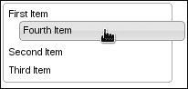
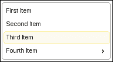
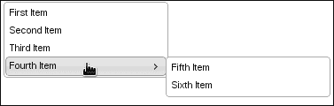
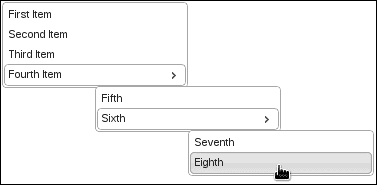
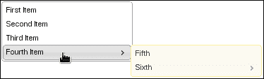

# 第六章：制作菜单

在本章中，我们将涵盖：

+   创建可排序的菜单项

+   高亮显示活动菜单项

+   使用效果与菜单导航

+   动态构建菜单

+   控制子菜单的位置

+   对子菜单应用主题

# 介绍

jQuery UI **菜单**小部件接受链接列表，并通过处理子菜单中的导航，以及应用主题框架中的类，将它们呈现为一个连贯的菜单。我们可以使用默认提供的选项来定制菜单到一定程度。在其他情况下，例如当我们希望菜单项可排序时，我们可以轻松地扩展小部件。

# 创建可排序的菜单项

默认情况下，菜单小部件保留用于创建菜单项的列出元素的顺序。这意味着如果在菜单小部件中使用的 HTML 的创建者更改了排序方式，这将反映在渲染的菜单中。这对开发人员来说很好，因为它让我们控制如何向用户呈现项目。但是，也许用户对菜单项的排序有更好的想法。

通过将菜单小部件与**sortable 交互**小部件相结合，我们可以为用户提供这种灵活性。然而，有了这种新的能力，我们将不得不解决另一个问题；保留用户选择的顺序。如果他们可以按自己的意愿安排菜单项，那就太好了，但是如果他们每次加载页面都必须重复相同的过程，那就不太好了。因此，我们还将看看如何在 cookie 中保存排序后的菜单顺序。

## 准备工作

让我们使用以下 HTML 代码为我们的菜单小部件。这将创建一个具有四个项目的菜单，所有项目都在同一级别： 

```js
<ul id="menu">
    <li id="first"><a href="#">First Item</a></li>
    <li id="second"><a href="#">Second Item</a></li>
    <li id="third"><a href="#">Third Item</a></li>
    <li id="fourth"><a href="#">Fourth Item</a></li>
</ul>
```

## 如何做到…

现在让我们看一下用于扩展菜单小部件以提供可排序行为的 JavaScript。

```js
(function( $, undefined ) {

$.widget( "ab.menu", $.ui.menu, {

    options: {
        sortable: false
    },

    _create: function() {

        this._super();

        if ( !this.options.sortable ) {
            return;
        }

        var $element = this.element,
            storedOrder = $.cookie( $element.attr( "id" ) ),
            $items = $element.find( ".ui-menu-item" );
        if ( storedOrder ) {

            storedOrder = storedOrder.split( "," );

            $items = $items.sort( function( a, b ) {

                var a_id = $( a ).attr( "id" ),
                    b_id = $( b ).attr( "id" ),
                    a_index = storedOrder.indexOf( a_id ),
                    b_index = storedOrder.indexOf( b_id );

                return a_index > b_index;

            });

            $items.appendTo( $element );

        }

        $element.sortable({

            update: function( e, ui ) {

                var id = $( this ).attr( "id" ),
                    sortedOrder = $( this ).sortable( "toArray" )
                                           .toString();

                $.cookie( id, sortedOrder );

            }

        });

    },

});

})( jQuery );

$(function() {
    $( "#menu" ).menu( { sortable: true } );
});
```

如果您在浏览器中查看此菜单，您会注意到您可以将菜单项拖到任何您喜欢的顺序中。此外，如果您刷新页面，您会看到顺序已经被保留了。



## 工作原理...

在本示例中创建的菜单实例被赋予了一个`sortable`选项值为`true`。这是我们添加到菜单小部件的新选项。我们大部分的扩展工作是在我们自己的`_create()`方法的重新呈现中执行的。我们在这里要做的第一件事是调用方法的原始实现，因为我们希望菜单像往常一样创建；我们通过使用`_super()`方法来做到这一点。从这里开始，我们将保持菜单项的排序顺序。

如果`sortable`选项的评估结果不为`true`，我们将退出，没有任何事情可做。如果此选项为`true`，且我们需要对菜单项目进行排序，我们尝试加载一个 Cookie，使用此菜单的 ID。此 Cookie 的值存储在一个名为`storedOrder`的变量中，因为它恰好代表了存储的用户排序。如果用户已经对菜单进行了排序，我们将菜单项目的顺序存储在 Cookie 中。例如，Cookie 值可能类似于`second,fourth,first,third`。这些是菜单项目的 ID。在我们分割逗号分隔列表时，我们得到了一个以正确顺序排列的菜单项目数组。

最后，我们必须将可排序交互小部件应用于菜单。我们将可排序配置传递给在更新排序顺序时使用的函数。使用可排序小部件的`toArray()`方法序列化菜单项目的排序顺序，并在此处使用菜单 ID 更新 Cookie 值。

关于此示例中使用 Cookie 有两件事情需要注意。首先，我们使用了 Cookie jQuery 插件。此插件体积小，在互联网上广泛使用。然而，值得一提的是，该插件不随 jQuery 或 jQuery UI 一起发布，您的项目将需要管理此依赖项。

第二个需要注意的事情是关于本地主机域。在所有浏览器中，Cookie 存储功能在本地将无法正常工作。换句话说，通过网络服务器查看时会正常工作。如果您真的需要在 Google Chrome 浏览器中测试此代码，您可以像我一样使用 Python 绕过它。在操作系统控制台中，运行以下代码：

```js
python -m SimpleHTTPServer
```

# 高亮显示活动菜单项目

对于菜单小部件，根据项目的配置方式，唯一能判断项目是否激活的方法是页面 URL 由于点击项目而改变。菜单项目不会明显地指示任何实际发生的事情。例如，菜单中的项目一旦被点击，可能会改变可视状态。如果开发人员在用户界面中使用菜单小部件作为导航工具，这将特别有帮助。让我们看看如何扩展菜单小部件的功能，以便使用主题框架的部分提供此功能。

## 准备就绪

我们将在这里使用以下 HTML 代码作为我们的菜单示例。请注意，此特定菜单具有嵌套子菜单：

```js
<ul id="menu">
    <li><a href="#first">First Item</a></li>
    <li><a href="#second">Second Item</a></li>
    <li><a href="#third">Third Item</a></li>
    <li>
      <a href="#forth">Fourth Item</a>
      <ul>
        <li><a href="#fifth">Fifth</a></li>
        <li><a href="#sixth">Sixth</a></li>
      </ul>
    </li
</ul>
```

## 如何做...

为了突出显示活动菜单项目，我们将需要通过一些额外规则扩展主题框架。

```js
.ui-menu .ui-menu-item {
    margin: 1px 0;
    border: 1px solid transparent;
}

.ui-menu .ui-menu-item a.ui-state-highlight { 
    font-weight: normal; 
    margin: -px; 
}
```

接下来，我们将通过新的`highlight`选项和必要的功能扩展菜单小部件本身。

```js
(function( $, undefined ) {

$.widget( "ab.menu", $.ui.menu, {

    options: {
      highlight: false
    },

    _create: function() {

      this._super();

        if ( !this.options.highlight ) {
          return;
        }

        this._on({
          "click .ui-menu-item:has(a)": "_click"
        });

    },

    _click: function( e ) {

      this.element.find( ".ui-menu-item a" )
        .removeClass( "ui-state-highlight" );

        $( e.target ).closest( ".ui-menu-item a" )
          .addClass( "ui-state-highlight ui-corner-all" );

    }

});

})( jQuery );

$(function() {
    $( "#menu" ).menu( { highlight: true });
});
```

如果您查看此菜单，您会注意到一旦选择了一个菜单项目，它会保持高亮状态。



## 工作原理...

我们在这里定义的 CSS 规则是为了使 `ui-state-highlight` 类在应用于菜单项时能够正常运行。首先，使用 `.ui-menu` `.ui-menu-item` 选择器，我们将 `margin` 设置为在应用 `ui-state-highlight` 类后适当对齐菜单项的内容。我们还给每个菜单项一个不可见的 `border`，以防止鼠标进入和鼠标离开事件将菜单项挤出位置。接下来的选择器，`.ui-menu` `.ui-menu-item` `a.ui-state-highlight`，适用于我们将 `ui-state-highlight` 类应用于菜单项后。这些规则还控制了定位，并防止菜单失去对齐。

切换到 JavaScript 代码，您可以看到我们为菜单部件提供了一个新的 `highlight` 选项。在我们自定义的 `_create()` 方法中，我们调用相同方法的原始实现，然后再添加我们的事件处理程序。由 jQuery UI 基础部件定义的 `_on()` 方法在这里用于将我们的事件处理程序绑定到 `click .ui-menu-item:has(a)` 事件；这个事件在 `menu` 部件内部也使用。在这个处理程序内部，我们从任何已经应用 `ui-state-highlight` 类的菜单项中删除它。最后，我们将 `ui-state-highlight` 类添加到刚刚点击的菜单项上，还添加了 `ui-corner-all` 类，该类通过主题属性定义了圆角元素。

# 使用菜单导航效果

在应用效果到菜单部件时，我们可以采取几种方法。我们在菜单部件中哪些地方可以应用效果？用户将鼠标指针悬停在菜单项上，这会导致状态更改。用户展开子菜单。这两个动作是我们可以通过一些动画来提升视觉效果的主要交互。让我们看看如何使用尽可能少的 JavaScript 来解决这些效果，而不是使用 CSS 过渡。过渡是一个新兴的 CSS 标准，迄今为止，并非所有浏览器都支持它们使用标准语法。然而，按照渐进增强的思路，以这种方式应用 CSS 意味着即使在不支持它的浏览器中，基本的菜单功能也会正常工作。我们可以避免编写大量 JavaScript 来对菜单导航进行动画处理。

## 准备工作

对于这个示例，我们可以使用任何标准的菜单 HTML 代码。理想情况下，它应该有一个子菜单，这样我们就可以观察到它们展开时应用的过渡效果。

## 如何做...

首先，让我们定义所需的 CSS 过渡，以便在菜单项和子菜单在状态更改时应用。

```js
.ui-menu-animated > li > ul {
    left: 0;
    transition: left 0.7s ease-out;
    -moz-transition: left .7s ease-out;
    -webkit-transition: left 0.7s ease-out;
    -o-transition: left 0.7s east-out;
}

.ui-menu-animated .ui-menu-item a {
    border-color: transparent;
    transition: font-weight 0.3s,
      color 0.3s,
      background 0.3s,
      border-color 0.5s;
    -moz-transition: font-weight 0.3s,
       color 0.3s,
       background 0.3s,
       border-color 0.5s;
    -webkit-transition: font-weight 0.3s,
       color 0.3s,
       background 0.3s,
       border-color 0.5s;
    -o-transition: font-weight 0.3s,
       color 0.3s,
       background 0.3s,
       border-olor 0.5s;
}
```

接下来，我们将介绍对菜单部件本身的一些修改，以控制任何给定菜单实例的动画功能。

```js
(function( $, undefined ) {

$.widget( "ab.menu", $.ui.menu, {

    options: {
        animate: false
    },

    _create: function() {

        this._super();

        if ( !this.options.animate ) {
            return;
        }

        this.element.find( ".ui-menu" )
                     .addBack()
                     .addClass( "ui-menu-animated" );

    },

  _close: function( startMenu ) {

        this._super( startMenu );

        if ( !this.options.animate ) {
            return;
        }

        if ( !startMenu ) {
            startMenu = this.active ? this.active.parent() : this.element;
        }

        startMenu.find( ".ui-menu" ).css( "left", "" );

          }

});

})( jQuery );

$(function() {
    $( "#menu" ).menu( { animate: true } );
});
```

现在，如果你在浏览器中查看这个菜单并开始与它交互，你会注意到应用悬停状态时的平滑过渡。你也会注意到，展开子菜单时，应用的过渡似乎将它们向右滑动。

## 它是如何工作的...

首先，让我们考虑一下定义了我们所看到应用到`menu`部件的过渡的 CSS 规则。`.ui-menu-animated > li > ul`选择器将过渡应用到子菜单上。声明的第一个属性`left: 0`只是一个初始化程序，允许某些浏览器更好地与过渡配合。接下来的四行定义了左属性的过渡。菜单部件在展开子菜单时，使用的是位置实用程序部件，它在子菜单上设置了`left`CSS 属性。我们在这里定义的过渡将在`0.7`秒的时间跨度内对`left`属性进行更改，并且会在过渡结束时减缓。

我们有多个过渡定义的原因是一些浏览器支持它们自己的供应商前缀版本的规则。因此，我们从通用版本开始，然后是特定于浏览器的版本。这是一个常见的做法，当浏览器特定的规则变得多余时，我们可以将其删除。

接下来是`.ui-menu-animated .ui-menu-item a`选择器，适用于每个菜单项。你可以看到这里的过渡涉及几个属性。在这个过渡中，每个属性都是`ui-state-hover`的一部分，我们希望它们被动画化。由于我们的调整，`border-color`过渡的持续时间稍长。

现在让我们看看将这个 CSS 运用到 JavaScript 的方法。我们通过添加一个新的`animate`选项来扩展菜单部件，该选项将上述定义的过渡应用到部件上。在我们的`_create()`方法版本中，我们调用了原始的`_create()`实现，然后将`ui-menu-animated`类应用到主`ul`元素和任何子菜单上。

延伸`_close()`方法的原因只有一个。这是在关闭子菜单时调用的。然而，当首次显示子菜单时，`left` CSS 属性是由`position`实用程序计算的。下一次显示时，它不必计算`left`属性。这是一个问题，因为很明显，如果我们尝试对`left`属性值进行动画更改，这会成为显而易见的问题。因此，我们只需要在关闭菜单时将`left`属性设置回`0`。

# 动态构建菜单

经常情况下，菜单在与用户交互时会发生变化。换句话说，我们可能需要在菜单实例化后扩展菜单的结构。或者在构建最终成为菜单部件的 HTML 时，可能并没有所有必要的信息可用；例如，菜单数据可能只以**JavaScript 对象表示法**（**JSON**）格式可用。让我们看看如何动态构建菜单。

## 准备

我们将从以下基本菜单 HTML 结构开始。我们的 JavaScript 代码将扩展这个结构。

```js
<ul id="menu">
    <li><a href="#">First Item</a></li>
    <li><a href="#">Second Item</a></li>
    <li><a href="#">Third Item</a></li>
</ul>
```

## 如何做...

让我们创建菜单小部件，然后我们将扩展菜单 DOM 结构。

```js
$(function() {

    var $menu = $( "#menu" ).menu(),
        $submenu = $( "<li><ul></ul></li>" ).appendTo( $menu );

    $submenu.prepend( $( "<a/>" ).attr( "href", "#" )
                                 .text( "Fourth Item" ) );

    $submenu.find( "ul" ).append( 
$( "<li><a href='#'>Fifth Item</a>" ) )
                                      .append( $( "<li><a href='#'>Sixth Item</a>" ) );

    $menu.menu( "refresh" );

});
```

当您查看这个菜单时，不再只有我们最初的三个项目，而是现在呈现了我们刚刚添加的三个新项目。



## 工作原理是什么...

如果我们在 JavaScript 代码中不断添加新的菜单项，我们只会看到最初的三个项目。但是，我们正在使用核心 jQuery DOM 操纵工具来构建和插入一个子菜单。之后，我们必须调用 `refresh()` 菜单方法，它会为新的菜单项添加适当的 CSS 类和事件处理程序。例如，如果我们将 DOM 插入代码移到 `menu` 小部件被实例化之前，则没有理由调用 `refresh()`，因为菜单构造函数会直接调用它。

## 还有更多...

上述方法在菜单中插入新项目确实有其缺点。一个明显的缺点是实际构建新菜单项和子菜单的 DOM 插入代码不易维护。我们的示例已经将结构硬编码了，而大多数应用程序通常不这样做。相反，我们通常至少有一个数据源，可能来自 API。如果我们可以传递给菜单小部件一个标准格式的数据源，那就太好了。菜单小部件将负责我们上面实现的底层细节。

让我们尝试修改代码，以便更多的责任移到菜单小部件本身。我们将以与上面的代码完全相同的结果为目标，但我们将通过扩展菜单小部件，并传入代表菜单结构的数据对象来实现。我们将使用完全相同的 HTML 结构。以下是新的 JavaScript 代码:

```js
(function( $, undefined ) {

$.widget( "ab.menu", $.ui.menu, {

    options: {
        data: false
    },

    _create: function() {

        this._super();

        if ( !this.options.data ) {
            return;
        }

        var self = this;

        $.each( this.options.data, function( i, v ) {
            self._insertItem( v, self.element );
        });

        this.refresh();

    },

    _insertItem: function( item, parent ) {

        var $li = $( "<li/>" ).appendTo( parent );

        $( "<a/>" ).attr( "id", item.id )
                   .attr( "href", item.href )
                   .text( item.text )
                   .appendTo( $li );

        if ( item.data ) {

            var $ul = $( "<ul/>" ).appendTo( $li ),
                self = this;

            $.each( item.data, function( i, v ) {
                self._insertItem( v, $ul );
            });

        }

    }

});

})( jQuery );

$(function() {

    $( "#menu" ).menu({
        data: [
            {
                id: "fourth",
                href: "#",
                text: "Fourth Item"
            },
            {
                id: "fifth",
                href: "#",
                text: "Fifth Item",
                data: [
                    {
                        id: "sixth",
                        href: "#",
                        text: "Sixth Item"
                    },
                    {
                        id: "seventh",
                        href: "#",
                        text: "Seventh Item"
                    }
                ]
            }
        ]
    });

});
```

如果您运行这段修改后的代码，您会发现结果与我们上面编写的原始代码没有任何变化。这种改进纯粹是一种重构，将难以维护的代码变成了更长寿的东西。

我们在这里引入的新选项 `data` 期望一个菜单项数组。该项是一个带有以下属性的对象：

+   `id`：它是菜单项的 id

+   `href`：它是菜单项链接的 href

+   `text`：它是项目标签的项

+   `data`：它是一个嵌套的子菜单

最后一个选项只是表示子菜单的菜单项嵌套数组。我们对 `_create()` 方法的修改将遍历数据选项数组（如果提供），并在每个对象上调用 `_insertItem()`。 `_insertItem()` 方法是我们引入的新东西，并不会覆盖任何现有的菜单功能。在这里，我们正在为传入的菜单数据创建必要的 DOM 元素。如果这个对象有一个嵌套的数据数组，也就是子菜单，那么我们会创建一个 `ul` 元素，并递归调用 `_inserItem()`，将 `ul` 作为父元素传递进去。

我们传递给菜单的数据比以前的版本更易读和可维护。 例如，现在传递 API 数据所需的工作相对较少。

# 控制子菜单的位置

菜单小部件使用位置小部件来控制任何子菜单在可见时的目的地。 默认情况下，将子菜单的左上角放置在展开子菜单的菜单项的右侧。 但是，根据我们的菜单大小、子菜单的深度和 UI 中围绕大小的其他约束，我们可能希望使用不同的默认值来设置子菜单的位置。

## 准备工作

我们将使用以下 HTML 结构来进行子菜单定位演示：

```js
<ul id="menu">
            <li><a href="#first">First Item</a></li>
            <li><a href="#second">Second Item</a></li>
            <li><a href="#third">Third Item</a></li>
            <li>
              <a href="#forth">Fourth Item</a>
              <ul>
                <li><a href="#fifth">Fifth</a></li>
                <li>
                  <a href="#sixth">Sixth</a>
                  <ul>
                    <li><a href="#">Seventh</a></li>
                    <li><a href="#">Eighth</a></li>
                    </ul>
                  </li>
                </ul>
            </li>
        </ul
```

## 如何做...

当我们实例化此菜单时，我们将传递一个`position`选项，如下所示：

```js
<ul id="menu">
            <li><a href="#first">First Item</a></li>
            <li><a href="#second">Second Item</a></li>
            <li><a href="#third">Third Item</a></li>
            <li>
                <a href="#forth">Fourth Item</a>
                <ul>
                    <li><a href="#fifth">Fifth</a></li>
                    <li>
                        <a href="#sixth">Sixth</a>
                        <ul>
                            <li><a href="#">Seventh</a></li>
                            <li><a href="#">Eighth</a></li>
                        </ul>
                    </li>
                </ul>
            </li>
        </ul>
```

当所有子菜单展开时，我们的菜单将与下图所示类似：



## 如何运作...

在前面的示例中，我们向菜单小部件传递的`position`选项与我们直接传递给位置小部件的选项相同。 位置小部件期望的`of`选项是活动菜单项或子菜单的父项。 所有这些选项都传递给`_open()`方法中的位置小部件，该方法负责展开子菜单。

# 将主题应用于子菜单

当菜单小部件显示子菜单时，外观上没有明显的区别。 也就是说，在视觉上，它们看起来就像是主菜单。 我们希望向用户展示主菜单和其子菜单之间的一点对比；我们可以通过扩展小部件以允许将自定义类应用于子菜单来实现这一点。

## 准备工作

让我们使用以下标记来创建带有几个子菜单的菜单小部件：

```js
<ul id="menu">
            <li><a href="#">First Item</a></li>
            <li><a href="#">Second Item</a></li>
            <li><a href="#">Third Item</a></li>
            <li>
                <a href="#">Fourth Item</a>
                <ul>
                    <li><a href="#">Fifth</a></li>
                    <li>
                        <a href="#">Sixth</a>
                        <ul>
                            <li><a href="#">Seventh</a></li>
                            <li><a href="#">Eighth</a></li>
                        </ul>
                    </li>
                </ul>
            </li>
        </ul>
```

## 如何做...

我们将通过添加一个新的`submenuClass`选项并将该类应用于子菜单来扩展菜单小部件，如下所示：

```js
(function( $, undefined ) {

$.widget( "ab.menu", $.ui.menu, {

    options: {
      submenuClass: false
    },

    refresh: function() {

      if ( this.options.submenuClass ) {

        this.element.find( this.options.menus + ":not(.ui-menu)" )
          .addClass( this.options.submenuClass );

        }

        this._super();

    }

});

})( jQuery );

$(function() {
    $( "#menu" ).menu( { submenuClass: "ui-state-highlight } );
});
```

下面是子菜单的外观：



## 如何运作...

在这里，我们使用一个新的`submenuClass`选项扩展了菜单小部件。 我们的想法是，如果提供了这个类，我们只想将它应用于小部件的子菜单。 我们通过重写`refresh()`菜单方法来实现这一点。 我们查找所有子菜单并将`submenuClass`应用于它们。 您会注意到，在调用原始实现此方法的`_super()`方法之前，我们应用了这个类。 这是因为我们正在寻找尚未具有`ui-menu`类的菜单。 这些是我们的子菜单。
