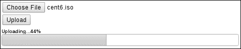
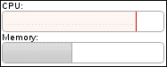
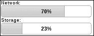
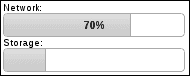

# 第七章：进度条

在本章中，我们将涵盖以下主题：

+   显示文件上传进度

+   动画化进度变化

+   创建进度指示器小部件

+   使用状态警告阈值

+   给进度条添加标签

# 介绍

**progressbar** 小部件相当简单——因为它没有太多的移动部分。事实上，它只有一个移动部分，即值栏。但是简单并不意味着进度条比其他小部件功能更弱。我们将看看如何在本章中利用这种简单性。进度条可以表达从文件上传进度到服务器端进程再到容量利用率的任何内容。

# 显示文件上传进度

如果有一种简单直接的方法可以使用进度条小部件显示文件上传的进度就好了。不幸的是，我们没有这样的奢侈。文件的上传发生在页面转换之间。然而，使用进度条小部件显示上传进度所需的必要技巧，由于现代标准和浏览器的发展，已经变得更加简洁。让我们看看如何利用**Ajax**请求中 XML HTTP 请求对象的 `onprogress` 事件。

## 准备工作

为了演示，我们将创建一个带有简单文件字段的简单表单。在表单内部，我们将创建一些用于显示进度条小部件的 HTML。它将在用户启动文件上传之前被隐藏。

```js
<form action="http://127.0.0.1:8000/" method="POST">
    <input type="file" name="fileupload"/>
    <br/>
    <input type="submit" value="Upload"/>
    <div id="upload-container" class="ui-helper-hidden">
        <strong id="upload-value">Uploading...</strong>
        <div id="upload-progress"></div>
    </div>
</form>
```

## 操作方法...

更新文件上传过程中更新进度条小部件所需的大部分工作实际上是在 Ajax 请求机制和 `onprogress` 事件处理程序中完成的。以下代码很好地说明了为什么小部件设计者应该以简单为目标。生成的小部件适用于各种情境。

```js
$(function() {

    $( "#upload-progress" ).progressbar();

    $( "form" ).submit( function( e ) {

        e.preventDefault();

        $.ajax({
            url: $( this ).attr("action"),
            type: "POST",
            data: new FormData( this ), 
            cache: false,
            contentType: false,
            processData: false,
            xhr: function() {

                xhr = $.ajaxSettings.xhr();

                if ( xhr.upload ) {
                    xhr.upload.onprogress = onprogress;
                }

                return xhr;

            }

        });

        return false;

    });

    var onprogress = function( e ) {

        var uploadPercent = ( e.loaded / e.total * 100 ).toFixed();

        $( "#upload-container" ).show();
        $( "#upload-value" ).text( "Uploading..." + uploadPercent + "%" );
        $( "#upload-progress" ).progressbar( "option", "max", e.total )
                               .progressbar( "value", e.loaded );

    }; 

});
```

如果您运行此示例并在本地上传文件到 `http://127.0.0.1:` `8000/`，您会希望使用一个较大的文件。较小的文件上传速度太快，时间太短。较大的文件上传将使您能够在上传过程中看到以下内容。



### 注意

本书中的代码附带了一个最小的 Python 服务器，用于提供此演示上传页面并处理文件上传请求。该示例可以很容易地重新排列以与任何上传服务器配合使用，但是提供的 Python 服务器只需要安装 Python 即可。再次强调，这不是一个要求，但如果您渴望看到客户端代码运行的话，这只是一个方便的服务器。

## 工作原理...

该示例的目标是实时更新进度条小部件，随着文件上传进度的改变而改变。有几个插件可以提供这种功能，但如果您正在编写 jQuery UI 应用程序，最好统一使用进度条小部件。一旦文档准备就绪，我们首先创建用于显示文件上传进度的进度条小部件。 `#upload-container` 最初使用`ui-helper-hidden`类隐藏，因为我们不需要在上传正在进行之前显示上传进度。

接下来，我们设置我们上传表单的`submit`事件的事件处理程序。在执行任何其他操作之前，此处理程序防止默认表单提交。本质上，我们用我们自己的行为替换了浏览器实现的默认表单提交。我们需要覆盖此行为的原因是为了留在页面上，并对我们的进度条小部件应用更新。

接下来，我们设置实际将我们选定的文件发送到服务器的`$.ajax()`调用。我们从表单本身获取`url`参数。接下来的几个参数是发送多部分表单数据的先决条件，包括作为 Ajax 请求的一部分的选定文件。 `xhr` 选项是我们提供返回`xhr`对象的函数，内部由`$.ajax()`函数使用。这是我们截取`xhr`对象并附加其他行为的机会。我们主要感兴趣的是向`onprogress`事件添加新行为。

确保上传对象`XMLHttpRequestUpload`实际存在后，我们可以定义我们的`onprogress`事件处理程序函数。

首先，我们使用事件的`loaded`和`total`属性计算实际上传百分比。接下来，我们显示进度容器，并使用`uploadPercent`中的值更新百分比标签。最后，我们确保上传进度条小部件的`max`选项设置为`total`，并使用`value()`方法设置进度条的当前值。

# 动画化进度变化

进度条小部件在设置`value`或`max`选项时会改变其视觉外观。例如， `value` 的默认值为`0`， `max` 的默认值为`100`。因此，当以这些值显示进度条小部件时，我们实际上并不看到图形化的条，然而这表示了进度百分比。但是，设置`value`选项将更新此条。如果条已经可见，则`value`选项的更改会导致进度条的宽度改变。使用默认进度条实现，这些更改会立即改变小部件。让我们看看如何修改小部件以支持进度条值之间的平滑过渡。

## 如何做...

我们将使用以下简单的标记作为我们进度条小部件实例的基础：

```js
<div id="progress"></div>
```

这里是用于定制进度条小部件以支持动画更改进度的 JavaScript 代码：

```js
(function( $, undefined ) {

$.widget( "ab.progressbar", $.ui.progressbar, {

    options: {
        animate: false
    },

    _refreshValue: function() {

        if ( !this.options.animate ) {
            return this._super();
        }

        var value = this.value(),
            percentage = this._percentage();

        if ( this.oldValue !== value ) {
            this.oldValue = value;
            this._trigger( "change" );
        }

        this.valueDiv.toggle( value > this.min )               .toggleClass( "ui-corner-right",
value === this.options.max )
                             .stop( true, true )
                             .animate( { width: percentage.toFixed( 0 ) + "%" }, 200 );

              this.element.attr( "aria-valuenow", value );

    }

});

})( jQuery );

$(function() {

    $( "#progress" ).progressbar( { animate: true } );

    var timer;

    var updater = function() {

        var value = $( "#progress" ).progressbar( "value" ) + 10,
            maximum = $( "#progress" ).progressbar( "option", "max" );

        if ( value >= maximum ) {
            $( "#progress" ).progressbar( "value", maximum );
            return;
        }

        $( "#progress" ).progressbar( "value", value );
        timer = setTimeout( updater, 700 );

    };

    timer = setTimeout( updater, 700 );

});
```

此示例包括一个更新器，将每 0.7 秒的间隔递增进度条值。您会注意到随着值的变化应用的平滑宽度过渡。与默认行为相比较，将`animate`选项设置为`false`，您现在将真正注意到每次更新值时进度条所做的视觉跳跃。

## 它是如何工作的...

我们的示例代码通过添加一个新的`animate`选项来扩展进度条小部件。新的`animate`选项默认为`false`。我们向进度条小部件引入的另一个更改是`_refreshValue()`方法的新实现，该方法在`value`选项更改时由小部件内部调用。此方法负责使`div`元素`progress`上的可视宽度发生变化。这代表了`value`和`max`之间的进度。

很多这段代码都是从`_refreshValue()`的原始实现中借鉴而来的，因为我们只做了些微的修改。首先，我们检查了我们添加到小部件中的`animate`选项是否为`true`值。如果不是，则我们继续使用原始实现。否则，我们使用相同的代码，但对应用宽度的方式进行了轻微调整。然后，我们调用`stop(true, true)`来完成当前动画并清除动画队列。接下来，我们不再像原始实现那样使用`width()`函数，而是通过调用`animate()`来设置宽度。

## 这还不是全部...

与往常一样，我们不局限于使用 jQuery 的`animate()`函数来对进度条值之间的视觉过渡应用效果。除了`animate()`函数之外，我们还可以将 CSS 过渡应用于进度条值。当然，缺点是并非所有浏览器都支持 CSS 过渡，并且我们涉及到特定于供应商的样式规则。尽管如此，让我们将先前的方法与使用 CSS 样式来动画进度条进行比较。

我们将使用相同的标记，但我们将向页面引入以下样式：

```js
.ui-progressbar-animated > .ui-progressbar-value {
    transition: width 0.7s ease-out;
    -moz-transition: width .7s ease-out;
    -webkit-transition: width 0.7s ease-out;
    -o-transition: width 0.7s east-out;
}
```

这里是 JavaScript 代码的必要更改。它看起来与之前的代码类似。

```js
(function( $, undefined ) {

$.widget( "ab.progressbar", $.ui.progressbar, {

    options: {
        animate: false
    },

    _create: function() {

        this._super();

        if ( !this.options.animate ) {
            return;
        }

        this.element.addClass( "ui-progressbar-animated" );

    }

});

})( jQuery );

$(function() {

    $( "#progress" ).progressbar( { animate: true } );

    var timer;

    var updater = function() {

        var value = $( "#progress" ).progressbar( "value" ) + 10,
            maximum = $( "#progress" ).progressbar( "option", "max" );

        if ( value >= maximum ) {
            $( "#progress" ).progressbar( "value", maximum );
            return;
        }

        $( "#progress" ).progressbar( "value", value );
        timer = setTimeout( updater, 700 );

    };

    timer = setTimeout( updater, 700 );

});
```

运行此示例将与先前的`animate`选项实现看起来并无太大不同。过渡行为将基本相同。这里的关键区别在于我们正在扩展主题框架。我们为进度条小部件引入了一个新的 CSS 类——`ui-progressbar-animated`。选择器`.ui-progressbar-animated > .ui-progressbar-value，`适用于进度条值`div`，即宽度发生变化的元素。而我们的新样式正是如此。它们在 0.7 秒的时间段内过渡宽度属性值的变化。

这种方法的主要受益者是 JavaScript 代码，因为进度条小部件的变化较少。例如，我们不再覆盖`_refreshValue()`方法。相反，我们正在覆盖`_create()`方法，并且如果`animated`选项为`true`，则在元素中添加`ui-progressbar-animated`类。这是我们新样式如何生效的方式。其余实例化小部件和值更新器的 JavaScript 与前一个示例没有任何不同。

# 创建进度指示器小部件

进度条小部件旨在显示某个过程的进度。最终目标是在创建小部件时指定的`max`选项，默认为`100`。如果我们事先知道正在处理的数据的大小，我们将使用`max`选项来反映此最终目标。但是，有时我们面临的情况是在客户端执行一些处理；或者，我们正在等待某个后端进程完成并将响应发送回客户端。例如，用户使用 API 启动了后端任务，现在他们正在等待响应。关键是，我们希望向用户说明正在进行进度，而不知道已经完成了多少进度。

为了显示进度正在进行，尽管不知道有多少进度，我们需要一个指示器小部件。我们可以编写自己的小部件来实现这一点，扩展进度条小部件，因为我们可以在那里重用许多组件。

## 如何做…

对于我们的进度指示器小部件，我们将使用与基本进度条小部件相同的 HTML。

```js
<div id="indicator"></div>
```

接下来，我们需要对进度条的 CSS 样式进行一些轻微的调整。这些应用于进度条`div`内部的值栏。我们去掉了`border`和`margin`，因为在来回滑动值栏时这样看起来更好。

```js
.ui-progressbar > .ui-progressbar-value {
    border: none;
    margin: 0px;
}
```

现在，我们来实现进度指示器小部件。此代码还将创建我们的进度指示器小部件的实例。

```js
(function( $, undefined ) {

$.widget( "ab.progressindicator", $.ui.progressbar, {

    _create: function() {

        this._super();
        this.value( 40 );
        this.element.removeClass( "ui-corner-all" );
        this.valueDiv.removeClass( "ui-corner-right ui-corner-left" );

        var self = this,
            margin = ( this.element.innerWidth() - this.valueDiv.width() ) + "px";

        var _right = function() {

            self.valueDiv.animate(
                { "margin-left": margin },
                { duration: 1000, complete: _left }
            );

        };

        var _left = function() {

            self.valueDiv.animate(
                { "margin-left": "0px" },
                { duration: 1000, complete: _right }
            );

        };

        _right();

    },

    _destroy: function() {

        this.valueDiv.stop( true, true );
        this._super();

    }

});

})( jQuery );

$(function() {

    $( "#indicator" ).progressindicator();

});
```

如果您在浏览器中查看此进度指示器小部件，您将看到它通过来回滑动进度条小部件的值栏来进行动画处理，表示正在发生某事。


## 它的工作原理…

我们创建了一个新的进度指示器小部件，继承了进度条小部件的功能。进度指示器小部件的目标是获取进度值栏`div`，在其中设置宽度，并在进度条容器`div`内滑动。视觉上，这表示幕后正在发生某事。这种图形化描述活动是对用户普遍令人放心的，因为它给人一种正在发生某事的感觉，并且应用程序没有崩溃。

在新进度指示器小部件的定义中，我们要重写的第一个方法是进度条的`_create()`方法。在这里，我们调用进度条小部件的原始构造函数，因为我们在开始进行更改之前需要所有的 UI 组件就位。接下来，我们使用`value()`方法为值条`div`设置宽度。我们在`progressindicator()`构造函数中硬编码了此值，只是因为使用此小部件的开发人员没有必要更改它；我们只需要设置元素的宽度。为了进一步简化此小部件，我们从元素中删除了角类。我们可以留下它们，但是在动画条时我们将不得不处理几种角例，因为我们追求的是一个简单的小部件，一个不需要开发人员进行配置的小部件。

仍然在`_create()`方法内部，我们定义了两个用于执行动画的实用函数。正如你可能猜到的那样，`_right()`函数将进度值条向右滑动，而`_left()`函数将其向左滑动。我们在该小部件的`valueDiv`属性上调用了`animate()`jQuery 函数。`_right()`函数通过更新`margin-left`值将值`div`向右滑动。您会注意到，`margin`变量在`_create()`内部局部定义。这是通过计算我们在值`div`右侧有多少空间来完成的，这意味着我们将此值设置为`margin-left`以将其向右滑动。要再次将其向左滑动，我们只需在`_left()`函数中将`margin-left` CSS 属性设置回`0px`。

通过在`_create()`方法的底部调用`_right()`来引导动画。通过将`_left()`作为初始动画的回调传递，进度指示器动画循环发生。同样，在`_left()`函数内部将`_right()`作为动画完成回调传递。此过程将继续直到小部件被销毁。我们的小部件重写了`_destroy()`方法，只是为了确保所有动画立即停止。这包括任何等待执行的排队动画。然后，我们通过调用原始的`_destroy()`实现来继续销毁小部件。

## 还有更多...

我们的进度指示器小部件的一个优点是它提供了一个非常简单的 API。您可以根据需要创建和销毁小部件，而无需处理任何中间步骤。理想情况下，这个小部件的寿命会非常短，可能只有一秒钟（刚好足够看到一个动画循环）。然而，有时候可能需要更长一点。如果这个小部件要长时间显示，它可能会对应用程序造成问题。jQuery 的`animate()`函数并不是设计成无限循环运行动画的。我们的小部件也不是设计成长时间显示的。问题在于`animate()`使用计时器，可能会大幅消耗客户端的 CPU 周期。这不仅可能对我们的应用程序造成破坏，还可能对在用户机器上运行的其他应用程序造成影响。

尽管这是一个相对较小的问题，让我们来看看我们的进度指示器小部件的另一种实现方式，即使用 CSS 动画。以下是我们如何在 CSS 中定义动画的方式：

```js
.ui-progressindicator > .ui-progressbar-value {
    border: none;
    margin: 0px;
    animation: indicator 2s ease-in-out infinite;
    -moz-animation: indicator 2s ease-in-out infinite;
    -webkit-animation: indicator 2s ease-in-out infinite;
}

@keyframes indicator {
    0%   { margin-left: 0px; }
    50%  { margin-left: 108px; }
    100% { margin-left: 0px; }
}

@-moz-keyframes indicator {
    0%   { margin-left: 0px; }
    50%  { margin-left: 108px; }
    100% { margin-left: 0px; }
}

@-webkit-keyframes indicator {
    0%   { margin-left: 0px; }
    50%  { margin-left: 108px; }
    100% { margin-left: 0px; }
}

@-o-keyframes indicator {
    0%   { margin-left: 0px; }
    50%  { margin-left: 108px; }
    100% { margin-left: 0px; }
}
```

并且，这是我们的`progressindicator`小部件的修改后的 JavaScript 实现，它知道如何利用先前的 CSS：

```js
(function( $, undefined ) {

$.widget( "ab.progressindicator", $.ui.progressbar, {

  _create: function() {

        this._super();
        this.value( 40 );
        this.element.addClass( "ui-progressindicator" )
                    .removeClass( "ui-corner-all" );
        this.valueDiv.removeClass( "ui-corner-right ui-corner-left" );

    },

    _destroy: function() {

        this.element.removeClass( "ui-progressindicator" );
        this._super();

    }

});

})( jQuery );

$(function() {

    $( "#indicator" ).progressindicator();

});
```

现在，如果你在浏览器中查看这个小部件的修改版本，你应该会发现与以前的实现相比几乎完全一样的结果。当然，关键的区别在于动画是在 CSS 中指定并直接由浏览器执行。与基于 JavaScript 的对应物相比，浏览器可以更有效地处理这些类型的 CSS 动画。浏览器只需要一次读取动画规范，然后在内部运行动画，使用本机代码而不是执行 JavaScript 并直接操作 DOM。我们可以让这个版本运行一整天，浏览器会愉快地继续运行。

但是这个版本的进度指示器并不是没有缺点的。首先，让我们仔细看看 CSS。事实上，我们依赖 CSS 动画本身并不是最好的选择，因为不同浏览器对其支持存在差异。在这里，通过我们的样式，我们将自己陷入了浏览器厂商前缀混乱的困境。总的来说，支持还不错，因为只有 IE 不支持 CSS 动画；但是动画的定义很直接。在`.ui-progressindicator > .ui-progressbar-value`选择器中，我们指定了指示器动画将运行`2`秒，并且会无限重复。`@keyframes`指示器动画指定了`margin-left`属性本身的变化方式。

在 JavaScript 中，你会注意到代码本身要简单得多。这是因为它现在负责的事情要少得多。主要是，在创建时需要将 `ui-progressindicator` 类添加到小部件的 DOM 元素上，并在销毁时删除该类。你还会注意到，在实现小部件的 JavaScript 代码中不再进行边距计算。相反，我们将这些数字移到了定义小部件动画的 CSS 中作为硬编码值。再次强调，这只是小部件设计者必须考虑的一个权衡。我们在 CSS 中交换了更高的维护成本以获得更高效的动画，并为我们的小部件提供了更简单的 JavaScript，以牺牲可疑的浏览器支持。

# 使用状态来警告阈值

进度条小部件不仅限于标记朝某个结束点的进展。它还可以用作某些资源利用的标记。例如，你的应用程序可能允许用户存储 100 MB 的图像数据。显示当前使用了多少容量可能是有意义的。进度条小部件是图形化显示此类资源利用情况的理想解决方案。更进一步，我们可能还希望警告用户关于使用阈值。也就是说，在某个百分比下，资源接近容量，但用户仍然有时间对此做出反应。

## 准备工作

为了演示，我们将为要显示的两个进度条小部件创建两个简单的 `div` 元素：

```js
<span>CPU:</span>
<div id="cpu-utilization"></div>
<span>Memory:</span>
<div id="memory-utilization"></div>
```

## 如何做...

下面是扩展进度条小部件的 JavaScript 代码，提供了一个新的选项来指定阈值：

```js
(function( $, undefined ) {

$.widget( "ab.progressbar", $.ui.progressbar, {

    options: {
        threshold: 0
    },

  _percentage: function() {

        var percentage = this._super(),
            threshold = this.options.threshold;

        if ( threshold <= 0 ) {
            return percentage;
        }

        if ( percentage > threshold ) {
            this.valueDiv.addClass( "ui-state-error" );
        }
        else {
            this.valueDiv.removeClass( "ui-state-error" );
        }

        return percentage;

  },

});

})( jQuery );

$(function() {

    $( "#cpu-utilization" ).progressbar( { threshold: 80 } );
    $( "#memory-utilization" ).progressbar( { threshold: 85 } );

    setInterval(function() {
        var cpu = Math.floor( ( Math.random() * 100 ) + 1 ),
            memory = Math.floor( ( Math.random() * 100 ) +1 );

        $( "#cpu-utilization" ).progressbar( "value", cpu );
        $( "#memory-utilization" ).progressbar( "value", memory );

    }, 1300);

});
```

我们在这里实例化了两个进度条小部件，并启动了一个基本的定时器间隔，每 1.30 秒更改一次两个进度条小部件的值。如果你在浏览器中查看此示例，你会注意到一个或两个进度条小部件将进入错误状态，因为值已超过提供的阈值。



## 工作原理...

我们添加到进度条小部件的新 `threshold` 选项是一个以百分比表示的数字。这是进度条的阈值，在这个阈值上，状态会改变以向用户发出视觉警告。这是通过重写 `_percentage()` 方法来实现的。在这里，我们通过调用 `_percentage()` 的原始实现并将其存储在 `percentage` 中来获得实际的百分比值。然后，我们确保 `threshold` 值非零，并且计算出的百分比大于 `threshold` 值。每次更新值时，进度条小部件都会内部调用 `_percentage()` 方法，并且视觉显示会发生变化。因此，在我们的 `_percentage()` 实现中，如果超过阈值，我们将 `ui-state-error` 类添加到 `valueDiv` 元素中，该元素是进度条内部移动的图形条。否则，我们低于阈值，并且必须确保删除 `ui-state-error` 类。

一旦我们创建了两个小部件，我们就使用 `setInterval()` 不断为两个进度条分配一个随机值。您可以坐下来观看进度条小部件如何根据输入的数据是否跨越我们指定的阈值而改变状态。在这种情况下，`#cpu-utilization` 进度条的阈值为 `80`%，而 `#memory-utilization` 进度条的阈值为 `85%`。

# 给进度条添加标签

反映进度百分比变化宽度的图形条表现得很好。进度条小部件的强大之处在于一眼就能看到已经完成了多少进度，或者正在利用多少资源。但有时候我们可能需要一些关于百分比的准确度，即显示底层百分比的标签。

进度条小部件具有在进度条容器内显示标签的功能，这比在小部件外部显示百分比标签更直观。让我们看看如何扩展主题 CSS，为小部件提供额外的标记，并扩展进度条以利用这些新的附加功能来显示标签。

## 如何操作...

我们首先为我们的两个进度条小部件创建 HTML。

```js
<span>Network:</span>
<div id="network-utilization">
    <div class="ui-progressbar-label"></div>
</div>
<span>Storage:</span>
<div id="storage-utilization">
    <div class="ui-progressbar-label"></div>
</div>
```

接下来，我们将添加进度条标签所需的 CSS 类。

```js
.ui-progressbar-label {
    float: left;
    width: 100%;
    text-align: center;
    margin-top: 5px;
    font-weight: bold;
}
```

最后，我们将扩展进度条小部件本身，将这个新的 HTML 和新的 CSS 绑定在一起。

```js
(function( $, undefined ) {

$.widget( "ab.progressbar", $.ui.progressbar, {

    _create: function() {
        this.$label = this.element.find( ".ui-progressbar-label" );
        this._super();

    },

    _destroy: function() {

        this.$label.remove();

        this._super();

    },

  _refreshValue: function() {
        this.$label.text( this._percentage().toFixed( 0 ) + "%" );
        this._super();

  },

});

})( jQuery );

$(function() {

    $( "#network-utilization" ).progressbar({
        value: 746586112,
        max: 1073741824
    });

    $( "#storage-utilization" ).progressbar({
        value: 24696061952,
        max: 107374182400
    });

});
```

您现在可以在浏览器中查看这两个进度条，您会注意到两个标签显示百分比值的位置位于小部件的中心。



## 它是如何工作的...

默认情况下，进度条小部件不支持标签，因此我们必须将标签 `div` 放在进度条 `div` 中。我们还给这个新的标签 `div` 添加了 `ui-progressbar-label` 类，这与 jQuery UI 主题命名规范一致。这个类实际上有两个作用：在我们引入的小部件自定义中，我们使用这个类来搜索标签 `div` 并应用标签样式。

在 `ui-progressbar-label` 中指定的 CSS 规则有助于将标签文本定位在进度条元素的中间。我们给标签 `div` 一个宽度为 `100%`，并使用 `text-align` 属性水平对齐文本。最后，我们使标签的 `font-weight` 为 `bold` 以使其突出显示；否则，在进度条的背景下很难看到它。

我们在这里介绍的进度条小部件的自定义 JavaScript 实现覆盖了 `_create()` 方法。我们创建了一个称为 `labelDiv` 的新实例变量，它存储对我们新元素的引用。然后我们调用原始的 `_create()` 实现，构造函数继续正常进行，创建我们的新标签元素旁边的值 `div`。我们还重写了 `_refreshValue()` 方法以更新 `labelDiv` 的内容。`_refreshValue()` 方法在任何时候内部被小部件调用，当值改变并且进度条小部件需要更新值显示时，会更新 `labelDiv` 的值。我们通过在恢复 `_refreshValue()` 的原始实现之前使用 `_percentage()` 数字来扩展此行为。

## 还有更多...

我们实施进度条标签的这种方法可能遇到的一个潜在问题是，我们必须改变 HTML 结构。这违反了 DRY 原则，因为我们为每个创建的进度条小部件添加的每个标签 `div` 都是完全相同的。此外，我们可能希望为已存在于应用程序中的进度条小部件应用标签。改变已经正常工作的小部件的 HTML 不是最好的方法。让我们想想如何改进之前的代码。

我们创建的用于定位和样式化标签元素的 CSS 是可以的。它遵循正确的命名约定，并适用于所有进度条小部件实例。我们想要更改的是用于实例化带有显示的标签的进度条小部件的必要标记。问题是如何。理想情况下，通过一个选项，让开发人员切换标签的显示和隐藏。然后小部件本身将负责在必要时插入标签 `div`，因为它对于小部件的所有实例都是相同的，这反过来意味着最小的 JavaScript 代码。

让我们看一下简化的标记，遵循与之前相同的例子:

```js

<span>Network:</span>
<div id="network-utilization"></div>
<span>Storage:</span>
<div id="storage-utilization"></div>
```

我们现在回到了进度条小部件在我们引入修改之前期望的原始标记。 现在让我们更新小部件代码以利用这个标记，通过添加一个新选项。

```js
(function( $, undefined ) {

$.widget( "ab.progressbar", $.ui.progressbar, {

    options: {
        label: false
    },

    _create: function() {

        if ( !this.options.label ) {
            return this._super();
        }

        this.$label = $( "<div/>" ).addClass( "ui-progressbar-label" )
                                   .appendTo( this.element );

        this._super();

    },

    _destroy: function() {

        if ( !this.options.label ) {
            return this._super();
        }

        this.$label.remove();

        this._super();

    },

    _refreshValue: function() {

        if ( !this.options.label ) {
            return this._super();
        }

        this.$label.text( this._percentage().toFixed( 0 ) + "%" );

        this._super();

    },

});

})( jQuery );

$(function() {

    $( "#network-utilization" ).progressbar({
        value: 746586112,
        max: 1073741824,
        label: true
    });

    $( "#storage-utilization" ).progressbar({
        value: 24696061952,
        max: 107374182400
    });

});
```

在这里，我们通过新的`label`选项扩展了进度条小部件，该选项默认为`false`。 思路是当这个值为`true`时，我们将`label div`插入到进度条容器中。 我们对`_create()`和`_refreshValue()`方法的修改基本与先前的代码相同，只是现在我们在执行自定义行为之前检查`label`选项是否已打开。 正如您所看到的，我们将这个新的标签选项提供给了`#network-utilization` div，但没有提供给`#storage-utilization` div。


