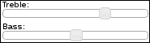
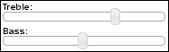
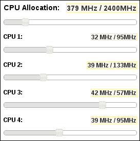
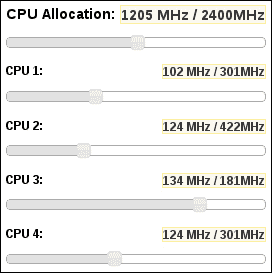
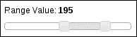
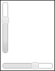

# 第八章：使用滑块

在本章中，我们将涵盖：

+   控制滑块手柄的大小

+   移除焦点轮廓

+   使用主滑块和子滑块

+   标记步进增量

+   获取范围值

+   更改滑块方向

# 介绍

**滑块**部件几乎就像一个用户可以操纵的进度条。滑块给用户一个手柄，可以沿平面拖动以产生所需值。这在处理表单值时尤其有用。滑块部件默认具有有用的选项，如更改方向的能力和允许用户选择值范围。在本章中，我们将看看通过添加新选项或附加事件处理函数来调整滑块部件的各种方法。我们还将研究一些视觉调整以及滑块实例如何相互通信。

# 控制滑块手柄的大小

用于控制滑块位置的**滑块手柄**，由鼠标拖动，是一个正方形。也就是说，宽度与高度相同，而我们可能想要不同形状的滑块手柄。在**水平滑块**的情况下，即默认方向，让我们看看如何通过覆盖部件 CSS 样式来改变滑块手柄的形状，以满足我们应用程序的需求。

## 准备好...

我们将创建的 HTML 是两个滑块部件。我们还将为它们添加标签，并将它们各自包装在容器 div 元素中以控制布局。

```js
<div class="slider-container">
    <span>Treble:</span>
    <div id="treble"></div>
</div>
<div class="slider-container">
    <span>Bass:</span>
    <div id="bass"></div>
</div>
```

## 如何做...

这是用于自定义滑块手柄的 CSS。这覆盖了部件 CSS 中定义的值，因此应包含在 jQuery UI 样式表之后的页面中：

```js
.ui-slider-horizontal .ui-slider-handle {
    width: 0.8em;
    height: 1.6em;
    top: -0.48em;
}
```

以下是用于创建两个滑块部件实例的 JavaScript 代码：

```js
$(function() {

    $( "#treble" ).slider();
    $( "#bass" ).slider();

});
```

作为参考，这是应用我们自定义 CSS 前两个滑块部件的外观：



这是应用我们自定义 CSS 后的相同两个滑块部件：



## 它的工作原理...

如您所见，手柄变得更高，延伸到滑块边界之外。这为用户提供了更大的点击和拖动滑块手柄的表面积。我们引入的确切尺寸变化是任意的，可以根据每个应用程序进行调整。

`.ui-slider-horizontal .ui-slider-handle` 选择器覆盖了部件 CSS 中定义的三个属性。宽度被改变为 `0.8em`，使其略微变细。`height` 属性的值被改为 `1.6em`，使其变得更高。当我们使用 `height` 属性使手柄变高时，我们将其向下推，以使其不再与滑块对齐。为了弥补高度变化，我们通过减少 `top` 值来将其拉回上来，直到 `-0.48em`。

# 移除焦点轮廓

大多数浏览器在接收到焦点时在元素周围显示虚线或实线**轮廓**。这不是用户界面样式的一部分，而是浏览器内置的辅助功能特性。例如，滑块手柄周围的这种强制视觉显示并不总是理想的。让我们看看我们如何取消滑块手柄的默认浏览器行为。

## 如何做到...

我们可以使用任何基本的`div`元素来构建我们的示例滑块小部件。所以让我们直接跳转到我们的自定义滑块小部件 CSS。

```js
.ui-slider-handle-no-outline {
    outline: 0;
}
```

现在，我们已经有了我们的滑块小部件的自定义实现和我们自定义滑块的一个实例。

```js
(function( $, undefined ) {

$.widget( "ab.slider", $.ui.slider, {

    options: { 
        handleOutline: true
    },

    _create: function() {

        this._super();

        if ( this.options.handleOutline ) {
            return;
        }

        this.handles.addClass( "ui-slider-handle-no-outline" );

    }

});

})( jQuery );

$(function() {

    $( "#slider" ).slider({
        handleOutline: false,
    });

});
```

在对滑块小部件应用我们的更改之前，拖动手柄后轮廓看起来如下所示：


在对滑块小部件应用我们的更改后，拖动手柄后我们的滑块实例如下所示：


## 工作原理...

我们已经为滑块小部件添加了一个名为`handleOutline`的新选项。我们将此选项默认设置为`true`，因为始终支持原生浏览器行为是一个好主意。当此选项设置为`false`时，该选项会关闭此原生边框轮廓功能。它通过向滑块中的每个手柄元素添加`ui-slider-handle-no-outline`类来实现。一个滑块中可以有很多手柄，例如，一个范围滑块。因此，在`_create()`方法中，我们检查`handleOutline`选项是否为`true`，如果是，我们使用存储为该小部件属性的`handles` jQuery 对象来应用我们创建的新类。

类本身很简单，因为它只改变了一个属性。事实上，我们可以简单地将`outline`属性添加到`ui-slider-handle`类中，值为`0`，而不是创建一个新类。但是，我们选择的方法允许我们保持本地小部件样式不变，这样可以让轮廓浏览器功能为我们的小部件的每个实例切换打开或关闭。您还会注意到，即使没有本地浏览器轮廓，手柄也不会失去任何可访问性，因为 jQuery UI 状态类为我们处理了这个问题。

# 使用主滑块和子滑块

应用程序可能会使用一些可以进一步分解为较小值的数量。此外，用户可能需要控制这些较小值，而不仅仅是聚合值。如果我们决定使用滑块小部件来实现这个目的，我们可以想象子滑块观察主滑块的变化值。让我们看看如何实现这样一组滑块。我们将设计一个界面，允许我们分配该应用程序可以使用多少 CPU。这是**主滑块**。我们假设一个四核架构，因此我们将有四个依赖于主 CPU 滑块并观察主 CPU 滑块的子滑块。

## 如何做到...

这里是用于定义我们的五个滑块布局的 HTML。每个滑块都有自己的 `div` 容器，主要用于定义宽度和边距。在 `div` 容器内，我们有每个 CPU 的标签，它们的当前 MHz 分配和最大值。这也是放置每个滑块小部件的地方。

```js
<div class="slider-container">
    <h2 class="slider-header">CPU Allocation:</h2>
    <h2 class="slider-value ui-state-highlight"></h2>
    <div class="ui-helper-clearfix"></div>
    <div id="master"></div>
</div>

<div class="slider-container">
    <h3 class="slider-header">CPU 1:</h3>
    <h3 class="slider-value ui-state-highlight"></h3>
    <div class="ui-helper-clearfix"></div>
    <div id="cpu1"></div>
</div>

<div class="slider-container">
    <h3 class="slider-header">CPU 2:</h3>
    <h3 class="slider-value ui-state-highlight"></h3>
    <div class="ui-helper-clearfix"></div>
    <div id="cpu2"></div>
</div>

<div class="slider-container">
    <h3 class="slider-header">CPU 3:</h3>
    <h3 class="slider-value ui-state-highlight"></h3>
    <div class="ui-helper-clearfix"></div>
    <div id="cpu3"></div>
</div>

<div class="slider-container">
    <h3 class="slider-header">CPU 4:</h3>
    <h3 class="slider-value ui-state-highlight"></h3>
    <div class="ui-helper-clearfix"></div>
    <div id="cpu4"></div>
</div>
```

接下来，我们有一些 CSS 样式来帮助对齐和定位这些组件。

```js
.slider-container { 
    width: 200px;
    margin: 5px;
}

.slider-header {
    float: left;
}

.slider-value {
    float: right;
}
```

最后，我们有我们的 JavaScript 代码，该代码扩展了滑块小部件，为使用它的开发人员提供了两个新选项，`parent` 和 `percentage`。文档加载时，我们实例化了我们的 CPU 滑块小部件，并利用我们的新滑块功能来建立它们之间的适当关系。

```js
(function( $, undefined ) {

$.widget( "ui.slider", $.ui.slider, {

    options: {
        parent: null,
        percentage: null
    },

    _create: function() {

        this._super();

        var parent = this.options.parent,
            percentage = this.options.percentage,
            $parent;

        if ( !( parent && percentage ) ) {
            return;
        }

        $parent = $( parent );

        this._reset( $parent.slider( "value" ) );

        this._on( $parent , { 
            slidechange: function( e, ui ) {
                this._reset( ui.value );
            }
        });

    },

    _reset: function( parentValue ) {

        var percentage = ( 0.01 * this.options.percentage ),
            newMax = percentage * parentValue,
            oldMax = this.option( "max" ),
            value = this.option( "value" );

        value = ( value / oldMax ) * newMax;

        this.option( "max", newMax );
        this.option( "value", value );

    }

});

})( jQuery );

$(function() {

    function updateLabel( e, ui ) {

        var maxValue = $( this ).slider( "option", "max" )
                                .toFixed( 0 ),
            value = $( this ).slider( "value" )
                             .toFixed( 0 ) + " MHz" +
                                             " / " + 
                                             maxValue + 
                                             "MHz";

        $( this ).siblings( ".slider-value" ).text( value );

    }

    $( "#master" ).slider({
        range: "min",
        value: 379,
        min: 1,
        max: 2400,
        create: updateLabel,
        change: updateLabel
    });

    $( "#cpu1" ).slider({
        parent: "#master",
        percentage: 25,
        range: "min",
        min: 0,
        create: updateLabel,
        change: updateLabel
    });

    $( "#cpu2" ).slider({
        parent: "#master",
        percentage: 35,
        range: "min",
        min: 0,
        create: updateLabel,
        change: updateLabel
    });

    $( "#cpu3" ).slider({
        parent: "#master",
        percentage: 15,
        range: "min",
        min: 0,
        create: updateLabel,
        change: updateLabel
    });

    $( "#cpu4" ).slider({
        parent: "#master",
        percentage: 25,
        range: "min",
        min: 0,
        create: updateLabel,
        change: updateLabel
    });

});
```

在浏览器中查看结果滑块小部件，并调整一些子 CPU 值。您会注意到标签更新已经改变，并且每个 CPU 都有其自己的 CPU 分配。



现在，保持 CPU 值不变，尝试调整主 CPU 分配滑块。您会注意到每个子 CPU 滑块的当前值和最大值都会改变，但比例是保持不变的。这意味着如果我们设置 CPU 1 使用总体 CPU 分配的 10%，即使总体分配增加或减少，它仍将继续使用 10%。



## 工作原理...

在我们为 CPU 滑块创建的每个容器 `div` 元素中，我们都有一个名为 `slider-value` 的头部，用于显示滑块的当前值以及最大值。这是一个需要在大多数情况下考虑的重要补充，而滑块小部件则非常适合让用户更改值，但他们需要特定的反馈来显示他们操作的结果。在这个例子中，更改主滑块会更新五个标签，进一步凸显了在用户能够看到的滑块外部标记特定滑块值的必要性。

我们在滑块小部件中新增了两个选项，`parent` 和 `percentage`。这两个选项彼此相关，基本上可以理解为"此滑块的最大值是其父级滑块值的百分比"。在 `_create()` 方法中，我们在继续之前会检查这两个选项是否有实际值，因为它们默认为`null`。如果没有值，我们已经使用 `_super()` 方法调用了原始滑块构造函数，因此我们可以安全地返回。

另一方面，如果我们已经得到了一个父级滑块小部件和一个百分比，我们将调用`_reset()`方法，并将当前值传递给我们的父级滑块。这将可能更新此小部件的最大值和当前值。完成这些操作后，我们设置了一个观察者，用于观察父级滑块的更改。这是使用`_on()`方法完成的，我们在其中传递`parent`作为我们正在监听事件的元素以及配置对象。该对象具有一个`slidechange`事件，这是我们感兴趣的事件，以及回调函数。在回调函数内部，我们只是使用来自父级的更新值简单地调用了我们的`_reset()`方法。值得注意的是，我们必须使用`_on()`来注册我们的事件处理程序。如果销毁了子滑块，事件处理程序将从父级中删除。

`_reset()`方法接受来自父级滑块的值，并重置此子滑块的`值`和`最大`选项。我们在首次创建子元素和父元素值更改时都使用此方法。目标是保持当前值/最大值比率。这就是`percent`选项发挥作用的地方。由于这作为整数传递给小部件，我们必须将其乘以`0.01`。这是我们计算出该子级的新最大值的方法。一旦我们有了新的最大值，我们就可以将当前值放大或缩小。

最后，在文档准备就绪的事件处理程序中，我们实例化了五个滑块小部件，在其中定义了一个用于更新每个 CPU `div` 中标签的通用回调函数。这个函数被传递给了每个滑块小部件的创建和更改选项。我们还在这里使用了我们新定义的选项的值。每个子滑块都有一个独特的总 CPU 分配的`百分比`值，并且每个子元素都使用`#master`作为其`父级`。

# 标记步长增量

滑块小部件可以传递一个步长值，该值确定用户可以滑动手柄的增量。如果未指定，`步长`选项为`1`，手柄会平滑地来回滑动。另一方面，如果`步长`值更加明显，比如`10`，我们会注意到随着移动手柄而手柄会吸附到位置。让我们看看我们如何扩展滑块小部件以使用户更好地感受到这些增量的位置。我们将使用刻度来在视觉上标记增量。

## 如何做...

我们将直接进入用于此小部件增强的自定义 CSS。用于滑块元素的基础`div`元素可以简单地是`<div></div>`。

```js
.ui-slider-tick {
    position: absolute;
    width: 2px;
    height: 15px;
    z-index: -1;
}
```

这是我们的 JavaScript 代码，扩展了滑块并使用新的`ticks`选项创建了小部件的实例：

```js
(function( $, undefined ) {

$.widget( "ab.slider", $.ui.slider, {

    options: {
        ticks: false
    },

    _create: function() {

        this._super();

        if ( !this.options.ticks || this.options.step < 5 ) {
            return;
        }

        var maxValue = this.options.max,
            cnt = this.options.min + this.options.step,
            background = this.element.css( "border-color" ),
            left;

        while ( cnt < maxValue ) {

            left = ( cnt / maxValue * 100 ).toFixed( 2 ) + "%";

            $( "<div/>" ).addClass( "ui-slider-tick" )
                         .appendTo( this.element )
                         .css( { left: left,
                                 background: background } );

            cnt += this.options.step;

        }

    }

});

})( jQuery );

$(function() {

    $( "#slider" ).slider({
        min: 0,
        max: 200,
        step: 20,
        ticks: true
    });

});
```

查看此滑块小部件，我们可以看到我们指定的`步长`值`20`在滑块下方使用刻度标记来表示。


## 工作原理...

让我们检查我们已经引入到滑块小部件中的附加功能。我们添加了`ticks`布尔选项，默认情况下关闭。当这个选项为真时，告诉小部件使用刻度标记显示步进增量。在`_create()`方法中，我们使用`_super()`调用了原始的`_create()`实现，因为我们希望滑块按照正常方式构造。然后，我们检查`ticks`选项是否已打开，以及`step`值是否大于`5`。如果已打开`ticks`选项并且我们有一个小于`5`的`step`值，它们将看起来彼此靠近；所以我们简单地不显示它们。

计数器变量`cnt`控制着我们的刻度渲染循环，并初始化为`min`选项上方的第一个`step`。同样，循环在`max`选项值之前退出。这是因为我们不想在滑块的开头或结尾渲染刻度标记，而只想在中间部分显示。变量`background`用于从滑块小部件中提取`border-color` CSS 属性。我们实际上在这里所做的是将主题设置传递给我们要添加到小部件中的新元素。这允许主题被交换，刻度标记的颜色也会相应更改。

在`while`循环内，我们正在创建代表刻度标记的`div`元素。`left` CSS 属性被计算为实际定位`div`，使其与用户移动手柄时的滑块手柄对齐。我们将`ui-slider-tick` CSS 类添加到`div`元素中，配置每个刻度标记的公共属性，包括`z-index`，将`div`的一部分推到主滑块栏的后面。

# 获取范围数值

滑块小部件可用于控制范围值。因此，用户不是在滑块轴上来回移动一个固定点，即手柄，而是在两个手柄之间来回移动。这两个点之间的空间表示范围值。但是我们如何计算这个数字呢？滑块小部件给我们提供了原始数据，即用户选择的上限和下限。我们可以在我们的事件处理程序中使用这些值来计算范围值。

## 准备工作...

我们将仅使用基本的滑块进行演示，但我们需要一些支持的 CSS 和 HTML 来包围滑块，以便在更改时显示范围值。以下是 CSS：

```js
.slider-container { 
    width: 180px;
    margin: 20px;
}

.slider-container .slider-label {
    margin-bottom: 10px;
    font-size: 1.2em;
}
```

这是 HTML 代码：

```js
<div class="slider-container">
    <div class="slider-label">
        <span>Range Value: </span>
        <strong id="range-value"></strong>
    </div>
    <div id="slider"></div>
</div>
```

## 操作方法...

我们将使用以下 JavaScript 代码创建`slider`实例。请注意，我们传递了支持范围选择的特定选项。

```js
$(function() {

    $( "#slider" ).slider({
        min: 0,
        max: 600,
        values: [280, 475],
        range: true,
        create: function( e, ui ) {
            var values = $( this ).data( "uiSlider" ).values();
            $( "#range-value" ).text( values[1] - values[0] );
        },
        change: function( e, ui ) {
            $( "#range-value" ).text( ui.values[1] - ui.values[0] );
        }
    });

});
```

现在，当您在浏览器中查看此滑块时，您会注意到范围值显示为小部件外的标签。而且，如果您移动滑块手柄中的任何一个，标签将反映更改的范围值。



## 工作原理...

在这个例子中，我们正在创建一个简单的滑块小部件，它使用一系列值而不是单个值。我们通过将值数组传递给小部件构造函数，并将`range`值传递给构造函数，以此来实现。这就是小部件知道要使用两个手柄而不是一个，并填充它们之间的空间的方式。我们还将滑块构造函数与两个事件回调函数一起传递：一个用于`create`事件，另一个用于`change`事件。

这两个回调函数执行相同的操作：它们计算范围值并将其显示在我们的`#range-value`标签中。然而，这两个回调函数以稍微不同的方式实现相同的逻辑。`create`回调函数不包含`ui`对象的`values`数组，该数组用于保存小部件数据。因此，在这里我们的解决方法是使用`uiSlider`数据，该数据保存了 JavaScript 滑块小部件实例，以便访问`values()`方法。这将返回传递给 change 事件回调函数的`ui`对象中找到的相同数据。

我们在这里计算的数字只是第一个手柄的值减去第二个手柄的值。例如，如果我们在表单中使用这样的滑块，API 可能不关心由两个滑块手柄表示的两个值，而只关心由这两个数字导出的范围值。

# 更改滑块方向

默认情况下，滑块小部件将水平呈现。我们可以通过`orientation`选项轻松将滑块方向更改为垂直布局。

## 操作步骤...

我们将使用以下 HTML 来定义我们的两个小部件。第一个滑块将是垂直的，而第二个则使用默认的水平布局：

```js
<div class="slider-container">
    <div id="vslider"></div>
</div>

<div class="slider-container">
    <div id="hslider"></div>
</div>
```

接下来，我们将使用以下 JavaScript 代码实例化这两个小部件：

```js
$(function() {

    $( "#vslider" ).slider({
        orientation: "vertical",
        range: "min",
        min: 1,
        max: 200,
        value: 128
    });

    $( "#hslider" ).slider({
        range: "min",
        min: 0,
        max: 200,
        value: 128
    });

});
```

如果您在浏览器中查看这两个滑块，您可以看到垂直布局和默认水平布局之间的对比：



## 工作原理...

我们在这里创建的两个滑块小部件，`#vslider`和`#hslider`，在内容上是相同的。唯一的区别是`#vslider`实例是使用`orientation`选项设置为`vertical`创建的。`#hslider`实例没有指定`orientation`选项，因此使用默认的`horizontal`。它们之间的关键区别在于布局，正如我们的示例中明显的那样。布局本身由`ui-slider-vertical`和`ui-slider-horizontal`CSS 类控制，这两个类是互斥的。

控制滑块的方向是有价值的，这取决于你想把小部件放在 UI 上下文中的位置。例如，包含元素可能没有太多的水平空间，所以在这里使用垂直方向选项可能是个不错的选择。然而，要小心动态改变滑块的方向。手柄有时会从滑块条中脱离。因此，在设计时最好确定方向。
