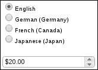
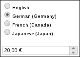
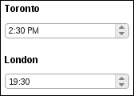
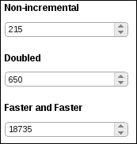
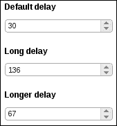
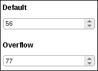

# 第九章：使用旋转器

在本章中，我们将涵盖：

+   移除输入焦点轮廓

+   为本地文化格式化货币

+   为本地文化格式化时间

+   控制值之间的步骤

+   指定旋转溢出

+   简化旋转器按钮

# 介绍

在本章中，我们将使用旋转器。 **旋转器** 只不过是文本`input`元素上的装饰品。但与此同时，它还有很多其他用途。例如，旋转器在本章中将有助于将数字格式化为本地文化。我们还将探讨旋转器小部件提供的一些选项，以及如何扩展和改进这些选项。最后，我们将看一些修改旋转器小部件外观和感觉的方法。

# 移除输入焦点轮廓

大多数浏览器在用户从中获得焦点时，将自动在`input`元素周围应用输入焦点轮廓。当用户单击`input`元素或通过标签到达时，元素会获得焦点。旋转器小部件本质上是一个带有装饰的`input`元素。这包括利用 CSS 主题框架中的内在 jQuery 状态类的能力。虽然浏览器的自动聚焦行为对于单独的`input`元素可能效果很好，但是这些焦点环可能会使旋转器看起来有点凌乱。让我们看看如何删除自动焦点轮廓，同时保持相同的可访问性水平。

## 如何做...

对于这个示例，我们将创建一个简单的`input`元素。以下是 HTML 结构的样子。

```js
<div class="spinner-container">
    <input id="spinner"/>
</div>
```

这是与我们的小部件修改一起使用的自定义 CSS，以移除焦点轮廓。

```js
.ui-spinner-input-no-outline {
    outline: 0;
}
```

最后，这是我们的 JavaScript 代码，它修改了旋转器小部件的定义，并创建了一个实例，浏览器不会自动应用任何轮廓。

```js
(function( $, undefined ) {

$.widget( "ab.spinner", $.ui.spinner, {

    options: {        
inputOutline: true    
},

    _create: function() {

        this._super();

        if ( this.options.inputOutline ) {            
return;        
}

        this.element.addClass( "ui-spinner-input-no-outline" );
        this._focusable( this.uiSpinner );

    }
});

})( jQuery );

$(function() {

    $( "#spinner" ).spinner( { inputOutline: false } );

});
```

为了让您更好地了解我们引入的更改，这就是我们在对旋转器定义进行修改之前创建的旋转器小部件的外观。


在这里，您可以清楚地看到`input`元素具有焦点，但是我们可以不使用双重边框，因为它与我们的主题不太匹配。以下是在引入我们的更改后处于焦点状态的相同小部件的修改版本。


我们不再有焦点轮廓，当小部件获得焦点时，小部件仍然会在视觉上更改其状态。只是现在，我们正在使用 CSS 主题中的状态类更改外观，而不是依赖浏览器为我们完成。

## 它是如何工作的...

处理移除轮廓的 CSS 类，`ui-spinner-input-no-outline`类，非常容易理解。我们只需将`outline`设置为`0`，这将覆盖浏览器的默认操作方式。我们自定义的旋转器小部件知道如何利用这个类。

我们已经向旋转器小部件添加了一个新的`inputOutline`选项。如果设置为`false`，此选项将向`input`元素应用我们的新 CSS 类。但是，默认情况下，`inputOutline`默认为`true`，因为我们不希望默认情况下覆盖默认浏览器功能。此外，我们也不一定想要默认情况下覆盖默认的旋转器小部件功能。相反，最安全的方式是提供一个选项，当显式设置时，改变默认设置。在我们的`_create()`方法的实现中，我们调用旋转器构造函数的原始实现。然后，如果`inputOutline`选项为`true`，我们应用`ui-spinner-input-no-outline`类。

再次，请注意，我们最后要做的事情是将`this.uiSpinner`属性应用于`_focusable()`方法。原因是，我们需要弥补失去的可访问性；浏览器不再应用轮廓，因此当小部件获得焦点时，我们需要应用`ui-state-focus`类。`_focusable()`方法是在基本小部件类中定义的一个简单辅助方法，因此对所有小部件都可用，使传递的元素处理焦点事件。这比自己处理事件设置和撤消要简单得多。

# 格式化本地文化的货币

可以将旋转器小部件与**Globalize** jQuery 库一起使用。 Globalize 库是 jQuery 基金会的一项努力，旨在标准化 jQuery 项目根据不同文化格式化数据的方式。文化是根据文化规范格式化字符串、日期和货币的一组规则。例如，我们的应用程序应该将德语日期和货币与法语日期和货币区分对待。这就是我们能够向旋转器小部件传递`culture`值的方式。让我们看看如何使用 Globalize 库与旋转器小部件将货币格式化为本地文化。

## 操作步骤...

当我们的应用程序在多个区域设置中运行时，第一件需要做的事情就是包含`globalize`库。每种文化都包含在自己的 JavaScript 文件中。

```js
<script src="img/globalize.js"
  type="text/javascript"></script>
<script src="img/globalize.culture.de-DE.js"
  type="text/javascript"></script>
<script src="img/globalize.culture.fr-CA.js"
  type="text/javascript"></script>
<script src="img/globalize.culture.ja-JP.js"
  type="text/javascript"></script>
```

接下来，我们将定义用于显示文化选择器的 HTML，由单选按钮组成，并且用于显示货币的旋转器小部件。

```js
<div class="culture-container"></div>
<div class="spinner-container">
    <input id="spinner"/>
</div>
```

最后，我们有用于填充`culture`选择器、实例化旋转器小部件并将更改事件绑定到文化选择器的 JavaScript 代码。

```js
$(function() {

    var defaultCulture = Globalize.cultures.default;

    $.each( Globalize.cultures, function( i, v ) {

      if ( i === "default" ) {
        return;
      }

       var culture = $( "<div/>" ).appendTo( ".culture-container" );

       $( "<input/>" ).attr( "type", "radio" )
          .attr( "name", "cultures" )
          .attr( "id", v.name )
          .attr( "checked", defaultCulture.name === v.name )
          .appendTo( culture );

       $( "<label/>" ).attr( "for", v.name )
           .text( v.englishName )
           .appendTo( culture );

    });

    $( "#spinner" ).spinner({
        numberFormat: "C",
        step: 5,
        min: 0,
        max: 100,
        culture: $( "input:radio[name='cultures']:checked" )
          .attr( "id" )
    });

    $( "input:radio[name='cultures']" ).on
      ( "change", function( e ) {
        $( "#spinner" ).spinner( "option", "culture",
          $( this ).attr( "id" ) );
    });

});
```

当您首次在浏览器中查看此用户界面时，您会注意到**英语**是选定的文化，并且旋转器将相应地格式化货币。



但是，文化的更改会导致旋转器小部件中的货币格式发生变化，如前所述。



## 工作原理...

在 JavaScript 代码中，一旦 DOM 准备就绪，我们首先使用 `Globalize.cultures` 对象填充 `culture` 选择器。 Globalize 库根据可用的文化构建此对象；你会注意到可用文化选项与页面中包含的文化脚本之间存在直接关联。 我们将文化的名称存储为 `id` 属性，因为这是我们稍后传递给微调器小部件的内容。 `Globalize.cultures` 对象还具有默认文化，我们使用此值来确定页面首次加载时选择了哪个选项。

我们创建的微调器实例使用了一个 `numberFormat` 选项值为 `C`。 这个字符串实际上在渲染微调器值时直接传递给 `Globalize.format()` 函数。 接下来的三个选项，`step`、`min` 和 `max`，与任何数字微调器实例一样。 我们将 `culture` 选项设置为所选的默认文化，告诉微调器小部件如何格式化货币。 最后，我们设置了一个事件处理程序，每当文化选择更改时触发。 此处理程序将更新微调器小部件以使用新选择的文化。

# 为本地文化格式化时间

微调器小部件利用了 Globalize jQuery 项目；这是一项根据本地文化标准化数据格式的工作。 微调器小部件利用此库来格式化其值。 例如，指定 `numberFormat` 和 `culture` 选项允许我们使用微调器小部件根据本地文化显示货币值。 然而，货币只是我们喜欢本地格式化的一个值； 时间是另一个值。 我们可以在微调器小部件中使用内置的 Globalize 功能来显示时间值。 我们需要在我们自己的部分上做更多工作来扩展小部件以正确地允许时间值。 实际上，让我们基于微调器创建我们自己的时间小部件。

## 如何实现...

首先，让我们看一下创建两个时间小部件所需的标记，我们将在其中显示多伦多时间和伦敦时间。 我们在这里不展示时区计算能力，只是在同一个 UI 中展示两种不同的文化。

```js
<div class="spinner-container">
    <h3>Toronto</h3>
    <input id="time-ca" value="2:30 PM"/>
</div>

<div class="spinner-container">
    <h3>London</h3>
    <input id="time-gb" value="7:30 PM"/>
</div>
```

接下来，让我们看一下用于定义新时间小部件并创建两个实例的 JavaScript 代码。

```js
( function( $, undefined ) {

$.widget( "ab.time", $.ui.spinner, {

    options: {
        step: 60 * 1000,
        numberFormat: "t"
    },

    _parse: function( value ) {

        var parsed = value;

        if ( typeof value === "string" && value !== "" ) {

            var format = this.options.numberFormat,
                culture = this.options.culture;

            parsed = +Globalize.parseDate( value, format );

            if ( parsed === 0 ) {
                parsed = +Globalize.parseDate( value,
                  format, culture );
            }

        }

        return parsed === "" || isNaN( parsed ) ? null : 
          parsed;

    },

    _format: function( value ) {
        return this._super( new Date( value ) );
    }

});

})( jQuery );

$(function() {

    $( "#time-ca" ).time({
        culture: "en-CA"
    });

    $( "#time-gb" ).time({
        culture: "en-GB"
    });

});
```

在浏览器中查看两个时间小部件，我们可以看到它们已按其各自的本地文化格式化。



## 工作原理...

让我们首先看一下用于定义时间小部件实例的两个输入元素。 注意 `value` 属性，它们都具有默认时间，使用相同的格式表示。 现在，让我们跳转到新时间小部件的定义。

你在这里首先注意到的是，我们使用小部件工厂在 `ab` 命名空间下定义了时间小部件。您还会注意到，我们正在扩展微调器小部件。这是因为实质上我们正在构建的是一个微调器，在这里有一些小但重要的区别。这实际上是一个很好的例子，说明了当设计从标准小部件集派生的 jQuery UI 小部件自定义时，您必须考虑的一些事情。在这种情况下，您应该保留原始小部件名称，即微调器，还是应该叫它其他名称，比如时间？可以帮助您指导这个决定的唯一事情是思考此小部件的使用方式。例如，我们本可以保持微调器小部件不变以显示这些受文化影响的时间值，但这意味着引入新的选项，并可能让使用该小部件的开发人员感到困惑。我们已经决定这里的用例很简单，我们应该尽可能少地允许时间以尽可能少的选项显示。

我们在此定义的选项并不是新的；`step` 和 `numberFormat` 选项已经由微调器小部件定义，我们只是将它们设置为适合我们时间小部件的默认值。`step` 值将针对一个 `timestamp` 值递增，因此我们给它一个默认值，以秒为步长。`numberFormat` 选项指定微调器在解析和格式化输出时所期望的格式。

我们对微调器的扩展，`_parse()` 方法，是我们直接使用 Globalize 库解析时间字符串的地方。请记住，我们的输入具有相同的字符串格式。如果我们尝试解析一个格式不可识别的值，这就成为了一个问题。因此，我们尝试在不指定值所属文化的情况下解析时间值。如果这样不起作用，我们就使用附加到此小部件的文化。通过这种方式，我们可以使用一个格式指定初始值，就像我们在这里做的一样，并且我们可以动态更改文化；一切仍将正常工作。我们的`_format()`方法的版本很简单，因为我们知道值始终是一个时间戳数字，我们只需将一个新的 `Date` 对象传递回原始的微调器`_format()`方法即可。

最后，我们有两个时间小部件实例，其中一个传递了 `en-CA` 的文化，另一个传递了 `en-GB`。

# 控制值之间的步长

有几种方法可以控制微调器小部件中的步骤。步骤是微调器小部件用来向上或向下移动其数字的值。例如，您经常会看到循环代码，它会增加一个计数器 `cnt ++`。在这里，步骤是一，这是微调器步骤值的默认值。更改微调器中的此选项很简单；我们甚至可以在创建小部件后更改此值。

我们可以采取其他措施来控制旋转器的步进行为。让我们看看增量选项，并看看这如何影响旋转器。

## 如何做...

我们将创建三个旋转器部件来演示增量选项的潜力。以下是 HTML 结构：

```js
<div class="spinner-container">
    <h3>Non-incremental</h3>
    <input id="spin1" />
</div>

<div class="spinner-container">
    <h3>Doubled</h3>
    <input id="spin2" />
</div>

<div class="spinner-container">
    <h3>Faster and Faster</h3>
    <input id="spin3" />
</div>
```

下面是用于创建三个旋转器实例的 JavaScript 代码：

```js
$(function() {

    $( "#spin1" ).spinner({
        step: 5,
        incremental: false
    });

    $( "#spin2" ).spinner({
        step: 10,
        incremental: function( spins ) {
            if ( spins >= 10 ) {
                return 2;
            }
            return 1;
        }
    });

    $( "#spin3" ).spinner({
        step: 15,
        incremental: function( spins ) {
            var multiplier = Math.floor( spins / 100 ),
                limit = Math.pow( 10, 10 );
            if ( multiplier < limit && multiplier > 0 ) {
                return multiplier;
            }
            return 1;
        }
    });

});
```

在您的浏览器中，这三个旋转器部件应该看起来是这样的。



## 工作原理...

我们创建了三个不同的旋转器实例，它们在用户按住其中一个旋转按钮时的行为不同。`#spin1`旋转器的步长值为`5`，并且将始终将旋转器值递增`5`。您可以通过按住旋转按钮来尝试这一点。您会注意到这将花费您很长时间才能达到一个较大的整数值。

`incremental`选项接受一个布尔值，就像我们在第一个旋转器中看到的那样，但它还接受一个`callback`函数。`#spin2`旋转器的步长值为`10`，但它将根据我们传递给增量选项的函数而改变。我们定义的这个`incremental callback`函数通过用户按住旋转按钮的旋转次数传递。我们从这里正常开始，前`10`次旋转，然后我们从那时起加速返回`2`而不是`1`。当我们返回`2`时，我们的步长值变为`20`，因为该函数的返回值是一个乘数。但它只在用户按住旋转按钮时使用；此函数不会永久改变`step`选项。

我们的最后一个旋转器实例，`#spin3`，也使用了一个`incremental callback`函数。然而，这个函数会随着用户持续旋转而使用一个逐渐变大的值。每旋转一百次，我们就增加乘数，也增加步长。后者的递增函数在旋转器值本身变大时非常有用，我们可以控制步长变化的速度。

## 更多内容...

我们刚刚看到了如何控制旋转器部件的值步进。`step`选项决定了在给定旋转时值在任一方向上移动的距离。当用户按住旋转按钮时，我们可以使用`incremental`选项来计算步长值。这有助于加快或减慢旋转到给定目标值所需的时间。

另一种方法是改变旋转之间的实际时延。如果您想要在用户按住旋转按钮时减慢旋转速度，这可能会很方便。让我们看一个如何改变旋转延迟的例子。以下是 HTML 结构：

```js
<div class="spinner-container">
    <h3>Default delay</h3>
    <input id="spin1" />
</div>

<div class="spinner-container">
    <h3>Long delay</h3>
    <input id="spin2" />
</div>

<div class="spinner-container">
    <h3>Longer delay</h3>
    <input id="spin3" />
</div>
```

这是自定义旋转器部件定义，以及使用不同旋转值的三个实例。

```js
( function( $, undefined ) {

$.widget( "ab.spinner", $.ui.spinner, {

    options: {
        spinDelay: 40
    },

    _repeat: function( i, steps, event ) {

        var spinDelay = this.options.spinDelay;

        i = i || 500;

        clearTimeout( this.timer );
        this.timer = this._delay(function() {
            this._repeat( spinDelay, steps, event );
        }, i );

        this._spin( steps * this.options.step, event );

     }

});

})( jQuery );

$(function() {

    $( "#spin1" ).spinner();

    $( "#spin2" ).spinner({
        spinDelay: 80
    });

    $( "#spin3" ).spinner({
        spinDelay: 120
    });

});
```

您可以在浏览器中尝试这些旋转器中的每一个，并观察旋转延迟的对比。



我们已将`spinDelay`选项添加到微调器小部件中，以便可以指定延迟的毫秒数。为了实际使用此选项，我们必须对其中一个核心微调器小部件方法进行一些更改。当用户按住微调器按钮时，内部使用`_repeat()`方法。它实际上使用很少的代码执行了大量工作。基本上，目标是重复给定的事件，直到用户松开按钮并且旋转应该停止。但是，我们不能仅仅重复调用`_spin()`，而不添加任何延迟，否则用户每次更新文本输入时都会看到模糊的内容。因此，微调器正好利用`_delay()`方法来实现此目的。`_delay()`方法为过去的函数设置延迟执行，并在`基本小部件`类中定义；所有小部件都可以访问`_delay()`。

我们的`_repeat()`方法版本与原始版本几乎相同，除了我们现在不再硬编码旋转之间的延迟；我们现在从`spinDelay`选项中获取它。

# 指定旋转溢出

微调器小部件将愉快地让用户无限地旋转。当达到 JavaScript 整数限制时，它甚至会将显示更改为使用指数表示法，这没问题。几乎没有应用程序需要担心这些限制。事实上，最好为应用程序制定一些有意义的限制。也就是说，指定`min`边界和`max`边界。

这很有效，但是如果我们在处理溢出的微调器中插入一些逻辑，它甚至可以工作得更好，当用户想要超出边界时。与默认行为停止旋转不同，我们只是将它们发送到相反的边界，但是以相同的方向开始旋转。最好的方法是将这些约束想象成默认情况下，微调器的最小 - 最大边界就像一条直线。我们想让它看起来更像一个圆。

## 如何做...

我们将有两个微调器小部件，第一个使用默认边界约束逻辑，第二个使用我们自己定义的行为。以下是用于创建这两个小部件的 HTML 结构：

```js
<div class="spinner-container">
    <h3>Default</h3>
    <input id="spin1" />
</div>

<div class="spinner-container">
    <h3>Overflow</h3>
    <input id="spin2" />
</div>
```

这里是文档加载后用于实例化两个微调器的 JavaScript 代码：

```js
$(function() {

    $( "#spin1" ).spinner({
        min: 1,
        max: 100
    });

    $( "#spin2" ).spinner({
        minOverflow: 1,
        maxOverflow: 100,
        spin: function( e, ui ) {

            var value = ui.value,
              minOverflow = $( this ).spinner
                ( "option", "minOverflow" ),
                  maxOverflow = $( this ).spinner
                    ( "option", "maxOverflow" );

            if ( value > maxOverflow ) {
                $( this ).spinner( "value", minOverflow );
                return false;
            }
            else if ( value < minOverflow ) {
                $( this ).spinner( "value", maxOverflow );
                return false;
            }

        }
    });

});
```

以下是浏览器中的两个微调器。您将看到，后一个微调器处理边界溢出的方式与默认实现不同。



## 工作原理...

当`#spin1`微调器达到边界之一，即`1`或`100`时，旋转将停止。另一方面，`#spin2`微调器将从另一端开始旋转。您会注意到我们在这里传递了两个非标准的微调器选项；`minOverflow`和`maxOverflow`。这些实际上不会像`min`和`max`一样约束微调器的边界。我们之所以故意添加这些新选项，是因为我们不希望常规约束逻辑触发。

我们为这个小部件提供的`spin`回调函数在每次旋转时都会被调用。如果我们使用传统的旋转`min`和`max`选项，我们就永远不会知道是否出现了溢出，因为`min`会小于`1`，而`max`永远不会大于`100`。因此，我们使用新的选项根据方向重定向值。如果值超过了`100`，那么我们将值设置回`minOverflow`。或者如果值低于`1`，那么我们将值设置为`maxOverflow`。

## 还有更多...

你可能会决定，当我们将用户带到旋转器边界的另一侧时，溢出行为并不完全符合你的期望。你可能只想在达到边界时停止旋转。然而，我们仍然可以通过禁用旋转按钮来改进小部件。这只是对旋转器溢出的另一种方法，我们只是为用户提供更好的反馈，而不是像之前那样改变业务逻辑。让我们看看如何做出这个改变。以下是用于简单旋转器小部件的 HTML 结构：

```js
<div class="spinner-container">
    <input id="spin" value=10 />
</div>
```

这是我们在页面加载时用到的 JavaScript，用于创建小部件。

```js
$(function() {

    $( "#spin" ).spinner({
        min: 1,
        max: 100,
        spin: function( e, ui ) {
            var value = ui.value,
                buttons = $( this ).data( "uiSpinner" ).buttons,
                min = $( this ).spinner( "option", "min" ),
                max = $( this ).spinner( "option", "max" );

            if ( value === max ) {
                buttons.filter( ".ui-spinner-up:not
                  (.ui-state-disabled)" )
                       .button( "disable" );
            }
            else if ( value === min ) {
                buttons.filter( ".ui-spinner-down:not
                  (.ui-state-disabled)" )
                       .button( "disable" );
            }
            else {
                buttons.filter( ".ui-state-disabled" )
                .button( "enable" );
            }
        }
    });

});
```

当你在浏览器中开始与这个小部件交互时，你会注意到当你达到`min`选项值时，即`1`，下旋转按钮会被禁用。


同样，当你达到了`max`，这里是`100`，上旋转按钮会被禁用。


通过向构造函数传递一个`spin`回调函数，我们引入了这种新的旋转器行为，该函数在每次旋转时执行。在这个回调中，我们将两个旋转按钮的引用都保存在`buttons`变量中。然后我们检查是否达到了`max`值，或者达到了`min`值。然后我们禁用适当的按钮。如果我们处于`min`和`max`之间，那么我们就简单地启用这些按钮。你还会注意到我们在这里有一些额外的过滤；`not(.ui-state-disabled)` 和 `.ui-state-disabled`。这是必要的，因为旋转器小部件触发旋转事件的方式。禁用按钮可能会触发旋转，导致无限循环。因此，我们必须小心地只禁用那些尚未被禁用的按钮。

# 简化旋转器按钮

spinner 小部件中实现的默认旋转按钮可能有点过多，具体取决于上下文。例如，您可以清楚地看到这些是作为子组件添加到滑块中的按钮小部件。当我们开始使用较小的小部件构建较大的小部件时，这完全有效。这更多地是一种审美偏好。也许如果单独的向上和向下旋转按钮没有悬停状态，也没有背景或边框，那么 spinner 会看起来更好。让我们尝试从滑块按钮中去除这些样式属性，并使它们看起来更紧密集成。

## 如何做...

这是作为我们 `spinner` 小部件基础的基本 HTML 结构：

```js
<div class="spinner-container">
    <input id="spin" />
</div>
```

这是我们将使用的 CSS，用于移除我们不再感兴趣的按钮样式：

```js
.ui-spinner-basic > a.ui-button {
    border: none;
    background: none;
    cursor: pointer;
}
```

`input` 元素尚未成为一个小部件，而我们创建的新 CSS 类也尚未成为 spinner 小部件的一部分。以下是完成这两件事情的 JavaScript 代码的样子：

```js
 (function( $, undefined ) {

$.widget( "ab.spinner", $.ui.spinner, {

    options: {
        basic: false
    },

    _create: function() {

        this._super();

        if ( this.options.basic ) {
            this.uiSpinner.addClass( "ui-spinner-basic" );
        }

    }

});

})( jQuery );

$(function() {

    $( "#spin" ).spinner({
        basic: true
    });

});
```

如果您在浏览器中查看我们创建的 spinner，您会注意到 spinner 按钮的边框和背景已经被去除。现在它看起来更像一个整体小部件。您还会注意到，当用户将鼠标悬停在任一按钮上时，鼠标指针使用指针图标，这有助于表明它们是可点击的。


## 工作原理...

我们刚刚创建的新 CSS 类 `ui-spinner-basic` 通过在 spinner 上下文中覆盖按钮小部件样式来工作。具体来说，我们从按钮小部件中移除了 `border` 和 `background`。此外，我们将 `cursor` 属性设置为 `pointer`，以便给用户一种箭头是可点击的印象。我们还稍微定制了 spinner 小部件本身的定义。我们通过添加一个新的 `basic` 选项来实现这一点，当 `true` 时，将新的 `ui-spinner-basic` 类应用于小部件。当小部件被销毁时，我们不需要显式地移除此类，因为它被添加到 spinner 小部件创建的一个元素中。此元素会被基本 spinner 实现自动移除，因此我们的代码不必担心它。
