# 第十章：使用标签

在本章中，我们将涵盖：

+   处理远程标签内容

+   为标签添加图标

+   简化标签主题

+   将标签用作 URL 导航链接

+   在标签转换之间创建效果

+   使用可排序交互来排序标签

+   使用 href 设置活动标签

# 介绍

**标签** 小部件是用于组织页面内容的容器。它是整理页面内容的绝佳方式，因此只显示相关项目。用户具有简单的导航机制来激活内容。标签小部件可以应用于较大的导航上下文中，其中标签小部件是页面的主要顶级容器元素。它还可以作为特定页面元素的较小组件使用，用于简单地拆分两个内容部分。

最新的 jQuery UI 版本中的标签小部件为开发人员提供了一套一致的选项，以调整小部件的行为。我们将看看如何组合这些选项，以及如何充分利用标签小部件的导航功能。我们还将探讨如何对标签转换应用效果，并使标签对用户可排序。

# 处理远程标签内容

标签小部件知道如何将给定的标签面板填充为远程内容。关键在于我们如何指定标签链接。例如，指向 `#tab-content-home` 的 `href` 属性将使用该元素中找到的 HTML 加载内容。但是，如果我们指向另一个页面而不是指向已存在的元素，则标签小部件将按需将内容加载到适当的面板中。

在不传递选项给标签的情况下，这样可以按预期运行，但是如果我们想要以任何方式调整 Ajax 请求的行为，可以使用 `beforeLoad` 选项。让我们来看看我们可以如何使用标签小部件处理远程内容的一些方法。

## 如何操作...

首先，我们将创建标签小部件的 HTML，其中包括四个链接。前三个链接指向现有资源，而第四个链接不存在，因此 Ajax 请求将失败。

```js
<div id="tabs">
    <ul>
        <li><a href="ajax/tab1.html">Tab 1</a></li>
        <li><a href="ajax/tab2.html">Tab 2</a></li>
        <li><a href="ajax/tab3.html">Tab 3</a></li>
        <li><a href="doesnotexist.html">Tab 4</a></li>
    </ul>
</div>
```

接下来，我们有用于创建标签小部件实例的 JavaScript，以及指定一些自定义行为以修改 Ajax 请求。

```js
$(function() {

    function tabLoad( e, ui ) {

        if ( ui.panel.html() !== "" ) {

            ui.jqXHR.abort();

        }
        else {

            ui.jqXHR.error(function( data ) {

                $( "<p/>" ).addClass( "ui-corner-all ui-state-error" )
                           .css( "padding", "4px" )
                           .text( data.statusText )
                           .appendTo( ui.panel );
            });

        }

    }

    $( "#tabs" ).tabs({
        beforeLoad: tabLoad
    });

});
```

为了查看此演示中实现的 Ajax 行为，您需要将 web 服务器放在前面。最简单的方法是安装 Python 并从包含主 HTML 文件的目录以及 Ajax 内容文件 `tab1.html`、`tab2.html` 和 `tab3.html` 运行 `python -m SimpleHTTPServer`。以下是 `tab1.html` 文件的示例：

```js
<!doctype html>
<html lang="en">
    <body>
        <h1>Tab 1</h1>
        <p>Tab 1 content</p>
    </body>
</html>
```

当您在浏览器中加载此标签小部件时，默认情况下选择第一个标签。因此，小部件将立即执行加载第一个标签内容的 Ajax 请求。您应该看到类似于以下内容：

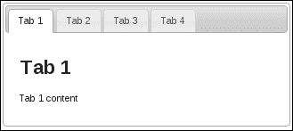

切换到第二个和第三个选项卡将执行必要的 Ajax 请求以获取内容。另一方面，第四个选项卡将导致错误，因为链接的资源不存在。在该面板中不会显示内容，而是显示了我们为 Ajax 请求添加的自定义行为显示的错误消息。

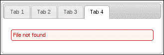

关于这个示例的最后一点要注意的是我们对 Ajax 请求的另一个修改。如果你重新访问第一个选项卡，我们不会发送另一个 Ajax 请求，因为我们已经有了面板内容。

## 工作原理...

当文档加载完成时，我们将从 `#tabs` div 创建一个选项卡部件。我们传递 `beforeLoad` 一个回调函数 `tabLoad()`，之前定义的。`tabLoad` 函数在分派用于获取选项卡面板内容的 Ajax 请求之前被调用。这给了我们一个机会来更新 `jqXHR` 对象的状态。

### 提示

`$.ajax()` 返回的 `jqXHR` 对象是 JavaScript 中原生 `XMLHTTPRequest` 类型的扩展。开发者很少与这个对象交互，但偶尔也会有需要，正如我们在这里看到的。

在这个示例中，我们首先检查选项卡面板是否有任何内容。`ui.panel` 对象代表最终将动态 Ajax 内容放置的 `div` 元素。如果是空字符串，我们继续加载内容。另一方面，如果已经有内容，我们会中止请求。如果服务器没有生成动态内容，而我们只是使用选项卡部件的此功能作为结构组合的手段，那么这是有用的。当我们已经拥有内容时，重复请求相同的内容是没有意义的。

我们还将行为附加到 `jqXHR` 对象上，以处理 Ajax 请求失败的情况。我们使用 `ui-state-error` 和 `ui-corner-all` 类对服务器返回的状态文本进行格式化，然后更新选项卡内容。

## 还有更多...

前面的例子将从远程资源检索的 HTML 放置到选项卡面板中。但现在我们决定选项卡内容中的 `h1` 标签是多余的，因为活动选项卡具有相同的作用。我们可以直接从我们用于构建选项卡内容的远程资源中删除这些标签，但如果我们在应用程序的其他地方使用该资源，可能会出现问题。相反，我们可以在用户实际看到它之前，仅仅通过加载事件修改选项卡内容。这是我们选项卡部件实例的修改版本：

```js
$(function() {

    function beforeLoad( e, ui ) {

        ui.jqXHR.error(function( data ) {

            ui.panel.empty();

            $( "<p/>" ).addClass( "ui-corner-all ui-state-error" )
                       .css( "padding", "4px" )
                       .text( data.statusText )
                       .appendTo( ui.panel );
        });

    }

    function afterLoad( e, ui ) {
        $( "h1", ui.panel ).remove();
    }

    $( "#tabs" ).tabs({
        beforeLoad: beforeLoad,
        load: afterLoad
    });

});
```

现在看，你会发现选项卡面板内不再有标题了。我们在构造函数中传递给选项卡的 `load` 回调将查找并删除任何 `h1` 标签。`load` 事件在 Ajax 调用返回并将内容插入面板后触发。我们无需担心在我们的代码运行之后出现 `h1` 标签。

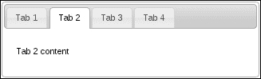

# 给选项卡添加图标

选项卡小部件使用锚元素，点击时激活各种选项卡面板以显示其内容。默认情况下，此锚元素仅显示文本，这在绝大多数情况下足够好。然而，在其他一些情况下，选项卡链接本身可能受益于图标。例如，一个房子图标有助于快速提示面板内容是什么，然后再激活它。让我们看看如何扩展选项卡的功能以支持将图标和文本作为选项卡按钮使用。

## 如何做...

我们将创建一个支持我们小部件的基本`tabs` div，如下所示：

```js
<div id="tabs">
    <ul>
        <li data-icon="ui-icon-home">
            <a href="#home">Home</a>
        </li>
        <li data-icon="ui-icon-search">
            <a href="#search">Search</a>
        </li>
        <li data-icon="ui-icon-wrench">
            <a href="#settings">Settings</a>
        </li>
    </ul>
    <div id="home">
        <p>Home panel...</p>
    </div>
    <div id="search">
        <p>Search panel...</p>
    </div>
    <div id="settings">
        <p>Settings panel...</p>
    </div>
</div>
```

接下来，我们有我们的 JavaScript 代码，包括对了解如何利用我们在标记中包含的`new data-icon`属性的选项卡小部件的扩展。

```js
(function( $, undefined ) {

$.widget( "ab.tabs", $.ui.tabs, {

    _processTabs: function() {

        this._super();

        var iconTabs = this.tablist.find( "> li[data-icon]" );

        iconTabs.each( function( i, v ) {

            var $tab = $( v ),
                iconClass = $tab.attr( "data-icon" ),
                iconClasses = "ui-icon " +
                              iconClass + 
                              " ui-tabs-icon",
                $icon = $( "<span/>" ).addClass( iconClasses ),
                $anchor = $tab.find( "> a.ui-tabs-anchor" ),
                $text = $( "<span/>" ).text( $anchor.text() );

            $anchor.empty()
                   .append( $icon )
                   .append( $text );

        });
    },

    _destroy: function() {

        var iconTabs = this.tablist.find( "> li[data-icon]" );

        iconTabs.each( function( i, v ) {

            var $anchor = $( v ).find( "> a.ui-tabs-anchor" ),
                text = $anchor.find( "> span:not(.ui-icon)" )
                              .text();

            $anchor.empty().text( text );

        });

        this._super();

    }

});

})( jQuery );

$(function() {

    $( "#tabs" ).tabs();

});
```

如果您在浏览器中查看此选项卡小部件，您会注意到每个选项卡按钮现在在按钮文本的左侧有一个图标。

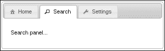

## 运作原理...

这个选项卡小部件的自定义之处在于，我们通过代表选项卡按钮的`li`元素传递数据。由于任何给定的选项卡小部件实例可能有任意数量的选项卡，通过`options`对象来指定哪个选项卡获取哪个图标是困难的。相反，我们简单地通过使用`data-icon`数据属性传递这些选项。该值是我们想要从主题框架中使用的图标类。

我们实现的更改实际上可以在标记本身手动完成，因为我们只是向小部件添加新元素和新类。但是，这种思维方式存在两个问题。首先，有大量手动注入的标记，可以根据一个数据属性的值生成，这违反了 DRY 原则，特别是如果您为多个选项卡小部件遵循这种模式。其次，我们将引入默认小部件实现不了解的新标记。这可能效果很好，但当事情停止按预期工作时，这可能很难诊断。因此，我们最好扩展选项卡小部件。

我们正在重写的`_processTabs()`方法将迭代具有`data-icon`属性的每个`li`元素，因为这些是我们需要操作的元素。`data-icon`属性存储要从主题框架中使用的图标类。我们构造一个使用`ui-icon`类与特定图标类一起使用的`span`元素。它还得到我们新的`ui-tabs-icon`类，正确定位元素在链接内。然后，我们获取选项卡按钮的原始文本并将其包装在一个`div`中。原因是，插入图标`span`，然后是文本`span`更容易。

# 简化选项卡主题

有时，我们的选项卡小部件的上下文对主题有重要的影响。当小部件位于文档顶部附近时，选项卡小部件的默认视觉组件效果最佳，也就是说，大部分页面内容都嵌套在选项卡面板中。相反，可能存在着一些既有的页面元素，可以通过选项卡小部件进行组织。这就是挑战所在——将诸如选项卡这样的顶级小部件塞入较小的块中可能会显得尴尬，除非我们能够找到一种方法来从选项卡中剥离一些不必要的主题组件。

## 如何做...

让我们首先创建一些标记以便基于选项卡小部件。它应该看起来像下面这样：

```js
<div id="tabs-container">
    <div id="tabs">
        <ul>
            <li><a href="#tab1">Tab 1</a></li>
            <li><a href="#tab2">Tab 2</a></li>
            <li><a href="#tab3">Tab 3</a></li>
        </ul>
        <div id="tab1">
            <h3>Tab 1...</h3>
            <ul>
                <li>Item 1</li>
                <li>Item 2</li>
                <li>Item 3</li>
            </ul>
        </div>
        <div id="tab2">
            <h3>Tab 2...</h3>
            <ul>
                <li>Item 4</li>
                <li>Item 5</li>
                <li>Item 6</li>
            </ul>
        </div>
        <div id="tab3">
            <h3>Tab 3...</h3>
            <ul>
                <li>Item 7</li>
                <li>Item 8</li>
                <li>Item 9</li>
            </ul>
        </div>
    </div>
</div>
```

接下来，我们将定义一些由选项卡小部件和选项卡小部件容器使用的 CSS。

```js
div.ui-tabs-basic {
    border: none;
    background: none;
}

div.ui-tabs-basic > ul.ui-tabs-nav {
    background: none;
    border-left: none;
    border-top: none;
    border-right: none;
}

#tabs-container {
    width: 22%;
    background: #f7f7f7;
    padding: 0.9em;
}
```

接下来是我们的 JavaScript 代码，它在文档准备就绪后创建选项卡小部件。

```js
$(function() {

    $( "#tabs" ).tabs({
        create: function( e, ui ) {
            $( this ).addClass( "ui-tabs-basic" )
                     .find( "> ul.ui-tabs-nav" )
                     .removeClass( "ui-corner-all" );
        }
    });

});
```

## 它是如何工作的...

我们正在传递给选项卡构造函数的`create`函数在小部件创建后触发。这是我们添加自定义类`ui-tabs-basic`的地方，该类用于覆盖`background`和`border`设置。这些是我们希望被移除的组件，因此我们只需将它们设置为`none`。我们还从选项卡导航部分中移除了`ui-corner-all`类，因为我们保留了底部边框，保留此类看起来不合适。

通常情况下创建此小部件，也就是不传递我们的`create`函数，则选项卡小部件将如下所示：

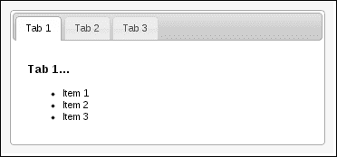

如您所见，选项卡小部件似乎是毫无考虑地塞入了`#tabs-container`元素中。在引入我们的简化之后，选项卡在其新上下文中呈现出更自然的外观。

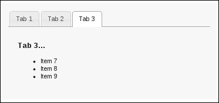

## 还有更多...

如果您在整个 UI 中的多个位置使用此精简版本的选项卡小部件，则多次定义要传递给选项卡构造函数的函数回调可能会很麻烦。您可以一次定义回调函数并在构造函数中传递其引用，但是然后您仍然需要将回调函数暴露在外。从设计的角度来看，我们可能希望将此行为封装在选项卡小部件中，并通过小部件选项将其暴露给外部世界。以下是对此示例进行的修改：

```js
(function( $, undefined ) {

$.widget( "ab.tabs", $.ui.tabs, {

    options: {
        basic: false
    },

    _create: function() {

        this._super();

        if ( !this.options.basic ) {
            return;
        }

        $( this.element ).addClass( "ui-tabs-basic" )
                         .find( "> ul.ui-tabs-nav" )
                         .removeClass( "ui-corner-all" );

    }

});

})( jQuery );

$(function() {

    $( "#tabs" ).tabs({
        basic: true
    });

});
```

在这里，我们将之前在回调中的功能移至选项卡构造函数中，但仅当`basic`选项设置为`true`时才执行，并且默认为`false`。

# 将选项卡用作 URL 导航链接

选项卡小部件不仅限于使用预加载的 div 元素或通过进行 Ajax 调用来填充选项卡面板。一些应用程序已经构建了许多组件，并且有大量内容要显示。如果您正在更新一个网站或应用程序，特别是如果您已经在使用 jQuery UI 小部件，则选项卡小部件可能作为主要的导航形式是有用的。那么我们需要的是一些通用的东西，可以应用于每个页面，而开发人员使用小部件的努力不多。尽管选项卡小部件并不是为这样的目的而设计的，但我们不会让这阻止我们，因为稍加调整，我们就可以创建一个能够给我们带来所需功能的通用组件。

## 如何做...

我们将首先查看应用程序中一个页面上的内容。HTML 定义了选项卡小部件结构以及活动选项卡下显示的内容。

```js
<div id="nav">
    <ul>
        <li>
            <a href="tab1.html">Tab 1</a>
        </li>
        <li>
            <a href="tab2.html">Tab 2</a>
        </li>
        <li>
            <a href="tab3.html">Tab 3</a>
        </li>
    </ul>
    <div>
        <p>Tab 1 content...</p>
    </div>
</div>
```

您会注意到此应用程序中有三个页面，并且它们都使用相同的小部件 HTML 结构；唯一的区别是选项卡内容段落。接下来，我们将定义我们的新导航小部件并在页面上创建它。相同的 JavaScript 代码包含在应用程序的每个页面中。

```js
(function( $, undefined ) {

$.widget( "ab.nav", $.ui.tabs, {

    _initialActive: function() {

        var path = location.pathname,
            path = path.substring( path.search( /[^\/]+$/ ) ),
            tabs = this.tabs,
            $active = tabs.find( "> a[href$='" + path + "']" );

        return tabs.find( "a" )
                   .index( $active );

    },

    _eventHandler: function( event ) {

        window.open( $( event.target ).attr( "href" ), "_self" );

    },

    _createPanel: function( id ) {

        var panel = this.element.find( "> div:first" );

        if ( !panel.hasClass( "ui-tabs-panel" ) ) {
            panel.data( "ui-tabs-destroy", true )
                 .addClass( "ui-tabs-panel " +
                            "ui-widget-content " +
                            "ui-corner-bottom" );

        }

        return panel;

    },

    _getPanelForTab: function( tab ) {

        return this.element.find( "> div:first" );

    },

    load: $.noop

});

})( jQuery );

$(function() {

    $( "#nav" ).nav();

});
```

现在，当您与此导航小部件交互时，您会看到每次激活一个新的选项卡时，浏览器都会重新加载页面以指向选项卡的`href`；例如，`tab3.html`。

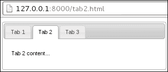

## 它是如何工作的...

让我们先看看我们创建的新`nav`小部件之前的 HTML 结构。首先要注意的是，我们在这里提供的 HTML 结构与选项卡小部件所期望的不同。我们有一个不带 ID 的`div`元素，用于保存页面的主要内容，因此没有任何选项卡链接可以引用它。但不用担心，这是有意为之的。`nav`小部件是为具有多个页面的站点或应用程序设计的——我们不会在此小部件中嵌入多个选项卡面板内容。由于我们对小部件使用的 HTML 进行了这种结构性变更，最好的做法是创建一个全新的小部件，而不仅仅是扩展选项卡小部件。这种方法将避免对选项卡小部件的 HTML 结构应该是什么样子产生混淆。

我们的`nav`小部件的目标，基于选项卡小部件，是激活适当的选项卡并将`div`元素呈现为所选的选项卡面板。当单击选项卡链接时，我们不执行任何常规的选项卡活动，只是跟随`href`。

在 `nav` 小部件的定义中覆盖的所有方法都来自标签小部件，而且在大多数情况下，我们都替换了不需要的标签功能。第一个方法是 `_initialActive()`，它确定小部件首次创建时的活动选项卡。在这里，我们将此决定基于位置对象中的路径。我们将其与选项卡的 `href` 属性进行比较。接下来是 `_eventHandler()` 方法。当用户激活选项卡时，将调用此方法。在这里，我们只执行与默认浏览器链接相同的操作，并遵循选项卡链接的 `href` 属性。由于我们在 `_eventHandler()` 方法中执行此操作，因此用于切换选项卡的 `keypress` 事件仍将按预期工作。接下来，当标签小部件需要创建和插入选项卡面板时，将调用 `_createPanel()` 方法。标签小部件调用此方法的原因是在进行 Ajax 调用时需要面板。由于我们在 `nav` 小部件中不进行任何 Ajax 调用，因此此方法现在将使用具有页面内容的默认 `div`。我们对内容 `div` 做的唯一更改是添加了适当的选项卡面板 CSS 类。最后，我们有 `_getPanelForTab()` 方法，该方法返回我们的内容 `div`，对于此小部件，这是唯一重要的内容 `div`，并且 `load()` 方法是 `$.noop`。这样做可以防止小部件在首次创建时尝试加载 Ajax 内容。

# 在选项卡之间创建效果

标签小部件允许开发人员指定在选项卡之间进行转换时运行的效果。具体来说，我们能够告诉标签小部件在显示选项卡时运行特定效果，并在隐藏选项卡时运行另一个效果。当用户点击选项卡时，如果指定了这两个效果，则会运行它们。首先是隐藏效果，然后是显示效果。让我们看看如何结合这两个选项卡选项来增强小部件的互动性。

## 如何做到这一点...

首先，我们将创建我们构建选项卡小部件所需的 HTML 结构。它应该看起来类似于以下内容，生成三个选项卡：

```js
<div id="tabs">
    <ul>
        <li><a href="#tab1">Tab 1</a></li>
        <li><a href="#tab2">Tab 2</a></li>
        <li><a href="#tab3">Tab 3</a></li>
    </ul>
    <div id="tab1">
        <p>Tab 1 content...</p>
        <button>Tab 1 Button</button>
    </div>
    <div id="tab2">
        <p>Tab 2 content...</p>
        <strong>Tab 2 bold text</strong>
    </div>
    <div id="tab3">
        <p>Tab 3 content...</p>
        <p>...and more content</p>
    </div>
</div>
```

下面的 JavaScript 代码实例化了标签小部件，其中 `show` 和 `hide` 效果选项传递给小部件构造函数。

```js
$(function() {

    $( "#tabs" ).tabs({
        show: {
            effect: "slide",
            direction: "left"
        },
        hide: {
            effect: "drop",
            direction: "right"
        }
    });

});
```

## 它是如何工作的...

当您在浏览器中查看此选项卡小部件并点击选项卡时，您会注意到当前选项卡的内容向右滑动，同时淡出。一旦此效果执行完毕，当前活动选项卡的 `show` 效果就会运行，在这种情况下，内容从左侧滑入。这两种效果相辅相成——结合在一起，它们产生了新内容将旧内容推出面板的幻觉。

我们在这里选择的两种效果实际上非常相似。`drop`效果实际上只是`slide`效果，额外加上了在滑动时的淡入淡出。它们协作的关键是我们传递给每个`effect`对象的`direction`属性。我们告诉`hide`效果在运行时向右移动。同样，我们告诉`show`效果从左侧进入。

# 使用可排序交互进行标签排序

当我们在用户界面中实现标签时，我们可能会简短地考虑标签的默认排序。显然，我们希望最相关的标签按照用户最能理解的顺序进行访问。但通常我们无法以让所有人满意的方式做到这一点。那么为什么不让用户自行安排标签的顺序呢？让我们看看能否通过在标签小部件中提供这种功能来利用可排序交互小部件来提供帮助。

## 如何实现...

我们将使用以下 HTML 作为驱动我们标签实例的示例：

```js
<div id="tabs">
    <ul>
        <li><a href="#tab1">Tab 1</a></li>
        <li><a href="#tab2">Tab 2</a></li>
        <li><a href="#tab3">Tab 3</a></li>
    </ul>
    <div id="tab1">
        <p>Tab 1 content...</p>
    </div>
    <div id="tab2">
        <p>Tab 2 content...</p>
    </div>
    <div id="tab3">
        <p>Tab 3 content...</p>
    </div>
</div>
```

接下来，我们将在标签小部件中实现新的`sortable`选项。我们还需要扩展小部件的行为以利用这个新选项。

```js
(function( $, undefined ) {

$.widget( "ab.tabs", $.ui.tabs, {

    options: {
        sortable: false
    },

    _create: function() {

        this._super();

        if ( !this.options.sortable ) {
            return;
        }

        this.tablist.sortable({
            axis: "x",
            stop: $.proxy( this, "_stopped" )
        });

    },

    _destroy: function() {

        if ( this.options.sortable ) {
            this.tablist.sortable( "destroy" );
        }

        this._super();

    },

    _stopped: function( e, ui ) {
        this.refresh();
    }

});

})( jQuery );

$(function() {

    $( "#tabs" ).tabs({
        sortable: true
    });

});
```

现在当您沿着 x 轴拖动标签按钮时，放下它们将重新排列它们的顺序。例如，拖动第一个标签会看起来像这样：

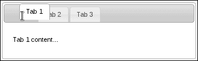

如果我们将第一个标签放在末尾并激活 **Tab 2**，现在第一个标签，你应该看到类似这样的东西：

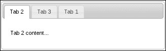

## 它是如何工作的...

我们已经向标签小部件添加了一个新选项，`sortable`，当设置为 true 时，将使用可排序交互小部件来启用标签按钮的可排序行为。我们通过在`options`对象中将默认`sortable`值设置为`false`来添加了这个选项。该对象将与默认标签选项合并。在`_create()`方法中，标签构造函数中，我们调用原始的标签小部件构造函数，因为默认小部件构造不存在特殊情况。接下来，在`_create()`内部，我们检查`sortable`选项是否为`true`，如果是，就创建可排序小部件。我们使用`tablist`属性来创建可排序小部件，这是一个包含标签按钮的`ul`元素。这就是为什么我们在这里调用它，我们想让它的子元素在 x 轴上可以进行排序。

我们还将可排序小部件的`stop`选项传递给一个回调函数，这种情况下是`_stopped()`方法的代理。这里使用了`$.proxy()`实用程序，这样我们可以像实现标签的常规方法一样实现`_stopped()`。请注意在`_stopped()`的实现中，这是小部件实例，而没有代理，它会是`ul`元素。

最后，在这里重写了`_destroy()`方法以确保可排序小部件被销毁。如果不这样做，我们就无法可靠地销毁并重新创建标签小部件。

## 更多信息...

当将`sortable`选项设置为`true`时，我们可以进一步增强选项卡小部件的用户交互。首先，让我们在用户拖动选项卡时修改`cursor`，以便使用标准的移动图标。接下来，我们将激活放置的选项卡。这是我们为修改后的光标所需的 CSS；我们将保持先前的 HTML 结构不变：

```js
.ui-tabs .ui-tabs-nav li.ui-tab-move > a {
    cursor: move;
}
```

这是修改后的 JavaScript 代码：

```js
(function( $, undefined ) {

$.widget( "ab.tabs", $.ui.tabs, {

    options: {
        sortable: false
    },

    _create: function() {

        this._super();

        if ( !this.options.sortable ) {
            return;
        }

        this.tablist.sortable({
            axis: "x",
            start: $.proxy( this, "_started" ),
            stop: $.proxy( this, "_stopped" )
        });

    },

    _destroy: function() {

        if ( this.options.sortable ) {
            this.tablist.sortable( "destroy" );
        }

        this._super();

    },

    _started: function( e, ui ) {
        ui.item.addClass( "ui-tab-move" );
    },

    _stopped: function( e, ui ) {

        ui.item.removeClass( "ui-tab-move" );
        this.refresh();
        this._activate( ui.item.index() );

    }

});

})( jQuery );

$(function() {

    $( "#tabs" ).tabs({
        sortable: true
    });

});
```

现在，当您对这些选项卡进行排序时，您会注意到新的光标如以下截图所示。`ui-tab-move`类定义了`cursor`的 CSS 属性，此类被添加到可排序小部件的`start`事件处理程序中的`li`元素中。在`stop`处理程序中随后删除。您还会注意到当放置选项卡时会激活选项卡。这是通过获取`li`元素的索引并将其传递给`activate()`方法来完成的。

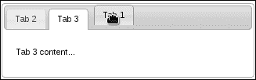

# 使用 href 设置活动选项卡

选项卡小部件允许开发人员通过将零基索引值传递给`active`选项来以编程方式设置活动选项卡。这可以通过在选项卡构造函数中设置此选项来完成，告诉小部件默认激活哪个选项卡，或者可以在之后设置，从而可能改变活动选项卡。使用此选项更改活动选项卡实质上与用户点击选项卡按钮激活面板是相同的。然而，我们可以改进此界面，让使用选项卡小部件的开发人员传递`href`值而不是索引值。这样，您就不必记住选项卡的顺序—哪个数字代表哪个链接，等等。

## 如何实现...

让我们首先设置此演示中使用的 HTML 作为选项卡小部件的基础。

```js
<div id="tabs">
    <ul>
        <li><a href="#tab1">Tab 1</a></li>
        <li><a href="#tab2">Tab 2</a></li>
        <li><a href="#tab3">Tab 3</a></li>
    </ul>
    <div id="tab1">
        <p>Tab 1 content...<a class="tab-link" href="#tab2">tab 2</a></p>
    </div>
    <div id="tab2">
        <p>Tab 2 content...<a class="tab-link" href="#tab3">tab 3</a></p>
    </div>
    <div id="tab3">
        <p>Tab 3 content...<a class="tab-link" href="#tab1">tab 1</a></p>
    </div>
</div>
```

下面是修改后的选项卡小部件实现，使我们可以通过将字符串`"#tab2"`传递给`active`选项来激活第二个选项卡。

```js
(function( $, undefined ) {

$.widget( "ab.tabs", $.ui.tabs, {

    _findActive: function( index ) {
        return this._super( this._getIndex( index ) );
    },

    _initialActive: function() {

        this.options.active = this._getIndex( this.options.active );
        return this._super();

    }

});

})( jQuery );

$(function() {

    $( "#tabs" ).tabs({
        active: "#tab2"
    });

    $( ".tab-link" ).on( "click", function( e ) {
        e.preventDefault();
        $( "#tabs" ).tabs( "option", "active", $( this ).attr( "href" ) );
    });

});
```

## 它是如何运作的...

当您在浏览器中查看此选项卡小部件时，您会注意到第二个选项卡默认处于激活状态，因为我们传递了字符串`"#tab2"`。还会注意到每个选项卡面板的内容都指向另一个选项卡的链接。

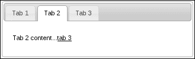

我们正在扩展选项卡小部件，以便我们可以重写一些选项卡方法。第一个方法是`_findActive()`，在原始实现中期望一个整数。我们已经改变了这一点，使用了根据选项卡按钮的`href`属性返回索引的`_getIndex()`方法，也就是说，除非它得到传递给它的整数值，否则它只返回那个数字。简而言之，我们已经改变了`_findActive()`，以接受零基索引号，或`href`字符串。

下一个方法是 `_initialActive()`，当标签小部件首次实例化时调用。我们在这里要做的是在调用 `_initialActive()` 的原始实现之前，将活动选项设置为适当的索引值。这是为了支持构造函数中的 `href` 字符串作为 `active` 选项值。

最后，我们使用 `href` 字符串创建我们的标签小部件，并将事件处理程序绑定到标签面板中的每个标签链接上。在这里，我们仅基于链接的 `href` 属性激活标签，所以你可以看到我们引入的这种新 `href` 功能的价值。

## 还有更多...

在前面的示例中，我们利用了标签按钮链接的 `href` 属性。但是，我们没有利用浏览器的位置哈希。换句话说，当激活标签时，浏览器 URL 中的位置哈希不会更改。支持这种方法有几个优点。首先，我们可以使用返回按钮浏览我们的活动标签。另一个好处是，标签内容面板中的链接不再需要事件处理程序；它们可以直接指向标签 `href`。

这里是修改后的 JavaScript，支持与上一个示例相同的功能。唯一的区别是，每次激活标签时，URL 哈希都会更改。

```js
(function( $, undefined ) {

$.widget( "ab.tabs", $.ui.tabs, {

    _create: function() {

        this._super();

        this._on( window, { 
            hashchange: $.proxy( this, "_hashChange" )
        });

    },

    _hashChange: function( e ) {

        if ( this.active.attr( "href" ) === location.hash ) {
            return;
        }

        this._activate( this._getIndex( location.hash ) );

    },

    _eventHandler: function( e ) {

        this._super( e );  

        var href = $( e.target ).attr( "href" );

        if ( href === location.hash ) {
            return;
        }

        if ( href.indexOf( "#" ) === 0 ) {
            location.hash = href;
        }
        else {
            location.hash = "";
        }

    }

});

})( jQuery );

$(function() {
    $( "#tabs" ).tabs();
});
```

现在，当你在浏览器中与此标签小部件交互时，你会注意到在导航标签时 URL 中的哈希会更改。这是通过在调用 `_create()` 的原始实现后向该方法添加事件处理程序来完成的。我们使用 `_on()` 实用程序方法订阅窗口的 `hashchange` 事件。接下来，我们添加的 `_hashChange()` 方法是此事件的处理程序。首先，我们检查 URL 哈希，存储在 `location.hash` 变量中，是否已经指向活动标签。如果没有，我们根据当前 URL 哈希值激活标签。这是我们支持指向 URL 哈希的标签面板内容中的链接所需的全部内容。但是，当用户直接单击标签按钮时，哈希值不会更改。这对我们没有帮助，因为我们无法跟踪标签导航历史记录。

这就是为什么我们实现了 `_eventHandler()` 方法的自定义。我们首先调用方法的原始实现，然后再处理 URL 哈希的具体情况。如果 URL 哈希已经指向活动标签，我们在这里没有任何操作；否则，我们更新 URL 哈希。
