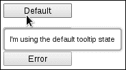
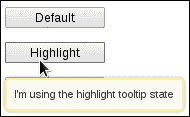
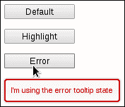
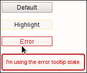
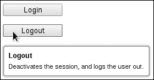
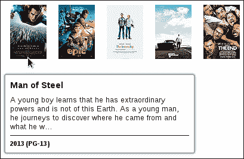
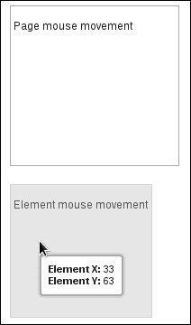
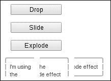
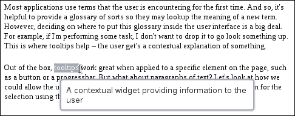
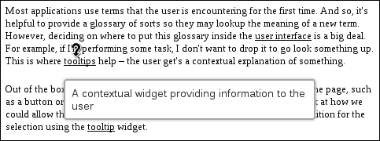

# 第十一章：使用工具提示

在本章中，我们将涵盖:

+   改变工具提示状态

+   在工具提示中使用自定义标记

+   显示鼠标移动

+   对工具提示显示应用效果

+   选定文本的工具提示

# 介绍

在本章中，我们将探讨用于向用户提供上下文信息的**工具提示**小部件的各个方面。工具提示小部件与现有代码配合得很好，因为默认情况下，它使用标准的 HTML 属性来设置工具提示的文本。此外，只需一行代码就可以为整个用户界面创建工具提示实例，非常容易。

超越简单用例，我们将研究我们可以传递到小部件中的不同类型的内容，以及如何动态生成内容。我们还将探讨工具提示如何作为工具来辅助开发过程，以及开发人员如何操纵可用的效果来显示和隐藏小部件。

# 改变工具提示状态

工具提示小部件的视觉显示有一个默认状态。也就是说，默认情况下，该小部件经过精心设计，使用了主题框架中的元素。然而，我们可能会根据应用程序中某些资源的状态而进行更改。例如，由于权限更改而对用户新的按钮可能希望工具提示状态在页面上与其他工具提示有视觉上的差异。同样，如果存在损坏的资源，并且用户将鼠标悬停在其组件上，则显示的工具提示应处于错误状态。当然，当更改工具提示的状态时，我们应该记住状态应该与实际工具提示的上下文和语气相匹配。例如，不要在读取“一切都准备就绪！”的工具提示上放置错误状态。让我们看看自定义工具提示的一个快速而简单的入口点。我们将使用一个标准的工具提示选项来传递状态 CSS 类。

## 如何做...

我们将使用以下 HTML 为我们的工具提示小部件。这里有三个按钮，每个按钮都有自己的状态和工具提示实例。

```js
<div class="button-container">
    <button class="tt-default" title="I'm using the default tooltip state">Default</button>
</div>
<div class="button-container">
    <button class="tt-highlight" title="I'm using the highlight tooltip state">Highlight</button>
</div>
<div class="button-container">
    <button class="tt-error" title="I'm using the error tooltip state">Error</button>
</div>
```

接下来，我们将使用以下 JavaScript 为其各自的按钮创建工具提示小部件:

```js
$(function() {

    $( "button" ).tooltip();

    $( "button.tt-highlight" ).tooltip( "option", { 
        tooltipClass: "ui-state-highlight" 
    });

    $( "button.tt-error" ).tooltip( "option", {
        tooltipClass: "ui-state-error"
    });

});
```

在浏览器中悬停在每个按钮上会显示默认状态、高亮状态和错误状态，如下图所示:

+   默认状态:

+   高亮状态:

+   错误状态:

## 工作原理...

对于这个特定的例子，我们使用`tooltipClass`选项将主题框架中的状态 CSS 类传递给小部件。首先，我们简单地将页面上的每个按钮都设置为提示小部件。调用提示构造函数后，我们有三个使用默认状态的提示实例。接下来，我们找到带有`tt-highlight`类的按钮，并将`tooltipClass`选项的值设为`ui-state-highlight`。最后，我们找到带有`tt-error`类的按钮，并使用`tooltipClass`选项将该提示小部件分配给`ui-state-error`类。

## 还有更多...

我们之前使用的方法有一些缺点。首先，用户无法知道有什么问题，直到他们将鼠标移到元素上并看到提示处于错误状态。在更现实的情况下，如果按钮有什么问题，它可能会自身应用错误状态。因此，为了应用错误状态，我们不得不发明自己的类名，并在创建提示时确定使用哪个类。

一个更健壮的解决方案将围绕在元素上使用框架的实际状态而不是发明我们自己的状态。此外，提示小部件应该足够智能，以根据应用的元素的状态更改其类。换句话说，如果按钮应用了`ui-state-error`类，则应该将此类用作`tooltipClass`选项。让我们为提示小部件添加一个`inheritState`选项，以打开此行为。

这是修改后的 HTML 源代码：

```js
<div class="button-container">
    <button title="I'm using the default tooltip state">Default</button>
</div>
<div class="button-container">
    <button class="ui-state-highlight" title="I'm using the highlight tooltip state">Highlight</button>
</div>
<div class="button-container">
    <button class="ui-state-error" title="I'm using the error tooltip state">Error</button>
</div>
```

下面是包含新选项的提示小部件扩展的定义：

```js
(function( $, undefined ) {

$.widget( "ab.tooltip", $.ui.tooltip, {

    options: {
        inheritState: false
    },

    _create: function() {

        var self = this,
            options = this.options,
            states = [
                "ui-state-highlight",
                "ui-state-error"
            ];

        if ( !options.inheritState || options.tooltipClass ) {
            return this._super();
        }

        $.each( states, function( i, v ) {

            if ( self.element.hasClass( v ) ) {
                self.options.tooltipClass = v;
            }

        });

        this._super();

    }

});

})( jQuery );

$(function() {

    $( "button" ).tooltip({
        inheritState: true
    });

});
```

这个版本的代码应该与第一个版本的行为完全相同。当然，区别在于按钮本身具有可见状态，我们希望提示小部件能够捕捉到这一点。我们通过将`inheritState`选项设置为`true`来告诉它这样做。



我们的新选项`inheritState`被添加到提示小部件的默认`options`对象中，该对象由提示小部件的原始实现设置。在`_create()`方法中，小部件构造函数中，我们检查`inheritState`选项是否为`true`，或者`tooltipClass`选项是否已设置。在任何一种情况下，我们都返回，调用原始实现。否则，我们检查元素是否具有`states`数组中的任何状态，如果是，则将该类设置为`tooltipClass`。

# 在提示中使用自定义标记

我们不限于使用`title`属性来提供基本文本字符串以供工具提示内容使用。有时，工具提示部件的内容需要格式化。例如，标题部分的字体样式将与主文本部分不同。工具提示部件允许开发人员通过`content`选项传递自定义内容。这可以是原始字符串，也可以是返回我们想要显示的内容的函数。让我们看看如何在您的应用程序中使用此选项。

## 操作步骤...

我们将创建两个`button`元素；每个都有一个`title`属性，其中的文本将用于工具提示。我们还将添加按钮的名称作为工具提示标题。

```js
<div class="button-container">
    <button title="Logs the user in by establishing a new session.">Login</button>
</div>
<div class="button-container">
    <button title="Deactivates the session, and logs the user out.">Logout</button>
</div>
```

接下来，让我们创建格式化我们的工具提示的基本 CSS 样式。

```js
.ui-tooltip-title {
    font-weight: bold;
    font-size: 1.1em;
    margin-bottom: 5px;
}
```

最后，我们将使用自定义内容函数创建工具提示部件来格式化工具提示内容。

```js
$(function() {

    $( "button" ).tooltip({
        content: function() {

            var $content = $( "<div/>" );

            $( "<div/>" ).text( $( this ).text() )
                         .addClass( "ui-tooltip-title" )
                         .appendTo( $content );

            $( "<span/>" ).text( $( this ).attr( "title" ) )
                          .appendTo( $content );

            return $content;

        }

    });

});
```

当我们悬停在其中一个`button`元素上时，工具提示应该看起来像以下屏幕截图一样。注意格式化的标题部分。



## 工作原理...

我们向每个工具提示部件传递的`content`函数将内容包装成一个`div`元素，存储在`$content`变量中。目的是将标题和主文本元素存储在此`div`中，这样我们就可以简单地从函数中返回`$content`变量。标题`div`使用按钮文本或其名称。这个`div`得到了我们之前定义的`ui-tooltip-title`类，它只是修改了字体，并在元素底部添加了一些空间。接下来，我们添加了主内容`span`元素，它只是使用元素的`title`属性。

## 还有更多...

我们刚刚检查过的修改工具提示的方法是自由形式的——函数可以返回几乎任何它想要的东西。让我们看看修改工具提示内容的更结构化的方法。我们将修改工具提示部件，使其接受特定的内容部分选项。为了演示这一点，我们将利用**Rotten Tomatoes API**。我们唯一需要的 HTML 是一个简单的`div`元素，看起来像`<div class="titles"></div>`。现在让我们定义标题的 CSS 样式，我们将要列出的标题，以及特定的工具提示内容部分。

```js
.titles { 
    margin: 20px;
}

.titles img {
    padding: 10px;
}

.ui-tooltip-header {
    font-weight: bold;
    font-size: 1.4em;
}

.ui-tooltip-body {
    margin: 7px 0 7px 0;
    font-size: 1.2em;
}

.ui-tooltip-footer {
    font-weight: bold;
    border-top: solid 1px;
    padding-top: 7px;
}
```

这是自定义的工具提示部件声明，它添加了新的内容选项。当文档加载时，我们调用 Rotten Tomatoes API，并在我们的容器`div`中显示五张图片。每张图片也是一个工具提示，它使用了我们已添加到部件的新特定内容选项。

```js
(function( $, undefined ) {

$.widget( "ab.tooltip", $.ui.tooltip, {

    options: {
        header: null,
        body: null,
        footer: null
    },

    _create: function() {

        this._super();

        var header = this.options.header,
            body = this.options.body,
            footer = this.options.footer;

        if ( !header && !body && !footer ) {
            return;
        }

        this.options.content = $.proxy( this, "_content" );

    },

    _content: function() {

        var header = this.options.header,
            body = this.options.body,
            footer = this.options.footer,
            $content = $( "<div/>" );

        if ( header ) {

            $( "<div/>" ).text( header )
                         .addClass( "ui-tooltip-header" )
                         .appendTo( $content );

        }

        if ( body ) {

            $( "<div/>" ).text( body )
                         .addClass( "ui-tooltip-body" )
                         .appendTo( $content );

        }

        if ( footer ) {

            $( "<div/>" ).text( footer )
                         .addClass( "ui-tooltip-footer" )
                         .appendTo( $content );

        }

        return $content;

    }

});

})( jQuery );

$(function() {

    var apikey = "2vnk...",  // Your Rotten Tomatoes API key goes here
        apibase = "http://api.rottentomatoes.com/api/public/v1.0";

    $.ajax({
        url: apibase + "/lists/movies/in_theaters.json",
        dataType: "jsonp",
        data: {
            apikey: apikey,
            page_limit: "5",
        },
        success: function( data ) {

            $.each( data.movies, function( i, v ) {

                var $logo = $( "" );

                $logo.attr( "src", v.posters.thumbnail )
                     .appendTo( ".titles" );

                $logo.tooltip({
                    header: v.title,
                    body: v.synopsis.substring( 0, 150 ) + "...",
                    footer: v.year + " (" + v.mpaa_rating + ")",
                    items: "img"
                });

            });

        }

    });

});
```

在浏览器中查看此页面应该会用五张图片填充标题`div`，当您将鼠标悬停在每个图片上时，您应该会看到我们的自定义工具提示内容。



让我们首先查看当文档加载完成时我们正在向 Rotten Tomatoes API 发出的 API 调用。我们要获取的仅是正在上映的目录中的前五部电影。然后，我们创建一个 `img` 元素并将 `src` 属性设置为相应电影的缩略图。这就是你在示例中看到的图片是如何呈现的。我们还对每个图像调用工具提示构造函数，并向其传递我们定义的新选项。具体来说，这些是工具提示内容的部分，`header`、`body` 和 `footer`。请注意，我们必须告诉工具提示这是一个 `img` 元素，它不会在通常的位置找到工具提示内容 - 这是使用 `items` 选项完成的。

现在看看我们在工具提示小部件中实现的自定义内容，我们可以看到选项是通过向 `options` 属性分配新选项来定义的 - 这些选项会合并到默认工具提示 `options` 对象中。接下来，我们有一个 `_create()` 方法的自定义实现，当工具提示被实例化时会调用该方法。这里的目标是检查是否已指定了三个内容部分之一，如果没有，则我们无事可做，简单地退出。 `_create()` 方法的原始版本是使用 `_super()` 调用的，因此在此时，小部件已经被创建。构造函数中的我们的最后一项工作是将 `content` 选项分配给生成工具提示内容的函数。在这种情况下，它是一个代理到 `_content()` 方法的函数。

`_content()` 方法将其返回的 HTML 包装在一个 `div` 元素中，这存储在 `$content` 变量中。然后，我们根据选项将指定的内容添加到 `div` 元素中。每个内容部分都是一个 `div` 元素，并且它们被赋予相应的 CSS 类来控制外观 - `ui-tooltip-header`、`ui-tooltip-body` 和 `ui-tooltip-footer`。

# 显示鼠标移动

在开发过程中，我们可以使用工具提示小部件作为辅助工具，但不一定要将其作为最终产品的一部分。例如，我们可以使用工具提示小部件来跟踪鼠标移动并显示 X 和 Y 坐标。这有助于我们在组装 UI 组件时诊断一些棘手的鼠标行为。我们将研究跟踪特定元素的鼠标坐标，但请记住，重要的是概念。我们可以使用此技术来显示任意数量的事件属性 - 当不再需要时，我们只需丢弃调用。

## 如何做到…

首先我们将创建所需的 CSS。这些简单地定位我们希望跟踪鼠标移动的 `div` 元素。

```js
.mouse-tracker {
    margin: 20px;
    background-image: none;
    padding: 3px;
}

.mouse-tracker p {
    font-size: 1.2em;
}

.mouse-tracker-page {
    width: 180px;
    height: 170px;
}

.mouse-tracker-relative {
    width: 150px;
    height: 140px;
}
```

接下来是 HTML 本身，两个我们正在设计中的 `div` 元素。我们希望我们的鼠标跟踪实用程序在用户将鼠标移动到这些元素上时显示出发生了什么。

```js
<div class="ui-widget-content mouse-tracker mouse-tracker-page">
    <p>Page mouse movement</p>
</div>
<div class="ui-widget-content ui-state-default mouse-tracker mouse-tracker-relative">
    <p>Element mouse movement</p>
</div>
```

最后但同样重要的是，我们将实现我们的跟踪器工具。这是一个名为跟踪器的小部件，它扩展了提示小部件。我们称其为其他内容，以免将其与我们可能在生产系统中使用的现有提示小部件混淆。

```js
(function( $, undefined ) {

$.widget( "ab.tracker", $.ui.tooltip, {

    options: {
        track: true,
        items: ".ui-tracker",
        relative: false
    },

    _create: function() {

        this.element.addClass( "ui-tracker" );

        this._super();

        this.options.content = $.proxy( this, "_content" );

    },

    _content: function() {

        var $content = $( "<div/>" ),
            relative = this.options.relative,
            xlabel = relative ? "Element X: " : "Page X: ",
            ylabel = relative ? "Element Y: " : "Page Y: ";

        $( "<div/>" ).append( $( "<strong/>" ).text( xlabel ) )
                     .append( $( "<span/>" ).attr( "id", "ui-tracker-x" ) )
                     .appendTo( $content );

        $( "<div/>" ).append( $( "<strong/>" ).text( ylabel ) )
                     .append( $( "<span/>" ).attr( "id", "ui-tracker-y" ) )
                     .appendTo( $content );

        return $content;

    },

    _mousemove: function( e ) {

        var $target = $( e.target ).closest( this.options.items ),
            offset,
            offsetLeft = 0
            offsetTop = 0;

        if ( this.options.relative ) {
            offset = $target.offset();
            offsetLeft = offset.left;
            offsetTop = offset.top;
        }

        $( "#ui-tracker-x" ).text( e.pageX - offsetLeft );
        $( "#ui-tracker-y" ).text( e.pageY - offsetTop );

    },

    open: function( e ) {

        this._super( e );

        var $target = $( e.target ).closest( this.options.items );

        this._on( $target, {
            mousemove: $.proxy( this, "_mousemove" )
        });

    }

});

})( jQuery );

$(function() {

    $( ".mouse-tracker-page" ).tracker();
    $( ".mouse-tracker-relative" ).tracker({
        relative: true
    });

});
```

在浏览器中查看这两个`div`元素，您应该会看到类似以下的内容：



## 工作原理...

我们刚刚定义的跟踪器小部件通过填充一些新的默认选项以及提供一个新选项来扩展提示小部件。`track`提示选项告诉小部件相对于鼠标移动定位自己。由于我们正在实现鼠标坐标跟踪器，将其默认打开是有道理的。我们希望更改的下一个提示选项值是`items`选项。这告诉提示哪些目标元素可以成为有效的提示，而在我们的情况下，我们希望它是赋予我们跟踪器小部件的类—`ui-tracker`。`relative`选项是我们要添加到小部件中的新内容。这告诉跟踪器，当为`true`时，将坐标显示为相对于问题元素，而不是相对于页面，默认情况下是相对于页面的。

接下来，我们要扩展提示小部件的`_create()`方法，这是构造函数。在调用构造函数的原始实现之前，我们要做的第一件事是将跟踪小部件类添加到元素中。这是必要的，以便元素被视为有效的跟踪器—参见`items`选项。一旦我们完成了`_super()`方法，我们就会将`content`选项分配给回调函数，这是对此小部件的`_callback()`方法的代理。`_callback()`方法只是返回我们想要显示在提示中的模板内容。这包括鼠标事件的 X 和 Y 坐标。根据`relative`选项，我们必须弄清楚标签是应该是一个页面，还是应该是一个元素。

我们重写`open()`方法来设置我们的`mousemove`事件处理。通常，这将在`_create()`方法中完成。但是当提示未打开时，没有必要跟踪鼠标移动，而且触发回调会浪费宝贵的 CPU 周期。我们使用`_on()`实用程序方法将代理处理程序绑定到此小部件的`_mousemove()`方法。`_mousemove()`方法负责更新提示的内容。具体来说，它设置由我们的`_content()`方法生成的`#ui-tracker-x`和`#ui-tracker-y`标签的文本值。X 和 Y 坐标的值将基于事件的`pageX`和`pageX`属性的值，或者与偏移值结合，具体取决于`relative`选项。

跟踪器小部件的实例化方式与提示小部件相同。当我们不再需要显示这些值时，例如，当我们准备好上线时，这些小部件调用将被删除。

# 对提示显示应用效果

工具提示小部件附带了控制元素显示和隐藏动作的选项。这些分别是`show`和`hide`选项，每个选项都接受指定动画选项的对象。由于`show`和`hide`选项控制小部件显示的不同方面，我们可以自由使用不同的设置，例如显示和隐藏操作的延迟。或者，我们可以彻底改变，对动画使用两种完全不同的效果。让我们探索工具提示小部件中可用的各种`show`和`hide`选项。

## 如何操作...

首先，让我们创建一些按钮元素，我们将用它们来显示工具提示。

```js
<div class="button-container">
    <button class="drop" title="I'm using the drop effect">Drop</button>
</div>
<div class="button-container">
    <button class="slide" title="I'm using the slide effect">Slide</button>
</div>
<div class="button-container">
    <button class="explode" title="I'm using the clip/explode effect">Explode</button>
</div>
```

接下来，我们将为每个按钮实例化一个工具提示小部件，传递我们自定义的`show`和`hide`动画选项。

```js
$(function() {

    $( "button" ).tooltip();

    $( "button.drop" ).tooltip( "option", {
        show: {
            effect: "drop",
            delay: 150,
            duration: 450,
            direction: "up",
        },
        hide: {
            effect: "drop",
            delay: 100,
            duration: 200,
            direction: "down"
        }
    });

    $( "button.slide" ).tooltip( "option", {
        show: {
            effect: "slide",
            delay: 250,
            duration: 350,
            direction: "left"
        },
        hide: {
            effect: "slide",
            delay: 150,
            duration: 350,
            direction: "right",
        }
    });

    $( "button.explode" ).tooltip( "option", {
        show: {
            effect: "clip",
            delay: 150,
            duration: 450
        },
        hide: {
            effect: "explode",
            delay: 200,
            duration: 1000
        }
    });

});
```

在您的网络浏览器中查看三个按钮，并将鼠标移到每个按钮上。您会注意到它们以独特的方式显示和隐藏工具提示。例如，这是最后一个工具提示，正在被隐藏时的中爆炸。



## 它是如何工作的...

有些效果接受其他效果不接受的选项，例如方向。`button.drop`工具提示小部件同时对显示和隐藏操作使用`drop`效果。然而，`show`指定了`direction`为`up`，而`hide`操作指定了`direction`为`down`。这意味着工具提示将以向上的方式进入页面，并以向下的方式退出页面。相同的概念也适用于`button.slide`小部件，其中我们使用`slide`效果。工具提示将从左侧滑入，并从右侧滑出。

`button.explode`工具提示使用两种不同的效果类型——`show`使用`clip`效果，而`hide`使用`explode`效果。一般来说，像这样混合效果是可以的，但通常需要一些时间进行尝试和错误，找到两种互补而不是看起来不合适的效果类。最后，我们将`delay`和`duration`选项应用于我们创建的工具提示的`show`和`hide`选项。`delay`选项推迟工具提示的实际显示，而`duration`控制动画的运行时间。

# 选定文本的工具提示

大多数应用程序使用用户首次遇到的术语。因此，提供类似词汇表的东西是有帮助的，这样他们可以查找新术语的含义。但是，在用户界面中放置这个词汇表的位置是一件大事。例如，如果我正在执行某项任务，我不想中断去查找某些内容。这就是工具提示的帮助之处——用户会得到某些内容的上下文解释。

默认情况下，工具提示在应用于页面上特定元素（例如按钮或进度条）时效果很好。但是对于一段文字呢？让我们看看如何允许用户选择一些文本，并使用工具提示小部件显示所选内容的上下文定义。

## 如何操作...

我们将设计一个新的词典小部件，基于提示小部件，用于处理文本。这个小部件将通过显示提示（如果找到）来处理文本选择。首先，这里是我们将使用的段落，取自前一节。

```js
<p>
    Most applications use terms that the user is encountering for the first 
    time.  And so, it's helpful to provide a glossary of sorts so they may 
    lookup the meaning of a new term.  However, deciding on where to put this 
    glossary inside the user interface is a big deal.  For example, if I'm 
    performing some task, I don't want to drop it to go look something up.  
    This is where tooltips help – the user gets a contextual explanation 
    of something.
</p>

<p>
    Out of the box, tooltips work great when applied to a specific element on 
    the page, such as a button or a progressbar. But what about paragraphs of 
    text?  Let's look at how we could allow the user to select some text, and 
    display some contextual definition for the selection using the tooltip 
    widget.
</p>
```

这里是词典小部件的实现以及如何将其应用于我们的两段文本。

```js
( function( $, undefined ) {

$.widget( "ab.dictionary", {

    options: {
        terms: []
    },

    ttPos: $.ui.tooltip.prototype.options.position,

    _create: function() {

        this._super();

        this._on({
            mouseup: this._tip,
            mouseenter: this._tip
        });

    },

    _destroy: function() {
        this._super();
        this._destroyTooltip();
    },

    _tip: function( e ) {

        var text = this._selectedText(),
            term = this._selectedTerm( text );

        if ( text === undefined || term === undefined ) {
            this._destroyTooltip();
            return;
        }

        if ( this.element.attr( "title" ) !== term.tip ) {
            this._destroyTooltip();
        }

        this._createTooltip( e, term );

    },

    _selectedText: function() {

        var selection, range, fragment;

        selection = window.getSelection();

        if ( selection.type !== "Range" ) {
            return;
        }

        range = selection.getRangeAt( 0 ),
        fragment = $( range.cloneContents() );

        return $.trim( fragment.text().toLowerCase() );

    },

    _selectedTerm: function( text ) {

        function isTerm( v ) {
            if ( v.term === text || v.term + "s" === text ) {
                return v;
            }
        }

        return $.map( this.options.terms, isTerm )[ 0 ];

    },

    _createTooltip: function( e, term ) {

        if ( this.element.is( ":ui-tooltip" ) ) {
            return;
        }

        var pos = $.extend( this.ttPos, { of: e } );

        this.element.attr( "title", term.tip )
                    .tooltip( { position: pos } )
                    .tooltip( "open" );
    },

    _destroyTooltip: function() {

        if ( !this.element.is( ":ui-tooltip" ) ) {
           return;
        }

        this.element.tooltip( "destroy" )
                    .attr( "title", "");

    }

});

})( jQuery );

$(function() {

    var dict = [
        {
            term: "tooltip",
            tip: "A contextual widget providing information to the user"
        },
        {
            term: "progressbar",
            tip: "A widget illustrating the progress of some task"
        },
        {
            term: "element",
            tip: "An HTML element on the page"
        },
        {
            term: "user interface",
            tip: "Components on the screen the user interacts with"
        }
    ];

    $( "p" ).dictionary({
        terms: dict
    });

});
```

如果您在浏览器中打开此页面并使用鼠标指针选择“tooltips”，您应该会得到如下屏幕截图所示的提示。



## 工作原理...

我们的新词典小部件增加了用户选择段落文本并获取其上下文定义的功能（如果存在）。该小部件接受一个`terms`选项，这只是一个术语和提示的数组。这是用于选择文本时执行查找的词典数据。`ttPos`属性是对默认提示`position`设置对象的引用。我们保持这个便于使用，因为每次用户选择文本并显示提示小部件时都需要使用它。在实例化小部件时调用的`_create()`方法设置了事件处理。特别是，我们对`mouseup`和`mouseenter`事件感兴趣，这两个事件根据许多因素显示提示小部件。`_destroy()`方法确保我们使用的提示小部件也通过调用`_destroyTooltip()`销毁。

`_tip()`方法可谓是此小部件的主程序，因为它将具有特定责任的所有方法联系在一起。我们使用`_selectedText()`方法获取所选文本。我们使用字典中的选定文本获取所选术语。现在，这些值中的任何一个可能是未定义的—当调用`_tip()`时，用户可能未选择任何内容，或者用户选择的文本在字典中不存在。如果任何一种情况为真，我们必须确保销毁提示。另一方面，如果找到了术语，我们使用`_createTooltip()`方法创建和显示提示。

`_createTooltip()`方法接受一个事件对象以及一个术语对象。事件对象用于在打开提示时定位提示。回想一下，我们将提示的默认位置选项存储在`ttPos`属性中。我们通过扩展该属性与事件创建一个新的`position`对象。这意味着我们可以将提示相对于用户选择文本的位置进行定位。现在我们已经设置了提示的位置，我们只需将段落的`title`属性设置为我们希望在提示内显示的文本。这是传递给方法的所选术语的`tip`属性。`_destroyTooltip()`负责销毁提示小部件，但仅在该元素实际上是提示时，并还原`title`属性。

最后需要注意的是，您会注意到我们将简单的字符串传递给字典实例。但我们能够在给定的用户选择中找到几个变体的术语。例如，“tooltips”会找到术语“tooltip”，因为我们在原始字符串之外添加了“s”。我们还会对选择两侧的空白进行标准化，以及忽略大小写。

## 还有更多...

我们使用字典小部件的方法的缺点是，用户必须选择文本才能获得单词的上下文定义。例如，示例中的两个段落共定义了四个术语。要使此工作，用户必须猜测哪些文本实际上被定义。此外，选择段落文本是直观的，但仅当您经常在使用的应用程序中执行此操作时——大多数用户并不这样做。

让我们通过引入一个新的模式——`hover`来增强我们的字典小部件。当此模式为`true`时，我们将实际操作段落文本，以使字典中定义的术语突出显示。这些术语看起来像链接，包含定义的工具提示会像您典型的工具提示一样工作。首先，让我们添加这个简单的 CSS 规则，我们将应用于段落中的每个术语。

```js
.ui-dictionary-term {
    text-decoration: underline;
    cursor: help;
}
```

我们将保留先前使用的相同两个段落，并使用新的`mode`选项实例化字典，我们还将修改小部件定义以使用此新选项。以下是新的 JavaScript 代码：

```js
( function( $, undefined ) {

$.widget( "ab.dictionary", {

    options: {
        terms: [],
        mode: "select"
    },

    ttPos: $.ui.tooltip.prototype.options.position,

    _create: function() {

        this._super();

        if ( this.options.mode === "select" ) {

            this._on({
                mouseup: this._tip,
                mouseenter: this._tip
            });

        }
        else if ( this.options.mode === "hover" ) {

            this._formatTerms();
            this._createTooltip();

        }

    },

    _destroy: function() {

        this._super();
        this._destroyTooltip();

        if ( this.options.mode === "hover" ) {
            this._unformatTerms();
        }

    },

    _tip: function( e ) {

        var text = this._selectedText(),
            term = this._selectedTerm( text );

        if ( text === undefined || term === undefined ) {
            this._destroyTooltip();
            return;
        }

        if ( this.element.attr( "title" ) !== term.tip ) {
            this._destroyTooltip();
        }

        this._createTooltip( e, term );

    },

    _selectedText: function() {

        var selection, range, fragement;

        selection = window.getSelection();

        if ( selection.type !== "Range" ) {
            return;
        }

        range = selection.getRangeAt( 0 ),
        fragment = $( range.cloneContents() );

        return $.trim( fragment.text().toLowerCase() );

    },

    _selectedTerm: function( text ) {

        function isTerm( v ) {
            if ( v.term === text || v.term + "s" === text ) {
                return v;
            }
        }

        return $.map( this.options.terms, isTerm )[ 0 ];

    },

    _createTooltip: function( e, term ) {

        if ( this.options.mode === "hover" ) {
            this.element.find( ".ui-dictionary-term" ).tooltip();
            return;
        }

        if ( this.element.is( ":ui-tooltip" ) ) {
            return;
        }

        var pos = $.extend( this.ttPos, { of: e } );

        this.element.attr( "title", term.tip )
                    .tooltip( { position: pos } )
                    .tooltip( "open" );

    },

    _destroyTooltip: function() {

        if( this.options.mode === "hover" ) {
            this.element.find( ".ui-dictionary-term" )
                        .tooltip( "destroy" );
            return;
        }

        if ( !this.element.is( ":ui-tooltip" ) ) {
            return;
        }

        this.element.tooltip( "destroy" )
                    .attr( "title", "");

    },

    _formatTerms: function() {

        function getTerm( v ) {
            return v.term;
        }

        var text = this.element.html(),
            terms = $.map( this.options.terms, getTerm );

        $.each( this.options.terms, function( i, v ) {

            var t = v.term,
                ex = new RegExp( "(" + t + "s|" + t + ")", "gi" ),
                termClass = "ui-dictionary-term",
                formatted = "<span " +
                            "class='" + termClass + "'" +
                            "title='" + v.tip + "'" +
                            ">$1</span>";

            text = text.replace( ex, formatted );

        });

        this.element.html( text );

    },

    _unformatTerms: function() {

        var $terms = this.element.find( ".ui-dictionary-term" );

        $terms.each( function( i, v ) {
            $( v ).replaceWith( $( v ).text() );
        });

    }

});

})( jQuery );

$(function() {

    var dict = [
        {
            term: "tooltip",
            tip: "A contextual widget providing information to the user"
        },
        {
            term: "progressbar",
            tip: "A widget illustrating the progress of some task"
        },
        {
            term: "element",
            tip: "An HTML element on the page"
        },
        {
            term: "user interface",
            tip: "Components on the screen the user interacts with"
        }
    ]

    $( "p" ).dictionary({
        terms: dict,
        mode: "hover"
    });

});
```

现在，当您在浏览器中查看两个段落时，您会注意到我们在字典数据中定义的术语已被下划线标记。因此，当用户将鼠标指针悬停在术语上时，他们将获得带有工具提示的帮助光标图标。



我们向字典小部件引入的新`mode`选项接受字符串值，可以是`select`或`hover`，默认为`select`，这是我们在此示例中最初实现的行为。在小部件构造函数`_create()`方法中，我们检查`mode`值。如果我们处于`hover`模式，则调用`_formatTerms()`方法，该方法会更改段落内术语的视觉外观。接下来，我们调用`_createTooltip()`，与原始实现中使用的相同方法，只是现在也具有模式感知性。`_formatTerms()`存储给定元素的文本，然后遍历字典术语。对于每个术语，它构建一个正则表达式，并用用于创建工具提示的`span`元素替换找到的任何术语。
