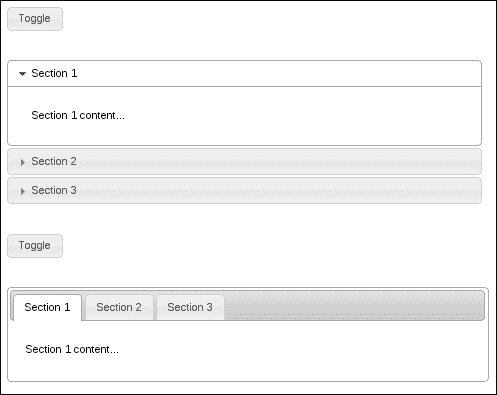
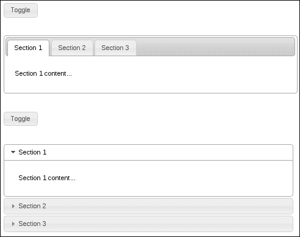
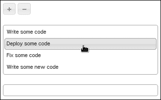
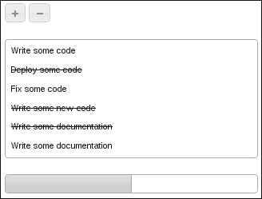
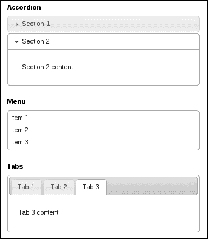
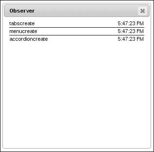
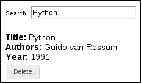

# 第十二章：小部件和更多！

在本章中，我们将介绍以下配方：

+   从折叠到标签，再返回

+   从头开始构建自定义小部件

+   构建一个观察者小部件

+   使用 Backbone 应用程序的小部件

# 介绍

到目前为止，本书中的每一章都专注于使用 jQuery UI 附带的特定小部件进行工作。在本章中，我们更感兴趣的是大局观。毕竟，您正在构建一个应用程序，而不是一个演示。因此，对于使用 jQuery UI 的开发人员来说，重要的是不仅要意识到每个单独小部件在其自身上的工作方式，还要意识到它们在其环境中的行为方式，以及它们如何与其他小部件和框架交互。

我们还将通过使用小部件工厂从头开始构建一个小部件来解决框架的基本知识。通过通用小部件机制，您可以编写一些与默认小部件无关的小部件。尽管这些自定义小部件没有继承太多功能，但它们的行为类似于 jQuery UI 小部件，仅这一点就值得付出努力——将一层一致性固化到您的应用程序中。

# 从折叠到标签，再返回

折叠和标签小部件都是容器。也就是说，它们在应用程序的上下文中的典型用途是组织子组件。这些子组件可能是其他小部件，或者任何其他 HTML 元素。因此，这两个小部件符合容器的通用描述，即具有不同部分的小部件。显然，这个描述有一些微妙之处；例如，折叠不支持远程 Ajax 内容。此外，用户遍历部分的方式也大不相同。但它们本质上是可以互换的。为什么不在两个小部件之间引入切换的能力，特别是在运行时，用户可以设置自己的偏好并在两个容器之间切换的情况下？事实证明，我们可以实现这样的东西。让我们看看我们将如何做到这一点。我们需要两个小部件之间的双向转换。这样，标签小部件可以转换为折叠小部件，反之亦然。

## 如何做...

要实现我们在这里讨论的两种不同小部件之间的转换，我们将不得不扩展折叠和标签小部件。我们将为每个小部件添加一个新方法，将小部件转换为其对应的小部件。这是我们需要使此示例发生的 HTML 结构：

```js
<button class="toggle">Toggle</button>

<div id="accordion">
    <h3>Section 1</h3>
    <div>
        <p>Section 1 content...</p>
    </div>
    <h3>Section 2</h3>
    <div>
        <p>Section 2 content...</p>
    </div>
    <h3>Section 3</h3>
    <div>
        <p>Section 3 content...</p>
    </div>
</div>

<button class="toggle">Toggle</button>

<div id="tabs">
    <ul>
        <li><a href="#section1">Section 1</a></li>
        <li><a href="#section2">Section 2</a></li>
        <li><a href="#section3">Section 3</a></li>
    </ul>
    <div id="section1">
        <p>Section 1 content...</p>
    </div>
    <div id="section2">
        <p>Section 2 content...</p>
    </div>
    <div id="section3">
        <p>Section 3 content...</p>
    </div>
</div>
```

在这里，我们有两个切换按钮，一个折叠 `div` 和一个标签 `div`。切换按钮将使其对应的容器小部件变形为另一种小部件类型。以下是 JavaScript 代码：

```js
( function( $, undefined ) {

$.widget( "ab.accordion", $.ui.accordion, {

    tabs: function() {

        this.destroy();

        var self = this,
            oldHeaders = this.headers,
            newHeaders = $( "<ul/>" );

        oldHeaders.each( function( i, v ) {

            var id = self.namespace + "-tabs-" + self.uuid + "-" + i,
                header = $( "<li/>" ).appendTo( newHeaders );

            $( "<a/>" ).text( $( v ).text() )
                       .attr( "href", "#" + id )
                       .appendTo( header );

            oldHeaders.next().eq( i ).attr( "id", id );

        });

        newHeaders.prependTo(this.element);

        this.headers.remove();
        return this.element.tabs();

    }

});

$.widget( "ab.tabs", $.ui.tabs, {

    accordion: function() {

        this.destroy();

        var self = this;

        this.tabs.each( function( i, v ) {

            var $link = $( v ).find( "a" ),
                id = $link.attr( "href" ),
                text = $link.text();

            $( "<h3/>" ).text( text )
                        .insertBefore( id );

        });

        this.tablist.remove();
        return this.element.accordion();

    },

});

})( jQuery );

$(function() {

    $( "button.toggle" ).button().on( "click", function( e ) {

        var $widget = $( this ).next();

        if ( $widget.is( ":ab-accordion" ) ) {
            $widget.accordion( "tabs" );
        }
        else if ( $widget.is( ":ab-tabs" ) ) {
            $widget.tabs( "accordion" );
        }

    });

    $( "#accordion" ).accordion();
    $( "#tabs" ).tabs();

});
```

## 它是如何工作的...

当页面首次加载并且所有 DOM 元素都准备就绪时，我们创建切换按钮小部件、折叠小部件和标签小部件。如下截图所示：



现在，点击顶部的切换按钮将把手风琴部件转换为标签部件。另外，第二个切换按钮将标签部件转换为手风琴。点击每个切换按钮一次的结果如下：



切换按钮的工作原理是使用 jQuery 的`next()`函数来获取下一个部件，无论是`#accordion`还是`#tabs`，具体取决于所点击的按钮。然后将其存储在`$widget`变量中，因为我们会多次访问它。首先，我们检查部件是否是手风琴，如果是，我们在手风琴上调用`tabs()`方法。同样地，如果`$widget`是标签，我们调用`accordion()`方法来转换它。请注意，我们正在使用内置的部件选择器，部件工厂为每个部件创建，以确定元素是什么类型的部件。另外，请注意，命名空间是`ab`，而不是`ui`，这是编写自己的部件或自定义现有部件时的推荐做法，就像这里一样。在这里，我选择了我的缩写作为命名空间。在实践中，这将是一个与应用程序相关的标准约定。

现在让我们把注意力转向我们已经添加到手风琴部件的`tabs()`方法。这个新方法的基本工作是销毁手风琴部件，操作 DOM 元素，使其呈现出标签部件将识别的形式，然后实例化标签部件。所以，我们首先调用`destroy()`方法。然而，请注意，我们仍然可以访问手风琴部件的一些属性，比如`headers`。销毁部件主要涉及删除任何由于首次创建部件而引入到 DOM 中的装饰，以及删除事件处理程序。在 JavaScript 级别上，销毁我们在这里使用的部件对象并不太关心。

此时，我们有一个`oldHeaders`变量，它指向原始手风琴的`h3`元素。接下来，我们有`newHeaders`，它是一个空的`ul`元素。`newHeaders`元素是标签部件期望找到的新元素的起点。接下来，我们必须构建指向标签的内容面板的`li`元素。对于每个标题，我们向`newHeaders` `ul`添加一个链接。但是，我们还必须使用将标题链接到的`id`更新面板 ID。我们首先使用选项卡的位置以及部件本身的`uuid`构建一个 ID 字符串。虽然 uuid 并不是必需的；然而，确保唯一的选项卡 ID 仍然是一个好主意。

最后，我们将新的标题添加到元素中，并删除旧的标题。此时，我们有足够的内容来实例化标签部件。而且我们确实这样做了。请注意，我们返回了新创建的对象，以便如果在代码的其他地方引用它，可以用此方法替换它，例如，`myTabs = myAccordion.accordion( "tabs" )`。

我们添加到标签小部件的 `accordion()` 方法遵循了上述 `tabs()` 方法中应用的相同原则——我们想要销毁小部件，操作 DOM，并创建折叠小部件。为了实现这一点，我们需要在相应的内容面板之前插入 `h3` 标题元素。然后，我们删除 `tablist` 元素和标签 `ul`，然后调用实例化并返回折叠小部件。

# 从头开始构建自定义小部件

jQuery UI 最强大的部分并不是随附的预构建小部件，而是用于构建这些小部件的机制。每个小部件都共享一个称为小部件工厂的公共基础设施，并且该基础设施对开发人员使用该框架是可见的。小部件工厂提供了一种让开发人员定义自己的小部件的方式。我们在本书中已经多次看到小部件工厂的实际应用。我们一直在使用它来扩展任何给定小部件的功能。本节的重点是以不同的角度来看待小部件工厂。也就是说，我们如何利用它从零开始构建自己的小部件？

嗯，我们不想从零开始，因为那样会违背小部件工厂的整个目的。相反，构建任何小部件的目标是利用基础小部件类提供的通用功能。此外，开发人员在创建小部件时应该尽量遵循一些基本的设计原则。例如，您的小部件在销毁时应该进行清理，删除属性、事件处理程序，并基本上将元素恢复到原始状态。小部件还应该提供简单的 API，并且对于使用您的小部件的开发人员来说，它应该清楚该小部件做什么，更重要的是，它不做什么。在开始之前和设计小部件时，请记住一些原则：

+   **保持简单**：随着 jQuery UI 的最新版本，一些标准小部件经历了重大的重构工作，以简化其界面。在设计您的小部件时，借鉴这个教训，并将其责任最小化。在实现小部件的过程中，可能会有添加另一个 API 方法的冲动，甚至可能有几个。在这样做之前，请认真考虑，因为扩展 API 通常会导致难以维护和保持稳定的小部件。而这正是小部件背后的整个理念，一个小而可靠的模块化组件，可以在各种上下文中使用而不会出现问题。话虽如此，一个不满足应用程序需求的小部件也毫无价值。

+   **可扩展性设计**：在简洁保持原则的基础上构建的是可扩展性。同样，正如我们在本书中所见，可扩展性通常是赋予小部件额外功能以执行其工作所需的关键。这些可以是简单的自定义，也可以是方法的完全重写。无论如何，假设您的小部件将被修改，并且它将有观察者监听事件。换句话说，一个好的小部件将以合理的粒度提供功能在实现它的方法之间的分布。每个方法都是专门化的入口点，因此潜在的入口点应该是一个有意识的关注点。小部件触发的事件将小部件的状态传达给外界。因此，当您的小部件的状态发生变化时，请务必让其他人知道。

## 如何做...

足够的说了，现在，让我们来构建一个检查表小部件。它真的就像听起来的那么简单。我们将基于一个`ul`元素构建小部件，该元素将每个`li`元素转换为检查表项。但是，检查表不会孤立存在；我们将添加一些外部组件来与我们的小部件进行交互。我们将需要一个按钮来添加新的检查表项，一个按钮来删除一个项目，以及一个用于跟踪我们列表进度的进度条。用户与小部件本身的主要交互集中在检查和取消检查项目上。

这是我们在本示例中将使用的 HTML：

```js
<div class="container">
    <button id="add">Add</button>
    <button id="remove">Remove</button>
</div>
<div class="container">
    <ul id="checklist">
        <li><a href="#">Write some code</a></li>
        <li><a href="#">Deploy some code</a></li>
        <li><a href="#">Fix some code</a></li>
        <li><a href="#">Write some new code</a></li>
    </ul>
</div>
<div class="container">
    <div id="progressbar"></div>
</div>
```

接下来，我们将添加我们的检查表小部件所需的 CSS。

```js
.ui-checklist {
    list-style-type: none;
    padding: 0.2em;
}

.ui-checklist li {
    padding: 0.4em;
    border: 1px solid transparent;
    cursor: pointer;    
}

.ui-checklist li a {
    text-decoration: none;
    outline: none;
}

.ui-checklist-checked {
    text-decoration: line-through;
}
```

最后，我们将使用以下 JavaScript 代码添加我们的小部件定义。此代码还创建了本示例中使用的两个按钮小部件和进度条小部件。

```js
( function( $, undefined ) {

$.widget( "ab.checklist", {

    options: {
        items: "> li",
        widgetClasses: [
            "ui-checklist",
            "ui-widget",
            "ui-widget-content",
            "ui-corner-all"
        ],
        itemClasses: [
            "ui-checklist-item",
            "ui-corner-all"
        ],
        checkedClass: "ui-checklist-checked"
    },

    _getCreateEventData: function() {

        var items = this.items,
            checkedClass = this.options.checkedClass;

        return {
            items: items.length,
            checked: items.filter( "." + checkedClass ).length
        }

    },

    _create: function() {

        this._super();

        var classes = this.options.widgetClasses.join( " " );

        this.element.addClass( classes );

        this._on({
            "click .ui-checklist-item": this._click,
        });

        this.refresh();

    },

    _destroy: function() {

        this._super();

        var widgetClasses = this.options.widgetClasses.join( " " ),
            itemClasses = this.options.itemClasses.join( " " ),
            checkedClass = this.options.checkedClass;

        this.element.removeClass( widgetClasses );

        this.items.removeClass( itemClasses )
                  .removeClass( checkedClass )
                  .removeAttr( "aria-checked" );

    },

    _click: function( e ) {

        e.preventDefault();
        this.check( this.items.index( $( e.currentTarget ) ) );

    },

    refresh: function() {

        var trigger = true,
            items,
            newItems;

        if ( this.items === undefined ) {
            trigger = false;
            this.items = $();
        }

        items = this.element.find( this.options.items )
        newItems = items.not( this.items );

        items.addClass( this.options.itemClasses.join( " " ) );

        this._hoverable( newItems );
        this._focusable( newItems );

        this.items = items;

        if ( trigger ) {
            this._trigger( "refreshed",
                           null,
                           this._getCreateEventData() );
        }

    },

    check: function( index ) {

        var $item = this.items.eq( index ),
            checked;

        if ( !$item.length ) {
            return;
        }

        checked = $item.attr( "aria-checked" ) === "true" ?
                  "false" : "true";

        $item.toggleClass( this.options.checkedClass )
             .attr( "aria-checked", checked );

        this._trigger( "checked", null, this._getCreateEventData());

    }

});

})( jQuery );

$(function() {

    $( "#add" ).button({
        icons: {
            primary: "ui-icon-plus"
        },
        text: false
    });

    $( "#add" ).on( "click", function( e ) {

        var $checklist = $( "#checklist" ),
            $item = $( "<li/>" ).appendTo( checklist );

        $( "<a/>" ).attr( "href", "#" )
                   .text( "Write some documentation" )
                   .appendTo( $item );

        $checklist.checklist( "refresh" );

    });

    $( "#remove" ).button({
        icons: {
            primary: "ui-icon-minus"
        },
        text: false
    });

    $( "#remove" ).on( "click", function( e ) {

        var $checklist = $( "#checklist" ),
            $item = $checklist.find( ".ui-checklist-item:last" );

        $item.remove();
        $checklist.checklist( "refresh" );

    });

    $( "#progressbar" ).progressbar();

    $( "#checklist" ).checklist({
        create: function( e, ui ) {
            $( "#progressbar" ).progressbar( "option", {
                max: ui.items,
                value: ui.checked
            });
        },
        refreshed: function( e, ui ) {
            $( "#progressbar" ).progressbar( "option", {
                max: ui.items,
                value: ui.checked
            });
        },
        checked: function( e, ui ) {
            $( "#progressbar" ).progressbar( "value", ui.checked );
        }
    });

});
```

当您首次加载页面时，检查表组件以及页面上的其他组件应该看起来像这样：



您可以看到，这些是 HTML 结构中指定的默认检查表项。悬停状态按预期工作，但进度条为 0。这是因为检查表没有任何选定的项目。让我们勾选一些项目，并添加一些项目。



您可以看到，每次添加或删除检查表项以及单独检查或取消检查一个项目时，进度条都会更新。

## 工作原理...

让我们首先讨论检查表小部件的 HTML 结构以及显示它所需的新 CSS。然后，我们将将小部件的定义和实例化分成几个部分，并解决这些部分。此示例中使用的 HTML 分为三个主要容器`div`元素。第一个元素保存我们的添加和删除项目按钮。第二个是检查表小部件，最后一个是进度条。这是一般布局。

HTML 结构的最重要方面是`#container`元素，它是我们清单小部件的基础。每个项目都存储在一个`li`元素内。请注意，项目的文本也包装在一个`a`元素中。这使得在用户通过页面元素时处理单个项目的焦点变得更加简单。清单的主要样式由`ui-checklist`类控制。这个类在小部件第一次创建时被应用于元素，并对列表执行一些标准样式操作，比如移除项目符号图片。我们需要处理的另一件事是边框间距，当用户悬停在项目上时，`ui-state-hover`被添加和移除。包装项目文本的`a`元素不需要任何文本装饰，因为我们不将它们用作标准链接。最后，`ui-checklist-checked`类与单个清单项目的状态相关，并在视觉上标记项目为已选中。它还在我们需要收集所有已选中项目时作为查询辅助工具。

现在让我们把注意力转向小部件的定义，以及我们是如何实例化和使用它的。

+   **选项**: 我们的小部件首先定义的是它的选项，每个选项都有一个默认值。始终确保您向小部件添加的任何选项都有一个默认值，因为我们永远不能指望在创建时提供一个选项。我们在这里为我们的清单小部件定义的选项非常简单，很少会被开发人员更改。例如，我们查找的项目通常总是`li`元素。而且，我们在这里定义的类，应用于小部件本身，可能永远不会更改。然而，它们需要在某个地方声明，所以我们可以硬编码它，或者将它们放在开发人员可以访问的地方。把选项想象成小部件对象的属性或属性。

+   **私有方法**: 按照惯例，私有方法或不构成对用户可见的 API 的方法以下划线作为前缀。我们的第一个私有方法是`_getCreateEventData()`方法。当小部件的创建事件被触发时，此方法会被基础小部件类在内部调用。这个方法是一个钩子，允许我们向创建事件处理程序提供自定义数据。我们在这里做的一切就是传递一个对象，该对象具有存储在项目属性中的项目数，以及存储在已检查属性中的已检查项目数。

+   **create 方法**：`_create()`方法可能是任何小部件的最常见方法，因为它是由小部件工厂作为小部件构造函数调用的。我们使用`_super()`实用方法为我们调用基础小部件构造函数，它为我们执行一些样板初始化工作。接下来，我们使用`widgetClasses`选项将相关的小部件 CSS 类应用于元素。然后，我们使用`_on()`方法为点击事件设置事件处理程序。请注意，在事件名后面我们传递了一个委托选择器`.ui-checklist-item`。我们这样做的原因是因为可以向清单中添加项目，也可以从清单中删除项目，因此使用这种方法比手动管理每个项目的点击事件更合理。

+   **destroy 方法**：`_destroy()`方法是必不可少的，如前所述，用于执行清理任务。我们在这里使用`_super()`调用基础小部件`_destroy()`方法，该方法将清理我们使用`_on()`创建的任何事件处理程序。然后，我们只需要删除我们在小部件的生命周期中添加的任何类和属性。最后一个私有方法是`_click()`方法，这是当小部件首次创建时绑定到点击事件的事件处理程序。此方法的工作是更改所点击项目的状态，我们通过调用`check()`方法来实现这一点，该方法是向开发人员公开的 API 的一部分。我们还希望在这里阻止链接点击的默认操作，因为它们有可能重新加载页面。

+   **API**：秉承保持小部件简单的精神，暴露的 API 仅包括两种方法。第一个是`refresh()`方法，它负责定位构成我们清单的项目。这些项目存储在小部件对象的`items`属性中，这是一个不通过 API 公开的示例。`items`属性仅在内部使用；然而，如果开发人员要扩展我们的小部件，他们的自定义方法将是可访问的，甚至可能很有用。`refresh()`方法在发现新项目时更改小部件的状态，这就是为什么它会触发刷新事件的原因。但是，在某些情况下，我们不希望触发此事件，即当第一次实例化小部件时。这在`trigger`变量中进行跟踪（如果我们尚未存储任何项目，则可以安全地假定我们正在创建而不是刷新）。我们不希望与创建事件冲突的原因是，这对使用小部件的开发人员非常具有误导性。我们还在每个新发现的项目上使用了`_hoverable()`和`_focusable()`方法。这是小部件内用户与之交互的项目的标准模式。

+   **check 方法**：`check()`方法是检查清单 API 的另一半，它也会更改小部件的状态。它触发一个 changed 事件，其中包含有关项目计数和已检查计数的数据，与创建事件数据相同。您会注意到，此方法确保处理适当的`aria`属性，就像标准的 jQuery UI 小部件一样。`aria`标准促进了可访问性，这就是为什么 jQuery UI 框架使用它的原因，而我们的小部件也不应该有所不同。最后，该方法的工作是使用存储在`checkedClass`选项中的值切换此项目的类。

+   **主要应用程序**：页面加载时，我们首先做的是创建两个按钮小部件：`#add`和`#remove`。点击`#add`按钮时，会将新项目的 DOM 元素添加到检查清单中。然后，它使用`refresh()`方法更新小部件的状态，并触发任何事件。同样，`#remove`按钮会移除一个 DOM 元素，并调用`refresh()`方法，触发任何状态更改行为。进度条小部件在不包含任何选项的情况下实例化，因为它对我们的检查清单小部件一无所知。

最后，我们的检查清单小部件是用三个选项创建的。这些都是事件处理程序，它们都承担着相同的责任——更新`#progressbar`小部件。例如，小部件首先被创建，然后进度条根据在 DOM 中找到的项目进行更新（尚未检查任何项目）。当从列表中添加或删除新项目时，将触发`refreshed`事件；我们也希望在这里更新进度条。每当用户选中或取消选中项目时，都会触发`checked`事件处理程序，在这里，我们只关心更新进度条的值，因为项目的总数是相同的。

# 构建观察者小部件

处理由 jQuery UI 小部件触发的事件的典型方法是将事件处理程序绑定到该事件名称，直接传递到构造函数中。这是典型的方法，因为它易于做到，并且通常解决了我们遇到的特定问题。例如，假设当我们的手风琴小部件的某个部分展开时，我们希望更新另一个 DOM 元素。为此，在构造手风琴时将事件处理程序函数分配给激活事件。

这种方法非常适用于小型、单一用途的作业，适用于给定小部件的单个实例。然而，大多数有意义的应用程序有许多小部件，都触发着自己的事件。小部件工厂用小部件的名称前缀每个事件，这通常意味着即使在小部件上下文之外，我们也知道我们在处理什么。当我们想要将事件处理程序绑定到小部件事件时，长时间之后，小部件已经被创建了，这一点尤其有帮助。

让我们构建一个**观察者**小部件，帮助我们可视化应用程序中发生的所有潜在小部件事件。观察者小部件能够绑定到单个小部件、一组小部件或整个文档。我们将看看后一种情况，在那里观察者甚至会捕获未来创建的小部件的事件。

## 如何做...

让我们首先看一下观察者小部件使用的 CSS 样式：

```js
.ui-observer-event {
    padding: 1px;
}

.ui-observer-event-border {
    border-bottom: 1px solid;
}

.ui-observer-event-timestamp {
    float: right;
}
```

现在，让我们看一下用于创建一个基本页面和几个示例小部件的 HTML。这些小部件将触发我们试图用观察者捕获的事件。

```js
<div class="container">
    <h1 class="ui-widget">Accordion</h1>
    <div id="accordion">
        <h3>Section 1</h3>
        <div>
            <p>Section 1 content</p>
        </div>
        <h3>Section 2</h3>
        <div>
            <p>Section 2 content</p>
        </div>
    </div>
</div>
<div class="container">
    <h1 class="ui-widget">Menu</h1>
    <ul id="menu">
        <li><a href="#">Item 1</a></li>
        <li><a href="#">Item 2</a></li>
        <li><a href="#">Item 3</a></li>
    </ul>
</div>
<div class="container">
    <h1 class="ui-widget">Tabs</h1>
    <div id="tabs">
        <ul>
            <li><a href="#tab1">Tab 1</a></li>
            <li><a href="#tab2">Tab 2</a></li>
            <li><a href="#tab3">Tab 3</a></li>
        </ul>
        <div id="tab1">
            <p>Tab 1 content</p>
        </div>
        <div id="tab2">
            <p>Tab 2 content</p>
        </div>
        <div id="tab3">
            <p>Tab 3 content</p>
        </div>
    </div>
</div>
```

最后，这是小部件的实现方式，以及在此页面上使用的四个小部件实例：

```js
( function( $, undefined ) {

$.widget( "ab.observer", {

    options: {

        observables: [
            {
                widget: $.ui.accordion,
                events: [
                    "activate",
                    "beforeActivate",
                    "create"
                ]
            },
            {
                widget: $.ui.menu,
                events: [
                    "blur",
                    "create",
                    "focus",
                    "select"
                ]
            },
            {
                widget: $.ui.tabs,
                events: [
                    "activate",
                    "beforeActivate",
                    "create"
                ]
            }
        ]

    },

    _getEvents: function() {

        var events = {};

        $.each( this.options.observables, function ( i, v ) {

            var prefix = v.widget.prototype.widgetEventPrefix;

            $.each( v.events, function( i, v ) {
                events[ prefix + v.toLowerCase() ] = "_event";
            });

        });

        return events;

    },

    _create: function() {

        this._super();

        var dialogId = "ui-observer-dialog-" + this.uuid,
            dialogSettings = {
                minHeight: 300,
                maxHeight: 300,
                position: {
                    my: "right top",
                    at: "right top"
                },
                title: this.element.selector
            };

        this.dialog = $( "<div/>" ).attr( "id", dialogId )
                                   .attr( "title", "Observer" )
                                   .addClass( "ui-observer" )
                                   .appendTo( "body" )
                                   .dialog( dialogSettings );

        this._on( this.element, this._getEvents() );

    },

    _event: function( e, ui ) {

        var eventClasses = "ui-observer-event " +
                           "ui-observer-event-border",
            $event = $( "<div/>" ).prependTo( this.dialog )
                                  .addClass( eventClasses ),
            time = new Date( e.timeStamp ).toLocaleTimeString();

        $( "<span/>" ).html( e.type )
                      .appendTo( $event );

        $( "<span/>" ).html( time )
                      .addClass( "ui-observer-event-timestamp" )
                      .appendTo( $event );

        this.dialog.find( ".ui-observer-event:last" )
                   .removeClass( "ui-observer-event-border" );

    },

    _destroy: function() {

        this._super();
        this.dialog.dialog( "destroy" )
                   .remove();

    }

});

})( jQuery );

$(function() {

    $( document ).observer();

    $( "#accordion" ).accordion();
    $( "#menu" ).menu();
    $( "#tabs" ).tabs();

});
```

在浏览器中查看此页面时，基本小部件布局如下截图所示：



甚至只是创建这些小部件也会触发事件。例如，当页面首次加载时，您会看到观察者小部件创建的对话框已经填充了事件。



## 工作原理...

在这个例子中，可观察小部件应用于`document`元素。这意味着它将捕获冒泡到该级别的任何小部件事件。可观察小部件定义了一个`observables`选项，一个我们想要监听其事件的小部件数组。在这种情况下，为了简洁起见，我们只包括了三个小部件。这可以根据应用程序的需要随时扩展，因为它是一个选项。

`_getEvents()` 方法的目的是读取`observables`选项并构建一个我们可以使用它来将这些事件绑定到`_event()`方法的对象。请注意，我们在这里自动将小部件前缀值添加到事件名称——这在小部件原型的`widgetEventPrefix`属性中是可用的。`_create()`方法的工作是将`div`元素插入到`body`元素中，然后它成为一个对话框小部件。我们将其定位在页面的右上角，以便不妨碍用户。最后，我们使用由`_getEvents()`返回的对象使用`_on()`方法开始监听事件。

`_event()` 方法是我们监听的任何小部件事件触发时使用的单个回调函数。它简单地将事件记录到观察者对话框中。它还记录事件的时间；因此，这个工具对于尝试任何 jQuery UI 应用程序都是有用的，无论是大还是小，因为它可以突出显示实际发生的事件以及它们的顺序。该小部件还负责销毁它之前创建的对话框小部件。

# 在 Backbone 应用程序中使用小部件

由于 JavaScript 环境的变化多端，您可能会发现自己在不同的环境中工作，最好接受这一事实，不是所有事情都是按照 jQuery UI 的方式完成的。如果您发现自己在一个项目中渴望使用 jQuery UI 小部件，因为使用案例很多，那么您将不得不花费必要的时间来理解 jQuery UI 与另一个框架混合的后果。

对于任何开发人员来说，将完全不同的小部件框架混合在一起通常是不明智的，因此希望这是可以轻松避免的事情。当然，您必须处理其他自制的 HTML 和 CSS 组合，但这很正常。这并不是太糟糕，因为您可以控制它（其他开源框架很难做到）。那么，如果不是其他小部件框架，我们可能要考虑使用哪些其他框架？

**Backbone** 是一个通用框架，它基于较低级别的 `underscore.js` 实用库，用于为 Web 应用程序客户端添加结构。在 Backbone 应用程序中，您会找到模型、集合和视图等概念。对 Backbone 库的全面介绍远远超出了本书的范围。但是，将 Backbone 视为应用程序的脚手架很有帮助，这部分不会改变。无论是否使用 jQuery UI 小部件，它都会以相同的方式运行。但是，由于我们感兴趣的是使用 jQuery UI，让我们构建一个使用 jQuery UI 小部件的小型 Backbone 应用程序。

## 如何操作...

应用程序的目标是显示一个自动完成小部件，用户可以过滤编程语言名称。当进行选择时，会显示有关该语言的一些详细信息，包括一个删除按钮，该按钮从集合中删除语言。简单吧？让我们开始吧。

在页面页眉中，我们将做一些不同的事情——包括一个模板。模板只是一串文本，由 Backbone 视图渲染。我们将其类型设为 `text/template`，这样浏览器就不会将其解释为模板之外的东西（比如 JavaScript 代码）。它有一个 `id`，这样在渲染模板时我们可以稍后引用模板文本。

```js
<script type="text/template" id="template-detail">
    <div>
        <strong>Title: </strong>
        <span><%= title %></span>
    </div>
    <div>
        <strong>Authors: </strong>
        <span><%= authors %></span>
    </div>
    <div>
        <strong>Year: </strong>
        <span><%= year %></span>
    </div>
    <div>
        <button class="delete">Delete</button>
    </div>
</script>
```

接下来，是此 UI 使用的最小 CSS——简单的字体和布局调整。

```js
.search, .detail {
    margin: 20px;
}

.detail {
    font-size: 1.4em;
}

.detail button {
    font-size: 0.8em;
    margin-top: 5px;
}
```

接下来，我们有用户界面使用的实际标记。请注意 `detail` 类 `div` 是多么简洁。这是因为它只是一个模板的容器，由视图渲染，我们马上就会看到。

```js
<div class="search">
    <label for="search">Search:</label>
    <input id="search"/>
</div>
<div class="detail"></div>
```

最后，我们有实际使用自动完成和按钮 jQuery UI 小部件的 Backbone 应用程序。

### 注意

为了简洁起见，在此处我们将削减代码清单的大部分内容，试图只显示必需的内容。完全运作的 Backbone 代码可供下载，以及本书中的所有其他示例。

```js
$(function() {

    // Model and collection classes

    var Language,
        LanguageCollection;

    // View classes

    var AutocompleteView,
        LanguageView;

    // Application router

    var AppRouter;

    // Collection instance

    var languages;

    // Application and view instances

    var app,
        searchView,
        detailView;

    /**
     *
     * Class definitions
     *
     **/

    Language = Backbone.Model.extend({        
       // ...
    });

    LanguageCollection = Backbone.Collection.extend({
       // ...
    });

    AutocompleteView = Backbone.View.extend({        
       // ...
    });

    LanguageView = Backbone.View.extend({        
       // ...
    });

    AppRouter = Backbone.Router.extend({

    });

    /**
     *
     * Collection, view, and application instances
     *
     **/

    languages = new LanguageCollection([        
        // …
    ]);

    searchView = new AutocompleteView({
        // ….
    });

    detailView = new LanguageView({
        // …
    });

    app = new AppRouter();

    Backbone.history.start();

});
```

运行此示例将向用户显示一个自动完成 `input` 元素。所选语言的详细信息如下截图所示：



## 工作原理...

我们整个 Backbone 应用程序都在文档就绪的回调函数中声明。一旦完成，一切都是基于事件的。让我们逐步了解应用程序组件。您将注意到的第一件事是，我们在顶部声明了变量，并为它们提供了简要的分类解释。当我们与超过一小撮的变量共享相同的命名空间时，这通常是有帮助的。类别如下：

+   **模型和集合类**：我们应用程序中用于定义数据模型的类。

+   **视图类**：我们应用程序中用于为用户提供数据模型不同视图的类。

+   **应用程序路由器**：一个类似于控制器的单个类，用于操作浏览器地址，并在路径更改时执行相关功能。

+   **集合实例**：集合实例代表应用程序数据 - 一组模型实例。

+   **应用程序和视图实例**：单个应用程序以及该应用程序用于呈现数据的各种视图。

鉴于此，请让我们现在深入了解每个 Backbone 类的工作原理。应用程序只有一个模型类，即`Language`。我们在这里可以看到，`Language`声明在实例化时为属性定义了一些默认值。接下来，`LanguageCollection`类是 Backbone Collection 类的扩展。这是所有我们的`Language`实例的地方。请注意，我们正在指定模型属性指向`Language`类。由于我们没有 RESTful API，我们必须告诉集合，任何同步操作都应在本地执行。我们必须在 Backbone 中包含本地存储插件，以使此操作生效。这实际上是在真正的后端完全成形之前启动 UI 开发的理想方式。

接下来，我们有我们的第一个视图类，`AutocompleteView`，它专门针对自动完成 jQuery UI 小部件。我们将其命名为这样是因为我们在这里尽力使其足够通用，以便与另一个自动完成小部件一起使用。我们在视图类中有一些语言特定的硬编码内容，但这些内容如果有需要的话可以轻松改进。在这个类中定义的第一个属性是`events`对象。这些大多与自动完成小部件事件相关。每个回调事件处理程序在下面被定义为一个视图方法。`initialize()`方法是视图构造函数，在这里我们调用`delegateEvents()`来为当前元素以及未来元素激活我们的事件处理程序。然后构造函数创建自动完成小部件，并监听其连接以获取销毁事件。

`autocompleteCreate()`方法在创建自动完成小部件后触发，并将小部件的`source`选项分配给小部件。这是对此视图的`autocompleteSource`方法的代理。`autocompleteSelect`方法在用户选择项目并导航到适当路由时触发。`autocompleteChange()`方法在自动完成小部件失去焦点并且项目不同的情况下触发。我们这样做是为了在用户删除其先前选择但尚未模糊自动完成焦点时更新路径。最后，`autocompleteSearch()`方法是用户开始输入时自动完成小部件填充项目的方法。首先，我们使用集合上的 underscore `filter()`方法执行过滤，然后我们使用集合上的 underscore `map()`方法进行映射。映射是必要的以返回自动完成小部件期望的格式。

应用程序的下一个关键部分是`LanguageView`类，负责渲染编程语言的详细信息。和之前的视图一样，这个视图使用`events`属性设置事件处理程序。我们还在构造函数中列出了该视图的集合上的一些事件。需要注意的一个事件是`change:selected`事件。这只有在`selected`属性更改时才会触发，这很好，因为这是我们感兴趣的。

`render()`方法负责渲染模板，但仅在实际选择了相应的模型时才执行。一旦渲染完成，我们就可以实例化此视图使用的按钮小部件。但是，请注意，由于在首次创建视图时已经委托了单击事件处理程序，因此不会再次绑定事件处理程序。

`AppRouter`类是应用程序控制器，因为它负责对 URL 路径的更改做出反应。`routeLang()`方法响应特定语言并将其标记为选定。`routeDefault()`方法处理所有其他请求。它的唯一工作是确保没有语言被标记为选定，并且作为副作用，任何先前选定的语言都将从 UI 中移除，因为`LanguageView`正在监听`selected`属性的更改。

最后，我们在集合实例中创建我们模型的实例，然后创建我们的视图和应用程序路由器。
