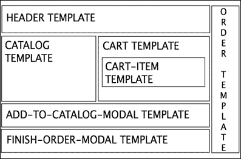
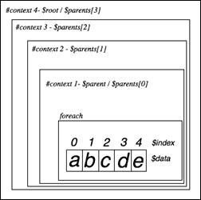
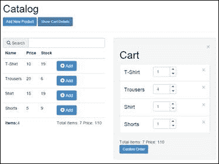
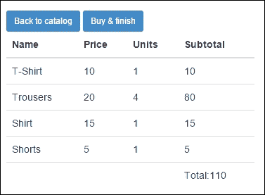
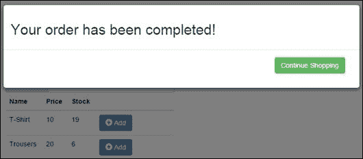
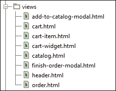

# 第二章：KnockoutJS 模板

一旦我们建立了我们的目录，就是时候给我们的应用程序添加一个购物车了。当我们的代码开始增长时，将其拆分成几个部分以保持可维护性是必要的。当我们拆分 JavaScript 代码时，我们谈论的是模块、类、函数、库等。当我们谈论 HTML 时，我们称这些部分为模板。

KnockoutJS 有一个原生模板引擎，我们可以用它来管理我们的 HTML。它非常简单，但也有一个很大的不便之处：模板应该在当前 HTML 页面中加载。如果我们的应用程序很小，这不是问题，但如果我们的应用程序开始需要越来越多的模板，这可能会成为一个问题。

在本章中，我们将使用原生引擎设计我们的模板，然后我们将讨论可以用来改进 Knockout 模板引擎的机制和外部库。

# 准备项目

我们可以从我们在第一章中完成的项目开始，*使用 KnockoutJS 自动刷新 UI*。首先，我们将为页面添加一些样式。将一个名为`style.css`的文件添加到`css`文件夹中。在`index.html`文件中添加一个引用，就在`bootstrap`引用下面。以下是文件的内容：

```js
.container-fluid {
  margin-top: 20px;
}
.row {
  margin-bottom: 20px;
}
.cart-unit {
  width: 80px;
}
.btn-xs {
  font-size:8px;
}
.list-group-item {
  overflow: hidden;
}
.list-group-item h4 {
  float:left;
  width: 100px;
}
.list-group-item .input-group-addon {
  padding: 0;
}
.btn-group-vertical > .btn-default {
  border-color: transparent;
}
.form-control[disabled], .form-control[readonly] {
  background-color: transparent !important;
}
```

现在从 body 标签中删除所有内容，除了脚本标签，然后粘贴下面这些行：

```js
<div class="container-fluid">
  <div class="row" id="catalogContainer">
    <div class="col-xs-12" data-bind="template:{name:'header'}"></div>
    <div class="col-xs-6" data-bind="template:{name:'catalog'}"></div>
    <div id="cartContainer" class="col-xs-6 well hidden" data-bind="template:{name:'cart'}"></div>
  </div>
  <div class="row hidden" id="orderContainer" data-bind="template:{name:'order'}">
  </div>
  <div data-bind="template: {name:'add-to-catalog-modal'}"></div>
  <div data-bind="template: {name:'finish-order-modal'}"></div>
</div>
```

让我们来审查一下这段代码。

我们有两个 row 类。它们将是我们的容器。

第一个容器的名称为`catalogContainer`，它将包含目录视图和购物车。第二个引用为`orderContainer`的容器，我们将在那里设置我们的最终订单。

我们还有两个更多的`<div>`标签在底部，将包含模态对话框，显示向我们的目录中添加产品的表单（我们在第一章中构建的表单），另一个将包含一个模态消息，告诉用户我们的订单已经完成。

除了这段代码，你还可以看到`data-bind`属性中的一个模板绑定。这是 Knockout 用来将模板绑定到元素的绑定。它包含一个`name`参数，表示模板的 ID。

```js
<div class="col-xs-12" data-bind="template:{name:'header'}"></div>
```

在这个例子中，这个`<div>`元素将包含位于 ID 为`header`的`<script>`标签内的 HTML。

# 创建模板

模板元素通常在 body 底部声明，就在具有对我们外部库引用的`<script>`标签上面。我们将定义一些模板，然后我们将讨论每一个模板：

```js
<!-- templates -->
<script type="text/html" id="header"></script>
<script type="text/html" id="catalog"></script>
<script type="text/html" id="add-to-catalog-modal"></script>
<script type="text/html" id="cart-widget"></script>
<script type="text/html" id="cart-item"></script>
<script type="text/html" id="cart"></script>
<script type="text/html" id="order"></script>
<script type="text/html" id="finish-order-modal"></script>
```

每个模板的名称本身就足够描述性了，所以很容易知道我们将在其中设置什么。

让我们看一个图表，展示我们在屏幕上放置每个模板的位置：



请注意，`cart-item`模板将针对购物车集合中的每个项目重复出现。模态模板只会在显示模态对话框时出现。最后，`order`模板在我们点击确认订单之前是隐藏的。

在`header`模板中，我们将有页面的标题和菜单。`catalog`模板将包含我们在第一章中编写的产品表格，*使用 KnockoutJS 自动刷新 UI*。`add-to-catalog-modal`模板将包含显示向我们的目录添加产品的表单的模态框。`cart-widget`模板将显示我们购物车的摘要。`cart-item`模板将包含购物车中每个项目的模板。`cart`模板将具有购物车的布局。`order`模板将显示我们想购买的最终产品列表和确认订单的按钮。

## 头部模板

让我们从应该包含`header`模板的 HTML 标记开始：

```js
<script type="text/html" id="header">
  <h1>
    Catalog
  </h1>

  <button class="btn btn-primary btn-sm" data-toggle="modal" data-target="#addToCatalogModal">
    Add New Product
  </button>
  <button class="btn btn-primary btn-sm" data-bind="click: showCartDetails, css:{ disabled: cart().length  < 1}">
    Show Cart Details
  </button>
  <hr/>
</script>
```

我们定义了一个`<h1>`标签和两个`<button>`标签。

第一个按钮标签附加到具有 ID`#addToCatalogModal`的模态框。由于我们使用的是 Bootstrap 作为 CSS 框架，我们可以使用`data-target`属性按 ID 附加模态，并使用`data-toggle`属性激活模态。

第二个按钮将显示完整的购物车视图，只有在购物车有商品时才可用。为了实现这一点，有许多不同的方法。

第一个方法是使用 Twitter Bootstrap 提供的 CSS-disabled 类。这是我们在示例中使用的方式。CSS 绑定允许我们根据附加到类的表达式的结果来激活或停用元素中的类。

另一种方法是使用`enable`绑定。如果表达式评估为`true`，此绑定将启用元素。我们可以使用相反的绑定，称为`disable`。Knockout 网站上有完整的文档[`knockoutjs.com/documentation/enable-binding.html`](http://knockoutjs.com/documentation/enable-binding.html)：

```js
<button class="btn btn-primary btn-sm" data-bind="click: showCartDetails, enable: cart().length  > 0"> 
  Show Cart Details
</button>

<button class="btn btn-primary btn-sm" data-bind="click: showCartDetails, disable: cart().length  < 1"> 
  Show Cart Details
</button>
```

第一种方法使用 CSS 类来启用和禁用按钮。第二种方法使用 HTML 属性`disabled`。

我们可以使用第三个选项，即使用计算可观察值。我们可以在视图模型中创建一个计算可观察变量，根据购物车的长度返回`true`或`false`：

```js
//in the viewmodel. Remember to expose it
var cartHasProducts = ko.computed(function(){
  return (cart().length > 0);
});
//HTML
<button class="btn btn-primary btn-sm" data-bind="click: showCartDetails, enable: cartHasProducts"> 
  Show Cart Details
</button>
```

要显示购物车，我们将以与上一章中相同的方式使用`click`绑定。

现在我们应该转到我们的`viewmodel.js`文件，并添加所有我们需要使此模板工作的信息：

```js
var cart = ko.observableArray([]);
var showCartDetails = function () {
  if (cart().length > 0) {
    $("#cartContainer").removeClass("hidden");
  }
};
```

并且你应该在视图模型中公开这两个对象：

```js
  return {
  //first chapter
    searchTerm: searchTerm,
    catalog: filteredCatalog,
    newProduct: newProduct,
    totalItems:totalItems,
    addProduct: addProduct,
  //second chapter
    cart: cart,
    showCartDetails: showCartDetails,
  };
```

## 目录模板

下一步是在`header`模板下方定义`catalog`模板：

```js
<script type="text/html" id="catalog">
  <div class="input-group">
    <span class="input-group-addon">
      <i class="glyphicon glyphicon-search"></i> Search
    </span>
    <input type="text" class="form-control" data-bind="textInput: searchTerm">
  </div>
  <table class="table">
    <thead>
    <tr>
      <th>Name</th>
      <th>Price</th>
      <th>Stock</th>
      <th></th>
    </tr>
    </thead>
    <tbody data-bind="foreach:catalog">
    <tr data-bind="style:color:stock() < 5?'red':'black'">
      <td data-bind="text:name"></td>
      <td data-bind="text:price"></td>
      <td data-bind="text:stock"></td>
      <td>
        <button class="btn btn-primary" data-bind="click:$parent.addToCart">
          <i class="glyphicon glyphicon-plus-sign"></i> Add
        </button>
      </td>
    </tr>
    </tbody>
    <tfoot>
    <tr>
      <td colspan="3">
        <strong>Items:</strong><span data-bind="text:catalog().length"></span>
      </td>
      <td colspan="1">
        <span data-bind="template:{name:'cart-widget'}"></span>
      </td>
    </tr>
    </tfoot>
  </table>
</script>
```

这是我们在上一章中构建的相同表格。我们只是添加了一些新东西：

```js
<tr data-bind="style:{color: stock() < 5?'red':'black'}">...</tr>
```

现在，每行使用 `style` 绑定来提醒用户，当他们购物时，库存达到最大限制。`style` 绑定与 CSS 绑定类似。它允许我们根据表达式的值添加样式属性。在这种情况下，如果库存高于五，行中的文本颜色必须是黑色，如果库存是四或更少，则为红色。我们可以使用其他 CSS 属性，所以随时尝试其他行为。例如，如果元素在购物车内部，将目录的行设置为绿色。我们应记住，如果属性有连字符，你应该用单引号括起来。例如，`background-color` 会抛出错误，所以你应该写成 `'background-color'`。

当我们使用根据视图模型的值激活的绑定时，最好使用计算观察值。因此，我们可以在我们的产品模型中创建一个计算值，该值返回应显示的颜色值：

```js
//In the Product.js
var _lineColor = ko.computed(function(){
  return (_stock() < 5)? 'red' : 'black';
});
return {
  lineColor:_lineColor
};
//In the template
<tr data-bind="style:lineColor"> ... </tr>
```

如果我们在 `style.css` 文件中创建一个名为 `stock-alert` 的类，并使用 CSS 绑定，效果会更好。

```js
//In the style file
.stock-alert {
  color: #f00;
}
//In the Product.js
var _hasStock = ko.computed(function(){
  return (_stock() < 5);   
});
return {
  hasStock: _hasStock
};
//In the template
<tr data-bind="css: hasStock"> ... </tr>
```

现在，看一下 `<tfoot>` 标签内部。

```js
<td colspan="1">
  <span data-bind="template:{name:'cart-widget'}"></span>
</td>
```

正如你所见，我们可以有嵌套模板。在这种情况下，我们在 `catalog` 模板内部有一个 `cart-widget` 模板。这使我们可以拥有非常复杂的模板，将它们分割成非常小的片段，并组合它们，以保持我们的代码整洁和可维护性。

最后，看一下每行的最后一个单元格：

```js
<td>
  <button class="btn btn-primary" data-bind="click:$parent.addToCart">
    <i class="glyphicon glyphicon-plus-sign"></i> Add
  </button>
</td>
```

看看我们如何使用魔术变量 `$parent` 调用 `addToCart` 方法。Knockout 给了我们一些魔术词来浏览我们应用程序中的不同上下文。在这种情况下，我们在 `catalog` 上下文中，想要调用一个位于一级上的方法。我们可以使用名为 `$parent` 的魔术变量。

在 Knockout 上下文中，还有其他变量可供使用。Knockout 网站上有完整的文档 [`knockoutjs.com/documentation/binding-context.html`](http://knockoutjs.com/documentation/binding-context.html)。

在这个项目中，我们不会使用所有这些绑定上下文变量。但我们会快速解释这些绑定上下文变量，只是为了更好地理解它们。

如果我们不知道我们有多少级别深入，我们可以使用魔术词 `$root` 导航到视图模型的顶部。

当我们有许多父级时，我们可以获得魔术数组 `$parents` 并使用索引访问每个父级，例如 `$parents[0]`，`$parents[1]`。想象一下，你有一个类别列表，每个类别包含一个产品列表。这些产品是一个 ID 列表，而类别有一个获取其产品名称的方法。我们可以使用 `$parents` 数组来获取对类别的引用：

```js
<ul data-bind="foreach: {data: categories}">
  <li data-bind="text: $data.name"></li>
  <ul data-bind="foreach: {data: $data.products, as: 'prod'}>
    <li data-bind="text: $parents[0].getProductName(prod.ID)"></li>
  </ul>
</ul>
```

看看`foreach`绑定内部的`as`属性有多有用。它使代码更易读。但是，如果你在`foreach`循环内部，你也可以使用`$data`魔术变量访问每个项目，并且可以使用`$index`魔术变量访问集合中每个元素的位置索引。例如，如果我们有一个产品列表，我们可以这样做：

```js
<ul data-bind="foreach: cart">
  <li><span data-bind="text:$index">
    </span> - <span data-bind="text:$data.name"></span>
</ul>
```

这应该显示：

**0 – 产品 1**

**1 – 产品 2**

**2 – 产品 3**

**...**



KnockoutJS 魔术变量用于导航上下文

现在我们更多地了解了绑定变量是什么，让我们回到我们的代码。我们现在将编写`addToCart`方法。

我们将在我们的`js/models`文件夹中定义购物车项目。创建一个名为`CartProduct.js`的文件，并插入以下代码：

```js
//js/models/CartProduct.js
var CartProduct = function (product, units) {
  "use strict";

  var _product = product,
    _units = ko.observable(units);

  var subtotal = ko.computed(function(){
    return _product.price() * _units();
  });

  var addUnit = function () {
    var u = _units();
    var _stock = _product.stock();
    if (_stock === 0) {
      return;
    }
  _units(u+1);
    _product.stock(--_stock);
  };

  var removeUnit = function () {
    var u = _units();
    var _stock = _product.stock();
    if (u === 0) {
      return;
    }
    _units(u-1);
    _product.stock(++_stock);
  };

  return {
    product: _product,
    units: _units,
    subtotal: subtotal,
    addUnit : addUnit,
    removeUnit: removeUnit,
  };
};
```

每个购物车产品由产品本身和我们想购买的产品的单位组成。我们还将有一个计算字段，其中包含该行的小计。我们应该让对象负责管理其单位和产品的库存。因此，我们已经添加了`addUnit`和`removeUnit`方法。如果调用了这些方法，它们将增加一个产品单位或删除一个产品单位。

我们应该在我们的`index.html`文件中与其他`<script>`标签一起引用这个 JavaScript 文件。

在视图模型中，我们应该创建一个购物车数组，并在返回语句中公开它，就像我们之前做的那样：

```js
var cart = ko.observableArray([]);
```

是时候编写`addToCart`方法了：

```js
var addToCart = function(data) {
  var item = null;
  var tmpCart = cart();
  var n = tmpCart.length;
  while(n--) {
    if (tmpCart[n].product.id() === data.id()) {
      item = tmpCart[n];
    }
  }
  if (item) {
    item.addUnit();
  } else {
    item = new CartProduct(data,0);
    item.addUnit();
    tmpCart.push(item);        
  }
  cart(tmpCart);
};
```

此方法在购物车中搜索产品。如果存在，则更新其单位，如果不存在，则创建一个新的。由于购物车是一个可观察数组，我们需要获取它，操作它，并覆盖它，因为我们需要访问产品对象以了解产品是否在购物车中。请记住，可观察数组不会观察它们包含的对象，只会观察数组属性。

## 添加到购物车模态框模板

这是一个非常简单的模板。我们只需将我们在第一章中创建的代码包装在一起，*使用 KnockoutJS 自动刷新 UI*，以将产品添加到 Bootstrap 模态框中：

```js
<script type="text/html" id="add-to-catalog-modal">
  <div class="modal fade" id="addToCatalogModal">
    <div class="modal-dialog">
      <div class="modal-content">
        <form class="form-horizontal" role="form" data-bind="with:newProduct">
          <div class="modal-header">
            <button type="button" class="close" data-dismiss="modal">
              <span aria-hidden="true">&times;</span>
              <span class="sr-only">Close</span>
            </button><h3>Add New Product to the Catalog</h3>
          </div>
          <div class="modal-body">
            <div class="form-group">
              <div class="col-sm-12">
                <input type="text" class="form-control" placeholder="Name" data-bind="textInput:name">
              </div>
            </div>
            <div class="form-group">
              <div class="col-sm-12">
                <input type="text" class="form-control" placeholder="Price" data-bind="textInput:price">
              </div>
            </div>
            <div class="form-group">
              <div class="col-sm-12">
                <input type="text" class="form-control" placeholder="Stock" data-bind="textInput:stock">
              </div>
            </div>
          </div>
          <div class="modal-footer">
            <div class="form-group">
              <div class="col-sm-12">
                <button type="submit" class="btn btn-default" data-bind="{click:$parent.addProduct}">
                  <i class="glyphicon glyphicon-plus-sign">
                  </i> Add Product
                </button>
              </div>
            </div>
          </div>
        </form>
      </div><!-- /.modal-content -->
    </div><!-- /.modal-dialog -->
  </div><!-- /.modal -->
</script>
```

## 购物车小部件模板

此模板可以快速向用户提供有关购物车中有多少件商品以及它们的总成本的信息：

```js
<script type="text/html" id="cart-widget">
  Total Items: <span data-bind="text:totalItems"></span>
  Price: <span data-bind="text:grandTotal"></span>
</script>
```

我们应该在我们的视图模型中定义`totalItems`和`grandTotal`：

```js
var totalItems = ko.computed(function(){
  var tmpCart = cart();
  var total = 0;
  tmpCart.forEach(function(item){
    total += parseInt(item.units(),10);
  });
  return total;
});
var grandTotal = ko.computed(function(){
  var tmpCart = cart();
  var total = 0;
  tmpCart.forEach(function(item){
    total += (item.units() * item.product.price());
  });
  return total;
});
```

现在你应该像我们一直做的那样在返回语句中公开它们。现在不要担心格式，你将在未来学习如何格式化货币或任何类型的数据。现在你必须专注于学习如何管理信息以及如何向用户显示信息。

## 购物车项目模板

`cart-item`模板显示购物车中的每一行：

```js
<script type="text/html" id="cart-item">
  <div class="list-group-item" style="overflow: hidden">
    <button type="button" class="close pull-right" data-bind="click:$root.removeFromCart"><span>&times;</span></button>
    <h4 class="" data-bind="text:product.name"></h4>
    <div class="input-group cart-unit">
      <input type="text" class="form-control" data-bind="textInput:units" readonly/>
        <span class="input-group-addon">
          <div class="btn-group-vertical">
            <button class="btn btn-default btn-xs" data-bind="click:addUnit">
              <i class="glyphicon glyphicon-chevron-up"></i>
            </button>
            <button class="btn btn-default btn-xs" data-bind="click:removeUnit">
              <i class="glyphicon glyphicon-chevron-down"></i>
            </button>
          </div>
        </span>
    </div>
  </div>
</script>
```

我们在每条线的右上角设置了一个**x**按钮，方便从购物车中移除一条线。正如您所见，我们使用了`$root`魔术变量来导航到顶级上下文，因为我们将在`foreach`循环中使用此模板，这意味着该模板将处于循环上下文中。如果我们把这个模板视为一个独立的元素，我们无法确定我们在上下文导航中有多深。为了确保，我们要到正确的上下文中调用`removeFormCart`方法。在这种情况下最好使用`$root`而不是`$parent`。

`removeFromCart`的代码应该在 view-model 上下文中，代码应该如下所示：

```js
var removeFromCart = function (data) {
  var units = data.units();
  var stock = data.product.stock();
  data.product.stock(units+stock);
  cart.remove(data);
};
```

注意，在`addToCart`方法中，我们获得了 observable 内部的数组。我们这样做是因为我们需要导航到数组的元素内部。在这种情况下，Knockout 可观察数组有一个叫做`remove`的方法，允许我们移除作为参数传递的对象。如果对象在数组中，则会被移除。

记住，数据环境始终作为我们在单击事件中使用的函数的第一个参数传递。

## 购物车模板

`cart`模板应显示购物车的布局：

```js
<script type="text/html" id="cart">
  <button type="button" class="close pull-right" data-bind="click:hideCartDetails">
    <span>&times;</span>
  </button>
  <h1>Cart</h1>
  <div data-bind="template: {name: 'cart-item', foreach:cart}" class="list-group"></div>
  <div data-bind="template:{name:'cart-widget'}"></div>
  <button class="btn btn-primary btn-sm" data-bind="click:showOrder">
    Confirm Order
  </button>
</script>
```

重要的是，您注意到我们**<h1>购物车</h1>**下面正好绑定了模板。我们使用`foreach`参数将模板与数组绑定。通过这种绑定，Knockout 会为购物车中的每个元素渲染`cart-item`模板。这样可以大大减少我们在每个模板中编写的代码，而且使它们更易读。

我们再次使用`cart-widget`模板显示总商品数量和总金额。这是模板的一个很好的特点，我们可以反复使用内容。

请注意，我们在购物车的右上方放置了一个按钮，当我们不需要查看购物车的详细信息时，可以关闭购物车，并且另一个按钮是在完成时确认订单。我们的 view-model 中的代码应该如下：

```js
var hideCartDetails = function () {
  $("#cartContainer").addClass("hidden");
};
var showOrder = function () {
  $("#catalogContainer").addClass("hidden");
  $("#orderContainer").removeClass("hidden");
};
```

正如您所见，我们使用 jQuery 和 Bootstrap 框架的 CSS 类来显示和隐藏元素。隐藏类只是给元素添加了`display: none`样式。我们只需要切换这个类来在视图中显示或隐藏元素。将这两个方法暴露在您的 view-model 的`return`语句中。

当需要显示`order`模板时我们将回来。

这就是我们有了我们的目录和购物车后的结果：



## 订单模板

一旦我们单击**确认订单**按钮，订单应该显示给我们，以便审查和确认我们是否同意。

```js
<script type="text/html" id="order">
  <div class="col-xs-12">
    <button class="btn btn-sm btn-primary" data-bind="click:showCatalog">
      Back to catalog
    </button>
    <button class="btn btn-sm btn-primary" data-bind="click:finishOrder">
      Buy & finish
    </button>
  </div>
  <div class="col-xs-6">
    <table class="table">
      <thead>
      <tr>
        <th>Name</th>
        <th>Price</th>
        <th>Units</th>
        <th>Subtotal</th>
      </tr>
      </thead>
      <tbody data-bind="foreach:cart">
      <tr>
        <td data-bind="text:product.name"></td>
        <td data-bind="text:product.price"></td>
        <td data-bind="text:units"></td>
        <td data-bind="text:subtotal"></td>
      </tr>
      </tbody>
      <tfoot>
      <tr>
        <td colspan="3"></td>
        <td>Total:<span data-bind="text:grandTotal"></span></td>
      </tr>
      </tfoot>
    </table>
  </div>
</script>
```

这里有一个只读表格，显示所有购物车条目和两个按钮。其中一个是确认按钮，将显示模态对话框，显示订单完成，另一个让我们有选择返回目录继续购物。有些代码需要添加到我们的 view-model 中并向用户公开：

```js
var showCatalog = function () {
  $("#catalogContainer").removeClass("hidden");
  $("#orderContainer").addClass("hidden");
};
var finishOrder = function() {
  cart([]);
  hideCartDetails();
  showCatalog();
  $("#finishOrderModal").modal('show');
};
```

正如我们在先前的方法中所做的，我们给想要显示和隐藏的元素添加和删除隐藏类。`finishOrder`方法移除购物车中的所有商品，因为我们的订单已完成；隐藏购物车并显示目录。它还显示一个模态框，向用户确认订单已完成。



订单详情模板

## `finish-order-modal`模板

最后一个模板是告诉用户订单已完成的模态框：

```js
<script type="text/html" id="finish-order-modal">
  <div class="modal fade" id="finishOrderModal">
    <div class="modal-dialog">
            <div class="modal-content">
        <div class="modal-body">
        <h2>Your order has been completed!</h2>
        </div>
        <div class="modal-footer">
          <div class="form-group">
            <div class="col-sm-12">
              <button type="submit" class="btn btn-success" data-dismiss="modal">Continue Shopping
              </button>
            </div>
          </div>
        </div>
      </div><!-- /.modal-content -->
    </div><!-- /.modal-dialog -->
  </div><!-- /.modal -->
</script>
```

以下截图显示了输出：



# 用 if 和 ifnot 绑定处理模板

你已经学会如何使用 jQuery 和 Bootstrap 的强大功能来显示和隐藏模板。这非常好，因为你可以在任何你想要的框架中使用这个技术。这种类型的代码的问题在于，由于 jQuery 是一个 DOM 操作库，你需要引用要操作的元素。这意味着你需要知道想要应用操作的元素。Knockout 给我们一些绑定来根据我们视图模型的值来隐藏和显示元素。让我们更新`show`和`hide`方法以及模板。

将两个控制变量添加到你的视图模型中，并在`return`语句中公开它们。

```js
var visibleCatalog = ko.observable(true);
var visibleCart = ko.observable(false);
```

现在更新`show`和`hide`方法：

```js
var showCartDetails = function () {
  if (cart().length > 0) {
    visibleCart(true);
  }
};

var hideCartDetails = function () {
  visibleCart(false);
};

var showOrder = function () {
  visibleCatalog(false);
};

var showCatalog = function () {
  visibleCatalog(true);
};
```

我们可以欣赏到代码变得更易读和有意义。现在，更新`cart`模板、`catalog`模板和`order`模板。

在`index.html`中，考虑这一行：

```js
<div class="row" id="catalogContainer">
```

用以下行替换它：

```js
<div class="row" data-bind="if: visibleCatalog">
```

然后考虑以下行：

```js
<div id="cartContainer" class="col-xs-6 well hidden" data-bind="template:{name:'cart'}"></div>
```

用这个来替换它：

```js
<div class="col-xs-6" data-bind="if: visibleCart">
  <div class="well" data-bind="template:{name:'cart'}"></div>
</div>
```

重要的是要知道，if 绑定和模板绑定不能共享相同的`data-bind`属性。这就是为什么在这个模板中我们从一个元素转向两个嵌套元素。换句话说，这个例子是不允许的：

```js
<div class="col-xs-6" data-bind="if:visibleCart, template:{name:'cart'}"></div>
```

最后，考虑这一行：

```js
<div class="row hidden" id="orderContainer" data-bind="template:{name:'order'}">
```

用这个来替换它：

```js
<div class="row" data-bind="ifnot: visibleCatalog">
  <div data-bind="template:{name:'order'}"></div>
</div>
```

通过我们所做的更改，显示或隐藏元素现在取决于我们的数据而不是我们的 CSS。这样做要好得多，因为现在我们可以使用`if`和`ifnot`绑定来显示和隐藏任何我们想要的元素。

让我们粗略地回顾一下我们现在的文件：

我们有我们的`index.html`文件，其中包含主容器、模板和库：

```js
<!DOCTYPE html>
<html>
<head>
  <title>KO Shopping Cart</title>
  <meta name="viewport" content="width=device-width, initial-scale=1">
  <link rel="stylesheet" type="text/css" href="css/bootstrap.min.css">
  <link rel="stylesheet" type="text/css" href="css/style.css">
</head>
<body>

<div class="container-fluid">
  <div class="row" data-bind="if: visibleCatalog">
    <div class="col-xs-12" data-bind="template:{name:'header'}"></div>
    <div class="col-xs-6" data-bind="template:{name:'catalog'}"></div>
    <div class="col-xs-6" data-bind="if: visibleCart">
      <div class="well" data-bind="template:{name:'cart'}"></div>
    </div>
  </div>
  <div class="row" data-bind="ifnot: visibleCatalog">
    <div data-bind="template:{name:'order'}"></div>
  </div>
  <div data-bind="template: {name:'add-to-catalog-modal'}"></div>
  <div data-bind="template: {name:'finish-order-modal'}"></div>
</div>

<!-- templates -->
<script type="text/html" id="header"> ... </script>
<script type="text/html" id="catalog"> ... </script>
<script type="text/html" id="add-to-catalog-modal"> ... </script>
<script type="text/html" id="cart-widget"> ... </script>
<script type="text/html" id="cart-item"> ... </script>
<script type="text/html" id="cart"> ... </script>
<script type="text/html" id="order"> ... </script>
<script type="text/html" id="finish-order-modal"> ... </script>
<!-- libraries -->
<script type="text/javascript" src="img/jquery.min.js"></script>
<script type="text/javascript" src="img/bootstrap.min.js"></script>
<script type="text/javascript" src="img/knockout.debug.js"></script>
<script type="text/javascript" src="img/product.js"></script>
<script type="text/javascript" src="img/cartProduct.js"></script>
<script type="text/javascript" src="img/viewmodel.js"></script>
</body>
</html>
```

我们还有我们的`viewmodel.js`文件：

```js
var vm = (function () {
  "use strict";
  var visibleCatalog = ko.observable(true);
  var visibleCart = ko.observable(false);
  var catalog = ko.observableArray([...]);
  var cart = ko.observableArray([]);
  var newProduct = {...};
  var totalItems = ko.computed(function(){...});
  var grandTotal = ko.computed(function(){...});
  var searchTerm = ko.observable("");
  var filteredCatalog = ko.computed(function () {...});
  var addProduct = function (data) {...};
  var addToCart = function(data) {...};
  var removeFromCart = function (data) {...};
  var showCartDetails = function () {...};
  var hideCartDetails = function () {...};
  var showOrder = function () {...};
  var showCatalog = function () {...};
  var finishOrder = function() {...};
  return {
    searchTerm: searchTerm,
    catalog: filteredCatalog,
    cart: cart,
    newProduct: newProduct,
    totalItems:totalItems,
    grandTotal:grandTotal,
    addProduct: addProduct,
    addToCart: addToCart,
    removeFromCart:removeFromCart,
    visibleCatalog: visibleCatalog,
    visibleCart: visibleCart,
    showCartDetails: showCartDetails,
    hideCartDetails: hideCartDetails,
    showOrder: showOrder,
    showCatalog: showCatalog,
    finishOrder: finishOrder
  };
})();
ko.applyBindings(vm);
```

在调试时将视图模型全局化是很有用的。在生产环境中这样做并不是好的实践，但在调试应用程序时是很好的。

```js
Window.vm = vm;
```

现在你可以从浏览器调试器或 IDE 调试器轻松访问你的视图模型。

除了在第一章中编写的产品模型之外，我们还创建了一个名为`CartProduct`的新模型：

```js
var CartProduct = function (product, units) {
  "use strict";
  var _product = product,
    _units = ko.observable(units);
  var subtotal = ko.computed(function(){...});
  var addUnit = function () {...};
  var removeUnit = function () {...};
  return {
    product: _product,
    units: _units,
    subtotal: subtotal,
    addUnit : addUnit,
    removeUnit: removeUnit
  };
};
```

你已经学会了如何使用 Knockout 管理模板，但也许你已经注意到，在`index.html`文件中拥有所有模板并不是最佳的方法。我们将讨论两种机制。第一种更像是自制的，而第二种是许多 Knockout 开发者使用的外部库，由 Jim Cowart 创建，名为*Knockout.js-External-Template-Engine*（[`github.com/ifandelse/Knockout.js-External-Template-Engine`](https://github.com/ifandelse/Knockout.js-External-Template-Engine)）。

# 使用 jQuery 管理模板

由于我们希望从不同的文件加载模板，让我们将所有的模板移到一个名为`views`的文件夹中，并且每个模板都用一个文件表示。每个文件的名称将与模板的 ID 相同。因此，如果模板的 ID 是`cart-item`，那么文件应该被称为`cart-item.html`，并且将包含完整的`cart-item`模板：

```js
<script type="text/html" id="cart-item"></script>
```



包含所有模板的 views 文件夹

现在在`viewmodel.js`文件中，删除最后一行（`ko.applyBindings(vm)`）并添加此代码：

```js
var templates = [
  'header',
  'catalog',
  'cart',
  'cart-item',
  'cart-widget',
  'order',
  'add-to-catalog-modal',
  'finish-order-modal'
];

var busy = templates.length;
templates.forEach(function(tpl){
  "use strict";
  $.get('views/'+ tpl + '.html').then(function(data){
    $('body').append(data);
    busy--;
    if (!busy) {
      ko.applyBindings(vm);
    }
  });
});
```

此代码获取我们需要的所有模板并将它们附加到 body。一旦所有模板都加载完成，我们就调用`applyBindings`方法。我们应该这样做，因为我们是异步加载模板，我们需要确保当所有模板加载完成时绑定我们的视图模型。

这样做已足以使我们的代码更易维护和易读，但如果我们需要处理大量的模板，仍然存在问题。而且，如果我们有嵌套文件夹，列出所有模板就会变成一个头疼的事情。应该有更好的方法。

# 使用`koExternalTemplateEngine`管理模板

我们已经看到了两种加载模板的方式，它们都足以管理少量的模板，但当代码行数开始增长时，我们需要一些允许我们忘记模板管理的东西。我们只想调用一个模板并获取内容。

为此目的，Jim Cowart 的库`koExternalTemplateEngine`非常完美。这个项目在 2014 年被作者放弃，但它仍然是一个我们在开发简单项目时可以使用的好库。在接下来的章节中，您将学习更多关于异步加载和模块模式的知识，我们将看到其他目前正在维护的库。

我们只需要在`js/vendors`文件夹中下载库，然后在我们的`index.html`文件中链接它，放在 Knockout 库的下面即可。

```js
<script type="text/javascript" src="img/knockout.debug.js"></script>
<script type="text/javascript" src="img/koExternalTemplateEngine_all.min.js"></script>
```

现在你应该在`viewmodel.js`文件中进行配置。删除模板数组和`foreach`语句，并添加以下三行代码：

```js
infuser.defaults.templateSuffix = ".html";
infuser.defaults.templateUrl = "views";
ko.applyBindings(vm);
```

这里，`infuser`是一个我们用来配置模板引擎的全局变量。我们应该指示我们的模板将具有哪个后缀名，以及它们将在哪个文件夹中。

我们不再需要`<script type="text/html" id="template-id"></script>`标签，所以我们应该从每个文件中删除它们。

现在一切应该都正常了，我们成功所需的代码并不多。

KnockoutJS 有自己的模板引擎，但是您可以看到添加新的引擎并不困难。如果您有其他模板引擎的经验，如 jQuery Templates、Underscore 或 Handlebars，只需将它们加载到您的`index.html`文件中并使用它们，没有任何问题。这就是 Knockout 的美丽之处，您可以使用任何您喜欢的工具。

你在本章学到了很多东西，对吧？

+   Knockout 给了我们 CSS 绑定，根据表达式激活和停用 CSS 类。

+   我们可以使用 style 绑定向元素添加 CSS 规则。

+   模板绑定帮助我们管理已在 DOM 中加载的模板。

+   使用`foreach`绑定可以在集合上进行迭代。

+   在`foreach`内部，Knockout 给了我们一些魔术变量，如`$parent`、`$parents`、`$index`、`$data`和`$root`。

+   我们可以在`foreach`绑定中使用`as`绑定来为每个元素获取别名。

+   我们可以只使用 jQuery 和 CSS 来显示和隐藏内容。

+   我们可以使用`if`、`ifnot`和`visible`绑定来显示和隐藏内容。

+   jQuery 帮助我们异步加载 Knockout 模板。

+   您可以使用`koExternalTemplateEngine`插件以更有效的方式管理模板。这个项目已经被放弃了，但它仍然是一个很好的解决方案。

# 摘要

在本章中，您已经学会了如何使用共享相同视图模型的模板来拆分应用程序。现在我们知道了基础知识，扩展应用程序会很有趣。也许我们可以尝试创建产品的详细视图，或者给用户选择订单发送位置的选项。您将在接下来的章节中学习如何做这些事情，但是只使用我们现在拥有的知识进行实验会很有趣。

在下一章中，我们将学习如何扩展 Knockout 行为。这将有助于格式化数据并创建可重用的代码。您将学习自定义绑定和组件是什么，以及它们如何帮助我们编写可重用和优雅的代码。

本章的代码在 GitHub 上：

[`github.com/jorgeferrando/knockout-cart/archive/chapter2.zip`](https://github.com/jorgeferrando/knockout-cart/archive/chapter2.zip)
