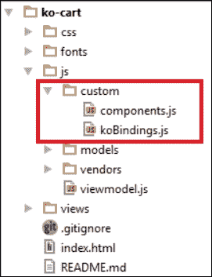
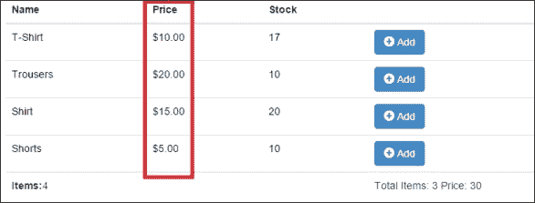
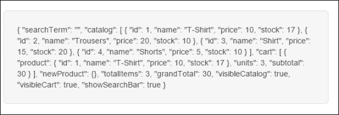
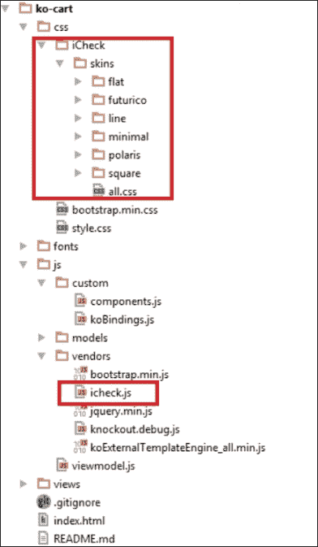
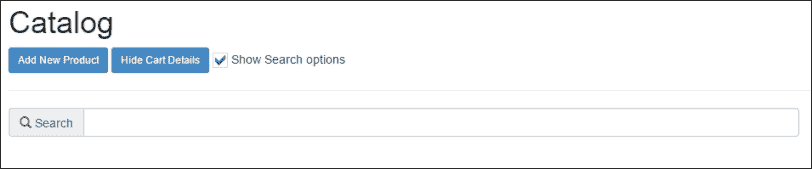
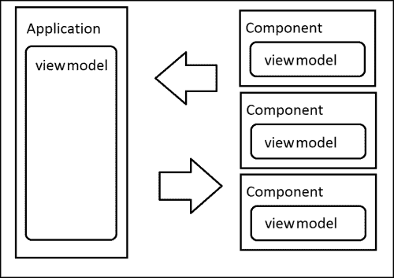

# 第三章：自定义绑定和组件

通过前两章学到的所有概念，你可以构建出大部分真实世界中遇到的应用程序。当然，如果只凭借这两章的知识编写代码，你应该非常整洁，因为你的代码会变得越来越庞大，维护起来会很困难。

有一次一个谷歌工程师被问及如何构建大型应用程序。他的回答既简短又雄辩：*别*。不要编写大型应用程序。相反，编写小型应用程序，小型的隔离代码片段互相交互，并用它们构建一个大系统。

我们如何编写小型、可重用和独立的代码片段来扩展 Knockout 的功能？答案是使用自定义绑定和组件。

# 自定义绑定

我们知道什么是绑定，它是我们写在`data-bind`属性中的一切。我们有一些内置的绑定。点击和值是其中的两个。但我们可以编写我们自己的自定义绑定，以整洁的方式扩展我们应用程序的功能。

编写自定义绑定非常简单。它有一个基本结构，我们应该始终遵循：

```js
ko.bindingHandlers.yourBindingName = {
  init: function(element, valueAccessor, allBindings, viewModel, bindingContext) {
    // This will be called when the binding is first applied to an element
    // Set up any initial state, event handlers, etc. here
  },
  update: function(element, valueAccessor, allBindings, viewModel, bindingContext) {
    // This will be called once when the binding is first applied to an element,
    // and again whenever any observables/computeds that are accessed change
    // Update the DOM element based on the supplied values here.
  }
};
```

Knockout 有一个内部对象叫做`bindingHandlers`。我们可以用自定义绑定扩展这个对象。我们的绑定应该有一个名称，在`bindingHandlers`对象内用来引用它。我们的自定义绑定是一个具有两个函数`init`和`update`的对象。有时你应该只使用其中一个，有时两个都要用。

在`init`方法中，我们应该初始化绑定的状态。在`update`方法中，我们应该设置代码以在其模型或值更新时更新绑定。这些方法给了我们一些参数来执行这个任务：

+   `element`：这是与绑定有关的 DOM 元素。

+   `valueAccessor`：这是绑定的值。通常是一个函数或可观察对象。使用`ko.unwrap`来获取值更安全，比如`var value = ko.unwrap(valueAccessor());`。

+   `allBindings`：这是一个对象，你可以用它来访问其他绑定。你可以使用`allBindings.get('name')`来获取一个绑定，或使用`allBindings.has('name')`来查询绑定是否存在。

+   `viewModel`：在 Knockout 3.x 中已弃用。你应该使用`bindingContext.$data`或`bindigContext.$rawData`代替。

+   `bindingContext`：使用绑定上下文，我们可以访问熟悉的上下文对象，如`$root`、`$parents`、`$parent`、`$data`或`$index`来在不同的上下文中导航。

我们可以为许多事物使用自定义绑定。例如，我们可以自动格式化数据（货币或日期是明显的例子），或增加其他绑定的语义含义。给绑定起名叫`toggle`比仅仅设置`click`和`visible`绑定来显示和隐藏元素更加描述性。



新的文件夹结构与自定义绑定和组件

## 这个 toggle 绑定

要向我们的应用程序添加新的自定义绑定，我们将创建一个名为`custom`的新文件夹，放在我们的`js`文件夹中。然后，我们将创建一个名为`koBindings.js`的文件，并将其链接到我们的`index.html`文件中，放在我们的模板引擎的下方：

```js
<script type="text/javascript" src="img/koExternalTemplateEngine_all.min.js"></script>
<script type="text/javascript" src="img/koBindings.js"></script>
```

我们的第一个自定义绑定将被称为`toggle`。我们将使用此自定义绑定来更改布尔变量的值。通过这种行为，我们可以显示和隐藏元素，即我们的购物车。只需在`koBindings.js`文件的开头编写以下代码。

```js
ko.bindingHandlers.toggle = {
  init: function (element, valueAccessor) {
    var value = valueAccessor();
    ko.applyBindingsToNode(element, {
      click: function () {
          value(!value());
      }
    });
  }
};
```

在这种情况下，我们不需要使用`update`方法，因为我们在初始化绑定时设置了所有行为。我们使用`ko.applyBingidsToNode`方法将`click`函数链接到元素上。`applyBindingsToNode`方法具有与`applyBindings`相同的行为，但我们设置了一个上下文，一个从 DOM 中获取的节点，其中应用了绑定。我们可以说`applyBindings`是`applyBindingsToNode($('body'), viewmodel)`的别名。

现在我们可以在我们的应用程序中使用这个绑定。更新`views/header.html`模板中的`showCartDetails`按钮。删除以下代码：

```js
<button class="btn btn-primary btn-sm" data-bind="click:showCartDetails, css:{disabled:cart().length  < 1}">Show Cart Details
</button>
```

更新以下按钮的代码：

```js
<button class="btn btn-primary btn-sm" data-bind="toggle:visibleCart, css:{disabled:cart().length  < 1}">
  <span data-bind="text: visibleCart()?'Hide':'Show'">
  </span> Cart Details
</button>
```

现在我们不再需要`showCartDetails`和`hideCartDetails`方法了，我们可以直接使用`toggle`绑定攻击`visibleCart`变量。

通过这个简单的绑定，我们已经删除了代码中的两个方法，并创建了一个可重用的代码，不依赖于我们的购物车视图模型。因此，您可以在任何想要的项目中重用 toggle 绑定，因为它没有任何外部依赖项。

我们还应该更新`cart.html`模板：

```js
<button type="button" class="close pull-right" data-bind="toggle:visibleCart"><span>&times;</span></button>
```

一旦我们进行了此更新，我们意识到不再需要使用`hideCartDetails`。要彻底删除它，请按照以下步骤操作：

1.  在`finishOrder`函数中，删除以下行：

    ```js
    hideCartDetails();
    ```

1.  添加以下行：

    ```js
    visibleCart(false);
    ```

没有必要保留只管理一行代码的函数。

## 货币绑定

自定义绑定提供的另一个有用的工具是格式化应用于节点数据的选项。例如，我们可以格式化购物车的货币字段。

在 toggle 绑定的下方添加以下绑定：

```js
ko.bindingHandlers.currency = {
  symbol: ko.observable('$'),
  update: function(element, valueAccessor, allBindingsAccessor){
    return ko.bindingHandlers.text.update(element,function(){
      var value = +(ko.unwrap(valueAccessor()) || 0),
        symbol = ko.unwrap(allBindingsAccessor().symbol !== undefined? allBindingsAccessor().symbol: ko.bindingHandlers.currency.symbol);
      return symbol + value.toFixed(2).replace(/(\d)(?=(\d{3})+\.)/g, "$1,");
    });
  }
};
```

在这里，我们不需要初始化任何内容，因为初始状态和更新行为是相同的。必须要知道，当`init`和`update`方法执行相同的操作时，只需使用`update`方法。

在这种情况下，我们将返回我们想要的格式的数字。首先，我们使用内置绑定称为 `text` 来更新我们元素的值。这个绑定获取元素和一个函数，指示如何更新此元素内部的文本。在本地变量 `value` 中，我们将写入 `valueAccessor` 内部的值。记住 `valueAccessor` 可以是一个 observable；这就是为什么我们使用 `unwrap` 方法。我们应该对 `symbol` 绑定执行相同的操作。`symbol` 是我们用来设置货币符号的另一个绑定。我们不需要定义它，因为此绑定没有行为，只是一个写/读绑定。我们可以使用 `allBindingsAccesor` 访问它。最后，我们返回连接两个变量的值，并设置一个正则表达式将值转换为格式化的货币。

我们可以更新 `catalog` 和 `cart` 模板中的价格绑定。

```js
<td data-bind="currency:price, symbol:'€'"></td>
```

我们可以设置我们想要的符号，价格将被格式化为：€100，或者如果我们设置符号为 `$` 或空，则将看到 `$100`（如果价格值为 100）。



货币自定义绑定

注意观察如何轻松地添加越来越多有用的绑定以增强 Knockout 的功能。



使用 $root 上下文显示的容器进行调试。

# 创建一个调试绑定 – toJSON 绑定。

当我们开发我们的项目时，我们会犯错误并发现意外的行为。Knockout 视图模型很难阅读，因为我们没有普通对象，而是 observables。因此，也许在开发过程中，拥有一个显示视图模型状态的方法和容器可能很有用。这就是为什么我们要构建一个 `toJSON` 绑定，将我们的视图模型转换为一个普通的 JSON 对象，我们可以在屏幕上或控制台中显示。

```js
ko.bindingHandlers.toJSON = {
  update: function(element, valueAccessor){
    return ko.bindingHandlers.text.update(element,function(){
      return ko.toJSON(valueAccessor(), null, 2);
    });
  }
};
```

我们已经使用 `ko.toJSON` 对象将我们获取的值转换为 JSON 对象。

此函数具有与原生 `JSON.stringify` 函数相同的接口。它将三个参数作为参数：

第一个参数是我们想要转换为普通 JSON 对象的对象。

第二个是替换参数。它可以是一个函数或一个数组。它应该返回应添加到 JSON 字符串中的值。有关替换参数的更多信息，请参阅以下链接：

[`developer.mozilla.org/en-US/docs/Web/JavaScript/Guide/Using_native_JSON#The_replacer_parameter`](https://developer.mozilla.org/en-US/docs/Web/JavaScript/Guide/Using_native_JSON#The_replacer_parameter)

最后一个表示应该应用于格式化结果的空格。因此，在这种情况下，我们说我们将使用 `valueAccesor()` 方法中包含的对象，不使用替换函数，并且将缩进两个空格。 

要看到它的作用，我们应该将此行放在具有 `container-fluid` 类的元素的末尾：

```js
<pre class="well well-lg" data-bind="toJSON: $root"></pre>
```

现在在这个`<div>`标签里，我们可以将`$root`上下文视为一个 JSON 对象。`$root`上下文是我们整个 Knockout 上下文的顶部，所以我们可以在这个框中看到我们所有的视图模型。

为了让这在没有原生 JSON 序列化程序的老浏览器上工作（例如，IE 7 或更早版本），你还必须引用 `json2.js` 库。

[`github.com/douglascrockford/JSON-js/blob/master/json2.js`](https://github.com/douglascrockford/JSON-js/blob/master/json2.js)

你可以在这个链接中了解更多关于 Knockout 如何将 observables 转换为普通 JSON：[`knockoutjs.com/documentation/json-data.html`](http://knockoutjs.com/documentation/json-data.html)

## 通过我们的绑定语义化

有时候，我们写的代码对我们来说似乎很简单，但当我们仔细看时，我们意识到它并不简单。例如，在 Knockout 中，我们有内置的 visible 绑定。很容易认为如果我们想要隐藏某些东西，我们只需写：`data-bind="visible:!isVisible"`，并且每次我们想要隐藏某些东西时都写这个。这并不够清晰。我们想要表达什么？这个元素应该默认隐藏吗？当变量不可见时它应该可见吗？

最好的方法是写一个名为`hidden`的绑定。如果你有一个`hidden`绑定，你可以写`data-bind="hidden: isHidden;"`，这听起来更清晰，不是吗？这个绑定很简单，让我们看看以下的代码：

```js
ko.bindingHandlers.hidden = {
  update: function (element, valueAccessor) {
    var value = ! ko.unwrap(valueAccessor());
    ko.bindingHandlers.visible.update(element, function () { 
      return value; 
    });
  }
};
```

我们只是使用`visible`类型的`bindingHandler`来改变`valueAccessor`方法的值。所以我们创建了一个更加有含义的绑定。

看看 Knockout 有多么强大和可扩展。我们可以构建越来越多的行为。例如，如果我们想要练习自定义绑定，我们可以创建一个接收照片数组而不仅仅是一张照片的自定义图像绑定，然后我们可以创建一个轮播。我们可以创建我们自己的链接绑定，帮助我们在我们的应用程序中导航。可能性是无限的。

现在，让我们看看如何将一个 jQuery 插件集成到我们的绑定中。

## 将一个 jQuery 插件包装成自定义绑定

Knockout 和 jQuery 兼容。实际上，没有必要将一个 jQuery 插件包装成一个绑定。它会工作，因为 Knockout 和 jQuery 是兼容的。然而，正如我们之前提到的，jQuery 是一个 DOM 操作库，所以我们需要设置一个 ID 来定位我们想要应用插件的元素，这将创建一个依赖关系。如果我们将插件包装在一个自定义绑定中，我们可以通过元素和`valueAccessor`参数访问元素和它的值，并且我们可以通过`allBindings`对象传递我们需要的一切。

我们将集成一个简单的插件叫做`iCheck`，这将为我们的复选框提供一个很酷的主题。

首先下载`iCheck`插件并将`iCheck.js`文件放入`js`文件夹中。然后将`skins`文件夹保存到`css`文件夹中。`iCheck`插件的下载链接如下：

[`github.com/fronteed/iCheck/archive/2.x.zip`](https://github.com/fronteed/iCheck/archive/2.x.zip)

使用`index.html`文件链接`css`和`javascript`文件：

```js
<link rel="stylesheet" type="text/css" href="css/iCheck/skins/all.css"><!-- set it just below bootstap -->
<script type="text/javascript" src="img/icheck.js">
</script><!-- set it just below jquery -->
```

现在我们需要初始化插件并更新元素的值。在这种情况下，`init`和`update`方法是不同的。因此，我们需要编写当绑定开始工作时发生的情况以及当值更新时发生的情况。

.



将 iCheck 添加到我们的项目中

`iCheck`插件仅通过给我们的复选框提供样式来工作。现在的问题是我们需要将这个插件与我们的元素链接起来。

`iCheck`的基本行为是`$('input [type=checkbox]').icheck(config)`。当复选框的值更改时，我们需要更新我们绑定的值。幸运的是，`iCheck`有事件来检测值何时更改。

这个绑定只会管理`iCheck`的行为。这意味着可观察值的值将由另一个绑定处理。

使用`checked`绑定是有道理的。分别使用这两个绑定，以便`iCheck`绑定管理呈现，而`checked`绑定管理值行为。

将来，我们可以移除`icheck`绑定或者使用另一个绑定来管理呈现，复选框仍将正常工作。

按照我们在本章第一部分看到的`init`约定，我们将初始化插件并在`init`方法中设置事件。在`update`方法中，我们将在由`checked`绑定处理的可观察值更改时更新复选框的值。

注意我们使用`allBindingsAccesor`对象来获取已检查绑定的值：

```js
ko.bindingHandlers.icheck = {
  init: function (element, valueAccessor, allBindingsAccessor) {
    var checkedBinding = allBindingsAccessor().checked;
    $(element).iCheck({
      checkboxClass: 'icheckbox_minimal-blue',
      increaseArea: '10%'
    });
    $(element).on('ifChanged', function (event) {
      checkedBinding(event.target.checked);
    });
  },
  update: function (element,valueAccessor, allBindings) {
    var checkedBinding = allBindingsAccessor().checked;
    var status = checked?'check':'uncheck';
    $(element).iCheck(status);
  }
};
```

现在我们可以使用这个来以隔离的方式在我们的应用程序中创建酷炫的复选框。我们将使用这个插件来隐藏和显示我们的搜索框。

将此添加到`header.html`模板中**显示购物车详情** / **隐藏购物车详情**按钮的下方：

```js
<input type="checkbox" data-bind="icheck, checked:showSearchBar"/> Show Search options
```

然后转到`catalog.html`文件，在搜索栏中添加一个可见的绑定，如下所示：

```js
<div class="input-group" data-bind="visible:showSearchBar">
  <span class="input-group-addon">
    <i class="glyphicon glyphicon-search"></i> Search
  </span>
  <input type="text" class="form-control" data-bind="textInput:searchTerm">
</div>
```

将变量添加到视图模型中，并在`return`语句中设置它，就像我们对所有其他变量所做的那样：

```js
var showSearchBar = ko.observable(true);
```

现在你可以看到一个酷炫的复选框，允许用户显示和隐藏搜索栏：



## 组件 - 隔离的视图模型

自定义绑定非常强大，但有时我们需要更强大的行为。我们想要创建一个对应用程序的其余部分表现为黑匣子的隔离元素。这些类型的元素被称为**组件**。组件有自己的视图模型和模板。它还有自己的方法和事件，我们也可以说它本身就是一个应用程序。当然，我们可以使用依赖注入将我们的组件与我们的主应用程序视图模型链接起来，但是组件可以与给它正确数据的每个应用程序一起工作。

我们可以构建诸如表格、图表和您能想象到的一切复杂组件。要学习如何构建一个组件，您可以构建一个简单的组件。我们将创建一个`add-to-cart`按钮。这是一个连接我们的目录和购物车的组件，所以通过这个组件我们可以隔离我们的目录和我们的购物车。它们将通过这个组件连接，这个组件只是一个按钮，接收购物车和目录中的商品，并且将有将商品插入到购物车的所有逻辑。这是非常有用的，因为购物车不需要关心插入的商品，目录也不需要。另外，如果您需要在插入商品之前或之后执行一些逻辑，您可以在一个隔离范围内执行。



组件有与主应用程序交互的隔离视图模型

一个组件的基本结构如下：

```js
ko.components.register('component-name', {
  viewModel: function(params) {
    // Data: values you want to initilaize
    this.chosenValue = params.value;
    this.localVariable = ko.observable(true);
    // Behaviors: functions
    this.externalBehaviour = params.externalFunction;
    this.behaviour = function () { ... }
  },
  template:
    '<div>All html you want</div>'
});
```

使用这个模式的帮助，我们将构建我们的`add-to-cart`按钮。在`custom`文件夹内创建一个名为`components.js`的文件，并写入以下内容：

```js
ko.components.register('add-to-cart-button', {
  viewModel: function(params) {
    this.item = params.item;
    this.cart = params.cart;

    this.addToCart = function() {
      var data = this.item;
      var tmpCart = this.cart();
      var n = tmpCart.length;
      var item = null;

      while(n--) {
        if (tmpCart[n].product.id() === data.id()) {
          item = tmpCart[n];
        }
      }

      if (item) {
        item.addUnit();
      } else {
        item = new CartProduct(data,1);
        tmpCart.push(item);
        item.product.decreaseStock(1);
      }

      this.cart(tmpCart);
    };
  },
  template:
    '<button class="btn btn-primary" data-bind="click:addToCart">
       <i class="glyphicon glyphicon-plus-sign"></i> Add
    </button>'
});
```

我们将要添加到购物车的商品和购物车本身作为参数发送，并定义`addToCart`方法。这个方法是我们在视图模型中使用的，但现在被隔离在这个组件内部，所以我们的代码变得更清晰了。模板是我们在目录中拥有的用于添加商品的按钮。

现在我们可以将我们的目录行更新如下：

```js
<tbody data-bind="{foreach:catalog}">
  <tr data-bind="style:{color:stock() < 5?'red':'black'}">
    <td data-bind="{text:name}"></td>
    <td data-bind="{currency:price, symbol:''}"></td>
    <td data-bind="{text:stock}"></td>
    <td>
      <add-to-cart-button params= "{cart: $parent.cart, item: $data}">
      </add-to-cart-button>
    </td>
  </tr>
</tbody>
```

## 高级技术

在这一部分，我们将讨论一些高级技术。我们并不打算将它们添加到我们的项目中，因为没有必要，但知道如果我们的应用程序需要时可以使用这些方法是很好的。

### 控制后代绑定

如果我们的自定义绑定有嵌套绑定，我们可以告诉我们的绑定是否 Knockout 应该应用绑定，或者我们应该控制这些绑定如何被应用。 我们只需要在`init`方法中返回`{ controlsDescendantBindings: true }`。

```js
ko.bindingHandlers.allowBindings = {
  init: function(elem, valueAccessor) {
    return { controlsDescendantBindings: true };
  }
};
```

这段代码告诉 Knockout，名为`allowBindings`的绑定将处理所有后代绑定：

```js
<div data-bind="allowBindings: true">
  <!-- This will display 'New content' -->
  <div data-bind="text: 'New content'">Original content</div>
</div>
<div data-bind="allowBindings: false">
  <!-- This will display 'Original content' -->
  <div data-bind="text: 'New content'">Original content</div>
</div>
```

如果我们想用新属性扩展上下文，我们可以用新值扩展`bindingContext`属性。然后我们只需要使用`ko.applyBindingsToDescendants`来更新其子项的视图模型。当然我们应该告诉绑定它应该控制后代绑定。如果我们不这样做，它们将被更新两次。

```js
ko.bindingHandlers.withProperties = {
  init: function(element, valueAccessor, allBindings, viewModel, bindingContext) {
    var myVM = { parentValues: valueAccessor, myVar: 'myValue'};
    var innerBindingContext = bindingContext.extend(myVM);
    ko.applyBindingsToDescendants(innerBindingContext, element);
    return { controlsDescendantBindings: true };
  }
};
```

这里我们并不创建一个子上下文。我们只是扩展父上下文。如果我们想创建子上下文来管理后代节点，并且能够使用`$parentContext`魔术变量来访问我们的父上下文，我们需要使用`createChildContext`方法来创建一个新上下文。

```js
var childBindingContext = bindingContext.createChildContext(
  bindingContext.$rawData,
  null, //alias of descendant item ($data magic variable)
  function(context) {
    //manage your context variables
    ko.utils.extend(context, valueAccessor());
  });
ko.applyBindingsToDescendants(childBindingContext, element);
return { controlsDescendantBindings: true }; //Important to not bind twice
```

现在我们可以在子节点内部使用这些魔术变量：

```js
<div data-bind="withProperties: { displayMode: 'twoColumn' }">
  The outer display mode is <span data-bind="text: displayMode"></span>.
  <div data-bind="withProperties: { displayMode: 'doubleWidth' }">
    The inner display mode is <span data-bind="text: displayMode"></span>, but I haven't forgotten that the outer display mode is <span data-bind="text: $parentContext.displayMode"></span>.
  </div>
</div>
```

通过修改绑定上下文和控制后代绑定，您将拥有一个强大而先进的工具来创建自己的自定义绑定机制。

### 使用虚拟元素

**虚拟元素**是允许使用 Knockout 注释的自定义绑定。您只需要告诉 Knockout 我们的绑定是允许虚拟的。

```js
ko.virtualElements.allowedBindings.myBinding = true;
ko.bindingHandlers.myBinding = {
  init: function () { ... },
  update: function () { ... }
};
```

要将我们的绑定添加到允许的虚拟元素中，我们写下这个：

```js
<!-- ko myBinding:param -->
<div></div>
<!-- /ko
```

虚拟元素具有操作 DOM 的 API。您可以使用 jQuery 操作虚拟元素，因为 Knockout 的一个优点是它与 DOM 库完全兼容，但是我们在 Knockout 文档中有完整的虚拟元素 API。这个 API 允许我们执行在实现控制流绑定时所需的类型的转换。有关虚拟元素的自定义绑定的更多信息，请参考以下链接：

[`knockoutjs.com/documentation/custom-bindings-for-virtual-elements.html`](http://knockoutjs.com/documentation/custom-bindings-for-virtual-elements.html)

### 在绑定之前预处理数据

我们能够在绑定应用之前预处理数据或节点。这在显示数据之前格式化数据或向我们的节点添加新类或行为时非常有用。您也可以设置默认值，例如。我们只需要使用`preprocess`和`preproccessNode`方法。使用第一个方法，我们可以操纵我们绑定的值。使用第二个方法，我们可以操纵我们绑定的 DOM 元素（模板），如下所示：

```js
ko.bindingHandlers.yourBindingHandler.preprocess = function(value) {
  ...
};
```

我们可以使用钩子`preprocessNode`操纵 DOM 节点。每当我们用 Knockout 处理 DOM 元素时，都会触发此钩子。它不绑定到一个具体的绑定。它对所有已处理的节点触发，因此您需要一种机制来定位要操纵的节点。

```js
ko.bindingProvider.instance.preprocessNode = function(node) { 
  ...
};
```

# 摘要

在本章中，您已经学习了如何使用自定义绑定和组件扩展 Knockout。自定义绑定扩展了我们可以在`data-bind`属性中使用的选项，并赋予了我们使代码更可读的能力，将 DOM 和数据操作隔离在其中。另一方面，我们有组件。组件有它们自己的视图模型。它们本身就是一个孤立的应用程序。它们帮助我们通过彼此交互的小代码片段构建复杂的应用程序。

现在您已经知道如何将应用程序拆分成小代码片段，在下一章中，您将学习如何以不显眼的方式使用事件以及如何扩展可观察对象以增加 Knockout 的性能和功能。

要下载本章的代码，请转到 GitHub 存储库[`github.com/jorgeferrando/knockout-cart/tree/chapter3`](https://github.com/jorgeferrando/knockout-cart/tree/chapter3)。
