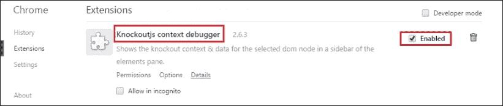
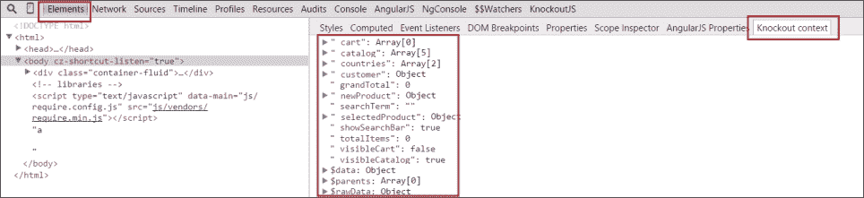
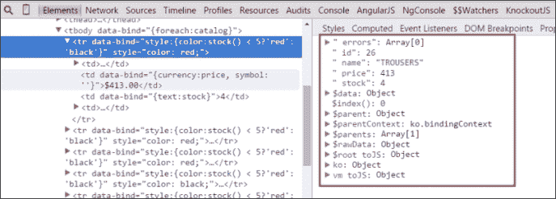
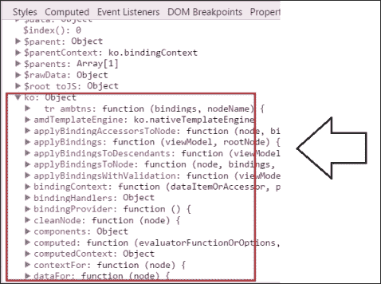
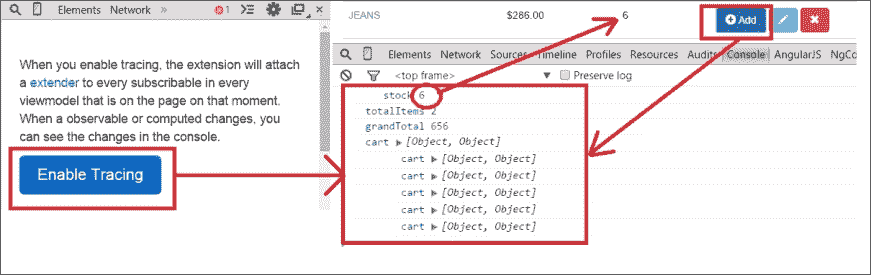
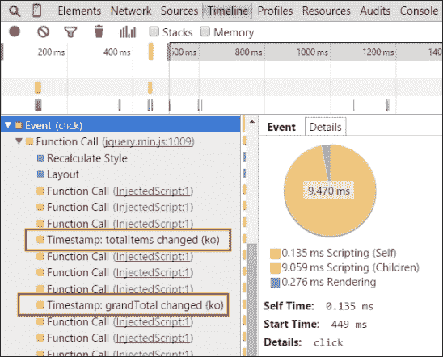
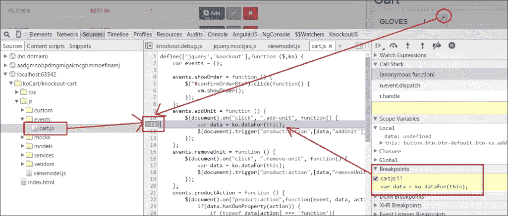
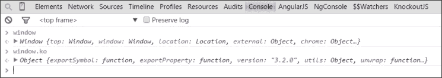
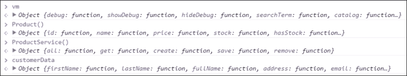

# 第六章：模块模式 - RequireJS

我们现在可以说我们的应用程序具有我们在第一章中提到的所有功能，*使用 KnockoutJS 自动刷新 UI*。我们在过去的四章中所做的是解决小型项目中的代码设计的一个很好的方法。代码整洁，文件夹结构也是连贯的。代码易于阅读和跟踪。

然而，当项目开始增长时，这种方法是不够的。你需要保持代码的整洁，不仅是在文件和文件夹结构上，还包括逻辑上。

在这一章中，我们将把我们的代码模块化，以保持应用程序的不同部分隔离和可重用。我们还将看到如何保持我们的上下文更清晰。

现在项目开始变得更加复杂。当你发现错误时，了解帮助你调试代码的工具是很重要的。在本章的第一部分，你将学习一些可以帮助你检查你的 KnockoutJS 代码的工具。你将使用一个浏览器插件（Chrome 扩展）来分析代码。

在本章的第二部分，你将把你的文件转换成模块。这将帮助你将应用程序的每个部分与其他部分隔离开来。你将使用一种叫做“依赖注入”的模式来解决模块之间的依赖关系。在[`en.wikipedia.org/wiki/Dependency_injection`](http://en.wikipedia.org/wiki/Dependency_injection)了解更多关于这个模式的信息。

在最后一部分，你将学习如何创建遵循异步模块定义（AMD）规范的模块。为了创建遵循 AMD 规范的模块，你将使用一个叫做 RequireJS 的库。这个库将管理不同模块之间的所有依赖关系。有关 AMD 的更多信息，请参阅[`en.wikipedia.org/wiki/Asynchronous_module_definition`](http://en.wikipedia.org/wiki/Asynchronous_module_definition)。

# 安装 Knockout 上下文调试器扩展

在前面的章节中，你创建了一个简单的调试器来显示你的视图模型的状态。这对于快速查看应用程序的状态非常有用。有了调试绑定，你不需要打开扩展工具来检查你的数据发生了什么变化。但是你经常只是隔离应用程序的一部分或查看绑定到 DOM 元素的模型发生了什么变化。

在 Google Chrome 中，你有一个非常好的扩展叫做**KnockoutJS 上下文调试器**，可以从[`chrome.google.com/webstore/detail/knockoutjs-context-debugg/oddcpmchholgcjgjdnfjmildmlielhof`](https://chrome.google.com/webstore/detail/knockoutjs-context-debugg/oddcpmchholgcjgjdnfjmildmlielhof)下载。

这个扩展允许你查看每个 DOM 节点的绑定，并通过控制台在线跟踪你的视图模型的变化。安装它并重新启动 Chrome 浏览器。



检查 chrome://extensions 是否已安装 KnockoutJS 上下文调试器

要检查绑定到模型的上下文，请按 *F12* 打开 **Chrome 开发者工具** 并打开 **Elements** 标签。您会看到两个面板。左侧面板有 DOM 结构。右侧面板有不同的标签。默认情况下，打开 **Styles** 标签。选择名为 **Knockout 上下文** 的标签。在那里，您应该看到添加到根上下文的所有绑定。



如何显示绑定到 DOM 元素的 KnockoutJS 上下文

如果您选择目录中的 `<tr>` 元素，您将深入上下文并位于目录项范围内。您将无法看到 `$root` 上下文；您将看到 `$data` 上下文。您可以通过 `$parent` 元素向上导航或更改 DOM 面板中的元素。



您可以轻松检查 foreach 绑定中的项目上下文。

您还可以看到 `ko` 对象。这是浏览 Knockout API 的好方法。



您可以访问 Knockout API 并查看方法、绑定、组件等。

现在找到 **KnockoutJS** 标签（它与 **Elements** 标签在同一集合中）。按下 **启用跟踪** 按钮。此功能允许您跟踪视图模型的实时更改。更改将在控制台中显示。



如果启用跟踪，您可以通过控制台捕获视图模型的更改。

此外，您还可以使用 **Timeline** 标签测量时间和性能。您可以看到应用程序在模型发生变化时用于渲染 DOM 元素的时间。



启用跟踪功能后，您可以记录事件并获得有用信息。

现在您已经了解了这个插件，我们可以删除（或保留，这取决于您）之前构建的调试绑定。

# 控制台

**控制台** 是开发人员最重要的工具之一。您可以使用它来检查应用程序在使用过程中的状态。

您可以定位 JavaScript 代码并设置断点，以检查特定点发生了什么。您可以在 **Sources** 标签中找到 JavaScript 文件。只需点击要停在的行即可。然后，您可以检查变量的值并逐步运行代码。此外，您还可以在代码中写入 `debugger` 以在此处停止程序。



您可以在代码中设置断点并检查变量的值。

如果您导航到**控制台**选项卡，您将看到控制台本身。在那里，您可以使用`console.log`函数显示信息，或者查看控制台对象文档以查看您可以在每个时刻使用的最佳方法（[`developer.mozilla.org/en-US/docs/Web/API/Console`](https://developer.mozilla.org/en-US/docs/Web/API/Console)）。

如果您在控制台中写入单词`window`，您将看到在全局范围内的所有对象。



使用控制台，您可以访问当前和全局上下文中的变量

您可以写入单词`vm`（视图模型）以查看我们创建的`vm`对象。



所有组件都设置在全局范围内

但是您也可以写`Product`或`ProductService`或我们创建的任何内容，您都会看到它。当您有大量信息时，在顶层拥有所有对象可能会很混乱。定义命名空间并保持层次结构是保持组件隔离的良好实践。您应该只保留应用程序的一个入口点。

# 模块模式

此模式允许我们专注于哪些代码部分暴露给类外部（公共元素），以及代码的哪些部分对最终用户隐藏（私有元素）。

此模式通常用于 JavaScript 软件开发。它应用于像 jQuery、Dojo 和 ExtJS 等流行库中。

一旦您知道如何使用它，此模式具有非常清晰的结构，并且非常容易应用。让我们在我们的应用程序中应用模块模式：

1.  首先，定义模块的名称。如果您在不同的文件中定义模块，重要的是要应用允许其可扩展性的模式来定义和初始化它。在初始化中使用`||`运算符表示如果`ModuleName`值已经有值，则将其赋值给自身。如果它没有值，则意味着这是它第一次被创建，因此给它一个默认值—在这种情况下是一个空对象：

    ```js
    var ModuleName;
    ModuleName = ModuleName || {};
    ```

1.  然后，定义模块的每个组件。它可以是函数、变量或另一个模块：

    ```js
    ModuleName.CustomComponent = function () {
    };
    ModuleName.CustomProperty = 10;
    ModeleName.ChildModule = OtherModule;
    ```

1.  最后，使用依赖注入模式插入模块的依赖项。该模式将所有模块依赖项作为参数传递，并立即调用该函数：

    ```js
    ModuleName.CustomComponent = (function (dependency){
      //Component code
    })(dependency);
    ```

1.  这就是一个完整模块的样子：

    ```js
    var ModuleName;
    var ModuleName = ModuleName || {};
    ModuleName.CustomComponent = (function(dependency){
      //Component code
    })(dependency);
    ```

1.  要定义组件，请返回`component`对象。定义组件的第一个模式是使用揭示模块模式。它包含在函数末尾返回一个仅包含公共接口的对象。这些是单例对象：

    ```js
    ModuleName.CustomComponent = (function(dependency){
      var somePrivateProperty = 1;
      var method1 = function(){
        dependency.methodFromDependency();
      };
      return {
        method1:method1,
        method2:method2
      }
    })(dependency);
    You can also define objects that can be instantiated using the new operator: 
ModuleName.CustomComponent = (function(dependency){
      var component = function (a,b,c) {
        var somePrivateProperty=1;
        this.someMethod = function(){
          dependency.methodFromDependency()
        }
        this.otherMethod(){
          return a+b*c; 
        }
        return this;
      }    

      return component;
    })(dependency);
    //We can instantiate the component as an object
    //var instance = new ModuleName.CustomComponent(x,y,z);
    ```

# 创建 Shop 模块

为了使我们的应用程序模块化，我们将创建一个名为`Shop`的模块，该模块将包含我们的整个应用程序。此模块将包含其他子模块和组件。此分层结构将帮助您保持代码的一致性。

作为第一种方法，按文件和类型分组你的组件。这意味着模块的每个组件都将在一个文件中，并且文件将在一个文件夹中按类型分组。例如，有一个名为`services`的文件夹。这意味着所有服务都将在这个文件夹中，并且每个服务将在一个文件中完全定义。按照惯例，组件将与它们所在的文件具有相同的名称，当然不包括扩展名。

实际上，文件已经按类型分组了，所以这是一个你不需要再做的工作。我们将把精力集中在将我们的文件转换为模块上。

# 视图模型模块

我们的应用程序中只有一个视图模型。这是一个可以应用单例模块方法的组件。

我们将小心翼翼地逐步创建我们的第一个模块：

1.  打开`viewmodel.js`文件。

1.  定义`Shop`模块，这是我们应用程序的顶级模块：

    ```js
    var Shop;
    ```

1.  通过应用扩展模式初始化`Shop`模块：

    ```js
    Shop = Shop || {};
    ```

1.  定义`ViewModel`组件：

    ```js
    Shop.ViewModel = (function(){})();
    ```

1.  将未模块化的视图模型版本的代码放入模块中：

    ```js
    Shop.ViewModel = (function(){
      var debug = ko.observable(false);
      var showDebug = function () {
        debug(true);
      };

      var hideDebug = function () {
        debug(false);
      };
      var visibleCatalog = ko.observable(true);
      // ... the rest of the code
      return {
        debug: debug,
        showDebug:showDebug,
        hideDebug:hideDebug,
        searchTerm: searchTerm,
        catalog: filteredCatalog,
    ....
      };
    })();
    ```

1.  您还没有将其他文件转换为模块，但现在您将向模块添加依赖项：

    ```js
    Shop.ViewModel = (function (ko, Models, Services, Resources){
      //code of the module
    })(ko, Shop.Models, Shop.Services, Shop.Resources);
    ```

1.  在文件末尾，模块外部，初始化模板、验证和对象：

    ```js
    $(document).ajaxError(function(event,response) {
      console.error(response);
      alert("Error in the communication. Check the console!");
    });

    //ko External Template Settings
    infuser.defaults.templateSuffix = ".html";
    infuser.defaults.templateUrl = "views";

    ko.validation.init({
      registerExtenders: true,
      messagesOnModified: true,
      insertMessages: true,
      parseInputAttributes: true
    });
    var vm = Shop.ViewModel;
    vm.activate();
    ```

您需要更新我们的视图模型中的两个方法：`activate`方法和`allCallbackSuccess`方法。您需要更新这些方法的原因是因为在`allCallbackSuccess`方法中，您需要运行`ko.applyBindings`方法，而`allCallbackSuccess`无法访问此对象，因为它超出了范围。

要解决这个问题，我们将使用与点击绑定相同的技术来附加更多参数。我们将使用`bind` JavaScript 方法将`allCallbackSuccess`方法绑定到这个对象上。因此，我们将能够像下面的代码一样使用此对象运行`ko.applyBindings`：

```js
var allCallbackSuccess = function(response){
  catalog([]);
  response.data.forEach(function(item){
    catalog.push(Product( item.id,item.name,item.price,item.stock));
  });
  filteredCatalog(catalog());
  if (catalog().length) {
    selectedProduct(catalog()[0]);
  }
  ko.applyBindings(this);
};

var activate = function () {
  ProductResource.all()
  .done(allCallbackSuccess.bind(this));
};
```

使用这种模式，您可以将任何代码片段转换为一个隔离的、可移植的模块。下一步是创建`Models`模块、`Services`模块和`Resources`模块。

# 模型模块

就像我们对视图模型所做的一样，我们将每个模型转换为一个组件，并将其包装在一个名为`Models`的模块中，具体步骤如下：

1.  打开`models/product.js`文件。

1.  定义我们的顶层模块，`Shop`，并初始化它：

    ```js
    var Shop;
    Shop = Shop || {};
    ```

1.  然后创建`Models`命名空间。它将是一个对象，或者如果存在的话，它将是它之前的值：

    ```js
    Shop.Models = Shop.Models || {};
    ```

1.  用其依赖项定义产品模型。请记住，第一个值是产品本身。这样可以允许我们在使用多个文件定义它的情况下扩展模型。因此，我们将产品模型定义如下：

    ```js
    Shop.Models.Product = (function(){
    })()
    ```

1.  传递依赖项。这次你只需要使用 Knockout 依赖项来使用 observables。Knockout 是一个全局对象，不需要将其添加到依赖项中，但最好像下面的代码那样做。

    ```js
    Shop.Models.Product = (function (ko){
    }(ko)
    ```

1.  最后，在先前的`models/Product.js`文件中设置我们之前拥有的代码：

    ```js
    var Shop;
    Shop = Shop || {};
    Shop.Models = Shop.Models || {};
    Shop.Models.Product  = (function (ko){
      return function (id, name, price, stock) {
        _id = ko.observable(id).extend(...);
        _name = ko.observable(name).extend(...);
        _price = ko.observable(price).extend(...);
        _stock = ko.observable(error).extend(...);
        var errors = ko.validation.group([_name, _price, _stock]);
        return {
          id: _id,
          name: _name,
          price: _price,
          stock: _stock,
          errors: errors
        };
      };
    })(ko);
    ```

对`models/CartProduct.js`和`models/Customer.js`文件执行相同的步骤以将其转换为模块。模型是应用我们用于生成可实例化对象的模式的完美候选对象。

重要的是要保持组件和文件名之间的一致性。确保你的文件名称与其包含的组件名称并带有`.js`扩展名。

这是将`models/CartProduct.js`文件转换为最终结果的步骤：

```js
var Shop;
Shop = Shop || {};
Shop.Models = Shop.Models || {};
Shop.Models.CartProduct = (function(ko){

  return function (product,units){
    var
    _product = product,
    _units = ko.observable(units)
    ;

    var subtotal = ko.computed(function(){
      return _product.price() * _units();
    });

    return {
      product: _product,
      units: _units,
      subtotal: subtotal
    };
  }
})(ko);
```

同样，查看`models/Customer.js`文件的结果：

```js
var Shop;
Shop = Shop || {};
Shop.Models = Shop.Models || {};
Shop.Models.Customer = (function(ko){
  return function() {
    var firstName = ko.observable("John").extend({
      required: true
    });
    var lastName = ko.observable("Doe").extend({
      required: true,
      minLength: 3
    });
    var fullName = ko.computed(function(){
      return firstName() + " " + lastName();
    });
    var address = ko.observable("Baker Street").extend({
      required: true,
      minLength: 5
    });
    var email = ko.observable("john@doe.com").extend({
      required: true,
      email: true
    });
    var zipCode = ko.observable("12345").extend({
      required: true,
      minLength: 3,
      pattern: {
        message: 'Zip code should have 5 numbers',
        params: '^[0-9]{5}$'
      }
    });
    var country = ko.observable("");
    var fullAddress = ko.computed(function(){
      return address() + " " + zipCode() + ", " + country();
    });
    var errors = ko.validation.group([firstName, lastName, address, email, zipCode]);
    return {
      firstName:firstName,
      lastName: lastName,
      fullName: fullName,
      address: address,
      email: email,
      zipCode: zipCode,
      country: country,
      fullAddress: fullAddress,
      errors: errors
    };
  };
})(ko);
```

# 资源模块

从编码角度来看，构建包含模型的模块和构建包含资源的模块并没有太大的不同。应用的模块模式是相同的。然而，你不需要创建资源的实例。要对模型应用 CRUD 操作，你只需要一个处理此责任的对象。因此，资源将是单例的，就像以下步骤中所做的那样：

1.  打开`resources/ProductResource.js`文件。

1.  创建顶层层次模块：

    ```js
    var Shop;
    Shop = Shop || {};
    ```

1.  创建`Resources`命名空间：

    ```js
    Shop.Resources = Shop.Resources || {};
    ```

1.  使用模块模式定义`ProductResource`：

    ```js
    Shop.Resources.ProductResource = (function(){
    })()
    ```

1.  设置依赖关系。在这种情况下，jQuery 是你需要的依赖项。jQuery 是一个全局对象，不需要将其作为依赖项传递，但这样做是一个很好的实践。

    ```js
    Shop.Resources.ProductResource = (function($){
    }(jQuery);
    ```

1.  最后，在`resources/ProductResource.js`文件中设置以下代码。由于在我们的应用程序中资源是单例的，将资源与以下代码中使用的方法扩展起来：

    ```js
    var Shop;
    Shop = Shop || {};
    Shop.Resources = Shop.Resources || {};
    Shop.Resources.ProductResource = (function($){
      function all() {
        return $.ajax({
          type: 'GET',
          url: '/products'
        });
      }
      function get(id) {
        return $.ajax({
          type: 'GET',
          url: '/products/'+id
        });
      }
      function create(product) {
        return $.ajax({
          type: 'POST',
          url: '/products',
          data: product
        });
      }
      function save(product) {
        return $.ajax({
          type: 'PUT',
          url: '/products/'+product.id,
          data: product
        });
      }
      function remove(id) {
        return $.ajax({
          type: 'DELETE',
          url: '/products/'+id
        });
      }
      return {
        all:all,
        get: get,
        create: create,
        save: save,
        remove: remove
      };
    }(jQuery);
    ```

现在对`OrderResouce`组件应用相同的步骤。你可以在这段代码中看到最终结果：

```js
var Shop;
Shop = Shop || {};
Shop.Resources = Shop.Resources || {};
Shop.Resources.OrderResource = (function ($) {
  function save(order) {
    return $.ajax({
      type: 'PUT',
      url: '/order',
      data: order
    });
  }
  return {
    save: save
  };
})(jQuery);
```

# 服务模块

服务也是单例的，和资源一样，所以按照与资源模块相同的步骤进行操作：

1.  打开`services/ProductService.js`文件。

1.  创建顶层层次模块：

    ```js
    var Shop;
    Shop = Shop || {};
    ```

1.  创建`Resources`命名空间：

    ```js
    Shop.Services = Shop.Services || {};
    ```

1.  定义`ProductService`：

    ```js
    Shop.Services.ProductService = (function(){
    })();
    ```

1.  在这种情况下，服务没有依赖关系。

1.  最后，在`services/ProductService.js`文件中设置以下代码。由于在应用程序中资源是单例的，将资源与以下代码中使用的方法扩展起来：

    ```js
    var Shop;
    Shop = Shop || {};
    Shop.Services = Shop.Services || {};
    Shop.Services.ProductService = (function(Product) {
      var hasStock = function (product) {
        return product.stock() > 0;
      };

      var decreaseStock = function (product) {
        var s = product.stock();
        if (s > 0) {
          s--;
        }
        product.stock(s);
      };

      var clone = function (product) {
        return Product(product.id(), product.name(), product.price(), product.stock());
      };

      var refresh = function (product,newProduct) {
        product.name(newProduct.name());
        product.stock(newProduct.stock());
        product.price(newProduct.price());
      };

      return {
        hasStock:hasStock,
        decreaseStock:decreaseStock,
        clone:clone,
        refresh: refresh
      };
    })(Shop.Models.Product);
    ```

# 事件、绑定和 Knockout 组件

我们不打算模块化事件，因为它们是特定于此应用程序的。孤立非可移植的东西是没有意义的。我们也不会将绑定或组件模块化，因为它们被注入到 Knockout 对象中作为库的一部分，所以它们已经足够孤立，它们不是模块的一部分，而是 Knockout 对象的一部分。但我们需要更新所有这些文件中的依赖关系，因为应用程序的不同部分现在都隔离在`Shop`模块及其子模块中。

# 更新 add-to-cart-button 组件

要使用新命名空间更新组件，更新（覆盖）对依赖项的引用，如下所示：

```js
ko.components.register('add-to-cart-button', {
  viewModel: function(params) {
    this.item = params.item;
    this.cart = params.cart;
    this.addToCart = function() {
      var CartProduct = Shop.Models.CartProduct;
      var CartProductService = Shop.Services.CartProductService;
      var ProductService = Shop.Services.ProductService;

      var data = this.item;
      var tmpCart = this.cart();
      var n = tmpCart.length;
      var item = null;

      if(data.stock()<1) {
        return;
      }
      while(n--) {
        if (tmpCart[n].product.id() === data.id()) {
          item = tmpCart[n];
        }
      }
      if (item) {
        CartProductService.addUnit(item);
      } else {
        item = CartProduct(data,1);
        tmpCart.push(item);
        ProductService.decreaseStock(item.product);
      }
      this.cart(tmpCart);
    };
  },
  template:
    '<button class="btn btn-primary" data-bind="click:addToCart">
      <i class="glyphicon glyphicon-plus-sign"></i> Add
    </button>'
});
```

# 更新事件

按照以下方式更新那些具有新模块依赖关系的代码行：

```js
(function() {
  "use strict";
  $(document).on("click","#confirmOrderBtn", function() {
    vm.showOrder();
  });
  $(document).on("click", ".add-unit", function() {
    var data = ko.dataFor(this);
    $(document).trigger("addUnit",[data]);
  });
  $(document).on("click", ".remove-unit", function() {
    var data = ko.dataFor(this);
    $(document).trigger("removeUnit",[data]);
  });
  $(document).on("addUnit",function(event, data){
    Shop.Services.CartProductService.addUnit(data);
  });
  $(document).on("removeUnit",function(event, data){
    Shop.Services.CartProductService.removeUnit(data);
  });
})();
```

您已经学会了一种非常好的模式，可以在没有任何外部工具的情况下管理依赖关系。您几乎可以在所有项目中使用它。如果您将所有文件合并到一个文件中，则其效果会更好。

本书不会涵盖如何合并和缩小文件以在生产环境中使用它们。合并和缩小文件可以提高应用程序的性能，因为缩小可以减少文件的大小，而合并可以减少 HTTP 调用的次数至一个。

要做到这一点，您可以使用 Node.js ([`nodejs.org/`](http://nodejs.org/)) 和一个构建模块，如 Grunt ([`gruntjs.com/`](http://gruntjs.com/)) 或 Gulp ([`gulpjs.com/`](http://gulpjs.com/))。如果您有兴趣了解诸如缩小、文件组合等部署实践，互联网上有大量关于 Node.js 和部署工具的参考文献。

要访问本章节代码的这一部分，请访问 GitHub 仓库：

[`github.com/jorgeferrando/knockout-cart/tree/chapter6Part1`](https://github.com/jorgeferrando/knockout-cart/tree/chapter6Part1)。

# 使用 RequireJS 来管理依赖关系

在上一节中，您学会了如何隔离代码的不同部分。您还按类型和组件名称对文件进行了分组，这遵循了一致的模式。但是，您还没有解决一个随着项目规模增大而增长的重要问题。为了给您一个关于这个问题是什么的提示，让我们来看看我们的`index.html`文件。查看`<script>`标签部分的部分：

```js
<script type="text/javascript" src="img/jquery.min.js"></script>
<script type="text/javascript" src="img/jquery.mockjax.js"></script>
<script type="text/javascript" src="img/jquery.mockjson.js"></script>
<script type="text/javascript" src="img/icheck.js"></script>
<script type="text/javascript" src="img/bootstrap.min.js"></script>
<script type="text/javascript" src="img/knockout.debug.js"></script>
...
...
...
<script type="text/javascript" src="img/ProductResource.js"></script>
<script type="text/javascript" src="img/OrderResource.js"></script>
<script type="text/javascript" src="img/viewmodel.js"></script>
<script type="text/javascript" src="img/cart.js"></script>
```

您需要手动维护所有这些文件之间的依赖关系。随着项目的增长，这样做的复杂性也在增加。因此，当您需要知道所有文件的依赖关系时，就会出现问题。这在小型项目中很容易处理，但在处理大型项目时，这可能是一场噩梦。此外，如果您在开始时加载所有文件，启动应用程序可能会受到惩罚。

要解决这个问题，有多个库可以帮助。我们将使用 RequireJS（有关更多信息，请参阅 [`requirejs.org/`](http://requirejs.org/)），它专注于异步加载脚本和管理依赖关系。它遵循 AMD 来编写不同的模块。这意味着它使用`define`和`require`语句来定义和加载不同的模块。AMD 库专注于应用程序的客户端，并在需要时帮助加载 JavaScript 模块。有关 AMD 的更多信息，请访问以下链接：

[`en.wikipedia.org/wiki/Asynchronous_module_definition`](http://en.wikipedia.org/wiki/Asynchronous_module_definition)

这非常有帮助，因为它优化了所发出请求的数量。这使得应用程序可以更快地启动，并且仅加载用户需要的模块。

还有另一种定义异步模块的模式，称为 CommonJS（在 [`requirejs.org/docs/commonjs.html`](http://requirejs.org/docs/commonjs.html) 中了解更多信息），它默认由 Node.js 模块使用。你可以在客户端应用程序中使用这个定义，使用 Node.js 和一个叫做 **browserify** 的库（在 [`browserify.org/`](http://browserify.org/) 中了解更多信息）。

在本书中，我们将专注于 RequireJS，因为它不需要 Node.js 或任何编译，并且在客户端应用程序中经常使用。

# 更新模板引擎

不幸的是，我们到目前为止使用的 `ExternalTemplateEngine` 不兼容 AMD。这就是为什么你应该使用其他解决方案。有一个叫做 amd-helpers 的 KnockoutJS 扩展。你可以从 [`github.com/rniemeyer/knockout-amd-helpers`](https://github.com/rniemeyer/knockout-amd-helpers) 下载它。Ryan Niemeyer 是这个扩展的作者。他是一个非常有名的 Knockout 开发者，在 Knockout 社区拥有很多粉丝。他有一个名为 Knockmeout 的博客 ([`knockmeout.net`](http://knockmeout.net))，上面有大量关于 Knockout 的文章以及如何使用 amd-helpers 库的良好示例。在本书中，我们只会使用模板引擎。但这个扩展有很多其他功能。

RequireJS 只是原生加载 JavaScript 文件。要异步加载 HTML 文件，请从 [`github.com/requirejs/text`](https://github.com/requirejs/text) 下载 text 扩展，并将其添加到 `vendors` 文件夹中。有了这个扩展，你可以加载任何类型的文件作为文本。

现在，当我们需要加载文本文件时，只需在文件路径前加上前缀 `text!`。

# 配置 RequireJS

要配置 RequireJS，请在与 `viewmodel.js` 文件位于相同级别的位置创建一个文件。你可以称之为 `main.js`，并按照以下步骤操作：

1.  定义基本的 `config` 方法：

    ```js
    require.config({

    });
    ```

1.  然后，定义脚本的基本 URL。这是 RequireJS 将查找脚本的地方：

    ```js
    Require.config({
    baseUrl:'js'
    });
    ```

1.  现在，在 `paths` 属性中为供应商库的路径定义别名。这样可以帮助你避免在模块依赖项中编写长路径。你不需要定义扩展名。RequireJS 会为你添加扩展名：

    ```js
    require.config({
      baseUrl:'js',
      paths: {
        bootstrap:'vendors/bootstrap.min',
        icheck: 'vendors/icheck',
        jquery: 'vendors/jquery.min',
        mockjax: 'vendors/jquery.mockjax',
        mockjson: 'vendors/jquery.mockjson',
        knockout  : 'vendors/knockout.debug',
        'ko.validation':'vendors/ko.validation',
        'ko-amd-helpers': 'vendors/knockout-amd-helpers',
        text: 'vendors/require.text'
      }
    });
    ```

1.  还要在 `shim` 属性内定义依赖项。这告诉 RequireJS 必须在加载库之前加载哪些文件：

    ```js
    require.config({
      baseUrl:'js',
      paths: {
        ...
      },
      shim: {
        'jquery': {
          exports: '$'
        },
        bootstrap: {
          deps:['jquery']
        },
        mockjax: {
          deps:['jquery']
        },
        mockjson: {
          deps:['jquery']
        },
        knockout: {
          exports: 'ko',
          deps:['jquery']
        },
        'ko.validation':{
          deps:['knockout']
        },
        'ko.templateEngine': {
            deps:['knockout']
        }
      },
    });
    ```

1.  定义配置完成后应调用的文件。在本例中，文件是 `app.js`。此文件将是应用程序的入口点，并触发项目启动时加载的所有依赖项：

    ```js
    //write this inside main.js file
    require.config({
      baseUrl:'js',
      paths: {...},
      shim: {...},
      deps: ['app']
    });
    ```

1.  现在，从 `index.html` 文件中删除所有 `<script>` 标签，并引用 `vendors/require.min.js` 文件。此文件使用 `data-main` 属性引用配置文件（`main.js`）。

    ```js
    <script type='text/javascript' src='vendors/require.min.js' data-main='main.js'></script>
    ```

# 在我们的项目中使用 RequireJS

要将我们的模块转换为 RequireJS 兼容的模块，我们将使用 AMD 规范对它们进行定义。该规范指出，要定义一个模块，需要调用`define`函数。该函数接收一个包含字符串的数组。这些字符串表示每个依赖项（模块中所需的文件）的配置文件中的路径或别名。

`define`函数需要的第二个参数是一个将返回模块的函数。此函数将从数组中的依赖项作为参数。使用这种模式的好处是，在加载所有依赖项之前，`define`函数内部的代码不会被执行。以下是`define`函数的样子：

```js
define(['dependency1','dependendency2'],function(dependency1,depencency2){
  //you can use depencencies here, not outside.
  var Module = //can be a literal object, a function.
  return Module; 
});
```

函数应该始终返回模块变量，或者模块需要返回的任何内容。如果我们没有设置`return`语句，模块将返回一个未定义的值。

# 定义 app.js 文件

当我们定义了 RequireJS 配置时，我们说入口点将是`app.js`文件。以下是创建`app.js`文件的步骤：

1.  创建`app.js`文件。

1.  设置依赖项数组。将这些依赖项映射为函数中的参数。有些文件只是执行代码，它们返回一个未定义的值。如果它们位于依赖项列表的末尾，你不需要映射这些文件。

    ```js
    define([
      //LIBRARIES
      'bootstrap',
      'knockout',
      'koAmdHelpers',
      'ko.validation',
      'icheck',

      //VIEWMODEL
      'viewmodel',

      //MOCKS
      'mocks/product',
      'mocks/order',

      //COMPONENTS
      'custom/components',

      //BINDINGS
      'custom/koBindings',

      //EVENTS
      'events/cart'
    ], function(bs, ko, koValidation, koAmdHelpers, 'iCheck', 'ViewModel) {
    });
    ```

1.  现在定义模块的主体。它将初始化全局配置和全局行为。最后，它将返回视图模型：

    ```js
    define([...],function(...){
      //ko External Template Settings
      ko.amdTemplateEngine.defaultPath = "../views";
      ko.amdTemplateEngine.defaultSuffix = ".html";
      ko.amdTemplateEngine.defaultRequireTextPluginName = "text";
      ko.validation.init({
        registerExtenders: true,
        messagesOnModified: true,
        insertMessages: true,
        parseInputAttributes: true
      });

      $( document ).ajaxError(function(event,response) {
        console.error(response);
        alert("Error in the communication. Check the console!");
      });

      vm.activate();

      return vm;
    });
    ```

第一个文件有很多依赖项，我们应该保持有序。首先我们定义了库，然后是视图模型，模拟，组件，最后是事件。这些文件中的每一个也应该被定义为模块；当它们被调用时，依赖项将被加载。

注意我们如何更新了模板引擎的定义：`defaultPath` 值用于定义模板所在的位置，`defaultSuffix` 值用于定义模板的扩展名，以及用于加载模板的库（在我们的情况下是 text）。现在，我们应该将这个模式应用到其余的文件中。

# 将普通模块转换为 AMD 模块

要转换普通模块，我们将执行以下步骤。始终对我们所有的模块应用相同的步骤。我们需要将它们包装到`define`函数中，列出依赖项，并返回我们在旧模块中返回的模块。

1.  打开`viewmodel.js`文件。

1.  创建`define`函数：

    ```js
    define([],function(){});
    ```

1.  添加所有依赖项：

    ```js
    define([
      'knockout',
      'models/Product',
      'models/Customer',
      'models/CartProduct',
      'services/ProductService',
      'services/CartProductService',
      'resources/ProductResource',
      'resources/OrderResource'
    ],function (ko, Product, Customer, ProductService, CartProductService, ProductResource, OrderResource) {
    });
    ```

1.  导出模块到`define`函数中：

    ```js
    define([],function(){
      var debug = ko.observable(false);
      var showDebug = function () {
        debug(true);
      } 
      ...
      var activate = function () {
        ProductResource.all()
          .done(allCallbackSuccess.bind(this));
      };
      return {
        debug: debug,
        showDebug:showDebug,
        hideDebug:hideDebug,
        ...
      };
    });
    ```

当我们将`knockout`作为依赖项时，RequireJS 将检查配置以找到别名。如果别名不存在，则它将查找我们在`baseUrl`属性中设置的路径。

现在我们应该更新所有使用这种模式的文件。注意，应该设置为依赖项的元素与我们使用模块模式设置的元素相同。

# 将 RequireJS 应用到组件

我们没有在本章的第二部分中将我们的绑定和组件模块化。但这并不意味着我们不能。

我们不仅可以使用 RequireJS 创建模块，还可以异步加载文件。在我们的情况下，绑定和组件不需要返回对象。当加载这些文件时，它们扩展了 `ko` 对象并完成了它们的工作。事件也是如此。我们初始化事件并完成工作。因此，这些文件只需要被包装到 `define` 函数中。添加依赖项并像在上一节中那样在 `app.js` 文件中加载它们。

对于 `add-to-cart-button` 组件，在文件中的代码将是以下内容：

```js
define([
  'knockout',
  'models/CartProduct',
  'services/CartProductService',
  'services/ProductService'
],function(ko, CartProduct,CartProductService,ProductService){
  ko.components.register('add-to-cart-button', {
    ...
  });
});
```

# 将 RequireJS 应用于模拟

在模拟的情况下，我们需要如下引入 Mockjax 和 Mockjson 库：

```js
define([
  'jquery',
  'mockjson',
  'mockjax'
], function ($, mockjson, mockjax) {
  $.mockJSON.data.PRODUCTNAME = [
    'T-SHIRT', 'SHIRT', 'TROUSERS', 'JEANS', 'SHORTS', 'GLOVES', 'TIE'
  ];
  ...
});
```

# 将 RequireJS 应用于绑定

绑定易于转换。它们只有 jQuery 和 Knockout 依赖项，如下所示：

```js
define(['knockout','jquery'],function(ko, $){
  //toggle binding
  ko.bindingHandlers.toggle = { ... };
  ...
});
```

# 将 RequireJS 应用于事件

最后，我们需要更新 `events/cart.js` 文件。确认订单事件需要更新视图模型。我们可以将 `viewmodel` 作为依赖项并访问其公共接口：

```js
define([
  'jquery','viewmodel','services/CartProductService'
], function(vm, CartProductService) {
  "use strict";
  $(document).on("click","#confirmOrderBtn", function() {
    vm.showOrder();
  });

  $(document).on("click", ".add-unit", function() {
    var data = ko.dataFor(this);
    $(document).trigger("addUnit",[data]);
  });

  $(document).on("click", ".remove-unit", function() {
    var data = ko.dataFor(this);
    $(document).trigger("removeUnit",[data]);
  });

  $(document).on("addUnit",function(event, data){
    CartProductService.addUnit(data);
  });

  $(document).on("removeUnit",function(event, data){
    CartProductService.removeUnit(data);
  });
});
```

# 应用程序的限制

最后我们有了一个模块化的应用程序。尽管如此，它有一些限制：

+   浏览器的后退和前进按钮的行为是什么？如果我们尝试使用它们，我们的应用程序不会按预期工作。

+   如果我们想将我们的应用程序分成多个页面，我们总是需要在同一个页面中显示和隐藏模板吗？

正如您所看到的，还有很多工作要做。Knockout 很好，但也许它需要与其他库合作来解决其他问题。

在本章中开发的代码副本位于 [`github.com/jorgeferrando/knockout-cart/tree/chapter6RequireJS`](https://github.com/jorgeferrando/knockout-cart/tree/chapter6RequireJS)。

# 总结

在本章中，您学习了如何在我们的项目中构建模块以及如何按需加载文件。

我们谈论了模块模式和 AMD 规范来构建模块。您还学习了如何使用 Chrome 扩展程序 Knockout 上下文调试器 调试 KnockoutJS 应用程序。

最后，我们发现当应用程序变得更大时，它将需要许多库来满足所有需求。RequireJS 是一个帮助我们管理依赖关系的库。Knockout 是一个帮助我们在项目中轻松应用 MVVM 模式的库，但是大型应用程序需要 Knockout 无法提供的其他功能。

在接下来的两章中，您将学习一个称为 Durandal 的框架。这个框架使用 jQuery、Knockout 和 RequireJS 来应用 MVVM 模式。此外，Durandal 提供了更多模式来解决其他问题，如路由和导航，并通过插件和小部件实现了添加新功能的能力。我们可以说 Durandal 是 KnockoutJS 的大哥。
