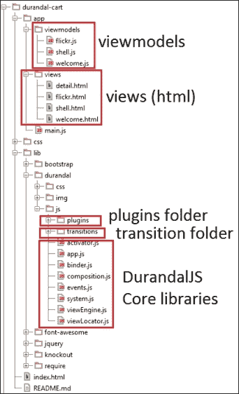
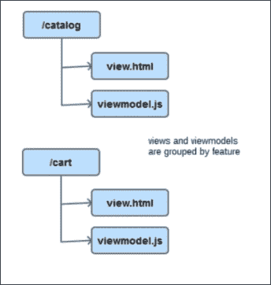
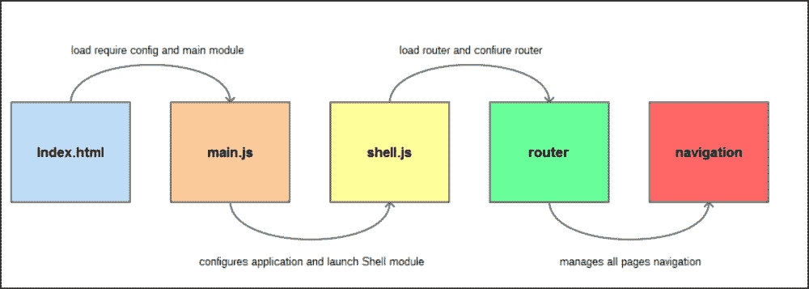
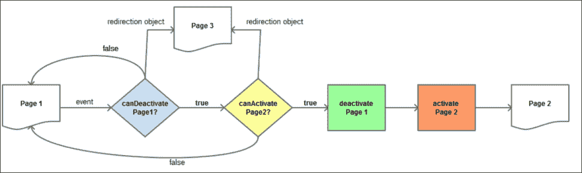
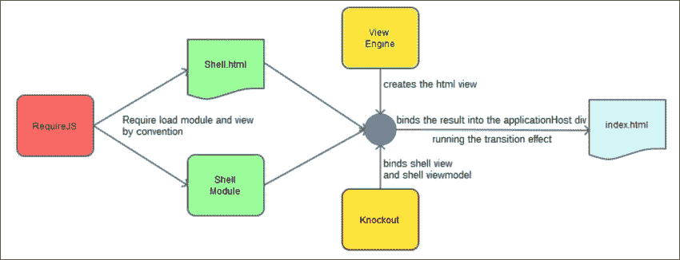

# 第七章：Durandal – KnockoutJS 框架

通过六章，我们已经使用基本库构建了一个完整的前端应用程序。

我们使用了一些库来实现我们的目标：

+   **Bootstrap 3**：用于在 CSS3 中拥有坚实、响应式和跨浏览器的基本样式。

+   **jQuery**：用于操作 DOM 并通过 AJAX 与服务器端通信。

+   **Mockjax**：用于模拟 AJAX 通信。

+   **MockJSON**：创建虚假数据。

+   **KnockoutJS**：用于绑定数据并轻松同步 JavaScript 数据和视图。

我们还应用了一些设计模式来提高代码质量：

+   **揭示模式**：显示对象的公共接口并隐藏私有属性和方法。

+   **模块模式**：用于隔离我们的代码并使其可移植。

+   **依赖注入模式**：用于提高内聚性和减少耦合度。

最后，我们介绍了一个帮助我们管理项目依赖的库，RequireJS。

在小型项目中，您可以仅使用这些库。但是，当项目增长时，处理依赖关系变得更加困难。您需要的库和样式越多，维护它们就越困难。此外，维护视图模型也变得更加困难，因为它开始具有太多的代码行。拆分视图模型会导致编写更多的事件来通信，而事件会使代码更难调试。

要解决所有这些问题，Rob Eisenberg（[`eisenbergeffect.bluespire.com/`](http://eisenbergeffect.bluespire.com/)）及其团队创建了**Durandal**（[`durandaljs.com/`](http://durandaljs.com/)）。Durandal 是一个框架，它集成了你今后将学到的所有库和良好的实践。

在本章中，您将学习 Durandal 框架的基础知识，以便开始使用它。在本章中，您不会在购物车项目上工作。这将在下一章中继续。本章是关于了解 Durandal 如何工作以及它如何连接所有部件以快速轻松地创建 Web 应用程序。

需要提及的是，Durandal 一直是构建应用程序的最简单和最快的框架之一。当另一个名为 AngularJS（[`angularjs.org/`](https://angularjs.org/)）的良好框架宣布其 2.0 版本时，艾森伯格放弃了 Durandal 并成为 AngularJS 团队的一部分。这对 Durandal 和 KnockoutJS 社区来说是一个重大打击。但最近，艾森伯格离开了 AngularJS 2.0 项目，并宣布了 Durandal 的新版本。因此，我们可以说我们正在使用最佳框架之一来开发现代、跨浏览器且完全兼容的 Web 应用程序。

# 安装 Durandal

要安装 Durandal，请按照以下步骤操作：

1.  转到 [`durandaljs.com/downloads.html`](http://durandaljs.com/downloads.html)。

1.  下载最新版本的入门套件：[`durandaljs.com/version/latest/HTML%20StarterKit.zip`](http://durandaljs.com/version/latest/HTML%20StarterKit.zip)。

1.  将其解压缩到您的项目文件夹中。

1.  将其重命名为`durandal-cart`。

1.  将 Mongoose 服务器添加到项目中，或者使用你感觉舒适的服务器。

起始套件将为你提供一个非常好的起点，以了解 Durandal 的工作原理。在接下来的项目中，我们可以直接使用独立的 Durandal 库开始，但在这里，我们将仔细分析这个框架的各个部分。

要深入了解 Durandal，请下载`HTML Samples.zip`文件（[`durandaljs.com/version/latest/HTML%20Samples.zip`](http://durandaljs.com/version/latest/HTML%20Samples.zip)），但测试这些有趣的示例取决于你。以下是起始套件的内容：

+   起始套件包含三个文件夹和一个 HTML `index` 文件。

+   `app`文件夹包含应用程序本身。其中包含两个文件夹：`viewmodels`和`views`。

+   `viewmodels`文件夹包含应用程序需要的所有视图模型——通常每个页面一个视图模型。

+   `views`文件夹包含绑定到每个视图模型的 HTML——通常每个视图对应一个视图模型。但是，你可以组合视图（你会发现这才是 Durandal 的实际力量）。

+   `lib`文件夹包含 Durandal 框架和框架所依赖的所有库。

+   在`durandal/js`文件夹内，你会找到一个名为`plugins`的文件夹。你可以使用插件扩展 Durandal。你也可以使用组件和`bindingHandlers`扩展 KnockoutJS。

+   还有一个名为`transitions`的文件夹。在其中，你可以添加在两个页面之间进行过渡时触发的动画。默认情况下，只有一个（`entrance.js`），但你可以从互联网下载更多，或者自己构建。

+   `index.html`文件将是 JavaScript 应用程序的入口点。

    Durandal 的文件夹结构

## Durandal 模式

在更深入了解 Durandal 之前，让我们先学习一些关于框架的模式和概念。

Durandal 是一个**单页应用程序**（**SPA**）框架。这意味着：

+   所有的 Web 应用程序都在一个页面上运行（首页）

+   没有完整页面刷新；只更新更改的部分

+   路由不再是服务器的责任。

+   AJAX 是与服务器端通信的基础

Durandal 遵循 Model-View-ViewModel（MVVM）模式：

+   实际上，它被称为 MV* 模式，因为我们可以用任何我们使用的东西替换 *：View-model（MVVM），Controller（MVC）或 Presenter（MVP）。按照惯例，Durandal 使用视图模型。

+   MVVM 模式将应用程序的视图与状态（逻辑）分离。

+   视图由 HTML 文件组成。

+   视图模型由绑定到视图的 JavaScript 文件组成。

+   Durandal 专注于视图和视图模型。模型不是框架的一部分。我们应该决定如何构建它们。

该框架使用**异步模块定义**（**AMD**）模式来管理依赖关系。它具有以下特点：

+   它使用 RequireJS 实现这一目的。

+   我们应该为每个文件定义一个模块。

+   模块的名称将是没有扩展名的文件的名称。

## index.html 文件

`index.html` 文件是应用程序的入口点。它应该有一个带有 ID `applicationHost` 的容器。应用程序将在此容器内运行，并且视图将被交换：

```js
<div id="applicationHost">
  <!-- application runs inside applicationHost container -->
</div>
```

你可以使用 `splash` 类定义一个 `splash` 元素。当应用程序完全加载时，它会显示。

```js
<div class="splash">
  <!-- this will be shown while application is starting -->
  <div class="message">
    Durandal Starter Kit
  </div>
  <i class="fa fa-spinner fa-spin"></i>
</div>
```

最后，使用 RequireJS 设置 Durandal 应用程序的入口点，就像我们在上一章中设置的一样。将 `main.js` 文件设置为 JavaScript 的入口点：

```js
<script src="img/require.js" data-main="app/main"></script>
```

## main.js 文件

`main.js` 文件包含 RequireJS 配置。在这里，我们可以看到 Durandal 使用哪些库来工作：

+   `text`: 这是一个 RequireJS 的扩展，用于加载非 JavaScript 文件。Durandal 使用 `text` 来加载模板。

+   `durandal`: 这是框架的核心。

+   `plugins`: 在这个文件夹中，我们可以找到并非所有应用程序都需要的框架部分。这些代码片段可以根据项目需要加载。

+   `transitions`: 这包含了我们可以在页面转换之间播放的不同动画。默认情况下，我们只有进入动画。

+   `knockout`: 这是用于绑定视图和视图模型的库。

+   `bootstrap`: 这是与 `bootstrap.css` 库相关的设计库。

+   `jQuery`: 这是 DOM 操作库。

你已经有了使用 RequireJS 的经验，因为你将应用程序文件转换为遵循 AMD 规范。这就是包含 RequireJS 配置的 `main.js` 文件应该如何看起来的：

```js
requirejs.config
({
  paths: {
    'text': '../lib/require/text',
    'durandal':'../lib/durandal/js',
    'plugins' : '../lib/durandal/js/plugins',
    'transitions' : '../lib/durandal/js/transitions',
    'knockout': '../lib/knockout/knockout-3.1.0',
    'bootstrap': '../lib/bootstrap/js/bootstrap',
    'jquery': '../lib/jquery/jquery-1.9.1'
  },
  shim: {
    'bootstrap': {
      deps: ['jquery'],
      exports: 'jQuery'
    }
  }
});
```

然后定义 `main` 模块。以与您在购物车项目中使用 RequireJS 相同的方式定义依赖项：

```js
define([
  'durandal/system', 
  'durandal/app', 
  'durandal/viewLocator'], function (system, app, viewLocator) {
    //main module code goes here
});
```

此模块是配置应用程序的地方。在入门套件项目中，有一个默认配置，可以帮助您了解在这一点上可以做什么：

+   激活调试（或不激活）：

    ```js
    system.debug(true);
    ```

+   设置应用程序标题。应用程序标题将默认与页面标题连接起来。

    ```js
    app.title = 'Durandal Starter Kit';
    ```

+   激活和配置插件：

    ```js
    app.configurePlugins({
      router: true,
      dialog: true
    });
    ```

+   启动应用程序：

    ```js
    app.start().then(function() {
      //This code is executed when application is ready.

      //We can choose use framework conventions
      viewLocator.useConvention();
      app.setRoot('viewmodels/shell', 'entrance');
    });
    ```

当您启动应用程序时，您可以选择遵循 Durandal 的约定。如果您选择默认遵循它们，Durandal 将通过查找 `views` 文件夹中的视图将视图模型与视图关联起来。它们应该具有与视图模型相同的名称。这意味着如果你有一个名为 `viewmodel/catalog.js` 的视图模型，它的关联视图将被称为 `views/catalog.js`。


这是按照 Durandal 约定创建的文件结构，适用于中小型项目

这种约定适用于小型和中型项目。在大型项目中，建议不使用 Durandal 约定。如果我们选择不使用这些约定，Durandal 将在与视图模型相同的文件夹中查找视图。例如，如果视图模型称为`catalog/table.js`，则视图应命名为`catalog/table.html`。这使我们可以按功能组织视图和视图模型。



通过不使用 Durandal 约定，我们按功能对文件进行分组，这对于大型和可扩展的项目是有益的

最后，指示框架哪个视图模型将启动应用程序。默认情况下，shell 视图模型会执行此操作。

# shell 视图模型

**Shell**是入口模块。它是包装其他模块的模块。它只加载一次，并且具有一直存在的 DOM 元素。

要定义视图模型，请使用 AMD 模式定义一个简单的 JavaScript 对象，如以下步骤所示：

1.  定义依赖关系，即路由器和 Durandal 应用程序：

    ```js
    define(['plugins/router', 'durandal/app'], function (router, app) {
      return {
        //We complete this in next points
      };
    });
    ```

1.  暴露`router`方法。`router`方法将给我们一个对象，使我们可以轻松显示导航栏。

    ```js
    return {
      router: router
    };
    ```

1.  暴露`search`方法。这是一个可选方法。它是入门套件应用程序的一部分。它管理全局搜索。

    ```js
    return {
      router: router,
      search: function() {
        //easy way to show a message box in Durandal
        app.showMessage('Search not yet implemented...');
      },
    };
    ```

1.  暴露`activate`方法。这是 Durandal 视图模型中的一个重要方法。`activate`方法在视图模型准备就绪时触发。在这里，您可以请求数据以将其绑定到视图。我们很快将看到有关 Durandal 生命周期方法的更多信息。

    ```js
    define(['plugins/router', 'durandal/app'], function (router, app) {
      return {
        router: router,
        search: function() { ... },
        activate: function () {
          router.map([{ 
            route: '', 
            title:'Welcome', 
            moduleId: 'viewmodels/welcome', 
            nav: true 
          }, {
            route: 'flickr', 
            moduleId: 'viewmodels/flickr', 
            nav: true 
          }]).buildNavigationModel();   
          return router.activate();
          }
        };
    });
    ```

## shell 视图

**shell 视图**包含导航栏：搜索栏和附加类称为`page-host`的元素。此元素将绑定到路由器，如下面的代码所示。您可以配置动画以使页面之间的过渡更加酷。

```js
<div>
  <nav class="navbar navbar-default navbar-fixed-top" role="navigation">
    <!-- nav content we will explain then -->
  </nav>
  <div class="page-host" data-bind="router: { transition:'entrance' }"></div>
</div>
```

# Durandal 生命周期

我们清楚地了解 Durandal 应用程序如何工作是很重要的。这是您的应用程序启动的模式图：

1.  `index.html`页面使用 RequireJS 请求`main.js`文件。

1.  `main.js`文件配置 require 并定义主模块，负责应用程序配置，并启动 shell 模块。

1.  shell 模块处理应用程序的全局上下文。它管理沿不同生命周期持续存在的组件。在入门套件应用程序中，它管理搜索栏。但是它也可以管理登录和注销功能，例如。shell 模块是配置所有路由的地方。

1.  最后，路由器配置沿着应用程序拥有的所有页面的导航。

    Durandal 初始化生命周期

## 激活生命周期

**激活生命周期**控制页面的激活和停用。Durandal 允许我们使用预定义的方法访问周期的不同部分。让我们看一下 Durandal 方法：

+   `canDeactivate`: 当您尝试放弃页面时，应返回 true、false 或重定向对象。如果方法的结果为 true，则可以离开页面。如果是 false，则路由过程将被中断。如果返回重定向对象，则会重定向。

+   `canActivate`: 当您到达新页面时，可以评估是否能够查看此页面。例如，您可以检查是否已登录到您的页面，或者是否具有足够的管理员权限来查看页面。如果返回`canActivate` true，则可以查看该页面。如果返回 false，则路由过程将被中断。您还可以将用户重定向到另一个页面。

+   `deactivate`: 如果`canDeactivate`返回 true 并且您可以激活下一个视图，则会触发`deactivate`方法。在这里，如果需要的话，清除超时和事件是一个很好的地方。

+   `activate`: 如果`canActivate`返回 true 并且您可以停用上一个视图，则会触发`activate`方法。这是您应该加载所有数据、绑定您的元素并初始化事件的地方。

    激活生命周期

还有其他方法可以在我们的生命周期中使用：

+   `getView`: 使用此方法，您可以构建一个 observable 来定义视图模型绑定的视图路径。

+   `viewUrl`: 这返回一个表示附加到视图模型的视图路径的字符串。`viewUrl`和`getView`之间的区别在于前者是一个字符串，而后者是一个 observable。

+   `binding`: 在视图和视图模型之间的绑定开始之前调用此方法。

+   `bindingComplete`: 在绑定完成后立即调用。

+   `attached`: 当组合引擎将视图附加到 DOM 时调用。您可以使用此钩子使用 jQuery 选择器来操作元素。

+   `compositionComplete`: 这是组合引擎触发的最后一个钩子。在这里，您可以测量 DOM 元素。

+   `detached`: 当视图从 DOM 中分离时，将触发此钩子。我们可以在这里执行清理工作。

您可以在[`durandaljs.com/documentation/Interacting-with-the-DOM.html`](http://durandaljs.com/documentation/Interacting-with-the-DOM.html)了解更多关于组合生命周期的信息。

## Promise 模式

Durandal 使用 promises 来管理异步行为。一个明显的例子是`app.start()`方法，它在`main.js`文件中。

Promise 是一个包含在未来可以使用的值的对象，当获得此值的先决条件时可以使用。在这种情况下，直到获得`app.start()`方法的结果之后，`then`方法才不会被触发。

在内部，Durandal 使用 jQuery 的 promise 实现以最小化第三方依赖关系。然而，你使用的其他库可能需要 Q，或者你可能需要比 jQuery 提供的更高级的异步编程能力。在这些情况下，你将希望将 Q 的 promise 机制插入到 Durandal 中，以便你可以在整个过程中拥有一个统一的 promise 实现。要集成 Q 库，请按照以下步骤操作：

1.  将 `Q` 库添加到 RequireJS 配置中。

1.  将此代码添加到 `main.js` 文件中，在 `app.start()` 指令之前：

    ```js
    system.defer = function (action) {
      var deferred = Q.defer();
      action.call(deferred, deferred);
      var promise = deferred.promise;
      deferred.promise = function() {
        return promise;
      };
      return deferred;
    };
    ```

如果你正在使用 HTTP Durandal 插件，则如果你想使用 Q promises，这种方法将不够。你需要将 jQuery promise 包装成 Q promise，如下所示：

```js
http.get = function(url, query) {
  return Q.when($.ajax(url, { data: query }));
}
```

你可以在 [`durandaljs.com/documentation/Q.html`](http://durandaljs.com/documentation/Q.html) 阅读更多关于 Q 库的信息。

这是我们在 Durandal 中可用的基本 jQuery promise 接口：

+   `done(successFn)`: 如果 promise 成功解析，则将触发此事件。

+   `fail(failFn)`: 如果 promise 被拒绝，则将触发此事件。

+   `always()`: 这将在成功和失败两种情况下触发。

+   `then(succesFn,failFn)`: 这是 `done` 和 `fail` 方法的别名。

+   `when(valueOrFunction)`: 这将使用传递的值或函数创建一个 promise。

要了解更多关于 jQuery promises 的信息，请参考官方文档 [`api.jquery.com/promise/`](http://api.jquery.com/promise/)。

## 组合

**组合** 是 Durandal 中最强大的部分。虽然模块帮助将应用程序分解为小部分，但组合允许我们将它们全部再次连接起来。组合有两种类型，对象组合和视觉组合。

要应用视觉组合，你需要使用 compose 绑定。你可以将 KnockoutJS observables 与 compose 绑定结合使用以实现动态组合。Compose 绑定提供了一个完整的配置界面，以增强组件的灵活性和可重用性。

### 对象组合

你可以通过仅使用 RequireJS 和 AMD 模式来实现**对象组合**。最简单的情况是你有两个模块：A 和 B。B 模块需要 A 的功能，所以你在模块 B 中使用 RequireJS 请求模块 A，如下所示：

```js
//moduleA
define([],function(){
  var moduleA = {};

  //ModuleA code

  return moduleA;
});
//moduleB (in a different file)
define(['moduleA'],function(moduleA){
  //we can use ModuleA to extend moduleB, e.g:

  var moduleB = $.extend({}, moduleA);

  //Create moduleB unique functionality.
  return moduleB;
});
```

### 视觉组合

**视觉组合** 允许你将视图分解成小块并重新连接（或组合）它们，使它们可重用。这是 Durandal 中的一个核心和独特功能，并由 Composition 模块管理。组合视图的最常见方式是使用 compose 绑定处理程序。

让我们看看 shell 视图是如何组合的：

1.  使用 RequireJS 来查找 shell 模块。按照惯例，它知道它在 `shell.js` 文件中。

1.  视图定位器会为 shell 定位适当的视图：`shell.html`。

1.  视图引擎从 `shell.html` 中的标记创建视图。

1.  使用 KnockoutJS 将 shell 模块和 shell 视图进行数据绑定。

1.  将绑定外壳视图插入`applicationHost` div 中。

1.  “入口”过渡用于动画显示视图。

    组合生命周期

现在看一下如何进行一些可视化组合。您可以将导航移动到其自己的视图，并使用导航视图组合外壳，按照以下步骤操作：

1.  打开`shell.html`文件。

1.  剪切`<nav></nav>`元素。

1.  将其粘贴到名为`navigation.html`的新文件中。

1.  在`shell.html`文件中添加一个`<div>`并绑定组合元素，如下所示：

    ```js
    <div>
      <div data-bind="compose: 'navigation.html'"></div>
      <div class="page-host" data-bind="router: { transition:'entrance' }"></div>
    </div>
    ```

您还可以创建一个名为`navigation.js`的视图模型，链接到视图：

```js
<div>
  <div data-bind="compose: 'viewmodel/navigation'"></div>
  <div class="page-host" data-bind="router: { transition:'entrance' }"></div>
</div>
```

您还可以选择将`compose`变量转换为在视图模型中生成的可观察变量：

```js
<div>
  <div data-bind="compose: navigationObservable"></div>
  <div class="page-host" data-bind="router: { transition:'entrance' }"></div>
</div>
```

这是有关组合绑定工作原理的简要介绍：

+   如果它是字符串值：

    +   如果它具有视图扩展名，则定位视图并将其注入到 DOM 中，并根据当前上下文进行绑定。

    +   如果它是模块 ID，则定位模块，定位其视图，并将它们绑定并注入到 DOM 中。

+   如果它是一个对象，则定位其视图并将其绑定并注入到 DOM 中。

+   如果它是一个函数，则使用新修饰符调用该函数，获取其返回值，找到该返回值的视图，并将它们绑定并注入到 DOM 中。

如果您想要自定义组合，可以直接将视图和模型数据传递给组合器绑定，如下所示：

```js
data-bind="compose: { model:someModelProperty, view:someViewProperty }"
```

这允许您将具有相同数据的不同视图组合为可观察的模型或视图。

您还可以使用 Knockout 注释组合视图：

```js
<!-- ko compose: activeItem--><!--/ko-->
```

您可以增加组合绑定的设置值：

+   `transition`：您可以在组合更改时指示过渡。

+   `cacheviews`：这不会从 DOM 中移除视图。

+   `activate`：这为此组合定义了激活函数。

+   `perserveContext`：如果将其设置为`false`，则会分离父上下文。当视图没有关联的模型时，这很有用。它提高了性能。

+   `activationData`：这是指附加到`activate`函数的数据。

+   `mode`：这可以是`inline`或`templated`。默认情况下，内联是模式。`templated`模式与`data-part`属性一起使用，通常与小部件一起使用。

+   `onError`：您可以绑定一个错误处理程序函数，以在组合失败时优雅地失败，如下面的代码所示：

    ```js
    div data-bind="compose: { model: model, onError: errorHandlerFunction }"></div>
    ```

您可以在 Durandal 文档中找到有关组合的完整说明，网址为[`durandaljs.com/documentation/Using-Composition.html`](http://durandaljs.com/documentation/Using-Composition.html)。

## 路由器

Durandal 提供了一个路由器插件，使导航快速简便。路由器与历史插件配合工作，处理浏览器中的导航状态。

要使用路由器插件：

1.  在`main.js`文件中激活插件：

    ```js
    app.configurePlugins({
      router: true,
    });
    ```

1.  在`shell.js`文件中进行配置：

    ```js
    router.map([{...},{...}]).buildNavigationModel();
    return router.activate();
    ```

以下是我们购物车应用程序的路由器示例：

```js
router.map([
  {route:[''/*default route*/,'catalog'], title:'catalog', moduleId:'viewmodels/catalog', nav: true},
  {route:'cart', title:'cart', moduleId:'viewmodels/cart', nav: true},
  {route:'product/:id', title:'Product detail', moduleId:'viewmodels/product-detail', nav:false},
  {route:'product/:id*action', moduleId:'viewmodels/product', nav:false, hash:'#product/:id'},
]).buildNavigationModel();
return router.activate();
```

看一下`shell.js`文件。路由器作为视图模型的一个元素传递。这使您能够根据当前路由更新导航。Durandal 提供了一个友好的界面来从`router`对象构建导航菜单。在 shell 激活挂钩中映射路由，然后使用路由器流畅 API 构建导航模型。

最后，返回包含来自 shell 激活挂钩的承诺的`router.activate()`方法。返回一个承诺意味着组合引擎将等待路由器准备好后再显示 shell。

让我们更详细地看一下路由映射。路由有不同的模式。至少，您应该提供一个路由和一个`moduleId`值。当 URL 哈希更改时，路由器将检测到并使用路由模式找到正确的路由。然后，它将加载具有`moduleId`值的模块。路由器将激活并组合视图。

有一些可选参数：

+   `nav`：当您调用`buildNavigationModel`方法时，它将只使用此属性设置为`true`的路由创建一个名为`navigationModel`的可观察数组。

+   `title`：这用于设置文档标题。

+   `hash`：使用此选项，您可以提供用于数据绑定到锚标记的自定义哈希。如果未提供哈希，则路由器将生成一个哈希。

有四种不同类型的路由：

+   **默认路由**设置为空字符串：

    ```js
    route.map([{route:''}]);
    ```

+   **静态路由**没有参数：

    ```js
    route.map([{route:'catalog'}]);
    ```

+   **参数化路由**是带参数的路由：

    +   使用冒号定义参数：

        ```js
        route.map([{route: 'product/:id'}]);
        ```

    +   可选参数在括号内：

        ```js
        route.map([{route: 'product(/:id)'}]);
        ```

+   **Splat 路由**用于构建子路由。我们可以使用星号来定义它们：

    ```js
    route.map({route:'product/:id*actions'});
    ```

+   **未知路由**由方法管理：`mapUnknownRoutes(module,view)`：

    ```js
    route.mapUnknowRoutes(notfound,'not-found');
    ```

如果您查看`navigation.html`文件，您将能够看到路由器的工作方式。

注意，对于`navigationModel`属性路由的`foreach`绑定是使用`buildNavigationModel`方法构建的。此数组的每个元素都有一个`isActive`标志，当路由处于活动状态时，该标志被设置为`true`。最后，有一个名为`isNavigating`的属性，允许您向用户发出导航页面之间正在进行的警告，如下所示：

```js
<ul class="nav navbar-nav" data-bind="foreach: router.navigationModel">
  <li data-bind="css: { active: isActive }">
    <a data-bind="attr: { href: hash }, text: title"></a>
    </li>
</ul>
<ul class="nav navbar-nav navbar-right">
  <li class="loader" data-bind="css: { active: router.isNavigating }">
    <i class="fa fa-spinner fa-spin fa-2x"></i>
  </li>
</ul>
```

如果你回到`shell.html`页面，你会看到你将路由器绑定到`page-host`元素。此绑定在`page-host`容器中显示活动路由。这只是 Durandal 组合功能的另一个演示。

### 路由参数

路由参数在路由中使用冒号设置。这些参数可以传递给每个模块的`canActivate`和`activate`方法。如果路由有查询字符串，则作为最后一个参数传递。

## 触发导航

这里列出了一些触发导航的方式：

+   使用锚标记：

    ```js
    <a data-bind="attrs:{href:'#/product/1'}">product 1</a>
    ```

+   使用`router.navigate(hash)`方法。这将触发导航到关联的模块。

    ```js
    router.navigate('#/product/1');
    ```

+   如果您想要添加一个新的历史记录条目但不调用模块，只需将第二个参数设置为`false`：

    ```js
    router.navigate('#/product/1',false);
    ```

+   如果您只想替换历史记录条目，请传递一个带有`replace`值`true`和`trigger`值`false`的 JSON 对象：

    ```js
    router.navigate('#/product/1',{ replace: true, trigger: false });
    ```

## 子路由器

在大型应用程序中，您必须能够处理数十个甚至数百个路由。您的应用程序可能只有一个主路由器，但也可能有多个子路由器。这为 Durandal 提供了处理深度链接场景并根据功能封装路由的方法。

通常，父级将使用星号(*)映射一个路由。子路由器将相对于该路由工作。让我们看一个例子：

1.  需要应用程序路由器。

1.  调用`createChildRouter()`。这将创建一个新的路由器。

1.  使用`makeRelative` API。配置基本的`moduleId`和`fromParent`属性。该属性使路由相对于父级的路由。

这就是它的工作原理：

```js
// product.js viewmodel
define(['plugins/router', 'knockout'], function(router, ko) {
  var childRouter = router.createChildRouter()
    .makeRelative({
      moduleId:'product',
      fromParent:true,
      dynamicHash: ':id'
    }).map([
      { route: 'create', moduleId: 'create', title: 'Create new product', type: 'intro', nav: true },
      { route: 'update', moduleId: 'update', title: 'Update product', type: 'intro', nav: true},
    ]).buildNavigationModel();
  return {
    //the property on the view model should be called router
    router: childRouter 
  };
});
```

首先，它捕获`product/:id*`动作模式。这将导致导航到`product.js`。应用程序路由器将检测到子路由的存在，并将控制委托给子路由。

当子路由与参数一起使用时，在`makeRelative`方法中激活`dynamicHash`属性。

## 事件

**事件**用于模块间通信。事件 API 集成到`app`模块中，非常简单：

+   **on**：订阅视图模型的事件

    ```js
    app.on('product:new').then(function(product){
      ...
    });
    ```

+   **off**：取消订阅视图模型的事件

    ```js
    var subscription = app.on('product:new').then(function(product){
      ...
    });
    subscription.off();
    ```

+   **触发器**：触发事件

    ```js
    app.trigger('product:new', newProduct);
    ```

你可以将所有事件名称传递给监听所有类型的事件：

```js
app.on('all').then(function(payload){
  //It will listen all events
});
```

在[`durandaljs.com/documentation/Leveraging-Publish-Subscribe.html`](http://durandaljs.com/documentation/Leveraging-Publish-Subscribe.html)阅读更多关于事件的内容。

## 小部件

**小部件**是 Durandal 组成中的另一个重要部分。它们就像视图模型，只有一个例外。视图模型可以是单例的，我们通常更喜欢它们是单例的，因为它们代表站点上的唯一页面。另一方面，小部件主要是用构造函数编写的，因此它们可以根据需要实例化多次。因此，当我们构建小部件时，我们不返回对象，就像视图模型中发生的那样。相反，我们返回一个构造函数，Durandal 实例化小部件。

将小部件保存在`app/widgets/{widget_name}`中。小部件应该有一个`viewmodel.js`文件和一个`view.html`文件。

我们将开发一个名为`accordion`的小部件来演示小部件的工作原理。此小部件将基于 Bootstrap 提供的 jQuery 折叠插件。

### 设置小部件

按照以下步骤创建一个插件： 

1.  将`bootstrap`库添加到项目中。要实现这一点，请将其添加到主模块的依赖项中：

    ```js
    define([
      'durandal/system', 
      'durandal/app', 
      'durandal/viewLocator',
      'bootstrap'
    ],  function (system, app, viewLocator, bs) {
      //Code of main.js module
    });
    ```

1.  安装插件。在`main.js`文件中注册小部件插件：

    ```js
    app.configurePlugins({
      widget: true
    });
    ```

1.  在`app`文件夹中创建一个名为 widget 的目录。

1.  添加一个名为`accordion`的子目录。

1.  在`accordion`目录下添加一个名为`viewmodel.js`的文件。

1.  在`accordion`目录中添加一个名为`view.html`的文件。

如果你不喜欢 Durandal 的约定，可以在[`durandaljs.com/documentation/api#module/widget`](http://durandaljs.com/documentation/api#module/widget)上阅读有关小部件配置的更多信息。

### 编写小部件视图

编写视图，请按照以下步骤进行：

1.  打开`app/widgets/expander/view.html`文件。

1.  编写此代码，按照 bootstrap3 折叠模板（[`getbootstrap.com/javascript/#collapse`](http://getbootstrap.com/javascript/#collapse)）：

    ```js
    <div class="panel-group" data-bind="foreach: { 
      data: settings.items }">
      <div class="panel panel-default">
        <div class="panel-heading" data-bind="">
          <h4 class="panel-title">
            <a data-toggle="collapse" data-bind="attr:{'data-target':'#'+id}">
              <span data-part="header" data-bind="html: $parent.getHeaderText($data)">
              </span>
            </a>
          </h4>
        </div>
        <div data-bind="attr:{id:id}" class="panel-collapse collapse">
          <div class="panel-body">
            <div data-part="item" data-bind="compose: $data"></div>
          </div>
        </div>
      </div>
    </div>
    ```

通过先编写视图，你可以确定需要在视图模型中创建哪些变量才能完成视图。在这种情况下，你将需要一个存储手风琴元素的项目数组。它将包含每个可折叠元素的 ID，在小部件内自动生成，标题文本和正文。

### 编写小部件视图模型

要编写小部件视图模型，请打开`accordion`小部件文件夹中的`viewmode.js`文件，并编写以下代码：

```js
define(['durandal/composition','jquery'], function(composition, $) {
  var ctor = function() { };

  //generates a simple unique id	
  var counter = 0;

  ctor.prototype.activate = function(settings) {
    this.settings = settings;
    this.settings.items.forEach(function(item){
      item.id=counter++;
    });
  };
  ctor.prototype.getHeaderText = function(item) {
    if (this.settings.headerProperty) {
      return item[this.settings.headerProperty];
    }

    return item.toString();
  };

  return ctor;
});
```

正如你所见，你返回了一个小部件的构造函数，而不是像页面一样返回一个视图模型本身。

在这种情况下，要管理生命周期，你只需定义`activate`方法来分配值和生成 ID。请记住，如果你想用代码添加一些 DOM 修改，那么附加方法将是一个不错的地方。

### 注册小部件

要注册小部件，只需在主模块（`main.js`）中注册即可：

```js
app.configurePlugins({
  widget: {
    kinds: ['accordion']
  }
});
```

# 使用 Durandal 构建页面

现在你已经学会了 Durandal 框架的所有基础知识，让我们创建一个包含我们的小部件和一些基本数据的新页面。

要在 Durandal 中定义新页面，始终按照相同步骤进行：

1.  在 shell 视图模型中定义路由：

    ```js
    router.map([
    { route: '', title:'Welcome', moduleId: 'viewmodels/welcome', nav: true },
    { route: 'flickr', moduleId: 'viewmodels/flickr', nav: true },
    { route: 'accordion', moduleId: 'viewmodels/accordion', nav: true }
    ]).buildNavigationModel();
    ```

1.  定义`views/accordion.html`文件。注意，在手风琴绑定内部，你可以定义`data-part`模板。在这里，你正在使用 Durandal 提供的组合能力。通过添加一个`add`按钮，你为小部件提供了添加新元素的可能性。

    ```js
    <div>
      <h2 data-bind="text:title"></h2>
      <div data-bind="accordion: {items:projects, headerProperty:'name'}">
        <div data-part="header">
          <span data-bind="text:name"></span>
        </div>
        <div data-part="item">
          <span data-bind="text:description"></span>
        </div>
      </div>
      <div class="btn btn-primary" data-bind="click:add">
        Add new project
      </div>
    </div>
    ```

1.  定义`viewmodels/accordion.js`文件。你已经将`projects`设置为可观察数组，并在`activate`方法中进行了初始化。视图模型提供了一个`add`函数，触发名为`accordion:add`的事件。这会发送带有新标签值的消息。小部件应监听此事件并执行操作。

    ```js
    define(['plugins/http', 'durandal/app', 'knockout'], function (http, app, ko) {
      return {
        title: 'Accordion',
        projects: ko.observableArray([]),
        activate: function () {
          this.projects.push(
          {name:'Project 1',description:"Description 1"});
          this.projects.push(
          {name:'Project 2',description:"Description 2"});
          this.projects.push(
          {name:'Project 3',description:"Description 3"});
        },
        add: function () {
          app.trigger('accordion:add',
          {name:'New Project',description:"New Description"});
        }
      };
    });
    ```

1.  在`widgets/accordion/viewmodel.js`文件中定义事件，更新`activate`方法：

    ```js
    ctor.prototype.activate = function(settings) {
      this.settings = settings;

      var _settings = this.settings;//save a reference to settings
      var items = this.settings.items();//get data from observable

      items.forEach(function(item){//manipulate data
        item.id=guid();
      });

      this.settings.items(items);//update observable with new data

      //listen to add event and save a reference to the listener
      this.addEvent = app.on('accordion:add').then(function(data){
        data.id = guid();
        _settings.items.push(data);
      });
    };
    ```

1.  定义分离的生命周期方法，以便在小部件不在屏幕上时关闭`add event`：

    ```js
    ctor.prototype.detached = function () {
      //remove the suscription 
      this.addEvent.off();
    }
    ```

1.  启动应用程序并测试小部件。

# 概要

在本章中，你已经了解了 Durandal。使用一个所有部件都完美连接的框架，而不是一堆库，可以帮助你避免一遍又一遍地重写相同的代码。这意味着，多亏了 Durandal，你可以轻松地遵循开发者的基本原则之一（不要重复自己 - DRY）。

你学到了一些有用的概念，比如如何安装和启动 Durandal 项目。你还了解了 Durandal 应用程序的生命周期是如何工作的。

Durandal 最强大的功能之一是组合。你可以非常轻松地组合界面，对开发者几乎是透明的。

你了解了 Durandal 如何管理承诺。默认情况下，它使用 jQuery 的承诺，但你发现很容易使用其他库，比如 Q。

最后，你开发了一个小部件，并将其集成到视图模型中。虽然视图模型是单例的，但小部件是可以多次实例化的元素。它们是 Durandal 组合的一个强大部分。

在下一章中，我们将逐步将我们的 KnockoutJS 购物车迁移到 Durandal 单页面应用程序。
