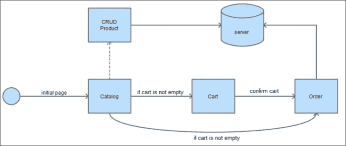
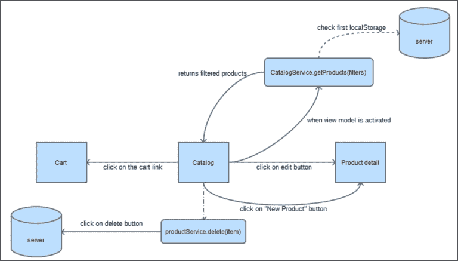
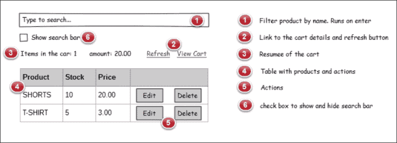
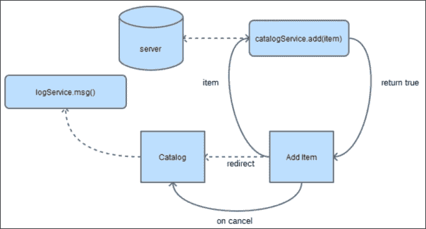
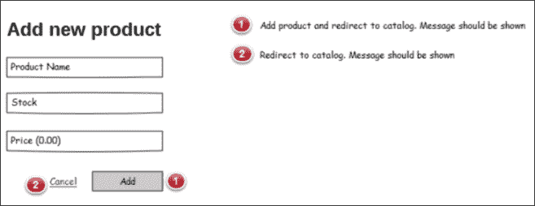
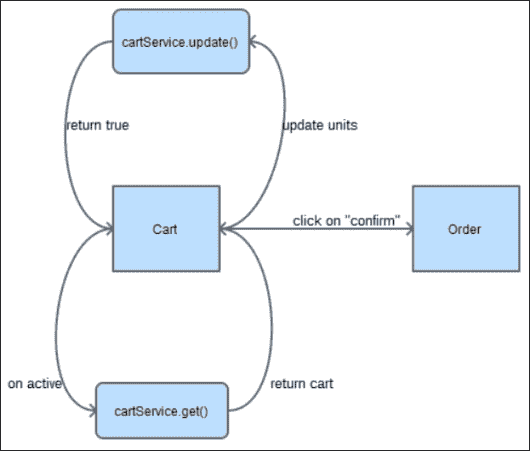
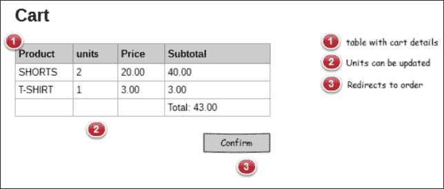
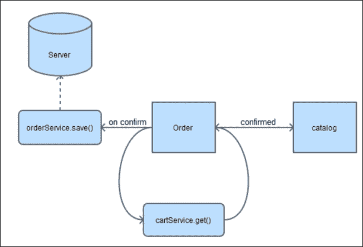
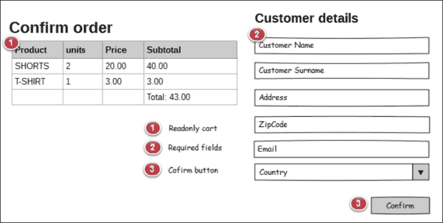
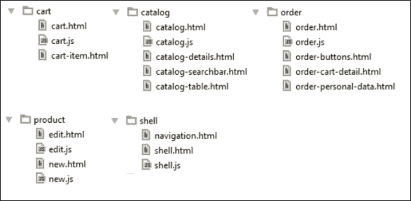

# 第八章：使用 Durandal 开发 Web 应用程序 - 购物车项目

现在我们知道 Durandal 的工作原理，是时候将我们的旧应用程序迁移到使用我们的新框架了。在本章中，您将学习如何重用我们在书中使用的代码，并将部分代码适应新环境。 

# 介绍

在本章中，我们将开发一个全新的应用程序。但是，我们将重用上一章中开发的大部分代码。

只使用 Knockout 的缺点之一是随着应用程序的增长，我们的应用程序需要连接到许多库。我们在本书中开发的应用程序非常小，但足够复杂，我们还没有解决一个重要的问题，即路由。我们的应用程序始终位于同一页上。我们无法在订单和目录之间或购物车和目录之间导航。我们的整个应用程序都在同一页上，显示和隐藏组件。

Durandal 连接了您在本书中学到的一些库，并且使连接到新库变得容易。

在本章中，我们将看到一些非标准 UML 符号的模式。现今，敏捷方法不建议深入使用 UML，但这些类型的图表帮助我们更全面、更清晰地了解我们功能的结构和需求。此外，为了部署视图，我们将看到一些关于 HTML 如何完成的草图和模拟：



我们应用程序的生命周期

# 设置项目

要启动新项目，我们将按照一些步骤进行，这将为我们开发项目提供一个良好的起点：

1.  创建一个与 Knockout 购物车相同的项目。

1.  在此项目内，复制 Durandal Starter Kit 项目的内容。

1.  现在我们的项目应该有三个文件夹：

    +   `app`：这包含了我们的应用程序。

    +   `css`：这包含样式表

    +   `lib`：这包含第三方库

1.  将以下库从 Knockout 购物车项目迁移到 Durandal 购物车项目：

    +   `icheck`

    +   `kovalidation`

    +   `mockjax`

    +   `mockjson`

1.  从 [`codeseven.github.io/toastr/`](http://codeseven.github.io/toastr/) 安装一个名为 Toastr 的新库。

1.  更新第 19 行的 `ko.validation.js` 文件，使用以下代码：

    ```js
    define(["knockout", "exports"], factory);
    ```

1.  将 `style.css` 文件从 Knockout 购物车移动到 Durandal 购物车项目的 `css` 文件夹中。

1.  将 `models` 文件夹移动到 `app` 文件夹内。

1.  将 `services` 文件夹移动到 `app` 文件夹内。

1.  创建一个名为 `bindings.js` 的文件，与 `main.js` 文件处于同一级别，并将所有绑定移到 `koBindings.js` 文件中。

1.  创建一个名为 `mocks.js` 的文件，与 `main.js` 文件处于同一级别，并将所有模拟移到 `mocks` 文件夹中。

1.  创建一个名为 `components.js` 的文件，与 `main.js` 文件处于同一级别，并将所有组件移到那里。

1.  更新 `knockout` 库。Durandal 起始套件附带版本 3.1，我们将使用 3.2 版本，这是我们在 Knockout 购物车项目中使用的版本。3.2 版本允许我们使用 `inputText` 绑定和组件。您可以在此链接中查看所有版本之间的区别：[`github.com/knockout/knockout/releases`](https://github.com/knockout/knockout/releases)。

1.  更新 `main.js` 文件：

    ```js
    requirejs.config({
      paths: {
        'text': '../lib/require/text',
        'durandal':'../lib/durandal/js',
        'plugins' : '../lib/durandal/js/plugins',
        'transitions' : '../lib/durandal/js/transitions',
        'knockout': '../lib/knockout/knockout-3.1.0.debug',
        'bootstrap': '../lib/bootstrap/js/bootstrap.min',
        'jquery': '../lib/jquery/jquery-1.9.1',
        'toastr': '../lib/toastr/toastr.min',
        'ko.validation': '../lib/kovalidation/ko.validation',
        'mockjax': '../lib/mockjax/jquery.mockjax',
        'mockjson': '../lib/mockjson/jquery.mockjson',
        'icheck': '../lib/icheck/icheck'
      },
      shim: {
        'bootstrap': {
          deps: ['jquery'],
          exports: 'jQuery'
        },
        mockjax: {
          deps:['jquery']
        },
        mockjson: {
          deps:['jquery']
        },
        'ko.validation':{
          deps:['knockout']
        },
        'icheck': {
          deps: ['jquery']
        }
      }
    });

    define([
      'durandal/system',
      'durandal/app',
      'durandal/viewLocator',
      'mocks',
      'bindings',
      'components',
      'bootstrap',
      'ko.validation',
      'icheck',
    ],  function (system, app, viewLocator,mocks,bindings,components) {
      //>>excludeStart("build", true);
      system.debug(true);
      //>>excludeEnd("build");

      app.title = 'Durandal Shop';

      app.configurePlugins({
        router:true,
        dialog: true
      });

      app.start().then(function() {
        //Replace 'viewmodels' in the moduleId with 'views' to locate the view.
        //Look for partial views in a 'views' folder in the root.
        viewLocator.useConvention();

        //Show the app by setting the root view model for our application with a transition.
        app.setRoot('viewmodels/shell', 'entrance');

        mocks();
        bindings.init();
        components.init();
      });
    });
    ```

1.  将项目设置在您喜欢的服务器上，或者将 Mongoose 可执行文件复制到 `index.html` 所在的文件夹中。

1.  使用新的 css 文件更新 `index.html`：

    ```js
    <link rel="stylesheet" href="lib/toastr/toastr.min.css" />
    <link rel="stylesheet" href="lib/icheck/skins/all.css" />
    <link rel="stylesheet" href="css/style.css" />
    ```

现在我们的项目已经准备好了，是时候逐步迁移我们的购物车了。

# 项目路由 – shell 视图模型

Durandal 给了我们在项目中管理路由的可能性。我们将把项目的不同部分分割成页面。这将提供更好的用户体验，因为我们将一次只关注一个任务。

我们将将应用程序拆分为四个部分：

+   目录

+   购物车

+   订单

+   产品 CRUD

这些部分将包含我们在 Knockout 应用程序中构建的几乎相同的代码。有时，我们需要适应一些小代码片段。

要创建这些新路由，我们将打开 `shell.js` 文件并更新路由器：

```js
router.map([
  { route: ['','/','catalog'], title:'Catalog', moduleId: 'viewmodels/catalog', nav: true },
  { route: 'new', title:'New product', moduleId: 'viewmodels/new', nav: true },
  { route: 'edit/:id', title:'Edit product',moduleId: 'viewmodels/edit', nav: false },
  { route: 'cart', title:'Cart', 
    moduleId: 'viewmodels/cart', nav: false },
  { route: 'order', title:'Order', moduleId: 'viewmodels/order', nav: true }
]).buildNavigationModel();
```

让我们回顾一下路由器的工作原理：

+   `route` 包含相对 URL。对于目录，有三个 URL 附加到此路由。它们是空路由 ('')，斜杠 ('/') 路由和目录。为了表示这三个路由，我们将使用一个数组。

+   `title` 将包含在 `<title>` 标签中附加的标题。

+   `moduleId` 将包含处理此路由的视图模型。如果我们使用约定，它将在 `views` 文件夹中查找视图，查找与视图模型同名的视图。在这种情况下，它会查找 `views/catalog.html`。如果我们选择不使用约定，Durandal 将在与视图模型相同的文件夹中查找。

+   如果 `nav` 为 true，则导航菜单中将显示一个链接。如果为 false，则路由器不会在导航菜单中显示链接。

# 导航和 shell 模板

正如我们在第七章中所做的，*Durandal – The KnockoutJS Framework*，我们将会将我们的 `shell.html` 视图分为两部分：`shell.html` 和 `navigation.html`。

## 目录模块

在 Knockout 购物车中，我们有一个管理应用程序所有部分的视图模型。在这里，我们将把那个大的视图模型拆分成几个部分。第一部分是目录。

这里是它应该如何工作的模式图：



目录模块的工作流程

目录将仅包含包括搜索栏和带有其操作的表格的部分。这将使视图模型更小，因此更易于维护。

虽然文件将分成不同的文件夹，但目录本身是一个模块。它包含视图模型、视图以及一些仅在该模块内部工作的服务。其他组件将被引入，但它们将在应用程序生命周期中被更多模块共享。

1.  在 `viewmodels` 文件夹中创建一个名为 `catalog.js` 的文件，并定义一个基本的揭示模式骨架以开始添加功能：

    ```js
    define([],function(){
      var vm = {};
      //to expose data just do: vm.myfeature = ...
      return vm;
    });
    ```

1.  在 `views` 文件夹中创建一个名为 `catalog.html` 的文件：

    ```js
    <div></div>
    ```

仅仅通过这样做，我们的模块就已经准备好工作了。让我们完成代码。

### 目录视图

我们将使用组合来创建这个模板。记住，组合是 Durandal 的一个强大特性之一。为了完成这个功能，我们将创建三个包含根视图不同部分的新模板。通过这样做，我们将我们的视图更加易于维护，因为我们将模板的不同部分隔离在不同的文件中，这些文件更小且易于阅读。



目录视图的草图

按照以下步骤创建模板：

1.  打开 `catalog.html` 文件并创建基本模板：

    ```js
    <div class="container-fluid">
      <div class="row">
        <div class="col-xs-12">
          <h1>Catalog</h1>
          <div data-bind="compose: 'catalog-searchbar.html'"></div>
          <div data-bind="compose: 'catalog-details.html'"></div>
          <div data-bind="compose:'catalog-table.html'"></div>
        </div>
      </div>
    </div>
    ```

1.  创建一个名为 `catalog-searchbar.html` 的视图。我们用根视图的名称为子视图添加前缀，所以如果你的编辑器按名称对文件进行排序，它们将全部显示在一起。我们也可以将它们全部组合在一个文件夹中。我们可以选择我们感觉最舒适的方式：

    ```js
    <input type="checkbox" data-bind="icheck:showSearchBar"/>
      Show Search options<br/><br/>
    <div class="input-group" data-bind="visible:showSearchBar">
      <span class="input-group-addon">
        <i class="glyphicon glyphicon-search"></i> Search
      </span>
      <input type="text" class="form-control" data-bind="value:searchTerm, valueUpdate: 'keyup', executeOnEnter:filterCatalog" placeholder="Press enter to search...">
    </div>
    <hr/>
    ```

1.  现在是时候定义名为 `catalog-details.html` 的视图了；它将包含操作和购物车详情：

    ```js
    <div class="row cart-detail">
      <div class="col-lg-2 col-md-4 col-sm-4 col-xs-4">
        <strong>
          <i class="glyphicon glyphicon-shopping-cart"></i> 
            Items in the cart:
        </strong>
        <span data-bind="text:CartService.cart().length"></span>
      </div>
      <div class="col-lg-2 col-md-4 col-sm-4 col-xs-4">
        <strong>
          <i class="glyphicon glyphicon-usd"></i> 
          Total Amount:
        </strong>
        <span data-bind="text:CartService.grandTotal"></span>
      </div>
      <div class="col-lg-8 col-md-4  col-sm-4 col-xs-4 text-right">
        <button data-bind="click:refresh" class="btn btn-primary btn-lg">
          <i class="glyphicon glyphicon-refresh"></i> Refresh
        </button>
        <a href="#/cart" class="btn btn-primary btn-lg">
          <i class="glyphicon glyphicon-shopping-cart"></i> 
          Go To Cart
        </a>
      </div>
    </div>
    ```

1.  最后，我们将定义包含我们在 Knockout 购物车项目中构建的表格的 `catalog-table.html`。某些 `data-bind` 元素应该被更新，而页脚需要被移除：

    ```js
    <table class="table">
      <thead>
      <tr>
        <th>Name</th>
        <th>Price</th>
        <th>Stock</th>
        <th></th>
      </tr>
      </thead>
      <tbody data-bind="{foreach:filteredCatalog}">
      <tr data-bind="style:{color:stock() < 5?'red':'black'}">
        <td data-bind="text:name"></td>
        <td data-bind="{currency:price}"></td>
        <td data-bind="{text:stock}"></td>
        <td>
          <add-to-cart-button params="{cart: $parent.CartService.cart, item: $data}">
          </add-to-cart-button>
          <button class="btn btn-info" data-bind="{click:$parent.edit}">
            <i class="glyphicon glyphicon-pencil"></i>
          </button>
          <button class="btn btn-danger" data-bind="{click:$parent.remove}">
            <i class="glyphicon glyphicon-remove"></i>
          </button>
        </td>
      </tr>
      </tbody>
      <!-- FOOTER HAS BEEN REMOVED -->
    </table>
    ```

### 目录视图模型

现在是时候定义我们可以在我们的模板中识别的所有组件了。我们应该开始定义我们可以在模板中定位到的基本数据：

```js
vm.showSearchBar = ko.observable(true);
vm.searchTerm = ko.observable("");
vm.catalog = ko.observableArray([]);
vm.filteredCatalog = ko.observableArray([]);
```

一旦我们定义了这些变量，我们意识到需要 Knockout 依赖。将其添加到依赖项数组中，并且也作为 `module` 函数的一个参数：

```js
define(['knockout'],function(ko){ ... })
```

现在我们应该定义 `filterCatalog` 方法。这是我们在 Knockout 项目中的视图模型中拥有的相同方法：

```js
vm.filterCatalog = function () {
  if (!vm.catalog()) {
    vm.filteredCatalog([]);
  }
  var filter = vm.searchTerm().toLowerCase();
  if (!filter) {
    vm.filteredCatalog(vm.catalog());
  }
  //filter data
  var filtered = ko.utils.arrayFilter(vm.catalog(), function (item) {
    var fields = ["name"]; //we can filter several properties
    var i = fields.length;
    while (i--) {
      var prop = fields[i];
      if (item.hasOwnProperty(prop) && ko.isObservable(item[prop])) {
        var strProp = ko.utils.unwrapObservable( item[prop]).toLocaleLowerCase();
        if (item[prop]() && (strProp.indexOf(filter) !== -1)) {
          return true;
        }
      }
    }
    return false;
  });
  vm.filteredCatalog(filtered);
};
```

`add-to-cart-button` 组件在 Knockout 项目中被定义，我们不需要触碰该组件的任何代码。这是一个很好的组件及其潜力的明确例证。

要编辑目录中的产品，我们需要导航到编辑路由。这会创建与路由插件的依赖关系。我们应该在我们的模块中添加 `plugins/router` 依赖关系。

```js
vm.edit = function(item) {
  router.navigate('#/edit/'+item.id());
}
```

要从目录中移除产品，我们需要从服务器和购物车中将其移除。要与服务器通信，我们将使用 `services/product.js` 文件，而要与购物车通信，我们将在一个名为 `services/cart` 的文件中创建一个新服务。定义 `remove` 方法：

```js
vm.remove = function(item) {
  app
    .showMessage(
      'Are you sure you want to delete this item?',
      'Delete Item',
      ['Yes', 'No']
    ).then(function(answer){
      if(answer === "Yes") {
        ProductService.remove(item.id()).then(function(response){
          vm.refresh();
            CartService.remove(item);
        })
      }
    });
}
```

首先我们使用 Durandal 的消息组件。它非常有用于处理模态对话框。我们将询问用户是否应删除产品。如果是，则我们将从服务器中删除它，然后刷新我们的视图模型，并且从购物车中删除产品，因为它不再可用。

我们应该添加一个依赖项到`durandal/app`，并且依赖于`ProductService`和`CartService`。

`ProductService`在 Knockout 项目中被定义。如果我们保持模型和服务非常简单，它们将变得可移植，并且非常适应不同的项目。

现在是实现`refresh`方法的时候了。我们将调用`ProductService.all()`方法，并显示一条消息，让用户知道产品已加载。我们将返回此方法生成的承诺。

```js
vm.refresh = function () {
  return ProductService.all().then(function(response){
    vm.catalog([]);
    response.data.forEach(function(item){
      vm.catalog.push(new Product(item.id,item.name,item.price,item.stock));
    });
    var catalog = vm.catalog();
    CartService.update(catalog);
    vm.catalog(catalog);
    vm.filteredCatalog(vm.catalog());
    LogService.success("Downloaded "+vm.catalog().length+" products", "Catalog loaded");
  });
};
```

在这里，我们使用了在 Knockout 项目中使用的相同模型来表示产品。我们看到了很多代码，但大部分是在书中较早完成的，所以我们只需要将它们从一个项目移到另一个项目中。

最后一步是激活我们的视图模型。什么时候应该激活视图模型？当我们的产品来自服务器并且准备好展示时：

```js
vm.activate = function() {
  if(vm.catalog().length === 0) {
    app.on("catalog:refresh").then(function(){
      vm.refresh();
    });
    return vm.refresh();
  } else {
    return true;
  }
}
```

第一次加载应用程序时，我们会检查目录是否有产品。如果有，我们只需返回目录已准备就绪。如果目录为空，我们会创建一个事件，让其他服务通知目录它应该更新。然后我们刷新目录以获取新数据。

这是我们`catalog`视图模型的最终结果；当然，我们仍然需要实现日志服务和购物车服务：

```js
define(['knockout','durandal/app','plugins/router', 'services/log','services/product','services/cart', 'models/product','models/cartproduct'
],function(ko, app, router, LogService, ProductService, CartService, Product, CartProduct){
  var vm = {};
  vm.showSearchBar=ko.observable(true);
  vm.searchTerm = ko.observable("");
  vm.catalog = ko.observableArray([]);
  vm.filteredCatalog = ko.observableArray([]);
  vm.CartService = CartService;

  vm.filterCatalog = function () {...};
  vm.edit = function(item) {...}
  vm.remove = function(item) {...}
  vm.refresh = function () {...}
  vm.activate = function() {...}
  return vm;
});
```

## 购物车服务

购物车服务将管理所有模块的购物车数据。服务在会话期间具有持久数据，因此它们可以帮助我们在视图模型之间共享数据。在这种情况下，购物车服务将与购物车共享一些页面：目录、购物车和订单。

购物车服务将对在`cart`可观察对象上执行的操作做出反应。`add`操作由`add-to-cart-button`组件管理，但是将这个行为集成到这里会很有趣。代码重构可以是一个很好的练习。在这个例子中，我们将保留组件，并实现其他方法。

购物车服务还将购物车的总金额存储在`grandTotal`可观察对象中。

购物车服务也更新购物车。这很有用，因为当目录更新时，购物车中存储的产品引用与目录中的新产品不同，所以我们需要更新这些引用。它还更新了目录，通过减少购物车中每个产品的单位来减少库存。我们之所以这样做是因为服务器发送给我们它所拥有的数据。服务器不知道我们现在正在购物。也许我们决定不购物，所以我们购物车中的产品不被注册为已售出。这就是为什么我们需要在从服务器获取产品后更新客户端中的单位的原因。这是购物车服务的代码：

```js
define(['knockout','durandal/app' ,'models/cartproduct'],function(ko,app, CartProduct){
  var service = {};
  service.cart = ko.observableArray([]);
  service.add = function(data){
    if(!data.hasStock()) {
      LogService.error("This product has no stock available");
      return;
    }
    var item = null;
    var tmpCart = service.cart();
    var n = tmpCart.length;

    while(n--) {
      if (tmpCart[n].product.id() === data.id()) {
        item = tmpCart[n];
      }
    }

    if (item) {
      item.addUnit();
    } else {
      item = new CartProduct(data,1);
      tmpCart.push(item);
      item.product.decreaseStock(1);
    }

    service.cart(tmpCart);
  };
  service.subtract = function(data) {
    var item = service.find(data);
    item.removeUnit();
  }
  service.grandTotal = ko.computed(function(){
    var tmpCart = service.cart();
    var total = 0;
    tmpCart.forEach(function(item){
      total+= (item.units() * item.product.price());
    });
    return total;
  });
  service.find = function (data) {
    var tmp;
    service.cart().forEach(function(item){
      if (item.product.id() === data.id()) {
        tmp = item;
      }
    });
    return tmp;
  }
  service.remove = function (data) {
    var tmp = service.find(data);
    var units = tmp.product.stock()+tmp.units();
    tmp.product.stock(units);
    service.cart.remove(tmp);
  };
  service.update = function (catalog){
    var cart = service.cart();
    var newCart = [];
    for(var i =0;i<catalog.length;i++){
      for(var j=0;j<cart.length;j++){
        var catalogItem = catalog[i];
        var cartItem = cart[j];
        if(cartItem.product.id() === catalogItem.id()){
          catalogItem.stock(catalogItem.stock() - cartItem.units());
          newCart.push(new CartProduct(catalogItem,cartItem.units()));
        }
      }
    }
    service.cart(newCart);
  }
  return service;
});
```

## 日志服务

日志服务允许我们显示消息以通知用户我们的应用程序中正在发生的情况。为此，我们使用一个称为 Toastr 的库。我们可以直接在应用程序上使用 Toastr，但是一个好的做法是始终封装库以分离我们不应该触及的代码。此外，将库包装在另一个库中使其易于扩展和定制库的行为。在这种情况下，我们还添加了在控制台中记录消息的功能：

```js
define(["toastr"],function(toastr){
  //TOASTR CONFIG
  toastr.options.positionClass = 'toast-bottom-right';

  var error = function(text,title,log) {
    toastr.error(title,text);
    if (log) {
      console.error(title,text);
    }
  };
  var success = function(text,title,log) {
    toastr.success(title,text);
    if (log) {
      console.log(title,text);
    }
  };
  var warning = function(text,title,log) {
    toastr.warning(title,text);
    if (log) {
      console.warn(title,text);
    }
  };
  var info = function(text,title,log) {
    toastr.info(atitle,text);
    if (log) {
      console.info(title,text);
    }
  };
  return {
    error:error,
    success:success,
    warning:warning,
    info:info
  }
});
```

## 将产品添加到目录

添加功能与此路由相关：

```js
{ route: 'new', title:'New product', moduleId: 'viewmodels/new', nav: true }
```

要创建这个模块，我们需要创建添加视图和添加视图模型。为此，请创建两个文件，名为`views/new`和`viewmodels/new.js`，并重复我们在目录模块中使用的模板。



添加产品的工作流程

### 添加产品视图

创建或更新产品更多或更少是相同的。不同之处在于当我们编辑一个产品时，字段具有数据，当我们添加一个新产品时，此产品的字段为空。这可能使我们想知道也许我们可以隔离视图。

让我们将`new.html`文件定义如下：

```js
<div data-bind="compose:'edit.html'"></div>
```

这意味着`new.html`文件由`edit.html`文件组成。我们只需要定义一个模板来管理两者。很棒，是吗？



添加新产品的草图

### 编辑视图

我们只需要复制并粘贴我们在 Knockout 项目中使用的编辑表单。我们已经更新了布局，但是我们使用了相同的表单。

```js
<div class="container-fluid">
  <div class="row">
    <div class="col-xs-6 col-xs-offset-3">
      <form class="form-horizontal" role="form" data-bind="with:product">
        <div class="modal-header">
          <h3 data-bind="text:$parent.title"></h3>
        </div>
        <div class="modal-body">
          <div class="form-group">
            <div class="col-sm-12">
              <input type="text" class="form-control" placeholder="Name" data-bind="textInput:name">
            </div>
          </div>
          <div class="form-group">
            <div class="col-sm-12">
              <input type="text" class="form-control" placeholder="Price" data-bind="textInput:price">
            </div>
          </div>
          <div class="form-group">
            <div class="col-sm-12">
              <input type="text" class="form-control" placeholder="Stock" data-bind="textInput:stock">
            </div>
          </div>
        </div>
        <div class="modal-footer">
          <div class="form-group">
            <div class="col-sm-12">
              <a href="#/catalog"></a>
              <button type="submit" class="btn btn-default" data-bind="{click:$parent.edit, enable:!errors().length}">
                <i class="glyphicon glyphicon-plus-sign"></i>
                <span data-bind="text:$parent.btn"></span>
              </button>
            </div>
          </div>
        </div>
      </form>
    </div>
  </div>
</div>
```

有一些东西应该动态创建，比如布局的标题和按钮名称。`edit`方法将指定产品服务的哪个方法来处理产品——`ProductService.create`或`ProductService.save`。

### 添加产品视图模型

添加产品视图模型编码在`viewmodels/new.js`文件中。它将创建一个新产品。如果一切顺利，我们会通知用户并导航到目录。为了在目录中显示新产品，我们触发`catalog:refresh`事件：

```js
define(["durandal/app","plugins/router","services/log","services/uuid","services/product","models/product"
],function(app, router,LogService,uuid, ProductService,Product){
  var vm = {};
  vm.title = "New product";
  vm.btn = "Add product";
  vm.edit = function() {
    ProductService.create(vm.product.toObj()).then(function(response){
      LogService.success("Product added","New product "+vm.product.name()+" added");
      router.navigate("#/catalog");
      app.trigger("catalog:refresh");
    });
  };
  vm.activate = function () {
    vm.product = new Product();
  };
  return vm;
});
```

在我们的模拟的第一个版本中，如果我们添加了一个新项目，我们的目录没有得到更新。它返回了我们一开始得到的同样五个产品。我们打算改进我们的模拟库，使其更加逼真。

### 使模拟变得真实

让我们来看看我们的`mocks.js`文件，特别是获取产品模拟的部分：

```js
$.mockjax({
  url: "/products",
  type: "GET",
  dataType: "json",
  responseTime: 750,
  responseText: $.mockJSON.generateFromTemplate({
    "data|5-5": [{
      "id|1-100": 0,
      "name": "@PRODUCTNAME",
      "price|10-500": 0,
      "stock|1-9": 0
    }]
  })
});
```

让我们将其重构为：

```js
$.mockjax({
  url: "/products",
  type: "GET",
  dataType: "json",
  responseTime: 750,
  responseText: updatedCatalog()
});
```

现在我们要创建`updatedCatalog`函数。我们在开始时生成产品数组，然后始终使用这个副本进行操作：

```js
var catalog = $.mockJSON.generateFromTemplate({
  "data|5-5": [{
    "id|1-100": 0,
    "name": "@PRODUCTNAME",
    "price|10-500": 0,
    "stock|1-9": 0
  }]
});
var updatedCatalog = function () {
  return catalog;
}
```

在旧版本的模拟中，当我们得到一个产品时，我们使用模板随机生成一个产品。现在我们将回到真实的产品。我们将沿着目录进行迭代，并返回具有选定 ID 的产品。此外，我们还将更新模拟对象。我们将创建一个响应函数来查找产品并生成正确的响应，而不是编写响应文本：

```js
function findById(id){
  var product;
  catalog.data.forEach(function(item){
    if (item.id === id) {
      product = item;
    }
  });
  return product;
};
$.mockjax({
  url: /^\/products\/([\d]+)$/,
  type: "GET",
  dataType: "json",
  responseTime: 750,
  response: function(settings){
    var parts = settings.url.split("/");
    var id = parseInt(parts[2],10);
    var p = findById(id);
    this.responseText = {
      "data": p
    }
  }
});
```

我们应该更新`POST`和`PUT`模拟数据以向模拟目录添加产品并更新已存在的产品：

```js
var lastId= 101; //Max autogenarated id is 100
$.mockjax({
  url: "/products",
  type:"POST",
  dataType: "json",
  responseTime: 750,
  response: function(settings){
    settings.data.id = lastId;
    lastId++;
    catalog.data.push(settings.data);
    this.responseText = {
      "data": {
        result: "true",
          text: "Product created"
      }
    }
  }
});
$.mockjax({
  url: "/products",
  type:"PUT",
  dataType: "json",
  responseTime: 750,
  response: function (settings) {
    var p = findById(settings.data.id);
    p.name = settings.data.name;
    p.price = settings.data.price;
    p.stock = settings.data.stock;
    this.responseText = {
      "data": {
        result: "true",
        text: "Product saved"
      }
    }
  }
});
```

当调用`DELETE`方法时，我们还应该从模拟数据中移除产品：

```js
$.mockjax({
  url: /^\/products\/([\d]+)$/,
  type:"DELETE",
  dataType: "json",
  responseTime: 750,
  response: function(settings){
    var parts = settings.url.split("/");
    var id = parseInt(parts[2],10);
    var p = findById(id);
    var index = catalog.data.indexOf(p);
    if (index > -1) {
      catalog.data.splice(index, 1);
    }
    this.responseText = {
      "data": {
        result: "true",
        text: "Product deleted"
      }
    }
  }
});
```

最后，我们应该将订单模拟数据移动到这个文件中，以便与目录共享。当执行订单时，目录中的库存应该更新：

```js
$.mockjax({
  type: 'PUT',
  url: '/order',
  responseTime: 750,
  response: function (settings){
    var cart = settings.data.order();
    cart.forEach(function(item){
      var elem = findById(item.product.id());
      elem.stock -= item.units();
    });
    this.responseText = {
      "data": {
        orderId:uuid(),
        result: "true",
        text: "Order saved"
      }
    };
  }
});
```

订单模拟数据将生成一个用于识别订单的唯一 ID。这必须发送回给用户以便未来识别订单。在我们的应用程序中，这标志着我们项目生命周期的结束。

这是我们用于生成唯一 ID 的`uuid`函数：

```js
var uuid = (function uuid() {
  function s4() {
    return Math.floor((1 + Math.random()) * 0x10000)
    .toString(16)
    .substring(1);
  }
  return function() {
    return s4() + s4() + '-' + s4() + '-' + s4() + '-' + s4() + '-' + s4() + s4() + s4();
  };
})();
```

我们可以将该函数保留在模拟模块中，或者创建一个新的服务来处理唯一 ID 的生成。

现在我们的模拟数据以更现实的方式响应应用程序。

### 编辑视图模型

回到我们的模块，现在我们需要创建`edit.js`视图模型。它将与`new.js`文件有相同的结构，但在这种情况下，激活将会获取要编辑的产品。然后我们将保存产品，并且模拟数据将在（假的）服务器上更新它：

```js
define(["durandal/app","plugins/router","services/log","services/uuid","services/product","models/product"
],function(app, router,LogService,uuid,ProductService,Product){
  var vm = {};
  vm.title = "Edit Product";
  vm.btn = "Edit product";
  vm.activate = function(id) {
    return ProductService.get(id).then(function(response){
      var p = response.data;
      if (p) {
        vm.product = new Product(p.id, p.name, p.price, p.stock);
      } else {
        LogService.error("We didn't find product with id: "+id)
        router.navigate('#/catalog');
      }
    });
  };
  vm.edit = function() {
    ProductService.save(vm.product.toObj()).then( function(response){
      LogService.success("Product saved","Product "+vm.product.name()+" saved");
      router.navigate("#/catalog");
      app.trigger("catalog:refresh");
    });
  };
  return vm;
});
```

我们应该注意，在添加产品和编辑产品中，模型都经过了验证。我们在 Knockout 项目中已经这样做了，现在我们在这个项目中重用它。这不是很神奇吗？

## 购物车模块

购物车模块将管理显示购物车的部分。就像我们在 Knockout 项目中所做的那样，我们应该能够更新产品的数量。如果不再需要商品，我们将删除它们。并且只有在购物车中有商品时才激活此视图，因为如果购物车为空，去访问购物车是没有意义的。在这种情况下，我们将被重定向到目录。



购物车工作流

### 购物车视图

购物车使用与我们在 Knockout 项目中使用的相同的模板。当然，我们对它进行了一些调整，使其在屏幕上居中显示：

```js
<div class="container-fluid">
  <div class="row">
    <div class="col-xs-8 col-xs-offset-2">
      <h1>Cart</h1>
      <div class="list-group" data-bind="foreach:cart">
        <div data-bind="compose: 'cart-item.html'"></div>
      </div>
      <button class="btn btn-primary btn-sm" 
        data-bind="enable:cart().length,click:toOrder">
		Confirm Order
      </button>
    </div>
  </div>
</div>
```

就像我们处理购物车商品一样，我们也在这里组合视图。`cart-item.html`文件拥有和 Knockout 项目中相同的代码。只需注意现在`addUnit`和`removeUnit`由父组件调用：

```js
<div class="list-group-item" style="overflow: hidden">
  <button type="button" class="close pull-right" data-bind="click:$parent.removeProduct">
    <span>&times;</span>
  </button>
  <h4 class="" data-bind="text:product.name"></h4>
  <div class="input-group cart-unit">
    <input type="text" class="form-control" data-bind="textInput:units" readonly/>
    <span class="input-group-addon">
      <div class="btn-group-vertical">
        <button class="btn btn-default btn-xs add-unit" data-bind="click:$parent.addUnit">
          <i class="glyphicon glyphicon-chevron-up"></i>
        </button>
        <button class="btn btn-default btn-xs remove-unit" data-bind="click:$parent.removeUnit">
          <i class="glyphicon glyphicon-chevron-down"></i>
        </button>
      </div>
    </span>
  </div>
</div>
```



购物车视图模拟

### 购物车视图模型

购物车视图模型将与购物车服务通信，并更新购物车的状态。看看我们是如何在模块之间使用购物车服务共享信息的。这是因为我们已将服务创建为对象，并且它是一个单例。一旦加载，它将在应用程序生命周期内持续存在：

```js
define([
  'durandal/app','plugins/router','services/log',"services/cart"
],function(app, router, LogService, CartService){
  var vm={};
  vm.cart = CartService.cart;
  vm.addUnit = function(data){
    CartService.add(data.product);
  };
  vm.removeUnit = function(data) {
    if (data.units() === 1) {
      remove(data);
    } else {
      CartService.subtract(data);
    }

  };
  vm.removeProduct = function(data) {
    remove(data);
  };
  vm.toOrder = function() {
    router.navigate('#/order');
  }
  vm.canActivate = function () {
    var result = (vm.cart().length > 0);

    if(!result) {
      LogService.error("Select some products before", "Cart is empty");
      return {redirect:'#/catalog'};
    }

    return result;
  }
  function remove(data) {
    app
    .showMessage(
      'Are you sure you want to delete this item?',
      'Delete Item',
      ['Yes', 'No']
    ).then(function(answer){
     if(answer === "Yes") {
       CartService.remove(data.product);
       LogService.success("Product removed");
     } else {
       LogService.success("Deletion canceled");
     }
   });
  }
  return vm;
});
```

在 Durandal 中，有两种组件之间通信的方式，服务和事件。要在视图模型之间共享信息，最佳实践是使用服务。如果要从一个服务向视图模型或视图模型之间发送消息，则应使用事件。这是因为服务可以在模块内被引用，可以显式调用它们。此外，我们无法从其他视图模型或服务中访问视图模型，这就是为什么我们需要使用事件向它们发送消息的原因。

## 订单模块

此模块将管理我们订单的确认。要完成订单，我们需要输入个人数据。只有在购物车中有商品时，我们才能访问订单页面。一旦我们确认订单，我们将收到服务器发送的订单 ID 消息。产品库存将更新，我们将能够继续购物。



订单工作流程

### 订单视图

订单视图将是我们在 Knockout 项目中构建的相同订单视图。这次我们将使用组合使视图更简单。

`order.html` 文件将包含页面的结构，我们将构建一些部分来组成整个视图。这些部分将是：

+   `order-cart-detail.html`：这将包含只读购物车

+   `order-contact-data.html`：这将包含个人数据

+   `order-buttons.html`：这将包含页面的操作按钮

`order.html` 文件将包含这段代码：

```js
<h1>Confirm order</h1>
<div class="col-xs-12 col-sm-6">
  <div class="modal-header">
    <h3>Order</h3>
  </div>
  <div data-bind="compose:'order-cart-detail.html'"></div>
</div>
<div class="col-xs-12 col-sm-6">
  <div data-bind="compose:'order-contact-data.html'"></div>
  <div data-bind="compose:'order-buttons.html'"></div>
</div>
```

`order-cart.html` 文件将包含只读购物车。这是在 Knockout 购物车项目中的 `order.html` 模板中找到的相同标记。

```js
<table class="table">
  <thead>
  <tr>
    ...
  </tr>
  </thead>
  <tbody data-bind="foreach:cart">
    ...
  </tbody>
  <tfoot>
  <tr>
    <td colspan="3"></td>
    <td class="text-right">
      Total:<span data-bind="currency:grandTotal"></span>
    </td>
  </tr>
  </tfoot>
</table>
```

`order-contact.html` 文件将包含在视图 `order.html` Knockout 购物车项目中的表单：

```js
<form class="form-horizontal" role="form" data-bind="with:customer">
  <div class="modal-header">
    <h3>Customer Information</h3>
  </div>
  <div class="modal-body">
    ...
  </div>
</form>
```

最后，`order-buttons.html` 文件中有确认订单的按钮。当然，你可以在我们在 Knockout 购物车项目中构建的 `order.html` 文件中找到它。我们尽可能地重用代码。

```js
<div class="col-xs-12">
  <button class="btn btn-sm btn-primary" data-bind="click:finishOrder, enable:!customer.errors().length">
    Buy & finish
  </button>
  <span class="text-danger" data-bind="visible:customer.errors().length">
    Complete your personal data to receive the order.
  </span>
</div>
```



订单草图

### 订单视图模型

订单视图将检查我们的购物车是否为空以允许激活。验证由客户模型管理。这个模型是在 Knockout 购物车项目中构建的。其余的代码部分来自我们在 Knockout 购物车项目中的大视图模型：

```js
define(["knockout","durandal/app","plugins/router","services/log", "services/cart","models/customer","services/order" ], function(ko, app, router, LogService, CartService, Customer, OrderService){
  var vm = {};

  vm.countries = ko.observableArray(['United States','United Kingdom']);
  vm.cart = CartService.cart;
  vm.grandTotal = CartService.grandTotal;
  vm.customer = new Customer();
  vm.finishOrder = function () {
    OrderService.save({
      customer: vm.customer,
      order: vm.cart
    }).then(function(response){
      app.showMessage(
        "Your order id is: <strong>"+response.data.orderId+"</strong>",
        'Order processed successfully'
      ).then(function(){
        LogService.success("Order completed");
        CartService.cart([]);
        router.navigate("#/catalog");
        app.trigger("catalog:refresh");
      });
    });
  }

  vm.canActivate = function () {
    var result = (vm.cart().length > 0);

    if(!result) {
      LogService.error("Select some products before","Cart is empty");
    }

    return {redirect:'#/catalog'};
  }

  return vm;
});
```

最后，我们的项目完成了，我们重新使用了大部分旧代码。迁移项目后，我们可以看到 Durandal 给我们带来的优势。还要注意，我们并没有充分利用 Durandal 和 Knockout 的潜力。我们可以迭代这个项目，一遍又一遍地改进所有部分。我们可以创建完美的隔离组件。我们可以将目录分割成更小的部分，并添加更多功能，如订购和分页。但是，这个项目给我们提供了 Durandal 能力的快速全局概述。

# 按功能分组代码 - 管理大项目

正如您在 `main.js` 文件中所见，我们正在使用 Durandal 约定。这意味着我们所有的视图模型都位于 `viewmodels` 文件夹中，而所有的视图都位于 `views` 文件夹中。当我们有一个大项目时，将所有文件放在同一个文件夹中可能会难以管理。

在这种情况下，我们从 `main.js` 文件中删除了 `viewLocator.useConvention();` 语句。这作为 Durandal 的一个指示，表明所有的视图都在与视图模型相同的文件夹中。

我们将按特性对项目进行分组。我们将在我们的项目中定义这些特性：

+   catalog

+   cart

+   order

+   product

+   shell

它们将包含每个特性的代码。服务、模型和其他组件将与我们使用约定时一样。看看这些文件夹是什么样子的：



文件按特性分组

我们需要更新一些代码。第一步是更新主文件夹，设置 shell 模块的新 ID：

```js
app.setRoot('shell/shell', 'entrance');
```

然后我们应该对 shell 模块内的路由器做同样的事情：

```js
router.map([
  { route: ['','/','catalog'], title:'Catalog', moduleId: 'catalog/catalog', nav: true },
  { route: 'new', title:'New product', moduleId: 'product/new', nav: true },
  { route: 'edit/:id', title:'Edit product', moduleId: 'product/edit', nav: false },
  { route: 'cart', title:'Cart', moduleId: 'cart/cart', nav: false },
  { route: 'order', title:'Order', moduleId: 'order/order', nav: true }
]).buildNavigationModel();
```

最后，我们需要更新组合路径。它们应该是完整路径。这意味着当我们有以下代码时：

```js
<div data-bind="compose:'catalog-details.html'"/></div>
```

现在我们将会有以下代码：

```js
<div data-bind="compose:'catalog/catalog-details.html"/></div>
```

我们的代码将准备就绪。

注意，现在很容易找到我们正在工作的代码所在的位置。通常，我们会在一个特性上工作，并且将所有这个特性的代码放在同一个地方更加方便。此外，我们可以更好地看到我们是否正确地隔离了我们的特性。如果我们注意到我们在特性文件夹之外工作得太多，也许这意味着你正在做错事。

要查看本章的代码，您可以从 GitHub 下载：

+   Durandal 项目使用约定，来自 [`github.com/jorgeferrando/durandal-cart/tree/chapter8part1`](https://github.com/jorgeferrando/durandal-cart/tree/chapter8part1)。

+   Durandal 项目将文件按特性分组，来自 [`github.com/jorgeferrando/durandal-cart/tree/master`](https://github.com/jorgeferrando/durandal-cart/tree/master)。

# 摘要

最终，我们开发了一个完整的应用程序，引导我们使用 Durandal 创建单页面应用程序。

在这本书中，您已经学会了使用 JavaScript 代码的最佳实践。这些实践和模式，比如揭示模式或模块模式，在所有的框架和库中都被使用。

构建独立且小的代码片段有助于我们轻松地将代码从一个环境迁移到另一个环境。在仅仅一个章节中，我们已经将我们的应用程序从一个基本的 Knockout 应用程序迁移到了一个 Durandal 应用程序。

现在我们已经掌握了 Knockout 和 Durandal 的良好技能，我们可以尝试自己改进这个应用程序。

我们可以创建一个用户模块，使用户能够登录，只允许管理员编辑和删除目录中的项目。或者，我们可以对我们的产品进行分页，并按价格排序。我们已经掌握了成功开发所有这些功能所需的所有技能。我们只需按照您在本书中学到的步骤来完成这些开发任务。

我希望你像我一样喜欢这本书。我想告诉你，你需要努力学习更多关于 JavaScript、Knockout、Durandal 以及当今互联网上存在的所有奇妙的 JavaScript 框架。学习最佳实践，遵循最佳模式，保持你的代码简单和稳固。
