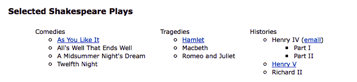
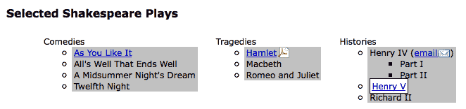
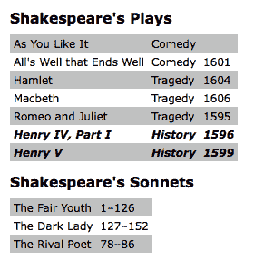

# 第二章：选择元素

jQuery 库利用 **层叠样式表** (**CSS**) 选择器的力量，让我们能够快速轻松地访问 **文档对象模型** (**DOM**) 中的元素或元素组。

在本章中，我们将涵盖：

+   网页上元素的结构

+   如何使用 CSS 选择器在页面上查找元素

+   当 CSS 选择器的特异性发生变化时会发生什么

+   自定义 jQuery 扩展到标准的 CSS 选择器集

+   DOM 遍历方法，提供了更大的灵活性，用于访问页面上的元素

+   使用现代 JavaScript 语言功能有效地迭代 jQuery 对象

# 理解 DOM

jQuery 最强大的方面之一是其使得在 DOM 中选择元素变得容易。DOM 作为 JavaScript 和网页之间的接口；它提供了 HTML 源代码的表示，作为对象网络，而不是作为纯文本。

这个网络采用了页面上元素的家族树形式。当我们提到元素彼此之间的关系时，我们使用与指家庭关系时相同的术语：父母、子女、兄弟姐妹等。一个简单的例子可以帮助我们理解家族树隐喻如何适用于文档：

```js
<html> 
  <head> 
    <title>the title</title> 
  </head> 
  <body> 
    <div> 
      <p>This is a paragraph.</p> 
      <p>This is another paragraph.</p> 
      <p>This is yet another paragraph.</p> 
    </div> 
  </body> 
</html> 

```

在这里，`<html>` 是所有其他元素的祖先；换句话说，所有其他元素都是 `<html>` 的后代。`<head>` 和 `<body>` 元素不仅是 `<html>` 的后代，而且是其子元素。同样，除了是 `<head>` 和 `<body>` 的祖先之外，`<html>` 还是它们的父元素。`<p>` 元素是 `<div>` 的子元素（和后代），是 `<body>` 和 `<html>` 的后代，以及彼此的兄弟元素。


为了帮助可视化 DOM 的家族树结构，我们可以使用浏览器的开发者工具检查任何页面的 DOM 结构。当您好奇某个其他应用程序的工作方式，并且想要实现类似功能时，这特别有帮助。

有了这些元素的树结构，我们将能够使用 jQuery 高效地定位页面上的任何一组元素。我们实现这一目标的工具是 jQuery **选择器** 和 **遍历方法**。

# 使用 $() 函数

由 jQuery 的选择器和方法生成的元素集合始终由 jQuery 对象表示。当我们想要实际对页面上找到的东西进行操作时，这些对象非常容易使用。我们可以轻松地将事件绑定到这些对象上，并向它们添加视觉效果，以及将多个修改或效果链接在一起。

请注意，jQuery 对象与普通 DOM 元素或节点列表不同，因此在某些任务上不一定提供相同的方法和属性。在本章的最后部分，我们将探讨直接访问 jQuery 对象中收集的 DOM 元素的方法。

要创建一个新的 jQuery 对象，我们使用 `$()` 函数。这个函数通常接受一个 CSS 选择器作为其唯一参数，并充当工厂，返回一个指向页面上相应元素的新 jQuery 对象。几乎任何可以在样式表中使用的东西也可以作为字符串传递给此函数，使我们能够将 jQuery 方法应用于匹配的元素集。

使 jQuery 与其他 JavaScript 库协同工作

在 jQuery 中，美元符号 `($)` 只是 `jQuery` 的别名。因为 `$()` 函数在 JavaScript 库中非常常见，所以如果在同一页中使用了多个这些库，可能会出现冲突。我们可以通过在自定义 jQuery 代码中将每个 `$` 实例替换为 `jQuery` 来避免这种冲突。有关此问题的其他解决方案将在第十章 *高级事件*中讨论。另一方面，jQuery 在前端开发中非常突出，因此库通常不会动 `$` 符号。

选择器的三个主要构建块是**标签名**、**ID**和**类**。它们可以单独使用，也可以与其他选择器组合使用。以下简单示例说明了这三个选择器在代码中的应用方式：

| **选择器类型** | **CSS** | **jQuery** | **功能** |
| --- | --- | --- | --- |
| **标签名** | `p { }` | `$('p')` | 这选择了文档中的所有段落。 |
| **ID** | `#some-id { }`                             | `$('#some-id')`                           | 这选择了文档中具有 ID 为 `some-id` 的单个元素。 |
| **类** | `.some-class { }`                                                | `$('.some-class')`                                         | 这选择了文档中具有类 `some-class` 的所有元素。 |

如第一章 *入门*中所述，当我们调用 jQuery 对象的方法时，自动隐式地循环遍历了我们传递给 `$()` 的选择器所引用的元素。因此，我们通常可以避免显式迭代，比如 `for` 循环，在 DOM 脚本中经常需要。

现在我们已经介绍了基础知识，我们准备开始探索一些更强大的选择器使用方法。

# CSS 选择器

jQuery 库支持 CSS 规范 1 到 3 中包含的几乎所有选择器，详细信息请参见万维网联盟的网站：[`www.w3.org/Style/CSS/specs`](http://www.w3.org/Style/CSS/specs)。这种支持允许开发人员增强其网站，而无需担心哪些浏览器可能不理解更高级的选择器，只要浏览器启用了 JavaScript。

渐进增强

负责任的 jQuery 开发者应始终将渐进增强和优雅降级的概念应用于其代码，确保页面在禁用 JavaScript 时渲染的准确性与启用 JavaScript 时一样，即使不那么美观。我们将在本书中继续探讨这些概念。有关渐进增强的更多信息，请访问[`en.wikipedia.org/wiki/Progressive_enhancement`](http://en.wikipedia.org/wiki/Progressive_enhancement)。话虽如此，这些天即使在移动浏览器上也很少遇到禁用 JavaScript 的用户。

要开始学习 jQuery 如何与 CSS 选择器配合工作，我们将使用许多网站上经常出现的结构，通常用于导航——嵌套的无序列表：

```js
<ul id="selected-plays"> 
  <li>Comedies 
    <ul> 
      <li><a href="/asyoulikeit/">As You Like It</a></li> 
      <li>All's Well That Ends Well</li> 
      <li>A Midsummer Night's Dream</li> 
      <li>Twelfth Night</li> 
    </ul> 
  </li> 
  <li>Tragedies 
    <ul> 
      <li><a href="hamlet.pdf">Hamlet</a></li> 
      <li>Macbeth</li> 
      <li>Romeo and Juliet</li> 
    </ul> 
  </li> 
  <li>Histories 
    <ul> 
      <li>Henry IV (<a href="mailto:henryiv@king.co.uk">email</a>) 
         <ul> 
           <li>Part I</li> 
           <li>Part II</li>  
         </ul> 
      <li><a href="http://www.shakespeare.co.uk/henryv.htm">Henry V</a></li>
      <li>Richard II</li> 
    </ul> 
  </li> 
</ul> 

```

可下载的代码示例

您可以从以下 Github 仓库访问示例代码：[`github.com/PacktPublishing/Learning-jQuery-3`](https://github.com/PacktPublishing/Learning-jQuery-3)。

注意，第一个`<ul>`具有`selecting-plays`的 ID，但没有任何`<li>`标签与之关联的类。没有应用任何样式，列表看起来像这样：


嵌套列表呈现我们所期望的样子——一组垂直排列的项目，根据它们的级别缩进。

# 设计列表项级别

假设我们只想要顶级项——喜剧、悲剧和历史——以及仅仅是顶级项水平排列。我们可以首先在样式表中定义一个`horizontal`类：

```js
.horizontal { 
  float: left; 
  list-style: none; 
  margin: 10px; 
} 

```

`horizontal`类使元素浮动到其后面的左侧，如果是列表项，则删除其标志，并在其四周添加 10 像素的边距。

不直接在我们的 HTML 中添加`horizontal`类，而是仅将其动态添加到顶级列表项，以演示 jQuery 对选择器的使用：

```js
$(() => {
  $('#selected-plays > li')
    .addClass('horizontal');
}); 

```

列表 2.1

如第一章所述，*入门*，我们通过调用`$(() => {})`开始 jQuery 代码，该代码在 DOM 加载后运行传递给它的函数，但在此之前不会运行。

第二行使用子级组合符（`>`）仅向所有顶级项添加`horizontal`类。实际上，`$()`函数内的选择器表示“找到每个列表项（`li`），它是具有 ID 为`selected-plays`（`#selected-plays`）的元素的子级（`>`）”。

现在应用了该类，样式表中为该类定义的规则生效，这意味着列表项水平排列而不是垂直排列。现在，我们的嵌套列表看起来是这样的：



对所有其他项进行样式设置--即不在顶级的项--有很多种方法。由于我们已经将`horizontal`类应用于顶级项目，选择所有子级项目的一种方法是使用否定伪类来标识所有没有`horizontal`类的列表项：

```js
$(() => {
  $('#selected-plays > li')
    .addClass('horizontal'); 
  $('#selected-plays li:not(.horizontal)')
    .addClass('sub-level');
}); 

```

列表 2.2

这一次我们选择了每个列表项（`<li>`），它：

+   是具有 ID 为`selected-plays`的元素的后代（`#selected-plays`）

+   没有`horizontal`类（`:not(.horizontal)`）

当我们向这些项目添加`sub-level`类时，它们将接收到样式表中定义的阴影背景：

```js
.sub-level { 
  background: #ccc; 
} 

```

现在嵌套列表看起来是这样的：


# 选择器的具体性

在 jQuery 中，选择器的具体性有一个范围，从非常通用的选择器到非常具体的选择器。目标是选择正确的元素，否则你的选择器就会失效。jQuery 初学者的倾向是为所有东西实现非常具体的选择器。也许通过反复试验，他们已经通过为给定的选择器添加更多的具体性来修复选择器错误。然而，这并不总是最好的解决方案。

让我们看一个例子，增加顶级`<li>`文本的首字母大小。这是我们要应用的样式：

```js
.big-letter::first-letter {
   font-size: 1.4em;
 }

```

下面是列表项文本的样式：


正如你所见，喜剧，悲剧和历史如预期地应用了`big-letter`样式。为了做到这一点，我们需要一个比仅仅选择`$('#selected-plays li')`更具体的选择器，后者会将样式应用于每一个`<li>`，甚至子元素。我们可以改变 jQuery 选择器的具体性以确保我们只获得我们所期望的：

```js
$(() => { 
  $('#selected-plays > li') 
    .addClass('big-letter'); 

  $('#selected-plays li.horizontal')
    .addClass('big-letter'); 

  $('#selected-plays li:not(.sub-level)') 
    .addClass('big-letter'); 
});

```

列表 2.3

所有这三个选择器都做了同样的事情--将`big-letter`样式应用于`#selected-plays`中的顶级`<li>`元素。每个选择器的具体性都不同。让我们回顾一下每个选择器的工作原理以及它们的优势：

+   `#selected-plays > li`：这找到了直接是`#selected-plays`的子元素的`<li>`元素。这易于阅读，并且在 DOM 结构上语义相关。

+   `#selected-plays li.horizontal`：这找到了`#selected-plays`的`<li>`元素或子元素，并具有`horizontal`类。这也很容易阅读，并强制执行特定的 DOM 模式（应用`horizontal`类）。

+   `#selected-plays li:not(.sub-level)`：这很难阅读，效率低下，并且不反映实际的 DOM 结构。

在实际应用中，选择器的具体性经常会成为一个无穷的例子。每个应用都是独特的，正如我们刚才所看到的，实现选择器的具体性并没有一个正确的方法。重要的是，我们要通过考虑选择器对 DOM 结构的影响以及因此对应用或网站的可维护性的影响来行使良好的判断力。

# 属性选择器

属性选择器是 CSS 选择器的一个特别有用的子集。它们允许我们通过其 HTML 属性之一来指定一个元素，例如链接的`title`属性或图像的`alt`属性。例如，要选择所有具有`alt`属性的图像，我们写成这样：

```js
$('img[alt]') 

```

# 设置链接的样式

属性选择器接受受到正则表达式启发的通配符语法，用于标识字符串开头（`^`）或结尾（`$`）的值。它们还可以采用星号（`*`）来表示字符串中任意位置的值，感叹号（`!`）表示否定值。

假设我们希望为不同类型的链接使用不同的样式。我们首先在样式表中定义样式：

```js
a { 
  color: #00c;  
} 
a.mailto { 
  background: url(images/email.png) no-repeat right top; 
  padding-right: 18px; 
} 
a.pdflink { 
  background: url(images/pdf.png) no-repeat right top; 
  padding-right: 18px; 
} 
a.henrylink { 
  background-color: #fff; 
  padding: 2px; 
  border: 1px solid #000; 
} 

```

然后，我们使用 jQuery 将三个类--`mailto`、`pdflink` 和 `henrylink`--添加到相应的链接中。

要为所有电子邮件链接添加一个类，我们构造一个选择器，查找所有具有`href`属性的锚元素（`a`），该属性以`mailto:`开头（`^="mailto:"`），如下所示：

```js
$(() => {
  $('a[href^="mailto:"]')
    .addClass('mailto');
}); 

```

列表 2.4

由于页面样式表中定义的规则，邮件链接后会出现一个信封图像。


要为所有 PDF 文件的链接添加一个类，我们使用美元符号而不是插入符号。这是因为我们选择的是链接，其`href`属性以`.pdf`结尾：

```js
$(() => { 
  $('a[href^="mailto:"]')
    .addClass('mailto'); 
  $('a[href$=".pdf"]')
    .addClass('pdflink'); 
}); 

```

*列表 2.5*

新添加的`pdflink`类的样式表规则会导致每个指向 PDF 文档的链接后面都出现 Adobe Acrobat 图标，如下面的截图所示：


属性选择器也可以组合使用。例如，我们可以将类`henrylink`添加到所有链接的`href`值既以`http`开头又在任何地方包含`henry`的链接中：

```js
$(() => { 
  $('a[href^="mailto:"]')
    .addClass('mailto'); 
  $('a[href$=".pdf"]')
    .addClass('pdflink'); 
  $('a[href^="http"][href*="henry"]') 
    .addClass('henrylink'); 
}); 

```

列表 2.6

有了应用于三种类型链接的三个类，我们应该看到以下效果：



注意 Hamlet 链接右侧的 PDF 图标，电子邮件链接旁边的信封图标，以及 Henry V 链接周围的白色背景和黑色边框。

# 自定义选择器

jQuery 在广泛的 CSS 选择器基础上添加了自己的自定义选择器。这些自定义选择器增强了 CSS 选择器定位页面元素的能力。

性能说明

在可能的情况下，jQuery 使用浏览器的原生 DOM 选择器引擎来查找元素。当使用自定义 jQuery 选择器时，这种极快的方法是不可能的。因此，建议在原生选项可用时避免频繁使用自定义选择器。

大多数自定义选择器都允许我们从已经找到的一组元素中选择一个或多个元素。自定义选择器的语法与 CSS 伪类的语法相同，选择器以冒号（`:`）开头。例如，要从具有`horizontal`类的一组 `<div>` 元素中选择第二个项目，我们写成这样：

```js
$('div.horizontal:eq(1)') 

```

请注意，`:eq(1)`选择集合中的第二个项目，因为 JavaScript 数组编号是以零为基础的，这意味着它从零开始。相比之下，CSS 是以 1 为基础的，因此像`$('div:nth-child(1)')`这样的 CSS 选择器将选择所有作为其父元素的第一个子元素的`div`选择器。由于很难记住哪些选择器是基于零的，哪些是基于一的，当存在疑惑时，我们应该在 jQuery API 文档[`api.jquery.com/category/selectors/`](http://api.jquery.com/category/selectors/)中查阅 jQuery API 文档。

# 风格化交替行

在 jQuery 库中有两个非常有用的自定义选择器是`:odd`和`:even`。让我们看看我们如何使用其中一个来对基本表格进行条纹处理，如下表格所示：

```js
<h2>Shakespeare's Plays</h2> 
<table> 
  <tr> 
    <td>As You Like It</td> 
    <td>Comedy</td> 
    <td></td> 
  </tr> 
  <tr> 
    <td>All's Well that Ends Well</td> 
    <td>Comedy</td> 
    <td>1601</td> 
  </tr> 
  <tr> 
    <td>Hamlet</td> 
    <td>Tragedy</td> 
    <td>1604</td> 
  </tr> 
  <tr> 
    <td>Macbeth</td> 
    <td>Tragedy</td> 
    <td>1606</td> 
  </tr> 
  <tr> 
    <td>Romeo and Juliet</td> 
    <td>Tragedy</td> 
    <td>1595</td> 
  </tr> 
  <tr> 
    <td>Henry IV, Part I</td> 
    <td>History</td> 
    <td>1596</td> 
  </tr> 
  <tr> 
    <td>Henry V</td> 
    <td>History</td> 
    <td>1599</td> 
  </tr> 
</table> 
<h2>Shakespeare's Sonnets</h2> 
<table> 
  <tr> 
    <td>The Fair Youth</td> 
    <td>1-126</td> 
  </tr> 
  <tr> 
    <td>The Dark Lady</td> 
    <td>127-152</td> 
  </tr> 
  <tr> 
    <td>The Rival Poet</td> 
    <td>78-86</td> 
  </tr> 
</table> 

```

从我们的样式表中应用最小的样式后，这些标题和表格看起来相当普通。表格具有纯白色背景，没有样式区分一行和下一行，如下截图所示：


现在，我们可以向样式表中的所有表格行添加样式，并对奇数行使用`alt`类：

```js
tr { 
  background-color: #fff;  
} 
.alt { 
  background-color: #ccc;  
} 

```

最后，我们编写我们的 jQuery 代码，将类附加到奇数行的表格行（`<tr>`标签）：

```js
$(() => { 
  $('tr:even').addClass('alt'); 
}); 

```

列表 2.7

但等等！为什么使用`:even`选择器来选择奇数行？好吧，就像使用`:eq()`选择器一样，`:even`和`:odd`选择器使用 JavaScript 的本地从零开始的编号。因此，第一行计为零（偶数）和第二行计为一（奇数），依此类推。有了这一点，我们可以期望我们简单的代码生成如下所示的表格：


请注意，对于第二个表格，这个结果可能不是我们想要的。由于剧目表中最后一行具有交替的灰色背景，而十四行诗表中的第一行具有普通的白色背景。避免这种问题的一种方法是使用`:nth-child()`选择器，该选择器计算元素相对于其父元素的位置，而不是相对于到目前为止选择的所有元素的位置。此选择器可以使用数字、`奇数`或`偶数`作为参数：

```js
$(() => {
  $('tr:nth-child(odd)').addClass('alt'); 
}); 

```

列表 2.8

与之前一样，请注意`:nth-child()`是唯一一个以 1 为基础的 jQuery 选择器。为了实现与之前相同的行条纹效果--但对于第二个表格具有一致的行为，我们需要使用`奇数`而不是`偶数`作为参数。使用此选择器后，两个表格现在都有很好的条纹，如下截图所示：


`:nth-child()`选择器是现代浏览器中本机的 CSS 选择器。

# 基于文本内容查找元素

对于最后一个自定义选择器，假设出于某种原因，我们希望突出显示任何一个表格单元格，该单元格提到了亨利的剧目。我们只需--在样式表中添加一个使文本加粗和斜体的类（`.highlight {font-weight:bold; font-style: italic;}`）--在我们的 jQuery 代码中使用`:contains()`选择器添加一行：

```js
$(() => { 
  $('tr:nth-child(odd)')
    .addClass('alt'); 
  $('td:contains(Henry)')
    .addClass('highlight'); 
}); 

```

列表 2.9

因此，现在我们可以看到我们可爱的带有亨利剧集的条纹表格突出显示：


需要注意的是，`:contains()` 选择器区分大小写。使用不带大写 "H" 的 `$('td:contains(henry)')` 将不选择任何单元格。还需要注意的是，`:contains()` 可能会导致灾难性的性能下降，因为需要加载匹配第一部分选择器的每个元素的文本，并将其与我们提供的参数进行比较。当 `:contains()` 有可能搜索数百个节点以查找内容时，是时候重新考虑我们的方法了。

诚然，有多种方法可以实现行条纹和文本突出显示，而不需要 jQuery，或者说，根本不需要客户端编程。尽管如此，在动态生成内容且我们无法访问 HTML 或服务器端代码的情况下，jQuery 与 CSS 是这种类型样式的绝佳选择。

# 表单选择器

自定义选择器的功能不仅限于根据位置定位元素。例如，在处理表单时，jQuery 的自定义选择器和补充的 CSS3 选择器可以轻松选择我们需要的元素。以下表格描述了其中一些表单选择器：

| **选择器** | **匹配** |
| --- | --- |
| `:input` | 输入、文本区域、选择器和按钮元素 |
| `:button` | 按钮元素和带有 `type` 属性等于 `button` 的输入元素 |
| `:enabled` | 已启用的表单元素 |
| `:disabled` | 已禁用的表单元素 |
| `:checked` | 已选中的单选按钮或复选框 |
| `:selected` | 已选择的选项元素 |

与其他选择器一样，表单选择器可以组合使用以提高特异性。例如，我们可以选择所有已选中的单选按钮（但不包括复选框）：`$('input[type="radio"]:checked')`，或选择所有密码输入和禁用的文本输入：`$('input[type="password"], input[type="text"]:disabled')`。即使使用自定义选择器，我们也可以使用相同的基本 CSS 原理来构建匹配元素列表。

我们在这里仅仅触及了可用选择器表达式的皮毛。我们将在第九章，*高级选择器和遍历*中深入探讨这个主题。

# DOM 遍历方法

到目前为止，我们探索的 jQuery 选择器允许我们在 DOM 树中向下导航并过滤结果，如果这是选择元素的唯一方式，我们的选择会受到一定限制。在许多情况下，选择父元素或祖先元素至关重要；这就是 jQuery 的 DOM 遍历方法发挥作用的地方。使用这些方法，我们可以轻松地在 DOM 树中向上、向下和周围移动。

一些方法在选择器表达式中具有几乎相同的对应项。例如，我们首先用来添加`alt`类的行，`$('tr:even').addClass('alt')`，可以使用`.filter()`方法重写如下：

```js
$('tr')
  .filter(':even')
  .addClass('alt'); 

```

然而，在很大程度上，这两种选择元素的方式互补。此外，特别是`.filter()`方法具有巨大的威力，因为它可以将函数作为其参数。该函数允许我们为是否应将元素包含在匹配的集合中创建复杂的测试。例如，假设我们想要为所有外部链接添加一个类：

```js
a.external { 
  background: #fff url(images/external.png) no-repeat 100% 2px; 
  padding-right: 16px; 
} 

```

jQuery 没有这种选择器。如果没有过滤函数，我们将被迫显式地遍历每个元素，分别测试每个元素。但是，有了下面的过滤函数，我们仍然可以依赖于 jQuery 的隐式迭代，并保持我们的代码简洁：

```js
$('a')
  .filter((i, a) =>
    a.hostname && a.hostname !== location.hostname
  )
  .addClass('external'); 

```

列表 2.10

提供的函数通过两个标准筛选`<a>`元素集：

+   链接必须具有域名(`a.hostname`)的`href`属性。我们使用此测试来排除邮件链接，例如。

+   它们链接到的域名（再次，`a.hostname`）不得与当前页面的域名（`location.hostname`）匹配。

更精确地说，`.filter()`方法遍历匹配的元素集，每次调用函数并测试返回值。如果函数返回`false`，则从匹配的集合中删除该元素。如果返回`true`，则保留该元素。

使用`.filter()`方法后，Henry V 链接被设置为外部链接的样式：


在下一节中，我们将再次查看我们条纹表格示例，看看遍历方法还有什么其他可能性。

# 样式化特定单元格

早些时候，我们向所有包含文本 Henry 的单元格添加了`highlight`类。要改为样式化每个包含 Henry 的单元格旁边的单元格，我们可以从已经编写的选择器开始，并简单地在结果上调用`.next()`方法：

```js
$(() => {
  $('td:contains(Henry)')
    .next()
    .addClass('highlight'); 
}); 

```

列表 2.11

现在表格应该是这样的：


`.next()`方法仅选择紧接的下一个同级元素。要突出显示包含 Henry 的单元格后面的所有单元格，我们可以改用`.nextAll()`方法：

```js
$(() => {
  $('td:contains(Henry)')
    .nextAll()
    .addClass('highlight'); 
}); 

```

列表 2.12

由于包含 Henry 的单元格位于表格的第一列中，此代码会导致这些行中的其余单元格被突出显示：


正如我们可能预期的那样，`.next()`和`.nextAll()`方法有对应的方法：`.prev()`和`.prevAll()`。此外，`.siblings()`选择同一 DOM 级别的所有其他元素，无论它们是在之前还是之后选择的元素之后。

要包含原始单元格（包含 Henry 的单元格）以及随后的单元格，我们可以添加`.addBack()`方法：

```js
$(() => {
  $('td:contains(Henry)')
    .nextAll()
    .addBack() 
    .addClass('highlight'); 
}); 

```

列表 2.13

使用这个修改后，该行中的所有单元格都从`highlight`类中获取其样式：



我们可以通过多种选择器和遍历方法的组合来选择相同的元素集。例如，这里是另一种选择每行中至少一个单元格包含 Henry 的方法：

```js
$(() => { 
  $('td:contains(Henry)')
    .parent()
    .children() 
    .addClass('highlight'); 
}); 

```

列表 2.14

我们不是沿着兄弟元素遍历，而是在 DOM 中向上移动到带有 `.parent()` 的 `<tr>` 标记，然后用 `.children()` 选择所有行的单元格。

# 链式调用

我们刚刚探索过的遍历方法组合展示了 jQuery 的链式调用能力。使用 jQuery，可以在一行代码中选择多个元素集并对其执行多个操作。这种链式调用不仅有助于保持 jQuery 代码简洁，而且在替代重新指定选择器的情况下，还可以改善脚本的性能。

链式调用的工作原理

几乎所有的 jQuery 方法都会返回一个 jQuery 对象，因此可以对结果应用更多的 jQuery 方法。我们将在第八章中探讨链式调用的内部工作原理，*开发插件*。

为了提高可读性，也可以将一行代码分成多行。例如，在本章中我们一直在做的就是这样。例如，一个单独的链式方法序列可以写在一行中：

```js
$('td:contains(Henry)').parent().find('td:eq(1)') 
    .addClass('highlight').end().find('td:eq(2)') 
                           .addClass('highlight'); 

```

列表 2.15

这些方法的顺序也可以用七行来写：

```js
$('td:contains(Henry)') // Find every cell containing "Henry" 
  .parent() // Select its parent 
  .find('td:eq(1)') // Find the 2nd descendant cell 
  .addClass('highlight') // Add the "highlight" class 
  .end() // Return to the parent of the cell containing "Henry" 
  .find('td:eq(2)') // Find the 3rd descendant cell 
  .addClass('highlight'); // Add the "highlight" class 

```

列表 2.16

此示例中的 DOM 遍历是刻意的，不建议使用。我们可以清楚地看到，我们可以使用更简单、更直接的方法。这个例子的重点只是展示了链式调用给我们带来的巨大灵活性，特别是当需要进行多次调用时。

链式调用就像在一个呼吸里说完整个段落的话语一样——可以快速完成工作，但对于其他人来说可能很难理解。将其分成多行并添加适当的注释可以在长远来看节省更多时间。

# 迭代 jQuery 对象

jQuery 3 中的新功能是使用 `for...of` 循环迭代 jQuery 对象。这本身并不是什么大不了的事情。首先，我们很少需要明确地迭代 jQuery 对象，特别是当使用 jQuery 函数中的隐式迭代也能得到相同的结果时。但有时，无法避免明确迭代。例如，想象一下你需要将一个元素数组（一个 jQuery 对象）减少为一个字符串值数组。`each()` 函数在这里是一种选择：

```js
const eachText = [];

$('td')
  .each((i, td) => {
    if (td.textContent.startsWith('H')) {
      eachText.push(td.textContent);
    }
  });

console.log('each', eachText);
 // ["Hamlet", "Henry IV, Part I", "History", "Henry V", "History"]

```

列表 2.17

我们首先用 `$('td')` 选择器得到了一个 `<td>` 元素数组。然后，通过将 `each()` 函数传递一个回调来将每个以 "H" 开头的字符串推到 `eachText` 数组中，我们将其减少为一个字符串数组。这种方法没有问题，但是为这样一个简单的任务编写回调函数似乎有点过分了。下面是使用 `for...of` 语法实现相同功能的代码：

```js
 const forText = [];

 for (let td of $('td')) {
   if (td.textContent.startsWith('H')) {
     forText.push(td.textContent);
   }
 }

 console.log('for', forText);
 // ["Hamlet", "Henry IV, Part I", "History", "Henry V", "History"]

```

列表 2.18

通过简单的`for`循环和`if`语句，我们现在可以缩减 jQuery 对象。我们将在本书后面重新讨论这种`for...of`方法，以适用更高级的使用场景，包括生成器。

# 访问 DOM 元素

每个选择器表达式和大多数 jQuery 方法都返回一个 jQuery 对象。这几乎总是我们想要的，因为它提供了隐式迭代和链接的功能。

然而，在我们的代码中可能会有一些情况需要直接访问 DOM 元素。例如，我们可能需要使生成的元素集合可供其他 JavaScript 库使用，或者可能需要访问元素的标签名称，这作为 DOM 元素的一个属性可用。对于这些明显罕见的情况，jQuery 提供了`.get()`方法。例如，要访问 jQuery 对象引用的第一个 DOM 元素，我们会使用`.get(0)`。因此，如果我们想要知道 ID 为`my-element`的元素的标签名称，我们会这样写：

```js
$('#my-element').get(0).tagName; 

```

为了更加便利，jQuery 提供了`.get()`的简写。我们可以直接在选择器后面使用方括号来代替前面的行：

```js
$('#my-element')[0].tagName; 

```

这种语法看起来像是将 jQuery 对象视为 DOM 元素的数组并不是偶然的；使用方括号就像是把 jQuery 层剥离出去，得到节点列表，并包括索引（在这种情况下，`0`），就像是取出 DOM 元素本身。

# 总结

通过本章介绍的技巧，现在我们应该能够以各种方式在页面上定位元素集合。特别是，我们学习了如何使用基本的 CSS 选择器来为嵌套列表的顶层和子层项目设置样式，如何使用属性选择器为不同类型的链接应用不同的样式，如何使用自定义的 jQuery 选择器`:odd`和`:even`或高级 CSS 选择器`:nth-child()`为表格添加基本的条纹，并通过链接 jQuery 方法来突出显示特定表格单元格中的文本。

到目前为止，我们一直在使用`$(() => {})`文档准备处理程序来给匹配的元素集合添加类。在下一章中，我们将探讨在响应各种用户触发事件中添加类的方法。

# 进一步阅读

选择器和遍历方法的主题将在第九章《高级选择器和遍历》中更详细地探讨。jQuery 的选择器和遍历方法的完整列表可在本书的附录 B 中找到，也可在官方的 jQuery 文档[`api.jquery.com/`](http://api.jquery.com/)中找到。

# 练习

挑战练习可能需要使用官方的 jQuery 文档 [`api.jquery.com/`](http://api.jquery.com/)：

1.  为嵌套列表的第二级所有`<li>`元素添加一个`special`类。

1.  为表格的第三列中的所有单元格添加一个`year`类。

1.  在含有单词`Tragedy`的第一行表格行中添加`special`类。

1.  这里有一个挑战给你。选择所有包含链接（`<a>`）的列表项（`<li>`）。给所选项后面的兄弟列表项添加类`afterlink`。

1.  这里有另一个挑战给你。给任何`.pdf`链接最近的祖先`<ul>`添加类`tragedy`。
