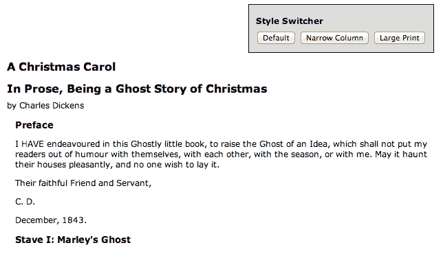
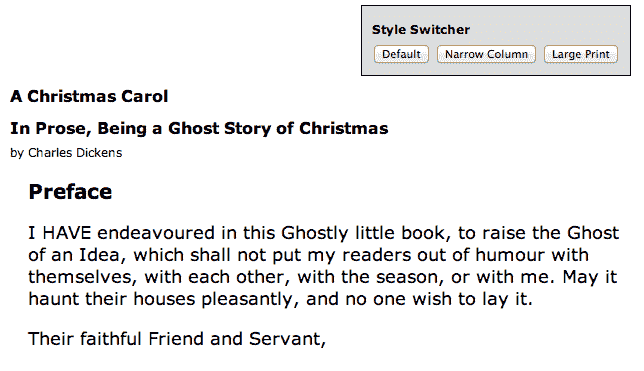
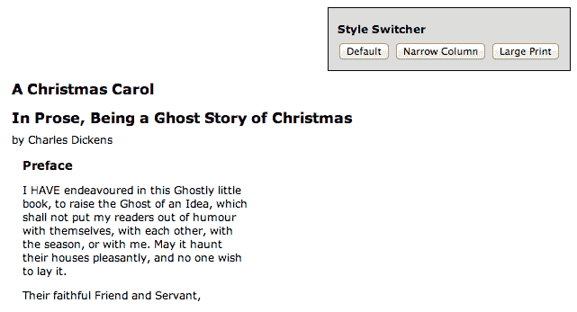
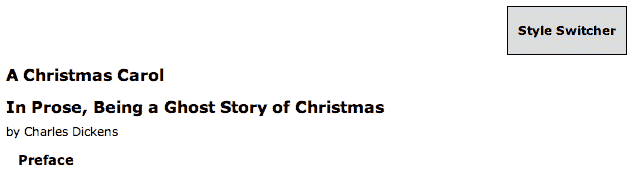
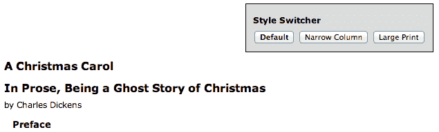
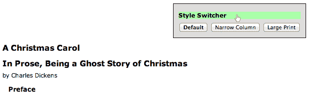
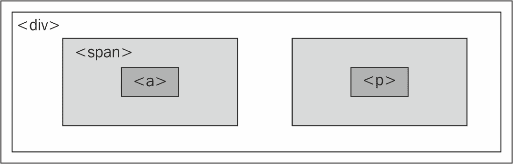
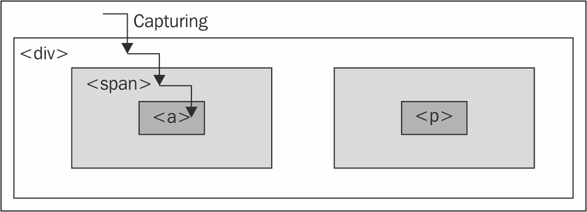
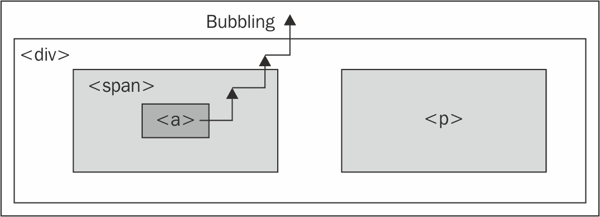
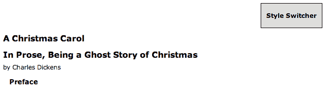

# 第三章：处理事件

JavaScript 有几种内置的方式来响应用户交互和其他事件。为了使页面动态和响应灵活，我们需要利用这种能力，以便在适当的时候使用你迄今为止学到的 jQuery 技巧和你以后将学到的其他技巧。虽然我们可以用原生 JavaScript 来做到这一点，但 jQuery 增强和扩展了基本的事件处理机制，使其具有更优雅的语法，同时使其更加强大。

在本章中，我们将涵盖：

+   当页面准备就绪时执行 JavaScript 代码

+   处理用户事件，如鼠标点击和按键

+   事件通过文档的流动，以及如何操纵该流动

+   模拟事件，就像用户发起了它们一样

# 在页面加载时执行任务

我们已经看到如何使 jQuery 响应网页加载。 `$(() => {})` 事件处理程序可用于运行依赖于 HTML 元素的代码，但还有一些其他内容需要讨论。

# 代码执行的时间

在第一章中，*入门*，我们注意到 `$(() => {})` 是 jQuery 在页面加载时执行任务的主要方式。然而，这并不是我们唯一的选择。本地的 `window.onload` 事件也可以做同样的事情。虽然这两种方法相似，但重要的是要认识到它们在时间上的差异，尤其是依赖于加载的资源数量的情况下，这可能是相当微妙的。

当文档完全下载到浏览器时，`window.onload` 事件将触发。这意味着页面上的每个元素都可以被 JavaScript 操纵，这对于编写功能丰富的代码而不用担心加载顺序是一个福音。

另一方面，使用 `$(() => {})` 注册的处理程序在 DOM 完全准备就绪时被调用。这也意味着所有元素都可以被我们的脚本访问，但并不意味着每个相关文件都已经被下载。一旦 HTML 文件被下载并解析成 DOM 树，代码就可以运行。

样式加载和代码执行

为了确保页面在 JavaScript 代码执行之前也已经被样式化，将 `<link rel="stylesheet">` 和 `<style>` 标签放在文档的 `<head>` 元素内的任何 `<script>` 标签之前是一种良好的做法。

例如，考虑一个展示图库的页面；这样的页面上可能有许多大图，我们可以用 jQuery 隐藏、显示、移动和其他方式来操纵它们。如果我们使用 `onload` 事件来设置我们的接口，用户将不得不等待每个图像完全下载后才能使用这些功能。更糟糕的是，如果行为尚未附加到具有默认行为的元素（如链接）上，用户交互可能会产生意想不到的结果。然而，当我们使用 `$(() => {})` 进行设置时，界面更早地准备好使用，并具有正确的行为。

什么被加载了，什么没有被加载？

使用`$(() => {})`几乎总是优于使用`onload`处理程序，但我们需要记住，因为支持文件可能尚未加载，因此此时可能不一定可用图像高度和宽度等属性。如果需要这些属性，有时我们也可以选择实现`onload`处理程序；这两种机制可以和平共处。

# 处理一个页面上的多个脚本

通过 JavaScript 注册事件处理程序的传统机制（而不是直接在 HTML 内容中添加处理程序属性）是将函数分配给 DOM 元素的相应属性。例如，假设我们已定义了以下函数：

```js
function doStuff() { 
  // Perform a task... 
} 

```

然后，我们可以在 HTML 标记中分配它：

```js
<body onload="doStuff();"> 

```

或者，我们可以从 JavaScript 代码中分配它：

```js
window.onload = doStuff; 

```

这两种方法都会在页面加载时执行函数。第二种的优点是行为与标记清晰地分开。

引用与调用函数

当我们将函数分配为处理程序时，我们使用函数名但省略尾括号。带括号时，函数会立即调用；不带括号时，名称仅标识或*引用*函数，并且可以在以后调用它。

通过一个函数，这种策略运行得相当不错。然而，假设我们有一个第二个函数如下：

```js
function doOtherStuff() { 
  // Perform another task... 
} 

```

然后，我们可以尝试将此函数分配为在页面加载时运行：

```js
window.onload = doOtherStuff; 

```

但是，这个赋值会覆盖第一个。`.onload`属性一次只能存储一个函数引用，所以我们不能添加到现有的行为。

`$(() => {})`机制优雅地处理了这种情况。每次调用都会将新函数添加到内部行为队列中；当页面加载时，所有函数都将执行。函数将按照注册的顺序运行。

公平地说，jQuery 并不是唯一解决此问题的方法。我们可以编写一个 JavaScript 函数，调用现有的`onload`处理程序，然后调用传入的处理程序。这种方法避免了像`$(() => {})`这样的竞争处理程序之间的冲突，但缺少了我们讨论过的其他一些优点。在现代浏览器中，可以使用 W3C 标准的`document.addEventListener()`方法触发`DOMContentLoaded`事件。但是，`$(() => {})`更简洁而优雅。

# 将参数传递给文档准备好的回调

在某些情况下，同时在同一页面上使用多个 JavaScript 库可能会被证明是有用的。由于许多库使用`$`标识符（因为它简短而方便），我们需要一种方法来防止库之间的冲突。

幸运的是，jQuery 提供了一个名为`jQuery.noConflict()`的方法，将`$`标识符的控制权返回给其他库。`jQuery.noConflict()`的典型用法如下所示：

```js
<script src="img/prototype.js"></script> 
<script src="img/jquery.js"></script> 
<script> 
  jQuery.noConflict(); 
</script> 
<script src="img/myscript.js"></script> 

```

首先，包括其他库（本例中的`prototype.js`）。然后，`jquery.js`自身被包括，接管`$`以供自己使用。接下来，调用`.noConflict()`释放`$`，以便将其控制权恢复到第一个包括的库（`prototype.js`）。现在在我们的自定义脚本中，我们可以同时使用这两个库，但每当我们想使用 jQuery 方法时，我们需要将标识符写为`jQuery`而不是`$`。

`$(() => {})` 文档准备就绪处理程序在这种情况下还有一个技巧可以帮助我们。我们传递给它的回调函数可以接受一个参数--`jQuery`对象本身。这使我们可以有效地重新命名它，而不必担心冲突，使用以下语法：

```js
jQuery(($) => { 
  // In here, we can use $ like normal! 
}); 

```

# 处理简单事件

除了页面加载之外，还有其他时间点，我们可能希望执行某些任务。就像 JavaScript 允许我们拦截页面加载事件一样，使用`<body onload="">`或`window.onload`，它为用户触发的事件提供了类似的挂钩，如鼠标点击（`onclick`）、表单字段被修改（`onchange`）和窗口尺寸变化（`onresize`）。当直接分配给 DOM 中的元素时，这些挂钩也具有类似于我们为`onload`概述的缺点。因此，jQuery 也提供了处理这些事件的改进方式。

# 一个简单的样式切换器

为了说明一些事件处理技术，假设我们希望根据用户输入以多种不同的样式呈现单个页面；我们将提供按钮，允许用户在正常视图、文本受限于窄列的视图和内容区域为大字体的视图之间切换。

逐步增强

在一个真实的例子中，一个良好的网络公民将在这里应用逐步增强原则。在第五章，*操作 DOM*中，您将学到如何可以从我们的 jQuery 代码直接注入类似于这种样式切换器的内容，以便没有可用 JavaScript 的用户不会看到无效的控件。

样式切换器的 HTML 标记如下：

```js
<div id="switcher" class="switcher"> 
  <h3>Style Switcher</h3> 
  <button id="switcher-default"> 
    Default 
  </button> 
  <button id="switcher-narrow"> 
    Narrow Column 
  </button> 
  <button id="switcher-large"> 
    Large Print 
  </button> 
</div> 

```

获取示例代码

您可以访问下面的 GitHub 存储库中的示例代码：[`github.com/PacktPublishing/Learning-jQuery-3`](https://github.com/PacktPublishing/Learning-jQuery-3)。

结合页面的其余 HTML 标记和一些基本的 CSS，我们得到了一个看起来像以下的页面：



首先，我们将让大字体按钮起作用。我们需要一些 CSS 来实现我们页面的另一种视图，如下所示：

```js
body.large .chapter { 
  font-size: 1.5em; 
} 

```

因此，我们的目标是将`large`类应用于`<body>`标签。这将允许样式表适当地重新格式化页面。根据您在第二章学到的，*选择元素*，我们已经知道完成这个任务所需的语句：

```js
$('body').addClass('large'); 

```

然而，我们希望这发生在按钮被点击时，而不是在页面加载时，就像我们迄今所见的那样。为此，我们将介绍`.on()`方法。该方法允许我们指定任何 DOM 事件并附加行为。在这种情况下，事件被称为`click`，而行为是由我们之前的一行函数组成：

```js
$(() => {
  $('#switcher-large')
    .on('click', () => { 
      $('body').addClass('large'); 
    }); 
}); 

```

列表 3.1

现在当按钮被点击时，我们的代码运行，文字被放大：



这就是将行为绑定到事件的全部内容。我们讨论的`$(() => {})`文档就绪处理程序的优势在这里同样适用。多次调用`.on()`可以很好地共存，根据需要向同一事件附加附加行为。

这并不一定是实现此任务的最优雅或高效方式。随着我们继续学习本章，我们将扩展和完善这段代码，使之成为我们可以自豪的东西。

# 启用其他按钮

现在我们有了有效运行的大字按钮，但我们需要对其他两个按钮（默认和窄栏）应用类似的处理以使它们执行其任务。这很简单：我们使用`.on()`为每个按钮添加一个`click`处理程序，根据需要删除和添加类。新代码如下所示：

```js
$(() => {
  $('#switcher-default')
    .on('click', () => { 
      $('body')
        .removeClass('narrow')
        .removeClass('large'); 
    });

  $('#switcher-narrow')
    .on('click', () => { 
      $('body')
        .addClass('narrow')
        .removeClass('large'); 
    }); 

  $('#switcher-large')
    .on('click', () => { 
      $('body')
        .removeClass('narrow')
        .addClass('large'); 
    }); 
}); 

```

列表 3.2

这与`narrow`类的 CSS 规则相结合：

```js
body.narrow .chapter { 
  width: 250px; 
} 

```

现在，在点击"窄栏"按钮后，其相应的 CSS 被应用，文本布局不同了：



点击"Default"按钮会从`<body>`标签中移除两个类名，使页面恢复到最初的渲染状态。

# 利用事件处理程序上下文

我们的切换器行为正确，但我们没有向用户提供有关当前活动按钮的任何反馈。我们处理的方法是在点击时将`selected`类应用到按钮上，并从其他按钮上删除这个类。`selected`类只是使按钮的文字加粗：

```js
.selected { 
  font-weight: bold; 
} 

```

我们可以像之前一样通过引用每个按钮的 ID 并根据需要应用或移除类来实现此类修改，而是，我们将探讨一种更加优雅和可扩展的解决方案，利用事件处理程序运行的上下文。

当任何事件处理程序被触发时，关键字`this`指代的是附加行为的 DOM 元素。早些时候我们注意到`$()`函数可以将 DOM 元素作为参数；这是为何该功能可用的关键原因之一。在事件处理程序中写入`$(this)`，我们创建了一个对应于该元素的 jQuery 对象，我们可以像使用 CSS 选择器定位一样对其进行操作。

有了这个思路，我们可以写出以下内容：

```js
$(this).addClass('selected'); 

```

在每个处理程序中放置这行代码会在按钮被点击时添加类。要从其他按钮中移除类，我们可以利用 jQuery 的隐式迭代功能，并写入：

```js
$('#switcher button').removeClass('selected'); 

```

此行从样式切换器中的每个按钮中移除类。

当文档准备就绪时，我们还应该向默认按钮添加类。因此，将这些放置在正确的顺序中，代码如下所示：

```js
$(() => { 
  $('#switcher-default') 
    .addClass('selected') 
    .on('click', function() { 
      $('body')
        .removeClass('narrow'); 
        .removeClass('large'); 
      $('#switcher button')
        .removeClass('selected'); 
      $(this)
        .addClass('selected'); 
    });

  $('#switcher-narrow')
    .on('click', function() { 
        $('body')
          .addClass('narrow')
          .removeClass('large'); 
        $('#switcher button')
          .removeClass('selected'); 
        $(this)
          .addClass('selected'); 
  }); 

  $('#switcher-large')
    .on('click', function() { 
      $('body')
        .removeClass('narrow')
        .addClass('large'); 
      $('#switcher button')
        .removeClass('selected'); 
      $(this)
        .addClass('selected'); 
  }); 
}); 

```

列表 3.3

现在样式切换器提供了适当的反馈。

通过使用处理程序上下文概括语句，我们可以更加高效。我们可以将突出显示的例程提取到单独的处理程序中，如*列表 3.4*所示，因为它对所有三个按钮都是相同的：

```js
$(() => {
  $('#switcher-default') 
    .addClass('selected') 
    .on('click', function() { 
      $('body')
        .removeClass('narrow')
        .removeClass('large'); 
    }); 
  $('#switcher-narrow')
    .on('click', () => { 
      $('body')
        .addClass('narrow')
        .removeClass('large'); 
    }); 

  $('#switcher-large')
    .on('click', () => { 
      $('body')
        .removeClass('narrow')
        .addClass('large'); 
    }); 

  $('#switcher button')
    .on('click', function() { 
      $('#switcher button')
        .removeClass('selected'); 
      $(this)
        .addClass('selected'); 
    }); 
}); 

```

列表 3.4

这种优化利用了我们已经讨论过的三个 jQuery 功能。首先，当我们使用单个调用`.on()`将相同的`click`处理程序绑定到每个按钮时，**隐式迭代**再次非常有用。其次，**行为排队**允许我们将两个函数绑定到同一个点击事件，而不会第二个覆盖第一个。

当事件处理程序函数使用`this`引用其上下文时，你不能使用箭头函数（`() => {}`）。这些函数具有**词法上下文**。这意味着当 jQuery 尝试将上下文设置为触发事件的元素时，它不起作用。

# 利用事件上下文合并代码

我们刚刚完成的代码优化是**重构**的一个例子--修改现有代码以以更高效或更优雅的方式执行相同的任务。为了进一步探索重构机会，让我们看一下我们已经绑定到每个按钮的行为。`.removeClass()`方法的参数是可选的；当省略时，它会从元素中删除所有类。我们可以利用这一点稍微简化我们的代码，如下所示：

```js
$(() => {
  $('#switcher-default') 
    .addClass('selected') 
    .on('click', () => { 
      $('body').removeClass(); 
    });
  $('#switcher-narrow')
    .on('click', () => { 
      $('body')
        .removeClass()
        .addClass('narrow'); 
    }); 

  $('#switcher-large')
    .on('click', () => { 
      $('body')
        .removeClass()
        .addClass('large'); 
    }); 

  $('#switcher button')
    .on('click', function() { 
      $('#switcher button')
        .removeClass('selected'); 
      $(this)
        .addClass('selected'); 
    }); 
}); 

```

列表 3.5

请注意，操作顺序有些变化，以适应我们更一般的类移除；我们需要先执行`.removeClass()`，以免它撤消对`.addClass()`的调用，我们同时执行这个调用。

我们只能安全地删除所有类，因为在这种情况下我们负责 HTML。当我们编写可重用的代码（例如用于插件）时，我们需要尊重可能存在的任何类，并保持其不变。

现在我们在每个按钮的处理程序中执行一些相同的代码。这可以很容易地提取出来到我们的通用按钮`click`处理程序中：

```js
$(() => {
  $('#switcher-default')
    .addClass('selected'); 
  $('#switcher button')
    .on('click', function() { 
      $('body')
        .removeClass(); 
      $('#switcher button')
        .removeClass('selected'); 
      $(this)
        .addClass('selected'); 
    });

  $('#switcher-narrow')
    .on('click', () => { 
      $('body')
        .addClass('narrow'); 
    }); 

  $('#switcher-large')
    .on('click', () => { 
      $('body')
        .addClass('large'); 
    }); 
}); 

```

列表 3.6

请注意，现在我们需要将通用处理程序移到特定处理程序之前。`.removeClass()`调用需要在`.addClass()`执行之前发生，我们可以依赖于此，因为 jQuery 总是按照注册顺序触发事件处理程序。

最后，我们可以完全摆脱特定的处理程序，再次利用**事件上下文**。由于上下文关键字`this`给了我们一个 DOM 元素而不是 jQuery 对象，我们可以使用原生 DOM 属性来确定被点击的元素的 ID。因此，我们可以将相同的处理程序绑定到所有按钮上，并在处理程序内为每个按钮执行不同的操作：

```js
$(() => {
  $('#switcher-default')
    .addClass('selected'); 
  $('#switcher button')
    .on('click', function() { 
      const bodyClass = this.id.split('-')[1]; 
      $('body')
        .removeClass()
        .addClass(bodyClass); 
      $('#switcher button')
        .removeClass('selected'); 
      $(this)
        .addClass('selected'); 
    }); 
}); 

```

列表 3.7

`bodyClass`变量的值将是`default`、`narrow`或`large`，具体取决于点击了哪个按钮。在这里，我们有些偏离了以前的代码；当用户单击`<button id="switcher-default">`时，我们为`<body>`添加了一个`default`类。虽然我们不需要应用这个类，但它也没有造成任何损害，代码复杂性的减少完全弥补了一个未使用的类名。

# 快捷事件

绑定事件处理程序（如简单的`click`事件）是一项非常常见的任务，jQuery 提供了一个更简洁的方法来完成它；快捷事件方法与它们的`.on()`对应方法以更少的击键方式工作。

例如，我们的样式切换器可以使用`.click()`而不是`.on()`来编写，如下所示：

```js
$(() => {
  $('#switcher-default')
    .addClass('selected');

  $('#switcher button')
    .click(function() { 
      const bodyClass = this.id.split('-')[1]; 
      $('body')
        .removeClass()
        .addClass(bodyClass); 
      $('#switcher button')
        .removeClass('selected'); 
      $(this)
        .addClass('selected'); 
  }); 
}); 

```

列表 3.8

其他标准 DOM 事件（如`blur`、`keydown`和`scroll`）也存在类似的快捷事件方法。每个快捷方法都会使用相应的名称将处理程序绑定到事件上。

# 显示和隐藏页面元素

假设我们希望在不需要时能够隐藏我们的样式切换器。隐藏页面元素的一种方便方法是使它们可折叠。我们将允许单击标签一次来隐藏按钮，只留下标签。再次单击标签将恢复按钮。我们需要另一个类来隐藏按钮：

```js
.hidden { 
  display: none; 
} 

```

我们可以通过将按钮的当前状态存储在变量中，并在每次单击标签时检查其值，以了解是否应在按钮上添加或删除隐藏类来实现此功能。然而，jQuery 为我们提供了一种简单的方法，根据该类是否已经存在来添加或删除一个类——`.toggleClass()`方法：

```js
$(() => {
  $('#switcher h3')
    .click(function() {
      $(this)
        .siblings('button')
        .toggleClass('hidden');
    });
}); 

```

列表 3.9

第一次点击后，所有按钮都被隐藏了：



第二次点击然后将它们恢复到可见状态：



再次，我们依赖隐式迭代，这次是为了一举隐藏所有按钮——`<h3>`的兄弟节点。

# 事件传播

为了说明`click`事件能够作用于通常不可点击的页面元素的能力，我们制作了一个界面，没有显示出样式切换器标签——只是一个`<h3>`元素——实际上是页面中等待用户交互的*活动*部分。为了纠正这一点，我们可以给它一个鼠标悬停状态，清楚地表明它以某种方式与鼠标交互：

```js
.hover { 
  cursor: pointer; 
  background-color: #afa; 
} 

```

CSS 规范包括一个名为`:hover`的伪类，允许样式表在用户鼠标悬停在元素上时影响其外观。这在这种情况下肯定可以解决我们的问题，但是我们将利用这个机会介绍 jQuery 的`.hover()`方法，它允许我们使用 JavaScript 来改变元素的样式——事实上，执行任意操作——当鼠标光标进入元素时和离开元素时。

`.hover()`方法接受两个函数参数，与我们迄今为止遇到的简单事件方法不同。第一个函数将在鼠标光标进入所选元素时执行，第二个函数将在鼠标离开时执行。我们可以修改这些时间应用的类来实现鼠标悬停效果：

```js
$(() => { 
  $('#switcher h3')
    .hover(function() { 
      $(this).addClass('hover'); 
    }, function() { 
      $(this).removeClass('hover'); 
    }); 
}); 

```

列表 3.10

我们再次使用隐式迭代和事件上下文来编写简短简单的代码。现在当鼠标悬停在`<h3>`元素上时，我们看到我们的类被应用了：



使用`.hover()`还意味着我们避免了 JavaScript 中事件传播引起的头痛。要理解这一点，我们需要看一下 JavaScript 如何决定哪个元素可以处理给定事件。

# 事件的旅程

当页面上发生事件时，整个 DOM 元素层次结构都有机会处理事件。考虑以下页面模型：

```js
<div class="foo"> 
  <span class="bar"> 
    <a href="http://www.example.com/"> 
      The quick brown fox jumps over the lazy dog. 
    </a> 
  </span> 
  <p> 
    How razorback-jumping frogs can level six piqued gymnasts! 
  </p> 
</div> 

```

然后我们将代码可视化为一组嵌套元素：



对于任何事件，逻辑上都可能负责响应的多个元素。例如，当单击此页面上的链接时，`<div>`、`<span>`和`<a>`元素都应该有机会响应单击事件。毕竟，这三个元素都在用户鼠标指针下。另一方面，`<p>`元素根本不参与这个交互。

一种允许多个元素响应用户交互的策略称为**事件捕获**。使用事件捕获，事件首先传递给最全面的元素，然后逐渐传递给更具体的元素。在我们的示例中，这意味着首先传递事件给`<div>`元素，然后是`<span>`元素，最后是`<a>`元素，如下图所示：



相反的策略称为**事件冒泡**。事件被发送到最具体的元素，然后在此元素有机会响应后，事件向更一般的元素**冒泡**。在我们的示例中，`<a>`元素将首先处理事件，然后按顺序是`<span>`和`<div>`元素，如下图所示：



毫不奇怪，不同的浏览器开发者最初决定了不同的事件传播模型。最终开发的 DOM 标准规定应该同时使用这两种策略：首先从一般元素捕获事件到特定元素，然后事件冒泡回 DOM 树的顶部。可以为此过程的任一部分注册事件处理程序。

为了提供一致且易于理解的行为，jQuery 始终为模型的冒泡阶段注册事件处理程序。我们始终可以假设最具体的元素将首先有机会响应任何事件。

# 事件冒泡的副作用

事件冒泡可能会导致意外行为，特别是当错误的元素响应`mouseover`或`mouseout`事件时。考虑一个附加到我们示例中的`<div>`元素的`mouseout`事件处理程序。当用户的鼠标光标退出`<div>`元素时，`mouseout`处理程序按预期运行。由于这是在层次结构的顶部，没有其他元素获得事件。另一方面，当光标退出`<a>`元素时，`mouseout`事件被发送到该元素。然后，此事件将冒泡到`<span>`元素，然后到`<div>`元素，触发相同的事件处理程序。这种冒泡序列可能不是期望的。

`mouseenter`和`mouseleave`事件，无论是单独绑定还是结合在`.hover()`方法中，都意识到了这些冒泡问题，当我们使用它们来附加事件时，我们可以忽略由于错误的元素获取`mouseover`或`mouseout`事件而引起的问题。

刚刚描述的`mouseout`场景说明了限制事件范围的必要性。虽然`.hover()`处理了这种特殊情况，但我们将遇到其他需要在空间上（防止将事件发送到某些元素）或在时间上（在某些时间阻止事件发送）限制事件的情况。

# 改变旅程 - 事件对象

我们已经看到了一种情况，其中事件冒泡可能会引起问题。为了展示一种情况，`.hover()`不能帮助我们的情况，我们将更改我们之前实现的折叠行为。

假设我们希望扩大点击区域，触发样式切换器的折叠或展开。一种方法是将事件处理程序从标签`<h3>`移动到其包含的`<div>`元素中。在*列表 3.9*中，我们向`#switcher h3`添加了一个`click`处理程序；我们将尝试通过将处理程序附加到`#switcher`而不是附加到`#switcher`来进行此更改：

```js
$(() => {
  $('#switcher')
    .click(() => {
      $('#switcher button').toggleClass('hidden'); 
    }); 
}); 

```

列表 3.11

这种改变使得整个样式切换器区域都可点击以切换其可见性。缺点是点击按钮后，样式切换器也会折叠，这是因为事件冒泡；事件首先由按钮处理，然后通过 DOM 树传递，直到达到`<div id="switcher">`元素，在那里我们的新处理程序被激活并隐藏按钮。

要解决这个问题，我们需要访问`event`对象。这是一个传递给每个元素事件处理程序的 DOM 构造，当它被调用时。它提供了有关事件的信息，比如鼠标光标在事件发生时的位置。它还提供了一些可以用来影响事件在 DOM 中的进展的方法。

事件对象参考

有关 jQuery 对事件对象及其属性的实现的详细信息，请参见[`api.jquery.com/category/events/event-object/`](http://api.jquery.com/category/events/event-object/)。

要在处理程序中使用事件对象，我们只需要向函数添加一个参数：

```js
$(() => {
  $('#switcher')
    .click(function(event) { 
      $('#switcher button').toggleClass('hidden'); 
    }); 
}); 

```

请注意，我们将此参数命名为`event`是因为它具有描述性，而不是因为我们需要。将其命名为`flapjacks`或其他任何东西都可以正常工作。

# 事件目标

现在我们可以在处理程序中使用事件对象作为`event`。属性`event.target`可以帮助我们控制事件生效的*位置*。这个属性是 DOM API 的一部分，但在一些较旧的浏览器版本中没有实现；jQuery 根据需要扩展事件对象，以在每个浏览器中提供这个属性。通过`.target`，我们可以确定 DOM 中的哪个元素首先接收到事件。对于`click`事件，这将是实际点击的项。记住`this`给我们提供了处理事件的 DOM 元素，我们可以编写以下代码：

```js
$(() => {
  $('#switcher')
    .click(function(event) {
      if (event.target == this) { 
        $(this)
          .children('button')
          .toggleClass('hidden'); 
      } 
    }); 
}); 

```

列表 3.12

此代码确保所点击的项目是`<div id="switcher">`，而不是其子元素之一。现在，点击按钮将不会使样式切换器折叠，但点击切换器的背景*会*。然而，点击标签`<h3>`现在不起作用，因为它也是一个子元素。我们可以修改按钮的行为来达到我们的目标，而不是在这里放置这个检查。

# 阻止事件传播

事件对象提供了`.stopPropagation()`方法，它可以完全停止事件的冒泡过程。像`.target`一样，这个方法是基本的 DOM 特性，但使用 jQuery 实现会隐藏我们代码中的任何浏览器不一致性。

我们将删除我们刚刚添加的`event.target == this`检查，并在我们的按钮的`click`处理程序中添加一些代码：

```js
$(() => {
  $('#switcher')
    .click((e) => {
      $(e.currentTarget)
        .children('button')
        .toggleClass('hidden'); 
    }); 
}); 
$(() => {
  $('#switcher-default')
    .addClass('selected'); 
  $('#switcher button')
    .click((e) => { 
      const bodyClass = e.target.id.split('-')[1]; 

      $('body')
        .removeClass()
        .addClass(bodyClass); 
      $(e.target)
        .addClass('selected')
        .removeClass('selected'); 

      e.stopPropagation(); 
    }); 
}); 

```

列表 3.13

与以前一样，我们需要在我们用作`click`处理程序的函数中添加一个事件参数：`e`。然后，我们只需调用`e.stopPropagation()`来防止任何其他 DOM 元素对事件作出响应。现在我们的点击由按钮处理，只有按钮；在样式切换器的任何其他地方点击都会使其折叠或展开。

# 防止默认操作

如果我们的`click`事件处理程序是在一个链接元素(`<a>`)上注册的，而不是在一个表单之外的通用`<button>`元素上，我们将面临另一个问题。当用户点击链接时，浏览器会加载一个新页面。这种行为不是我们讨论的事件处理程序的一部分；相反，这是单击链接元素的默认操作。同样，当用户在编辑表单时按下*Enter*键时，可能会在表单上触发`submit`事件，但此后实际上会发生表单提交。

如果这些默认操作是不希望的，调用事件上的`.stopPropagation()`将无济于事。这些操作不会发生在事件传播的正常流程中。相反，`.preventDefault()`方法用于在触发默认操作之前立即停止事件。

在对事件环境进行一些测试后调用`.preventDefault()`通常是有用的。例如，在表单提交期间，我们可能希望检查必填字段是否已填写，并且仅在它们未填写时阻止默认操作。对于链接，我们可以在允许`href`被跟踪之前检查某些前提条件，从本质上讲，在某些情况下禁用链接。

事件传播和默认操作是独立的机制；其中之一可以在另一个发生时停止。如果我们希望同时停止两者，我们可以在事件处理程序的末尾返回`false`，这是对事件同时调用`.stopPropagation()`和`.preventDefault()`的快捷方式。

# 事件委托

事件冒泡并不总是一种阻碍；我们经常可以将其利用到极大的好处中。利用冒泡的一种伟大技术称为**事件委托**。通过它，我们可以使用单个元素上的事件处理程序来完成许多工作。

在我们的示例中，只有三个带有附加`click`处理程序的`<button>`元素。但是如果有多于三个呢？这比你想象的更常见。例如，考虑一个包含每行都有一个需要`click`处理程序的交互项的大型信息表格。隐式迭代使得分配所有这些`click`处理程序变得容易，但性能可能会因为 jQuery 内部的循环和维护所有处理程序的内存占用而受到影响。

相反，我们可以将单个`click`处理程序分配给 DOM 中的祖先元素。由于事件冒泡，无间断的`click`事件最终将到达祖先元素，我们可以在那里完成我们的工作。

举个例子，让我们将这种技术应用于我们的样式切换器（即使项目数量不需要这种方法）。如前面所见的*清单 3.12*，我们可以使用`e.target`属性来检查在发生`click`事件时鼠标光标下的哪个元素。

```js
$(() => { 
  $('#switcher')
    .click((e) => {
      if ($(event.target).is('button')) { 
        const bodyClass = e.target.id.split('-')[1]; 

        $('body')
          .removeClass()
          .addClass(bodyClass); 
        $(e.target)
          .addClass('selected')
          .removeClass('selected'); 

        e.stopPropagation(); 
      }   
    }); 
}); 

```

清单 3.14

我们在这里使用了一个新方法叫做`.is()`。该方法接受我们在上一章中研究的选择器表达式，并测试当前 jQuery 对象是否与选择器匹配。如果集合中至少有一个元素与选择器匹配，`.is()`将返回`true`。在这种情况下，`$(e.target).is('button')`询问被点击的元素是否是一个`<button>`元素。如果是，我们将继续以前的代码，但有一个重大变化：关键字`this`现在指的是`<div id="switcher">`，所以每次我们感兴趣的是点击的按钮时，现在必须使用`e.target`来引用它。

.is() 和 .hasClass()

我们可以使用`.hasClass()`测试元素上类的存在。然而，`.is()`方法更灵活，可以测试任何选择器表达式。

但是，从这段代码中我们还有一个意外的副作用。现在，当单击按钮时，切换器会折叠，就像我们在添加调用`.stopPropagation()`之前的情况一样。切换器可见性切换器的处理程序现在绑定到与按钮的处理程序相同的元素上，因此停止事件冒泡不会阻止切换器触发。为了避开这个问题，我们可以删除`.stopPropagation()`调用，并且改为添加另一个`.is()`测试。另外，由于我们使整个切换器`<div>`元素可点击，所以应该在用户的鼠标位于其任何部分时切换`hover`类：

```js
$(() => {
  const toggleHover = (e) => {
    $(e.target).toggleClass('hover');
  };

  $('#switcher')
    .hover(toggleHover, toggleHover);
});

$(() => {
  $('#switcher')
    .click((e) => {
      if (!$(e.target).is('button')) {
        $(e.currentTarget)
          .children('button')
          .toggleClass('hidden');
      }
    });
});

$(() => {
  $('#switcher-default')
    .addClass('selected');
  $('#switcher')
    .click((e) => {
      if ($(e.target).is('button')) {
        const bodyClass = e.target.id.split('-')[1];

        $('body')
          .removeClass()
          .addClass(bodyClass);
        $(e.target)
          .addClass('selected')
          .siblings('button')
          .removeClass('selected');
      }
  });
});

```

**清单 3.15**

这个例子在大小上有点复杂了，但是随着具有事件处理程序的元素数量的增加，事件委托的好处也会增加。此外，通过组合两个`click`处理程序并使用单个`if-else`语句进行`.is()`测试，我们可以避免一些代码重复：

```js
$(() => {
  $('#switcher-default')
    .addClass('selected'); 
  $('#switcher')
    .click((e) => {
      if ($(e.target).is('button')) { 
        const bodyClass = e.target.id.split('-')[1]; 
        $('body')
          .removeClass()
          .addClass(bodyClass); 
        $(e.target)
          .addClass('selected')
          .removeClass('selected'); 
      } else { 
        $(e.currentTarget)
          .children('button')
          .toggleClass('hidden'); 
      } 
    }); 
}); 

```

**清单 3.16**

虽然我们的代码仍然需要一些微调，但它已经接近我们可以放心使用它的状态了。尽管如此，为了更多地了解 jQuery 的事件处理，我们将回到 *清单 3.15* 并继续修改该版本的代码。

事件委托在我们稍后会看到的其他情况下也很有用，比如当通过 DOM 操作方法（第五章，*操作 DOM*）或 Ajax 例程（第六章，*使用 Ajax 发送数据*）添加新元素时。

# 使用内置的事件委托功能

因为事件委托在很多情况下都很有用，jQuery 包含了一组工具来帮助开发者使用这个技术。我们已经讨论过的`.on()`方法可以在提供适当参数时执行事件委托：

```js
$(() => {
  $('#switcher-default')
    .addClass('selected');
  $('#switcher')
   .on('click', 'button', (e) => {
     const bodyClass = e.target.id.split('-')[1];

     $('body')
       .removeClass()
       .addClass(bodyClass);
     $(e.target)
       .addClass('selected')
       .siblings('button')
       .removeClass('selected');

     e.stopPropagation();
   })
   .on('click', (e) => {
     $(e.currentTarget)
       .children('button')
       .toggleClass('hidden');
   });
});

```

**清单 3.17**

现在看起来很不错了。对于切换器功能中的所有点击事件，我们有两个非常简单的处理程序。我们在`.on()`方法中添加了一个选择器表达式作为第二个参数。具体来说，我们要确保将点击事件上升到`#switch`的任何元素实际上都是按钮元素。这比在事件处理程序中编写一堆逻辑来根据生成它的元素处理事件更好。

我们确实不得不添加一个调用`e.stopPropagation()`的方法。原因是为了使第二个点击处理程序，即处理切换按钮可见性的处理程序，无需担心检查事件来自何处。通常防止事件传播比在事件处理程序代码中引入边缘情况处理更容易。

经过一些小的折衷，我们现在有了一个单一的按钮点击处理函数，它可以处理 3 个按钮，也可以处理 300 个按钮。就是这些小细节使得 jQuery 代码能够很好地扩展。

我们将在第十章，*高级事件*中全面讨论`.on()`的使用。

# 移除事件处理程序

有时候我们会完成之前注册的事件处理程序。也许页面的状态已经改变，使得这个动作不再合理。我们可以在事件处理程序内部使用条件语句处理这种情况，但是完全解绑处理程序会更加优雅。

假设我们希望我们的可折叠样式切换器在页面不使用正常样式时保持展开。当选择窄列或大号字按钮时，单击样式切换器的背景应该没有任何效果。我们可以通过调用 `.off()` 方法来在点击非默认样式切换器按钮时移除折叠处理程序来实现这一点：

```js
$(() => {
  $('#switcher')
    .click((e) => {
      if (!$(e.target).is('button')) {
        $(e.currentTarget)
          .children('button')
          .toggleClass('hidden');
      }
    });
  $('#switcher-narrow, #switcher-large')
    .click(() => {
      $('#switcher').off('click');
    });
});

```

图 3.18

现在当单击诸如窄列之类的按钮时，样式切换器 `<div>` 上的 `click` 处理程序被移除，单击框的背景不再使其折叠。然而，按钮不再起作用！它们也受到样式切换器 `<div>` 的 `click` 事件影响，因为我们重写了按钮处理代码以使用事件委托。这意味着当我们调用 `$('#switcher').off('click')` 时，两种行为都被移除。

# 给事件处理程序命名空间

我们需要使我们的 `.off()` 调用更加具体，以便不移除我们注册的两个点击处理程序。一种方法是使用**事件** **命名空间**。当事件绑定时，我们可以引入附加信息，以便稍后识别特定的处理程序。要使用命名空间，我们需要返回到绑定事件处理程序的非简写方法，即 `.on()` 方法本身。

我们传递给 `.on()` 的第一个参数是我们要监听的事件的名称。在这里，我们可以使用一种特殊的语法，允许我们对事件进行子分类：

```js
$(() => {
  $('#switcher')
    .on('click.collapse', (e) => {
      if (!$(e.target).is('button')) {
        $(e.currentTarget)
          .children('button')
          .toggleClass('hidden');
      }
    });
  $('#switcher-narrow, #switcher-large')
   .click(() => {
     $('#switcher').off('click.collapse');
   });
}); 

```

图 3.19

`.collapse` 后缀对事件处理系统不可见；`click` 事件由此函数处理，就像我们写了`.on('click')`一样。然而，添加命名空间意味着我们可以解绑这个处理程序而不影响我们为按钮编写的单独的 `click` 处理程序。

还有其他使我们的 `.off()` 调用更加具体的方法，我们马上就会看到。然而，事件命名空间是我们工具库中一个有用的工具。在后面的章节中，我们会看到它在插件的创建中是特别方便的。

# 重新绑定事件

现在单击窄列或大号字按钮会导致样式切换器折叠功能被禁用。然而，当单击默认按钮时，我们希望行为恢复。为了做到这一点，我们需要在单击默认按钮时**重新绑定**处理程序。

首先，我们应该给我们的处理程序函数一个名称，这样我们就可以多次使用它而不重复自己：

```js
$(() => {
  const toggleSwitcher = (e) => {
    if (!$(e.target).is('button')) {
      $(e.currentTarget)
        .children('button')
        .toggleClass('hidden');
    }
  };

  $('#switcher')
    .on('click.collapse', toggleSwitcher);
  $('#switcher-narrow, #switcher-large')
    .click((e) => {
      $('#switcher').off('click.collapse');
    });
});

```

图 3.20

请记住，我们正在将`.on()`的第二个参数传递给一个**函数引用**。在引用函数时，重要的是要记住在函数名后省略括号；括号会导致调用函数而不是引用函数。

现在`toggleSwitcher()`函数已经被引用，我们可以在稍后再次绑定它，而无需重复函数定义：

```js
$(() => {
  const toggleSwitcher = (e) => {
    if (!$(e.target).is('button')) {
      $(e.currentTarget)
        .children('button')
        .toggleClass('hidden');
    }
  };

  $('#switcher').on('click.collapse', toggleSwitcher);
  $('#switcher-narrow, #switcher-large')
    .click(() => {
      $('#switcher').off('click.collapse');
    });
  $('#switcher-default')
    .click(() => {
      $('#switcher').on('click.collapse', toggleSwitcher);
    });
}); 

```

列表 3.21

现在，切换行为在文档加载时绑定，在点击“Narrow Column”或“Large Print”后取消绑定，并在此后再次点击“Default”时重新绑定。

由于我们已经命名了函数，因此不再需要使用命名空间。`.off()`方法可以接受一个函数作为第二个参数；在这种情况下，它只取消绑定那个特定的处理程序。但是，我们遇到了另一个问题。请记住，当在 jQuery 中将处理程序绑定到事件时，之前的处理程序仍然有效。在这种情况下，每次点击“Default”时，都会向样式切换器绑定`toggleSwitcher`处理程序的另一个副本。换句话说，每次额外点击，该函数都会多调用一次，直到用户点击“Narrow”或“Large Print”，这样一次性取消所有`toggleSwitcher`处理程序。

当绑定了偶数个`toggleSwitcher`处理程序时，在样式切换器上（而不是在按钮上）点击似乎没有效果。实际上，`hidden`类被多次切换，最终处于与开始时相同的状态。为了解决这个问题，当用户点击*任何*按钮时，我们可以取消绑定处理程序，并且只在确保点击的按钮的 ID 为`switcher-default`后再次绑定：

```js
$(() => {
  const toggleSwitcher = (e) => {
    if (!$(e.target).is('button')) {
      $(e.currentTarget)
        .children('button')
        .toggleClass('hidden');
    }
  };

  $('#switcher')
    .on('click', toggleSwitcher);
  $('#switcher button')
    .click((e) => {
      $('#switcher').off('click', toggleSwitcher);

      if (e.target.id == 'switcher-default') {
        $('#switcher').on('click', toggleSwitcher);
      }
    });
});

```

列表 3.22

在我们希望在事件触发后立即取消绑定事件处理程序的情况下，也有一个快捷方式可用。这个快捷方式称为`.one()`，用法如下：

```js
$('#switcher').one('click', toggleSwitcher); 

```

这会导致切换操作仅发生一次。

# 模拟用户交互

有时，即使事件不是直接由用户输入触发，执行我们绑定到事件的代码也很方便。例如，假设我们希望我们的样式切换器以折叠状态开始。我们可以通过从样式表中隐藏按钮，或者通过添加我们的`hidden`类或从`$(() => {})`处理程序调用`.hide()`方法来实现这一点。另一种方法是模拟点击样式切换器，以触发我们已经建立的切换机制。

`.trigger()`方法允许我们做到这一点：

```js
$(() => { 
  $('#switcher').trigger('click'); 
}); 

```

列表 3.23

当页面加载时，开关器的状态会折叠起来，就好像它已经被点击一样，如下截图所示：



如果我们要隐藏希望禁用 JavaScript 的人看到的内容，这将是实现**优雅降级**的一个合理方式。尽管，这在如今非常不常见。

`.trigger()` 方法提供了与 `.on()` 相同的快捷方法。当这些快捷方式没有参数时，行为是触发操作而不是绑定它：

```js
$(() => {
  $('#switcher').click(); 
}); 

```

例 3.24

# 对键盘事件的反应

另一个例子，我们可以向我们的样式切换器添加键盘快捷方式。当用户键入其中一个显示样式的第一个字母时，我们将使页面表现得就像相应的按钮被点击一样。要实现此功能，我们需要探索**键盘事件**，它们与**鼠标事件**的行为有些不同。

有两种类型的键盘事件：直接对键盘做出反应的事件（`keyup` 和 `keydown`）以及对文本输入做出反应的事件（`keypress`）。单个字符输入事件可能对应多个键，例如，当*Shift*键与*X*键结合创建大写字母*X*时。虽然具体的实现细节因浏览器而异（不出所料），但一个安全的经验法则是：如果你想知道用户按下了什么键，你应该观察 `keyup` 或 `keydown` 事件；如果你想知道最终在屏幕上呈现了什么字符，你应该观察 `keypress` 事件。对于这个功能，我们只想知道用户何时按下了*D*、*N* 或 *L* 键，所以我们将使用 `keyup`。

接下来，我们需要确定哪个元素应该监听事件。这对于鼠标事件来说不太明显，因为我们有一个可见的鼠标光标来告诉我们事件的目标。相反，键盘事件的目标是当前具有**键盘焦点**的元素。焦点元素可以通过多种方式进行更改，包括使用鼠标点击和按下*Tab*键。而且，并非每个元素都可以获得焦点；只有具有默认键盘驱动行为的项，如表单字段、链接和具有 `.tabIndex` 属性的元素，才是候选项。

在这种情况下，我们并不真的关心哪个元素获得了焦点；我们希望我们的切换器在用户按下这些键时起作用。事件冒泡将再次派上用场，因为我们可以将我们的 `keyup` 事件绑定到 `document` 元素，并确保最终任何键事件都会冒泡到我们这里来。

最后，当我们的 `keyup` 处理程序被触发时，我们需要知道按下了哪个键。我们可以检查 `event` 对象来获取这个信息。事件的 `.which` 属性包含了按下的键的标识符，对于字母键，这个标识符是大写字母的 ASCII 值。有了这个信息，我们现在可以创建一个字母及其相应按钮的**对象文本**。当用户按下一个键时，我们将查看它的标识符是否在映射中，如果是，就触发点击：

```js
$(() => {
  const triggers = {
    D: 'default',
    N: 'narrow',
    L: 'large'
  };

  $(document)
    .keyup((e) => {
      const key = String.fromCharCode(e.which);

      if (key in triggers) {
        $(`#switcher-${triggers[key]}`).click();
      }
    });
});

```

例 3.25

连续按下这三个键现在模拟了对按钮的鼠标点击操作——前提是键盘事件没有被诸如 Firefox 在我开始输入时搜索文本这样的功能所中断。

作为使用`.trigger()`模拟此点击的替代方案，让我们探讨如何将代码因子化为一个函数，以便多个处理程序可以调用它——在这种情况下，`click`和`keyup`处理程序都可以调用它。虽然在本例中并不必要，但这种技术可以有助于消除代码的冗余：

```js
$(() => {
  // Enable hover effect on the style switcher
  const toggleHover = (e) => {
    $(e.target).toggleClass('hover');
  };

  $('#switcher').hover(toggleHover, toggleHover);

  // Allow the style switcher to expand and collapse.
  const toggleSwitcher = (e) => {
    if (!$(e.target).is('button')) {
      $(e.currentTarget)
        .children('button')
        .toggleClass('hidden');
    }
  };

  $('#switcher')
    .on('click', toggleSwitcher)
    // Simulate a click so we start in a collaped state.
    .click();

  // The setBodyClass() function changes the page style.
  // The style switcher state is also updated.
  const setBodyClass = (className) => {
    $('body')
      .removeClass()
      .addClass(className);

    $('#switcher button').removeClass('selected');
    $(`#switcher-${className}`).addClass('selected');
    $('#switcher').off('click', toggleSwitcher);

    if (className == 'default') {
      $('#switcher').on('click', toggleSwitcher);
    }
  };

  // Begin with the switcher-default button "selected"
  $('#switcher-default').addClass('selected');

  // Map key codes to their corresponding buttons to click
  const triggers = {
    D: 'default',
    N: 'narrow',
    L: 'large'
  };

  // Call setBodyClass() when a button is clicked.
  $('#switcher')
    .click((e) => {
      if ($(e.target).is('button')) {
        setBodyClass(e.target.id.split('-')[1]);
      }
    });

  // Call setBodyClass() when a key is pressed.
  $(document)
    .keyup((e) => {
      const key = String.fromCharCode(e.which);

      if (key in triggers) {
        setBodyClass(triggers[key]);
      }
    });
}); 

```

列表 3.26

最终修订版将本章所有先前的代码示例整合在一起。我们将整个代码块移入一个单独的`$(() => {})`处理程序，并使我们的代码不那么冗余。

# 摘要

本章讨论的功能使我们能够对各种用户驱动和浏览器启动的事件作出反应。我们已经学会了如何在页面加载时安全执行操作，如何处理鼠标事件（如单击链接或悬停在按钮上），以及如何解释按键。

此外，我们已经深入研究了事件系统的一些内部工作原理，并可以利用这些知识进行事件委托和更改事件的默认行为。我们甚至可以模拟用户发起事件的效果。

我们可以利用这些功能来构建交互式页面。在下一章中，我们将学习如何在这些交互过程中为用户提供视觉反馈。

# 进一步阅读

事件处理的主题将在第十章“高级事件”中更详细地探讨。jQuery 的事件方法的完整列表可在本书的附录 C 中找到，或者在官方 jQuery 文档中找到：[`api.jquery.com/`](http://api.jquery.com/)。

# 练习

挑战练习可能需要使用官方 jQuery 文档：[`api.jquery.com/`](http://api.jquery.com/)。

1.  当点击查尔斯·狄更斯时，应用`selected`样式。

1.  双击章标题（`<h3 class="chapter-title">`）时，切换章节文本的可见性。

1.  当用户按下右箭头键时，循环到下一个`body`类。右箭头键的键码为`39`。

1.  挑战：使用`console.log()`函数记录鼠标在任何段落上移动时的坐标。（注意：`console.log()`通过 Firefox 的 Firebug 扩展、Safari 的 Web Inspector 或 Chrome 或 Internet Explorer 的开发者工具显示其结果）。

1.  挑战：使用`.mousedown()`和`.mouseup()`来跟踪页面上任何位置的鼠标事件。如果鼠标按钮在按下的地方*上方*释放，将`hidden`类添加到所有段落。如果在按下的地方*下方*释放，将从所有段落中移除`hidden`类。
