# 第四章：样式和动画

如果说行动胜于言辞，那么在 JavaScript 世界中，效果使行动更加响亮。通过 jQuery，我们可以轻松地为我们的行动增添影响力，通过一组简单的视觉效果甚至制作我们自己复杂的动画。

jQuery 提供的效果为页面增添了简单的视觉华丽效果，赋予了现代感和动感。然而，除了仅仅是装饰之外，它们还可以提供重要的可用性增强，帮助用户在页面上发生某些事件时进行定位（尤其在 Ajax 应用程序中常见）。

在本章中，我们将涵盖：

+   动态改变元素的样式

+   使用各种内置效果隐藏和显示元素

+   创建元素的自定义动画

+   将效果按顺序连续发生

# 修改内联属性的 CSS

在我们深入研究 jQuery 效果之前，先来简要了解一下 CSS 是如何使用的。在之前的章节中，我们通过在单独的样式表中为类定义样式，然后使用 jQuery 添加或删除这些类来修改文档的外观。通常，这是将 CSS 注入 HTML 的首选过程，因为它尊重样式表在处理页面呈现方面的作用。然而，有时我们可能需要应用还没有或者不能轻松定义在样式表中的样式。幸运的是，jQuery 为这种情况提供了`.css()`方法。

这个方法既作为**获取器**又作为**设置器**。要获取单个样式属性的值，我们只需将属性名称作为字符串传递，然后返回一个字符串。要获取多个样式属性的值，我们可以将属性名称作为字符串数组传递，然后返回属性值对的对象。多词属性名称，例如`backgroundColor`，可以通过 jQuery 在连字符化的 CSS 表示法（`background-color`）或驼峰式的 DOM 表示法（`backgroundColor`）中解释：

```js
// Get a single property's value 
.css('property') 
// "value" 

// Get multiple properties' values 
.css(['property1', 'property-2']) 
// {"property1": "value1", "property-2": "value2"} 

```

对于设置样式属性，`.css()`方法有两种形式。一种形式接受单个样式属性及其值，另一种形式接受属性值对的对象：

```js
// Single property and its value 
.css('property', 'value') 

// Object of property-value pairs 
.css({ 
  property1: 'value1', 
  'property-2': 'value2' 
}) 

```

这些简单的键值集合，称为**对象字面量**，是直接在代码中创建的真正的 JavaScript 对象。

对象字面量表示法

在属性值中，字符串通常像往常一样用引号括起来，但是其他数据类型如数字则不需要。由于属性名称是字符串，因此它们通常会被包含在引号中。然而，如果属性名称是有效的 JavaScript 标识符，比如在驼峰式的 DOM 表示法中书写时，属性名称就不需要引号。

我们使用`.css()`方法的方式与使用`.addClass()`方法的方式相同；我们将其应用于一个指向 DOM 元素集合的 jQuery 对象。为了演示这一点，我们将玩弄一个类似于第三章中的样式切换器，*处理事件*：

```js
<div id="switcher"> 
  <div class="label">Text Size</div> 
  <button id="switcher-default">Default</button> 
  <button id="switcher-large">Bigger</button> 
  <button id="switcher-small">Smaller</button> 
</div> 
<div class="speech"> 
  <p>Fourscore and seven years ago our fathers brought forth 
       on this continent a new nation, conceived in liberty,  
       and dedicated to the proposition that all men are created  
       equal.</p> 
  ... 
</div> 

```

获取示例代码

您可以从 GitHub 存储库访问示例代码：[`github.com/PacktPublishing/Learning-jQuery-3`](https://github.com/PacktPublishing/Learning-jQuery-3)。

通过链接到具有几个基本样式规则的样式表，页面将最初呈现如下：

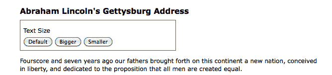

完成我们的代码后，单击“Bigger”和“Smaller”按钮将增加或减小 `<div class="speech">` 的文本大小，而单击“Default”按钮将重置 `<div class="speech">` 的原始文本大小。

# 设置计算的样式属性值

如果我们想要的仅仅是将字体大小一次性更改为预定值，我们仍然可以使用 `.addClass()` 方法。但是，现在假设我们想要每次单击相应按钮时文本都继续递增或递减。虽然可能可以为每次单击定义一个单独的类并对其进行迭代，但更简单的方法是每次通过获取当前大小并增加固定因子（例如，40%）来计算新的文本大小。

我们的代码将以 `$(() => {})` 和 `$('#switcher-large').click()` 事件处理程序开头：

```js
$(() => {
  $('#switcher-large')
    .click((e) => { 

    }); 
}); 

```

列表 4.1

接下来，可以使用 `.css()` 方法轻松发现字体大小：`$('div.speech').css('fontSize')`。然而，返回的值是一个字符串，包含数值字体大小值和该值的单位（`px`）。我们需要去掉单位标签，以便使用数值进行计算。另外，当我们计划多次使用一个 jQuery 对象时，通常最好通过将生成的 jQuery 对象存储在常量中来缓存选择器：

```js
$(() => { 
  const $speech = $('div.speech'); 
  $('#switcher-large')
    .click(() => {
      const num = parseFloat($speech.css('fontSize')); 
    }); 
}); 

```

列表 4.2

`$(() => {})` 内的第一行创建一个包含指向 `<div class="speech">` 的 jQuery 对象的**常量**。注意名称中的美元符号（`$`），`$speech`。由于美元符号是 JavaScript 标识符中的合法字符，我们可以用它来提醒常量是一个 jQuery 对象。与其他编程语言（如 PHP）不同，美元符号在 JavaScript 中没有特殊意义。

使用常量（`const`）而不是变量（`var`）有充分的理由。常量是在 JavaScript 的 ES2015 版本中引入的，它们可以帮助减少某些类型的错误。以我们的 `$speech` 常量为例。它除了 `<div class="speech">` 之外，会持有其他值吗？不会。由于我们声明了这是一个常量，试图给 `$speech` 分配另一个值会导致错误。这些错误很容易修复。如果 `$speech` 被声明为一个变量，并且我们错误地给它分配了一个新值，那么失败将是微妙且难以诊断的。当然，有时我们*需要*能够分配新值，在这种情况下，您将使用一个变量。

在 `.click()` 处理程序内部，我们使用 `parseFloat()` 仅获取字体大小属性的数值部分。`parseFloat()` 函数从左到右查看字符串，直到遇到一个非数字字符为止。数字字符串被转换为浮点数（十进制数）。例如，它会将字符串`'12'`转换为数字`12`。此外，它会从字符串中去除非数字的尾随字符，因此`'12px'`变成了`12`。如果字符串以非数字字符开头，`parseFloat()` 将返回 `NaN`，表示*不是一个数字*。

唯一剩下的就是修改解析出来的数值并根据新值重置字体大小。在我们的示例中，每次点击按钮时，我们将字体大小增加 40%。为此，我们将 `num` 乘以 `1.4`，然后通过连接结果和`'px'`来设置字体大小：

```js
$(() => {
  const $speech = $('div.speech');

  $('#switcher-large')
    .click(() => {
      const num = parseFloat($speech.css('fontSize'));
      $speech.css('fontSize', `${num * 1.4}px`);
    });
}); 

```

清单 4.3

现在，当用户点击“放大”按钮时，文本变大了。再次点击，文本就变得更大了：

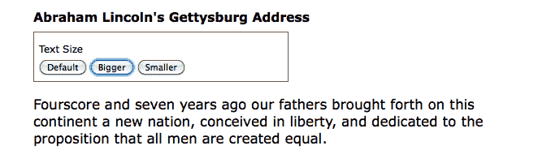

要让“缩小”按钮减小字体大小，我们将使用除法而不是乘法：`num / 1.4`。更好的是，我们将两者合并成一个单一的`.click()`处理程序，适用于`<div id="switcher">`中的所有`<button>`元素。然后，在找到数值之后，我们可以根据被点击的按钮的 ID 来乘以或除以。*清单 4.4* 对此进行了说明。

```js
$(() => {
  const sizeMap = {
    'switcher-small': n => n / 1.4,
    'switcher-large': n => n * 1.4
  };

  const $speech = $('div.speech');

  $('#switcher button')
    .click((e) => {
      const num = parseFloat($speech.css('fontSize'));
      $speech.css(
        'fontSize',
        `${sizeMape.target.id}px`
      );
    });
}); 

```

清单 4.4

`e.target.id` 值用于确定点击事件的行为。`sizeMap` 是存储这些行为的地方。这是一个简单的对象，将元素 ID 映射到一个函数。此函数接收当前的 `fontSize` 值。我们之所以想使用这样的映射，是因为它比编码为 `if` 语句之类的东西更容易添加或删除行为。例如，假设当前的字体大小是`"10px"`，用户点击了“放大”按钮。那么，模板字符串``${sizeMape.target.id}px`` 将导致`"14px"`。

让字体大小恢复到初始值也是很好的。为了让用户能够这样做，我们可以简单地在 DOM 准备就绪时将字体大小存储在一个变量中。然后，每当点击“默认”按钮时，我们就可以恢复这个值。我们只需要向 `sizeMap` 添加另一个函数：

```js
$(() => {
  const sizeMap = {
    'switcher-small': n => n / 1.4,
    'switcher-large': n => n * 1.4,
    'switcher-default': () => defaultSize
  };

  const $speech = $('div.speech');
  const defaultSize = parseFloat($speech.css('fontSize'));

  $('#switcher button')
    .click((e) => {
      const num = parseFloat($speech.css('fontSize'));
      $speech.css(
        'fontSize',
        `${sizeMape.target.id}px`
      );
    });
}); 

```

清单 4.5

注意我们根本不需要更改点击处理程序来适应这种新行为？我们创建了一个名为`defaultSize`的新常量，它将始终保存原始字体大小。然后，我们只需要为`switcher-default` ID 添加一个新函数到 `sizeMap` 中，该函数返回 `defaultSize` 的值。

使用这样的映射，更容易改变我们的点击处理程序行为，而不必维护 `if` 或 `switch` 语句。

# 使用特定于供应商的样式属性

当浏览器供应商引入实验性的样式属性时，通常会在属性名称前加上前缀，直到浏览器的实现与 CSS 规范一致为止。当实现和规范足够稳定时，供应商会去除该前缀，并允许使用标准名称。因此，在样式表中，看到如下一组 CSS 声明是很常见的：

```js
-webkit-property-name: value; 
-moz-property-name: value; 
-ms-property-name: value; 
-o-property-name: value; 
property-name: value; 

```

如果我们想要在 JavaScript 中应用相同的效果，我们需要测试 DOM 版本的这些变化的存在性：`propertyName`、`WebkitPropertyName`、`msPropertyName` 等等。然而，使用 jQuery，我们可以简单地应用标准属性名称，例如 `.css('propertyName', 'value')`。如果在样式对象的属性中找不到该名称，则 jQuery 在幕后循环遍历供应商前缀--`Webkit`、`O`、`Moz` 和 `ms`--并使用找到的第一个作为属性，如果有的话。

# 隐藏和显示元素

基本的 `.hide()` 和 `.show()` 方法，没有任何参数，可以被视为 `.css('display', 'string')` 的智能快捷方式方法，其中 `'string'` 是适当的显示值。效果如预期，匹配的元素集将立即隐藏或显示，没有动画。

`.hide()` 方法将匹配元素集的内联样式属性设置为 `display: none`。这里的巧妙之处在于它记住了显示属性的值--通常是 `block`、`inline` 或 `inline-block`--在改为 `none` 之前的值。相反，`.show()` 方法将匹配元素集的显示属性恢复为在应用 `display: none` 之前的初始值。

显示属性

要了解更多关于 `display` 属性以及它的值在网页中的视觉呈现方式的信息，请访问 Mozilla Developer Center [`developer.mozilla.org/zh-CN/docs/Web/CSS/display`](https://developer.mozilla.org/zh-CN/docs/Web/CSS/display)，并查看示例 [`developer.mozilla.org/samples/cssref/display.html`](https://developer.mozilla.org/samples/cssref/display.html)。

`.show()` 和 `.hide()` 的这个特性在隐藏已在样式表中被覆盖其默认 `display` 属性的元素时尤其有帮助。例如，`<li>` 元素默认具有 `display: list-item` 属性，但我们可能希望将其更改为 `display: inline` 以用于水平菜单。幸运的是，对一个隐藏的元素（比如其中一个 `<li>` 标签）使用 `.show()` 方法不会简单地将其重置为其默认的 `display: list-item`，因为这会将 `<li>` 标签放在自己的一行上。相反，该元素被恢复到其先前的 `display: inline` 状态，从而保持了水平设计。

我们可以通过在示例 HTML 中的第一个段落后添加一个“阅读更多”链接来设置这两种方法的快速演示：

```js
<div class="speech"> 
  <p>Fourscore and seven years ago our fathers brought forth  
       on this continent a new nation, conceived in liberty,  
       and dedicated to the proposition that all men are  
       created equal. 
  </p> 
  <p>Now we are engaged in a great civil war, testing whether  
       that nation, or any nation so conceived and so dedicated,  
       can long endure. We are met on a great battlefield of  
       that war. We have come to dedicate a portion of that  
       field as a final resting-place for those who here gave  
       their lives that the nation might live. It is altogether  
       fitting and proper that we should do this. But, in a  
       larger sense, we cannot dedicate, we cannot consecrate,  
       we cannot hallow, this ground. 
  </p> 
  <a href="#" class="more">read more</a> 
    ... 
</div> 

```

当 DOM 就绪时，我们选择一个元素并对其调用 `.hide()` 方法：

```js
$(() => {
  $('p')
    .eq(1)
    .hide();   
}); 

```

清单 4.6

`.eq()`方法类似于第二章*选择元素*中讨论的`:eq()`伪类。它返回一个 jQuery 对象，指向提供的从零开始的索引处的单个元素。在这种情况下，该方法选择第二个段落并隐藏它，以便在第一个段落后立即显示“阅读更多”链接：

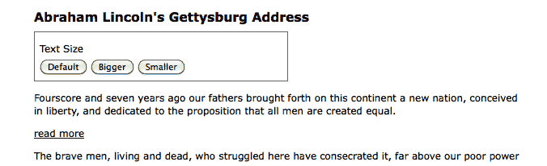

当用户在第一个段落末尾点击“阅读更多”时，我们调用`.show()`来显示第二个段落，并调用`.hide()`来隐藏点击的链接：

```js
$(() => {
  $('p')
    .eq(1)
    .hide();

  $('a.more')
    .click((e) => {
      e.preventDefault();
      $('p')
        .eq(1)
        .show();
      $(e.target)
        .hide();
    });
});

```

清单 4.7

注意使用`.preventDefault()`来阻止链接触发其默认操作。现在演讲看起来像这样：

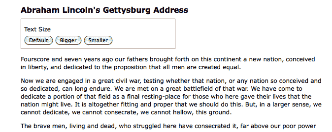

`.hide()`和`.show()`方法快速实用，但并不十分引人注目。为了增添一些风彩，我们可以给它们指定持续时间。

# 效果和持续时间

当我们在`.show()`或`.hide()`中包含持续时间（有时也称为速度）时，它就会变成动画效果——在指定的时间段内发生。例如，`.hide(duration)`方法会逐渐减小元素的高度、宽度和不透明度，直到这三者都达到零，此时将应用 CSS 规则`display: none`。`.show(duration)`方法将增加元素的高度从顶部到底部，宽度从左边到右边，不透明度从 0 到 1，直到其内容完全可见。

# 加速中

使用任何 jQuery 效果时，我们可以使用两种预设速度之一，`'slow'`或`'fast'`。使用`.show('slow')`使显示效果在 600 毫秒（0.6 秒）内完成，`.show('fast')`在 200 毫秒内完成。如果提供了任何其他字符串，jQuery 将使用默认的动画持续时间 400 毫秒。为了更精确地控制，我们可以指定毫秒数，例如`.show(850)`。

让我们在显示亚伯拉罕·林肯的《葛底斯堡演说》第二段时包含一个速度示例：

```js
$(() => {
  $('p')
    .eq(1)
    .hide();

  $('a.more')
    .click((e) => {
      e.preventDefault();
      $('p')
        .eq(1)
        .show('slow');
      $(e.target)
        .hide();
    });
});

```

清单 4.8

当我们大致捕捉到段落在效果中的中间时，我们看到以下内容：

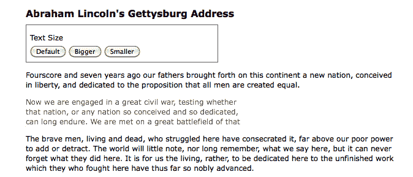

# 淡入和淡出

尽管动画化的`.show()`和`.hide()`方法确实很引人注目，但在实践中，它们会比有用的属性更多地进行动画处理。幸运的是，jQuery 提供了另外几种预定义动画，效果更为微妙。例如，要使整个段落逐渐增加不透明度而出现，我们可以使用`fadeIn('slow')`代替：

```js
$(() => {
  $('p')
    .eq(1)
    .hide();

  $('a.more')
    .click((e) => {
      e.preventDefault();
      $('p')
        .eq(1)
        .fadeIn('slow');
      $(e.target)
        .hide();
    });
});

```

清单 4.9

现在当我们在效果进行时观察段落时，它看起来像这样：

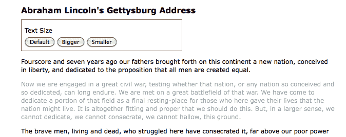

这里的不同之处在于`.fadeIn()`效果首先设置段落的尺寸，使内容可以简单地淡入其中。为了逐渐减少不透明度，我们可以使用`.fadeOut()`。

# 滑动向上和向下

淡入淡出动画对于在文档流之外的项目非常有用。例如，这些是覆盖在页面上的*灯箱*元素上的典型效果。但是，当一个元素是文档流的一部分时，在其上调用`.fadeIn()`会导致文档跳转以提供新元素所需的房地产，这并不美观。

在这些情况下，jQuery 的`.slideDown()`和`.slideUp()`方法是正确的选择。这些效果仅对所选元素的高度进行动画处理。要使我们的段落以垂直滑动效果显示，我们可以调用`.slideDown('slow')`：

```js
$(() => {
  $('p')
    .eq(1)
    .hide();

  $('a.more')
    .click((e) => {
      e.preventDefault();
      $('p')
        .eq(1)
        .slideDown('slow');
      $(e.target)
        .hide();
    });
});

```

列表 4.10

这次当我们检查动画中点的段落时，我们看到以下内容：

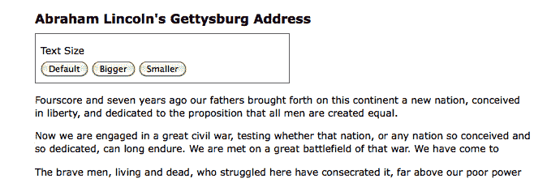

要撤销这种效果，我们将调用`.slideUp()`方法。

# 切换可见性

有时我们需要切换元素的可见性，而不是像之前的示例中一样仅显示它们一次。这种切换可以通过首先检查匹配元素的可见性，然后调用适当的方法来实现。再次使用淡入淡出效果，我们可以修改示例脚本如下：

```js
$(() => {
  const $firstPara = $('p')
    .eq(1)
    .hide();

  $('a.more')
    .click((e) => {
      e.preventDefault();

      if ($firstPara.is(':hidden')) {
        $firstPara.fadeIn('slow');
        $(e.target).text('read less');
      } else {
        $firstPara.fadeOut('slow');
        $(e.target).text('read more');
      }
    });
}); 

```

列表 4.11

正如我们在本章前面所做的那样，我们在这里缓存了我们的选择器，以避免重复的 DOM 遍历。还要注意，我们不再隐藏点击的链接；相反，我们正在更改其文本。

要检查元素包含的文本并更改该文本，我们使用`.text()`方法。我们将在第五章，*操作 DOM*中更深入地探讨此方法。

使用`if-else`语句是切换元素可见性的完全合理的方法。但是，通过 jQuery 的复合效果方法，我们可以从代码中删除一些条件逻辑。jQuery 提供了复合方法`.fadeToggle()`和`.slideToggle()`，它们使用相应的效果显示或隐藏元素。当我们使用`.slideToggle()`方法时，脚本看起来是这样的：

```js
$(() => {
  const $firstPara = $('p')
    .eq(1)
    .hide();

  $('a.more')
    .click((e) => {
      e.preventDefault();

      $firstPara.slideToggle('slow');
      $(e.target)
        .text(
          $(e.target).text() === 'read more' ?
            'read less' : 'read more'
        );
    });
}); 

```

列表 4.12

**三元表达式**（`$(e.target).text() === 'read more' ?`）检查链接的文本而不是第二段落的可见性，因为我们只是用它来更改文本。当我们需要基于某些条件获取值时，我们可以使用三元表达式作为完整的`if`语句的较短替代方法。把三元表达式想象成调用一个函数，根据提供的参数返回不同的值。

# 创建自定义动画

除了预先构建的效果方法外，jQuery 还提供了一个强大的`.animate()`方法，允许我们使用精细的控制创建自己的自定义动画。`.animate()`方法有两种形式。第一种最多接受四个参数：

+   一个包含样式属性和值的对象，与本章前面讨论的`.css()`参数类似

+   一个可选的持续时间，可以是预设字符串之一，也可以是毫秒数

+   可选的缓动类型，这是一个我们现在不会使用的选项，但我们将在第十一章 *高级效果*中讨论它。

+   可选的回调函数，稍后在本章中讨论

总之，这四个参数看起来像这样：

```js
.animate(
  { property1: 'value1', property2: 'value2'},  
  duration,
  easing,
  () => { 
    console.log('The animation is finished.'); 
  } 
); 

```

第二种形式接受两个参数：一个属性对象和一个选项对象：

```js
.animate({properties}, {options}) 

```

在这种形式中，第二个参数将第一种形式的第二到第四个参数包装到另一个对象中，并将一些更高级的选项加入其中。以下是传递实际参数时的第二种形式：

```js
.animate(
  { 
    property1: 'value1',  
    property2: 'value2' 
  },
  { 
    duration: 'value',  
    easing: 'value', 
    specialEasing: { 
      property1: 'easing1', 
      property2: 'easing2' 
    }, 
    complete: () => { 
      console.log('The animation is finished.'); 
    }, 
    queue: true, 
    step: callback 
  }
); 

```

现在，我们将使用`.animate()`方法的第一种形式，但在本章讨论排队效果时，我们将返回到第二种形式。

# 手动构建效果

我们已经看到了几种用于显示和隐藏元素的预包装效果。在讨论`.animate()`方法之前，通过调用`.slideToggle()`使用这个较低级别的接口实现相同的结果将是有用的。用我们的自定义动画替换前面示例中的`.slideToggle()`行非常简单：

```js
$(() => {
  const $firstPara = $('p')
    .eq(1)
    .hide();

  $('a.more')
    .click((e) => {
      e.preventDefault();

      $firstPara.animate({ height: 'toggle' }, 'slow');
      $(e.target)
        .text(
          $(e.target).text() === 'read more' ?
            'read less' : 'read more'
        );
    }); 
}); 

```

列表 4.13

这不是`.slideToggle()`的完美替代品；实际的实现还会动画化元素的边距和填充。

如示例所示，`.animate()`方法提供了用于 CSS 属性的方便的简写值，如`'show'`、`'hide'`和`'toggle'`，以简化当我们想要模拟预包装效果方法如`.slideToggle()`的行为时的过程。

# 同时动画多个属性

使用`.animate()`方法，我们可以同时修改任意组合的属性。例如，要在切换第二段落时创建一个同时滑动和淡出的效果，我们只需将`opacity`添加到传递给`.animate()`的属性中即可：

```js
$(() => {
  const $firstPara = $('p')
    .eq(1)
    .hide();

  $('a.more')
    .click((e) => {
      e.preventDefault();

      $firstPara.animate({
        opacity: 'toggle',
        height: 'toggle'
      }, 'slow');
      $(e.target)
        .text(
          $(e.target).text() === 'read more' ?
            'read less' : 'read more'
        );
    }); 
}); 

```

列表 4.14

另外，我们不仅可以使用简写效果方法中使用的样式属性，还可以使用数值 CSS 属性，例如`left`、`top`、`fontSize`、`margin`、`padding`和`borderWidth`。在*列表 4.5*中，我们改变了段落的文本大小。我们可以通过简单地将`.animate()`方法替换为`.css()`方法来动画化文本大小的增加或减少：

```js
$(() => {
  const sizeMap = {
    'switcher-small': n => n / 1.4,
    'switcher-large': n => n * 1.4,
    'switcher-default': () => defaultSize
  };

  const $speech = $('div.speech');
  const defaultSize = parseFloat($speech.css('fontSize'));

  $('#switcher button')
    .click((e) => {
      const num = parseFloat($speech.css('fontSize'));
      $speech.animate({
        fontSize: `${sizeMape.target.id}px`
      });
    });
}); 

```

列表 4.15

额外的动画属性允许我们创建更复杂的效果。例如，我们可以将一个项目从页面的左侧移动到右侧，同时将其高度增加 20 像素，并将其边框宽度更改为 5 像素。我们将用`<div id="switcher">`框来说明这一复杂的属性动画集。在我们对其进行动画化之前，它是这样的：

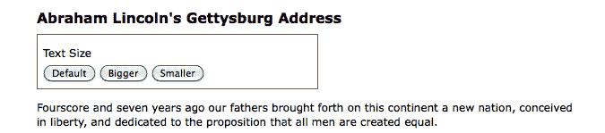

对于具有可伸缩宽度布局，我们需要计算框在与页面右侧对齐之前需要移动的距离。假设段落的宽度是 `100%`，我们可以从段落的宽度中减去“文本大小”框的宽度。我们可以使用 `jQuery.outerWidth()` 方法来计算这些宽度，包括填充和边框。我们将使用此方法来计算 switcher 的新 `left` 属性。为了本例子的目的，我们将通过点击按钮上方的“文本大小”标签来触发动画。下面是代码应该的样子：

```js
$(() => {
  $('div.label')
    .click((e) => {
      const $switcher = $(e.target).parent();
      const paraWidth = $('div.speech p').outerWidth();
      const switcherWidth = $switcher.outerWidth();

      $switcher.animate({
        borderWidth: '5px',
        left: paraWidth - switcherWidth,
        height: '+=20px'
      }, 'slow');
    });
}); 

```

列表 4.16

有必要详细检查这些动画属性。`borderWidth` 属性很直接，因为我们正在指定一个带单位的常量值，就像在样式表中一样。`left` 属性是一个计算出的数字值。在这些属性上，单位后缀是可选的；因为我们在这里省略了它，所以假定为 `px`。最后，`height` 属性使用了我们之前未见过的语法。在属性值上的 `+=` 前缀表示相对值。所以，不是将高度动画变为 `20` 像素，而是将高度动画变为当前高度的 `20` 像素更高。由于涉及到特殊字符，相对值必须指定为字符串。

尽管此代码成功增加了 `<div>` 标签的高度并扩大了其边框，但是目前，`left` 位置似乎未更改：

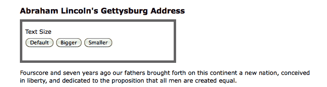

我们仍然需要在 CSS 中启用更改此框的位置。

# 使用 CSS 进行定位

在使用 `.animate()` 时，重要的是要记住 CSS 对我们希望更改的元素施加的限制。例如，调整 `left` 属性对匹配元素没有影响，除非这些元素的 CSS 位置设置为 `relative` 或 `absolute`。所有块级元素的默认 CSS 位置都是 `static`，这准确描述了如果我们在先更改它们的 `position` 值之前尝试移动它们，这些元素将保持不变的方式。

有关绝对和相对定位的更多信息，请参阅 CSS 技巧：[`css-tricks.com/almanac/properties/p/position/`](https://css-tricks.com/almanac/properties/p/position/)。

在我们的样式表中，我们可以将 `<div id="switcher">` 设置为相对定位：

```js
#switcher { 
  position: relative; 
} 

```

不过，让我们通过在需要时通过 JavaScript 更改此属性来练习我们的 jQuery 技能：

```js
$(() =>
  $('div.label')
    .click((e) => {
      const $switcher = $(e.target).parent();
      const paraWidth = $('div.speech p').outerWidth();
      const switcherWidth = $switcher.outerWidth();

      $switcher
        .css('position', 'relative')
        .animate({
          borderWidth: '5px',
          left: paraWidth - switcherWidth,
          height: '+=20px'
        }, 'slow');
    });
}); 

```

列表 4.17

考虑了 CSS 后，在动画完成后点击“文本大小”后的结果如下：

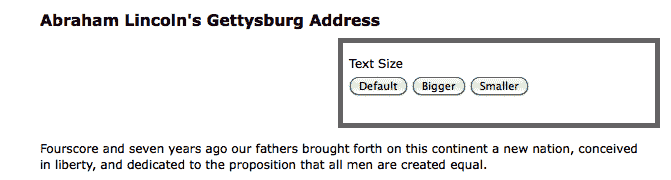

# 同时执行与顺序执行的效果

正如我们刚刚发现的那样，`.animate()` 方法对影响特定一组元素的**同时**效果非常有用。然而，有时候我们想要**排队**我们的效果，以便它们一个接一个地发生。

# 使用单组元素

当对同一组元素应用多个效果时，通过链接这些效果可以轻松实现排队。为了演示这种排队，我们将通过将文本大小框移动到右侧，增加其高度和边框宽度来重新访问*列表 4.17*。但是，这次，我们只需将每个效果放在自己的`.animate()`方法中，并将三者链接在一起，便可以依次执行三个效果：

```js
$(() => {
  $('div.label')
    .click((e) => {
      const $switcher = $(e.target).parent();
      const paraWidth = $('div.speech p').outerWidth();
      const switcherWidth = $switcher.outerWidth();

      $switcher
        .css('position', 'relative')
        .animate({ borderWidth: '5px' }, 'slow')
        .animate({ left: paraWidth - switcherWidth }, 'slow')
        .animate({ height: '+=20px' }, 'slow');
    }); 
}); 

```

列表 4.18

请记住，链式调用允许我们将所有三个`.animate()`方法保持在同一行上，但是在这里，我们将它们缩进并将每个方法放在自己的一行上以提高可读性。

我们可以通过链接它们来对 jQuery 效果方法中的任何一个进行排队，而不仅仅是`.animate()`。例如，我们可以按照以下顺序对`<div id="switcher">`上的效果进行排队：

1.  使用`.fadeTo()`将其不透明度淡化为 0.5。

1.  使用`.animate()`将其移到右侧。

1.  使用`.fadeTo()`将其淡回完全不透明。

1.  使用`.slideUp()`将其隐藏。

1.  使用`.slideDown()`再次显示它。

我们需要做的就是按照代码中相同的顺序链接效果：

```js
$(() => {
  $('div.label')
    .click((e) => {
      const $switcher = $(e.target).parent();
      const paraWidth = $('div.speech p').outerWidth();
      const switcherWidth = $switcher.outerWidth();

      $switcher
        .css('position', 'relative')
        .fadeTo('fast', 0.5)
        .animate({ left: paraWidth - switcherWidth }, 'slow')
        .fadeTo('slow', 1.0)
        .slideUp('slow')
        .slideDown('slow');
    }); 
}); 

```

列表 4.19

# 绕过队列

但是，如果我们想要在淡入到半透明度的同时将`<div>`标签移到右侧怎么办？如果两个动画的速度相同，我们可以简单地将它们合并为一个`.animate()`方法。但是，在这个例子中，淡出使用了'快'速度，而移到右侧则使用了'慢'速度。这就是第二种形式的`.animate()`方法派上用场的地方：

```js
$(() => {
  $('div.label')
    .click((e) => {
      const $switcher = $(e.target).parent();
      const paraWidth = $('div.speech p').outerWidth();
      const switcherWidth = $switcher.outerWidth();

      $switcher
        .css('position', 'relative')
        .fadeTo('fast', 0.5)
        .animate(
          { left: paraWidth - switcherWidth },
          { duration: 'slow', queue: false }
        )
        .fadeTo('slow', 1.0)
        .slideUp('slow')
        .slideDown('slow');
    }); 
}); 

```

列表 4.20

第二个参数，一个选项对象，提供了`queue`选项，当设置为`false`时，使动画与前一个动画同时开始。如果你考虑一下，这是有道理的，因为任何在队列中的东西都必须等待已经在队列中的东西。

# 手动排队效果

关于单一元素队列效应的最后观察是，排队不会自动应用于其他非效果方法，例如`.css()`。所以，假设我们想在`.slideUp()`方法之后但在`slideDown()`方法之前将`<div id="switcher">`的背景颜色更改为红色。

我们可以尝试这样做：

```js
$(() => {
  $('div.label')
    .click((e) => {
      const $switcher = $(e.target).parent();
      const paraWidth = $('div.speech p').outerWidth();
      const switcherWidth = $switcher.outerWidth();

      $switcher
        .css('position', 'relative')
        .fadeTo('fast', 0.5)
        .animate(
          { left: paraWidth - switcherWidth },
          { duration: 'slow', queue: false }
        )
        .fadeTo('slow', 1.0)
        .slideUp('slow')
        .css('backgroundColor', '#f00')
        .slideDown('slow');
    }); 
}); 

```

列表 4.21

然而，尽管改变背景颜色的代码被放置在链中的正确位置，但它会立即在点击时发生。

我们可以使用名为`.queue()`的方法将非效果方法添加到队列中。以下是在我们的示例中的样子：

```js
$(() => {
  $('div.label')
    .click((e) => {
      const $switcher = $(e.target).parent();
      const paraWidth = $('div.speech p').outerWidth();
      const switcherWidth = $switcher.outerWidth();

      $switcher
        .css('position', 'relative')
        .fadeTo('fast', 0.5)
        .animate(
          { left: paraWidth - switcherWidth },
          { duration: 'slow', queue: false }
        )
        .fadeTo('slow', 1.0)
        .slideUp('slow')
        .queue((next) => {
          $switcher.css('backgroundColor', '#f00');
          next();
        })
        .slideDown('slow');
    }); 
}); 

```

列表 4.22

当即将执行一个回调函数时，`.queue()`方法将该函数添加到要对匹配元素执行的效果队列中。在函数内部，我们将背景颜色设置为红色，然后调用`next()`，这是一个作为参数传递给我们的回调函数的函数。包含这个`next()`函数调用允许动画队列从断点恢复，并用后续的`.slideDown('slow')`行完成链条。如果我们没有调用`next()`，动画将停止。

有关`.queue()`的更多信息和示例，请访问[`api.jquery.com/category/effects/`](http://api.jquery.com/category/effects/)。

当我们研究对多组元素进行效果处理时，我们将发现另一种在非效果方法中排队的方法。

# 处理多组元素

与单一元素不同，当我们对不同的元素集应用效果时，它们几乎同时发生。为了看到这些同时发生的效果，我们将把一个段落向下滑动，同时将另一个段落向上滑动。我们将处理我们示例文档中的第三段和第四段：

```js
<p>Fourscore and seven years ago our fathers brought forth 
   on this continent a new nation, conceived in liberty, 
   and dedicated to the proposition that all men are 
   created equal.</p> 
<p>Now we are engaged in a great civil war, testing whether 
   that nation, or any nation so conceived and so 
   dedicated, can long endure. We are met on a great 
   battlefield of that war. We have come to dedicate a 
   portion of that field as a final resting-place for those 
   who here gave their lives that the nation might live. It 
   is altogether fitting and proper that we should do this. 
   But, in a larger sense, we cannot dedicate, we cannot 
   consecrate, we cannot hallow, this ground.</p> 
<a href="#" class="more">read more</a> 
<p>The brave men, living and dead, who struggled here have 
   consecrated it, far above our poor power to add or 
   detract. The world will little note, nor long remember, 
   what we say here, but it can never forget what they did 
   here. It is for us the living, rather, to be dedicated 
   here to the unfinished work which they who fought here 
   have thus far so nobly advanced.</p> 
<p>It is rather for us to be here dedicated to the great 
   task remaining before us&mdash;that from these honored 
   dead we take increased devotion to that cause for which 
   they gave the last full measure of devotion&mdash;that 
   we here highly resolve that these dead shall not have 
   died in vain&mdash;that this nation, under God, shall 
   have a new birth of freedom and that government of the 
   people, by the people, for the people, shall not perish 
   from the earth.</p> 

```

为了帮助我们看到效果的发生过程，我们将给第三段添加 1 像素的边框，将第四段添加灰色背景。此外，在 DOM 准备就绪时，我们将隐藏第四段：

```js
$(() => {
  $('p')
    .eq(2)
    .css('border', '1px solid #333');
  $('p')
    .eq(3)
    .css('backgroundColor', '#ccc')
    .hide(); 
}); 

```

列表 4.23

我们的示例文档现在显示了开头段落，然后是阅读更多链接和有边框的段落：

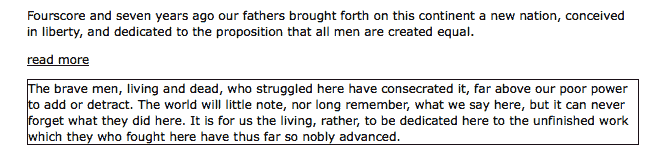

最后，我们将在第三段应用一个`click`处理程序，这样当单击它时，第三段将向上滑动（最终滑出视野），而第四段将向下滑动（并进入视野）：

```js
$(() => { 
  $('p')
    .eq(2)
    .css('border', '1px solid #333')
    .click((e) => {
      $(e.target)
        .slideUp('slow')
        .next()
        .slideDown('slow');
    });
  $('p')
    .eq(3)
    .css('backgroundColor', '#ccc')
    .hide();
}); 

```

列表 4.24

在滑动中截取这两个效果的屏幕截图证实它们的确是同时发生的：

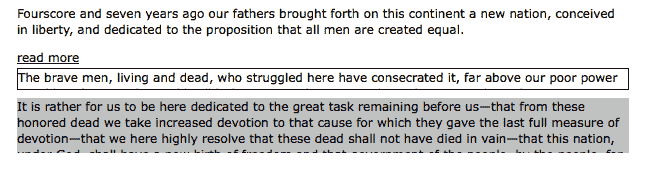

第三段开始是可见的，正在向上滑动，与此同时第四段，开始是隐藏的，正在向下滑动。

# 使用回调函数排队

为了允许在不同元素上排队效果，jQuery 为每个效果方法提供了一个回调函数。正如我们在事件处理程序和`.queue()`方法中所看到的，回调函数只是作为方法参数传递的函数。至于效果，它们出现在方法的最后一个参数中。

如果我们使用一个回调将这两个滑动效果排队，我们可以让第四段在第三段之前滑下来。让我们先尝试将`.slideUp()`调用移到`.slideDown()`方法的完成回调中：

```js
$(() => { 
  $('p')
    .eq(2)
    .css('border', '1px solid #333')
    .click((e) => {
      $(e.target)
        .next()
        .slideDown('slow', () => {
          $(e.target).slideUp('slow');
        });
    });
  $('p')
    .eq(3)
    .css('backgroundColor', '#ccc')
    .hide();
}); 

```

列表 4.25

如果我们决定在`click()`回调函数和`slideDown()`回调函数中都使用`$(this)`，事情将不会按预期进行。因为`this`是有上下文的。相反，我们可以完全避免它，并引用`$(e.target)`来获取我们需要的`<p>`元素。

这一次，在效果进行一半的快照中，第三段和第四段都是可见的；第四段已经滑动下来，第三段即将开始滑动上去：

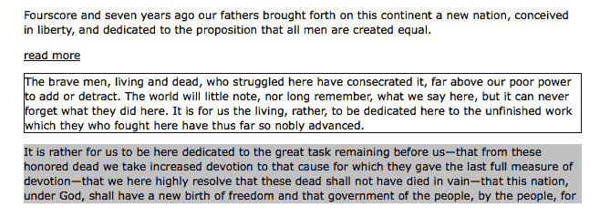

现在我们已经讨论了回调函数，我们可以返回到*清单 4.22*中的代码，其中我们在一系列效果的最后排队更改了背景颜色。与当时所做的一样，我们可以简单地使用回调函数，而不是使用`.queue()`方法：

```js
$(() => {
  $('div.label')
    .click((e) => {
      const $switcher = $(e.target).parent();
      const paraWidth = $('div.speech p').outerWidth();
      const switcherWidth = $switcher.outerWidth();

      $switcher
        .css('position', 'relative')
        .fadeTo('fast', 0.5)
        .animate(
          { left: paraWidth - switcherWidth },
          { duration: 'slow', queue: false }
        )
        .fadeTo('slow', 1.0)
        .slideUp('slow', () => {
          $switcher.css('backgroundColor', '#f00');
        })
        .slideDown('slow');
    });
}); 

```

清单 4.26

再次说明，在`<div id="switcher">`滑动上升之后和滑动回落之前，背景色会变为红色。请注意，当使用效果的完成回调而不是`.queue()`时，我们不需要担心在回调中调用`next()`。

# 简而言之

考虑到应用效果时的各种变化，记住效果是同时还是顺序发生可能变得困难。简要的大纲可能会有所帮助。

单一元素集上的效果是：

+   将多个属性同时应用于单个`.animate()`方法时

+   在方法链中应用时排队，除非将 `queue` 选项设置为 `false`

多个元素集上的效果是：

+   默认情况下同时进行

+   在另一个效果的回调中应用时或者在`.queue()`方法的回调中应用时排队

# 摘要

使用本章中探讨的效果方法，我们现在应该能够从 JavaScript 修改内联样式属性，将预包装的 jQuery 效果应用于元素，并创建我们自己的自定义动画。特别是，您学会了如何逐步增加和减小文本大小，使用`.css()` 或 `.animate()` 方法，通过修改多个属性逐渐隐藏和显示页面元素，以及如何以多种方式动画元素（同时或顺序）。

在本书的前四章中，我们的所有示例都涉及到操纵硬编码到页面 HTML 中的元素。在第五章，*操作 DOM* 中，我们将探讨直接操作 DOM 的方法，包括使用 jQuery 创建新元素并将其插入到我们选择的 DOM 中。

# 进一步阅读

动画主题将在第十一章，*高级效果* 中详细探讨。本书附录 B 中提供了完整的效果和样式方法列表，或者在官方 jQuery 文档[`api.jquery.com/`](http://api.jquery.com/) 中提供。

# 练习

挑战练习可能需要使用官方 jQuery 文档[`api.jquery.com/`](http://api.jquery.com/)：

1.  修改样式表以最初隐藏页面内容。当页面加载时，逐渐淡入内容。

1.  只有当鼠标悬停在段落上时，才给每个段落添加黄色背景。

1.  点击标题`(<h2>)`，同时将其淡出至 25%的不透明度，并将其左边距增加到`20px`。然后，当此动画完成时，将演讲文本淡出至 50%的不透明度。

1.  这里有一个挑战给你。通过平滑地移动开关框，对箭头键的按键作出反应，向相应方向移动 20 像素。箭头键的键码分别为：`37`（左）、`38`（上）、`39`（右）和`40`（下）。
