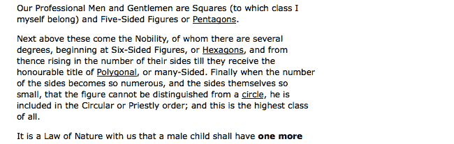

# 第五章：操纵 DOM

Web 经验是 Web 服务器和 Web 浏览器之间的合作伙伴关系。传统上，生成可供浏览器使用的 HTML 文档一直是服务器的职责。我们在本书中看到的技术略微改变了这种安排，使用 CSS 技术实时改变 HTML 文档的外观。但要真正发挥我们的 JavaScript 实力，你需要学会修改文档本身。

在本章中，我们将涵盖：

+   使用**文档对象模型**（**DOM**）提供的接口修改文档

+   在页面上创建元素和文本

+   移动或删除元素

+   通过添加、删除或修改属性和属性，转换文档

# 操纵属性和属性

在本书的前四章中，我们一直在使用`.addClass()`和`.removeClass()`方法来演示如何在页面上更改元素的外观。尽管我们非正式地讨论了这些方法，提到了操纵`class`属性，但 jQuery 实际上修改了一个名为`className`的 DOM 属性。`.addClass()`方法创建或添加到该属性，而`.removeClass()`删除或缩短它。再加上`.toggleClass()`方法，它在添加和删除类名之间切换，我们就有了一种高效而健壮的处理类的方式。这些方法特别有帮助，因为它们在元素上添加类时避免了添加已经存在的类（所以我们不会得到`<div class="first first">`，例如），并且正确处理应用于单个元素的多个类的情况，例如`<div class="first second">`。

# 非类属性

我们可能需要不时访问或更改其他几个属性或属性。对于操纵诸如`id`、`rel`和`href`之类的属性，jQuery 提供了`.attr()`和`.removeAttr()`方法。这些方法使更改属性变得简单。此外，jQuery 还允许我们一次修改多个属性，类似于我们使用`.css()`方法在第四章*样式和动画*中处理多个 CSS 属性的方式。

例如，我们可以轻松地一次设置链接的`id`、`rel`和`title`属性。让我们从一些示例 HTML 开始：

```js
<h1 id="f-title">Flatland: A Romance of Many Dimensions</h1> 
<div id="f-author">by Edwin A. Abbott</div> 
<h2>Part 1, Section 3</h2> 
<h3 id="f-subtitle"> 
   Concerning the Inhabitants of Flatland 
</h3> 
<div id="excerpt">an excerpt</div> 
<div class="chapter"> 
  <p class="square">Our Professional Men and Gentlemen are 
    Squares (to which class I myself belong) and Five-Sided  
    Figures or <a  
    href="http://en.wikipedia.org/wiki/Pentagon">Pentagons 
    </a>. 
  </p> 
  <p class="nobility hexagon">Next above these come the  
    Nobility, of whom there are several degrees, beginning at  
    Six-Sided Figures, or <a  
    href="http://en.wikipedia.org/wiki/Hexagon">Hexagons</a>,  
    and from thence rising in the number of their sides till  
    they receive the honourable title of <a  
    href="http://en.wikipedia.org/wiki/Polygon">Polygonal</a>,  
    or many-Sided. Finally when the number of the sides  
    becomes so numerous, and the sides themselves so small,  
    that the figure cannot be distinguished from a <a  
    href="http://en.wikipedia.org/wiki/Circle">circle</a>, he  
    is included in the Circular or Priestly order; and this is  
    the highest class of all. 
  </p> 
  <p><span class="pull-quote">It is a <span class="drop">Law  
    of Nature</span> with us that a male child shall have  
    <strong>one more side</strong> than his father</span>, so  
    that each generation shall rise (as a rule) one step in  
    the scale of development and nobility. Thus the son of a  
    Square is a Pentagon; the son of a Pentagon, a Hexagon;  
    and so on. 
  </p> 
<!-- . . . code continues . . . --> 
</div> 

```

获取示例代码

您可以从以下 GitHub 存储库访问示例代码：[`github.com/PacktPublishing/Learning-jQuery-3`](https://github.com/PacktPublishing/Learning-jQuery-3)。

现在，我们可以迭代`<div class="chapter">`内的每个链接，并逐个应用属性。如果我们需要为所有链接设置单个属性值，我们可以在我们的`$(() => {})`处理程序中用一行代码完成：

```js
$(() => {
  $('div.chapter a').attr({ rel: 'external' });
});

```

列表 5.1

就像`.css()`方法一样，`.attr()`也可以接受一对参数，第一个指定属性名，第二个是其新值。不过，更典型的是，我们提供一个键值对的对象，就像在 *清单 5.1* 中所做的那样。以下语法允许我们轻松地扩展我们的示例以一次修改多个属性：

```js
$(() => {
  $('div.chapter a')
    .attr({
      rel: 'external',
      title: 'Learn more at Wikipedia'
    });
});

```

清单 5.2

# 值回调

将一个简单对象传递给`.attr()`是一个直接的技巧，当我们希望每个匹配的元素具有相同的值时，它就足够了。然而，通常情况下，我们添加或更改的属性必须每次具有不同的值。一个常见的例子是，对于任何给定的文档，如果我们希望我们的 JavaScript 代码表现可预测，那么每个`id`值必须是唯一的。为每个链接设置唯一的`id`值，我们可以利用 jQuery 方法的另一个特性，如`.css()`和`.each()`--**值回调**。

值回调只是一个提供给参数的函数，而不是值。然后，对匹配集合中的每个元素调用此函数一次。从函数返回的任何数据都将用作属性的新值。例如，我们可以使用以下技术为每个元素生成不同的`id`值：

```js
$(() => {
  $('div.chapter a')
    .attr({
      rel: 'external',
      title: 'Learn more at Wikipedia',
      id: index => `wikilink-${index}`
    });
});

```

清单 5.3

每次调用我们的值回调时，都会传递一个整数，指示迭代计数；在这里，我们正在使用它为第一个链接赋予一个`id`值`wikilink-0`，第二个`wikilink-1`，依此类推。

我们正在使用`title`属性邀请人们在维基百科了解更多有关链接术语的信息。到目前为止，我们使用的 HTML 标签中，所有链接都指向维基百科。但是，为了考虑到其他类型的链接，我们应该使选择器表达式更具体一些：

```js
$(() => {
  $('div.chapter a[href*="wikipedia"]')
    .attr({
      rel: 'external',
      title: 'Learn more at Wikipedia',
      id: index => `wikilink-${index}`
    });
});

```

清单 5.4

要完成我们对`.attr()`方法的介绍，我们将增强这些链接的`title`属性，使其更具体地描述链接目标。再次，值回调是完成工作的正确工具：

```js
$(() => {
  $('div.chapter a[href*="wikipedia"]')
    .attr({
      rel: 'external',
      title: function() {
        return `Learn more about ${$(this).text()} at Wikipedia.`;
      },
      id: index => `wikilink-${index}`
    });
});

```

清单 5.5

这次我们利用了值回调的上下文。就像事件处理程序一样，关键字`this`每次调用回调时都指向我们正在操作的 DOM 元素。在这里，我们将元素包装在一个 jQuery 对象中，以便我们可以使用`.text()`方法（在第四章中介绍的 *Styling and Animating*）来检索链接的文本内容。这使得每个链接标题与其他链接不同，如下面的屏幕截图所示：


# 数据属性

HTML5 数据属性允许我们将任意数据值附加到页面元素。然后，我们的 jQuery 代码可以使用这些值，以及修改它们。使用数据属性的原因是我们可以将控制它们的显示和行为的 DOM 属性与特定于我们的应用程序的数据分开。

使用`data()` jQuery 方法来读取数据值并更改数据值。让我们添加一些新功能，允许用户通过点击来标记段落为已读。我们还需要一个复选框，用于隐藏已标记为已读的段落。我们将使用数据属性来帮助我们记住哪些段落已标记为已读：

```js
$(() => {
  $('#hide-read')
    .change((e) => {
      if ($(e.target).is(':checked')) {
        $('.chapter p')
          .filter((i, p) => $(p).data('read'))
          .hide();
      } else {
        $('.chapter p').show();
      }
    });

  $('.chapter p')
    .click((e) => {
      const $elm = $(e.target);

      $elm
        .css(
          'textDecoration',
          $elm.data('read') ? 'none' : 'line-through'
        )
        .data('read', !$(e.target).data('read'));
    });
});

```

列表 5.6

当您单击段落时，文本将被标记为已读：


正如您所看到的，点击事件处理程序在段落被点击时改变其视觉外观。但处理程序还做了其他事情--它切换了元素的`read`数据：`data('read', !$(e.target).data('read'))`。这让我们能够以一种不干扰我们可能设置的其他 HTML 属性的方式将应用程序特定的数据与元素绑定。

隐藏已读段落复选框的更改处理程序寻找具有此数据的段落。`filter((i, p) => $(p).data('read'))`调用只会返回具有值为`true`的`read`数据属性的段落。我们现在能够根据特定的应用程序数据来过滤元素。以下是隐藏已读段落后页面的外观：


我们将在本书的后期重新讨论一些使用 jQuery 处理数据的高级用法。

# DOM 元素属性

正如前面提到的，HTML **属性** 和 DOM **属性** 之间存在微妙的区别。属性是页面 HTML 源代码中用引号括起来的值，而属性是 JavaScript 访问时的值。我们可以在 Chrome 等开发者工具中轻松观察属性和属性：


Chrome 开发者工具的元素检查器向我们展示了高亮显示的`<p>`元素具有名为`class`的属性，其值为`square`。在右侧面板中，我们可以看到该元素具有一个名为`className`的对应属性，其值为`square`。这说明了属性及其等效属性具有不同名称的情况之一。

在大多数情况下，属性和属性在功能上是可以互换的，并且 jQuery 会为我们处理命名不一致性。然而，有时我们确实需要注意两者之间的区别。一些 DOM 属性，如`nodeName`，`nodeType`，`selectedIndex`和`childNodes`，没有等效的属性，因此无法通过`.attr()`访问。此外，数据类型可能不同：例如，`checked`属性具有字符串值，而`checked`属性具有布尔值。对于这些布尔属性，最好测试和设置*属性*而不是*属性*，以确保跨浏览器行为的一致性。

我们可以使用`.prop()`方法从 jQuery 获取和设置属性：

```js
// Get the current value of the "checked" property 
const currentlyChecked = $('.my-checkbox').prop('checked'); 

// Set a new value for the "checked" property 
$('.my-checkbox').prop('checked', false); 

```

`.prop()`方法具有与`.attr()`相同的所有功能，例如接受一次设置多个值的对象和接受值回调函数。

# 表单控件的值

在尝试获取或设置表单控件的值时，属性和属性之间最麻烦的差异也许就是最为令人头疼的。对于文本输入，`value`属性等同于`defaultValue`属性，而不是`value`属性。对于`select`元素，通常通过元素的`selectedIndex`属性或其`option`元素的`selected`属性来获取值。

由于这些差异，我们应该避免使用`.attr()`——在`select`元素的情况下，甚至避免使用`.prop()`——来获取或设置表单元素的值。相反，我们可以使用 jQuery 为这些场合提供的`.val()`方法：

```js
// Get the current value of a text input 
const inputValue = $('#my-input').val(); 
// Get the current value of a select list 
const selectValue = $('#my-select').val(); 
//Set the value of a single select list 
$('#my-single-select').val('value3'); 
// Set the value of a multiple select list 
$('#my-multi-select').val(['value1', 'value2']); 

```

与`.attr()`和`.prop()`一样，`.val()`方法可以接受一个函数作为其设置器参数。借助其多功能的`.val()`方法，jQuery 再次让 Web 开发变得更加容易。

# DOM 树操作

`.attr()`和`.prop()`方法是非常强大的工具，借助它们，我们可以对文档进行有针对性的更改。尽管如此，我们仍然没有看到如何更改文档的整体结构。要真正操作 DOM 树，你需要更多地了解位于`jQuery`库核心的函数。

# `$()`函数再探讨

从本书的开头，我们一直在使用`$()`函数来访问文档中的元素。正如我们所见，这个函数充当了一个工厂的角色，产生了指向由 CSS 选择器描述的元素的新的 jQuery 对象。

`$()`函数的功能远不止于此。它还可以改变页面的内容。只需将一小段 HTML 代码传递给函数，我们就可以创建一个全新的 DOM 结构。

辅助功能提醒

我们应该再次牢记，将某些功能、视觉吸引力或文本信息仅提供给那些能够（并启用了）使用 JavaScript 的 Web 浏览器的人，存在固有的危险。重要信息应该对所有人可访问，而不仅仅是那些使用正确软件的人。

# 创建新元素

常见于 FAQ 页面的功能之一是在每个问题和答案对之后显示返回顶部链接。可以说这些链接没有任何语义作用，因此它们可以通过 JavaScript 合法地作为页面访问者子集的增强功能。在我们的示例中，我们将在每个段落后面添加一个返回顶部链接，以及返回顶部链接将指向的锚点。首先，我们简单地创建新元素：

```js
$(() => {
  $('<a href="#top">back to top</a>'); 
  $('<a id="top"></a>'); 
}); 

```

列表 5.7

我们在第一行代码中创建了一个返回顶部链接，在第二行创建了链接的目标锚点。然而，页面上还没有出现返回顶部的链接。



虽然我们编写的两行代码确实创建了元素，但它们还没有将元素添加到页面上。我们需要告诉浏览器这些新元素应该放在哪里。为此，我们可以使用众多 jQuery **插入方法**之一。

# 插入新元素

`jQuery` 库有许多可用于将元素插入文档的方法。每个方法都规定了新内容与现有内容的关系。例如，我们希望我们的返回顶部链接出现在每个段落后面，因此我们将使用适当命名的 `.insertAfter()` 方法来实现这一点：

```js
$(() => { 
  $('<a href="#top">back to top</a>')
    .insertAfter('div.chapter p'); 
  $('<a id="top"></a>'); 
}); 

```

列表 5.8

因此，现在我们实际上已经将链接插入到页面中（并插入到 DOM 中），它们将出现在 `<div class="chapter">` 中的每个段落之后：


请注意，新链接出现在自己的一行上，而不是在段落内部。这是因为 `.insertAfter()` 方法及其对应的 `.insertBefore()` 方法会在指定元素*外部*添加内容。

不幸的是，链接还不能使用。我们仍然需要插入带有 `id="top"` 的锚点。这一次，我们将使用一个在其他元素*内部*插入元素的方法：

```js
$(() => { 
  $('<a href="#top">back to top</a>')
    .insertAfter('div.chapter p'); 
  $('<a id="top"></a>')
    .prependTo('body'); 
}); 

```

列表 5.9

这段额外的代码将锚点插入在 `<body>` 标签的开头；换句话说，位于页面顶部。现在，使用链接的 `.insertAfter()` 方法和锚点的 `.prependTo()` 方法，我们有了一个完全功能的返回顶部链接集合。

一旦我们添加了相应的 `.appendTo()` 方法，我们现在就有了一个完整的选项集，用于在其他元素之前和之后插入新元素：

+   `.insertBefore()`: 在现有元素之外并且在其*前面*添加内容

+   `.prependTo()`: 在现有元素之内并且在其*前面*添加内容

+   `.appendTo()`: 在现有元素之内并且在其*后面*添加内容

+   `.insertAfter()`: 在现有元素之外并且在其*后面*添加内容

# 移动元素

在添加返回顶部链接时，我们创建了新的元素并将它们插入到页面中。还可以将页面上的元素从一个地方移动到另一个地方。这种插入的实际应用是动态放置和格式化脚注。一个脚注已经出现在我们用于此示例的原始 *Flatland* 文本中，但为了演示目的，我们还将指定文本的另外几部分作为脚注：

```js
<p>How admirable is the Law of Compensation! <span     
   class="footnote">And how perfect a proof of the natural  
   fitness and, I may almost say, the divine origin of the  
   aristocratic constitution of the States of Flatland!</span> 
   By a judicious use of this Law of Nature, the Polygons and  
   Circles are almost always able to stifle sedition in its  
   very cradle, taking advantage of the irrepressible and  
   boundless hopefulness of the human mind.&hellip; 
</p> 

```

我们的 HTML 文档包含三个脚注；上一个段落包含一个示例。脚注文本位于段落文本内部，使用 `<span class="footnote"></span>` 进行分隔。通过以这种方式标记 HTML 文档，我们可以保留脚注的上下文。样式表中应用的 CSS 规则使脚注变为斜体，因此受影响的段落最初看起来像下面这样：


现在，我们需要抓取脚注并将它们移动到文档底部。具体来说，我们将它们插入在`<div class="chapter">`和`<div id="footer">`之间。

请记住，即使在隐式迭代的情况下，处理元素的顺序也是精确定义的，从 DOM 树的顶部开始并向下工作。由于在页面上保持脚注的正确顺序很重要，我们应该使用`.insertBefore('#footer')`。这将使每个脚注直接放在`<div id="footer">`元素之前，以便第一个脚注放在`<div class="chapter">`和`<div id="footer">`之间，第二个脚注放在第一个脚注和`<div id="footer">`之间，依此类推。另一方面，使用`.insertAfter('div.chapter')`会导致脚注以相反的顺序出现。

到目前为止，我们的代码看起来像下面这样：

```js
$(() => { 
  $('span.footnote').insertBefore('#footer'); 
}); 

```

图 5.10

脚注位于`<span>`标签中，默认情况下显示为内联，一个紧挨着另一个，没有分隔。但是，我们在 CSS 中已经预料到了这一点，在`span.footnote`元素处于`<div class="chapter">`之外时，给予了`display`值为`block`。因此，脚注现在开始成形：


现在，脚注已经位于正确的位置，但是仍然有很多工作可以做。一个更健壮的脚注解决方案应该执行以下操作：

1.  对每个脚注编号。

1.  使用脚注的编号标记从文本中提取每个脚注的位置。

1.  从文本位置创建到其匹配脚注的链接，并从脚注返回到从文本中提取每个脚注的位置，使用脚注的编号。

# 包装元素

为了给脚注编号，我们可以在标记中显式添加数字，但是在这里我们可以利用标准的有序列表元素，它会为我们自动编号。为此，我们需要创建一个包含所有脚注的`<ol>`元素和一个单独包含每个脚注的`<li>`元素。为了实现这一点，我们将使用**包装方法**。

在将元素包装在另一个元素中时，我们需要明确我们是想让每个元素都包装在自己的容器中，还是所有元素都包装在一个单一的容器中。对于我们的脚注编号，我们需要两种类型的包装器：

```js
$(() => {
  $('span.footnote') 
    .insertBefore('#footer') 
    .wrapAll('<ol id="notes"></ol>') 
    .wrap('<li></li>'); 
}); 

```

图 5.11

一旦我们在页脚之前插入了脚注，我们就使用`.wrapAll()`将整个集合包装在一个单独的`<ol>`元素内。然后，我们继续使用`.wrap()`将每个单独的脚注包装在其自己的`<li>`元素内。我们可以看到这样创建了正确编号的脚注：


现在，我们已经准备好标记并编号我们提取脚注的位置。为了以简单直接的方式做到这一点，我们需要重写我们现有的代码，使其不依赖于隐式迭代。

# 显式迭代

`.each()`方法充当**显式迭代器**，与最近添加到 JavaScript 语言中的`forEach`数组迭代器非常相似。当我们想要对匹配的每个元素使用的代码过于复杂时，可以使用`.each()`方法。它接受一个回调函数，该函数将对匹配集合中的每个元素调用一次。

```js
$(() => { 
  const $notes = $('<ol id="notes"></ol>')
    .insertBefore('#footer');

  $('span.footnote')
    .each((i, span) => {
      $(span)
        .appendTo($notes)
        .wrap('<li></li>');
    });
}); 

```

**清单 5.12**

我们这里的更改动机很快就会变得清晰。首先，我们需要了解传递给我们的`.each()`回调的信息。

在*清单 5.12*中，我们使用`span`参数创建一个指向单个脚注`<span>`的 jQuery 对象，然后将该元素追加到脚注 `<ol>` 中，最后将脚注包装在一个 `<li>` 元素中。

为了标记从中提取脚注的文本位置，我们可以利用`.each()`回调的参数。该参数提供了迭代计数，从`0`开始，并在每次调用回调时递增。因此，该计数器始终比脚注的数量少 1。在生成文本中的适当标签时，我们将考虑到这一事实：

```js
$(() => { 
  const $notes = $('<ol id="notes"></ol>')
    .insertBefore('#footer');

  $('span.footnote')
    .each((i, span) => {
      $(`<sup>${i + 1}</sup>`)
        .insertBefore(span);
      $(span)
        .appendTo($notes)
        .wrap('<li></li>');
    });
}); 

```

**清单 5.13**

现在，在每个脚注被从文本中取出并放置在页面底部之前，我们创建一个包含脚注编号的新 `<sup>` 元素，并将其插入到文本中。这里的操作顺序很重要；我们需要确保标记被插入到移动脚注之前，否则我们将丢失其初始位置的追踪。

再次查看我们的页面，现在我们可以看到脚注标记出现在原来的内联脚注位置上：


# 使用反向插入方法

在*清单 5.13*中，我们在一个元素之前插入内容，然后将该元素追加到文档的另一个位置。通常，在 jQuery 中处理元素时，我们可以使用链式操作来简洁高效地执行多个操作。但是在这里，我们无法做到这一点，因为`this`是`.insertBefore()`的*目标*，同时也是`.appendTo()`的*主语*。**反向插入方法**将帮助我们克服这个限制。

每个插入方法，如`.insertBefore()`或`.appendTo()`，都有一个对应的反向方法。反向方法执行的任务与标准方法完全相同，但主语和目标被颠倒了。例如：

```js
$('<p>Hello</p>').appendTo('#container'); 

```

与下面相同：

```js
$('#container').append('<p>Hello</p>'); 

```

使用`.before()`，即`.insertBefore()`的反向形式，现在我们可以重构我们的代码以利用链式操作：

```js
$(() => {
  const $notes = $('<ol id="notes"></ol>')
    .insertBefore('#footer');

  $('span.footnote')
    .each((i, span) => {
      $(span)
        .before(`<sup>${i + 1}</sup>`)
        .appendTo($notes)
        .wrap('<li></li>');
    });
}); 

```

**清单 5.14**

插入方法回调

反向插入方法可以接受一个函数作为参数，就像`.attr()`和`.css()`一样。这个函数会针对每个目标元素调用一次，并且应返回要插入的 HTML 字符串。我们可以在这里使用这种技术，但由于我们将遇到每个脚注的几种这样的情况，因此单个的`.each()`调用最终将成为更清晰的解决方案。

现在我们准备处理我们清单中的最后一步：为文本位置创建到相应脚注的链接，以及从脚注返回到文本位置。为了实现这一点，我们需要每个脚注四个标记：在文本中和脚注之后各一个链接，以及在相同位置的两个`id`属性。因为`.before()`方法的参数即将变得复杂，这是一个引入新的字符串创建的好时机。

在*清单 5.14* 中，我们使用**模板字符串**准备了我们的脚注标记。这是一种非常有用的技术，但是当连接大量字符串时，它可能开始显得混乱。相反，我们可以使用数组方法`.join()`来构建更大的字符串。以下语句具有相同的效果：

```js
var str = 'a' + 'b' + 'c'; 
var str = `${'a'}${'b'}${'c'}`;
var str = ['a', 'b', 'c'].join(''); 

```

尽管在这个例子中需要输入更多的字符，但`.join()`方法可以在原本难以阅读的字符串连接或字符串模板时提供清晰度。让我们再次看一下我们的代码，这次使用`.join()`来创建字符串：

```js
$(() => { 
  const $notes = $('<ol id="notes"></ol>')
    .insertBefore('#footer');

  $('span.footnote')
    .each((i, span) => {
      $(span)
        .before([
          '<sup>',
          i + 1,
          '</sup>'
        ].join(''))
        .appendTo($notes)
        .wrap('<li></li>');
    }); 
}); 

```

项目清单 5.15

使用这种技术，我们可以为脚注标记增加一个到页面底部的链接，以及一个唯一的`id`值。一边做这些，我们还将为`<li>`元素添加一个`id`，这样链接就有了一个目标，如下面的代码片段所示：

```js
$(() => { 
  const $notes = $('<ol id="notes"></ol>')
    .insertBefore('#footer');

  $('span.footnote')
    .each((i, span) => {
      $(span)
        .before([
          '<a href="#footnote-',
          i + 1,
          '" id="context-',
          i + 1,
          '" class="context">',
          '<sup>',
          i + 1,
          '</sup></a>'
        ].join(''))
        .appendTo($notes)
        .wrap('<li></li>');
    }); 
}); 

```

项目清单 5.16

在额外的标记放置后，每个脚注标记现在都链接到文档底部的对应脚注。 现在唯一剩下的就是创建一个从脚注返回到其上下文的链接。为此，我们可以使用`.appendTo()`方法的反向，即`.append()`:

```js
$(() => {
  const $notes = $('<ol id="notes"></ol>')
    .insertBefore('#footer');

  $('span.footnote')
    .each((i, span) => {
      $(span)
        .before([
          '<a href="#footnote-',
          i + 1,
          '" id="context-',
          i + 1,
          '" class="context">',
          '<sup>',
          i + 1,
          '</sup></a>'
        ].join(''))
        .appendTo($notes)
        .append([
          '&nbsp;(<a href="#context-',
          i + 1,
          '">context</a>)'
        ].join(''))
        .wrap('<li></li>');
    }); 
}); 

```

项目清单 5.17

请注意，`href`标签指向了对应标记的`id`值。在下面的屏幕截图中，您可以再次看到脚注，不同的是这次每个脚注后都附加了新链接：


# 复制元素

到目前为止，在本章中，我们已经插入了新创建的元素，将元素从文档中的一个位置移动到另一个位置，并将新元素包裹在现有元素周围。但是，有时，我们可能想要复制元素。例如，出现在页面页眉中的导航菜单也可以复制并放置在页脚中。每当元素可以被复制以增强页面的视觉效果时，我们可以让 jQuery 承担繁重的工作。

对于复制元素，jQuery 的`.clone()`方法正是我们需要的；它接受任何匹配元素集并为以后使用创建它们的副本。就像我们前面在本章中探讨过的`$()`函数的元素创建过程一样，复制的元素在应用插入方法之前不会出现在文档中。

例如，下面的行创建了`<div class="chapter">`中第一个段落的副本：

```js
$('div.chapter p:eq(0)').clone(); 

```

光靠这些还不足以改变页面的内容。我们可以使克隆的段落出现在`<div class="chapter">`之前用插入方法：

```js
$('div.chapter p:eq(0)')
  .clone()
  .insertBefore('div.chapter'); 

```

这将导致第一个段落出现两次。因此，使用一个熟悉的类比，`.clone()` 与插入方法的关系就像 *复制* 与 *粘贴* 一样。

带事件的克隆

默认情况下，`.clone()` 方法不会复制绑定到匹配元素或其任何后代的任何事件。然而，它可以接受一个布尔参数（当设置为 true（`.clone(true)`）时），也会克隆事件。这种方便的事件克隆使我们避免了手动重新绑定事件，正如 第三章 中讨论的那样，*处理事件*。

# 用于引文的克隆

许多网站，就像它们的印刷对应物一样，使用 **引文** 来强调文本的小部分并吸引读者的注意。引文简单地是主文档的摘录，它以特殊的图形处理与文本一起呈现。我们可以通过 `.clone()` 方法轻松实现这种修饰。首先，让我们再次看一下示例文本的第三段：

```js
<p> 
  <span class="pull-quote">It is a Law of Nature  
  <span class="drop">with us</span> that a male child shall  
  have <strong>one more side</strong> than his father</span>,  
  so that each generation shall rise (as a rule) one step in  
  the scale of development and nobility. Thus the son of a  
  Square is a Pentagon; the son of a Pentagon, a Hexagon; and  
  so on. 
</p> 

```

注意段落以 `<span class="pull-quote">` 开始。这是我们将要复制的类。一旦在另一个位置粘贴了该 `<span>` 标签中的复制文本，我们就需要修改其样式属性以使其与其余文本区分开。

为了实现这种类型的样式，我们将在复制的 `<span>` 中添加一个 `pulled` 类。在我们的样式表中，该类接收以下样式规则：

```js
.pulled { 
  position: absolute; 
  width: 120px; 
  top: -20px; 
  right: -180px; 
  padding: 20px; 
  font: italic 1.2em "Times New Roman", Times, serif; 
  background: #e5e5e5; 
  border: 1px solid #999; 
  border-radius: 8px; 
  box-shadow: 1px 1px 8px rgba(0, 0, 0, 0.6); 
} 

```

具有此类的元素通过应用背景、边框、字体等样式规则在视觉上与主内容区分开来。最重要的是，它是绝对定位的，距离 DOM 中最近的（`absolute` 或 `relative`）定位的祖先元素的顶部 20 像素，并且向右偏移 20 像素。如果没有祖先元素应用了定位（除了 `static` 之外），引用的引用将相对于文档 `<body>` 定位。因此，在 jQuery 代码中，我们需要确保克隆的引文的父元素设置了 `position:relative`。

CSS 定位计算

尽管顶部定位相当直观，但可能一开始不清楚引文框将如何定位到其定位父级的右侧 20 像素。我们首先从引文框的总宽度推导数字，这是 `width` 属性的值加上左右填充的值，或 `145px + 5px + 10px = 160px`。然后，我们设置引文的 `right` 属性。一个值为 `0` 将使引文的右侧与其父元素的右侧对齐。因此，为了将其左侧定位到父元素的右侧 20 像素处，我们需要将其向负方向移动超过其总宽度的 20 像素，即 `-180px`。

现在，我们可以考虑应用此样式所需的 jQuery 代码。我们将从选择器表达式开始，找到所有 `<span class="pull-quote">` 元素，并像我们刚讨论的那样为每个父元素应用 `position: relative` 样式：

```js
$(() => {
  $('span.pull-quote')
    .each((i, span) => {
      $(span)
        .parent()
        .css('position', 'relative');
    });
}); 

```

列表 5.18

接下来，我们需要创建引用本身，利用我们准备好的 CSS。我们需要克隆每个 `<span>` 标签，将 `pulled` 类添加到副本，并将其插入到其父段落的开头：

```js
$(() => { 
  $('span.pull-quote')
    .each((i, span) => {
      $(span)
        .clone()
        .addClass('pulled')
        .prependTo(
          $(span)
            .parent()
            .css('position', 'relative')
        );
    });
}); 

```

列表 5.19

因为我们在引用处使用了绝对定位，所以它在段落中的位置是无关紧要的。只要它保持在段落内部，根据我们的 CSS 规则，它将相对于段落的顶部和右侧定位。

引用现在出现在其原始段落旁边，正如预期的那样：


这是一个不错的开始。对于我们的下一个改进，我们将稍微清理引用内容。

# 内容获取器和设置器方法

修改引用并使用省略号来保持内容简洁将是很好的。为了演示这一点，我们在示例文本中的几个单词中包裹了一个 `<span class="drop">` 标签。

完成此替换的最简单方法是直接指定要替换旧实体的新 HTML 实体。`.html()` 方法非常适合这个目的：

```js
$(() => { 
  $('span.pull-quote')
    .each((i, span) => {
      $(span)
        .clone()
        .addClass('pulled')
        .find('span.drop')
          .html('&hellip;')
          .end()
        .prependTo(
          $(span)
            .parent()
            .css('position', 'relative')
        );
    });
}); 

```

列表 5.20

*列表 5.20* 中的新行依赖于我们在[第二章](https://example.org/chapter_2)中学到的 DOM 遍历技巧，*选择元素*。我们使用 `.find()` 在引用中搜索任何 `<span class="drop">` 元素，对它们进行操作，然后通过调用 `.end()` 返回到引用本身。在这些方法之间，我们调用 `.html()` 将内容更改为省略号（使用适当的 HTML 实体）。

在没有参数的情况下调用 `.html()` 会返回匹配元素内的 HTML 实体的字符串表示。有了参数，元素的内容将被提供的 HTML 实体替换。当使用此技术时，我们必须小心只指定一个有效的 HTML 实体，并正确地转义特殊字符。

指定的单词现已被省略号替换：


引用通常不保留其原始字体格式，比如这个示例中的粗体文本。我们真正想显示的是 `<span class="pull-quote">` 的文本，不包含任何 `<strong>`、`<em>`、`<a href>` 或其他内联标签。为了将所有引用的 HTML 实体替换为剥离后的仅文本版本，我们可以使用 `.html()` 方法的伴随方法 `.text()`。

像 `.html()` 一样，`.text()` 方法可以检索匹配元素的内容或用新字符串替换其内容。但与 `.html()` 不同的是，`.text()` 总是获取或设置纯文本字符串。当 `.text()` 检索内容时，所有包含的标签都将被忽略，HTML 实体将被转换为普通字符。当它设置内容时，特殊字符如 `<` 将被转换为它们的 HTML 实体等价物：

```js
$(() => { 
  $('span.pull-quote')
    .each((i, span) => {
      $(span)
        .clone()
        .addClass('pulled')
        .find('span.drop')
          .html('&hellip;')
          .end()
        .text((i, text) => text)
        .prependTo(
          $(span)
            .parent()
            .css('position', 'relative')
        );
    });
}); 

```

列表 5.21

使用`text()`检索值时，会去除标记。这正是我们尝试实现的内容。与你目前学习的其他一些 jQuery 函数一样，`text()`接受一个函数。返回值用于设置元素的文本，而当前文本则作为第二个参数传入。因此，要从元素文本中删除标记，只需调用`text((i, text) => text)`。太棒了！

以下是这种方法的结果：


# DOM 操作方法简介

jQuery 提供的大量 DOM 操作方法根据任务和目标位置而异。我们在这里没有涵盖所有内容，但大多数都类似于我们已经见过的方法，更多内容将在第十二章，*高级 DOM 操作*中讨论。以下概要可作为我们可以使用哪种方法来完成哪种任务的提醒：

+   若要*从 HTML 中创建*新元素，请使用`$()`函数

+   若要*在*每个匹配元素*内部*插入新元素，请使用以下函数：

    +   `.append()`

    +   `.appendTo()`

    +   `.prepend()`

    +   `.prependTo()`

+   若要*在*每个匹配元素*旁边*插入新元素，请使用以下函数：

    +   `.after()`

    +   `.insertAfter()`

    +   `.before()`

    +   `.insertBefore()`

+   若要*在*每个匹配元素*周围*插入新元素，请使用以下函数：

    +   `.wrap()`

    +   `.wrapAll()`

    +   `.wrapInner()`

+   若要*用新元素或文本替换*每个匹配元素，请使用以下函数：

    +   `.html()`

    +   `.text()`

    +   `.replaceAll()`

    +   `.replaceWith()`

+   若要*在每个匹配元素内部删除*元素，请使用以下函数：

    +   `.empty()`

+   若要*删除*文档中*每个匹配元素及其后代*，而实际上不删除它们，请使用以下函数：

    +   `.remove()`

    +   `.detach()`

# 摘要

在本章中，我们使用 jQuery 的 DOM 修改方法创建、复制、重新组装和美化内容。我们将这些方法应用于单个网页，将一些通用段落转换为带有脚注、拉引用、链接和样式化的文学摘录。这一章向我们展示了使用 jQuery 添加、删除和重新排列页面内容是多么容易。此外，你已经学会了如何对页面元素的 CSS 和 DOM 属性进行任何想要的更改。

接下来，我们将通过 jQuery 的 Ajax 方法进行一次往返旅程到服务器。

# 进一步阅读

DOM 操作的主题将在第十二章，*高级 DOM 操作*中进行更详细的探讨。DOM 操作方法的完整列表可在本书的附录 B*，快速参考*，或在官方 jQuery 文档[`api.jquery.com/`](http://api.jquery.com/)中找到。

# 练习

挑战练习可能需要使用官方 jQuery 文档`http://api.jquery.com/`。

1.  改变引入回到顶部链接的代码，使得链接只在第四段后出现。

1.  当点击回到顶部链接时，在链接后添加一个新段落，其中包含消息“你已经在这里了”。确保链接仍然可用。

1.  当点击作者的名字时，将其加粗（通过添加元素，而不是操作类或 CSS 属性）。

1.  挑战：在对加粗的作者名字进行后续点击时，移除已添加的`<b>`元素（从而在加粗和正常文本之间切换）。

1.  挑战：对每个章节段落添加一个`inhabitants`类，而不调用`.addClass()`。确保保留任何现有的类。
