# 第六章：使用 Ajax 发送数据

术语 **Asynchronous JavaScript and XML**（**Ajax**）是由 *Jesse James Garrett* 在 2005 年创造的。此后，它已经代表了许多不同的事物，因为该术语包含了一组相关的能力和技术。在其最基本的层次上，Ajax 解决方案包括以下技术：

+   **JavaScript**：用于捕获与用户或其他与浏览器相关的事件的交互，并解释来自服务器的数据并在页面上呈现它

+   **XMLHttpRequest**：这允许在不中断其他浏览器任务的情况下向服务器发出请求

+   **文本数据：** 服务器提供的数据格式可以是 XML、HTML 或 JSON 等。

Ajax 将静态**网页**转变为交互式**网络应用程序**。毫不奇怪，浏览器在实现`XMLHttpRequest`对象时并不完全一致，但 jQuery 会帮助我们。

在本章中，我们将涵盖：

+   在不刷新页面的情况下从服务器加载数据

+   从浏览器中的 JavaScript 发送数据回服务器

+   解释各种格式的数据，包括 HTML、XML 和 JSON

+   向用户提供有关 Ajax 请求状态的反馈

# 按需加载数据

Ajax 只是一种从服务器加载数据到网络浏览器中而无需刷新页面的方法。这些数据可以采用许多形式，而当数据到达时，我们有许多选项可以处理它。我们将通过使用不同的方法执行相同的基本任务来看到这一点。

我们将构建一个页面，显示按字典条目起始字母分组的条目。定义页面内容区域的 HTML 将如下所示：

```js
<div id="dictionary"> 
</div> 

```

我们的页面一开始没有内容。我们将使用 jQuery 的各种 Ajax 方法来填充这个 `<div>` 标记，以显示字典条目。

获取示例代码

您可以从以下 GitHub 仓库访问示例代码：[`github.com/PacktPublishing/Learning-jQuery-3`](https://github.com/PacktPublishing/Learning-jQuery-3)。

我们需要一种触发加载过程的方法，所以我们将添加一些链接供我们的事件处理程序依附：

```js
<div class="letters"> 
  <div class="letter" id="letter-a"> 
    <h3><a href="entries-a.html">A</a></h3> 
  </div> 
  <div class="letter" id="letter-b"> 
    <h3><a href="entries-a.html">B</a></h3> 
  </div> 
  <div class="letter" id="letter-c"> 
    <h3><a href="entries-a.html">C</a></h3> 
  </div> 
  <div class="letter" id="letter-d"> 
    <h3><a href="entries-a.html">D</a></h3> 
  </div> 
  <!-- and so on --> 
</div> 

```

这些简单的链接将带领我们到列出该字母字典条目的页面。我们将采用渐进式增强的方法，允许这些链接在不加载完整页面的情况下操作页面。应用基本样式后，这个 HTML 将产生如下页面：

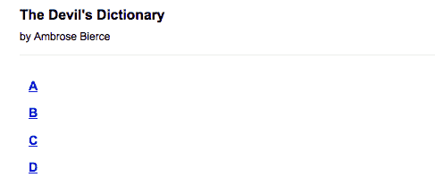

现在，我们可以专注于将内容放到页面上。

# 追加 HTML

Ajax 应用程序通常不过是对一块 HTML 的请求。这种技术有时被称为 **Asynchronous HTTP and HTML**（**AHAH**），在 jQuery 中几乎很容易实现。首先，我们需要一些要插入的 HTML，我们将其放置在一个名为 `a.html` 的文件中，与我们的主文档一起。这个辅助 HTML 文件的开头如下：

```js
<div class="entry"> 
  <h3 class="term">ABDICATION</h3> 
  <div class="part">n.</div> 
  <div class="definition"> 
    An act whereby a sovereign attests his sense of the high 
    temperature of the throne. 
    <div class="quote"> 
      <div class="quote-line">Poor Isabella's Dead, whose 
      abdication</div> 
      <div class="quote-line">Set all tongues wagging in the 
      Spanish nation.</div> 
      <div class="quote-line">For that performance 'twere 
      unfair to scold her:</div> 
      <div class="quote-line">She wisely left a throne too 
      hot to hold her.</div> 
      <div class="quote-line">To History she'll be no royal 
      riddle &mdash;</div> 
      <div class="quote-line">Merely a plain parched pea that 
      jumped the griddle.</div> 
      <div class="quote-author">G.J.</div> 
    </div> 
  </div> 
</div> 

<div class="entry"> 
  <h3 class="term">ABSOLUTE</h3> 
  <div class="part">adj.</div> 
  <div class="definition"> 
    Independent, irresponsible.  An absolute monarchy is one 
    in which the sovereign does as he pleases so long as he 
    pleases the assassins.  Not many absolute monarchies are 
    left, most of them having been replaced by limited 
    monarchies, where the sovereign's power for evil (and for 
    good) is greatly curtailed, and by republics, which are 
    governed by chance. 
  </div> 
</div> 

```

页面继续以这种 HTML 结构的更多条目。单独渲染的话，`a.html` 看起来相当简单：

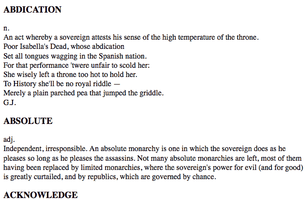

请注意，`a.html` 不是一个真正的 HTML 文档；它不包含 `<html>`、`<head>` 或 `<body>`，这些通常是必需的。我们通常将这样的文件称为*部分*或*片段*；它的唯一目的是被插入到另一个 HTML 文档中，我们现在将这样做：

```js
$(() => {
  $('#letter-a a')
    .click((e) => {
      e.preventDefault()

      $('#dictionary').load('a.html');
    });
});

```

第 6.1 节

`.load()` 方法为我们做了所有繁重的工作。我们使用普通的 jQuery 选择器指定 HTML 片段的目标位置，然后将要加载的文件的 URL 作为参数传递。现在，当单击第一个链接时，文件将被加载并放置在 `<div id="dictionary">` 内。一旦插入新的 HTML，浏览器就会渲染它：

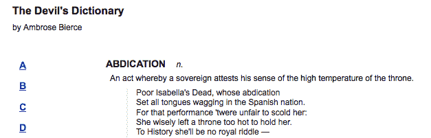

注意 HTML 现在已经有样式了，而之前是原样呈现。这是由于主文档中的 CSS 规则；一旦插入新的 HTML 片段，规则也会应用于其元素。

在测试这个示例时，当单击按钮时，字典定义可能会立即出现。这是在本地工作应用程序时的一个危险；很难预测跨网络传输文档时的延迟或中断。假设我们添加一个警报框，在加载定义后显示：

```js
$(() => {
  $('#letter-a a')
    .click((e) => {
      e.preventDefault()

      $('#dictionary').load('a.html');
      alert('Loaded!');
    });
});

```

第 6.2 节

我们可能会从这段代码的结构中假设警报只能在执行加载后显示。JavaScript 的执行是**同步**的，严格按顺序一个任务接一个任务执行。

然而，当这段特定的代码在生产 Web 服务器上测试时，由于网络延迟，警报将在加载完成之前出现并消失。这是因为所有 Ajax 调用默认是**异步**的。异步加载意味着一旦发出检索 HTML 片段的 HTTP 请求，脚本执行立即恢复而不等待。稍后，浏览器收到来自服务器的响应并处理它。这是期望的行为；锁定整个 Web 浏览器等待数据检索是不友好的。

如果必须延迟动作直到加载完成，jQuery 为此提供了一个回调函数。我们已经在第四章中看到了回调，在*样式和动画*中使用它们在效果完成后执行操作。Ajax 回调执行类似的功能，在从服务器接收数据后执行。我们将在下一个示例中使用此功能，学习如何从服务器读取 JSON 数据。

# 处理 JavaScript 对象

根据需要按需获取完整形式的 HTML 非常方便，但这意味着必须传输有关 HTML 结构的大量信息以及实际内容。有时我们希望尽可能少地传输数据，并在数据到达后进行处理。在这种情况下，我们需要以 JavaScript 可以遍历的结构检索数据。

借助 jQuery 的选择器，我们可以遍历获取的 HTML 并对其进行操作，但原生 JavaScript 数据格式涉及的数据量较少，处理起来的代码也较少。

# 检索 JSON

正如我们经常看到的那样，JavaScript 对象只是一组键值对，并且可以用花括号（`{}`）简洁地定义。另一方面，JavaScript 数组是用方括号（`[]`）即时定义的，并且具有隐式键，即递增整数。结合这两个概念，我们可以轻松表达一些非常复杂和丰富的数据结构。

术语**JavaScript 对象表示法**（**JSON**）是由 *Douglas Crockford* 创造的，以利用这种简单的语法。这种表示法可以提供简洁的替代方法来替代臃肿的 XML 格式：

```js
{ 
  "key": "value", 
  "key 2": [ 
    "array", 
    "of", 
    "items" 
  ] 
} 

```

尽管基于 JavaScript 对象字面量和数组字面量，但 JSON 对其语法要求更具规范性，对其允许的值更具限制性。例如，JSON 指定所有对象键以及所有字符串值必须用双引号括起来。此外，函数不是有效的 JSON 值。由于其严格性，开发人员应避免手动编辑 JSON，而应依赖于诸如服务器端脚本之类的软件来正确格式化它。

有关 JSON 的语法要求、一些潜在优势以及它在许多编程语言中的实现的信息，请访问[`json.org/`](http://json.org/)。

我们可以以许多方式使用此格式对数据进行编码。为了说明一种方法，我们将一些字典条目放入一个名为 `b.json` 的 JSON 文件中：

```js
[ 
  { 
    "term": "BACCHUS", 
    "part": "n.", 
    "definition": "A convenient deity invented by the...", 
    "quote": [ 
      "Is public worship, then, a sin,", 
      "That for devotions paid to Bacchus", 
      "The lictors dare to run us in,", 
      "And resolutely thump and whack us?" 
    ], 
    "author": "Jorace" 
  }, 
  { 
    "term": "BACKBITE", 
    "part": "v.t.", 
    "definition": "To speak of a man as you find him when..." 
  }, 
  { 
    "term": "BEARD", 
    "part": "n.", 
    "definition": "The hair that is commonly cut off by..." 
  }, 
  ... file continues ... 

```

要检索此数据，我们将使用 `$.getJSON()` 方法，该方法获取文件并对其进行处理。当数据从服务器到达时，它只是一个 JSON 格式的文本字符串。`$.getJSON()` 方法解析此字符串并向调用代码提供生成的 JavaScript 对象。

# 使用全局 jQuery 函数

到目前为止，我们使用的所有 jQuery 方法都附加在我们用 `$()` 函数构建的 jQuery 对象上。选择器允许我们指定一组要处理的 DOM 节点，并且这些方法以某种方式对其进行操作。然而，`$.getJSON()` 函数是不同的。它没有逻辑 DOM 元素可以应用；结果对象必须提供给脚本，而不是注入到页面中。因此，`getJSON()` 被定义为全局 jQuery 对象的方法（由 `jQuery` 库一次定义的单个对象，称为 `jQuery` 或 `$`），而不是单个 jQuery 对象实例的方法（由 `$()` 函数返回的对象）。

如果 `$` 是一个类 `$.getJSON()` 将是一个类方法。对于我们的目的，我们将把这种类型的方法称为**全局函数**；实际上，它们是使用 `jQuery` 命名空间的函数，以避免与其他函数名称冲突。

要使用此函数，我们像以前一样将文件名传递给它：

```js
$(() => {
  $('#letter-b a')
    .click((e) => {
      e.preventDefault();
      $.getJSON('b.json');
    });
});

```

列表 6.3

当我们单击链接时，此代码似乎没有任何效果。函数调用加载文件，但我们还没有告诉 JavaScript 如何处理生成的数据。为此，我们需要使用回调函数。

`$.getJSON()` 函数接受第二个参数，这是在加载完成时调用的函数。如前所述，Ajax 调用是异步的，回调提供了一种等待数据传输完成而不是立即执行代码的方法。回调函数还接受一个参数，其中填充了生成的数据。所以，我们可以写：

```js
$(() => {
  $('#letter-b a')
    .click((e) => {
      e.preventDefault();
      $.getJSON('b.json', (data) => {});
    });
});

```

列表 6.4

在这个函数内部，我们可以使用 `data` 参数根据需要遍历 JSON 结构。我们需要迭代顶级数组，为每个项目构建 HTML。我们将使用数据数组的 `reduce()` 方法将其转换为 HTML 字符串，然后将其插入文档中。`reduce()` 方法接受一个函数作为参数，并为数组的每个项返回结果的一部分：

```js
$(() => {
  $('#letter-b a')
    .click((e) => {
      e.preventDefault();

        $.getJSON('b.json', (data) => {
          const html = data.reduce((result, entry) => `
            ${result}
            <div class="entry">
              <h3 class="term">${entry.term}</h3>
              <div class="part">${entry.part}</div>
              <div class="definition">
                ${entry.definition}
              </div>
            </div>
          `, '');

        $('#dictionary')
          .html(html);
    });
  });
});

```

列表 6.5

我们使用模板字符串来构建每个数组项的 HTML 内容。`result` 参数是上一个数组项的值。使用这种方法，通过字符串拼接，可以更容易地看到 HTML 结构。一旦为每个条目构建了所有的 HTML，我们就用 `.html()` 将其插入到 `<div id="dictionary">` 中，替换可能已经存在的任何内容。

安全的 HTML

这种方法假定数据对 HTML 消费是安全的；例如，它不应该包含任何杂乱的 `<` 字符。

唯一剩下的就是处理带引号的条目，我们可以通过实现一对使用 `reduce()` 技术构建字符串的辅助函数来完成：

```js
$(() => {
  const formatAuthor = entry =>
    entry.author ?
      `<div class="quote-author">${entry.author}</div>` :
      '';

  const formatQuote = entry =>
    entry.quote ?
      `
      <div class="quote">
        ${entry.quote.reduce((result, q) => `
          ${result}
          <div class="quote-line">${q}</div>
        `, '')}
        ${formatAuthor(entry)}
      </div>
      ` : '';

    $('#letter-b a')
      .click((e) => {
        e.preventDefault();

        $.getJSON('b.json', (data) => {
          const html = data.reduce((result, entry) => `
            ${result}
            <div class="entry">
              <h3 class="term">${entry.term}</h3>
              <div class="part">${entry.part}</div>
              <div class="definition">
                ${entry.definition}
                ${formatQuote(entry)}
              </div>
            </div>
          `, '');

          $('#dictionary')
            .html(html);
        });
      });
});

```

列表 6.6

有了这段代码，我们可以单击 B 链接并确认我们的结果。词典条目如预期的那样显示在页面的右侧：

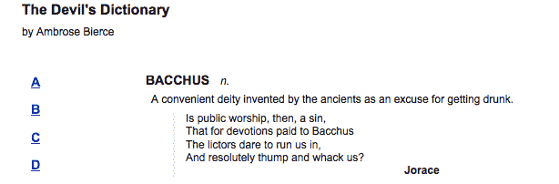

JSON 格式简洁，但并不宽容。每个括号、大括号、引号和逗号必须存在且被计算在内，否则文件将无法加载。在某些情况下，我们甚至不会收到错误消息；脚本会悄无声息地失败。

# 执行脚本

有时，我们不希望在页面首次加载时检索到所有将需要的 JavaScript。在某些用户交互发生之前，我们可能不知道需要哪些脚本。我们可以在需要时动态引入 `<script>` 标签，但更加优雅的注入附加代码的方法是让 jQuery 直接加载 `.js` 文件。

拉取脚本与加载 HTML 片段一样简单。在这种情况下，我们使用 `$.getScript()` 函数，它——与其兄弟们一样——接受指向脚本文件的 URL：

```js
$(() => { 
  $('#letter-c a')
    .click((e) => {
      e.preventDefault();
      $.getScript('c.js');
    });
}); 

```

列表 6.7

在我们的最后一个示例中，我们需要处理结果数据，以便我们可以对加载的文件执行一些有用的操作。不过，对于脚本文件，处理是自动的；脚本只是简单地运行。

以这种方式获取的脚本在当前页面的全局上下文中运行。这意味着它们可以访问所有全局定义的函数和变量，特别是包括 jQuery 本身。因此，我们可以仿照 JSON 示例，在脚本执行时准备和插入 HTML 到页面上，并将此代码放在`c.js`中：

```js
const entries = [ 
  { 
    "term": "CALAMITY", 
    "part": "n.", 
    "definition": "A more than commonly plain and..." 
  }, 
  { 
    "term": "CANNIBAL", 
    "part": "n.", 
    "definition": "A gastronome of the old school who..." 
  }, 
  { 
    "term": "CHILDHOOD", 
    "part": "n.", 
    "definition": "The period of human life intermediate..." 
  } 
  // and so on 
]; 

const html = entries.reduce((result, entry) => `
  ${result}
  <div class="entry">
    <h3 class="term">${entry.term}</h3>
    <div class="part">${entry.part}</div>
    <div class="definition">
      ${entry.definition}
    </div>
  </div>
`, '');

$('#dictionary')
  .html(html); 

```

现在，点击 C 链接会得到预期的结果，显示相应的字典条目。

# 加载 XML 文档

XML 是 Ajax 首字母缩写的一部分，但我们实际上还没有加载任何 XML。这样做很简单，而且与 JSON 技术非常相似。首先，我们需要一个 XML 文件，`d.xml`，其中包含我们希望显示的一些数据：

```js
<?xml version="1.0" encoding="UTF-8"?> 
<entries> 
  <entry term="DEFAME" part="v.t."> 
    <definition> 
      To lie about another.  To tell the truth about another. 
    </definition> 
  </entry> 
  <entry term="DEFENCELESS" part="adj."> 
    <definition> 
      Unable to attack. 
    </definition> 
  </entry> 
  <entry term="DELUSION" part="n."> 
    <definition> 
      The father of a most respectable family, comprising 
      Enthusiasm, Affection, Self-denial, Faith, Hope, 
      Charity and many other goodly sons and daughters. 
    </definition> 
    <quote author="Mumfrey Mappel"> 
      <line>All hail, Delusion!  Were it not for thee</line> 
      <line>The world turned topsy-turvy we should see; 
        </line> 
      <line>For Vice, respectable with cleanly fancies, 
        </line> 
      <line>Would fly abandoned Virtue's gross advances. 
        </line> 
    </quote> 
  </entry> 
</entries> 

```

当然，这些数据可以用许多方式表达，有些方式更接近我们早期用于 HTML 或 JSON 的结构。然而，在这里，我们正在说明 XML 的一些特性，以使其对人类更加可读，例如使用`term`和`part`属性而不是标签。

我们将以熟悉的方式开始我们的函数：

```js
$(() => {
  $('#letter-d a')
    .click((e) => {
      e.preventDefault();
      $.get('d.xml', (data) => {

      });
    });
}); 

```

列表 6.8

这次，是`$.get()`函数完成了我们的工作。通常，此函数只是获取所提供 URL 的文件，并将纯文本提供给回调函数。但是，如果由于其服务器提供的 MIME 类型而已知响应为 XML，则回调函数将交给 XML DOM 树。

幸运的是，正如我们已经看到的，jQuery 具有实质性的 DOM 遍历功能。我们可以像在 HTML 上一样在 XML 文档上使用正常的`.find()`、`.filter()`和其他遍历方法：

```js
$(() => { 
  $('#letter-d a')
    .click((e) => {
      const formatAuthor = entry =>
        $(entry).attr('author') ?
          `
          <div class="quote-author">
            ${$(entry).attr('author')}
          </div>
          ` : '';

      const formatQuote = entry =>
        $(entry).find('quote').length ?
          `
          <div class="quote">
            ${$(entry)
              .find('quote')
              .get()
              .reduce((result, q) => `
                ${result}
                <div class="quote-line">
                  ${$(q).text()}
                </div>
              `, '')}
            ${formatAuthor(entry)}
          </div>
          ` : '';

      e.preventDefault();

      $.get('d.xml', (data) => {
        const html = $(data)
          .find('entry')
          .get()
          .reduce((result, entry) => `
            ${result}
            <div class="entry">
              <h3 class="term">${$(entry).attr('term')}</h3>
              <div class="part">${$(entry).attr('part')}</div>
              <div class="definition">
                ${$(entry).find('definition').text()}
                ${formatQuote(entry)}
              </div>
            </div>
          `, '');

        $('#dictionary')
          .html(html);
      });
    });
}); 

```

列表 6.9

当点击 D 链接时，这将产生预期的效果：

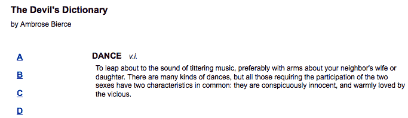

这是我们已经了解的 DOM 遍历方法的一种新用法，揭示了 jQuery 的 CSS 选择器支持的灵活性。CSS 语法通常用于帮助美化 HTML 页面，因此标准`.css`文件中的选择器使用 HTML 标签名称（如`div`和`body`）来定位内容。然而，jQuery 可以像标准 HTML 一样轻松地使用任意的 XML 标签名称，比如`entry`和`definition`。

jQuery 内部的高级选择器引擎使在更复杂的情况下找到 XML 文档的部分变得更加容易。例如，假设我们想将显示的条目限制为具有又带有作者的引用的条目。为此，我们可以通过将`entry`更改为`entry:has(quote)`来限制具有嵌套的`<quote>`元素的条目。然后，我们可以通过编写`entry:has(quote[author])`来进一步限制具有`<quote>`元素上的`author`属性的条目。现在，*列表 6.9* 中的带有初始选择器的行如下所示：

```js
$(data).find('entry:has(quote[author])').each(function() { 

```

这个新的选择器表达式相应地限制了返回的条目：

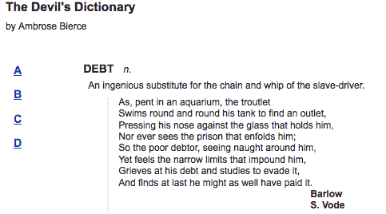

虽然我们可以在从服务器返回的 XML 数据上使用 jQuery，但缺点是我们的代码量已经显著增长。

# 选择数据格式

我们已经查看了四种用于外部数据的格式，每种格式都由 jQuery 的 Ajax 函数处理。我们还验证了所有四种格式都能够处理手头的任务，在用户请求时加载信息到现有页面上，并且在此之前不加载。那么，我们如何决定在我们的应用程序中使用哪种格式？

*HTML 片段* 需要非常少的工作来实现。可以使用一个简单的方法将外部数据加载并插入到页面中，甚至不需要回调函数。对于简单的任务，添加新的 HTML 到现有页面中不需要遍历数据。另一方面，数据的结构不一定适合其他应用程序重用。外部文件与其预期的容器紧密耦合。

*JSON 文件* 结构化简单，易于重用。它们紧凑且易于阅读。必须遍历数据结构以提取信息并在页面上呈现，但这可以通过标准 JavaScript 技术完成。由于现代浏览器可以通过单个调用`JSON.parse()`原生解析文件，读取 JSON 文件非常快速。JSON 文件中的错误可能导致静默失败，甚至在页面上产生副作用，因此数据必须由可信任的方进行精心制作。

*JavaScript 文件* 提供了最大的灵活性，但实际上并不是一种数据存储机制。由于文件是特定于语言的，因此无法用于向不同的系统提供相同的信息。相反，加载 JavaScript 文件的能力意味着很少需要的行为可以拆分到外部文件中，减少代码大小，直到需要为止。

尽管 *XML* 在 JavaScript 社区中已经不再受欢迎，大多数开发人员更喜欢 JSON，但它仍然如此普遍，以至于以此格式提供数据很可能使数据在其他地方得到重用。XML 格式有点臃肿，解析和操作速度可能比其他选项慢一些。

考虑到这些特点，通常最容易将外部数据提供为 HTML 片段，只要数据不需要在其他应用程序中使用。在数据将被重用但其他应用程序也可能受到影响的情况下，由于其性能和大小，JSON 通常是一个不错的选择。当远程应用程序未知时，XML 可能提供最大的保证，可以实现互操作性。

比起其他任何考虑因素，我们应确定数据是否已经可用。如果是，那么很可能最初就是以其中一种这种格式呈现的，因此决策可能已经为我们做出。

# 向服务器传递数据

到目前为止，我们的示例重点放在从 Web 服务器检索静态数据文件的任务上。但是，服务器可以根据来自浏览器的输入动态地塑造数据。在这项任务中，jQuery 也为我们提供了帮助；我们迄今为止介绍的所有方法都可以修改，以便数据传输变成双向街道。

与服务器端代码交互

由于演示这些技术需要与 Web 服务器进行交互，所以我们将在这里首次使用服务器端代码。给出的示例将使用 Node.js，它非常广泛使用并且免费提供。我们不会在这里涵盖任何 Node.js 或 Express 的具体内容，但是如果你搜索这两项技术，网络上有丰富的资源可供参考。

# 执行 GET 请求

为了说明客户端（使用 JavaScript）与服务器（同样使用 JavaScript）之间的通信，我们将编写一个脚本，每次请求只向浏览器发送一个词典条目。所选择的条目将取决于从浏览器发送的参数。我们的脚本将从类似于这样的内部数据结构中获取数据：

```js
const E_entries = {
  EAVESDROP: {
    part: 'v.i.',
    definition: 'Secretly to overhear a catalogue of the ' +
                'crimes and vices of another or yourself.',
    quote: [
      'A lady with one of her ears applied',
      'To an open keyhole heard, inside,',
      'Two female gossips in converse free &mdash;',
      'The subject engaging them was she.',
      '"I think," said one, "and my husband thinks',
      'That she's a prying, inquisitive minx!"',
      'As soon as no more of it she could hear',
      'The lady, indignant, removed her ear.',
      '"I will not stay," she said, with a pout,',
      '"To hear my character lied about!"',
    ],
    author: 'Gopete Sherany',
  },
  EDIBLE: {
    part:'adj.',
    definition: 'Good to eat, and wholesome to digest, as ' +
                'a worm to a toad, a toad to a snake, a snake ' +
                'to a pig, a pig to a man, and a man to a worm.',
  },
  // Etc...

```

在这个示例的生产版本中，数据可能会存储在数据库中，并根据需要加载。由于数据在这里是脚本的一部分，所以检索它的代码非常简单。我们检查 URL 的查询字符串部分，然后将术语和条目传递给一个返回 HTML 片段以显示的函数：

```js
const formatAuthor = entry =>
  entry.author ?
    `<div class="quote-author">${entry.author}</div>` :
    '';

const formatQuote = entry =>
  entry.quote ?
    `
    <div class="quote">
      ${entry.quote.reduce((result, q) => `
        ${result}
        <div class="quote-line">${q}</div>
      `, '')}
      ${formatAuthor(entry)}
    </div>
    ` : '';

const formatEntry = (term, entry) => `
  <div class="entry">
    <h3 class="term">${term}</h3>
    <div class="part">${entry.part}</div>
    <div class="definition">
      ${entry.definition}
      ${formatQuote(entry)}
    </div>
  </div>
`;

app.use(express.static('./'));

app.get('/e', (req, res) => {
  const term = req.query.term.toUpperCase();
  const entry = E_entries[term];
  let content;

  if (entry) {
    content = formatEntry(term, entry);
  } else {
    content = '<div>Sorry, your term was not found.</div>';
  }

  res.send(content);
}); 

```

现在，对这个 `/e` 处理器的请求，将返回对应于在 GET 参数中发送的术语的 HTML 片段。例如，当使用 `/e?term=eavesdrop` 访问处理器时，我们会得到：

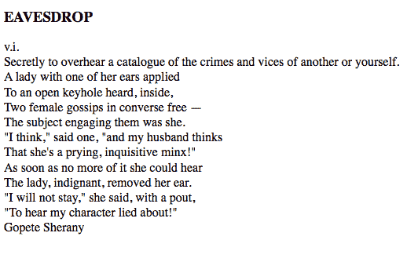

再次注意我们之前看到的 HTML 片段缺乏格式，因为尚未应用 CSS 规则。

由于我们正在展示数据如何传递到服务器，所以我们将使用不同的方法来请求条目，而不是迄今为止所依赖的孤立按钮。相反，我们将为每个术语呈现一个链接列表，并且点击任何一个链接都将加载相应的定义。我们将添加以下 HTML：

```js
<div class="letter" id="letter-e"> 
  <h3>E</h3> 
  <ul> 
    <li><a href="e?term=Eavesdrop">Eavesdrop</a></li> 
    <li><a href="e?term=Edible">Edible</a></li> 
    <li><a href="e?term=Education">Education</a></li> 
    <li><a href="e?term=Eloquence">Eloquence</a></li> 
    <li><a href="e?term=Elysium">Elysium</a></li> 
    <li><a href="e?term=Emancipation">Emancipation</a> 
      </li> 
    <li><a href="e?term=Emotion">Emotion</a></li> 
    <li><a href="e?term=Envelope">Envelope</a></li> 
    <li><a href="e?term=Envy">Envy</a></li> 
    <li><a href="e?term=Epitaph">Epitaph</a></li> 
    <li><a href="e?term=Evangelist">Evangelist</a></li> 
  </ul> 
</div> 

```

现在，我们需要让我们的前端 JavaScript 代码调用后端 JavaScript，并传递正确的参数。我们可以使用正常的 `.load()` 机制来做到这一点，直接将查询字符串附加到 URL 并使用类似于 `e?term=eavesdrop` 的地址获取数据。但是，我们可以让 jQuery 根据我们提供给 `$.get()` 函数的对象构造查询字符串：

```js
$(() => { 
  $('#letter-e a')
    .click((e) => {
      e.preventDefault();

      const requestData = {
        term: $(e.target).text()
      };

      $.get('e', requestData, (data) => {
        $('#dictionary').html(data);
      });
    });
}); 

```

列表 6.10

现在我们已经看到 jQuery 提供的其他 Ajax 接口，这个函数的操作看起来很熟悉。唯一的区别是第二个参数，它允许我们提供一个包含键和值的对象，这些键和值成为查询字符串的一部分。在这种情况下，键始终是 `term`，但值是从每个链接的文本中获取的。现在，点击列表中的第一个链接会显示其定义：

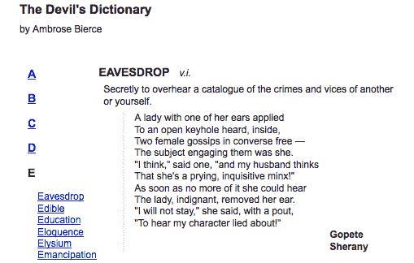

这里的所有链接都有 URL，即使我们在代码中没有使用它们。为了防止链接在点击时正常跟随，我们调用`.preventDefault()`方法。

返回 false 还是阻止默认行为？

在本章中编写 `click` 处理程序时，我们选择使用 `e.preventDefault()` 而不是以 `return false` 结束处理程序。当默认操作否则会重新加载页面或加载另一页时，建议采用这种做法。例如，如果我们的 `click` 处理程序包含 JavaScript 错误，调用处理程序的第一行`.preventDefault()`（在遇到错误之前）确保表单不会被提交，并且我们浏览器的错误控制台将正确报告错误。请记住，从 第三章 *处理事件*，`return false` 调用了 `event.preventDefault()` 和 `event.stopPropagation()`。如果我们想要阻止事件冒泡，我们还需要调用后者。

# 序列化表单

将数据发送到服务器通常涉及用户填写表单。与其依赖于正常的表单提交机制，该机制将在整个浏览器窗口中加载响应，我们可以使用 jQuery 的 Ajax 工具包异步提交表单并将响应放置在当前页面中。

要尝试这个，我们需要构建一个简单的表单：

```js
<div class="letter" id="letter-f"> 
  <h3>F</h3> 
  <form action="f"> 
    <input type="text" name="term" value="" id="term" /> 
    <input type="submit" name="search" value="search" 
      id="search" /> 
  </form> 
</div> 

```

这一次，我们将通过使我们的 `/f` 处理程序搜索提供的搜索词作为字典词的子字符串来从服务器返回一组条目。我们将使用我们从 `/e` 处理程序 中的 `formatEntry()` 函数以与之前相同的格式返回数据。以下是 `/f` 处理程序的实现：

```js
app.post('/f', (req, res) => {
  const term = req.body.term.toUpperCase();
  const content = Object.keys(F_entries)
    .filter(k => k.includes(term))
    .reduce((result, k) => `
      ${result}
      ${formatEntry(k, F_entries[k])}
    `, '');

  res.send(content);
}); 

```

现在，我们可以对表单提交做出反应，并通过遍历 DOM 树来制作正确的查询参数：

```js
$(() => {
  $('#letter-f form')
    .submit((e) => {
      e.preventDefault();

      $.post(
        $(e.target).attr('action'),
        { term: $('input[name="term"]').val() },
        (data) => { $('#dictionary').html(data); }
      );
    });
}); 

```

清单 6.11

此代码具有预期效果，但按名称搜索输入字段并逐个将其附加到地图中是繁琐的。特别是，随着表单变得更加复杂，这种方法的扩展性不佳。幸运的是，jQuery 提供了一个经常使用的惯用语的快捷方式。`.serialize()` 方法作用于 jQuery 对象，并将匹配的 DOM 元素转换为可以与 Ajax 请求一起传递的查询字符串。我们可以将我们的提交处理程序概括如下：

```js
$(() => {
  $('#letter-f form')
    .submit((e) => {
      e.preventDefault();

      $.post(
        $(e.target).attr('action'),
        $(e.target).serialize(),
        (data) => { $('#dictionary').html(data); }
      );
    }); 
}); 

```

清单 6.12

同样的脚本将用于提交表单，即使字段数量增加。例如，当我们搜索 `fid` 时，包含该子字符串的术语会显示如下屏幕截图所示：

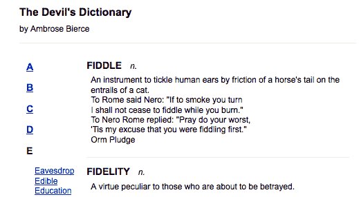

# 注意请求

到目前为止，我们只需调用一个 Ajax 方法并耐心等待响应就足够了。然而，有时候，了解 HTTP 请求在进行中的情况会很方便。如果出现这种需要，jQuery 提供了一套函数，可以在发生各种与 Ajax 相关的事件时注册回调函数。

`.ajaxStart()` 和 `.ajaxStop()` 方法是这些观察者函数的两个示例。当没有其他传输正在进行时开始一个 Ajax 调用时，将触发 `.ajaxStart()` 回调。相反，当最后一个活动请求结束时，将执行与 `.ajaxStop()` 绑定的回调。所有观察者都是全局的，它们在发生任何 Ajax 通信时被调用，无论是什么代码启动的。而且所有这些观察者只能绑定到 `$(document)`。

我们可以利用这些方法在网络连接缓慢的情况下向用户提供一些反馈。页面的 HTML 可以附加适当的加载消息：

```js
<div id="loading"> 
  Loading... 
</div> 

```

这个消息只是一段任意的 HTML 代码；例如，它可以包含一个动画 GIF 图像作为加载指示器。在这种情况下，我们将在 CSS 文件中添加一些简单的样式，以便在显示消息时，页面看起来如下：

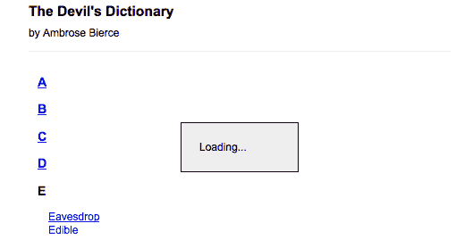

为了符合渐进增强的精神，我们不会直接将这个 HTML 标记放在页面上。相反，我们将使用 jQuery 插入它：

```js
$(() => {
  $('<div/>')
    .attr('id', 'loading')
    .text('Loading...')
    .insertBefore('#dictionary');
}); 

```

我们的 CSS 文件将给这个 `<div>` 添加一个 `display: none;` 的样式声明，以便最初隐藏消息。在适当的时候显示它，我们只需使用 `.ajaxStart()` 将其注册为观察者：

```js
$(() => {
  const $loading = $('<div/>')
    .attr('id', 'loading')
    .text('Loading...')
    .insertBefore('#dictionary');

  $(document)
    .ajaxStart(() => {
      $loading.show(); 
    }); 
}); 

```

我们可以将隐藏行为链接在一起：

```js
$(() => {
  const $loading = $('<div/>')
    .attr('id', 'loading')
    .text('Loading...') 
    .insertBefore('#dictionary'); 

  $(document)
    .ajaxStart(() => {
      $loading.show(); 
    })
    .ajaxStop(() => {
      $loading.hide(); 
    }); 
}); 

```

列表 6.13

现在我们有了加载反馈。

再次说明，这些方法与 Ajax 通信开始的具体方式无关。附加到 A 链接的 `.load()` 方法和附加到 B 链接的 `.getJSON()` 方法都会导致这些操作发生。

在这种情况下，这种全局行为是可取的。不过，如果我们需要更具体的行为，我们有几个选择。一些观察者方法，比如 `.ajaxError()`，会将它们的回调函数发送给 `XMLHttpRequest` 对象的引用。这可以用于区分一个请求和另一个请求，并提供不同的行为。通过使用低级别的 `$.ajax()` 函数，我们可以实现其他更具体的处理，稍后我们会讨论这个函数。

与请求交互的最常见方式是 `success` 回调，我们已经介绍过了。我们在几个示例中使用它来解释从服务器返回的数据，并用结果填充页面。当然，它也可以用于其他反馈。再次考虑我们从 *列表 6.1* 中的 `.load()` 示例：

```js
$(() => { 
  $('#letter-a a')
    .click((e) => {
      e.preventDefault();
      $('#dictionary')
        .load('a.html'); 
    }); 
}); 

```

我们可以通过使加载的内容淡入而不是突然出现来进行一点小改进。`.load()` 方法可以接受一个回调函数在完成时被触发：

```js
$(() => { 
  $('#letter-a a')
    .click((e) => {
      e.preventDefault();
      $('#dictionary')
        .hide()
        .load('a.html', function() { 
          $(this).fadeIn(); 
        }); 
    }); 
}); 

```

列表 6.14

首先，我们隐藏目标元素，然后开始加载。加载完成后，我们使用回调函数将新填充的元素显示出来，以淡入的方式。

# 错误处理

到目前为止，我们只处理了 Ajax 请求的成功响应，当一切顺利时加载页面以显示新内容。然而，负责任的开发人员应考虑网络或数据错误的可能性，并适当地报告它们。在本地环境中开发 Ajax 应用程序可能会使开发人员产生自满感，因为除了可能的 URL 输入错误外，Ajax 错误不会在本地发生。Ajax 方便的方法，如`$.get()`和`.load()`本身不提供错误回调参数，因此我们需要寻找其他地方解决此问题。

除了使用`global .ajaxError()`方法外，我们还可以利用 jQuery 的延迟对象系统来对错误做出反应。我们将在第十一章，*高级效果*中更详细地讨论延迟对象，但是，现在我们简单地指出，我们可以将`.done()`，`.always()`和`.fail()`方法链接到除`.load()`之外的任何 Ajax 函数，并使用这些方法来附加相关的回调。例如，如果我们取自*列表 6.16*的代码，并将 URL 更改为不存在的 URL，我们可以测试`.fail()`方法：

```js
$(() => { 
  $('#letter-e a')
    .click((e) => {
      e.preventDefault();

      const requestData = {
        term: $(e.target).text()
      };

      $.get('notfound', requestData, (data) => {
        $('#dictionary').html(data);
      }).fail((xhr) => {
        $('#dictionary')
          .html(`An error occurred:
            ${xhr.status}
            ${xhr.responseText}
          `);
      });
    });
}); 

```

列表 6.15

现在，点击以 E 开头的任何术语链接都会产生错误消息。`jqXHR.responseText`的确切内容将根据服务器配置的不同而变化：

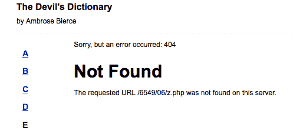

`.status`属性包含服务器提供的数字代码。这些代码在 HTTP 规范中定义，当触发`.fail()`处理程序时，它们将代表错误条件，例如：

| **响应代码** | **描述** |
| --- | --- |
| 400 | 错误请求 |
| 401 | 未经授权 |
| 403 | 禁止访问 |
| 404 | 未找到 |
| 500 | 内部服务器错误 |

可以在 W3C 的网站上找到完整的响应代码列表：[`www.w3.org/Protocols/rfc2616/rfc2616-sec10.html`](http://www.w3.org/Protocols/rfc2616/rfc2616-sec10.html)。

我们将更仔细地检查错误处理在第十三章，*高级 Ajax*中。

# Ajax 和事件

假设我们想允许每个词典术语名称控制其后跟的定义的显示；点击术语名称将显示或隐藏相关定义。根据我们目前所见的技术，这应该是相当简单的：

```js
$(() => {
  $('h3.term')
    .click((e) => {
      $(e.target)
        .siblings('.definition')
        .slideToggle();
    });
}); 

```

列表 6.16

当点击术语时，此代码会查找具有`definition`类的元素的兄弟元素，并根据需要将它们上下滑动。

一切看起来都井然有序，但此代码不起作用。不幸的是，当我们附加`click`处理程序时，术语尚未添加到文档中。即使我们设法将`click`处理程序附加到这些项上，一旦我们点击不同的字母，处理程序将不再附加。

这是一个常见的问题，当页面的某些区域由 Ajax 填充时。一个流行的解决方案是每次页面区域被刷新时重新绑定处理程序。然而，这可能很麻烦，因为每次任何事情导致页面的 DOM 结构发生变化时，事件绑定代码都需要被调用。

更优的选择在第三章，*事件处理*中被介绍。我们可以实现**事件委托**，实际上将事件绑定到一个永远不会改变的祖先元素上。在这种情况下，我们将`click`处理程序附加到`<body>`元素上，使用`.on()`这样来捕获我们的点击：

```js
$(() => { 
  $('body')
    .on('click', 'h3.term', (e) => {
      $(e.target)
        .siblings('.definition')
        .slideToggle();
    });
}); 

```

第 6.17 节

当以这种方式使用时，`.on()`方法告诉浏览器在整个文档中观察所有点击。如果（且仅当）点击的元素与`h3.term`选择器匹配，则执行处理程序。现在，切换行为将在任何术语上发生，即使它是由后来的 Ajax 事务添加的。

# 延迟对象和承诺

在 JavaScript 代码中处理异步行为时，jQuery 延迟对象是在没有一致的方式时引入的。承诺帮助我们编排异步事务，如多个 HTTP 请求、文件读取、动画等。承诺不是 JavaScript 专有的，也不是一个新的想法。将承诺视为一个承诺*最终*解析值的合同是最好的理解方式。

现在承诺已经正式成为 JavaScript 的一部分，jQuery 现在完全支持承诺。也就是说，jQuery 延迟对象的行为与任何其他承诺一样。这很重要，因为我们将在本节中看到，这意味着我们可以使用 jQuery 延迟对象来与返回原生承诺的其他代码组合复杂的异步行为。

# 在页面加载时执行 Ajax 调用

现在，我们的字典在初始页面加载时不显示任何定义。相反，它只显示一些空白空间。让我们通过在文档准备好时显示"A"条目来改变这种情况。我们如何做到这一点？

一种方法是简单地将`load('a.html')`调用添加到我们的文档准备处理程序（`$(() => {})`）中，以及其他所有内容。问题在于这样效率低下，因为我们必须等待文档准备好才能发出 Ajax 请求。如果我们的 JavaScript 一运行就发出 Ajax 请求会不会更好呢？

挑战在于将文档准备事件与 Ajax 响应准备事件同步。这里存在竞争条件，因为我们不知道哪个事件会先发生。文档准备可能会首先完成，但我们不能做出这种假设。这就是承诺非常有用的地方：

```js
Promise.all([
  $.get('a.html'),
  $.ready
]).then(([content]) => {
  $('#dictionary')
    .hide()
    .html(content)
    .fadeIn();
});

```

第 6.18 节

`Promise.all()`方法接受其他 promise 的数组，并返回一个新的 promise。当数组参数中的所有内容都解析了，这个新的 promise 就解析了。这就是 promise 为我们处理异步竞争条件的方式。无论 Ajax promise (`$.get('a.html')`)先解析还是文档准备好 promise (`$.ready`)先解析，都不重要。

`then()`处理程序是我们想要执行依赖于异步值的任何代码的地方。例如，content 值是解析后的 Ajax 调用。文档准备好隐式解析了 DOM。如果 DOM 没有准备好，我们就不能运行`$('#dictionary')...`。

# 使用 fetch()

JavaScript 的另一个近期新增功能是`fetch()`函数。这是`XMLHttpRequest`的更灵活的替代品。例如，当进行跨域请求时或需要调整特定的 HTTP 头值时，使用`fetch()`更加容易。让我们使用`fetch()`来实现*G*条目：

```js
$(() => {
  $('#letter-g a')
    .click((e) => { 
      e.preventDefault();

      fetch('/g')
        .then(resp => resp.json())
        .then(data => {
          const html = data.reduce((result, entry) => `
            ${result}
            <div class="entry">
              <h3 class="term">${entry.term}</h3>
              <div class="part">${entry.part}</div>
              <div class="definition">
                ${entry.definition}
                ${formatQuote(entry)}
              </div>
            </div>
          `, '');

          $('#dictionary')
            .html(html);
        });
    });
});

```

列表 6.19

`fetch()`函数返回一个 promise，就像各种 jQuery Ajax 函数一样。这意味着如果我们在这个例子中调用的`/g`网址实际上位于另一个域中，我们可以使用`fetch()`来访问它。如果我们需要 JSON 数据，我们需要在`.then()`处理程序中调用`.json()`。然后，在第二个处理程序中，我们可以使用在本章前面创建的相同函数来填充 DOM。

Promise 背后的整个理念是一致性。如果我们需要同步异步行为，promise 是解决的方法。任何 jQuery 异步执行的内容，都可以使用其他 promise。

# 总结

你已经学会了 jQuery 提供的 Ajax 方法可以帮助我们从服务器加载多种不同格式的数据，而无需页面刷新。我们可以根据需要从服务器执行脚本，并将数据发送回服务器。

你还学会了如何处理异步加载技术的常见挑战，比如在加载完成后保持处理程序的绑定以及从第三方服务器加载数据。

这结束了我们对`jQuery`库基本组件的介绍。接下来，我们将看看这些功能如何通过 jQuery 插件轻松扩展。

# 进一步阅读

Ajax 的主题将在第十三章 *高级 Ajax*中更详细地探讨。完整的 Ajax 方法列表可以在本书的附录 B *快速参考*或官方的 jQuery 文档中找到 [`api.jquery.com/`](http://api.jquery.com/)。

# 练习

挑战性的练习可能需要使用官方的 jQuery 文档

[`api.jquery.com/`](http://api.jquery.com/):

1.  当页面加载时，将`exercises-content.html`的内容填充到页面的内容区域。

1.  而不是一次性显示整个文档，当用户将鼠标悬停在左侧列中的字母上时，通过从`exercises-content.html`加载适当字母的内容，创建工具提示。

1.  为这个页面加载添加错误处理，将错误消息显示在内容区域。通过将脚本更改为请求`does-not-exist.html`而不是`exercises-content.html`来测试这个错误处理代码。

1.  这是一个挑战。页面加载时，向 GitHub 发送一个 JSONP 请求，并检索用户的存储库列表。将每个存储库的名称和网址插入页面的内容区域。检索 jQuery 项目存储库的网址是[`api.github.com/users/jquery/repos`](https://api.github.com/users/jquery/repos)。
