# 第七章：使用插件

在本书的前六章中，我们审视了 jQuery 的核心组件。这样做已经说明了 jQuery 库可以用来完成各种任务的许多方法。尽管库在其核心处非常强大，但其优雅的**插件架构**使开发人员能够扩展 jQuery，使其功能更加丰富。

jQuery 社区创建了数百个插件——从小的选择器辅助工具到完整的用户界面部件。现在，您将学习如何利用这一庞大资源。

在本章中，我们将介绍：

+   下载和设置插件

+   调用插件提供的 jQuery 方法

+   使用由 jQuery 插件定义的自定义选择器查找元素

+   使用 jQuery UI 添加复杂的用户界面行为

+   使用 jQuery Mobile 实现移动友好功能

# 使用插件

使用 jQuery 插件非常简单。我们只需要获取插件代码，从我们的 HTML 中引用插件，并从我们自己的脚本中调用新的功能。

我们可以使用 jQuery **Cycle** 插件轻松演示这些任务。这个由 Mike Alsup 制作的插件可以快速地将静态页面元素集合转换为交互式幻灯片。像许多流行的插件一样，它可以很好地处理复杂的高级需求，但当我们的需求更为简单时，它也可以隐藏这种复杂性。

# 下载并引用 Cycle 插件

要安装任何 jQuery 插件，我们将使用 `npm` 包管理器。这是声明现代 JavaScript 项目的包依赖关系的事实上的工具。例如，我们可以使用 `package.json` 文件声明我们需要 jQuery 和一组特定的 jQuery 插件。

要获取有关安装 `npm` 的帮助，请参阅 [`docs.npmjs.com/getting-started/what-is-npm`](https://docs.npmjs.com/getting-started/what-is-npm)。要获取有关初始化 `package.json` 文件的帮助，请参阅 [`docs.npmjs.com/getting-started/using-a-package.json`](https://docs.npmjs.com/getting-started/using-a-package.json)。

一旦在项目目录的根目录中有了 `package.json` 文件，您就可以开始添加依赖项了。例如，您可以从命令控制台如下添加 `jquery` 依赖项：

```js
npm install jquery --save

```

如果我们想要使用 `cycle` 插件，我们也可以安装它：

```js
npm install jquery-cycle --save

```

我们在此命令中使用 `--save` 标志的原因是告诉 `npm` 我们始终需要这些包，并且它应该将这些依赖项保存到 `package.json`。现在我们已经安装了 `jquery` 和 `jquery-cycle`，让我们将它们包含到我们的页面中：

```js
<head> 
  <meta charset="utf-8"> 
  <title>jQuery Book Browser</title> 
  <link rel="stylesheet" href="07.css" type="text/css" /> 
  <script src="img/jquery.js"></script> 
  <script src="img/index.js"></script> 
  <script src="img/07.js"></script> 
</head>

```

我们现在已经加载了我们的第一个插件。正如我们所看到的，这不再比设置 jQuery 本身更复杂。插件的功能现在可以在我们的脚本中使用了。

# 调用插件方法

Cycle 插件可以作用于页面上的任何一组兄弟元素。为了展示它的运行过程，我们将设置一些简单的 HTML，其中包含书籍封面图像和相关信息的列表，并将其添加到我们 HTML 文档的主体中，如下所示：

```js
<ul id="books"> 
  <li> 
     
    <div class="title">jQuery Game Development Essentials</div> 
    <div class="author">Salim Arsever</div> 
  </li> 
  <li> 
     
    <div class="title">jQuery Mobile Cookbook</div> 
    <div class="author">Chetan K Jain</div> 
  </li> 
  ... 
</ul>

```

在我们的 CSS 文件中进行轻量级样式处理，按照以下截图所示，依次显示书籍封面：

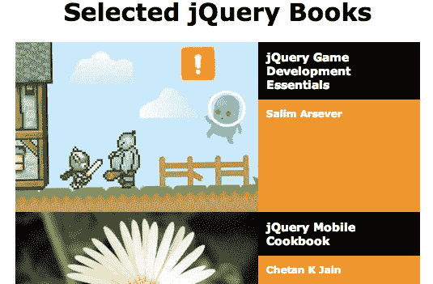

Cycle 插件将会在此列表上发挥其魔力，将其转换为一个引人注目的动画幻灯片。通过在 DOM 中适当的容器上调用 `.cycle()` 方法，可以调用此转换，如下所示：

```js
$(() => { 
  $('#books').cycle(); 
});

```

列表 7.1

这种语法几乎没有更简单的了。就像我们使用任何内置的 jQuery 方法一样，我们将 `.cycle()` 应用于一个 jQuery 对象实例，该实例又指向我们要操作的 DOM 元素。即使没有向它提供任何参数，`.cycle()` 也为我们做了很多工作。页面上的样式被修改以仅呈现一个列表项，并且每 4 秒使用淡入淡出的转换显示一个新项：

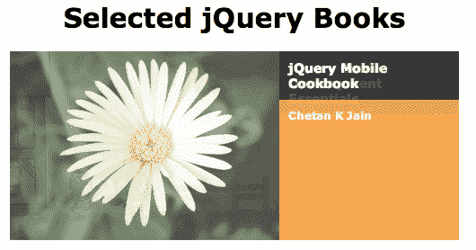

这种简单性是写得很好的 jQuery 插件的典型特征。只需简单的方法调用就能实现专业且有用的结果。然而，像许多其他插件一样，Cycle 提供了大量的选项，用于定制和微调其行为。

# 指定插件方法参数

将参数传递给插件方法与使用原生 jQuery 方法没有什么不同。在许多情况下，参数被传递为一个键值对的单个对象（就像我们在第六章中看到的 `$.ajax()`，*使用 Ajax 发送数据*）。提供的选项选择可能会令人生畏；`.cycle()` 本身就有超过 50 个潜在的配置选项。每个插件的文档详细说明了每个选项的效果，通常还附有详细的示例。

Cycle 插件允许我们改变幻灯片之间的动画速度和样式，影响何时以及如何触发幻灯片转换，并使用回调函数来响应完成的动画。为了演示其中一些功能，我们将从 *列表 7.1* 的方法调用中提供三个简单的选项，如下所示：

```js
$(() => { 
  $('#books').cycle({ 
    timeout: 2000, 
    speed: 200, 
    pause: true 
  }); 
});

```

列表 7.2

`timeout` 选项指定了在每个幻灯片转换之间等待的毫秒数（2,000）。相比之下，`speed` 决定了转换本身需要花费的毫秒数（200）。当设置为 `true` 时，`pause` 选项会导致幻灯片秀在鼠标位于循环区域内时暂停，当循环项可点击时尤其有用。

# 修改参数默认值

即使没有提供参数，Cycle 插件也是令人印象深刻的。为了实现这一点，当没有提供选项时，它需要一个合理的默认设置来使用。

一种常见的模式，也是 Cycle 遵循的模式，是将所有默认值收集到一个单一对象中。在 Cycle 的情况下，`$.fn.cycle.defaults` 对象包含所有默认选项。当插件将其默认值收集在像这样的公开可见位置时，我们可以在我们自己的脚本中修改它们。这样可以使我们的代码在多次调用插件时更加简明，因为我们不必每次都指定选项的新值。重新定义默认值很简单，如下面的代码所示：

```js
$.fn.cycle.defaults.timeout = 10000; 
$.fn.cycle.defaults.random = true; 

$(() => { 
  $('#books').cycle({ 
    timeout: 2000, 
    speed: 200, 
    pause: true 
  }); 
});

```

列表 7.3

在这里，我们在调用`.cycle()` 之前设置了两个默认值，`timeout` 和 `random`。由于我们在`.cycle()` 中声明了 `timeout` 的值为 2000，我们的新默认值 10000 会被忽略。另一方面，`random` 的新默认值为 `true` 生效，导致幻灯片以随机顺序过渡。

# 其他类型的插件

插件不仅仅限于提供额外的 jQuery 方法。它们可以在许多方面扩展库甚至改变现有功能的功能。

插件可以改变 jQuery 库的其他部分操作的方式。例如，一些插件提供新的动画缓动样式，或者在用户操作响应中触发额外的 jQuery 事件。Cycle 插件通过添加一个新的自定义选择器来提供这样的增强功能。

# 自定义选择器

添加自定义选择器表达式的插件会增加 jQuery 内置选择器引擎的功能，使我们可以以新的方式在页面上查找元素。Cycle 添加了这种类型的自定义选择器，这给了我们一个探索这种功能的机会。

通过调用`.cycle('pause')` 和 `.cycle('resume')`，Cycle 的幻灯片可以暂停和恢复。我们可以轻松地添加控制幻灯片的按钮，如下面的代码所示：

```js
$(() => {
  const $books = $('#books').cycle({
    timeout: 2000,
    speed: 200,
    pause: true
  });
  const $controls = $('<div/>')
    .attr('id', 'books-controls')
    .insertAfter($books);

  $('<button/>')
    .text('Pause')
    .click(() => {
      $books.cycle('pause');
    })
    .appendTo($controls);
  $('<button/>')
    .text('Resume')
    .click(() => {
      $books.cycle('resume');
    })
    .appendTo($controls);
});

```

列表 7.4

现在，假设我们希望我们的“恢复”按钮恢复页面上任何暂停的 Cycle 幻灯片，如果有多个的话。我们想要找到页面上所有暂停的幻灯片的`<ul>` 元素，并恢复它们所有。Cycle 的自定义`:paused` 选择器使我们可以轻松做到这一点：

```js
$(() => { 
  $('<button/>')
    .text('Resume')
    .click(() => {
      $('ul:paused').cycle('resume');
    })
    .appendTo($controls);
});

```

列表 7.5

使用 Cycle 加载，`$('ul:paused')` 将创建一个 jQuery 对象，引用页面上所有暂停的幻灯片，以便我们可以随意进行交互。像这样由插件提供的选择器扩展可以自由地与任何标准的 jQuery 选择器结合使用。我们可以看到，选择适当的插件，jQuery 可以被塑造以满足我们的需求。

# 全局函数插件

许多流行的插件在`jQuery`命名空间中提供新的全局函数。当插件提供的功能与页面上的 DOM 元素无关，因此不适合标准的 jQuery 方法时，这种模式是常见的。例如，Cookie 插件（[`github.com/carhartl/jquery-cookie`](https://github.com/carhartl/jquery-cookie)）提供了一个界面，用于在页面上读取和写入 cookie 值。这个功能是通过`$.cookie()`函数提供的，它可以获取或设置单个 cookie。

比如说，例如，我们想要记住用户什么时候按下我们幻灯片的暂停按钮，以便如果他们离开页面然后过后回来的话我们可以保持它暂停。加载 Cookie 插件之后，读取 cookie 就像在下面代码中一样简单：只需将 cookie 的名称作为唯一参数使用即可。

```js
if ($.cookie('cyclePaused')) { 
  $books.cycle('pause'); 
}

```

列表 7.6

在这里，我们寻找`cyclePaused` cookie 的存在；对于我们的目的来说，值是无关紧要的。如果 cookie 存在，循环将暂停。当我们在调用`.cycle()`之后立即插入这个条件暂停时，幻灯片会一直保持第一张图片可见，直到用户在某个时候按下“恢复”按钮。

当然，因为我们还没有设置 cookie，幻灯片仍在循环播放图片。设置 cookie 和获取它的值一样简单；我们只需像下面这样为第二个参数提供一个字符串：

```js
$(() => {
  $('<button/>')
    .text('Pause')
    .click(() => {
      $books.cycle('pause');
      $.cookie('cyclePaused', 'y');
    })
    .appendTo($controls);
  $('<button/>')
    .text('Resume')
    .click(() => {
      $('ul:paused').cycle('resume');
      $.cookie('cyclePaused', null);
    })
    .appendTo($controls);
});

```

列表 7.7

当按下暂停按钮时，cookie 被设置为`y`，当按下恢复按钮时，通过传递`null`来删除 cookie。默认情况下，cookie 在会话期间保持（通常直到浏览器标签页关闭）。同样默认情况下，cookie 与设置它的页面相关联。要更改这些默认设置，我们可以为函数的第三个参数提供一个选项对象。这是典型的 jQuery 插件模式，也是 jQuery 核心函数。

例如，为了使 cookie 在整个站点上可用，并在 7 天后过期，我们可以调用`$.cookie('cyclePaused', 'y', { path: '/', expires: 7 })`。要了解在调用`$.cookie()`时可用的这些和其他选项的信息，我们可以参考插件的文档。

# jQuery UI 插件库

虽然大多数插件，比如 Cycle 和 Cookie，都专注于一个单一的任务，jQuery UI 却面对着各种各样的挑战。实际上，虽然 jQuery UI 的代码常常被打包成一个单一的文件，但它实际上是一套相关插件的综合套件。

jQuery UI 团队创建了许多核心交互组件和成熟的小部件，以帮助使网络体验更像桌面应用程序。交互组件包括拖放、排序、选择和调整项的方法。目前稳定的小部件包括按钮、手风琴、日期选择器、对话框等。此外，jQuery UI 还提供了一套广泛的高级效果，以补充核心的 jQuery 动画。

完整的 UI 库过于庞大，无法在本章中充分覆盖；事实上，有整本书专门讨论此主题。幸运的是，该项目的主要焦点是其功能之间的一致性，因此详细探讨几个部分将有助于我们开始使用其余的部分。

所有 jQuery UI 模块的下载、文档和演示都可以在此处找到

[`jqueryui.com/`](http://jqueryui.com/)。下载页面提供了一个包含所有功能的组合下载，或者一个可定制的下载，可以包含我们需要的功能。可下载的 ZIP 文件还包含样式表和图片，我们在使用 jQuery UI 的交互组件和小部件时需要包含它们。

# 效果

jQuery UI 的效果模块由核心和一组独立的效果组件组成。核心文件提供了颜色和类的动画，以及高级缓动。

# 颜色动画

将 jQuery UI 的核心效果组件链接到文档中后，`.animate()` 方法被扩展以接受额外的样式属性，例如 `borderTopColor`、`backgroundColor` 和 `color`。例如，我们现在可以逐渐将元素从黑色背景上的白色文本变为浅灰色背景上的黑色文本：

```js
$(() => {
  $books.hover((e) => {
    $(e.target)
      .find('.title')
      .animate({
        backgroundColor: '#eee',
        color: '#000'
      }, 1000);
  }, (e) => {
    $(e.target)
      .find('.title')
      .animate({
        backgroundColor: '#000',
        color: '#fff'
      }, 1000);
  }); 
});

```

清单 7.8

现在，当鼠标光标进入页面的书籍幻灯片区域时，书名的文本颜色和背景颜色都会在一秒钟（1000 毫秒）的时间内平滑动画过渡：

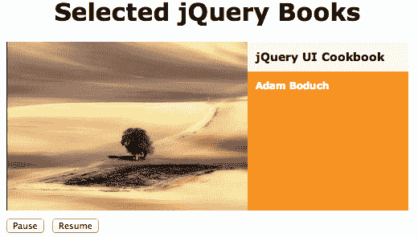

# 类动画

我们在前几章中使用过的三个 CSS 类方法--`.addClass()`、`.removeClass()` 和 `.toggleClass()`--被 jQuery UI 扩展为接受可选的第二个参数，用于动画持续时间。当指定了这个持续时间时，页面的行为就像我们调用了 `.animate()`，并直接指定了应用于元素的类的所有样式属性变化一样：

```js
$(() => {
  $('h1')
    .click((e) => {
      $(e.target).toggleClass('highlighted', 'slow');
    });
});

```

清单 7.9

通过执行 *清单 7.9* 中的代码，我们已经导致页面标题的点击添加或删除 `highlighted` 类。但是，由于我们指定了 `slow` 速度，结果的颜色、边框和边距变化会以动画形式展现出来，而不是立即生效：


# 高级缓动

当我们指示 jQuery 在指定的持续时间内执行动画时，它并不是以恒定的速率执行。例如，如果我们调用 `$('#my-div').slideUp(1000)`，我们知道元素的高度将需要整整一秒钟才能达到零；但是，在该秒的开始和结束时，高度将缓慢变化，在中间时将快速变化。这种速率变化被称为**缓动**，有助于动画看起来平滑自然。

高级缓动函数变化加速和减速曲线，以提供独特的结果。例如，`easeInExpo`函数呈指数增长，以多倍于开始时的速度结束动画。我们可以在任何核心 jQuery 动画方法或 jQuery UI 效果方法中指定自定义缓动函数。这可以通过添加参数或将选项添加到设置对象中来完成，具体取决于使用的语法。

要查看此示例，请按照以下方式将`easeInExpo`作为我们刚刚介绍的*第 7.9 部分*中的`.toggleClass()`方法的缓动样式提供：

```js
$(() => { 
  $('h1')
    .click((e) => {
      $(e.target)
        .toggleClass(
          'highlighted',
          'slow',
          'easeInExpo'
        );
    });
});

```

第 7.10 部分

现在，每当单击标题时，通过切换类属性修改的样式都会逐渐出现，然后加速并突然完成过渡。

查看缓动函数的效果

完整的缓动函数集合演示可在

[`api.jqueryui.com/easings/`](http://api.jqueryui.com/easings/)。

# 其他效果

包含在 jQuery UI 中的单独效果文件添加了各种转换，其中一些可以比 jQuery 本身提供的简单滑动和淡出动画复杂得多。通过调用由 jQuery UI 添加的`.effect()`方法来调用这些效果。如果需要，可以使用`.show()`或`.hide()`来调用导致元素隐藏或显示的效果。

jQuery UI 提供的效果可以用于多种用途。其中一些，比如`transfer`和`size`，在元素改变形状和位置时非常有用。另一些，比如`explode`和`puff`，提供了吸引人的隐藏动画。还有一些，包括`pulsate`和`shake`，则将注意力吸引到元素上。

查看效果的实际效果

所有 jQuery UI 效果都在[`jqueryui.com/effect/#default`](http://jqueryui.com/effect/#default)展示。

`shake`行为特别适合强调当前不适用的操作。当简历按钮无效时，我们可以在页面上使用这个效果：

```js
$(() => {
  $('<button/>')
    .text('Resume')
    .click((e) => {
      const $paused = $('ul:paused');
      if ($paused.length) {
        $paused.cycle('resume');
        $.cookie('cyclePaused', null);
      } else {
        $(e.target)
          .effect('shake', {
            distance: 10
          });
      }
    })
    .appendTo($controls);
});

```

第 7.11 部分

我们的新代码检查`$('ul:paused')`的长度，以确定是否有任何暂停的幻灯片秀要恢复。如果是，则像以前一样调用 Cycle 的`resume`操作；否则，执行`shake`效果。在这里，我们看到，与其他效果一样，`shake`有可用于调整其外观的选项。在这里，我们将效果的`distance`设置为比默认值小的数字，以使按钮在点击时快速来回摇摆。

# 交互组件

jQuery UI 的下一个主要功能是其交互组件，这是一组行为，可以用来制作复杂的交互式应用程序。例如，其中一个组件是**Resizable**，它可以允许用户使用自然的拖动动作改变任何元素的大小。

对元素应用交互就像调用带有其名称的方法一样简单。例如，我们可以通过调用`.resizable()`来使书名可调整大小，如下所示：

```js
(() => {
  $books
    .find('.title')
    .resizable();
});

```

列表 7.12

在文档中引用了 jQuery UI 的 CSS 文件后，此代码将在标题框的右下角添加一个调整大小的手柄。拖动此框会改变区域的宽度和高度，如下面的截图所示：


正如我们现在可能期望的那样，这些方法可以使用大量选项进行定制。例如，如果我们希望将调整大小限制为仅在垂直方向上发生，我们可以通过指定应添加哪个拖动手柄来实现如下：

```js
$(() => {
  $books
    .find('.title')
    .resizable({ handles: 's' });
});

```

列表 7.13

只在区域的南（底部）侧有一个拖动手柄，只能改变区域的高度：


其他交互组件

其他 jQuery UI 交互包括可拖动的、可投放的和可排序的。与可调整大小一样，它们是高度可配置的。我们可以在[`jqueryui.com/`](http://jqueryui.com/)上查看它们的演示和配置选项。

# 小部件

除了这些基本交互组件外，jQuery UI 还包括一些强大的用户界面小部件，它们的外观和功能像桌面应用程序中我们习惯看到的成熟元素一样。其中一些非常简单。例如，**按钮**小部件通过吸引人的样式和悬停状态增强了页面上的按钮和链接。

将此外观和行为授予页面上的所有按钮元素非常简单：

```js
$(() => {
  $('button').button(); 
});

```

列表 7.14

当引用 jQuery UI 平滑主题的样式表时，按钮将具有光滑、有倾斜的外观：

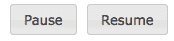

与其他 UI 小部件和交互一样，按钮接受几个选项。例如，我们可能希望为我们的两个按钮提供适当的图标；按钮小部件带有大量预定义的图标供我们使用。为此，我们可以将我们的`.button()`调用分成两部分，并分别指定每个图标，如下所示：

```js
$(() => {
  $('<button/>')
    .text('Pause')
    .button({
      icons: { primary: 'ui-icon-pause' }
    })
    .click(() => {
      // ...
    })
    .appendTo($controls);
  $('<button/>')
    .text('Resume')
    .button({
      icons: { primary: 'ui-icon-play' }
    })
    .click((e) => {
      // ...
    })
    .appendTo($controls);
});

```

列表 7.15

我们指定的`primary`图标对应于 jQuery UI 主题框架中的标准类名。默认情况下，`primary`图标显示在按钮文本的左侧，而`secondary`图标显示在右侧：

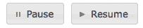

另一方面，其他小部件要复杂得多。**滑块**小部件引入了一个全新的表单元素，类似于 HTML5 的范围元素，但与所有流行的浏览器兼容。这支持更高程度的自定义，如下面的代码所示：

```js
$(() => {
  $('<div/>')
    .attr('id', 'slider')
    .slider({
      min: 0,
      max: $books.find('li').length - 1
    })
    .appendTo($controls);
});

```

列表 7.16

对`.slider()`的调用将一个简单的`<div>`元素转换为滑块小部件。该小部件可以通过拖动或按箭头键来控制，以帮助实现可访问性：


在 *清单 7.16* 中，我们为滑块指定了一个最小值 `0`，并为幻灯片展示中的最后一本书的索引设置了最大值。我们可以将这个作为幻灯片的手动控制，通过在它们各自的状态改变时在幻灯片和滑块之间发送消息。

为了对滑块值的变化做出反应，我们可以将处理程序绑定到由滑块触发的自定义事件上。这个事件，`slide`，不是一个原生的 JavaScript 事件，但在我们的 jQuery 代码中表现得像一个。然而，观察这些事件是如此常见，以至于我们可以不需要显式地调用 `.on()`，而是可以直接将我们的事件处理程序添加到 `.slider()` 调用本身，如下面的代码所示：

```js
$(() => {
  $('<div/>')
    .attr('id', 'slider')
    .slider({
      min: 0,
      max: $books.find('li').length - 1,
      slide: (e, ui) => {
        $books.cycle(ui.value);
      }
    })
    .appendTo($controls);
});

```

清单 7.17

每当调用 `slide` 回调时，它的 `ui` 参数就会填充有关小部件的信息，包括其当前值。通过将这个值传递给 Cycle 插件，我们可以操作当前显示的幻灯片。

我们还需要在幻灯片向前切换到另一个幻灯片时更新滑块小部件。为了在这个方向上进行通信，我们可以使用 Cycle 的 `before` 回调，在每次幻灯片转换之前触发：

```js
$(() => {
  const $books = $('#books').cycle({
    timeout: 2000,
    speed: 200,
    pause: true,
    before: (li) => {
      $('#slider')
        .slider(
          'value',
          $('#books li').index(li)
        );
    }
  });
});

```

清单 7.18

在 `before` 回调中，我们再次调用 `.slider()` 方法。这一次，我们将 `value` 作为它的第一个参数调用，以设置新的滑块值。在 jQuery UI 的术语中，我们将 `value` 称为滑块的 *方法*，尽管它是通过调用 `.slider()` 方法而不是通过自己的专用方法名称来调用的。

其他小部件

其他 jQuery UI 小部件包括 Datepicker、Dialog、Tabs 和 Accordion。每个小部件都有几个相关的选项、事件和方法。完整列表，请访问

[jQuery UI](http://jqueryui.com/).

# jQuery UI ThemeRoller

jQuery UI 库最令人兴奋的功能之一是 ThemeRoller，这是一个基于 Web 的交互式主题引擎，用于 UI 小部件。ThemeRoller 使得创建高度定制、专业外观的元素变得快速简单。我们刚刚创建的按钮和滑块都应用了默认主题；如果没有提供自定义设置，这个主题将从 *ThemeRoller* 输出：

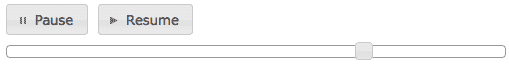

生成完全不同风格的样式只需简单访问

[`jqueryui.com/themeroller/`](http://jqueryui.com/themeroller/)，根据需要修改各种选项，然后按下下载主题按钮。然后，可以将样式表和图像的 `.zip` 文件解压缩到您的站点目录中。例如，通过选择几种不同的颜色和纹理，我们可以在几分钟内为我们的按钮、图标和滑块创建一个新的协调外观，如下面的屏幕截图所示：


# jQuery Mobile 插件库

我们已经看到 jQuery UI 如何帮助我们组装即使是复杂 web 应用程序所需的用户界面特性。它克服的挑战是多样且复杂的。然而，当为移动设备设计我们的页面以进行优雅的呈现和交互时，存在一组不同的障碍。为了创建现代智能手机和平板电脑的网站或应用程序，我们可以转向 jQuery Mobile 项目。

与 jQuery UI 一样，jQuery Mobile 由一套相关组件组成，可以*单独使用*，但可以无缝地一起工作。该框架提供了一个基于 Ajax 的导航系统、移动优化的交互元素和高级触摸事件处理程序。与 jQuery UI 一样，探索 jQuery Mobile 的所有功能是一个艰巨的任务，因此我们将提供一些简单的示例，并参考官方文档了解更多细节。

jQuery Mobile 的下载、文档和演示可在以下位置找到：

[`jquerymobile.com/`](http://jquerymobile.com/).

我们的 jQuery Mobile 示例将使用 Ajax 技术，因此需要网页服务器软件才能尝试这些示例。更多信息可在第六章中找到，*使用 Ajax 发送数据*。

# HTML5 自定义 data 属性

到目前为止，在本章中我们看到的代码示例都是使用 JavaScript API 暴露的插件来调用插件功能。我们已经看到了 jQuery 对象方法、全局函数和自定义选择器是插件向脚本提供服务的一些方式。jQuery Mobile 库也有这些入口点，但与其进行交互的最常见方式是使用 HTML5 data 属性。

HTML5 规范允许我们在元素中插入任何我们想要的属性，只要属性以 `data-` 为前缀。在呈现页面时，这些属性将完全被忽略，但在我们的 jQuery 脚本中可以使用。当我们在页面中包含 jQuery Mobile 时，脚本会扫描页面寻找一些 `data-*` 属性，并将移动友好的特性添加到相应的元素。

jQuery Mobile 库会寻找几个特定的自定义 data 属性。我们将在第十二章中检查在我们自己的脚本中使用此功能的更一般的方法，*高级 DOM 操作*。

由于这种设计选择，我们将能够演示 jQuery Mobile 的一些强大特性，而无需自己编写任何 JavaScript 代码。

# 移动导航

jQuery Mobile 最显著的特性之一是它能够将页面上链接的行为简单地转变为 Ajax 驱动的导航。这种转变会为此过程添加简单的动画，同时保留了标准浏览器历史导航。为了看到这一点，我们将从一个呈现有关几本书信息的链接的文档开始（与我们之前用于构建幻灯片放映的相同内容），如下所示：

```js
<!DOCTYPE html>  
<html>  
<head>  
  <title>jQuery Book Browser</title>  
  <link rel="stylesheet" href="booklist.css" type="text/css" /> 
  <script src="img/jquery.js"></script> 
</head>  
<body>  

<div> 
  <div> 
    <h1>Selected jQuery Books</h1> 
  </div> 

  <div> 
    <ul> 
      <li><a href="jq-game.html">jQuery Game Development  
        Essentials</a></li> 
      <li><a href="jqmobile-cookbook.html">jQuery Mobile  
        Cookbook</a></li> 
      <li><a href="jquery-designers.html">jQuery for  
        Designers</a></li> 
      <li><a href="jquery-hotshot.html">jQuery Hotshot</a></li> 
      <li><a href="jqui-cookbook.html">jQuery UI Cookbook</a></li> 
      <li><a href="mobile-apps.html">Creating Mobile Apps with  
        jQuery Mobile</a></li> 
      <li><a href="drupal-7.html">Drupal 7 Development by  
        Example</a></li> 
      <li><a href="wp-mobile-apps.html">WordPress Mobile  
        Applications with PhoneGap</a></li> 
    </ul> 
  </div> 
</div> 

</body> 
</html>

```

在本章的可下载代码包中，可以在名为`mobile.html`的文件中找到完成的 HTML 示例页面。

到目前为止，我们还没有介绍 jQuery Mobile，页面呈现出默认的浏览器样式，正如我们所预期的那样。以下是屏幕截图：

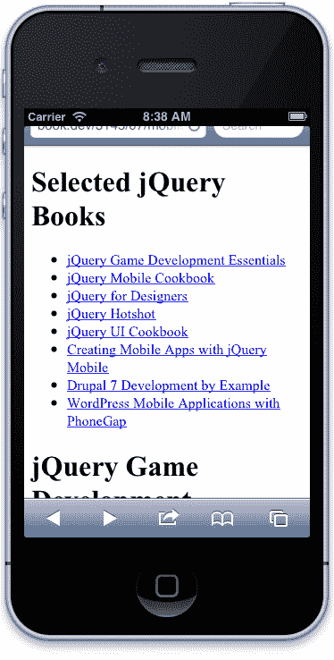

我们的下一步是更改文档的`<head>`部分，以便引用 jQuery Mobile 及其样式表，如下所示：

```js
<head>  
  <title>jQuery Book Browser</title>  
  <meta name="viewport" 
    content="width=device-width, initial-scale=1">  
  <link rel="stylesheet" href="booklist.css"  
    type="text/css" /> 
  <link rel="stylesheet" 
    href="jquery.mobile/jquery.mobile.css" type="text/css" /> 
  <script src="img/jquery.js"></script> 
  <script src="img/jquery-migrate.js"></script>
  <script src="img/jquery.mobile.js"></script> 
</head>

```

请注意，我们还引入了一个定义页面视口的`<meta>`元素。这个声明告诉移动浏览器按照完全填充设备宽度的方式缩放文档的内容。

我们必须在页面中包含 jquery-migrate 插件，因为如果没有它，最新稳定版本的 jQuery 就不能与最新稳定版本的 jQuery Mobile 一起工作。想想这个问题。无论如何，一旦这两者正式配合起来，你可以简单地从页面中删除 jquery-migrate 插件。

jQuery Mobile 样式现在应用于我们的文档，显示出更大的无衬线字体，更新颜色和间距，如下图所示：

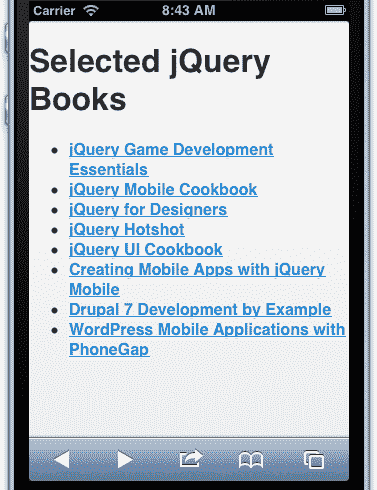

为了正确处理导航，jQuery Mobile 需要理解我们页面的结构。我们通过使用`data-role`属性来提供这些信息：

```js
<div data-role="page"> 
  <div data-role="header"> 
    <h1>Selected jQuery Books</h1> 
  </div> 

  <div data-role="content"> 
    <ul> 
      <li><a href="jq-game.html">jQuery Game Development  
        Essentials</a></li> 
      <li><a href="jqmobile-cookbook.html">jQuery Mobile  
        Cookbook</a></li> 
      <li><a href="jquery-designers.html">jQuery for  
        Designers</a></li> 
      <li><a href="jquery-hotshot.html">jQuery Hotshot</a></li> 
      <li><a href="jqui-cookbook.html">jQuery UI Cookbook</a></li> 
      <li><a href="mobile-apps.html">Creating Mobile Apps with  
        jQuery Mobile</a></li> 
      <li><a href="drupal-7.html">Drupal 7 Development by  
        Example</a></li> 
      <li><a href="wp-mobile-apps.html">WordPress Mobile  
        Applications with PhoneGap</a></li> 
    </ul> 
  </div> 
</div>

```

现在页面加载时，jQuery Mobile 注意到我们有一个页面标题，并在页面顶部渲染出一个标准的移动设备标题栏：

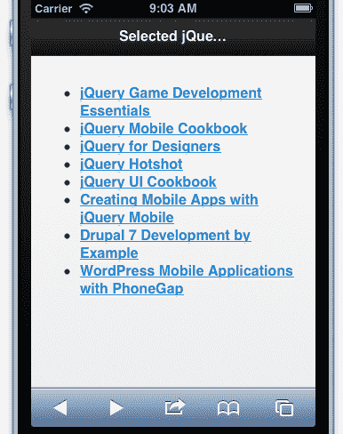

当文本过长时超出标题栏，jQuery Mobile 会截断它，并在末尾添加省略号。在这种情况下，我们可以将移动设备旋转到横向方向以查看完整标题：

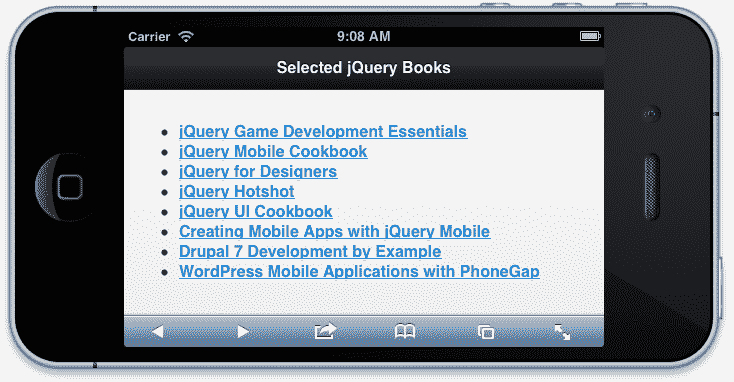

更重要的是，为了产生 Ajax 导航，这就是所需的全部内容。在从此列表链接到的页面上，我们使用类似的标记：

```js
<div data-role="page"> 
  <div data-role="header"> 
    <h1>WordPress Mobile Applications with PhoneGap</h1> 
  </div> 
  <div data-role="content"> 
     
    <div class="title">WordPress Mobile Applications with  
      PhoneGap</div> 
    <div class="author">Yuxian Eugene Liang</div> 
  </div> 
</div>

```

当点击到这个页面的链接时，jQuery Mobile 使用 Ajax 调用加载页面，抓取带有`data-role="page"`标记的文档部分，并使用淡入过渡显示这些内容：


# 在一个文档中提供多个页面

除了提供用于加载其他文档的 Ajax 功能外，jQuery Mobile 还提供了在单个文档中包含所有内容时提供相同用户体验的工具。为了实现这一点，我们只需使用标准的`#`符号将页面中的锚点链接起来，并将页面的那些部分标记为`data-role="page"`，就像它们在单独的文档中一样，如下所示：

```js
<div data-role="page"> 
  <div data-role="header"> 
    <h1>Selected jQuery Books</h1> 
  </div> 

  <div data-role="content"> 
    <ul> 
      <li><a href="#jq-game">jQuery Game Development  
        Essentials</a></li> 
      <li><a href="#jqmobile-cookbook">jQuery Mobile  
        Cookbook</a></li> 
      <li><a href="#jquery-designers">jQuery for  
        Designers</a></li> 
      <li><a href="#jquery-hotshot">jQuery Hotshot</a></li> 
      <li><a href="#jqui-cookbook">jQuery UI Cookbook</a></li> 
      <li><a href="#mobile-apps">Creating Mobile Apps with jQuery  
        Mobile</a></li> 
      <li><a href="#drupal-7">Drupal 7 Development by  
        Example</a></li> 
      <li><a href="wp-mobile-apps.html">WordPress Mobile  
        Applications with PhoneGap</a></li> 
    </ul> 
  </div> 
</div> 

<div id="jq-game" data-role="page"> 
  <div data-role="header"> 
    <h1>jQuery Game Development Essentials</h1> 
  </div> 
  <div data-role="content"> 
     
    <div class="title">jQuery Game Development Essentials</div> 
    <div class="author">Salim Arsever</div> 
  </div> 
</div>

```

我们可以根据自己的方便选择这两种技术。将内容放在单独的文档中允许我们延迟加载信息，直到需要时，但这会增加一些开销，因为需要多个页面请求。

# 交互元素

jQuery Mobile 提供的功能主要是用于页面上的特定交互元素。这些元素增强了基本的网页功能，使页面组件在触摸界面上更加用户友好。其中包括手风琴式可折叠部分、切换开关、滑动面板和响应式表格。

jQuery UI 和 jQuery Mobile 提供的用户界面元素有很大的重叠。不建议在同一页上同时使用这两个库，但由于最重要的小部件都被两者提供，所以很少有这样的需要。

# 列表视图

由于它们的小型垂直屏幕布局，智能手机应用程序通常是以列表为主导的。我们可以使用 jQuery Mobile 轻松地增强页面上的列表，使它们的行为更像这些常见的本地应用程序元素。再次，我们只需引入 HTML5 自定义数据属性：

```js
<ul data-role="listview" data-inset="true"> 
  <li><a href="#jq-game">jQuery Game Development  
    Essentials</a></li> 
  <li><a href="#jqmobile-cookbook">jQuery Mobile Cookbook</a></li> 
  <li><a href="#jquery-designers">jQuery for Designers</a></li> 
  <li><a href="#jquery-hotshot">jQuery Hotshot</a></li> 
  <li><a href="#jqui-cookbook">jQuery UI Cookbook</a></li> 
  <li><a href="#mobile-apps">Creating Mobile Apps with jQuery  
    Mobile</a></li> 
  <li><a href="#drupal-7">Drupal 7 Development by Example</a></li> 
  <li><a href="wp-mobile-apps.html">WordPress Mobile Applications  
    with PhoneGap</a></li> 
</ul>

```

添加 `data-role="listview"` 告诉 jQuery Mobile 将此列表中的链接设为大号，并且易于在触摸界面中用手指激活，而 `data-inset="true"` 则为列表提供了一个漂亮的边框，将其与周围内容分隔开来。结果是一个熟悉的、具有本地外观的控件，如下所示：

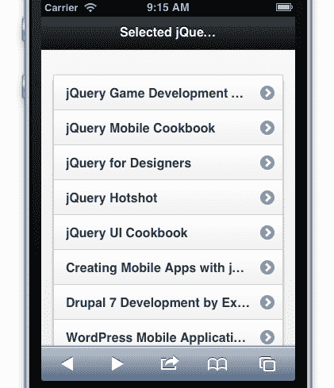

现在，我们有了大型触摸目标，但我们可以再进一步。移动应用程序中的类似列表视图通常会与搜索字段配对，以缩小列表中的项目。我们可以通过引入 `data-filter` 属性来添加这样一个字段，如下所示：

```js
<ul data-role="listview" data-inset="true" data-filter="true">

```

结果是一个带有适当图标的圆角输入框，放置在列表上方：

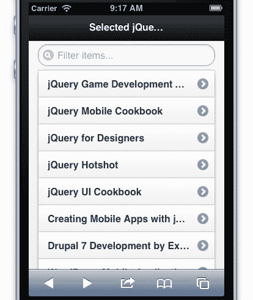

尽管我们没有添加任何自己的代码，但这个搜索字段看起来不仅本地化，而且行为也是正确的：

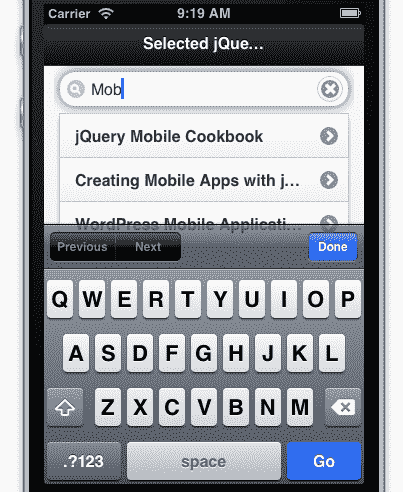

# 工具栏按钮

另一个由 jQuery Mobile 增强的用户界面元素是简单按钮。就像 jQuery UI 允许我们标准化按钮外观一样，jQuery Mobile 增加了按钮的大小并修改了外观，以优化它们用于触摸输入。

在某些情况下，jQuery Mobile 甚至会为我们创建适当的按钮，在以前没有的情况下。例如，在移动应用程序的工具栏中通常有按钮。一个标准按钮是屏幕左上角的返回按钮，允许用户向上导航一级。如果我们为页面的 `<div>` 元素添加 `data-add-back-btn` 属性，我们就可以在不进行任何脚本工作的情况下获得此功能：

```js
<div data-role="page" data-add-back-btn="true">

```

一旦添加了这个属性，每次导航到一个页面时，都会在工具栏上添加一个标准的返回按钮：

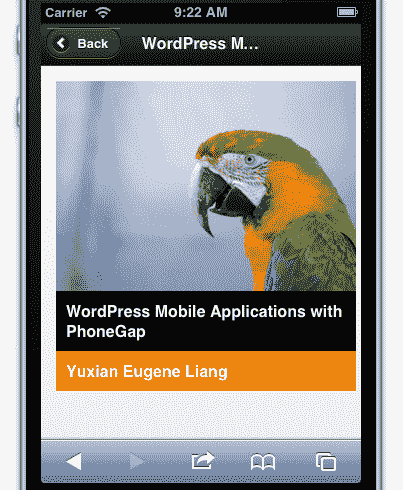

可以在 [`jquerymobile.com/`](http://jquerymobile.com/) 找到用于初始化和配置 jQuery Mobile 小部件的完整 HTML5 数据属性列表。

# 高级功能

随着我们的移动页面需要更多定制设计元素和更复杂的交互，jQuery Mobile 提供了强大的工具来帮助我们创建它们。所有功能都在 jQuery Mobile 网站上有文档记录 ([`jquerymobile.com/`](http://jquerymobile.com/))。虽然这些功能在此处详细讨论起来既过于高级又过于繁多，但还是值得简要提及一些：

+   **移动友好事件**：当在页面上引用 jQuery Mobile 时，我们的 jQuery 代码可以访问许多特殊事件，包括 `tap`、`taphold` 和 `swipe`。对于这些事件的处理程序可以与任何其他事件一样使用`.on()` 方法进行绑定。特别是对于 `taphold` 和 `swipe`，它们的默认配置（包括触摸持续时间）可以通过访问`$.event.special.taphold` 和 `$.event.special.swipe` 对象的属性进行修改。除了基于触摸的事件外，jQuery Mobile 还提供了对滚动、方向更改以及其页面导航的各个阶段以及一组虚拟化鼠标事件的特殊事件的支持，这些事件对鼠标和触摸都做出反应。

+   **主题化**：与 jQuery UI 一样，jQuery Mobile 提供了一个 ThemeRoller。

    ([`jquerymobile.com/themeroller/`](http://jquerymobile.com/themeroller/)) 用于自定义小部件的外观和感觉。

+   **PhoneGap 集成**：使用 jQuery Mobile 构建的站点可以轻松转换为原生移动应用程序，使用 PhoneGap（Cordova），可访问移动设备 API（如相机、加速计和地理位置）和应用商店。`$.support.cors` 和 `$.mobile.allowCrossDomainPages` 属性甚至可以允许访问不包含在应用程序中的页面，例如远程服务器上的页面。

# 总结

在本章中，我们探讨了如何将第三方插件整合到我们的网页中。我们仔细研究了 Cycle 插件、jQuery UI 和 jQuery Mobile，并在此过程中学习了我们将在其他插件中反复遇到的模式。在下一章中，我们将利用 jQuery 的插件架构开发一些不同类型的插件。

# 练习

1.  将循环转换持续时间增加到半秒，并更改动画，使每个幻灯片在下一个幻灯片淡出之前淡入。参考循环文档以找到启用此功能的适当选项。

1.  将`cyclePaused` cookie 设置为持续 30 天。

1.  限制标题框只能以十个像素为增量调整大小。

1.  让滑块在幻灯片播放时从一个位置平稳地动画到下一个位置。

1.  不要让幻灯片播放循环无限，使其在显示最后一张幻灯片后停止。当发生这种情况时，禁用按钮和滑块。

1.  创建一个新的 jQuery UI 主题，具有浅蓝色小部件背景和深蓝色文本，并将主题应用到我们的示例文档中。

1.  修改`mobile.html`中的 HTML，使得列表视图按照书名的首字母分隔。详细信息请参阅 jQuery Mobile 文档中关于`data-role="list-divider"`的部分。
