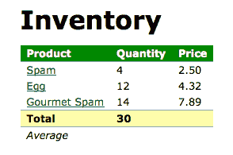
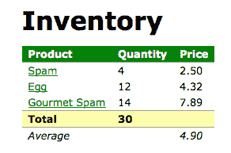
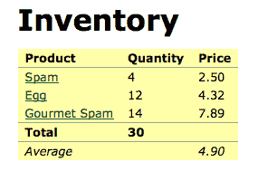
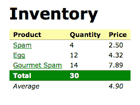
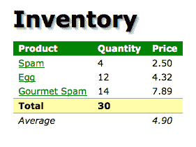
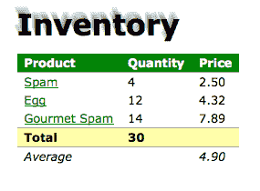
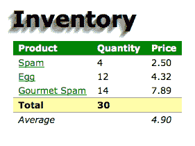
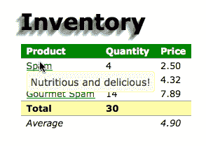

# 第八章：开发插件

可用的第三方插件提供了丰富的选项来增强我们的编码体验，但有时我们需要更进一步。当我们编写可以被其他人甚至只是我们自己重复使用的代码时，我们可能希望将其打包为一个新的插件。幸运的是，开发插件的过程与编写使用它的代码并没有太大区别。

在本章中，我们将介绍：

+   在`jQuery`命名空间中添加新的全局函数

+   添加 jQuery 对象方法以允许我们对 DOM 元素进行操作

+   使用 jQuery UI 小部件工厂创建小部件插件

+   分发插件

# 在插件中使用美元（$）别名

当我们编写 jQuery 插件时，必须假设 jQuery 库已加载。但是我们不能假设美元（$）别名可用。回顾一下第三章中的内容，*事件处理*，`$.noConflict()`方法可以放弃对这个快捷方式的控制。为了解决这个问题，我们的插件应该始终使用完整的 jQuery 名称调用 jQuery 方法，或者在内部定义`$`自己。

尤其是在较大的插件中，许多开发人员发现缺少美元符号（`$`）快捷方式使得代码更难阅读。为了解决这个问题，可以通过定义一个函数并立即调用它来为插件的范围定义快捷方式。这种定义并立即调用函数的语法，通常被称为**立即调用函数表达式**（**IIFE**），看起来像这样：

```js
(($) => { 
  // Code goes here 
})(jQuery); 

```

包装函数接受一个参数，我们将全局`jQuery`对象传递给它。参数被命名为`$`，所以在函数内部我们可以使用美元（$）别名而不会出现冲突。

# 添加新的全局函数

jQuery 的一些内置功能是通过我们一直称为全局函数的方式提供的。正如我们所见，这些实际上是 jQuery 对象的方法，但从实际操作上来说，它们是`jQuery`命名空间中的函数。

这种技术的一个典型例子是`$.ajax()`函数。`$.ajax()`所做的一切都可以通过一个名为`ajax()`的常规全局函数来实现，但是这种方法会使我们容易遇到函数名冲突。通过将函数放置在`jQuery`命名空间中，我们只需要担心与其他 jQuery 方法的冲突。这个`jQuery`命名空间还向那些可能使用插件的人们表明，需要 jQuery 库。

jQuery 核心库提供的许多全局函数都是实用方法；也就是说，它们为经常需要但不难手动完成的任务提供了快捷方式。数组处理函数`$.each()`、`$.map()`和`$.grep()`就是这样的好例子。为了说明创建这种实用方法，我们将向其中添加两个简单的函数。

要将函数添加到`jQuery`命名空间中，我们只需将新函数作为`jQuery`对象的属性赋值即可：

```js
(($) => { 
  $.sum = (array) => { 
    // Code goes here 
  }; 
})(jQuery); 

```

列表 8.1

现在，在使用此插件的任何代码中，我们可以写：

```js
$.sum(); 

```

这将像基本函数调用一样工作，并且函数内部的代码将被执行。

这个`sum`方法将接受一个数组，将数组中的值相加，并返回结果。我们插件的代码相当简洁：

```js
(($) => {
  $.sum = array =>
    array.reduce(
      (result, item) =>
        parseFloat($.trim(item)) + result,
      0
    );
})(jQuery); 

```

**清单 8.2**

要计算总和，我们在数组上调用`reduce()`，它简单地迭代数组中的每个项，并将其添加到`result`中。在前面的代码中，有两个返回值的回调函数。它们都没有`return`语句，因为它们是箭头函数。当我们不包括花括号（`{}`）时，返回值是隐式的。

为了测试我们的插件，我们将构建一个简单的带有杂货清单的表格：

```js
<table id="inventory"> 
  <thead> 
    <tr class="one"> 
      <th>Product</th> <th>Quantity</th> <th>Price</th> 
    </tr> 
  </thead> 
  <tfoot> 
    <tr class="two" id="sum"> 
      <td>Total</td> <td></td> <td></td> 
    </tr> 
    <tr id="average"> 
      <td>Average</td> <td></td> <td></td> 
    </tr> 
  </tfoot> 
  <tbody> 
    <tr> 
      <td><a href="spam.html" data-tooltip-text="Nutritious and        
      delicious!">Spam</a></td> <td>4</td> <td>2.50</td> 
    </tr> 
    <tr> 
      <td><a href="egg.html" data-tooltip-text="Farm fresh or        
      scrambled!">Egg</a></td> <td>12</td> <td>4.32</td> 
    </tr> 
    <tr> 
      <td><a href="gourmet-spam.html" data-tooltip-text="Chef        
      Hermann's recipe.">Gourmet Spam</a></td> <td>14</td> <td>7.89         
      </td> 
    </tr> 
  </tbody> 
</table> 

```

获取示例代码

您可以从以下 GitHub 存储库访问示例代码：[`github.com/PacktPublishing/Learning-jQuery-3`](https://github.com/PacktPublishing/Learning-jQuery-3)。

现在，我们将编写一个简短的脚本，将适当的表格页脚单元格填充为所有数量的总和：

```js
$(() => {
  const quantities = $('#inventory tbody')
    .find('td:nth-child(2)')
    .map((index, qty) => $(qty).text())
    .get();
  const sum = $.sum(quantities);

  $('#sum')
    .find('td:nth-child(2)')
    .text(sum);
});

```

**清单 8.3**

查看呈现的 HTML 页面可验证我们的插件是否正常工作：



# 添加多个函数

如果我们的插件需要提供多个全局函数，我们可以独立声明它们。在这里，我们将修改我们的插件，添加一个计算数字数组平均值的函数：

```js
(($) => {
  $.sum = array =>
    array.reduce(
      (result, item) =>
        parseFloat($.trim(item)) + result,
      0
    );

  $.average = array =>
    Array.isArray(array) ?
      $.sum(array) / array.length :
      '';
})(jQuery); 

```

**清单 8.4**

为了方便和简洁，我们使用`$.sum()`插件来辅助我们返回`$.average()`的值。为了减少错误的几率，我们还检查参数以确保其是一个数组，然后再计算平均值。

现在定义了第二种方法，我们可以以相同的方式调用它：

```js
$(() => {
  const $inventory = $('#inventory tbody');
  const prices = $inventory
    .find('td:nth-child(3)')
    .map((index, qty) => $(qty).text())
    .get();
  const average = $.average(prices);

  $('#average')
    .find('td:nth-child(3)')
    .text(average.toFixed(2));
});

```

**清单 8.5**

平均值现在显示在第三列中：



# 扩展全局 jQuery 对象

我们还可以使用`$.extend()`函数以定义我们的函数的另一种语法：

```js
(($) => {
  $.extend({
    sum: array =>
      array.reduce(
        (result, item) =>
          parseFloat($.trim(item)) + result,
        0
      ),
    average: array =>
      Array.isArray(array) ?
        $.sum(array) / array.length :
        ''
  });
})(jQuery); 

```

**清单 8.6**

这样调用时，`$.extend()`添加或替换全局 jQuery 对象的属性。因此，这与先前的技术产生相同的结果。

# 在命名空间内隔离函数

现在，我们的插件在`jQuery`命名空间内创建了两个单独的全局函数。在这里，我们面临一种不同类型的命名空间污染风险；虽然我们仍然可能与其他 jQuery 插件中定义的函数名冲突。为了避免这种情况，最好将给定插件的所有全局函数封装到单个对象中：

```js
(($) => {
  $.mathUtils = {
    sum: array =>
      array.reduce(
        (result, item) =>
          parseFloat($.trim(item)) + result,
        0
      ),
    average: array =>
      Array.isArray(array) ?
        $.mathUtils.sum(array) / array.length :
        ''
  };
})(jQuery); 

```

**清单 8.7**

此模式实质上为我们的全局函数创建了另一个命名空间，称为`jQuery.mathUtils`。虽然我们仍然非正式地称这些函数为全局函数，但它们现在是`mathUtils`对象的方法，后者本身是全局 jQuery 对象的属性。因此，在我们的函数调用中，我们必须包含插件名称：

```js
$.mathUtils.sum(array); 
$.mathUtils.average(array); 

```

通过这种技术（和足够独特的插件名称），我们可以在全局函数中避免命名空间冲突。这样，我们就掌握了插件开发的基础知识。将我们的函数保存在名为`jquery.mathutils.js`的文件中后，我们可以包含此脚本，并在页面上的其他脚本中使用这些函数。

选择命名空间

对于仅供个人使用的功能，将其放置在我们项目的全局命名空间中通常更合理。因此，我们可以选择暴露我们自己的一个全局对象，而不是使用`jQuery`。例如，我们可以有一个名为`ljQ`的全局对象，并定义`ljQ.mathUtils.sum()`和`ljQ.mathUtils.average()`方法，而不是`$.mathUtils.sum()`和`$.mathUtils.average()`。这样，我们完全消除了选择包含的第三方插件发生命名空间冲突的可能性。

因此，我们现在已经了解了 jQuery 插件提供的命名空间保护和保证库的可用性。然而，这些仅仅是组织上的好处。要真正发挥 jQuery 插件的威力，我们需要学会如何在单个 jQuery 对象实例上创建新方法。

# 添加 jQuery 对象方法

大多数 jQuery 内置功能是通过其对象实例方法提供的，插件的具有同样出色的表现。每当我们要编写作用于 DOM 一部分的函数时，可能更适合创建一个**实例方法**。

我们已经看到，添加全局函数需要使用`jQuery`对象扩展新方法。添加实例方法是类似的，但我们要扩展`jQuery.fn`对象：

```js
jQuery.fn.myMethod = function() { 
  alert('Nothing happens.'); 
}; 

```

`jQuery.fn`对象是`jQuery.prototype`的别名，用于简洁性。

然后，我们可以在使用选择器表达式后，从我们的代码中调用这个新方法：

```js
$('div').myMethod(); 

```

当我们调用方法时，我们的警报显示（对于文档中的每个`<div>`都会显示一次）。不过，我们既然没有以任何方式使用匹配的 DOM 节点，我们可能也可以编写一个全局函数。一个合理的方法实现会作用于其上下文。

# 对象方法上下文

在任何插件方法中，关键字`this`被设置为当前的 jQuery 对象。因此，我们可以在`this`上调用任何内置的 jQuery 方法，或者提取其 DOM 节点并对它们进行操作。为了检查我们可以用对象上下文做什么，我们将编写一个小插件来操作匹配元素上的类。

我们的新方法将接受两个类名，并交换每次调用时应用于每个元素的类。虽然 jQuery UI 有一个强大的`.switchClass()`方法，甚至允许动画地改变类，但我们将提供一个简单的实现作为演示目的：

```js
(function($) {
  $.fn.swapClass = function(class1, class2) {
    if (this.hasClass(class1)) {
      this
        .removeClass(class1)
        .addClass(class2);
    } else if (this.hasClass(class2)) {
      this
        .removeClass(class2)
        .addClass(class1);
    }
  };
})(jQuery);

$(() => {
  $('table')
    .click(() => {
      $('tr').swapClass('one', 'two');
    });
});

```

图 8.8

在我们的插件中，我们首先测试匹配元素上是否存在`class1`，如果存在则用`class2`替换。否则，我们测试是否存在`class2`，如果必要则切换为`class1`。如果当前没有任何类，则我们不执行任何操作。

在使用插件的代码中，我们将`click`处理程序绑定到表格上，在单击表格时对每一行调用`.swapClass()`。我们希望这将把标题行的类从`one`更改为`two`，并将总和行的类从`two`更改为`one`。

然而，我们观察到了不同的结果：



每一行都收到了`two`类。要解决这个问题，我们需要正确处理具有多个选定元素的 jQuery 对象。

# 隐式迭代

我们需要记住，jQuery 选择器表达式总是可以匹配零个、一个或多个元素。在设计插件方法时，我们必须考虑到这些情况中的任何一种。在这种情况下，我们正在调用`.hasClass()`，它仅检查第一个匹配的元素。相反，我们需要独立地检查每个元素并对其采取行动。

无论匹配的元素数量如何，保证正确行为的最简单方法是始终在方法上下文中调用`.each()`；这强制执行隐式迭代，这对于保持插件和内置方法之间的一致性至关重要。在`.each()`回调函数中，第二个参数依次引用每个 DOM 元素，因此我们可以调整我们的代码来分别测试和应用类到每个匹配的元素：

```js
(function($) {
  $.fn.swapClass = function(class1, class2) {
    this
      .each((i, element) => {
        const $element = $(element);

        if ($element.hasClass(class1)) {
          $element
            .removeClass(class1)
            .addClass(class2);
        } else if ($element.hasClass(class2)) {
          $element
            .removeClass(class2)
            .addClass(class1);
        }
      });
  };
})(jQuery); 

```

列表 8.9

现在，当我们点击表格时，切换类而不影响没有应用任何类的行：



# 启用方法链

除了隐式迭代之外，jQuery 用户还应该能够依赖链接行为。这意味着我们需要从所有插件方法中返回一个 jQuery 对象，除非该方法明确用于检索不同的信息片段。返回的 jQuery 对象通常只是作为`this`提供的一个。如果我们使用`.each()`来迭代`this`，我们可以直接返回其结果：

```js
(function($) {
  $.fn.swapClass = function(class1, class2) {
    return this
      .each((i, element) => {
        const $element = $(element);

        if ($element.hasClass(class1)) {
          $element
            .removeClass(class1)
            .addClass(class2);
        } else if ($element.hasClass(class2)) {
          $element
            .removeClass(class2)
            .addClass(class1);
        }
      });
  };
})(jQuery); 

```

列表 8.10

之前，当我们调用`.swapClass()`时，我们必须开始一个新语句来处理元素。然而，有了`return`语句，我们可以自由地将我们的插件方法与内置方法链接起来。

# 提供灵活的方法参数

在第七章 *使用插件* 中，我们看到了一些插件，可以通过参数进行微调，以达到我们想要的效果。我们看到，一个构造巧妙的插件通过提供合理的默认值来帮助我们，这些默认值可以被独立地覆盖。当我们制作自己的插件时，我们应该以用户为重心来遵循这个例子。

为了探索各种方法，让插件的用户自定义其行为，我们需要一个具有多个可以进行调整和修改的设置的示例。作为我们的示例，我们将通过使用更为武断的 JavaScript 方法来复制 CSS 的一个特性--这种方法更适合于演示而不是生产代码。我们的插件将通过在页面上不同位置叠加部分透明的多个副本来模拟元素上的阴影：

```js
(function($) {
  $.fn.shadow = function() {
    return this.each((i, element) => {
      const $originalElement = $(element);

      for (let i = 0; i < 5; i++) {
        $originalElement
          .clone()
          .css({
            position: 'absolute',
            left: $originalElement.offset().left + i,
            top: $originalElement.offset().top + i,
            margin: 0,
            zIndex: -1,
            opacity: 0.1
          })
          .appendTo('body');
      }
    });
  };
})(jQuery); 

```

代码清单 8.11

对于每个调用此方法的元素，我们会制作多个元素的克隆，并调整它们的不透明度。这些克隆元素被绝对定位在原始元素的不同偏移量处。目前，我们的插件不接受参数，因此调用该方法很简单：

```js
$(() => { 
  $('h1').shadow(); 
}); 

```

此方法调用会在标题文本上产生一个非常简单的阴影效果：



接下来，我们可以为插件方法引入一些灵活性。该方法的操作依赖于用户可能希望修改的几个数值。我们可以将它们转换为参数，以便根据需要进行更改。

# 选项对象

我们在 jQuery API 中看到了许多示例，其中`options`对象被提供为方法的参数，例如`.animate()`和`$.ajax()`。这可以是向插件用户公开选项的更友好的方式，而不是我们刚刚在`.swapClass()`插件中使用的简单参数列表。对象文字为每个参数提供了可视标签，并且使参数的顺序变得无关紧要。此外，每当我们可以在我们的插件中模仿 jQuery API 时，我们都应该这样做。这将增加一致性，从而提高易用性：

```js
(($) => {
  $.fn.shadow = function(options) {
    return this.each((i, element) => {
      const $originalElement = $(element);

      for (let i = 0; i < options.copies; i++) {
        $originalElement
          .clone()
          .css({
            position: 'absolute',
            left: $originalElement.offset().left + i,
            top: $originalElement.offset().top + i,
            margin: 0,
            zIndex: -1,
            opacity: options.opacity
          })
          .appendTo('body');
      }
    });
  };
})(jQuery);

```

代码清单 8.12

现在可以自定义制作的副本数量及其不透明度。在我们的插件中，每个值都作为函数的`options`参数的属性访问。

现在调用此方法需要我们提供包含选项值的对象：

```js
$(() => {
  $('h1')
    .shadow({ 
      copies: 3, 
      opacity: 0.25 
    }); 
}); 

```

可配置性是一种改进，但现在我们必须每次都提供两个选项。接下来，我们将看看如何允许我们的插件用户省略任一选项。

# 默认参数值

随着方法的参数数量增加，我们不太可能总是想要指定每个参数。合理的默认值集合可以使插件接口更加易用。幸运的是，使用对象传递参数可以帮助我们完成这项任务；简单地省略对象中的任何项并用默认值替换它是很简单的：

```js
(($) => {
  $.fn.shadow = function(opts) {
    const defaults = {
      copies: 5,
      opacity: 0.1
    };
    const options = $.extend({}, defaults, opts); 

    // ... 
  }; 
})(jQuery); 

```

代码清单 8.13

在这里，我们定义了一个名为`defaults`的新对象。 实用函数`$.extend（）`允许我们使用提供的`opts`对象作为参数，并使用`defaults`在必要时创建一个新的`options`对象。 `extend（）`函数将传递给它的任何对象合并到第一个参数中。 这就是为什么我们将空对象作为第一个参数传递的原因，以便我们为选项创建一个新对象，而不是意外地销毁现有数据。 例如，如果默认值在代码的其他位置定义，并且我们意外地替换了其值呢？

我们仍然使用对象字面量调用我们的方法，但现在我们只能指定需要与其默认值不同的参数：

```js
$(() => { 
  $('h1')
    .shadow({ 
      copies: 3 
    }); 
}); 

```

未指定的参数使用其默认值。 `$.extend（）`方法甚至接受 null 值，因此如果默认参数都可接受，则我们的方法可以在不产生 JavaScript 错误的情况下调用：

```js
$(() => { 
  $('h1').shadow(); 
}); 

```

# 回调函数

当然，有些方法参数可能比简单的数字值更复杂。 我们在整个 jQuery API 中经常看到的一种常见参数类型是回调函数。 回调函数可以为插件提供灵活性，而无需在创建插件时进行大量准备。

要在我们的方法中使用回调函数，我们只需将函数对象作为参数接受，并在我们的方法实现中适当地调用该函数。 例如，我们可以扩展我们的文本阴影方法，以允许用户自定义阴影相对于文本的位置：

```js
(($) => {
  $.fn.shadow = function(opts) {
    const defaults = {
      copies: 5,
      opacity: 0.1,
      copyOffset: index => ({
        x: index,
        y: index
      })
    };
    const options = $.extend({}, defaults, opts);

    return this.each((i, element) => {
      const $originalElement = $(element);

      for (let i = 0; i < options.copies; i++) {
        const offset = options.copyOffset(i);

        $originalElement
          .clone()
          .css({
            position: 'absolute',
            left: $originalElement.offset().left + offset.x,
            top: $originalElement.offset().top + offset.y,
            margin: 0,
            zIndex: -1,
            opacity: options.opacity
          })
          .appendTo('body');
      }
    });
  };
})(jQuery);

```

列表 8.14

阴影的每个片段与原始文本的偏移量不同。 以前，此偏移量仅等于副本的索引。 但是，现在，我们正在使用`copyOffset（）`函数计算偏移量，该函数是用户可以覆盖的选项。 因此，例如，我们可以为两个维度的偏移提供负值：

```js
$(() => { 
  $('h1').shadow({ 
    copyOffset: index => ({
      x: -index,
      y: -2 * index
    }) 
  }); 
}); 

```

这将导致阴影向左上方投射，而不是向右下方：



回调函数允许简单修改阴影的方向，或者如果插件用户提供了适当的回调，则允许更复杂的定位。 如果未指定回调，则再次使用默认行为。

# 可定制的默认值

通过为我们的方法参数提供合理的默认值，我们可以改善使用插件的体验，正如我们所见。 但是，有时很难预测什么是合理的默认值。 如果脚本作者需要多次调用我们的插件，并且需要不同于我们设置的默认值的参数集，那么自定义这些默认值的能力可能会显着减少需要编写的代码量。

要使默认值可定制，我们需要将它们从我们的方法定义中移出，并放入可由外部代码访问的位置：

```js
(() => { 
  $.fn.shadow = function(opts) { 
    const options = $.extend({}, $.fn.shadow.defaults, opts); 
    // ... 
  }; 

  $.fn.shadow.defaults = { 
    copies: 5, 
    opacity: 0.1, 
    copyOffset: index => ({
      x: index,
      y: index
    }) 
  }; 
})(jQuery); 

```

列表 8.15

默认值现在在阴影插件的命名空间中，并且可以直接使用 `$.fn.shadow.defaults` 引用。现在，使用我们的插件的代码可以更改所有后续对 `.shadow()` 的调用所使用的默认值。选项也仍然可以在调用方法时提供：

```js
$(() => { 
  $.fn.shadow.defaults.copies = 10;
  $('h1')
    .shadow({
      copyOffset: index => ({
        x: -index,
        y: index
    })
  });
}); 

```

这个脚本将使用 `10` 个元素的副本创建一个阴影，因为这是新的默认值，但也会通过提供的 `copyOffset` 回调将阴影投射到左侧和向下：



# 使用 jQuery UI 小部件工厂创建插件。

正如我们在第七章中看到的，*使用插件*，jQuery UI 有各种各样的小部件--呈现特定类型的 UI 元素的插件，如按钮或滑块。这些小部件向 JavaScript 程序员提供一致的 API。这种一致性使得学习使用其中一个变得容易。当我们编写的插件将创建一个新的用户界面元素时，通过使用小部件插件扩展 jQuery UI 库通常是正确的选择。

小部件是一段复杂的功能，但幸运的是我们不需要自己创建。jQuery UI 核心包含一个名为 `$.widget()` 的 `factory` 方法，它为我们做了很多工作。使用这个工厂将有助于确保我们的代码符合所有 jQuery UI 小部件共享的 API 标准。

使用小部件工厂创建的插件具有许多不错的功能。我们只需很少的努力就能得到所有这些好处（以及更多）：

+   插件变得 **有状态**，这意味着我们可以在应用插件后检查、修改或甚至完全撤销插件的效果。

+   用户提供的选项会自动与可定制的默认选项合并。

+   多个插件方法被无缝地合并为单个 jQuery 方法，接受一个字符串来标识调用哪个子方法。

+   插件触发的自定义事件处理程序可以访问小部件实例的数据。

实际上，这些优势非常好，以至于我们可能希望使用小部件工厂来构建任何合适复杂的插件，无论是 UI 相关的还是其他的。

# 创建一个小部件。

以我们的示例为例，我们将制作一个插件，为元素添加自定义工具提示。一个简单的工具提示实现会为页面上每个要显示工具提示的元素创建一个 `<div>` 容器，并在鼠标光标悬停在目标上时将该容器定位在元素旁边。

jQuery UI 库包含其自己内置的高级工具提示小部件，比我们将在这里开发的更为先进。我们的新小部件将覆盖内置的 `.tooltip()` 方法，这不是我们在实际项目中可能做的事情，但它将允许我们演示几个重要的概念而不会增加不必要的复杂性。

每次调用`$.widget()`时，小部件工厂都会创建一个 jQuery UI 插件。此函数接受小部件的名称和包含小部件属性的对象。小部件的名称必须被命名空间化；我们将使用命名空间`ljq`和插件名称`tooltip`。因此，我们的插件将通过在 jQuery 对象上调用`.tooltip()`来调用。

第一个小部件属性我们将定义为`._create()`：

```js
(($) => {
  $.widget('ljq.tooltip', {
    _create() {
      this._tooltipDiv = $('<div/>')
        .addClass([
          'ljq-tooltip-text',
          'ui-widget',
          'ui-state-highlight',
          'ui-corner-all'
        ].join(' '))
        .hide()
        .appendTo('body');
      this.element
        .addClass('ljq-tooltip-trigger')
        .on('mouseenter.ljq-tooltip', () => { this._open(); })
        .on('mouseleave.ljq-tooltip', () => { this._close(); });
    }
  });
})(jQuery); 

```

列表 8.16

此属性是一个函数，当调用`.tooltip()`时，小部件工厂将每匹配一个元素在 jQuery 对象中调用一次。

小部件属性，如`_create`，以下划线开头，被认为是私有的。我们稍后将讨论公共函数。

在这个创建函数内部，我们设置了我们的提示以便未来显示。为此，我们创建了新的`<div>`元素并将其添加到文档中。我们将创建的元素存储在`this._tooltipDiv`中以备后用。

在我们的函数上下文中，`this`指的是当前小部件实例，我们可以向该对象添加任何属性。该对象还具有一些内置属性，对我们也很方便；特别是，`this.element`给了我们一个指向最初选定的元素的 jQuery 对象。

我们使用`this.element`将`mouseenter`和`mouseleave`处理程序绑定到提示触发元素上。我们需要这些处理程序在鼠标开始悬停在触发器上时打开提示，并在鼠标离开时关闭它。请注意，事件名称被命名空间化为我们的插件名称。正如我们在第三章中讨论的*处理事件*，命名空间使我们更容易添加和删除事件处理程序，而不会影响其他代码也想要绑定处理程序到元素上。

接下来，我们需要定义绑定到`mouseenter`和`mouseleave`处理程序的`._open()`和`._close()`方法：

```js
(() => { 
  $.widget('ljq.tooltip', { 
    _create() { 
      // ... 
    }, 

    _open() {
      const elementOffset = this.element.offset();
      this._tooltipDiv
        .css({
          position: 'absolute',
          left: elementOffset.left,
          top: elementOffset.top + this.element.height()
        })
        .text(this.element.data('tooltip-text'))
        .show();
    },

    _close() { 
      this._tooltipDiv.hide(); 
    } 
  }); 
})(jQuery); 

```

列表 8.17

`._open()`和`._close()`方法本身是不言自明的。这些不是特殊名称，而是说明我们可以在我们的小部件中创建任何私有函数，只要它们的名称以下划线开头。当提示被打开时，我们用 CSS 定位它并显示它；当它关闭时，我们只需隐藏它。

在打开过程中，我们需要填充提示信息。我们使用`.data()`方法来做到这一点，它可以获取和设置与任何元素关联的任意数据。在这种情况下，我们使用该方法来获取每个元素的`data-tooltip-text`属性的值。

有了我们的插件，代码`$('a').tooltip()`将导致鼠标悬停在任何锚点上时显示提示：



到目前为止，插件并不是很长，但是密集地包含了复杂的概念。为了让这种复杂性发挥作用，我们可以做的第一件事就是使我们的小部件具有状态。小部件的状态将允许用户根据需要启用和禁用它，甚至在创建后完全销毁它。

# 销毁小部件

我们已经看到，小部件工厂创建了一个新的 jQuery 方法，在我们的案例中称为 `.tooltip()`，可以不带参数调用以将小部件应用于一组元素。不过，这个方法还可以做更多的事情。当我们给这个方法一个字符串参数时，它会调用相应名称的方法。

内置方法之一称为 `destroy`。调用 `.tooltip('destroy')` 将从页面中删除提示小部件。小部件工厂会完成大部分工作，但如果我们在 `._create()` 中修改了文档的某些部分（正如我们在这里所做的，通过创建提示文本 `<div>`），我们需要自己清理：

```js
(($) => {
  $.widget('ljq.tooltip', { 
    _create() { 
      // ... 
    }, 

    destroy() {
      this._tooltipDiv.remove();
      this.element
        .removeClass('ljq-tooltip-trigger')
        .off('.ljq-tooltip');
      this._superApply(arguments);
    },

    _open() { 
      // ... 
    }, 

    _close() { 
      // ... 
    } 
  }); 
})(jQuery); 

```

列表 8.18

这段新代码被添加为小部件的一个新属性。该函数撤销了我们所做的修改，然后调用原型的 destroy 版本，以便自动清理发生。 `_super()` 和 `_superApply()` 方法调用了同名的基础小部件方法。这样做总是一个好主意，这样基础小部件中的适当初始化操作就会执行。

注意 destroy 前面没有下划线；这是一个 `public` 方法，我们可以用 `.tooltip('destroy')` 调用它。

# 启用和禁用小部件

除了完全销毁之外，任何小部件都可以被暂时禁用，稍后重新启用。基础小部件方法 `enable` 和 `disable` 通过将 `this.options.disabled` 的值设置为 `true` 或 `false` 来帮助我们。我们所要做的就是在我们的小部件采取任何行动之前检查这个值：

```js
_open() {
  if (this.options.disabled) {
    return;
  }

  const elementOffset = this.element.offset();
  this._tooltipDiv
    .css({
      position: 'absolute',
      left: elementOffset.left,
      top: elementOffset.top + this.element.height()
    })
    .text(this.element.data('tooltip-text'))
    .show();
}

```

列表 8.19

在这个额外的检查放置后，一旦调用 `.tooltip('disable')`，提示就停止显示，并且在调用 `.tooltip('enable')` 之后再次显示。

# 接受小部件选项

现在是时候使我们的小部件可定制了。就像我们在构建 `.shadow()` 插件时看到的那样，为小部件提供一组可定制的默认值并用用户指定的选项覆盖这些默认值是友好的。几乎所有这个过程中的工作都是由小部件工厂完成的。我们所需要做的就是提供一个 `options` 属性：

```js
options: { 
  offsetX: 10, 
  offsetY: 10, 
  content: element => $(element).data('tooltip-text') 
}, 

```

列表 8.20

`options` 属性是一个普通对象。我们的小部件的所有有效选项都应该被表示出来，这样用户就不需要提供任何强制性的选项。在这里，我们为提示相对于其触发元素的 x 和 y 坐标提供了一个函数，以及一个为每个元素生成提示文本的函数。

我们代码中唯一需要检查这些选项的部分是 `._open()`：

```js
_open() {
  if (this.options.disabled) {
    return;
  }

  const elementOffset = this.element.offset();
  this._tooltipDiv
    .css({
      position: 'absolute',
      left: elementOffset.left + this.options.offsetX,
      top:
        elementOffset.top +
        this.element.height() +
        this.options.offsetY
    })
    .text(this.options.content(this.element))
    .show();
} 

```

列表 8.21

在`_open`方法内部，我们可以使用`this.options`访问这些属性。通过这种方式，我们总是能够得到选项的正确值：默认值或者用户提供的覆盖值。

我们仍然可以像`.tooltip()`这样无参数地添加我们的小部件，并获得默认行为。现在我们可以提供覆盖默认行为的选项：`.tooltip({ offsetX: -10, offsetX: 25 })`。小部件工厂甚至让我们在小部件实例化后更改这些选项：`.tooltip('option', 'offsetX', 20)`。下次访问选项时，我们将看到新值。

对选项更改做出反应

如果我们需要立即对选项更改做出反应，我们可以在小部件中添加一个`_setOption`函数来处理更改，然后调用`_setOption`的默认实现。

# 添加方法

内置方法很方便，但通常我们希望向插件的用户公开更多的钩子，就像我们使用内置的`destroy`方法所做的那样。我们已经看到如何在小部件内部创建新的私有函数。创建公共方法也是一样的，只是小部件属性的名称不以下划线开头。我们可以利用这一点很简单地创建手动打开和关闭工具提示的方法：

```js
open() { 
  this._open(); 
},
close() { 
  this._close(); 
}

```

列表 8.22

就是这样！通过添加调用私有函数的公共方法，我们现在可以使用`.tooltip('open')`打开工具提示，并使用`.tooltip('close')`关闭它。小部件工厂甚至会为我们处理一些细节，比如确保链式调用继续工作，即使我们的方法不返回任何东西。

# 触发小部件事件

一个优秀的插件不仅扩展了 jQuery，而且还为其他代码提供了许多扩展插件本身的机会。提供这种可扩展性的一个简单方法是支持与插件相关的一组自定义事件。小部件工厂使这个过程变得简单：

```js
_open() {
  if (this.options.disabled) {
    return;
  }

  const elementOffset = this.element.offset();
  this._tooltipDiv
    .css({
      position: 'absolute',
      left: elementOffset.left + this.options.offsetX,
      top:
        elementOffset.top +
        this.element.height() +
        this.options.offsetY
    })
    .text(this.options.content(this.element))
    .show();
  this._trigger('open');
},

_close: function() { 
  this._tooltipDiv.hide(); 
  this._trigger('close'); 
} 

```

列表 8.23

在我们的函数中调用`this._trigger()`允许代码监听新的自定义事件。事件的名称将以我们的小部件名称为前缀，因此我们不必过多担心与其他事件的冲突。例如，在我们的工具提示打开函数中调用`this._trigger('open')`，每次工具提示打开时都会发出名为`tooltipopen`的事件。我们可以通过在元素上调用`.on('tooltipopen')`来监听此事件。

这只是揭示了一个完整的小部件插件可能具有的潜力，但给了我们构建一个具有 jQuery UI 用户所期望的功能和符合标准的小部件所需的工具。

# 插件设计建议

现在，我们已经研究了通过创建插件来扩展 jQuery 和 jQuery UI 的常见方式，我们可以回顾并补充我们学到的内容，列出一些建议：

+   通过使用`jQuery`或将`$`传递给 IIFE 来保护`$`别名免受其他库的潜在干扰，以便它可以用作局部变量。

+   无论是扩展 jQuery 对象与 `$.myPlugin` 还是扩展 jQuery 原型与 `$.fn.myPlugin`，都不要向 `$` 命名空间添加超过一个属性。额外的公共方法和属性应添加到插件的命名空间中（例如，`$.myPlugin.publicMethod` 或 `$.fn.myPlugin.pluginProperty`）。

+   提供包含插件默认选项的对象：`$.fn.myPlugin.defaults = {size: 'large'}`。

+   允许插件用户选择性地覆盖所有后续调用方法的默认设置（`$.fn.myPlugin.defaults.size = 'medium';`）或单个调用的默认设置（`$('div').myPlugin({size: 'small'});`）。

+   在大多数情况下，当扩展 jQuery 原型时（`$.fn.myPlugin`），返回 `this` 以允许插件用户将其他 jQuery 方法链接到它（例如，`$('div').myPlugin().find('p').addClass('foo')`）。

+   当扩展 jQuery 原型时（`$.fn.myPlugin`），通过调用 `this.each()` 强制隐式迭代。

+   在适当的情况下使用回调函数，以允许灵活修改插件的行为，而无需更改插件的代码。

+   如果插件需要用户界面元素或需要跟踪元素状态，请使用 jQuery UI 小部件工厂创建。

+   使用像 QUnit 这样的测试框架为插件维护一组自动化单元测试，以确保其按预期工作。有关 QUnit 的更多信息，请参见附录 A。

+   使用诸如 Git 等版本控制系统跟踪代码的修订。考虑在 GitHub（[`github.com/`](http://github.com/)）上公开托管插件，并允许其他人贡献。

+   如果要使插件可供他人使用，请明确许可条款。考虑使用 MIT 许可证，jQuery 也使用此许可证。

# 分发插件

遵循前述建议，我们可以制作出符合经过时间考验的传统的干净、可维护的插件。如果它执行一个有用的、可重复使用的任务，我们可能希望与 jQuery 社区分享。

除了按照早前定义的方式正确准备插件代码之外，我们还应该在分发之前充分记录插件的操作。我们可以选择适合我们风格的文档格式，但可能要考虑一种标准，比如 JSDoc（在 [`usejsdoc.org/`](http://usejsdoc.org/) 中描述）。有几种自动文档生成器可用，包括 docco（[`jashkenas.github.com/docco/`](http://jashkenas.github.com/docco/)）和 dox（[`github.com/visionmedia/dox`](https://github.com/visionmedia/dox)）。无论格式如何，我们都必须确保我们的文档涵盖了插件方法可用的每个参数和选项。

插件代码和文档可以托管在任何地方；npm（[`www.npmjs.com/`](https://www.npmjs.com/)）是标准选项。有关将 jQuery 插件发布为 npm 软件包的更多信息，请查看此页面：[`blog.npmjs.org/post/112064849860/using-jquery-plugins-with-npm`](http://blog.npmjs.org/post/112064849860/using-jquery-plugins-with-npm)。

# 摘要

在本章中，我们看到 jQuery 核心提供的功能不必限制库的功能。除了我们在第七章*使用插件*中探讨的现成插件外，我们现在知道如何自己扩展功能菜单。

我们创建的插件包含各种功能，包括使用 jQuery 库的全局函数、用于操作 DOM 元素的 jQuery 对象的新方法以及复杂的 jQuery UI 小部件。有了这些工具，我们可以塑造 jQuery 和我们自己的 JavaScript 代码，使其成为我们想要的任何形式。

# 练习

挑战练习可能需要使用[`api.jquery.com/`](http://api.jquery.com/)上的官方 jQuery 文档。

1.  创建名为`.slideFadeIn()`和`.slideFadeOut()`的新插件方法，将`.fadeIn()`和`.fadeOut()`的不透明度动画与`.slideDown()`和`.slideUp()`的高度动画结合起来。

1.  扩展`.shadow()`方法的可定制性，以便插件用户可以指定克隆副本的 z-index。

1.  为工具提示小部件添加一个名为`isOpen`的新子方法。该子方法应该在工具提示当前显示时返回`true`，否则返回`false`。

1.  添加监听我们小部件触发的`tooltipopen`事件的代码，并在控制台中记录一条消息。

1.  **挑战**：为工具提示小部件提供一个替代的`content`选项，该选项通过 Ajax 获取锚点的`href`指向页面的内容，并将该内容显示为工具提示文本。

1.  **挑战**：为工具提示小部件提供一个新的`effect`选项，如果指定了，将应用指定的 jQuery UI 效果（比如`explode`）来显示和隐藏工具提示。
