# 第九章：高级选择器和遍历

2009 年 1 月，jQuery 的创始人约翰·雷西格（**John Resig**）推出了一个名为**Sizzle**的新开源 JavaScript 项目。作为一个独立的**CSS 选择器引擎**，Sizzle 的编写旨在让任何 JavaScript 库都能够在几乎不修改其代码库的情况下采用它。事实上，jQuery 自从 1.3 版本以来一直在使用 Sizzle 作为其自己的选择器引擎。

Sizzle 是 jQuery 中负责解析我们放入`$()`函数中的 CSS 选择器表达式的组件。它确定要使用哪些原生 DOM 方法，因为它构建了一个我们可以用其他 jQuery 方法操作的元素集合。Sizzle 和 jQuery 的遍历方法集合的结合使得 jQuery 成为查找页面元素的非常强大的工具。

在第二章，*选择元素*中，我们查看了 jQuery 库中每种基本类型的选择器和遍历方法，以便我们了解在 jQuery 库中可用的内容。在这个更高级的章节中，我们将涵盖：

+   使用选择器以各种方式查找和过滤数据

+   编写添加新选择器和 DOM 遍历方法的插件

+   优化我们的选择器表达式以获得更好的性能

+   了解 Sizzle 引擎的一些内部工作 ings

# 选择和遍历重访

为了更深入地了解选择器和遍历，我们将构建一个脚本，提供更多选择和遍历示例以进行检查。对于我们的示例，我们将构建一个包含新闻项列表的 HTML 文档。我们将这些项目放在一个表格中，以便我们可以以几种方式选择行和列进行实验：

```js
<div id="topics"> 
  Topics: 
  <a href="topics/all.html" class="selected">All</a> 
  <a href="topics/community.html">Community</a> 
  <a href="topics/conferences.html">Conferences</a> 
  <!-- continued... --> 
</div> 
<table id="news"> 
  <thead> 
    <tr> 
      <th>Date</th> 
      <th>Headline</th> 
      <th>Author</th> 
      <th>Topic</th> 
    </tr> 
  </thead> 
  <tbody> 
    <tr> 
      <th colspan="4">2011</th> 
    </tr> 
    <tr> 
      <td>Apr 15</td> 
      <td>jQuery 1.6 Beta 1 Released</td> 
      <td>John Resig</td> 
      <td>Releases</td> 
    </tr> 
    <tr> 
      <td>Feb 24</td> 
      <td>jQuery Conference 2011: San Francisco Bay Area</td> 
      <td>Ralph Whitbeck</td> 
      <td>Conferences</td> 
    </tr> 
    <!-- continued... --> 
  </tbody> 
</table> 

```

获取示例代码

您可以从以下 GitHub 存储库访问示例代码：[`github.com/PacktPublishing/Learning-jQuery-3`](https://github.com/PacktPublishing/Learning-jQuery-3)。

从这个代码片段中，我们可以看到文档的结构。表格有四列，代表日期、标题、作者和主题，但是一些表格行包含一个日历年的副标题，而不是这四个项目：

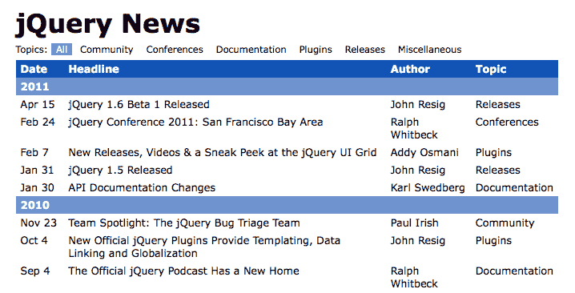

在标题和表格之间，有一组链接，代表着表格中的每个新闻主题。对于我们的第一个任务，我们将更改这些链接的行为，以*原地*过滤表格，而不需要导航到不同的页面。

# 动态表格过滤

为了使用主题链接来过滤表格，我们需要阻止其默认的链接行为。我们还应该为当前选择的主题给用户提供一些反馈：

```js
$(() => {
  $('#topics a')
    .click((e) => {
      e.preventDefault();
      $(e.target)
        .addClass('selected')
        .siblings('.selected')
        .removeClass('selected');
    });
}); 

```

列表 9.1

当点击其中一个链接时，我们会从所有主题链接中删除`selected`类，然后将`selected`类添加到新主题上。调用`.preventDefault()`可以阻止链接被跟踪。

接下来，我们需要实际执行过滤操作。作为解决此问题的第一步，我们可以隐藏表格中不包含主题文本的每一行：

```js
$(() => {
  $('#topics a')
    .click((e) => {
      e.preventDefault();
      const topic = $(e.target).text();

      $(e.target)
        .addClass('selected')
        .siblings('.selected')
        .removeClass('selected');

      $('#news tr').show();
      if (topic != 'All') {
        $(`#news tr:has(td):not(:contains("${topic}"))`)
          .hide();
      }
    });
}); 

```

列表 9.2

现在我们将链接的文本存储在常量`topic`中，以便我们可以将其与表格中的文本进行比较。首先，我们显示所有的表行，然后，如果主题不是全部，我们就隐藏不相关的行。我们用于此过程的选择器有点复杂：

```js
#news tr:has(td):not(:contains("topic")) 

```

选择器从简单开始，使用`#news tr`定位表中的所有行。然后我们使用`:has()`自定义选择器来过滤这个元素集。这个选择器将当前选定的元素减少到那些包含指定后代的元素。在这种情况下，我们正在消除要考虑的标题行（如日历年份），因为它们不包含`<td>`单元格。

一旦我们找到了表的行，其中包含实际内容，我们就需要找出哪些行与所选主题相关。`:contains()`自定义选择器仅匹配具有给定文本字符串的元素；将其包装在`:not()`选择器中，然后我们就可以隐藏所有不包含主题字符串的行。

这段代码运行得足够好，除非主题恰好出现在新闻标题中，例如。我们还需要处理一个主题是另一个主题子串的可能性。为了处理这些情况，我们需要对每一行执行代码：

```js
$(() => {
  $('#topics a')
    .click((e) => {
      e.preventDefault();
      const topic = $(e.target).text();

      $(e.target)
        .addClass('selected')
        .siblings('.selected')
        .removeClass('selected');

      $('#news tr').show();
      if (topic != 'All') {
        $('#news')
          .find('tr:has(td)')
          .not((i, element) =>
            $(element)
              .children(':nth-child(4)')
              .text() == topic
          )
          .hide();
      }
    });
}); 

```

列表 9.3

这段新代码通过添加 DOM 遍历方法消除了一些复杂的选择器表达式文本。`.find()`方法的作用就像之前将`#news`和`tr`分开的空格一样，但是`.not()`方法做了`：not()`不能做的事情。就像我们在第二章中看到的`.filter()`方法一样，`.not()`可以接受一个回调函数，每次测试一个元素时调用。如果该函数返回`true`，则将该元素从结果集中排除。

选择器与遍历方法

使用选择器或其等效的遍历方法的选择在性能上也有影响。我们将在本章后面更详细地探讨这个选择。

在`.not()`方法的过滤函数中，我们检查行的子元素，找到第四个（也就是`Topic`列中的单元格）。对这个单元格的文本进行简单检查就能告诉我们是否应该隐藏该行。只有匹配的行会被显示：

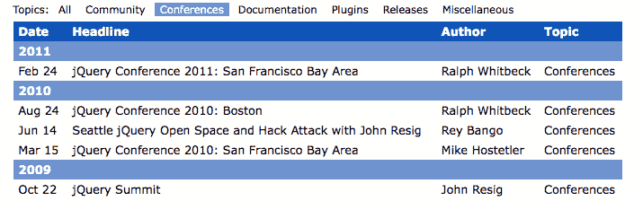

# 条纹表行

在第二章中，我们的选择器示例之一演示了如何将交替的行颜色应用于表格。我们看到，`:even`和`:odd`自定义选择器可以轻松完成这项任务，CSS 本地的`:nth-child()`伪类也可以完成：

```js
$(() => { 
  $('#news tr:nth-child(even)')
    .addClass('alt'); 
}); 

```

列表 9.4

这个直接的选择器找到每个表行，因为每年的新闻文章都放在自己的`<tbody>`元素中，所以每个部分都重新开始交替。

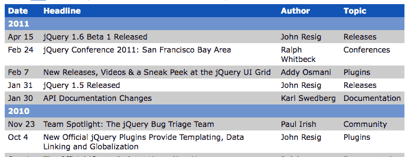

对于更复杂的行条纹挑战，我们可以尝试一次给两行设置`alt`类。前两行将收到类，然后接下来的两行将不会，以此类推。为了实现这一点，我们需要重新审视**过滤函数**：

```js
$(() => { 
  $('#news tr')
    .filter(i => (i % 4) < 2)
    .addClass('alt'); 
}); 

```

列表 9.5

在第二章中的我们的`.filter()`示例中，*选择元素*，以及*列表 9.3*中的`.not()`示例中，我们的过滤函数会检查每个元素，以确定是否将其包含在结果集中。但是，在这里，我们不需要关于元素的信息来确定是否应该包含它。相反，我们需要知道它在原始元素集合中的位置。这些信息作为参数传递给函数，并且我们将其称为`i`。

现在，`i`参数保存了元素的从零开始的索引。有了这个，我们可以使用取模运算符（`%`）来确定我们是否在应该接收`alt`类的一对元素中。现在，我们在整个表中有两行间隔。

然而，还有一些松散的地方需要清理。因为我们不再使用`:nth-child()`伪类，所以交替不再在每个`<tbody>`中重新开始。另外，我们应该跳过表头行以保持一致的外观。通过进行一些小的修改，可以实现这些目标：

```js
$(() => {
  $('#news tbody')
    .each((i, element) => {
      $(element)
        .children()
        .has('td')
        .filter(i => (i % 4) < 2)
        .addClass('alt');
    });
}); 

```

列表 9.6

为了独立处理每组行，我们可以使用`.each()`调用对`<tbody>`元素进行循环。在循环内部，我们像在*列表 9.3*中那样排除子标题行，使用`.has()`。结果是表被分成两行的一组进行条纹处理：

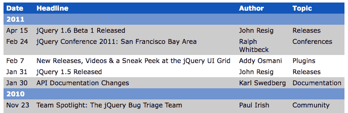

# 结合过滤和条纹

我们的高级表格条纹现在工作得很好，但在使用主题过滤器时行为奇怪。为了使这两个函数协调良好，我们需要在每次使用过滤器时重新为表添加条纹。我们还需要考虑当前行是否隐藏，以确定在哪里应用`alt`类：

```js
$(() => {
  function stripe() {
    $('#news')
      .find('tr.alt')
      .removeClass('alt')
      .end()
      .find('tbody')
      .each((i, element) => {
        $(element)
          .children(':visible')
          .has('td')
          .filter(i => (i % 4) < 2)
          .addClass('alt');
      });
  }
  stripe();

  $('#topics a')
    .click((e) => {
      e.preventDefault();
      const topic = $(e.target).text();

      $(e.target)
        .addClass('selected')
        .siblings('.selected')
        .removeClass('selected');

      $('#news tr').show();
      if (topic != 'All') {
        $('#news')
          .find('tr:has(td)')
          .not((i, element) =>
            $(element)
              .children(':nth-child(4)')
              .text() == topic
          )
          .hide();
      }

      stripe();
    });
}); 

```

列表 9.7

将*列表 9.3*中的过滤代码与我们的行条纹例程结合起来，这个脚本现在定义了一个名为`stripe()`的函数，当文档加载时调用一次，每当点击主题链接时再次调用。在函数内部，我们负责从不再需要它的行中删除`alt`类，以及将所选行限制为当前显示的行。我们使用`:visible`伪类来实现这一点，它（以及它的对应项`:hidden`）尊重元素是否由于各种原因而隐藏，包括具有`display`值为`none`，或`width`和`height`值为`0`。

我们现在可以过滤我们表的行而保留我们的行条纹：

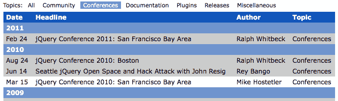

# 更多选择器和遍历方法

即使在我们看到的所有示例之后，我们也没有接近探索使用 jQuery 在页面上找到元素的每一种方式。我们有数十个选择器和 DOM 遍历方法可用，并且每个方法都有特定的实用性，我们可能需要调用其中的某一个。

要找到适合我们需求的选择器或方法，我们有许多资源可用。本书末尾的快速参考列出了每个选择器和方法，并简要描述了每个选择器和方法。然而，对于更详细的描述和用法示例，我们需要更全面的指南，比如在线 jQuery API 参考。该网站列出了所有选择器在 [`api.jquery.com/category/selectors/`](http://api.jquery.com/category/selectors/)，以及遍历方法在 [`api.jquery.com/category/traversing/`](http://api.jquery.com/category/traversing/)。

# 自定义和优化选择器

我们看到的许多技术都为我们提供了一个工具箱，可用于找到我们想要处理的任何页面元素。然而，故事并没有结束；有很多关于如何有效执行我们的元素查找任务的知识需要学习。这种效率可以以编写和阅读更简单的代码，以及在 web 浏览器内更快执行的代码形式呈现。

# 编写自定义选择器插件

提高可读性的一种方法是将代码片段封装在可重用组件中。我们通过创建函数一直在做这件事。在 第八章，*开发插件* 中，我们通过创建 jQuery 插件来为 jQuery 对象添加方法来扩展这个想法。然而，插件不仅仅可以帮助我们重用代码。插件还可以提供额外的**选择器表达式**，比如 Cycle 在 第七章，*使用插件* 中给我们的 `:paused` 选择器。

要添加的最简单类型的选择器表达式是**伪类**。这是以冒号开头的表达式，比如 `:checked` 或 `:nth-child()`。为了说明创建选择器表达式的过程，我们将构建一个名为 `:group()` 的伪类。这个新选择器将封装我们用来找到表格行以执行条纹化的代码，就像 *列表 9.6* 中一样。

当使用选择器表达式查找元素时，jQuery 会在内部对象 `expr` 中查找指令。这个对象中的值的行为类似于我们传递给 `.filter()` 或 `.not()` 的过滤函数，包含导致每个元素包含在结果集中的 JavaScript 代码，仅当函数返回 `true` 时才会包含。我们可以使用 `$.extend()` 函数向这个对象添加新的表达式：

```js
(($) => {
  $.extend($.expr[':'], {
    group(element, index, matches) {
      const num = parseInt(matches[3], 10);

      return Number.isInteger(num) &&
        ($(element).index() - 1) % (num * 2) < num;
    }
  });
})(jQuery); 

```

列表 9.8

这段代码告诉 jQuery `group` 是一个有效的字符串，可以跟在选择器表达式的冒号后面，当遇到它时，应调用给定的函数来确定是否应将元素包含在结果集中。

这里评估的函数传递了四个参数：

+   `element`：要考虑的 DOM 元素。大多数选择器都需要这个，但我们的不需要。

+   `index`：结果集中的 DOM 元素的索引。不幸的是，这总是 0，我们不能依赖它。这里包括它的唯一原因是因为我们需要对匹配参数进行位置访问。

+   `matches`：包含用于解析此选择器的正则表达式结果的数组。通常，`matches[3]`是数组中唯一相关的项目；在形式为`:group(2)`的选择器中，`matches[3]`项包含`2`，即括号内的文本。

伪类选择器可以使用这三个参数中的部分或全部信息来确定元素是否属于结果集。在这种情况下，我们只需要`element`和`matches`。实际上，我们确实需要传递给此函数的每个元素的索引位置。由于无法依赖`index`参数，因此我们简单地使用`.index()` jQuery 方法来获取索引。

有了新的`:group`选择器，我们现在有了一种灵活的方式来选择交替的元素组。例如，我们可以将选择器表达式和`.filter()`函数从*列表 9.5*合并为一个单一的选择器表达式：`$('#news tr:group(2)')`，或者我们可以保留*列表 9.7*中的每节行为，并将`:group()`作为一个表达式在`.filter()`调用中使用。我们甚至可以通过简单地在括号内更改数字来更改要分组的行数：

```js
$(() => { 
  function stripe() {
    $('#news')
      .find('tr.alt')
      .removeClass('alt')
      .end()
      .find('tbody')
      .each((i, element) => {
        $(element)
          .children(':visible')
          .has('td')
          .filter(':group(3)')
          .addClass('alt');
      });
  }

  stripe(); 
}); 

```

列表 9.9

现在我们可以看到，行条纹以三个一组交替：

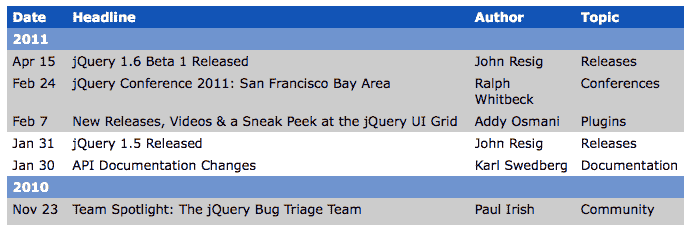

# 选择器性能

在规划任何 web 开发项目时，我们需要记住创建网站所需的时间、我们可以维护代码的轻松程度和速度，以及用户与网站交互时的性能。通常，这些关注点中的前两个比第三个更重要。特别是在客户端脚本编写方面，开发者很容易陷入**过早优化**和**微优化**的陷阱。这些陷阱会导致我们花费无数小时微调我们的代码，以从 JavaScript 执行时间中削减毫秒，即使一开始没有注意到性能滞后。

一个很好的经验法则是认为开发者的时间比计算机的时间更宝贵，除非用户注意到我们应用程序的速度变慢。

即使性能是一个问题，定位我们的 jQuery 代码中的瓶颈也可能很困难。正如我们在本章前面提到的，某些选择器通常比其他选择器快，将选择器的一部分移到遍历方法中可以帮助加快在页面上查找元素所需的时间。因此，选择器和遍历性能通常是开始检查我们的代码以减少用户与页面交互时可能遇到的延迟量的良好起点。

关于选择器和遍历方法的相对速度的任何判断都可能随着发布更新、更快的浏览器和新版本 jQuery 引入的聪明速度调整而过时。在性能方面，经常质疑我们的假设，并在使用像**jsPerf**（[`jsperf.com`](http://jsperf.com)）这样的工具进行测量后优化代码是个好主意。

在这种情况下，我们将检查一些简单的指南，以生成优化的 jQuery 选择器代码。

# Sizzle 选择器实现

正如本章开始时所指出的，当我们将选择器表达式传递给`$()`函数时，jQuery 的 Sizzle 实现会解析表达式并确定如何收集其中表示的元素。在其基本形式中，Sizzle 应用最有效的本地**DOM 方法**，浏览器支持以获取`nodeList`，这是一个 DOM 元素的本机类似数组对象，jQuery 最终会将其转换为真正的数组，并将其添加到`jQuery`对象。以下是 jQuery 内部使用的 DOM 方法列表，以及支持它们的最新浏览器版本：

| **方法** | **选择** | **支持者** |
| --- | --- | --- |
| `.getElementById()` | 与给定字符串匹配的唯一元素的 ID。 | 所有浏览器 |
| `.getElementsByTagName()` | 所有标签名称与给定字符串匹配的元素。 | 所有浏览器 |
| `.getElementsByClassName()` | 具有其中一个类名与给定字符串匹配的所有元素。 | IE9+，Firefox 3+，Safari 4+，Chrome 4+，和 Opera 10+ |
| `.querySelectorAll()` | 所有匹配给定选择器表达式的元素。 | IE8+，Firefox 3.5+，Safari 3+，Chrome 4+，和 Opera 10+ |

如果选择器表达式的某个部分不能由这些方法之一处理，Sizzle 会回退到循环遍历已经收集的每个元素，并针对表达式的每个部分进行测试。如果选择器表达式的*任何*部分都不能由 DOM 方法处理，Sizzle 就会以`document.getElementsByTagName('*')`表示的文档中*所有*元素的集合开始，并逐个遍历每个元素。

这种循环和测试每个元素的方法在性能上要比任何本地 DOM 方法昂贵得多。幸运的是，现代桌面浏览器的最新版本都包括本地的`.querySelectorAll()`方法，并且当它不能使用其他更快的本地方法时，Sizzle 会使用它--只有一个例外。当选择器表达式包含像`:eq()`或`:odd`或`:even`这样没有 CSS 对应的自定义 jQuery 选择器时，Sizzle 就别无选择，只能循环和测试。

# 测试选择器速度

要了解 `.querySelectorAll()` 和 *循环测试* 过程之间的性能差异，可以考虑一个文档，其中我们希望选择所有 `<input type="text">` 元素。我们可以用两种方式编写选择器表达式：`$('input[type="text"]')`，使用 *CSS 属性选择器*，或者 `$('input:text')`，使用 *自定义 jQuery 选择器*。为了测试我们在这里感兴趣的选择器部分，我们将移除 `input` 部分，并比较 `$('[type="text"]')` 和 `$(':text')` 的速度。JavaScript 基准测试网站 [`jsperf.com/`](http://jsperf.com/) 让我们可以进行这种比较，得出戏剧性的结果。

在 jsPerf 测试中，每个测试用例会循环执行，以查看在一定时间内可以完成多少次，因此数字越高越好。在支持 `.querySelectorAll()` 的现代浏览器（Chrome 26、Firefox 20 和 Safari 6）中进行测试时，能够利用它的选择器比自定义的 jQuery 选择器要快得多：

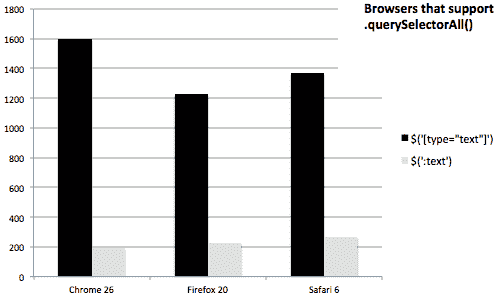

图 9.1

但是，在不支持 `.querySelectorAll()` 的浏览器中，例如 IE 7，这两个选择器的性能几乎相同。在这种情况下，这两个选择器都会强制 jQuery 循环遍历页面上的每个元素，并分别测试每个元素：

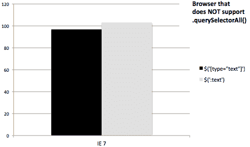

图 9.2

当我们查看 `$('input:eq(1)')` 和 `$('input') .eq(1)` 时，使用原生方法和不使用原生方法的选择器之间的性能差异也是显而易见的：

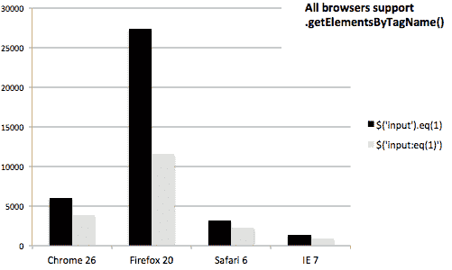

图 9.3

尽管每秒操作次数在不同浏览器之间有很大差异，但所有测试的浏览器在将自定义的 `:eq()` 选择器移出到 `.eq()` 方法时都显示出显著的性能提升。使用简单的 `input` 标签名称作为 `$()` 函数的参数允许快速查找，然后 `.eq()` 方法简单地调用数组函数来检索 jQuery 集合中的第二个元素。

作为一个经验法则，我们应尽可能使用 CSS 规范中的选择器，而不是 jQuery 的自定义选择器。但在更改选择器之前，先确认是否需要提高性能是有意义的，然后使用诸如 [`jsperf.com`](http://jsperf.com) 这样的基准测试工具测试更改能够提升多少性能。

# 在幕后进行 DOM 遍历

在第二章中，*选择元素*，以及本章的开头，我们讨论了通过调用 DOM 遍历方法从一个 DOM 元素集合到另一个 DOM 元素集合的方法。我们（远非详尽）的调查包括简单到达相邻单元格的简单方法，例如 `.next()` 和 `.parent()`，以及更复杂的组合选择器表达式的方式，例如 `.find()` 和 `.filter()`。到目前为止，我们应该对这些一步步从一个 DOM 元素到另一个 DOM 元素的方法有相当牢固的掌握。

每次我们执行其中一步时，jQuery 都会记录我们的行程，留下一串面包屑，如果需要的话，我们可以按照这些面包屑回到家里。在那一章中我们简要提及的几个方法，`.end()` 和 `.addBack()`，利用了这种记录。为了能够充分利用这些方法，并且一般来说编写高效的 jQuery 代码，我们需要更多地了解 DOM 遍历方法如何执行它们的工作。

# jQuery 遍历属性

我们知道，通常通过将选择器表达式传递给 `$()` 函数来构造 jQuery 对象实例。在生成的对象内部，存在一个包含与该选择器匹配的每个 DOM 元素引用的数组结构。不过，我们没有看到对象中隐藏的其他属性。例如，当调用 DOM 遍历方法时，`.prevObject` 属性保存了对调用该遍历方法的 jQuery 对象的引用。

jQuery 对象用于暴露 `selector` 和 `context` 属性。由于它们对我们没有提供任何价值，在 jQuery 3 中已经被移除。

要查看 `prevObject` 属性的作用，我们可以突出显示表格的任意单元格并检查其值：

```js
$(() => { 
  const $cell = $('#release');
    .addClass('highlight'); 
  console.log('prevObject', $cell.prevObject); 
}); 

```

列表 9.10

此代码段将突出显示所选单个单元格，如下图所示：

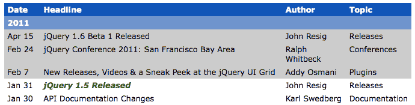

我们可以看到 `.prevObject` 未定义，因为这是一个新创建的对象。但是，如果我们将遍历方法添加到混合中，情况就会变得更加有趣：

```js
$(() => { 
  const $cell = $('#release')
    .nextAll()
    .addClass('highlight'); 
  console.log('prevObject', $cell.prevObject); 
}); 

```

列表 9.11

此更改改变了高亮显示的单元格，如下图所示：

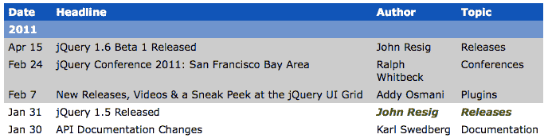

现在，我们最初选择的单元格后面的两个单元格被突出显示。在 jQuery 对象内部，`.prevObject` 现在指向 `.nextAll()` 调用之前的原始 jQuery 对象实例。

# DOM 元素栈

由于每个 jQuery 对象实例都有一个 `.prevObject` 属性，指向前一个对象，我们有了一个实现 **栈** 的链表结构。每次遍历方法调用都会找到一组新的元素并将此集合推入堆栈。只有在我们可以对此堆栈执行某些操作时，才有用，这就是 `.end()` 和 `.addBack()` 方法发挥作用的地方。

`.end()` 方法简单地从堆栈的末尾弹出一个元素，这与获取 `.prevObject` 属性的值相同。我们在第二章中看到了一个示例，*选择元素*，在本章后面我们还会看到更多。然而，为了得到更有趣的例子，我们将研究 `.addBack()` 如何操作堆栈：

```js
$(() => { 
  $('#release')
    .nextAll()
    .addBack()
    .addClass('highlight'); 
}); 

```

列表 9.12

再次，高亮显示的单元格已更改：

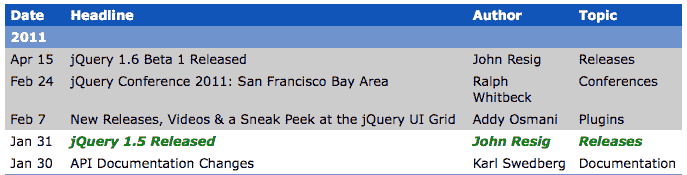

当调用 `.addBack()` 方法时，jQuery 回顾栈上的上一步并将两个元素集合合并起来。在我们的例子中，这意味着突出显示的单元格包括 `.nextAll()` 调用找到的两个单元格和使用选择器定位的原始单元格。然后，这个新的、合并的元素集合被推到栈上。

这种栈操作方式非常有用。为了确保在需要时这些技术能够发挥作用，每个遍历方法的实现都必须正确更新栈；这意味着如果我们想提供自己的遍历方法，我们需要了解系统的一些内部工作原理。

# 编写 DOM 遍历方法插件

和任何其他 jQuery 对象方法一样，遍历方法可以通过向 `$.fn` 添加属性来添加到 jQuery 中。我们在第八章中看到，我们定义的新的 jQuery 方法应该在匹配的元素集合上操作，然后返回 jQuery 对象，以便用户可以链式调用其他方法。当我们创建 DOM 遍历方法时，这个过程是类似的，但是我们返回的 jQuery 对象需要指向一个新的匹配元素集合。

举个例子，我们将构建一个插件，找到与给定单元格相同列的所有表格单元格。首先我们将完整地查看插件代码，然后逐个地分析它，以了解它的工作原理：

```js
(($) => {
  $.fn.column = function() {
    var $cells = $();

    this.each(function(i, element) {
      const $td = $(element).closest('td, th');

      if ($td.length) {
        const colNum = $td[0].cellIndex + 1;
        const $columnCells = $td
          .closest('table')
          .find('td, th')
          .filter(`:nth-child(${colNum})`);

        $cells = $cells.add($columnCells);
      }
    });

    return this.pushStack($cells);
  };
})(jQuery); 

```

第 9.13 节

我们的 `.column()` 方法可以在指向零个、一个或多个 DOM 元素的 jQuery 对象上调用。为了考虑到所有这些可能性，我们使用 `.each()` 方法循环遍历元素，逐个将单元格列添加到变量 `$cells` 中。这个 `$cells` 变量一开始是一个空的 jQuery 对象，但随后通过 `.add()` 方法扩展到需要的更多 DOM 元素。

这解释了函数的外部循环；在循环内部，我们需要理解 `$columnCells` 如何填充表列中的 DOM 元素。首先，我们获取正在检查的表格单元格的引用。我们希望允许在表格单元格上或表格单元格内的元素上调用 `.column()` 方法。`.closest()` 方法为我们处理了这个问题；它在 DOM 树中向上移动，直到找到与我们提供的选择器匹配的元素。这个方法在事件委托中会非常有用，我们将在第十章中重新讨论，*高级事件*。

有了我们手头的表格单元格，我们使用 DOM 的 `.cellIndex` 属性找到它的列号。这给了我们一个基于零的单元格列的索引；我们在稍后的一个基于一的上下文中使用它时加上 `1`。然后，从单元格开始，我们向上移动到最近的 `<table>` 元素，再返回到 `<td>` 和 `<th>` 元素，并用 `:nth-child()` 选择器表达式过滤这些单元格，以获取适当的列。

我们正在编写的插件仅限于简单的、非嵌套的表格，因为 `.find('td, th')` 调用。要支持嵌套表格，我们需要确定是否存在 `<tbody>` 标签，并根据适当的数量在 DOM 树中上下移动，这将增加比这个示例适当的更多复杂性。

一旦我们找到了列中的所有单元格，我们需要返回新的 jQuery 对象。我们可以从我们的方法中直接返回 `$cells`，但这不会正确地尊重 DOM 元素堆栈。相反，我们将 `$cells` 传递给 `.pushStack()` 方法并返回结果。该方法接受一个 DOM 元素数组，并将它们添加到堆栈中，以便后续对 `.addBack()` 和 `.end()` 等方法的调用能够正确地工作。

若要查看我们的插件运行情况，我们可以对单元格的点击做出反应，并突出显示相应的列：

```js
$(() => { 
  $('#news td')
    .click((e) => {
      $(e.target)
        .siblings('.active')
        .removeClass('active')
        .end()
        .column()
        .addClass('active');
    });
}); 

```

第 9.14 节

`active` 类将添加到所选列，从而导致不同的着色，例如，当点击其中一位作者的姓名时：

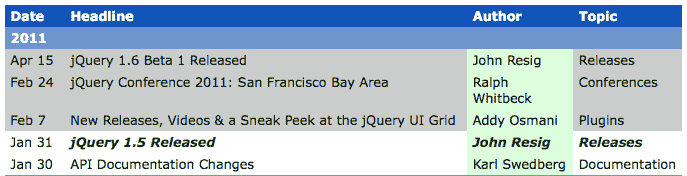

# DOM 遍历性能

关于选择器性能的经验法则同样适用于 DOM 遍历性能：在可能的情况下，我们应该优先考虑代码编写和代码维护的便利性，只有在性能是可测量的问题时才会为了优化而牺牲可读性。同样，诸如 [`jsperf.com/`](http://jsperf.com/) 这样的网站有助于确定在给定多个选项的情况下采取最佳方法。

虽然应该避免过早地优化，但最小化选择器和遍历方法的重复是一个良好的实践。由于这些可能是昂贵的任务，我们做这些任务的次数越少越好。避免这种重复的两种策略是**链式操作**和**对象缓存**。

# 使用链式操作来改进性能

我们现在已经多次使用了链式操作，它使我们的代码保持简洁。链式操作也可能带来性能上的好处。

我们来自*第 9.9 节*的 `stripe()` 函数只定位了一次具有 ID `news` 的元素，而不是两次。它需要从不再需要的行中移除 `alt` 类，并将该类应用于新的行集。使用链式操作，我们将这两个想法合并成一个，避免了这种重复：

```js
$(() => {
  function stripe() {
    $('#news')
      .find('tr.alt')
      .removeClass('alt')
      .end()
      .find('tbody')
      .each((i, element) => {
        $(element)
          .children(':visible')
          .has('td')
          .filter(':group(3)')
          .addClass('alt');
      });
  }

  stripe();
}); 

```

第 9.15 节

为了合并两次使用 `$('#news')`，我们再次利用了 jQuery 对象内部的 DOM 元素堆栈。第一次调用 `.find()` 将表行推送到堆栈上，但然后 `.end()` 将其从堆栈中弹出，以便下一次 `.find()` 调用再次操作 `news` 表。这种巧妙地操作堆栈的方式是避免选择器重复的便捷方式。

# 使用缓存来改进性能

缓存只是简单地存储操作的结果，以便可以多次使用而不必再次运行该操作。在选择器和遍历性能的背景下，我们可以将 jQuery 对象缓存到常量中以供以后使用，而不是创建一个新的对象。

回到我们的示例，我们可以重写 `stripe()` 函数，以避免选择器重复，而不是链接：

```js
$(() => { 
  const $news = $('#news');

  function stripe() {
    $news
      .find('tr.alt')
      .removeClass('alt');
    $news
      .find('tbody')
      .each((i, element) => {
        $(element)
          .children(':visible')
          .has('td')
          .filter(':group(3)')
          .addClass('alt');
      });
  }

  stripe();
}); 

```

清单 9.16

这两个操作再次是分开的 JavaScript 语句，而不是链接在一起。尽管如此，我们仍然只执行了一次 `$('#news')` 选择器，通过将结果存储在 `$news` 中。这种缓存方法比链接更繁琐，因为我们需要单独创建存储 jQuery 对象的变量。显然，在代码中创建更多的常量比链接函数调用更不理想。但有时，链接简单地太复杂了，像这样缓存对象是更好的选择。

因为通过 ID 在页面上选择元素非常快，所以这些示例都不会对性能产生很大的影响，实际上我们会选择看起来最易读和易于维护的方法。但是当性能成为一个关注点时，这些技术是有用的工具。

# 总结

在本章中，我们更深入地了解了 jQuery 在查找文档中的元素方面的广泛功能。我们看了一些关于 Sizzle 选择器引擎如何工作的细节，以及这对设计有效和高效代码的影响。此外，我们还探讨了扩展和增强 jQuery 选择器和 DOM 遍历方法的方式。

# 进一步阅读

在本书的 附录 B、“快速参考” 中或在官方 jQuery 文档中，提供了一份完整的选择器和遍历方法列表。

# 练习

挑战性练习可能需要在 [`api.jquery.com/`](http://api.jquery.com/) 官方 jQuery 文档中使用。

1.  修改表格行条纹的例程，使其不给第一行任何类，第二行给予 `alt` 类，第三行给予 `alt-2` 类。对每组三行的行重复此模式。

1.  创建一个名为 `:containsExactly()` 的新选择器插件，它选择具有与括号内放置的内容完全匹配的文本内容的元素。

1.  使用这个新的 `:containsExactly()` 选择器来重写 *清单 9.3* 中的过滤代码。

1.  创建一个名为 `.grandparent()` 的新 DOM 遍历插件方法，它从一个或多个元素移动到它们在 DOM 中的祖父元素。

1.  **挑战**：使用 [`jsperf.com/`](http://jsperf.com/)，粘贴 `index.html` 的内容并比较使用以下内容查找 `<td id="release">` 的最近祖先表元素的性能：

+   `.closest()` 方法

+   `.parents()` 方法，将结果限制为找到的第一个表格

1.  **挑战**：使用 [`jsperf.com/`](http://jsperf.com/)，粘贴 `index.html` 的内容并比较使用以下内容查找每一行中最后一个 `<td>` 元素的性能：

+   `:last-child` 伪类

+   `:nth-child()` 伪类

+   每行内的`.last()`方法（使用`.each()`循环遍历行）

+   每行内的`:last`伪类（使用`.each()`循环遍历行）
