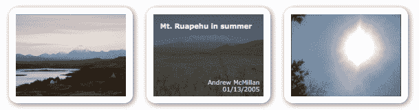
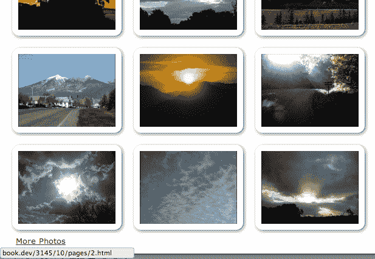
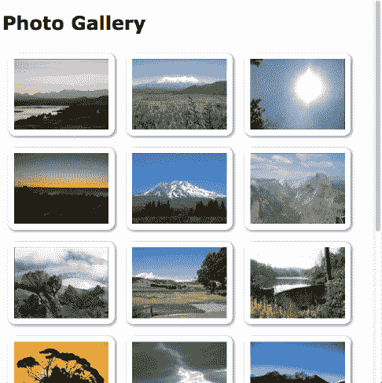

# 第十章：高级事件

要构建交互式的 Web 应用程序，我们需要观察用户的活动并对其做出响应。 我们已经看到，jQuery 的事件系统可以简化此任务，而且我们已经多次使用了这个事件系统。

在第三章，*处理事件*，我们提到了 jQuery 提供的一些用于对事件做出反应的功能。 在这一更高级的章节中，我们将涵盖：

+   事件委托及其带来的挑战

+   与某些事件相关的性能陷阱以及如何解决它们

+   我们自己定义的自定义事件

+   jQuery 内部使用的特殊事件系统用于复杂的交互。

# 重新审视事件

对于我们的示例文档，我们将创建一个简单的照片画廊。 画廊将显示一组照片，并在点击链接时显示额外的照片。 我们还将使用 jQuery 的事件系统在鼠标悬停在照片上时显示每个照片的文本信息。 定义画廊的 HTML 如下所示：

```js
<div id="container"> 
  <h1>Photo Gallery</h1> 

  <div id="gallery"> 
    <div class="photo"> 
       
      <div class="details"> 
        <div class="description">The Cuillin Mountains, 
          Isle of Skye, Scotland.</div> 
        <div class="date">12/24/2000</div> 
        <div class="photographer">Alasdair Dougall</div> 
      </div> 
    </div> 
    <div class="photo"> 
       
      <div class="details"> 
        <div class="description">Mt. Ruapehu in summer</div> 
        <div class="date">01/13/2005</div> 
        <div class="photographer">Andrew McMillan</div> 
      </div> 
    </div> 
    <div class="photo"> 
       
      <div class="details"> 
        <div class="description">midday sun</div> 
        <div class="date">04/26/2011</div> 
        <div class="photographer">Jaycee Barratt</div> 
      </div> 
    </div> 
    <!-- Code continues --> 
  </div> 
  <a id="more-photos" href="pages/1.html">More Photos</a> 
</div> 

```

获取示例代码

您可以从以下 GitHub 存储库访问示例代码：[`github.com/PacktPublishing/Learning-jQuery-3`](https://github.com/PacktPublishing/Learning-jQuery-3).

当我们对照片应用样式时，将它们排列成三行将使画廊看起来像以下屏幕截图：


# 加载更多数据页面

到目前为止，我们已经是对于页面元素点击的常见任务的专家了。当点击“更多照片”链接时，我们需要执行一个 Ajax 请求以获取下一组照片，并将它们附加到 `<div id="gallery">` 如下所示：

```js
$(() => {
  $('#more-photos')
    .click((e) => {
      e.preventDefault();
      const url = $(e.target).attr('href');

      $.get(url)
        .then((data) => {
          $('#gallery')
            .append(data);
        })
        .catch(({ statusText }) => {
          $('#gallery')
            .append(`<strong>${statusText}</strong>`)
        });
    });
});

```

列表 10.1

我们还需要更新“更多照片”链接的目标，以指向下一页照片：

```js
$(() => {
  var pageNum = 1;

  $('#more-photos')
    .click((e) => {
      e.preventDefault();
      const $link = $(e.target);
      const url = $link.attr('href');

      if (pageNum > 19) {
        $link.remove();
        return;
      }

      $link.attr('href', `pages/${++pageNum}.html`);

      $.get(url)
        .then((data) => {
          $('#gallery')
            .append(data);
        })
        .catch(({ statusText }) => {
          $('#gallery')
            .append(`<strong>${statusText}</strong>`)
        });
    });
});

```

列表 10.2

我们的 `.click()` 处理程序现在使用 `pageNum` 变量来跟踪要请求的下一页照片，并使用它来构建链接的新 `href` 值。 由于 `pageNum` 在函数外部定义，因此它的值在链接的点击之间保持不变。 当我们到达最后一页照片时，我们会删除该链接。

我们还应考虑使用 HTML5 历史记录 API，以允许用户标记我们加载的 Ajax 内容。 您可以在 Dive into HTML5 ([`diveintohtml5.info/history.html`](http://diveintohtml5.info/history.html)) 了解有关此 API 的信息，并使用 History 插件 ([`github.com/browserstate/history.js`](https://github.com/browserstate/history.js)) 很容易地实现它。

# 在悬停时显示数据

我们想要在此页面上提供的下一个功能是，当用户的鼠标位于页面的该区域时，显示与每张照片相关的详细信息。 对于显示此信息的首次尝试，我们可以使用 `.hover()` 方法：

```js
$(() => {
  $('div.photo')
    .hover((e) => {
      $(e.currentTarget)
        .find('.details')
        .fadeTo('fast', 0.7);
  }, (e) => {
      $(e.currentTarget)
        .find('.details')
        .fadeOut('fast');
  });
}); 

```

列表 10.3

当光标进入照片的边界时，相关信息以 70% 的不透明度淡入，当光标离开时，信息再次淡出：



当然，执行此任务的方法有多种。由于每个处理程序的一部分是相同的，因此可以将两个处理程序合并。我们可以通过用空格分隔事件名称来同时绑定处理程序到`mouseenter`和`mouseleave`，如下所示：

```js
 $('div.photo')
   .on('mouseenter mouseleave', (e) => {
     const $details = $(e.currentTarget).find('.details');

     if (e.type == 'mouseenter') {
       $details.fadeTo('fast', 0.7);
     } else {
       $details.fadeOut('fast');
     }
   });

```

列表 10.4

对于两个事件都绑定了相同处理程序，我们检查事件的类型以确定是淡入还是淡出详情。然而，定位`<div>`的代码对于两个事件是相同的，因此我们可以只写一次。

坦率地说，这个例子有点做作，因为此示例中的共享代码如此简短。但是，在其他情况下，这种技术可以显著减少代码复杂性。例如，如果我们选择在`mouseenter`上添加一个类，并在`mouseleave`上删除它，而不是动画化透明度，我们可以在处理程序内部用一个语句解决它，如下所示：

```js
$(e.currentTarget)
  .find('.details') 
  .toggleClass('entered', e.type == 'mouseenter'); 

```

无论如何，我们的脚本现在正在按预期工作，除了我们还没有考虑用户点击更多照片链接时加载的附加照片。正如我们在第三章中所述，*处理事件*，事件处理程序仅附加到在我们进行`.on()`调用时存在的元素上。稍后添加的元素，例如来自 Ajax 调用的元素，不会具有行为。我们看到解决此问题的两种方法是在引入新内容后重新绑定事件处理程序，或者最初将处理程序绑定到包含元素并依赖事件冒泡。第二种方法，*事件委托*，是我们将在这里追求的方法。

# 事件委托

请记住，为了手动实现事件委托，我们会检查事件对象的`target`属性，以查看它是否与我们想要触发行为的元素匹配。事件目标表示接收事件的最内部或最深嵌套的元素。然而，这次我们的示例 HTML 提出了一个新的挑战。`<div class="photo">`元素不太可能是事件目标，因为它们包含其他元素，比如图像本身和图像详情。

我们需要的是`.closest()`方法，它会从父级元素向上遍历 DOM，直到找到与给定选择器表达式匹配的元素为止。如果找不到任何元素，则它会像任何其他 DOM 遍历方法一样，返回一个新的空 jQuery 对象。我们可以使用`.closest()`方法从任何包含它的元素中找到`<div class="photo">`，如下所示：

```js
$(() => { 
  $('#gallery')
    .on('mouseover mouseout', (e) => {
      const $target = $(e.target)
        .closest('div.photo');
      const $related = $(e.relatedTarget)
        .closest('div.photo');
      const $details = $target
        .find('.details');

      if (e.type == 'mouseover' && $target.length) {
        $details.fadeTo('fast', 0.7);
      } else if (e == 'mouseout' && !$related.length) {
        $details.fadeOut('fast');
      }
    });
}); 

```

列表 10.5

请注意，我们还需要将事件类型从`mouseenter`和`mouseleave`更改为`mouseover`和`mouseout`，因为前者仅在鼠标首次进入画廊`<div>`并最终离开时触发，我们需要处理程序在鼠标进入该包装`<div>`内的任何照片时被触发。但后者引入了另一种情况，即除非我们包含对`event`对象的`relatedTarget`属性的附加检查，否则详细信息`<div>`将重复淡入和淡出。即使有了额外的代码，快速重复的鼠标移动到照片上和移出照片时的处理也不令人满意，导致偶尔会出现详细信息`<div>`可见，而应该淡出。

# 使用 jQuery 的委托能力

当任务变得更加复杂时，手动管理事件委托可能会非常困难。幸运的是，jQuery 的`.on()`方法内置了委托，这可以使我们的生活变得更加简单。利用这种能力，我们的代码可以回到*第 10.4 编列*的简洁性：

```js
$(() => { 
  $('#gallery')
    .on('mouseenter mouseleave', 'div.photo', (e) => {
      const $details = $(e.currentTarget).find('.details');

      if (e.type == 'mouseenter') {
        $details.fadeTo('fast', 0.7);
      } else {
        $details.fadeOut('fast');
      }
    });
}); 

```

第 10.6 编列

选择器`#gallery`与*第 10.5 编列*保持不变，但事件类型返回到*第 10.4 编列*的`mouseenter`和`mouseleave`。当我们将`'div.photo'`作为`.on()`的第二个参数传入时，jQuery 将`e.currentTarget`映射到`'#gallery'`中与该选择器匹配的元素。

# 选择委托范围

因为我们处理的所有照片元素都包含在`<div id="gallery">`中，所以我们在上一个示例中使用了`#gallery`作为我们的委托范围。然而，任何一个所有照片的祖先元素都可以用作这个范围。例如，我们可以将处理程序绑定到`document`，这是页面上所有内容的公共祖先：

```js
$(() => {
  $(document)
    .on('mouseenter mouseleave', 'div.photo', (e) => {
      const $details = $(e.currentTarget).find('.details');

      if (e.type == 'mouseenter') {
        $details.fadeTo('fast', 0.7);
      } else {
        $details.fadeOut('fast');
      }
    });
}); 

```

第 10.7 编列

在设置事件委托时，将事件处理程序直接附加到`document`可能会很方便。由于所有页面元素都是从`document`继承而来的，我们不需要担心选择正确的容器。但是，这种便利可能会带来潜在的性能成本。

在深度嵌套的元素 DOM 中，依赖事件冒泡直到多个祖先元素可能是昂贵的。无论我们实际观察的是哪些元素（通过将它们的选择器作为`.on()`的第二个参数传递），如果我们将处理程序绑定到`document`，那么页面上发生的任何事件都需要被检查。例如，在*第 10.6 编列*中，每当鼠标进入页面上的任何元素时，jQuery 都需要检查它是否进入了一个`<div class="photo">`元素。在大型页面上，这可能会变得非常昂贵，特别是如果委托被大量使用。通过在委托上下文中更加具体，可以减少这种工作。

# 早期委托

尽管存在这些效率问题，但仍有理由选择将`document`作为我们的委托上下文。一般来说，我们只能在 DOM 元素加载后绑定事件处理程序，这就是为什么我们通常将代码放在`$(() => {})`内的原因。但是，`document`元素是立即可用的，因此我们无需等待整个 DOM 准备就绪才能绑定它。即使脚本被引用在文档的`<head>`中，就像我们的示例中一样，我们也可以立即调用`.on()`，如下所示：

```js
(function($) { 
  $(document)
    .on('mouseenter mouseleave', 'div.photo', (e) => {
      const $details = $(e.currentTarget).find('.details');

      if (e.type == 'mouseenter') {
        $details.fadeTo('fast', 0.7);
      } else {
        $details.fadeOut('fast');
      }
    }); 
})(jQuery); 

```

图 10.8

因为我们不是在等待整个 DOM 准备就绪，所以我们可以确保`mouseenter`和`mouseleave`行为将立即适用于所有页面上呈现的`<div class="photo">`元素。

要看到这种技术的好处，考虑一个直接绑定到链接的`click`处理程序。假设此处理程序执行某些操作，并且还阻止链接的默认操作（导航到另一个页面）。如果我们等待整个文档准备就绪，我们将面临用户在处理程序注册之前单击该链接的风险，从而离开当前页面而不是得到脚本提供的增强处理。相比之下，将委托事件处理程序绑定到`document`使我们能够在不必扫描复杂的 DOM 结构的情况下提前绑定事件。

# 定义自定义事件

浏览器的 DOM 实现自然触发的事件对于任何交互式 Web 应用程序都至关重要。但是，在我们的 jQuery 代码中，我们不仅限于此事件集合。我们还可以添加自己的自定义事件。我们在第八章中简要介绍了这一点，*开发插件*，当我们看到 jQuery UI 小部件如何触发事件时，但在这里，我们将研究如何创建和使用自定义事件，而不是插件开发。

自定义事件必须由我们的代码手动触发。从某种意义上说，它们就像我们定义的常规函数一样，我们可以在脚本的另一个地方调用它时执行一块代码。对于自定义事件的`.on()`调用的行为类似于函数定义，而`.trigger()`调用的行为类似于函数调用。

但是，事件处理程序与触发它们的代码是解耦的。这意味着我们可以在任何时候触发事件，而无需预先知道触发时会发生什么。常规函数调用会导致执行单个代码块。但是，自定义事件可能没有处理程序，一个处理程序或许多处理程序绑定到它。无论如何，当事件被触发时，所有绑定的处理程序都将被执行。

为了说明这一点，我们可以修改我们的 Ajax 加载功能以使用自定义事件。每当用户请求更多照片时，我们将触发一个`nextPage`事件，并绑定处理程序来监视此事件并执行以前由`.click()`处理程序执行的工作：

```js
$(() => { 
  $('#more-photos')
    .click((e) => {
      e.preventDefault();
      $(e.target).trigger('nextPage');
    });
}); 

```

列表 10.9

`.click()` 处理程序现在几乎不做任何工作。它触发自定义事件，并通过调用 `.preventDefault()` 阻止默认的链接行为。重要的工作转移到了对 `nextPage` 事件的新事件处理程序中，如下所示：

```js
(($) => { 
  $(document)
    .on('nextPage', (e) => {
      $.get($(e.target).attr('href'))
        .then((data) => {
          $('#gallery')
            .append(data);
        })
        .catch(({ statusText }) => {
          $('#gallery')
            .append(`<strong>${statusText}</strong>`)
        });
    });

  var pageNum = 1;

  $(document)
    .on('nextPage', () => {
      if (pageNum > 19) {
        $('#more-photos').remove();
        return;
      }

      $('#more-photos')
        .attr('href', `pages/${++pageNum}.html`);
    });
})(jQuery); 

```

列表 10.10

自从 *列表 10.2* 以来，我们的代码并没有太多改变。最大的区别在于，我们将曾经的单个函数拆分为两个。这只是为了说明单个事件触发器可以导致多个绑定的处理程序触发。单击“更多照片”链接会导致下一组图片被追加，并且链接的 `href` 属性会被更新，如下图所示：



随着 *列表 10.10* 中的代码更改，我们还展示了事件冒泡的另一个应用。 `nextPage` 处理程序可以绑定到触发事件的链接上，但我们需要等到 DOM 准备就绪才能这样做。相反，我们将处理程序绑定到文档本身，这个文档立即可用，因此我们可以在 `$(() => {})` 外部进行绑定。这实际上是我们在 *列表 10.8* 中利用的相同原理，当我们将 `.on()` 方法移到了 `$(() => {})` 外部时。事件冒泡起作用，只要另一个处理程序不停止事件传播，我们的处理程序就会被触发。

# 无限滚动

正如多个事件处理程序可以对同一触发的事件作出反应一样，同一事件可以以多种方式触发。我们可以通过为页面添加无限滚动功能来演示这一点。这种技术允许用户的滚动条管理内容的加载，在用户达到到目前为止已加载内容的末尾时，获取更多内容。

我们将从一个简单的实现开始，然后在后续示例中改进它。基本思想是观察 `scroll` 事件，测量滚动时的当前滚动条位置，并在需要时加载新内容。以下代码将触发我们在 *列表 10.10* 中定义的 `nextPage` 事件：

```js
(($) => { 
  const checkScrollPosition = () => {
    const distance = $(window).scrollTop() +
      $(window).height();

    if ($('#container').height() <= distance) {
      $(document).trigger('nextPage');
    }
  }

  $(() => {
    $(window)
      .scroll(checkScrollPosition)
      .trigger('scroll');
  }); 
})(jQuery); 

```

列表 10.11

我们在这里介绍的 `checkScrollPosition()` 函数被设置为窗口 `scroll` 事件的处理程序。此函数计算文档顶部到窗口底部的距离，然后将此距离与文档中主容器的总高度进行比较。一旦它们达到相等，我们就需要用额外的照片填充页面，因此我们触发 `nextPage` 事件。

一旦我们绑定了 `scroll` 处理程序，我们立即通过调用 `.trigger('scroll')` 触发它。这启动了这个过程，因此如果页面最初未填充照片，则立即进行 Ajax 请求以附加更多照片：



# 自定义事件参数

当我们定义函数时，我们可以设置任意数量的参数，以在实际调用函数时填充参数值。同样，当触发自定义事件时，我们可能想向任何注册的事件处理程序传递额外信息。我们可以通过使用自定义事件参数来实现这一点。

任何事件处理程序定义的第一个参数，正如我们所见，是 DOM 事件对象，由 jQuery 增强和扩展。我们定义的任何额外参数都可供自行决定使用。

要看到此功能的实际效果，我们将在 *清单 10.10* 的`nextPage`事件中添加一个新选项，允许我们向下滚动页面以显示新添加的内容：

```js
(($) => { 
  $(document)
    .on('nextPage', (e, scrollToVisible) => {
      if (pageNum > 19) {
        $('#more-photos').remove();
        return;
      }

      $.get($('#more-photos').attr('href'))
        .then((data) => {
          const $data = $('#gallery')
            .append(data);

          if (scrollToVisible) {
            $(window)
              .scrollTop($data.offset().top);
          }

          checkScrollPosition();
    })
    .catch(({ statusText }) => {
      $('#gallery')
        .append(`<strong>${statusText}</strong>`)
    });
  }); 
})(jQuery); 

```

清单 10.12

现在，我们已经为事件回调添加了一个`scrollToVisible`参数。该参数的值决定了我们是否执行新功能，该功能包括测量新内容的位置并滚动到该位置。使用`.offset()`方法来进行测量非常容易，该方法返回新内容的顶部和左侧坐标。要向页面下移，我们调用`.scrollTop()`方法。

现在，我们需要向新参数传递一个参数。所需的一切就是在使用`.trigger()`调用事件时提供额外的值。当通过滚动触发`newPage`时，我们不希望出现新行为，因为用户已经直接操作了滚动位置。另一方面，当点击更多照片链接时，我们希望新添加的照片显示在屏幕上，因此我们将一个值为`true`传递给处理程序：

```js
$(() => { 
  $('#more-photos')
    .click((e) => {
      e.preventDefault();
      $(e.target).trigger('nextPage', [true]);
    });
}); 

```

清单 10.13

在调用`.trigger()`时，我们现在提供了一个值数组以传递给事件处理程序。在这种情况下，值`true`将被传递到 *清单 10.12* 中事件处理程序的`scrollToVisible`参数。

请注意，自定义事件参数在交易的双方都是可选的。我们的代码中有两个对`.trigger('nextPage')`的调用，其中只有一个提供了参数值；当调用另一个时，这不会导致错误，而是处理程序中的每个参数都具有值`undefined`。同样，一个`.on('nextPage')`调用中缺少`scrollToVisible`参数也不是错误；如果在传递参数时不存在参数，那么该参数将被简单地忽略。

# 事件节流

我们在 *清单 10.10* 中实现的无限滚动功能的一个主要问题是性能影响。虽然我们的代码很简洁，但`checkScrollPosition()`函数确实需要做一些工作来测量页面和窗口的尺寸。这种努力可能会迅速积累，因为在一些浏览器中，`scroll`事件在滚动窗口时会重复触发。这种组合的结果可能是不流畅或性能低下。

几个本地事件有可能频繁触发。常见的罪魁祸首包括 `scroll`、`resize` 和 `mousemove`。为了解决这个问题，我们将实现**事件节流**。这种技术涉及限制我们的昂贵计算，使其仅在一些事件发生之后才发生，而不是每次都发生。我们可以更新我们的代码，以实现这种技术，如下所示：

```js
$(() => { 
  var timer = 0;

  $(window)
    .scroll(() => {
      if (!timer) {
        timer = setTimeout(() => {
          checkScrollPosition();
          timer = 0;
        }, 250);
      }
    })
    .trigger('scroll');
}); 

```

清单 10.14

我们不直接将 `checkScrollPosition()` 设置为 `scroll` 事件处理程序，而是使用 JavaScript 的 `setTimeout` 函数将调用推迟了 `250` 毫秒。更重要的是，在做任何工作之前，我们首先检查是否有正在运行的计时器。由于检查一个简单变量的值非常快，我们的大多数事件处理程序调用几乎立即返回。`checkScrollPosition()` 调用只会在定时器完成时发生，最多每 250 毫秒一次。

我们可以轻松调整 `setTimeout()` 的值，以达到舒适的数值，从而在即时反馈和低性能影响之间取得合理的折中。我们的脚本现在是一个良好的网络公民。

# 其他执行节流的方式

我们实施的节流技术既高效又简单，但这并不是唯一的解决方案。根据节流的操作的性能特征和与页面的典型交互，我们可能需要建立页面的单个定时器，而不是在事件开始时创建一个定时器：

```js
$(() => { 
  var scrolled = false;

  $(window)
    .scroll(() => {
      scrolled = true;
    });

  setInterval(() => {
    if (scrolled) {
      checkScrollPosition();
      scrolled = false;
    }
  }, 250);

  checkScrollPosition();
}); 

```

清单 10.15

与我们以前的节流代码不同，这种轮询解决方案使用一次 JavaScript `setInterval()` 函数调用来开始每`250`毫秒检查 `scrolled` 变量的状态。每次发生滚动事件时，`scrolled` 被设置为 `true`，确保下次间隔经过时将调用 `checkScrollPosition()`。其结果类似于*清单 10.14*。

限制在频繁重复事件期间执行的处理量的第三种解决方案是**去抖动**。这种技术以电子开关发送的重复信号需要处理后的名字命名，确保即使发生了很多事件，也只有一个单一的最终事件被执行。我们将在第十三章*高级 Ajax*中看到这种技术的示例。

# 扩展事件

一些事件，如 `mouseenter` 和 `ready`，被 jQuery 内部指定为**特殊事件**。这些事件使用 jQuery 提供的复杂事件扩展框架。这些事件有机会在事件处理程序的生命周期中的各个时刻采取行动。它们可能会对绑定或解绑的处理程序做出反应，甚至可以有可阻止的默认行为，如点击链接或提交表单。事件扩展 API 允许我们创建类似于本机 DOM 事件的复杂新事件。

我们为*Listing 10.13*中的滚动实现的节流行为是有用的，我们可能想要将其推广到其他项目中使用。我们可以通过在特殊事件钩子内封装节流技术来实现这一点。

要为事件实现特殊行为，我们向`$ .event.special`对象添加一个属性。这个添加的属性本身是一个对象，它的键是我们的事件名称。它可以包含在事件生命周期中许多不同特定时间调用的回调函数，包括以下内容：

+   `add`: 每当为该事件的处理程序绑定时调用

+   `remove`: 每当为事件的处理程序解绑时调用

+   `setup`: 当为事件绑定处理程序时调用，但仅当没有为元素绑定该事件的其他处理程序时

+   `teardown`: 这是`setup`的反义词，当从元素解绑事件的最后一个处理程序时调用

+   `_default`: 这将成为事件的默认行为，在事件处理程序阻止默认操作之前调用

这些回调函数可以以一些非常有创意的方式使用。一个相当普遍的情景，我们将在我们的示例代码中探讨，就是根据浏览器条件自动触发事件。如果没有处理程序监听事件，监听状态并触发事件是很浪费的，所以我们可以使用`setup`回调仅在需要时启动这项工作：

```js
(($) => { 
  $.event.special.throttledScroll = { 
    setup(data) { 
      var timer = 0; 
      $(this).on('scroll.throttledScroll', () => { 
        if (!timer) { 
          timer = setTimeout(() => { 
            $(this).triggerHandler('throttledScroll'); 
            timer = 0; 
          }, 250); 
        } 
      }); 
    }, 
    teardown() { 
      $(this).off('scroll.throttledScroll'); 
    } 
  }; 
})(jQuery); 

```

Listing 10.16

对于我们的滚动节流事件，我们需要绑定一个常规的`scroll`处理程序，该处理程序使用与我们在*Listing 10.14*中开发的相同的`setTimeout`技术。每当计时器完成时，将触发自定义事件。由于我们每个元素只需要一个计时器，因此`setup`回调将满足我们的需求。通过为`scroll`处理程序提供自定义命名空间，我们可以在调用`teardown`时轻松地移除处理程序。

要使用这种新行为，我们只需为`throttledScroll`事件绑定处理程序。这极大地简化了事件绑定代码，并为我们提供了一个非常可重用的节流机制，如下所示：

```js
(($) => {
  $.event.special.throttledScroll = {
    setup(data) {
      var timer = 0;
      $(this)
        .on('scroll.throttledScroll', () => {
          if (!timer) {
            timer = setTimeout(() => {
              $(this).triggerHandler('throttledScroll');
              timer = 0;
            }, 250);
          }
        });
    },
    teardown() {
      $(this).off('scroll.throttledScroll');
    }
  };

  $(document)
    .on('mouseenter mouseleave', 'div.photo', (e) => {
      const $details = $(e.currentTarget).find('.details');

      if (e.type == 'mouseenter') {
        $details.fadeTo('fast', 0.7);
      } else {
        $details.fadeOut('fast');
      }
    });

  var pageNum = 1;

  $(document)
    .on('nextPage', (e, scrollToVisible) => {
      if (pageNum > 19) {
        $('#more-photos').remove();
        return;
      }

      $.get($('#more-photos').attr('href'))
        .then((data) => {
          const $data = $(data)
            .appendTo('#gallery');

          if (scrollToVisible) {
            $(window)
              .scrollTop($data.offset().top);
          }

          checkScrollPosition();
        })
       .catch(({ statusText }) => {
         $('#gallery')
           .append(`<strong>${statusText}</strong>`)
       });
    });

    $(document)
      .on('nextPage', () => {
        if (pageNum < 20) {
          $('#more-photos')
            .attr('href', `pages/${++pageNum}.html`);
        }
      });

    const checkScrollPosition = () => {
      const distance = $(window).scrollTop()
        + $(window).height();

      if ($('#container').height() <= distance) {
        $(document).trigger('nextPage');
      }
    };

  $(() => {
    $('#more-photos')
      .click((e) => {
        e.preventDefault();
        $(e.target).trigger('nextPage', [true]);
      });

    $(window)
      .on('throttledScroll', checkScrollPosition)
      .trigger('throttledScroll');
  });
})(jQuery);

```

Listing 10.17

# 关于特殊事件的更多信息

虽然本章涵盖了处理事件的高级技术，但事件扩展 API 确实非常先进，详细的调查超出了本书的范围。前面的`throttledScroll`示例涵盖了该功能的最简单和最常见的用法。其他可能的应用包括以下内容：

+   修改事件对象，以便事件处理程序可以获得不同的信息

+   导致在 DOM 中的一个位置发生的事件触发与不同元素相关联的行为

+   对不是标准 DOM 事件的新的和特定于浏览器的事件做出反应，并允许 jQuery 代码对其做出反应，就像它们是标准的一样

+   改变事件冒泡和委托的处理方式

这些任务中的许多都可能非常复杂。要深入了解事件扩展 API 提供的可能性，我们可以查阅 jQuery 学习中心的文档[`learn.jquery.com/events/event-extensions/`](http://learn.jquery.com/events/event-extensions/)。

# 总结

如果我们选择充分利用 jQuery 事件系统，它可以非常强大。在本章中，我们已经看到了系统的几个方面，包括事件委托方法、自定义事件和事件扩展 API。我们还找到了绕过委托和频繁触发事件相关问题的方法。

# 进一步阅读

本书的附录 B，*快速参考*中提供了完整的事件方法列表，或者在官方的*jQuery 文档*中查看[`api.jquery.com/`](http://api.jquery.com/)。

# 练习

以下挑战练习可能需要使用官方 jQuery 文档[`api.jquery.com/`](http://api.jquery.com/)。

1.  当用户点击照片时，在照片`<div>`上添加或删除`selected`类。确保即使是使用下一页链接后添加的照片，这种行为也能正常工作。

1.  添加一个名为`pageLoaded`的新自定义事件，当新的图像集已添加到页面上时触发。

1.  使用`nextPage`和`pageLoaded`处理程序，仅在加载新页面时在页面底部显示一个加载消息。

1.  将一个`mousemove`处理程序绑定到照片上，记录当前鼠标位置（使用`console.log()`）。

1.  修改此处理程序，以使日志记录不超过每秒五次。

1.  挑战：创建一个名为`tripleclick`的新特殊事件，当鼠标按钮在 500 毫秒内点击三次时触发。为了测试该事件，将一个`tripleclick`处理程序绑定到`<h1>`元素上，该处理程序隐藏和显示`<div id="gallery">`的内容。
