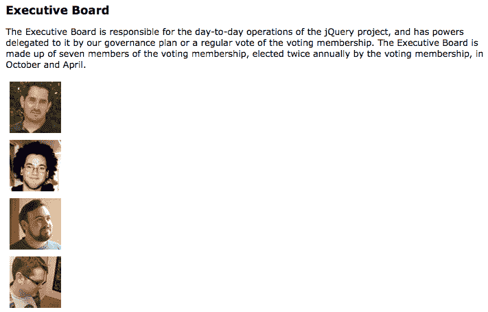
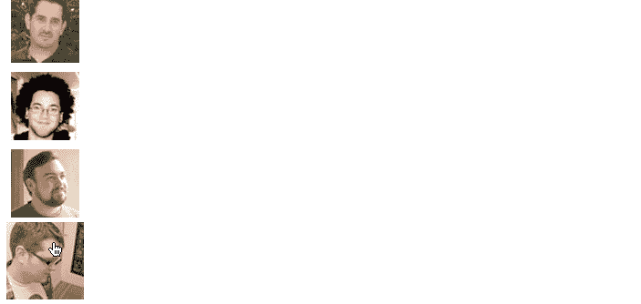
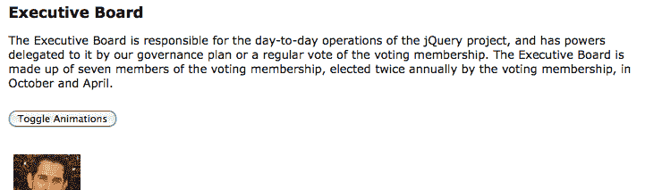
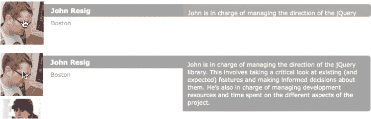

# 第十一章：高级效果

自从了解了 jQuery 的动画功能以来，我们发现了许多用途。我们可以轻松地隐藏和显示页面上的对象，我们可以优雅地调整元素的大小，我们可以平滑地重新定位元素。这个效果库是多功能的，包含的技术和专业能力甚至比我们迄今看到的还要多。

在第四章中，*样式和动画*，您学习了 jQuery 的基本动画功能。在这个更高级的章节中，我们将涵盖：

+   收集关于动画状态的信息的方法

+   中断活动动画的方法

+   全局效果选项，可以一次性影响页面上的所有动画

+   Deferred 对象允许我们在动画完成后执行操作

+   缓动，改变动画发生的速率

# 动画再访

为了刷新我们关于 jQuery 效果方法的记忆，我们将在本章中建立一个基线，从一个简单的悬停动画开始构建。使用带有照片缩略图的文档，当用户的鼠标悬停在上面时，我们将使每张照片略微*增大*，并在鼠标离开时恢复到原始大小。我们将使用的 HTML 标签目前还包含一些暂时隐藏的文本信息，稍后在本章中将使用：

```js
<div class="team"> 
  <div class="member"> 
     
    <div class="name">Rey Bango</div> 
    <div class="location">Florida</div> 
    <p class="bio">Rey Bango is a consultant living in South Florida,        
    specializing in web application development...</p> 
  </div> 
  <div class="member"> 
     
    <div class="name">Scott González</div> 
    <div class="location">North Carolina</div> 
    <div class="position">jQuery UI Development Lead</div> 
    <p class="bio">Scott is a web developer living in Raleigh, NC...       </p> 
  </div> 
  <!-- Code continues ... --> 
</div> 

```

获取示例代码

您可以从以下 GitHub 存储库访问示例代码：[`github.com/PacktPublishing/Learning-jQuery-3`](https://github.com/PacktPublishing/Learning-jQuery-3)。

每张图像相关联的文本最初由 CSS 隐藏，通过将每个 `<div>` 移动到其 `overflow: hidden` 容器的左侧来实现：

```js
.member { 
  position: relative; 
  overflow: hidden; 
} 

.member div { 
  position: absolute; 
  left: -300px; 
  width: 250px; 
} 

```

HTML 和 CSS 一起产生一个垂直排列的图像列表：



为了改变图像的大小，我们将把其高度和宽度从 `75` 像素增加到 `85` 像素。同时，为了保持图像居中，我们将其填充从 `5` 像素减少到 `0` 像素：

```js
$(() => {
  $('div.member')
    .on('mouseenter mouseleave', ({ type, target }) => {
      const width = height = type == 'mouseenter' ?
        85 : 75;
      const paddingTop = paddingLeft = type == 'mouseenter' ?
        0 : 5;

      $(target)
        .find('img')
        .animate({
          width,
          height,
          paddingTop,
          paddingLeft
        });
    });
}); 

```

清单 11.1

在这里，我们重复了我们在第十章中看到的一种模式，*高级事件*，因为当鼠标进入区域时，我们执行的大部分工作与离开时相同；我们将 `mouseenter` 和 `mouseleave` 的处理程序合并为一个函数，而不是使用两个单独的回调调用 `.hover()`。在这个处理程序内部，我们根据触发的两个事件中的哪一个来确定 `size` 和 `padding` 的值，并将这些属性值传递给 `.animate()` 方法。

当您看到将对象字面量表示法包围在函数参数 `({ type, target})` 周围时，这被称为**对象解构**。这只是一种方便的方法，可以从事件对象中获取我们需要的确切属性，从而在函数本身中编写更简洁的代码。

现在当鼠标光标位于图像上时，它比其他图像稍大：



# 观察和中断动画

我们的基本动画已经显示出一个问题。只要每次`mouseenter`或`mouseleave`事件后有足够的时间完成动画，动画就会按预期进行。然而，当鼠标光标快速移动并且事件被快速触发时，我们会看到图像在最后一个事件被触发后仍然反复变大和缩小。这是因为，如第四章所述，给定元素上的动画被添加到队列中并按顺序调用。第一个动画立即调用，按分配的时间完成，然后从队列中移除，此时下一个动画变为队列中的第一个，被调用，完成，被移除，依此类推，直到队列为空。

有许多情况下，jQuery 中称为`fx`的动画队列会引起期望的行为。但在我们这样的悬停动作中，需要绕过它。

# 确定动画状态

避免动画不良排队的一种方法是使用 jQuery 的自定义`:animated`选择器。在`mouseenter`/`mouseleave`事件处理程序中，我们可以使用该选择器来检查图像并查看它是否正在动画中：

```js
$(() => {
  $('div.member')
    .on('mouseenter mouseleave', ({ type, target }) => {
      const width = height = type == 'mouseenter' ?
        85 : 75;
      const paddingTop = paddingLeft = type == 'mouseenter' ?
        0 : 5;

      $(target)
        .find('img')
        .not(':animated')
        .animate({
          width,
          height,
          paddingTop,
          paddingLeft
        });
      });
});

```

清单 11.2

当用户的鼠标进入成员`<div>`时，图像只有在没有被动画化时才会进行动画。当鼠标离开时，动画将无论其状态如何都会发生，因为我们始终希望最终将图像恢复到其原始尺寸和填充状态。

我们成功地避免了在*清单 11.1*中发生的无限动画，但是动画仍然需要改进。当鼠标快速进入和离开`<div>`标记时，图像仍然必须完成整个`mouseenter`动画（增大）才会开始`mouseleave`动画（缩小）。这肯定不是理想的情况，但是`:animated`伪类的测试引入了一个更大的问题：如果鼠标在图像*缩小*时进入`<div>`标记，那么图像将无法再次增大。只有在动画停止后，下一个`mouseleave`和`mouseenter`动画才会执行另一个动画。在某些情况下使用`:animated`选择器可能很有用，但在这里并没有帮助太多。

# 停止运行的动画

幸运的是，jQuery 有一个方法可以帮助我们解决*清单 11.2*中显而易见的两个问题。`.stop()`方法可以立即停止动画。要使用它，我们可以将代码恢复到*清单 11.1*中的样子，然后在`.find()`和`.animate()`之间简单地插入`.stop()`：

```js
$(() => {
  $('div.member')
    .on('mouseenter mouseleave', ({ type, currentTarget }) => {
      const width = height = type == 'mouseenter' ?
        85 : 75;
      const paddingTop = paddingLeft = type == 'mouseenter' ?
        0 : 5;

      $(currentTarget)
        .find('img')
        .stop()
        .animate({
          width,
          height,
          paddingTop,
          paddingLeft
        });
    });
});

```

清单 11.3

值得注意的是，在进行新动画之前我们会在当前动画*之前*停止它。现在当鼠标重复进入和离开时，我们之前尝试的不良效果消失了。当前动画总是立即完成，因此`fx`队列中永远不会超过一个。当鼠标最终停下时，最终动画完成，因此图像要么完全增长（`mouseenter`），要么恢复到其原始尺寸（`mouseleave`），这取决于最后触发的事件。

# 停止动画时要小心

由于`.stop()`方法默认在当前位置停止动画，当与速记动画方法一起使用时可能会导致意外结果。在动画之前，这些速记方法确定最终值，然后对该值进行动画处理。例如，如果在其动画过程中使用`.stop()`停止`.slideDown()`，然后调用`.slideUp()`，那么下一次在元素上调用`.slideDown()`时，它只会滑动到上次停止的高度。为了减轻这种问题，`.stop()`方法可以接受两个布尔值（`true`/`false`）参数，第二个称为`goToEnd`。如果我们将此参数设置为`true`，则当前动画不仅停止，而且立即跳转到最终值。尽管如此，`goToEnd`功能可能会使动画看起来*不流畅*，因此更好的解决方案可能是将最终值存储在变量中，并显式地使用`.animate()`进行动画处理，而不是依赖 jQuery 来确定该值。

另一个 jQuery 方法`.finish()`可用于停止动画。它类似于`.stop(true, true)`，因为它清除所有排队的动画，并将当前动画跳转到最终值。但是，与`.stop(true, true)`不同，它还会将所有*排队的*动画跳转到它们的最终值。

# 使用全局效果属性

jQuery 中的效果模块包含一个方便的`$.fx`对象，当我们想要全面改变动画特性时可以访问该对象。虽然该对象的一些属性未记录，并且只能在库内部使用，但其他属性则作为工具提供，用于全局改变动画运行方式。在以下示例中，我们将看一些已记录属性。

# 禁用所有效果

我们已经讨论了如何停止当前正在运行的动画，但是如果我们需要完全禁用所有动画怎么办？例如，我们可能希望默认情况下提供动画，但是在低资源设备（动画可能看起来断断续续）或对于发现动画分散注意力的用户中禁用这些动画。为此，我们只需将`$.fx.off`属性设置为`true`。为了演示，我们将显示一个之前隐藏的按钮，以允许用户切换动画的开启和关闭：

```js
$(() => {
  $('#fx-toggle')
    .show()
    .on('click', () => {
      $.fx.off = !$.fx.off;
    });
}); 

```

列表 11.4

隐藏按钮显示在介绍段落和随后的图像之间：



当用户点击按钮将动画切换关闭时，随后的动画，如我们的放大和缩小图像，将立即发生（持续时间为`0`毫秒），然后立即调用任何回调函数。

# 定义效果持续时间

`$.fx`对象的另一个属性是`speeds`。该属性本身是一个对象，由 jQuery 核心文件证实，由三个属性组成：

```js
speeds: { 
  slow: 600, 
  fast: 200, 
  // Default speed 
  _default: 400 
} 

```

您已经学会了 jQuery 的所有动画方法都提供了一个可选的速度或持续时间参数。查看`$.fx.speeds`对象，我们可以看到字符串`slow`和`fast`分别映射到 600 毫秒和 200 毫秒。每次调用动画方法时，jQuery 按照以下顺序执行以下步骤来确定效果的持续时间：

1.  它检查`$.fx.off`是否为`true`。如果是，它将持续时间设置为`0`。

1.  它检查传递的持续时间是否为数字。如果是，则将持续时间设置为该数字的毫秒数。

1.  它检查传递的持续时间是否匹配`$.fx.speeds`对象的属性键之一。如果是，则将持续时间设置为属性的值。

1.  如果持续时间未由上述任何检查设置，则将持续时间设置为`$.fx.speeds._default`的值。

综合这些信息，我们现在知道，传递除`slow`或`fast`之外的任何字符串持续时间都会导致持续时间为 400 毫秒。我们还可以看到，添加我们自己的自定义速度就像添加另一个属性到`$.fx.speeds`一样简单。例如，如果我们写`$.fx.speeds.crawl = 1200`，我们可以在任何动画方法的速度参数中使用`'crawl'`以运行动画 1200 毫秒，如下所示：

```js
$(someElement).animate({width: '300px'}, 'crawl'); 

```

尽管键入`'crawl'`不比键入`1200`更容易，但在较大的项目中，当许多共享某个速度的动画需要更改时，自定义速度可能会派上用场。在这种情况下，我们可以更改`$.fx.speeds.crawl`的值，而不是在整个项目中搜索`1200`并仅在表示动画速度时替换每个值。

虽然自定义速度可能很有用，但也许更有用的是能够更改默认速度的能力。我们可以通过设置`_default`属性来做到这一点：

```js
$.fx.speeds._default = 250; 

```

列表 11.5

现在，我们已经定义了一个新的更快的默认速度，除非我们覆盖它们的持续时间，否则任何新添加的动画都将使用它。为了看到这个过程，我们将向页面引入另一个交互元素。当用户点击其中一个肖像时，我们希望显示与该人物相关联的详细信息。我们将通过将它们从肖像下面移出到最终位置来创建详细信息从肖像中*展开*的错觉：

```js
$(() => { 
  const showDetails = ({ currentTarget }) => {
    $(currentTarget)
      .find('div')
      .css({
        display: 'block',
        left: '-300px',
        top: 0
      })
      .each((i, element) => {
        $(element)
          .animate({
            left: 0,
            top: 25 * i
          });
      });
  }; 
  $('div.member').click(showDetails); 
}); 

```

列表 11.6

当点击成员时，我们使用`showDetails()`函数作为处理程序。该函数首先将详细信息`<div>`元素设置在成员肖像的下方的起始位置。然后将每个元素动画到其最终位置。通过调用`.each()`，我们可以计算每个元素的单独最终`top`位置。

动画完成后，详细信息文本可见：


由于`.animate()`方法调用是在不同的元素上进行的，所以它们是同时进行的，而不是排队进行的。而且，由于这些调用没有指定持续时间，它们都使用了新的默认持续时间 250 毫秒。

当点击另一个成员时，我们希望隐藏先前显示的成员。我们可以轻松地通过类来跟踪当前屏幕上显示的详细信息：

```js
 const showDetails = ({ currentTarget }) => {
   $(currentTarget)
     .siblings('.active')
     .removeClass('active')
     .children('div')
     .fadeOut()
     .end()
     .end()
     .addClass('active')
     .find('div')
     .css({
       display: 'block',
       left: '-300px',
       top: 0
     })
     .each((i, element) => {
       $(element)
         .animate({
           left: 0,
           top: 25 * i
         });
     });
}; 

```

列表 11.7

哎呀！十个函数链接在一起？等等，这其实可能比拆分它们更好。首先，像这样链接调用意味着不需要使用临时变量来保存中间的 DOM 值。相反，我们可以一行接一行地读取以了解发生了什么。现在让我们逐个解释一下这些：

+   `.siblings('.active')`: 这会找到活动的`<div>`兄弟元素。

+   `.removeClass('active')`: 这会移除`.active`类。

+   `.children('div')`: 这会找到子`<div>`元素。

+   `.fadeOut()`: 这会将它们移除。

+   `.end()`: 这会清除`.children('div')`查询结果。

+   `.end()`: 这会清除`.siblings('.active')`查询结果。

+   `.addClass('active')`: 这会将`.active`类添加到事件目标，即容器`<div>`上。

+   `.find('div')`: 这会找到所有子`<div>`元素以显示。

+   `.css()`: 这会设置相关的显示 CSS。

+   `.each()`: 这会向`top`和`left`CSS 属性添加动画。

请注意，我们的`.fadeOut()`调用也使用了我们定义的更快的 250 毫秒持续时间。默认值适用于 jQuery 的预打包效果，就像它们适用于自定义`.animate()`调用一样。

# 多属性缓动

`showDetails()`函数几乎实现了我们想要的展开效果，但由于`top`和`left`属性以相同的速率进行动画，它看起来更像是一个滑动效果。我们可以通过仅为`top`属性更改缓动方程式为`easeInQuart`来微妙地改变效果，从而使元素沿着曲线路径而不是直线路径移动。但请记住，除了`swing`或`linear`之外的任何缓动都需要插件，例如 jQuery UI 的效果核心（[`jqueryui.com/`](http://jqueryui.com/)）。

```js
.each((i, element) => {
  $(element)
    .animate({
      left: 0,
      top: 25 * i
    },{
      duration: 'slow',
      specialEasing: {
        top: 'easeInQuart'
      }
    });
 });

```

列表 11.8

`specialEasing`选项允许我们为每个正在动画化的属性设置不同的加速曲线。如果选项中不包括的属性，则将使用`easing`选项的方程式（如果提供）或默认的`swing`方程式。

现在我们有了一个引人注目的动画，展示了与团队成员相关的大部分细节。但我们还没有展示成员的传记。在这之前，我们需要稍微偏离一下话题，谈谈 jQuery 的延迟对象机制。

# 使用延迟对象

有时，我们会遇到一些情况，我们希望在过程完成时采取行动，但我们并不一定知道这个过程需要多长时间，或者是否会成功。为了处理这些情况，jQuery 为我们提供了**延迟对象**（promises）。延迟对象封装了需要一些时间来完成的操作。

可以随时通过调用`$.Deferred()`构造函数创建一个新的延迟对象。一旦我们有了这样的对象，我们可以执行长时间运行的操作，然后在对象上调用`.resolve()`或`.reject()`方法来指示操作是否成功或失败。然而，手动这样做有点不寻常。通常，我们不是手动创建自己的延迟对象，而是 jQuery 或其插件会创建对象，并负责解决或拒绝它。我们只需要学习如何使用创建的对象。

我们不打算详细介绍`$.Deferred()`构造函数的操作方式，而是在这里重点讨论 jQuery 效果如何利用延迟对象。在第十三章中，*高级 Ajax*，我们将进一步探讨在 Ajax 请求的背景下的延迟对象。

每个延迟对象都承诺向其他代码提供数据。这个承诺作为另一个具有自己一套方法的对象来表示。从任何延迟对象，我们可以通过调用它的`.promise()`方法来获得它的 promise 对象。然后，我们可以调用 promise 的方法来附加处理程序，当 promise 被履行时执行：

+   `.then()`方法附加了一个处理程序，当延迟对象成功解决时调用。

+   `.catch()`方法附加了一个处理程序，当延迟对象被拒绝时调用。

+   `.always()`方法附加了一个处理程序，当延迟对象完成其任务时被调用，无论是被解决还是被拒绝。

这些处理程序非常类似于我们提供给`.on()`的回调函数，因为它们是在某个事件发生时调用的函数。我们还可以附加多个处理程序到同一个承诺上，所有的会在适当的时候被调用。然而，这里也有一些重要的区别。承诺处理程序只会被调用一次；延迟对象无法再次解决。如果在我们附加处理程序时延迟对象已经被解决，那么承诺处理程序也会立即被调用。

在第六章中，*使用 Ajax 发送数据*，我们看到了一个非常简单的例子，说明了 jQuery 的 Ajax 系统如何使用延迟对象。现在，我们将再次利用这个强大的工具，通过研究 jQuery 动画系统创建的延迟对象来使用它。

# 动画的承诺

每个 jQuery 集合都有一组延迟对象与其关联，用于跟踪集合中元素的排队操作的状态。通过在 jQuery 对象上调用 `.promise()` 方法，我们得到一个在队列完成时解析的 promise 对象。特别是，我们可以使用此 promise 在任何匹配元素上运行的所有动画完成时采取行动。

就像我们有一个 `showDetails()` 函数来显示成员的名称和位置信息一样，我们可以编写一个 `showBio()` 函数来显示传记信息。但首先，我们将向 `<body>` 标签附加一个新的 `<div>` 标签并设置两个选项对象：

```js
$(() => {
  const $movable = $('<div/>')
    .attr('id', 'movable')
    .appendTo('body');

  const bioBaseStyles = {
    display: 'none',
    height: '5px',
    width: '25px'
  }

  const bioEffects = {
    duration: 800,
    easing: 'easeOutQuart',
    specialEasing: {
      opacity: 'linear'
    }
  };
});

```

[11.9 清单](https://wiki.example.org/11.9_listing)

这个新的可移动 `<div>` 元素是我们实际上将要动画化的元素，在注入了传记副本后。像这样拥有一个包装元素在动画化元素的宽度和高度时特别有用。我们可以将其 `overflow` 属性设置为 `hidden`，并为其中的传记设置显式的宽度和高度，以避免在我们动画化传记 `<div>` 元素本身时持续不断地重新排列文本。

我们将使用 `showBio()` 函数根据点击的成员图像确定可移动 `<div>` 的起始和结束样式。请注意，我们使用 `$.extend()` 方法将保持不变的一组基本样式与根据成员位置变化的 `top` 和 `left` 属性进行合并。然后，只需使用 `.css()` 设置起始样式和 `.animate()` 设置结束样式：

```js
const showBio = (target) => {
  const $member = $(target).parent();
  const $bio = $member.find('p.bio');
  const startStyles = $.extend(
    {},
    bioBaseStyles,
    $member.offset()
  );
  const endStyles = {
    width: $bio.width(),
    top: $member.offset().top + 5,
    left: $member.width() + $member.offset().left - 5,
    opacity: 'show'
  };

  $movable
    .html($bio.clone())
    .css(startStyles)
    .animate(endStyles, bioEffects)
    .animate(
      { height: $bio.height() },
      { easing: 'easeOutQuart' }
    );
}; 

```

[11.10 清单](https://wiki.example.org/11.10_listing)

我们排队了两个 `.animate()` 方法，以便传记首先从左侧飞出并变宽和完全不透明，然后在到位后向下滑动到其完整高度。

在 第四章，*样式和动画* 中，我们看到 jQuery 动画方法中的回调函数在集合中每个元素的动画完成时被调用。我们希望在其他 `<div>` 元素出现后显示成员的传记。在 jQuery 引入 `.promise()` 方法之前，这将是一项繁重的任务，需要我们在每次执行回调时从总元素数倒计时，直到最后一次，此时我们可以执行动画化传记的代码。

现在我们可以简单地将 `.promise()` 和 `.then()` 方法链接到我们的 `showDetails()` 函数内部的 `.each()` 方法中：

```js
const showDetails = ({ currentTarget }) => {
  $(currentTarget)
    .siblings('.active')
    .removeClass('active')
    .children('div')
    .fadeOut()
    .end()
    .end()
    .addClass('active')
    .find('div')
    .css({
      display: 'block',
      left: '-300px',
      top: 0
    })
    .each((i, element) => {
      $(element)
        .animate({
          left: 0,
          top: 25 * i
        },{
          duration: 'slow',
          specialEasing: {
            top: 'easeInQuart'
          }
        });
    })
    .promise()
    .then(showBio);
}; 

```

[11.11 清单](https://wiki.example.org/11.11_listing)

`.then()` 方法将我们的 `showBio()` 函数的引用作为其参数。现在，点击图像将以吸引人的动画序列将所有成员信息显示出来：



自 jQuery 3.0 起，`promise()` 方法返回的 promises 与原生 ES 2015 promises 完全兼容。这意味着在可能的情况下，我们应该使用相同的 API。例如，使用 `then()` 代替 `done()`。它们做的是一样的事情，你的异步代码将与其他异步代码保持一致。

# 对动画进行细粒度控制

即使我们已经研究了许多高级功能，jQuery 的效果模块还有很多可以探索的地方。jQuery 1.8 的重写为这个模块引入了许多高级开发者调整各种效果甚至更改驱动动画的底层引擎的方法。例如，除了提供 `duration` 和 `easing` 等选项外，`.animate()` 方法还提供了一些回调选项，让我们在动画的每一步检查和修改动画：

```js
$('#mydiv').animate({ 
  height: '200px', 
  width: '400px' 
}, { 
  step(now, tween) { 
   // monitor height and width 
   // adjust tween properties 
  }, 
  progress(animation, progress, remainingMs) {} 
}); 

```

`step()` 函数，每次动画属性动画期间大约每 13 毫秒调用一次，允许我们根据传递的 `now` 参数的当前值调整 `tween` 对象的属性，如结束值、缓动类型或实际正在动画的属性。例如，一个复杂的演示可能会使用 `step()` 函数来检测两个移动元素之间的碰撞，并根据碰撞调整它们的轨迹。

`progress()` 函数在动画的生命周期中被多次调用：

+   它与 `step()` 不同之处在于，它每一步仅在每个元素上调用一次，而不管正在动画多少个属性

+   它提供了动画的不同方面，包括动画的 promise 对象、进度（一个介于 `0` 和 `1` 之间的数字）以及动画中剩余的毫秒数。

所有 jQuery 的动画都使用一个名为 `setTimeout()` 的 JavaScript 计时器函数来重复调用函数 —— 默认情况下每 13 毫秒一次 —— 并在每个时刻改变样式属性。然而，一些现代浏览器提供了一个新的 `requestAnimationFrame()` 函数，它相对于 `setTimeout()` 有一些优势，包括增加了精度（因此动画的平滑度更高）和改善了移动设备的电池消耗。

在 jQuery 的动画系统的最低级别上，有它的 `$.Animation()` 和 `$.Tween()` 函数。这些函数及其对应的对象可以用来调整动画的每一个可能的方面。例如，我们可以使用 `$.Animation` 来创建一个动画**预处理**。这样的预处理可以采用一个

特别

基于传递给 `.animate()` 方法的 `options` 对象中的属性的存在，在动画结束时执行动作：

```js
$.Animation.prefilter(function(element, properties, options) { 
  if (options.removeAfter) { 
    this.done(function () { 
      $(element).remove(); 
    }); 
  } 
}); 

```

使用这段代码，调用 `$('#my-div').fadeOut({ removeAfter: true })` 将在淡出完成后自动从 DOM 中删除 `<div>`。

# 摘要

在本章中，我们进一步研究了几种可以帮助我们制作对用户有用的漂亮动画的技术。我们现在可以单独控制我们正在动画化的每个属性的加速度和减速度，并在需要时单独或全局停止这些动画。我们了解了 jQuery 的效果库内部定义的属性，以及如何更改其中一些属性以适应我们的需求。我们初次涉足了 jQuery 延迟对象系统，我们将在第十三章 *高级 Ajax*中进一步探索，并且我们品尝到了调整 jQuery 动画系统的许多机会。

# 进一步阅读

本书附录 B 中提供了完整的效果和动画方法列表，或者您可以在[官方 jQuery 文档](http://api.jquery.com/)中找到。

# 练习

挑战练习可能需要使用[官方 jQuery 文档](http://api.jquery.com/)。

1.  定义一个名为`zippy`的新动画速度常数，并将其应用于传记显示效果。

1.  更改成员详细信息的水平移动的缓动，使其反弹到位。

1.  向 promise 添加一个第二个延迟回调函数，将`highlight`类添加到当前成员位置的`<div>`中。

1.  挑战：在动画传记之前添加两秒的延迟。使用 jQuery 的`.delay()`方法。

1.  挑战：当点击活动照片时，折叠生物详细信息。在执行此操作之前停止任何正在运行的动画。
