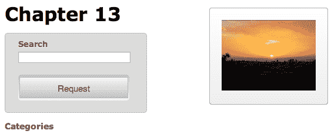

# 第十三章：高级 Ajax

许多 Web 应用程序需要频繁的网络通信。使用 jQuery，我们的网页可以与服务器交换信息，而无需在浏览器中加载新页面。

在第六章 *使用 Ajax 发送数据* 中，你学会了与服务器异步交互的简单方法。在这一更高级的章节中，我们将包括：

+   处理网络中断的错误处理技术

+   Ajax 和 jQuery 延迟对象系统之间的交互

+   使用缓存和节流技术来减少网络流量

+   使用传输器、预过滤器和数据类型转换器扩展 Ajax 系统的内部工作方式的方法

# 使用 Ajax 实现渐进增强

在整本书中，我们遇到了 *渐进增强* 的概念。重申一下，这一理念确保所有用户都能获得积极的用户体验，要先确保有一个可用的产品，然后再为使用现代浏览器的用户添加额外的装饰。

举例来说，我们将构建一个搜索 GitHub 代码库的表单：

```js
<form id="ajax-form" action="https://github.com/search" method="get"> 
  <fieldset> 
    <div class="text"> 
      <label for="title">Search</label> 
      <input type="text" id="title" name="q"> 
    </div> 

    <div class="actions"> 
      <button type="submit">Request</button> 
    </div> 
  </fieldset> 
</form> 

```

获取示例代码

你可以从以下 GitHub 代码库访问示例代码：[`github.com/PacktPublishing/Learning-jQuery-3`](https://github.com/PacktPublishing/Learning-jQuery-3)。

搜索表单是一个普通的表单元素，包括一个文本输入和一个标有请求的提交按钮：


当点击该表单的请求按钮时，表单会像平常一样提交；用户的浏览器会被重定向到[`github.com/search`](https://github.com/search)，并显示结果：


然而，我们希望将这些内容加载到我们搜索页面的 `#response` 容器中，而不是离开页面。如果数据存储在与我们的搜索表单相同的服务器上，我们可以使用 `.load()` 方法提取页面的相关部分：

```js
$(() => {
  $('#ajax-form')
    .on('submit', (e) => {
      e.preventDefault();
      $('#response')
        .load(
          'https://github.com/search .container',
          $(e.target).serialize()
        );
    });
});

```

列表 13.1

然而，由于 GitHub 在不同的主机名下，浏览器的默认跨域策略将阻止这个请求的发生。

# 获取 JSONP 数据

在第六章 *使用 Ajax 发送数据* 中，我们看到 JSONP 只是 JSON 加上了允许从不同站点进行请求的服务器行为的一个附加层。当请求 JSONP 数据时，提供了一个特殊的查询字符串参数，允许请求脚本处理数据。这个参数可以被 JSONP 服务器命名任何名称；在 GitHub API 的情况下，该参数使用默认名称 `callback`。

因为使用了默认的 `callback` 名称，使得要进行 JSONP 请求唯一需要的设置就是告诉 jQuery `jsonp` 是我们期望的数据类型：

```js
$(() => {
  $('#ajax-form')
    .on('submit', (e) => {
      e.preventDefault();

      $.ajax({
        url: 'https://api.github.com/search/repositories',
        dataType: 'jsonp',
        data: { q: $('#title').val() },
        success(data) {
          console.log(data);
        }
      });
    });
}); 

```

列表 13.2

现在，我们可以在控制台中检查 JSON 数据。在这种情况下，数据是一个对象数组，每个对象描述一个 GitHub 代码库：

```js
{
  "id": 167174,
  "name": "jquery",
  "open_issues": 78,
  "open_issues_count": 78,
  "pulls_url: "https://api.github.com/repos/jquery/jquery/pulls{/number}",
  "pushed_at": "2017-03-27T15:50:12Z",
  "releases_url": "https://api.github.com/repos/jquery/jquery/releases{/id}",
  "score": 138.81496,
  "size": 27250,
  "ssh_url": "git@github.com:jquery/jquery.git",
  "stargazers_count": 44069,
  "updated_at": "2017-03-27T20:59:42Z",
  "url": "https://api.github.com/repos/jquery/jquery",
  "watchers": 44069,
  // ...
} 

```

关于一个仓库的所有我们需要显示的数据都包含在这个对象中。我们只需要适当地对其进行格式化以进行显示。为一个项目创建 HTML 有点复杂，所以我们将这一步拆分成自己的辅助函数：

```js
const buildItem = item =>
  `
    <li>
      <h3><a href="${item.html_url}">${item.name}</a></h3>
      <div>★ ${item.stargazers_count}</div>
      <div>${item.description}</div>
    </li>
  `;

```

第 13.3 节

`buildItem()`函数将 JSON 对象转换为 HTML 列表项。这包括一个指向主 GitHub 仓库页面的链接，后跟描述。

在这一点上，我们有一个函数来为单个项目创建 HTML。当我们的 Ajax 调用完成时，我们需要在每个返回的对象上调用此函数，并显示所有结果：

```js
$(() => {
  $('#ajax-form')
    .on('submit', (e) => {
      e.preventDefault();

      $.ajax({
        url: 'https://api.github.com/search/repositories',
        dataType: 'jsonp',
        data: { q: $('#title').val() },
        success(json) {
          var output = json.data.items.map(buildItem);
          output = output.length ?
          output.join('') : 'no results found';

          $('#response').html(`<ol>${output}</ol>`);
        }
      });
    });
}); 

```

第 13.4 节

现在我们有一个功能性的`success`处理程序，在搜索时，会将结果很好地显示在我们表单旁边的一列中：


# 处理 Ajax 错误

将任何类型的网络交互引入应用程序都会带来一定程度的不确定性。用户的连接可能会在操作过程中断开，或者临时服务器问题可能会中断通信。由于这些可靠性问题，我们应该始终为最坏的情况做准备，并准备好处理错误情况。

`$.ajax()`函数可以接受一个名为`error`的回调函数，在这些情况下调用。在这个回调中，我们应该向用户提供某种反馈，指示发生了错误：

```js
$(() => {
  $('#ajax-form')
    .on('submit', (e) => {
      e.preventDefault();

      $.ajax({
        url: 'https://api.github.com/search/repositories',
        dataType: 'jsonp',
        data: { q: $('#title').val() },
        error() {
          $('#response').html('Oops. Something went wrong...');
        }
      });
    });
}); 

```

第 13.5 节

错误回调可能由多种原因触发。其中包括：

+   服务器返回了错误状态码，例如 403 Forbidden、404 Not Found 或 500 Internal Server Error。

+   服务器返回了重定向状态码，例如 301 Moved Permanently。一个例外是 304 Not Modified，它不会触发错误，因为浏览器可以正确处理这种情况。

+   服务器返回的数据无法按照指定的方式解析（例如，在`dataType`为`json`时，它不是有效的 JSON 数据）。

+   在`XMLHttpRequest`对象上调用了`.abort()`方法。

检测和响应这些条件对提供最佳用户体验非常重要。我们在第六章中看到，*通过 Ajax 发送数据*，如果有的话，错误代码是通过传递给错误回调的`jqXHR`对象的`.status`属性提供给我们的。如果合适的话，我们可以使用`jqXHR.status`的值对不同类型的错误做出不同的反应。

然而，服务器错误只有在实际观察到时才有用。有些错误会立即被检测到，但其他情况可能导致请求和最终错误响应之间的长时间延迟。

当可靠的服务器超时机制不可用时，我们可以强制执行自己的客户端请求超时。通过向超时选项提供以毫秒为单位的时间，我们告诉`$.ajax()`在收到响应之前超过该时间量时自行触发`.abort()`：

```js
$.ajax({
  url: 'https://api.github.com/search/repositories',
  dataType: 'jsonp',
  data: { q: $('#title').val() },
  timeout: 10000,
  error() {
    $('#response').html('Oops. Something went wrong...');
  }
});

```

第 13.6 节

有了超时设置，我们可以确保在 10 秒内要么加载数据，要么用户会收到错误消息。

# 使用 jqXHR 对象

当发出 Ajax 请求时，jQuery 会确定获取数据的最佳机制。这个传输可以是标准的`XMLHttpRequest`对象，Microsoft ActiveX 的`XMLHTTP`对象或者`<script>`标签。

因为使用的传输方式可能会因请求而异，所以我们需要一个通用接口来与通信进行交互。`jqXHR`对象为我们提供了这个接口。当使用该传输方式时，它是`XMLHttpRequest`对象的包装器，在其他情况下，它会尽可能模拟`XMLHttpRequest`。它暴露的属性和方法包括：

+   `.responseText`或`.responseXML`，包含返回的数据

+   `.status`和`.statusText`，包含状态代码和描述

+   `.setRequestHeader()`以操作与请求一起发送的 HTTP 头部。

+   `.abort()`以过早终止事务

所有 jQuery 的 Ajax 方法都会返回这个`jqXHR`对象，因此，如果我们需要访问这些属性或方法，我们可以存储结果。

# Ajax promises

然而，比`XMLHttpRequest`接口更重要的是，`jqXHR`还充当了一个 promise。在第十一章的*高级特效*中，你了解了 deferred 对象，它允许我们设置在某些操作完成时触发回调。Ajax 调用就是这样一种操作的示例，`jqXHR`对象提供了我们从 deferred 对象的 promise 中期望的方法。

使用 promise 的方法，我们可以重写我们的`$.ajax()`调用，以替换成功和错误回调的替代语法：

```js
$.ajax({
  url: 'https://api.github.com/search/repositories',
  dataType: 'jsonp',
  data: { q: $('#title').val() },
  timeout: 10000,
}).then((json) => {
  var output = json.data.items.map(buildItem);
  output = output.length ?
    output.join('') : 'no results found';

  $('#response').html(`<ol>${output}</ol>`);
}).catch(() => {
  $('#response').html('Oops. Something went wrong...');
});

```

列表 13.7

乍一看，调用`.then()`和`.catch()`似乎并不比我们之前使用的回调语法更有用。然而，promise 方法提供了几个优点。首先，这些方法可以被多次调用以添加更多的处理程序（handlers）（如果需要的话）。其次，如果我们将`$.ajax()`调用的结果存储在一个常量中，我们可以稍后调用处理程序，如果这样做能够使我们的代码结构更易读。第三，如果在附加处理程序时 Ajax 操作已经完成，处理程序将立即被调用。最后，我们不应忽视使用与 jQuery 库其他部分和本机 JavaScript promises 一致的语法的可读性优势。

另一个使用 promise 方法的例子，我们可以在发出请求时添加一个加载指示器。由于我们希望在请求完成时隐藏指示器，无论成功与否，`.always()`方法将非常有用：

```js
$('#ajax-form')
  .on('submit', (e) => {
    e.preventDefault();

    $('#response')
      .addClass('loading')
      .empty();

    $.ajax({
      url: 'https://api.github.com/search/repositories',
      dataType: 'jsonp',
      data: { q: $('#title').val() },
      timeout: 10000,
    }).then((json) => {
      var output = json.data.items.map(buildItem);
      output = output.length ?
      output.join('') : 'no results found';

      $('#response').html(`<ol>${output}</ol>`);
    }).catch(() => {
      $('#response').html('Oops. Something went wrong...');
    }).always(() => {
      $('#response').removeClass('loading');
    });
}); 

```

列表 13.8

在发出 `$.ajax()` 调用之前，我们将 `loading` 类添加到响应容器中。加载完成后，我们再次将其删除。通过这样做，我们进一步增强了用户体验，因为现在有一个视觉指示器表明后台正在发生某事。

要真正掌握 promise 行为如何帮助我们，我们需要看看如果将 `$.ajax()` 调用的结果存储起来供以后使用时我们可以做什么。

# 缓存响应

如果我们需要重复使用相同的数据片段，每次都进行 Ajax 请求是低效的。为了防止这种情况，我们可以将返回的数据缓存在一个变量中。当我们需要使用某些数据时，我们可以检查数据是否已经在缓存中。如果是，我们就对这些数据采取行动。如果没有，我们需要进行 Ajax 请求，在其 `.done()` 处理程序中，我们将数据存储在缓存中并对返回的数据进行操作。

如果我们利用 promise 的特性，事情会变得相当简单：

```js
$(() => {
  const cache = new Map();

  $('#ajax-form')
    .on('submit', (e) => {
      e.preventDefault();

      const search = $('#title').val();

      if (search == '') {
        return;
      }

      $('#response')
        .addClass('loading')
        .empty();

      cache.set(search, cache.has(search) ?
        cache.get(search) :
        $.ajax({
          url: 'https://api.github.com/search/repositories',
          dataType: 'jsonp',
          data: { q: search },
          timeout: 10000,
        })
      ).get(search).then((json) => {
        var output = json.data.items.map(buildItem);
        output = output.length ?
          output.join('') : 'no results found';

        $('#response').html(`<ol>${output}</ol>`);
      }).catch(() => {
        $('#response').html('Oops. Something went wrong...');
      }).always(() => {
        $('#response').removeClass('loading');
      });
    });
}); 

```

列表 13.9

我们引入了一个名为 `cache` 的新的 `Map` 常量，用于保存我们创建的 `jqXHR` promises。这个映射的键对应于正在执行的搜索。当提交表单时，我们会查看是否已经为该键存储了一个 `jqXHR` promise。如果没有，我们像以前一样执行查询，将结果对象存储在 `api` 中。

`.then()`、`.catch()` 和 `.always()` 处理程序然后附加到 `jqXHR` promise。请注意，无论是否进行了 Ajax 请求，这都会发生。这里有两种可能的情况需要考虑。

首先，如果之前还没有发送过 Ajax 请求，就会发送 Ajax 请求。这与以前的行为完全一样：发出请求，然后我们使用 promise 方法将处理程序附加到 `jqXHR` 对象上。当服务器返回响应时，会触发适当的回调，并将结果打印到屏幕上。

另一方面，如果我们过去执行过此搜索，则 `cache` 中已经存储了 `jqXHR` promise。在这种情况下，不会执行新的搜索，但我们仍然在存储的对象上调用 promise 方法。这会将新的处理程序附加到对象上，但由于延迟对象已经解决，因此相关的处理程序会立即触发。

jQuery 延迟对象系统为我们处理了所有繁重的工作。几行代码，我们就消除了应用程序中的重复网络请求。

# 限制 Ajax 请求速率

搜索的常见功能是在用户输入时显示动态结果列表。我们可以通过将处理程序绑定到 `keyup` 事件来模拟这个“实时搜索”功能，用于我们的 jQuery API 搜索：

```js
$('#title')
  .on('keyup', (e) => {
    $(e.target.form).triggerHandler('submit');
  });

```

列表 13.10

在这里，我们只需在用户在搜索字段中键入任何内容时触发表单的提交处理程序。这可能导致快速连续发送许多请求到网络，这取决于用户输入的速度。这种行为可能会降低 JavaScript 的性能；它可能会堵塞网络连接，而服务器可能无法处理这种需求。

我们已经通过刚刚实施的请求缓存来限制请求的数量。然而，我们可以通过对请求进行限速来进一步减轻服务器的负担。在第十章中，*高级事件*，我们介绍了当我们创建一个特殊的 `throttledScroll` 事件以减少原生滚动事件触发的次数时，引入了节流的概念。在这种情况下，我们希望类似地减少活动; 这次是使用 `keyup` 事件：

```js
const searchDelay = 300;
var searchTimeout;

$('#title')
  .on('keyup', (e) => {
    clearTimeout(searchTimeout);

    searchTimeout = setTimeout(() => {
      $(e.target.form).triggerHandler('submit');
    }, searchDelay);
  });

```

列表 13.11

我们在这里使用的技术有时被称为防抖动，与我们在第十章中使用的技术有所不同。在那个例子中，我们需要我们的 `scroll` 处理程序在滚动继续时多次生效，而在这里，我们只需要在输入停止后一次发生 `keyup` 行为。为了实现这一点，我们跟踪一个 JavaScript 计时器，该计时器在用户按键时启动。每次按键都会重置该计时器，因此只有当用户停止输入指定的时间（300 毫秒）后，`submit` 处理程序才会被触发，然后执行 Ajax 请求。

# 扩展 Ajax 功能

jQuery Ajax 框架是强大的，正如我们所见，但即使如此，有时我们可能想要改变它的行为方式。毫不奇怪，它提供了多个钩子，可以被插件使用，为框架提供全新的功能。

# 数据类型转换器

在第六章中，*使用 Ajax 发送数据*，我们看到 `$.ajaxSetup()` 函数允许我们更改 `$.ajax()` 使用的默认值，从而可能影响许多 Ajax 操作只需一次语句。这个相同的函数也可以用于扩展 `$.ajax()` 可以请求和解释的数据类型范围。

举个例子，我们可以添加一个理解 YAML 数据格式的转换器。YAML（[`www.yaml.org/`](http://www.yaml.org/)）是一种流行的数据表示，许多编程语言都有实现。如果我们的代码需要与这样的替代格式交互，jQuery 允许我们将其兼容性构建到本地 Ajax 函数中。

包含 GitHub 仓库搜索条件的简单 YAML 文件：

```js
Language:
 - JavaScript
 - HTML
 - CSS
Star Count:
 - 5000+
 - 10000+
 - 20000+

```

我们可以将 jQuery 与现有的 YAML 解析器（如 Diogo Costa 的 [`code.google.com/p/javascript-yaml-parser/`](http://code.google.com/p/javascript-yaml-parser/)）结合起来，使 `$.ajax()` 也能够使用这种语言。

定义一个新的 Ajax 数据类型涉及将三个属性传递给`$.ajaxSetup()`：`accepts`、`contents`和`converters`。`accepts`属性添加要发送到服务器的头，声明服务器理解我们的脚本的特定 MIME 类型。`contents`属性处理交易的另一侧，提供一个与响应 MIME 类型匹配的正则表达式，尝试从此元数据中自动检测数据类型。最后，`converters`包含解析返回数据的实际函数：

```js
$.ajaxSetup({ 
  accepts: { 
    yaml: 'application/x-yaml, text/yaml' 
  }, 
  contents: { 
    yaml: /yaml/ 
  }, 
  converters: { 
    'text yaml': (textValue) => { 
      console.log(textValue); 
      return ''; 
    } 
  } 
}); 

$.ajax({ 
  url: 'categories.yml', 
  dataType: 'yaml' 
}); 

```

列表 13.12

*列表 13.12*中的部分实现使用`$.ajax()`来读取 YAML 文件，并将其数据类型声明为`yaml`。因为传入的数据被解析为`text`，jQuery 需要一种方法将一个数据类型转换为另一个。`'text yaml'`的`converters`键告诉 jQuery，此转换函数将接受作为`text`接收的数据，并将其重新解释为`yaml`。

在转换函数内部，我们只是记录文本内容以确保函数被正确调用。要执行转换，我们需要加载第三方 YAML 解析库（`yaml.js`）并调用其方法：

```js
$.ajaxSetup({
  accepts: {
    yaml: 'application/x-yaml, text/yaml'
  },
  contents: {
    yaml: /yaml/
  },
  converters: {
    'text yaml': (textValue) => YAML.eval(textValue)
  }
});

Promise.all([
  $.getScript('yaml.js')
    .then(() =>
      $.ajax({
        url: 'categories.yml',
        dataType: 'yaml'
      })),
  $.ready
]).then(([data]) => {
  const output = Object.keys(data).reduce((result, key) =>
    result.concat(
      `<li><strong>${key}</strong></li>`,
      data[key].map(i => `<li> <a href="#">${i}</a></li>`)
    ),
    []
  ).join('');

  $('#categories')
    .removeClass('hide')
    .html(`<ul>${output}</ul>`);
}); 

```

列表 13.13

`yaml.js`文件包含一个名为`YAML`的对象，带有一个`.eval()`方法。我们使用这个方法来解析传入的文本并返回结果，这是一个包含`categories.yml`文件所有数据的 JavaScript 对象，以便轻松遍历结构。由于我们正在加载的文件包含 GitHub 仓库搜索字段，我们使用解析后的结构打印出顶级字段，稍后将允许用户通过点击它们来过滤其搜索结果：


Ajax 操作可能会立即运行，而无需访问 DOM，但一旦我们从中获得结果，我们需要等待 DOM 可用才能继续。将代码结构化为使用`Promise.all()`允许尽早执行网络调用，提高用户对页面加载时间的感知。

接下来，我们需要处理类别链接的点击：

```js
$(document)
  .on('click', '#categories a', (e) => {
    e.preventDefault();

    $(e.target)
      .parent()
      .toggleClass('active')
      .siblings('.active')
      .removeClass('active');
    $('#ajax-form')
      .triggerHandler('submit');
  }); 

```

列表 13.14

通过将我们的`click`处理程序绑定到`document`并依赖事件委托，我们避免了一些昂贵的重复工作，而且我们也可以立即运行代码，而不必担心等待 Ajax 调用完成。

在处理程序中，我们确保正确的类别被突出显示，然后触发表单上的`submit`处理程序。我们还没有让表单理解我们的类别列表，但高亮显示已经起作用：


最后，我们需要更新表单的`submit`处理程序以尊重活动类别（如果有的话）：

```js
$('#ajax-form')
  .on('submit', (e) => {
    e.preventDefault();

    const search = [
      $('#title').val(),
      new Map([
        ['JavaScript', 'language:"JavaScript"'],
        ['HTML', 'language:"HTML"'],
        ['CSS', 'language:"CSS"'],
        ['5000+', 'stars:">=5000"'],
        ['10000+', 'stars:">=10000"'],
        ['20000+', 'stars:">=20000"'],
        ['', '']
      ]).get($.trim(
        $('#categories')
          .find('li.active')
          .text()
      ))
    ].join('');

    if (search == '' && category == '') {
      return;
    }

    $('#response')
      .addClass('loading')
      .empty();

    cache.set(search, cache.has(search) ?
      cache.get(search) :
      $.ajax({
        url: 'https://api.github.com/search/repositories',
        dataType: 'jsonp',
        data: { q: search },
        timeout: 10000,
      })).get(search).then((json) => {
        var output = json.data.items.map(buildItem);
        output = output.length ?
          output.join('') : 'no results found';

        $('#response').html(`<ol>${output}</ol>`);
      }).catch(() => {
        $('#response').html('Oops. Something went wrong...');
      }).always(() => {
        $('#response').removeClass('loading');
      });
  }); 

```

列表 13.15

现在，我们不仅仅获取搜索字段的值，还获取活动语言或星星数量的文本，通过 Ajax 调用传递这两个信息。我们使用`Map`实例将链接文本映射到适当的 GitHub API 语法。

现在，我们可以按主要语言或按星星数量查看仓库。一旦我们应用了这些过滤器，我们可以通过在搜索框中输入来进一步细化显示的内容：


每当我们需要支持 jQuery 尚未处理的新数据类型时，我们可以以类似于此 YAML 示例的方式定义它们。因此，我们可以根据我们的项目特定需求来塑造 jQuery 的 Ajax 库。

# 添加 Ajax 预过滤器

`$.ajaxPrefilter()`函数可以添加预过滤器，这是回调函数，允许我们在发送请求之前对其进行操作。预过滤器在`$.ajax()`更改或使用任何选项之前调用，因此它们是更改选项或对新的自定义选项进行操作的好地方。

预过滤器还可以通过简单地返回要使用的新数据类型的名称来操作请求的数据类型。在我们的 YAML 示例中，我们指定了`yaml`作为数据类型，因为我们不希望依赖服务器提供正确的响应 MIME 类型。但是，我们可以提供一个预过滤器，如果 URL 中包含相应的文件扩展名（`.yml`），则确保数据类型为`yaml`：

```js
$.ajaxPrefilter(({ url }) =>
  /.yml$/.test(url) ? 'yaml' : null
);

$.getScript('yaml.js')
  .then(() =>
    $.ajax({ url: 'categories.yml' })
  ); 

```

列表 13.16

一个简短的正则表达式测试`options.url`末尾是否是`.yml`，如果是，则将数据类型定义为`yaml`。有了这个预过滤器，我们用于获取 YAML 文档的 Ajax 调用不再需要明确地定义其数据类型。

# 定义替代传输

我们已经看到 jQuery 使用`XMLHttpRequest`、`ActiveX`或`<script>`标签来适当处理 Ajax 事务。如果愿意，我们可以通过新的传输进一步扩展这个工具库。

**传输**是一个处理实际 Ajax 数据传输的对象。新的传输被定义为工厂函数，返回一个包含`.send()`和`.abort()`方法的对象。`.send()`方法负责发出请求，处理响应，并通过回调函数将数据发送回来。`.abort()`方法应立即停止请求。

自定义传输可以，例如，使用``元素来获取外部数据。这使得图像加载可以像其他 Ajax 请求一样处理，这有助于使我们的代码在内部更一致。创建这样一个传输所需的 JavaScript 代码有点复杂，所以我们将先看一下最终的产品，然后再讨论它的组成部分：

```js
$.ajaxTransport('img', ({ url }) => {
  var $img, img, prop;

  return {
    send(headers, complete) {
      const callback = (success) => {
        if (success) {
          complete(200, 'OK', { img });
        } else {
          $img.remove();
          complete(404, 'Not Found');
        }
      }

      $img = $('', { src: url });
      img = $img[0];
      prop = typeof img.naturalWidth === 'undefined' ?
        'width' : 'naturalWidth';

      if (img.complete) {
        callback(!!img[prop]);
      } else {
        $img.on('load error', ({ type }) => {
          callback(type == 'load');
        });
      }
    },

    abort() {
      if ($img) {
        $img.remove();
      } 
    }
  };
}); 

```

列表 13.17

在定义传输时，我们首先将数据类型名称传递给`$.ajaxTransport()`。这告诉 jQuery 何时使用我们的传输而不是内置机制。然后，我们提供一个返回包含适当的`.send()`和`.abort()`方法的新传输对象的函数。

对于我们的`img`传输，`.send()`方法需要创建一个新的``元素，我们给它一个`src`属性。这个属性的值来自于 jQuery 从`$.ajax()`调用中传递过来的`url`。浏览器将通过加载引用的图像文件的``元素的创建做出反应，所以我们只需检测这个加载何时完成并触发完成回调。

如果我们希望处理各种浏览器和版本的图像加载完成的情况，正确检测图像加载完成就会变得棘手。在某些浏览器中，我们可以简单地将`load`和`error`事件处理程序附加到图像元素上。但在其他浏览器中，当图像被缓存时，`load`和`error`不会按预期触发。

我们 *清单 13.17* 中的代码处理了这些不同的浏览器行为，通过检查`.complete`、`.width`和`.naturalWidth`属性的值，适当地处理每个浏览器的情况。一旦我们检测到图像加载已经成功完成或失败，我们调用`callback()`函数，该函数反过来调用`.send()`传递的`complete()`函数。这允许`$.ajax()`对图像加载做出反应。

处理中止加载要简单得多。我们的`.abort()`方法只需通过移除已创建的``元素来清理`send()`后的情况。

接下来，我们需要编写使用新传输的`$.ajax()`调用：

```js
$.ajax({
  url: 'missing.jpg',
  dataType: 'img'
}).then((img) => {
  $('<div/>', {
    id: 'picture',
    html: img
  }).appendTo('body');
}).catch((xhr, textStatus, msg) => {
  $('<div/>', {
    id: 'picture',
    html: `${textStatus}: ${msg}`
  }).appendTo('body');
}); 

```

清单 13.18

要使用特定的传输，`$.ajax()`需要给出相应的`dataType`值。然后，成功和失败处理程序需要考虑到传递给它们的数据类型。我们的`img`传输在成功时返回一个``DOM 元素，因此我们的`.done()`处理程序将使用该元素作为新创建的`<div>`元素的 HTML 内容，该元素将插入到文档中。

然而在这种情况下，指定的图像文件（`missing.jpg`）实际上不存在。我们通过适当的`.catch()`处理程序考虑了此种可能性，它将错误消息插入`<div>`，在这个`<div>`中原本应该放置图像：


我们可以通过引用存在的图像来纠正这个错误：

```js
$.ajax({
  url: 'sunset.jpg',
  dataType: 'img'
}).then((img) => {
  $('<div/>', {
    id: 'picture',
    html: img
  }).appendTo('body');
}).catch((xhr, textStatus, msg) => {
  $('<div/>', {
    id: 'picture',
    html: `${textStatus}: ${msg}`
  }).appendTo('body');
}); 

```

清单 13.19

现在，我们的传输已成功加载图像，我们在页面上看到了这个结果：



创建新传输是不常见的，但即使在这种情况下，jQuery 的 Ajax 功能也可以满足我们的需求。例如，将图像加载视为一个 promise 的能力意味着我们可以使用这个 Ajax 调用来与其他异步行为同步，使用`Promise.all()`。

# 总结

在本章的最后，我们深入了解了 jQuery 的 Ajax 框架。现在我们可以在单个页面上打造无缝的用户体验，在需要时获取外部资源，并且注意到错误处理、缓存和节流的相关问题。我们探讨了 Ajax 框架的内部运作细节，包括 promises，transports，prefilters 和 converters。你还学会了如何扩展这些机制来满足我们脚本的需求。

# 进一步阅读

完整的*Ajax 方法*列表可以在本书的 附录 B *快速参考* 中找到，或者在官方 jQuery 文档 [`api.jquery.com/`](http://api.jquery.com/) 上找到。

# 练习

挑战练习可能需要使用官方 jQuery 文档 [`api.jquery.com/`](http://api.jquery.com/) ：

1.  修改`buildItem()`函数，使其包含每个 jQuery 方法的长描述。

1.  这里有一个挑战给你。向页面添加指向 Flickr 公共照片搜索([`www.flickr.com/search/`](http://www.flickr.com/search/))的表单，并确保它具有`<input name="q">`和一个提交按钮。使用渐进增强从 Flickr 的 JSONP 反馈服务 [`api.flickr.com/services/feeds/photos_public.gne`](http://api.flickr.com/services/feeds/photos_public.gne) 检索照片，然后将它们插入页面的内容区域。向这个服务发送数据时，使用`tags`而不是`q`，并将`format`设置为`json`。还要注意，该服务希望 JSONP 回调名称为`jsoncallback`，而不是`callback`。

1.  这里有另一个挑战给你。在 Flickr 请求产生`parsererror`时为其添加错误处理。通过将 JSONP 回调名称设置回`callback`来测试它。
