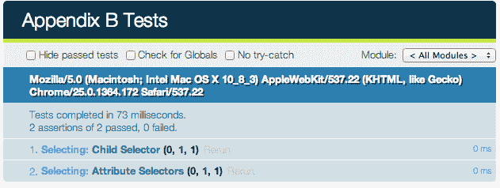
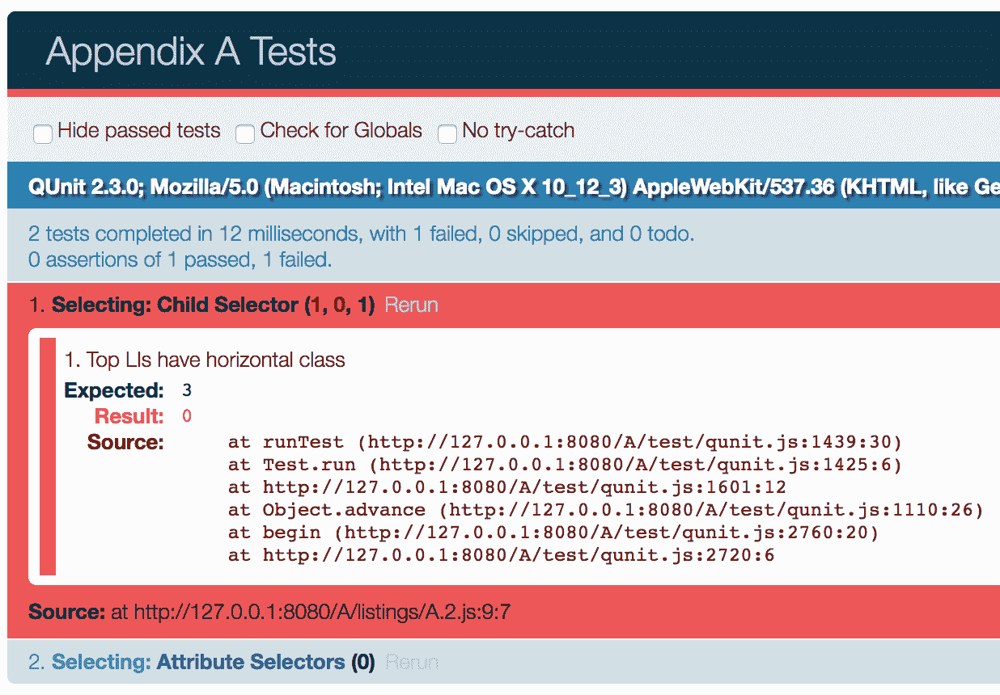
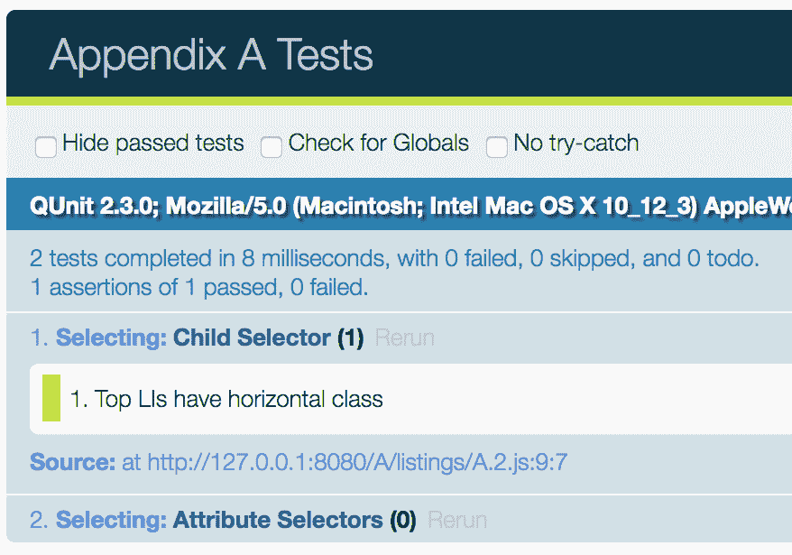
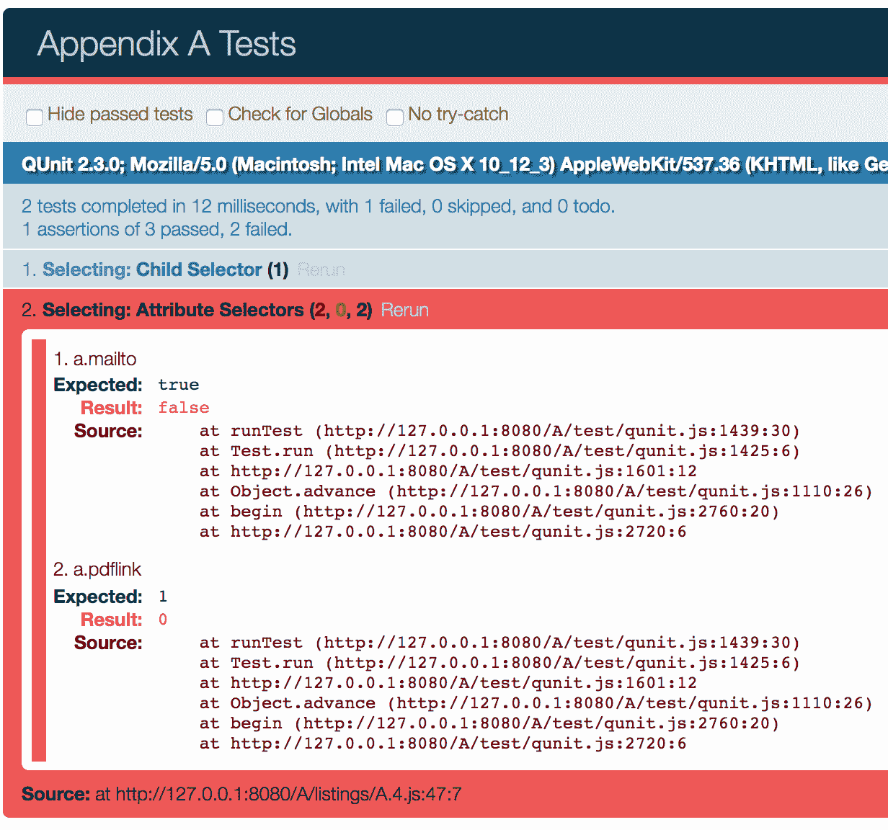
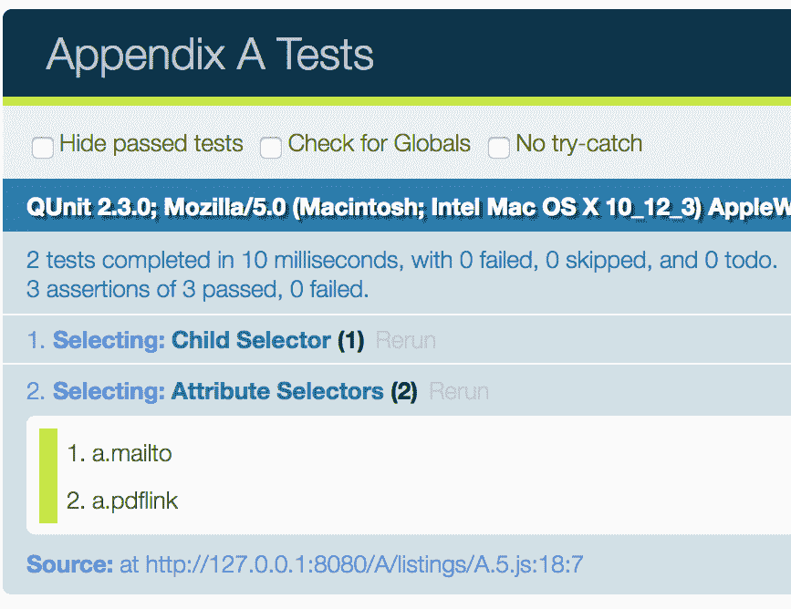

# 附录 A：使用 QUnit 测试 JavaScript

在本书中，我们写了很多 JavaScript 代码，我们已经看到了 jQuery 如何帮助我们相对轻松地编写这些代码的许多方式。然而，每当我们添加新功能时，我们都必须额外的手动检查我们的网页，以确保一切如预期般运作。虽然这个过程对于简单的任务可能有效，但随着项目规模和复杂性的增长，手动测试可能变得相当繁琐。新的要求可能引入*回归错误*，破坏先前良好运作的脚本部分。很容易忽略这些与最新代码更改无关的错误，因为我们自然只测试我们刚刚完成的部分。

我们需要的是一个自动化系统来为我们运行测试。**QUnit** 测试框架就是这样一个系统。虽然有许多其他的测试框架，它们都有各自的好处，但我们推荐在大多数 jQuery 项目中使用 QUnit，因为它是由 jQuery 项目编写和维护的。事实上，jQuery 本身就使用 QUnit。在这个附录中，我们将介绍：

+   如何在项目中设置 QUnit 测试框架

+   单元测试组织以帮助代码覆盖和维护

+   各种 QUnit 可用的测试类型

+   保证测试可靠指示成功代码的常见实践

+   对 QUnit 所提供的以外的其他测试类型的建议

# 下载 QUnit

QUnit 框架可从官方 QUnit 网站[`qunitjs.com/`](http://qunitjs.com/)下载。在那里，我们可以找到到稳定版本的链接（当前为 2.3.0）以及开发版本（qunit-git）。这两个版本都包括一个样式表以及用于格式化测试输出的 JavaScript 文件。

# 设置文档

一旦我们把 QUnit 文件放好，我们就可以设置测试 HTML 文档了。在一个典型的项目中，这个文件通常会命名为 `index.html`，并放在与 `qunit.js` 和 `qunit.css` 相同的测试子文件夹中。然而，为了演示，我们将把它放在父目录中。

文档的 `<head>` 元素包含了一个用于 CSS 文件的 `<link>` 标签和用于 jQuery、QUnit、我们将进行测试的 JavaScript 文件（`A.js`）以及测试本身（`listings/A.*.js`）的 `<script>` 标签。`<body>` 标签包含了两个主要元素用于运行和显示测试结果。

要演示 QUnit，我们将使用第二章，*选择元素*，和第六章，*使用 Ajax 发送数据*中的部分内容：

```js
<!DOCTYPE html> 
<html> 
<head> 
  <meta charset="utf-8"> 
  <title>Appendix A Tests</title> 
  <link rel="stylesheet" href="qunit.css" media="screen"> 
  <script src="img/jquery.js"></script> 
  <script src="img/qunit.js"></script> 
  <script src="img/A.js"></script> 
  <script src="img/test.js"></script> 
</head> 
<body> 
  <div id="qunit"></div> 
  <div id="qunit-fixture"> 
    <!-- Test Markup Goes Here --> 
  </div> 
</body> 
</html> 

```

自第二章，*选择元素*之后，我们要测试的代码取决于 DOM；我们希望测试标记与我们在实际页面上使用的内容匹配。我们可以简单地复制并粘贴我们在第二章中使用的 HTML 内容，这将替换`<!--测试标记在这里-->`注释。

# 组织测试

QUnit 提供两个级别的测试分组，其名称分别根据其各自的函数调用命名：`QUnit.module()`和`QUnit.test()`。**模块**就像一个将运行测试的一般类别；测试实际上是*一组*测试；该函数取一个回调，在其中运行所有该测试的特定**单元测试**。我们将通过章节主题对我们的测试进行分组，并将代码放在我们的`test/test.js`文件中：

```js
QUnit.module('Selecting');

QUnit.test('Child Selector', (assert) => {
  assert.expect(0);
});

QUnit.test('Attribute Selectors', (assert) => {
  assert.expect(0);
});

QUnit.module('Ajax'); 

```

列表 A.1

不需要使用此测试结构设置文件，但心中有一些整体结构是很好的。除了`QUnit.module()`和`QUnit.test()`分组外，我们还需要告诉测试要期望多少断言。由于我们只是在组织，我们需要告诉测试尚未有任何断言（`assert.expect(0)`）以便进行测试。

请注意，我们的模块和测试不需要放在`$(() => {})`调用内，因为 QUnit 默认会等到窗口加载完毕后才开始运行测试。通过这个非常简单的设置，加载测试 HTML 会导致页面看起来像这样：



请注意，模块名称为浅蓝色，测试名称为深蓝色。单击任一将展开该组测试的结果，这些结果在通过该组的所有测试时，默认情况下是折叠的。Ajax 模块尚未出现，因为我们还没有为其编写任何测试。

# 添加和运行测试

在**测试驱动开发**中，我们在编写代码之前编写测试。这样，当测试失败时，我们可以添加新代码，然后看到测试通过，验证我们的更改具有预期效果。

让我们从测试我们在第二章中使用的子选择器开始，*选择元素*，向所有`<ul id="selected-plays">`的子元素`<li>`添加`horizontal`类：

```js
QUnit.test('Child Selector', (assert) => {
  assert.expect(1);
  const topLis = $('#selected-plays > li.horizontal');
  assert.equal(topLis.length, 3, 'Top LIs have horizontal class');
}); 

```

列表 A.2

我们正在测试我们选择页面上元素的能力，因此我们使用断言 `assert.equal()` 测试来比较顶级`<li>`元素的数量是否等于数字`3`。如果两者相等，测试成功，并添加到通过测试的数量中。如果不相等，则测试失败：



当然，测试失败了，因为我们还没有编写代码将`horizontal`类添加到元素中。尽管如此，添加该代码非常简单。我们在页面的主脚本文件中执行，我们将其称为`A.js`：

```js
$(() => { 
  $('#selected-plays > li').addClass('horizontal'); 
}); 

```

列表 A.3

现在运行测试时，测试如预期般通过：



现在选择：子选择器测试显示圆括号中的 1，表示总测试数为一。 现在我们可以进一步测试，通过添加一些属性选择器测试：

```js
QUnit.module('Selecting', { 
  beforeEach() { 
    this.topLis = $('#selected-plays > li.horizontal'); 
  } 
}); 

QUnit.test('Child Selector', function(assert) { 
  assert.expect(1); 
  assert.equal(this.topLis.length, 3,  
    'Top LIs have horizontal class'); 
}); 

QUnit.test('Attribute Selectors', function(assert) { 
  assert.expect(2); 
  assert.ok(this.topLis.find('.mailto').length == 1, 'a.mailto'); 
  assert.equal(this.topLis.find('.pdflink').length, 1, 'a.pdflink'); 
}); 

```

A.4 清单

在这里，我们介绍了另一种类型的测试：`ok()`。 这个函数接受两个参数：一个表达式，如果成功则应评估为 `true`，以及一个描述。 还要注意，我们将本地的 `topLis` 变量从子选择器测试中移到了*清单 A.2*中，并将其放入模块的`beforeEach()`回调函数中。 `QUnit.module()` 函数接受一个可选的第二个参数，这是一个普通对象，可以包含一个 `beforeEach()` 和一个 `afterEach()` 函数。 在这些函数内部，我们可以使用`this`作为模块所有测试的共享上下文。

再次，如果没有相应的工作代码，新测试将失败：



在这里，我们可以看到`assert.ok()`测试和`assert.equal()`测试之间的测试失败输出的差异，`assert.ok()`测试仅显示测试的标签（a.mailto）和源，而`assert.equal()`测试还详细说明了预期的结果（而不总是期望`true`）。 因为它为测试失败提供了更多信息，通常优先使用`assert.equal()`而不是`assert.ok()`。

让我们包含必要的代码：

```js
$(() => { 
  $('#selected-plays > li').addClass('horizontal'); 
  $('a[href^="mailto:"]').addClass('mailto'); 
  $('a[href$=".pdf"]').addClass('pdflink'); 
}); 

```

A.5 清单

现在两个测试通过了，我们可以通过扩展集来看到：



在失败时，`assert.equal()` 提供了比`assert.ok()`更多的信息。 成功时，两个测试只显示标签。

# 异步测试

测试异步代码，如 Ajax 请求，提供了额外的挑战。 其余测试必须在异步测试发生时暂停，然后在完成时重新开始。 这种类型的场景现在非常熟悉； 我们在特效队列、Ajax 回调函数和 promise 对象中看到了这样的异步操作。 QUnit 中的异步测试与常规的 `QUnit.test()` 函数类似，只是它将暂停测试的运行，直到我们使用由 `assert.async()` 函数创建的函数调用恢复它们：

```js
QUnit.test('JSON', (assert) => {
  assert.expect(0);
  const done = assert.async();

  $.getJSON('A.json', (json, textStatus) => {
    // add tests here
  }).always(done);
});

```

A.6 清单

这里我们只是从`a.json`请求 JSON，并且在请求完成后允许测试继续，无论成功与否，都会在`.always()`回调函数内调用`done()`。 对于实际的测试，我们将检查`textStatus`值以确保请求成功，并检查响应 JSON 数组中一个对象的值：

```js
QUnit.test('JSON', (assert) => {
  const backbite = {
    term: 'BACKBITE',
    part: 'v.t.',
    definition: 'To speak of a man as you find him when he can't find you.'
  };

  assert.expect(2);
  const done = assert.async();

  $.getJSON('A.json', (json, textStatus) => {
    assert.equal(textStatus, 'success', 'Request successful');
    assert.deepEqual(
      json[1],
      backbite,
      'result array matches "backbite" map'
    );
  }).always(done);
}); 

```

A.7 清单

为了测试响应值，我们使用另一个测试函数：`assert.deepEqual()`。通常当比较两个对象时，除非它们实际上指向内存中的相同位置，否则它们被认为不相等。如果我们想要比较对象的内容，应使用 `assert.deepEqual()`。这个函数会遍历两个对象，确保它们具有相同的属性，并且这些属性具有相同的值。

# 其他类型的测试

QUnit 还配备了其他一些测试函数。其中有些函数，比如`notEqual()`和`notDeepEqual()`，只是我们使用的函数的反义，而另一些函数，比如`strictEqual()`和`throws()`，具有更明显的用途。有关这些函数的更多信息，以及有关 QUnit 的概述和其他示例的详细信息，可以在 QUnit 网站([`qunitjs.com/`](http://qunitjs.com/))以及 QUnit API 网站([`api.qunitjs.com/`](http://api.qunitjs.com/))上找到。

# 实际考虑

本附录中的示例必须是简单的。在实践中，我们可以编写确保相当复杂行为的正确操作的测试。

理想情况下，我们尽量使我们的测试尽可能简洁和简单，即使它们测试的行为很复杂。通过为一些特定的场景编写测试，我们可以相当确定地确保我们完全测试了行为，即使我们并没有针对每一种可能的输入情况编写测试。

然而，即使我们已经为其编写了测试，可能会在我们的代码中观察到一个错误。当测试通过但出现错误时，正确的响应不是立即修复问题，而是首先为失败的行为编写一个新的测试。这样，我们不仅可以在纠正代码时验证问题是否解决，还可以引入额外的测试，帮助我们避免将来出现回归问题。

QUnit 除了**单元测试**之外，还可以用于**功能测试**。单元测试旨在确认代码单元（方法和函数）的正确运行，而功能测试则旨在确保用户输入的适当接口响应。例如，在第十二章中的*高级 DOM 操作*中，我们实现了表格排序行为。我们可以为排序方法编写一个单元测试，验证一旦调用方法表格就排序了。另外，功能测试可以模拟用户点击表头，然后观察结果以检查表格是否确实已排序。

与 QUnit 配合使用的功能测试框架，例如 dominator.js ([`mwbrooks.github.io/dominator.js/`](http://mwbrooks.github.io/dominator.js/)) 和 FuncUnit ([`funcunit.com/`](http://funcunit.com/))，可以帮助更轻松地编写功能测试和模拟事件。为了在各种浏览器中进一步自动化测试，可以将 **Selenium** ([`seleniumhq.org/`](http://seleniumhq.org/)) 套件与这些框架一起使用。

为了确保我们的测试结果一致，我们需要使用可靠且不变的样本数据进行工作。当测试应用于动态站点的 jQuery 代码时，捕获和存储页面的静态版本以运行测试可能是有益的。这种方法还可以隔离您的代码组件，使得更容易确定错误是由服务器端代码还是浏览器端代码引起的。

# 进一步阅读

这些考虑肯定不是一个详尽的列表。测试驱动开发是一个深入的话题，一个简短的附录是不足以完全涵盖的。一些在线资源包含有关该主题的更多信息，包括：

+   单元测试介绍 ([`qunitjs.com/intro/`](http://qunitjs.com/intro/))。

+   *QUnit Cookbook* ([`qunitjs.com/cookbook/`](http://qunitjs.com/cookbook/))。

+   Elijah Manor 撰写的 *jQuery 测试驱动开发* 文章 ([`msdn.microsoft.com/en-us/scriptjunkie/ff452703.aspx`](http://msdn.microsoft.com/en-us/scriptjunkie/ff452703.aspx))。

+   *单元测试最佳实践* 文章由 Bob McCune ([`www.bobmccune.com/2006/12/09/unit-testing-best-practices/`](http://www.bobmccune.com/2006/12/09/unit-testing-best-practices/)) 撰写。

这个主题也有很多书籍，比如：

+   *以示例驱动的测试*, *Kent Beck*。

+   *Addison Wesley Signature Series*

+   *Test-Driven JavaScript Development*, *Christian Johansen*, *Addison Wesley*。

# 摘要

使用 QUnit 进行测试可以有效地帮助我们保持 jQuery 代码的清洁和可维护性。我们已经看到了一些在项目中实现测试以确保我们的代码按照我们意图的方式运行的方法。通过测试代码的小、独立单元，我们可以减轻项目变得更复杂时出现的一些问题。同时，我们可以更有效地在整个项目中测试回归，节省宝贵的编程时间。
