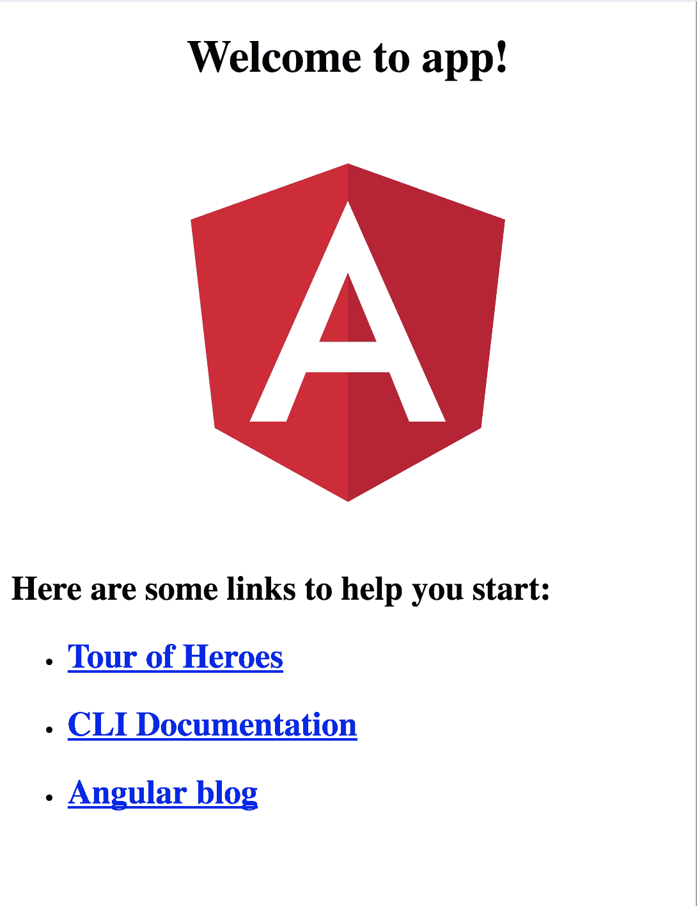

# 第一章：在 Angular 中创建我们的第一个组件

在进行 Angular 开发时，有一些事情是好知道的，还有一些事情是我们需要知道的，以便开始我们伟大的旅程。其中一件好知道的事情是**语义化版本控制**。这是好知道的，因为这是 Angular 团队选择处理更改的方式。当您前往[`angular.io/`](https://angular.io/)或 Stack Overflow 等网站搜索解决方案时，这将有望使您更容易找到未来应用程序开发挑战的正确解决方案。

另一个重要但有时令人痛苦的话题是项目设置。这是一个必要的恶，需要在项目开始时完成，但在早期正确处理这个问题可以减少随着应用程序的增长而产生的许多摩擦。因此，本章的很大一部分致力于揭开谜团，并使您作为开发人员能够避免未来的挫折和偏头痛。

在本章结束时，我们还将能够创建我们的第一个应用程序，并了解 Angular 应用程序的结构。总之，以下是本章将探讨的主要主题。

在这一章中，我们将：

+   了解语义化版本控制的重要性，以及 Angular 对其的看法

+   了解我们如何使用 Angular CLI 设置项目

+   创建我们的第一个应用程序，并开始了解 Angular 中的核心概念

# 这只是 Angular-介绍语义化版本控制

使用语义化版本控制是关于管理期望。这是关于管理您的应用程序或库的用户在发生更改时会做出何种反应。更改会因各种原因而发生，无论是修复代码中的错误还是添加/更改/删除功能。框架或库的作者用来传达某个更改的影响的方式是通过增加软件的版本号。

一个可供生产使用的软件通常具有版本 1.0 或 1.0.0（如果您想更具体）。

在更新软件时可能会发生三种不同级别的更改。要么您对其进行修补并有效地纠正某些问题。要么您进行次要更改，这基本上意味着您添加功能。或者最后您进行主要更改，这可能会完全改变软件的工作方式。让我们在接下来的章节中更详细地描述这些变化。

# 版本更改

补丁变更意味着我们将最右边的数字增加一。将软件从 1.0.0 更改为 1.0.1 是一个小改变，通常是一个错误修复。作为软件的用户，你不需要担心；如果有什么变化，你应该高兴地发现某些东西突然工作得更好了。关键是，你可以放心地开始使用 1.0.1。

# 小改变

这意味着软件从 1.0.0 增加到 1.1.0。当我们增加中间数字时，我们正在处理更严重的变化。当软件功能被添加时，这个数字应该增加，而且它仍然应该向后兼容。在这种情况下，采用 1.1.0 版本的软件也是安全的。

# 主要变更

在这个阶段，版本号从 1.0.0 增加到 2.0.0。现在你需要留意了。在这个阶段，事情可能已经发生了很大的变化，构造可能已经被重命名或删除。它可能不兼容早期版本。我说“可能”是因为很多软件作者仍然确保有相当的向后兼容性，但这里的主要观点是没有保证，没有合同，保证它仍然可以工作。

# 那 Angular 呢？

Angular 的第一个版本大多数人都称为 Angular 1；后来它被称为 AngularJS。它没有使用语义化版本。大多数人实际上仍然将其称为 Angular 1。

然后 Angular 出现了，在 2016 年它达到了生产就绪状态。Angular 决定采用语义化版本，这在开发者社区引起了一些混乱，特别是当宣布将会有 Angular 4 和 5 等版本时。谷歌以及谷歌开发者专家开始向人们解释，他们希望人们称最新版本的框架为 Angular - 只是 Angular。你可以对这个决定的智慧进行争论，但事实仍然是，新的 Angular 正在使用语义化版本。这意味着 Angular 与 Angular 4 以及 Angular 11 等版本是相同的平台，如果有的话。采用语义化版本意味着作为 Angular 用户，你可以依赖事物一直以相同的方式工作，直到谷歌决定增加主要版本。即使在那时，你可以选择是保持在最新的主要版本上，还是想要升级你现有的应用程序。

# 一个全新的开始

如前所述，Angular 是 AngularJS 框架的全面重写，引入了全新的应用程序架构，完全使用 TypeScript 从头开始构建，TypeScript 是 JavaScript 的严格超集，它增加了可选的静态类型和对接口和装饰器的支持。

简而言之，Angular 应用程序基于一种架构设计，由 Web 组件树组成，它们通过各自特定的 I/O 接口相互连接。每个组件在底层利用了完全改进的依赖注入机制。

公平地说，这是对 Angular 真正含义的简单描述。然而，即使是 Angular 中最简单的项目也符合这些定义特征。在接下来的章节中，我们将专注于学习如何构建可互操作的组件和管理依赖注入，然后再转向路由、Web 表单和 HTTP 通信。这也解释了为什么我们在本书中不会明确提及 AngularJS。显然，浪费时间和页面提及对主题没有任何有用见解的东西是没有意义的，而且我们假设你可能不了解 Angular 1.x，因此这种知识在这里没有任何价值。

# Web 组件

Web 组件是一个概念，它包括四种技术，旨在一起使用以构建具有更高视觉表现力和可重用性的功能元素，从而实现更模块化、一致和可维护的 Web。这四种技术如下：

+   **模板**：这些是用于构造我们的内容的 HTML 片段

渲染

+   **自定义元素**：这些模板不仅包含传统的 HTML 元素，还包括提供更多呈现元素或 API 功能的自定义包装项

+   **影子 DOM**：这提供了一个沙盒，用于封装每个自定义元素的 CSS 布局规则和 JavaScript 行为

+   **HTML 导入**：HTML 不再仅限于承载 HTML 元素，还可以承载其他 HTML 文档

从理论上讲，Angular 组件确实是一个包含模板的自定义元素，用于承载其布局的 HTML 结构，后者由一个封装在影子 DOM 容器中的作用域 CSS 样式表控制。让我们用简单的英语来重新表达一下。想象一下 HTML5 中的 range 输入控件类型。这是一种方便的方式，可以为用户提供一个方便的输入控件，用于输入两个预定义边界之间的值。如果您以前没有使用过它，请在空白的 HTML 模板中插入以下标记，并在浏览器中加载它：

```ts
<input id="mySlider" type="range" min="0" max="100" step="10">
```

在浏览器中，您将看到一个漂亮的输入控件，其中包含一个水平滑块。使用浏览器开发者工具检查这样的控件将揭示一组隐藏的 HTML 标记，这些标记在您编辑 HTML 模板时并不存在。这就是影子 DOM 在起作用，具有由其自己封装的 CSS 控制的实际 HTML 模板，具有高级的拖动功能。您可能会同意，自己做这件事将是很酷的。好消息是，Angular 为您提供了交付这个功能所需的工具集，因此我们可以构建我们自己的自定义元素（输入控件、个性化标记和自包含小部件），其中包含我们选择的内部 HTML 标记和我们自己的样式表，不会受到页面托管我们组件的 CSS 的影响。

# 为什么选择 TypeScript 而不是其他语法？

Angular 应用程序可以使用多种语言和语法进行编码：ECMAScript 5、Dart、ECMAScript 6、TypeScript 或 ECMAScript 7。

TypeScript 是 ECMAScript 6（也称为 ECMAScript 2015）的类型超集，可以编译成普通的 JavaScript，并得到现代操作系统的广泛支持。它具有健全的面向对象设计，支持注解、装饰器和类型检查。

我们选择（并显然推荐）TypeScript 作为本书中指导如何开发 Angular 应用程序的首选语法的原因是 Angular 本身就是用这种语言编写的。精通 TypeScript 将使开发人员在理解框架的内部机制时具有巨大优势。

另一方面，值得注意的是，当涉及管理依赖注入和组件之间的类型绑定时，TypeScript 对注解和类型内省的支持变得至关重要，因为它可以以最小的代码占用量实现，我们将在本书的后面看到。

最终，如果这是您的偏好，您可以使用纯 ECMAScript 6 语法执行您的 Angular 项目。甚至本书提供的示例也可以通过删除类型注解和接口，或者用最冗长的 ES6 方式替换 TypeScript 中处理依赖注入的方式，轻松地转换为 ES6。

为了简洁起见，我们只会涵盖使用 TypeScript 编写的示例，并实际推荐其使用，因为由于类型注解，它具有更高的表达能力，并且通过基于类型内省的依赖注入的整洁方式。

# 使用 Angular CLI 设置我们的工作空间

有不同的方法可以开始，可以使用[`angular.io/`](https://angular.io/)网站上的 Angular 快速入门存储库，或安装脚手架工具 Angular CLI，或者最后，您可以使用 Webpack 来设置您的项目。值得指出的是，创建新的 Angular 项目的标准方式是使用*Angular CLI*并搭建您的项目。快速入门存储库使用的 Systemjs 曾经是构建 Angular 项目的默认方式。它现在正在迅速减少，但仍然是设置 Angular 项目的有效方式。因此，建议感兴趣的读者查看附录 A，*SystemJS*以获取更多信息。

如今，设置前端项目比以往任何时候都更加繁琐。我们过去只需在我们的 JavaScript 代码中包含必要的脚本，以及用于我们的 CSS 的`link`标签和用于我们的资产的`img`标签等。生活过去很简单。然后前端开发变得更加雄心勃勃，我们开始将我们的代码拆分成模块，我们开始使用预处理器来处理我们的代码和 CSS。总的来说，我们的项目变得更加复杂，我们开始依赖构建系统，如 Grunt、Gulp、Webpack 等。大多数开发人员并不是配置的铁杆粉丝，他们只想专注于构建应用程序。然而，现代浏览器更多地支持最新的 ECMAScript 标准，一些浏览器甚至开始支持在运行时解析的模块。尽管如此，这远非得到广泛支持。与此同时，我们仍然必须依赖工具进行捆绑和模块支持。

使用领先的框架（如 React 或 Angular）设置项目可能会非常困难。您需要知道要导入哪些库，并确保文件按正确的顺序处理，这将引入我们的脚手架工具主题。对于 AngularJS，使用 Yeoman 快速搭建新应用程序并预先配置许多好东西是非常流行的。React 有一个名为*create-react-app*的脚手架工具，您可能已经保存了它，它为 React 开发人员节省了无数小时。随着复杂性的增加，脚手架工具几乎成为必需品，但也是每个小时都用于产生业务价值而不是解决配置问题的地方。

创建 Angular CLI 工具的主要动机是帮助开发人员专注于应用程序构建，而不是太多地关注配置。基本上，通过一个简单的命令，您应该能够快速搭建一个应用程序，向其添加新构造，运行测试，或创建一个生产级捆绑包。Angular CLI 支持所有这些。

# 先决条件

您需要开始的是安装 Git 和 Node.js。Node.js 还将安装一个称为 NPM 的东西，这是一个您以后将用来安装项目所需文件的节点包管理器。完成后，您就可以设置您的 Angular 应用程序了。您可以在[`nodejs.org`](https://nodejs.org)找到 Node.js 的安装文件。

安装它的最简单方法是访问该网站：

```ts
https://nodejs.org/en/download/
```

安装 Node.js 也将安装一个称为 NPM 的东西，即 Node 包管理器，您将需要它来安装依赖项等。Angular CLI 需要 Node 6.9.0 和 NPM 3 或更高版本。目前在该网站上，您可以选择长期支持版本和当前版本。长期支持版本应该足够了。

# 安装

安装 Angular CLI 就像在您的终端中运行以下命令一样简单：

```ts
npm install -g @angular/cli
```

在某些系统上，您可能需要提升权限才能这样做；在这种情况下，以管理员身份运行您的终端窗口，在 Linux/macOS 上运行以下命令：

```ts
sudo npm install -g @angular/cli
```

# 第一个应用

一旦安装了 Angular CLI，就到了创建第一个项目的时候。为此，请进入您选择的目录并输入以下内容：

```ts
ng new <give it a name here>
```

输入以下内容：

```ts
ng new TodoApp
```

这将创建一个名为`TodoApp`的目录。在运行了上述命令之后，您需要做两件事才能在浏览器中看到您的应用程序：

+   导航到刚创建的目录

+   提供应用程序

这将通过以下命令完成：

```ts
cd TodoApp
npm start
```

此时，在`http://localhost:4200`上打开你的浏览器，你应该会看到以下内容：



# 测试

Angular CLI 不仅提供使您的应用程序工作的代码，还提供设置测试和包含测试的代码。运行所说的测试就像在终端中输入以下内容一样简单：

```ts
npm test
```

你应该会看到以下内容：


为什么这样会起作用？让我们看一下刚刚创建的`package.json`文件和`scripts`标签。这里指定的所有内容都可以使用以下语法运行：

```ts
npm run <key>
```

在某些情况下，不需要输入`run`，只需输入以下内容即可：

```ts
npm <key>
```

这适用于`start`和`test`命令。

以下清单清楚地表明，可以运行的命令不仅仅是我们刚刚学到的`start`和`test`：

```ts
"scripts": {
 "ng": "ng",
 "start": "ng serve",
 "build": "ng build",
 "test": "ng test",
 "lint": "ng lint",
 "e2e": "ng e2e"
}
```

到目前为止，我们已经学会了如何安装 Angular CLI。使用 Angular CLI，我们已经学会了：

1.  搭建一个新项目。

1.  启动项目，看看它在浏览器中显示出来。

1.  运行测试。

这是相当了不起的成就。我们将在后面的章节中重新讨论 Angular CLI，因为它是一个非常有能力的工具，能够做更多的事情。

# 你好，Angular

我们即将迈出建立我们的第一个组件的第一步。Angular CLI 已经为我们搭建了项目，并且已经完成了大量的繁重工作。我们所需要做的就是创建一个新文件，并开始填充它的内容。百万美元的问题是要输入什么？

所以让我们开始构建我们的第一个组件。创建一个组件需要三个步骤。那就是：

1.  导入组件装饰器构造。

1.  用组件装饰器装饰一个类。

1.  将组件添加到它的模块中（这可能在两个不同的地方）。

# 创建组件

首先，让我们导入组件装饰器：

```ts
import { Component } from '@angular/core';
```

然后为你的组件创建类：

```ts
class AppComponent {
 title:string = 'hello app';
}
```

然后使用`Component`装饰器装饰你的类：

```ts
@Component({
 selector: 'app',
 template: `<h1>{{ title }}</h1>`
})
export class AppComponent { 
 title: string = 'hello app';
}
```

我们给`Component`装饰器，也就是函数，传入一个对象字面量作为输入参数。这个对象字面量目前包括`selector`和`template`键，所以让我们解释一下它们是什么。

# 选择器

`selector`是在模板中引用时应该使用的名称。我们称之为`app`，我们会这样引用它：

```ts
<app></app>
```

# 模板/templateUrl

`template`或`templateUrl`是您的视图。在这里，您可以编写 HTML 标记。在我们的对象字面量中使用`template`关键字意味着我们可以在与组件类相同的文件中定义 HTML 标记。如果我们使用`templateUrl`，那么我们将在一个单独的文件中放置我们的 HTML 标记。

上面的示例还列出了标记中的双大括号：

```ts
<h1>{{ title }}</h1>
```

这将被视为插值，表达式将被替换为`AppComponent`的`title`字段的值。因此，渲染时，组件将如下所示：

```ts
hello app
```

# 告诉模块

现在我们需要引入一个全新的概念，一个 Angular 模块。在 Angular 中创建的所有类型的构造都应该在模块中注册。Angular 模块充当对外界的门面，它只是一个由`@NgModule`装饰的类。就像`@Component`装饰器一样，`@NgModule`装饰器以对象字面量作为输入参数。为了将我们的组件注册到 Angular 模块中，我们需要给对象字面量添加`declarations`属性。`declarations`属性是一个数组类型，通过将我们的组件添加到该数组中，我们就将其注册到了 Angular 模块。

以下代码显示了创建一个 Angular 模块以及将组件注册到其中的过程，通过将其添加到`declarations`关键字数组中：

```ts
import { AppComponent } from './app.component';

@NgModule({ 
  declarations: [AppComponent] 
})
export class AppModule {}
```

此时，我们的 Angular 模块已经知道了这个组件。我们需要在我们的模块中添加一个属性`bootstrap`。`bootstrap`关键字表示这里放置的任何内容都作为整个应用程序的入口组件。因为目前我们只有一个组件，所以将我们的组件注册到这个`bootstrap`关键字是有意义的：

```ts
@NgModule({
 declarations: [AppComponent],
  bootstrap: [AppComponent]
})
export class AppModule {}
```

确实可以有多个入口组件，但通常情况下只有一个。

然而，对于任何未来的组件，我们只需要将它们添加到`declarations`属性中，以确保模块知道它们。

到目前为止，我们已经创建了一个组件和一个 Angular 模块，并将组件注册到了该模块。但我们还没有一个可工作的应用程序，因为我们还需要采取一步。我们需要设置引导。

# 设置一个引导文件

`main.ts`文件是您的引导文件，它应该具有以下内容：

```ts
import { platformBrowserDynamic } from '@angular/platform-browser-dynamic';
import { AppModule } from './app/app.module';

platformBrowserDynamic().bootstrapModule(AppModule);
```

在前面的代码片段中，我们所做的是将最近创建的模块作为输入参数传递给方法调用`bootstrapModule()`。这将有效地使该模块成为应用程序的入口模块。这就是我们创建一个工作应用程序所需的全部。让我们总结一下我们所采取的步骤：

1.  创建一个组件。

1.  创建一个模块，并在其声明属性中注册我们创建的组件。

1.  还要在模块的 bootstrap 属性中注册我们的组件，以使其成为应用程序的入口点。我们将来创建的其他组件只需要添加到`declarations`属性中即可。

1.  通过将所创建的模块作为输入参数传递给`bootstrapModule()`方法来引导我们创建的模块。

到目前为止，作为读者的你已经不得不吞下大量的信息，并相信我们的话。别担心，你将有机会在本章以及接下来的章节中更加熟悉组件和 Angular 模块。目前，重点只是让你快速上手，通过提供 Angular CLI 这个强大的工具，向你展示实际上只需要几个步骤就可以将应用程序渲染到屏幕上。

# 深入了解 Angular 组件

我们已经走了很长的路，从第一次接触 TypeScript 到学习如何编写 Angular 组件的基本脚本结构。然而，在跳入更抽象的主题之前，让我们尝试构建另一个组件，这样我们就真正掌握了创建组件的工作原理。

# 组件方法和数据更新

在相同的文件夹中创建一个新的`timer.component.ts`文件，并用以下非常简单的组件基本实现填充它。不要担心增加的复杂性，因为我们将在代码块之后审查每一次更改：

```ts
import { Component } from '@angular/core';

@Component({
 selector: 'timer',
 template: `<h1>{{ minutes }}:{{ seconds }} </h1>>`
})
export class TimerComponent {
 minutes: number;
 seconds: number;

 constructor(){
 this.minutes = 24;
 this.seconds = 59;
 }
}
```

到目前为止，我们通过创建`TimerComponent`类并用`@Component`装饰它，创建了一个全新的组件，就像我们在之前的部分学到的那样。我们在之前的部分学到，还有更多要做的，即告诉 Angular 模块这个新组件存在。Angular 模块已经创建好了，所以你只需要将我们的新组件添加到它的`declarations`属性中，就像这样：

```ts
@NgModule({
 declarations: [
 AppComponent, TimerComponent
 ],
 bootstrap: [AppComponent]
})
```

只要我们只有`AppComponent`，我们并没有真正看到拥有一个 Angular 模块的意义。有了两个组件在我们的模块中注册，这一点就改变了。当一个组件与 Angular 模块注册时，它就可以被模块中的其他构造使用。它可以被它们的`template/templateUrl`使用。这意味着我们可以在`AppComponent`中渲染`TimerComponent`。

因此，让我们回到我们的`AppComponent`文件，并更新其模板以显示这一点：

```ts
@Component({
 selector: 'app',
 template: `<h1>{{ title }}</h1> <timer></timer>`
})
export class AppComponent { 
 title: string = 'hello app';
}
```

在前面的代码中，我们用粗体突出显示了如何将`TimerComponent`添加到`AppComponents`模板中。或者我们通过其`selector`属性名称`timer`来引用`TimerComponent`。

让我们再次展示`TimerComponent`，并且突出显示`selector`属性，因为这是一个非常重要的事情要理解；也就是说，如何将一个组件放置在另一个组件中：

```ts
import { Component } from '@angular/core';

@Component({
  selector: 'timer',
 template: `<h1>{{ minutes }}:{{ seconds }} </h1>>`
})
export class TimerComponent {
 minutes: number;
 seconds: number;

 constructor(){
 this.minutes = 24;
 this.seconds = 59;
 }
}
```

我们想要做的不仅仅是显示一些数字，对吧？我们实际上希望它们代表一个倒计时，我们可以通过引入这些更改来实现这一点。让我们首先引入一个我们可以迭代的函数，以便更新倒计时。在构造函数之后添加这个函数：

```ts
tick() {
 if(--this.seconds < 0) {
 this.seconds = 59;
 if(--this.minutes < 0) {
 this.minutes = 24;
 this.seconds = 59;
 }
 }
}
```

Angular 中的选择器是区分大小写的。正如我们将在本书的后面看到的那样，组件是指令的一个子集，可以支持各种选择器。在创建组件时，我们应该通过强制使用破折号命名约定在`selector`属性中设置一个自定义标签名称。在视图中呈现该标记时，我们应该始终将标记关闭为非 void 元素。因此，`<custom-element></custom-element>`是正确的，而`<custom-element />`将触发异常。最后但同样重要的是，某些常见的驼峰命名可能会与 Angular 实现发生冲突，因此应避免使用它们。

# 从静态到实际数据

正如你在这里看到的，TypeScript 中的函数需要用它们返回的值的类型进行注释，或者如果没有值，则只需使用 void。我们的函数评估了分钟和秒钟的当前值，然后要么减少它们的值，要么将其重置为初始值。然后通过从类构造函数触发时间间隔来每秒调用此函数：

```ts
constructor() {
 this.minutes = 24;
 this.seconds = 59;
 setInterval(() => this.tick(), 1000);
}
```

在这里，我们在我们的代码中第一次发现了箭头函数（也称为 lambda 函数，fat arrow 等），这是 ECMAScript 6 带来的新的函数语法，我们将在第三章中更详细地介绍它，*介绍 TypeScript*。`tick`函数也被标记为私有，因此它不能在`PomodoroTimerComponent`对象实例之外被检查或执行。

到目前为止一切顺利！我们有一个工作中的番茄工作计时器，从 25 分钟倒数到 0，然后重新开始。问题是我们在这里和那里复制了代码。因此，让我们稍微重构一下，以防止代码重复：

```ts
constructor() {
 this.reset();
 setInterval(() => this.tick(), 1000);
}

reset() {
 this.minutes = 24;
 this.seconds = 59;
}

private tick() {
 if(--this.seconds < 0) {
 this.seconds = 59;
 if(--this.minutes < 0) {
 this.reset();
 }
 }
}
```

我们已经将分钟和秒的初始化（和重置）包装在我们的`resetPomodoro`函数中，该函数在实例化组件或倒计时结束时被调用。不过等一下！根据番茄工作法，番茄工作者可以在番茄工作时间之间休息，甚至在意外情况发生时暂停。我们需要提供某种交互性，以便用户可以启动、暂停和恢复当前的番茄工作计时器。

# 向组件添加交互性

Angular 通过声明式接口提供了一流的事件支持。这意味着很容易连接事件并将其指向方法。将数据绑定到不同的 HTML 属性也很容易，你即将学到。

首先修改我们的模板定义：

```ts
@Component({
 selector: 'timer',
 template: `
 <h1>{{ minutes }}: {{ seconds }} </h1>
 <p>
 <button (click)="togglePause()"> {{ buttonLabel }}</button>
 </p>
 `
})
```

我们使用了多行文本字符串！ECMAScript 6 引入了这个概念。

模板字符串，它是支持嵌入表达式、插入文本绑定和多行内容的字符串文字。我们将在第三章中更详细地了解它们，*介绍 TypeScript*。

与此同时，只需专注于我们引入了一个新的 HTML 块，其中包含一个带有事件处理程序的按钮，该处理程序监听点击事件并在点击时执行`togglePause()`方法。这个`(click)`属性可能是你以前没有见过的，尽管它完全符合 W3C 标准。再次强调，我们将在第四章中更详细地介绍这个内容，*在我们的组件中实现属性和事件*。让我们专注于`togglePause()`方法和新的`buttonLabel`绑定。首先，让我们修改我们的类属性，使其看起来像这样：

```ts
export class TimerComponent {
 minutes: number;
 seconds: number;
 isPaused: boolean;
 buttonLabel: string;
 // rest of the code will remain as it is below this point
}
```

我们引入了两个新字段。第一个是`buttonLabel`，其中包含稍后将显示在我们新创建的按钮上的文本。`isPaused`是一个新创建的变量，将根据计时器的状态而假设一个`true`/`false`值。因此，我们可能需要一个地方来切换这个字段的值。让我们创建我们之前提到的`togglePause()`方法：

```ts
togglePause() {
 this.isPaused = !this.isPaused;
 // if countdown has started
 if(this.minutes < 24 || this.seconds < 59) {
 this.buttonLabel = this.isPaused ? 'Resume' : 'Pause';
 }
}
```

简而言之，`togglePause()`方法只是将`isPaused`的值切换到相反的状态，然后根据这样一个新值以及计时器是否已启动（这将意味着任何时间变量的值低于初始化值）或者没有，我们为按钮分配不同的标签。

现在，我们需要初始化这些值，似乎没有比这更好的地方。因此，`reset()`函数是初始化影响我们类状态的变量的地方：

```ts
reset() {
 this.minutes = 24;
 this.seconds = 59;
 this.buttonLabel = 'Start';
 this.togglePause();
}
```

每次执行`togglePause()`时，我们都会重置它，以确保每当它达到需要重置的状态时，倒计时行为将切换到先前的相反状态。控制倒计时的控制器方法中只剩下一个调整：

```ts
private tick() {
 if(!this.isPaused) {
 this.buttonLabel = 'Pause';
 if(--this.seconds < 0) {
 this.seconds = 59;
 if(--this.minutes < 0) {
 this.reset();
 }
 }
 }
}
```

显然，当计时器应该暂停时，我们不希望倒计时继续，因此我们将整个脚本包装在一个条件中。除此之外，当倒计时没有暂停时，我们将希望在按钮上显示不同的文本，并且当倒计时达到结束时再次显示；停止然后重置 Pomodoro 到其初始值将是预期的行为。这加强了在`resetPomodoro`中调用`togglePause`函数的必要性。

# 改进数据输出

到目前为止，我们已经重新加载了浏览器，并尝试了新创建的切换功能。然而，显然还有一些需要一些润色的地方：当秒表显示的秒数小于 10 时，它显示的是一个单个数字，而不是我们在数字时钟和手表中习惯看到的两位数。幸运的是，Angular 实现了一组声明性辅助工具，可以格式化我们模板中的数据输出。我们称它们为管道，我们将在第四章中详细介绍它们，*在我们的组件中实现属性和事件*。目前，让我们在我们的组件模板中引入数字管道，并将其配置为始终显示两位数的秒数输出。更新我们的模板，使其看起来像这样：

```ts
@Component({
 selector: 'timer',
 template: `
 <h1>{{ minutes }}: {{ seconds | number: '2.0' }}</h1>
 <p>
 <button (click)="togglePause()">{{ buttonLabel }}</button>
 </p>
 `
})
```

基本上，我们在模板中的插值绑定后面加上了管道名称，用管道（`|`）符号分隔，因此得名。重新加载模板，您将看到秒数始终显示两位数，而不管它所代表的值如何。

我们已经创建了一个完全功能的番茄工作法定时器小部件，我们可以重复使用或嵌入到更复杂的应用程序中。第六章，*使用 Angular 组件构建应用程序*，将指导我们在更大的组件树的上下文中嵌入和嵌套我们的组件的过程。

与此同时，让我们添加一些 UI 美化，使我们的组件更具吸引力。我们已经在按钮标签中引入了一个 class 属性，以期待在项目中实现 Bootstrap CSS 框架。让我们导入通过 npm 安装项目依赖时下载的实际样式表。打开`timer.html`，并在`<head>`元素的末尾添加以下片段：

```ts
<link href="http://maxcdn.bootstrapcdn.com/bootstrap/3.3.6/CSS/bootstrap.min.CSS" rel="stylesheet" integrity="sha384-1q8mTJOASx8j1Au+a5WDVnPi2lkFfwwEAa8hDDdjZlpLegxhjVME1fgjWPGmkzs7" crossorigin="anonymous">
```

现在，让我们通过在我们的组件之前插入一个漂亮的页面标题来美化我们的 UI：

```ts
<body>
 <nav class="navbar navbar-default navbar-static-top">
 <div class="container">
 <div class="navbar-header">
 <strong class="navbar-brand">My Timer</strong>
 </div>
 </div>
 </nav>
</body>
```

调整组件按钮的 Bootstrap 按钮类将赋予它更多个性，将整个模板包裹在一个居中容器中将确实增强 UI。所以让我们更新我们的模板，使其看起来像这样：

```ts
<div class="text-center">
 
 <h1> {{ minutes }}:{{ seconds | number:'2.0' }}</h1>
 <p>
 <button class="btn btn-danger" (click)="togglePause()">{{ buttonLabel }}</button>
 </p>
</div>
```

# 总结

根据现代网络标准，我们研究了 Web 组件以及 Angular 组件如何提供简单直接的 API 来构建我们自己的组件。我们介绍了 TypeScript 及其语法的一些基本特性，作为第三章《介绍 TypeScript》的准备工作。我们看到了如何设置我们的工作空间，以及在哪里找到我们需要的依赖项，将 TypeScript 引入项目并在项目中使用 Angular 库，了解了每个依赖项在我们应用程序中的作用。

我们的第一个组件教会了我们创建组件的基础知识，也让我们更加熟悉另一个重要概念，Angular 模块，以及如何引导应用程序。我们的第二个组件让我们有机会讨论控制器类的形式，其中包含属性字段、构造函数和实用函数，以及为什么元数据注解在 Angular 应用程序的上下文中如此重要，以定义我们的组件将如何在其所在的 HTML 环境中集成。我们的第一个 Web 组件具有自己的模板，这些模板以变量插值的形式声明性地托管属性绑定，通过管道方便地格式化。绑定事件监听器现在比以往任何时候都更容易，其语法符合标准。

下一章将详细介绍我们需要了解的所有 TypeScript 特性，以便迅速掌握 Angular。
