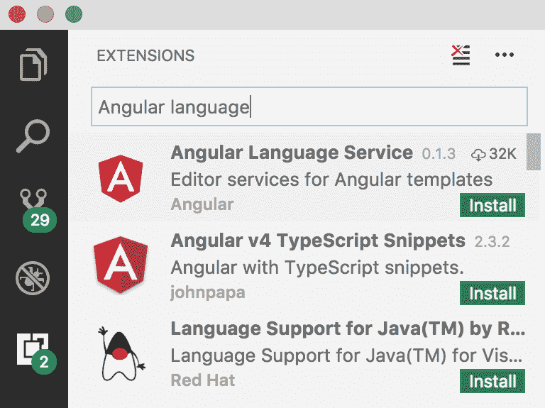
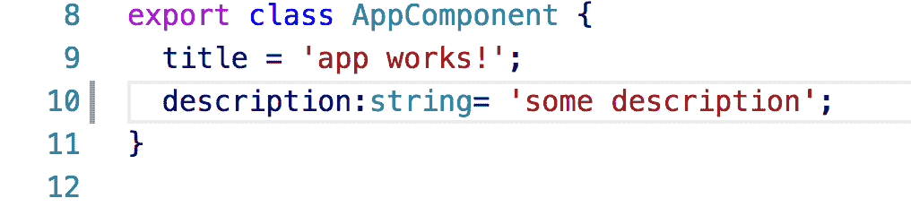
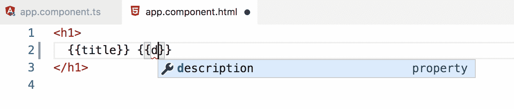
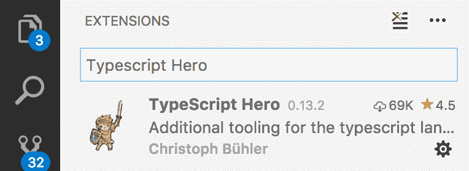
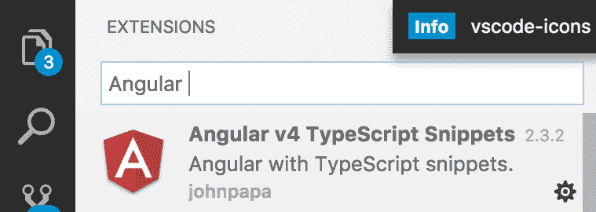

# 第二章：IDE 和插件

在继续我们对 Angular 的旅程之前，是时候看看 IDE 了。当涉及到进行敏捷工作流程时，我们最喜欢的代码编辑器可以成为无与伦比的盟友，其中包括运行时的 TypeScript 编译、静态类型检查和内省，以及代码完成和可视化辅助调试和构建我们的应用程序。话虽如此，让我们重点介绍一些主要的代码编辑器，并概览它们在开发 Angular 应用程序时如何帮助我们。如果您只是满足于从命令行触发 TypeScript 文件的编译，并且不想获得可视化的代码辅助，请随意跳到下一节。否则，直接跳转到涵盖您选择的 IDE 的下一节。

在这一章中，您将学习以下内容：

+   最常见的编辑器

+   安装和配置插件以提高您的生产力

+   了解一些代码片段，这些代码片段将使您成为一个更快的编码人员，因为它们为您提供了最常见情况下的现成代码。

# IDE

**集成开发环境**（**IDE**）是我们用来指代比记事本或简单编辑器更强大的东西的术语。编写代码意味着我们有不同的要求，如果我们要写一篇文章的话。编辑器需要能够指示我们输入错误，为我们提供有关我们的代码的见解，或者最好是给我们所谓的自动完成，一旦我们开始输入其开头字母，它就会给我们一个方法列表。编码编辑器可以而且应该是您最好的朋友。对于前端开发，有很多很好的选择，没有哪个环境真的比其他环境更好；这取决于哪种对您最有效。让我们踏上发现之旅，让您来判断哪种环境最适合您。

# Atom

由 GitHub 开发，高度可定制的环境和安装新包的便利性已经使 Atom 成为许多人的首选 IDE。

为了在编写 Angular 应用程序时优化 TypeScript 的体验，您需要安装 Atom TypeScript 包。您可以通过 APM CLI 安装，也可以使用内置的包安装程序。包含的功能与在安装了 Microsoft 包后在 Sublime 中的功能基本相同：自动代码提示、静态类型检查、代码内省或保存时自动构建等。除此之外，该包还包括一个方便的内置`tsconfig.json`生成器。

# Sublime Text 3

这可能是当今最广泛使用的代码编辑器之一，尽管最近失去了一些动力，用户更青睐其他新兴竞争对手，如 GitHub 自己的 Atom。如果这是您的首选编辑器，我们将假设它已经安装在您的系统上，并且您还安装了 Node（这是显而易见的，否则，您首先无法通过 NPM 安装 TypeScript）。为了提供对 TypeScript 代码编辑的支持，您需要安装微软的 TypeScript 插件，可在[`github.com/Microsoft/TypeScript-Sublime-Plugin`](https://github.com/Microsoft/TypeScript-Sublime-Plugin)上找到。请参考此页面以了解如何安装插件以及所有快捷键和键映射。

安装成功后，只需按下*Ctrl* + Space Bar 即可根据类型内省显示代码提示。除此之外，我们还可以通过按下*F7*功能键触发构建过程，并将文件编译为我们正在工作的 JavaScript。实时代码错误报告是另一个可以从命令菜单中启用的花哨功能。

# Webstorm

这款由 IntelliJ 提供的优秀代码编辑器也是基于 TypeScript 编写 Angular 应用程序的不错选择。该 IDE 内置支持 TypeScript，因此我们可以从第一天开始开发 Angular 组件。WebStorm 还实现了一个内置的转译器，支持文件监视，因此我们可以将 TypeScript 代码编译为纯粹的 JavaScript，而无需依赖任何第三方插件。

# Visual Studio Code

由 Microsoft 支持的代码编辑器 Visual Studio Code 正在成为 Angular 中的一个严肃竞争者，主要是因为它对 TypeScript 的出色支持。TypeScript 在很大程度上是由 Microsoft 推动的项目，因此有意为其流行的编辑器之一内置对该语言的支持是有道理的。这意味着我们可能想要的所有不错的功能已经内置，包括语法和错误高亮显示以及自动构建。

使 Visual Studio 变得如此出色的真正原因不仅仅是其设计和易用性，还有许多插件可供选择，对于 Angular 开发来说有一些非常棒的插件，让我们来看看其中的一些领先者。

**Angular 语言服务**：



通过搜索`Angular 语言`，您可以获得与之匹配的插件列表。安装排在前面的插件。

完成后，您将通过以下方式丰富 Visual Studio Code：

+   代码完成

+   转到定义

+   快速信息

+   AOT 诊断消息

只是为了演示其能力，让我们像这样向我们的代码添加一个描述字段：



现在让我们编辑模板，并意识到我们在模板中有代码完成：



当我们开始输入时，会显示一个视觉指示器，并为我们提供完成单词的选项，如果我们选择建议的文本。另一个强大的功能是支持悬停在字段名称上，单击它，然后转到它所属的组件类。这使得快速查找定义变得非常容易。这被称为*转到定义*功能。要使用该功能，您只需悬停在名称上，然后在 Mac 上按住命令按钮。正如前面所述，非常简单，非常强大。

**Typescript Hero**：



要使用此插件，只需像这样开始编码，并单击左侧的灯泡图标，以自动将导入添加到您的文件中：


具有体面的代码完成和导入是必不可少的，除非您喜欢磨损手指。还有一些代码片段和代码片段，可以让您的编码速度更快。

**Angular 5 Typescript 代码片段（Dan Wahlin，John Papa）**：



这是一个非常强大的插件。它带有三种不同类型的代码片段：

+   Angular 片段

+   RxJS 片段

+   HTML 片段

它的工作方式如下。输入一个片段快捷方式，当被要求时按*Enter*，代码将被添加：

```ts
a-component
```

按*Enter*将得到以下代码：

```ts
import { Component, OnInit } from '@Angular/core';

@Component({
 selector: 'selector-name',
 templateUrl: 'name.component.html'
})
export class NameComponent implements OnInit {
 constructor() {}

 ngOnInit(){}
}
```

正如你所看到的，你几乎不费吹灰之力就能得到大量的代码。总共有 42 个片段，它们都列在 Visual Studio 的插件描述中。

还有很多插件，但这些将在刚开始时产生真正的影响。这一切都是关于高效生产，而不是浪费时间输入不必要的字符。

# 总结

本章的重点是试图让你作为软件开发者更有能力。编辑器有很多选择，其中一些我们选择了更详细地介绍。还有许多插件和片段可以节省不少按键。归根结底，你的重点和精力应该花在解决问题和构建解决方案上，而不是让手指累坏。当然，你可以下载更多的插件、片段和快捷方式，但这些是一个很好的开始。我们鼓励你更多地了解你的编辑器及其可能性，因为这将使你更快速、更高效。

在下一章中，你将学习有关 Typescript 的所有内容，从基础到专业水平。本章将涵盖引入类型解决了什么问题，以及语言结构本身。Typescript 作为 JavaScript 的超集，包含了许多强大的概念，并且与 Angular 框架非常契合，你即将发现。
