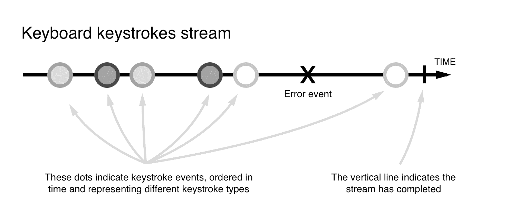

# 第七章：使用 Angular 进行异步数据服务

连接到数据服务和 API，并处理异步信息是我们作为开发人员在日常生活中的常见任务。在这方面，Angular 为其热情的开发人员提供了无与伦比的工具集，帮助他们消费、消化和转换从数据服务中获取的各种数据。

有太多的可能性，需要一本整书来描述你可以通过连接到 API 或通过 HTTP 异步地从文件系统中消费信息所能做的一切。在本书中，我们只是浅尝辄止，但本章涵盖的关于 HTTP API 及其伴随的类和工具的见解将为您提供一切所需，让您的应用程序在短时间内连接到 HTTP 服务，而您可以根据自己的创造力来发挥它们的全部潜力。

在本章中，我们将：

+   看看处理异步数据的不同策略

+   介绍 Observables 和 Observers

+   讨论函数式响应式编程和 RxJS

+   审查 HTTP 类及其 API，并学习一些不错的服务模式

+   了解 Firebase 以及如何将其连接到您的 Angular 应用程序

+   通过实际的代码示例来看待前面提到的所有要点

# 处理异步信息的策略

从 API 中获取信息是我们日常实践中的常见操作。我们一直在通过 HTTP 获取信息——当通过向认证服务发送凭据来对用户进行身份验证时，或者在我们喜爱的 Twitter 小部件中获取最新的推文时。现代移动设备引入了一种无与伦比的消费远程服务的方式，即推迟请求和响应消费，直到移动连接可用。响应速度和可用性变得非常重要。尽管现代互联网连接速度超快，但在提供此类信息时总会涉及响应时间，这迫使我们建立机制以透明地处理应用程序中的状态，以便最终用户使用。

这并不局限于我们需要从外部资源消费信息的情景。

# 异步响应-从回调到承诺

有时，我们可能需要构建依赖于时间作为某个参数的功能，并且需要引入处理应用程序状态中这种延迟变化的代码模式。

针对所有这些情况，我们一直使用代码模式，比如回调模式，触发异步操作的函数期望在其签名中有另一个函数，该函数在异步操作完成后会发出一种通知，如下所示：

```ts
function  notifyCompletion() {
 console.log('Our asynchronous operation has been completed'); }

function  asynchronousOperation(callback) {
 setTimeout(() => { callback(); }, 5000); }

asynchronousOperation(notifyCompletion);
```

这种模式的问题在于，随着应用程序的增长和引入越来越多的嵌套回调，代码可能变得相当混乱和繁琐。为了避免这种情况，`Promises`引入了一种新的方式来构想异步数据管理，通过符合更整洁和更稳固的接口，不同的异步操作可以在同一级别链接甚至可以从其他函数中分割和返回。以下代码介绍了如何构造`Promise`：

```ts
function getData() {
 return new Promise((resolve, reject) => {
 setTimeout(() => { 
 resolve(42); 
 }, 3000);
 })
}

getData().then((data) => console.log('Data',data)) // 42
```

前面的代码示例可能有点冗长，但它确实为我们的函数提供了更具表现力和优雅的接口。至于链式数据，我们需要了解我们要解决的问题。我们正在解决一种称为回调地狱的东西，看起来像这样：

```ts
getData(function(data){
 getMoreData(data, function(moreData){
 getEvenMoreData(moreData, function(evenMoreData) {
 // done here
 });
 });
});
```

如前面的代码所示，我们有一个情况，即在执行下一个异步调用之前，我们依赖于先前的异步调用和它带回的数据。这导致我们不得不在回调中执行一个方法，然后在回调中执行另一个方法，依此类推。你明白了吧——代码很快就会变得很糟糕，也就是所谓的*回调地狱*。继续讨论链式异步调用的主题，链式是解决*回调地狱*的答案，`Promises`允许我们像这样链接它们：

```ts
getData()
 .then(getMoreData)
 .then(getEvenMoreData);

function getData() { 
 return new Promise(resolve) => resolve('data'); 
}

function getMoreData(data) {
 return new Promise((resolve, reject) => resolve('more data'));
}

function getEvenMoreData(data) {
 return new Promise((resolve, reject) => resolve('even more data'));
}
```

在前面的代码中，`.then()`方法调用的链接显示了我们如何清晰地将一个异步调用排在另一个异步调用之后，并且先前的异步调用已经将其结果输入到即将到来的`async`方法中。

因此，`Promises`以其强大的编码能力风靡编程领域，似乎没有开发人员会质疑它们为游戏带来的巨大价值。那么，为什么我们需要另一种范式呢？嗯，因为有时我们可能需要产生一个响应输出，该输出遵循更复杂的处理过程，甚至取消整个过程。这不能通过`Promises`来实现，因为它们一旦被实例化就会被触发。换句话说，`Promises`不是懒惰的。另一方面，在异步操作被触发但尚未完成之前取消它的可能性在某些情况下可能非常方便。`Promises`只允许我们解决或拒绝异步操作，但有时我们可能希望在达到那一点之前中止一切。此外，`Promises`表现为一次性操作。一旦它们被解决，我们就不能期望收到任何进一步的信息或状态变化通知，除非我们从头开始重新运行一切。此外，我们有时需要更主动地实现异步数据处理。这就是 Observable 出现的地方。总结一下 Promises 的限制：

+   它们无法被取消

+   它们会立即执行

+   它们只是一次性操作；没有简单的重试方法

+   它们只会响应一个值

# Observable 简而言之

Observable 基本上是一个异步事件发射器，通知另一个元素，称为观察者，状态已经改变。为了做到这一点，Observable 实现了所有需要产生和发射这样的异步事件的机制，并且可以在任何时候被触发和取消，无论它是否已经发出了预期的数据事件。

这种模式允许并发操作和更高级的逻辑，因为订阅 Observable 异步事件的观察者将会反应 Observable 的状态变化。

这些订阅者，也就是我们之前提到的观察者，会一直监听 Observable 中发生的任何事情，直到 Observable 被处理掉，如果最终发生的话。与此同时，信息将在整个应用程序中更新，而不会触发例行程序。

我们可能可以在一个实际的例子中更透明地看到所有这些。让我们重新设计我们在评估基于 Promise 的异步操作时涵盖的示例，并用`setInterval`命令替换`setTimeout`命令：

```ts
function notifyCompletion() {
 console.log('Our asynchronous operation has been completed');
}

function asynchronousOperation() {
 let promise = new Promise((resolve, reject) => {
 setInterval(resolve, 2000); });

 return promise;
}

asynchronousOperation().then(notifyCompletion);
```

复制并粘贴上述片段到浏览器的控制台窗口，看看会发生什么。文本“我们的异步操作已经完成”将在 2 秒后只显示一次，并且不会再次呈现。承诺自行解决，整个异步事件在那一刻终止。

现在，将浏览器指向在线 JavaScript 代码 playground，比如 JSBIN（[`jsbin.com/`](https://jsbin.com/)），并创建一个新的代码片段，只启用 JavaScript 和 Console 选项卡。然后，确保您从“添加库”选项下拉菜单中添加 RxJS 库（我们将需要这个库来创建 Observables，但不要惊慌；我们将在本章后面介绍这个库），并插入以下代码片段：

```ts
let observable$ = Rx.Observable.create(observer => {
 setInterval(() => {
 observer.next('My async operation');
 }, 2000);
});

observable$.subscribe(response => console.log(response));
```

运行它，并期望在右窗格上出现一条消息。2 秒后，我们将看到相同的消息出现，然后再次出现。在这个简单的例子中，我们创建了一个`observable`，然后订阅了它的变化，将其发出的内容（在这个例子中是一个简单的消息）作为一种推送通知输出到控制台。

Observable 返回一系列事件，我们的订阅者会及时收到这些事件的通知，以便他们可以相应地采取行动。这就是 Observable 的魔力所在——Observable 不执行异步操作并终止（尽管我们可以配置它们这样做），而是开始一系列连续的事件，我们可以订阅我们的订阅者。

如果我们注释掉最后一行，什么也不会发生。控制台窗格将保持沉默，所有的魔法将只在我们订阅我们的源对象时开始。

然而，这还不是全部。在这些事件到达订阅者之前，这个流可以成为许多操作的主题。就像我们可以获取一个集合对象，比如数组，并对其应用`map()`或`filter()`等函数方法来转换和操作数组项一样，我们也可以对我们的 Observable 发出的事件流进行相同的操作。这就是所谓的响应式函数编程，Angular 充分利用这种范式来处理异步信息。

# 在 Angular 中的响应式函数编程

Observable 模式是我们所知的响应式函数编程的核心。基本上，响应式函数脚本的最基本实现涵盖了我们需要熟悉的几个概念：

+   可观察对象

+   观察者

+   时间线

+   一系列具有与对象集合相同行为的事件

+   一组可组合的操作符，也称为响应式扩展

听起来令人生畏？其实不是。相信我们告诉你，到目前为止你所经历的所有代码比这复杂得多。这里的重大挑战是改变你的思维方式，学会以一种反应式的方式思考，这是本节的主要目标。

简而言之，我们可以说，响应式编程涉及将异步订阅和转换应用于事件的 Observable 流。我们可以想象你现在的无表情，所以让我们组合一个更具描述性的例子。

想想交互设备，比如键盘。键盘上有用户按下的按键。用户按下每一个按键都会触发一个按键事件。该按键事件包含大量元数据，包括但不限于用户在特定时刻按下的特定按键的数字代码。当用户继续按键时，会触发更多的**keyUp**事件，并通过一个虚拟时间线传输。keyUp 事件的时间线应该如下图所示：



从前面的 keyUps 时间线中可以看出，这是一系列连续的数据，其中 keyUp 事件可以在任何时候发生；毕竟，用户决定何时按下这些按键。还记得我们写的 Observable 代码，包含`setTimeout`吗？那段代码能够告诉一个概念观察者，每隔 2 秒就应该发出另一个值。那段代码和我们的 keyUps 有什么区别？没有。嗯，我们知道定时器间隔触发的频率，而对于 keyUps，我们并不知道，因为这不在我们的控制之中。但这真的是唯一的区别，这意味着 keyUps 也可以被视为一个 Observable：

```ts
let key = document.getElementId('.search'); 
/* 
we assume there exist a button in the DOM like this 
<input class="search" placeholder="searchfor"></input>
*/

let stream = Rx.Observable.fromEvent(key, 'keyUp');
stream.subscribe((data) => console.log('key up happened', data))
```

所以，我真正告诉你的是，超时以及 keyUps 可以被视为同一个概念，即 Observable。这样更容易理解所有异步事物。然而，我们还需要另一个观察，即无论发生什么异步概念，它都是以列表的方式发生的。

尽管时间可能不同，但它仍然是一系列事件，就像一个列表。列表通常有一堆方法来投影、过滤或以其他方式操作它的元素，猜猜，Observable 也可以。列表可以执行这样的技巧：

```ts
let mappedAndFiltered = list
 .map(item => item + 1)
 .filter(item > 2);
```

因此，Observables 可以如下：

```ts
let stream = Rx.Observable
 .create(observer => {
 observer.next(1);
 observer.next(2);
 })
 .map(item => item + 1)
 .filter(item > 2);
```

在这一点上，区别只是命名不同。对于列表，`.map()`和`.filter()`被称为方法。对于 Observable，相同的方法被称为 Reactive Extensions 或操作符。想象一下，在这一点上，`keyUps`和超时可以被描述为 Observables，并且我们有操作符来操作数据。现在，更大的飞跃是意识到任何异步的东西，甚至是 HTTP 调用，都可以被视为 Observables。这意味着我们突然可以混合和匹配任何异步的东西。这使得一种称为**丰富组合**的东西成为可能。无论异步概念是什么，它和它的数据都可以被视为一个流，你是一个可以按照自己的意愿来弯曲它的巫师。感到有力量——你现在可以将你的应用程序转变为一个反应式架构。

# RxJS 库

如前所述，Angular 依赖于 RxJS，这是 ReactiveX 库的 JavaScript 版本，它允许我们从各种情景中创建 Observables 和 Observable 序列，比如：

+   交互事件

+   承诺

+   回调函数

+   事件

在这个意义上，响应式编程并不旨在取代承诺或回调等异步模式。相反，它也可以利用它们来创建 Observable 序列。

RxJS 提供了内置支持，用于转换、过滤和组合生成的事件流的广泛的可组合操作符。其 API 提供了方便的方法来订阅观察者，以便我们的脚本和组件可以相应地对状态变化或交互输入做出响应。虽然其 API 如此庞大，以至于详细介绍超出了本书的范围，但我们将重点介绍其最基本的实现，以便您更好地理解 Angular 如何处理 HTTP 连接。

在深入研究 Angular 提供的 HTTP API 之前，让我们创建一个简单的 Observable 事件流的示例，我们可以用 Reactive Extensions 来转换，并订阅观察者。为此，让我们使用前一节中描述的情景。

我们设想用户通过键盘与我们的应用程序进行交互，可以将其转化为按键的时间线，因此成为一个事件流。回到 JSBIN，删除 JavaScript 窗格的内容，然后写下以下片段：

```ts
let keyboardStream$ = Rx.Observable
 .fromEvent(document, 'keyup')
 .map(x => x.which);
```

前面的代码相当自描述。我们利用`Rx.Observable`类及其`fromEvent`方法来创建一个事件发射器，该发射器流式传输在文档对象范围内发生的`keyup`事件。每个发射的事件对象都是一个复杂对象。因此，我们通过将事件流映射到一个新流上，该新流仅包含与每次按键对应的键码，来简化流式传输的对象。`map`方法是一种响应式扩展，具有与 JavaScript 中的`map`函数方法相同的行为。这就是为什么我们通常将这种代码风格称为响应式函数式编程。

好了，现在我们有了一个数字按键的事件流，但我们只对观察那些通知我们光标键击中的事件感兴趣。我们可以通过应用更多的响应式扩展来从现有流构建一个新流。因此，让我们用`keyboardStream`过滤这样一个流，并仅返回与光标键相关的事件。为了清晰起见，我们还将这些事件映射到它们的文本对应项。在前面的片段后面添加以下代码块：

```ts
let cursorMovesStream$ = keyboardStream
 .filter(x => {
 return  x > 36 && x < 41;
 })
 .map(x => {
 let direction;
 switch(x) {
 case 37:
 direction = 'left';
 break;
 case 38:
 direction = 'up';
 break;
 case 39:
 direction = 'right';
 break;
 default:
 direction = 'down';
 }
 return direction;
 });
```

我们本可以通过将`filter`和`map`方法链接到`keyboardStream` Observable 来一次性完成所有操作，然后订阅其输出，但通常最好分开处理。通过以这种方式塑造我们的代码，我们有一个通用的键盘事件流，以后可以完全不同的用途重复使用。因此，我们的应用程序可以扩展，同时保持代码占用空间最小化。

既然我们提到了订阅者，让我们订阅我们的光标移动流，并将`move`命令打印到控制台。我们在脚本的末尾输入以下语句，然后清除控制台窗格，并单击输出选项卡，以便我们可以在上面输入代码，以便我们可以尝试不同的代码语句：

```ts
cursorMovesStream$.subscribe(e => console.log(e));
```

单击输出窗格的任意位置将焦点放在上面，然后开始输入随机键盘键和光标键。

你可能想知道我们如何将这种模式应用到从 HTTP 服务中获取信息的异步场景中。基本上，你到目前为止已经习惯了向 AJAX 服务提交异步请求，然后通过回调函数处理响应或者通过 promise 进行处理。现在，我们将通过返回一个 Observable 来处理调用。这个 Observable 将在流的上下文中作为事件发出服务器响应，然后通过 Reactive Extensions 进行更好地处理响应。

# 介绍 HTTP API

现在，在我们深入描述 Angular 框架在`HttpClient`服务实现方面给我们的东西之前，让我们谈谈如何将`XmlHttpRequest`包装成一个 Observable。为了做到这一点，我们首先需要意识到有一个合同需要履行，以便将其视为成功的包装。这个合同由以下内容组成：

+   使用`observer.next(data)`来发出任何到达的数据

+   当我们不再期望有更多的数据时，我们应该调用`observer.complete()`

+   使用`observer.error(error)`来发出任何错误

就是这样；实际上非常简单。让我们看看`XmlHttpRequest`调用是什么样子的：

```ts
const request = new XMLHttpRequest();

request.onreadystatechange = () => {
 if(this.readyState === 4 and this.state === 200) {
 // request.responseText
 } else {
 // error occurred here
 }
}

request.open("GET", url);
request.send();
```

好的，所以我们有一个典型的回调模式，其中`onreadystatechange`属性指向一个方法，一旦数据到达就会被调用。这就是我们需要知道的所有内容来包装以下代码，所以让我们来做吧：

```ts
let stream$ = Rx.Observable.create(observer => {
 let request = new XMLHttpRequest();
 request.onreadystatechange = () => {
 if(this.readyState === 4 && this.state === 200) {
 observer.next( request.responseText )
 observer.complete();
 } else {
 observer.error( request.responseText ) 
 }
 }
})
```

就是这样，包装完成了；你现在已经构建了自己的 HTTP 服务。当然，这还不够，我们还有很多情况没有处理，比如 POST、PUT、DELETE、缓存等等。然而，重要的是让你意识到 Angular 中的 HTTP 服务为你做了所有繁重的工作。另一个重要的教训是，将任何类型的异步 API 转换为与我们其他异步概念很好契合的 Observable 是多么容易。所以，让我们继续使用 Angular 的 HTTP 服务实现。从这一点开始，我们将使用`HttpClient`服务。

`HttpClient`类提供了一个强大的 API，它抽象了处理通过各种 HTTP 方法进行异步连接所需的所有操作，并以一种简单舒适的方式处理响应。它的实现经过了很多精心的考虑，以确保程序员在开发利用这个类连接到 API 或数据资源的解决方案时感到轻松自在。

简而言之，`HttpClient`类的实例（已经作为`Injectable`资源实现，并且可以在我们的类构造函数中作为依赖提供者注入）公开了一个名为`request()`的连接方法，用于执行任何类型的 HTTP 连接。Angular 团队为最常见的请求操作（如 GET、POST、PUT 以及每个现有的 HTTP 动词）创建了一些语法快捷方式。因此，创建一个异步的 HTTP 请求就像这样简单：

```ts
let  request  =  new  HttpRequest('GET', 'jedis.json');
let myRequestStream:Observable<any> = http.request(request);
```

而且，所有这些都可以简化为一行代码：

```ts
let myRequestStream: Observable<any> = http.get('jedis.json');
```

正如我们所看到的，`HttpClient`类的连接方法通过返回一个 Observable 流来操作。这使我们能够订阅观察者到流中，一旦返回，观察者将相应地处理信息，可以多次进行：

```ts
let myRequestStream = http
 .get<Jedi[]>('jedis.json')
  .subscribe(data => console.log(data));
```

在前面的例子中，我们给`get()`方法一个模板化类型，它为我们进行了类型转换。让我们更加强调一下这一点：

```ts
.get<Jedi[]>('jedis.json')
```

这个事实使我们不必直接处理响应对象并执行映射操作将我们的 JSON 转换为 Jedi 对象列表。我们只需要记住我们资源的 URL，并指定一个类型，你订阅的内容就可以立即用于我们服务的订阅。

通过这样做，我们可以根据需要重新发起 HTTP 请求，我们的其余机制将相应地做出反应。我们甚至可以将 HTTP 调用表示的事件流与其他相关调用合并，并组合更复杂的 Observable 流和数据线程。可能性是无限的。

# 处理头部

在介绍`HttpClient`类时，我们提到了`HttpRequest`类。通常情况下，您不需要使用低级别的类，主要是因为`HttpClient`类提供了快捷方法，并且需要声明正在使用的 HTTP 动词（GET、POST 等）和要消耗的 URL。话虽如此，有时您可能希望在请求中引入特殊的 HTTP 头，或者自动附加查询字符串参数到每个请求中，举例来说。这就是为什么这些类在某些情况下会变得非常方便。想象一个使用情况，您希望在每个请求中添加身份验证令牌，以防止未经授权的用户从您的 API 端点中读取数据。

在以下示例中，我们读取身份验证令牌并将其附加为标头到我们对数据服务的请求。与我们的示例相反，我们将`options`哈希对象直接注入到`HttpRequest`构造函数中，跳过创建对象实例的步骤。Angular 还提供了一个包装类来定义自定义标头，我们将在这种情况下利用它。假设我们有一个 API，希望所有请求都包括名为`Authorization`的自定义标头，附加在登录系统时收到的`authToken`，然后将其持久化在浏览器的本地存储层中，例如：

```ts
const authToken = window.localStorage.getItem('auth_token');

let headers = new HttpHeaders();
headers.append('Authorization', `Token ${authToken}`);
let request = new HttpRequest('products.json', { headers: headers });

let authRequest = http.request(request);
```

再次强调，除了这种情况，您很少需要创建自定义请求配置，除非您希望在工厂类或方法中委托请求配置的创建并始终重用相同的`Http`包装器。Angular 为您提供了所有的灵活性，可以在抽象化应用程序时走得更远。

# 处理执行 HTTP 请求时的错误

处理我们请求中引发的错误，通过检查`Response`对象返回的信息实际上非常简单。我们只需要检查其`Boolean`属性的值，如果响应的 HTTP 状态在 2xx 范围之外，它将返回`false`，清楚地表明我们的请求无法成功完成。我们可以通过检查`status`属性来双重检查，以了解错误代码或`type`属性，它可以假定以下值：`basic`，`cors`，`default`，`error`或`opaque`。检查响应标头和`HttpResponse`对象的`statusText`属性将提供有关错误来源的深入信息。

总的来说，我们并不打算在每次收到响应消息时检查这些属性。Angular 提供了一个 Observable 操作符来捕获错误，在其签名中注入我们需要检查的`HttpResponse`对象的先前属性：

```ts
http.get('/api/bio')
.subscribe(bio => this.bio = bio)
.catch(error: Response => Observable.of(error));
```

值得注意的是，我们通过使用`catch()`操作符捕获错误，并通过调用`Observable.of(error)`返回一个新的操作符，让我们的错误作为我们创建的新 Observable 的输入。这对我们来说是一个不会使流崩溃的方法，而是让它继续存在。当然，在更真实的情况下，我们可能不只是创建一个新的 Observable，而是可能记录错误并返回完全不同的东西，或者添加一些重试逻辑。关键是，通过`catch()`操作符，我们有一种捕获错误的方法；如何处理它取决于您的情况。

在正常情况下，您可能希望检查除了错误属性之外的更多数据，除了在更可靠的异常跟踪系统中记录这些信息之外。

# 注入 HttpClient 服务

`HttpClient`服务可以通过利用 Angular 独特的依赖注入系统注入到我们自己的组件和自定义类中。因此，如果我们需要实现 HTTP 调用，我们需要导入`HttpClientModule`并导入`HttpClient`服务：

```ts
// app/biography/biography.module.ts
import { HttpClientModule } from '@angular/common/http';

@NgModule({
  imports: [ HttpClientModule ]
})
export class BiographyModule {}

// app/biography/biography.component.ts

import { Component } from '@angular/core';
import { HttpClient } from '@angular/http';

@Component({
 selector: 'bio',
 template: '<div>{{bio}}</div>'
})
export class BiographyComponent {
 bio: string;

 constructor(private http: HttpClient) {
 const  options  = {}; this.http.get('/api/bio', { ...options, responseType:  'text' }) .catch(err  =>  Observable.of(err)) .subscribe(x  => this.bio= bio)
 }
}
```

在提供的代码中，我们只是按照我们在上一节中指出的`bio`示例进行。请注意我们如何导入`HttpClient`类型，并将其作为依赖项注入到`Biography`构造函数中。

通常，我们需要在应用程序的不同部分执行多个 HTTP 调用，因此通常建议创建一个`DataService`和一个`DataModule`，它包装了`HttpClientModule`和`HttpClient`服务。

以下是创建这样一个`DataService`的示例：

```ts
import {Http} from '@angular/http';
import {Injectable} from '@angular/core';

@Injectable()
export class DataService {
 constructor(private http:HttpClient) {}

 get(url, options?) {}
 post(url, payload, options?) {}
 put(url, payload, options?) {}
 delete(url) {}
}
```

相应的`DataModule`将如下所示：

```ts
import {DataService} from './data.service';
import {HttpModule} from '@angular/http';

@NgModule({
  imports: [HttpClientModule],
 providers: [DataService] 
})
```

如果您想为调用后端添加自己的缓存或授权逻辑，这就是要做的地方。另一种方法是使用`HttpInterceptors`，在本章的即将到来的部分中将提供使用`HttpInterceptors`的示例。

当然，任何想要使用这个`DataModule`的模块都需要导入它，就像这样：

```ts
@NgModule({
  imports: [DataModule],
 declarations: [FeatureComponent]
})
export class FeatureModule {}
```

我们的`FeatureModule`中的任何构造现在都可以注入`DataService`，就像这样：

```ts
import { Component } from '@angular/core';

@Component({})
export class FeatureComponent {
 constructor(private service: DataService) { }
}
```

# 一个真实的案例研究 - 通过 HTTP 提供 Observable 数据

在上一章中，我们将整个应用程序重构为模型、服务、管道、指令和组件文件。其中一个服务是`TaskService`类，它是我们应用程序的核心，因为它提供了我们构建任务列表和其他相关组件所需的数据。

在我们的示例中，TaskService 类包含在我们想要传递的信息中。在实际情况下，您需要从服务器 API 或后端服务中获取该信息。让我们更新我们的示例以模拟这种情况。首先，我们将从 TaskService 类中删除任务信息，并将其包装成一个实际的 JSON 文件。让我们在共享文件夹中创建一个新的 JSON 文件，并用我们在原始 TaskService.ts 文件中硬编码的任务信息填充它，现在以 JSON 格式：

```ts
[{
 "name": "Code an HTML Table",
 "deadline": "Jun 23 2015",
 "pomodorosRequired": 1

}, {
 "name": "Sketch a wireframe for the new homepage",
 "deadline": "Jun 24 2016",
 "pomodorosRequired": 2

}, {
 "name": "Style table with Bootstrap styles",
 "deadline": "Jun 25 2016",
 "pomodorosRequired": 1

}, {
 "name": "Reinforce SEO with custom sitemap.xml",
 "deadline": "Jun 26 2016",
 "pomodorosRequired": 3
}]
```

将数据正确包装在自己的文件中后，我们可以像使用实际后端服务一样从我们的 TaskService 客户端类中使用它。但是，为此我们需要在 main.ts 文件中进行相关更改。原因是，尽管在安装所有 Angular 对等依赖项时安装了 RxJS 包，但反应式功能操作符（例如`map()`）并不会立即可用。我们可以通过在应用程序初始化流的某个步骤中插入以下代码行来一次性导入所有这些内容，例如在`main.ts`的引导阶段：

```ts
import 'rxjs/Rx';
```

然而，这将导入所有反应式功能操作符，这些操作符根本不会被使用，并且会消耗大量带宽和资源。相反，惯例是只导入所需的内容，因此在 main.ts 文件的顶部追加以下导入行：

```ts
import 'rxjs/add/operator/map';
import { bootstrap } from '@angular/platform-browser-dynamic';
import AppModule from './app.module';

bootstrapModule(AppModule);
```

当以这种方式导入反应式操作符时，它会自动添加到 Observable 原型中，然后可以在整个应用程序中使用。应该说，可讳操作符的概念刚刚在 RxJS 5.5 中引入。在撰写本书时，我们刚刚在修补操作员原型的转变中，如上所述，并进入可讳操作符空间。对于感兴趣的读者，请查看这篇文章，其中详细描述了这对您的代码意味着什么。更改并不是很大，但仍然有变化：[`blog.angularindepth.com/rxjs-understanding-lettable-operators-fe74dda186d3`](https://blog.angularindepth.com/rxjs-understanding-lettable-operators-fe74dda186d3)

# 利用 HTTP - 重构我们的 TaskService 以使用 HTTP 服务

所有依赖项都已经就位，现在是重构的时候了

我们的 TaskService.ts 文件。打开服务文件，让我们更新导入语句块：

```ts
import { Injectable } from '@angular/core';
import { HttpClient } from '@angular/common/http';
import { Observable } from 'rxjs/Observable';

import { Task } from './task.model';
```

首先，我们导入`HttpClient`和`Response`符号，以便稍后可以注释我们的对象。Observable 符号是从 RxJS 库导入的，以便我们可以正确注释我们的异步 HTTP 请求的返回类型。我们还从文件`task.model.ts`导入`Task`作为模型（它是一个接口），如下所示：

```ts
export interface Task {
 name: string;
 deadline: string;
 pomodorosRequired: number;
 queued: boolean;
}
```

我们将通过两个步骤重构此服务：

1.  重写服务以使用 HTTP 服务。

1.  实现存储/反馈模式并给服务一个状态。

# 使用 Angular HTTP 服务

现在，我们将使用 HTTP 服务替换现有的静态数据实现。为此，我们调用 HTTP 服务的`http.get()`方法来获取数据，但我们还需要使用 map 操作符来获得我们可以向外显示的结果：

```ts
import { HttpClient } from '@angular/common/http';
import { Task } from './task.model';

export default class TaskService {
 constructor(private http:HttpClient) {}

 getTasks(): Observable<Task[]> {
 return this.http.get<Task[]>(`tasks.json`)
 }
}
```

要使用先前定义的服务，我们只需要告诉模块关于它。我们通过将其添加到`providers`关键字来实现这一点：

```ts
// app/tasks/task.module.ts

@NgModule({
 imports: [ /* add dependant modules here */ ],
 declarations: [ ./* add components and directives here */ ]
 providers: [TaskService],
})
export class TaskModule {}
```

此后，我们需要在使用者组件中注入`TaskService`并以适当的方式显示它：

```ts
// app/tasks/task.component.ts

@Component({
 template: `
 <div *ngFor="let task of tasks">
 {{ task.name }}
 </div>
 `
})
export class TasksComponent {
 tasks:Task[];
 constructor(private taskService:TaskService){
 this.taskService.getTasks().subscribe( tasks => this.tasks = tasks)
 }
}
```

# 大多数情况下使用有状态的 TaskService

到目前为止，我们已经介绍了如何将 HTTP 服务注入到服务构造函数中，并且已经能够从组件订阅这样的服务。在某些情况下，组件可能希望直接处理数据而不是使用 Observables。实际上，我们大多数情况下都是这样。因此，我们不必经常使用 Observables；HTTP 服务正在利用 Observables，对吧？我们正在谈论组件层。目前，我们在组件内部正在发生这种情况：

```ts
// app/tasks/task.service.ts

@Component({
 template: `
 <div *ngFor="let task of tasks$ | async">
 {{ task.name }}
 </div>
 `
})
export class TaskListComponent {
  tasks$:Observable<Task[]>; 
 constructor(private taskService: TaskService ) {}

 ngOnInit() {
 this.tasks$ = this.taskService.getTasks(); 
 }
} 
```

在这里，我们看到我们将`taskService.getTasks()`分配给一个名为`tasks$`的流。`tasks$`变量末尾的`$`是什么？这是我们用于流的命名约定；让我们尝试遵循任何未来流/可观察字段的命名约定。我们在 Angular 的上下文中将 Observable 和 stream 互换使用，它们的含义是相同的。我们还让`| async`异步管道与`*ngFor`一起处理它并显示我们的任务。

我们可以以更简单的方式做到这一点，就像这样：

```ts
// app/tasks/tas.alt.component.ts

@Component({
 template: `
 <div *ngFor="let task of tasks">
 {{ task.name }}
 </div>
 `
})
export class TaskComponent {
 constructor(private taskService: TaskService ) {}

  get tasks() {
 return this.taskService.tasks;
 } 
} 
```

因此，发生了以下更改：

+   `ngOnInit()`和分配给`tasks$`流的部分被移除了

+   异步管道被移除

+   我们用`tasks`数组替换了`tasks$`流

这还能工作吗？答案在于我们如何定义我们的服务。我们的服务需要暴露一个项目数组，并且我们需要确保当我们从 HTTP 获取到一些数据时，或者当我们从其他地方接收到数据时，比如来自 Web 套接字或类似 Firebase 的产品时，数组会发生变化。

我们刚刚提到了两种有趣的方法，套接字和 Firebase。让我们解释一下它们是什么，以及它们如何与我们的服务相关。Web 套接字是一种利用 TCP 协议建立双向通信的技术，所谓的*全双工连接*。那么，在 HTTP 的背景下提到它为什么有趣呢？大多数情况下，您会有简单的场景，您可以通过 HTTP 获取数据，并且可以利用 Angular 的 HTTP 服务。有时，数据可能来自全双工连接，除了来自 HTTP。

那么 Firebase 呢？Firebase 是谷歌的产品，允许我们在云中创建数据库。正如可以预料的那样，我们可以对数据库执行 CRUD 操作，但其强大之处在于我们可以设置订阅并监听其发生的更改。这意味着我们可以轻松创建协作应用程序，其中许多客户端正在操作相同的数据源。这是一个非常有趣的话题。这意味着您可以快速为您的 Angular 应用程序提供后端，因此，出于这个原因，它值得有自己的章节。它也恰好是本书的下一章。

回到我们试图表达的观点。从理论上讲，添加套接字或 Firebase 似乎会使我们的服务变得更加复杂。实际上，它们并不会。您需要记住的唯一一件事是，当这样的数据到达时，它需要被添加到我们的`tasks`数组中。我们在这里做出的假设是，处理来自 HTTP 服务以及来自 Firebase 或 Web 套接字等全双工连接的任务是有趣的。

让我们看看在我们的代码中涉及 HTTP 服务和套接字会是什么样子。您可以通过使用包装其 API 的库轻松利用套接字。

大多数浏览器原生支持 WebSockets，但仍被认为是实验性的。话虽如此，依然有意义依赖于一个帮助我们处理套接字的库，但值得注意的是，当 WebSockets 变得不再是实验性的时候，我们将不再考虑使用库。对于感兴趣的读者，请查看官方文档[`developer.mozilla.org/en-US/docs/Web/API/WebSockets_API`](https://developer.mozilla.org/en-US/docs/Web/API/WebSockets_API)

有一个这样的库是`socket.io`库；可以通过以下方式安装它：

```ts
npm install socket.io
```

要开始在 Angular 中使用这个，您需要：

1.  导入`socket.io-client`。

1.  通过调用`io(url)`建立连接；这将返回一个套接字，您可以向其添加订阅。

1.  等待包含我们想要在应用程序中显示的有效负载的传入事件。

1.  生成事件并在想要与后端通信时发送可能的有效负载

以下代码将只向您展示如何执行这些步骤。然而，套接字的实现还有更多，比如创建后端。要了解使用 Angular 和`socket.io`的完整示例是什么样子，鼓励感兴趣的读者查看 Torgeir Helgwold 的以下文章：

[`www.syntaxsuccess.com/viewarticle/socket.io-with-rxjs-in-angular-2.0`](http://www.syntaxsuccess.com/viewarticle/socket.io-with-rxjs-in-angular-2.0)

这实际上不是一个 HTTP 主题，这就是为什么我们只显示代码中感兴趣的部分，这是我们将接收数据并将其添加到任务数组中的地方。我们还强调了套接字的设置和拆除。强调是用粗体来做的，如下所示：

```ts
import * as io from 'socket.io-client'**;** export class TaskService {
 subscription;
 tasks:Task[] = [];
 constructor(private http:HttpClient) {
 this.fetchData();

    this.socket = io(this.url**);  // establishing a socket connection** this.socket.on('task', (data) => { 
 // receive data from socket based on the 'task' event happening
 this.tasks = [ ..this.tasks, data ];
 });
 }

 private fetchData() {
 this.subscription = 
 this.http.get<Task[]>('/tasks')
 .subscribe( data => this.tasks = data );
 }

 // call this from the component when component is being destroyed
 destroy() {
    this.socket.removeAllListeners('task');  // clean up the socket
 connection
 } 
}
```

这是一个非常简单的示例，非常适合在模板中显示数据，并在`tasks`数组更改时更新模板。正如您所看到的，如果我们涉及`socket`，那也没关系；我们的模板仍然会被更新。

这种做法还包括另一种情况——两个或更多兄弟组件如何通信？答案很简单：它们使用`TaskService`。如果您希望其他组件的模板得到更新，那么只需更改任务数组的内容，它将反映在 UI 中。以下是此代码：

```ts
@Component({
 template: `
 <div *ngFor="let task of tasks">
 {{ task.name }}
 </div>
 <input [(ngModel)]="newTask" />
 <button (click)="addTask()" ></button>
 ` 
})
export class FirstSiblingComponent {
 newTask: string;

 constructor(private service: TaskService) {}

  get tasks() {
 return this.taskService.tasks;
 }

  addTask() {
 this.service.addTask({ name : this.newTask });
 this.newTask = '';
 }
}
```

这意味着我们还需要向我们的服务添加一个`addTask()`方法，如下所示：

```ts
import * as io from 'socket.io-client'**;** export class TaskService {
 subscription;
 tasks: Task[] = [];
 constructor(private http:Http) {
 this.fetchData();

 this.socket = io(this.url);  // establishing a socket connection

 this.socket.on('task', (data) => { 
 // receive data from socket based on the 'task' event happening
 this.tasks = [ ..this.tasks, data ];
 });
 }

 addTask(task: Task) {
 this.tasks = [ ...this.tasks, task]; 
 }

 private fetchData() {
 this.subscription = 
 this.http.get('/tasks')
 .subscribe(data => this.tasks = data);
 }

 // call this from the component when component is being destroyed
 destroy() {
 this.socket.removeAllListeners('task');  // clean up the socket
 connection
 } 
}
```

另一个组件在设置`taskService`、公开`tasks`属性和操作`tasks`列表方面看起来基本相同。无论哪个组件采取主动通过用户交互更改任务列表，另一个组件都会收到通知。我想强调这种通用方法的工作原理。为了使这种方法起作用，您需要通过组件中的 getter 公开任务数组，如下所示：

```ts
get tasks() {
 return this.taskService.tasks;
}
```

否则，对它的更改将不会被接收。

然而，有一个缺点。如果我们想确切地知道何时添加了一个项目，并且，比如说，基于此显示一些 CSS，那该怎么办？在这种情况下，您有两个选择：

+   在组件中设置套接字连接并在那里监听数据更改。

+   在任务服务中使用行为主题而不是任务数组。来自 HTTP 或套接字的任何更改都将通过`subject.next()`写入主题。如果这样做，那么当发生更改时，您可以简单地订阅该主题。

最后一个选择有点复杂，无法用几句话解释清楚，因此下一节将专门解释如何在数组上使用`BehaviourSubject`。

# 进一步改进-将 TaskService 转变为有状态、更健壮的服务

RxJS 和 Observables 并不仅仅是为了与 Promises 一一对应而到来。RxJS 和响应式编程到来是为了推广一种不同类型的架构。从这样的架构中出现了适用于服务的存储模式。存储模式是确保我们的服务是有状态的，并且可以处理来自 HTTP 以外更多地方的数据。数据可能来自的潜在地方可能包括，例如：

+   HTTP

+   localStorage

+   套接字

+   Firebase

# 在网络连接间歇性中断时处理服务调用

首先，您应该确保如果网络连接中断，应用程序仍然可以正常工作，至少在读取数据方面，您对应用程序用户有责任。对于这种情况，如果 HTTP 响应未能传递，我们可以使用`localStorage`进行回答。然而，这意味着我们需要在我们的服务中编写以下方式工作的逻辑：

```ts
if(networkIsDown) { 
 /* respond with localStorage instead */
} else { 
 /* respond with network call */
}
```

让我们拿出我们的服务，并稍微修改一下以适应离线状态：

```ts
export class TaskService {
 getTasks() {
 this.http .get<Task[]>('/data/tasks.json')  .do( data  => {  localStorage.setItem('tasks', JSON.stringify(data)) })
      .catch(err) => {
 return this.fetchLocalStorage();
 })
 }

 private fetchLocalStorage(){
 let tasks = localStorage.getItem('tasks');
 const tasks = localStorage.getItem('tasks') || [];
    return Observable.of(tasks);
 }
}
```

正如您所看到的，我们做了两件事：

+   我们添加`.do()`运算符来执行副作用；在这种情况下，我们将响应写入`localStorage`

+   我们添加了`catch()`操作符，并响应一个包含先前存储的数据或空数组的新 Observable

用这种方式解决问题没有错，而且在很多情况下，这甚至可能足够好。然而，如果像之前建议的那样，数据从许多不同的方向到达，会发生什么？如果是这种情况，那么我们必须有能力将数据推送到流中。通常，只有观察者可以使用`observer.next()`推送数据。

还有另一个构造，`Subject`。`Subject`具有双重性质。它既能向流中推送数据，也可以被订阅。让我们重写我们的服务以解决外部数据的到达，然后添加`Sock.io`库支持，这样您就会看到它是如何扩展的。我们首先使服务具有状态。诱人的做法是直接编写如下代码：

```ts
export class TaskService {
  tasks: Task[];
 getTasks() {
 this.http .get<Task[]>('/data/tasks.json')  .do( data  => { **this.tasks = mapTasks( data );** localStorage.setItem('tasks', JSON.stringify(data)) })
 .catch(err) => {
 return this.fetchLocalStorage();
 })
 }
}
```

我们建议的前述更改是加粗的，并且包括创建一个`tasks`数组字段，并对到达的数据进行任务字段的赋值。这样做是有效的，但可能超出了我们的需求。

# 引入 store/feed 模式

不过，我们可以做得更好。我们可以更好地做到这一点，因为我们实际上不需要创建那个最后的数组。在这一点上，你可能会想，让我弄清楚一下；你希望我的服务具有状态，但没有后备字段？嗯，有点，而且使用一种称为`BehaviourSubject`的东西是可能的。`BehaviourSubject`具有以下属性：

+   它能够充当`Observer`和`Observable`，因此它可以推送数据并同时被订阅

+   它可以有一个初始值

+   它将记住它上次发出的值

因此，使用`BehaviourSubject`，我们实际上一举两得。它可以记住上次发出的数据，并且可以推送数据，使其在连接到其他数据源（如 Web 套接字）时非常理想。让我们首先将其添加到我们的服务中：

```ts
export class TaskService {
  private internalStore:BehaviourSubject;

 constructor() {
    this.internalStore = new BehaviourSubject([]); // setting initial
 value 
 }

 get store() {
    return this.internalStore.asObservable();
 }

 private fetchTasks(){
 this.http .get<Task[]>('/data/tasks.json')  .map(this.mapTasks) .do(data  => { **this.internalStore.next( data )** localStorage.setItem('tasks', JSON.stringify(data)) })
 .catch( err  => {
 return this.fetchLocalStorage();
 });
 }
}
```

在这里，我们实例化了`BehaviourSubject`，并且可以看到它的默认构造函数需要一个参数，即初始值。我们给它一个空数组。这个初始值是呈现给订阅者的第一件事。从应用程序的角度来看，在等待第一个 HTTP 调用完成时展示第一个值是有意义的。

我们还定义了一个`store()`属性，以确保当我们向外部公开`BehaviourSubject`时，我们将其作为`Observable`。这是防御性编码。因为主题上有一个`next()`方法，允许我们将值推送到其中；我们希望将这种能力从不在我们服务中的任何人身上夺走。我们这样做是因为我们希望确保任何添加到其中的内容都是通过`TaskService`类的公共 API 处理的：

```ts
get store() {
 return this.internalStore.asObservable();
}
```

最后的更改是添加到`.do()`操作符的

```ts
// here we are emitting the data as it arrives
.do(data  => { this.internalStore.next(data)  })
```

这将确保我们服务的任何订阅者始终获得最后发出的数据。在组件中尝试以下代码：

```ts
@Component({})
export class TaskComponent {
 constructor(taskService: TaskService ) {
 taskService.store.subscribe( data => {
 console.log('Subscriber 1', data);
 })

 setTimeout(() => {
 taskService.store
 .subscribe( data => console.log('Subscriber 2', data)); // will get the latest emitted value
 }, 3000)
 } 
}
```

在这一点上，我们已经确保无论何时开始订阅`taskService.store`，无论是立即还是在 3 秒后，如前面的代码所示，我们仍然会获得最后发出的数据。

# 持久化数据

如果我们需要持久化来自组件表单的内容怎么办？那么，我们需要做以下操作：

+   在我们的服务上公开一个`add()`方法

+   进行一个`http.post()`调用

+   调用`getTasks()`以确保它重新获取数据

让我们从更简单的情况开始，从组件中添加任务。我们假设用户已经输入了创建应用程序 UI 中的`Task`所需的所有必要数据。从组件中调用了一个`addTask()`方法，这反过来调用了服务上类似的`addTask()`方法。我们需要向我们的服务添加最后一个方法，并且在该方法中调用一个带有 POST 请求的端点，以便我们的任务得到持久化，就像这样：

```ts
export class TaskService {
 addTask(task) {
 return this.http.post('/tasks', task);
 }
}
```

在这一点上，我们假设调用组件负责在组件上执行各种 CRUD 操作，包括显示任务列表。通过添加任务并持久化它，提到的列表现在将缺少一个成员，这就是为什么有必要对`getTasks()`进行新的调用。因此，如果我们有一个简单的服务，只有一个`getTasks()`方法，那么它将返回一个任务列表，包括我们新持久化的任务，如下所示：

```ts
@Component({})
export class TaskComponent implements OnInit {
 ngOnInit() {
 init();
 }

 private init(){
 this.taskService.getTasks().subscribe( data => this.tasks = data )
 }

 addTask(task) {
 this.taskService.addTask(task).subscribe( data => {
 this.taskService.getTasks().subscribe(data => this.tasks = data)
 });
 }
}
```

好的，如果我们有一个简化的`TaskService`，缺少我们漂亮的存储/反馈模式，那么这将起作用。不过，有一个问题——我们在使用 RxJS 时出错了。我们所说的错误是什么？每次我们使用`addTask()`时，我们都建立了一个新的订阅。

你想要的是以下内容：

+   订阅任务流

+   清理阶段，订阅被取消订阅

让我们先解决第一个问题；一个流。我们假设我们需要使用我们的`TaskService`的有状态版本。我们将组件代码更改为这样：

```ts
@Component({})
export class TaskComponent implements OnInit{
 private subscription;

 ngOnInit() {
 this.subscription = this.taskService.store.subscribe( data => this.tasks = data );
 }

 addTask(task) {
 this.taskService.addTask( task ).subscribe( data => {
 // tell the store to update itself? 
 });
 }
}
```

正如你所看到的，我们现在订阅了 store 属性，但是我们已经将`taskService.addTask()`方法内的重新获取行为移除，改为这样：

```ts
this.taskService.addTask(task).subscribe( data => {
 // tell the store to update itself? 
})
```

我们将把这个刷新逻辑放在`taskService`中，像这样：

```ts
export class TaskService {
 addTask(task) {
 this.http
 .post('/tasks', task)
 .subscribe( data => { this.fetchTasks(); })
 }
}
```

现在，一切都按预期运行。我们在组件中有一个订阅任务流，刷新逻辑被我们通过调用`fetchTasks()`方法推回到服务中。

我们还有一项业务要处理。我们如何处理订阅，更重要的是，我们如何处理取消订阅？记得我们如何向组件添加了一个`subscription`成员吗？那让我们完成了一半。让我们为我们的组件实现一个`OnDestroy`接口并实现这个约定：

```ts
@Component({
 template : `
 <div *ngFor="let task of tasks">
 {{ task.name }}
 </div>
 `
})
export class TaskComponent implements OnInit, implements OnDestroy{
 private subscription;
 tasks: Task[];

 ngOnInit() {
 this.subscription = this.taskService.store.subscribe( data => this.tasks = data );
 }

   ngOnDestroy() { 
 this.subscription.unsubscribe();
 }

 addTask(task) {
 this.taskService.addTask( task );
 }
} 
```

通过实现`OnDestroy`接口，我们有一种方法在订阅上调用`unsubscribe()`，我们在`OnDestroy`接口让我们实现的`ngOnDestroy()`方法中这样做。因此，我们为自己清理了一下。

实现`OnInit`接口和`OnDestroy`接口的模式是在创建组件时应该做的事情。在`ngOnInit()`方法中设置订阅和组件需要的其他任何内容是一个良好的实践，相反，在`ngOnDestroy()`方法中取消订阅和其他类型的构造是一个良好的实践。

然而，还有一种更好的方法，那就是使用`async`管道。`async`管道将消除保存订阅引用并调用`.unsubscribe()`的需要，因为这在`async`管道内部处理。我们将在本章的后续部分更多地讨论`async`管道，但是这是组件利用它而不是`OnDestroy`接口的样子：

```ts
@Component({
 template: `
 <div *ngFor="let task of tasks | async">
 {{ task.name }}
 </div>
 `
})
export class TaskComponent implements OnInit{
 get tasks() {
 return this.taskService.store; 
 }

 addTask(task) {
 this.taskService.addTask( task );
 }
} 
```

我们的代码刚刚删除了很多样板代码，最好的部分是它仍然在工作。只要你的所有数据都在一个组件中显示，那么`async`管道就是最好的选择；然而，如果你获取的数据是在其他服务之间共享或者作为获取其他数据的先决条件，那么使用`async`管道可能就不那么明显了。

最重要的是，最终你要求使用这些技术之一。

# 刷新我们的服务

我们几乎描述完了我们的`TaskService`，但还有一个方面我们需要涵盖。我们的服务没有考虑到第三方可能对终端数据库进行更改。如果我们远离组件或重新加载整个应用程序，我们将看到这些更改。如果我们想在更改发生时看到这些更改，我们需要有一些行为告诉我们数据何时发生了变化。诱人的是想到一个轮询解决方案，只是在一定的时间间隔内刷新数据。然而，这可能是一个痛苦的方法，因为我们获取的数据可能包含一个庞大的对象图。理想情况下，我们只想获取真正发生变化的数据，并将其修改到我们的应用程序中。在宽带连接时代，为什么我们如此关心这个问题？这是问题所在——一个应用程序应该能够在移动应用上使用，速度和移动数据合同可能是一个问题，所以我们需要考虑移动用户。以下是一些我们应该考虑的事情：

+   数据的大小

+   轮询间隔

如果数据的预期大小真的很大，那么向一个端点发出请求并询问它在一定时间后发生了什么变化可能是一个好主意；这将大大改变有效载荷的大小。我们也可以只要求返回一个部分对象图。轮询间隔是另一个需要考虑的事情。我们需要问自己：我们真的需要多久才能重新获取所有数据？答案可能是从不。

假设我们选择一种方法，我们要求获取增量（在一定时间后的变化）；它可能看起来像下面这样：

```ts
constructor(){
 lastFetchedDate;
 INTERVAL_IN_SECONDS = 30;

 setInterval(() => {
 fetchTasksDelta( lastFetchedDate );
 lastFetchedDate = DateTime.now;
 }, this.INTERVAL_IN_SECONDS * 1000)
}
```

无论你采取什么方法和考虑，记住并不是所有用户都在宽带连接上。值得注意的是，越来越多的刷新场景现在 tend to be solved with Web Sockets，所以你可以在服务器和客户端之间创建一个开放的连接，服务器可以决定何时向客户端发送一些新数据。我们将把这个例子留给你，亲爱的读者，使用 Sockets 进行重构。

我们现在有一个可以：

+   无状态

+   能够处理离线连接

+   为其他数据服务提供服务，比如 sockets

+   能够在一定的时间间隔内刷新数据

所有这些都是通过`BehaviourSubject`和`localStorage`实现的。不要把 RxJS 只当作`Promise`的附加功能，而是使用它的构造和操作符来构建健壮的服务和架构模式。

# HttpInterceptor

拦截器是一段可以在您的 HTTP 调用和应用程序的其余部分之间执行的代码。它可以在您即将发送请求时以及接收响应时挂钩。那么，我们用它来做什么呢？应用领域有很多，但有些可能是：

+   为所有出站请求添加自定义令牌

+   将所有传入的错误响应包装成业务异常；这也可以在后端完成

+   重定向请求到其他地方

`HttpInterceptor`是从`@angular/common/http`导入的一个接口。要创建一个拦截器，您需要按照以下步骤进行：

1.  导入并实现`HttpInterceptor`接口

1.  在根模块提供程序中注册拦截器

1.  编写请求的业务逻辑

# 创建一个模拟拦截器

让我们采取所有先前提到的步骤，并创建一个真正的拦截器服务。想象一下，对某个端点的所有调用都被定向到一个 JSON 文件或字典。这样做将创建一个模拟行为，您可以确保所有出站调用都被拦截，并在它们的位置上，您用适当的模拟数据回应。这将使您能够以自己的节奏开发 API，同时依赖于模拟数据。让我们深入探讨一下这种情况。

让我们首先创建我们的服务。让我们称之为`MockInterceptor`。它将需要像这样实现`HttpInterceptor`接口：

```ts
import { HttpInterceptor } from '@angular/common/http'; export  class  MockInterceptor  implements  **HttpInterceptor** {  constructor() { } intercept(request:  HttpRequest<any>, next:  HttpHandler):  Observable<HttpEvent<any>> { }
}
```

为了履行接口的约定，我们需要有一个接受请求和`next()`处理程序作为参数的`intercept()`方法。此后，我们需要确保从`intercept()`方法返回`HttpEvent`类型的 Observable。我们还没有在那里写任何逻辑，所以这实际上不会编译。让我们在`intercept()`方法中添加一些基本代码，使其工作，像这样：

```ts
import { HttpInterceptor } from '@angular/common/http'; export  class  MockInterceptor  implements  HttpInterceptor {  constructor() { } intercept(request:  HttpRequest<any>, next:  HttpHandler):  Observable<HttpEvent<any>> { return  next.handle(request**);** }
}
```

我们添加了对`next.handle(request)`的调用，这意味着我们接受传入的请求并将其传递到管道中。这段代码并没有做任何有用的事情，但它可以编译，并且教会我们，无论我们在`intercept()`方法中做什么，我们都需要使用请求对象调用`next.handle()`。

让我们回到最初的目标——模拟出站请求。这意味着我们想要用`我们的`请求替换出站请求。为了实现我们的模拟行为，我们需要做以下事情：

+   调查我们的出站请求，并确定我们是要用模拟来回应还是让它通过

+   如果我们想要模拟它，构造一个模拟响应

+   使用`providers`为一个模块注册我们的新拦截器

让我们在`intercept()`方法中添加一些代码，如下所示：

```ts
import { HttpInterceptor } from '@angular/common/http';

export class MockInterceptor implements HttpInterceptor {
 constructor() { }

 intercept(request: HttpRequest<any>, next: HttpHandler): Observable<HttpEvent<any>> {
 if (request.url.startsWith('/starwars') &&  request.method  ===  'GET') { const  url  =  request.url; const  newUrl  =  `data${url.substring('/starwars'.length)}.json`; const  req  =  new  HttpRequest('GET', newUrl); return  next.handle(req); } else { return  next.handle(request); }
 }
}
```

我们在这里基本上是在说，我们正在尝试对某个东西执行 GET 请求。`/starwars`将会拦截它，而不是响应一个 JSON 文件。所以，`/starwars/ships`将会导致我们响应`ships.json`，`/starwars/planets`将会导致`planets.json`。你明白了吧；所有其他请求都会被放行。

我们还有一件事要做——告诉我们的模块这个拦截器存在。我们打开我们的模块文件并添加以下内容：

```ts
@NgModule({
 imports: [BrowserModule, HttpClientModule]
 providers: [{ 
 provide:  HTTP_INTERCEPTORS, 
 useClass:  MockInterceptor, 
 multi:  true **}**] })
```

# 一些最佳实践

在处理 Angular 中的数据服务时，特别是涉及到 Observables 时，有一些最佳实践需要遵循，其中包括：

+   处理你的错误。这是不言而喻的，希望这对你来说并不是什么新鲜事。

+   确保任何手动创建的 Observables 都有一个清理方法。

+   取消订阅你的流/可观察对象，否则可能会出现资源泄漏。

+   使用 async 管道来为你管理订阅/取消订阅过程。

到目前为止，我们还没有讨论如何在手动创建 Observables 时创建清理方法，这就是为什么我们将在一个小节中进行讨论。

在 Firebase 部分已经提到了 async 管道几次，但值得再次提及并通过解释它在订阅/取消订阅流程中的作用来建立对它的了解。

# 异步操作符

async 管道是一个 Angular 管道，因此它用在模板中。它与流/可观察对象一起使用。它发挥了两个作用：它帮助我们少打字，其次，它节省了整个设置和拆除订阅的仪式。

如果它不存在，当尝试从流中显示数据时，很容易会输入以下内容：

```ts
@Component({
 template: `{{ data }}`
})
export class DataComponent implements OnInit, implements OnDestroy {
 subscription;
 constructor(private service){ }

 ngOnInit() {
 this.subscription = this.service.getData()
 .subscribe( data => this.data = data )
 }

 ngOnDestroy() {
 this.subscription.unsubscribe(); 
 }
}
```

正如你所看到的，我们需要订阅和取消订阅数据。我们还需要引入一个数据属性来分配它。async 管道为我们节省了一些按键，所以我们可以像这样输入我们的组件：

```ts
@Component({
 template: `{{ data | async }}`
})
export class DataComponent implements OnInit {
 data$;
 constructor(private service){ }

 ngOnInit() {
 this.data$ = this.service.getData();
 }
}
```

这是少了很多代码。我们删除了：

+   `OnDestroy`接口

+   `subscription`变量

+   任何订阅/取消订阅的调用

我们确实需要添加`{{ data | async }}`，这是一个相当小的添加。

然而，如果我们得到的是一个更复杂的对象，并且我们想要显示它的属性，我们必须在模板中输入类似这样的内容：

```ts
{{ (data | ansync)?.title }}
{{ (data | ansync)?.description }}
{{ (data | ansync)?.author }}
```

我们这样做是因为数据还没有设置，此时访问属性会导致运行时错误，因此我们使用了`?`操作符。现在，这看起来有点冗长，我们可以使用`-`操作符来解决这个问题，就像这样：

```ts
<div *ngIf="data | async as d">
 {{ d.title }}
 {{ d.description }}
 {{ d.author }}
</div>
```

现在看起来好多了。使用`async pipe`将减少大量样板代码。

# 做一个好公民 - 在自己之后清理

好的，所以我已经告诉过你调用`.unsubscribe()`的重要性，你现在应该相信我，如果不调用它，资源就不会被清理。当你处理有着永无止境的数据流的流时，比如滚动事件，或者在需要创建自己的 Observables 时，了解这一点非常重要。我现在将展示一些 Observable 的内部，以使事情更清晰：

```ts
let stream$ = Observable.create( observer => {
 let i = 0;
 let interval = setInterval(() => {
 observer.next(i++);
 }, 2000)
})

let subscription = stream$.subscribe( data => console.log( data ));
setTimeout((
 subscription.unsubscribe();
) =>, 3000)

```

这是一个创建自己的 Observable 的例子。你以为只因为你按照指示调用了`.unsubscribe()`就安全了？错。间隔会继续计时，因为你没有告诉它停止。慌乱中，你关闭了浏览器标签，希望 Observable 消失 - 现在你是安全的。正确的方法是添加一个清理函数，就像这样：

```ts
let stream$ = Observable.create( observer => {
 let i = 0;
 let interval = setInterval(() => {
 observer.next(i++);
 }, 2000);

 return function cleanUp() {
 clearInterval( interval );
 }
})

let subscription = stream$.subscribe( data => console.log( data ));
setTimeout(() => subscription.unsubscribe(), 3000);
```

调用`subscription.unsubscribe()`时，它将在内部调用`cleanUp()`函数。大多数，如果不是全部，用于创建 Observables 的工厂方法都会定义自己的`cleanUp()`函数。重要的是，你应该知道，如果你冒险创建自己的 Observable，请参考本节，做一个好公民，并实现`cleanUp()`函数。

# 总结

正如我们在本章开头指出的，要详细介绍 Angular HTTP 连接功能所能做的所有伟大事情，需要不止一个章节，但好消息是我们已经涵盖了几乎所有我们需要的工具和类。

其余的就留给你的想象力了，所以随时可以尽情发挥，通过创建全新的 Twitter 阅读客户端、新闻源小部件或博客引擎，以及组装各种你选择的组件来将所有这些知识付诸实践。可能性是无限的，你可以选择各种策略，从 Promises 到 Observables。你可以利用响应式功能扩展和强大的`Http`类的令人难以置信的功能。

正如我们已经强调的那样，天空是无限的。但是，我们还有一条漫长而令人兴奋的道路在前方。现在我们知道了如何在我们的组件中消费异步数据，让我们来探索如何通过将用户路由到不同的组件中，为我们的应用提供更广泛的用户体验。我们将在下一章中介绍这个内容。
