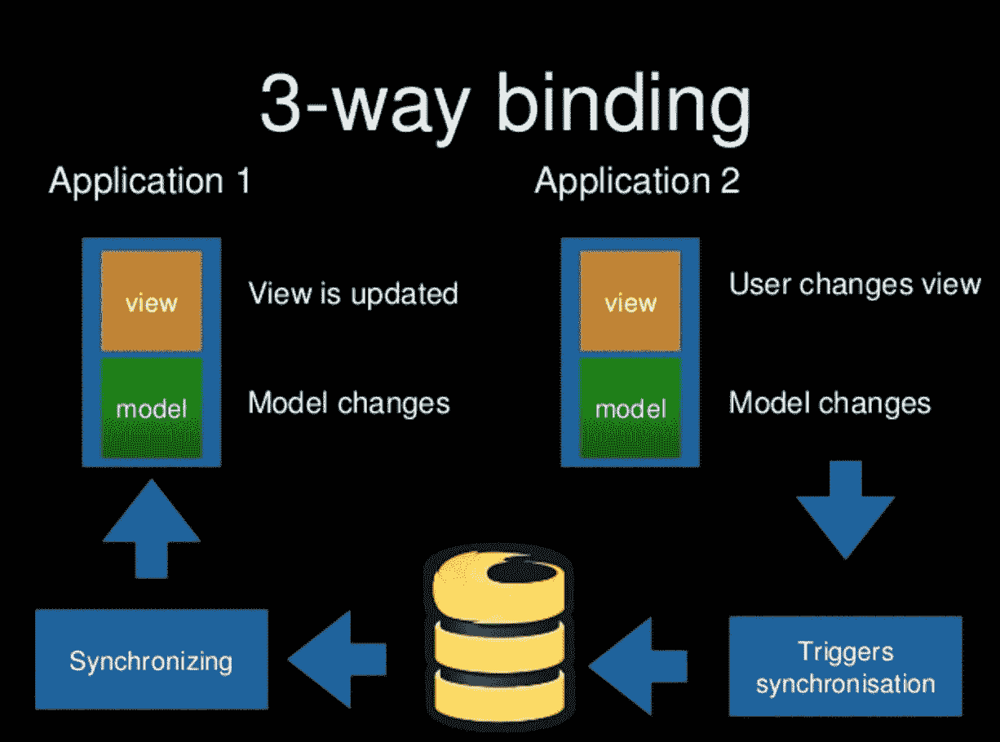
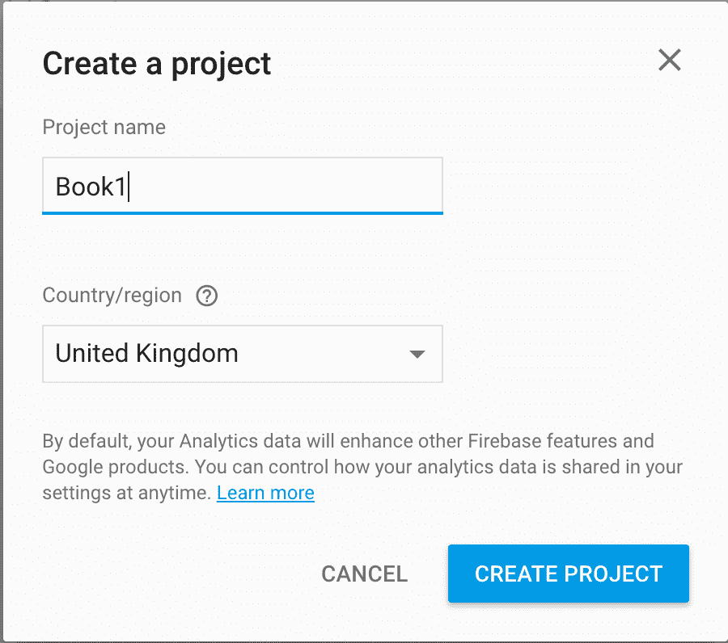
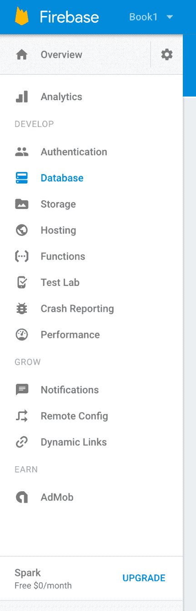
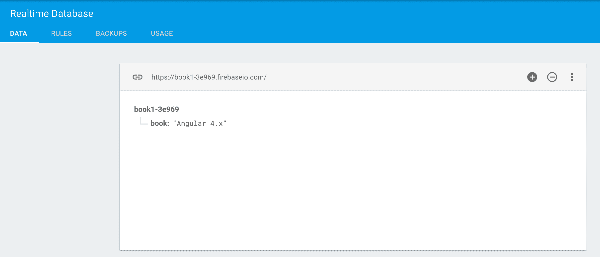
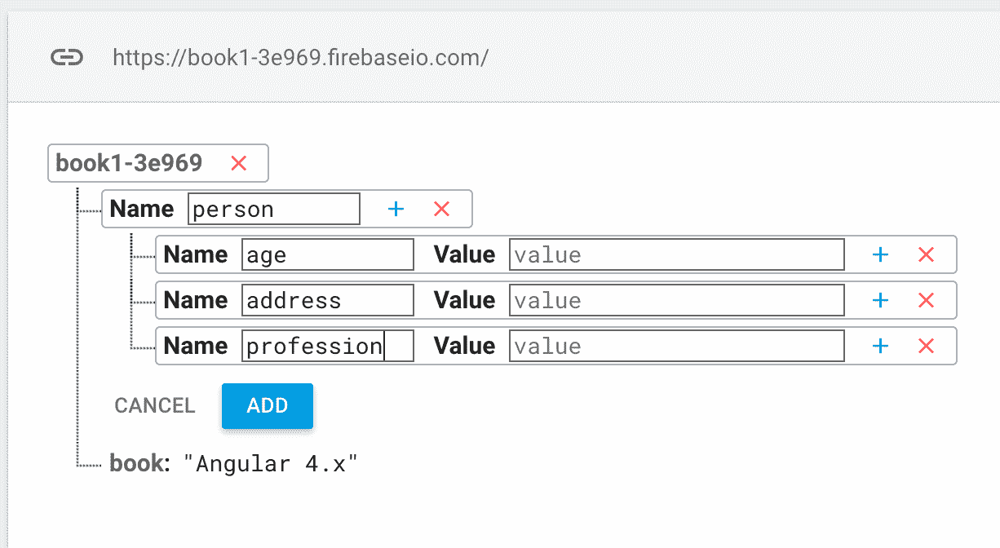
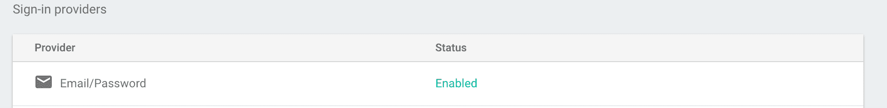
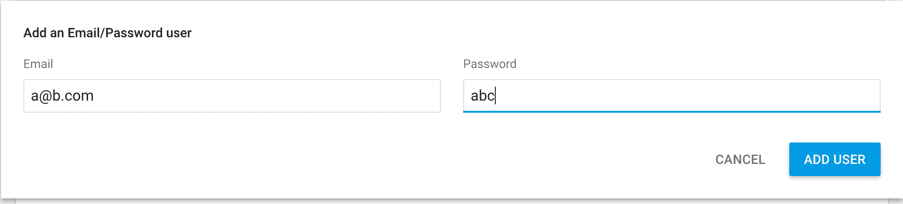
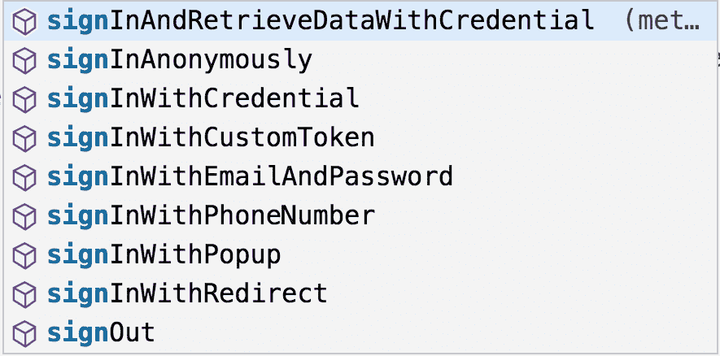
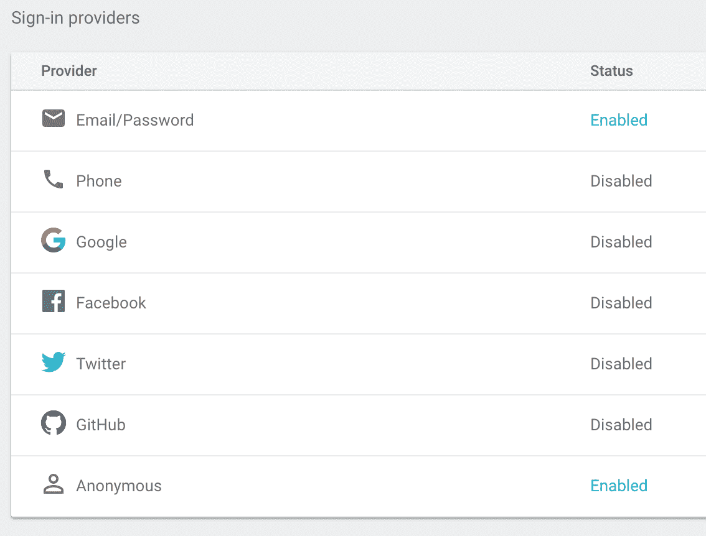

# 第八章：Firebase

Firebase 是一个移动和 Web 应用平台，最初由 Firebase Inc.在 2011 年开发，2014 年被 Google 收购。从那时起，它已经从云中的响应式数据库发展成了一个完整的产品套件。然而，我们将专注于数据库方面的事情，因为这对于 Angular 开发人员来说是有趣的部分。所以，最好的方式是将 Firebase 视为后端作为服务。这意味着使用 Firebase，没有理由构建自己的 REST 服务；你只需要连接到它。

值得指出的是，它最终是一个有付费计划的产品，但绝对可以在不支付任何费用的情况下创建玩具项目。

好的，后端作为服务，知道了。然而，它真正的卖点在于它是响应式的。它是响应式的，意味着如果你订阅了数据库上的一个集合，而客户端在某处对该集合进行了更改，你将收到通知并可以相应地采取行动。这听起来熟悉吗？是的，你想对了：它听起来像 RxJS 和 Observables，这就是为什么 Firebase API 已经被封装在了称为 AngularFire2 的 RXJS 中，这是一个你可以轻松从`npm`安装并添加到你的项目中的 Angular 模块。

因此，使用 Firebase 的商业案例首先是当你想要创建协作应用程序时。我要大胆地说，这就像是 Web 套接字，但在云中并且有一个底层数据库，所以不仅有通信部分，还有数据部分。

在这一章中，你将学到：

+   Firebase 是什么

+   在你的 Angular 应用中利用 AngularFire2

+   如何监听并对变化做出反应

+   如何使用 CRUD 操作来操作你的 Firebase 数据

+   为什么处理身份验证和授权很重要以及如何设置它们

# 三向绑定与双向绑定

我们有不同类型的绑定。AngularJS 使双向绑定变得著名。这意味着能够从两个不同的方向改变数据：

+   视图中的变化会改变控制器上的数据

+   控制器上的变化会反映在视图中

至于三向绑定，我们是什么意思？让我们通过一个应用来说明这一点；最好通过一张图片来描述。



你需要在这里想象的是，我们开发了一个使用 Firebase 的应用程序。我们在两个不同的浏览器窗口中启动了该应用程序。在第一个窗口中，我们进行了一项更改，这一更改在第二个浏览器窗口中得到了反映，例如，向列表中添加一个项目。那么，会发生什么步骤呢？

我们在这里看到的最好是从右到左阅读：

+   实例一：用户更改视图

+   实例一：更改传播到模型

+   这会触发与 Firebase 数据库实例的同步

+   第二个实例正在监听同步

+   第二个实例的模型正在更新

+   第二个实例的视图正在更新

你看到了：在一个地方进行更改，在两个或更多实例中看到结果，取决于你生成了多少实例。

# 关于存储的一些话-列表的问题

在深入了解 Firebase 之前，让我们首先解释为什么我们首先谈论列表。在关系数据库中，我们将使用 SQL、表和标准形式来定义我们的数据库。这在 Firebase 数据库中并不适用，因为它由 JSON 结构组成，看起来像这样：

```ts
{
 "person": { "age": 11, "name": "Charlie", "address": "First Street, Little Town" },
 "orders": { "someKeyHash": { "orderDate": "2010-01-01", "total": 114 },
 "someOtherKeyHash": { "orderDate": "2010-02-28" }
}
```

请注意，在关系数据库中，订单集合将是一个`orders`表，有很多行。在这里，它似乎是一个对象；为什么呢？

# 列表中的对象-解决删除问题

列表通常与列表中的每个项目关联一个索引，如下所示：

+   0：项目 1

+   1：项目 2

+   2：项目 3

这没有问题，直到你开始考虑当许多同时用户开始访问相同的数据时会发生什么。只要我们进行读取，就没有问题。但是如果我们尝试其他操作，比如删除，会发生什么呢？

通常情况下，当你删除东西时，索引会被重新分配。如果我们删除前面的`item2`，我们将得到一个新的情况，看起来像这样：

+   0：项目 1

+   1：项目 3

想象我们根据索引进行删除，你的数据看起来像这样：

+   0：项目 1

+   1：项目 2

+   2：项目 3

+   3：项目 4

现在，两个不同的用户可以访问这些数据，其中一个想要删除索引 1，另一个想要删除索引 3。我们可能会采用一个锁定算法，所以一个用户在几毫秒之前删除了索引 1，而另一个用户删除了索引 3。第一个用户的意图是删除`item2`，第二个用户的意图是删除`item4`。第一个用户成功地完成了他们的目标，但第二个用户删除了一个超出范围的索引。

这意味着在多用户数据库中删除索引上的东西是疯狂的，但在 Firebase 的情况下，这意味着当它们被存储时，列表不是列表；它们是对象，看起来像这样：

```ts
{
 212sdsd: 'item 1',
 565hghh: 'item 2'
 // etc
}
```

这避免了删除问题，因此是列表以其方式表示的原因。

# AngularFire2

AngularFire2 是将 Firebase API 封装在 Observables 中的库的名称。这意味着我们可以在想要监听更改等情况时，对它可能的外观有一些预期。我们将在本章的后面部分回到更改场景。

官方存储库可以在以下链接找到：

[`github.com/angular/angularfire2`](https://github.com/angular/angularfire2)

如何进行 CRUD 和处理身份验证的出色文档可以在上述链接的页面底部找到。

# 核心类

在深入研究 AngularFire2 之前，了解一些基本信息是很有必要的；这些信息涉及核心对象及其职责：

+   `AngularFireAuth`

+   `FirebaseObjectObservable`

+   `FirebaseListObservable`

`AngularFireAuth`处理身份验证。`FirebaseObjectObservable`是您想要与之交谈的核心对象，当您知道您处理的数据库属性是对象类型时。最后，`FirebaseListObservable`是一个类似列表的对象。从前面我们知道 Firebase 列表并不真正是列表，但这并不妨碍该对象具有列表通常具有的方法。

# 管理工具

管理工具可以在[`firebase.google.com/`](https://firebase.google.com/)找到。一旦进入，点击右上角的 GO TO CONSOLE 链接。您应该有一个 Gmail 帐户。如果有的话，那么您也有一个 Firebase 帐户，您只需要设置数据库。然后，您应该选择创建一个项目；给它一个您选择的标题和您的位置。

它应该是这样的：

>

完成这些步骤后，您将被带到管理页面，它看起来像这样：



上述屏幕截图显示了左侧菜单，然后右侧是内容窗格。右侧显示的内容根据您在左侧选择的内容而变化。正如您所看到的，您可以控制很多东西。在开始创建数据库时，您最重要的选项是：

+   **身份验证**：在这里，您设置想要的身份验证类型：无身份验证、用户名/密码、社交登录等。

+   **数据库**：在这里，您设计数据库应该是什么样子。这里还有一些选项卡，让我们控制数据库集合的授权。

其他选项也很有趣，但对于本节的目的来说，这超出了我们的范围。

# 定义您的数据库

我们转到左侧的数据库菜单选项。在下面的截图中，我已经向根节点添加了一个节点，即 book 节点：



在我们的根元素上悬停，我们会看到一个+字符，允许我们向根节点添加一个子节点。当然，我们也可以通过单击特定元素并向其添加子节点来创建更复杂的对象，看起来像这样：



正如您所看到的，我们可以很容易地构建出我们的数据库，它具有类似 JSON 的外观。

# 将 AngularFire2 添加到您的应用程序

到了将 Firebase 支持添加到我们的 Angular 应用程序的时候。为了做到这一点，我们需要做以下事情：

1.  下载 AngularFire2 的`npm`库。

1.  将该库导入到我们的 Angular 应用程序中。

1.  设置我们的 Firebase 配置，以便 Firebase 让我们检索数据。

1.  注入适当的 Firebase 服务，以便我们可以访问数据。

1.  在一个组件中呈现数据。

链接[`github.com/angular/angularfire2/blob/master/docs/install-and-setup.md`](https://github.com/angular/angularfire2/blob/master/docs/install-and-setup.md)是在您的 Angular 应用程序中设置 Firebase 的官方链接。这可能会随时间而改变，因此如果在更新 AngularFire2 库后，书中的说明似乎不再起作用，可以值得检查此页面。不过，让我们按照步骤进行。

下载 AngularFire2 库就像输入这样简单：

```ts
npm install angularfire2 firebase --save
```

下一步是从 Firebase 管理页面获取配置数据，并将其保存到配置对象中。返回管理页面。通过按下以下按钮，您可以转到配置的正确页面：

+   概述

+   将 Firebase 添加到您的 Web 应用程序

此时，您已经有了一个对象形式的配置，具有以下属性：

```ts
let config =  { apiKey:  "<your api key>", authDomain:  "<your auth domain>", databaseURL:  "<your database url>", projectId:  "<your project id>", storageBucket:  "<your storage bucket>", messagingSenderId:  "<your messaging senderid>"  };
```

先前的值取决于您的项目。我只能建议您从管理页面复制配置，以进行下一步。

下一步是使用`@angular-cli`搭建一个 Angular 应用程序，并查找`app.module.ts`文件。在其中，我们将把我们的配置分配给以下变量：

```ts
export  const  environment  = {
 firebase: { apiKey:  "<your api key>", authDomain:  "<your auth domain>", databaseURL:  "<your database url>", projectId:  "<your project id>", storageBucket:  "<your storage bucket>", messagingSenderId:  "<your messaging sender id>"  } }
```

现在我们需要指示模块导入我们需要的模块。基本上，有三个模块可以导入：

+   `AngularFireModule`：这用于初始化应用程序

+   `AngularFireDatabaseModule`：这用于访问数据库；这是必要的导入

+   `AngularFireAuthModule`：这用于处理身份验证；一开始不是必要的，但随着应用程序的增长，它肯定会变得必要 - 安全性问题？

让我们导入前两个，这样我们就可以使用 Firebase 并从中提取一些数据：

```ts
import { AngularFireModule } from  'angularfire2'; import { AngularFireDatabaseModule } from  'angularfire2/database'; @NgModule({
 imports: [
 AngularFireModule.initializeApp(environment.firebase),
 AngularFireDatabaseModule
 ]
})
```

在这一点上，我们已经完成了配置 Angular 模块，可以继续进行`AppComponent`，这是我们将注入 Firebase 服务的地方，这样我们最终可以从 Firebase 中提取一些数据：

```ts
@Component({
 template : `to be defined`
})
export class AppComponent {
 constructor(private angularFireDatabase: AngularFireDatabase) {
 this.angularFireDatabase
 .object('/book')
 .valueChanges()
 .subscribe(data => {
 console.log('our book', data);
 });
 }
}
```

就是这样：一个完整的 Firebase 设置，从下载 AngularFire2 到显示您的第一个数据。

# 保护我们的应用程序

保护我们的应用程序至关重要。这不是一个如果，这是一个必须，除非您正在构建一个玩具应用程序。目前在 Firebase 中有三种方法可以做到这一点：

+   身份验证：这是我们验证用户输入正确凭据以登录应用程序的地方

+   授权：这是我们设置用户有权访问/修改应用程序中哪些资源的地方

+   验证：这是我们确保只有有效数据被持久化在数据库中的地方

# 身份验证 - 允许访问应用程序

身份验证意味着当您尝试登录时我们识别您。如果您的凭据与数据库中的用户匹配，那么应用程序应该让您进入；否则，您将被拒之门外。Firebase 有不同的身份验证方式。目前，以下身份验证方法是可能的：

+   电子邮件/密码

+   电话

+   谷歌

+   Facebook

+   Twitter

+   GitHub

+   匿名

这基本上是您在 2017 年所期望的：从简单的电子邮件/密码身份验证到 OAuth 的一切。

# 授权 - 决定谁有权访问哪些数据，以及如何访问

至于授权，可以设置规则：

+   在整个数据库上

+   每个集合

同样重要的是要知道规则是通过以下方式执行的：

+   **原子地**：适用于特定元素

+   **级联**：适用于特定元素及其所有子元素

权限级别要么是：

+   **读取**：这将使读取资源的内容成为可能

+   **写入**：这将使您能够修改资源

+   **拒绝**：这将阻止对目标资源的任何写入或读取操作

这需要一个例子。想象一下，您有以下数据库结构：

```ts
foo {
 bar: {
 child: 'value'
 }
}
```

原子授权意味着我们需要明确；如果我们不明确，那么默认情况下是拒绝访问。让我们试着对前面的结构强制执行一些规则。我们转到数据库菜单选项下的规则部分。规则被定义为一个 JSON 对象，如下所示：

```ts
rules: {
 "foo": {
 "bar": {
 ".read": true,
 ".write": false,
 "child": {} 
 }
 }
}
```

这意味着我们已经为`bar`设置了一个明确的原子规则，并且该规则被其子元素继承，也就是说，它以级联方式起作用。另一方面，`foo`没有规则。如果尝试访问这些集合，这将产生以下后果：

```ts
// deny
this.angularFireDatabase.object('/foo');
// read allowed, write not allowed
this.angularFireDatabase.object('/foo/bar'); 
// read allowed, write not allowed
this.angularFireDatabase.object('/foo/bar/child');
```

这解释了现行规则的类型。我敦促您通过研究以下链接来深入了解这个主题：

+   一般情况下保护您的数据：[`firebase.google.com/docs/database/security/securing-data`](https://firebase.google.com/docs/database/security/securing-data)

+   为每个用户保护数据，即为不同类型的用户设置不同的权限级别：[`firebase.google.com/docs/database/security/user-security`](https://firebase.google.com/docs/database/security/user-security)

# 验证

这是一个非常有趣的话题。这里所指的是，我们可以通过设置关于数据形状的规则来控制允许进入我们集合的数据。您基本上指定了数据必须具备的一组要求，以便插入或更新被认为是可以执行的。就像读/写授权规则一样，我们指定一个规则对象。让我们描述两种不同版本的验证，这样你就能掌握它：

+   传入数据必须包括这些字段

+   传入数据必须在此范围内

我们可以这样描述第一种情况：

```ts
{
 "rules": {
 "order": {
 "name": {},
 "quantity"
 }
 }
}
```

这是一个代码片段，展示了前面的规则生效时的影响：

```ts
// will fail as 'quantity' is a must have field
angularFireDatabase.object('/order').set({ name : 'some name' });
```

在第二种情况下，我们可以这样设置规则：

```ts
{
 "rules": {
 "order": {
 "quantity": {
 ".validate": "newData.isNumber() && newData.val() >=0 
 && newData.val() <= 100" 
 }
 }
 }
}
```

前面指定的规则规定，任何传入的数据必须是数字类型，必须大于或等于`0`，并且小于或等于`100`。

这是一个代码片段，展示了这个规则的影响：

```ts
// fails validation
angularFireDatabase.object('order').set({ quantity : 101 })
```

正如你所看到的，这使得我们非常容易保护我们的数据免受不必要的输入，从而保持数据库的整洁和一致。

# 处理数据 - CRUD

现在，我们来到了令人兴奋的部分：如何处理数据，读取我们的数据，添加更多数据等等。简而言之，术语**创建，读取，更新，删除**（**CRUD**）。

因此，当我们使用 CRUD 时，我们需要了解我们正在操作的结构的一些信息。我们需要知道它是对象还是列表类型。在代码方面，这意味着以下内容：

```ts
this.angularFireDatabase.object(path).<operation>
this.angularFireDatabase.list(path).<operation>
```

前面说到，我们可以将我们从数据库中查看的数据视为对象或列表。根据我们的选择，这将影响我们可以使用的方法，也会影响返回的数据样式。如果数据库中有类似列表的结构，并选择将其视为对象，这一点尤其明显。假设我们有以下存储结构：

```ts
{
 id1: { value : 1 },
 id2: { value : 2 }
}
```

如果我们选择将其视为列表，我们将得到以下响应：

```ts
[{
 $key: id1,
 value : 1
},
{
 $key: id2,
 value : 2
}]
```

这意味着我们可以使用`push()`等方法向其中添加内容。

如果我们选择将数据视为一个对象，那么它将返回如下内容：

```ts
{
 id1: { value : 1 },
 id2: { value : 2 }
}
```

这可能是你想要的，也可能不是。因此请记住，如果它是一个列表，就把它当作一个列表。如果你选择`.object()`而不是`.list()`，Firebase 不会因此对你进行惩罚，但这可能会使数据更难处理。

# 读取数据

让我们看看读取的情况。以下代码将从数据库中的属性读取数据：

```ts
let stream$ = this.angulatFireDatabase.object('/book').valueChanges();
```

由于它是一个流，这意味着我们可以通过两种方式之一获取数据：

+   使用 async 管道，在模板中显示可观察对象本身

+   从`subscribe()`方法中获取数据并将其分配给类的属性。

如果我们进行第一种情况，代码将如下所示：

```ts
@Component({
 template: ` <div  *ngIf="$book | async; let book;">
 {{ ( book | async )?.title }}
 </div>
 `
})
export  class  Component { book$:  Observable<Book>; constructor(private  angularFireDatabase:  AngularFireDatabase) { this.book$  =  this.angularFireDatabase
 .object('/book')
 .valueChanges()
 .map(this.mapBook); }
 private  mapBook(obj):  Book { return  new  Book(obj); }
}

class  Book { constructor(title:  string) { } }
```

值得强调的是我们如何请求数据库中的路径，并使用`.map()`操作符转换结果：

```ts
this.book = this.angularFireDatabase
 .object('/book')
 .map(this.mapBook);
```

在模板中，我们使用 async 管道和一个表达式来显示我们的`Book`实体的标题，当它已经解析时：

```ts
<div *ngIf="book$ | async; let book">
 {{ book.title }}
</div>
```

如果我们进行第二种情况，代码将如下所示：

```ts
@Component({
 template: `
 <div>
 {{ book.title }}
 </div>
 `
})
export class BookComponent 
{
 book:Book;

 constructor(private angularFireDatabase: AngularFireDatabase) {
 this.angularFireDatabase.object('/book')
 .map(mapBook).subscribe( data => this.book = data );
 }

 mapBook(obj): Book {
 return new Book(obj);
 }
}

class Book {
 constructor(title:string) {} 
}
```

这将减少一些输入，但现在你必须记住取消订阅你的流；这在之前的例子中没有添加。在可能的情况下，请使用 async 管道。

# 更改数据

有两种类型的数据更改可能发生：

+   **破坏性更新**：我们覆盖了原有的内容

+   **非破坏性更新**：我们将传入的数据与已有的数据合并

用于破坏性更新的方法称为`set()`，使用方式如下：

```ts
this.angularFireDatabase.object('/book').set({ title : 'Moby Dick' })
```

考虑到我们之前的数据如下：

```ts
{
 title: 'The grapes of wrath',
 description: 'bla bla'
}
```

现在，它已经变成了：

```ts
{
 title: 'Moby Dick'
}
```

这正是我们所说的破坏性更新：我们覆盖了`title`属性，但我们也失去了`description`属性，因为整个对象被替换了。

如果数据的破坏不是您想要的，那么您可以使用更轻的`update()`方法。使用它就像写下面这样简单：

```ts
this.angularFireDatabase.object('/book').update({ publishingYear : 1931 })
```

假设在`update()`操作之前，数据看起来像下面这样：

```ts
{
 title: 'Grapes of wrath',
 description: 'Tom Joad and his family are forced from the farm'
} 
```

现在看起来像这样：

```ts
{
 title : 'Grapes of wrath',
 description : 'Tom Joad and his family are forced from the farm...',
 publishingYear : 1931
}
```

记住根据您的意图选择适当的更新操作，因为这会有所不同。

# 删除数据

删除数据很简单。我们需要将其分成两个不同的部分，因为它们有些不同，一个是删除对象，一个是删除列表中的项目。

在 Firebase 中，有不同的订阅数据的方式。您可以使用称为`valueChanges()`的方法订阅更改。这将为您提供要显示的数据。只要您想要显示数据，那么使用此方法就可以了。但是，当您开始想要更改特定数据，比如从列表中删除项目，或者简而言之，当您需要知道您要操作的资源的确切键值时，那么您需要一个新的函数。这个函数被称为`snapshotChanges()`。使用该函数会给您一个更原始的资源版本。在这种情况下，您需要挖掘出要显示的值。

让我们从第一种情况开始，即删除一个对象。

# 删除对象

让我们看看两种不同的`remove()`场景。在第一种情况下，我们想要删除我们的路径指向的内容。想象一下我们正在查看路径/书。那么，我们的删除代码非常简单：

```ts
this.angularFireDatabase.list('/books').remove();
```

# 删除列表中的项目

在 Firebase 中，从 Firebase 控制台查看数据库时，列表看起来像这样：

```ts
books {
 0 : 'tomato',
 1: 'cucumber' 
}
```

当然，每个项目都有一个内部表示，指向具有哈希值的键。我们有以下情景；我们想要删除列表中的第一项。我们编写的代码看起来像这样：

```ts
this.angularFireDatabase.list('/books').remove(<key>)
```

现在我们发现我们不知道要删除的项目的键是什么。这就是我们开始使用`snapshotChanges()`方法并尝试找出这一点的地方：

```ts
this.angularFireDatabase
 .list('/books')
 .snapshotChanges()
 .subscribe( list => {
 console.log('list',list);
 })
```

列表参数是一个列表，但列表项是一个包含我们需要的键以及我们打算在 UI 中显示的值的复杂对象。我们意识到这是正确的方法，并决定在我们的流上使用`map()`函数将其转换为书籍列表。

首先，我们修改我们的`book.model.ts`文件，包含一个 key 属性，就像这样：

```ts
export class Book {
 title: string;
  key: string;
 constructor(json) {
    this.title = json.payload.val();
 this.key = json.key; 
 }
}
```

我们可以看到，我们需要改变如何访问数据；我们的数据可以在`payload.val()`下找到，而我们的`key`很容易检索到。有了这个知识，我们现在可以构建一个列表：

```ts
@Component({})
export class BookComponent {
 books$:Observable<Book[]>

 constructor(private angularFireDatabase:AngularFireDatabase){
 this.books$ = this.angularFireDatabase
 .list('/books')
 .snapshotChanges()
 .map(this.mapBooks);
 }

 private mapBooks(data): Book[] {
 return data.map(json => new Book(json));
 }

 remove(key) {
 this,books$.remove(key);
 }
```

在以下代码片段中，我们循环遍历列表中的所有书籍，并为列表中的每本书创建一个删除按钮。我们还将每个删除按钮连接到`book.key`，也就是我们的`key`，这是我们在向 Firebase 通信删除操作时需要的。

```ts
<div *ngFor="let book of books | async">
 {{ book.title }}
 <button (click)="remove(book.key)">Remove</button>
</div>
```

# 响应变化

Firebase 的云数据库不仅仅是一个看起来像 JSON 的数据库，它还在数据发生变化时推送数据。您可以监听这种变化。这不仅为您提供了云存储，还为您提供了以更协作和实时的方式构建应用程序的机会。许多系统已经像这样工作，例如大多数售票系统、聊天应用程序等。

想象一下，使用 Firebase 构建的系统，例如，预订电影票。您可以看到一个人何时预订了一张票，或者在聊天系统中收到了一条消息，而无需轮询逻辑或刷新应用程序；构建起来几乎是小菜一碟。

AngularFire2，即 Firebase 上的 Angular 框架，使用 Observables。Observables 在发生变化时传达这些变化。从之前的知识中，我们知道可以通过给 subscribe 方法一个回调来监听这些变化，就像这样：

```ts
this.angularFireDatabase
 .list('/tickets')
 .valueChanges()
 .subscribe(tickets => {
 // this is our new ticket list
 });
```

作为开发人员，您可以拦截这种变化发生时，通过注册`subscribe()`方法，例如，显示 CSS 动画以吸引用户对变化做出响应，以便他们可以相应地做出响应。

# 添加身份验证

除非我们至少有一些适当的身份验证，否则我们无法真正构建一个应用程序并称其为发布准备就绪。基本上，我们不能信任任何人使用我们的数据，只有经过身份验证的用户。在 Firebase 中，您可以为数据库设置最高级别的身份验证。在管理工具中点击数据库菜单选项卡，然后选择规则选项卡。应该显示如下内容：

```ts
{
 "rules": {
 ".read": "auth != null",
 ".write": "auth != null"
 }
}
```

让我们来强调以下行：

```ts
".read": "auth != null"
```

在这种情况下，这设置了你整个数据库的读取权限，并且我们给了它值`auth != null`。这意味着你需要认证才能有任何读取数据库的权限。你可以看到在下一行我们有相同的值，但这次是针对一个叫做`.write`的规则，它控制着写入权限。

这是一个很好的默认权限。当然，在测试数据库时，你可能想要将值`auth == null`来关闭认证，但记得将值设置回`auth != null`，否则你会让你的数据库完全开放。

设置任何类型的认证意味着我们需要执行一些步骤，即：

+   确保规则是开启的，也就是`auth != null`

+   启用安全方法

+   添加用户或令牌（如果是 OAuth）

+   在应用中使用`AuthService`来以编程方式登录用户

# 使用邮箱/密码进行简单认证

让我们设置一个简单的用户/密码认证。点击认证菜单选项，然后选择登录方法选项卡。然后，启用邮箱/密码选项。它应该看起来像这样：



在这一点上，我们需要添加一个用户，一个被允许访问我们数据的用户。所以，让我们设置这个用户。我们去到用户选项卡，然后点击“添加用户”按钮。它应该看起来像这样：



好的，现在我们有一个邮箱为`a@b.com`，密码为`abc123`的用户。我们仍然需要登录这样一个用户，数据库才会显示数据给我们。如果我们不登录，我们的应用看起来会非常空，没有任何数据。我们还会在控制台日志中得到很多错误，说我们没有权限查看数据。

在之前设置 Firebase 时，我们只设置了数据库本身，而没有设置认证部分。由于 Firebase 是一个 Angular 模块，我们需要遵循一些规则：

+   导入模块并将其添加到`@NgModule`的`import`关键字中

+   将`AngularFireAuth`服务放入`@NgModule`中的`providers`关键字中，这样组件就能够将其注入到其构造函数中

+   执行一个编程登录

模块方面的事情看起来像下面这样：

```ts
import { AngularFireAuthModule, 
 AngularFireAuth } from  'angularfire2/auth'; @NgModule({
 imports: [
 AngularFireAuthModule
 ],
 providers: [AngularFireAuth]
})
```

现在，我们准备将服务注入到组件中并执行登录：

```ts
import { AngularFireDatabase } from 'angularfire2/database';
import { AngularFireAuth } from 'anguarfire2/auth';

@Component({
 template : `
 <div *ngFor="let b of books$ | async">
 {{ b.title }} {{ b.author }}
 </div>
 <div *ngIf="book$ | async; let book">
 {{ book.title }} {{ book.author }}
 </div>
 `
})
export class BookComponent {
 user;
 book$: Observable<Book>;
 books$: Observable<Book[]>;

 constructor(
 private authService: AngularFireAuth,
 private angularFireDatabase: AngularFireDatabase
 ) {
 this.user  = this.authService.authState;
 this.authService.auth
 .signInWithEmailAndPassword('a@b.com','abc123'**)**
 .then(success  => { this.book  =  this.angularFireDatabase .object('/book')
 .valueChanges().map(this.mapBook); this.books  =  this.angularFireDatabase
 .list('/books')
 .valueChanges()
 .map(this.mapBooks); }, 
 err  => console.log(err)
 );
 }
}
```

在这里，我们做了两件有趣的事情。

首先，我们将`authService`的`authState`分配给一个用户。这是一个 Observable，一旦登录，将包含你的用户。我们现在已经学会了可以使用 async 管道显示 Observables。然而，我们有兴趣从这个用户中获取两件事，`uid`和`email`，这样我们就可以看到我们以正确的用户身份登录了。编写模板代码看起来像这样是很诱人的：

```ts
<div *ngIf="user | async; let user">
 User : {{ user.uid }} {{ user.email }}
</div>
```

这为我们创建了一个名为 user 的变量，我们可以在登录后引用它。正如预期的那样，一旦登录，这将为我们打印出用户。

现在，我们来看看我们之前的代码的第二部分，登录调用：

```ts
authService
.auth .signInWithEmailAndPassword('a@b.com','abc123')
.then(success  => { this.book  = this.angularFireDatabase.object('/book')
 .map(this.mapBook); this.books$  = this.angularFireDatabase.list('/books')
 .map(this.mapBooks);
 }, 
 err  =>  console.log(err)
)
```

在这里，我们与`authService`的`auth`属性交谈，并调用`signInWithEmailAndPassword(email, password)`方法。我们传递凭据。该方法返回一个 promise，解决了这个 promise 后，我们设置了我们的属性`book`和`books`。如果我们不这样做，首先进行身份验证，我们将会得到很多“访问不允许”的错误。

这里有更多的`signInWith...`方法，如下所示：



我们敦促你亲自尝试一下。

至于认证方式，我们只是触及了表面。以下是完整的登录方法范围：



尝试一下，看看哪些对你和你的应用程序有用。

# 总结

Firebase 是一种强大的技术，本质上是云端的后端；它具有响应式 API。AngularFire2 是包装 Firebase 的库的名称。该库专门用于与 Angular 一起使用。

可以监听来自 Firebase 的更改。AngularFire2 通过 RxJS 和 Observables 传达这些更改，这使得我们很容易将 Firebase 纳入我们的应用程序中，一旦我们掌握了使用 HTTP 的 Observables 的基础知识。

希望这是一个有教育意义的章节，进一步激励你选择在 Angular 中使用 RxJS 作为异步操作的首选。

本章是关于独立产品 Firebase 的。重点是要展示在你的指尖上有一种非常强大的技术，它扩展了你对 RxJS 的新知识。

在下一章中，我们将涵盖构建 Angular 应用程序的一个非常重要的方面，即路由。路由是一个核心概念，它允许我们将应用程序分成几个逻辑页面。我们谈论逻辑页面而不是实际页面，因为我们正在构建单页面应用程序（SPA）。你会问什么是区别？路由组件，你将在下一章中了解更多信息，将帮助你定义可以路由到的组件，以及帮助你定义应用程序中可以切换的视口。把你的应用程序想象成一个通行证或者一个框架。在应用程序的框架内，你可以定义诸如顶部菜单或左侧菜单之类的东西，但中间的绘画是你的应用程序中可以切换的部分。我们称之为可替换部分的页面。
