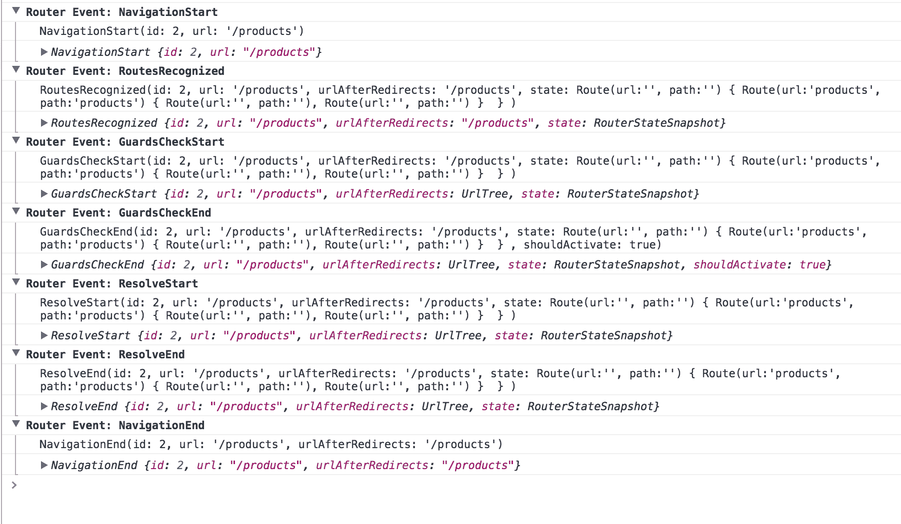
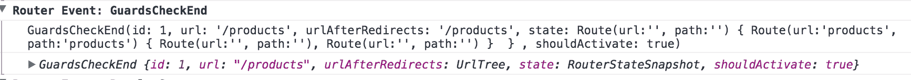
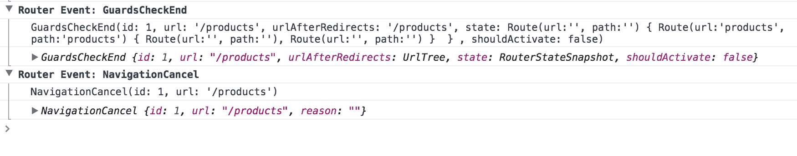
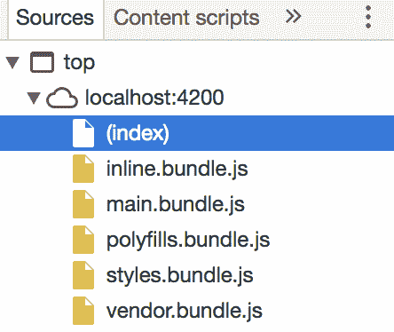
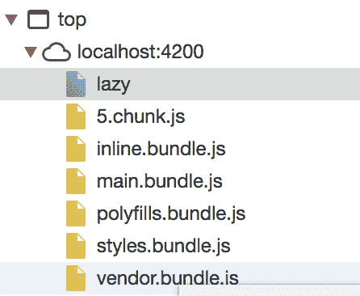
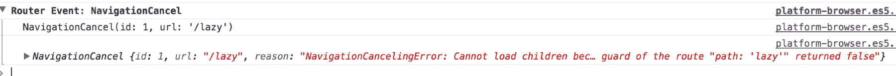

# 第九章：路由

在之前的章节中，我们在应用程序中分离关注点并添加不同的抽象层，以增加应用程序的可维护性做得很好。然而，我们忽视了视觉方面，以及用户体验部分。

此刻，我们的用户界面中充斥着组件和各种东西，散布在单个屏幕上，我们需要提供更好的导航体验和一种直观地改变应用程序状态的逻辑方式。

这是路由变得特别重要的时刻，它给了我们建立应用程序导航叙事的机会，允许我们将不同的兴趣领域分割成不同的页面，这些页面通过一系列链接和 URL 相互连接。

然而，我们的应用程序只是一组组件，那么我们如何在它们之间部署导航方案呢？Angular 路由器是以组件化为目标而构建的。我们将看到如何创建自定义链接，并在接下来的页面中让组件对其做出反应。

在本章中，我们将：

+   了解如何定义路由以在组件之间切换，并将它们重定向到其他路由

+   根据请求的路由触发路由并在我们的视图中加载组件

+   处理和传递不同类型的参数

+   深入了解更高级的路由

+   查看不同的保护路由的方式

+   揭示如何通过查看不同的异步策略来改善响应时间

# 为 Angular 路由器添加支持

在应用程序中使用路由意味着您希望在导航中在不同主题之间进行切换。通常会使用顶部菜单或左侧菜单，并点击链接以到达目的地。这会导致浏览器中的 URL 发生变化。在**单页应用程序**（**SPA**）中，这不会导致页面重新加载。要设置 Angular 路由器非常容易，但我们需要一些准备工作才能被认为已经设置好：

+   在`index.html`中指定基本元素

+   导入`RouterModule`并告知根模块

+   设置路由字典

+   确定应用程序视口的放置位置，即确定内容应放置在页面的哪个位置

+   如果您想要调查诸如路由或查询参数之类的事情，或者如果您需要以编程方式将用户路由到应用程序中的另一页，则与路由服务进行交互。

# 指定基本元素

我们需要告诉 Angular 我们想要使用的基本路径，这样它才能在用户浏览网站时正确构建和识别 URL，正如我们将在下一节中看到的那样。我们的第一个任务将是在`<HEAD>`元素内插入一个基本`href`语句。在`<head>`标签内的代码语句的末尾添加以下代码行：

```ts
//index.html

<base href="/">
```

基础标签告诉浏览器在尝试加载外部资源（如媒体或 CSS 文件）时应该遵循的路径，一旦它深入到 URL 层次结构中。

# 导入和设置路由模块

现在，我们可以开始玩转路由库中存在的所有好东西。首先，我们需要导入`RouterModule`，我们在应用程序的根模块中执行此操作。因此，我们打开一个名为`app.module.ts`的文件，并在文件顶部插入以下行：

```ts
import { RouterModule } from  '@angular/router';
```

一旦我们这样做了，就该将`RouterModule`添加为`AppModule`类的依赖项了。

`RouterModule`是一个有点不同的模块；它需要在添加为依赖模块的同时进行初始化。它看起来像这样：

```ts
@NgModule({
 imports: [RouterModule.forRoot(routes, <optional config>)]
})
```

我们可以看到这里指向了我们尚未定义的变量路由。

# 定义路由

`routes`是一个路由条目列表，指定了应用程序中存在哪些路由以及哪些组件应该响应特定路由。它可以看起来像这样：

```ts
let routes = [{
 path: 'products',
 component: ProductsComponent 
}, {
 path: '**',
 component: PageNotFound 
}]
```

路由列表中的每个项目都是一个带有多个属性的对象。最重要的两个属性是`path`和`component`。path 属性是路由路径，注意，您应该指定不带前导`/`的路径值。因此，将其设置为`products`，与前面的代码一样，意味着我们定义了用户导航到`/products`时会发生什么。`component`属性指向应该响应此路由的组件。指出的组件、模板和数据是用户在导航到该路由时将看到的内容。

第一个指定的路由定义了路径`/products`，最后一个路由项指定了`**`，这意味着它匹配任何路径。顺序很重要。如果我们首先定义了路由项`**`，那么`products`将永远不会被命中。最后定义`**`的原因是，我们希望有一个路由来处理用户输入未知路由的情况。现在，我们可以向用户展示一个由`PageNotFound`组件模板定义的漂亮页面，而不是向用户显示空白页面。

您可以在路由项上定义更多属性，也可以设置更复杂的路由。现在这就够了，这样我们就可以对路由设置有一个基本的理解。

# 定义一个视口

一旦我们走到这一步，就是定义一个视口，路由内容应该在其中呈现。通常，我们会构建一个应用程序，其中一部分内容是静态的，另一部分可以被切换，就像这样：

```ts
//app.component.html

<body>
 <!- header content ->
 <!- router content ->
 <!- footer content ->
</body>
```

在这一点上，我们涉及`router-outlet`元素。这是一个告诉路由器这是你应该呈现内容的元素。更新您的`app.component.html`看起来像这样：

```ts
<body>
 <!- header content ->
 <router-outlet> </router-outlet>
 <!- footer content ->
</body>
```

现在我们已经导入并初始化了`router`模块。我们还为两个路由定义了一个路由列表，并且已经定义了路由内容应该呈现的位置。这就是我们建立路由器的最小设置所需的一切。在下一节中，我们将看一个更现实的例子，并进一步扩展我们对路由模块的了解以及它可以帮助我们的知识。

# 构建一个实际的例子-设置路由服务

让我们描述一下问题领域。在本书的过程中，我们一直在处理番茄钟会话的上下文中的`任务`。到目前为止，我们一直在一个大的可视堆中创建所有需要的组件和其他构造。从用户的角度来看，更自然的方法是想象我们有专门的视图可以在之间导航。以下是用户的选择：

+   用户到达我们的应用程序并检查待办任务的当前列表。用户可以安排任务按顺序完成，以获得下一个番茄钟会话所需的时间估计。

+   如果需要，用户可以跳转到另一个页面并查看创建任务表单（我们将创建表单，但直到下一章才实现其编辑功能）。

+   用户可以随时选择任何任务并开始完成它所需的番茄钟会话。

+   用户可以在已经访问过的页面之间来回移动。

让我们看看前面的用户交互，并翻译一下这意味着我们应该支持哪些不同的视图：

+   需要有一个列出所有任务的页面

+   应该有一个包含创建任务表单的页面

+   最后，应该有一种方法在页面之间来回导航

# 为演示目的构建一个新组件

到目前为止，我们已经构建了两个明确定义的组件，我们可以利用它们来提供多页面导航。但为了提供更好的用户体验，我们可能需要第三个。我们现在将介绍表单组件，我们将在第十章中更详细地探讨，作为我们示例中更多导航选项的一种方式。

我们将在任务特性文件夹中创建一个组件，预期在下一章中使用该表单来发布新任务。在每个位置指出的位置创建以下文件：

```ts
// app/tasks/task-editor.component.ts file

import { Component } from '@angular/core';

@Component({
 selector: 'tasks-editor',
 templateUrl: 'app/tasks/task-editor.component.html'
})
export default class TaskEditorComponent {
 constructor() {}
}

// app/tasks/task-editor.component.html file

<form class="container">
 <h3>Task Editor:</h3>
 <div class="form-group">
 <input type="text"
 class="form-control"
 placeholder="Task name"
 required>
 </div>
 <div class="form-group">
 <input type="Date"
 class="form-control"
 required>
 </div>
 <div class="form-group">
 <input type="number"
 class="form-control"
 placeholder="Points required"
 min="1"
 max="4"
 required>
 </div>
 <div class="form-group">
 <input type="checkbox" name="queued">
 <label for="queued"> this task by default?</label>
 </div>
 <p>
 <input type="submit" class="btn btn-success" value="Save">
 <a href="/" class="btn btn-danger">Cancel</a>
 </p>
</form>
```

这是组件的最基本定义。我们需要从我们的特性模块中公开这个新组件。最后，我们需要在路由列表中为这个组件输入路由项并配置路由。在`app/tasks/task.module.ts`文件中添加以下代码片段：

```ts
import { TasksComponent } from './tasks.component';
import { TaskEditorComponent } from './task.editor.component';
import { TaskTooltipDirective } from './task.tooltip.directive';

@NgModule({
 declarations: [
 TasksComponent,
 TaskEditorComponent,
 TaskTooltipDirective
 ],
 exports: [
 TasksComponent,
 TaskEditorComponent,
 TaskTooltipDirective
 ]
})
export class TaskModule{}
```

现在是时候配置路由了。我们需要分两步完成：

+   创建包含我们路由的模块`routes.ts`

+   在根模块中设置路由

首要任务是定义路由：

```ts
// app/routes.ts file

[{
 path: '',
 component : HomeComponent
 },{ 
 path: 'tasks',
 name: 'TasksComponent',
 component: TasksComponent
 }, {
 path: 'tasks/editor',
 name: 'TaskEditorComponent',
 component: TaskEditorComponent
 }, {
 path: 'timer',
 name: 'TimerComponent',
 component: TimerComponent
 }
]
```

第二个任务是初始化路由。我们在根模块中完成这个任务。要初始化路由，我们需要调用`RouteModule`及其静态方法`forRoot`，并将路由列表作为参数提供给它：

```ts
// app/app.module.ts file

import { RouterModule } from '@angular/router';
import routes from './routes';

@NgModule({
 ...
 imports: [RouterModule.forRoot(routes)]
 ...
})
```

# 清理路由

到目前为止，我们已经设置了路由，使它们按照应该的方式工作。然而，这种方法并不那么容易扩展。随着应用程序的增长，将会有越来越多的路由添加到`routes.ts`文件中。就像我们将组件和其他结构移动到它们各自的特性目录中一样，我们也应该将路由移动到它们应该属于的地方。到目前为止，我们的路由列表包括一个属于计时器特性的路由项，两个属于任务特性的路由项，以及一个指向默认路由`/`的路由项。

我们的清理工作将包括：

+   为每个特性目录创建一个专用的`routes.ts`文件

+   在每个具有路由的特性模块中调用`RouteModule.forChild`

+   从任何不严格适用于整个应用程序的根模块中删除路由，例如`** = route not found`

这意味着应用程序结构现在看起来像以下内容：

```ts
/timer
 timer.module.ts
 timer.component.ts
 routes.ts
/app
 app.module.ts
 app.component.ts
 routes.ts
/task
 task.module.ts
 task.component.ts
 routes.ts
 ...
```

创建了一些文件后，我们准备初始化我们的功能路由。基本上，对于`/timer/routes.ts`和`/task/routes.ts`，初始化是相同的。因此，让我们看一下`routes.ts`文件和预期的更改：

```ts
import routes from './routes';

@NgModule({
 imports: [
 RouteModule.forChild(routes)
 ]
})
export class FeatureModule {}
```

这里的重点是，将路由从`app/routes.ts`移动到`<feature>/routes.ts`意味着我们在各自的模块文件中设置路由，即`<feature>/<feature>.module.ts`。此外，当设置功能路由时，我们调用`RouteModule.forChild`，而不是`RouteModule.forRoot`。

# 路由指令 - RouterOutlet、RouterLink 和 RouterLinkActive

我们已经在*为 Angular 路由添加支持*部分提到，为了设置路由，有一些基本的必要步骤使路由工作。让我们回顾一下它们是什么：

+   定义路由列表

+   初始化`Route`模块

+   添加视口

对于这个实际示例的目的和目的，我们已经完成了前两项，剩下的是添加视口。一个指令处理 Angular 的视口；它被称为`RouterOutlet`，只需要放置在设置路由的组件模板中。因此，通过打开`app.component.html`并添加`<router-outlet></router-outlet>`，我们解决了列表上的最后一个项目。

当然，路由还有很多内容。一个有趣的事情，这是每个路由器都期望的，就是能够在定义的路由给定的情况下生成可点击的链接。`routerLink`指令为我们处理这个，并且以以下方式使用：

```ts
<a  routerLink="/"  routerLinkActive="active">Home</a>
```

`routerLink`指向路由路径，注意前导斜杠。这将查找我们的路由列表中定义的与路由路径`/`对应的路由项。经过对我们的代码的一些调查，我们找到了一个看起来像下面这样的路由项：

```ts
[{
 path : '',
 component : HomeComponent
}]
```

特别注意在定义路由时，我们不应该有前导斜杠，但是在使用该路由项创建链接并使用`routerLink`指令时，我们应该有一个尾随斜杠。

这产生了以下元素：

```ts
<a _ngcontent-c0="" routerlink="/" routerlinkactive="active" ng-reflect-router-link="/" ng-reflect-router-link-active="active" href="/" class="active">Home</a>
```

看起来很有趣，关键是`href`设置为`/`，类已设置为 active。

最后一部分很有趣，为什么类会被设置为活动状态？这就是`routerLinkActive="active"`为我们做的。它调查当前路由是否与我们当前所在的`routerLink`元素相对应。如果是，它将被授予活动 CSS 类。考虑以下标记：

```ts
<a  routerLink="/"  routerLinkActive="active" >Home</a> <a  routerLink="/tasks"routerLinkActive="active" >Tasks</a>
<a routerLink="/timer"routerLinkActive="active" >Timer</a> 
```

只有一个元素会被设置为活动类。如果浏览器的 URL 指向`/tasks`，那么它将是第二项，而不是第一项。添加活动类的事实给了你作为开发者的机会，可以为活动菜单元素设置样式，因为我们正在创建一个链接列表，就像前面的代码所定义的那样。

# 命令式地触发路由

导航的方式不仅仅是点击具有`routerLink`指令的元素。我们也可以通过代码或命令式地处理导航。为此，我们需要注入一个具有导航能力的导航服务。

让我们将导航服务，也称为`Router`，注入到一个组件中：

```ts
@Component({
 template : `
 <Button (click)="goToTimer()">Go to timer</Button>
 `
})
export class Component {
 constructor(private router:Router) {}

 goToTimer() {
 this.router.navigate(['/timer']);
 }
}
```

如你所见，我们设置了一个`goToTimer`方法，并将其与按钮的点击事件关联起来。在这个方法中，我们调用了`router.navigate()`，它接受一个数组。数组中的第一项是我们的路由；请注意末尾斜杠的使用。这就是命令式导航的简单方式。

# 处理参数

到目前为止，我们在路由中配置了相当基本的路径，但是如果我们想要构建支持在运行时创建参数或值的动态路径呢？创建（和导航到）从我们的数据存储中加载特定项目的 URL 是我们每天需要处理的常见操作。例如，我们可能需要提供主细节浏览功能，因此主页面中的每个生成的 URL 都包含在用户到达细节页面时加载每个项目所需的标识符。

我们基本上在这里解决了一个双重问题：在运行时创建具有动态参数的 URL，并解析这些参数的值。没问题；Angular 路由已经帮我们解决了这个问题，我们将通过一个真实的例子来看看。

# 构建详细页面 - 使用路由参数

首先，让我们回到任务列表组件模板。我们有一个路由，可以带我们到任务列表，但是如果我们想要查看特定的任务，或者想要将任务显示在特定的页面上呢？我们可以通过以下方式轻松解决：

1.  更新任务组件，为每个项目添加导航功能，让我们能够导航到任务详细视图。

1.  为一个任务设置路由，其 URL 路径将是`tasks/:id`。

1.  创建一个`TaskDetail`组件，只显示一个任务。

让我们从第一个要点开始：更新`tasks.component.ts`。

应该说的是，我们可以用两种方式解决这个问题：

+   进行命令式导航

+   使用`routerLink`构建一个带有参数的路由

让我们先尝试展示如何进行命令式导航：

```ts
// app/tasks/tasks.component.html file

@Component({ selector:  'tasks', template: ` <div*ngFor="let task of store | async">
 {{ task.name }}
 <button (click)="navigate(task)">Go to detail</button>
 </div>  `
})
export class TasksComponent {
 constructor(private router: Router) {}

 navigate(task:Task) {
 this.router.navigate(['/tasks',task.id]);
 }
}
```

让我们强调以下代码片段：

```ts
this.router.navigate(['/tasks',task.id]);
```

这将产生一个看起来像`/tasks/13`或`/tasks/99`的链接。在这种情况下，`13`和`99`只是编造的数字，用来展示路由路径可能是什么样子的。

导航的第二种方式是使用`routerLink`指令。为了实现这一点，我们的前面的模板将略有不同：

```ts
<div*ngFor="let task of store | async">
 {{ task.name }}
 <a [routerLink]="['/tasks/',task.id]">Go to detail</a>
</div>
```

这两种方式都可以，只需选择最适合你的方式。

现在对于列表中的第二项，即设置路由，这将匹配先前描述的路由路径。我们打开`task/routes.ts`并向列表中添加以下条目：

```ts
[
 ...
 {
 path : '/tasks/:id',
 component : TaskDetailComponent
 }
 ...
]
```

有了这个路由，我们列表中的最后一项需要修复，即定义`TaskDetailComponent`。让我们从一个简单版本开始：

```ts
import { Component } from  '@angular/core'; @Component({
  selector:  'task-detail', template: 'task detail' })
export  class  TaskDetailComponent {  }
```

有了这一切，我们能够点击列表中的任务并导航到`TaskDetailComponent`。然而，我们在这里并不满意。这样做的真正原因是为了更详细地查找任务。因此，我们在`TaskDetail`组件中缺少一个数据调用到我们的`TaskService`，在那里我们要求只获取一个任务。记得我们到`TaskDetail`的路由是`/tasks/:id`吗？为了正确调用我们的`TaskService`，我们需要从路由中提取出 ID 参数，并在调用我们的`TaskService`时使用它作为参数。如果我们路由到`/tasks/13`，我们需要使用`getTask(13)`调用`TaskService`，并期望得到一个`Task`。

因此，我们有两件事要做：

1.  从路由中提取出路由参数 ID。

1.  在`TaskService`中添加一个`getTask(taskId)`方法。

为了成功完成第一个任务，我们可以注入一个叫做`ActivatedRoute`的东西，并与它的`params`属性交谈，这是一个 Observable。来自该 Observable 的数据是一个对象，其中一个属性是我们的路由参数：

```ts
this.route .params  .subscribe( params  => {
 let id = params['id'];  });  
```

好吧，这只解决了问题的一半。我们能够以这种方式提取出 ID 参数的值，但我们并没有对它做任何处理。我们也应该进行数据获取。

如果我们添加`switchMap`语句，那么我们可以获取数据，进行数据调用，并返回数据的结果，如下所示：

```ts
@Component({
 template: `
 <div *ngIf="(task$ | async) as task">
 {{ task.name }}
 </div>
 `
})
export class TaskDetailComponent implements OnInit {
 task$:Observable<Task>;

 constructor(private route:ActivatedRoute) {}

 ngOnInit() {
 this.task$ = this.route .params
 .switchMap( params => 
 this.taskService.getTask(+params['id'])
 )
 }
}
```

最后一步是向`TaskService`添加`getTask`方法：

```ts
export class TaskService{
 ...
 getTask(id): Observable<Task> {
 return this.http.get(`/tasks/${id}`).map(mapTask);
 }
}
```

# 过滤您的数据-使用查询参数

到目前为止，我们一直在处理`tasks/:id`格式的路由参数。像这样形成的链接告诉我们上下文是任务，并且要到达特定任务，我们需要指定其编号。这是关于缩小到我们感兴趣的特定数据的。查询参数有不同的作用，它们旨在对数据进行排序或缩小数据集的大小：

```ts
// for sorting
/tasks/114?sortOrder=ascending

// for narrowing down the data set
/tasks/114?page=3&pageSize=10
```

查询参数被识别为`?`字符之后发生的一切，并且由`&`符号分隔。要获取这些值，我们可以使用`ActivatedRoute`，就像我们处理路由参数一样，但是我们要查看`ActivatedRouter`实例上的不同集合：

```ts
constructor(private route: ActivatedRoute) {}

getData(){
 this.route.queryParamMap
 .switchMap( data  => { let  pageSize  =  data.get('pageSize'); let  page  =  data.get('page'); return  this._service.getTaskLimited(pageSize,page); })
```

# 高级功能

到目前为止，我们已经涵盖了基本的路由，包括路由参数和查询参数。不过，Angular 路由器非常强大，能够做更多的事情，比如：

+   定义子路由，每个组件都可以有自己的视口

+   相对导航

+   命名出口，同一个模板中可以有不同的视口

+   调试，您可以轻松启用调试，展示基于您的路由列表的路由工作方式

# 子路由

什么是子路由？子路由是一个概念，我们说一个路由有子路由。我们可以像这样为一个功能编写路由：

```ts
{
 path : 'products',
 component : ProductListComponent
},
{
 path : 'products/:id',
 component : ProductsDetail 
},
{
 path : 'products/:id/orders',
 component : ProductsDetailOrders
}
```

然而，如果我们想要有一个产品容器组件，并且在该组件中，我们想要显示产品列表或产品详细信息会发生什么？对于这种情况，我们希望以不同的方式分组我们的路由。我们已经明确表示`Product`容器是您应该路由到的父组件。因此，当转到路由`/products`时，它将是第一个响应者。让我们从设置`products`路由开始。它应该监听`/products` URL，并且有`ProductsContainerComponent`做出响应，如下所示：

```ts
{
 path: 'products',
 component : ProductsContainerComponent
}
```

我们的其他路由可以作为其子路由添加，如下所示：

```ts
{
 path: 'products',
 component : ProductsContainerComponent,
 children : [{
 path : '',
 component : ProductListComponent 
 }, {
 path: ':id',
 component : ProductDetailComponent
 }, {
 path : ':id/orders',
 component : ProductsDetailOrders
 }]
}
```

现在，从组织的角度来看，这可能更有意义，但在技术上有一些区别；`ProductsContainer`将需要有自己的`router-outlet`才能工作。因此，到目前为止，我们应用的快速概述如下：

```ts
/app . // contains router-outlet
 /products 
 ProductsContainerComponent // contains router outlet
 ProductListComponent
 ProductDetailComponent
 ProductsDetailOrders
```

这样做的主要原因是我们可以创建一个容器，为其提供一些页眉或页脚信息，并呈现可替换的内容，就像我们可以为应用程序组件的模板做的那样：

```ts
// ProductsContainerComponent template
<!-- header -->
<router-outlet></router-outlet>
<!-- footer -->
```

总之，容器方法的好处如下：

+   创建子路由意味着我们可以将功能着陆页视为页面视图或视口，因此我们可以定义诸如页眉、页脚和页面的一部分作为可以替换的内容

+   在定义路由路径时，我们需要写得更少，因为父路由已经被假定

# 绝对导航与相对导航

有两种导航方式：绝对路由和相对路由。绝对路由是从路由根目录指定其路由，例如`/products/2/orders`，而相对路由则知道其上下文。因此，相对路由可能看起来像`/orders`，因为它已经知道自己在`/products/2`，所以完整的路由将读作`/products/2/orders`。

您可能只使用绝对路径就可以了；但是使用相对路径也有好处：重构变得更容易。想象一下移动一堆组件，突然所有硬编码的路径都是错误的。您可能会认为您应该创建路由的类型化版本，例如`routes.ProductList`，这样您只需要在一个地方进行更改。这可能是这样，那么您就处于一个良好的状态。然而，如果您不采用这些工作方式，那么相对路由就适合您。因此，让我们看一个示例用法：

```ts
this.router.navigate(['../'], { relativeTo:  this.route });
```

在这里，我们向上走了一级。想象一下，我们在`/products`。这会把我们带回到`/`。这里的重要部分是包括第二个参数并指定`relativeTo: this.route`部分。

# 命名出口

如果您只是不断地添加它们，那么我们可以在组件模板中有多个出口指令。

```ts
<router-outlet></router-outlet>
<router-outlet></router-outlet>
<router-outlet></router-outlet>
<router-outlet></router-outlet>
```

我们将内容呈现出四次。这并不是我们添加多个出口的真正原因。我们添加多个`router-outlet`是为了能够给它们取不同的名称。然而，这样做的商业案例是什么呢？想象一下，我们想要显示一个页眉部分和一个正文部分；根据我们所在的路由部分不同，它们会有所不同。它可能看起来像这样：

```ts
<router-outlet name="header"></router-outlet>
<router-outlet name="body"></router-outlet>
```

现在，我们能够在路由时针对特定的`router-outlet`进行定位。那么我们该如何：

+   定义应该定位到特定命名出口的路由？

+   导航到命名出口？

+   清除命名的出口？

以下代码显示了我们如何设置路由：

```ts
{ path:  'tasks', component:  JedisShellComponent,
 children : [{
 path: '',
 component : JediHeaderComponent,
 outlet : 'header'
 },
 {
 path: '',
 component : JediComponent,
 outlet : 'body'
 }] }  
```

前面的代码显示了我们如何设置一个外壳页面，它被称为外壳，因为它充当了命名出口的外壳。这意味着我们的外壳组件看起来像这样：

```ts
static data
<router-outlet name="header"></router-outlet>
<router-outlet name="body"></router-outlet>
some static data after the outlet
```

我们还设置了两个子路由，分别指向一个命名的出口。想法是当我们路由到`/tasks`时，`TaskHeaderComponent`将被渲染到头部出口，`TaskComponent`将被渲染到主体出口。

还有一种完全不同的使用路由的方式，即作为弹出出口。这意味着我们可以将内容渲染到一个出口，然后再将其移走。为了实现这一点，我们需要设置路由如下：

```ts
{
 path : 'info',
 component : PopupComponent,
 outlet : 'popup'
}
```

这需要与一个命名的出口一起定义，就像这样：

```ts
<router-outlet name="popup"></router-outlet>
```

首先浏览到一个页面，这个`PopupComponent`将不可见，但我们可以通过设置一个方法来使其可见，比如这样：

```ts
@Component({
 template : `
 <button (click)="openPopup()"></button>
 `
})
export class SomeComponent {
 constructor(private router: Router) {}

 openPopup(){ this.router.navigate([{ outlets: { popup : 'info' }}]) }
}
```

这里有趣的部分是`router.navigate`的参数是`{ outlets : { <name-of-named-outlet> : <name-of-route> } }`。

通过这种语法，我们可以看到只要路由正确设置，就可以在其中渲染任何内容。所以，假设路由看起来像这样：

```ts
{
 path : 'info',
 component : PopupComponent,
 outlet : 'popup'
},
{
 path : 'error',
 component : ErrorComponent,
 outlet : 'popup'
}
```

现在，我们有两个可能被渲染到`popup`出口的候选者。要渲染错误组件，只需写入以下内容：

```ts
this.router.navigate([{ outlets: { popup : 'error' }])
```

还有一件事情我们需要解决，那就是如何移除命名出口的内容。为此，我们需要修改我们的组件如下：

```ts
@Component({
 template : `
 <button (click)="openPopup()"></button>
 `
})
export class SomeComponent {
 constructor(private router: Router) {}

 openPopup(){ this.router.navigate([{ outlets: { popup : 'info'} }]) }

 closePopup() { this.router.navigate([{ outlets: { popup: null }}]) }
}
```

我们添加了`closePopup()`方法，里面我们要做的是针对我们命名的`popup`出口并提供一个空参数，就像这样：

```ts
this.router.navigate([ outlets: { popup: null } ])
```

# 调试

为什么我们要调试路由？嗯，有时路由不会按我们的想法工作；在这种情况下，了解更多关于路由的行为和原因是很有帮助的。要启用调试，您需要提供一个启用调试的配置对象，就像这样：

```ts
RouterModule.forRoot(routes,{ enableTracing:  true  })
```

尝试从我们的起始页面路由到，比如，`/products`将会是这样：



我们可以看到这里触发了几个事件：

+   NavigationStart：导航开始时

+   RoutesRecognized：解析 URL 并识别 URL

+   路由配置加载开始：在读取延迟加载配置时触发

+   RouteConfigLoadEnd：路由已经延迟加载完成

+   GuardsCheckStart：评估路由守卫，也就是说，我们能否前往这个路由

+   GuardsCheckEnd：路由守卫检查完成

+   `ResolveStart`: 尝试在路由到路径之前获取我们需要的数据

+   `ResolveEnd`: 完成解析它所依赖的数据

+   `NavigationCancel`: 有人或某物取消了路由

+   `NavigationEnd`: 完成路由

有很多可能发生的事件。正如您从前面的图像中所看到的，我们的项目列表涵盖的事件比图像显示的更多。这是因为我们没有任何懒加载的模块，因此这些事件不会被触发，而且我们也没有设置任何解析守卫，例如。此外，`NavigationCancel`只有在某种原因导致路由失败时才会发生。了解触发了哪些事件以及何时触发是很重要的，这样您就会知道代码的哪一部分可能出错。我们将在下一节中仔细研究事件`GuardsCheckStart`和`GuardsCheckEnd`，以确定您是否有权限访问特定路由。

# 通过位置策略微调我们生成的 URL

正如您所见，每当浏览器通过`routerLink`的命令或通过`Router`对象的 navigate 方法的执行导航到一个路径时，显示在浏览器位置栏中的 URL 符合我们习惯看到的标准化 URL，但实际上是一个本地 URL。从不会向服务器发出调用。URL 显示自然结构的事实是由于 HTML5 历史 API 的`pushState`方法在幕后执行，并允许导航以透明的方式添加和修改浏览器历史记录。

有两个主要的提供者，都是从`LocationStrategy`类型继承而来，用于表示和解析浏览器 URL 中的状态：

+   `PathLocationStrategy`: 这是位置服务默认使用的策略，遵循 HTML5 `pushState`模式，产生没有哈希碎片的清晰 URL（`example.com/foo/bar/baz`）。

+   `HashLocationStrategy`: 此策略利用哈希片段来表示浏览器 URL 中的状态（`example.com/#foo/bar/baz`）。

无论`Location`服务默认选择的策略是什么，您都可以通过选择`HashLocationStrategy`作为首选的`LocationStrategy`类型，回退到基于旧的哈希导航。

为此，请转到`app.module.ts`并告诉路由器，从现在开始，每当注入器需要绑定到`LocationStrategy`类型以表示或解析状态（内部选择`PathLocationStrategy`），它应该不使用默认类型，而是使用`HashLocationStrategy`。

您只需要在`RouterModule.forRoot()`方法中提供第二个参数，并确保`useHash`设置为`true`：

```ts
....
@NgModule({
 imports : [
 RouterModule.forRoot(routes, { useHash : true })
 ]
})
```

# 使用 AuthGuard 和 CanActivate hook 来保护路由

我们可以使用`CanActivate`有两种方式：

+   限制需要登录的数据访问

+   限制需要具有正确角色的数据访问

因此，这实质上涉及潜在的身份验证和授权。我们需要做的是：

+   创建一个需要评估您是否有权限的服务

+   将该服务添加到路由定义中

这只是您创建的任何服务，但它需要实现`CanActivate`接口。所以，让我们创建它：

```ts
@Injectable()
export class AuthGuard implements CanActivate {
 constructor(private authService: AuthService){ }

  canActivate() {
 return this.authService.isAuthenticated();
 }
}
```

我们所做的是通过声明`canActivate()`方法来实现`CanActivate`接口。我们还注入了一个我们假装存在的`AuthService`实例。关键是`canActivate()`方法应该在导航应该继续时返回`true`，在应该停止时返回`false`。

现在，下一步是将此服务添加到路由配置；我们通过添加到`canActivate`属性保存的列表来实现：

```ts
{
 path : 'products',
 component: ProductsShell,
  canActivate: [ AuthGuard ]
}
```

让我们尝试一下，看看如果我们从`canActivate()`方法返回`true`或`false`，我们的路由调试会发生什么变化：



在`GuardsCheckEnd`中，我们看到`shouldActivate: true`属性被发出。这是因为我们的`canActivate`方法当前返回`true`，也就是说，我们允许路由发生。

让我们看看如果我们将`canActivate`更改为返回`false`会发生什么：



在这里，我们可以看到在`GuardsCheckEnd`事件中，`shouldActivate`现在的值为`false`。我们还可以看到发出了`NavigationCancel`事件。最终结果是，基于`canActivate()`方法返回`false`，我们不被允许改变路由。现在轮到您实现一个真正的身份验证/授权方法并使其真正起作用。

# Resolve<T> - 在路由之前获取和解析数据

使用此钩子的原因是，我们可以延迟路由发生，直到我们获取了所有必要的数据。但是，您不应该有任何长时间运行的操作。更真实的情况是，您已经导航到了一个产品路由，比如`/products/114`，并且想要在数据库中查找该产品并将其提供给路由。

您需要以下内容来实现这一点：

+   实现`Resolve<T>`接口

+   从`resolve()`方法返回一个`Promise`

+   将服务设置为模块的提供者

+   在提供数据的路由的 resolve 属性中设置服务

让我们实现这个服务：

```ts
@Injectable()
export class ProductResolver implement Resolve<Product> {
 constructor(
 private http:Http, 
 private service: DataService,
 private router:Router
 ) {}

 resolve(route:  ActivatedRouteSnapshot) {
    let id = route.paramMap.get('id');
    return this.service.getProduct( id ).then( data => {
 if(data) { 
 return data; 
 }
 else { 
 this.router.navigate(['/products']); 
 }
 }, error => { this.router.navigate(['/errorPage']) });
 }
}

// product.service.ts
export class DataService {
 getProduct(id) {
 return http.get(`/products/${id}`)
 .map( r => r.json )
 .map(mapProduct)
 .toPromise()
 }
}
```

在这一点上，我们已经实现了`Resolve<T>`接口，并确保从`resolve()`方法返回一个`Promise`。我们还有一些逻辑，如果我们得到的数据不是我们期望的，或者发生错误，我们将重定向用户。

作为下一步，我们需要将服务添加到我们模块的`providers`关键字中：

```ts
@NgModule({
 ...
  providers: [ProductResolver]
 ...
})
```

对于最后一步，我们需要将服务添加到路由中：

```ts
{
 path: 'products/:id',
  resolve: [ProductResolver],
 component: ProductDetail
}
```

# CanDeactivate - 处理取消和保存

好的，我们有以下情况：用户在一个页面上，他们填写了很多数据，然后决定按下一个导航链接离开页面。在这一点上，作为开发者，你想建立以下内容：

+   如果用户填写了所有数据，他们应该继续导航

+   如果用户没有填写所有数据，他们应该有离开页面的选项，或者留下来继续填写数据

为了支持这些情景，我们需要做以下事情：

1.  创建一个实现`CanDeactivate`接口的服务。

1.  将目标组件注入到服务中。

1.  将该服务设置为模块的提供者。

1.  在路由中将服务设置为`canDeactivate`响应器。

1.  使目标组件可注入，并将其设置为模块的提供者。

1.  编写逻辑来处理所有字段都填写的情况 - 如果字段缺失，则保持路由，如果字段缺失，则显示一个确认消息，让用户决定是否继续路由或不继续。

从服务开始，它应该是这样的：

```ts
@Injectable()
export class CanDeactivateService implements CanDeactivate {
 constructor(private component: ProductDetailComponent) {}

 canDeactivate(): boolean | Promise<boolean> {
 if( component.allFieldsAreFilledIn() ) {
 return true;
 }

 return this.showConfirm('Are you sure you want to navigate away,
 you will loose data');
 }

 showConfirm() {
 return new Promise(resolve => resolve( confirm(message) ))
 }
}
```

值得强调的是，我们如何在`canDeactivate`方法中定义逻辑，使其返回类型要么是`Boolean`，要么是`Promise<boolean>`。这使我们有自由在所有有效字段都填写的情况下提前终止方法。如果没有，我们向用户显示一个确认消息，直到用户决定该做什么。

第二步是告诉模块关于这个服务：

```ts
@NgModule({
  providers: [CanDeactivateService]
})
```

现在，要改变路由：

```ts
{
 path : 'products/:id',
 component : ProductDetailComponent,
 canDeactivate : [ CanDeactivateService ]
}
```

接下来，我们要做一些我们通常不做的事情，即将组件设置为可注入的；这是必要的，这样它才能被注入到服务中：

```ts
@Component({})
@Injectable()
export class ProductDetailComponent {}
```

这意味着我们需要将组件作为模块中的提供者添加：

```ts
@NgModule({
 providers: [
 CanDeactivateService, ProductDetailComponent
 ]
})
```

# 异步路由 - 提高响应时间

最终，您的应用程序将会变得越来越庞大，您放入其中的数据量也会增长。这样做的结果是，应用程序在初始启动时需要很长时间，或者应用程序的某些部分需要很长时间才能启动。有一些方法可以解决这个问题，比如懒加载和预加载。

# 懒加载

懒加载意味着我们不会一开始就加载整个应用程序。我们的应用程序的部分可以被隔离成只有在需要时才加载的块。今天，这主要集中在路由上，这意味着如果您请求一个以前没有访问过的特定路由，那么该模块及其所有构造将被加载。这不是默认情况下存在的东西，但是您可以很容易地设置它。

让我们看看一个现有模块及其路由，看看我们如何将其变成一个懒加载模块。我们将不得不在以下地方进行更改：

+   我们特性模块的路由列表

+   在我们应用程序的路由中添加一个路由条目，使用特定的懒加载语法

+   删除其他模块中对特性模块的所有引用

首先，让我们快速查看一下我们特性模块在更改之前的路由列表：

```ts
// app/lazy/routes.ts
let routes = [{
 path : 'lazy',
 component : LazyComponent
}]

// app/lazy/lazy.module.ts
@NgModule({
 imports: [RouterModule.forChild(routes)]
})
export class LazyModule {}
```

我们的第一项任务是将第一个路由条目的路径从 lazy 更改为`''`，一个空字符串。听起来有点违反直觉，但有一个解释。

我们要做的第二件事是纠正第一件事；我们需要在我们的应用程序模块路由中添加一个懒加载路由条目，就像这样：

```ts
// app/routes.ts
let routes = [{
 path:  'lazy', loadChildren:  'app/lazy/lazy.module#LazyModule' }];
```

正如您所看到的，我们添加了`loadChildren`属性，该属性期望一个字符串作为值。这个字符串值应该指向模块的位置，因此它看起来像`<从根目录到模块的路径>#<模块类名>`。

最后一步是删除其他模块中对该模块的所有引用，原因很自然：如果您还没有导航到`/lazy`，那么服务或组件等实际上还不存在，因为它的捆绑包还没有加载到应用程序中。

最后，让我们看看这在调试模式下是什么样子。第一张图片将展示在我们导航到懒加载模块之前的样子：



在这里，我们有我们项目设置生成的正常捆绑包。现在让我们导航到我们的懒加载路由：



我们可以看到一个名为`5.chunk.js`的捆绑包已经被添加，它包含了我们新加载的模块及其所有构造。

不过，需要小心的是，不要在想要在其他地方使用的延迟加载模块中放置构造。相反，你可以让你的`lazy`模块依赖于其他模块中的服务和构造，只要它们不是延迟加载的。因此，一个很好的做法是尽可能多地将模块延迟加载，但共享功能不能延迟加载，出于上述原因。

# CanLoad - 除非用户有权限，否则不要延迟加载

延迟加载是一个很棒的功能，可以通过确保应用程序只启动绝对需要的捆绑包来大大减少加载时间。然而，即使你确保大多数模块都是延迟加载的，你需要更进一步，特别是如果你的应用程序有任何身份验证或授权机制。

考虑以下情况，假设你的多个模块需要用户进行身份验证或具有管理员角色。如果用户在这些区域不被允许，那么当用户路由到它们的路径时加载这些模块是没有意义的。为了解决这种情况，我们可以使用一个叫做`CanLoad`的守卫。`CanLoad`确保我们首先验证是否根据条件延迟加载某个模块是有意义的。你需要做以下事情来使用它：

1.  在服务中实现`CanLoad`接口和`canLoad()`方法。

1.  将前述服务添加到路由的`CanLoad`属性中。

以下创建了一个实现`CanLoad`接口的服务：

```ts
@Injectable()
export class CanLoadService implements CanLoad {
  canLoad(route: Route) {
 // replace this to check if user is authenticated/authorized
 return false;
 }
}
```

从代码中可以看出，`canLoad()`方法返回一个布尔值。在这种情况下，我们让它返回`false`，这意味着模块不会被加载。

我们需要做的第二件事是更新路由以使用这个服务作为`canLoad`守卫：

```ts
{
 path:  'lazy', loadChildren :  'app/lazy/lazy.module#LazyModule', canLoad: [CanLoadService**]** }  
```

如果我们尝试浏览到`localhost:4200/lazy`，我们无法前往，因为我们的`canLoad`通过返回`false`告诉我们不能。查看控制台，我们还看到以下内容：



在这里，它说由于守卫，无法加载子级，所以守卫起作用。

注意当你更新`CanLoadService`和`canLoad()`方法来返回`true`时，一切都像应该的那样正常加载。

不要忘记将`CanLoadService`添加到根模块的 providers 数组中。

# 预加载

到目前为止，我们一直在讨论急加载和懒加载。在这种情况下，急加载意味着我们一次性加载整个应用程序。懒加载是指我们将某些模块标识为只在需要时加载的模块，也就是说，它们是懒加载的。然而，在这两者之间还有一些东西：预加载模块。但是，为什么我们需要介于两者之间的东西呢？嗯，想象一下，我们可以非常肯定地知道，普通用户在登录后 30 秒内会想要访问产品模块。将产品模块标记为应该懒加载的模块是有道理的。如果它可以在登录后立即在后台加载，那么当用户导航到它时，它就已经准备好了。这正是预加载为我们做的事情。

我们通过发出以下命令来启用预加载：

```ts
@NgModule({
 imports: [
 RouterModule.forRoot(routes, {
      preloadingStrategy:  PreloadAllModules
 })
 ]
})
```

`PreloadAllModules`值预加载每个懒加载的路由，除了那些由`canLoad`守卫保护的路由。这是有道理的：`canLoad`只有在我们经过身份验证/授权或者基于我们设置的其他条件时才加载。

因此，如果我们有一堆模块都被设置为懒加载，比如产品、管理员、类别等等，所有这些模块都会根据`PreloadAllModules`在初始启动后立即加载。这在桌面上可能已经足够了。然而，如果你使用的是 3G 等移动连接，这可能会太重了。在这一点上，我们需要更好、更精细的控制。我们可以实现自己的自定义策略来做到这一点。我们需要做以下几件事来实现这一点：

1.  创建一个实现`PreloadingStrategy`和`preload`方法的服务。

1.  如果应该预加载，`preload()`方法必须调用`load()`方法，否则应该返回一个空的 Observable。

1.  通过在路由上使用数据属性或使用服务来定义路由是否应该预加载。

1.  将创建策略服务设置为`preloadingStrategy`的值。

首先，定义我们的服务，我们可以这样创建它：

```ts
@Injectable() export  class  PreloadingStrategyService  implements PreloadingStrategy {  preload(route:  Route, load: () =>  Observable<any>):  Observable<any> { if(route.data.preload) {
      **return** load**();** } else { return Observable.of(null**);** }
 }
}
```

我们可以看到，如果我们的`route.data`包含预加载布尔值，我们会调用 load 方法。

现在，为了正确设置路由：

```ts
{
 path:  'anotherlazy', loadChildren:  'app/anotherlazy/anotherlazy.module#AnotherLazyModule', data: { preload: true } }  
```

数据属性已设置为包含我们的`preload`属性的对象。

现在是最后一步。让我们让`RouterModule.forRoot()`意识到这个服务的存在：

```ts
@NgModule({
 imports: [
 RouterModule.forRoot(routes, {
      preloadingStrategy: PreloadingStrategyService 
 })
 ]
})
```

简而言之，这是一种非常有效的方式，可以确保用户在不陷入急切加载或等待懒加载的情况下获得最佳体验。

# 总结

我们现在已经揭示了 Angular 路由器的强大功能，希望您喜欢探索这个库的复杂性。在路由器模块中，绝对闪亮的一点是我们可以通过简单而强大的实现涵盖大量选项和场景。

我们已经学习了设置路由和处理不同类型参数的基础知识。我们还学习了更高级的功能，比如子路由。此外，我们还学习了如何保护我们的路由免受未经授权的访问。最后，我们展示了异步路由的全部功能，以及如何通过延迟加载和预加载来真正提高响应时间。

在下一章中，我们将加强我们的任务编辑组件，展示 Angular 中 Web 表单的基本原理以及使用表单控件获取用户输入的最佳策略。
