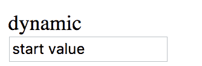

# 第十章：Angular 中的表单

使用表单通常是我们从网络收集数据的方式，以便稍后持久化。我们对表单体验有期望，比如：

+   轻松声明不同类型的输入字段

+   设置不同类型的验证并向用户显示任何验证错误

+   支持不同的策略来阻止提交，如果表单包含错误

处理表单有两种方法：模板驱动表单和响应式表单。没有一种方法被认为比另一种更好；你只需要选择最适合你情况的方法。两种方法之间的主要区别是谁负责什么：

+   在模板驱动的方法中，模板负责创建元素、表单，并设置验证规则，同步是通过双向数据绑定实现的

+   在响应式方法中，`Component`类负责创建表单、其元素，并设置验证。

在本章中，我们将：

+   了解模板驱动表单

+   绑定数据模型和表单和输入控件的接口类型

+   使用响应式表单方法设计表单

+   深入了解输入验证的替代方法

+   构建我们自己的自定义验证器

# 模板驱动表单

模板驱动表单是使用 Angular 设置表单的两种不同方式之一。这种方法完全是在模板中进行设置，非常类似于 AngularJS 中使用的方法。因此，如果您有 AngularJS 的背景，这种方法对您来说将非常熟悉。

# 将简单表单转换为模板驱动表单

我们定义了以下表单，包括一个`form`标签，两个`input`字段和一个`button`，如下所示：

```ts
<form>
 <input id="name" name="name" placeholder="first name" required>
 <input id="surname" name="surname" placeholder="surname" required>
 <button>Save</button>
</form>
```

在这里，我们明显有两个需要的`input`字段，因此`input`元素有`required`属性。我们还有一个保存按钮。我们对这样一个表单的要求是，在所有必填字段填写完毕之前，不应提交其数据。为了实现这一点，我们需要做两件事：

+   将输入字段的值保存到一个对象中，使用`[(ngModel)]`

+   只有在没有错误时才提交表单，使用`ngForm`指令

现在我们将表单更改为如下所示：

```ts
<form #formPerson="ngForm">
 <input [(ngModel)]="person.firstName"  id="name"  name="name"
  placeholder="first name"  required>
 <input [(ngModel)]="person.surname"  id="surname"  name="surname"
  placeholder="surname"  required>
 <button (click)="submit()" *ngIf="formPerson.form.valid">Save</button> </form>
```

让我们谈谈我们所做的更改。首先，我们有以下代码片段：

```ts
<form (ngSubmit)="save()" #formPerson="ngForm">
```

我们创建了一个名为`formPerson`的视图引用，其值为`ngForm`。这意味着我们有一个对表单的引用。表单视图引用现在包含了许多有趣的属性，这些属性将帮助我们确定表单是否准备好提交。

至于我们所做的第二个改变，我们将输入数据连接到了`ngModel`：

```ts
<input [(ngModel)]="person.name"  id="name"  name="name"
  placeholder="first name"  required>
```

`ngModel`允许我们对属性创建双向绑定。它被称为*香蕉在盒子里*，这实际上是一个记忆规则，让你能够记住如何输入它。我们分两步创建它。首先是`ngModel`，然后我们添加香蕉，括号，就像这样：`(ngModel)`。之后我们把香蕉放在盒子里。方括号将作为我们的盒子，这意味着我们最终有了`[(ngModel)]`。记住，它被称为*香蕉在盒子里*，而不是*盒子在香蕉里*。

在这里，我们通过使用`ngModel`指令，确保了输入的值被保存到`person.name`。

最后，我们使用`*ngIf`指令装饰了我们的按钮元素，就像这样：

```ts
<button *ngIf="formHero.form.valid">Save</button>
```

我们使用了`*ngIf`指令来隐藏按钮，如果表单被证明是无效的。正如你所看到的，我们正在利用我们的表单视图引用及其有效属性。如果表单有效，则显示按钮；否则，隐藏它。

这是设置模板驱动表单的基础知识。让我们通过查看一下来深入了解一下：

+   正在呈现的 CSS 是什么，这样我们就可以根据表单状态适当地进行呈现

+   如何检测输入元素上的特定错误

# 输入字段错误-从 CSS 的角度来看

根据输入元素所处的状态，会分配不同的 CSS 类。让我们看看一个具有必填属性的输入元素，在我们输入任何数据之前。我们期望它告诉我们有什么地方出错了，因为`input`字段为空，并且我们已经为其添加了`required`属性：

```ts
<input id="name" name="name" placeholder="first name" required ng-reflect-required ng-reflect-name="name" ng-reflect-model class="ng-untouched ng-pristine ng-invalid">
```

我们可以看到已设置以下类：

+   `ng-untouched`，这意味着还没有人尝试按提交按钮

+   `ng-pristine`，这基本上意味着尚未尝试向该字段输入数据。如果您输入一个字符并删除该字符，则它将被设置为`false`。

+   `ng-invalid`，这意味着验证器正在反应并指出有错误

在字段中输入一个字符，我们看到`ng-pristine`消失了。在两个字段中输入一些字符并点击提交，我们看到`ng-untouched`变成了`ng-touched`。这也导致`ng-invalid`变成了`ng-valid`。

好的，现在我们更好地了解了 CSS 在什么时候会变成什么样，并且可以适当地为我们的组件设置样式。

# 检测具有命名引用的输入字段上的错误

到目前为止，当我们想知道我们的表单是否有效时，我们一直在查看表单引用。我们可以做得更好，我们可以检测特定输入控件是否有错误。输入控件可能有多个验证器，这意味着我们可能有多个验证错误要显示。那么我们如何检测呢？要完成这个任务，需要采取一些步骤：

我们需要：

1.  为每个输入元素创建一个视图引用，并为其分配值`ngModel`。

1.  给每个元素添加一个`name`属性。

让我们更新我们的表单代码，并根据前面的步骤添加视图引用和`name`属性：

```ts
<form #formPerson="ngForm">
 <input #firstName="ngModel" [(ngModel)]="person.name"  id="name"
  name="name"  placeholder="first name"  required>
 <input #surName="ngModel" [(ngModel)]="person.surname"  id="surname"
  name="surname"  placeholder="surname"  required>
 <button *ngIf="formPerson.form.valid">Save</button> </form>
```

一旦我们完成了前期工作，就是时候谈谈我们可以检测到哪些错误了。感兴趣的错误有两种类型：

+   一般错误，即指示输入控件有问题，但不指定具体问题是什么

+   特定错误，将指示确切的错误类型，例如，值太短

让我们从一般错误开始：

```ts
<input #firstName="ngModel" [(ngModel)]="person.name"  id="name"
  name="name"  placeholder="first name"  required> {{ firstName.valid }} // an empty field sets this to false
```

我们使用我们的视图引用`firstName`并查询其 valid 属性，该属性指示是否存在错误。

现在来看看其他更详细的错误。要检测更详细的错误，我们使用视图引用上的 errors 对象，并使用 JSON 管道输出整个对象：

```ts
{{ firstName.errors | json }}  // outputs { required: true }
```

这意味着我们突然可以知道是否设置了特定错误，因此我们可以决定基于特定错误的存在来显示条件文本，就像这样：

```ts
<div *ngIf="firstName.errors && firstName.errors.required">
 First name is a required field
</div>
```

其他特定错误将填充 errors 对象，你需要做的唯一的事情就是知道错误的名称。如果有疑问，可以使用 JSON 管道输出 errors 对象，以找出特定验证器的验证错误名称以及相应的验证错误值。

# 改进表单

到目前为止，我们已经涵盖了了解表单何时出错以及如何根据特定错误显示文本的基本机制。让我们通过一些更多的例子来扩展这些知识。首先，我们将向我们的输入字段添加更多的验证类型：

```ts
<input minlength="3" required #name="ngModel" name="name">
{{ name.errors | json }}
```

现在我们已经将`minlength`添加为我们元素的验证规则，除了现有的 required 规则。Required 是优先错误，所以它会首先显示。如果我们输入一些字符，那么 required 错误就会消失。现在它应该显示以下内容：

```ts
{"minlength": { "requiredLength": 3, "actualLength": 1 } }
```

就像 required 错误一样，我们可以仅为此错误显示错误文本，如下所示：

```ts
<div *ngIf="name.errors && name.errors.minlength" >
 Name value is too short
</div>
```

已经为我们编写了一些验证规则：

+   `required`，要求值不能为空

+   `requiredTrue`，特别要求值为`true`

+   `minlength`，表示值需要具有一定的最小长度

+   `maxlength`，表示值不能超过一定长度

+   `pattern`，强制值遵循`RegEx`模式

+   `nullValidator`，检查值不为空

+   `compose`，如果您想将多个验证器组合成一个，验证规则是取所有提供的验证器的并集的结果

尝试看看这些是否符合您的情况。您可能会发现一些验证规则缺失。如果是这种情况，那么可以通过创建自定义验证器来解决。我们将在本章后面介绍如何构建自定义验证器规则。

# 在正确的时间显示错误

到目前为止，我们的表单在至少存在一个错误时不显示提交按钮。这里有一些替代方法。有时，当按钮不存在或显示为禁用时，可能会被认为 UI 出现了问题。这与您在其他地方构建 UI 的方式有关。一致的方法更好。因此，我们可以控制表单如何提交的不同方式。

以下是主要方法：

+   当表单中没有错误时显示提交按钮，我们已经知道如何做到这一点。这种方法可能看起来像我们忘记正确设计表单，因为当表单出现错误时，按钮似乎完全消失了。

+   在表单存在错误时禁用提交按钮。如果伴随着显示验证错误，这样做会很好，以避免任何误解为什么它被禁用。

+   只有当没有错误时才启用提交调用，这里的主要区别是提交按钮是可点击的，但提交操作不会发生。这个版本的缺点是让用户感觉好像什么都没有发生。这种方法需要配合显示阻止表单提交的验证错误。

这是你会编写第一种方法的方式。在这里，如果表单无效，我们会隐藏按钮：

```ts
<button *ngIf="form.valid">Save</button>
```

第二种方法涉及将按钮设置为禁用状态。我们可以通过绑定到`disabled`属性来实现：

```ts
<button [disabled]="form.valid">Save</button>
```

第三种和最后一种方法是创建一个布尔条件，需要返回`true`才能执行其他语句：

```ts
<button (ngSubmit)="form.valid && submit()">Save</button>
```

# 响应式表单

对于响应式表单，我们有一种程序化的方法来创建表单元素并设置验证。我们在`Component`类中设置所有内容，只需在模板中指出我们创建的结构。

在这种方法中涉及的关键类包括：

+   `FormGroup`，它是一个包含一到多个表单控件的分组

+   `FormControl`，表示一个输入元素

# AbstractControl

`FormGroup`和`FormControl`都继承自`AbstractControl`，其中包含许多有趣的属性，我们可以查看并根据某个状态以不同的方式渲染 UI。例如，您可能希望在从未与表单交互过和已经交互过的表单之间在 UI 上有所区别。还有可能想知道某个控件是否已经被交互过，以了解哪些值将成为更新的一部分。可以想象，有很多情况下了解特定状态是很有趣的。

以下列表包含所有可能的状态：

+   `controls`，一个通过构造函数`new FormGroup(group)`添加的`FormControl`实例列表。

+   `value`，表示键值对的字典。键是你在创建时给`FormControl`的引用，值是你在输入控件中输入的内容`{ :'<reference>', <value entered> }`。

+   `dirty`，一旦我们在表单中输入了内容，它就被认为是脏的。

+   `disabled`，表单可以被禁用。

+   `pristine`，一个没有任何控件被交互的表单。

+   `status`，一个表示它是否有效的字符串表示，如果无效则显示无效。

+   `touched`，提交按钮至少被按下一次。

+   `untouched`，提交按钮尚未被按下。

+   `启用`，布尔值，表示表单是否启用。

+   `有效`，如果没有错误，这个是`true`。

+   `无效`，与有效相反。

# 程序化和动态的方法

我们对事情的处理方式是程序化的，我们有两种可能的方法：

+   我们可以创建具有 N 个元素的表单。这意味着我们可以生成完全动态的表单，包括输入控件的种类和数量，以及应该使用的表单。一个典型的例子是创建一个内容管理系统，其中页面和它们的内容完全可以从配置文件或数据库中配置。

+   我们可以创建深层结构。通常我们有一个表单和其中的 N 个元素，但是响应式表单允许我们在表单中嵌套表单。

注意这里`FormGroup`被称为组而不是`Form`。这是因为你应该把它看作只是一种分组，而不一定是唯一的。你可以很容易地有这样的结构：

+   `人：FormGroup`

+   `姓名：FormControl`

+   `姓氏：FormControl`

+   `年龄：FormControl`

+   `地址：FormGroup`

+   `城市：FormControl`

+   `国家：FormControl`

这里我们有一个`Person`的表示，我们可以看到我们想要单独处理这个人的地址输入，因此有了这种层次结构。

# 将表单转换为动态表单

`FormGroup`是由许多表单控件组成的结构。要创建这样的结构，我们需要做以下事情：

1.  导入响应式`Forms`模块。

1.  通过代码实例化尽可能多的`FormControls`。

1.  将控件放在一个字典中。

1.  将字典分配为`FormGroup`的输入。

1.  将我们的`Form`组实例与`[formGroup]`指令关联。

1.  将每个`FormControl`实例与`[formControlName]`指令关联。

第一步是导入模块：

```ts
@NgModule({
 imports: [ReactiveFormsModule]
})
```

第二步是创建表单控件。让我们创建两个不同的控件，一个带有验证，一个没有：

```ts
const control = new FormControl('some value');
const control2 = new FormControl('other value', Validators.required);
```

第三步是为此创建一个字典：

```ts
const group = {};
group['ctrl1'] = control;
group['ctrl2'] = control2;
```

第四步是将组分配给`formGroup`实例：

```ts
const formGroup = new FormGroup(group);
```

你的完整代码应该看起来像这样：

```ts
import { FormControl, FormGroup } from  '@angular/forms'; import { Component, OnInit } from  '@angular/core'; 
@Component({
  selector:  'dynamic', template: ` dynamic
 <div  [formGroup]="form">
 dynamic <input  [formControl]="group['ctrl1']"  placeholder="name"> </div>`
})
export  class  DynamicComponent  implements  OnInit { form:FormGroup; group; constructor() { this.group  = {}; this.group['ctrl1'] =  new  FormControl('start value'); this.form  =  new  FormGroup(this.group); }

 ngOnInit() { } }  
```

你的表单 UI 应该看起来像这样。你可以看到，你的`起始值`被设置为输入控件：



# 添加带有验证规则的控件

让我们给一个表单控件添加一个验证器：

```ts
this.group['ctrl2'] = new FormControl('',Validators.required)
```

如果你调查一下这个新添加的表单的标记，你会发现它的 CSS 类确实被设置为`ng-invalid`，因为它的值为空。

接下来的紧要问题是，我如何引用单个元素，以便知道它们可能具有或不具有哪些错误？答案很简单，在您的表单成员下，类型为`FormGroup`，有一个包含控件的控件字典。其中一个这些控件就像模板表单中的视图引用一样工作：

```ts
ctrl2 valid {{ form.controls['ctrl2'].valid }} {{ form.controls['ctrl2'].errors  |  json }}
```

如前面的代码片段中所示，我们可以通过`form.controls['key']`引用单个控件。它具有 valid 和 errors 属性，因此我们可以显示单个错误，就像这样：

```ts
<div *ngIf="form.controls['ctrl2'].errors.required">This field is required</div>
```

# 重构 - 使代码更加动态

到目前为止，我们已经了解了`FormGroup`和`FormControl`以及相关指令的基本机制，但是我们的代码看起来非常静态，让我们来解决这个问题。我们需要有一种数据集，通过循环创建我们的`Form`控件：

```ts
this.questions  = [{ Question :  'What is Supermans real name', Key :  '1' },{
 Question :  'Who is Lukes father', Key :  '2' }];

this.questionGroup  = {}; this.questions.forEach( qa  => { this.questionGroup[qa.Key] =  new  FormControl('',Validators.required) });

this.dynamicForm  =  new  FormGroup( this.questionGroup );
```

现在来定义 UI。我们有一个问题列表，我们使用`*ngFor`来显示：

```ts
<form (ngSubmit)="submit()"  [formGroup]="dynamicForm"> <div  *ngFor="let q of questions"> {{ q.Question }} <input  [formControl]="questionGroup[q.Key]"  placeholder="fill in answer"> </div>
 <button>Save</button>
</form>
```

我们遍历问题数组，并为`[formControl]`指令分配适当的控件。从我们的问题实例中，我们还能够输出问题本身。这看起来更加动态。

现在我们只剩下一步，那就是访问用户实际填写的值：

```ts
submit() {
 console.log( this.dynamicForm.value ) // { "1" : "", "2" : "Darth" }
}
```

这给了我们一个控件引用的字典，以及用户在按下提交按钮时输入的任何值。

# 更新我们的组件表单模型 - 使用 setValue 和 patchValue

首先，让我们稍微回顾一下如何以编程方式创建表单。我们过去使用字典变量并将其传递给`FormGroup`构造函数，但我们也可以跳过该变量并在内联中定义字典，就像以下代码中一样：

```ts
const form = new FormGroup({
 name: new FormControl(''),
 surname: new FormControl(''),
 age: new FormControl 
})
```

要更改表单中的任何值，我们可以使用两种方法之一：

+   `setValue()`，它将替换所有值

+   `patchValue()`，它只会更新提到的控件

# setValue

使用此方法完全替换所有值。只要提到表单创建时的所有值，那么就没问题，就像这样：

```ts
form.setValue({
 name: 'chris',
 surname: 'noring',
 age: 37
})
```

然而，如果您忘记了一个字段，您将收到一个错误，指示您必须为所有字段指定一个值：

```ts
form.setValue({
 name: 'chris',
 surname: 'noring'
})
```

如果您只想进行部分更新，那么`patchValue()`函数就是为您准备的。

# patchValue

使用`patchValue()`就像输入以下内容一样简单：

```ts
form.patchValue({
 name: 'chris',
 surname: 'noring'
})
```

例如，如果在调用`patchValue()`之前的值如下：

```ts
{
 name: 'christoffer',
 surname: 'n',
 age: 36
}
```

然后应用`form.patchValue()`，之前定义的，将导致生成的表单包含以下内容：

```ts
{
 name: 'chris',
 surname: 'noring',
 age: 36
}
```

仔细检查后，我们可以看到姓和名已经更新，但年龄属性保持不变。

# 清理我们的表单创建并引入 FormBuilder

到目前为止，我们一直是这样创建我们的表单的：

```ts
const form = new FormGroup({
 name: new FormControl(''),
 surname: new FormControl(''),
 age: new FormControl,
 address: new FormGroup({
 city: 'London',
 country: 'UK'
 }) 
})
```

然而，这构成了很多噪音。我们可以使用一个叫做`FormBuilder`的结构来消除很多噪音。要使用`FormBuilder`，我们需要执行以下操作：

1.  从`@angular/forms`导入它。

1.  将它注入到构造函数中。

1.  使用实例并在`FormBuilder`实例上调用 group 函数。

让我们在以下代码片段中展示这一点：

```ts
import { FormBuilder } from '@angular/forms'

@Component({
})
export class FormComponent {
 formGroup: FormGroup;
 constructor(private formBuilder: FormBuilder) {
 this.formGroup = this.formBuilder.group({
 name :'',
 surname :'',
 age: 0,
 address : this.formBuilder.group({
 city: 'London',
 country : 'UK'
 })
 });
 }
}
```

这看起来更容易阅读，我们不必明确处理`FormGroup`和`FormControl`数据类型，尽管这是隐式创建的。

有三种不同的方式来为我们的元素指定值：

+   `elementName：''`，这里默认值被设置为原始值

+   `elementName：{value：''，disabled：false}`，在这里我们将`elementName`分配给整个对象，对象中的 value 属性是默认值将变为的值

+   `elementName：['默认值'，<可选验证器>]`，在这里我们为它分配一个完整的数组，数组中的第一项是默认值，第二到第 N 个值是验证器

以下是使用所有三种方法的代码的样子：

```ts
this.dynamicForm2  =  this.formBuilder.group({
 // set to a primitive fullname: 'chris'**,
** // setting a default value age: { value : 37, disabled: true **},** // complex type 'address' address : this.formBuilder.group({
 // default value + x number of validators
    **city: ['', Validators.required, Validators.minLength],** 
    **country: [''] // default value, no validators**
 })  });
```

在这里，我们在前面的后备代码中呈现了提到的字段。正如您所看到的，组对象中的键名称对应于标记中的`formControlName`属性：

```ts
<form  (ngSubmit)="submit(dynamicForm2)"  [formGroup]="dynamicForm2"> <input  formControlName="fullname"> <input  formControlName="age"> <div formGroupName='address'>
 <input **formControlName="city"**>
 <input f**ormControlName="country"**>
 </div> <button>Save</button> </form>
```

但是如何显示特定的错误呢？这很容易，看起来像这样：

```ts
<div  *ngIf="dynamicForm2.get('address').hasError('required')">
```

请注意，我们如何通过类`dynamicForm2`的属性名称引用表单，我们调用`get()`方法并指定键作为参数，最后，我们调用`hasError`并要求特定的错误。在这种特殊情况下，地址属性在代码中被定义为由城市和国家组成。像这样指定错误只会告诉我们城市或国家中有一个错误，或者两者都有错误。

# 构建自定义验证器

有时默认验证器可能无法涵盖应用程序中可能出现的所有情况。幸运的是，编写自定义验证器非常容易。

自定义验证器只是一个需要返回指定错误对象或 null 的函数。Null 表示我们没有错误。

开始定义这样一个函数很容易：

```ts
import { AbstractControl, ValidatorFn } from  '@angular/forms'; export  function  minValueValidator(compareToThisValue:  number):  ValidatorFn {  return (control:  AbstractControl): {[key:  string]:  any} => { const  lessThan  =  parseInt( control.value ) <  compareToThisValue; return  lessThan  ? {'minValue'</span>: {value:  control.value}} :  null; };
}
```

在这种情况下，我们正在构建一个`minValue`验证器。外部函数接受我们将要比较的参数。我们返回一个测试控件值与我们比较值的内部函数。如果我们的条件为`true`，我们会引发一个错误，其中我们返回一个错误结构`{ 'minValue' : {  value : control.value } }`，或者如果为`false`，我们返回 null。

要使用这个新的验证器，我们只需要在我们的组件文件中导入它并输入以下内容：

```ts
formBuilder.group({
 age : [0, minValueValidator(18)]
})
```

要在模板中显示错误消息，如果出现此错误，我们只需写入：

```ts
<div *ngIf="form.get('age').hasError('minValue')">
 You must be at least 18
</div>
```

# 观察状态变化和响应

到目前为止，我们已经看到了如何使用`FormBuilder`以编程方式创建表单，以及如何在代码中指定所有字段及其验证。我们还没有真正讨论为什么响应式表单被称为*reactive*。事实是，当表单中的输入字段发生更改时，我们可以监听并做出相应的反应。适当的反应可能是禁用/启用控件，提供视觉提示或其他操作。你明白了。

这是如何实现的呢？这是通过我们声明的字段与它们连接的两个可观察对象`statusChanges`和`valueChanges`的事实而实现的。通过订阅它们，我们能够监听更改并进行前面段落中提到的建议更改。

一个有趣的案例，用于演示我们如何观察状态变化的情况是登录。在登录场景中，我们希望用户输入他们的用户名和密码，然后按下按钮。在这种情况下，我们应该能够支持用户：

+   如果输入的用户名有问题，可能为空或以不允许的方式输入，显示提示

+   如果没有输入所有必填字段，则禁用登录按钮。

如果用户名没有正确构造，我们选择显示提示。除非用户已经开始输入值，我们不想显示提示。

让我们分步进行。首先构建我们的组件，如下所示：

```ts
@Component({
 template: `
 <div class="form-group" [formGroup]="loginForm">
 <input type="text"
 class="form-control"
 placeholder="Your username">
 <p *ngIf="showUsernameHint"class="help-block">
 That does not look like a proper username
 </p>
 </div>
 `
})
export class LoginComponent {
 loginForm: FormGroup;
 notValidCredentials: boolean = false;
 showUsernameHint: boolean = false;

 constructor(
 formBuilder: FormBuilder,
 private router: Router
 ) {
 this.loginForm = formBuilder.group({
 username: ['', Validators.compose([
 Validators.required,
 Validators.email])],
 password: ['', Validators.required]
 });
 }
}
```

在这里，我们设置了一个具有两个输入字段的表单，一个`username`字段和一个`password`字段。我们还声明了这两个字段是必填的，通过我们设置的验证规则的方式。下一步是设置对用户名字段的订阅，以便我们可以收到有关其更改的通知。需要进行的更改已用粗体标出：

```ts
@Component({
 template : `
 <div class="form-group">
 <input type="text"
 class="form-control"
 placeholder="Your username"
           [formControlName]="username">
 <p *ngIf="showUsernameHint"class="help-block">
 That does not look like a proper username
 </p>
 </div>`
})
export class LoginComponent {
 loginForm: FormGroup;
 notValidCredentials: boolean = false;
 showUsernameHint: boolean = false;

 constructor(
 formBuilder: FormBuilder,
 private router: Router
 ) {
 this.loginForm = formBuilder.group({
 username: ['', Validators.compose([
 Validators.required,
 Validators.email])],
 password: ['', Validators.required]
 });

    const username:AbstractControl = this.loginForm.get('username');
 username.valueChanges.subscribe(value => {
 this.showUsernameHint = (username.dirty && 
 value.indexOf('@') < 0);
 });
 }
}
```

我们可以看到，我们分两步来做这件事。首先，我们通过向`loginForm`请求来创建一个对用户名字段的引用，如：`this.loginForm.controls['username']`。然后，我们通过调用`username.subscribe(...)`来设置对表单控件引用`username:FormControl`的订阅。在`.subscribe()`内部，我们评估是否将`this.showUsernameHint`变量设置为`true`或`false`。逻辑是，如果缺少`@`字符并且用户已经开始输入，则显示视觉提示。将提示设置为`true`将触发模板显示提示文本，如下所示：

```ts
<p *ngIf="showUsernameHint"class="help-block">
 That does not look like a proper username
</p>
```

当然，创建登录组件还有更多内容，比如将用户名和密码发送到端点并将用户重定向到适当的页面等，但这段代码展示了响应式的特性。希望这清楚地传达了如何利用表单的响应式特性并做出相应的响应。

# 总结

在本节中，我们已经了解到 Angular 为创建表单提供了两种不同的方式，即模板驱动和响应式表单，并且不能说其中任何一种方法比另一种更好。我们还介绍了不同类型的验证存在，并且现在知道如何创建自己的验证。

在下一章中，我们将看看如何利用 Angular Material 框架来美化我们的应用程序，使其看起来更加美观。Angular Material 带有许多组件和样式，可以直接在你的下一个项目中使用。所以，让我们给你的 Angular 项目一些应有的关注。
