# 第十一章：角材料

当您开发应用程序时，您需要一个清晰的策略来创建您的用户界面。该策略应包括使用良好的对比色；具有一致的外观和感觉；它应该在不同的设备和浏览器上运行良好；以及许多其他要求。简而言之，在今天的 Web 平台上构建应用程序时，对用户界面和用户体验有很多要求。难怪大多数开发人员认为 UI/UX 是一项艰巨的任务，因此转向可以减轻大部分工作的 UI 框架。有一些框架比其他框架更常用，即：

+   Twitter Bootstrap

+   基础

+   HTML5 快速入门

然而，有一个新的设计语言，Material Design。本章将尝试解释什么是 Material Design，并将查看哪些框架实现了 Material Design 的原则，我们将特别关注为 Angular 特别制作的 Angular Material。

在本章中，我们将：

+   了解 Material Design 是什么以及它的一点历史

+   了解更多已知的实现

+   深入了解 Angular Material 及其组成部分

+   使用 Angular Material 构建 Angular 应用程序

# Material Design

Material Design 是谷歌在 2014 年开发的设计语言。谷歌表示，他们的新设计语言是基于纸张和墨水的。Material Design 的创作者试图用以下引用来解释他们试图达到的目标：

“我们挑战自己为我们的用户创建一种视觉语言，将好设计的经典原则与技术和科学的创新和可能性相结合。”

他们进一步解释了目标：

+   开发一个统一的基础系统，使跨平台和设备尺寸的体验统一

+   移动规则是基本的，但触摸、语音、鼠标和键盘都是一流的输入方法

很明显，设计语言希望在各种设备上对用户界面和用户交互的外观和感觉只有一个看法。此外，输入在用户界面的整体体验中起着重要作用。

Material Design 基于三个原则：

+   材料是隐喻

+   大胆、图形、有意

+   动作赋予意义

总的来说，可以说设计语言背后有很多理论，而且关于这个主题有很好的文档，如果你希望深入了解，可以在官方文档网站[`material.io/.`](https://material.io/)找到更多信息。

现在，如果你是一名设计师并且关心图形理论，这一切可能非常有趣。我们猜想你正在阅读这本书的人是一名开发者，现在你可能会问自己一个问题。那又怎样，为什么我要在意呢？

每当谷歌着手构建某物时，它都会变得很大。并非所有东西都能经受时间的考验，但是这背后有足够的实力，谷歌已经在许多自己的产品上使用了这一设计，如 Firebase、Gmail、Google Plus 等。

当然，单独的设计语言并不那么有趣，至少对于开发者来说是这样，这就引出了我们下一节的内容，即基于 Material Design 原则的多种实现。在接下来的部分中会详细介绍。

# 已知的实现

对于开发者来说，设计是为了理清你的代码并为用户提供良好的视觉和可用性体验。目前，Material Design 存在三种主要的实现。

它们是：

+   Materialize，[`materializecss.com/about.html.`](http://materializecss.com/about.html)GitHub 上的 24,000 多个星星告诉你它被广泛使用。它可以作为独立使用，但也可以与 AngularJS 和 React 等框架进行绑定。它提供导航元素、组件等，是一个不错的选择。

+   AngularJS Material，[`material.angularjs.org/latest/`](https://material.angularjs.org/latest/)，是谷歌专为 AngularJS 开发的实现。它非常强大，包括主题、导航元素、组件和指令。

+   Angular Material，[`material.angular.io/`](https://material.angular.io/)，是谷歌专为 Angular 构建的实现。我们将在本章的其余部分重点介绍这个实现。

如果你是 Angular 开发者，那么 AngularJS Material 或 Materialize 都是有效的选择，因为后者具有 AngularJS 绑定，可以在[`krescruz.github.io/angular-materialize/`](https://krescruz.github.io/angular-materialize/)找到。Materialize 可以被许多其他应用程序框架使用，是这三种选择中最通用的。Angular Material 专为 Angular 而设计。

现在是时候详细了解 Angular Material 了。

# Angular Material

该库是为新的 Angular 实现 Material Design 而开发的。它仍在不断发展中，但已经有足够的组件可以使用。您应该知道它仍处于 Beta 阶段，因此如果考虑采用它，需要一定的谨慎。官方文档可在[`material.angular.io`](https://material.angular.io)找到，存储库可在[`github.com/angular/material2`](https://github.com/angular/material2)找到。这是一个相当受欢迎的库，拥有 10,000 多个星标。

Angular Material 通过以下要点来宣传自己：

+   **从零到应用的冲刺**：目的是让您作为应用开发者能够轻松上手。目标是尽量减少设置的工作量。

+   **快速一致**：这意味着性能是一个主要关注点，同时也保证在所有主要浏览器上运行良好。

+   **多功能**：这强调了两个主要点，应该有大量易于定制的主题，还有很好的本地化和国际化支持。

+   **为 Angular 优化**：它是由 Angular 团队自己构建的，这意味着对 Angular 的支持是一个重要的优先事项。

该框架包括以下部分：

+   **组件**：这意味着有大量的构件可帮助您取得成功，如不同类型的输入、按钮、布局、导航、模态框和展示表格数据的不同方式。

+   **主题**：该库预装了主题，但也很容易引用外部主题。还有一个主题指南，如果您想创建自定义主题，可以在[`material.angular.io/guide/theming.`](https://material.angular.io/guide/theming)找到。

+   **图标**：Material Design 带有超过 900 个图标，因此您很可能会找到所需的图标。要查看所有图标，请访问[`material.io/icons/.`](https://material.io/icons/)

+   **手势**：UI 中并非所有操作都是按钮点击。由于 Material Design 支持移动端，因此通过 HammerJs 库支持移动手势。

# 安装

我知道你可能迫不及待地想要尝试一下，所以让我们不要再拖延了。首先，我们需要安装它。让我们首先确保我们有一个准备好安装它的 Angular 项目，通过告诉 Angular CLI 为我们搭建一个项目。

```ts
ng new AngularMaterialDemo
```

现在是时候安装 Angular Material 所需的依赖项了：

```ts
npm install --save @angular/material @angular/cdk
```

现在让我们也安装支持动画。这对它的工作并不是绝对必要的，但我们想要一些很酷的动画，对吧？

需要安装以下内容：

```ts
npm install @angular/animations
```

因此，我们已经安装了 Angular Material，并准备在我们的应用程序中使用它。正如我们从之前的章节中学到的，要使用外部的 Angular 模块，我们需要导入它们。一旦完成了这一步，我们就可以开始使用这些模块公开导出的构造。实际上，有许多要导入的模块，取决于我们的需求，例如，每个控件都有自己的模块，但动画只有一个。

# 我们的第一个 Angular Material 应用程序

到目前为止，您已经使用 Angular CLI 搭建了一个 Angular 应用程序。您已经安装了必要的节点模块，并迫不及待地想要在 Angular Material 中使用这些构造。我们期望我们的 Angular Material 应用程序有两个方面，一些漂亮的渲染以及一些漂亮的动画。要开始使用 UI 控件，比如按钮或复选框，我们需要导入它们对应的模块。为了获得 UI 渲染和动画行为，我们需要添加必要的模块并选择要使用的主题。

让我们从我们需要的模块开始，即`BrowserAnimationsModule`。要开始使用它，我们导入它并在我们的根模块中注册它，就像这样：

```ts
import { 
 BrowserAnimationsModule 
} from '@angular/platform-browser/animations';  @NgModule({
  imports: [ BrowserAnimationsModule ]
})
export class AppModule {}
```

在这一点上，我们实际上还没有添加要使用的 UI 元素，所以让我们把这作为下一个业务顺序。我们的第一个示例将是关于按钮。要使用 Angular Material 按钮，我们需要将`MatButtonModule`添加到我们的根模块中：

```ts
import { BrowserAnimationsModule } from  '@angular/platform-browser/animations'; import { MatButtonModule } from  '@angular/material'; @NgModule({
  imports: [ 
 BrowserAnimationsModule, 
    MatButtonModule 
 ]
})
export class AppModule {}
```

我们还需要一件事，即主题。如果我们不添加主题，我们将得到一个看起来很无聊的灰色按钮。然而，如果我们有一个主题，我们将得到与 Material Design 相关的所有漂亮的动画。

要添加主题，我们需要在`styles.css`文件中添加一个条目。这个文件用于为整个应用程序设置 CSS 样式。所以让我们在`styles.css`中添加必要的行：

```ts
@import  "~@angular/material/prebuilt-themes/indigo-pink.css";
```

波浪号运算符`~`通知 webpack，即为 Angular CLI 提供动力的底层引擎，应将此路径视为 webpack 处理的别名路径，而不仅仅是常规字段路径或 URL

现在我们准备使用我们的第一个 Angular Material UI 元素。我们选择的是 Material Design 按钮。要使用它，我们需要在要在其上实现 Material Design 渲染和行为的元素上添加`mat-button`属性。

我们从根模块`app.module.ts`开始，添加以下条目：

```ts
@Component({
 template : `
 <button mat-button>Click me!</button>
 `
})
```

在模板中，通过添加`mat-button`属性，普通按钮变成了 Material Design 按钮。`mat-button`是一个指令，为我们的按钮提供了新的外观以及相关的动画。现在点击按钮应该会产生一个漂亮的动画。

这展示了使用 Angular Material 是多么简单，但还有更多，远远不止这些。让我们在接下来的部分讨论大多数组件。

# 组件概述

Angular Material 包括许多不同类型的组件，包括：

+   **表单控件**：通过表单控件，我们指的是我们用来从表单收集数据的任何类型的控件，比如自动完成、复选框、普通输入、单选按钮、选择列表等。

+   **导航**：通过导航，我们指的是菜单、侧边栏或工具栏等。

+   **布局**：布局指的是我们如何在页面上放置数据，比如使用列表、卡片或选项卡。

+   **按钮**：这些就是它们听起来的样子，你可以按的按钮。但是你可以使用许多不同的按钮，比如图标按钮、凸起按钮等。

+   **弹出窗口和模态框**：这些是特定的窗口，阻止任何用户交互，直到您与弹出窗口或模态框进行交互为止。

+   **数据表**：这只是以表格方式显示数据。您需要什么样的表格取决于您的数据是庞大的并且需要分页，还是需要排序，或者两者兼而有之。

# 按钮

到目前为止，我们的应用程序只包括一个简单的按钮，我们是这样声明的：

```ts
<button mat-button>simple button</button>
```

然而，还有很多其他类型的按钮，包括：

+   `mat-button`，这是一个普通的按钮

+   `mat-raised-button`，这是一个带有阴影显示的凸起按钮，以表示其凸起状态

+   `mat-icon-button`，这个按钮是用来与图标一起使用的

+   `mat-fab`，这是一个圆形按钮

+   `mat-button-toggle`，这是一个指示是否已按下的按钮，具有按下/未按下状态

按钮的标记如下：

```ts
<button  mat-button>Normal button</button> <button  mat-raised-button>Raised button</button> <button  mat-fab>Fab button</button> <button  mat-icon-button>
 <mat-icon  class="mat-icon material-icons"  role="img"  aria-hidden="true">home</mat-icon>
 Icon button
</button>
<mat-button-toggle>Button toggle</mat-button-toggle>
```

值得注意的是，我们需要导入`MatButtonToggleModule`才能使用`mat-button-toggle`按钮。按钮看起来像下面这样：

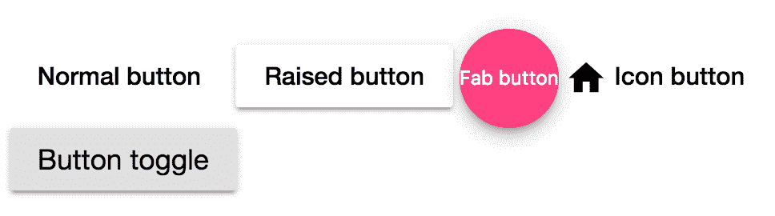

要使用这些按钮，我们需要确保导入和注册它们所属的模块。让我们更新我们的根模块，使其看起来像下面这样：

```ts
import { BrowserModule } from  '@angular/platform-browser'; import { NgModule } from  '@angular/core';  import { BrowserAnimationsModule } from  '@angular/platform-browser/animations'; import { 
 MatButtonModule, 
 MatIconModule, 
 MatButtonToggleModule 
} from '@angular/material'**;** import { AppComponent } from  './app.component'; 
@NgModule({
  declarations: [ AppComponent
 ],
 imports: [ BrowserModule, BrowserAnimationsModule, MatButtonModule, MatIconModule,
 MatButtonToggleModule
 ],  bootstrap: [AppComponent] })
export  class  AppModule { }
```

我们可以看到我们需要注册`MatIconModule`来支持使用`mat-icon`指令，并且我们还需要注册`MatButtonToggleModule`来使用`<mat-button-toggle>` UI 元素，一个切换按钮。

# 表单控件

表单控件是关于以不同的方式收集输入数据，以便您可以通过调用 HTTP 端点来持久化数据。

Material Design 中有许多不同类型的控件，包括：

+   **自动完成**：此控件使用户可以在输入字段中开始输入并在输入时显示建议列表。这有助于缩小输入可以接受的可能值。

+   **复选框**：这是一个经典的复选框，表示一个处于选中或未选中状态的状态。

+   **日期选择器**：这是一个控件，使用户可以在日历中选择日期。

+   **输入**：这是一个经典的输入控件。Material Design 通过有意义的动画增强了控件，因此您可以清楚地看到您何时正在输入或不在输入。

+   **单选按钮**：这是一个经典的单选按钮，就像输入控件一样，Material Design 对此的处理是在编辑时添加动画和过渡，以创造更好的用户体验。

+   **选择**：这是一个经典的选择列表，提示用户从列表中选择一个或多个项目。

+   **滑块**：滑块使您可以通过拖动滑块按钮向右或向左增加或减少值。

+   **滑动切换**：这只是一个复选框，但是一个更好的版本，其中滑块被滑向左边或右边。

# 输入

输入字段是一个经典的输入字段，您可以在其中设置不同的验证规则。但是，您可以很容易地添加在输入字段上以一种漂亮和反应灵敏的方式显示错误的能力。

为了实现这一点，我们需要：

+   将`formControl`与我们的输入字段关联

+   将我们的输入定义为`MatInput`并添加验证规则

+   定义一个`mat-error`元素和一个何时应该显示的规则

对于第一个项目，我们执行以下操作：

```ts
<mat-form-field>
 <input  matInput  placeholder="Name" [formControl]="nameInput">
</mat-form-field>
```

这为我们设置了一个输入控件和一个`formControl`的引用，这样我们就可以监听输入的变化。这需要与我们在`app.component.ts`文件中添加一个引用的代码一起使用，就像这样：

```ts
nameInput:FormControl;

constructor() {
 this.nameInput = new FormControl();
}
```

然后，我们需要向输入添加`matInput`指令，并添加一个验证规则，使其看起来像这样：

```ts
<mat-form-field>
 <input [formControl]="nameInput" required matInput >
</mat-form-field>
```

最后，我们添加`mat-error`元素，并将`mat-input-container`包装在一个表单元素中。在这一点上，我们需要记住在根模块中包含`FormsModule`。我们还需要设置一个规则，用`*ngIf`来确定`mat-error`元素何时显示：

```ts
<form name="person-form">
 <mat-input-container>
 <input [formControl]="nameInput" required matInput >
    <mat-error *ngIf="nameInput.hasError('required')">
 Name field is required
 </mat-error>
 </mat-input-container>
</form>
```

前面的标记设置了输入元素和何时显示验证规则，但正如前面提到的，我们需要在根模块中包含`FormsModule`作为最后一步，让我们看看它是什么样子的：

```ts
import {FormsModule} from '@angular/forms';

@NgModule({
 imports: [FormsModule]
})
export class AppModule {}
```

所有这些都汇总成以下内容：

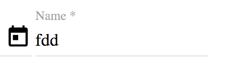

当验证错误被触发时，它看起来是这样的：

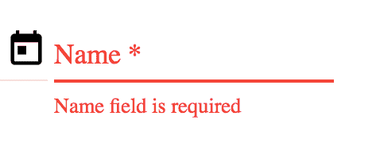

我们已经介绍了 Angular Material 包含的所有表单控件的一个子集，即自动完成、复选框、日期选择器，最后是展示验证错误的普通输入。还有其他表单控件，如单选按钮、选择器、滑块和滑动切换，我们鼓励您按照自己的节奏进行探索。

# 自动完成

自动完成的想法是帮助用户缩小输入字段可能具有的可能值。在普通的输入字段中，您只需输入一些内容，希望验证会告诉您输入的内容是否不正确。使用自动完成，您在输入时会看到一个列表。随着您的输入，列表会被缩小，您可以随时决定停止输入，而是从列表中选择一个项目。这是一个时间节省者，因为您不必输入整个项目的名称，它还增强了正确性，因为用户被要求从列表中选择，而不是输入整个内容。

由于这是自动更正的完整行为，这意味着我们需要提供一个可能答案的列表，还需要一个输入框来接收输入。

我们需要按照五个步骤设置这个控件：

1.  导入并在根模块中注册所有必要的模块。

1.  定义一个包含输入控件的`mat-form-field`。

1.  定义一个`mat-autocomplete`控件，这是可能选项的列表。

1.  通过视图引用链接这两个控件。

1.  添加一个过滤器，当用户输入时，可以缩小自动完成控件的范围。

让我们从第一步开始，导入所有必要的内容。在这里，我们需要自动完成功能，但由于我们将使用表单，特别是响应式表单，我们还需要该模块。我们还需要一些表单来支持我们打算使用的输入字段：

```ts
import { BrowserModule } from  '@angular/platform-browser'; import { NgModule } from  '@angular/core'; import { AppComponent } from  './app.component'; import { MatButtonModule } from  '@angular/material'; import { BrowserAnimationsModule } from  '@angular/platform-browser/animations'; import { MatIconModule } from  '@angular/material/icon'; import { MatButtonToggleModule } from  '@angular/material/button-toggle'; import { MatAutocompleteModule } from  '@angular/material'; import { ReactiveFormsModule } from  '@angular/forms'; import { MatFormFieldModule } from  '@angular/material/form-field'; import { MatInputModule } from  '@angular/material/input'**;** 
@NgModule({
  declarations: [ AppComponent
 ],
 imports: [ BrowserModule, BrowserAnimationsModule, MatButtonModule, MatIconModule, MatButtonToggleModule, MatAutocompleteModule, ReactiveFormsModule, MatFormFieldModule, MatInputModule
 ],
 providers: [], bootstrap: [AppComponent] })
export  class  AppModule { }
```

现在我们准备向`app.component.html`文件模板添加一些标记：

```ts
<mat-form-field>
 <input  type="text"  **matInput**  placeholder="jedis" [formControl]="myControl"  >
</mat-form-field>
```

此时，我们已经定义了输入控件并添加了`matInput`指令。我们还添加了一个`formControl`引用。我们添加这个引用是为了以后能够监听输入的变化。输入的变化很有趣，因为我们能够对其做出反应并过滤我们的列表，这本质上就是自动完成所做的事情。下一个要做的事情是定义一组值，一旦用户开始输入，我们就需要向他们建议这些值，所以让我们接着做吧：

```ts
<mat-autocomplete #auto="matAutocomplete">
 <mat-option *ngFor="let jedi of jedis" [value]="jedi"> {{ jedi }}
 </mat-option>
</mat-autocomplete>
```

我们有了列表，但缺少输入字段和建议列表之间的任何连接。在修复之前，我们首先需要查看我们的组件类，并向其添加一些代码以支持先前的标记：

```ts
export  class  AppComponent {  myControl:  FormControl; jedis  = [ 'Luke', 'Yoda', 'Darth Vader', 'Palpatine', 'Dooku', 'Darth Maul'
 ];

 constructor() { this.myControl  =  new  FormControl();
 }
} 
```

到目前为止，我们已经分别定义了`matInput`和`mat-autocomplete`，现在是将两者连接起来的时候了。我们通过向`mat-autocomplete`添加一个视图引用，以便`matInput`可以引用它，就像这样：

```ts
<mat-autocomplete #auto="matAutocomplete">
 <mat-option *ngFor="let jedi of jedis" [value]="jedi"> {{ jedi }}
 </mat-option>
</mat-autocomplete>
```

并且为了在`matInput`中引用它，我们引入`MatAutocomplete`指令，就像这样：

```ts
<form  action="">
 <mat-input-container  name="container">
 <mat-form-field hintLabel="Max 30 characters"> <input  name="input" type="text"
 #input
 matInput
 placeholder="type the name of the jedi" [formControl]="jediControl"
 **[matAutocomplete]= "auto"**>
 <mat-hint align="end">{{input.value?.length || 0}}/30</mat-hint> 
 </mat-form-field> </mat-input-container>
</form>
```

正如您所看到的，`matAutocomplete`指向`auto`视图引用，因此当我们将焦点设置到输入字段并开始输入时，列表就会被触发。

在前面的代码中，我们添加了另一个有用的东西，即提示。向输入添加提示是向用户传达应在输入字段中输入什么的好方法。通过添加属性`hintLabel`，我们能够告诉用户应该输入什么。您甚至可以通过使用`mat-hint`元素在用户输入时介绍一些提示，让他们知道他们的输入情况如何。让我们仔细看一下刚才完成了我们所描述的工作的前面的代码：

```ts
<mat-form-field **hintLabel="Max 30 characters"**>
 <input  name="input" type="text"
 #input
 matInput
 placeholder="type the name of the jedi" [formControl]="jediControl"
 [matAutocomplete]= "auto">
  **<mat-hint align="end">{{input.value?.length || 0}}/30</mat-hint>** 
</mat-form-field> 
```

尝试在适用的地方使用`hintLabel`和`mat-hint`元素，这将极大地帮助您的用户。

如果您正确输入了所有内容，您应该在 UI 中看到类似于这样的东西：

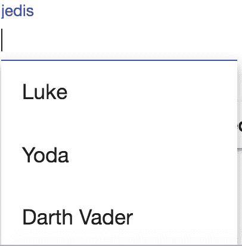

看起来不错！当你将输入聚焦时，列表会显示出来。然而，你会注意到随着你的输入，列表并没有真正被过滤掉。这是因为我们没有捕捉到你在输入控件中输入时的事件。所以让我们接下来做这个。

监听输入变化意味着我们监听我们的表单控件及其`valueChanges`属性，如下所示：

```ts
myControl.valueChanges
```

如果你仔细看，你会发现这是一个 Observable。这意味着我们可以使用操作符来过滤掉我们不想要的内容。我们对所需内容的定义是以我们在输入框中输入的文本开头的`jedis`。这意味着我们可以将其完善为如下所示的样子：

```ts
import { Component } from  '@angular/core'; import { FormControl } from  "@angular/forms"; import { Observable } from  "rxjs/Observable"; import  'rxjs/add/operator/map'; @Component({
  selector:  'app-root', templateUrl:  './app.component.html', styleUrls: ['./app.component.css'] })
export  class  AppComponent { title  =  'app'; myControl:  FormControl; jedis  = [ 'Luke', 'Yoda', 'Darth Vader', 'Palpatine', 'Dooku', 'Darth Maul'
 ];

 filteredJedis$:  Observable<string[]>; constructor() { this.myControl  =  new  FormControl(); this.filteredJedis$  =  this.myControl .valueChanges .map(input  =>  this.filter(input**));** }

  filter(key:  string):  Array<string> { return  this.jedis.filter(jedi  =>  jedi.startsWith(key)); }
}
```

现在我们只需要改变我们的模板，让`mat-option`看向`filteredJedis`而不是`jedis`数组，如下所示：

```ts
<mat-autocomplete #auto="matAutocomplete">
 <mat-option *ngFor="let jedi of **filteredJedis$ | async**" [value]="jedi"> {{ jedi }}
 </mat-option>
</mat-autocomplete>
```

测试一下，我们看到它似乎是有效的。

# 复选框

这是一个经典的复选框，包含选中、未选中和未确定的状态。使用起来非常简单，但你需要导入一些模块来使用它，如下所示：

```ts
import { MatCheckboxModule } from @angular/material/checkbox;

@NgModule({
 imports: [MatCheckboxModule]
})
```

标记应该是这样的：

```ts
<mat-checkbox [checked]="propertyOnTheComponent" >Check me<mat-checkbox>
```

因此，基本上，只需将`<mat-checkbox>`添加为元素名称，并确保将`checked`属性绑定到我们组件上的属性。

# 日期选择器

通常情况下，使用日期选择器，你可以做的远不止从弹出日历中选择日期。你可以禁用日期范围，格式化日期，按年度和月度显示日期等等。我们只会探讨如何开始并运行它，但我们鼓励你在[`material.angular.io/components/datepicker/overview`](https://material.angular.io/components/datepicker/overview)探索此控件的文档。

首先，我们需要导入必要的模块：

```ts
import { 
 MatDatepickerModule, 
MatNativeDateModule } from  '@angular/material';

@NgModule({
 imports: [MatDatepickerModule, MatNativeDateModule]
})
```

对于标记，我们需要做以下事情：

+   定义一个带有`matInput`指令的输入。选定的日期将放在这里。

+   定义一个`<mat-datepicker>`元素。这是弹出式日历。

+   创建两个控件之间的连接。

对于第一个要点，我们在标记中声明它，如下所示：

```ts
<mat-form-field>
 <input matInput  placeholder="Choose a date">  </mat-form-field>  
```

我们可以看到，我们通过使用`formControl`指令指出了在我们组件中称为 input 的`formControl`实例。我们还添加了`matInput`指令，以赋予我们的输入字段漂亮的材料外观和感觉。

对于第二个任务，我们定义`<mat-datepicker>`元素，如下所示：

```ts
<mat-datepicker></mat-datepicker>
```

现在我们需要建立它们之间的连接，就像我们在自动完成控件中所做的那样，我们在`<mat-datepicker>`元素中定义一个视图引用`picker`，并通过将该引用分配给输入元素中的`matDatepicker`指令来引用它，所以它看起来像下面这样：

```ts
<div>
 <mat-form-field>
 <input  matInput [matDatepicker]="picker"> <mat-datepicker-toggle  matSuffix [for]="picker">
 </mat-datepicker-toggle> <mat-datepicker #picker></mat-datepicker> </mat-form-field>
</div>
```

因此，总之，我们在`mat-datepicker`元素中添加了一个视图引用，并通过将其分配给输入元素中的`[matDatePicker]`指令来引用该引用。

我们还添加了一个按钮，用于切换日历的可见性。我们通过使用`<mat-datepicker-toggle>`元素并将其分配给`picker`视图引用来实现这一点：

```ts
<mat-datepicker-toggle  matSuffix [for]="picker"></mat-datepicker-toggle>
```

最后，您的创建现在应该看起来像下面这样：

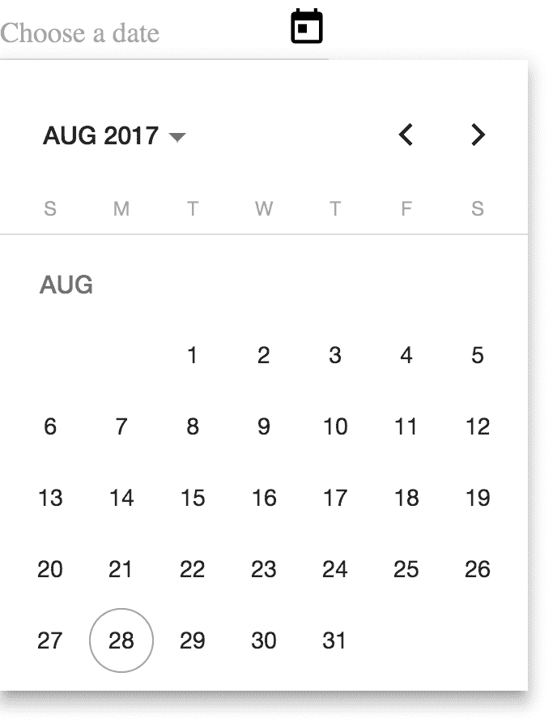

# 导航

导航是我们在应用程序中移动的方式。我们有不同的方式来做到这一点，比如点击链接或者点击菜单项。Angular Material 为此提供了三个组件：

+   **菜单**：这是一个弹出列表，您可以从中选择许多不同的菜单选项

+   **侧边栏**：这个组件就像一个停靠在页面左侧或右侧的菜单，并以应用程序内容的遮罩形式呈现在应用程序上

+   **工具栏**：这是用户可以使用的常用操作的典型工具栏

在这一部分，我们将展示使用菜单的完整示例，但我们鼓励您继续探索，学习如何使用侧边栏（[`material.angular.io/components/sidenav/overview`](https://material.angular.io/components/sidenav/overview)）以及工具栏组件（[`material.angular.io/components/toolbar/overview`](https://material.angular.io/components/toolbar/overview)）。

# 菜单

菜单组件就是它听起来的样子，它是为了让您轻松地向用户呈现菜单。它使用三个主要指令，`mat-menu`，`mat-menu-item`，最后，`MatMenuTriggerFor`。每个菜单只有一个`mat-menu`，以及尽可能多的`mat-menu-items`。`MatMenuTriggerFor`用于触发菜单，通常将其附加到按钮上。

使菜单工作可以分为三个步骤：

1.  定义一个`mat-menu`控件。

1.  添加尽可能多的`mat-menu-items`。

1.  通过添加`MatMenuTriggerFor`指令将触发器添加到按钮。

在我们执行任何操作之前，我们需要导入`MatMenuModule`以便能够使用先前提到的构造，所以让我们这样做：

```ts
import {MatMenuModule} from '@angular/material';

@NgModule({
 imports: [MatMenuModule]
})
```

现在我们准备定义我们的菜单，如下所示：

```ts
<mat-menu>
</mat-menu>
```

之后，我们添加所需的项目：

```ts
<mat-menu>
 <button mat-menu-item >Item1</button>
 <button mat-menu-item >Item2</button>
</mat-menu>
```

最后，我们通过添加一个按钮来触发`matMenuTriggerFor`指令来添加触发器，就像这样：

```ts
<button [matMenuTriggerFor]="menu">Trigger menu</button>
<mat-menu #menu>
 <button mat-menu-item >Item1</button>
 <button mat-menu-item >Item1</button>
</mat-menu>
```

注意`matMenuTriggerFor`指向`menu`视图引用。

您的最终结果应该看起来像这样：

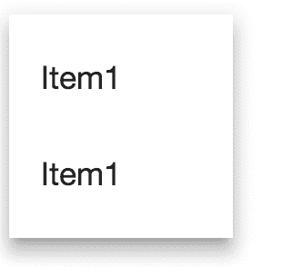

当然，并非所有菜单都是这么简单。迟早您会遇到需要嵌套菜单的情况。Material UI 很容易支持这一点。支持这一点的整体方法在于为您需要的每个菜单定义`mat-menu`，然后连接它们。然后您需要定义什么操作导致触发哪个子菜单。听起来困难吗？其实并不是。让我们从我们的顶级菜单，我们的根菜单开始。让我们给菜单项一些有意义的名称，就像这样：

```ts
<button [matMenuTriggerFor]="menu">Trigger menu</button>
<mat-menu #menu>
 <button mat-menu-item >File</button>
 <button mat-menu-item >Export</button>
</mat-menu>
```

在这一点上，我们有两个菜单项，最后一个`wxport`需要一些子选项。想象一下我们在程序中处理表格数据，支持将数据导出为 CSV 或 PDF 是有意义的。让我们添加一个子菜单，就像这样：

```ts
<button [matMenuTriggerFor]="rootMenu">Trigger menu</button>
<mat-menu #rootMenu>
 <button mat-menu-item>File</button>
 <button mat-menu-item>Export</button>
</mat-menu>

<mat-menu #subMenu>
 <button mat-menu-item>CSV</button>
 <button mat-menu-item>PDF</button>
</mat-menu>
```

好的，现在我们有两个不同的菜单，但我们需要添加连接，使`rootMenu`项触发`subMenu`显示。让我们再次使用`matMenutriggerFor`指令来添加，就像这样：

```ts
<button [matMenuTriggerFor]="rootMenu">Trigger menu</button>
<mat-menu #rootMenu>
 <button mat-menu-item >File</button>
 <button mat-menu-item [matMenuTriggerFor]="subMenu">Export</button>
</mat-menu>

<mat-menu #subMenu>
 <button mat-menu-item>CSV</button>
 <button mat-menu-item>PDF</button>
</mat-menu>
```

这应该呈现一个看起来像下面这样的菜单：

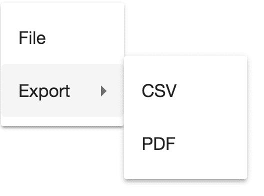

菜单有更多的用途，不仅仅是渲染一些菜单项并通过按钮触发它们。其他需要考虑和尝试的事情包括通过添加图标使其看起来更专业，或者迎合无障碍。现在您已经了解了如何创建简单菜单以及嵌套菜单的基础知识，去探索吧。

# 布局

布局是关于定义如何在页面上放置内容。Angular Material 为此目的提供了不同的组件，即：

+   列表：这是一种将内容呈现为项目列表的方式。列表可以用链接、图标来丰富，甚至可以是多行的。

+   网格列表：这是一个帮助你将内容排列成块的控件。您需要定义列数，组件将确保填充视觉空间。

+   卡片：这是一个包装内容并添加阴影的组件。您也可以为其定义一个标题。

+   选项卡：这让您可以在不同的选项卡之间划分内容。

+   **步进器**：这是一个将您的组件分成向导式步骤的组件。

+   **展开面板**：这个组件的工作方式基本上类似于手风琴，它使您能够以列表的方式布置组件，并为每个项目添加标题。每个项目都可以展开，一次只能展开一个项目。

在本节中，我们将介绍列表和网格列表组件。我们建议您自行探索卡片组件，[`material.angular.io/components/card/overview`](https://material.angular.io/components/card/overview)，选项卡组件，[`material.angular.io/components/tabs/overview`](https://material.angular.io/components/tabs/overview)，步进器，[`material.angular.io/components/stepper/overview`](https://material.angular.io/components/stepper/overview)，以及展开面板，[`material.angular.io/components/expansion/overview`](https://material.angular.io/components/expansion/overview)。

# 列表

列表控件由一个`mat-list`元素和一些`mat-list-items`组成。其标记如下：

```ts
<mat-list>
 <mat-list-item>Item1</mat-list-item>
 <mat-list-item>Item1</mat-list-item>
</mat-list>
```

就是这样，就是这样。为了你的努力，你将获得一个看起来像这样的列表：

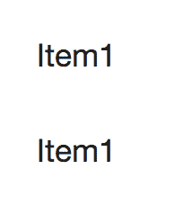

当然，列表可以更加复杂，包含链接、图标等。一个更有趣的例子可能是这样的：

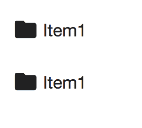

我想你已经明白了，这里有列表项，我可以在其中放入任何我想要的东西。要了解更多关于功能的信息，请点击以下链接查看列表文档：[`material.angular.io/components/list/overview.`](https://material.angular.io/components/list/overview)

# 网格列表

网格列表用于以行和列的列表形式显示内容，同时确保填充视口。如果您希望最大限度地自由决定如何显示内容，这是一个非常好的组件。这是一个名为`MatGridListModule`的单独模块。我们需要将其添加到我们导入的模块列表中，就像这样：

```ts
import { MatGridListModule } from '@angular/material';

@NgModule({
 imports: [MatGridListModule]
})
```

该组件由一个`mat-grid-list`元素和一些`mat-grid-tile`元素组成。

让我们首先添加`mat-grid-list`元素：

```ts
<mat-grid-list cols=4 rowHeight="300px">
</mat-grid-list>
```

值得注意的是我们如何设置列数和每行的高度。现在是添加内容的时候了。我们通过添加一些`mat-grid-tile`实例来实现：

```ts
<mat-grid-list cols=4 rowHeight="300px">
 <mat-grid-tile *ngFor="let tile of tiles" [colspan]="tile.cols" [rowspan]="tile.rows" [style.background]="tile.color"> {{ tile.text }}
 </mat-grid-tile>
</mat-grid-list>
```

在这里，我们正在定义一个`*ngFor`，指向我们的瓷砖列表。我们还绑定到`[colspan]`，决定它应该占用多少列空间，`[rowspan]`，确定它应该占用多少行，最后，我们绑定到我们样式中的背景属性。

该组件如下所示：

```ts
tiles  = [ {text:  'One', cols:  3, rows:  1, color:  'lightblue'}, {text:  'Two', cols:  1, rows:  2, color:  'lightgreen'}, {text:  'Three', cols:  1, rows:  1, color:  'lightpink'}, {text:  'Four', cols:  2, rows:  1, color:  '#DDBDF1'}, ];
```

我们鼓励您探索卡片和选项卡组件，以了解更多关于剩余布局组件的信息。

# 弹出窗口和模态

有不同的方式可以吸引用户的注意。一种方法是在页面内容上显示对话框，并提示用户采取行动。另一种方法是在用户悬停在特定部分时显示该部分的信息。

Angular Material 为此提供了三种不同的组件：

+   **对话框**：这只是一个简单的模态对话框，显示在内容的顶部。

+   **Tooltip**：当您悬停在指定区域时，它会显示一段文本。

+   **Snackbar**：这在页面底部显示信息消息。信息消息只在短时间内可见。它旨在向用户传达由于某种操作（例如保存表单）而发生的事情。

# 对话框

对话框组件非常强大，因为它帮助我们创建一个模态框。它可以根据您的喜好进行定制，并且设置起来有点棘手。但不用担心，我们会指导您完成整个过程。我们需要做的是：

1.  导入对话框模块。

1.  创建一个作为我们对话框的组件。

1.  创建一个组件和一个按钮，触发该模块。

1.  将我们的对话框添加到模块的`entryComponents`属性中。

首先，我们导入必要的模块，如下所示：

```ts
import { MatDialogModule } from '@angular/material';

@NgModule({
 imports: [MatDialogModule]
})
```

接下来，我们创建一个将容纳我们对话框的组件。它是一个普通的组件，有模板和后台类，但它确实需要注入一个`MatDialogRef`。它应该看起来像这样：

```ts
import { MatDialogRef } from  "@angular/material"; import { Component } from  "@angular/core"; @Component({
  selector:  'my-dialog', template: ` <h1  mat-dialog-title>Perform action?</h1> <mat-dialog-content>Save changes to Jedi?</mat-dialog-content> <mat-dialog-actions>
 <button  mat-button  [mat-dialog-close]="true">Yes</button>
 <button  mat-button  mat-dialog-close>No</button> </mat-dialog-actions>
`  })
export  class  DialogComponent { constructor(public  dialogRef:  MatDialogRef<DialogComponent>) { console.log('dialog opened'); }
}
```

我们在模板中定义了以下一般结构：

```ts
<h1 mat-dialog-title>Save changes to Jedi?</h1>
<mat-dialog-content>
</mat-dialog-content>
<mat-dialog-actions>
 <button mat-button [mat-dialog-close]>Yes</button>
 <button mat-button mat-dialog-close >No</button> 
</mat-dialog-actions>
```

乍一看，我们定义了一个标题、一个内容和一个操作字段，其中定义了按钮。为了发送不同的值回来，我们使用`[mat-dialog-close]`并为其分配一个值。

至于代码部分，我们注入了一个类型为`MyDialog`的`MatDialogRef`实例，这正是我们所在的组件。

我们需要做的第三件事是设置一个宿主组件，在其中有一个按钮，当点击时将启动一个对话框。所以让我们用以下代码来做到这一点：

```ts
import { Component } from  "@angular/core"; import { MatDialog } from  "@angular/material/dialog"; import { DialogComponent } from  "./dialog.component"; 
@Component({
  selector:  'dialog-example', template: ` <button  (click)="openDialog()">Open Dialog</button> `
})
export  class  DialogExampleComponent { selectedOption; constructor(private  dialog:  MatDialog) { }

  openDialog() { let  dialogRef  =  this.dialog.open(DialogComponent); dialogRef.afterClosed().subscribe(result  => {
 // do something with 'result'  });
 }
}
```

在这里，我们做了两件事，我们使用类型调用`dialog.open()`，这是我们的对话框组件。此外，通过监听调用`dialogRef.afterClosed()`时返回的 Observable，我们能够检查来自对话框的结果。在这一点上，没有太多结果可以查看，但在下一节中，我们将看一个更高级的对话框示例，我们将使用这种方法。

最后，我们需要转到我们的`app.module.ts`文件，并将我们的`DialogComponent`对话框添加到`entryComponents`数组中，如下所示：

```ts
@NgModule({
 entryComponents: [DialogComponent]
})
```

因此，在 Angular 模块的`entryComponents`数组中添加内容对我们来说是一个全新的概念，它实际上是做什么的？当我们将组件添加到该列表中时，我们告诉编译器这个组件需要被编译，并且需要一个`ComponentFactory`，以便我们可以动态创建它。因此，将任何组件放在这里的标准是，我们希望动态加载组件或按类型加载组件。这正是我们的`DialogComponent`的情况。在调用`this.dialog.open(DialogComponent)`之前，它实际上并不存在。在那时，它会在幕后运行一个名为`ViewContainerRef.createComponent()`的方法。简而言之，我们需要在每次打开对话框时实例化`DialogComponent`。因此，不要忘记`entryComponents`，否则它将无法工作。您可以在[`angular.io/guide/ngmodule-faq#what-is-an-entry-component`](https://angular.io/guide/ngmodule-faq#what-is-an-entry-component)上阅读更多关于`entryComponents`的信息。

您的对话框最终会看起来像这样：

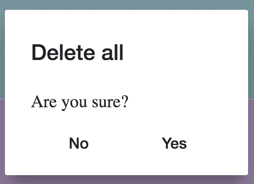

# 一个更高级的例子-向对话框发送数据和从对话框发送数据

之前，我们介绍了一个简单的对话框示例，我们学会了如何打开对话框并关闭它。那只是皮毛。真正有趣的是我们如何向对话框发送数据，以便它预先加载一些数据，并且我们如何将在对话框内收集的数据发送回打开它的宿主组件。我们将研究这两种情况。

向对话框发送数据的业务案例是，这样它就可以从一些数据开始，例如，显示现有记录并在对话框中进行更新。

通过向`dialog.open()`方法添加第二个参数，我们可以向对话框组件发送数据，以便它可以显示：

```ts
// jedi.model.ts
interface  Jedi  {
 name:  string; }

import { Component } from  "@angular/core"; import { MatDialog } from  "@angular/material/dialog"; import { DialogComponent } from  "./dialog.component"; 
@Component({
  selector:  'dialog-example', template: ` <button  (click)="openDialog()">Open Dialog</button> `
})
export  class  DialogExampleComponent { selectedOption; jedi:  Jedi;

 constructor(private  dialog:  MatDialog) {
 this.jedi  =  {  name:  'Luke'  };
 }

 openDialog() {
  let dialogRef = this.dialog.open(DialogComponent, {
 data: { jedi: this.jedi }
 });

 dialogRef.afterClosed().subscribe(result  =>  {
 console.log(result);
 });
 }
}  
```

在对话框组件方面，我们需要告诉它我们发送的数据。我们通过注入`MAT_DIALOG_DATA`来实现这一点，所需的更改如下所示：

```ts
import { MatDialogRef, MAT_DIALOG_DATA } from  "@angular/material"; import { Component, Inject } from  "@angular/core"; @Component({
  selector:  'my-dialog',
 template: `
 <h1  mat-dialog-title>Save changes to jedi?</h1>
 <mat-dialog-content>
      <input matInput [(ngModel)]="data.jedi.name" **/>**
 </mat-dialog-content>
 <mat-dialog-actions>
 <button  mat-button  (click)="saveAndClose()">Yes</button>  <button  mat-button  mat-dialog-close>No</button>
 </mat-dialog-actions>
 `, })
export  class  DialogComponent { constructor(
 public  dialogRef:  MatDialogRef<DialogComponent>,
    @Inject(MAT_DIALOG_DATA) public data:  any
 ) {
 console.log('dialog opened');
 }

 saveAndClose() {
 this.dialogRef.close('save');
 }
}
```

现在，因为我们已经从`host`类发送了数据绑定的`jedi`实例，所以我们在`Dialog`类中对其进行的任何更改都将反映在`host`类中。这解决了从`host`类发送数据到对话框的问题，但是如果我们想要从对话框发送数据回来怎么办？我们可以通过在`dialogRef.close()`方法调用中发送一个参数来轻松实现，就像这样：

```ts
export  class  DialogComponent { constructor(
 public  dialogRef:  MatDialogRef<DialogComponent>,
    @Inject(MAT_DIALOG_DATA) public data:  any
 ) {
 console.log('dialog opened');
 }

 saveAndClose() {
    this.dialogRef.close('save'**);**
 }
}
```

要对数据进行操作，我们只需订阅从调用`afterClose()`得到的 Observable。如下所示加粗说明：

```ts
import { Component } from  "@angular/core"; import { MatDialog } from  "@angular/material/dialog"; import { DialogComponent } from  "./dialog.component"; 
@Component({
  selector:  'dialog-example', template: ` <button  (click)="openDialog()">Open Dialog</button> `
})
export  class  DialogExampleComponent { selectedOption;
 jedi:  Jedi;

 constructor(private  dialog:  MatDialog) {
 this.jedi  = { name:  'Luke' }; }

 openDialog() {
 let  dialogRef  =  this.dialog.open(DialogComponent, {
 data: { jedi:  this.jedi } });

   dialogRef
 .afterClosed()
 .subscribe(result => {
 // will print 'save' if we pressed 'Yes' button
 console.log(result);
 });
}}
```

# 数据表

我们可以以不同的方式显示数据。以行和列的形式显示数据是快速获得概览的有效方式。但是，您可能需要按列对数据进行排序，以便快速聚焦于感兴趣的数据。此外，数据量可能非常大，需要通过分页的方式显示。Angular Material 通过提供以下组件来解决这些问题：

+   **表格**：这以行和列的形式布置数据，并带有标题

+   **排序表格**：这允许您对数据进行排序

+   **分页器**：这允许您将数据分成页面，并在页面之间导航

应该说，在大多数情况下，当尝试向应用程序添加表格时，预期表格可以进行排序，并且数据可以进行分页，以免完全压倒用户。因此，让我们逐步看看如何实现所有这些。

# 表格

表格组件能够让我们以列和行的形式呈现数据。我们需要做以下工作才能让表格组件正常运行：

1.  在我们的根模块中导入和注册`MatTableModule`。

1.  构建我们打算显示的数据。

1.  定义我们表格的标记。

首先要做的是导入必要的模块，可以通过以下代码轻松完成：

```ts
import {MatTableModule} from '@angular/material';

@NgModule({
 imports: [MatTableModule]
})
```

在这一点上，我们开始构建我们的数据并创建`MatTableDataSource`类的一个实例。代码如下：

```ts
// app/jedi.model.ts
export class interface Jedi {
 name: string;
 side: string;
}

// app/table.example.component.ts
@Component({
 selector: 'example-table',
 template : `
 <div>
 <mat-table  #table  [dataSource]="tableSource"  matSort>
 // header 'Name' <ng-container  matColumnDef="name"> <mat-header-cell  *matHeaderCellDef  mat-sort-header> Name</mat-header-cell> <mat-cell  *matCellDef="let element"> {{element.name}} 
 </mat-cell>
 </ng-container>

 // header 'Side'
 <ng-container  matColumnDef="side">
 <mat-header-cell  *matHeaderCellDef  mat-sort-header> Side </mat-header-cell>
 <mat-cell  *matCellDef="let element"> {{element.side}} 
 </mat-cell>
 </ng-container>

 <mat-header-row  *matHeaderRowDef="displayedColumns"></mat-header-row>
 <mat-row  *matRowDef="let row; columns: displayedColumns;"></mat-row>
 </mat-table>
 <mat-paginator  #paginator  [pageSize]="2"  [pageSizeOptions]="[1, 5, 10]">
 </mat-paginator>
</div>
 `
})
export class ExampleTableComponent {
 jediSource:  Array<Jedi>; tableSource:  MatTableDataSource<Jedi>; displayedColumns:  string[];

 constructor() { this.displayedColumns  = ['name', 'side']; this.jediSource  = [{ name:  'Yoda', side:  'Good' }, {
 name:  'Darth', side:  'Evil' }, {
 name:  'Palpatine', side:  'Evil' }];

   this.tableSource  =  new  MatTableDataSource<Jedi>(this.jediSource**);**
 } }

```

值得注意的是，我们如何从对象数组构建了一个`MatTableDataSource`实例。我们将在标记中使用这个实例，并将其指定为数据源。接下来要做的是构建支持这个表格的标记。代码如下：

```ts
<mat-table #table [dataSource]="tableSource">
 // header 'Name'
 <ng-container  matColumnDef="name"> <mat-header-cell *matHeaderCellDef> Name </mat-header-cell> <mat-cell *matCellDef="let element"> {{element.name}} **</mat-cell>** </ng-container>

 // header 'Side'
 <ng-container  matColumnDef="side"> <mat-header-cell *matHeaderCellDef> Side </mat-header-cell> <mat-cell *matCellDef="let element"> {{element.side}} </mat-cell> </ng-container>

  <mat-header-row *matHeaderRowDef="displayedColumns"></mat-header-row> <mat-row *matRowDef="let row; columns: displayedColumns;"**></mat-row>** </mat-table>
```

我们在先前的代码中指出了几个值得关注的地方。表格的列是通过创建一个包含`mat-header-cell`的`ng-container`元素来构建的，其中定义了标题，以及一个`mat-cell`，我们在其中说明了应该放入哪些数据。在代码中稍后的`mat-header-row`元素使我们能够指出列应该出现的顺序。我们可以在先前的代码片段中看到，这实际上只是一个字符串数组。最后，通过`mat-row`元素，我们简单地显示表格的所有行。最终结果应该是这样的：

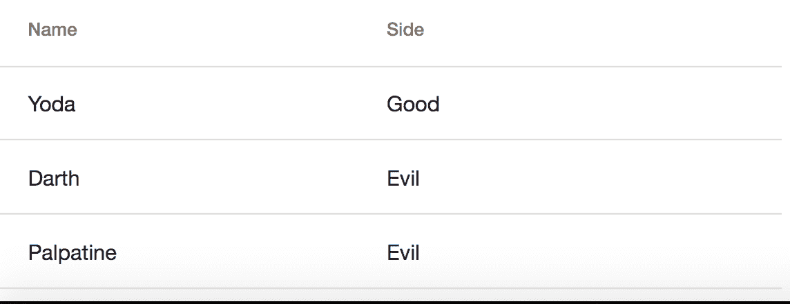

# 排序

先前的图表构成了一个漂亮的表格，但缺少一个非常标准的功能，即排序功能。我们期望通过点击标题，它将分别按升序和降序排序，并且能够识别常见的数据类型，如字符串和整数，并正确排序这些数据。好消息是，这非常容易实现。我们需要做以下工作来确保我们的表格可以排序：

1.  导入并注册`MatSortModule`。

1.  创建一个类型为`MatSort`的`ViewChild`并将其分配给`dataSources`的 sort 属性。

1.  将`matSortHeader`指令添加到应该能够排序的标题上。

我们通过向根模块添加以下代码来完成第一步：

```ts
import { MatSortModule } from  '@angular/material/sort'; @NgModule({
 imports: [MatSortModule]
})
```

然后，我们进入我们的组件，并添加`MatSort ViewChild`并将其分配给 sort 属性，如前所述：

```ts
import { Component, ViewChild } from  '@angular/core'; import { MatTableDataSource, MatSort } from  "@angular/material"; 
@Component({
  selector:  'table-demo', templateUrl:  './table.demo.component.html', styleUrls: ['./table.demo.component.css'] })
export  class  AppComponent {  @ViewChild(MatSort) sort:  MatSort**;** jediSource:  Array<Jedi>; tableSource:  MatTableDataSource<Jedi>; displayedColumns:  string[];

 constructor() { this.displayedColumns  = ['name', 'side']; this.jediSource  = [{ name:  'Yoda', side:  'Good' }, {
 name:  'Darth', side:  'Evil' },
 {
 name:  'Palpatine', side:  'Evil' }];

 this.tableSource  =  new  MatTableDataSource<Jedi>(this.jediSource);
 }

  ngAfterViewInit() { this.tableSource.sort  =  this.sort; }
```

在这一点上，我们需要修复标记，然后排序应该可以工作。我们需要对标记进行的更改只是简单地将`matSort`指令应用到整个表格，以及对每个应该可以排序的标题应用`mat-sort-header`。现在标记的代码如下：

```ts
<mat-table #table [dataSource]="tableSource" **matSort**>
 // header 'Name'
 <ng-container  matColumnDef="name"> <mat-header-cell *matHeaderCellDef mat-sort-header> Name </mat-header-cell> <mat-cell *matCellDef="let element"> {{element.name}} </mat-cell**>** </ng-container>

 // header 'Side'
 <ng-container  matColumnDef="side"> <mat-header-cell *matHeaderCellDef **mat-sort-header**> Side </mat-header-cell> <mat-cell *matCellDef="let element"> {{element.side}} </mat-cell> </ng-container>

 <mat-header-row *matHeaderRowDef="displayedColumns"></mat-header-row>
 <mat-row *matRowDef="let row; columns: displayedColumns;"></mat-row> </mat-table>
```

现在 UI 应该通过列**Name**旁边的箭头指示数据排序的方向，如下图所示：

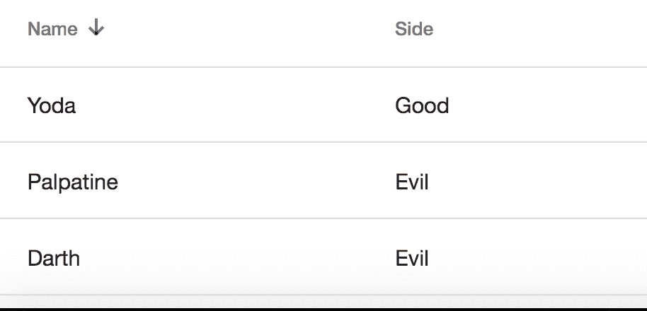

# 分页

到目前为止，我们的表格看起来相当不错。除了显示数据外，它甚至可以进行排序。不过，我们意识到在大多数情况下，表格的数据通常相当长，这导致用户要么不得不滚动，要么逐页浏览数据。我们可以通过分页元素来解决后一种选项。要使用它，我们需要做以下工作：

1.  导入并注册`MatPaginatorModule`。

1.  将`paginator ViewChild`实例分配给数据源的 paginator 属性。

1.  在标记中添加一个`mat-paginator`元素。

从我们列表中的第一项开始，我们需要将以下代码添加到我们的根模块中：

```ts
import {MatPaginatorModule} from '@angular/material/paginator';

@NgModule({
 imports: [MatPaginatorModule]
})
```

之后，我们需要将`paginator`属性分配给我们的`tableSource.paginator`，就像之前描述的那样。代码如下所示：

```ts
import { Component, ViewChild } from  '@angular/core'; import { MatTableDataSource, MatSort } from  "@angular/material"; 
@Component({
  selector:  'table-demo', template: ` <mat-table #table [dataSource]="tableSource" **matSort**>

 // header 'Name'
 <ng-container  matColumnDef="name"> <mat-header-cell *matHeaderCellDef mat-sort-header> Name</mat-header-cell> <mat-cell *matCellDef="let element"> {{element.name}} 
 </mat-cell**>** </ng-container>

 // header 'Side'
 <ng-container  matColumnDef="side"> <mat-header-cell *matHeaderCellDef **mat-sort-header**> Side</mat-header-cell> <mat-cell *matCellDef="let element"> {{element.side}}</mat-cell> </ng-container>

 <mat-header-row *matHeaderRowDef="displayedColumns"></mat-header-row>
 <mat-row *matRowDef="let row; columns: displayedColumns;"></mat-row>
 </mat-table>
 `, styleUrls: ['./table.demo.component.css'] })
export  class  AppComponent { @ViewChild(MatSort) sort: MatSort;  **@ViewChild(MatPaginator) paginator: MatPaginator;** jediSource:  Array<Jedi>; tableSource:  MatTableDataSource<Jedi>; displayedColumns:  string[]; 
 constructor() { this.displayedColumns  = ['name', 'side']; this.jediSource  = [{ name:  'Yoda', side:  'Good' }, {
 name:  'Darth', side:  'Evil' },
 {
 name:  'Palpatine', side:  'Evil' }];

 this.tableSource  =  new  MatTableDataSource<Jedi>(this.jediSource);
 }

 ngAfterViewInit() {
 this.tableSource.sort = this.sort; this.tableSource.paginator = paginator; }
```

我们剩下的部分就是改变标记，应该有以下改变（加粗的变化）：

```ts
<div>
 <mat-table #table [dataSource]="tableSource"  matSort>

 // header 'Name'
 <ng-container  matColumnDef="name"> <mat-header-cell *matHeaderCellDef  mat-sort-header> Name</mat-header-cell> <mat-cell *matCellDef="let element"> {{element.name}}</mat-cell> </ng-container>

 // header 'Side'
 <ng-container  matColumnDef="side"> <mat-header-cell *matHeaderCellDef  mat-sort-header> Side</mat-header-cell> <mat-cell *matCellDef="let element"> {{element.side}} </mat-cell> </ng-container>

 <mat-header-row *matHeaderRowDef="displayedColumns"></mat-header-row> <mat-row *matRowDef="let row; columns: displayedColumns;"></mat-row>
 </mat-table>

 <mat-paginator #paginator [pageSize]="2" [pageSizeOptions]="[1, 5, 10]">
 </mat-paginator>
</div>  
```

在这里，我们清楚地表明，我们标记的唯一添加是底部的`mat-paginator`元素。在这里，我们指定了我们的视图引用，还有页面大小以及我们应该能够切换到的页面。

# 总结

我们努力解释了什么是 Material Design，这是一种以纸张和墨水为主题的设计语言。之后，我们提到了最著名的 Material Design 实现。

接下来，我们把大部分注意力放在了 Angular Material 上，这是专为 Angular 设计的 Material Design 实现，以及它由不同的组件组成。我们亲自动手解释了如何安装它，设置它，甚至如何使用不同的表单控件和输入按钮。

我们还花了一些时间来介绍组件的其他方面，比如布局、导航、模态框和表格数据。希望你已经阅读了本章，并发现你现在对 Material Design 有了一般的了解，特别是对 Angular Material，你可以确定它是否适合你的下一个 Angular 应用程序。
