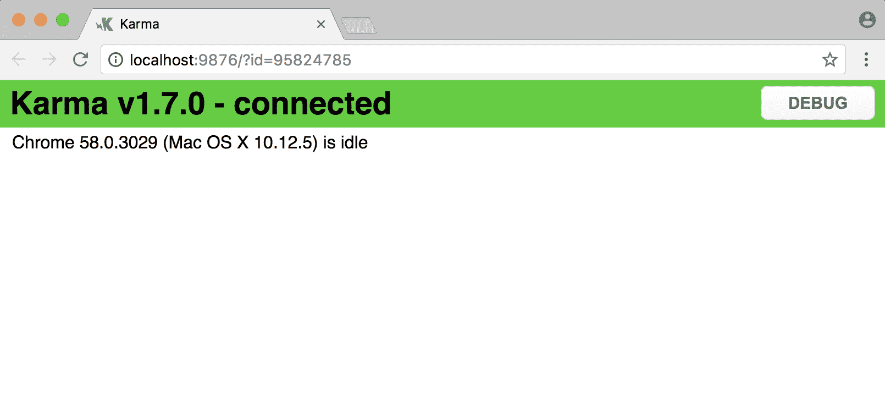
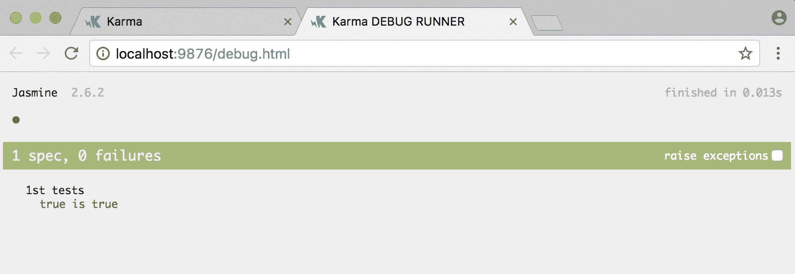

# 第十五章：与 Angular 一起使用 webpack

Webpack 是一个模块捆绑器。它能够捆绑不同的资产，如 JavaScript、CSS 和 HTML。webpack 非常受欢迎，正在成为设置应用程序的首选方式。然而，在前端世界中，事物变化很快。这使得重要的是理解需要解决的问题，而不是特定捆绑工具的技术细节。

在本附录中，您将：

+   了解 webpack 中的重要概念

+   学习如何在简单的 Web 项目中使用 webpack

+   利用 webpack 设置 Angular 项目

# 核心概念

基本上，webpack 尝试通过爬取文件中的所有导入语句来创建依赖关系图。想象一下，您有以下代码片段：

```ts
//main.js
import { Lib } from './lib'; 
Lib.doStuff)() // lib.js

//lib.js
import { OtherLib } from './otherlib'
OtherLib.doStuff()
```

在这种情况下，它会推断`main.js`依赖于`lib.js`，而`lib.js`又依赖于`otherlib.js`，从而创建了一系列依赖关系。

爬取所有导入语句并找出所有依赖关系的最终结果是生成一个捆绑包，您可以将其作为`index.html`的一部分并呈现给浏览器进行渲染。

# 加载程序

webpack 需要一个加载程序来理解特定的文件扩展名并对其进行操作。我们所说的扩展名是`.ts`、`.js`、`.html`等。我们为什么关心呢？在设置时，我们需要确保已设置了适当的加载程序，以便处理我们关心的特定文件扩展名。在 webpack 中，当您想要处理扩展名时，您设置规则。规则可以如下所示：

```ts
rules: [{
 test: /\.blaha$/,
 use: 'blaha-loader'
}]
```

`test`属性是一个正则表达式，您可以在其中指定要查找的文件扩展名。

`loader`属性是您指定加载程序名称的地方。webpack 内置了许多加载程序，但如果需要，也可以下载它。

# 插件

插件可以在构建过程的不同步骤触发。这意味着您可以在某个步骤执行额外的工作。要使用插件，您需要在`plugins`属性中指定它，如下所示：

```ts
plugins: [new MyAwesomePlugin()]
```

在我们进入 Angular webpack 设置之前，让我们首先确定我们到目前为止学到了什么。webpack 能够处理 JavaScript、CSS、TypeScript 等，并创建我们可以包含在起始 HTML 文件中的捆绑文件，通常称为`index.html`。此外，如果通过`config`文件进行配置，我们可以设置一些规则。每个规则由一个正则表达式组成，该正则表达式将捕获特定文件结束的所有文件，并将指向一个处理捕获文件的加载器。还有一些称为插件的东西，它们能够在特定的生命周期步骤给我们提供进一步的功能。然而，如果我们将这些知识付诸实践，那将是很好的，所以让我们在下一节中这样做。

# Webpack - 第一个项目

为了正确地为设置 Angular 项目做准备，让我们首先通过一个简单的项目来展示我们将用来设置 Angular 的所有常见场景。

首先，我们需要安装 webpack。通过运行以下命令来完成：

```ts
npm install webpack -g
```

安装成功后，是时候试一试了。首先，让我们创建几个文件，内容如下：

```ts
//index.html
<html></html>

//app.js
var math = require('./mathAdd');
console.log('expect 1 and 2 to equal 3, actual =', math(1,2));

//mathAdd.js
module.exports = function(first, second){
 return first + second;
}
```

运行以下命令：

```ts
webpack ./app.js bundle.js
```

这将从`app.js`开始爬取所有依赖项，并从中创建一个`bundle.js`文件。要使用所述的`bundle.js`，请在`index.html`中添加一个脚本标签，使其看起来如下：

```ts
<html>
 <script src="bundle.js"></script>
</html>
```

要在浏览器中查看您的应用程序，您需要一个可以托管您的文件的 Web 服务器。有许多小型、轻量级的 Web 服务器；例如，Python 自带一个。我要推荐一个叫做`http-server`的服务器。可以通过在终端中输入以下内容轻松安装：

```ts
npm install http-server -g
```

安装完成后，将自己放在与`index.html`文件相同的目录中，并输入以下内容来调用 Web 服务器：

```ts
http-server -p 5000
```

在浏览器中导航到`http://localhost:5000`，并打开`devtools`；应该显示如下内容：

```ts
expect 1 and 2 to equal 3, actual = 3
```

恭喜，您已成功创建了您的第一个 webpack 捆绑文件，并且您有一个可工作的应用程序。

# 改进我们的项目-使用配置文件

能够轻松创建一个捆绑文件是很好的，但这并不真实。大多数 webpack 项目将使用`config`文件而不是在命令行上调用 webpack。所以让我们这样做：让我们创建一个名为`Webpack.config.js`的`config`文件，并将以下代码添加到其中：

```ts
//webpack.config.js
module.exports =
{
 entry: "./app.js",
 output: { filename : "bundle.js" }
}
```

这本质上重新创建了我们在命令行上写的内容，即从`app.js`开始，并确保生成的捆绑文件名为`bundle.js`。

现在在命令行中键入`webpack`。

再次启动您的应用程序，并确保一切仍然正常。成功！我们已经从命令行转移到了配置文件。

但是，我们不希望一直在终端中输入`webpack`。我们希望在更改时重新构建捆绑包，因此让我们添加该功能：

```ts
module.exports = {
 entry: "./app.js",
 output: { filename : "bundle.js" },
 watch: true
}
```

注意额外的属性`watch`。

在终端中输入`webpack`，现在 webpack 进程不会像以前那样退出，而是继续运行并等待我们进行更改。

例如，将`app.js`的操作更改为以下内容：

```ts
var math = require('./mathAdd');
console.log('expect 1 and 2 to equal 3, actual =', math(1,2));
```

保存文件并注意捆绑包在终端中的重新构建。这很棒，但我们可以做得更好。我们可以添加一个 Web 服务器，它会在更改时自动启动和重新启动我们的应用程序。我在谈论一种叫做**热重载**的东西。基本上，对代码进行更改，重新创建捆绑包，浏览器反映更改。为此，我们需要做两件事：

+   安装一个与 webpack 兼容的 HTTP 服务器实用程序

+   在`config`文件中启用热重载

要安装 webpack HTTP 服务器实用程序，我们输入以下内容：

```ts
npm install webpack-dev-server -g
```

现在让我们将`config`文件更新为以下内容：

```ts
var webpack = require('webpack');

module.export = {
 entry: './app.js',
 output: { filename : 'bundle.js' },
 watch: true,
 plugins: [new Webpack.HotModuleReplacementPlugin()]
}
```

已添加两个功能。这是第一个：

```ts
var webpack = require('Webpack');
```

这是第二个：

```ts
plugins: [new Webpack.HotModuleReplacementPlugin()]
```

我们已添加了一个热重载插件。使用以下命令启动应用程序：

```ts
webpack-dev-server
```

现在，Web 服务器会监听更改；如果发生更改，它将重新构建捆绑包，并在 Web 浏览器中显示更改。

# 为我们的项目添加更多功能

在现代 Web 应用程序项目中，我们可以做更多有趣的事情。其中之一是能够使用所有最新的 ES2015 功能，以及能够将我们的捆绑包拆分成更多专用的捆绑包，比如一个用于应用程序，一个用于第三方库。webpack 可以轻松支持这两个功能。

# 创建多个捆绑包

有多个原因可以解释为什么您希望为应用程序创建多个捆绑包。可能是您有多个页面，您不希望每个页面加载一个沉重的捆绑包，而只需要它所需的 JavaScript。您可能还希望将第三方库与应用程序本身分开。让我们尝试看看如何创建多个捆绑包。

我们的理想情况是，我们希望有三个不同的文件，`app.js`，`init.js`和`vendor.js`*:*

+   `app.js`：这是我们的应用程序所在的位置

+   `init.js`：这应该包含捆绑包共有的内容，也就是我们的 webpack 运行时

+   `vendor.js`：这是我们依赖的第三方库所在的地方，比如`query`和`lodash`

为了实现这一点，我们需要更改配置文件，以便如下所示：

```ts
module.exports = {
 entry : {
 app: "./app.js",
 vendor: ["angular"]
 },
 output: { filename : "[name].js" },
 watch: true,
 plugins: [
 new Webpack.HotModuleReplacementPlugin(),
 new Webpack.optimize.CommonsChunkPlugin("init")
 ]
}
```

让我们来分解一下：

```ts
entry: {
 app: "./app.js",
 vendor: ["angular"]
}
```

我们过去在这里有一个指向`app.js`的入口。现在我们想要有两个入口，但是用于不同的事情。Vendor 指向一个库数组。这意味着当 webpack 看到`a:require('angular')`时，它知道要将`node_modules/angular`库放在`vendor.js`中，它将创建。

第二个感兴趣的部分是：

```ts
plugins: [ new Webpack.optimize.CommonsChunkPlugin('init') ]
```

在这里，我们说要将我们共有的一切（在这种情况下是 webpack 运行时）放在`init.js`中。

# 使用 webpack 设置 Angular

掌握了 webpack 的核心概念以及如何添加额外功能的知识后，我们现在应该准备好启动 Angular 项目了。首先，创建以下文件：

+   `webpack`：在设置 webpack 时，通常最好将配置设置为以下三个文件：

+   `webpack.common.js`：这是大部分配置将发生的地方

+   `webpack.dev.js`：这是`dev`环境特定的配置

+   `webpack.prod.js`：这是`prod`环境特定的配置

+   `package.json`：此文件将列出我们依赖的库，以便正确引导 Angular。这些列在`devDependencies`和`dependencies`中。我们还将在`script`中列出一些命令，以便启动应用程序，以便在 web 服务器上运行。此外，我们还将创建用于测试的命令和用于创建生产捆绑包的命令。

+   `tsconfig.json`：这个文件是为 TypeScript 编译器准备的。值得注意的是，我们希望启用某些功能，使应用程序能够正常工作，比如`emitDecoratorMetadata`和`experimentalDecorators`。

# 通用配置

这个文件的简要概述如下：

+   `Entry`，应用程序的入口点

+   `Module.rules`，一个指定如何加载某些文件以及使用什么加载器的对象

+   插件，一个在 webpack 生命周期中为我们提供额外功能的插件数组

`entry`部分指定将有三个不同的捆绑：`polyfills`，`vendor`和`app`。你可能会问为什么是这三个捆绑？嗯，为`polyfills`有一个单独的捆绑是有道理的，因为它是与其他不同的概念。`polyfills`捆绑确保我们选择的浏览器具有来自 ES2015 的所有最新功能。`vendor`捆绑是我们放置所有被认为是我们应用程序的辅助程序的库，但并不是应用程序本身。`app`捆绑真正是我们应用程序的所在；它包含我们的业务代码。

以下代码片段显示了创建前面提到的三个捆绑所需的配置应该是什么样子的：

```ts
entry : {
 'polyfills': './src/polyfills.ts',
 'vendor': './src/vendor.ts',
 'app': './src/main.ts'
}
```

`module`部分定义了一系列规则。提醒一下，规则是关于处理特定文件扩展名的。每个规则都包括一个`test`属性，定义要查找的文件扩展名。它还包括一个`loader`属性，指向能够处理该文件扩展名的加载程序。例如，如果文件扩展名是`.sass`，加载程序能够将 Sass 编译成 CSS 文件。

以下代码片段举例说明了如何设置规则来处理 HTML 文件：

```ts
module : {
 rules : [
 {
 test: /\.HTML$/,
 loader: 'HTML-loader'
 }
 // other rules emitted for brevity
 ]
} 
```

我们可以看到一个正则表达式测试`.html`扩展名，并让`HTML-loader`处理它。我们项目的完整规则列表应该设置规则来处理 TypeScript、资源（图像）、CSS 和 HTML。如果我们都有了，就可以开始了。

我们还需要通过设置一些插件来增强构建过程，即：

+   `ContextReplacementPlugin`

+   `CommonChunksPlugin`

+   `HTMLWebpackPlugin`

`ContextReplacementPlugin`的工作是用另一个上下文替换一个上下文。但这到底是什么意思呢？最常见的用例是使用动态的`require`语句，就像这样：

```ts
require('directory/' + name + '.js')
```

在编译时，webpack 无法确定要包含哪些文件。为了确保它在运行时能够正常工作，它会包含该目录中的所有内容。一个常见情况是处理翻译文件。您可能在这样的目录中有数百个文件，包含所有这些文件会使捆绑文件变得不必要地庞大。因此，您可以使用该插件，并给它一个过滤参数，缩小文件数量，就像这样：

```ts
new Webpack.ContextReplacementPlugin(
 /directory\//, //when trying to resolve a file from this directory
 /(sv-SE|se).js // narrow down the search by only including files
 that match this
)
```

当您尝试创建多个捆绑文件时，将使用`CommonChunksPlugin`，就像这样：

```ts
entry : {
 'polyfills': './src/polyfills.ts',
 'vendor': './src/vendor.ts',
 'app': './src/main.ts'
}
```

为了避免每个捆绑包都包含 webpack 运行时和其他常见部分；可以使用上述插件来提取常见部分。有许多调用这个插件的方法；这里是一个：

```ts
plugins: [ new Webpack.optimize.CommonsChunkPlugin('init') ]
```

这将创建一个`init.js`文件。

webpack 生成了许多文件，如 HTML 和 JavaScript 文件。你可以在`index.html`中链接到所有这些文件，但这变得相当麻烦。更好的处理方法是使用`HTMLWebpackPlugin`，它将为你注入这些`link`和`script`标签。

没有这个插件，你的`index.html`会看起来像这样：

```ts
<link href="app.css"></link>
<script src="app.bundle.js"></script>
<script src="page1.bundle.js"></script>
<script src="page2.bundle.js"></script>
<script src="common.bundle.js"></script>
```

你明白了，使用这个插件几乎是必须的，至少如果你想确保将`index.html`与你的解决方案同步，并避免不必要的输入，需要添加/更改脚本标签。

我们需要做的是使这个插件工作，指向需要注入`script`和`link`标签的位置，如下所示：

```ts
new HtmlWebpackPlugin({
 template: 'src/index.HTML'
})
```

到目前为止，我们已经涵盖了创建的捆绑包，需要设置处理所有不同文件扩展名的规则，以及需要的插件。这是 webpack 设置的核心。然而，配置需要根据我们处理的是开发环境还是生产环境有所不同。

# 开发配置

webpack 在开发模式和生产模式下以不同的方式处理你的文件。首先，你的 JavaScript 文件都是在内存中的，也就是说，没有文件实际写入输出目录，如下所示：

```ts
output: {
 path: helpers.root('dist')
 // other config is omitted
}
```

在开发环境中，我们关心设置源映射。源映射记住了在所有东西被合并成一个或多个捆绑包之前文件结构是什么样子的。当文件在 IDE 中与项目结构相似时，调试变得更容易。设置源映射的一种方法是输入以下内容：

```ts
devtool: 'cheap-module-eval-source-map'
```

# 生产配置

在生产配置中，通过使用`UglifyJS`插件进行最小化设置是很重要的。这很重要，因为我们希望我们的应用尽可能小，这样它加载起来会很快。我们的用户中可能有更多的人在 3G 连接上，所以我们需要迎合所有类型的用户：

```ts
new Webpack.optimize.UglifyJsPlugin({
 mangle: { keep_fnames : true } // keep file names
})
```

# 测试

任何值得一提的开发人员都应该关心编写测试。测试的设置并不难。

我们需要以下文件来使测试工作：

+   `karma.conf.js`：我们正在使用 karma 作为测试运行器。这需要一个`config`文件，设置测试的位置，是否在无头浏览器或真实浏览器中运行我们的测试，以及许多其他内容。

这个文件中需要注意的`config`是：

```ts
 preprocessors: {
 './karma-test-shim.js': ['Webpack', 'sourcemap']
 }
```

预处理步骤是必需的，以便将我们的 TypeScript 文件编译成 ES5 JavaScript。它还将设置适当的源映射，并指出从 Angular 框架中需要哪些文件才能使我们的测试正常运行。

另一个值得一提的属性是：

```ts
 var WebpackConfig = require('./webpack.test');
 module.exports = function(config) {
 var _config = {
 Webpack : WebpackConfig
 }

 // other config omitted
 config.set(_config);
 }
```

这指向了`Webpack.test.js`文件中指定的配置。

+   `webpack.test.js`：这只是`Webpack.common.js`的副本，正常的配置。然而，通过将其制作成一个单独的文件，我们有能力稍后覆盖某些配置。

+   `karma-test-shim.js`：如前所述，这个文件负责导入运行所需的 Angular 框架的所有部分，框架的核心部分，以及与测试相关的专用部分。完整的文件如下：

```ts
 Error.stackTraceLimit = Infinity;

 require('core-js/es6');
 require('core-js/es7/reflect');
 require('zone.js/dist/zone');
 require('zone.js/dist/long-stack-trace-zone');
 require('zone.js/dist/proxy');
 require('zone.js/dist/sync-test');
 require('zone.js/dist/jasmine-patch');
 require('zone.js/dist/async-test');
 require('zone.js/dist/fake-async-test');

 var appContext = require.context('./src', true, /\.spec\.ts/);
 appContext.keys().forEach(appContext);

 var testing = require('@angular/core/testing');
 var browser = require('@angular/platform-browser-dynamic/testing');

 testing.TestBed.initTestEnvironment(
 browser.BrowserDynamicTestingModule,
 browser.platformBrowserDynamicTesting()
 );
```

值得注意的是以下一行：

```ts
 var appContext = require.context('./scr, true, /\.spec\.ts/');
```

这定义了在尝试定位要运行的测试时要查找的内容。因此，让我们创建一个匹配这种模式的测试，`test.spec.ts`，在`src`目录下：

```ts
describe('should return true', () => {
 it('true is true', () => expect(true).toBe(true) );
});
```

所有这些都设置正确后，你应该能够输入：

```ts
npm run test
```

这应该启动 Chrome 浏览器。你应该看到以下内容：



按下调试按钮将显示以下屏幕，清楚地指示正在运行我们的测试和结果，即通过测试。



# 总结

本附录描述了 webpack 与 Angular 的配合工作方式。此外，我们已经探讨了与设置 Angular 应用程序相关的部分，甚至如何设置单元测试，这是强烈建议尽早适应的。希望你通过这个附录感到有所启发，并且觉得设置并不那么复杂。通常情况下，项目的设置只需要一次，你只需要在项目开始时进行一次设置，之后几乎不再碰。为了简洁起见，我们没有展示很多配置，而是讨论了不同配置文件如何一起工作来使我们的设置生效。然而，如果你想详细研究配置，可以在以下 GitHub 存储库中找到：[`github.com/softchris/angular4-Webpack`](https://github.com/softchris/angular4-webpack)。
