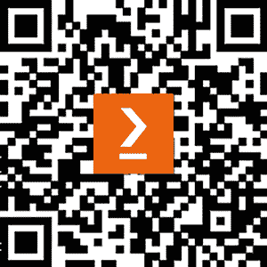

# 前言

随着 Angular 继续作为 JavaScript 框架中的佼佼者，越来越多的开发者正在寻找开始使用这个极其灵活且安全的框架的最佳方法。"学习 Angular"，现在已出到第五版，将向你展示如何使用 Angular 通过最新的网络技术实现跨平台高性能，与现代化网络标准的广泛集成，以及**集成开发环境**（**IDEs**）的集成。

这本书特别适用于那些刚开始接触 Angular 的人，它将帮助你掌握开始开发 Angular 应用程序所需的框架的基本结构。你将学习如何通过利用 Angular 的**命令行界面**（**CLI**）来开发应用程序，编写单元测试，根据 Material Design 指南来设计你的应用程序风格，最后，为生产环境构建它们。

更新至 Angular 19，这一新版本涵盖了众多新特性和实践，旨在解决当前前端网络开发挑战。你将发现有关信号和优化的新专门章节，以及更多关于 Angular 中的错误处理和调试的内容，还有新的实际案例。到本书结束时，你不仅能够从头开始使用 TypeScript 创建 Angular 应用程序，还能通过最佳实践提升你的编码技能。

# 本书面向对象

这本书面向希望开始前端开发的网络开发者，以及希望扩展他们对 JavaScript 框架知识的前端开发者。你需要有 JavaScript 的先验知识，对命令行有基本了解，并且需要熟悉使用 IDE 来开始学习这本书。

# 本书涵盖内容

*第一章*，*构建你的第一个 Angular 应用程序*

在这一章中，我们通过安装 Angular CLI 来设置开发环境，并学习如何使用 schematics（命令）来自动化诸如代码生成和应用构建等任务。我们使用 Angular CLI 创建了一个新的简单应用程序并构建了它。我们还学习了 Visual Studio Code 中可用的最有用的 Angular 工具。

*第二章*，*TypeScript 简介*

在这一章中，我们学习 TypeScript 是什么，它是创建 Angular 应用程序时使用的语言，以及最基本的构建块是什么，例如类型和类。我们还将探讨一些可用的高级类型和语言的最新功能。

*第三章*，*使用组件构建用户界面*

在这一章中，我们学习组件如何与其模板连接，并使用装饰器来配置它。我们探讨组件之间如何通过使用输入和输出绑定将数据从一个组件传递到另一个组件来相互通信，并了解检测组件中变化的不同策略。我们还学习如何在组件生命周期中执行自定义逻辑。

*第四章*，*使用管道和指令丰富应用程序*

在本章中，我们查看 Angular 的内置管道，并构建我们自己的自定义管道。我们学习如何创建指令并通过一个演示其使用的 Angular 应用程序来利用它们。

*第五章*，*使用服务管理复杂任务*

在本章中，我们学习依赖注入机制的工作原理，如何在组件中创建和使用服务，以及如何在 Angular 应用程序中创建提供者。

*第六章*，*Angular 中的响应式模式*

在本章中，我们学习响应式编程是什么，以及我们如何通过 RxJS 库在 Angular 应用程序上下文中使用可观察对象。我们还游览了在 Angular 应用程序中使用的所有常见 RxJS 操作符。

*第七章*，*使用信号跟踪应用程序状态*

在本章中，我们学习 Signals API 的基本概念及其使用理由。我们探索如何使用信号跟踪 Angular 应用程序的状态。我们还查看信号与 RxJS 的互操作性以及它们如何在示例应用程序中良好协作。

*第八章*，*通过 HTTP 与数据服务通信*

在本章中，我们学习如何与远程后端 API 交互，并在 Angular 中执行 CRUD 操作。我们还探讨如何设置额外的 HTTP 请求头，并在发送请求之前或请求完成后拦截它。

*第九章*，*使用路由导航应用程序*

在本章中，我们学习如何使用 Angular 路由激活 Angular 应用程序的不同部分。我们了解如何通过 URL 传递参数，以及如何将应用程序分解为可以懒加载的子路由。然后我们学习如何保护我们的组件，以及如何在组件初始化之前准备数据。

*第十章*，*使用表单收集用户数据*

在本章中，我们学习如何使用 Angular 表单将 HTML 表单集成到应用程序中，以及如何使用 FormGroup 和 FormControl 设置它们。我们跟踪用户在表单中的交互并验证输入字段。

*第十一章*，*处理应用程序错误*

在本章中，我们学习如何处理 Angular 应用程序中的不同类型错误，以及来自框架本身的错误。

*第十二章*，*Angular Material 简介*

在本章中，我们学习如何使用名为 Angular Material 的库将 Google 材料设计指南集成到 Angular 应用程序中，该库由 Angular 团队开发。我们查看库的一些核心组件及其使用方法。我们讨论库捆绑的主题以及如何安装它们。

*第十三章*，*单元测试 Angular 应用程序*

在本章中，我们学习如何测试 Angular 艺术品并在测试中覆盖它们，测试的不同部分是什么，以及组件的哪些部分应该被测试。

*第十四章*，*将应用程序部署到生产环境*

在本章中，我们学习如何使用 Angular CLI 构建和部署 Angular 应用程序。我们查看如何在构建过程中传递环境变量，以及如何在部署前执行构建优化。

*第十五章*，*优化应用程序性能*

在本章中，我们学习什么是**核心 Web 指标**（**CWV**）以及它们如何影响 Angular 应用程序的性能。我们探讨了提高 CWV 指标的三种不同方法：如何在服务器端渲染应用程序，如何从水合中受益，以及如何优化我们的图像。

# 为了充分利用本书

您需要在您的计算机上安装 Angular 19 版本，最好是最新版本。所有代码示例都已在 Windows 上的 Angular 19.0.0 上测试过，但它们也应该适用于 Angular 19 的任何未来版本。

我们建议您亲自输入本书的代码，或者通过 GitHub 仓库（下一节中的链接）获取代码。这样做将帮助您避免与代码复制粘贴相关的任何潜在错误。

## 下载示例代码文件

您可以从[`www.packtpub.com`](http://www.packtpub.com)的账户下载本书的示例代码文件。如果您在其他地方购买了本书，您可以访问[`www.packtpub.com/support`](http://www.packtpub.com/support)并注册，以便将文件直接通过电子邮件发送给您。

您可以通过以下步骤下载代码文件：

1.  在[`www.packtpub.com`](http://www.packtpub.com)登录或注册。

1.  选择**支持**标签页。

1.  点击**代码下载与勘误**。

1.  在**搜索**框中输入本书的名称，并遵循屏幕上的说明。

文件下载完成后，请确保使用最新版本的以下软件解压缩或提取文件夹：

+   WinRAR/7-Zip for Windows

+   Zipeg/iZip/UnRarX for Mac

+   7-Zip/PeaZip for Linux

本书代码包也托管在 GitHub 上，网址为[`github.com/PacktPublishing/Learning-Angular-Fifth-Edition`](https://github.com/PacktPublishing/Learning-Angular-Fifth-Edition)。我们还有其他来自我们丰富图书和视频目录的代码包，可在[`github.com/PacktPublishing/`](https://github.com/PacktPublishing/)找到。查看它们吧！

## 下载彩色图像

我们还提供了一份包含本书中使用的截图/图表彩色图像的 PDF 文件。您可以从这里下载：[`packt.link/gbp/9781835087480`](https://packt.link/gbp/9781835087480)。

## 使用的约定

本书使用了多种文本约定。

`CodeInText`：表示文本中的代码单词、数据库表名、文件夹名、文件名、文件扩展名、路径名、虚拟 URL、用户输入和社交媒体名称。例如；“将下载的`WebStorm-10*.dmg`磁盘映像文件作为系统中的另一个磁盘挂载。”

代码块设置如下：

```js
[default]
exten => s,1,Dial(Zap/1|30)
exten => s,2,Voicemail(u100)
exten => s,102,Voicemail(b100)
exten => i,1,Voicemail(s0) 
```

当我们希望您注意代码块中的特定部分时，相关的行或项目将以粗体显示：

```js
[default]
exten => s,1,Dial(Zap/1|30)
exten => s,2,Voicemail(u100)
**exten => s,102,Voicemail(b100)**
exten => i,1,Voicemail(s0) 
```

任何命令行输入或输出都如下所示：

```js
# cp /usr/src/asterisk-addons/configs/cdr_mysql.conf.sample
     /etc/asterisk/cdr_mysql.conf 
```

**粗体**：表示新术语、重要单词或您在屏幕上看到的单词，例如在菜单或对话框中。例如：“从**管理**面板中选择**系统信息**。”

警告或重要注意事项如下所示。

技巧和窍门如下所示。

# 联系我们

我们始终欢迎读者的反馈。

**一般反馈**：请发送电子邮件至`feedback@packtpub.com`，并在邮件主题中提及书籍标题。如果您对本书的任何方面有疑问，请发送电子邮件至`questions@packtpub.com`。

**勘误表**：尽管我们已经尽最大努力确保内容的准确性，但错误仍然可能发生。如果您在这本书中发现了错误，我们将非常感激您能向我们报告。请访问[`www.packtpub.com/submit-errata`](http://www.packtpub.com/submit-errata)，选择您的书籍，点击勘误提交表单链接，并输入详细信息。

**盗版**：如果您在互联网上以任何形式发现我们作品的非法副本，我们将非常感激您能提供位置地址或网站名称。请通过链接与我们联系`copyright@packtpub.com`。

**如果您有兴趣成为作者**：如果您在某个主题上具有专业知识，并且您有兴趣撰写或为书籍做出贡献，请访问[`authors.packtpub.com`](http://authors.packtpub.com)。

## 评论

一旦您阅读并使用过这本书，为什么不在您购买它的网站上留下评论呢？潜在的读者可以查看并使用您的客观意见来做出购买决定，Packt 公司可以了解您对我们产品的看法，我们的作者也可以看到他们对书籍的反馈。谢谢！

有关 Packt 的更多信息，请访问[packtpub.com](https://packtpub.com)。

# 分享您的想法

一旦您阅读了《Learning Angular，第五版》，我们很乐意听听您的想法！请[点击此处直接进入此书的亚马逊评论页面](https://packt.link/r/1835087485)并分享您的反馈。

您的评论对我们和科技社区非常重要，并将帮助我们确保我们提供高质量的内容。

# 下载此书的免费 PDF 副本

感谢您购买此书！

您喜欢在路上阅读，但无法随身携带您的印刷书籍吗？

您的电子书购买是否与您选择的设备不兼容？

不要担心，现在，随着每本 Packt 书籍，您都可以免费获得该书的 DRM 免费 PDF 版本。

在任何地方、任何设备上阅读。直接从您最喜欢的技术书籍中搜索、复制和粘贴代码到您的应用程序中。

优惠不会就此结束，您还可以获得独家折扣、时事通讯和每日免费内容的每日电子邮件。

按照以下简单步骤获取好处：

1.  扫描下面的二维码或访问以下链接：

****

[`packt.link/free-ebook/9781835087480`](https://packt.link/free-ebook/9781835087480)

1.  提交您的购买证明。

1.  就这样！我们将直接将您的免费 PDF 和其他优惠发送到您的邮箱。
