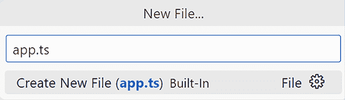
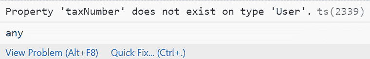

# 第二章：TypeScript 简介

正如我们在上一章中学到的，当我们构建我们的第一个 Angular 应用程序时，Angular 项目的代码是用 TypeScript 编写的。使用 TypeScript 编写代码并利用其静态类型给我们带来了与其他脚本语言相比的显著优势。本章不是对 TypeScript 语言的全面概述。相反，我们将关注对本书有用的核心元素。很快我们就会看到，对这些机制有扎实的知识对于理解 Angular 中的依赖注入工作至关重要。

在本章中，我们将涵盖以下主要主题：

+   JavaScript 基础知识

+   什么是 TypeScript？

+   开始使用 TypeScript

我们将首先通过回顾与 TypeScript 相关的一些基本特性来刷新我们对 JavaScript 的知识，例如函数和类。然后，我们将研究 TypeScript 的背景及其创建的原理。我们还将学习如何编写和执行 TypeScript 代码。我们将强调类型系统，这是 TypeScript 的主要优势，并学习如何使用它来创建基本类型和接口。

# 技术要求

+   **GitHub** : [`github.com/PacktPublishing/Learning-Angular-Fifth-Edition/tree/main/ch02`](https://github.com/PacktPublishing/Learning-Angular-Fifth-Edition/tree/main/ch02 )

+   **Node.js** : [`nodejs.org`](https://nodejs.org )

+   **Git** : [`git-scm.com`](https://git-scm.com )

+   **VSCode** : [`code.visualstudio.com`](https://code.visualstudio.com )

# JavaScript 基础知识

JavaScript 是一种包含许多用于构建 Web 应用的特性的编程语言。在本节中，我们将回顾并刷新我们对一些最基本特性的知识，因为它们与 TypeScript 和 Angular 开发直接相关。TypeScript 是 JavaScript 的语法定义超集，这意味着它添加了诸如类型、接口和泛型等特性。我们将更详细地查看以下 JavaScript 特性：

+   变量声明

+   函数参数

+   箭头函数

+   可选链

+   空值合并

+   类

+   模块

你可以通过以下方式运行本节中的所有代码示例：

+   在浏览器控制台窗口中输入代码

+   在 JavaScript 文件中键入代码，并使用 Node.js 来执行它

如果你熟悉这些特性，你可以直接跳转到 *什么是 TypeScript？* 部分。

## 变量声明

传统上，JavaScript 开发者使用关键字 `var` 来声明对象、变量和其他实体。原因是该语言的老式语义只有函数作用域，其中变量在其上下文中是唯一的：

```js
function myFunc() {
  var x = 0;
} 
```

在前面的函数中，其体内不能声明其他变量作为 `x`。如果你声明了一个，那么你实际上是在重新定义它。然而，在某些情况下，作用域不适用，例如在循环中：

```js
var x = 20;
for (var x = 0; x < 10; x++) {
} 
```

在前面的代码片段中，循环外部的 `x` 变量不会影响循环内部的 `x` 变量，因为它们有不同的作用域。为了克服作用域限制，JavaScript 引入了 `let` 关键字：

```js
function myFunc() {
  let x = 0;
  x = 10;
} 
```

`let` 关键字允许我们在代码中多次更改变量的引用。

在 JavaScript 中定义变量的另一种方式是 `const` 关键字，它表示变量不应该改变。随着代码库的增长，可能会发生错误，这可能会造成损失。`const` 关键字可以防止这类错误。考虑以下代码片段：

```js
const price = 100;
price = 50; 
```

如果我们尝试执行它，将会抛出以下错误信息：

```js
TypeError: Assignment to constant variable. 
```

前面的错误只会在顶层出现。如果你声明对象为常量，比如这样，你需要注意这一点：

```js
const product = { price: 100 };
product.price = 50; 
```

声明 `product` 变量为常量不会阻止整个对象被编辑，而是阻止其引用被编辑。因此，前面的代码是有效的。如果我们尝试更改变量的引用，我们将得到与之前相同的错误：

```js
const product = { price: 100 };
**product = { price: 50 };** 
```

当我们确信一个对象的属性在其生命周期内不会改变时，最好使用 `const` 关键字，因为它可以防止对象意外更改。

当我们想要合并变量时，我们可以使用 **扩展参数** 语法。扩展参数使用省略号（`…`）来展开变量的值：

```js
const category = 'Computing';
const categories = ['Gaming', 'Multimedia'];
const productCategories = [...categories, category]; 
```

在前面的代码片段中，我们将 `categories` 数组与 `category` 项目合并，以创建一个新的数组。`categories` 数组仍然包含两个项目，而新的数组包含三个。当前的行为称为 **不可变性**，这意味着不更改变量，而是创建一个新的变量，该变量来自原始变量。

如果一个对象的属性可以被更改，或者其属性是一个其属性可以被更改的对象，那么这个对象就不是不可变的。

我们还可以在对象上使用扩展参数：

```js
const product = {
  name: 'Keyboard',
  price: 75
};
const newProduct = {
  ...product,
  price: 100,
  category: 'Computing'
}; 
```

在前面的代码片段中，我们没有更改原始的 `product` 对象，而是创建了两个对象之间的合并。`newProduct` 对象的值将是：

```js
{
  name: 'Keyboard',
  price: 100,
  category: 'Computing'
} 
```

`newProduct` 对象从 `product` 对象中获取属性，在其之上添加新的值，并替换现有的值。

## 函数参数

JavaScript 中的函数是我们用来分析输入、消化信息并对数据进行必要转换的处理机。它们使用参数来提供数据以转换我们应用程序的状态或返回一个将被用来塑造应用程序的业务逻辑或用户交互性的输出。

我们可以声明一个函数以接受默认参数，这样函数在执行时如果没有明确传递，就会假定一个默认值：

```js
function addtoCart(productId, quantity = 1) {
  const product = {
    id: productId,
    qty: quantity
  };
} 
```

如果在调用函数时没有为 `quantity` 参数传递值，我们将得到一个 `qty` 设置为 `1` 的 `product` 对象。

默认参数必须在函数签名中的所有 **必需** 参数之后定义。

在定义函数时，JavaScript 的灵活性具有一个显著的优势，即接受一个无限的非声明参数数组，称为**剩余参数**。本质上，我们可以在参数列表的末尾定义一个额外的参数，该参数由省略号（`…`）前缀：

```js
function addProduct(name, ...categories) {
  const product = {
    name,
    categories: categories.join(',')
  };
} 
```

在前面的函数中，我们使用 `join` 方法从 `categories` 参数创建一个以逗号分隔的字符串。我们调用函数时分别传递每个参数：

```js
addProduct('Keyboard', 'Computing', 'Peripherals'); 
```

当我们不知道将传递多少参数时，剩余参数非常有用。`name` 属性也是使用 JavaScript 语言的一个有用特性设置的。我们不是在 `product` 对象中显式设置属性，而是直接使用属性名。以下代码片段与 `addProduct` 函数的初始声明等效：

```js
function addProduct(name, ...categories) {
  const product = {
    name`:` **name**,
    categories: categories.join(',')
  };
} 
```

当参数名称与对象的属性名称匹配时，可以使用简写语法来分配属性值。

## 箭头函数

在 JavaScript 中，我们可以以另一种方式创建函数，称为**箭头函数**。箭头函数的目的是简化通用函数语法，并提供一种安全处理函数作用域的方法，这在传统上是由 `this` 对象处理的。考虑以下示例，它根据产品的价格计算产品折扣：

```js
const discount = (price) => {
  return (price / 100) * 10 ; 
}; 
```

上述代码没有 `function` 关键字，函数体由箭头（`=>`）定义。箭头函数可以通过以下最佳实践进一步简化：

+   当函数签名只有一个参数时，可以省略函数参数中的括号。

+   如果函数体只有一个语句，则可以省略花括号和 `return` 关键字。

结果函数将看起来更简单，更容易阅读：

```js
const discount = price => (price / 100) * 10; 
```

现在我们来解释箭头函数是如何与作用域处理相关的。`this` 对象的值可以指向不同的上下文，这取决于我们在哪里执行函数。当我们在一个回调函数内部使用它时，我们会失去上层上下文，这通常会导致我们使用诸如将其值赋给外部变量之类的约定。考虑以下函数，它使用原生的 `setTimeout` 函数记录产品名称：

```js
function createProduct(name) {
  this.name = name;
  this.getName = function() {
    setTimeout(function() {
      console.log('Product name is:', this.name);
    });
  }
} 
```

使用以下代码片段执行 `getName` 函数，并观察控制台输出：

```js
const product = new createProduct('Monitor');
product.getName(); 
```

上述代码片段不会按预期打印出 `Monitor` 产品的名称，因为我们在 `setTimeout` 回调内部评估函数时修改了 `this` 对象的作用域。为了修复它，将 `setTimeout` 函数转换为使用箭头函数：

```js
setTimeout(() => {
  console.log('Product name is:', this.name);
}); 
```

我们的代码现在更简单，我们可以安全地使用函数作用域。

## 可选链

可选链是一个强大的功能，可以帮助我们重构和简化代码。简而言之，它可以在某个语句中某个值未被提供的情况下，引导我们的代码忽略该语句的执行。让我们通过一个示例来看看可选链：

```js
const getOrder = () => {
  return {
    product: {
      name: 'Keyboard'
    }
  };
}; 
```

在前面的代码片段中，我们定义了一个`getOrder`函数，它返回特定订单的产品。接下来，让我们获取`product`属性的值，确保在读取之前存在`order`：

```js
const order = getOrder();
if (order !== undefined) {
  const product = order.product;
} 
```

之前的代码片段是在我们的对象已被修改的情况下采取的预防措施。如果我们不检查对象并且它已经变为`undefined`，JavaScript 将抛出一个错误。然而，我们可以使用可选链来改进之前的语句：

```js
const order = getOrder();
**const product = order?.product;** 
```

`order`对象后面的字符`?`确保只有当对象有值时才会访问`product`属性。可选链在更复杂的场景中也同样适用，例如：

```js
const name = order?.product?.name; 
```

在前面的代码片段中，我们也检查了`product`对象是否有值，然后再访问其`name`属性。

## 空值合并

空值合并与在变量未设置时提供默认值相关。考虑以下示例，它只在`qty`变量存在时才将值赋给`quantity`变量：

```js
const quantity = qty ? qty : 1; 
```

之前的语句被称为**三元运算符**，它的工作方式类似于条件语句。如果`qty`变量没有值，`quantity`变量将被初始化为默认值`1`。我们可以使用空值合并来重写之前的表达式：

```js
const quantity = qty ?? 1; 
```

空值合并有助于使我们的代码更易读且更简洁。

## 类

JavaScript 类允许我们组织我们的应用程序代码并创建每个类的实例。一个类可以有属性成员、构造函数、方法和属性访问器。以下代码片段展示了类的外观：

```js
class User {
  firstName = '';
  lastName = '';
  #isActive = false;
  constructor(firstName, lastName, isActive = true) {
    this.firstName = firstName;
    this.lastName = lastName;
    this.#isActive = isActive;
  }
  getFullname() {
    return `${this.firstName} ${this.lastName}`;
  }

  get active() {
    return this.#isActive;
  }
} 
```

类语句封装了几个元素，我们可以将其分解：

+   **成员**：`User`类包含`firstName`、`lastName`和`#isActive`成员。类成员只能从类本身内部访问。`User`类的实例将只能访问公共属性`firstName`和`lastName`。`#isActive`属性将不可用，因为它是一个私有属性，如属性名前的`#`字符所示。

+   **构造函数**：当创建类的实例时执行`constructor`。它通常用于使用签名中提供的参数初始化类成员。我们还可以为参数如`isActive`参数提供默认值。

+   **方法**：方法代表一个函数，可以返回一个值，例如`getFullname`方法，它构建用户的完整名称。它也可以定义为私有，类似于类成员。

+   **属性访问器**：属性访问器是通过在方法前加上`set`关键字使其可写，加上`get`关键字使其可读，然后跟我们要公开的属性名来定义的。`active`方法是一个属性访问器，它返回`#isActive`成员的值。

类还可以扩展其他类的成员和功能。我们可以通过在类定义中添加 `extends` 关键字并跟随后要继承的类来使一个类继承另一个类：

```js
class Customer extends User {
  taxNumber = '';

  constructor(firstName, lastName) {
    super(firstName, lastName);
  }
} 
```

在前面的代码片段中，`Customer` 类扩展了 `User` 类，这暴露了 `firstName` 和 `lastName` 属性。`Customer` 类的任何实例都可以默认使用这些属性。我们还可以通过添加具有相同名称的方法来覆盖 `User` 类的方法。`constructor` 方法需要调用 `super` 方法，它指向 `User` 类的 `constructor`。

## 模块

随着我们的应用程序规模和增长，将会有一个时刻我们需要更好地组织代码，并使其可持续和可重用。模块是实现这些任务的好方法，因此让我们看看它们是如何工作的，以及我们如何在应用程序中实现它们。

在前面的章节中，我们学习了如何使用类。将两个类放在同一个文件中是不可扩展的，维护它也不会容易。想象一下，你必须处理多少代码才能在其中一个类中做简单的更改。模块允许我们将应用程序代码分离成单个文件，强制执行 **单一职责模式**（**SRP**）。每个文件都是一个不同的模块，关注特定的功能或功能。

将模块拆分为多个文件的良好迹象是当模块开始占据不同的领域时。例如，产品模块不能包含客户逻辑。

让我们重构上一节中描述的代码，以便 `User` 和 `Customer` 类属于不同的模块：

1.  打开 VSCode 并创建一个名为 `user.js` 的新 JavaScript 文件。

1.  将 `User` 类的内容输入进去，并在类定义中添加 `export` 关键字。`export` 关键字使模块对其他模块可用，并形成模块的公共 API。

1.  创建一个名为 `customer.js` 的新 JavaScript 文件，并将 `Customer` 类的内容添加进去。`Customer` 类不能识别 `User` 类，因为它们在不同的文件中。

1.  通过在文件顶部添加以下语句将 `User` 类导入到 `customer.js` 文件中：

    ```js
    import { User } from './user'; 
    ```

我们使用 `import` 关键字和模块文件的无扩展名相对路径来导入 `User` 类。如果一个模块导出多个工件，我们将它们放在大括号内，用逗号分隔，例如：

```js
import { User, UserPreferences } from './user'; 
```

探索模块结束了我们对 JavaScript 基础知识的旅程。在下一节中，我们将学习 TypeScript 以及它是如何帮助我们构建 Web 应用程序的。

# 什么是 TypeScript？

由于早期 JavaScript 版本的限制，将小型网络应用程序转换为厚重的单体客户端是不可能的。简而言之，大规模 JavaScript 应用程序在规模和复杂性增加后，就面临着严重的可维护性和可扩展性问题。随着新库和模块需要无缝集成到我们的应用程序中，这个问题变得更加相关。缺乏适当的互操作性机制导致了繁琐的解决方案。

为了克服这些困难，微软构建了一个 JavaScript 超集，这将有助于使用静态类型检查、更好的工具和代码分析来构建具有较低错误足迹的企业应用程序。TypeScript 1.0 于 2014 年推出。它领先于 JavaScript，实现了相同的功能，并为构建大规模应用程序提供了一个稳定的环境。它通过类型注解引入了可选的静态类型，从而确保了编译时的类型检查并在开发过程中早期捕捉到错误。它对声明文件的支持还使开发者能够描述他们模块的接口，以便其他开发者能够更好地将它们集成到他们的代码工作流程和工具中。

您可以通过 [`www.typescriptlang.org`](https://www.typescriptlang.org) 访问官方 TypeScript 网站。它包含了广泛的语言文档和一个游乐场，我们可以快速通过教程熟悉语言。它包含了一些现成的代码示例，涵盖了语言的一些最常见特性。

作为 JavaScript 的超集，在您的下一个项目中采用 TypeScript 的一大优势是低门槛。如果您了解 JavaScript，那么您基本上已经准备好了，因为 TypeScript 中的所有附加功能都是可选的。您可以挑选并引入其中任何一项来实现您的目标。总的来说，使用 TypeScript 在您的下一个项目中有很多坚实的论据，并且这些论据都适用于 Angular。

下面是一些优势的简要概述：

+   使用类型注释注释您的代码确保了您不同代码单元的一致集成，并提高了代码的可读性和理解性。

+   内置的类型检查器在编译时分析您的代码，并帮助您在执行代码之前防止错误。

+   使用类型确保了您应用程序的一致性。结合前两点，从长远来看，整体代码错误足迹得到了最小化。

+   接口确保了您的库在其他系统和代码库中的平稳无缝集成。

+   不同 IDE 上的语言支持令人惊叹，您可以免费享受代码高亮、实时类型检查和自动编译等特性。

+   语法对来自其他基于 OOP 的背景（如 Java、C# 和 C++）的开发者来说很熟悉。

在下一节中，我们将学习如何开发和执行 TypeScript 应用程序。在 Angular 应用程序中，我们不需要手动执行 TypeScript 代码，因为 Angular CLI 会自动处理它；然而，了解其底层工作原理是很好的。

# 开始使用 TypeScript

TypeScript 语言是一个可以从 npm 注册表安装的 npm 包，使用以下命令进行安装：

```js
npm install -g typescript 
```

在上述命令中，我们选择在系统中全局安装 TypeScript，这样我们就可以在开发环境的任何路径中使用它。让我们通过一个简单的示例来看看如何使用 TypeScript：

1.  打开 VSCode 并从主菜单选项中选择 **文件** | **新建文件…**。

1.  在 **新建文件…** 对话框中输入 `app.ts` 并按 *Enter* 键。



图 2.1：新建文件… 对话框

正如我们已经学到的，TypeScript 文件具有 `.ts` 扩展名。

1.  选择你想要创建新文件的路径。VSCode 将在编辑器中打开该文件。

1.  将以下代码片段输入到 `app.ts` 文件中：

    ```js
    const title = 'Hello TypeScript!'; 
    ```

尽管我们已经创建了一个 TypeScript 文件，但上述代码片段是有效的 JavaScript 代码。回想一下，TypeScript 是 JavaScript 的超集，它通过其类型系统提供语法糖。然而，使用 TypeScript 编写纯 JavaScript 代码并不会给我们带来任何明显的优势。

1.  打开一个终端窗口并运行以下命令以将 TypeScript 文件编译成 JavaScript：

    ```js
    tsc app.ts 
    ```

上述命令启动了一个名为 **编译** 的过程，由 `tsc` 可执行文件执行，它是 TypeScript 语言的核心理念。我们需要将 TypeScript 代码编译成 JavaScript，因为浏览器目前不支持 TypeScript。

Angular 使用一个编译器，该编译器在底层使用 TypeScript 编译器来构建 Angular 应用程序。

TypeScript 编译器支持额外的配置选项，我们可以通过终端窗口或配置文件将它们传递给 `tsc` 可执行文件。完整的编译器选项列表可以在 [`www.typescriptlang.org/docs/handbook/compiler-options.html`](https://www.typescriptlang.org/docs/handbook/compiler-options.html) 找到。

1.  编译过程将在 TypeScript 文件所在的同一文件夹中创建一个 `app.js` 文件。新文件将包含以下代码：

    ```js
    var title = 'Hello TypeScript!'; 
    ```

由于我们尚未使用任何特定的 TypeScript 功能，上述代码片段几乎与原始代码相同，除了变量声明。

1.  编译过程将 `const` 关键字替换为 `var` 关键字，因为 TypeScript 编译器默认使用旧的 JavaScript 版本。我们可以通过在 `tsc` 命令中指定 `target` 来更改这一点：

    ```js
    tsc app.ts --target es2022 
    ```

在前面的命令中，我们指定了 `es2022`，这代表了撰写时的 JavaScript 语言的最新版本。我们将在本书中构建的 Angular 应用程序默认也针对相同的 JavaScript 版本。

1.  由于我们将在本章的其余部分使用最新的 JavaScript 版本，让我们使用 TypeScript 配置文件来定义 `target` 选项。在当前文件夹中创建一个名为 `tsconfig.json` 的文件，并添加以下内容：

    ```js
    {
      "compilerOptions": {
        "target": "ES2022"
      }
    } 
    ```

你可以在 [`www.typescriptlang.org/tsconfig`](https://www.typescriptlang.org/tsconfig) 找到 TypeScript 配置文件的更多选项。

在终端窗口中运行 `tsc` 命令以验证输出 JavaScript 文件保持不变。

当我们不带选项运行 `tsc` 命令时，它将使用配置文件中的选项编译当前文件夹中的所有 TypeScript 文件。

我们迄今为止编写的 TypeScript 代码没有使用 TypeScript 特定功能。在下一节中，我们将学习如何使用类型系统，这是 TypeScript 语言最强大和最基本的功能。

## 类型

使用 TypeScript 或任何其他编程语言意味着处理数据，这些数据可以代表不同类型的内容，称为 **类型**。类型用于表示数据可以是文本、整数值或这些值类型的数组等。

类型在编译过程中消失，并且不包括在最终的 JavaScript 代码中。

你可能已经在 JavaScript 中遇到了类型，因为我们总是隐式地使用它们。在 JavaScript 中，任何给定的变量都可能假设（或返回，在函数的情况下）任何值。有时，这会导致我们的代码中出现错误和异常，因为代码返回的类型与我们期望返回的类型之间发生类型冲突。然而，静态类型化我们的变量为我们和我们的 IDE 提供了一个很好的了解，在每个代码实例中我们应该找到什么类型的数据。这成为了一种在代码执行之前在编译时帮助我们调试应用程序的无价方式。

### 字符串

最广泛使用的原始类型之一是 `string`，它用文本填充变量：

```js
const product: string = 'Keyboard'; 
```

类型是通过在变量旁边添加冒号和类型名称来定义的。

### 布尔

`boolean` 类型定义了一个变量，它可以具有 `true` 或 `false` 的值：

```js
const isActive: boolean = true; 
```

`boolean` 变量的结果是条件语句的满足。

### 数字

`number` 类型可能是除 `string` 和 `boolean` 之外最广泛使用的原始数据类型：

```js
const price: number = 100; 
```

我们可以使用 `number` 类型来定义浮点数和十六进制、十进制、二进制和八进制字面量。

### 数组

**数组**类型定义了一个只包含特定类型的项的列表。现在，我们可以通过这种类型轻松避免由错误引起的异常，例如在列表中分配错误的成员类型。我们可以使用方括号语法或`Array`关键字来定义数组：

```js
const categories: string[] = ['Computing', 'Multimedia'];
const categories: Array<string> = ['Computing', 'Multimedia']; 
```

在应用程序开发期间，与团队就语法达成一致并坚持使用它是明智的。

如果我们尝试向`categories`数组添加一个类型不是`string`的新项，TypeScript 将抛出一个错误，确保我们的类型化成员保持一致，我们的代码无错误。

### `any`

在所有前面的情况下，类型是可选的，因为 TypeScript 足够智能，可以从变量的值中推断出数据类型，具有一定的准确性。

让类型系统推断类型非常重要，而不是手动进行类型化。类型系统永远不会出错，但开发者可能会出错。

然而，如果不可能，类型系统将自动将动态的`any`类型分配给弱类型数据，代价是降低类型检查到最低限度。此外，当从任何给定点的信息中难以推断数据类型时，我们可以在代码中手动添加`any`类型。`any`类型包括所有其他现有类型，因此我们可以用它可以对任何数据值进行类型化，并在以后将其赋值：

```js
let order: any;
function setOrderNo() {
  order = '0001';
} 
```

TypeScript 包含另一种类型，类似于`any`类型，称为`unknown`。`unknown`类型的变量可以具有任何类型的值。主要区别在于，除非我们首先进行类型检查，否则 TypeScript 不会让我们对未知值执行任意操作，例如调用方法。

然而，权力越大，责任越大。如果我们绕过静态类型检查的便利性，我们就会打开在通过我们的应用程序传输数据时出现类型错误的门。确保我们应用程序中的类型安全取决于我们。

### 自定义类型

在 TypeScript 中，如果你需要，可以通过以下方式使用`type`关键字来自定义类型：

```js
type Categories = 'computing' | 'multimedia'; 
```

然后，我们可以创建一个特定类型的变量，如下所示：

```js
const category: Categories = 'computing'; 
```

前面的代码作为`computing`是允许的值之一，并且按预期工作。自定义类型是添加有限数量允许值的类型的绝佳方式。

当我们想要从一个对象创建一个自定义类型时，我们可以使用`keyof`运算符。`keyof`运算符使我们能够遍历对象的属性并将它们提取到一个新类型中：

```js
type Category = {
  computing: string;
  multimedia: string;
};
type CategoryType = keyof Category; 
```

在前面的代码片段中，`CategoryType`产生的结果与`Categories`类型相同。我们将学习如何在第四章中动态地使用`keyof`运算符遍历对象属性，即*使用管道和指令丰富应用程序*。

TypeScript 的类型系统主要用于用类型注解 JavaScript 代码。它通过提供智能感应和防止开发早期出现的错误来提高开发者体验。在下一节中，我们将学习更多关于在函数中添加类型注解的内容。

### 函数

TypeScript 中的函数与普通 JavaScript 函数没有太大区别，除了像 TypeScript 中的其他一切一样，它们可以用静态类型进行注解。因此，它们通过在它们的签名中提供编译器期望的信息以及它们旨在返回的数据类型（如果有的话）来改进编译器。

以下示例展示了如何在 TypeScript 中注解普通函数：

```js
function getProduct(): string {
  return 'Keyboard';
} 
```

在前面的代码片段中，我们通过在函数声明中添加 `string` 类型来注解了函数的返回值。我们也可以在函数参数中添加类型，例如：

```js
function getFullname(firstName: string, lastName: string): string {
  return `${this.firstName} ${this.lastName}`;
} 
```

在前面的代码片段中，我们注解了在函数签名中声明的参数，这是有意义的，因为编译器将想要检查提供的数据是否具有正确的类型。

如前文所述，TypeScript 编译器足够智能，能够在没有提供注解的情况下推断类型。在上述两个函数中，我们可以省略类型，因为编译器可以从提供的参数和返回语句中推断出它。

当一个函数不返回类型时，我们可以使用 `void` 类型来注解它：

```js
function printFullname(firstName: string, lastName: string): void {
  console.log(`${this.firstName} ${this.lastName}`);
} 
```

我们已经学习了如何在 JavaScript 函数中使用默认和剩余参数。TypeScript 通过引入可选参数扩展了函数的功能。通过在参数名称后添加字符 `?` 来定义可选参数：

```js
function addtoCart(productId: number, quantity?: number) {
  const product = {
    id: productId,
    qty: quantity ?? 1
  };
} 
```

在前面的函数中，我们将 `quantity` 定义为可选参数。我们还使用了空值合并运算符来设置 `product` 对象的 `qty` 属性，如果未传递 `quantity`。

我们可以通过仅传递 `productId` 参数或两者都传递来调用 `addToCart` 函数。

可选参数应该放在函数签名中的最后。

我们已经学习了如何使用 JavaScript 类来帮助我们组织应用程序代码。在下一节中，我们将看到如何在 TypeScript 中使用它们来进一步改进我们的应用程序。

### 类

考虑我们在 `user.js` 文件中定义的 `User` 类：

```js
export class User {
  firstName = '';
  lastName = '';
  #isActive = false;
  constructor(firstName, lastName, isActive = true) {
    this.firstName = firstName;
    this.lastName = lastName;
    this.#isActive = isActive;
  }
  getFullname() {
    return `${this.firstName} ${this.lastName}`;
  }

  get active() {
    return this.#isActive;
  }
} 
```

我们将采取简单、小步骤来在整个类中添加类型：

1.  将文件重命名为 `user.ts` 以将其转换为 TypeScript。

1.  为所有类属性添加以下类型：

    ```js
    firstName: **string** = '';
    lastName: **string** = '';
    **private isActive: boolean** = false; 
    ```

在前面的代码片段中，我们还使用了 `private` 修饰符来定义 `isActive` 属性为私有。

1.  通过为参数添加类型来修改 `constructor`：

    ```js
    constructor(firstName`:` **string**, lastName`:` **string**, isActive`:` **boolean** = true) {
      this.firstName = firstName;
      this.lastName = lastName;
      this**.isActive** = isActive;
    } 
    ```

或者，我们可以省略类属性，让 `constructor` 通过将参数声明为 `private` 自动创建它们：

`constructor(private firstName: string, private lastName: string, private isActive: boolean = true) {}`

1.  最后，在 `active` 属性访问器和 `getFullname` 方法中添加类型：

    ```js
    getFullname()**: string** {
      return `${this.firstName} ${this.lastName}`;
    }
    get active()**: boolean** {
      return this**.isActive****;**
    } 
    ```

将 JavaScript 类转换为 TypeScript 并添加类型是利用 TypeScript 中类型功能的重要步骤。

TypeScript 与类相关的一个伟大特性是 `instanceOf` 关键字。它允许我们检查类实例的类型，并按照相关类提供正确的属性。让我们通过在 `customer.js` 文件中定义的 `Customer` 类来探索它：

1.  将文件重命名为 `customer.ts` 以将其转换为 TypeScript。

1.  按如下方式重写 `Customer` 类以添加类型：

    ```js
    class Customer extends User {
      taxNumber**: number;**
      constructor(firstName**: string**, lastName**: string**) {
        super(firstName, lastName);
      }
    } 
    ```

1.  创建一个可以在 `User` 和 `Customer` 类型之间切换的对象：

    ```js
    const account: User | Customer = undefined; 
    ```

1.  我们现在可以使用 `instanceOf` 关键字根据底层类访问 `account` 对象的不同属性：

    ```js
    if (account instanceof Customer) {
      const taxNo = account.taxNumber;
    } else {
      const name = account.getFullname();
    } 
    ```

TypeScript 足够智能，能够理解在 `else` 语句中的 `account` 对象没有 `taxNumber` 属性，因为它属于 `User` 类型。即使我们错误地尝试访问它，VSCode 也会抛出一个错误：



图 2.2：属性访问错误

TypeScript 类帮助我们编写结构良好的代码，可以被实例化，包含业务逻辑，并在我们的应用程序中提供静态类型。随着应用程序的扩展和更多类的创建，我们需要找到确保代码一致性和规则遵守的方法。正如我们将在下一节中学习的，解决一致性和类型验证的最佳方法之一是创建 **接口**。

## 接口

接口是一种代码契约，它定义了特定的模式。任何实现接口的类和函数等工件都应该遵守此模式。当我们想要对由工厂生成的类强制执行严格的类型检查，或者当我们定义函数签名以确保在有效负载中找到特定类型的属性时，接口是有益的。

接口在编译过程中消失，并且不会包含在最终的 JavaScript 代码中。

在下面的代码片段中，我们定义了一个用于管理产品的接口：

```js
interface Product {
  name: string;
  price: number;
  getCategories: () => string[];
} 
```

当处理来自后端 API 或其他来源的数据时，接口是推荐的方法。

一个接口可以包含属性和方法。在上面的代码片段中，`Product` 接口包含了 `name` 和 `price` 属性。它还定义了 `getCategories` 方法。一个类可以通过在类声明中添加 `implements` 关键字和接口名称来使用接口：

```js
class Keyboard implements Product {
  name: string = 'Keyboard';
  price: number = 20;
  getCategories(): string[] {
    return ['Computing', 'Peripherals'];
  }
} 
```

在前面的代码片段中，`Keyboard` 类必须实现 `Product` 接口的所有成员；否则，TypeScript 会抛出一个错误。如果我们不想实现接口成员，我们可以使用 `?` 字符将其定义为可选：

```js
interface Product {
  name: string;
  price: number;
  getCategories: () => string[];
  **description?: string;**
} 
```

我们还可以使用接口来改变变量的类型，从一种类型转换为另一种类型，这被称为**类型转换**。当处理动态数据或 TypeScript 无法自动推断变量类型时，类型转换非常有用。在以下代码中，我们指示 TypeScript 将`product`对象视为`Product`类型：

```js
const product = {
  name: 'Keyboard',
  price: 20
} as Product; 
```

然而，类型转换应该谨慎使用。在先前的代码片段中，我们故意省略了添加`getCategories`方法，但 TypeScript 没有抛出错误。当我们使用类型转换时，我们告诉 TypeScript 一个变量*假装*是特定类型。

建议尽可能避免类型转换，并明确定义类型。

接口可以与**泛型**结合使用，无论数据类型如何，都可以提供通用的代码行为，正如我们将在下一节中学习的那样。

### 泛型

当我们想在其他 TypeScript 元素（如方法）中使用动态类型时，会使用泛型。

假设我们想要创建一个用于在浏览器本地存储中保存`Product`对象的函数：

```js
function save(data: Product) {
  localStorage.setItem('Product', JSON.stringify(data));
} 
```

在先前的代码中，我们明确地将`data`参数定义为`Product`。如果我们还想保存`Keyboard`对象，我们应该按以下方式修改`save`方法：

```js
function save(data: Product **| Keyboard**) {
  localStorage.setItem('Product', JSON.stringify(data));
} 
```

然而，如果我们未来想要添加其他类型，先前的这种方法并不容易扩展。相反，我们可以使用泛型来让`save`方法的消费者决定传递的数据类型：

```js
function save<T>(data: T) {
  localStorage.setItem('Product', JSON.stringify(data));
} 
```

在先前的例子中，`T`的类型直到我们使用该方法时才会被评估。我们使用`T`作为定义泛型的约定，但你也可以使用其他字母。我们可以按照以下方式为`Product`对象执行`save`方法：

```js
save<Product>({
  name: 'Microphone',
  price: 45,
  getCategories: () => ['Peripherals', 'Multimedia']
}); 
```

正如你所见，其类型根据你如何调用它而变化。它还确保你传递了正确的数据类型。假设先前的方法以这种方式被调用：

```js
save<Product>('Microphone'); 
```

我们指定`T`应该是`Product`，但我们坚持将其值作为字符串传递。编译器清楚地指出这是不正确的。如果我们想在`save`方法中使用更多泛型，我们可以使用不同的字母，例如：

```js
function save<T, **P**>(data: T, **obj: P**) {
  localStorage.setItem('Product', JSON.stringify(data));
} 
```

泛型通常用于集合中，因为它们的行为相似，无论类型如何。然而，它们也可以用于其他构造，如方法。其理念是泛型应该表明你即将以不允许的方式混合类型。

如果你有一个与许多不同数据类型相关的典型行为，泛型是非常强大的。你可能不会编写自定义泛型，至少最初不会，但了解正在发生的事情是好的。

在下一节中，我们将探讨一些与接口相关的实用类型，这些类型将有助于我们在 Angular 开发过程中。

### 实用类型

实用类型是帮助我们从现有类型派生出新类型的类型。

当我们想要从一个所有属性都是可选的接口中创建对象时，会使用`Partial`类型。在下面的代码片段中，我们使用`Product`接口声明了一个产品的简化版本：

```js
const mic: Partial<Product> = {
  name: 'Microphone',
  price: 67
}; 
```

在前面的代码片段中，我们可以看到`mic`对象不包含`getCategories`方法。或者，我们可以使用`Pick`类型，它允许我们从接口属性的一个子集中创建对象：

```js
type Microphone = Pick<Product, 'name' | 'price'>;
const microphone: Microphone = {
  name: 'Microphone',
  price: 67
}; 
```

一些语言，如 C#，在定义键值对对象或字典时有一个保留类型，正如其名。在 TypeScript 中，如果我们想定义这样的类型，我们可以使用`Record`类型：

```js
interface Order {
  products: Record<string, number>;
} 
```

前面的代码片段将产品名称定义为`string`类型，将数量定义为`number`类型。

你可以在[`www.typescriptlang.org/docs/handbook/utility-types.html`](https://www.typescriptlang.org/docs/handbook/utility-types.html)找到更多实用类型。

## 摘要

虽然阅读起来很长，但这个 TypeScript 入门介绍对于理解 Angular 中许多最精彩部分的逻辑是必要的。它使我们能够介绍语言语法并解释其作为构建 Angular 框架首选语法的成功原因。

我们回顾了类型架构以及在设计具有各种参数签名替代方案的功能时如何创建高级业务逻辑。我们还发现了如何使用强大的箭头函数绕过与作用域相关的问题。通过探索 Angular 应用程序中最常用的某些功能，我们增强了我们对 TypeScript 的了解。

可能本章最相关的部分是我们对类、方法、属性和访问器的概述，以及我们如何通过接口处理继承和更好的应用程序设计。

在掌握了所有这些知识之后，我们可以开始通过构建 Angular 应用程序来学习如何应用它们。在下一章中，我们将学习如何使用 Angular 组件来创建可组合的用户界面，以维护我们的应用程序代码并使其更具可扩展性。
