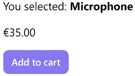
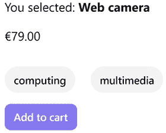
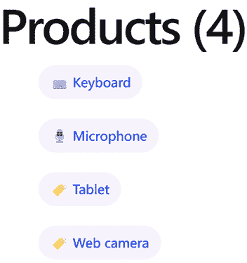
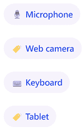
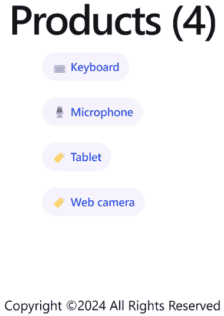

# 第四章：使用管道和指令丰富应用程序

在上一章中，我们构建了几个组件，利用输入和输出属性在屏幕上渲染数据。在本章中，我们将利用这些知识，通过使用 Angular **管道**和**指令**将我们的组件提升到下一个层次。管道允许我们消化和转换我们在模板中绑定的信息。指令使更雄心勃勃的功能成为可能，例如操作 DOM 或改变 HTML 元素的外观和行为。

在本章中，我们将学习以下概念：

+   使用管道操作数据

+   构建管道

+   构建指令

# 技术要求

本章包含代码示例，引导您了解 Angular 管道和指令。您可以在以下 GitHub 仓库的`ch04`文件夹中找到相关源代码：

[`www.github.com/PacktPublishing/Learning-Angular-Fifth-Edition`](https://www.github.com/PacktPublishing/Learning-Angular-Fifth-Edition)

# 使用管道操作数据

管道允许我们在视图级别转换表达式的结果。它们以数据为输入，将其转换为所需的格式，并在模板中显示输出。

管道的语法由我们想要转换的表达式后面的管道名称组成，由管道符号（`|`）分隔：

```js
expression | pipe 
```

任何参数都添加在管道名称之后，并由冒号分隔：

```js
expression | pipe:param 
```

管道可以在 Angular 模板中使用插值和属性绑定，并且可以相互链接。

Angular 已经内置了广泛的自定义管道类型：

+   `uppercase` / `lowercase` : 将字符串转换为大写或小写字母。

+   `percent` : 将数字格式化为百分比。

+   `date` : 以特定的日期格式格式化日期或字符串。默认情况下，管道显示的日期根据用户的机器的本地设置。然而，我们可以传递 Angular 已经内置的额外格式作为参数。

+   `currency` : 将数字格式化为本地货币。我们可以覆盖本地设置并更改货币符号，通过将货币代码作为参数传递给管道。

+   `json` : 将对象作为输入，并以 JSON 格式输出，将单引号替换为双引号。`json`管道的主要用途是调试。这是一种查看复杂对象内容并优雅地打印到屏幕上的绝佳方式。

+   `keyvalue` : 将对象转换为键值对集合，其中每个项目的`key`代表对象的属性，而`value`是其实际值。

+   `slice` : 从集合或字符串中减去一个子集（切片）。它接受一个起始索引作为参数，其中它将开始切片输入数据，以及可选的结束索引。当指定结束索引时，该索引处的项目不包括在结果数组中。如果省略结束索引，则默认为数据的最后一个索引。

`slice` 管道转换不可变数据。转换后的列表始终是原始数据的副本，即使它返回所有项目。

+   `async`：当我们管理组件类异步处理的数据时使用，我们需要确保我们的视图能够及时反映变化。我们将在 *第八章* 中学习更多关于这个管道的内容，*通过 HTTP 与数据服务通信*，我们将使用它来异步获取和显示数据。

您需要我们创建在 *第三章* 中 *使用组件构建用户界面* 中创建的 Angular 应用程序的源代码，以跟随本章的其余部分。

我们将更详细地介绍 `lowercase`、`currency` 和 `keyvalue` 管道，但我们鼓励您在 [`angular.dev/api`](https://angular.dev/api) 的 API 参考中探索其余部分：

1.  打开 `product-detail.component.ts` 文件并导入 `CommonModule` 类：

    ```js
    **import { CommonModule } from '@angular/common';**
    import { Component, input, output } from '@angular/core';
    import { Product } from '../product';
    @Component({
      selector: 'app-product-detail',
      imports: [**CommonModule**],
      templateUrl: './product-detail.component.html',
      styleUrl: './product-detail.component.css'
    }) 
    ```

`CommonModule` 类导出 Angular 内置管道。Angular 组件在使用组件模板中的内置管道之前必须导入 `CommonModule`。

1.  打开 `product.ts` 文件，并将以下字段添加到 `Product` 接口中，以描述产品的附加属性：

    ```js
    export interface Product {
      id: number;
      title: string;
      **price: number;**
    **categories: Record<number, string>;**
    } 
    ```

`categories` 属性是一个对象，其中键代表类别 ID，值代表类别描述。

1.  打开 `product-list.component.ts` 文件并修改 `products` 数组以设置新属性的值：

    ```js
    products: Product[] = [
      { 
        id: 1,
        title: 'Keyboard',
        **price: 100,**
    **categories: {**
    **1: 'Computing',**
    **2: 'Peripherals'**
    **}**
      },
      {
        id: 2,
        title: 'Microphone',
        **price: 35,**
    **categories: { 3: 'Multimedia' }**
      },
      {
        id: 3,
        title: 'Web camera',
        **price: 79,**
    **categories: {**
    **1: 'Computing',**
    **3: 'Multimedia'**
    **}**
      },
      {
        id: 4,
        title: 'Tablet',
        **price: 500,**
    **categories: { 4: 'Entertainment' }**
      }
    ]; 
    ```

1.  打开 `product-detail.component.html` 文件并添加一个段落元素以显示所选产品的欧元价格：

    ```js
    @if (product()) {
      <p>You selected:
        <strong>{{product()!.title}}</strong>
      </p>
      **<p>{{product()!.price | currency:'EUR'}}</p>**
      <button (click)="addToCart()">Add to cart</button>
    } 
    ```

1.  运行 `ng serve` 以启动应用程序并从产品列表中选择 **麦克风**：



图 4.1：产品详情

在前面的图像中，产品价格以货币格式显示。

1.  在产品价格下方添加以下代码片段以显示产品类别：

    ```js
    <div class="pill-group">
      @for (cat of product()!.categories | keyvalue; track cat.key) {
        <p class="pill">{{cat.value | lowercase}}</p>
      }
    </div> 
    ```

在前面的代码片段中，我们使用了 `@for` 块来遍历 `product` 变量的 `categories` 属性。由于 `categories` 属性不是一个可迭代的对象，所以我们使用了 `keyvalue` 管道将其转换为包含 `key` 和 `value` 属性的数组。`key` 属性代表类别 ID，这是一个我们可以与 `track` 变量一起使用的唯一标识符。`value` 属性存储类别描述。

此外，我们还使用了 `lowercase` 管道将类别描述转换为小写文本。

1.  将以下 CSS 样式添加到 `product-detail.component.css` 文件中：

    ```js
    .pill-group {
      display: flex;
      flex-direction: row;
      align-items: start;
      flex-wrap: wrap;
      gap: 1.25rem;
    }
    .pill {
      display: flex;
      align-items: center;
      --pill-accent: var(--gray-900);
      background: color-mix(in srgb, var(--pill-accent) 5%, transparent);
      color: var(--pill-accent);
      padding-inline: 0.75rem;
      padding-block: 0.375rem;
      border-radius: 2.75rem;
      border: 0;
      transition: background 0.3s ease;
      font-family: var(--inter-font);
      font-size: 0.875rem;
      font-style: normal;
      font-weight: 500;
      line-height: 1.4rem;
      letter-spacing: -0.00875rem;
      text-decoration: none;
    } 
    ```

1.  在运行应用程序时，从列表中选择 **网络摄像头** 产品：



图 4.2：包含类别的产品详情

使用`CommonModule`的替代方案，我们可以从`@angular/common` npm 包中单独导入每个管道类：

```js
import { **CurrencyPipe, KeyValuePipe, LowerCasePipe** } from '@angular/common';
import { Component, input, output } from '@angular/core';
import { Product } from '../product';
@Component({
  selector: 'app-product-detail',
  imports: [**KeyValuePipe, CurrencyPipe, LowerCasePipe**],
  templateUrl: './product-detail.component.html',
  styleUrl: './product-detail.component.css'
}) 
```

在最终的`product-detail.component.html`文件中，我们多次使用`product()!`片段来读取`product`属性的值。或者，我们可以使用`@let`语法创建一个别名，如下所示：

```js
@let selectedProduct = product()!; 
```

`@let`关键字类似于 JavaScript 中的`let`关键字，用于声明仅在组件模板中可用的变量。在前面的代码片段中，我们声明了`selectedProduct`变量，它可以在 HTML 代码的其余部分中使用，如下所示：

```js
@if (**selectedProduct**) {
  <p>You selected:
    <strong>{{**selectedProduct**.title}}</strong>
  </p>
  <p>{{**selectedProduct**.price | currency:'EUR'}}</p>
  <div class="pill-group">
    @for (cat of **selectedProduct**.categories | keyvalue; track cat.key) {
      <p class="pill">{{cat.value | lowercase}}</p>
    }
  </div>  
  <button (click)="addToCart()">Add to cart</button>
} 
```

`@let`关键字帮助我们处理在模板中使用复杂表达式的情况，例如：

+   三元运算符

+   嵌套对象属性

+   异步管道

内置管道对于大多数用例来说已经足够了，但在其他情况下，我们必须对数据进行复杂的转换。Angular 框架提供了一个机制来创建独特的自定义管道，正如我们将在下一节中看到的。

# 构建管道

我们已经看到了管道是什么以及它们在 Angular 生态系统中的用途。接下来，我们将深入了解如何构建一个管道来为数据绑定提供自定义转换。在下一节中，我们将创建一个管道，按标题对产品列表进行排序。

## 使用管道排序数据

要创建一个新的管道，我们使用 Angular CLI 的`ng generate`命令，并传递其名称作为参数：

```js
ng generate pipe sort 
```

上述命令将在我们运行`ng generate`命令的文件夹内生成`sort`管道的所有必要文件。管道的 TypeScript 类定义在`sort.pipe.ts`文件中：

```js
import { Pipe, PipeTransform } from '@angular/core';
@Pipe({
  name: 'sort'
})
export class SortPipe implements PipeTransform {
  transform(value: unknown, ...args: unknown[]): unknown {
    return null;
  }
} 
```

`@Pipe`是 Angular 装饰器，用于定义 Angular 管道的`name`。

管道的 TypeScript 类实现了`PipeTransform`接口的`transform`方法，并接受两个参数：

+   `value`：我们想要转换的输入数据

+   `args`：我们可以提供给转换方法的可选参数列表，每个参数由冒号分隔

Angular CLI 通过为我们搭建一个空的`transform`方法来帮助我们。我们现在需要修改它以满足我们的业务需求。该管道将在`Product`对象列表上操作，因此我们需要对提供的类型进行必要的调整：

1.  添加以下语句以导入`Product`接口：

    ```js
    import { Product } from './product'; 
    ```

1.  将`value`参数的类型更改为`Product[]`，因为我们想对`Product`对象列表进行排序。

1.  将方法类型更改为`Product[]`，因为排序后的列表将只包含`Product`对象，并修改它以便默认返回一个空数组。

结果的`sort.pipe.ts`文件现在应该看起来像以下这样：

```js
import { Pipe, PipeTransform } from '@angular/core';
import { Product } from './product';
@Pipe({
  name: 'sort'
})
export class SortPipe implements PipeTransform {
  transform(value: Product[], ...args: unknown[]): Product[] {
    return [];
  }
} 
```

我们现在可以开始实现我们方法的排序算法。我们将使用原生的`sort`方法，它默认按字母顺序排序项。我们将提供一个自定义比较函数给`sort`方法，以覆盖默认功能并执行我们想要实现的排序逻辑：

```js
transform(value: Product[], ...args: unknown[]): Product[] {
  **if (value) {**
    **return value.sort((a: Product, b: Product) => {**
      **if (a.title < b.title) {**
        **return -1;**
      **} else if (b.title < a.title) {**
        **return 1;**
      **}**
      **return 0;**
    **});**
  **}**
  return [];
} 
```

值得注意的是，`transform`方法在继续排序过程之前首先检查是否存在输入数据。否则，它返回一个空数组。这减轻了集合异步设置或消费管道的组件根本未设置集合的情况。

关于`sort`方法的更多信息，请参阅[`developer.mozilla.org/docs/Web/JavaScript/Reference/Global_Objects/Array/sort`](https://developer.mozilla.org/docs/Web/JavaScript/Reference/Global_Objects/Array/sort)。

就这样！我们已经成功创建了我们的第一个管道。我们需要从我们的组件模板中调用它以查看其效果：

1.  打开`product-list.component.ts`文件并导入`SortPipe`类：

    ```js
    import { Component } from '@angular/core';
    import { Product } from '../product';
    import { ProductDetailComponent } from '../product-detail/product-detail.component';
    **import { SortPipe } from '../sort.pipe';**
    @Component({
      selector: 'app-product-list',
      imports: [ProductDetailComponent, **SortPipe**],
      templateUrl: './product-list.component.html',
      styleUrl: './product-list.component.css'
    }) 
    ```

1.  打开`product-list.component.html`文件并在`@for`块中添加管道：

    ```js
    <ul class="pill-group">
      @for (product of products **| sort**; track product.id) {
        <li class="pill" (click)="selectedProduct = product">
          @switch (product.title) {
            @case ('Keyboard') {  }
            @case ('Microphone') {  }
            @default {  }
          }
          {{product.title}}
        </li>
      } @empty {
        <p>No products found!</p>
      }
    </ul> 
    ```

1.  如果我们使用`ng serve`命令运行应用程序，我们会注意到产品列表现在按标题字母顺序排序：



图 4.3：按标题字母顺序排序的产品列表

排序管道只能按`title`对产品数据进行排序。在下一节中，我们将学习如何配置管道，使其可以按其他产品属性进行排序。

## 向管道传递参数

如我们在*使用管道操作数据*部分所学，我们可以使用冒号传递管道的额外参数。我们在管道的`transform`方法中使用`args`参数来获取由冒号分隔的每个参数的值。我们了解到 Angular CLI 默认创建`args`参数并使用扩展运算符在方法中展开其值：

```js
transform(value: Product[], **...args: unknown[]**): Product[] {
    if (value) {
      return value.sort((a: Product, b: Product) => {
        if (a.title < b.title) {
          return -1;
        } else if (b.title < a.title) {
          return 1;
        }
        return 0;
      });
    }  
    return [];
  } 
```

目前，`transform`方法只能与产品的`title`属性一起工作。我们可以利用`args`参数使其动态化，并允许管道的消费者定义他们想要排序数据的属性，例如产品价格：

1.  从`args`参数中移除扩展运算符，因为我们每次将传递产品的一个属性并更改其类型，如下所示：

    ```js
    transform(value: Product[], **args: keyof Product**): Product[] {
        if (value) {
          return value.sort((a: Product, b: Product) => {
            if (a.title < b.title) {
              return -1;
            } else if (b.title < a.title) {
              return 1;
            }
            return 0;
          });
        }  
        return [];
      } 
    ```

在前面的方法中，我们使用 TypeScript 的`keyof`类型运算符来定义`args`参数可以是`Product`对象中的任何属性。

1.  在`if`语句内部将`title`属性替换为`args`参数：

    ```js
    if (value) {
      return value.sort((a: Product, b: Product) => {
        if (a**[args]****[args]** < b) {
          return -1;
        } else if (b**[args]****[args]** < a) {
          return 1;
        }
        return 0;
      });
    } 
    ```

注意，在前面的代码片段中，我们使用方括号语法而不是之前的点语法来访问`a`和`b`对象。

1.  在方法签名中修改`args`参数，以便它默认使用`title`属性，如果管道的消费者没有在管道中传递任何参数：

    ```js
    transform(value: Product[], args: keyof Product **= 'title'**) 
    ```

前面的行为确保产品列表组件在管道使用上无需任何更改即可正常工作。

1.  运行`ng serve`命令并验证产品列表最初是否按标题排序。

1.  打开`product-list.component.html`文件并将`price`属性作为管道参数传递：

    ```js
    @for (product of products | sort**:'price'**; track product.id) {
      <li class="pill" (click)="selectedProduct = product">
        @switch (product.title) {
          @case ('Keyboard') { }
          @case ('Microphone') {  }
          @default {  }
        }
        {{product.title}}
      </li>
    } 
    ```

1.  保存文件并等待应用程序重新加载。你应该会看到产品列表现在是按价格排序的：



图 4.4：按价格排序的产品列表

`@Pipe`装饰器包含另一个我们可以设置的显著属性，它与管道在 Angular 框架的变更检测机制中的反应方式直接相关。

## 使用管道进行变更检测

管道分为两类：**纯**和**不纯**。默认情况下，所有管道都被视为纯的，除非我们在`@Pipe`装饰器中明确将`pure`属性设置为`false`：

```js
@Pipe({
  name: 'sort',
  **pure: false**
}) 
```

当输入变量的引用发生变化时，Angular 会执行纯管道。例如，如果`ProductListComponent`类中的`products`数组被分配给新值，管道将正确反映这种变化。然而，如果我们使用原生的`Array.push`方法向数组中添加新产品，管道将不会触发，因为数组的对象引用没有改变。

另一个例子是当我们创建了一个仅操作单个对象的纯管道。同样地，如果值的引用发生变化，管道将正确执行。如果对象的一个属性发生变化，管道无法检测到这种变化。

然而，有一个警告——不纯的管道会在每次变更检测周期触发时调用`transform`方法。所以，这可能会对性能不利。作为替代，你可以不设置`pure`属性，并尝试缓存值或使用 reducer 和不可变数据以更好的方式解决这个问题，如下所示：

```js
this.products= [ 
  ...this.products,
  {
    id: 5,
    title: 'Headphones',
    price: 55,
    categories: { 3: 'Multimedia' }
  }
]; 
```

在前面的代码片段中，我们使用了扩展参数语法来创建一个新引用的`products`数组，通过向现有数组的引用中添加一个新项目来实现。

与纯管道不同，我们可以使用**计算信号**，它由于以下原因更有效且更直观：

+   我们可以在组件类中访问信号值，与管道不同，在模板中只能读取它们的值。

+   计算信号是一个简单的普通函数，所以我们不需要像在管道中那样使用 TypeScript 类。

我们将在第七章*使用信号跟踪应用程序状态*中了解更多关于信号的内容。

创建自定义管道允许我们根据我们的需求以特定方式转换我们的数据。如果我们还想转换模板元素，我们必须创建自定义指令。

# 构建指令

Angular 指令是扩展标准 HTML 元素行为或外观的 HTML 属性。当我们将指令应用于 HTML 元素或 Angular 组件时，我们可以添加自定义行为或改变其外观。有三种类型的指令：

+   **组件**：组件是包含相关 HTML 模板的指令。

+   **结构指令**：这些指令向 DOM 添加或删除元素。

+   **属性指令**：这些指令可以修改 DOM 元素的外观或定义自定义行为。我们在上一章中遇到了属性指令在类和样式绑定中的应用。

如果一个指令附加了模板，那么它就变成了一个组件。换句话说，组件是有视图的 Angular 指令。这个规则在决定是否为您的需求创建组件或指令时很有用。如果您需要一个模板，请创建一个组件；否则，将其制作为一个指令。

自定义指令允许我们将高级行为附加到 DOM 中的元素或修改它们的外观。在接下来的章节中，我们将探讨如何创建属性指令。

## 显示动态数据

属性指令通常用于改变 HTML 元素的外观。我们可能都遇到过想要在我们的应用程序中添加版权信息的情况。理想情况下，我们希望将此信息用于应用程序的各个部分，如仪表板或联系页面。信息的内容也应该是动态的。年份或年份范围（这取决于你如何使用它）应根据当前日期动态更新。我们的第一个想法可能是创建一个组件，但将其改为指令怎么样？这样，我们就可以将指令附加到任何我们想要的元素上，而不必担心特定的模板。那么，让我们开始吧！

我们将使用 Angular CLI 的`ng generate`命令，将指令的名称作为参数传递：

```js
ng generate directive copyright 
```

上述命令将在我们运行`ng generate`命令的文件夹内生成`copyright`指令的所有必要文件。指令的 TypeScript 类定义在`copyright.directive.ts`文件中：

```js
import { Directive } from '@angular/core';
@Directive({
  selector: '[appCopyright]'
})
export class CopyrightDirective {
  constructor() { }
} 
```

`@Directive`是 Angular 装饰器，用于定义 Angular 指令的属性。它使用`selector`属性将 TypeScript 类配置为 Angular 指令。它是一个 CSS 选择器，指示 Angular 在 HTML 模板中找到对应属性的位置加载指令。Angular CLI 默认添加`app`前缀，但您可以在创建 Angular 项目时使用`--prefix`选项来自定义它。

当我们在 HTML 模板中使用选择器时，我们不需要添加方括号。

让我们使用新创建的指令将版权信息添加到我们的应用程序中：

1.  打开`styles.css`文件并添加以下 CSS 样式：

    ```js
    .copyright {
      font-family: "Inter", -apple-system, BlinkMacSystemFont, "Segoe UI", Roboto,
        Helvetica, Arial, sans-serif, "Apple Color Emoji", "Segoe UI Emoji",
        "Segoe UI Symbol";
        width: 100%;
        min-height: 100%;
        display: flex;
        justify-content: center;
        align-items: center;
        padding: 1rem;
        box-sizing: inherit;
        position: relative;
    } 
    ```

在前面的代码片段中，我们在全局 CSS 样式表中添加了我们的版权指令的 CSS 样式。与组件不同，指令没有伴随的 CSS 文件供我们使用。

1.  打开`copyright.directive.ts`文件，并从`@angular/core` npm 包中导入`ElementRef`类：

    ```js
    import { Directive, **ElementRef** } from '@angular/core'; 
    ```

1.  按照以下方式修改指令的`constructor`：

    ```js
    constructor(el: **ElementRef**) {
      **const currentYear = new Date().getFullYear();**
      **const targetEl: HTMLElement = el.nativeElement;**
      **targetEl.classList.add('copyright');**
      **targetEl.textContent = `Copyright ©${currentYear} All Rights****Reserved`;** 
    } 
    ```

在前面的代码片段中，我们使用了 `ElementRef` 类来访问和操作指令附加的底层 HTML 元素。`nativeElement` 属性包含实际的本地 HTML 元素。我们还使用 `classList` 属性的 `add` 方法添加了 `copyright` 类。最后，我们通过修改 `textContent` 属性来更改元素的文本。

`ElementRef` 是一个内置的 Angular 服务。要在组件或指令中使用服务，我们需要将其注入到 `constructor` 中，正如我们将在第五章 *使用服务管理复杂任务* 中学习的那样。

1.  打开 `app.component.ts` 文件并导入 `CopyrightDirective` 类：

    ```js
    import { Component } from '@angular/core';
    import { RouterOutlet } from '@angular/router';
    import { ProductListComponent } from './product-list/product-list.component';
    **import { CopyrightDirective } from './copyright.directive';**
    @Component({
      selector: 'app-root',
      imports: [
        RouterOutlet,
        ProductListComponent,
        **CopyrightDirective**
      ],
      templateUrl: './app.component.html',
      styleUrl: './app.component.css'
    }) 
    ```

1.  打开 `app.component.html` 文件并添加一个 `<footer>` 元素以显示版权信息：

    ```js
    <main class="main">
      <div class="content">
        <app-product-list></app-product-list>
      </div>
    </main>
    **<footer appCopyright></footer>**
    <router-outlet /> 
    ```

1.  使用 `ng serve` 命令运行应用程序并观察应用程序输出：



图 4.5：应用程序的输出

在创建指令时，考虑可重用功能非常重要，这些功能不一定与特定功能相关。我们探讨的主题是受版权保护的信息，但我们可以相对容易地构建其他功能，例如工具提示和可折叠或无限滚动功能。在下一节中，我们将构建另一个属性指令，进一步探索可用的选项。

## 属性绑定和响应事件

属性指令也关注 HTML 元素的行为。它们可以扩展元素的功能并添加新功能。Angular 框架提供了两个有用的装饰器，我们可以在我们的指令中使用它们来增强 HTML 元素的功能：

+   `@HostBinding`：将值绑定到本地宿主元素的属性。

+   `@HostListener`：绑定到本地宿主元素的事件。

本地宿主元素是我们指令执行动作的元素。

原生的 `<input>` HTML 元素可以支持不同的输入类型，包括简单的文本、单选按钮和数值。当我们使用后者时，输入会添加两个箭头，一个向上，一个向下，以控制其值。正是输入元素的这一特性使其看起来不完整。如果我们输入一个非数值字符，输入仍然会渲染它。

我们将创建一个属性指令，该指令将拒绝通过键盘输入的非数值：

1.  运行以下 Angular CLI 命令以创建一个名为 `numeric` 的新指令：

    ```js
    ng generate directive numeric 
    ```

1.  打开 `numeric.directive.ts` 文件并导入我们将要使用的两个装饰器：

    ```js
    import { Directive, **HostBinding, HostListener** } from '@angular/core'; 
    ```

1.  使用 `@HostBinding` 装饰器定义一个 `currentClass` 属性，该属性将绑定到 `<input>` 元素的 `class` 属性：

    ```js
    @HostBinding('class') currentClass = ''; 
    ```

1.  使用 `@HostListener` 装饰器定义一个 `onKeyPress` 方法，该方法将绑定到 `<input>` 元素的 `keypress` 本地事件：

    ```js
    @HostListener('keypress', ['$event']) onKeyPress(event: KeyboardEvent) {
      const charCode = event.key.charCodeAt(0);
      if (charCode > 31 && (charCode < 48 || charCode > 57)) {
        this.currentClass = 'invalid';
        event.preventDefault();
      } else {
        this.currentClass = 'valid';
      }
    } 
    ```

1.  打开`styles.css`文件，并添加以下 CSS 样式，当组件使用指令时将应用这些样式：

    ```js
    input.valid {
      border: solid green;
    }
    input.invalid {
      border: solid red;
    } 
    ```

`onKeyPress`方法包含了我们的指令在底层如何工作的逻辑。

当用户在`<input>`元素内按下键时，Angular 知道调用`onKeyPress`方法，因为我们已经使用`@HostListener`装饰器注册了它。`@HostListener`装饰器接受事件名称和参数列表作为参数。在我们的情况下，我们传递了`keypress`事件名称和`$event`参数。`$event`是触发事件的当前对象，它是`KeyboardEvent`类型，包含用户输入的按键。

每当用户按下键时，我们从`$event`对象中提取它，使用`charCodeAt`方法将其转换为 Unicode 字符，并检查它是否为非数字代码。如果字符是非数字的，我们调用`$event`对象的`preventDefault`方法来取消用户操作并将`<input>`元素回滚到其之前的状态。同时，如果键是数字的，我们将相应的类设置为`valid`，如果不是，则设置为`invalid`。

我们可以在`<input>`标签中如下应用指令：

```js
<input appNumeric /> 
```

我们将在*第十章*，*使用表单收集用户数据*中看到指令的实际应用。同时，如果你想亲自尝试，记得在使用它之前在你的组件中导入`NumericDirective`类。

# 摘要

现在我们已经到达这个阶段，可以说你已经遇到了几乎所有的 Angular 构建 Angular 组件的元素，这些元素确实是所有 Angular 应用程序的轮子和引擎。在接下来的章节中，我们将看到我们如何更好地设计我们的应用程序架构，管理组件树中的依赖注入，消费数据服务，并利用新的 Angular 路由器在需要时显示和隐藏组件。

现在，准备好迎接新的挑战——在下一章中，我们将发现如何使用数据服务来管理组件中的复杂任务。
