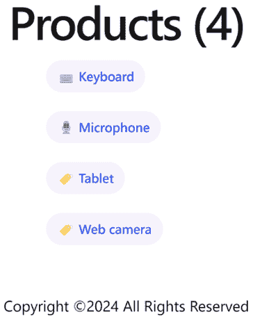
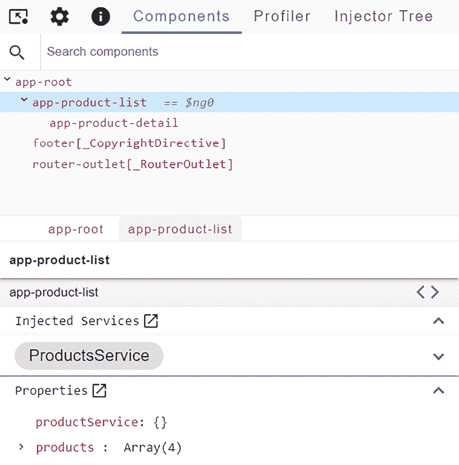
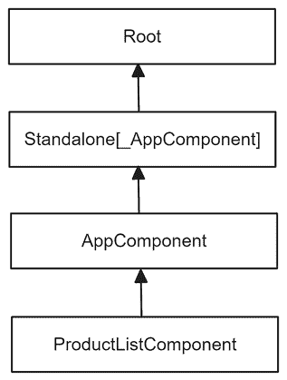
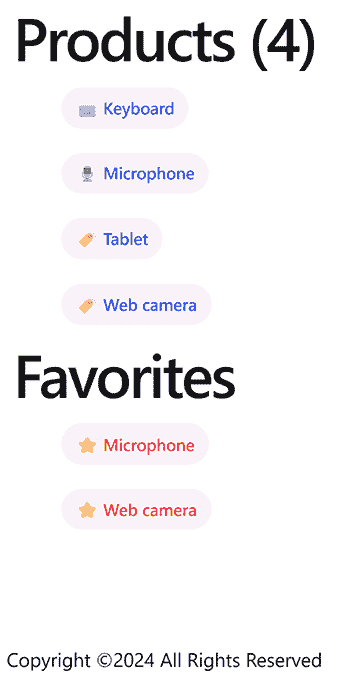
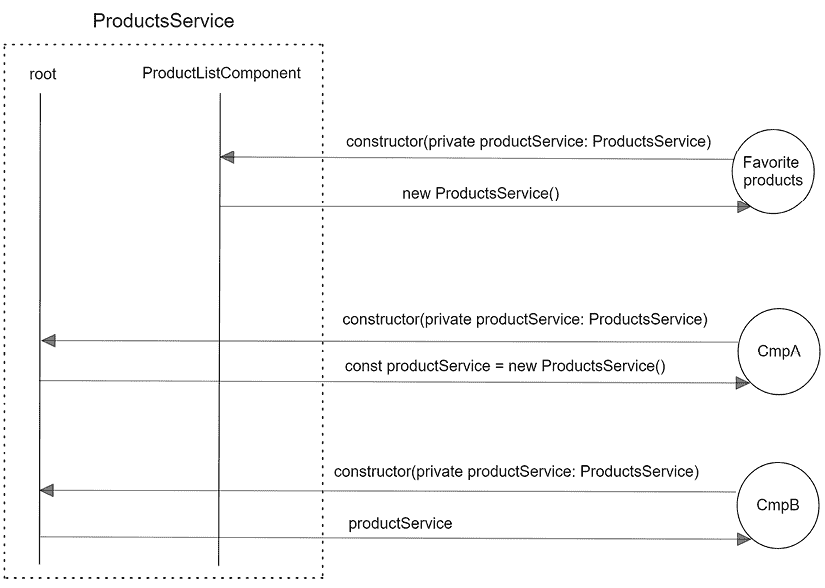
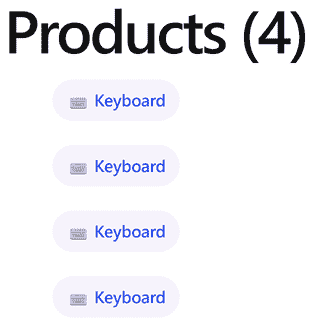
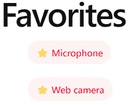

# 第五章：使用服务管理复杂任务

在我们的旅程中，我们已经达到了一个阶段，可以通过在组件树中嵌套其他组件来成功开发更复杂的应用程序。然而，将所有业务逻辑捆绑到一个组件中并不是一个好的做法。随着应用程序的发展，它可能会很快变得难以维护。

在本章中，我们将探讨 Angular 的依赖管理机制如何带来优势以克服这些问题。我们将学习如何使用 **Angular 依赖注入**（**DI**）机制以最小的努力和最佳结果在应用程序中声明和消费我们的依赖项。到本章结束时，您将能够创建一个正确结构的 Angular 应用程序，使用服务强制执行 **关注点分离**（**SoC**）模式。

我们将介绍与 Angular 服务相关的以下概念：

+   介绍 Angular 依赖注入

+   创建我们的第一个 Angular 服务

+   在应用程序中提供依赖项

+   在组件树中注入服务

+   在注入器层次结构中覆盖提供者

# 技术要求

本章包含各种代码示例，以向您介绍 Angular 服务的概念。您可以在以下 GitHub 仓库的 `ch05` 文件夹中找到相关的源代码：

[`www.github.com/PacktPublishing/Learning-Angular-Fifth-Edition`](https://www.github.com/PacktPublishing/Learning-Angular-Fifth-Edition )

# 介绍 Angular 依赖注入

依赖注入（DI）是一种应用设计模式，我们也在其他语言中遇到过，例如 C# 和 Java。随着我们的应用程序增长和演变，每个代码实体将内部需要其他对象的实例，这通常被称为**依赖项**。将这些依赖项传递给消费者代码实体称为**注入**，这也涉及到另一个称为**注入器**的代码实体。注入器负责实例化和启动所需的依赖项，以便在注入到消费者时可以使用。消费者对其依赖项的实例化方式一无所知，只知道它们实现的接口以使用它们。

Angular 包含一个顶级的 DI 机制，用于向任何 Angular 应用程序的 Angular 实体公开所需的依赖项。在深入探讨这个主题之前，让我们看看 Angular 中的 DI 试图解决的问题。

在 *第三章* ，*使用组件构建用户界面* 中，我们学习了如何使用 `@for` 块显示对象列表。我们使用了一个静态的 `Product` 对象列表，这些对象在 `product-list.component.ts` 文件中声明，如下所示：

```js
products: Product[] = [
  { 
    id: 1,
    title: 'Keyboard',
    price: 100,
    categories: {
      1: 'Computing',
      2: 'Peripherals'
    }
  },
  {
    id: 2,
    title: 'Microphone',
    price: 35,
    categories: { 3: 'Multimedia' }
  },
  {
    id: 3,
    title: 'Web camera',
    price: 79,
    categories: {
      1: 'Computing',
      3: 'Multimedia'
    }
  },
  {
    id: 4,
    title: 'Tablet',
    price: 500,
    categories: { 4: 'Entertainment' }
  }
]; 
```

这种先前的方法有两个主要缺点：

+   在现实世界的应用中，我们很少处理静态数据。它通常来自后端 API 或其他外部来源。

+   产品列表与组件紧密耦合。Angular 组件负责展示逻辑，不应关心如何获取数据。它们只需要在 HTML 模板中显示数据。因此，它们应该将业务逻辑委托给服务来处理此类任务。

在接下来的章节中，我们将学习如何使用 Angular 服务避免这些障碍。

为了跟随本章的其余部分，您需要我们创建的 Angular 应用程序的源代码，即 *第四章* ，*使用管道和指令丰富应用程序* 。

我们将创建一个 Angular 服务，该服务将返回产品列表。因此，我们将有效地将业务逻辑任务从组件中委托出去。记住：*组件只应关注展示逻辑* 。

# 创建我们的第一个 Angular 服务

要创建一个新的 Angular 服务，我们使用 Angular CLI 的 `ng generate` 命令，同时传递服务的名称作为参数：

```js
ng generate service products 
```

运行前面的命令将创建 `products` 服务，它包括 `products.service.ts` 文件及其伴随的单元测试文件 `products.service.spec.ts` 。

我们通常根据服务所表示的功能来命名服务。每个服务都有一个业务上下文或领域，在其中它运行。当它开始跨越不同上下文之间的边界时，这表明你应该将其拆分为不同的服务。产品服务应该关注产品。同样，订单应该由单独的订单服务管理。

Angular 服务是一个带有 `@Injectable` 装饰器的 TypeScript 类。装饰器将类标识为 Angular 服务，它可以注入到其他 Angular 实体中，如组件、指令，甚至是其他服务。它接受一个对象作为参数，该对象有一个名为 `providedIn` 的单个属性，它定义了哪个注入器提供该服务。

默认情况下，Angular 服务通过注入器注册——即 Angular 应用程序的 `root` 注入器，如 `products.service.ts` 文件中定义的那样：

```js
import { Injectable } from '@angular/core';
@Injectable({
  providedIn: 'root'
})
export class ProductsService {
  constructor() { }
} 
```

我们的服务不包含任何实现。让我们添加一些逻辑，以便我们的组件可以使用它：

1.  添加以下语句以导入 `Product` 接口：

    ```js
    import { Product } from './product'; 
    ```

1.  在 `ProductsService` 类中创建以下方法：

    ```js
    getProducts(): Product[] {
      return [
        { 
          id: 1,
          title: 'Keyboard',
          price: 100,
          categories: {
            1: 'Computing',
            2: 'Peripherals'
          }
        },
        {
          id: 2,
          title: 'Microphone',
          price: 35,
          categories: { 3: 'Multimedia' }
        },
        {
          id: 3,
          title: 'Web camera',
          price: 79,
          categories: {
            1: 'Computing',
            3: 'Multimedia'
          }
        },
        {
          id: 4,
          title: 'Tablet',
          price: 500,
          categories: { 4: 'Entertainment' }
        }
      ];
    } 
    ```

在接下来的章节中，我们将学习如何在我们的应用程序中使用该服务。

## 在构造函数中注入服务

在 Angular 组件中使用服务最常见的方式是通过其 `constructor` :

1.  打开 `product-list.component.ts` 文件，并修改 `products` 属性，使其初始化为空数组：

    ```js
    products: Product[] = []; 
    ```

1.  添加以下语句以导入 `ProductsService` 类：

    ```js
    import { ProductsService } from '../products.service'; 
    ```

1.  创建一个名为 `productService` 的组件属性，并为其指定类型 `ProductsService` :

    ```js
    private productService: ProductsService; 
    ```

1.  使用 `new` 关键字在组件的 `constructor` 中实例化属性：

    ```js
    constructor() {
      this.productService = new ProductsService();
    } 
    ```

1.  从 `@angular/core` npm 包中导入 `OnInit` 接口：

    ```js
    import { Component, OnInit } from '@angular/core'; 
    ```

1.  将`OnInit`接口添加到`ProductListComponent`类的实现接口列表中：

    ```js
    export class ProductListComponent implements OnInit 
    ```

1.  添加以下`ngOnInit`方法，该方法调用`productService`属性的`getProducts`方法，并将返回值赋给`products`属性：

    ```js
    ngOnInit(): void {
      this.products = this.productService.getProducts();
    } 
    ```

使用`ng serve`命令运行应用程序以验证产品列表是否仍然正确显示在页面上：



图 5.1：产品列表

太棒了！我们已经成功地将组件与服务连接起来，应用程序看起来很棒。嗯，这似乎是情况，但实际上并非如此。实际的实现中存在一些问题。如果`ProductsService`类必须更改，比如为了适应另一个依赖项，`ProductListComponent`也应该更改其`constructor`的实现。因此，很明显，产品列表组件与`ProductsService`的实现紧密耦合。它阻止我们在需要时更改、覆盖或整洁地测试服务。它还意味着每次渲染产品列表组件时都会创建一个新的`ProductsService`对象，这在某些场景中可能不是期望的，例如当我们期望使用实际的单例服务时。

依赖注入系统通过提出几种模式来尝试解决这些问题，其中**构造函数注入**模式是由 Angular 强制执行的。我们可以移除`productService`组件属性，并将服务直接注入到`constructor`中。生成的`ProductListComponent`类如下：

```js
export class ProductListComponent implements OnInit {
  products: Product[] = [];  
  selectedProduct: Product | undefined;
  constructor(private productService: ProductsService) {}

  onAdded() {
    alert(`${this.selectedProduct?.title} added to the cart!`);
  }
  ngOnInit(): void {
    this.products = this.productService.getProducts();
  }
} 
```

考虑将注入的服务声明为`readonly`，以提供更稳定的代码并防止服务重新赋值。在前面的代码片段中，`constructor`可以被重写为`constructor(private readonly productService: ProductsService) {}`。

组件不需要知道如何实例化服务。另一方面，它期望在实例化之前就有一个这样的依赖项可用，以便可以通过其`constructor`注入。这种方法更容易测试，因为它允许我们覆盖它或模拟它。

然而，在 Angular 应用程序中注入服务的方式不仅仅是使用`constructor`，正如我们将在下一节中学习的。

## 注入关键字

Angular 框架包含一个内置的`inject`方法，我们可以使用它来注入服务而不使用`constructor`。有一些情况下我们希望使用`inject`方法：

+   `constructor`包含许多注入的服务，这使得我们的代码难以阅读。

+   在与 Angular 路由器或 HTTP 客户端一起使用纯函数时，不能使用`constructor`，正如我们将在下一章中学习的。

让我们看看我们如何重构产品列表组件以使用`inject`方法：

1.  打开`product-list.component.ts`文件，并从`@angular/core`npm 包中导入`inject`方法：

    ```js
    import { Component, OnInit, **inject** } from '@angular/core'; 
    ```

1.  在`ProductListComponent`类中声明以下属性：

    ```js
    private productService = inject(ProductsService); 
    ```

1.  从`ProductListComponent`类中删除`constructor`。

如果我们运行`ng serve`命令，应用程序应该仍然按预期工作。产品列表应该像上一节中显示的那样显示。

我们将在第八章*通过 HTTP 与数据服务通信*和第九章*使用路由导航应用程序*中探索`inject`方法的更多用例。

与构造函数方法相比，`inject`方法提供了更精确的类型，强制执行强类型 Angular 应用程序。

Angular CLI 提供了一个可以运行的图表，我们可以用它来迁移到新的`inject`方法。有关如何运行图表的更多详细信息，请参阅[`angular.dev/reference/migrations/inject-function`](https://angular.dev/reference/migrations/inject-function)。

在这本书中，我们根据应用程序代码的执行上下文，同时使用注入方法和构造函数方法。

正如我们所学的，当我们创建一个新的 Angular 服务时，Angular CLI 默认将此服务注册到应用程序的根注入器。在下一节中，我们将了解 DI 机制的内部原理以及根注入器的工作方式。

# 在应用程序中提供依赖项

Angular 框架提供了一个 DI 机制，用于在 Angular 实体（如组件、指令、管道和服务）中提供依赖项。Angular DI 基于一个注入器层次结构，其中在顶部是 Angular 应用程序的根注入器。

Angular 中的注入器可以检查 Angular 实体（如构造函数）中的依赖项，并为每个依赖项返回其类型的实例，这样我们就可以直接在我们的 Angular 类实现中使用它。注入器维护一个 Angular 应用程序需要的所有依赖项的列表。当组件或其他实体想要使用依赖项时，注入器首先检查是否已经创建了该依赖项的实例。如果没有，它将创建一个新的实例，将其返回给组件，并保留一个副本以供进一步使用。下次请求相同的依赖项时，它将返回之前创建的副本。但是，注入器如何知道 Angular 应用程序需要哪些依赖项呢？

当我们创建一个 Angular 服务时，我们使用 `@Injectable` 装饰器的 `providedIn` 属性来定义它如何提供给应用程序。也就是说，我们为这个服务创建一个 **提供者**。提供者是一个包含创建特定服务的指南的 *配方*。在应用程序启动期间，框架负责使用服务提供者的提供者配置注入器，以便它知道如何在请求时创建一个。使用 CLI 创建的 Angular 服务默认情况下通过根注入器进行配置。根注入器创建单例服务，这些服务通过应用程序全局可用。

在 *第一章* ，*构建你的第一个 Angular 应用程序* 中，我们了解到在 `app.config.ts` 文件中定义的应用程序配置对象有一个 `providers` 属性，我们可以在这里注册应用程序服务。我们可以从 `products.service.ts` 文件的 `@Injectable` 装饰器中移除 `providedIn` 属性，并将其直接添加到该数组中。以这种方式注册服务与使用 `providedIn: 'root'` 配置服务相同。它们之间的主要区别是 `providedIn` 语法是 **可树摇的**。

树摇（Tree shaking）是寻找应用中未使用的依赖项并将它们从最终包中移除的过程。在 Angular 的上下文中，Angular 编译器可以检测并删除未使用的 Angular 服务，从而生成更小的包。

当你通过应用程序配置对象提供服务时，Angular 编译器无法确定该服务是否在应用程序的某个地方被使用。因此，它预先将服务包含在最终包中。因此，在应用程序配置的 `providers` 数组上使用 `@Injectable` 装饰器是首选的。

你应该始终在根注入器中注册单例服务。

根注入器并不是 Angular 应用程序中唯一的注入器。组件也有它们自己的注入器。Angular 注入器也是分层的。每当 Angular 组件在其 `constructor` 中定义一个令牌时，注入器会在注册提供者的池中搜索与该令牌匹配的类型。如果没有找到匹配项，它将搜索委托给父组件的提供者，并继续向上冒泡组件注入器树，直到达到根注入器。如果没有找到匹配项，Angular 将抛出异常。

让我们使用 Angular DevTools 探索产品列表组件的注入器层次结构：

1.  使用 `ng serve` 命令运行应用程序，并在 `http://localhost:4200` 预览它。

1.  启动 Angular DevTools 并选择 **组件** 选项卡。

1.  从组件树中选择 **app-product-list** 组件：



图 5.2：组件选项卡

在前面的图像中，**注入的服务**部分包含了注入到组件中的服务。

1.  点击**ProductsService**标签旁边的向下箭头，你会看到以下图表：



图 5.3：产品列表注入器层次结构

Angular DevTools 中的注入器层次结构图是水平方向的。在这里，我们将其垂直显示以提高可读性。

上述图表描述了产品列表组件的注入器层次结构。它包含两个在 Angular 应用程序中常见的注入器层次结构类型：**环境**和**元素**注入器。

环境注入器是通过应用程序配置对象中的`providedIn`属性和`providers`数组进行配置的。在我们的例子中，我们看到**Root**和**Standalone[_AppComponent]**注入器，因为产品服务是通过`providedIn`属性从根注入器提供的。

Angular 为每个组件创建一个元素注入器，该注入器可以从`@Component`装饰器的`providers`数组中进行配置，正如我们将在下一节中看到的。在我们的例子中，我们看到**AppComponent**和**ProductListComponent**注入器，因为这些组件直接与产品列表相关。

您可以通过选择 Angular DevTools 的**注入器树**选项卡来对应用程序的每个类型的注入器层次结构进行更详细的分析。您还可以在[`angular.dev/guide/di/hierarchical-dependency-injection#types-of-injector-hierarchies`](https://angular.dev/guide/di/hierarchical-dependency-injection#types-of-injector-hierarchies)了解更多关于不同类型的注入器信息。

组件创建注入器，因此它们立即可用于其子组件。我们将在下一节中详细介绍这一点。

# 在组件树中注入服务

如前所述，Angular 使用元素注入器通过`@Component`装饰器的`providers`属性在组件中提供服务。注册到元素注入器的服务可以有两个用途：

+   它可以与其子组件共享

+   它可以在提供服务的组件每次渲染时创建服务的多个副本

在接下来的章节中，我们将学习如何应用每种方法。

## 通过组件共享依赖项

通过组件提供的服务可以在父组件的子组件之间共享，并且它立即可用于注入到它们的构造函数中。子组件会重用与父组件相同的服务的实例。让我们通过一个例子来更好地理解这一点：

1.  创建一个名为`favorites`的新 Angular 组件：

    ```js
    ng generate component favorites 
    ```

1.  打开`favorites.component.ts`文件并相应地修改`import`语句：

    ```js
    import { Component, **OnInit** } from '@angular/core';
    **import { Product } from '../product';**
    **import { ProductsService } from '../products.service';** 
    ```

1.  修改`FavoritesComponent`类以使用`ProductsService`类并在`products`组件属性中获取产品列表：

    ```js
    export class FavoritesComponent implements OnInit {
      products: Product[] = [];
      constructor(private productService: ProductsService) {}
      ngOnInit(): void {
        this.products = this.productService.getProducts();
      }
    } 
    ```

1.  打开 `favorites.component.html` 文件，将其内容替换为以下 HTML 代码：

    ```js
     <ul class="pill-group">
      @for (product of products | slice:1:3; track product.id) {
        <li class="pill">
          ⭐ {{product.title}}
        </li>
      }
    </ul> 
    ```

在前面的代码片段中，我们遍历 `products` 数组，并使用 `slice` 管道仅显示两个产品。

1.  修改 `favorites.component.ts` 文件，使其导入 `CommonModule` 类，这是 `slice` 管道所必需的：

    ```js
    **import { CommonModule } from '@angular/common';**
    import { Component, OnInit } from '@angular/core';
    import { Product } from '../product';
    import { ProductsService } from '../products.service';
    @Component({
      selector: 'app-favorites',
      imports: [**CommonModule**],
      templateUrl: './favorites.component.html',
      styleUrl: './favorites.component.css'
    }) 
    ```

1.  打开 `favorites.component.css` 文件，为我们的收藏产品添加一些 CSS 样式：

    ```js
    .pill-group {
      display: flex;
      flex-direction: column;
      align-items: start;
      flex-wrap: wrap;
      gap: 1.25rem;
    }
    .pill {
      display: flex;
      align-items: center;
      --pill-accent: var(--hot-red);
      background: color-mix(in srgb, var(--hot-red) 5%, transparent);
      color: var(--pill-accent);
      padding-inline: 0.75rem;
      padding-block: 0.375rem;
      border-radius: 2.75rem;
      border: 0;
      transition: background 0.3s ease;
      font-family: var(--inter-font);
      font-size: 0.875rem;
      font-style: normal;
      font-weight: 500;
      line-height: 1.4rem;
      letter-spacing: -0.00875rem;
      text-decoration: none;
    } 
    ```

1.  打开 `product-list.component.ts` 文件，导入 `FavoritesComponent` 类，并将 `ProductsService` 类添加到 `@Component` 装饰器的 `providers` 数组中：

    ```js
    import { Component, OnInit } from '@angular/core';
    import { Product } from '../product';
    import { ProductDetailComponent } from '../product-detail/product-detail.component';
    import { SortPipe } from '../sort.pipe';
    import { ProductsService } from '../products.service';
    **import { FavoritesComponent } from '../favorites/favorites.component';**

    @Component({
      selector: 'app-product-list',
      imports: [ProductDetailComponent, SortPipe, **FavoritesComponent**],
      templateUrl: './product-list.component.html',
      styleUrl: './product-list.component.css',
      **providers: [ProductsService]**
    }) 
    ```

1.  打开 `products.service.ts` 文件，从 `@Injectable` 装饰器中移除 `providedIn` 属性，因为产品列表组件的元素注入器将提供它。

1.  最后，打开 `product-list.component.html` 文件，并添加以下 HTML 片段以显示收藏组件的内容：

    ```js
    <h1>Favorites</h1>
    <app-favorites></app-favorites> 
    ```

当使用 `ng serve` 运行应用程序时，你应该看到以下输出：



图 5.4：带有收藏夹的产品列表

让我们更详细地解释一下上一个示例中我们做了什么。我们在 `FavoritesComponent` 中注入了 `ProductsService`，但没有通过其注入器提供它。那么组件是如何知道如何创建 `ProductsService` 类的实例并使用它的呢？它并不知道。当我们将收藏组件添加到 `ProductListComponent` 模板中时，我们使其成为该组件的直接子组件，从而使其能够访问所有提供的服务。简而言之，`FavoritesComponent` 可以直接使用 `ProductsService`，因为它已经通过其父组件 `ProductListComponent` 的元素注入器提供。

因此，即使 `ProductsService` 最初是在环境根注入器中注册的，我们也可以将其注册到 `ProductListComponent` 的元素注入器中。在下一节中，我们将探讨如何实现这种行为。

## 根和组件注入器

我们已经了解到，当我们使用 Angular CLI 创建 Angular 服务时，服务默认由应用程序的根注入器提供。通过组件的元素注入器提供服务时，这有何不同？

使用应用程序根注入器提供的服务在整个应用程序中可用。当组件想要使用此类服务时，它只需要注入它，无需更多操作。现在，如果组件通过其注入器提供相同的服务，它将获得一个与根注入器完全不同的服务实例。这种技术被称为 **服务作用域限制**，因为我们限制了服务的范围到组件树的一个特定部分：



图 5.5：服务作用域限制

上一张图显示，`ProductsService`可以通过两个注入器提供：应用程序根注入器和产品列表组件的元素注入器。`FavoritesComponent`类注入`ProductsService`以使用它。正如我们之前看到的，`FavoritesComponent`是`ProductListComponent`的子组件。

根据注入器层次结构，它首先会询问其父组件`ProductListComponent`是否提供该服务。`ProductListComponent`类确实提供了`ProductsService`，因此它会创建该服务的新实例并将其返回给`FavoritesComponent`。

现在，考虑我们应用程序中的另一个组件`CmpA`，它想使用`ProductsService`。由于它不是`ProductListComponent`的子组件，也不包含任何提供所需服务的父组件，它最终会到达应用程序根注入器。提供`ProductsService`的根注入器会检查是否已经为该服务创建了一个实例。如果没有，它会创建一个新的实例，称为`productService`，并将其返回给`CmpA`。它还会将`productService`保留在本地服务池中，以供以后使用。

假设另一个组件`CmpB`想使用`ProductsService`并请求应用程序根注入器。根注入器知道当`CmpA`请求它时已经创建了`productService`实例，并立即将其返回给`CmpB`组件。

## 将具有多个实例的组件进行沙盒化

当我们通过元素注入器提供服务并将其注入到组件的`constructor`中时，每次组件在页面上渲染时都会创建一个新的实例。这在我们需要为每个组件拥有一个本地缓存服务的情况下很有用。我们将通过将我们的 Angular 应用程序转换为产品列表使用 Angular 服务显示每个产品的快速预览来探索这个场景：

1.  运行以下命令以创建一个新的 Angular 组件用于产品视图：

    ```js
    ng generate component product-view 
    ```

1.  打开`product-view.component.ts`文件，声明一个名为`id`的输入属性，这样我们就可以传递我们想要显示的产品的一个唯一标识符：

    ```js
    import { Component, **input** } from '@angular/core';
    @Component({
      selector: 'app-product-view',
      imports: [],
      templateUrl: './product-view.component.html',
      styleUrl: './product-view.component.css'
    })
    export class ProductViewComponent {
      **id = input<number>();**
    } 
    ```

1.  在`product-view`文件夹内运行以下 Angular CLI 命令以创建一个将专门用于产品视图组件的 Angular 服务：

    ```js
    ng generate service product-view 
    ```

1.  打开`product-view.service.ts`文件，从`@Injectable`装饰器中移除`providedIn`属性，因为我们将在产品视图组件中稍后提供它。

1.  将`ProductsService`注入到`ProductViewService`类的`constructor`中：

    ```js
    import { Injectable } from '@angular/core';
    **import { ProductsService } from '../products.service';**
    @Injectable()
    export class ProductViewService {
      constructor(**private productService: ProductsService**) { }
    } 
    ```

上述技术被称为**服务中的服务**，因为我们在一个 Angular 服务中注入了另一个服务。

1.  创建一个名为`getProduct`的方法，该方法接受一个`id`属性作为参数。该方法将调用`ProductsService`类的`getProducts`方法并根据`id`搜索产品列表。如果找到产品，它将将其保存在一个名为`product`的本地变量中：

    ```js
    import { Injectable } from '@angular/core';
    import { ProductsService } from '../products.service';
    **import { Product } from '../product';**
    @Injectable()
    export class ProductViewService {
      **private product: Product | undefined;**
      constructor(private productService: ProductsService) { }
      **getProduct(id: number): Product | undefined {**
    **const products = this.productService.getProducts();**
    **if (!this.product) {**
    **this.product = products.find(product => product.id === id)**
    **}**
    **return this.product;**
    **}**  
    } 
    ```

我们已经为与产品视图组件一起工作创建了必要的 Angular 元素。我们现在需要做的就是将它们连接起来，并将它们连接到产品列表：

1.  在 `ProductViewComponent` 的 `constructor` 中注入 `ProductViewService` 并实现 `ngOnInit` 方法：

    ```js
    import { Component, input, **OnInit** } from '@angular/core';
    **import { ProductViewService } from './product-view.service';**
    @Component({
      selector: 'app-product-view',
      imports: [],
      templateUrl: './product-view.component.html',
      styleUrl: './product-view.component.css',
      **providers: [ProductViewService]**
    })
    export class ProductViewComponent **implements OnInit** {
      id = input<number>();
      **constructor(private productViewService: ProductViewService) {}**
    **ngOnInit(): void {**
    **}**
    } 
    ```

1.  创建一个组件属性以保存我们将从 `ProductViewService` 类获取的产品：

    ```js
    import { Component, input, OnInit } from '@angular/core';
    import { ProductViewService } from './product-view.service';
    **import { Product } from '../product';**
    @Component({
      selector: 'app-product-view',
      imports: [],
      templateUrl: './product-view.component.html',
      styleUrl: './product-view.component.css',
      providers: [ProductViewService]
    })
    export class ProductViewComponent implements OnInit {
      id = input<number>();
      **product: Product | undefined;**

      constructor(private productViewService: ProductViewService) {}
      ngOnInit(): void {
      }
    } 
    ```

1.  修改 `ngOnInit` 方法，使其调用 `ProductViewService` 类的 `getProduct` 方法，如下所示：

    ```js
    ngOnInit(): void {
      **this.product = this.productViewService.getProduct(this.id()!);**
    } 
    ```

在前面的代码片段中，我们将 `id` 组件属性作为参数传递给 `getProduct` 方法，并将返回的值赋给 `product` 属性。

1.  打开 `product-view.component.html` 文件，并用以下 HTML 模板替换其内容：

    ```js
    @switch (product?.title) {
      @case ('Keyboard') {  }
      @case ('Microphone') {  }
      @default {  }
    }
    {{product?.title}} 
    ```

1.  打开 `product-list.component.ts` 文件并导入 `ProductViewComponent` 类：

    ```js
    import { Component, OnInit } from '@angular/core';
    import { Product } from '../product';
    import { ProductDetailComponent } from '../product-detail/product-detail.component';
    import { SortPipe } from '../sort.pipe';
    import { ProductsService } from '../products.service';
    **import { ProductViewComponent } from '../product-view/product-view.component';**
    @Component({
      selector: 'app-product-list',
      imports: [ProductDetailComponent, SortPipe, **ProductViewComponent**],
      templateUrl: './product-list.component.html',
      styleUrl: './product-list.component.css'
    }) 
    ```

1.  最后，打开 `product-list.component.html` 文件，并修改 `@for` 块以使用产品视图组件：

    ```js
    <ul class="pill-group">
      @for (product of products | sort; track product.id) {
        <li class="pill" (click)="selectedProduct = product">
          **<app-product-view [id]="product.id"></app-product-view>**
        </li>
      } @empty {
        <p>No products found!</p>
      }
    </ul> 
    ```

如果我们使用 `ng serve` 命令运行我们的应用程序，我们会看到产品列表仍然正确显示。

每个渲染的产品视图组件都会为其目的创建一个专门的沙盒 `ProductViewService` 实例。任何其他组件都不能共享该实例或被提供它的组件更改。

尝试在 `ProductListComponent` 中提供 `ProductViewService` 而不是 `ProductViewComponent`；你会看到只有一个产品被渲染多次：



图 5.6：产品列表

在这种情况下，只有一个服务实例在子组件之间共享。为什么是这样？回想一下 `ProductViewService` 类中 `getProduct` 方法的业务逻辑：

```js
getProduct(id: number): Product | undefined {
  const products = this.productService.getProducts();
  if (!this.product) {
    this.product = products.find(product => product.id === id)
  }
  return this.product;
} 
```

在前面的方法中，当我们在 `ProductListComponent` 内部提供服务时，`product` 属性被初始化设置。由于我们只有一个服务实例，该属性的值将在我们多次渲染产品视图组件时保持不变。

我们已经学习了如何将依赖项注入到组件层次结构中，以及如何通过在组件树中冒泡请求来执行提供者查找。然而，如果我们想限制这样的注入或查找操作呢？我们将在下一节中看到如何做到这一点。

## 限制提供者查找

我们只能将依赖项查找限制在下一级。为此，我们需要将这些依赖项参数应用 `@Host` 装饰器，我们想要限制其提供者查找：

```js
import { CommonModule } from '@angular/common';
import { Component, **Host**, OnInit } from '@angular/core';
import { Product } from '../product';
import { ProductsService } from '../products.service';
@Component({
  selector: 'app-favorites',
  imports: [CommonModule],
  templateUrl: './favorites.component.html',
  styleUrl: './favorites.component.css'
})
export class FavoritesComponent implements OnInit {
  products: Product[] = [];
  constructor(**@Host()** private productService: ProductsService) {}
  ngOnInit(): void {
    this.products = this.productService.getProducts();
  }
} 
```

在前面的示例中，`FavoritesComponent` 的元素注入器将在其提供者中查找 `ProductsService` 类。如果它不提供该服务，它将不会冒泡注入器层次结构；相反，它将停止并在浏览器的控制台窗口中抛出异常：

**错误：NG0201：在 NodeInjector 中找不到 _ProductsService 提供者**。

我们可以配置注入器，使其在用 `@Optional` 装饰器装饰服务时不会抛出错误：

```js
import { CommonModule } from '@angular/common';
import { Component, Host, OnInit, **Optional** } from '@angular/core';
import { Product } from '../product';
import { ProductsService } from '../products.service';
@Component({
  selector: 'app-favorites',
  imports: [CommonModule],
  templateUrl: './favorites.component.html',
  styleUrl: './favorites.component.css'
})
export class FavoritesComponent implements OnInit {
  products: Product[] = [];
  constructor(**@Optional()** @Host() private productService: ProductsService) {}
  ngOnInit(): void {
    this.products = this.productService.getProducts();
  }
} 
```

然而，使用 `@Optional` 装饰器并不能解决实际问题。前面的代码片段仍然会抛出错误，与之前的错误不同，因为我们仍然使用了限制在注入器层次结构中搜索 `ProductsService` 类的 `@Host` 装饰器。我们需要重构 `ngOnInit` 生命周期钩子事件，以确保它不会找到服务实例。

`@Host` 和 `@Optional` 装饰器定义了注入器搜索依赖项的级别。还有另外两个装饰器，称为 `@Self` 和 `@SkipSelf`。当使用 `@Self` 装饰器时，注入器在当前组件的注入器中查找依赖项。相反，`@SkipSelf` 装饰器指示注入器跳过本地注入器，并在注入器层次结构中进一步搜索。

`@Host` 和 `@Self` 装饰器的工作方式类似。有关何时使用每个装饰器的更多信息，请参阅[`angular.dev/guide/di/hierarchical-dependency-injection#self`](https://angular.dev/guide/di/hierarchical-dependency-injection#self) 和 [`angular.dev/guide/di/hierarchical-dependency-injection#host`](https://angular.dev/guide/di/hierarchical-dependency-injection#host) 。

到目前为止，我们已经学习了 Angular DI 框架如何使用类作为依赖项令牌来确定所需类型，并从注入器层次结构中的任何提供者返回它。然而，在某些情况下，我们可能需要覆盖类的实例或提供不是实际类的类型，例如原始类型。

# 覆盖注入器层次结构中的提供者

我们已经在 *通过组件共享依赖项* 部分学习了如何使用 `@Component` 装饰器的 `providers` 数组：

```js
providers: [ProductsService] 
```

前面的语法称为 **类提供者** 语法，是下面显示的 **提供对象字面量** 语法的简写：

```js
providers: [
  `{` **provide: ProductsService, useClass: ProductsService** `}`
] 
```

前面的语法使用了一个具有以下属性的对象：

+   `provide`：这是用于配置注入器的令牌。它是消费者将其注入构造函数的实际类。

+   `useClass`：这是注入器将提供给消费者的实际实现。属性名将根据提供的实现类型而有所不同。类型可以是类、值或工厂函数。在这种情况下，我们使用 `useClass`，因为我们提供了一个类。

让我们看看一些示例，以了解如何使用提供对象字面量语法。

## 覆盖服务实现

我们已经了解到，组件可以与其子组件共享其依赖项。考虑`FavoritesComponent`，我们在其模板中使用`slice`管道显示收藏产品的列表。如果它需要通过`ProductsService`的裁剪版本来获取数据，而不是直接从`ProductListComponent`的服务实例中获取数据怎么办？我们可以创建一个新的服务，该服务扩展了`ProductsService`类，并使用原生的**Array.slice**方法过滤数据。让我们创建新的服务并学习如何使用它：

1.  运行以下命令以生成服务：

    ```js
    ng generate service favorites 
    ```

1.  打开`favorites.service.ts`文件并添加以下`import`语句：

    ```js
    import { Product } from './product';
    import { ProductsService } from './products.service'; 
    ```

1.  在类定义中使用`extends`关键字来指示`ProductsService`是`FavoritesService`的基类：

    ```js
    export class FavoritesService **extends ProductsService** {
      constructor() { }
    } 
    ```

1.  修改`constructor`以调用`super`方法并在基类`constructor`中执行任何业务逻辑：

    ```js
    constructor() {
      **super();**
    } 
    ```

1.  创建以下服务方法，使用`slice`方法从列表中返回前两个产品：

    ```js
    override getProducts(): Product[] {
      return super.getProducts().slice(1, 3);
    } 
    ```

之前的方法使用`override`关键字标记，以表明该方法的实现替换了基类中对应的方法。

1.  打开`favorites.component.ts`文件，并添加以下`import`语句：

    ```js
    import { FavoritesService } from '../favorites.service'; 
    ```

1.  将`FavoritesService`类添加到`@Component`装饰器的`providers`数组中，如下所示：

    ```js
    @Component({
      selector: 'app-favorites',
      imports: [],
      templateUrl: './favorites.component.html',
      styleUrl: './favorites.component.css',
      **providers: [**
    **{ provide: ProductsService, useClass: FavoritesService }**
    **]**
    }) 
    ```

在前面的代码片段中，我们从`imports`数组中移除了`CommonModule`，因为我们不再需要`slice`管道。

1.  最后，打开`favorites.component.html`文件并从`@for`块中删除`slice`管道。

如果我们使用`ng serve`命令运行应用程序，我们将看到**收藏**部分仍然正确显示：



图 5.7：收藏产品列表

前面的输出假设您已经将收藏组件导入并添加到产品列表组件中。

`useClass`属性本质上覆盖了`ProductsService`类在收藏组件中的初始实现。或者，我们可以更进一步，使用一个函数返回我们需要的特定对象实例，正如我们将在下一节中学习的那样。

## 条件提供服务

在上一节的示例中，我们使用了`useClass`语法来替换注入的`ProductsService`类的实现。或者，我们可以创建一个**工厂函数**，根据条件决定返回`FavoritesService`类或`ProductsService`类的实例。该函数将位于一个简单的 TypeScript 文件中，命名为`favorites.ts`：

```js
import { FavoritesService } from './favorites.service';
import { ProductsService } from './products.service';
export function favoritesFactory(isFavorite: boolean) {
  return () => {
    if (isFavorite) {
      return new FavoritesService();
    }
    return new ProductsService();
  };
} 
```

然后，我们可以修改`favorites.component.ts`文件中的`providers`数组，如下所示：

```js
import { CommonModule } from '@angular/common';
import { Component, OnInit } from '@angular/core';
import { Product } from '../product';
import { ProductsService } from '../products.service';
**import { favoritesFactory } from '../favorites';**
@Component({
  selector: 'app-favorites',
  imports: [CommonModule],
  templateUrl: './favorites.component.html',
  styleUrl: './favorites.component.css',
  **providers: [**
**{ provide: ProductsService, useFactory: favoritesFactory(true) }**
**]**
}) 
```

值得注意的是，如果其中一个服务注入了其他依赖项，之前的语法就不够用了。例如，如果`FavoritesService`类依赖于`ProductViewService`类，我们就会将其添加到提供对象字面量语法的`deps`属性中：

```js
providers: [
  {
    provide: ProductsService,
    useFactory: favoritesFactory(true),
    **deps: [ProductViewService]**
  }
] 
```

然后，我们可以在`favorites.ts`文件的工厂函数中使用它，如下所示：

```js
export function favoritesFactory(isFavorite: boolean) {
  return (**productViewService: ProductViewService**) => {
    if (isFavorite) {
      return new FavoritesService();
    }
    return new ProductsService();
  };
} 
```

我们已经学习了如何为 Angular 服务提供一个替代类实现。如果我们想提供的依赖项不是一个类，而是一个字符串或对象怎么办？我们可以使用`useValue`语法来完成这个任务。

## 在 Angular 服务中转换对象

在实际应用中，通常会将应用程序设置保存在一个常量对象中。我们如何使用`useValue`语法在我们的组件中提供这些设置呢？我们将通过为我们的应用程序创建设置，例如版本号和标题，来了解更多：

1.  在 Angular CLI 工作区的`src\app`文件夹中创建一个`app.settings.ts`文件，并添加以下内容：

    ```js
    export interface AppSettings {
      title: string;
      version: string;
    }
    export const appSettings: AppSettings = {
      title: 'My e-shop',
      version: '1.0'
    }; 
    ```

你可能会认为我们可以将这些设置作为`{ provide: AppSettings, useValue: appSettings }`提供，但这样会抛出一个错误，因为`AppSettings`是一个接口，不是一个类。接口是 TypeScript 中的语法糖，在编译过程中会被丢弃。相反，我们应该提供一个`InjectionToken`对象。

1.  在`@angular/core` npm 包中导入`InjectionToken`类的以下语句添加到其中：

    ```js
    import { InjectionToken } from '@angular/core'; 
    ```

1.  声明以下使用`InjectionToken`类型的常量变量：

    ```js
    export const APP_SETTINGS = new InjectionToken<AppSettings>('app.settings'); 
    ```

1.  打开`app.component.ts`文件，并按以下方式修改`import`语句：

    ```js
    import { Component, **inject** } from '@angular/core';
    import { RouterOutlet } from '@angular/router';
    import { ProductListComponent } from './product-list/product-list.component';
    import { CopyrightDirective } from './copyright.directive';
    **import { APP_SETTINGS, appSettings } from './app.settings';** 
    ```

1.  在`@Component`装饰器的`providers`数组中添加应用程序设置令牌：

    ```js
    @Component({
      selector: 'app-root',
      imports: [
        RouterOutlet,
        ProductListComponent,
        CopyrightDirective
      ],
      templateUrl: './app.component.html',
      styleUrl: './app.component.css',
      **providers: [**
    **{ provide: APP_SETTINGS, useValue: appSettings }**
    **]**
    }) 
    ```

    `useValue`语法在测试 Angular 应用程序时特别有用。当我们学习第十三章“单元测试 Angular 应用程序”时，我们将广泛使用它。

1.  在`AppComponent`类中添加以下属性：

    ```js
    settings = inject(APP_SETTINGS); 
    ```

1.  打开`app.component.html`文件，并修改`<footer>`标签以包含应用程序版本：

    ```js
    <footer appCopyright> `-` **v{{ settings.version }}**</footer> 
    ```

1.  使用`ng serve`命令运行应用程序，并观察应用程序输出的页脚：

**版权所有©2024 保留所有权利 - v1.0**

注意，尽管`AppSettings`接口在注入过程中没有发挥重要作用，但我们仍需要它来为配置对象提供类型定义。

Angular DI（依赖注入）是一个强大且稳健的机制，它允许我们高效地管理应用程序的依赖项。Angular 团队投入了大量精力使其易于使用，并减轻了开发者的负担。正如我们所见，组合方式众多，我们将如何使用它们取决于具体的使用场景。

# 摘要

Angular DI 实现是 Angular 框架的骨架。Angular 组件基于 Angular DI 将复杂任务委托给 Angular 服务。

在本章中，我们学习了 Angular DI 是什么以及如何通过创建 Angular 服务来利用它。我们探讨了将 Angular 服务注入组件的不同方法。我们看到了如何在组件之间共享服务，在组件中隔离服务，以及如何通过组件树定义依赖访问。

最后，我们探讨了如何通过替换服务实现或将现有对象转换为服务来覆盖 Angular 服务。

在下一章中，我们将学习响应式编程是什么以及我们如何在 Angular 应用程序上下文中使用可观察对象。
