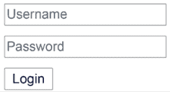
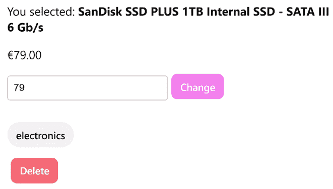
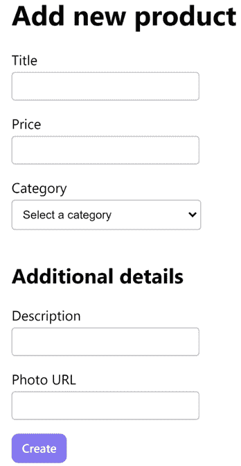
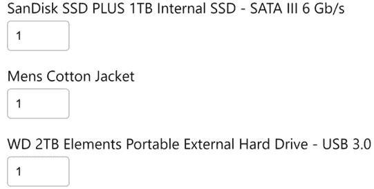
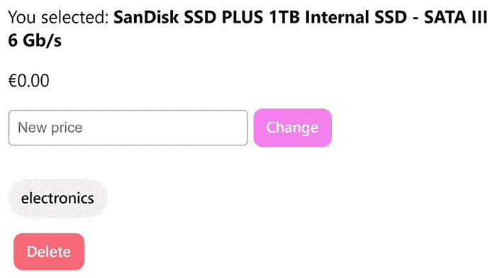
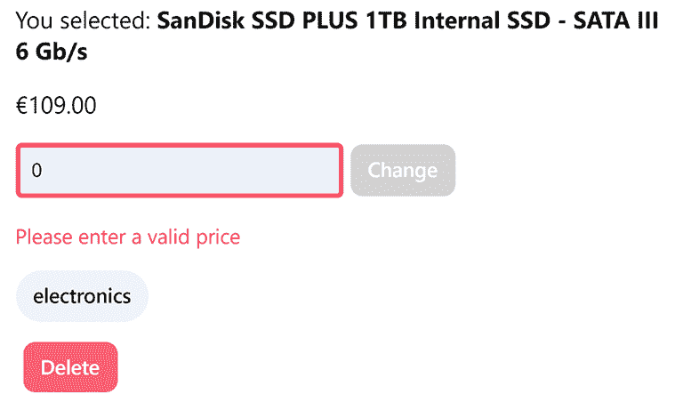
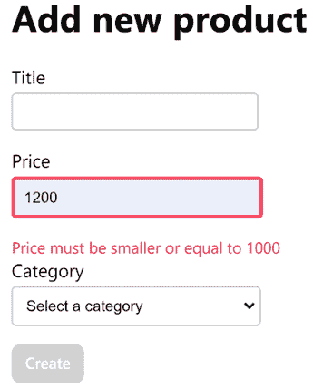
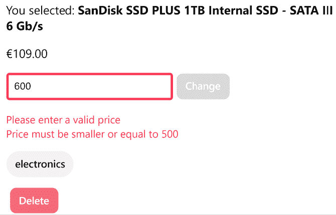

# 第十章：使用表单收集用户数据

网络应用程序使用表单从用户那里收集输入数据。用例多种多样，从允许用户登录、填写支付信息、预订航班，甚至执行搜索。表单数据可以稍后保存在本地存储中或通过后端 API 发送到服务器。

在本章中，我们将介绍以下关于表单的主题：

+   介绍网络表单

+   构建模板驱动表单

+   构建响应式表单

+   使用表单构建器

+   在表单中验证输入

+   操作表单状态

# 技术要求

本章包含各种代码示例，引导你创建和管理 Angular 中的表单。你可以在以下 GitHub 仓库的`ch10`文件夹中找到相关源代码：

[`www.github.com/PacktPublishing/Learning-Angular-Fifth-Edition`](https://www.github.com/PacktPublishing/Learning-Angular-Fifth-Edition)

# 介绍网络表单

表单通常具有以下特性，这些特性可以增强网络应用程序的用户体验：

+   定义不同类型的输入字段

+   设置不同类型的验证并向用户显示验证错误

+   如果表单处于错误状态，支持不同的数据处理策略

Angular 框架提供了两种处理表单的方法：**模板驱动**和**响应式**。两种方法都没有被认为是更好的；你必须选择最适合你场景的方法。两种方法之间的主要区别在于它们管理数据的方式：

+   **模板驱动表单**：这些表单易于设置并添加到 Angular 应用程序中。它们仅通过组件模板来创建元素和配置验证规则；因此，它们不易于测试。它们还依赖于框架的变更检测机制。

+   **响应式表单**：在扩展和测试时更为稳健。它们在组件类中操作，以管理输入控件和设置验证规则。它们还使用中间表单模型来操作数据，保持其不可变性质。如果你广泛使用响应式编程技术，或者你的 Angular 应用程序包含许多表单，那么这项技术适合你。

网络应用程序中的表单由一个包含用于输入数据的 HTML 元素（如`<input>`和`<select>`元素）以及用于与数据交互的`<button>`元素的`<form>`HTML 元素组成。表单可以本地检索和保存数据，或将其发送到服务器进行进一步处理。以下是一个用于在 Web 应用程序中登录用户的简单表单示例：

```js
<form> 
  <div>
    <input type="text" name="username" placeholder="Username" /> 
  </div> 
  <div>
    <input type="password" name="password" placeholder="Password" /> 
  </div> 
  <button type="submit">Login</button> 
</form> 
```

前面的表单有两个`<input>`元素：一个用于输入用户名，另一个用于输入密码。`password`字段的类型设置为`password`，这样在输入时输入控件的内容是不可见的。`<button>`元素的类型设置为`submit`，这样表单可以通过用户点击按钮或按下任何输入控件上的*Enter*键来收集数据。

如果我们想要重置表单数据，可以添加另一个具有 `reset` 类型的按钮。

注意，一个 HTML 元素必须位于 `<form>` 元素内部，才能成为其一部分。以下截图显示了在页面上渲染的表单外观：



图 10.1：登录表单

通过使用提供如输入控件中的自动完成或提示用户保存敏感数据等功能的表单，Web 应用程序可以显著提升用户体验。现在我们已经了解了 Web 表单的外观，让我们学习所有这些如何在 Angular 框架中结合在一起。

# 构建模板驱动的表单

模板驱动的表单是两种不同的将表单集成到 Angular 的方式之一。在需要为我们的 Angular 应用程序创建小型和简单表单的情况下，这些功能可能非常强大。

我们在 *第三章* ，*使用组件构建用户界面* 中学习了数据绑定，以及我们如何使用不同类型从 Angular 组件中读取数据并将其写入。在这种情况下，绑定可以是单向的或双向的，称为 **单向绑定**。在模板驱动的表单中，我们可以结合两种方式，创建一个可以同时读取和写入数据的 **双向绑定**。模板驱动的表单提供了 `ngModel` 指令，我们可以在我们的组件中使用它来获得这种行为。要了解更多关于模板驱动的表单，我们将把产品详情组件的更改价格功能转换为与 Angular 表单一起工作。

为了跟随本章的其余部分，你需要我们创建在 *第九章* ，*使用路由导航应用程序* 中的 Angular 应用程序的源代码。

让我们开始吧：

1.  打开 `product-detail.component.ts` 文件，并添加以下 `import` 语句：

    ```js
    import { FormsModule } from '@angular/forms'; 
    ```

我们使用来自 `@angular/forms` npm 包的 `FormsModule` 类将模板驱动的表单添加到 Angular 应用程序中。

1.  在 `@Component` 装饰器的 `imports` 数组中添加 `FormsModule`：

    ```js
    @Component({
      selector: 'app-product-detail',
      imports: [CommonModule, **FormsModule**],
      templateUrl: './product-detail.component.html',
      styleUrl: './product-detail.component.css'
    }) 
    ```

1.  打开 `product-detail.component.html` 文件，并按如下方式修改 `<input>` 元素：

    ```js
    <input placeholder="New price" type="number" name="price" [(ngModel)]="product.price" /> 
    ```

在前面的代码片段中，我们将 `product` 模板变量的 `price` 属性绑定到 `<input>` 元素的 `ngModel` 指令。`name` 属性是必需的，这样 Angular 可以在内部创建一个唯一的表单控件来区分它。

`ngModel` 指令的语法被称为 *香蕉盒*，我们通过以下两个步骤创建它。首先，我们通过括号 `()` 将 `ngModel` 包围起来制作出 *香蕉*。然后，我们通过方括号 `[()]` 将它放入 *盒子* 中。

1.  修改 `<button>` 元素如下：

    ```js
    <button class="secondary" type="submit">Change</button> 
    ```

在前面的代码片段中，我们从 `<button>` 元素中移除了 `click` 事件，因为提交表单将更新价格。我们还添加了 `submit` 类型来表示表单提交可以通过用户点击按钮来实现。

1.  将 `<input>` 和 `<button>` 元素包裹在以下 `<form>` 元素中：

    ```js
    **<form (ngSubmit)="changePrice(product)">**
      <input placeholder="New price" type="number" name="price" [(ngModel)]="product.price" />
      <button class="secondary" type="submit">Change</button>
    **</form>** 
    ```

在前面的代码片段中，我们将 `changePrice` 方法绑定到表单的 `ngSubmit` 事件。如果我们在输入框内按下 *Enter* 键或点击按钮，绑定将触发方法执行。`ngSubmit` 事件是 Angular `FormsModule` 的一部分，它挂钩于 HTML 表单的本地 `submit` 事件。

1.  打开 `product-detail.component.ts` 文件，并按如下方式修改 `changePrice` 方法：

    ```js
    changePrice(product: Product) {
      this.productService.updateProduct(
        product.id,
        product.price
      ).subscribe(() => this.router.navigate(['/products']));
    } 
    ```

1.  使用 `ng serve` 命令运行应用程序，并从列表中选择一个产品。

1.  你会注意到当前产品价格已经显示在输入框中。尝试更改价格，你会注意到当你键入时，产品的当前价格也在变化：



图 10.2：双向绑定

前面图像中所示的应用程序行为是双向绑定和 `ngModel` 的魔法所在。

当 AngularJS 在 2010 年推出时，双向绑定是其最大的卖点。在当时使用纯 JavaScript 和 jQuery 实现该行为是复杂的。

当我们在输入框中键入时，`ngModel` 指令会更新产品价格的价值。新价格会直接反映在模板中，因为我们使用了 Angular 插值语法来显示其值。

在我们的案例中，在输入新价格的同时更新当前产品价格是一种糟糕的用户体验。用户应该能够始终查看产品的当前价格。我们将修改产品详情组件，以便正确显示价格：

1.  打开 `product-detail.component.ts` 文件，并在 `ProductDetailComponent` 类中创建一个 `price` 属性：

    ```js
    price: number | undefined; 
    ```

1.  将 `changePrice` 方法修改为使用 `price` 组件属性：

    ```js
    changePrice(product: Product) {
      this.productService.updateProduct(
        product.id,
        **this.price!**
      ).subscribe(() => this.router.navigate(['/products']));
    } 
    ```

1.  打开 `product-detail.component.html` 文件，并将 `<input>` 元素中的绑定替换为使用新的组件属性：

    ```js
    <input placeholder="New price" type="number" name="price" [(ngModel)]="**price**" /> 
    ```

如果我们运行应用程序并尝试在 **新价格** 输入框中输入新价格，我们会注意到显示的当前价格没有变化。更改价格的功能也像以前一样正常工作。

我们已经看到，当创建小型和简单的表单时，模板驱动的表单非常有用。在下一节中，我们将更深入地探讨 Angular 框架提供的另一种方法：响应式表单。

# 构建响应式表单

如其名所示，响应式表单能够动态地提供对网页表单的访问。它们是考虑到响应性而构建的，其中输入控件及其值可以通过可观察流进行操作。它们还保持表单数据的不可变状态，这使得它们更容易测试，因为我们有信心可以明确且一致地修改表单状态。

响应式表单采用程序化方法来创建表单元素和设置验证规则，通过在组件类中设置一切来实现。在此方法中涉及的 Angular 关键类如下：

+   `FormControl`：表示单个表单控件，例如 `<input>` 元素。

+   `FormGroup`：表示一组表单控件。`<form>` 元素是响应式表单层次结构中最顶层的 `FormGroup`。

+   `FormArray`：表示一组表单控件，就像 `FormGroup` 一样，但可以在运行时进行修改。例如，我们可以根据需要动态添加或删除 `FormControl` 对象。

前面的类都来自 `@angular/forms` npm 包，并包含可用于以下场景的属性：

+   根据表单或控件的状态渲染不同的 UI

+   检查我们是否与表单或控件进行了交互

我们将通过 Angular 应用程序中的示例来探索每个表单类。在下一节中，我们将使用产品创建组件在我们的应用程序中介绍响应式表单：

## 与响应式表单交互

我们构建的 Angular 应用程序包含一个用于添加新产品的组件。该组件使用模板引用变量来收集输入数据。我们将使用 Angular 表单 API 通过响应式表单来完成相同任务：

1.  打开 `product-create.component.ts` 文件并添加以下 `import` 语句：

    ```js
    import { FormControl, FormGroup, ReactiveFormsModule } from '@angular/forms'; 
    ```

1.  在 `@Component` 装饰器的 `imports` 数组中添加 `ReactiveFormsModule` 类：

    ```js
    @Component({
      selector: 'app-product-create',
      imports: [**ReactiveFormsModule**],
      templateUrl: './product-create.component.html',
      styleUrl: './product-create.component.css'
    }) 
    ```

Angular 表单库提供了 `ReactiveFormsModule` 类，用于在 Angular 应用程序中创建响应式表单。

1.  在 `ProductCreateComponent` 类中定义以下 `productForm` 属性：

    ```js
    productForm = new FormGroup({
      title: new FormControl('', { nonNullable: true }),
      price: new FormControl<number | undefined>(undefined, { nonNullable: true }),
      category: new FormControl('', { nonNullable: true })
    }); 
    ```

`FormGroup` 构造函数接受一个包含表单控件键值对的对象。键是唯一的控件名称，值是 `FormControl` 实例。`FormControl` 构造函数接受控件在第一个参数中的默认值。对于 `title` 和 `category` 控件，我们传递一个空字符串，这样我们就不设置任何初始值。对于应该接受数字作为值的 `price` 控件，我们将其初始值设置为 `undefined`。传递给 `FormControl` 的第二个参数是一个对象，它将 `nonNullable` 属性设置为指示控件不接受空值。

1.  在我们创建了表单组和其控件之后，我们需要将它们与模板中相应的 HTML 元素关联起来。打开 `product-create.component.html` 文件，并在 `<input>`、`<select>` 和 `<button>` HTML 元素周围添加以下 `<form>` 元素：

    ```js
    **<form [formGroup]="productForm">**
      <div>
        <label for="title">Title</label>
        <input id="title" #title />
      </div>
      <div>
        <label for="price">Price</label>
        <input id="price" #price type="number" />
      </div>
      <div>
        <label for="category">Category</label>
        <select id="category" #category>
          <option>Select a category</option>
          <option value="electronics">Electronics</option>
          <option value="jewelery">Jewelery</option>
          <option>Other</option>
        </select>
      </div>
      <div>
        <button (click)="createProduct(title.value, price.value, category.value)">Create</button>
      </div>
    **</form>** 
    ```

在前面的模板中，我们使用从 `ReactiveFormsModule` 类导出的 `formGroup` 指令将 `FormGroup` 实例连接到 `<form>` 元素。

1.  `ReactiveFormsModule` 类还导出了 `formControlName` 指令，我们使用它将 `FormControl` 实例连接到 HTML 元素。按照以下方式修改表单 HTML 元素：

    ```js
    <div>
      <label for="title">Title</label>
      <input id="title" **formControlName="title"** />
    </div>
    <div>
      <label for="price">Price</label>
      <input id="price" **formControlName="price"** type="number" />
    </div>
    <div>
      <label for="category">Category</label>
      <select id="category" **formControlName="category"**>
        <option>Select a category</option>
        <option value="electronics">Electronics</option>
        <option value="jewelery">Jewelery</option>
        <option>Other</option>
      </select>
    </div> 
    ```

在前面的代码片段中，我们将`formControlName`指令的值设置为相应的`FormControl`实例的名称。我们还删除了模板引用变量，因为我们可以直接从`FormGroup`实例获取它们的值。

1.  根据需要在`product-create.component.ts`文件中修改`createProduct`方法：

    ```js
    createProduct() {
      this.productsService.addProduct(this.productForm.value).subscribe(() => {
        this.router.navigate(['/products']);
      });
    } 
    ```

在前面的方法中，我们使用`FormGroup`类的`value`属性来获取表单值。

注意，`value`属性不包括表单禁用字段的值。相反，我们可以使用`getRawValue`方法来返回所有字段的值。

在这种情况下，我们可以使用表单值，因为表单模型与`Product`接口相同。

如果它不同，我们可以使用`FormGroup`类的`controls`属性来单独获取表单控件值，如下所示：

```js
createProduct() {
  this.productsService.addProduct({
    **title: this.productForm.controls.title.value,**
 **price: this.productForm.controls.price.value,**
 **category: this.productForm.controls.category.value**
  }).subscribe(() => {
    this.router.navigate(['/products']);
  });
} 
```

`FormControl`类包含一个`value`属性，它返回表单控件的值。

1.  在`product-create.component.html`文件中修改`<form>`元素，以便在表单提交时创建新产品：

    ```js
    <form [formGroup]="productForm" **(ngSubmit)="createProduct()"**>
      <div>
        <label for="title">Title</label>
        <input id="title" formControlName="title" />
      </div>
      <div>
        <label for="price">Price</label>
        <input id="price" formControlName="price" type="number" />
      </div>
      <div>
        <label for="category">Category</label>
        <select id="category" formControlName="category">
          <option>Select a category</option>
          <option value="electronics">Electronics</option>
          <option value="jewelery">Jewelery</option>
          <option>Other</option>
        </select>
      </div>
      <div>
        <button **type="submit"**>Create</button>
      </div>
    </form> 
    ```

1.  打开全局`styles.css`文件并添加以下 CSS 样式：

    ```js
    label {
      margin-bottom: 4px;
      display: block;
    } 
    ```

我们希望前面的样式在全局范围内可用，因为我们将在本章后面的购物车组件中使用它们。

1.  打开`product-create.component.css`文件并删除`<label>`标签的样式。

如果我们运行应用程序，我们会看到添加新产品的功能仍然按预期工作。

我们了解到`FormGroup`类将一组表单控件分组。表单控件可以是一个单独的表单控件或另一个表单组，正如我们将在下一节中看到的。

## 创建嵌套表单层次结构

产品创建组件由一个包含三个表单控件的单一表单组组成。在企业应用程序中，某些用例需要更高级的表单，这些表单涉及创建嵌套的表单组层次结构。考虑以下表单，它用于添加新产品及其附加详细信息：



图 10.3：带有附加信息的新产品表单

前面的表单可能看起来像一个单一的表单组，但如果我们深入查看组件类，我们会看到`productForm`由两个`FormGroup`实例组成，一个嵌套在另一个内部：

```js
productForm = new FormGroup({
  title: new FormControl('', { nonNullable: true }),
  price: new FormControl<number | undefined>(undefined, { nonNullable: true }),
  category: new FormControl('', { nonNullable: true }),
  **extra: new FormGroup({**
    **image: new FormControl(''),**
    **description: new FormControl('')**
  **})**
}); 
```

`productForm`属性是父表单组，而`extra`是其子项。一个父表单组可以有它需要的任意多个子表单组。如果我们查看组件模板，我们会看到子表单组与父表单组定义不同：

```js
<form [formGroup]="productForm" (ngSubmit)="createProduct()">
  <div>
    <label for="title">Title</label>
    <input id="title" formControlName="title" />
  </div>
  <div>
    <label for="price">Price</label>
    <input id="price" formControlName="price" type="number" />
  </div>
  <div>
    <label for="category">Category</label>
    <select id="category" formControlName="category">
      <option>Select a category</option>
      <option value="electronics">Electronics</option>
      <option value="jewelery">Jewelery</option>
      <option>Other</option>
    </select>
  </div>
  <h2>Additional details</h2>
  **<form formGroupName="extra">**
    **<div>**
      **<label for="descr">Description</label>**
      **<input id="descr" formControlName="description" />**
    **</div>**
    **<div>**
      **<label for="photo">Photo URL</label>**
      **<input id="photo" formControlName="image" />**
    **</div>**
  **</form>**
  <div>
    <button type="submit">Create</button>
  </div>
</form> 
```

在前面的 HTML 模板中，我们使用`formGroupName`指令将内部表单元素绑定到`extra`属性。

你可能期望直接将其绑定到 `productForm.extra` 属性，但 Angular 非常聪明，因为它理解 `extra` 是 `productForm` 的子表单组。它能推断出这个信息，因为与 `extra` 相关的表单元素位于绑定到 `productForm` 属性的表单元素内部。

在嵌套表单层次结构中，子表单组的值与其父表单共享。在我们的例子中，`extra` 表单组的值将包含在 `productForm` 组中，从而保持一致的表单模型。

我们已经涵盖了 `FormGroup` 和 `FormControl` 类。在下一节中，我们将学习如何使用 `FormArray` 类与动态表单进行交互。

## 动态修改表单

考虑以下场景：我们在我们的电子商务应用的购物车中添加了一些产品，并想在结账前更新它们的数量。

目前，我们的应用程序没有购物车的任何功能，因此我们现在将添加一个：

1.  运行以下命令以创建 `Cart` 接口：

    ```js
    ng generate interface Cart 
    ```

1.  打开 `cart.ts` 文件，并按如下方式修改 `Cart` 接口：

    ```js
    export interface Cart {
     **id: number;**
      **products: { productId :number }[];**
    } 
    ```

在前面的代码片段中，`products` 属性将包含属于当前购物车的产品 ID。

1.  通过运行以下 Angular CLI 命令创建一个新的服务来管理购物车：

    ```js
    ng generate service cart 
    ```

1.  打开 `cart.service.ts` 文件，并按如下方式修改 `import` 语句：

    ```js
    import { Injectable, **inject** } from '@angular/core';
    **import { HttpClient } from '@angular/common/http';**
    **import { Observable, defer, map } from 'rxjs';**
    **import { Cart } from './cart';**
    **import { APP_SETTINGS } from './app.settings';** 
    ```

1.  在 `CartService` 类中创建以下属性：

    ```js
    cart: Cart | undefined;
    private cartUrl = inject(APP_SETTINGS).apiUrl + '/carts'; 
    ```

`cartUrl` 属性用于 Fake Store API 的购物车端点，而 `cart` 属性用于保存用户购物车的本地缓存。

1.  在 `constructor` 中注入 `HttpClient` 服务：

    ```js
    constructor(**private http: HttpClient**) { } 
    ```

1.  添加以下方法以将产品添加到购物车：

    ```js
    addProduct(id: number): Observable<Cart> {
      const cartProduct = { productId: id, quantity: 1 };

      return defer(() =>
        !this.cart
        ? this.http.post<Cart>(this.cartUrl, { products: [cartProduct] })
        : this.http.put<Cart>(`${this.cartUrl}/${this.cart.id}`, {
          products: [
            ...this.cart.products,
            cartProduct
          ]
        })
      ).pipe(map(cart => this.cart = cart));
    } 
    ```

在前一种方法中，我们使用了一个名为 `defer` 的新 RxJS 操作符。`defer` 操作符在观察者中充当 if/else 语句的作用。

如果 `cart` 属性尚未初始化，这意味着我们的购物车目前为空，我们将向 API 发起一个 POST 请求，并将 `cartProduct` 变量作为参数传递。否则，我们将发起一个包含 `cartProduct` 以及购物车中现有产品的 PATCH 请求。

我们已经完成了服务的设置，使其能够与 Fake Store API 进行通信。现在，我们需要将服务与相应的组件连接起来：

1.  打开 `product-detail.component.ts` 文件，并添加以下 `import` 语句：

    ```js
    import { CartService } from '../cart.service'; 
    ```

1.  在 `ProductDetailComponent` 类中注入 `CartService`：

    ```js
    constructor(
      private productService: ProductsService,
      public authService: AuthService,
      private route: ActivatedRoute,
      private router: Router,
      **private cartService: CartService**
    ) { } 
    ```

1.  修改 `addToCart` 方法，使其调用 `CartService` 类的 `addProduct` 方法：

    ```js
    addToCart(**id: number**) {
      **this.cartService.addProduct(id).subscribe();**
    } 
    ```

1.  最后，打开 `product-detail.component.html` 文件，并修改 `Add to cart` 按钮的 `click` 事件：

    ```js
    <button (click)="addToCart(**product.id**)">Add to cart</button> 
    ```

我们已经实现了存储用户想要购买的产品的基本功能。现在，我们必须修改购物车组件以显示购物车项目：

1.  打开 `cart.component.ts` 文件，并按如下方式修改 `import` 语句：

    ```js
    import { Component, **OnInit** } from '@angular/core';
    **import {**
      **FormArray,**
      **FormControl,**
      **FormGroup,**
      **ReactiveFormsModule**
    **} from '@angular/forms';**
    **import { Product } from '../product';**
    **import { CartService } from '../cart.service';**
    **import { ProductsService } from '../products.service';** 
    ```

1.  在`@Component`装饰器的`imports`数组中添加`ReactiveFormsModule`类：

    ```js
    @Component({
      selector: 'app-cart',
      imports: [**ReactiveFormsModule**],
      templateUrl: './cart.component.html',
      styleUrl: './cart.component.css'
    }) 
    ```

1.  将`OnInit`接口添加到`CartComponent`类的实现接口列表中：

    ```js
    export class CartComponent **implements OnInit** 
    ```

1.  在 TypeScript 类中创建以下属性：

    ```js
    cartForm = new FormGroup({
      products: new FormArray<FormControl<number>>([])
    });
    products: Product[] = []; 
    ```

在前面的代码片段中，我们创建了一个包含`products`属性的`FormGroup`对象。我们将`products`属性的值设置为`FormArray`类的实例。`FormArray`类的构造函数接受一个参数，该参数是一个具有`number`类型的`FormControl`实例列表。目前这个列表是空的，因为购物车中没有产品。`FormGroup`实例外的`products`属性将用于查找原因，以显示购物车中每个产品的标题。

1.  添加一个`constructor`来注入以下服务：

    ```js
    constructor(
      private cartService: CartService,
      private productsService: ProductsService
    ) {} 
    ```

1.  创建以下方法以从购物车获取产品：

    ```js
    private getProducts() {
      this.productsService.getProducts().subscribe(products => {
        this.cartService.cart?.products.forEach(item => {
          const product = products.find(p => p.id === item.productId);
          if (product) {
            this.products.push(product);
          }
        });
      });
    } 
    ```

在前面的方法中，我们最初订阅了`ProductsService`类的`getProducts`方法以获取可用产品。然后，对于购物车中的每个产品，我们提取`productId`属性并检查它是否在购物车中存在。如果找到产品，我们就将其添加到`products`组件属性中。

1.  创建另一个方法来构建我们的表单：

    ```js
    private buildForm() {
      this.products.forEach(() => {
        this.cartForm.controls.products.push(
          new FormControl(1, { nonNullable: true })
        );
      });
    } 
    ```

在前面的方法中，我们遍历`products`属性并为`products`表单数组中的每个产品添加一个`FormControl`实例。我们将每个表单控件的值设置为`1`，以表示购物车默认包含每种产品的一个项目。

1.  创建以下`ngOnInit`方法，该方法结合了*步骤 6*和*步骤 7*：

    ```js
    ngOnInit(): void {
      this.getProducts();
      this.buildForm();
    } 
    ```

1.  打开`cart.component.html`文件，并用以下内容替换其 HTML 模板：

    ```js
    <div [formGroup]="cartForm">
      <div formArrayName="products">
        @for(product of cartForm.controls.products.controls; track $index) {
          <label>{{products[$index].title}}</label>
          <input [formControlName]="$index" type="number" />
        }
      </div>
    </div> 
    ```

在前面的模板中，我们使用`@for`块遍历`products`表单数组的`controls`属性并为每个创建一个`<input>`元素。我们使用`@for`块的`$index`关键字通过`formControlName`绑定动态地为每个表单控件提供一个名称。我们还添加了一个`<label>`标签，用于显示`products`组件属性中的产品标题。产品标题是通过使用数组中当前产品的`$index`获取的。

1.  最后，打开`cart.component.css`文件并添加以下 CSS 样式：

    ```js
    :host {
      width: 500px;
    }
    input {
      width: 50px;
    } 
    ```

要查看购物车组件的实际效果，请使用`ng serve`命令运行应用程序并将一些产品添加到购物车中。

不要忘记先登录，因为将产品添加到购物车的功能仅对认证用户可用。

在将一些产品添加到购物车后，点击**我的购物车**链接以查看您的购物车。它应该看起来像以下这样：



图 10.4：购物车

由于我们已经为管理购物车建立了业务逻辑，我们也可以更新上一章中创建的结账守卫：

1.  打开`checkout.guard.ts`文件并添加以下`import`语句：

    ```js
    import { inject } from '@angular/core';
    import { CartService } from './cart.service'; 
    ```

1.  使用以下语句在`checkoutGuard`函数中注入`CartService`类：

    ```js
    const cartService = inject(CartService); 
    ```

1.  修改`checkoutGuard`箭头函数的剩余部分，以便仅在购物车不为空时显示确认对话框：

    ```js
    **if (cartService.cart) {**
      const confirmation = confirm(
        'You have pending items in your cart. Do you want to continue?'
      );
      return confirmation;
    **}**
    **return true;** 
    ```

使用`FormArray`，我们已经完成了对 Angular 表单最基本构建块的探索。我们学习了如何使用 Angular 表单类创建结构化 Web 表单并收集用户输入。在下一节中，我们将学习如何使用`FormBuilder`服务构建 Angular 表单。

## 使用表单构建器

使用表单类构建 Angular 表单可能会在复杂场景中变得重复和繁琐。Angular 框架提供了`FormBuilder`，这是一个内置的 Angular 表单服务，包含用于构建表单的辅助方法。让我们看看我们如何使用它来构建创建新产品的表单：

1.  打开`product-create.component.ts`文件并导入`OnInit`和`FormBuilder`组件：

    ```js
    import { Component, **OnInit** } from '@angular/core';
    import { FormControl, FormGroup, ReactiveFormsModule, **FormBuilder** } from '@angular/forms'; 
    ```

1.  将`OnInit`添加到`ProductCreateComponent`类实现的接口列表中：

    ```js
    export class ProductCreateComponent **implements OnInit** 
    ```

1.  在`constructor`中注入`FormBuilder`类：

    ```js
    constructor(
      private productsService: ProductsService,
      private router: Router,
      **private builder: FormBuilder**
    ) {} 
    ```

1.  按照以下方式修改`productForm`属性：

    ```js
    productForm: FormGroup<{
      title: FormControl<string>,
      price: FormControl<number | undefined>,
      category: FormControl<string>
    }> | undefined; 
    ```

在前面的代码片段中，我们只定义了表单的结构，因为它现在将使用`FormBuilder`服务创建。

1.  创建以下方法来构建表单：

    ```js
    private buildForm() {
      this.productForm = this.builder.nonNullable.group({
        title: [''],
        price: this.builder.nonNullable.control<number | undefined>(undefined),
        category: ['']
      });
    } 
    ```

在前面的方法中，我们使用`FormBuilder`类的`nonNullable`属性创建一个不能为空的表单组。`group`方法用于组合表单控件。`title`和`category`表单控件使用空字符串作为默认值创建。`price`表单控件采用与其他不同的方法，因为我们不能因为 TypeScript 语言限制而分配`undefined`作为默认值。在这种情况下，我们使用`nonNullable`属性的`control`方法来定义表单控件。

1.  将`ngOnInit`生命周期钩子添加到执行`buildForm`方法：

    ```js
    ngOnInit(): void {
      this.buildForm();
    } 
    ```

1.  在`createProduct`方法中访问`productForm`属性时添加非空断言运算符：

    ```js
    createProduct() {
      this.productsService.addProduct(this.**productForm!**.value).subscribe(() => {
        this.router.navigate(['/products']);
      });
    } 
    ```

1.  打开`product-create.component.html`文件，并在`<form>`HTML 元素中也添加非空断言运算符：

    ```js
    <form [formGroup]="**productForm!**" (ngSubmit)="createProduct()">
      <div>
        <label for="title">Title</label>
        <input id="title" formControlName="title" />
      </div>
      <div>
        <label for="price">Price</label>
        <input id="price" formControlName="price" type="number" />
      </div>
      <div>
        <label for="category">Category</label>
        <select id="category" formControlName="category">
          <option>Select a category</option>
          <option value="electronics">Electronics</option>
          <option value="jewelery">Jewelery</option>
          <option>Other</option>
        </select>
      </div>
      <div>
        <button type="submit">Create</button>
      </div>
    </form> 
    ```

使用`FormBuilder`服务创建 Angular 表单时，我们不需要显式处理`FormGroup`和`FormControl`数据类型，尽管底层正在创建这些类型。

使用`ng serve`命令运行应用程序，并验证新产品创建过程是否正确工作。尝试在不输入任何表单控件值的情况下点击**创建**按钮，并观察产品列表中的情况。应用程序创建了一个标题为空的产物。这是我们应在实际场景中避免的情况。我们应该意识到表单控件的状态并相应地采取行动。

本章其余部分的示例代码在处理响应式表单时没有使用`FormBuilder`服务。

在下一节中，我们将调查我们可以检查的不同属性，以获取表单状态并向用户提供反馈。

# 在表单中验证输入

一个 Angular 表单应该验证输入并提供视觉反馈以增强用户体验并指导用户成功完成表单。我们将探讨以下在 Angular 应用程序中验证表单的方法：

+   使用 CSS 的全局验证

+   组件类中的验证

+   组件模板中的验证

+   构建自定义验证器

在下一节中，我们将学习如何在 Angular 应用程序中使用 CSS 样式全局应用验证规则。

## 使用 CSS 的全局验证

Angular 框架在表单和模板驱动或响应式表单中自动设置以下 CSS 类，我们可以使用它们来提供用户反馈：

+   `ng-untouched` : 表示我们尚未与表单交互

+   `ng-touched` : 表示我们已与表单交互

+   `ng-dirty` : 表示我们已经向表单设置了一个值

+   `ng-pristine` : 表示我们尚未修改表单

此外，Angular 还会在表单控制的 HTML 元素上添加以下类：

+   `ng-valid` : 表示表单的值有效

+   `ng-invalid` : 表示表单的值无效

Angular 根据其状态在表单及其控件中设置上述 CSS 类。表单状态是根据其控件的状态评估的。例如，如果至少有一个表单控件无效，Angular 将设置`ng-invalid` CSS 类到表单和相应的控件。

在嵌套表单层次结构的情况下，子表单组的状态会冒泡到层次结构中，并与父表单共享。

我们可以使用内置的 CSS 类和仅使用 CSS 来样式化 Angular 表单。例如，为了在第一次与控件交互时在输入控件中显示浅蓝色高亮边框，我们应该添加以下样式：

```js
input.ng-touched {
  border: 3px solid lightblue;
} 
```

我们还可以根据应用程序的需要组合 CSS 类：

1.  打开全局的`styles.css`文件并按如下方式修改`input.valid`样式：

    ```js
    input.valid, **input.ng-dirty.ng-valid** {
      border: solid green;
    } 
    ```

上述样式将在用户输入有效值时显示绿色边框。

1.  根据需要修改`input.invalid`样式：

    ```js
    input.invalid, **input.ng-dirty.ng-invalid** {
      border: solid red;
    } 
    ```

上述样式将在用户输入无效值时显示红色边框。

1.  打开`product-create.component.html`文件并在`<input>`表单控件中添加`required`属性：

    ```js
    <div>
      <label for="title">Title</label>
      <input id="title" formControlName="title" **required** />
    </div>
    <div>
      <label for="price">Price</label>
      <input id="price" formControlName="price" type="number" **required** />
    </div> 
    ```

1.  使用`ng serve`命令运行应用程序并导航到`http://localhost:4200/products/new` 。

1.  在**标题**字段中输入一些文本并点击输入控件之外。注意它有一个绿色边框。

1.  从**标题**字段中删除文本并点击输入控件之外。现在边框应该变成红色。

我们学习了如何在模板中使用 CSS 样式定义验证规则。在下一节中，我们将学习如何在模板驱动的表单中定义它们，并使用适当的消息提供视觉反馈。

## 模板驱动的表单验证

在上一节中，我们了解到 Angular 在验证 Angular 表单时添加了一系列内置的 CSS 类。每个类在相应的表单模型中都有一个对应的布尔属性，无论是在模板驱动的表单还是响应式表单中：

+   `untouched`：表示我们尚未与表单交互

+   `touched`：表示我们已与表单交互

+   `dirty`：表示我们已经为表单设置了一个值

+   `pristine`：表示我们尚未修改表单

+   `valid`：表示表单的值有效

+   `invalid`：表示表单的值无效

我们可以利用前面的类来通知用户当前的表单状态。首先，让我们调查产品详情组件中更改价格过程的行为：

1.  运行`ng serve`命令以启动应用程序并导航到`http://localhost:4200`。

1.  从列表中选择一个产品。

1.  在**新价格**输入框中输入一个`0`的值并点击**更改**按钮。

1.  从列表中选择相同的产品并观察输出：



图 10.5：产品详情

组件的展示逻辑未能检测到用户可以为产品价格输入`0`。产品应该始终有一个价格。

产品详情组件需要验证价格值的输入，如果发现输入无效，则禁用**更改**按钮，并向用户显示一条信息消息。

处理验证是个人偏好或业务规范的问题。在这种情况下，我们决定通过禁用按钮并显示适当的消息来展示一种常见的验证方法。

模板驱动的验证是在组件模板中执行的。打开`product-detail.component.html`文件并执行以下步骤：

1.  创建`priceCtrl`模板引用变量并将其绑定到`ngModel`属性：

    ```js
    <input
      placeholder="New price"
      type="number"
      name="price"
      **#priceCtrl="ngModel"**
      [(ngModel)]="price" /> 
    ```

`ngModel`属性使我们能够访问底层表单控件模型。

1.  将`required`和`min`验证属性添加到 HTML 元素：

    ```js
    <input
      placeholder="New price"
      type="number"
      name="price"
      **required min="1"** 
      #priceCtrl="ngModel"
      [(ngModel)]="price" /> 
    ```

`min`验证属性只能与`<input>` HTML 元素中的`number`类型一起使用。它用于在数字控件使用箭头时定义最小值。

1.  在表单的`<button>`元素下方添加以下`<span>`HTML 元素：

    ```js
    @if (priceCtrl.dirty && (priceCtrl.invalid || priceCtrl.hasError('min'))) {
      <span class="help-text">Please enter a valid price</span>
    } 
    ```

当我们输入一个价格值然后留空或输入零时，将显示前面的 HTML 元素。我们使用表单控件模型的`hasError`方法来检查`min`验证是否抛出错误。

所有验证属性都可以使用 `hasError` 方法进行检查。控件的有效性状态是根据我们附加到 HTML 元素的所有验证属性的状态来评估的。

1.  在 `<form>` HTML 元素中添加一个 `priceForm` 模板引用变量，并将其绑定到 `ngForm` 属性：

    ```js
    <form (ngSubmit)="changePrice(product)" **#priceForm="ngForm"**>
      <input
        placeholder="New price"
        type="number"
        name="price"
        required min="1"
        #priceCtrl="ngModel"
        [(ngModel)]="price" />
      <button class="secondary" type="submit">Change</button>
      @if (priceCtrl.dirty && (priceCtrl.invalid || priceCtrl.hasError('min'))) {
        <span class="help-text">Please enter a valid price</span>
      }    
    </form> 
    ```

`ngForm` 属性为我们提供了访问底层表单模型的权限。

1.  将 `<button>` HTML 元素的 `disabled` 属性绑定到表单模型的 `invalid` 状态：

    ```js
    <button
      class="secondary"
      type="submit"
      **[disabled]="priceForm.invalid">**
      Change
    </button> 
    ```

    在前面的模板中，由于表单只有一个控件，我们可以直接绑定到 `priceCtrl.invalid` 状态。出于演示目的，我们选择表单。

1.  打开 `styles.css` 文件，并为 `<span>` 标签和 `disabled` 按钮添加以下 CSS 样式：

    ```js
    .help-text {
      display: flex;
      color: var(--hot-red);
      font-size: 0.875rem;
    }
    button:disabled {
      background-color: lightgrey;
      cursor: not-allowed;
    } 
    ```

为了验证验证是否按预期工作，执行以下步骤：

1.  运行 `ng serve` 命令以启动应用程序，并从列表中选择一个产品。

1.  在 **新价格** 输入框中输入 `0` 并观察输出：



图 10.6：验证错误

1.  输入一个有效值，并验证错误消息是否消失，以及 **更改** 按钮是否被启用。

1.  在 **新价格** 输入框中留空，并验证错误消息是否再次显示，以及 **更改** 按钮是否被禁用。

现在我们已经学习了如何在模板驱动表单中完成验证，让我们看看如何验证响应式表单中的输入数据。

## 响应式表单的验证

模板驱动表单完全依赖于组件模板来执行验证。在响应式表单中，真相之源是我们组件 TypeScript 类中驻留的表单模型。我们在构建 `FormGroup` 实例时程序化地定义响应式表单中的验证规则。

为了演示响应式表单中的验证，我们将在产品创建组件中添加验证规则：

1.  打开 `product-create.component.ts` 文件，并从 `@angular/forms` npm 包中导入 `Validators` 类：

    ```js
    import {
      FormControl,
      FormGroup,
      ReactiveFormsModule,
      **Validators**
    } from '@angular/forms'; 
    ```

1.  修改 `productForm` 属性的声明，以便 `title` 和 `price` 表单控件在 `FormControl` 实例中传递一个 `validators` 属性：

    ```js
    productForm = new FormGroup({
      title: new FormControl('', {
        nonNullable: true,
        **validators: Validators.required**
      }),
      price: new FormControl<number | undefined>(undefined, {
        nonNullable: true,
        **validators: [Validators.required, Validators.min(1)]**
      }),
      category: new FormControl('', { nonNullable: true })
    }); 
    ```

`Validators` 类包含每个可用验证规则的静态字段。它包含几乎与模板驱动表单中可用的相同验证规则。我们可以通过将它们添加到数组中，如 `price` 表单控件中的 `validators` 属性所示，来组合多个验证器。

当我们使用 `FormControl` 类添加验证器时，我们可以从 HTML 模板中删除相应的 HTML 属性。然而，出于可访问性的目的，建议保留它，以便屏幕阅读器应用程序可以使用它。

1.  打开 `product-create.component.html` 文件，并使用 `productForm` 属性的 `invalid` 属性来禁用 **创建** 按钮：

    ```js
    <button type="submit" **[disabled]="productForm.invalid"**>Create</button> 
    ```

1.  在每个`<input>`表单控件中添加一个`<span>` HTML 元素，以在控件被触摸且`required`验证抛出错误时显示错误消息：

    ```js
    <div>
      <label for="title">Title</label>
      <input id="title" formControlName="title" required />
      **@if (productForm.controls.title.touched && productForm.controls.title.invalid) {**
        **<span class="help-text">Title is required</span>**
      **}**
    </div>
    <div>
      <label for="price">Price</label>
      <input id="price" formControlName="price" type="number" required />
      **@if (productForm.controls.price.touched && productForm.controls.price.invalid) {**
    **<span class="help-text">Price is required</span>**
    **}**
    </div> 
    ```

在前面的代码片段中，我们使用`productForm`属性的`controls`属性来访问单个表单控件模型并获取它们的状态。

1.  根据验证规则显示不同的消息会很方便。例如，当`price`控件的`min`验证抛出错误时，我们可以显示一个更具体的消息。我们可以使用前面章节中看到的`hasError`方法来显示这样的消息：

    ```js
    <div>
      <label for="price">Price</label>
      <input id="price" formControlName="price" type="number" required />
      **@if (productForm.controls.price.touched && productForm.controls.price.hasError('required')) {**
        **<span class="help-text">Price is required</span>**
      **}**
      **@if (productForm.controls.price.touched && productForm.controls.price.hasError('min')) {**
        **<span class="help-text">Price should be greater than 0</span>**
      **}**
    </div> 
    ```

Angular 框架提供了一套内置验证器，我们已经在我们的表单中学习了如何使用它们。在下一节中，我们将学习如何为模板驱动和响应式表单创建自定义验证器以满足特定的业务需求。

## 构建自定义验证器

内置验证器可能无法涵盖我们在 Angular 应用程序中可能遇到的所有场景；然而，编写自定义验证器并在 Angular 表单中使用它是很容易的。在我们的例子中，我们将构建一个验证器来检查产品的价格不能超过指定的阈值。

我们可以使用内置的`max`验证器来完成同样的任务。然而，我们将为了学习目的构建验证器函数。

当我们想要使用自定义代码验证表单或控件时，会使用自定义验证器。例如，为了与 API 通信以验证值，或者执行复杂的计算以验证值。

1.  在`src\app`文件夹中创建一个名为`price-maximum.validator.ts`的文件，并添加以下内容：

    ```js
    import { ValidatorFn, AbstractControl, ValidationErrors } from '@angular/forms';
    export function priceMaximumValidator(price: number): ValidatorFn {
      return (control: AbstractControl): ValidationErrors | null => {
        const isMax = control.value <= price;
        return isMax ? null : { priceMaximum: true };
      };
    } 
    ```

表单验证器是一个返回包含指定错误或`null`值的`ValidationErrors`对象的函数。它接受将被应用到的表单控件作为参数。在前面的代码片段中，如果控件值大于通过导出函数的`price`参数传递的特定阈值，它将返回一个验证错误对象。否则，它返回`null`。

验证错误对象的键指定了验证器错误的描述性名称。这是一个我们可以稍后通过控件的`hasError`方法进行检查的名称，以找出它是否有任何错误。验证错误对象的值可以是任何任意值，我们可以将其传递到错误消息中。

1.  打开`product-create.component.ts`文件，并添加以下`import`语句：

    ```js
    import { priceMaximumValidator } from '../price-maximum.validator'; 
    ```

1.  在`price`表单控件的`validators`数组中添加验证器，并将阈值设置为`1000`：

    ```js
    price: new FormControl<number | undefined>(undefined, {
      nonNullable: true,
      validators: [
        Validators.required,
        Validators.min(1),
        **priceMaximumValidator(1000)**
      ]
    }) 
    ```

1.  在`product-create.component.html`文件中为价格表单控件添加一个新的`<span>` HTML 元素：

    ```js
    <div>
      <label for="price">Price</label>
      <input id="price" formControlName="price" type="number" required />
      @if (productForm.controls.price.touched && productForm.controls.price.hasError('required')) {
        <span class="help-text">Price is required</span>
      }
      @if (productForm.controls.price.touched && productForm.controls.price.hasError('min')) {
        <span class="help-text">Price should be greater than 0</span>
      }
      **@if (productForm.controls.price.touched && productForm.controls.price.hasError('priceMaximum')) {**
        **<span class="help-text">Price must be smaller or equal to 1000</span>**
      }
    </div> 
    ```

1.  运行`ng serve`命令以启动应用程序并导航到`http://localhost:4200/products/new`。

1.  在**价格**字段中输入`1200`的值，点击输入框外部，并观察输出结果：



图 10.7：响应式表单中的验证

要在模板驱动的表单中使用价格最大值验证器，我们必须遵循不同的方法，该方法涉及创建 Angular 指令：

1.  运行以下命令创建 Angular 指令：

    ```js
    ng generate directive price-maximum 
    ```

前面的指令将作为我们已创建的`priceMaximumValidator`函数的包装器。

1.  打开`price-maximum.directive.ts`文件并按如下方式修改`import`语句：

    ```js
    import { Directive, **input, numberAttribute** } from '@angular/core';
    **import { AbstractControl, NG_VALIDATORS, ValidationErrors, Validator****} from '@angular/forms';** 
    **import { priceMaximumValidator } from './price-maximum.validator';** 
    ```

1.  在`@Directive`装饰器中添加`NG_VALIDATORS`提供者：

    ```js
    @Directive({
      selector: '[appPriceMaximum]',
      **providers: [**
        **{**
          **provide: NG_VALIDATORS,**
          **useExisting: PriceMaximumDirective,**
          **multi: true**
        **}**
      **]**
    }) 
    ```

`NG_VALIDATORS`令牌是 Angular 表单的内置令牌，它帮助我们注册 Angular 指令作为表单验证器。在上面的代码片段中，我们使用提供者配置中的`multi`属性，因为我们可以使用`NG_VALIDATORS`令牌注册多个指令。

1.  在`PriceMaximumDirective`类的实现接口中添加`Validator`接口：

    ```js
    export class PriceMaximumDirective **implements Validator** 
    ```

1.  添加以下输入属性，该属性将用于传递最大阈值值：

    ```js
    appPriceMaximum = input(undefined, {
      alias: 'threshold',
      transform: numberAttribute
    }); 
    ```

在前面的属性中，我们将包含两个属性配置对象作为`input`函数的参数。`alias`属性定义了我们将用于绑定的输入属性名称。`transform`属性用于将输入属性值转换为不同类型。`numberAttribute`是 Angular 框架的内置函数，它将输入属性值转换为数字。

Angular 还包含`booleanAttribute`函数，该函数将输入属性值解析为布尔值。

1.  按如下方式实现`Validator`接口的`validate`方法：

    ```js
    validate(control: AbstractControl): ValidationErrors | null {
      return this.appPriceMaximum
        ? priceMaximumValidator(this.appPriceMaximum()!)(control)
        : null;
    } 
    ```

`validate`方法的签名与`priceMaximumValidator`函数返回的函数相同。它检查`appPriceMaximum`输入属性，并根据情况将值委托给`priceMaximumValidator`函数。

我们将在产品详情组件中使用我们创建的新指令：

1.  打开`product-detail.component.ts`文件并添加以下`import`语句：

    ```js
    import { PriceMaximumDirective } from '../price-maximum.directive'; 
    ```

1.  在`@Component`装饰器的`imports`数组中添加`PriceMaximumDirective`类：

    ```js
    @Component({
      selector: 'app-product-detail',
      imports: [
        CommonModule,
        FormsModule,
        **PriceMaximumDirective**
      ],
      templateUrl: './product-detail.component.html',
      styleUrl: './product-detail.component.css'
    }) 
    ```

1.  打开`product-detail.component.html`文件并在`<input>`HTML 元素中添加新的验证器：

    ```js
    <input
      placeholder="New price"
      type="number"
      name="price"
      required min="1"
      **appPriceMaximum threshold="500"**
      #priceCtrl="ngModel"
      [(ngModel)]="price" /> 
    ```

1.  添加一个新的`<span>`HTML 元素，当验证器抛出错误时显示不同的消息：

    ```js
    @if (priceCtrl.dirty && priceCtrl.hasError('priceMaximum')) {
      <span class="help-text">Price must be smaller or equal to 500</span>
    } 
    ```

1.  运行`ng serve`命令以启动应用程序并从列表中选择一个产品。

1.  在**新价格**输入框中输入值`600`并观察输出：



图 10.8：模板驱动表单中的验证

Angular 自定义验证可以同步或异步工作。在本节中，我们学习了如何使用前者。异步验证是一个高级主题，我们不会在本书中涉及。然而，你可以在[`angular.dev/guide/forms/form-validation#creating-asynchronous-validators`](https://angular.dev/guide/forms/form-validation#creating-asynchronous-validators)了解更多信息。

在下一节中，我们将探讨操作 Angular 表单的状态。

# 操作表单状态

Angular 表单的状态在模板驱动和响应式表单之间有所不同。在前者中，状态是一个普通对象，而在后者中，它保存在表单模型中。在本节中，我们将学习以下概念：

+   更新表单状态

+   对状态变化做出反应

我们将首先探讨如何更改表单状态。

## 更新表单状态

在模板驱动的表单中处理表单状态相对简单。我们必须与绑定到表单控件`ngModel`指令的组件属性进行交互。

在响应式表单中，我们可以使用`FormControl`实例的`value`属性或`FormGroup`类的以下方法来更改整个表单中的值：

+   `setValue`：替换表单中所有控件的值

+   `patchValue`：更新表单中特定控件的值

`setValue`方法接受一个对象作为参数，该对象包含所有表单控件的键值对。如果我们想以编程方式在产品创建组件中填写产品的详细信息，以下代码片段可以作为示例：

```js
this.productForm.setValue({
  title: 'TV monitor',
  price: 600,
  category: 'electronics'
}); 
```

在前面的代码片段中，传递给`setValue`方法的对象中的每个键都必须与每个表单控件的名称匹配。如果我们省略一个，Angular 将抛出错误。

如果我们想填写一些产品的详细信息，可以使用`patchValue`方法：

```js
this.productForm.patchValue({
  title: 'TV monitor',
  category: 'electronics'
}); 
```

`FormGroup`类的`setValue`和`patchValue`方法帮助我们设置表单中的数据。

表单的另一个有趣方面是，当这些值发生变化时，我们可以收到通知，正如我们将在下一节中看到的那样。

## 对状态变化做出反应

在使用 Angular 表单时，一个常见的场景是我们希望在表单控件的值变化时触发副作用。副作用可以是以下任何一种：

+   要更改表单控件的值

+   为了发起一个 HTTP 请求来过滤表单控件的值

+   为了启用/禁用组件模板的某些部分

在模板驱动的表单中，我们可以使用`ngModel`指令的扩展版本来在值变化时得到通知。`ngModel`指令包含以下可绑定属性：

+   `ngModel`：一个输入属性，用于将值传递到控件

+   `ngModelChange`：当控件值变化时得到通知的输出属性

我们可以在产品详情组件的`<input>`HTML 元素中以下方式编写`ngModel`绑定：

```js
<input
  placeholder="New price"
  type="number"
  name="price"
  required min="1"
  appPriceMaximum threshold="500"
  #priceCtrl="ngModel"
  **[ngModel]="price"**
  **(ngModelChange)="price = $event"** /> 
```

在前面的代码片段中，我们使用属性绑定设置了`ngModel`输入属性的值，并使用事件绑定设置了`price`组件属性的值。Angular 会自动触发`ngModelChange`事件，并将新值包含在`$event`属性中。当价格表单控件的值发生变化时，我们可以使用`ngModelChange`事件在我们的组件中进行任何副作用。

在响应式表单中，我们使用基于可观察的 API 来响应状态变化。`FormGroup`和`FormControl`类包含`valueChanges`可观察流，我们可以使用它来订阅并在表单或控件的值发生变化时接收通知。

我们将使用它来在类别更改时重置产品创建组件中`price`表单控件的值：

1.  打开`product-create.component.ts`文件并从`@angular/core` npm 包中导入`OnInit`实体：

    ```js
    import { Component, **OnInit** } from '@angular/core'; 
    ```

1.  将`OnInit`接口添加到`ProductCreateComponent`类实现的接口列表中：

    ```js
    export class ProductCreateComponent **implements OnInit** 
    ```

1.  创建以下`ngOnInit`方法以订阅`category`表单控件的`valueChanges`属性：

    ```js
    ngOnInit(): void {
      this.productForm.controls.category.valueChanges.subscribe(() => {
        this.productForm.controls.price.reset();
      });
    } 
    ```

在前面的方法中，我们通过使用`FormControl`类的`reset`方法来重置`price`表单控件的值。

`FormControl`类的`valueChanges`属性是一个标准的可观察流。当组件被销毁时，不要忘记取消订阅。

当然，我们还可以使用`valueChanges`可观察流做更多的事情；例如，我们可以通过将其发送到后端 API 来检查产品标题是否已被预留。然而，希望前面的例子已经传达了如何利用表单的响应性特性并相应地做出反应。

# 摘要

在本章中，我们了解到 Angular 提供了两种不同的创建表单的方法——模板驱动和响应式——并且没有一种方法比另一种更好。我们探讨了如何构建每种类型的表单以及如何对输入数据进行验证，并涵盖了自定义验证以实现额外的验证场景。我们还学习了如何更新表单的状态以及当状态中的值发生变化时如何做出反应。

在下一章中，我们将探讨处理应用程序错误的各种方法。错误处理是 Angular 应用程序的一个非常重要的特性，并且可能具有不同的来源和原因，正如我们将看到的。
